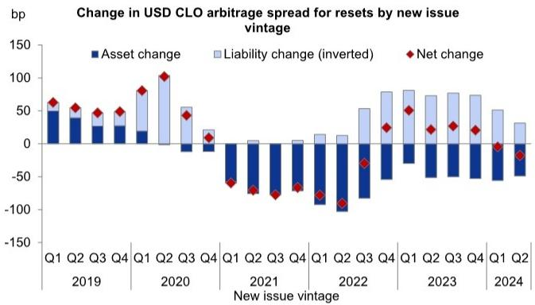
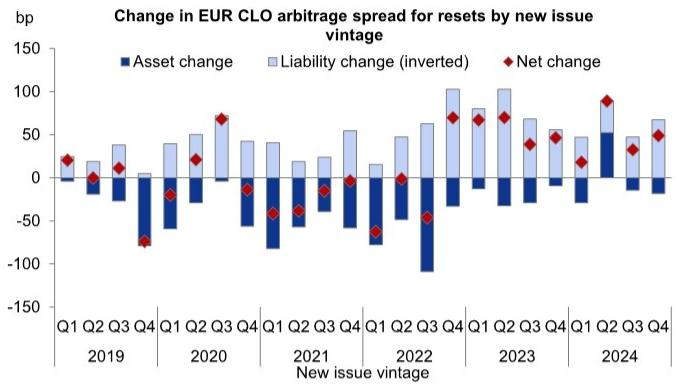
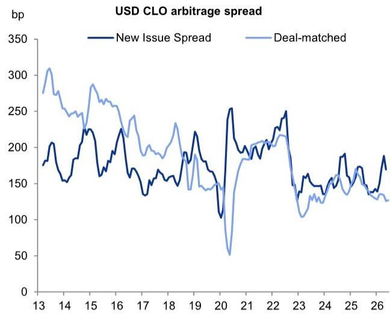

# The CLO Arbitrage Spread Is Tightening, but the Real Story Lies in How Managers, Markets, and Reset Economics Diverge

For collateralized loan obligation investors, the arbitrage spread has long served as the single most important metric for gauging the attractiveness of equity origination, performance, and valuation. It is the difference between the income generated by the underlying loan portfolio and the cost of the debt used to finance it. When that spread is wide, equity looks cheap; when it narrows, the risk-return calculus shifts. But the traditional measure of this spread has become dangerously misleading. By comparing new-issue loan spreads to the weighted-average cost of CLO debt, it fails to capture the actual excess spread embedded in newly created transactions. The gap between what the market signals and what managers actually achieve has widened, and the implications for investors are profound.

A new deal-matched arbitrage measure, constructed from tranche-level data, reveals a more structurally compressed opportunity set than conventional metrics suggest. In the USD broadly syndicated loan market, arbitrage spreads have tightened secularly as the market has matured. The growing role of captive equity capital is a key driver, and it is changing the behavior of the equity base in ways that reduce the sensitivity of demand to spot conditions. In the EUR market, arbitrage spreads appear optically wider, but this is not a free lunch. Weaker regional fundamentals mean that much of that apparent excess spread may simply be compensation for higher credit losses.

The central argument is this: the traditional arbitrage spread is no longer fit for purpose. Investors who rely on it alone will misjudge the true economics of CLO equity, underestimate the impact of reset and refinancing activity, and fail to differentiate between managers who can and cannot capture value. The deal-matched measure is not just a refinement; it is a necessary correction.

## Captive Equity Capital Has Fundamentally Compressed USD Arbitrage Spreads, Altering the Structural Attractiveness of the Market

The most striking finding from the deal-matched analysis is the secular tightening of USD CLO arbitrage spreads. While the traditional new-issue measure shows a narrowing, the deal-matched measure reveals a more pronounced compression. This is not a cyclical phenomenon driven by technical demand or low net loan supply, though those factors play a role. The structural driver is the growth of captive equity funds.

Captive equity capital is committed by firms that typically invest across multiple vintages and cede deployment discretion to the originating manager. These vehicles reduce the sensitivity of equity demand to spot arbitrage conditions. When a manager can count on a stable equity base that prioritizes vintage diversification and continuity of deployment over maximizing entry spread on any single transaction, the pressure to offer wide arbitrage spreads diminishes. The result is a market where non-return-seeking participants effectively depress equity returns for everyone else.

For investors who trade and choose their equity investments on a deal-by-deal basis, this is a critical development. Less attractive starting spreads reduce the headroom for credit losses. The relationship between spot arbitrage and realized CLO equity returns is not mechanical, but the starting point matters. A tighter arbitrage spread means less margin for error. The USD market has become a more challenging environment for discretionary equity investors, and the trend shows no sign of reversing.

## Wider EUR Arbitrage Spreads Are Not a Free Lunch; Structural Cheapness Must Be Weighed Against Weaker Fundamentals

The EUR CLO market presents a contrasting picture. Deal-matched arbitrage spreads are wider than in USD, and the gap has persisted. At first glance, this makes EUR equity look structurally cheaper. However, the key tension is that the apparent cheapness is a function of both wider debt costs and wider asset spreads. It is not simply a sign of more attractive economics.

The fundamental picture in the EUR loan market is less supportive. Default rates have risen over the past two years, while USD defaults have come off their 2024 peak. Forecasts point to slightly higher EUR defaults going forward, driven by a less favorable policy and macroeconomic mix. Loan prices in EUR are also rich relative to their USD peers. This means that some of the wider arbitrage spread will likely be consumed by credit losses. The excess spread is not a free lunch; it is compensation for risk.

For liability investors, the picture is more nuanced. Wider EUR arbitrage spreads do not automatically translate into negative outcomes for CLO debt. Across the stack, EUR investment-grade tranches offer positive carry relative to their USD peers. The spread pickup is real, and it is not fully explained by currency or basis risk. Investors who can navigate the fundamental headwinds may find relative value in EUR liabilities, even as equity remains a more challenging proposition.

## Reset Economics Are Not What They Seem; Tighter Liabilities Do Not Automatically Improve Equity Returns

One of the most valuable contributions of the deal-matched framework is that it allows investors to track how the economics of a transaction evolve when it is reset or refinanced. The conventional wisdom is that a reset, which tightens liability spreads, should improve the arbitrage spread. The data shows that this is often not the case.

In the USD market, the repricing wave in the loan market has been pronounced. When deals are reset, asset spreads tighten as well, often keeping pace with or exceeding the improvement in liability costs. For deals issued since 2023, reset economics in USD have improved by less than 20 basis points. The benefit of lower debt costs has been largely offset by reduced asset income. The result is that resetting a deal in the current environment does not deliver the equity uplift that many investors assume.

In contrast, EUR reset economics have held up better. Since 2023, deals have improved by nearly 50 basis points on reset. This reflects three factors: loan spread compression has been less aggressive because repricing activity has been more muted; loan supply has been more supportive for redeployment; and captive funds are more likely to reset CLOs to extend reinvestment periods and continue attracting management fees at tighter deal economics. For EUR equity investors, resets have been a genuine source of value. For USD investors, they have been a disappointment.

## Manager Tier Dispersion Reveals That Lower Liability Costs Do Not Necessarily Sacrifice Arbitrage Spread

A common assumption in CLO investing is that managers with tighter liability spreads must be investing in lower-spread assets, resulting in a roughly similar arbitrage spread across manager tiers. The data challenges this view.

In the USD market, higher-tier managers have actually printed deals with slightly wider arbitrage spreads than their lower-tier peers. This is because there is less variation in asset spreads across managers and more variation in liability spreads. Higher-tier managers are able to capture lower debt costs without forgoing excess spread because the market prices their liabilities more favorably, and the asset side does not compress proportionally.

In the EUR market, the opposite pattern holds. Lower-tier managers tend to print wider arbitrage spreads. The reason is that AAA spreads across manager tiers are separated by less than 6 basis points, while asset spreads are more dispersed. The median tier 4 manager asset spread is nearly 50 basis points wider than that of tier 1 managers. In EUR, the differentiation is on the asset side, not the liability side.

For investors, this has clear implications. In USD, manager selection on the basis of liability pricing is less impactful than commonly thought. In EUR, the ability to source higher-spread assets is the key differentiator. A one-size-fits-all approach to manager evaluation will miss these regional nuances.

## What the Report Does Not Fully Answer: The Sustainability of Captive Equity Growth and Its Second-Order Effects on Market Structure

The report makes a compelling case that captive equity capital is a structural driver of arbitrage compression in USD. What it does not fully answer is whether this trend is sustainable and what its second-order effects will be on market structure.

If captive equity continues to grow, it could further reduce the sensitivity of equity demand to spot conditions, leading to even tighter arbitrage spreads. This would make the USD market more attractive for managers with stable capital bases but less attractive for discretionary equity investors. It could also increase the concentration of market share among the largest managers, who are best positioned to attract and deploy captive capital.

Conversely, if the performance of captive equity vehicles disappoints, the flow of capital could reverse. This would create a sudden repricing of arbitrage spreads and a potential dislocation in the equity market. The report does not model this scenario, but it is a risk that investors should consider.

Another unanswered question is the interaction between captive equity and reset activity. If captive funds are more likely to reset deals to extend reinvestment periods, they may be accepting tighter economics than discretionary investors would tolerate. This could create a divergence in reset outcomes between manager types, a topic the report touches on but does not fully explore.

## A Decision Framework for CLO Investors: How to Use the Deal-Matched Arbitrage Spread in Portfolio Construction

For investors looking to operationalize these insights, the deal-matched arbitrage spread should become a core tool in portfolio construction. The following framework can guide decision-making.

First, assess the structural trend. In USD, the secular tightening of arbitrage spreads means that equity investors should lower their return expectations and focus on manager selection and vintage diversification. In EUR, the wider spread is a potential opportunity, but only if the investor has conviction that credit losses will not consume the excess.

Second, evaluate reset economics on a deal-by-deal basis. Do not assume that a reset automatically improves equity returns. Use the deal-matched framework to calculate the net change in arbitrage spread, accounting for both asset and liability movements. In USD, resets have been disappointing; in EUR, they have been more favorable. This should influence whether to hold or sell existing positions.

Third, differentiate managers by region. In USD, look for managers with wide arbitrage spreads relative to their tier, as this indicates the ability to capture value. In EUR, focus on managers with the ability to source higher-spread assets, as liability differentiation is minimal.

Fourth, monitor the growth of captive equity. If the trend continues, expect further compression and a shift in market power toward the largest managers. If it reverses, be prepared for volatility and potential opportunity.

Finally, consider the liability side. In EUR, the spread pickup in investment-grade tranches is real and may offer relative value. In USD, the compression in arbitrage spreads does not necessarily translate into attractive liability opportunities, but the deal-matched measure can help identify tranches that are mispriced relative to the underlying portfolio.

## Join the community to read the full report and review the original charts.

*This article is for learning and discussion only and does not constitute investment advice.*

Personal reading notes and learning share only. Not investment advice.

