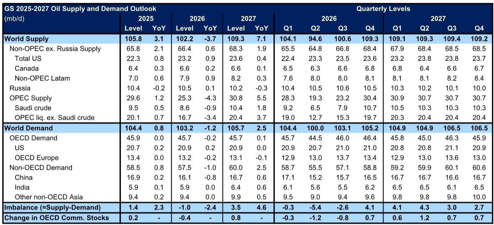
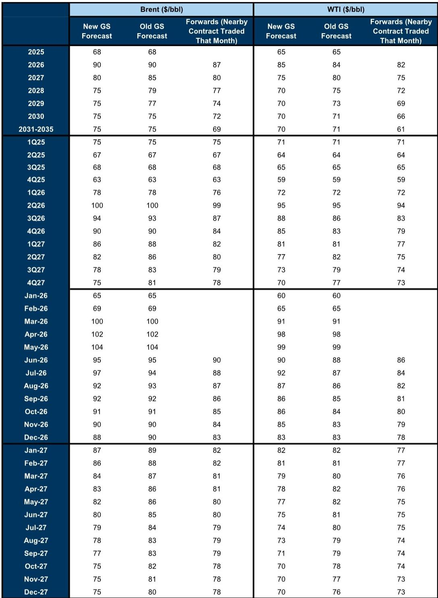
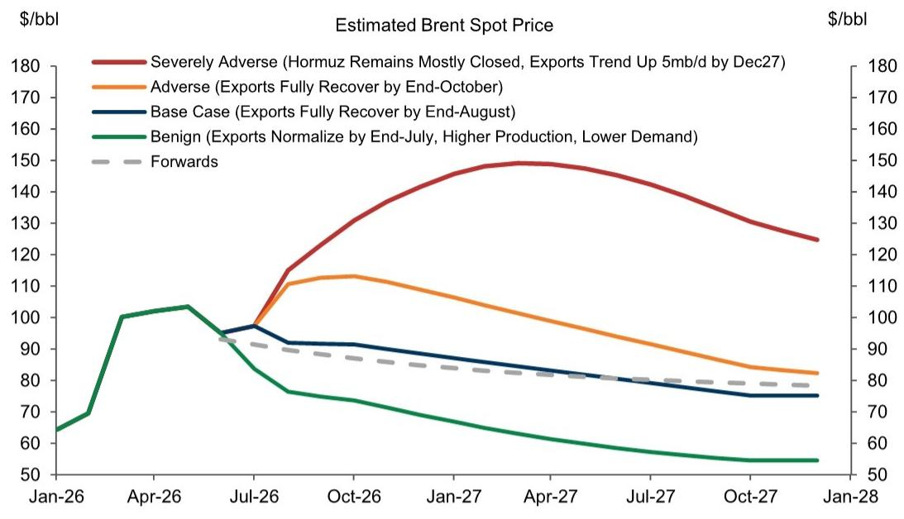

# GS：市场低估的不是地缘冲突的烈度，而是需求破坏的持久性

当霍尔木兹海峡的通行量降至战前水平的不足10%，布伦特原油价格却从三月末的高点回落了约25%。这一看似矛盾的价格走势，正在挑战一个根深蒂固的市场直觉：地缘供给中断必然导致油价飙升。GS最新发布的这份研报提供了一个关键判断——市场真正需要重新定价的，不是冲突升级的风险溢价，而是在供给冲击持续期间，需求端正在发生的结构性坍塌。这份报告的核心主张是，一个更持久的霍尔木兹中断，已被一个更小的供需赤字所抵消，而后者主要源于需求破坏的规模远超预期。

这份研报维持了对2026年第四季度布伦特原油每桶90美元的预测。维持预测本身并不惊人，真正值得关注的是维持预测的理由发生了根本性置换：此前市场担忧的是供给中断的持续时间，而GS现在指出，一个更小的赤字（5-6百万桶/日）抵消了一个更长的中断（恢复时间从六月底推迟至八月底）。这意味着，油价的地板不再由供给侧的物理瓶颈决定，而是由需求端的脆弱性重新锚定。

对于产业决策者和资产配置者而言，理解这种定价逻辑的转移，比预测下一个地缘事件更为紧迫。

## 1. 这轮供给冲击的真实赤字仅为生产损失的约三分之一

GS估算，中东液体燃料生产在二季度受到的冲击高达14-15百万桶/日。然而，全球石油市场同期出现的供需赤字仅为5-6百万桶/日。两者之间近9百万桶/日的差距，揭示了市场缓冲机制的深度。

这一差距由三个因素构成。首先，战前市场本就存在约3百万桶/日的供给过剩。其次，中东以外地区的供给在冲突期间反而上调了约1.5百万桶/日，主要来自美洲（美国、巴西、圭亚那、委内瑞拉）的增产。但最大的变量，是需求侧。GS估算，全球石油需求因冲突而损失的规模接近5百万桶/日。这意味着，供给中断的冲击，有超过三分之一被需求端的同步萎缩所吸收。

需求破坏的集中度值得关注。报告指出，中国原油进口需求近期出现了接近4百万桶/日的同比下滑。这并非简单的经济放缓，而是中国向电动车等替代能源转型加速的结构性信号。如果这一趋势在冲突结束后仍有一部分（报告假设略高于10%）持续存在，那么供给恢复后的市场将面临一个永久性的需求缺口。

这里的含义是清晰的：传统的“供给中断等于油价暴涨”的线性模型已经失效。市场正在学习一个更复杂的函数，其中需求弹性在危机期间可能远高于正常时期。

## 2. 恢复时间表推迟，但恢复速度可能快于共识

GS将海湾国家石油出口恢复正常的时间预期从六月底推迟至八月底。这一调整基于对霍尔木兹海峡通行量的最新估算：即使考虑通过延布、富查伊拉、杰伊汉等替代路线的分流，要使总出口恢复到战前23百万桶/日的水平，霍尔木兹的通行量仍需从当前水平回升至战前水平的约70%。

但报告同时提供了一个重要的乐观视角：一旦海峡重新开放，产量恢复的速度可能快于市场共识。GS的预测显示，在重新开放后的几个月内，海湾国家的原油产量将迅速反弹，其恢复曲线比国际能源署（IEA）和美国能源信息署（EIA）的预测更为陡峭。支撑这一判断的关键证据是，沙特阿拉伯等国的活跃钻机数量在冲突期间不降反升。这意味着生产商并未停止准备，而是在为重启进行预投资。

报告将管道运力视为恢复速度的主要约束，而非材料、劳动力或油井流量。这一判断与许多市场参与者的直觉不同，后者往往更关注物理基础设施的损坏。如果恢复速度确实快于共识，那么当前期货曲线中隐含的远期溢价可能被高估。

## 3. 2027年的价格韧性并非来自基本面，而是来自库存结构和风险溢价

报告将2027年布伦特原油均价预测下调5美元至每桶80美元，但同时指出，这一价格水平仍比2025年均价高出约10美元，尽管同期市场将出现超过3百万桶/日的供给过剩。

这种看似矛盾的价格韧性来自两个非基本面因素。第一，库存结构。由于2026年的大规模库存消耗，经合组织（OECD）商业石油库存不太可能回到很高水平。叠加2027年全球超过1百万桶/日的战略储备补库需求，库存缓冲的缺乏将为价格提供一个底部支撑。第二，安全溢价。报告认为，市场将持续对闲置产能进行风险调整。即使供给过剩，只要投资者认为未来仍存在中断风险，远期价格就会包含一个系统性溢价。

这两个因素的本质是相同的：市场在为一个“永远回不到过去”的世界定价。即使供给恢复，库存的消耗和风险的常态化意味着，均衡价格可能永久性地高于冲突前的水平。但这一判断的脆弱性在于，它假设风险溢价不会因需求破坏而消退。如果需求持续疲软，即使库存很低，价格也可能缺乏上行动力。

## 4. 报告尚未完全回答的关键问题：需求破坏的持久性

这是整份研报中最引人深思但也最不确定的部分。GS假设，冲突结束后，仅有略高于10%的需求损失会持续存在。但这一假设的论证基础在报告中并未充分展开。

需求破坏的性质是复杂的。一部分来自经济活动放缓，这部分在冲突结束后可能迅速恢复。另一部分来自行为改变和替代加速，例如中国电动车的渗透率提升、中东地区工业活动的调整、以及全球供应链的重构。后者具有更强的粘性。报告提到了中国原油进口的急剧下滑，但未能深入拆解其中有多少是临时性的库存去化，有多少是永久性的结构替代。

此外，报告对需求破坏的估算（接近5百万桶/日）本身带有高度不确定性。在冲突环境下，数据收集和质量都受到限制。如果实际需求破坏小于估算，那么当前的赤字可能被低估，价格存在上行风险。反之，如果需求破坏的持续性超出预期，即使供给恢复，市场也可能面临一个长期的需求不足格局。

## 5. 投资者的观察框架：从“冲突时间”转向“需求弹性”

这份报告为读者提供了一个更实用的分析框架，而非简单的价格预测。核心在于，不要将注意力过度集中在霍尔木兹何时重新开放的单一变量上，而应建立一个两维度观测体系。

第一个维度是供给恢复的斜率。关键在于管道运力的恢复进度，而非政治谈判的节奏。如果替代路线的流量持续增加，或者霍尔木兹的通行量回升速度快于预期，那么供给端的压力将快速缓解。第二个维度是需求弹性的斜率。需要持续跟踪中国原油进口数据、全球炼厂开工率、以及替代能源的渗透速度。如果需求破坏持续深化，即使供给恢复缓慢，价格的上行空间也将受到限制。

报告中的情景分析为这种框架提供了量化边界。在良性情景下（七月底恢复出口、需求损失粘性更强、供给增加），2026年第四季度布伦特原油均价可能降至每桶约70美元。而在严重不利情景下（霍尔木兹中断持续至2027年），价格可能升至每桶140美元。两个情景之间的价差，恰恰反映了当前市场定价的不确定性——这并非方向的不确定，而是弹性的不确定。

对于决策者而言，当前最理性的应对不是押注某个方向，而是建立能够同时应对两种情景的灵活性。这意味着，既不要因为价格回落而放弃对冲，也不要因为供给中断而过度囤货。真正的风险在于，市场可能在某一个方向上过度一致。

---

上述分析只触及了这份GS研报的部分核心逻辑。报告中对供给恢复的具体路径、库存变化的逐月推演、以及不同情景下的价格路径，都包含了更细致的量化判断和假设条件。这些细节对于形成独立的投资判断至关重要，但受限于篇幅，无法在此一一展开。

如果你希望进一步讨论需求破坏的持久性假设是否成立，或者想了解供给恢复速度的微观证据，欢迎来星球微信群里继续交流。那里会有对这份研报更完整的解读，以及围绕核心假设的持续跟踪讨论。

Personal reading notes and learning share only. Not investment advice.

