## Oil & Gas | North America

# Executive Compensation - Pay Stays Disciplined

2026 proxy filings suggest North American E&P pay frameworks remained broadly unchanged, reinforcing continued capital discipline. Aggregate metric changes were modest y/y and driven primarily by a small number of targeted refinements. We also assess LTI design & CIC provisions.

## Key Takeaways

■ Compensation design remained largely stable y/y, reinforcing capital discipline rather than signaling any shift in board priorities.  
■ US STI plans remain most weighted toward EHS (18% of compensation), Cash Flow (18%), and Capital Efficiency (15%).  
Canadian peers place greater emphasis on EHS (24%), Production/Delivery (16%), and Operating Efficiency (14%).  
Exec comp remains heavily variable and performance-based, with LTI averaging \~75% of total pay (CEO pay 100% variable/performance-based for EQT and PR).  
Change in control payouts appear meaningful but not outsized, averaging \~2.5x CEO pay for remaining E&Ps, \~1x below recent seller medians.

## The Extel (formerly II) survey closes this week. If you haven't already voted, we would appreciate your support for the MS Energy team:

- Devin McDermott: (1) Integrated Oil and (2) Oil & Gas Exploration and Production  
• Joe Laetsch: Oil Services & Equipment  
• Robert Kad: Midstream & Natural Gas

How to vote: To request a ballot, please go to https://www.extelinsights.com/support/voting-help.

2026 EXTEL

ALL-AMERICA RESEARCH POLL

26 May – 12 June 2026

We appreciate your support

VOTE HERE

What do 2026 proxy filings suggest? Executive compensation design across North American oil & gas remained largely unchanged year-over-year, reinforcing that Boards continue to prioritize capital discipline and returns. Incentive structures appear firmly aligned with investor priorities, with little evidence of a broader pivot toward growth re-acceleration. US producers place relatively greater weight on cash

MS & CO. LLC

## Devin McDermott

Equity Analyst and Commodities Strategist

Devin.McDermott@morganstanley.com +1 212 761-1125

## Joe Laetsch, CFA

Equity Analyst

Joe.Laetsch@morganstanley.com +1 212 761-8804

## Helen Lin

Research Associate

Helen.Lin@morganstanley.com +1 212 761-0766

## Svetlana Do

Research Associate

Svetlana.DO@morganstanley.com +1 212 761-2409

## Justin W Latran, CFA

Research Associate

Justin.Latran@morganstanley.com +1 212 761-2869

## Jacqueline M Kenny

Research Associate

Jacqueline.Kenny@morganstanley.com +1 212 761-2253

2026 EXTEL

ALL-AMERICA RESEARCH POLL

May 26 – June 12, 2026

VIEW OUR ANALYSTS >

EXPLORATION & PRODUCTION

<table><tr><td>North AmericaIndustry View</td><td>In-Line</td></tr><tr><td>INTEGRATED OIL</td><td></td></tr><tr><td>North AmericaIndustry View</td><td>Attractive</td></tr></table>

MS does and seeks to do business with companies covered in MS. As a result, investors should be aware that the firm may have a conflict of interest that could affect the objectivity of MS. Investors should consider MS as only a single factor in making their investment decision.

For analyst certification and other important disclosures, refer to the Disclosure Section, located at the end of this report.

flow, capital efficiency, and returns in short-term incentive plans, while Canadian peers skew more toward EHS and operational execution, particularly production/delivery and operating efficiency.

Several companies made incremental adjustments rather than a structural reset. OXY replaced CROCE with FCF, EXE added FCF and removed capex efficiency per mcfe, CRK replaced operating cost improvement with leverage target, APA replaced F&D cost and shareholder return with operating efficiency and production delivery, and CVX removed refinery operational availability.

Exhibit 1: US producers place relatively greater weight on cash flow, capital efficiency, and returns, while Canadian peers skew more toward EHS and operational execution, particularly production/delivery and operating efficiency.

2026 Average Weighting of Short-Term Incentive Metric  
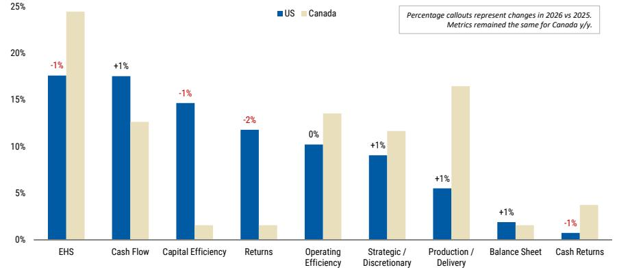

bar chart

| Metric | US (%) | Canada (%) |
| :--- | :--- | :--- |
| EHS | -1 | 24.5 |
| Cash Flow | +1 | 12.7 |
| Capital Efficiency | -1 | 1.5 |
| Returns | -2 | 1.5 |
| Operating Efficiency | 0 | 13.5 |
| Strategic / Discretionary | +1 | 11.7 |
| Production / Delivery | +1 | 16.3 |
| Balance Sheet | +1 | 1.5 |
| Cash Returns | -1 | 3.8 |

Source: Company filings, MS. Note: CNX, IMO, MTDR, TOU and XOM do not disclose exact weightings. Production/Delivery includes production growth, production volumes, and achievement of production guidance or targets. Returns includes ROCE, ROR, ROIC, and TSR. Cash Returns includes dividends, buybacks, and other capital returned to shareholders.

Did total shareholder returns (stock performance + dividends) translate into higher CEO pay in 2025? Only partially. While stronger relative TSR corresponded with better pay outcomes in some instances, the relationship is a bit mixed across the broader group. Overall, differences in company scale, business complexity, and incentive design appear to play a meaningful role alongside TSR performance in shaping compensation outcomes. Across our coverage, PR, EQT, IMO and XOM have the highest long-term incentive (LTI) weighting, while MTDR, TOU, CNX and NOG have among the lowest (more short-term). On average, \~75% of executive compensation is tied to LTIs.

Exhibit 2: CEO pay shows only a modest relationship with three-year relative TSR, underscoring that shareholder returns are only one input into compensation outcomes.  
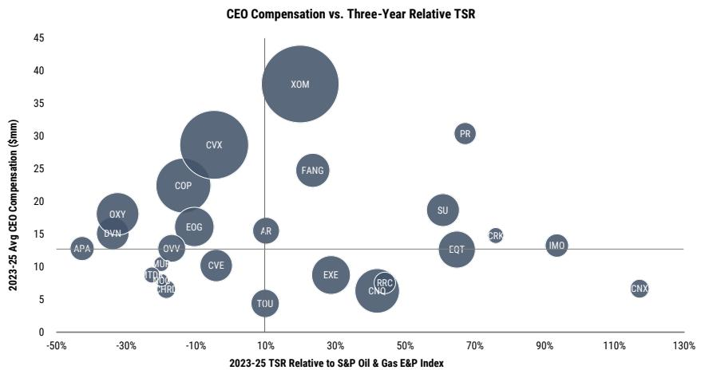

bubble chart

CEO Compensation vs. Three-Year Relative TSR
| Company | 2023-25 TSR Relative to S&P Oil & Gas E&P Index (%) | 2023-25 Avg CEO Compensation ($mm) |
| :--- | :--- | :--- |
| APA | -42 | 12.8 |
| BVX | -31 | 14.7 |
| OXY | -30 | 16.9 |
| CVV | -13 | 15.0 |
| CVO | -14 | 10.0 |
| CVX | -8 | 28.7 |
| EQG | -10 | 15.0 |
| CVE | -6 | 10.0 |
| AR | 10 | 14.8 |
| TOU | 10 | 4.5 |
| EXE | 30 | 8.5 |
| CNQ | 36 | 6.0 |
| RBC | 37 | 8.5 |
| FANG | 27 | 24.5 |
| XOM | 13 | 37.5 |
| PR | 69 | 30.5 |
| SU | 56 | 18.5 |
| EQT | 68 | 12.5 |
| CRK | 73 | 12.5 |
| IMO | 92 | 13.5 |
| CNX | 114 | 6.5 |

Source: Company filings, MS. Note: Bubble size represents 2025 production. Quadrant lines represent medians. Total Shareholder Return (TSR) is calculated as stock price appreciation plus reinvested dividends over a specific performance period.

Exhibit 3: The ratio of change in control provisions to CEO annual compensation for the remaining public E&Ps is 2.5x, below recent seller medians though dispersion remains wide.  
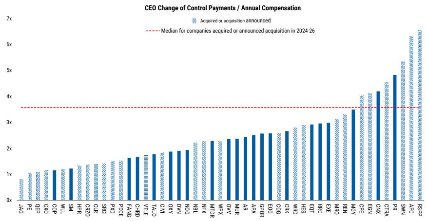

bar chart

| Company | CEO Change of Control Payments / Annual Compensation |
|---------|--------------------------------------------------------|
| JAG     | 0.8x                                                   |
| PE      | 1.0x                                                   |
| QEP     | 1.1x                                                   |
| CXO     | 1.2x                                                   |
| CQP     | 1.3x                                                   |
| WLL     | 1.4x                                                   |
| SM      | 1.5x                                                   |
| HPR     | 1.6x                                                   |
| CRZO    | 1.7x                                                   |
| CLR     | 1.8x                                                   |
| SPRO    | 1.9x                                                   |
| PXD     | 2.0x                                                   |
| PDCE    | 2.1x                                                   |
| FANG    | 2.2x                                                   |
| CHRD    | 2.3x                                                   |
| VTLE    | 2.4x                                                   |
| TALO    | 2.5x                                                   |
| CIVI    | 2.6x                                                   |
| OXY     | 2.7x                                                   |
| DVN     | 2.8x                                                   |
| NOG     | 2.9x                                                   |
| NBL     | 3.0x                                                   |
| NFX     | 3.1x                                                   |
| MTDR    | 3.2x                                                   |
| WPX     | 3.3x                                                   |
| OVV     | 3.4x                                                   |
| MUR     | 3.5x                                                   |
| AR      | 3.6x                                                   |
| APA     | 3.7x                                                   |
| GPOR    | 3.8x                                                   |
| EOG     | 3.9x                                                   |
| COG     | 4.0x                                                   |
| CRK     | 4.1x                                                   |
| WRD     | 4.2x                                                   |
| HES     | 4.3x                                                   |
| EQT     | 4.4x                                                   |
| RRC     | 4.5x                                                   |
| EXE     | 4.6x                                                   |
| MRD     | 4.7x                                                   |
| REN     | 4.8x                                                   |
| MEY     | 4.9x                                                   |
| CPE     | 5.0x                                                   |
| EGN     | 5.1x                                                   |
| CXN     | 5.2x                                                   |
| CTRA    | 5.3x                                                   |
| PR      | 5.4x                                                   |
| SWN     | 5.5x                                                   |
| APC     | 5.6x                                                   |
| RSPP    | 5.7x                                                   |

Source: Company filings, MS

## Short-Term Incentives: Stability Over Reset

Exhibit 4: STI frameworks have moved away from production and strategic goals since 2019, with greater emphasis on EHS and continued focus on cash flow and capital efficiency. Changes from 2025 to 2026 were limited.  
Total Coverage Average Weighting of Short-Term Incentive Metrics  
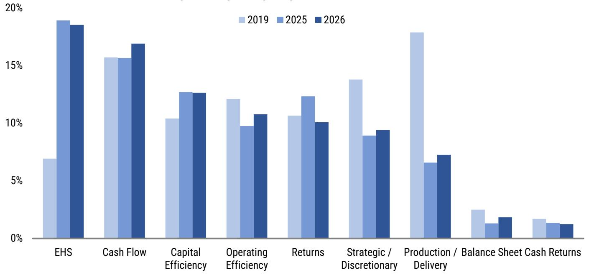

bar chart

| Category               | 2019  | 2025  | 2026  |
| ---------------------- | ----- | ----- | ----- |
| EHS                    | 7%    | 19%   | 18.5% |
| Cash Flow              | 15.5% | 15.5% | 16.8% |
| Capital Efficiency     | 10.3% | 12.6% | 12.5% |
| Operating Efficiency   | 12.0% | 9.7%  | 10.7% |
| Returns                | 10.6% | 12.3% | 10%   |
| Strategic / Discretionary | 13.7% | 8.9%  | 9.3%  |
| Production / Delivery   | 17.8% | 6.5%  | 7.2%  |
| Balance Sheet          | 2.4%  | 1.3%  | 1.7%  |
| Cash Returns           | 1.6%  | 1.3%  | 1.2%  |

Source: Company filings, MS. Note: Metrics disclosed without exact weightings are excluded from the average. CNX, IMO, MTDR, TOU and XOM do not disclose exact weightings. Production / Delivery includes production growth, production volumes, and achievement of production guidance or targets. Returns includes ROCE, ROR, ROIC, and TSR. Cash Returns includes dividends, buybacks, and other capital returned to shareholders.

Exhibit 5: Across US producers, average STI weightings have shifted since 2019 toward EHS and capital efficiency, while production/delivery and strategic/discretionary metrics have become less prominent.  
US Average Weighting of Short-Term Incentive Metrics  
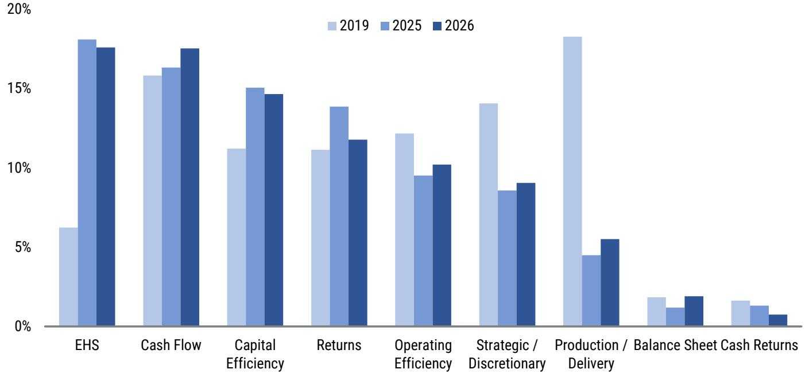

bar chart

| Category               | 2019  | 2025  | 2026  |
| ---------------------- | ----- | ----- | ----- |
| EHS                    | 6.0%  | 18.0% | 17.5% |
| Cash Flow              | 15.5% | 16.0% | 17.5% |
| Capital Efficiency     | 11.0% | 14.5% | 14.5% |
| Returns                | 11.0% | 13.5% | 11.5% |
| Operating Efficiency   | 12.0% | 9.5%  | 10.0% |
| Strategic / Discretionary | 14.0% | 8.5%  | 9.0%  |
| Production / Delivery   | 18.0% | 4.5%  | 5.5%  |
| Balance Sheet          | 1.5%  | 1.0%  | 1.5%  |
| Cash Returns           | 1.5%  | 1.0%  | 0.5%  |

Source: Company filings, MS. Note: Metrics disclosed without exact weightings are excluded from the average. CNX, MTDR, and XOM do not disclose exact weightings. Production / Delivery includes production growth, production volumes, and achievement of production guidance or targets. Returns includes ROCE, ROR, ROIC, and TSR. Cash Returns includes dividends, buybacks, and other capital returned to shareholders.

Exhibit 6: Canadian STI design has shifted since 2019 toward EHS, production/delivery, operating efficiency, and strategic/discretionary goals, while cash flow, returns, and balance sheet metrics have become less prominent; weightings were unchanged from 2025 to 2026.  
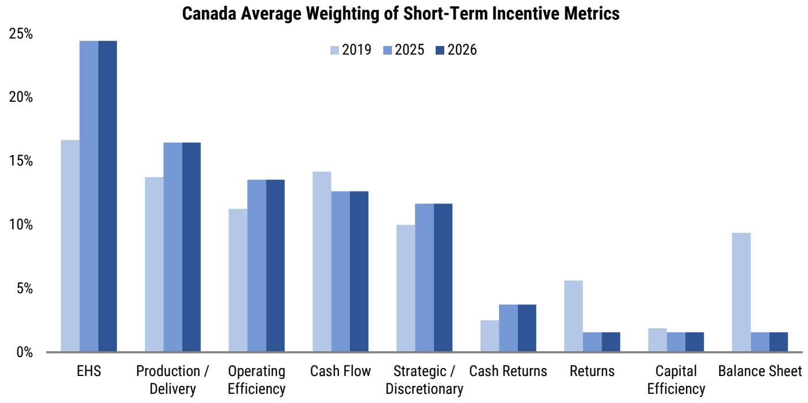

bar chart

Canada Average Weighting of Short-Term Incentive Metrics
| Metric | 2019 (%) | 2025 (%) | 2026 (%) |
| :--- | :--- | :--- | :--- |
| EHS | 16.7 | 24.5 | 24.5 |
| Production / Delivery | 13.7 | 16.4 | 16.4 |
| Operating Efficiency | 11.2 | 13.5 | 13.5 |
| Cash Flow | 14.2 | 12.5 | 12.5 |
| Strategic / Discretionary | 9.9 | 11.6 | 11.6 |
| Cash Returns | 2.4 | 3.7 | 3.7 |
| Returns | 5.5 | 1.4 | 1.4 |
| Capital Efficiency | 1.8 | 1.4 | 1.4 |
| Balance Sheet | 9.3 | 1.4 | 1.4 |

Source: Company filings, MS. Note: Metrics disclosed without exact weightings are excluded from the average. IMO and TOU do not disclose exact weightings. Production / Delivery includes production growth, production volumes, and achievement of production guidance or targets. Returns includes ROCE, ROR, ROIC, and TSR. Cash Returns includes dividends, buybacks, and other capital returned to shareholders.

Exhibit 7: EHS and cash flow remain the core STI metrics across our coverage, combining the highest adoption rates with the highest average weightings in 2026 proxy filings.

<table><tr><td colspan="10">Executive Compensation STI Weighting Heat Map</td></tr><tr><td rowspan="2"></td><td colspan="9">Most prevalent</td></tr><tr><td>EHS</td><td>Cash Flow</td><td>Operating Efficiency</td><td>Capital Efficiency</td><td>Strategic / Discretionary</td><td>Returns</td><td>Production / Delivery</td><td>Balance Sheet</td><td>Cash Returns</td></tr><tr><td>APA</td><td>20%</td><td>20%</td><td>30%</td><td>10%</td><td>10%</td><td></td><td>10%</td><td></td><td></td></tr><tr><td>AR</td><td>15%</td><td></td><td>10%</td><td>25%</td><td></td><td></td><td>25%</td><td>25%</td><td></td></tr><tr><td>CHRD</td><td>20%</td><td>20%</td><td>15%</td><td>25%</td><td>20%</td><td></td><td></td><td></td><td></td></tr><tr><td>CNQ</td><td>20%</td><td>6%</td><td>13%</td><td>6%</td><td>15%</td><td>6%</td><td>13%</td><td>6%</td><td>15%</td></tr><tr><td>COP</td><td>34%</td><td></td><td>14%</td><td>8%</td><td>7%</td><td>30%</td><td>8%</td><td></td><td></td></tr><tr><td>CRK</td><td>4%</td><td>15%</td><td></td><td>15%</td><td>6%</td><td>15%</td><td>15%</td><td>15%</td><td>15%</td></tr><tr><td>CVE</td><td>20%</td><td>15%</td><td>25%</td><td></td><td>20%</td><td></td><td>20%</td><td></td><td></td></tr><tr><td>CVX</td><td>27%</td><td>18%</td><td>10%</td><td>10%</td><td>10%</td><td>18%</td><td>8%</td><td></td><td></td></tr><tr><td>DVN</td><td>30%</td><td>25%</td><td></td><td>10%</td><td></td><td>25%</td><td>10%</td><td></td><td></td></tr><tr><td>EOG</td><td>15%</td><td>20%</td><td>5%</td><td>15%</td><td>15%</td><td>30%</td><td></td><td></td><td></td></tr><tr><td>EQT</td><td>20%</td><td>30%</td><td>20%</td><td>20%</td><td></td><td></td><td>10%</td><td></td><td></td></tr><tr><td>EXE</td><td>15%</td><td>20%</td><td>10%</td><td>20%</td><td>35%</td><td></td><td></td><td></td><td></td></tr><tr><td>FANG</td><td>25%</td><td>20%</td><td>10%</td><td>25%</td><td></td><td>20%</td><td></td><td></td><td></td></tr><tr><td>MUR</td><td>20%</td><td>25%</td><td>25%</td><td></td><td></td><td>30%</td><td></td><td></td><td></td></tr><tr><td>NOG</td><td></td><td>33%</td><td></td><td></td><td>33%</td><td>33%</td><td></td><td></td><td></td></tr><tr><td>OVV</td><td>20%</td><td>30%</td><td>15%</td><td>20%</td><td></td><td></td><td>15%</td><td></td><td></td></tr><tr><td>OXY</td><td>10%</td><td>35%</td><td>18%</td><td>18%</td><td>20%</td><td></td><td></td><td></td><td></td></tr><tr><td>PR</td><td>15%</td><td>20%</td><td>8%</td><td>8%</td><td>25%</td><td>20%</td><td>5%</td><td></td><td></td></tr><tr><td>RRC</td><td>25%</td><td>20%</td><td>15%</td><td>25%</td><td></td><td>15%</td><td></td><td></td><td></td></tr><tr><td>SU</td><td>33%</td><td>17%</td><td>17%</td><td></td><td></td><td></td><td>33%</td><td></td><td></td></tr></table>

Source: Company filings, MS. Note: Adoption % reflects the percentage of companies using each metric in 2026 STI plans. CNX, IMO, MTDR, TOU and XOM do not disclose exact weightings. Production / Delivery includes production growth, production volumes, and achievement of production guidance or targets. Returns includes ROCE, ROR, ROIC, and TSR. Cash Returns includes dividends, buybacks, and other capital returned to shareholders.

Exhibit 8: Aggregate STI metric weightings changed little from 2025 to 2026, though several companies made targeted plan changes, including a shift toward FCF at OXY and EXE, a new leverage target at CRK, and greater operating and production emphasis at APA.  
Change in Executive Compensation STI — 2026 vs 2025

<table><tr><td>Company</td><td>Operating Efficiency</td><td>Production / Delivery</td><td>EHS</td><td>Returns</td><td>Strategic / Discretionary</td><td>Capital Efficiency</td><td>Cash Flow</td><td>Cash Returns</td><td>Balance Sheet</td></tr><tr><td>APA</td><td>+10%</td><td>+10%</td><td>0%</td><td>0%</td><td>0%</td><td>-10%</td><td>0%</td><td>-10%</td><td>0%</td></tr><tr><td>AR</td><td>0%</td><td>0%</td><td>0%</td><td>0%</td><td>0%</td><td>0%</td><td>0%</td><td>0%</td><td>0%</td></tr><tr><td>CHRD</td><td>+5%</td><td>0%</td><td>0%</td><td>0%</td><td>-10%</td><td>+5%</td><td>0%</td><td>0%</td><td>0%</td></tr><tr><td>CNQ</td><td>0%</td><td>0%</td><td>0%</td><td>0%</td><td>0%</td><td>0%</td><td>0%</td><td>0%</td><td>0%</td></tr><tr><td>COP</td><td>+7%</td><td>0%</td><td>-8%</td><td>0%</td><td>+1%</td><td>0%</td><td>0%</td><td>0%</td><td>0%</td></tr><tr><td>CRK</td><td>-15%</td><td>0%</td><td>-2%</td><td>0%</td><td>-3%</td><td>+5%</td><td>0%</td><td>0%</td><td>+15%</td></tr><tr><td>CVE</td><td>0%</td><td>0%</td><td>0%</td><td>0%</td><td>0%</td><td>0%</td><td>0%</td><td>0%</td><td>0%</td></tr><tr><td>CVX</td><td>-0%</td><td>-4%</td><td>+4%</td><td>+6%</td><td>-0%</td><td>-0%</td><td>-6%</td><td>0%</td><td>0%</td></tr><tr><td>DVN</td><td>0%</td><td>0%</td><td>0%</td><td>0%</td><td>0%</td><td>0%</td><td>0%</td><td>0%</td><td>0%</td></tr><tr><td>EOG</td><td>0%</td><td>0%</td><td>0%</td><td>-8%</td><td>0%</td><td>+3%</td><td>+5%</td><td>0%</td><td>0%</td></tr><tr><td>EQT</td><td>+5%</td><td>+10%</td><td>0%</td><td>0%</td><td>0%</td><td>-5%</td><td>-10%</td><td>0%</td><td>0%</td></tr><tr><td>EXE</td><td>-5%</td><td>0%</td><td>0%</td><td>0%</td><td>+15%</td><td>-10%</td><td>0%</td><td>0%</td><td>0%</td></tr><tr><td>FANG</td><td>0%</td><td>0%</td><td>0%</td><td>0%</td><td>0%</td><td>0%</td><td>0%</td><td>0%</td><td>0%</td></tr><tr><td>MUR</td><td>0%</td><td>0%</td><td>0%</td><td>0%</td><td>0%</td><td>0%</td><td>0%</td><td>0%</td><td>0%</td></tr><tr><td>NOG</td><td>0%</td><td>0%</td><td>0%</td><td>0%</td><td>0%</td><td>0%</td><td>-0%</td><td>0%</td><td>0%</td></tr><tr><td>OVV</td><td>0%</td><td>0%</td><td>0%</td><td>0%</td><td>0%</td><td>0%</td><td>0%</td><td>0%</td><td>0%</td></tr><tr><td>OXY</td><td>0%</td><td>0%</td><td>-5%</td><td>-35%</td><td>+5%</td><td>0%</td><td>+35%</td><td>0%</td><td>0%</td></tr><tr><td>PR</td><td>-3%</td><td>+1%</td><td>+1%</td><td>-5%</td><td>+2%</td><td>+4%</td><td>0%</td><td>0%</td><td>0%</td></tr><tr><td>RRC</td><td>0%</td><td>0%</td><td>0%</td><td>0%</td><td>0%</td><td>0%</td><td>0%</td><td>0%</td><td>0%</td></tr><tr><td>SU</td><td>0%</td><td>0%</td><td>0%</td><td>0%</td><td>0%</td><td>0%</td><td>0%</td><td>0%</td><td>0%</td></tr><tr><td>US E&amp;P</td><td>+0%</td><td>+1%</td><td>-1%</td><td>-2%</td><td>+1%</td><td>-1%</td><td>+1%</td><td>-1%</td><td>+1%</td></tr><tr><td>Canada</td><td>0%</td><td>0%</td><td>0%</td><td>0%</td><td>0%</td><td>0%</td><td>0%</td><td>0%</td><td>0%</td></tr><tr><td>US Majors</td><td>-0%</td><td>-4%</td><td>+4%</td><td>+6%</td><td>-0%</td><td>-0%</td><td>-6%</td><td>0%</td><td>0%</td></tr><tr><td>Total</td><td>+0%</td><td>+1%</td><td>-0%</td><td>-2%</td><td>+0%</td><td>-0%</td><td>+1%</td><td>-0%</td><td>+1%</td></tr></table>

Source: Company filings, MS. Note: CNX, IMO, MTDR, TOU and XOM do not disclose exact weightings. Production / Delivery includes production growth, production volumes, and achievement of production guidance or targets. Returns includes ROCE, ROR, ROIC, and TSR. Cash Returns includes dividends, buybacks, and other capital returned to shareholders.

## Long-Term Incentives: Performance-Based Pay Dominates

E&P executive compensation remains heavily performance-based, with long-term incentives (LTI) representing \~75% of total compensation on average and variable pay accounting for the vast majority of CEO and NEO compensation. Across our coverage, PR, IMO, EQT, and XOM have the highest LTI weighting, while MTDR and TOU have the lowest. PR's co-CEOs are 100% paid in TSR-linked equity, and nearly all of EQT CEO's compensation is variable and performance-based.

As a result, modest STI changes in 2026 did little to alter overall pay structure, with boards continuing to rely on long-term equity to drive alignment. TSR remains a core metric, with \~90% of companies incorporating three-year and/or relative TSR.

Exhibit 9: Executive compensation across E&Ps remains overwhelmingly variable and performance-based, with PR, EQT, and IMO at the high end of the group.  
% of Variable Pay in CEO and Named Executive Officer Compensation  
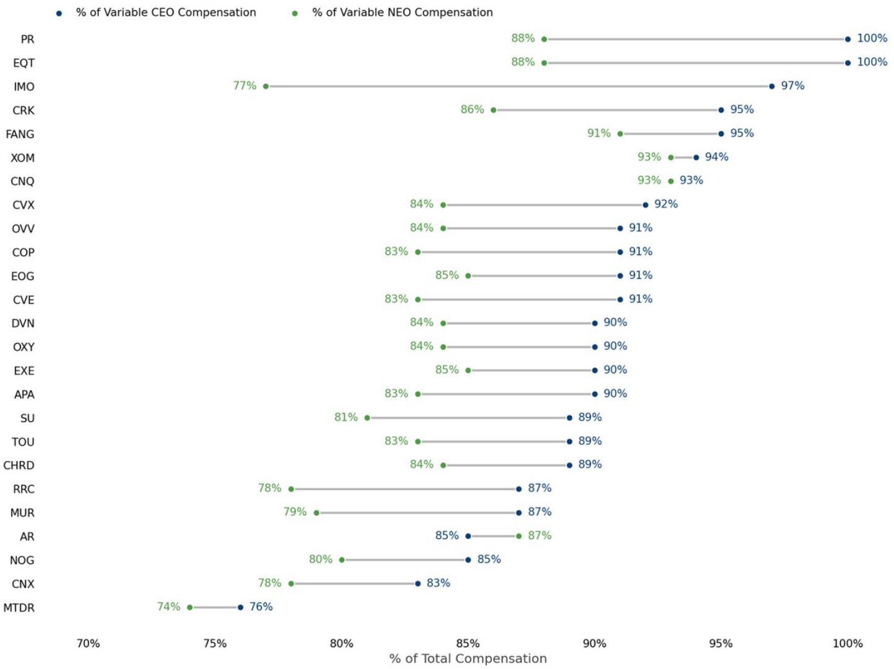

scatterplot

| Entity | % of Variable CEO Compensation | % of Variable NEO Compensation |
|--------|----------------------------------|----------------------------------|
| PR     | 100%                             | 88%                              |
| EQT    | 100%                             | 88%                              |
| IMO    | 97%                              | 77%                              |
| CRK    | 95%                              | 86%                              |
| FANG   | 95%                              | 91%                              |
| XOM    | 94%                              | 93%                              |
| CNQ    | 93%                              | 93%                              |
| CVX    | 92%                              | 84%                              |
| OVV    | 91%                              | 84%                              |
| COP    | 91%                              | 83%                              |
| EOG    | 91%                              | 85%                              |
| CVE    | 91%                              | 83%                              |
| DVN    | 90%                              | 84%                              |
| OXY    | 90%                              | 84%                              |
| EXE    | 90%                              | 85%                              |
| APA    | 90%                              | 83%                              |
| SU     | 89%                              | 81%                              |
| TOU    | 89%                              | 83%                              |
| CHRD   | 89%                              | 84%                              |
| RRC    | 87%                              | 78%                              |
| MUR    | 87%                              | 79%                              |
| AR     | 85%                              | 87%                              |
| NOG    | 85%                              | 80%                              |
| CNX    | 83%                              | 78%                              |
| MTDR   | 76%                              | 74%                              |

Source: Company filings, MS. NEO = Named Executive Officer

Exhibit 10: LTI accounts for roughly 75% of executive compensation on average across our coverage.  
Long-Term Incentives as % of Total Compensation  
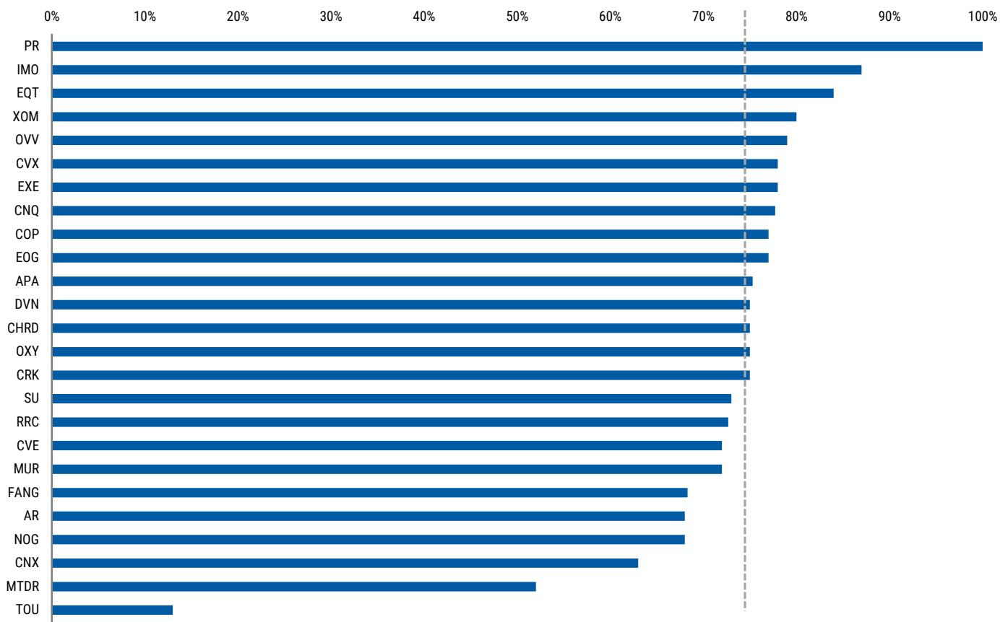

bar chart

| Category | Value |
| -------- | ----- |
| PR       | 100%  |
| IMO      | 85%   |
| EQT      | 80%   |
| XOM      | 75%   |
| OVV      | 75%   |
| CVX      | 75%   |
| EXE      | 75%   |
| CNQ      | 75%   |
| COP      | 75%   |
| EOG      | 75%   |
| APA      | 70%   |
| DVN      | 70%   |
| CHRD     | 70%   |
| OXY      | 70%   |
| CRK      | 70%   |
| SU       | 70%   |
| RRC      | 70%   |
| CVE      | 70%   |
| MUR      | 70%   |
| FANG     | 65%   |
| AR       | 65%   |
| NOG      | 65%   |
| CNX      | 60%   |
| MTDR     | 50%   |
| TOU      | 20%   |

Source: Company filings, MS

Exhibit 11: Relative TSR and three-year TSR remain broadly embedded in LTI design across E&Ps, with nearly 90% of peers using both metrics.  
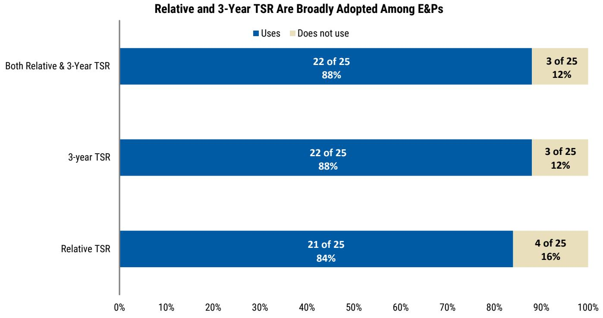

bar chart

| Category             | Uses | Does not use |
| -------------------- | ---- | ------------ |
| Both Relative & 3-Year TSR | 22   | 12           |
| 3-year TSR           | 22   | 12           |
| Relative TSR         | 21   | 16           |

Source: Company filings, MS. Note: "3-Year TSR" refers to TSR measured over a three-year performance period; "Relative TSR" refers to TSR measured against a peer group, index, or benchmark.

## Pay Outcomes: Alignment Is Directional, Not Uniform

Exhibit 12: CEO pay shows only a modest relationship with three-year relative TSR, suggesting realized compensation continues to reflect factors beyond shareholder returns alone.  

bubble chart

| Company | 2023-25 TSR Relative to S&P Oil & Gas E&P Index | 2023-25 Avg CEO Compensation ($mm) |
|---------|-----------------------------------------------|-------------------------------------|
| APA     | -40%                                          | 13                                  |
| DVN     | -30%                                          | 15                                  |
| OXY     | -30%                                          | 18                                  |
| CVX     | -8%                                           | 29                                  |
| COP     | -12%                                          | 22                                  |
| OVV     | -15%                                          | 14                                  |
| MUR     | -25%                                          | 9                                   |
| ITDR    | -27%                                          | 8                                   |
| CFRD    | -26%                                          | 6                                   |
| CVE     | -7%                                           | 10                                  |
| AR      | 10%                                           | 15                                  |
| TOU     | 10%                                           | 4                                   |
| EXE     | 30%                                           | 8                                   |
| RRC     | 45%                                           | 7                                   |
| CNQ     | 45%                                           | 6                                   |
| CRK     | 75%                                           | 14                                  |
| EQT     | 65%                                           | 13                                  |
| SU      | 60%                                           | 18                                  |
| PR      | 70%                                           | 30                                  |
| FANG    | 25%                                           | 25                                  |
| CXM     | 15%                                           | 38                                  |
| CNX     | 115%                                          | 6                                   |

Source: Company filings, MS. Note: Bubble size represents 2025 production. Quadrant lines represent medians. Total Shareholder Return (TSR) is calculated as stock price appreciation plus reinvested dividends over a specific performance period.

Exhibit 13: 2025 CEO bonus payouts were largely delivered at or above target across the sector.  
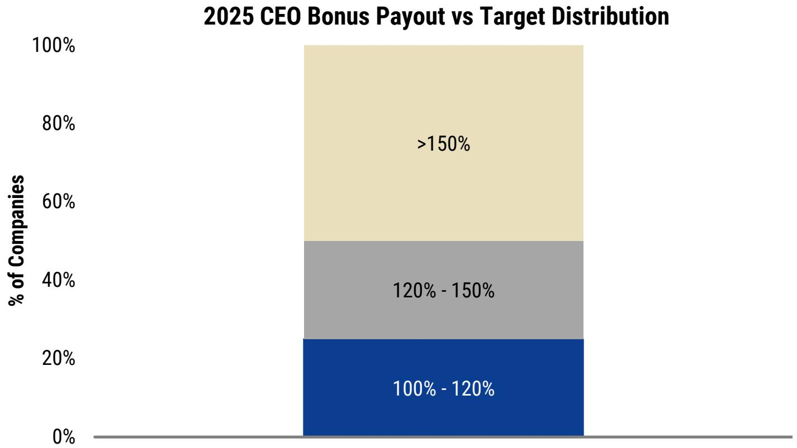

stacked bar chart

2025 CEO Bonus Payout vs Target Distribution
| Category | Percentage (%) |
| :--- | :--- |
| >150% | 48 |
| 120% - 150% | 26 |
| 100% - 120% | 25 |

Source: Company filings, MS

Exhibit 14: CEO pay per flowing barrel varies widely across E&Ps, with smaller-scale companies generally screening above the median and larger producers below it. CRK stands out as an outlier, while CNQ, TOU, XOM, and CVX exhibit among the lowest pay intensity relative to production scale.  
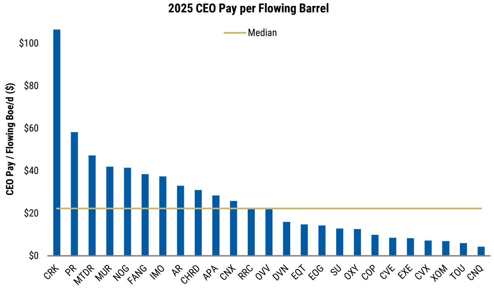

bar chart

| Ticker | CEO Pay / Flowing Boe/d ($) |
| ------ | --------------------------- |
| CRK    | 105                         |
| PR     | 58                          |
| MTDR   | 47                          |
| MUR    | 42                          |
| NOG    | 41                          |
| FANG   | 38                          |
| IMO    | 37                          |
| AR     | 33                          |
| CHRD   | 31                          |
| APA    | 28                          |
| CNX    | 26                          |
| RRC    | 22                          |
| OVV    | 22                          |
| DVN    | 16                          |
| EQT    | 15                          |
| EOG    | 14                          |
| SU     | 13                          |
| OXY    | 12                          |
| COP    | 11                          |
| CVE    | 9                           |
| EXE    | 8                           |
| CVX    | 7                           |
| XOM    | 6                           |
| TOU    | 5                           |
| CNQ    | 4                           |

Source: Company filings, MS

## CIC in a Consolidating Sector

Change-in-control (CIC) provisions remain relevant as we expect consolidation to accelerate later in 2026 driven by private exits and a maturing shale base (see Running Out of Rock?). Based on 2026 proxy filings, median CEO CIC payouts are \~2.5x annual compensation, below the \~3.6x median observed for companies involved in transactions over the past two years. PR, CNX, and MGY (not covered) offer the highest potential CIC payouts relative to CEO pay, while COP, SM (not covered), and FANG offer the lowest. Overall, CIC provisions appear meaningful enough to protect executives in a change event, but not outsized relative to historical deal precedents.

Exhibit 15: The ratio of change in control provisions to CEO annual compensation for the remaining public E&Ps is 2.5x, below recent seller medians though dispersion remains wide.  

bar chart

| Company | CEO Change of Control Payments / Annual Compensation |
|---------|--------------------------------------------------------|
| JAG     | 0.8x                                                   |
| PE      | 1.0x                                                   |
| QEP     | 1.1x                                                   |
| CXO     | 1.2x                                                   |
| COP     | 1.1x                                                   |
| WLL     | 1.2x                                                   |
| SM      | 1.3x                                                   |
| HPR     | 1.4x                                                   |
| CRZO    | 1.5x                                                   |
| CLR     | 1.6x                                                   |
| SROI    | 1.7x                                                   |
| PXD     | 1.8x                                                   |
| PDCE    | 1.9x                                                   |
| FANG    | 2.0x                                                   |
| CHRD    | 2.1x                                                   |
| VTLE    | 2.2x                                                   |
| TALO    | 2.3x                                                   |
| CIVI    | 2.4x                                                   |
| OXY     | 2.5x                                                   |
| DVN     | 2.6x                                                   |
| NOG     | 2.7x                                                   |
| NBL     | 2.8x                                                   |
| NFX     | 2.9x                                                   |
| MTDR    | 3.0x                                                   |
| WPX     | 3.1x                                                   |
| OVW     | 3.2x                                                   |
| MUR     | 3.3x                                                   |
| AR      | 3.4x                                                   |
| APA     | 3.5x                                                   |
| GPOR    | 3.6x                                                   |
| EOG     | 3.7x                                                   |
| COG     | 3.8x                                                   |
| CRK     | 3.9x                                                   |
| WRD     | 4.0x                                                   |
| HES     | 4.1x                                                   |
| EQT     | 4.2x                                                   |
| RRC     | 4.3x                                                   |
| EXE     | 4.4x                                                   |
| MRO     | 4.5x                                                   |
| REN     | 4.6x                                                   |
| MGY     | 4.7x                                                   |
| CPE     | 4.8x                                                   |
| EGN     | 4.9x                                                   |
| CNX     | 5.0x                                                   |
| CTRA    | 5.1x                                                   |
| PR      | 5.2x                                                   |
| SWN     | 5.3x                                                   |
| APC     | 5.4x                                                   |
| RSPP    | 5.5x                                                   |

Source: Company filings, MS

## Disclosure Section

The information and opinions in MS were prepared by MS & Co. LLC, and/or MS C.T.V.M. S.A., and/or MS Mexico, Casa de Bolsa, S.A. de C.V., and/or MS Canada Limited. As used in this disclosure section, "MS" includes MS & Co. LLC, MS C.T.V.M. S.A., MS Mexico, Casa de Bolsa, S.A. de C.V., MS Canada Limited and their affiliates as necessary.

For important disclosures, stock price charts and equity rating histories regarding companies that are the subject of this report, please see the MS Disclosure Website at www.morganstanley.com/eqr/disclosures/webapp/generalresearch, or contact your investment representative or MS at 1585 Broadway, (Attention: Research Management), New York, NY, 10036 USA.

For valuation methodology and risks associated with any recommendation, rating or price target referenced in this research report, please contact the Client Support Team as follows: US/Canada +1 800 303-2495; Hong Kong +852 2848-5999; Latin America +1 718 754-5444 (U.S.); London +44 (0)20-7425-8169; Singapore +65 6834-6860; Sydney +61 (0)2-9770-1505; Tokyo +81 (0)3-6836-9000. Alternatively you may contact your investment representative or MS at 1585 Broadway, (Attention: Research Management), New York, NY 10036 USA.

## Analyst Certification

The following analysts hereby certify that their views about the companies and their securities discussed in this report are accurately expressed and that they have not received and will not receive direct or indirect compensation in exchange for expressing specific recommendations or views in this report: Devin McDermott.

## Global Research Conflict Management Policy

MS has been published in accordance with our conflict management policy, which is available at www.morganstanley.com/institutional/research/conflictpolicies. A Portuguese version of the policy can be found at www.morganstanley.com.br

## Important Regulatory Disclosures on Subject Companies

The analyst or strategist (or a household member) identified below owns the following securities (or related derivatives): Devin McDermott - Exxon Mobil Corporation(common or preferred stock).

As of May 29, 2026, MS beneficially owned 1% or more of a class of common equity securities of the following companies covered in MS: Antero Resources Corp, APA Corp, Chevron Corporation, Chord Energy Corporation, CNX Resources Corp, ConocoPhillips, Devon Energy Corp, Diamondback Energy Inc, EOG Resources Inc, EQT Corp., Expand Energy Corp, Exxon Mobil Corporation, Matador Resources Co, Murphy Oil Corporation, Northern Oil & Gas Inc., Occidental Petroleum Corp, Permian Resources Corp, Range Resources Corp., Tourmaline Oil Corp..

Within the last 12 months, MS managed or co-managed a public offering (or 144A offering) of securities of Chevron Corporation, CNX Resources Corp, Diamondback Energy Inc, EOG Resources Inc, Murphy Oil Corporation, Northern Oil & Gas Inc., Permian Resources Corp, Viper Energy Inc.

Within the last 12 months, MS has received compensation for investment banking services from Chevron Corporation, CNX Resources Corp, Devon Energy Corp, Diamondback Energy Inc, EOG Resources Inc, Expand Energy Corp, Murphy Oil Corporation, Northern Oil & Gas Inc., Permian Resources Corp, Viper Energy Inc.

In the next 3 months, MS expects to receive or intends to seek compensation for investment banking services from Antero Resources Corp, APA Corp, Cenovus Energy, Chevron Corporation, Chord Energy Corporation, CNX Resources Corp, Comstock Resources Inc., ConocoPhillips, Devon Energy Corp, Diamondback Energy Inc, EOG Resources Inc, EQT Corp., Expand Energy Corp, Exxon Mobil Corporation, Matador Resources Co, Murphy Oil Corporation, Northern Oil & Gas Inc., Occidental Petroleum Corp, Permian Resources Corp, Range Resources Corp., Suncor Energy Inc, Tourmaline Oil Corp., Viper Energy Inc.

Within the last 12 months, MS has received compensation for products and services other than investment banking services from Antero Resources Corp, APA Corp, Cenovus Energy, Chevron Corporation, CNX Resources Corp, Comstock Resources Inc., ConocoPhillips, Devon Energy Corp, Diamondback Energy Inc, EOG Resources Inc, EQT Corp., Expand Energy Corp, Exxon Mobil Corporation, Northern Oil & Gas Inc., Occidental Petroleum Corp, Ovintiv Inc, Permian Resources Corp, Range Resources Corp., Suncor Energy Inc, Tourmaline Oil Corp., Viper Energy Inc.

Within the last 12 months, MS has provided or is providing investment banking services to, or has an investment banking client relationship with, the following company: Antero Resources Corp, APA Corp, Cenovus Energy, Chevron Corporation, Chord Energy Corporation, CNX Resources Corp, Comstock Resources Inc., ConocoPhillips, Devon Energy Corp, Diamondback Energy Inc, EOG Resources Inc, EQT Corp., Expand Energy Corp, Exxon Mobil Corporation, Matador Resources Co, Murphy Oil Corporation, Northern Oil & Gas Inc., Occidental Petroleum Corp, Permian Resources Corp, Range Resources Corp., Suncor Energy Inc, Tourmaline Oil Corp., Viper Energy Inc.

Within the last 12 months, MS has either provided or is providing non-investment banking, securities-related services to and/or in the past has entered into an agreement to provide services or has a client relationship with the following company: Antero Resources Corp, APA Corp, Canadian Natural Resources Ltd, Cenovus Energy, Chevron Corporation, Chord Energy Corporation, CNX Resources Corp, Comstock Resources Inc., ConocoPhillips, Devon Energy Corp, Diamondback Energy Inc, EOG Resources Inc, EQT Corp., Expand Energy Corp, Exxon Mobil Corporation, Northern Oil & Gas Inc., Occidental Petroleum Corp, Ovintiv Inc, Permian Resources Corp, Range Resources Corp., Suncor Energy Inc, Tourmaline Oil Corp., Viper Energy Inc.

An employee, director or consultant of MS is a director of Occidental Petroleum Corp. This person is not a research analyst or a member of a research analyst's household. MS & Co. LLC makes a market in the securities of Chord Energy Corporation, CNX Resources Corp, Comstock Resources Inc., Matador Resources Co, Murphy Oil Corporation. The equity research analysts or strategists principally responsible for the preparation of MS have received compensation based upon various factors, including quality of research, investor client feedback, stock picking, competitive factors, firm revenues and overall investment banking revenues. Equity Research analysts' or strategists' compensation is not linked to investment banking or capital markets transactions performed by MS or the profitability or revenues of particular trading desks.

MS and its affiliates do business that relates to companies/instruments covered in MS, including market making, providing liquidity, fund management, commercial banking, extension of credit, investment services and investment banking. MS sells to and buys from customers the securities/instruments of companies covered in MS on a principal basis. MS may have a position in the debt of the Company or instruments discussed in this report. MS trades or may trade as principal in the debt securities (or in related derivatives) that are the subject of the debt research report.

Certain disclosures listed above are also for compliance with applicable regulations in non-US jurisdictions.

## STOCK RATINGS

MS uses a relative rating system using terms such as Overweight, Equal-weight, Not-Rated or Underweight (see definitions below). MS does not assign ratings of Buy, Hold or Sell to the stocks we cover. Overweight, Equal-weight, Not-Rated and Underweight are not the equivalent of buy, hold and sell. Investors should carefully read the definitions of all ratings used in MS. In addition, since MS contains more complete information concerning the analyst's views, investors should carefully read MS, in its entirety, and not infer the contents from the rating alone. In any case, ratings (or research) should not be used or relied upon as investment advice. An investor's decision to buy or sell a stock should depend on individual circumstances (such as the investor's existing holdings) and other considerations.

## Global Stock Ratings Distribution

(as of May 31, 2026)

The Stock Ratings described below apply to MS's Fundamental Equity Research and do not apply to Debt Research produced by the Firm.

For disclosure purposes only (in accordance with FINRA requirements), we include the category headings of Buy, Hold, and Sell alongside our ratings of Overweight, Equal-weight, Not-Rated and Underweight. MS does not assign ratings of Buy, Hold or Sell to the stocks we cover. Overweight, Equal-weight, Not-Rated and Underweight are not the equivalent of buy, hold, and sell but represent recommended relative weightings (see definitions below). To satisfy regulatory requirements, we correspond Overweight, our most positive stock rating, with a buy recommendation; we correspond Equal-weight and Not-Rated to hold and Underweight to sell recommendations, respectively.

<table><tr><td></td><td colspan="2">Coverage Universe</td><td colspan="3">Investment Banking Clients (IBC)</td><td colspan="2">Other Material Investment ServicesClients (MISC)</td></tr><tr><td>Stock RatingCategory</td><td>Count</td><td>% of Total</td><td>Count</td><td>% of Total IBC</td><td>% of RatingCategory</td><td>Count</td><td>% of Total OtherMISC</td></tr><tr><td>Overweight/Buy</td><td>1542</td><td>42%</td><td>465</td><td>51%</td><td>30%</td><td>707</td><td>43%</td></tr><tr><td>Equal-weight/Hold</td><td>1571</td><td>43%</td><td>369</td><td>40%</td><td>23%</td><td>723</td><td>44%</td></tr><tr><td>Not-Rated/Hold</td><td>3</td><td>0%</td><td>0</td><td>0%</td><td>0%</td><td>1</td><td>0%</td></tr><tr><td>Underweight/Sell</td><td>551</td><td>15%</td><td>86</td><td>9%</td><td>16%</td><td>201</td><td>12%</td></tr><tr><td>Total</td><td>3,667</td><td></td><td>920</td><td></td><td></td><td>1632</td><td></td></tr></table>

Data include common stock and ADRs currently assigned ratings. Investment Banking Clients are companies from whom MS received investment banking compensation in the last 12 months. Due to rounding off of decimals, the percentages provided in the "% of total" column may not add up to exactly 100 percent.

## Analyst Stock Ratings

Overweight (O). The stock's total return is expected to exceed the average total return of the analyst's industry (or industry team's) coverage universe, on a risk-adjusted basis, over the next 12-18 months.

Equal-weight (E). The stock's total return is expected to be in line with the average total return of the analyst's industry (or industry team's) coverage universe, on a risk-adjusted basis, over the next 12-18 months.

Not-Rated (NR). Currently the analyst does not have adequate conviction about the stock's total return relative to the average total return of the analyst's industry (or industry team's) coverage universe, on a risk-adjusted basis, over the next 12-18 months.

Underweight (U). The stock's total return is expected to be below the average total return of the analyst's industry (or industry team's) coverage universe, on a risk-adjusted basis, over the next 12-18 months.

Unless otherwise specified, the time frame for price targets included in MS is 12 to 18 months.

## Analyst Industry Views

Attractive (A): The analyst expects the performance of his or her industry coverage universe over the next 12-18 months to be attractive vs. the relevant broad market benchmark, as indicated below.

In-Line (I): The analyst expects the performance of his or her industry coverage universe over the next 12-18 months to be in line with the relevant broad market benchmark, as indicated below. Cautious (C): The analyst views the performance of his or her industry coverage universe over the next 12-18 months with caution vs. the relevant broad market benchmark, as indicated below. Benchmarks for each region are as follows: North America - S&P 500; Latin America - relevant MSCI country index or MSCI Latin America Index; Europe - MSCI Europe; Japan - TOPIX; Asia - relevant MSCI country index or MSCI sub-regional index or MSCI AC Asia Pacific ex Japan Index.

## Important Disclosures for MS Smith Barney LLC Customers

Important disclosures regarding any material conflict of interest that can reasonably be expected to have influenced MS Smith Barney LLC's choice of a third-party research provider or the subject company of a third-party research report, are available on the MS Wealth Management disclosure website at www.morganstanley.com/online/researchdisclosures. For MS specific disclosures, you may refer to https://www.morganstanley.com/eqr/disclosures/webapp/generalresearch.

Each MS report is reviewed and approved on behalf of MS Smith Barney LLC. This review and approval is conducted by the same person who reviews the research report on behalf of MS. This could create a conflict of interest.

## Other Important Disclosures

MS policy is to update research reports as and when the Research Analyst and Research Management deem appropriate, based on developments with the issuer, the sector, or the market that may have a material impact on the research views or opinions stated therein. In addition, certain Research publications are intended to be updated on a regular periodic basis (weekly/monthly/quarterly/annual) and will ordinarily be updated with that frequency, unless the Research Analyst and Research Management determine that a different publication schedule is appropriate based on current conditions.

MS is not acting as a municipal advisor and the opinions or views contained herein are not intended to be, and do not constitute, advice within the meaning of Section 975 of the Dodd-Frank Wall Street Reform and Consumer Protection Act.

MS produces an equity research product called a "Tactical Idea." Views contained in a "Tactical Idea" on a particular stock may be contrary to the recommendations or views expressed in research on the same stock. This may be the result of differing time horizons, methodologies, market events, or other factors. For all research available on a particular stock, please contact your sales representative or go to Matrix at http://www.morganstanley.com/matrix.

MS is provided to our clients through our proprietary research portal on Matrix and also distributed electronically by MS to clients. Certain, but not all, MS products are also made available to clients through third-party vendors or redistributed to clients through alternate electronic means as a convenience. For access to all available MS, please contact your sales representative or go to Matrix at http://www.morganstanley.com/matrix.

Any access and/or use of MS is subject to MS's Terms of Use (http://www.morganstanley.com/terms.html). By accessing and/or using MS, you are indicating that you have read and agree to be bound by our Terms of Use (http://www.morganstanley.com/terms.html). In addition you consent to MS processing your personal data and using cookies in accordance with our Privacy Policy and our Global Cookies Policy (http://www.morganstanley.com/privacy\_pledge.html), including for the purposes of setting your preferences and to collect readership data so that we can deliver better and more personalized service and products to you. To find out more information about how MS processes personal data, how we use cookies and how to reject cookies see our Privacy Policy and our Global Cookies Policy (http://www.morganstanley.com/privacy\_pledge.html). Please use the provided link to review the Terms and Conditions and Most Important Terms and Conditions for MS India Company Private Limited (https://www.morganstanley.com/assets/pdfs/about-us-global-offices/india/Terms\_and\_conditions.pdf) and the following link to review the audit report (https://ny.matrix.ms.com/eqr/research/webapp/researchdocs/MSICPL\_Morgan\_Stanley\_Research\_Audit\_Report.pdf).

If you do not agree to our Terms of Use and/or if you do not wish to provide your consent to MS processing your personal data or using cookies please do not access our research. MS does not provide individually tailored investment advice. MS has been prepared without regard to the circumstances and objectives of those who receive it. MS recommends that investors independently evaluate particular investments and strategies, and encourages investors to seek the advice of a financial adviser. The appropriateness of an investment or strategy will depend on an investor's circumstances and objectives. The securities, instruments, or strategies discussed in MS may not be suitable for all investors, and certain investors may not be eligible to purchase or participate in some or all of them. MS is not an offer to buy or sell or the solicitation of an offer to buy or sell any security/instrument or to participate in any particular trading strategy. The value of and income from your investments may vary because of changes in interest rates, foreign exchange rates, default rates, prepayment rates, securities/instruments prices, market indexes, operational or financial conditions of companies or other factors. There may be time limitations on the exercise of options or other rights in securities/instruments transactions. Past performance is not necessarily a guide to future performance. Estimates of future performance are based on assumptions that may not be realized. If provided, and unless otherwise stated, the closing price on the cover page is that of the primary exchange for the subject company's securities/instruments.

The fixed income research analysts, strategists or economists principally responsible for the preparation of MS have received compensation based upon various factors, including quality, accuracy and value of research, firm profitability or revenues (which include fixed income trading and capital markets profitability or revenues), client feedback and competitive factors. Fixed Income Research analysts', strategists' or economists' compensation is not linked to investment banking or capital markets transactions performed by MS or the profitability or revenues of particular trading desks.

The "Important Regulatory Disclosures on Subject Companies" section in MS lists all companies mentioned where MS owns 1% or more of a class of common equity securities of the companies. For all other companies mentioned in MS, MS may have an investment of less than 1% in securities/instruments or derivatives of securities/instruments of companies and may trade them in ways different from those discussed in MS. Employees of MS not involved in the preparation of MS may have investments in securities/instruments or derivatives of securities/instruments of companies mentioned and may trade them in ways different from those discussed in MS. Derivatives may be issued by MS or associated persons.

With the exception of information regarding MS, MS is based on public information. MS makes every effort to use reliable, comprehensive information, but we make no representation that it is accurate or complete. We have no obligation to tell you when opinions or information in MS change apart from when we intend to discontinue equity research coverage of a subject company. Facts and views presented in MS have not been reviewed by, and may not reflect information known to, professionals in other MS business areas, including investment banking personnel.

MS personnel may participate in company events such as site visits and are generally prohibited from accepting payment by the company of associated expenses unless pre-approved by authorized members of Research management.

MS may make investment decisions that are inconsistent with the recommendations or views in this report.

To our readers based in Taiwan or trading in Taiwan securities/instruments: Information on securities/instruments that trade in Taiwan is distributed by MS Taiwan Limited ("MSTL"). Such information is for your reference only. The reader should independently evaluate the investment risks and is solely responsible for their investment decisions. MS may not be distributed to the public media or quoted or used by the public media without the express written consent of MS. Any non-customer reader within the scope of Article 7-1 of the Taiwan Stock Exchange Recommendation Regulations accessing and/or receiving MS is not permitted to provide MS to any third party (including but not limited to related parties, affiliated companies and any other third parties) or engage in any activities regarding MS which may create or give the appearance of creating a conflict of interest. Information on securities/instruments that do not trade in Taiwan is for informational purposes only and is not to be construed as a recommendation or a solicitation to trade in such securities/instruments. MSTL may not execute transactions for clients in these securities/instruments.

MS is not incorporated under PRC law and the research in relation to this report is conducted outside the PRC. MS does not constitute an offer to sell or the solicitation of an offer to buy any securities in the PRC. PRC investors shall have the relevant qualifications to invest in such securities and shall be responsible for obtaining all relevant approvals, licenses, verifications and/or registrations from the relevant governmental authorities themselves. Neither this report nor any part of it is intended as, or shall constitute, provision of any consultancy or advisory service of securities investment as defined under PRC law. Such information is provided for your reference only.

MS is disseminated in Brazil by MS C.T.V.M. S.A. located at Av. Brigadeiro Faria Lima, 3600, 6th floor, São Paulo - SP, Brazil; and is regulated by the Comissão de Valores Mobiliários; in Mexico by MS México, Casa de Bolsa, S.A. de C.V which is regulated by Comision Nacional Bancaria y de Valores. Paseo de los Tamarindos 90, Torre 1, Col. Bosques de las Lomas Floor 29, 05120 Mexico City; in Japan by MS MUFG Securities Co., Ltd. and, for Commodities related research reports only, MS Capital Group Japan Co., Ltd; in Hong Kong by MS Asia Limited (which accepts responsibility for its contents) and by MS Bank Asia Limited; in Singapore by MS Asia (Singapore) Pte. (Registration number 199206298Z) and/or MS Asia (Singapore) Securities Pte Ltd (Registration number 200008434H), regulated by the Monetary Authority of Singapore (which accepts legal responsibility for its contents and should be contacted with respect to any matters arising from, or in connection with, MS) and by MS Bank Asia Limited, Singapore Branch (Registration number T14FC0118); in Australia to "wholesale clients" within the meaning of the Australian Corporations Act by MS Australia Limited A.B.N. 67 003 734 576, holder of Australian financial services license No. 233742, which accepts responsibility for its contents; in Australia to "wholesale clients" and "retail clients" within the meaning of the Australian Corporations Act by MS Wealth Management Australia Pty Ltd (A.B.N. 19 009 14-5 555, holder of Australian financial services license No. 240813, which accepts responsibility for its contents; in Korea by MS & Co International plc, Seoul Branch; in India by MS India Company Private Limited having Corporate Identification No (CIN) U22990MH1998PTC115305, regulated by the Securities and Exchange Board of India ("SEBI") and holder of licenses as a Research Analyst (SEBI Registration No. INH000001105); Stock Broker (SEBI Stock Broker Registration No. INZ000244438), Merchant Banker (SEBI Registration No. INM000011203), and depository participant with National Securities Depository Limited (SEBI Registration No. IN-DP-NSDL-567-2021) having registered office at Altimus, Level 39 & 40, Pandurang Budhkar Marg, Worli, Mumbai 400018, India; Telephone no. +91-22-61181000; Compliance Officer Details: Mr. Tejarshi Hardas, Tel. No.: +91-22-61181000 or Email: tejarshi.hardas@morganstanley.com; Grievance officer details: Mr. Tejarshi

Hardas, Tel. No.: +91-22-61181000 or Email: msic-compliance@morganstanley.com. MS India Company Private Limited (MSICPL) may use AI tools in providing research services. All recommendations contained herein are made by the duly qualified research analysts; in Canada by MS Canada Limited; in Germany and the European Economic Area where required by MS Europe S.E., authorised and regulated by Bundesanstalt fuer Finanzdienstleistungsaufsicht (BaFin) under the reference number 149169; in the US by MS & Co. LLC, which accepts responsibility for its contents. MS & Co. International plc, authorized by the Prudential Regulation Authority and regulated by the Financial Conduct Authority and the Prudential Regulation Authority, disseminates in the UK research that it has prepared, and research which has been prepared by any of its affiliates, only to persons who (i) are investment professionals falling within Article 19(5) of the Financial Services and Markets Act 2000 (Financial Promotion) Order 2005 (as amended, the "Order"); (ii) are persons who are high net worth entities falling within Article 49(2)(a) to (d) of the Order; or (iii) are persons to whom an invitation or inducement to engage in investment activity (within the meaning of section 21 of the Financial Services and Markets Act 2000, as amended) may otherwise lawfully be communicated or caused to be communicated. RMB MS Proprietary Limited is a member of the JSE Limited and A2X (Pty) Ltd. RMB MS Proprietary Limited is a joint venture owned equally by MS International Holdings Inc. and RMB Investment Advisory (Proprietary) Limited, which is wholly owned by FirstRand Limited. The information in MS is being disseminated by MS Saudi Arabia, regulated by the Capital Market Authority in the Kingdom of Saudi Arabia, and is directed at Sophisticated investors only.

The information in MS is being communicated by MS & Co. International plc (DIFC Branch), regulated by the Dubai Financial Services Authority (the DFSA) or by MS & Co. International plc (ADGM Branch), regulated by the Financial Services Regulatory Authority Abu Dhabi (the FSRA), and is directed at Professional Clients only, as defined by the DFSA or the FSRA, respectively. The financial products or financial services to which this research relates will only be made available to a customer who we are satisfied meets the regulatory criteria of a Professional Client. A distribution of the different MS Research ratings or recommendations, in percentage terms for Investments in each sector covered, is available upon request from your sales representative.

The information in MS is being communicated by MS & Co. International plc (QFC Branch), regulated by the Qatar Financial Centre Regulatory Authority (the QFCRA), and is directed at business customers and market counterparties only and is not intended for Retail Customers as defined by the QFCRA.

As required by the Capital Markets Board of Turkey, investment information, comments and recommendations stated here, are not within the scope of investment advisory activity. Investment advisory service is provided exclusively to persons based on their risk and income preferences by the authorized firms. Comments and recommendations stated here are general in nature. These opinions may not fit to your financial status, risk and return preferences. For this reason, to make an investment decision by relying solely to this information stated here may not bring about outcomes that fit your expectations.

The trademarks and service marks contained in MS are the property of their respective owners. Third-party data providers make no warranties or representations relating to the accuracy, completeness, or timeliness of the data they provide and shall not have liability for any damages relating to such data. The Global Industry Classification Standard (GICS) was developed by and is the exclusive property of MSCI and S&P.

MS, or any portion thereof may not be reprinted, sold or redistributed without the written consent of MS.

Indicators and trackers referenced in MS may not be used as, or treated as, a benchmark under Regulation EU 2016/1011, or any other similar framework.

The issuers and/or fixed income products recommended or discussed in certain fixed income research reports may not be continuously followed. Accordingly, investors should regard those fixed income research reports as providing stand-alone analysis and should not expect continuing analysis or additional reports relating to such issuers and/or individual fixed income products. MS may hold, from time to time, material financial and commercial interests regarding the company subject to the Research report.

Registration granted by SEBI and certification from the National Institute of Securities Markets (NISM) in no way guarantee performance of the intermediary or provide any assurance of returns to investors. Investment in securities market are subject to market risks. Read all the related documents carefully before investing.

INDUSTRY COVERAGE: Exploration & Production

<table><tr><td>COMPANY (TICKER)</td><td>RATING (AS OF)</td><td>PRICE* (06/09/2026)</td></tr><tr><td colspan="3">Devin McDermott</td></tr><tr><td>Antero Resources Corp (AR.N)</td><td>O (04/17/2024)</td><td>$34.66</td></tr><tr><td>APA Corp (APA.O)</td><td>U (04/15/2024)</td><td>$36.61</td></tr><tr><td>Chord Energy Corporation (CHRD.O)</td><td>O (03/27/2026)</td><td>$134.07</td></tr><tr><td>CNX Resources Corp (CNX.N)</td><td>U (01/10/2025)</td><td>$33.07</td></tr><tr><td>Comstock Resources Inc. (CRK.N)</td><td>E (01/10/2025)</td><td>$12.67</td></tr><tr><td>ConocoPhillips (COP.N)</td><td>O (12/16/2024)</td><td>$116.79</td></tr><tr><td>Devon Energy Corp (DVN.N)</td><td>O (12/11/2023)</td><td>$44.07</td></tr><tr><td>Diamondback Energy Inc (FANG.O)</td><td>O (12/11/2020)</td><td>$194.24</td></tr><tr><td>EOG Resources Inc (EOG.N)</td><td>E (12/11/2023)</td><td>$137.33</td></tr><tr><td>EQT Corp. (EQT.N)</td><td>O (11/18/2021)</td><td>$52.69</td></tr><tr><td>Expand Energy Corp (EXE.O)</td><td>O (01/10/2025)</td><td>$88.78</td></tr><tr><td>Matador Resources Co (MTDR.N)</td><td>E (01/10/2025)</td><td>$53.73</td></tr><tr><td>Murphy Oil Corporation (MUR.N)</td><td>U (01/22/2025)</td><td>$38.63</td></tr><tr><td>Northern Oil &amp; Gas Inc. (NOG.N)</td><td>U (08/18/2025)</td><td>$20.74</td></tr><tr><td>Occidental Petroleum Corp (OXY.N)</td><td>E (08/18/2025)</td><td>$56.55</td></tr><tr><td>Ovintiv Inc (OVV.N)</td><td>E (03/27/2026)</td><td>$56.59</td></tr><tr><td>Permian Resources Corp (PR.N)</td><td>O (01/10/2025)</td><td>$19.20</td></tr><tr><td>Range Resources Corp. (RRC.N)</td><td>E (03/26/2025)</td><td>$38.45</td></tr><tr><td>Tourmaline Oil Corp. (TOU.TO)</td><td>E (01/10/2025)</td><td>C$63.03</td></tr><tr><td>Viper Energy Inc (VNOM.O)</td><td>0 (08/18/2025)</td><td>$45.12</td></tr></table>

Stock Ratings are subject to change. Please see latest research for each company.

\* Historical prices are not split adjusted.

INDUSTRY COVERAGE: Integrated Energy

<table><tr><td>COMPANY (TICKER)</td><td>RATING (AS OF)</td><td>PRICE* (06/09/2026)</td></tr><tr><td colspan="3">Devin McDermott</td></tr><tr><td>Canadian Natural Resources Ltd (CNQ.TO)</td><td>E (10/07/2021)</td><td>C$62.38</td></tr><tr><td>Cenovus Energy (CVE.TO)</td><td>O (10/07/2021)</td><td>C$38.56</td></tr><tr><td>Chevron Corporation (CVX.N)</td><td>O (08/04/2025)</td><td>$186.76</td></tr><tr><td>Exxon Mobil Corporation (XOM.N)</td><td>O (05/14/2024)</td><td>$148.91</td></tr><tr><td>Imperial Oil Ltd (IMO.TO)</td><td>E (10/07/2021)</td><td>C$165.88</td></tr><tr><td>Suncor Energy Inc (SU.TO)</td><td>E (12/16/2024)</td><td>C$85.32</td></tr></table>

Stock Ratings are subject to change. Please see latest research for each company.  
\* Historical prices are not split adjusted.