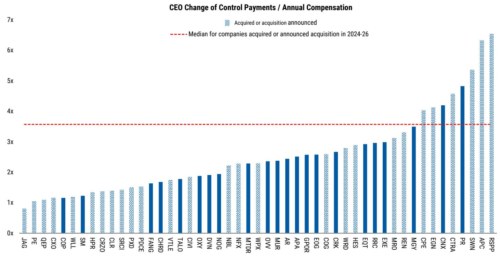
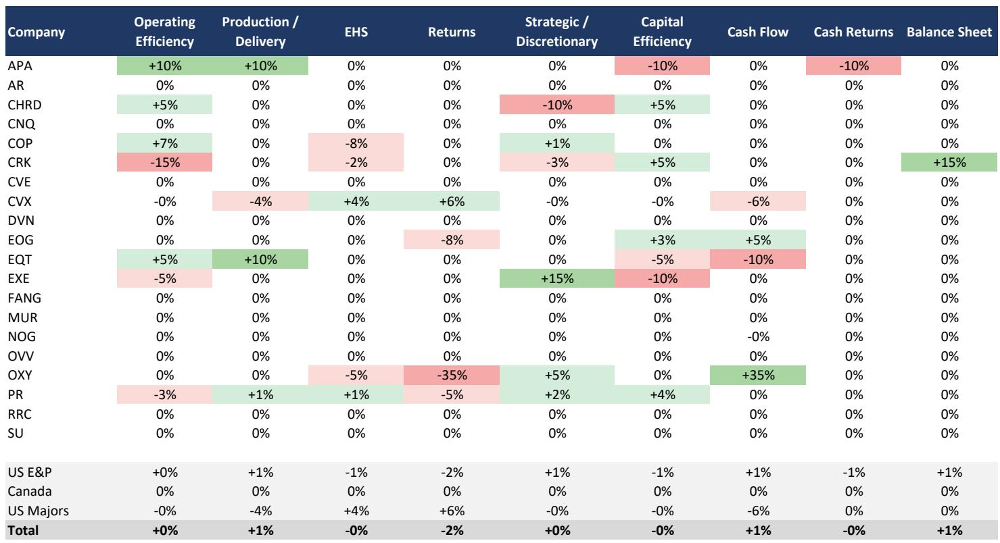

# Executive Pay Stability in North American E&P Is Not a Lack of Change -- It Is a Strategic Signal That Capital Discipline Remains Entrenched

The 2026 proxy filings for North American oil and gas producers reveal something that might appear unremarkable at first glance: executive compensation design remained largely unchanged year-over-year. Aggregate metric weightings shifted by only a few percentage points. Boards did not overhaul their incentive structures. This apparent stability, however, is precisely the point. In an industry that has historically oscillated between growth-at-any-cost and returns-focused strategies, the absence of change is itself a powerful statement. Compensation frameworks are not drifting back toward production volume targets or undisciplined capital deployment. The message from boards to management teams is clear: the playbook that has governed the last several years -- prioritize cash flow, capital efficiency, and shareholder returns -- remains firmly in place.

Why does this matter now? The energy sector is entering a period where the temptation to pivot will intensify. Commodity price volatility, shifting energy policy landscapes, and the ongoing consolidation wave create natural pressure points for boards to reconsider what they reward. If compensation design were going to crack, this would be the moment. Yet the data suggests the opposite. The short-term incentive structures that emerged from the post-2020 reset have not only persisted but have been refined with surgical precision rather than wholesale revision. This is not inertia. It is a deliberate reinforcement of a capital allocation philosophy that investors have demanded and that management teams have now internalized.

The argument of this article is straightforward: the stability of executive pay frameworks across North American E&P is a leading indicator that capital discipline is not a cyclical phase but a structural feature of the industry's governance. The implications extend beyond compensation into M&A strategy, production growth trajectories, and the long-term relationship between oil and gas companies and their shareholders. Understanding the mechanics of these incentive structures -- and the few adjustments that were made -- provides a window into how boards are thinking about risk, return, and the next phase of the cycle.

## The Stability of Short-Term Incentive Design Conceals Targeted Refinements That Reveal Board Priorities

When an analyst looks at aggregate data showing that EHS, cash flow, and capital efficiency remain the three highest-weighted metrics in US short-term incentive plans, the conclusion is not simply that nothing changed. The conclusion is that the core architecture of how executives are evaluated has reached a consensus state. Boards are not experimenting. They are not searching for a new framework. They have found a structure that aligns with investor expectations, and they are making marginal adjustments rather than fundamental redesigns.

Consider what the year-over-year changes actually were. OXY replaced CROCE with FCF, a move that shifts emphasis away from a cost-based metric toward absolute cash generation. EXE added FCF and removed capex efficiency per mcfe, signaling that the board wants management focused on total free cash flow rather than unit-level capital productivity. CRK replaced an operating cost improvement target with a leverage target, reflecting a board that wants to ensure the balance sheet remains a priority even as the company navigates its operational profile. APA replaced F&D cost and shareholder return metrics with operating efficiency and production delivery, a subtle but meaningful pivot toward execution reliability. CVX removed refinery operational availability, perhaps reflecting a view that downstream reliability is now sufficiently embedded in operational culture that it no longer needs explicit incentive weighting.

These are not random changes. They share a common thread: each refinement moves the incentive structure closer to what sophisticated investors have been asking for. Cash flow metrics are becoming more direct. Balance sheet health is being explicitly incentivized. Operational execution is being rewarded over strategic ambition. The pattern suggests that boards are not merely maintaining discipline -- they are sharpening it.

## The Divergence Between US and Canadian Incentive Design Reflects Different Operating Realities and Investor Bases, Not Different Philosophies on Capital Discipline

A surface reading of the data might suggest that Canadian producers are less focused on capital discipline because their STI plans place greater weight on production and delivery metrics. This would be a misinterpretation. Canadian E&P companies operate in a fundamentally different geological and regulatory environment. The Montney and Duvernay plays, which dominate Canadian production, have different decline curves, different cost structures, and different optimal development paces than the Permian or the Bakken. A production-focused metric in Canada does not mean the same thing as a production-focused metric would mean in the United States.

What is more revealing is the convergence on EHS metrics. Both US and Canadian producers now weight EHS as their single most important STI category, with Canadian companies assigning it nearly a quarter of total incentive weighting. This is not a coincidence. Environmental, health, and safety performance has become a non-negotiable governance priority across the entire North American industry. Boards are signaling that operational integrity and social license to operate are prerequisites for financial performance, not trade-offs against it.

The Canadian emphasis on operating efficiency and strategic discretion also tells a story. Canadian producers face greater transportation constraints, higher royalty burdens, and a more concentrated customer base for their natural gas production. These structural factors make operational execution and strategic decision-making more critical to value creation than they might be for a US producer with direct access to Gulf Coast export markets. The incentive design reflects the operating reality, not a different philosophical commitment to capital discipline.

## The Weak Correlation Between CEO Pay and Relative TSR Underscores That Compensation Is a Governance Tool, Not a Simple Performance Scorecard

One of the most counterintuitive findings in the proxy analysis is the modest relationship between three-year relative total shareholder return and CEO compensation levels. A bubble chart plotting these two variables shows significant dispersion. Some companies with strong relative TSR pay their CEOs modestly, while others with weaker relative TSR pay their CEOs handsomely. This is not evidence that compensation committees are indifferent to shareholder returns. It is evidence that TSR is only one input among many.

The more important variable is the composition of pay. Long-term incentive awards now constitute approximately 75 percent of total executive compensation across the coverage universe. For companies like EQT and PR, CEO pay is 100 percent variable and performance-based. This structure means that the vast majority of executive wealth is tied to sustained value creation over multiple years, not to annual stock price movements. The weak correlation between TSR and annual compensation is almost a mathematical necessity when most pay is deferred and contingent on long-term performance conditions.

What this means for investors is that compensation design itself is a more reliable signal of board intent than the absolute dollar amounts paid to executives. A CEO whose pay package is heavily weighted toward long-term incentives with performance hurdles tied to cash flow and returns has a fundamentally different set of incentives than one whose pay is dominated by annual bonuses or time-vested equity. The data shows that the industry has moved decisively toward the former model. That structural shift matters more than whether a particular CEO's pay went up or down in a given year.

## Change-in-Control Provisions Are a Critical but Underappreciated Variable in the M&A Calculus

The ratio of change-in-control payments to annual CEO compensation averages approximately 2.5x for remaining public E&Ps, a figure that sits roughly 1x below recent seller medians. This gap is not an accident. It reflects a deliberate design choice by boards to avoid creating excessive incentives for management to pursue a sale, while still providing reasonable protection in the event of a transaction.

The dispersion around this average is wide. Some companies have CIC provisions that approach 5x or more, which could meaningfully influence management behavior during M&A negotiations. A CEO whose personal financial outcome from a sale is five times their annual compensation has a different risk-reward calculation than one whose multiple is closer to 1x. This is not to suggest that these provisions drive deal decisions, but they do create a background condition that boards and investors should monitor.

In the current consolidation environment, where scale is increasingly valued for its ability to lower cost of capital and improve access to infrastructure, CIC provisions become a strategic variable. Companies with higher multiples may find it easier to attract acquirers, not because the CEO will push for a sale, but because the compensation structure reduces the friction of a transaction. Conversely, companies with lower multiples may retain management teams that are more focused on organic value creation. Neither outcome is inherently superior, but understanding where a company sits on this spectrum provides insight into its likely strategic trajectory.

## What the Report Does Not Fully Answer: The Tension Between Disciplined Pay Design and the Inevitable Pressure to Grow

The proxy analysis provides a detailed snapshot of where compensation design stands today, but it leaves several critical questions unanswered. The most important of these is whether the current incentive structure can withstand a sustained period of high commodity prices. When oil and gas prices rise significantly, the pressure to increase production intensifies from multiple directions: from management teams who see opportunity, from investors who want to capture upside, and from the simple arithmetic of cash flow generation that can be reinvested.

The current STI frameworks are designed to resist this pressure by weighting cash flow and capital efficiency more heavily than production volumes. But these frameworks have not been tested in a genuinely high-price environment since they were put in place. The post-2020 recovery saw disciplined capital allocation, but it also occurred against a backdrop of lingering pandemic uncertainty and a growing ESG movement that constrained enthusiasm for growth. A different macroeconomic environment could produce different behavioral outcomes.

There is also the question of how compensation design will evolve as the industry's reserve base matures. The highest-quality inventory in the Permian and other premier basins is being depleted. As the remaining inventory becomes lower quality or more expensive to develop, the trade-off between capital efficiency and production maintenance becomes more acute. Boards may eventually need to recalibrate incentive metrics to reflect this reality. The current stability may be a function of the current inventory quality, not a permanent feature of the governance landscape.

## A Decision Framework for Investors Evaluating E&P Compensation Design

For investors seeking to incorporate compensation analysis into their investment process, the following framework provides a structured approach. First, assess the weighting of long-term versus short-term incentives. Companies where LTI represents more than 70 percent of total compensation are signaling a commitment to multi-year value creation. Companies with higher STI weightings may be more exposed to short-term performance volatility and management behavior.

Second, evaluate the specific metrics within STI plans. The presence of cash flow and capital efficiency metrics at meaningful weightings is a positive signal for capital discipline. The presence of production volume targets at high weightings should raise questions about whether the board is prioritizing growth over returns. The presence of EHS metrics at significant weightings indicates a board that takes operational risk seriously.

Third, examine the change-in-control provisions relative to peer medians. Companies with CIC multiples significantly above the average may face different M&A incentives than those with below-average multiples. This is not a standalone red flag, but it is a factor to consider in the context of consolidation risk.

Fourth, look for year-over-year changes in metric design. Incremental refinements toward cash flow and balance sheet metrics are generally positive. Reversals toward production or strategic growth metrics should be scrutinized as potential signals of a shifting board philosophy.

Finally, consider the alignment between compensation design and the company's stated strategy. A company that claims to prioritize shareholder returns but has compensation metrics heavily weighted toward production growth has a governance gap that investors should address.

## The Full Report Contains the Data and Charts That Make These Patterns Visible

The analysis presented here is based on a detailed review of proxy filings and compensation disclosures across the North American E&P universe. The underlying data reveals patterns that are difficult to see in aggregate but become clear when examined at the company level. The heat maps, trend charts, and dispersion analyses in the original report provide the empirical foundation for the arguments made in this article.

Join the community to read the full report and review the original charts.

*This article is for learning and discussion only and does not constitute investment advice.*

Personal reading notes and learning share only. Not investment advice.

