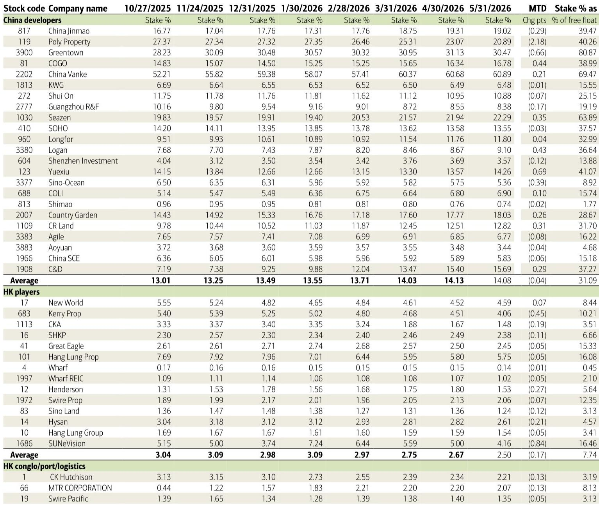
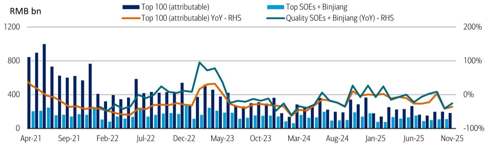
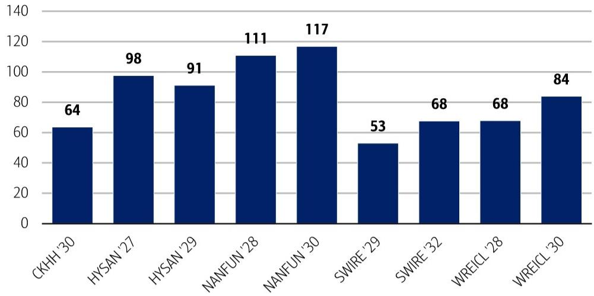

# The Hong Kong Property Recovery Is Real, But It Is Not Yet a Broad-Based Reflation Trade

The narrative that Hong Kong's property market has turned the corner is not wrong. After a prolonged correction, primary residential sales averaged over 2,000 transactions per month for five consecutive months, a pace that would have seemed improbable a year ago. Yet the data for June tells a more complicated story. With approximately 240 primary transactions recorded so far in the month, the momentum has clearly decelerated. The question is not whether the recovery is happening. The question is whether it is durable enough to withstand the crosscurrents now gathering force.

The answer hinges on three factors that the market is only beginning to price: a negative wealth effect from local equity weakness, renewed uncertainty around US rate policy, and a new regulatory overhang from Beijing's recently announced offshore investment rules. Each of these is manageable in isolation. Together, they create a risk that the recovery stalls before it broadens into a self-sustaining cycle. For credit investors, this means the window for alpha generation is narrowing to specific names and specific structures. For equity investors, it means the days of beta-driven gains are likely over.

The most important insight from the latest data is not the slowdown itself but what it reveals about the structure of demand. The buyers who drove the five-month surge were not speculative investors. They were end-users and long-term allocators who had been waiting for price discovery. That pool is finite. To sustain momentum, developers need to attract a new marginal buyer, and that buyer is more sensitive to macro headwinds and policy ambiguity. The June data suggests that this marginal buyer is hesitating.

## The Deceleration in Hong Kong Primary Sales Reflects a Collision of Three Macro Headwinds, Not a Reversal of Fundamentals

To understand why June looks different from the preceding months, one must look beyond the headline transaction count. The 2,000-plus monthly average was driven by aggressive pricing from developers who had accumulated inventory during the downturn and needed to clear it. That strategy worked. But as the most attractively priced units were absorbed, the remaining inventory is less compelling on a relative value basis. Developers, sensing this, have become more cautious about new launches. This is not capitulation. It is rational inventory management.

The problem is that the external environment has deteriorated just as developers need to re-engage the market. Local equity market weakness is directly relevant because housing demand in Hong Kong is closely correlated with wealth perception. When portfolios shrink, the willingness to commit to a large illiquid purchase declines. This is not a liquidity crisis. It is a psychological headwind that is hard to reverse until equity markets stabilize.

The second headwind is the renewed uncertainty around US rate hikes. The market had been pricing a peak in rates, and that assumption was embedded in the recovery narrative. Any signal that rates will stay higher for longer, or that another hike is possible, directly impacts mortgage affordability and, more importantly, the opportunity cost of holding cash versus committing to a property. The June slowdown suggests that this risk is now being internalized by buyers.

The third factor is the most structurally significant: the newly announced offshore investment rules from Mainland China. The details remain unclear, and that ambiguity is itself a drag. Mainland capital has been a meaningful marginal buyer in Hong Kong's primary market, particularly for higher-end projects. If the new rules restrict or redirect that capital, the demand base narrows. The report correctly notes that this overhang will persist until implementation details emerge. The implication is clear: any investor positioning for a continued recovery must account for a scenario in which Mainland demand is materially lower.

## The Central Government's Urban Renewal Subsidy Is a Signal of Policy Direction, Not a Catalyst for Near-Term Demand

The State Council's announcement of RMB 97 billion from the central budget and RMB 160 billion in ultra-long-term special government bonds for urban renewal in 2026 is meaningful, but not for the reasons most observers assume. The numbers are large in absolute terms but small relative to the scale of the problem. Annual urban renewal investment exceeds RMB 3 trillion. The central subsidy covers roughly 8.5% of that. The rest must come from local governments through special purpose bonds and policy bank lending.

This is a continuation of the existing policy framework, not a departure. The central government is signaling that urban renewal remains a priority and that it is willing to provide catalytic funding. But the burden of execution remains at the local level, where fiscal constraints are severe. The report's assessment is measured: the incremental impact of the latest program is expected to be relatively minor. That is the right conclusion.

For investors, the implication is that the property sector cannot rely on a policy-driven demand surge. The recovery, to the extent it happens, must be organic. That puts the focus back on developer-level fundamentals: inventory quality, balance sheet strength, and the ability to generate cash flow from operations. The policy subsidy is a tailwind, but it is not strong enough to lift all boats.

## The Divergence Between China High-Yield and Hong Kong Investment-Grade Credit Is Widening, and It Reflects Fundamental Rather Than Sentiment-Driven Factors

The credit market data is instructive. In the past week, the average yield on China high-yield property bonds (excluding Vanke) widened 18 basis points to 9.58%. Year-to-date, these bonds have tightened 162 basis points, so the weekly move represents a meaningful reversal of a trend. There was no new issuance in the sector, and year-to-date net redemption remains at USD 1.4 billion. The market is not growing. It is shrinking, and the remaining bonds are being repriced to reflect higher risk.

Contrast this with Hong Kong investment-grade property bonds. The average option-adjusted spread tightened 3 basis points week-on-week to 61 basis points. That is a modest move, but it is in the opposite direction. The two markets are telling different stories. China high-yield is still dealing with the aftermath of the developer crisis, with individual names facing idiosyncratic stress. Vanke's situation illustrates the point: the company received approval from banks to extend RMB 1.184 billion in loans, but it also defaulted on a USD 120 million loan secured by Midtown Manhattan's Bush Tower, with United Overseas Bank assuming control. The narrative is one of managed distress, not recovery.

Hong Kong investment-grade, by contrast, is benefiting from a different dynamic. The recovery in primary sales, even if slowing, has improved the credit profile of well-capitalized developers. The report highlights an overweight recommendation on a specific credit, LASUDE 2026, driven by upside based on reported liability management exercise terms and approximately 1x interest coverage with gradual deleveraging backed by further asset and property sales. This is a name-specific opportunity, not a sector-wide call.

The key takeaway is that the credit market is discriminating. Investors who treat all property bonds as a single trade are missing the nuance. The alpha opportunity lies in identifying issuers with credible deleveraging plans, liquid asset bases, and a demonstrated commitment to addressing debt. The report identifies three things to watch for this particular credit: the completion of the CCB Tower sale, progress in liability management exercise negotiations, and further property and asset sales. These are the metrics that matter.

## What the Report Does Not Fully Answer: The Sustainability of Southbound Interest and the Path of Deleveraging for Chinese Developers

The report provides detailed data on Southbound interest in property names, but it does not fully resolve the question of whether this capital flow is sustainable. Southbound interest in China developers edged down slightly in May, with the average stake falling from 14.13% to 14.08% month-on-month. For Hong Kong players, the decline was more pronounced, from 2.67% to 2.50%. The data shows significant divergence at the individual name level. Vanke's Southbound stake rose to 60.89%, while Poly Property's fell from 23.07% to 20.89%. What is driving these divergences? Is it fundamental conviction, or is it a function of index rebalancing and liquidity management?

The report does not provide a definitive answer, and that is a gap that investors need to fill themselves. Southbound flows have been a critical source of demand for Hong Kong-listed property stocks. If those flows reverse or become more selective, the equity market impact could be significant. The open question is whether the May data represents a temporary pause or the beginning of a trend.

Similarly, the report's analysis of bond yields and spreads is thorough, but it leaves open the question of how the deleveraging process will unfold for Chinese developers. The sector has made progress in reducing net redemption, but the primary market for new issuance remains closed. The path to normalisation is unclear. Will developers be able to access capital markets again, or will they remain dependent on asset sales and bank extensions? The answer has profound implications for credit valuations.

## A Decision Framework for Investors: How to Position Across the Capital Structure and Across Geographies

For investors trying to navigate this environment, a structured framework is essential. The first decision is geographic: China versus Hong Kong. The evidence suggests that Hong Kong investment-grade credit offers a more favourable risk-reward profile, provided one is selective. The recovery in primary sales, while slowing, has improved cash flows for well-capitalised developers. The policy backdrop, while not a catalyst, is supportive. The key risk is that the macro headwinds identified earlier persist and deepen. The mitigating factor is that Hong Kong developers have historically maintained conservative balance sheets, and the current spread levels offer a cushion.

For China high-yield, the framework must be name-specific. The sector is no longer investable on a beta basis. The question for each issuer is whether it has a credible path to addressing its debt without a disorderly restructuring. The three metrics to evaluate are: the quality and liquidity of the asset base, the willingness of creditors to engage in liability management, and the company's track record of executing asset sales. The report's focus on Vanke's loan extension and default illustrates the binary nature of these outcomes.

The second decision is across the capital structure. Equity investors face a different set of risks than credit investors. The equity recovery trade has already played out to a significant degree. Further upside depends on a sustained improvement in sales volumes and pricing power. That is not guaranteed. Credit investors, by contrast, are focused on recovery values and the probability of default. For bonds trading at distressed levels, the upside from a successful restructuring can be substantial, but the downside is total loss.

The third decision is time horizon. The near-term risks are macro-driven: equity market weakness, rate uncertainty, and regulatory ambiguity. These are likely to persist for several months. The medium-term outlook depends on whether the Hong Kong recovery broadens and whether Chinese developers can access capital markets again. The long-term outlook is fundamentally about demographics and urbanisation trends, which remain supportive for select markets.

## Join the Community to Read the Full Report and Review the Original Charts

The analysis above draws on a detailed research report that includes proprietary data on Southbound interest, bond yields, and developer sales trends. The original charts provide a level of granularity that is difficult to replicate in a written summary. For investors who want to see the full picture, including the specific credit recommendations and the complete set of exhibits, the full report is essential reading. Join the community to read the full report and review the original charts.

*This article is for learning and discussion only and does not constitute investment advice.*

Personal reading notes and learning share only. Not investment advice.

