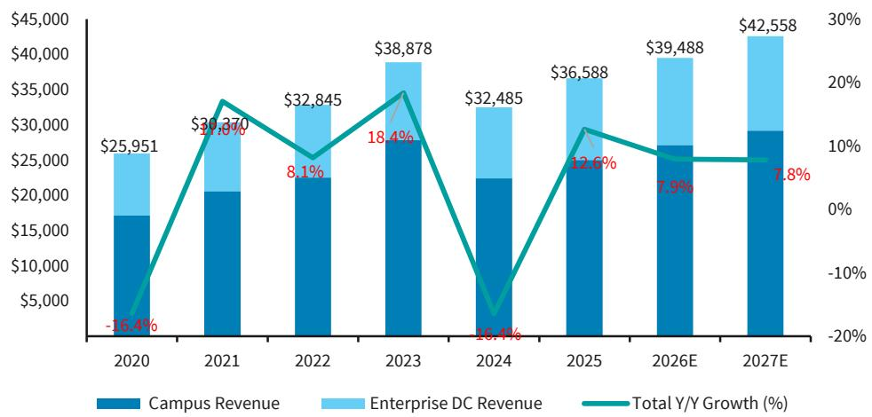
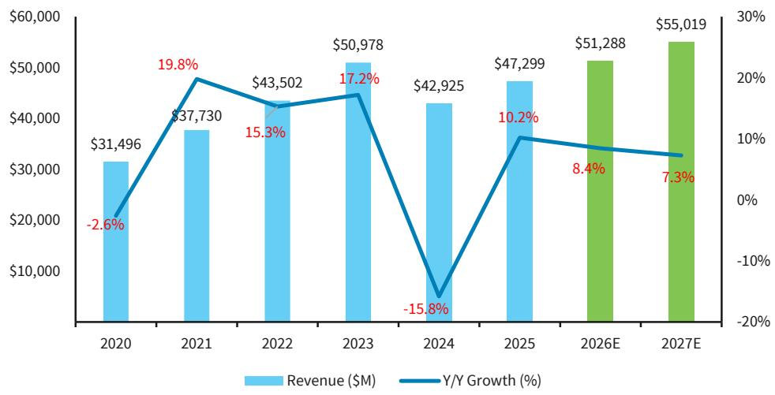
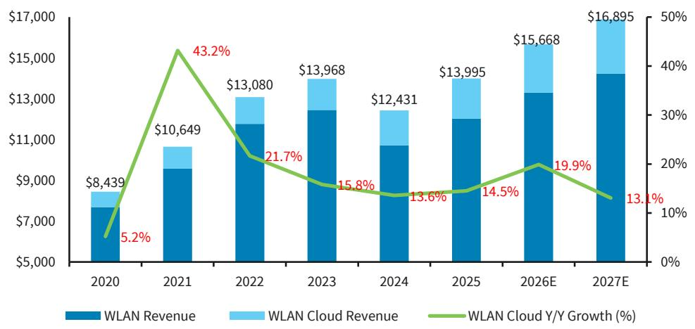

# BARC：校园网络市场正在回归正常增长，真正的竞争焦点是份额再分配

市场已经消化了疫情后混合办公带来的网络设备需求爆发，也消化了2024年的库存修正。但BARC这份最新发布的校园网络模型更新报告揭示了一个更值得关注的信号：未来两年市场增速将温和回落至7%-8%，而真正拉开公司间估值差距的，不再是行业贝塔，而是结构性份额迁移。

这份报告的核心判断可以简化为一句：校园网络市场正在从“周期修复”转向“常态增长”，而在这个阶段，赢家不是靠市场涨潮，而是靠从竞争对手手中夺取份额。

对于关注Arista Networks、Cisco、HPE等网络设备巨头的投资者而言，现在需要回答的问题不再是“市场会不会恢复”，而是“在恢复之后，谁会留下，谁会被挤出”。

## 1. 2024年的深度调整不是终点，而是增长中枢下移的确认

BARC的模型显示，2024年全球校园网络市场经历了16%的同比下滑。这个数字本身并不令人意外——2021年至2023年，市场分别增长了20%、15%和17%，远高于疫情前多年的中个位数增速。混合办公带来的超额采购需求在三年内被集中释放，随后必然是库存消化和订单回落。

但真正重要的不是2024年的修正幅度，而是修正之后的增长中枢。BARC将2026年和2027年的增速预期分别下调至8%和7%，2021年至2026年的复合年增长率从7%降至6%。这意味着，即使市场走出低谷，也不会回到2021-2023年的高位，而是回到一个更接近历史均值、但略高于疫情前水平的“新常态”。

这个判断的背后逻辑是：混合办公带来的结构性需求增量已经基本被定价，未来增长将更多依赖正常的设备更新周期和AI推理在边缘侧的网络准备。对于产业决策者而言，这意味着不能再以“市场会回到2023年水平”来制定产能和库存计划；对于投资者而言，这意味着收入增速的预期需要相应下调，估值倍数需要重新锚定。

## 2. 有线交换仍是最大基本盘，但AI推理带来的边缘升级才刚刚开始

在校园网络的各个子市场中，有线交换始终占据最大份额。BARC预计，2026年有线交换市场增速约为8%，2027年约为7%，与整体市场增速基本同步。但报告特别指出，企业级数据中心交换市场的增速远高于校园交换——2026年和2027年分别达到47%和24%。

这个差异值得深挖。数据中心交换的高速增长显然与AI训练集群的部署直接相关，但BARC同时提到，企业正在为AI推理准备网络基础设施。AI推理发生在边缘侧，这意味着校园网络中的交换设备需要具备更高的带宽、更低的延迟和更强的可管理性。如果这一判断成立，那么未来几年校园交换的更新周期可能会比历史均值更短，设备单价也可能更高。

对于Arista和Cisco这类同时覆盖数据中心和校园市场的厂商，这意味着一个潜在的交叉销售优势：当客户在数据中心部署了Arista的交换设备后，在校园端也倾向于选择同一品牌，以简化运维和降低兼容性风险。BARC的份额数据也印证了这一点——Arista在校园市场的份额从2020年的0.3%预计升至2027年的3.4%，而同期其在数据中心交换市场的份额从11.8%升至23.1%。

## 3. Wi-Fi 7是WLAN市场的明确催化剂，但云管理平台才是真正的竞争壁垒

WLAN市场是BARC报告中增速最为乐观的子领域。预计2026年增长12%，2027年增长8%，均高于整体市场。其中，云管理WLAN的增长更为突出，2021年至2026年的复合年增长率被上调至17%，高于此前预期的15%。

Wi-Fi 7的商用化无疑是这一增长的核心驱动力。但报告隐含的一个更重要的判断是：云管理平台正在成为WLAN市场的竞争壁垒。BARC估计，云管理WLAN目前约占WLAN总收入的15%左右，但增速远高于传统WLAN。这意味着，那些能够提供端到端云管理解决方案的厂商——如HPE旗下的Aruba、Cisco的Meraki——将在这一轮升级周期中获得更强的客户粘性。

对于投资者而言，单纯跟踪WLAN设备的出货量已经不够。需要进一步拆解的是：这些设备中，有多少是搭配云管理服务一起销售的？云服务的订阅收入占比是否在提升？因为订阅模式的收入可见度和利润率通常高于硬件销售，而这恰恰是市场定价时容易忽略的部分。

## 4. Cisco仍是市场霸主，但份额正在被蚕食，Arista是最大的结构受益者

BARC的数据清晰地展示了校园网络市场的竞争格局：Cisco以约50%的份额占据绝对主导地位，HPE维持在11%-12%左右，Arista虽然目前只有低个位数份额，但增长轨迹最为陡峭。

Cisco在2024财年经历了严重的库存修正，校园网络收入从2023年的266亿美元降至204亿美元。但进入2025财年后，订单恢复强劲——第三季度校园网络订单同比增长超过25%，无线订单增长超过40%。BARC预计Cisco的校园网络收入将在2026年和2027年继续增长，但增速低于整体市场，这意味着其份额将继续被Arista等竞争对手蚕食。

Arista的增长逻辑非常清晰：从数据中心交换切入校园市场，利用VeloCloud的SD-WAN能力补齐产品组合，加上前Cisco高管Todd Nightingale负责校园产品线的战略推进。BARC预计Arista的校园市场份额将从2020年的0.3%升至2027年的3.4%。虽然绝对值仍小，但考虑到校园市场的总规模，这对应着数亿美元的收入增量。

HPE则处于一个相对尴尬的位置。其Aruba业务在2024年触底后强劲反弹，但BARC预计其市场份额将维持在11%-12%区间，增长将随市场同步放缓。HPE能否通过Juniper的收购整合来改变这一格局，是报告没有完全展开的问题——但这恰恰是投资者需要密切跟踪的关键变量。

## 5. SD-WAN市场格局正在重塑，Cisco的崛起与Arista的缺席形成鲜明对比

SD-WAN是校园网络市场中竞争格局变化最为剧烈的子领域。BARC的数据显示，Cisco的SD-WAN市场份额从2020年的7%飙升至2025年的27%，预计2026年将达到28%。同期，Arista的份额仅为低个位数，几乎可以忽略不计。

这个反差值得深思。Arista在数据中心交换和校园交换领域高歌猛进，但在SD-WAN这个与校园网络高度相关的子市场中却几乎缺席。原因可能在于，SD-WAN的竞争更多依赖软件生态和渠道覆盖，而非硬件性能，而这恰好是Arista相对薄弱的环节。Cisco凭借其庞大的渠道网络和Meraki云管理平台，在SD-WAN领域建立了强大的先发优势。

对于投资者而言，这个格局意味着：即使Arista在校园交换领域持续夺取份额，其整体校园网络业务的增长天花板可能受到SD-WAN短板的影响。而Cisco虽然整体份额在下降，但在SD-WAN这一高增长子市场中的主导地位，可能为其提供额外的收入和利润支撑。

## 报告尚未完全回答的关键问题：AI推理对校园网络的需求弹性到底有多大

BARC的报告在多个地方提到了AI推理对校园网络升级的驱动作用，但并未给出具体的量化测算。这是一个关键的信息缺口。

AI推理在边缘侧的部署，究竟会带来多大的带宽需求增量？是推动现有设备的正常更新，还是触发一轮类似混合办公的超额采购周期？如果AI推理成为下一个结构性增长引擎，那么Cisco和Arista的份额迁移故事可能需要重新评估——因为AI推理场景对网络架构的要求与传统的校园网络不同，可能更有利于那些在数据中心领域有深厚积累的厂商。

这个问题目前没有答案，但它是理解未来2-3年校园网络市场走向的关键钥匙。BARC的模型假设了8%和7%的增长，但如果AI推理的需求超预期，这个数字可能需要向上修正；反之，如果AI推理的部署节奏慢于预期，增长中枢可能进一步下移。

## 6. 投资者需要关注的三个观察框架

基于BARC的报告，我们提炼出三个用于跟踪校园网络市场变化的框架：

第一，关注份额变化而非总量增长。在整体增速回落的背景下，公司间的份额迁移将决定相对股价表现。Arista的份额能否如期从1.7%升至3.4%，Cisco的份额能否守住50%大关，HPE能否通过并购改变竞争格局——这些才是真正的alpha来源。

第二，关注云管理平台的渗透率。WLAN市场的增长故事中，设备出货量只是表象，真正有价值的是云管理服务的订阅收入占比。如果一家公司的云管理平台收入增速持续高于硬件收入增速，其估值逻辑将从“周期性硬件公司”转向“高粘性软件平台”。

第三，关注AI推理在边缘侧的落地节奏。这是最大的不确定性来源，也是潜在的超预期变量。建议投资者跟踪主要云厂商和企业客户的边缘AI部署计划，以及网络设备厂商的订单指引中是否开始出现与AI推理相关的项目。

---

这份BARC报告提供了详尽的模型更新和竞争格局分析，但正如我们在上文指出的，AI推理对校园网络需求的实际影响、HPE收购Juniper后的整合效果、以及SD-WAN市场的进一步演变，都是报告未能完全覆盖的关键问题。

欢迎来星球微信群里继续讨论这些未解问题——我们会在群内分享原始报告的完整图表和数据，并持续跟踪Arista、Cisco、HPE的最新订单趋势和竞争动态。

Personal reading notes and learning share only. Not investment advice.

