## US Semiconductors

# Rise of the Agents: raising CPU TAM to \$170bn

Price Objective Change

## CPU reborn: Agentic AI drives 5x demand

Based on our analysis and recent industry discussions at BofA Global Tech Conference (see our conf takeaways), we raise our CY2030E server CPU TAM to \$170bn+ (from \$125bn), implying nearly 5x growth and +37% CAGR over CY25-30E (vs. +29% prior). We view the emergence of agentic AI as a powerful demand accelerant that expands the CPU opportunity and lifts both x86incumbents and ARM challengers. Against this backdrop, we raise our AMD PO to \$560 from \$500 on higher CPU/GPU estimates, ARM to \$335 from \$245 on greater l-t chiplet potential; INTC is double-upgraded to Buy with a \$135 PO (see our ), with higher estimates now reflecting both n-t CPU and l-t foundry upsides. NVDA remains our top sector pick on full-stack AI leadership, benefiting from tight CPU-GPU-networking integration, also poised to benefit from agentic CPU. QCOM is expected to announce new AI CPUs at its Jun-24 AI Day in NYC, but we maintain Underperform given tough competition and limited SAM.

## Agentic workloads shift complexity to CPUs from XPUs

Agentic AI differs from traditional genAI by shifting from a single prompt-response workflow to a multi-step system that plans, reasons, retrieves info, uses tools, executes code simultaneously. While XPUs remain critical for inference, many orchestration and decision-making functions are latency-sensitive, sequential, and I/O-intensive—making them better suited for CPUs. Our new CPU model uniquely segments the \$170bn TAM by application (1. standalone agentic CPU; 2. head/compute node CPU for AI clusters; 3. traditional/laaS), as well as by vendor (AMD, INTC, NVDA, ARM merchant, ARM custom). We expect head/compute nodes in AI clusters to use higher frequency and stronger but fewer cores, while agentic and traditional applications will rely on higher core counts.

## Double-upgrading INTC, while AMD top CPU pick

Our INTC double-upgrade is based on higher confidence in INTC's opportunity to help address industry constraints in leading edge wafers/packaging, plus larger agentic CPU TAM. We now see CY30 EPS power \$6+ vs \$3-4 prior, though execution is key. Recent CDNS 14A node IP sign-up and Terafab engagements are additional supportive data points. For AMD, we raise est/PO to \$560, top CPU pick on incumbency + pipeline + upcoming AI day (Venice launch). NVDA remains top sector pick on full-stack leadership.

## ARM/QCOM: CPU share gainers but flag val'n/competition

For ARM, we now use a FY31/CY30E sum-of-parts valuation, see total company value of \~\$335 (\$229 IP + \$106 chip), and we see the stock as fairly valued. QCOM has potential to announce new AI CPUs and lead customers at its Jun-24 AI Day, but we flag tough CPU competition amid already established incumbents.

## Key debate: TAM substitution vs expansion

Debate centers on whether CPUs take share from GPUs/accelerators or contribute to overall AI TAM expansion. We see expansion dominating: CPU demand scales with system complexity, as is the case with reasoning/agentic AI. Additional debates include durability of the 30%+ AI capex CAGR and mix shifts to custom silicon (CPUs and XPUs).

BofA does and seeks to do business with issuers covered in its research reports. As a result, investors should be aware that the firm may have a conflict of interest that could affect the objectivity of this report. Investors should consider this report as only a single factor in making their investment decision.
Refer to important disclosures on page 29 to 33. Analyst Certification on page 27. Price Objective Basis/Risk on page 26.
12983146

## 11 June 2026

Equity

United States

Semiconductors

Vivek Arya

Research Analyst

BofAS

vivek.arya@bofa.com

Duksan Jang

Research Analyst

BofAS

duksan.jang@bofa.com

Michael Mani

Research Analyst

BofAS

michael.mani@bofa.com

Liam Pharr

Research Analyst

BofAS

liam.pharr@bofa.com

Exhibit 1: PO/Rating Changes  
PO/Rating Changes

<table><tr><td colspan="4">PO/Rating Changes</td></tr><tr><td>Ticker</td><td>OLD</td><td>NEW</td><td>RATING</td></tr><tr><td>AMD</td><td>$500</td><td>$560</td><td>BUY</td></tr><tr><td>ARM</td><td>$245</td><td>$335</td><td>NEUTRAL</td></tr><tr><td>INTC</td><td>$96</td><td>$135</td><td>BUY from U/P</td></tr><tr><td>NVDA</td><td>$350</td><td>$350</td><td>BUY</td></tr><tr><td>QCOM</td><td>$165</td><td>$165</td><td>U/P</td></tr></table>

Source: BofA Global Research  
BofA GLOBAL RESEARCH

For detailed company analysis, PO/rating change and valuation discussion, see pg. 10-17.

See glossary on page 23.

## Contents

AI Compute Table of Hierarchy 3

\$170bn+ Server CPU TAM 5

Market share outlook analysis 6

Traditional vs. AI Head Node (Compute) vs. Agentic Rack 7

CPUs now 8%+ of Data Center Systems TAM 9

AMD: Maintain Buy, raise PO to \$560 from \$500 10

AMD CPU Advantages 10

Upcoming catalyst: Advancing AI 2026 (July) 11

INTC: Upgrade to Buy from U/P, PO \$135 12

Fully established IDM by CY30, EPS power \$6+ 12

ARM: Reit. Neutral, raise PO to \$335 14

Sum-of-Parts Valuation: IP & Chip Businesses 14

NVDA: Maintain Buy, top AI sector pick 15

Rising content, increasing opp'ty, solid supply visibility 15

Vera Rubin now in full production, lowest token cost 15

Vera CPU: head node vs. agentic AI likely 50/50 opp'ty 16

NVDA content \$/GW rising materially gen-over-gen 16

RTX Spark for personal agentic AI, for top 10% Windows 16

QCOM: U/P on competitive landscape 17

Role of CPUs in Agentic AI 18

CPUs in training 18

CPUs in inference 19

CPUs in Agentic AI 20

Agentic AI is system-led, not CPU or GPU-led 21

AI CPUs expand system TAM, not replace 21

## AI Compute Table of Hierarchy

Below, we present our latest table of hierarchy for global data center systems TAM of \~\$2.1Tn, of which CPUs make up \~\$170bn of the total value.

Within this, we break out CPUs in three different categories (more detail in following pages):

1. Traditional/on-prem/multi-tenant cloud CPUs: \~\$30bn  
2. AI cluster compute/head node CPUs: \~\$70bn  
3. AI agentic standalone node CPUs: \~\$70bn

Exhibit 2: Of the total \$2.1Tn CY30 DC Systems TAM, we see AI CPUs representing \~\$140bn of the value (split roughly 50/50 across compute/head node and agentic AI node), non-AI CPUs \~\$30bn

Data Center Systems TAM – Breakout by: AI vs. non-AI; AI CPUs vs. non-AI CPUs

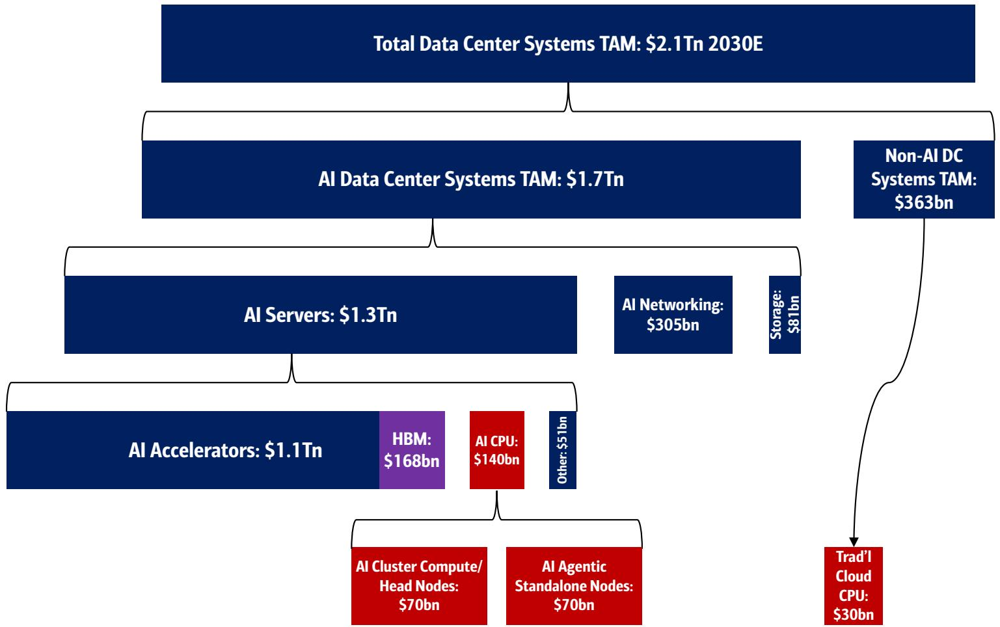

stacked bar chart

| Category | Value |
| :--- | :--- |
| Total Data Center Systems TAM: $2.1Tn 2030E | |
| AI Data Center Systems TAM: $1.7Tn | |
| Non-AI DC Systems TAM: $363bn | |
| AI Servers: $1.3Tn | |
| AI Networking: $305bn | |
| Storage: $81bn | |
| AI Accelerators: $1.1Tn | HBM: $168bn |
| AI Accelerators: $1.1Tn | AI CPU: $140bn |
| AI Accelerators: $1.1Tn | Other: $51bn |
| Trad'I Cloud CPU: $30bn | |
| AI Cluster Compute/Head Nodes: $70bn | |
| AI Agentic Standalone Nodes: $70bn | |

Source: BofA Global Research  
BofA GLOBAL RESEARCH

The below infographic highlights how the role of the CPU evolves across different server architectures:

1. Traditional Server: The CPU is the primary "jack-of-all-trades," managing the OS, applications, and direct I/O for general workloads. (\~\$30bn CY30E TAM)  
2. AI Server Cluster: The CPU's role bifurcates into a Head Node for cluster orchestration and management, and a Compute Node focused on supervising and feeding data to GPUs. (\~\$70bn CY30E TAM)  
3. Agentic Server: The CPU becomes the central orchestrator for autonomous actions, managing the high-level reasoning loops, memory state, and tool integration required for AI agents. (\~\$70bn CY30E TAM)

Exhibit 3: We flag three key roles of CPUs in servers: 1. Traditional, 2. AI compute/head node, 3. AI agentic node Role of the CPU in different server architectures

## ROLE OF THE CPU IN DIFFERENT SERVER ARCHITECTURES

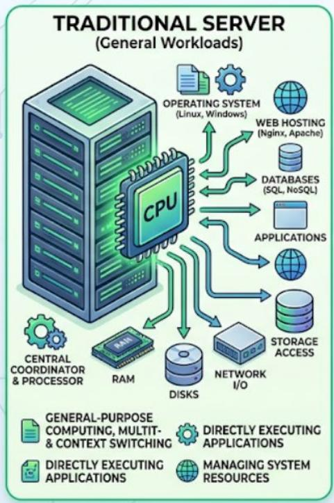

flowchart

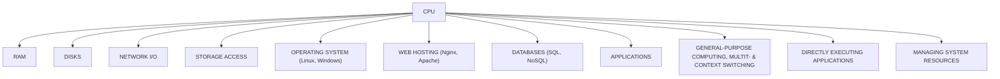

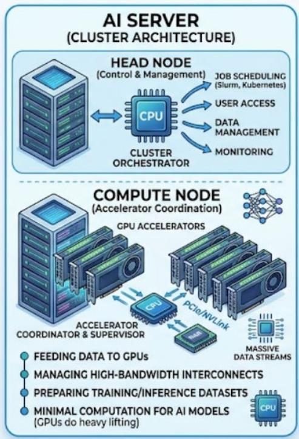

flowchart

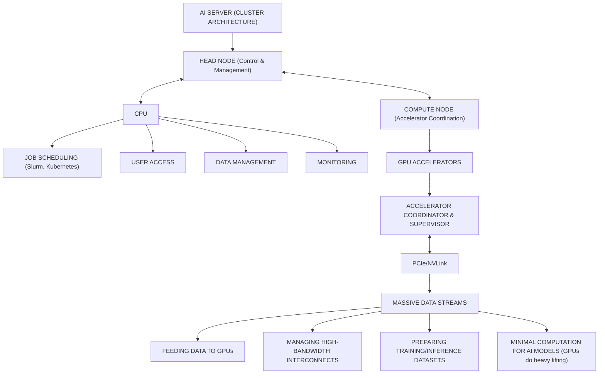

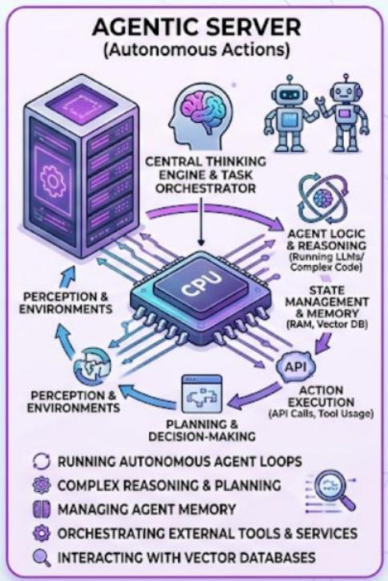

flowchart

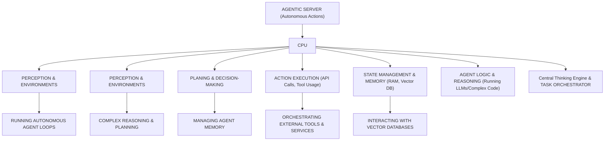

Source: BofA Global Research  
BofA GLOBAL RESEARCH

## \$170bn+ Server CPU TAM

Given the rising role of CPUs in AI head node (compute node) and agentic AI, we now expect server CPU TAM to reach \~\$170bn by CY30E from \~\$35bn in CY25 (+37% CAGR), versus prior \~\$125bn outlook (+29% CAGR).

Notably, we break out the market into 4 different vendor/types: 1) INTC, 2) AMD, 3) ARM (merchant), and 4) ARM (custom/ASIC).

- For ARM merchant CPUs, we now assume ASPs that are \~1.25x higher than average AMD CPUs, given ARM merchant almost only caters to hyperscale/AI applications, versus AMD mostly hyperscale with a bit of enterprise exposure.  
- For ARM custom CPUs, we now assume ASPs that are \~75% of typical AMD solutions, given continued mix shift toward hyperscale solutions (higher ASPs), but merchant server CPUs typically carry 40-60% GM (i.e. 40-60% is COGS or the cost that AWS/Google would theoretically be paying for their custom CPUs)

Exhibit 4: We see total server CPU TAM reaching \$170bn+ by CY30 from \$35bn in CY25, growing at +37% CAGR  
Server CPU TAM (by revenue, units, ASP)

<table><tr><td>Server CPU TAM</td><td>2023</td><td>2024</td><td>2025</td><td>2026E</td><td>2027E</td><td>2028E</td><td>2029E</td><td>2030E</td><td>CY25-30 CAGR</td></tr><tr><td colspan="10">Revenue ($bn)</td></tr><tr><td>Total</td><td>$19.5</td><td>$22.5</td><td>$35.2</td><td>$59.6</td><td>$89.8</td><td>$110.4</td><td>$138.2</td><td>$170.1</td><td>37.1%</td></tr><tr><td>INTC</td><td>$13.2</td><td>$13.6</td><td>$14.4</td><td>$19.8</td><td>$24.7</td><td>$29.6</td><td>$35.1</td><td>$41.2</td><td>23.4%</td></tr><tr><td>AMD</td><td>$5.6</td><td>$7.1</td><td>$9.6</td><td>$16.4</td><td>$22.2</td><td>$28.6</td><td>$35.7</td><td>$43.6</td><td>35.4%</td></tr><tr><td>ARM</td><td>$0.7</td><td>$1.8</td><td>$11.2</td><td>$23.4</td><td>$42.9</td><td>$52.2</td><td>$67.5</td><td>$85.4</td><td>50.0%</td></tr><tr><td>ARM Merchant</td><td>$0.0</td><td>$0.7</td><td>$10.3</td><td>$19.5</td><td>$34.8</td><td>$38.2</td><td>$47.9</td><td>$60.6</td><td>42.6%</td></tr><tr><td>NVDA</td><td></td><td>$0.7</td><td>$10.3</td><td>$19.5</td><td>$33.7</td><td>$35.4</td><td>$39.0</td><td>$42.2</td><td>32.7%</td></tr><tr><td>ARM</td><td></td><td></td><td></td><td></td><td>$0.7</td><td>$1.8</td><td>$5.9</td><td>$12.3</td><td></td></tr><tr><td>QCOM</td><td></td><td></td><td></td><td></td><td>$0.4</td><td>$0.9</td><td>$3.0</td><td>$6.1</td><td></td></tr><tr><td>ARM Custom (Graviton, Axion, Cobalt, etc.)</td><td>$0.7</td><td>$1.0</td><td>$1.0</td><td>$3.9</td><td>$8.1</td><td>$14.1</td><td>$19.6</td><td>$24.8</td><td>91.0%</td></tr><tr><td colspan="10">Units (mn)</td></tr><tr><td>Total</td><td>24.5</td><td>24.2</td><td>29.2</td><td>39.3</td><td>49.0</td><td>57.1</td><td>66.0</td><td>74.7</td><td>20.7%</td></tr><tr><td>INTC</td><td>18.5</td><td>16.9</td><td>17.9</td><td>21.1</td><td>23.2</td><td>24.9</td><td>26.7</td><td>28.6</td><td>9.7%</td></tr><tr><td>AMD</td><td>4.8</td><td>5.5</td><td>7.2</td><td>10.4</td><td>12.5</td><td>14.5</td><td>16.3</td><td>18.1</td><td>20.2%</td></tr><tr><td>ARM</td><td>1.2</td><td>1.8</td><td>4.0</td><td>7.9</td><td>13.3</td><td>17.7</td><td>22.9</td><td>28.0</td><td>47.4%</td></tr><tr><td>ARM Merchant</td><td>0.0</td><td>0.2</td><td>2.6</td><td>4.6</td><td>7.2</td><td>8.2</td><td>10.9</td><td>14.2</td><td>40.9%</td></tr><tr><td>NVDA</td><td>0.0</td><td>0.2</td><td>2.6</td><td>4.6</td><td>6.7</td><td>7.1</td><td>7.7</td><td>8.1</td><td>25.9%</td></tr><tr><td>ARM</td><td>0.0</td><td>0.0</td><td>0.0</td><td>0.0</td><td>0.3</td><td>0.7</td><td>2.2</td><td>4.1</td><td></td></tr><tr><td>QCOM</td><td>0.0</td><td>0.0</td><td>0.0</td><td>0.0</td><td>0.2</td><td>0.4</td><td>1.1</td><td>2.0</td><td></td></tr><tr><td>ARM Custom (Graviton, Axion, Cobalt, etc.)</td><td>1.2</td><td>1.6</td><td>1.5</td><td>3.3</td><td>6.1</td><td>9.5</td><td>12.0</td><td>13.8</td><td>56.6%</td></tr><tr><td colspan="10">ASP ($)</td></tr><tr><td>Total</td><td>$797</td><td>$931</td><td>$1,204</td><td>$1,517</td><td>$1,833</td><td>$1,934</td><td>$2,095</td><td>$2,277</td><td>13.6%</td></tr><tr><td>INTC</td><td>$716</td><td>$804</td><td>$801</td><td>$941</td><td>$1,065</td><td>$1,186</td><td>$1,311</td><td>$1,442</td><td>12.5%</td></tr><tr><td>AMD</td><td>$1,164</td><td>$1,299</td><td>$1,322</td><td>$1,581</td><td>$1,778</td><td>$1,976</td><td>$2,183</td><td>$2,401</td><td>12.7%</td></tr><tr><td>ARM</td><td>$589</td><td>$998</td><td>$2,790</td><td>$2,972</td><td>$3,225</td><td>$2,956</td><td>$2,950</td><td>$3,049</td><td>1.8%</td></tr><tr><td>ARM Merchant</td><td></td><td>$4,000</td><td>$4,000</td><td>$4,240</td><td>$4,820</td><td>$4,658</td><td>$4,393</td><td>$4,255</td><td>1.2%</td></tr><tr><td>NVDA</td><td></td><td>$4,000</td><td>$4,000</td><td>$4,240</td><td>$5,000</td><td>$5,000</td><td>$5,100</td><td>$5,202</td><td>5.4%</td></tr><tr><td>ARM</td><td></td><td></td><td></td><td></td><td>$2,249</td><td>$2,476</td><td>$2,729</td><td>$3,002</td><td></td></tr><tr><td>QCOM</td><td></td><td></td><td></td><td></td><td>$2,249</td><td>$2,476</td><td>$2,729</td><td>$3,002</td><td></td></tr><tr><td>ARM Custom (Graviton, Axion, Cobalt, etc.)</td><td>$589</td><td>$649</td><td>$666</td><td>$1,191</td><td>$1,336</td><td>$1,484</td><td>$1,637</td><td>$1,801</td><td>22.0%</td></tr><tr><td colspan="10">Value Share (%)</td></tr><tr><td>Total</td><td>100%</td><td>100%</td><td>100%</td><td>100%</td><td>100%</td><td>100%</td><td>100%</td><td>100%</td><td></td></tr><tr><td>INTC</td><td>68%</td><td>61%</td><td>41%</td><td>33%</td><td>28%</td><td>27%</td><td>25%</td><td>24%</td><td></td></tr><tr><td>AMD</td><td>29%</td><td>32%</td><td>27%</td><td>28%</td><td>25%</td><td>26%</td><td>26%</td><td>26%</td><td></td></tr><tr><td>ARM</td><td>4%</td><td>8%</td><td>32%</td><td>39%</td><td>48%</td><td>47%</td><td>49%</td><td>50%</td><td></td></tr><tr><td>ARM Merchant</td><td>0%</td><td>3%</td><td>29%</td><td>33%</td><td>39%</td><td>35%</td><td>35%</td><td>36%</td><td></td></tr><tr><td>NVDA</td><td></td><td>3%</td><td>29%</td><td>33%</td><td>38%</td><td>32%</td><td>28%</td><td>25%</td><td></td></tr><tr><td>ARM</td><td></td><td></td><td></td><td></td><td>1%</td><td>2%</td><td>4%</td><td>7%</td><td></td></tr><tr><td>QCOM</td><td></td><td></td><td></td><td></td><td>0%</td><td>1%</td><td>2%</td><td>4%</td><td></td></tr><tr><td>ARM Custom (Graviton, Axion, Cobalt, etc.)</td><td>4%</td><td>5%</td><td>3%</td><td>7%</td><td>9%</td><td>13%</td><td>14%</td><td>15%</td><td></td></tr></table>

BofA GLOBAL RESEARCH

## Market share outlook analysis

From a market share perspective, we continue to expect ARM to be the fastest gainer through CY30 as multiple new merchant (i.e. ARM AGI, NVDA Vera, QCOM CPU) and custom (i.e., AWS Graviton 5, Google Axion, Microsoft Cobalt) programs ramp.

Exhibit 5: We expect INTC/AMD to each represent \~25% value share, ARM merchant \~35%, ARM custom \~15% by CY30  
Server CPU TAM (\$mn) and Value Market Share Outlook  
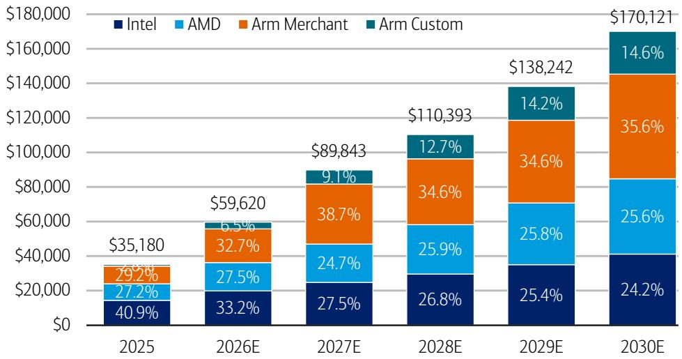

stacked bar chart

| Year | Intel (%) | AMD (%) | Arm Merchant (%) | Arm Custom (%) |
| :--- | :--- | :--- | :--- | :--- |
| 2025 | 40.9 | 27.2 | 29.2 | 1.8 |
| 2026E | 33.2 | 27.5 | 32.7 | 6.5 |
| 2027E | 27.5 | 24.7 | 38.7 | 9.1 |
| 2028E | 26.8 | 25.9 | 34.6 | 12.7 |
| 2029E | 25.4 | 25.8 | 34.6 | 14.2 |
| 2030E | 24.2 | 25.6 | 35.6 | 14.6 |
Total: $170,121
$138,242
Note: The chart displays a stacked bar chart with values in parentheses and percentages indicating the proportion of each segment within the total revenue.

Source: BofA Global Research estimates, Mercury Research, IDC  
BofA GLOBAL RESEARCH

\- INTC (\~25% value share): We see share declining to just \~24% of total server CPU value by CY30 from \~41% in CY25, though we expect INTC's continued relative strength in traditional enterprise workloads.

However, we see continued \$ revenue growth of +20% CAGR between CY26-30, particularly as INTC navigates through the industry-wide supply shortages, benefits from ASP expansion. By CY28, next-next-gen Coral Rapids should ramp and could begin to narrow the performance gap vs. competition.

\- AMD (\~25% value share): We see share of \~25-27% generally through CY30, given AMD's continued performance lead at the high-end (high-frequency, high-core-count AI head node and agentic node), offset by relative stronger ramps of ARM-based processors launching beginning CY27E.

Particularly, we flag AMD's leading core count portfolio, given higher core density within a fixed power envelope increases overall aggregate service throughput. 6th gen EPYC Venice will top out at 256 cores, while the current 5th gen Turin tops out at 192 cores, vs. NVDA Vera at 88 cores and INTC's current Granite Rapids topping at 128 cores and upcoming Diamond Rapids likely maxing at 192 cores.

Similar to INTC, we expect AMD to continue benefiting from the x86 ecosystem's advantages in security and RAS features, particularly important in agentic AI workloads.

- ARM (merchant; \~35% value share): We see share rising to \~36% by CY30 from \~29% in CY25, led by a continued ramp of NVDA CPUs (in both compute/agentic nodes), as well as new ARM/QCOM merchant solutions ramping in CY27-28.  
- ARM (custom; \~15% value share): We see significant share gain toward 15% by CY30 from <5% in CY23-25 as new custom ARM-based CPU solutions launch and ramp at multiple hyperscalers. Every year, the ARM content/ASP grows as core counts and performance per core grow.

On a unit share basis, we expect INTC to remain the largest at \~38% share by CY30.

Exhibit 6: We expect INTC to represent \~38% unit share, AMD \~24%, ARM merchant \~19%, and ARM custom \~18% by CY30  
Server CPU TAM (mn units) and Unit Market Share Outlook  
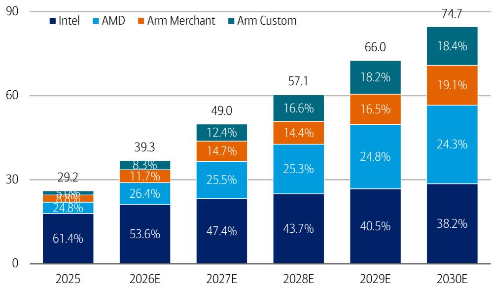

stacked bar chart

| Year | Intel (%) | AMD (%) | Arm Merchant (%) | Arm Custom (%) |
| --- | --- | --- | --- | --- |
| 2025 | 61.4 | 24.8 | 8.8 | 5.1 |
| 2026E | 53.6 | 26.4 | 11.7 | 8.3 |
| 2027E | 47.4 | 25.5 | 14.7 | 12.4 |
| 2028E | 43.7 | 25.3 | 14.4 | 16.6 |
| 2029E | 40.5 | 24.8 | 16.5 | 18.2 |
| 2030E | 38.2 | 24.3 | 19.1 | 18.4 |

Source: BofA Global Research estimates, Mercury Research, IDC  
BofA GLOBAL RESEARCH

## Traditional vs. AI Head Node (Compute) vs. Agentic Rack

In the following Exhibit, we also present the \$170bn CY30 server CPU TAM in 3 different key workloads: 1) traditional/infrastructure-as-a-service, 2) AI compute node or head node, and 3) AI agentic standalone CPU node.

Particularly, we expect the two AI applications to represent \~50%/50% of the total CPU demand in AI data centers (\~\$140bn) by CY30, as NVDA recently highlighted.

\- Traditional/IaaS: This includes the most traditional and conventional CPU use cases for enterprises on-prem and on public cloud.

This segment represented the vast majority of the server CPU market in 2010-2020, growing \~11-12% CAGR during that period. For the next five years, we expect this growth rate to continue, at \~11-12% sales CAGR range, or units growing \~7-9% CAGR, with ASPs growing \~3-5% CAGR.

\- AI compute node, head node: This includes CPUs that are attached to GPUs/XPUs and are acting as supporting roles within the compute rack (most pronouncedly NVDA's NVL72 rack, AMD's MI455 'Helios' rack, TPUv8 racks). In other words, these CPUs are used as part of the scale-up domain, facilitating XPU compute.

While the vast majority of initial AI CPU use cases (\~2022-2026) were compute/head nodes, we anticipate a mix shift toward agentic AI standalone CPU racks over time (2026-2030), eventually the two AI use cases likely representing \~50/50 of all AI workloads.

\- AI agentic standalone CPU node/rack: This includes the new CPU-only standalone racks, such as the NVDA Vera CPX rack which is part of the overall 40-rack Vera Rubin SuperPOD. These CPU-only racks are highly optimized for agentic AI workloads which require sequential processing in tandem with GPU/XPU's parallel compute processing, and are responsible for orchestration, memory control, I/O, etc.

Exhibit 7: Of the \$170bn CY30 CPU TAM, we see \~\$30bn for traditional/laaS, \~\$70bn for AI compute/head node, \~\$70bn for agentic AI CPU racks
Server CPU TAM Breakout by Workload

<table><tr><td colspan="2"></td><td>2022</td><td>2023</td><td>2024</td><td>2025</td><td>2026</td><td>2027</td><td>2028</td><td>2029E</td><td>2030E</td><td>CAGR&#x27;20-&#x27;25</td><td>CAGR&#x27;25-&#x27;30</td><td>CAGR&#x27;10-&#x27;20</td><td>Notes</td></tr><tr><td rowspan="20">CPU Sales ($mn)</td><td>Total</td><td>$23.9</td><td>$19.5</td><td>$22.5</td><td>$35.2</td><td>$59.6</td><td>$89.8</td><td>$110.4</td><td>$138.2</td><td>$170.1</td><td>7.3%</td><td>37.1%</td><td></td><td>Bottom-Up Build</td></tr><tr><td>Intel</td><td>$18.1</td><td>$13.2</td><td>$13.6</td><td>$14.4</td><td>$19.8</td><td>$24.7</td><td>$29.6</td><td>$35.1</td><td>$41.2</td><td>-9.0%</td><td>23.4%</td><td></td><td></td></tr><tr><td>AMD</td><td>$5.6</td><td>$5.6</td><td>$7.1</td><td>$9.6</td><td>$16.4</td><td>$22.2</td><td>$28.6</td><td>$35.7</td><td>$43.6</td><td>44.0%</td><td>35.4%</td><td></td><td></td></tr><tr><td>Arm</td><td>$0.2</td><td>$0.7</td><td>$1.8</td><td>$11.2</td><td>$23.4</td><td>$42.9</td><td>$52.2</td><td>$67.5</td><td>$85.4</td><td>167.8%</td><td>50.0%</td><td></td><td></td></tr><tr><td>Traditional/IaaS</td><td>$22.9</td><td>$18.0</td><td>$17.4</td><td>$17.0</td><td>$19.0</td><td>$21.2</td><td>$23.7</td><td>$26.4</td><td>$29.5</td><td>-6.9%</td><td>11.7%</td><td>11.9%</td><td></td></tr><tr><td>Intel</td><td>$17.3</td><td>$12.2</td><td>$11.3</td><td>$10.7</td><td>$12.0</td><td>$13.5</td><td>$15.2</td><td>$17.1</td><td>$19.2</td><td>-14.0%</td><td>12.4%</td><td>11.9%</td><td></td></tr><tr><td>AMD</td><td>$5.4</td><td>$5.1</td><td>$5.2</td><td>$5.3</td><td>$5.8</td><td>$6.4</td><td>$7.0</td><td>$7.6</td><td>$8.4</td><td>27.8%</td><td>9.8%</td><td>10.9%</td><td></td></tr><tr><td>Arm</td><td>$0.2</td><td>$0.7</td><td>$0.9</td><td>$1.0</td><td>$1.2</td><td>$1.3</td><td>$1.5</td><td>$1.7</td><td>$1.9</td><td>66.4%</td><td>13.4%</td><td>N/A</td><td></td></tr><tr><td>AI (Compute/Agentic)</td><td>$1.0</td><td>$1.5</td><td>$5.1</td><td>$18.2</td><td>$40.6</td><td>$68.6</td><td>$86.7</td><td>$111.8</td><td>$140.6</td><td>123.3%</td><td>50.6%</td><td></td><td></td></tr><tr><td>Intel</td><td>$0.8</td><td>$1.0</td><td>$2.4</td><td>$3.7</td><td>$7.8</td><td>$11.2</td><td>$14.4</td><td>$18.0</td><td>$22.0</td><td>62.4%</td><td>43.2%</td><td></td><td></td></tr><tr><td>AMD</td><td>$0.2</td><td>$0.5</td><td>$1.9</td><td>$4.3</td><td>$10.6</td><td>$15.8</td><td>$21.6</td><td>$28.0</td><td>$35.2</td><td>292.4%</td><td>52.1%</td><td></td><td></td></tr><tr><td>Arm</td><td>$0.0</td><td>$0.0</td><td>$0.9</td><td>$10.2</td><td>$22.2</td><td>$41.6</td><td>$50.7</td><td>$65.8</td><td>$83.4</td><td></td><td>52.3%</td><td></td><td></td></tr><tr><td>Compute/Head Node</td><td>$1.0</td><td>$1.5</td><td>$5.1</td><td>$18.2</td><td>$34.5</td><td>$44.6</td><td>$52.0</td><td>$61.5</td><td>$70.3</td><td>123.3%</td><td>31.1%</td><td></td><td></td></tr><tr><td>Intel</td><td>$0.8</td><td>$1.0</td><td>$2.4</td><td>$3.7</td><td>$6.6</td><td>$7.3</td><td>$8.6</td><td>$9.9</td><td>$11.0</td><td>62.4%</td><td>24.7%</td><td></td><td></td></tr><tr><td>AMD</td><td>$0.2</td><td>$0.5</td><td>$1.9</td><td>$4.3</td><td>$9.0</td><td>$10.3</td><td>$13.0</td><td>$15.4</td><td>$17.6</td><td>292.4%</td><td>32.4%</td><td></td><td></td></tr><tr><td>Arm</td><td>$0.0</td><td>$0.0</td><td>$0.9</td><td>$10.2</td><td>$13.2</td><td>$27.0</td><td>$30.4</td><td>$36.2</td><td>$41.7</td><td></td><td>32.5%</td><td></td><td></td></tr><tr><td>Agentic AI Node</td><td>$0.0</td><td>$0.0</td><td>$0.0</td><td>$0.0</td><td>$6.1</td><td>$24.0</td><td>$34.7</td><td>$50.3</td><td>$70.3</td><td></td><td></td><td></td><td></td></tr><tr><td>Intel</td><td>$0.0</td><td>$0.0</td><td>$0.0</td><td>$0.0</td><td>$1.2</td><td>$3.9</td><td>$5.8</td><td>$8.1</td><td>$11.0</td><td></td><td></td><td></td><td></td></tr><tr><td>AMD</td><td>$0.0</td><td>$0.0</td><td>$0.0</td><td>$0.0</td><td>$1.6</td><td>$5.5</td><td>$8.6</td><td>$12.6</td><td>$17.6</td><td></td><td></td><td></td><td></td></tr><tr><td>Arm</td><td>$0.0</td><td>$0.0</td><td>$0.0</td><td>$0.0</td><td>$9.0</td><td>$14.6</td><td>$20.3</td><td>$29.6</td><td>$41.7</td><td></td><td></td><td></td><td></td></tr><tr><td rowspan="12">CPU Units (mn)</td><td>Total</td><td>36.6</td><td>24.5</td><td>24.2</td><td>29.2</td><td>39.3</td><td>49.0</td><td>57.1</td><td>66.0</td><td>74.7</td><td>-3.9%</td><td>20.7%</td><td></td><td>Bottom-Up Build</td></tr><tr><td>Intel</td><td>30.7</td><td>18.5</td><td>16.9</td><td>17.9</td><td>21.1</td><td>23.2</td><td>24.9</td><td>26.7</td><td>28.6</td><td>-11.6%</td><td>9.7%</td><td></td><td></td></tr><tr><td>AMD</td><td>5.4</td><td>4.8</td><td>5.5</td><td>7.2</td><td>10.4</td><td>12.5</td><td>14.5</td><td>16.3</td><td>18.1</td><td>27.2%</td><td>20.2%</td><td></td><td></td></tr><tr><td>Arm</td><td>0.4</td><td>1.2</td><td>1.8</td><td>4.0</td><td>7.9</td><td>13.3</td><td>17.7</td><td>22.9</td><td>28.0</td><td>77.1%</td><td>47.4%</td><td></td><td></td></tr><tr><td>Traditional/IaaS</td><td>35.6</td><td>23.2</td><td>20.5</td><td>20.9</td><td>22.4</td><td>24.0</td><td>25.7</td><td>27.5</td><td>29.5</td><td>-9.9%</td><td>7.1%</td><td>9.1%</td><td>~7-9% CAGR</td></tr><tr><td>Intel</td><td>29.9</td><td>17.6</td><td>14.8</td><td>14.8</td><td>15.8</td><td>16.9</td><td>18.1</td><td>19.4</td><td>20.7</td><td>-14.8%</td><td>7.0%</td><td>9.3%</td><td></td></tr><tr><td>AMD</td><td>5.2</td><td>4.4</td><td>4.2</td><td>4.5</td><td>4.8</td><td>5.2</td><td>5.5</td><td>5.8</td><td>6.2</td><td>15.8%</td><td>6.6%</td><td>5.9%</td><td></td></tr><tr><td>Arm</td><td>0.4</td><td>1.2</td><td>1.5</td><td>1.6</td><td>1.8</td><td>2.0</td><td>2.1</td><td>2.3</td><td>2.5</td><td>48.2%</td><td>9.0%</td><td>N/A</td><td></td></tr><tr><td>AI (Compute/Agentic)</td><td>1.0</td><td>1.3</td><td>3.7</td><td>8.3</td><td>16.9</td><td>25.0</td><td>31.4</td><td>38.4</td><td>45.2</td><td>103.5%</td><td>40.5%</td><td></td><td></td></tr><tr><td>Intel</td><td>0.8</td><td>0.9</td><td>2.2</td><td>3.2</td><td>5.2</td><td>6.3</td><td>6.8</td><td>7.4</td><td>7.8</td><td>68.6%</td><td>19.9%</td><td></td><td></td></tr><tr><td>AMD</td><td>0.2</td><td>0.4</td><td>1.3</td><td>2.7</td><td>5.5</td><td>7.3</td><td>9.0</td><td>10.5</td><td>11.9</td><td>262.3%</td><td>34.4%</td><td></td><td></td></tr><tr><td>Arm</td><td>0.0</td><td>0.0</td><td>0.3</td><td>2.4</td><td>6.1</td><td>11.4</td><td>15.5</td><td>20.6</td><td>25.5</td><td>452.6%</td><td>60.6%</td><td></td><td></td></tr><tr><td rowspan="12">CPU ASP ($k)</td><td>Total</td><td>$0.7</td><td>$0.8</td><td>$0.9</td><td>$1.2</td><td>$1.5</td><td>$1.8</td><td>$1.9</td><td>$2.1</td><td>$2.3</td><td>11.7%</td><td>13.6%</td><td></td><td>Bottom-Up Build</td></tr><tr><td>Intel</td><td>$0.6</td><td>$0.7</td><td>$0.8</td><td>$0.8</td><td>$0.9</td><td>$1.1</td><td>$1.2</td><td>$1.3</td><td>$1.4</td><td>2.9%</td><td>12.5%</td><td></td><td></td></tr><tr><td>AMD</td><td>$1.0</td><td>$1.2</td><td>$1.3</td><td>$1.3</td><td>$1.6</td><td>$1.8</td><td>$2.0</td><td>$2.2</td><td>$2.4</td><td>13.2%</td><td>12.7%</td><td></td><td></td></tr><tr><td>Arm</td><td>$0.5</td><td>$0.6</td><td>$1.0</td><td>$2.8</td><td>$3.0</td><td>$3.2</td><td>$3.0</td><td>$3.0</td><td>$3.0</td><td>51.2%</td><td>1.8%</td><td></td><td></td></tr><tr><td>Traditional/IaaS</td><td>$0.6</td><td>$0.8</td><td>$0.8</td><td>$0.8</td><td>$0.8</td><td>$0.9</td><td>$0.9</td><td>$1.0</td><td>$1.0</td><td>3.3%</td><td>4.3%</td><td>2.5%</td><td>~3-5% CAGR</td></tr><tr><td>Intel</td><td>$0.6</td><td>$0.7</td><td>$0.8</td><td>$0.7</td><td>$0.8</td><td>$0.8</td><td>$0.8</td><td>$0.9</td><td>$0.9</td><td>1.0%</td><td>5.0%</td><td>2.4%</td><td></td></tr><tr><td>AMD</td><td>$1.0</td><td>$1.1</td><td>$1.2</td><td>$1.2</td><td>$1.2</td><td>$1.2</td><td>$1.3</td><td>$1.3</td><td>$1.3</td><td>10.3%</td><td>3.0%</td><td>4.7%</td><td></td></tr><tr><td>Arm</td><td>$0.5</td><td>$0.6</td><td>$0.6</td><td>$0.6</td><td>$0.7</td><td>$0.7</td><td>$0.7</td><td>$0.7</td><td>$0.8</td><td>12.3%</td><td>4.0%</td><td>N/A</td><td></td></tr><tr><td>AI (Compute/Agentic)</td><td>$1.0</td><td>$1.2</td><td>$1.4</td><td>$2.2</td><td>$2.4</td><td>$2.7</td><td>$2.8</td><td>$2.9</td><td>$3.1</td><td>9.7%</td><td>7.2%</td><td></td><td></td></tr><tr><td>Intel</td><td>$1.0</td><td>$1.1</td><td>$1.1</td><td>$1.2</td><td>$1.5</td><td>$1.8</td><td>$2.1</td><td>$2.4</td><td>$2.8</td><td>-3.7%</td><td>19.4%</td><td></td><td>Double-digit CAGR</td></tr><tr><td>AMD</td><td>$1.2</td><td>$1.4</td><td>$1.5</td><td>$1.6</td><td>$1.9</td><td>$2.2</td><td>$2.4</td><td>$2.7</td><td>$3.0</td><td>8.3%</td><td>13.2%</td><td></td><td>Double-digit CAGR</td></tr><tr><td>Arm</td><td></td><td></td><td>$3.2</td><td>$4.3</td><td>$3.7</td><td>$3.7</td><td>$3.3</td><td>$3.2</td><td>$3.3</td><td></td><td>-5.2%</td><td></td><td>NVDA share declines</td></tr><tr><td rowspan="3">CPU-XPU Ratio</td><td>AI CPU Unit TAM</td><td>1.0</td><td>1.3</td><td>3.7</td><td>8.3</td><td>16.9</td><td>25.0</td><td>31.4</td><td>38.4</td><td>45.2</td><td>103.5%</td><td>40.5%</td><td></td><td>Bottom-Up Build</td></tr><tr><td>XPU Unit TAM</td><td>4.9</td><td>6.2</td><td>11.0</td><td>16.3</td><td>23.6</td><td>28.7</td><td>28.9</td><td>32.8</td><td>35.6</td><td>39.0%</td><td>16.9%</td><td></td><td>AI Accelerator Model</td></tr><tr><td>AI CPU/XPU Ratio (%)</td><td>19%</td><td>20%</td><td>33%</td><td>51%</td><td>71%</td><td>87%</td><td>108%</td><td>117%</td><td>127%</td><td></td><td></td><td></td><td></td></tr></table>

Source: BofA Global Research estimates, Mercury Research, IDC

BofA GLOBAL RESEARCH

## CPUs now 8%+ of Data Center Systems TAM

At \~\$170bn+ TAM, we now believe server CPUs to make up 8%+ of overall data center systems TAM over time (vs. prior 5-6%), up modestly from a low of <7% in 2025 when the value share of AI training was at its peak.

Over time, we expect the value of CPUs in DC systems to modestly expand given their roles in AI inference and agentic AI workloads, though still at a more limited 7-8% range given other components (such as AI accelerators, HBM memory, networking, connectivity) also remain critical to the overall system.

Exhibit 8: We expect server CPUs to make up 8%+ of total DC TAM value over time, modestly expanding over time as their roles increase in agentic AI workloads  
Server CPU as a \% of DC Systems TAM  
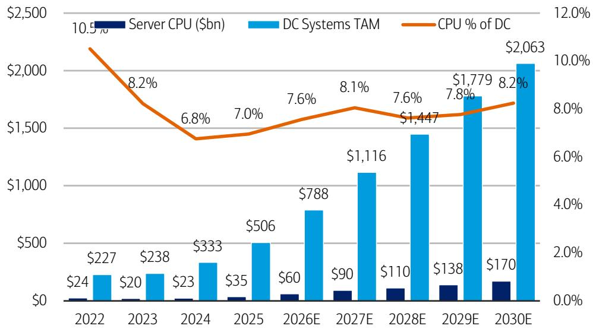

bar-line hybrid

| Year | Server CPU ($bn) | DC Systems TAM ($) | CPU % of DC (%) |
| :--- | :--- | :--- | :--- |
| 2022 | 24 | 227 | 10.5 |
| 2023 | 20 | 238 | 8.2 |
| 2024 | 23 | 333 | 6.8 |
| 2025 | 35 | 506 | 7.0 |
| 2026E | 60 | 788 | 7.6 |
| 2027E | 90 | 1,116 | 8.1 |
| 2028E | 110 | 1,447 | 7.6 |
| 2029E | 138 | 1,779 | 7.8 |
| 2030E | 170 | 2,063 | 8.2 |

Source: BofA Global Research estimates, Mercury Research, IDC, LightCounting, Gartner  
BofA GLOBAL RESEARCH

For AI specifically, we expect AI CPUs to represent 80%+ of total server CPUs over time.

Exhibit 9: Server CPU TAM could reach \$170bn+ by CY30E, with AI CPUs representing 80%+  
Server CPU TAM and AI Server CPU as a % of mix  
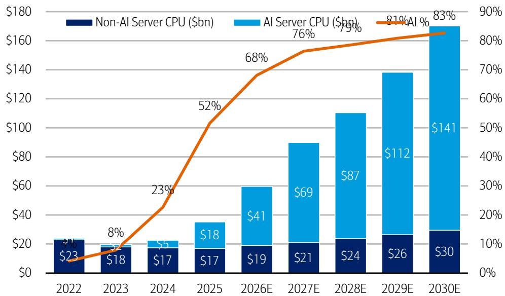

bar-line hybrid

| Year   | Non-AI Server CPU ($bn) | AI Server CPU ($bn) | AI % |
|--------|--------------------------|----------------------|------|
| 2022   | $23                      | -                    | 4%   |
| 2023   | $18                      | -                    | 8%   |
| 2024   | $17                      | $5                   | 23%  |
| 2025   | $17                      | $18                  | 52%  |
| 2026E  | $19                      | $41                  | 68%  |
| 2027E  | $21                      | $69                  | 76%  |
| 2028E  | $24                      | $87                  | 79%  |
| 2029E  | $26                      | $112                 | 81%  |
| 2030E  | $30                      | $141                 | 83%  |

Source: BofA Global Research estimates, Mercury Research, IDC  
BofA GLOBAL RESEARCH

## AMD: Reiterate Buy, raise PO to \$560 from \$500

We flag increased server CPU market demand visibility, view AMD as the best positioned CPU vendor (unit/ASP expansion), raise estimates accordingly for CY26-28, and also raisin our PO to \$560 from \$500 on unchanged 42x CY27 PE.

## AMD CPU Advantages

As we mentioned in above sections, we highlight AMD's leading CPU portfolio in both high frequency and core counts.

## High frequency (5GHz+)

For head node (compute node)-type workloads, CPUs with higher single-threaded performance (high-frequency) are key to overall rack performance.

NVDA's Grace (1H23) and Vera (2H26) CPUs were developed specifically for this. While NVDA provides no public disclosure of CPU frequency, third-party benchmarks for Grace point to \~3.35GHz peak perf for the 3-year old CPU. While slower than AMD Turin's (4Q24) peak 5.0GHz and INTC Granite Rapids' (3Q24) peak 4.3GHz, NVDA CPUs also benefit from the tight co-design and co-integration of CPUs and GPUs via fast NVLink C2C connect, as opposed to slower PCIe connectivity for most other CPU vendors.

Meanwhile, AMD's Turin sports up to 5.0GHz peak per-core performance with high-frequency (HF) SKUs, while also utilizing its own InfinityFabric interconnect (for GPU-to-GPU, GPU-to-CPU) in scale-up.

Once the upcoming Venice CPUs launch in 2H26, we expect this single-threaded performance lead to extend, making AMD CPUs ideal for head/compute node in AI scale-up clusters outside of the NVDA ecosystem.

Exhibit 10: AMD's Turin leads in peak frequency at 5.0GHz, with the upcoming Venice expected to lead max core count at 256-core/512-thread  
Major CPU Specs, including max # of cores/threads and peak frequency

<table><tr><td>Vendor</td><td>INTC</td><td>INTC</td><td>AMD</td><td>AMD</td><td>NVDA</td><td>NVDA</td><td>ARM</td><td>QCOM</td><td>AWS</td><td>GOOGL</td><td>MSFT</td></tr><tr><td>Architecture</td><td>x86</td><td>x86</td><td>x86</td><td>x86</td><td>ARM</td><td>ARM</td><td>ARM</td><td>ARM</td><td>ARM</td><td>ARM</td><td>ARM</td></tr><tr><td>Merchant/Custom</td><td>Merchant</td><td>Merchant</td><td>Merchant</td><td>Merchant</td><td>Merchant</td><td>Merchant</td><td>Merchant</td><td>Merchant</td><td>Custom</td><td>Custom</td><td>Custom</td></tr><tr><td>Product</td><td>Granite Rapids</td><td>Diamond Rapids</td><td>Turin</td><td>Venice</td><td>Grace</td><td>Vera</td><td>AGI</td><td>TBD</td><td>Graviton 5</td><td>Axion</td><td>Cobalt</td></tr><tr><td>Process</td><td>Intel 3</td><td>Intel 18A</td><td>TSMC 4nm</td><td>TSMC 2nm</td><td>TSMC 4nm</td><td>TSMC 3nm</td><td>TSMC 3nm</td><td>TBD</td><td>TSMC 3nm</td><td>-</td><td>-</td></tr><tr><td>Launch</td><td>3Q24</td><td>3Q26</td><td>4Q24</td><td>3Q26</td><td>2Q23</td><td>3Q26</td><td>1Q27</td><td>2027E</td><td>2Q26</td><td>4Q24</td><td>4Q24</td></tr><tr><td>Peak Frequency</td><td>3.9GHz</td><td>TBD</td><td>5.0GHz</td><td>TBD</td><td>3.35GHz</td><td>TBD</td><td>3.7GHz</td><td>TBD</td><td>-</td><td>3.0GHz?</td><td>3.4GHz</td></tr><tr><td>Max Cores/Threads</td><td>128C/256T</td><td>192C</td><td>192C/384T</td><td>256C/512T</td><td>74C</td><td>88C/176T</td><td>136C</td><td>TBD</td><td>192C</td><td>-</td><td>-</td></tr><tr><td>Multi-threading</td><td>Hyper</td><td>N/A</td><td>Simultaneous</td><td>Simultaneous</td><td>N/A</td><td>Spatial</td><td>N/A</td><td>TBD</td><td>N/A</td><td>-</td><td>-</td></tr></table>

Source: BofA Global Research estimates  
BofA GLOBAL RESEARCH

## Core counts (up to 256 cores vs. 88-192 competition)

For agentic AI workloads and standalone CPU nodes/racks, CPUs with higher number of cores (and threads via multi-threading) are key to the overall system performance.

This is because within a fixed power envelope of a server/rack, higher core density increases overall aggregate service throughput.

AMD's upcoming 6th gen EPYC Venice (2H26) is expected to top out at 256 cores, while the current 5th gen Turin tops out at 192 cores. This is much higher than NVDA's upcoming Vera (2H26) at 88 cores, as well as INTC's current Granite Rapids topping at 128 cores and upcoming Diamond Rapids (\~2H26) likely maxing at 192 cores.

As a result, AMD EPYC CPUs generally lead modeled rack-level results over others, with the EPYC 9965 ("Turin," 192C) delivering a 2.37x normalized geometric mean advantage over NVDA Vera (88 Olympus cores). This lead is expected to extend to 3.30x Vera with the EPYC "Venice" (256C). For context, INTC's Xeon 6980P ("Granite Rapids-AP," 128C) also turns in 1.46x over NVDA Vera in high-core-count agentic workloads.

## Upcoming catalyst: Advancing AI 2026 (July)

Separately, we flag AMD's upcoming “Advancing AI 2026” Event in San Francisco, with CEO Dr. Lisa Su's keynote scheduled on July 23.

We anticipate AMD to formally launch its upcoming “Venice” and “Verano” CPUs, the “MI455X” GPU, as well as the “Helios” rack for scale-up compute.

\- CPUs: We expect a great focus on the performance/core-count lead of AMD CPUs, versus not only INTC but also many other new/existing ARM-based competitors including NVDA, ARM, QCOM who have initially designed CPUs for head/compute-node purposes, not necessarily the agentic AI node/rack purposes (which benefit from having many cores/multi-threading).

We also expect AMD to play up its advantage in the x86 ecosystem with security and RAS features, particularly important in agentic AI workloads.

\- GPUs: We flag potential for AMD to announce additional GW-scale GPU customers (as full MI455X-based “Helios” customers), on top of the current existing OpenAI and Meta lineup. For reference, AMD has been in engagement with many hyperscale customers to date.

## Valuation

Our new PO of \$560 is based on an unchanged 42x CY27E PE, toward middle/upper range of historical 13x-58x, but is well supported by AMD's 50%+ annual EPS CAGR potential and its AI CPU/GPU share gain potential.

Exhibit 11: We raise AMD CY/FY27-28 sales by 6-10%, pf-EPS by 10-16% on increased CPU market outlook and potential new GW-scale GPU engagements  
AMD Estimate Changes

<table><tr><td rowspan="2"></td><td colspan="3">Non-GAAP Sales ($mn)</td><td colspan="3">EPS (Non-GAAP, ex-SBC)</td></tr><tr><td>OLD</td><td>NEW</td><td>delta</td><td>OLD</td><td>NEW</td><td>delta</td></tr><tr><td>1Q26</td><td>$13,577</td><td>$13,577</td><td>$0</td><td>$0.29</td><td>$0.29</td><td>$0.00</td></tr><tr><td>2Q26E</td><td>$14,302</td><td>$14,302</td><td>$0</td><td>$0.20</td><td>$0.20</td><td>$0.00</td></tr><tr><td>3Q26E</td><td>$14,895</td><td>$14,895</td><td>$0</td><td>$0.25</td><td>$0.25</td><td>$0.01</td></tr><tr><td>4Q26E</td><td>$15,451</td><td>$15,478</td><td>$27</td><td>$0.30</td><td>$0.31</td><td>$0.01</td></tr><tr><td>2026E</td><td>$58,225</td><td>$58,252</td><td>$27</td><td>$1.04</td><td>$1.06</td><td>$0.02</td></tr><tr><td>YoY%</td><td>10.2%</td><td>10.2%</td><td>0%</td><td>143.6%</td><td>148.0%</td><td>2%</td></tr><tr><td>1Q27E</td><td>$15,582</td><td>$15,664</td><td>$82</td><td>$0.32</td><td>$0.34</td><td>$0.02</td></tr><tr><td>2Q27E</td><td>$16,031</td><td>$16,170</td><td>$139</td><td>$0.34</td><td>$0.37</td><td>$0.03</td></tr><tr><td>3Q27E</td><td>$16,909</td><td>$17,082</td><td>$173</td><td>$0.43</td><td>$0.47</td><td>$0.04</td></tr><tr><td>4Q27E</td><td>$17,718</td><td>$18,018</td><td>$300</td><td>$0.49</td><td>$0.54</td><td>$0.05</td></tr><tr><td>2027E</td><td>$66,240</td><td>$66,933</td><td>$694</td><td>$1.58</td><td>$1.72</td><td>$0.14</td></tr><tr><td>YoY%</td><td>13.8%</td><td>14.9%</td><td>1%</td><td>52.0%</td><td>63.0%</td><td>9%</td></tr><tr><td>1Q28E</td><td>$17,659</td><td>$18,029</td><td>$370</td><td>$0.49</td><td>$0.55</td><td>$0.06</td></tr><tr><td>2Q28E</td><td>$18,116</td><td>$18,572</td><td>$456</td><td>$0.52</td><td>$0.59</td><td>$0.07</td></tr><tr><td>3Q28E</td><td>$19,085</td><td>$19,638</td><td>$553</td><td>$0.59</td><td>$0.67</td><td>$0.07</td></tr><tr><td>4Q28E</td><td>$19,962</td><td>$20,647</td><td>$686</td><td>$0.64</td><td>$0.73</td><td>$0.08</td></tr><tr><td>2028E</td><td>$74,822</td><td>$76,887</td><td>$2,065</td><td>$2.25</td><td>$2.53</td><td>$0.28</td></tr><tr><td>YoY%</td><td>13.0%</td><td>14.9%</td><td>3%</td><td>42.7%</td><td>47.0%</td><td>12%</td></tr></table>

Source: BofA Global Research estimates  
BofA GLOBAL RESEARCH

## INTC: Upgrade to Buy from U/P, PO \$135

We double-upgrade INTC to Buy from Underperform, raise ests/PO to \$135 from \$96.

We highlight INTC's expanded opportunity in server CPUs (similar to AMD described in the AMD section) which it can manufacture itself (gives higher supply visibility), as well as increased opportunities in its external foundry business.

## Fully established IDM by CY30, EPS power \$6+

Particularly, we now value INTC as a fully integrated IDM company with EPS power of \~\$6.24 by CY30, with our new PO based on 25x CY30E PE, discounted back two years.

This is a change from our prior CY28 sum-of-parts valuation methodology (more in Exhibit 13) which we now believe under-represents many of the company's CPU and foundry potentials that are further out in CY29-30+.

- Products: We now expect INTC server CPUs sales to reach \~\$40bn+ by CY30E (vast majority of DCAI segment is server CPUs), or about \~25% share of \$170bn TAM.  
- Foundry: While we are not changing our base case foundry segment model until there is further clarity on specific deal details, we present the multiple deals INTC is currently engaged with, size the potential opportunities below. Opportunities span across: Apple M-Series wafers, MediaTek TPU wafers, Terafab IP/packaging, and potentially other ARM-based server CPUs, edge AI expansion into Client – all made more possible via recent CDNS 14A collab announcement.

Exhibit 12: We expect \$6+ INTC EPS power by CY30, now see total company value of \$135, versus \$96 prior based on CY28 sum-of-parts INTC Sales Power, EPS Power, Valuation Methodology

<table><tr><td></td><td>CY26E</td><td>CY27E</td><td>CY28E</td><td>CY29E</td><td>CY30E</td><td colspan="2">CY30E Methodology</td><td>CAGR</td></tr><tr><td>Products</td><td>$55.0</td><td>$61.4</td><td>$68.4</td><td>$77.6</td><td>$86.1</td><td></td><td></td><td>11.9%</td></tr><tr><td>CCG</td><td>$31.6</td><td>$32.8</td><td>$34.4</td><td>$38.6</td><td>$42.4</td><td></td><td></td><td></td></tr><tr><td>DCAI</td><td>$23.4</td><td>$28.6</td><td>$33.9</td><td>$39.0</td><td>$43.7</td><td>~25%</td><td>Share of $170bn TAM</td><td></td></tr><tr><td>Foundry</td><td>$1.1</td><td>$8.0</td><td>$17.5</td><td>$30.8</td><td>$47.1</td><td></td><td></td><td>158.4%</td></tr><tr><td>A/P</td><td>$0.4</td><td>$1.9</td><td>$3.5</td><td>$4.8</td><td>$6.0</td><td>30.0%</td><td>Share of $20bn 2.5D/3D TAM</td><td></td></tr><tr><td>Wafer</td><td>$0.5</td><td>$5.7</td><td>$11.4</td><td>$17.0</td><td>$23.1</td><td>~6-7%</td><td>Share of $380bn Wafer Foundry TAM</td><td></td></tr><tr><td>Apple</td><td>$0.0</td><td>$2.5</td><td>$5.4</td><td>$8.0</td><td>$10.6</td><td>40.0%</td><td>Share of M-Series, 25% A-Series</td><td></td></tr><tr><td>TPU/MediaTek</td><td>$0.5</td><td>$3.3</td><td>$6.0</td><td>$9.0</td><td>$12.4</td><td>100.0%</td><td>Share of TPU (MediaTek)</td><td></td></tr><tr><td>Terafab</td><td>$0.1</td><td>$0.3</td><td>$1.5</td><td>$4.0</td><td>$8.0</td><td></td><td>IP, Packaging, Wafer (partial): mid-2028 begin</td><td></td></tr><tr><td>Other HPC Products</td><td>$0.0</td><td>$0.0</td><td>$1.0</td><td>$5.0</td><td>$10.0</td><td></td><td>ARM-based server CPU opp&#x27;ty</td><td></td></tr><tr><td>Other</td><td>$2.3</td><td>$2.5</td><td>$2.5</td><td>$2.6</td><td>$2.8</td><td></td><td></td><td></td></tr><tr><td>Net Sales</td><td>$58.4</td><td>$71.9</td><td>$88.3</td><td>$111.0</td><td>$135.9</td><td></td><td></td><td>23.5%</td></tr><tr><td>Products EBIT</td><td>$18.0</td><td>$21.6</td><td>$25.7</td><td>$30.8</td><td>$33.2</td><td>38.5%</td><td>vs. OpM Target (38.5%)</td><td></td></tr><tr><td>Foundry EBIT</td><td>-$9.3</td><td>-$6.6</td><td>-$1.8</td><td>$3.1</td><td>$8.5</td><td>18.0%</td><td>vs. OpM Target (27.5%)</td><td></td></tr><tr><td>Other, Unallocated</td><td>-$1.1</td><td>-$1.0</td><td>-$1.0</td><td>-$1.0</td><td>-$1.0</td><td></td><td></td><td></td></tr><tr><td>Total EBIT (non-GAAP)</td><td>$7.6</td><td>$13.9</td><td>$22.8</td><td>$32.9</td><td>$40.6</td><td></td><td></td><td>52.0%</td></tr><tr><td>OpM (%)</td><td>13.0%</td><td>19.4%</td><td>25.8%</td><td>29.6%</td><td>29.9%</td><td></td><td></td><td></td></tr><tr><td>Interest Income</td><td>-$0.2</td><td>-$0.8</td><td>-$0.8</td><td>-$0.8</td><td>-$0.8</td><td></td><td></td><td></td></tr><tr><td>EBT</td><td>$7.4</td><td>$13.2</td><td>$22.0</td><td>$32.1</td><td>$39.8</td><td></td><td></td><td></td></tr><tr><td>Tax Rate</td><td>11.5%</td><td>12.0%</td><td>12.0%</td><td>12.0%</td><td>12.0%</td><td></td><td></td><td></td></tr><tr><td>Net Income</td><td>$6.5</td><td>$11.6</td><td>$19.4</td><td>$28.3</td><td>$35.1</td><td></td><td></td><td></td></tr><tr><td>NCI Adj.</td><td>-$1.1</td><td>-$1.2</td><td>-$1.2</td><td>-$1.2</td><td>-$1.3</td><td></td><td></td><td></td></tr><tr><td>Net Income (non-GAAP)</td><td>$5.4</td><td>$10.4</td><td>$18.2</td><td>$27.0</td><td>$33.8</td><td></td><td></td><td></td></tr><tr><td>EPS Power</td><td>$1.06</td><td>$2.01</td><td>$3.47</td><td>$5.07</td><td>$6.24</td><td></td><td></td><td>55.9%</td></tr><tr><td>Shares Outstanding</td><td>5,106</td><td>5,172</td><td>5,248</td><td>5,326</td><td>5,406</td><td></td><td></td><td></td></tr><tr><td>Multiple</td><td></td><td></td><td></td><td></td><td>25x</td><td></td><td></td><td></td></tr><tr><td>Price Objective (25x CY30E discounted back)</td><td></td><td></td><td>$135</td><td>$145</td><td>$156</td><td></td><td></td><td></td></tr><tr><td>Discount</td><td></td><td></td><td>-7%</td><td>-7%</td><td></td><td></td><td></td><td></td></tr></table>

Source: BofA Global Research estimates

BofA GLOBAL RESEARCH

Exhibit 13: We now see \~\$3.47 CY28E EPS Power vs. \~\$2.25 prior, on greater server CPU/Foundry opportunities  
INTC Valuation Methodology: New vs. Old

<table><tr><td></td><td>CY28ENew</td><td colspan="4">CY28EOld</td></tr><tr><td>Prior Method</td><td>Total</td><td>Total</td><td>IDM</td><td>Foundry</td><td>Apple</td></tr><tr><td>Products</td><td>$68.4</td><td>$66.3</td><td>$66.3</td><td>$0.0</td><td>$0.0</td></tr><tr><td>CCG</td><td>$34.4</td><td>$34.4</td><td>$34.4</td><td></td><td></td></tr><tr><td>DCAI</td><td>$33.9</td><td>$31.9</td><td>$31.9</td><td></td><td></td></tr><tr><td>Foundry</td><td>$17.5</td><td>$11.4</td><td>$0.0</td><td>$6.0</td><td>$5.4</td></tr><tr><td>A/P</td><td>$3.5</td><td>$3.5</td><td></td><td>$3.5</td><td></td></tr><tr><td>Wafer</td><td>$11.4</td><td>$7.9</td><td>$0.0</td><td>$2.5</td><td>$5.4</td></tr><tr><td>Apple</td><td>$5.4</td><td>$5.4</td><td></td><td></td><td>$5.4</td></tr><tr><td>Other Wafer</td><td>$6.0</td><td>$2.5</td><td></td><td>$2.5</td><td></td></tr><tr><td>Terafab</td><td>$1.5</td><td>$0.0</td><td></td><td></td><td></td></tr><tr><td>Other HPC Products</td><td>$1.0</td><td>$0.0</td><td></td><td></td><td></td></tr><tr><td>Other</td><td>$2.5</td><td>$2.5</td><td>$2.5</td><td></td><td></td></tr><tr><td>Net Sales</td><td>$88.3</td><td>$80.2</td><td>$68.8</td><td>$6.0</td><td>$5.4</td></tr><tr><td>Products EBIT</td><td>$25.7</td><td>$15.1</td><td>$15.1</td><td></td><td></td></tr><tr><td>Foundry EBIT</td><td>-$1.8</td><td>$1.5</td><td></td><td>$1.5</td><td></td></tr><tr><td>Other, Unallocated</td><td>-$1.0</td><td>-$1.0</td><td>-$1.0</td><td></td><td></td></tr><tr><td>Total EBIT (non-GAAP)</td><td>$22.8</td><td>$15.6</td><td>$14.1</td><td>$1.5</td><td>$0.0</td></tr><tr><td>OpM (%)</td><td>25.8%</td><td>45.4%</td><td>20.4%</td><td>25.0%</td><td>0.0%</td></tr><tr><td>Interest Income</td><td>-$0.8</td><td>-$0.8</td><td>-$0.8</td><td></td><td></td></tr><tr><td>EBT</td><td>$22.0</td><td>$14.8</td><td>$13.3</td><td>$1.5</td><td>$0.0</td></tr><tr><td>Tax Rate</td><td>12.0%</td><td>12.0%</td><td>12.0%</td><td>12.0%</td><td>12.0%</td></tr><tr><td>Net Income</td><td>$19.4</td><td>$13.0</td><td>$11.7</td><td>$1.3</td><td>$0.0</td></tr><tr><td>NCI Adj.</td><td>-$1.2</td><td>-$1.2</td><td>-$1.2</td><td></td><td></td></tr><tr><td>Net Income (non-GAAP)</td><td>$18.2</td><td>$11.8</td><td>$10.5</td><td>$1.3</td><td>$0.0</td></tr><tr><td>EPS Power</td><td>$3.47</td><td>$2.25</td><td>$2.00</td><td>$0.25</td><td>$0.00</td></tr><tr><td>Shares Outst.</td><td>5,248</td><td>5,246</td><td>5,246</td><td>5,246</td><td>5,246</td></tr><tr><td>Methodology</td><td></td><td>SOP</td><td>PE</td><td>EV/S</td><td>EV/S</td></tr><tr><td>Multiple</td><td></td><td>43x</td><td>37x</td><td>10x</td><td>10x</td></tr><tr><td>Price Power</td><td>$135</td><td>$96</td><td>$74</td><td>$11</td><td>$10</td></tr></table>

Source: BofA Global Research estimates  
BofA GLOBAL RESEARCH

Exhibit 14: We raise INTC CY27-28E sales by 1-3%, pf-EPS by 9-12%  
INTC Estimate Changes

<table><tr><td rowspan="2"></td><td colspan="3">Non-GAAP Sales ($mn)</td><td colspan="3">EPS (Non-GAAP, ex-SBC)</td></tr><tr><td>OLD</td><td>NEW</td><td>delta</td><td>OLD</td><td>NEW</td><td>delta</td></tr><tr><td>2026E</td><td>$58,225</td><td>$58,252</td><td>$27</td><td>$1.04</td><td>$1.06</td><td>$0.02</td></tr><tr><td>YoY%</td><td>10.2%</td><td>10.2%</td><td>0%</td><td>143.6%</td><td>148.0%</td><td>2%</td></tr><tr><td>1Q27E</td><td>$15,582</td><td>$15,664</td><td>$82</td><td>$0.32</td><td>$0.34</td><td>$0.02</td></tr><tr><td>2Q27E</td><td>$16,031</td><td>$16,170</td><td>$139</td><td>$0.34</td><td>$0.37</td><td>$0.03</td></tr><tr><td>3Q27E</td><td>$16,909</td><td>$17,082</td><td>$173</td><td>$0.43</td><td>$0.47</td><td>$0.04</td></tr><tr><td>4Q27E</td><td>$17,718</td><td>$18,018</td><td>$300</td><td>$0.49</td><td>$0.54</td><td>$0.05</td></tr><tr><td>2027E</td><td>$66,240</td><td>$66,933</td><td>$694</td><td>$1.58</td><td>$1.72</td><td>$0.14</td></tr><tr><td>YoY%</td><td>13.8%</td><td>14.9%</td><td>1%</td><td>52.0%</td><td>63.0%</td><td>9%</td></tr><tr><td>1Q28E</td><td>$17,659</td><td>$18,029</td><td>$370</td><td>$0.49</td><td>$0.55</td><td>$0.06</td></tr><tr><td>2Q28E</td><td>$18,116</td><td>$18,572</td><td>$456</td><td>$0.52</td><td>$0.59</td><td>$0.07</td></tr><tr><td>3Q28E</td><td>$19,085</td><td>$19,638</td><td>$553</td><td>$0.59</td><td>$0.67</td><td>$0.07</td></tr><tr><td>4Q28E</td><td>$19,962</td><td>$20,647</td><td>$686</td><td>$0.64</td><td>$0.73</td><td>$0.08</td></tr><tr><td>2028E</td><td>$74,822</td><td>$76,887</td><td>$2,065</td><td>$2.25</td><td>$2.53</td><td>$0.28</td></tr><tr><td>YoY%</td><td>13.0%</td><td>14.9%</td><td>3%</td><td>42.7%</td><td>47.0%</td><td>12%</td></tr></table>

Source: BofA Global Research estimates  
BofA GLOBAL RESEARCH

## ARM: Reit. Neutral, raise PO to \$335

We see ARM as one of the most prominent beneficiaries of the rising server CPU tide, as the fastest overall ecosystem share gainer through CY30.

As we've highlighted in above sections, we see ARM's collective server CPU value share to reach \~50% by CY30 across: \~35% in merchant CPUs (NVDA, ARM, QCOM, etc.) and \~15% in custom CPUs (hyperscale ASIC such as AWS Graviton, GOOGL Axion, MSFT Cobalt).

However, at \~\$300+, we view the stock as fairly valued, with our new sum-of-parts valuation methodology yielding a PO of \$335, versus our previous total company valuation of \$245 based on 69x CY28E PE.

## Sum-of-Parts Valuation: IP & Chip Businesses

We flag the immense opportunities ahead in standalone chip business (vs. historical only IP business), and we now value the company on a sum-of-parts basis.

- IP business: For the historical IP business, we continue to value based on \~2.0x PEG framework, in-line with high-growth semis and IP peers.  
This is based on +20% Royalty sales CAGR and +12% Licensing sales CAGR, which at 65% combined OpM would yield EPS power of \$5+ by FY31, or +25% EPS CAGR.  
Chip business: For the new chiplet business, we value based on \~35x PE, in-line with high-growth AI compute vendor average of \~35x.  
We see potential for \$15bn chip sales power by FY31 (\~CY30), in-line with ARM mgmt's outlook of 15% share of \~\$100bn CPU TAM. We use 30% OpM target that ARM outlined (in-line with \~30% OpM for more established vendors such as AMD).  
- Total company: For the total company valuation, we discount back two years and combine – 1) \$229 worth of IP business, and 2) \$106 worth of chip business – totaling \~\$335 of total company value.

Exhibit 15: We see total company value of \$335, versus \$245 prior, now based on CY30 sum-of-parts for IP and Chip businesses, discounted back 2 years ARM Sales Power, EPS Power, Valuation Methodology

<table><tr><td></td><td>FY26</td><td colspan="3">FY31E - IP Only</td><td colspan="3">FY31E - Chip Only</td><td colspan="3">FY31E - Total Company</td></tr><tr><td>IP Sales</td><td>$4,920</td><td>$10,569</td><td></td><td></td><td></td><td></td><td></td><td>$10,569</td><td></td><td></td></tr><tr><td>Royalty Sales</td><td>$2,613</td><td>$6,503</td><td>20% CAGR</td><td></td><td></td><td></td><td></td><td></td><td></td><td></td></tr><tr><td>Licensing Sales</td><td>$2,307</td><td>$4,066</td><td>12% CAGR</td><td></td><td></td><td></td><td></td><td></td><td></td><td></td></tr><tr><td>Chip Sales</td><td>$0</td><td></td><td></td><td></td><td>$15,000</td><td></td><td></td><td>$15,000</td><td></td><td></td></tr><tr><td>CPU TAM</td><td></td><td></td><td></td><td></td><td>$100,000</td><td>15% TAM &amp; Share</td><td></td><td></td><td></td><td></td></tr><tr><td>Total Sales Power</td><td>$4,920</td><td>$10,569</td><td>17% CAGR</td><td></td><td>$15,000</td><td>25% CAGR</td><td></td><td>$25,569</td><td>39% CAGR</td><td></td></tr><tr><td>IP EBIT</td><td>$2,115</td><td>$6,870</td><td>65% OpM</td><td></td><td></td><td></td><td></td><td>$6,870</td><td>65% OpM</td><td></td></tr><tr><td>Chip EBIT</td><td>$0</td><td></td><td></td><td></td><td>$4,500</td><td>30% OpM</td><td></td><td>$4,500</td><td>30% OpM</td><td></td></tr><tr><td>Total EBIT</td><td>$2,115</td><td>$6,870</td><td></td><td></td><td>$4,500</td><td></td><td></td><td>$11,370</td><td></td><td></td></tr><tr><td>Interest Income</td><td>$107</td><td>$50</td><td></td><td></td><td>$50</td><td></td><td></td><td>$100</td><td></td><td></td></tr><tr><td>EBT</td><td>$2,222</td><td>$6,920</td><td></td><td></td><td>$4,550</td><td></td><td></td><td>$11,470</td><td></td><td></td></tr><tr><td>Tax Rate</td><td>15.0%</td><td>15.0%</td><td></td><td></td><td>15.0%</td><td></td><td></td><td>15.0%</td><td></td><td></td></tr><tr><td>Net Income</td><td>$1,889</td><td>$5,882</td><td></td><td></td><td>$3,868</td><td></td><td></td><td>$9,749</td><td></td><td></td></tr><tr><td>EPS Power</td><td>$1.77</td><td>$5.35</td><td>25% CAGR</td><td></td><td>$3.52</td><td>15% CAGR</td><td></td><td>$8.86</td><td>38% CAGR</td><td></td></tr><tr><td>Shares Outst.</td><td>1,068</td><td>1,100</td><td></td><td></td><td>1,100</td><td></td><td></td><td>1,100</td><td></td><td></td></tr><tr><td>~CY30 Valuation</td><td></td><td>$265</td><td>2.0x PEG</td><td></td><td>$123</td><td>35x PE</td><td></td><td>$388</td><td>44x Implied PE</td><td></td></tr><tr><td>~CY29 Valuation</td><td></td><td>$246</td><td></td><td></td><td>$114</td><td></td><td></td><td>$361</td><td>-7% Discount</td><td></td></tr><tr><td>~CY28 Valuation</td><td></td><td>$229</td><td></td><td></td><td>$106</td><td></td><td></td><td>$335</td><td>-7% Discount</td><td></td></tr></table>

Source: BofA Global Research estimates

BofA GLOBAL RESEARCH

## NVDA: Maintain Buy, top AI sector pick

## Rising content, increasing opp'ty, solid supply visibility

Following ‘GTC Taipei’ CEO keynote on Jun-4 (see our takeaways), we hosted NVDA CFO Colette Kress for a well-attended keynote, and Sr. Director, IR Stewart Stecker for a bus tour investor meeting.

Key takeaways: 1) Vera CPU opportunity is roughly split 50/50 between head node (compute rack) and agentic AI (standalone CPU rack), 2) NVDA's \$200bn CPU TAM only includes agentic AI, RL-type workloads, not general purpose traditional CPU workloads, 3) NVDA content to rise meaningfully every system gen, at \~\$40bn/GW for Blackwell, \~\$60-80bn/GW for Rubin/Rubin Ultra, and potentially \~\$100bn/GW for Feynman, as NVDA consistently adds new chips/racks to the system; 4) NVDA's full-stack architecture and ecosystem incumbency provides advantages in both hyperscale and ACIE; 5) GPU useful life may be longer than depreciable life, as 3-4 year old Hoppers are still fully utilized; and 6) NVDA's \$124bn purchase commitment suggests robust demand/supply visibility ahead for AI infra.

## Vera Rubin now in full production, lowest token cost

NVDA announced Vera Rubin is now ramping into full production, across its five-rack system spanning Vera Rubin NVL72 compute, Vera CPU, Groq 3 LPX, Spectrum-6 SPX Ethernet, and Vera BlueField-4 STX storage racks.

Per NVDA, the full system delivers up to 10x higher inference perf per watt and 10x lower cost per token, and up to 35x higher throughput per watt for trillion-parameter models when paired with Groq 3 LPX. In a world of limited power, throughput per watt directly translates to revenue, and NVDA's extreme co-design and system-level solution can provide the lowest token cost by up to x factors. NVDA also noted the Vera Rubin platform is being scaled by hundreds of supply-chain ecosystem partners, with the supply chain 2x as large as Grace Blackwell's.

Exhibit 16: NVDA will begin offering standalone Vera CPU racks, alongside the Vera Rubin Platform beginning in 2H26, more directly addressing previously unaddressed or overlooked workloads in AI inference

Nvidia Vera Rubin SuperPOD with 5 different types of racks making up one giant 40-rack pods

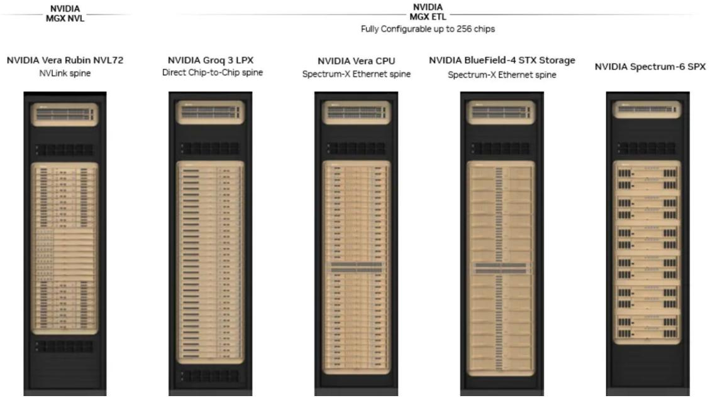

text_image

NVIDIA
MGX NVL
NVIDIA
MGX ETL
Fully Configurable up to 256 chips
NVIDIA Vera Rubin NVL72
NVLink spine
NVIDIA Groq 3 LPX
Direct Chip-to-Chip spine
NVIDIA Vera CPU
Spectrum-X Ethernet spine
NVIDIA BlueField-4 STX Storage
Spectrum-X Ethernet spine
NVIDIA Spectrum-6 SPX

Source: Nvidia  
BofA GLOBAL RESEARCH

## Vera CPU: head node vs. agentic AI likely 50/50 opp'ty

Traditional CPUs are increasingly becoming bottlenecks to agentic GPU utilization, directly affecting token throughput and latency. Vera CPU is designed to address this issue, with its 88x custom NVDA Olympus (Arm) cores all working together in tandem with the greatest cross-sectional bandwidth (3x bandwidth per core, 2x total bandwidth vs. x86), vs. traditional CPUs being rented core by core.

While Vera was initially designed as a head/compute node and falls short in raw core counts vs. competition (at 100-200+ cores per CPU), we flag NVDA's extreme codesign of full end-to-end system can help offset some of the disadvantages in even agentic workloads (where core/thread counts matter). Notably, the Vera CPU supports NVDA's Spatial Multi-threading (SMT), vs. many other x86 products having offered multi-threading of some sort (INTC Hyperthreading, AMD simultaneous multithreading).

NVDA expects \~\$20bn of Vera CPU sales in F2H27, roughly split evenly between head/compute node sockets (traditional GPU support role in NVL racks) and standalone agentic AI sockets (reinforcement learning, orchestration roles in CPU racks).

NVDA has shipped 2.5mn Grace CPUs to date, and the follow-on Vera shipment could already reach \~4-5mn units in just the first two quarters of launch, at an estimated ASP of \$4-5k per CPU. NVDA also noted that the Vera builds on Grace's existing system-level software and optimization on NVDA tech stack, a key differentiation vs. first-gen Grace. Overall, the total CPU unit demand could potentially be higher than GPU over time, reinforcing the CPU-GPU ratio argument of 1-to-1 across both racks (vs. 1-to-2 and 1-to-4 prior).

## NVDA content \$/GW rising materially gen-over-gen

NVDA believes every new generation of its systems can increase the company's addressable market materially, from the current \~\$40bn/GW for Blackwell Ultra, toward \$60-80bn/GW for Vera Rubin and Rubin Ultra, and toward \~\$100bn/GW for Feynman maybe. While exact figures may vary, NVDA continues to address more parts of the AI system each gen, with the current Vera Rubin solution comprised of 7 different chips across 5 different racks (vs. Blackwell just 1 main compute rack), and Rubin Ultra (2027) expected to add another rack on top. Beginning the Feynman generation (2028), NVDA also plans to offer optional optical scale-up (via CPO) for customers wanting a larger NVLink domain (vs. regular copper up to 576-die or 144 GPU packages).

## "King of diversity": ACIE as important as hyperscale/cloud

NVDA's sales mix between ACIE (AI Clouds, Industrial, Enterprise) and hyperscale is \~50/50 today, with ACIE likely the faster growing segment over time. NVDA is the “king of diversity”, as it supplies to every hyperscale, every major model maker, and has significant incumbency and moat in ACIE-type workloads (we view custom XPUs have limited opportunities here). NVDA's continuous upgrades to system software (i.e. Hopper/Blackwell) and new model rollouts are also key competitive advantages.

## RTX Spark for personal agentic AI, for top 10% Windows

NVDA and Microsoft unveiled RTX Spark, a new superchip for Windows PCs purpose-built for personal AI agents and expanding NVDA's platform from cloud AI factories into personal AI endpoints. Built on TSMC 3nm, the chip offers 1 petaflop of AI perf., enabling 120bn-parameter LLMs with up to 1mn-token context locally. RTX Spark combines a Blackwell RTX GPU with 6,144 CUDA cores with a 20-core Grace CPU over NVLink-C2C, with MediaTek collaborating on the custom CPU design. Critically, we flag the chip compares to the Apple Mac Mini (10-12 CPU cores) or MacBook Pro (15-18 CPU cores), and likely targets the top 10% of the Windows market at \~25-30mn units/yr

We maintain Buy, \$350 PO, and a top AI pick, given attractive 16x CY27 PE or 0.4x PEG vs. Mag-7 avg of 1.9x.

## QCOM: U/P on competitive landscape

We reiterate Underperform on QCOM. In our view, the core handset franchise faces multi-year headwinds as rising memory prices further soften the weak handset market, while Apple modem in-sourcing removes high-margin revenue stream, and China OEM concentration heightens pricing and geopolitical risks.

Against that backdrop, the bull case is increasingly driven by QCOM's diversification into auto/IoT and data center business potentials. While we await further detail at upcoming Jun-24 AI-focused Investor Day, we see compute initiatives years away from being financially material, carry meaningful execution risk, and will require material investment to compete head-on with far better-resourced incumbents INTC, AMD, ARM, and NVDA.

While QCOM may only need to capture a small portion of the \~\$170bn+TAM to lift the stock, we see sustained share gain momentum as difficult amid intensifying competition. QCOM's ability to leverage their existing high-volume agreements with TSMC and Samsung for new data center products may work in their favor, however.

Exhibit 17: QCOM only expected to grow at a 4% CAGR between FY25-FY29E due to handset market softness and Apple roll-off  
Summary of QCOM segment revenue forecast  
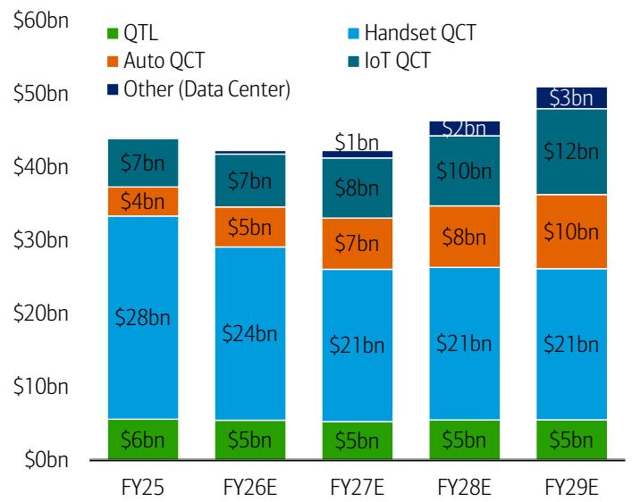

stacked bar chart

| Year | QTL ($bn) | Handset QCT ($bn) | Auto QCT ($bn) | IoT QCT ($bn) | Other (Data Center) ($bn) |
| :--- | :--- | :--- | :--- | :--- | :--- |
| FY25 | 6 | 28 | 4 | 7 | 0 |
| FY26E | 5 | 24 | 5 | 7 | 1 |
| FY27E | 5 | 21 | 7 | 8 | 1 |
| FY28E | 5 | 21 | 8 | 10 | 2 |
| FY29E | 5 | 21 | 10 | 12 | 3 |

Source: BofA Global Research Estimates  
BofA GLOBAL RESEARCH

Exhibit 18: QCOM diversification is underway, though Data Center revenues likely only \$3bn or \~6% by FY29E  
Summary of QCOM segment mix forecast  
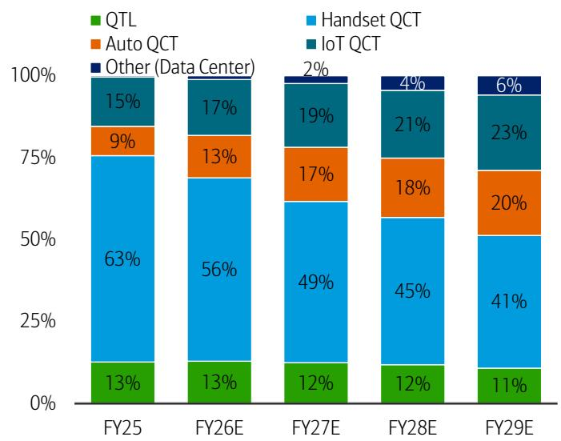

stacked bar chart

| Year | QTL (%) | Handset QCT (%) | Auto QCT (%) | IoT QCT (%) | Other (Data Center) (%) |
| :--- | :--- | :--- | :--- | :--- | :--- |
| FY25 | 13 | 63 | 9 | 15 | 0 |
| FY26E | 13 | 56 | 13 | 17 | 0 |
| FY27E | 12 | 49 | 17 | 19 | 2 |
| FY28E | 12 | 45 | 18 | 21 | 4 |
| FY29E | 11 | 41 | 20 | 23 | 6 |

Source: BofA Global Research Estimates  
BofA GLOBAL RESEARCH

## QCOM's Accelerator Effort: AI200 and AI250

QCOM's upcoming AI200 (2026) and AI250 (2027) rack-scale inference accelerators lean on Hexagon NPU IP and power efficiency expertise from mobile while using lower cost LPDDR memory. QCOM has a \~200MW commitment from HUMAIN beginning late 2026.

We remain constructive on QCOM's engineering capabilities but with inference now the most contested part of the accelerator TAM, a 2026 start provides QCOM with no ecosystem advantage vs. NVDA, AMD, AVGO/GOOGL, and MRVL/AWS while other hyperscalers are already developing high-cost ASICs for their respective clusters.

## Data Center CPU re-entrance to leverage Arm-compatible Oryon core

QCOM's current CPU push rests on Arm-compatible Oryon core acquired via Nuvia (2021) which has only shipped at scale in Snapdragon X PC silicon. Porting a laptop-class core to a competitive server SKU poses significant execution challenges while most hyperscalers, neoclouds, and sovereigns already have established server CPU partners.

## Role of CPUs in Agentic AI

For much of the AI training era, the compute narrative was dominated by GPUs and custom accelerators. That was appropriate: training large frontier models is highly parallel, matrix-heavy, and accelerator-bound.

In that regime, CPUs were necessary but largely secondary — responsible for feeding accelerators, preprocessing data, tokenization, scheduling, storage access, and orchestration.

As a result, AI accelerator spend grew far faster than CPU spend particularly between 2022 and 2025, and accelerators had become the overwhelming majority of data center compute spend, while CPUs represented a much smaller share. The AI accelerator market had grown at +139% CAGR due a tremendous increase in training demand, vs. server CPUs only +14% CAGR.

By 2025, AI accelerators have become 85% of total compute spend and CPUs just 15%, versus accelerators at just 26% (CPUs 74%) in 2021 when the training market had just begun to emerge.

Exhibit 19: AI accelerator market grew at a +139% CAGR between 2022-2025 from a tremendous rise of AI training demand, vs. CPUs at +14% CAGR  
CPUs vs. AI Accelerators TAM (\$bn)  
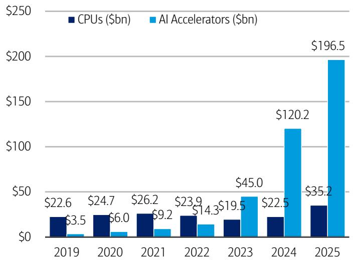

bar chart

| Year | CPUs ($bn) | AI Accelerators ($bn) |
| :--- | :--- | :--- |
| 2019 | 22.6 | 3.5 |
| 2020 | 24.7 | 6.0 |
| 2021 | 26.2 | 9.2 |
| 2022 | 23.9 | 14.3 |
| 2023 | 19.5 | 45.0 |
| 2024 | 22.5 | 120.2 |
| 2025 | 35.2 | 196.5 |

Source: BofA Global Research estimates, Mercury Research  
BofA GLOBAL RESEARCH

Exhibit 20: AI accelerators as a % of total data center compute spend has risen to 85% by 2025 (CPUs 15%), from just 26% in 2021 (CPUs 74%) before the rise of AI compute demand
CPUs vs. AI Accelerators TAM (%)  
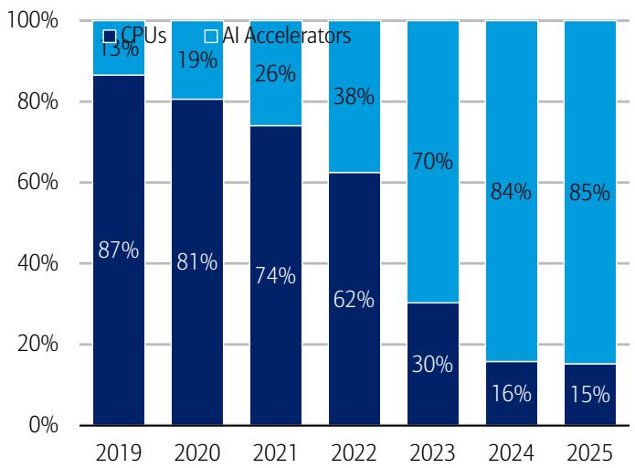

stacked bar chart

| Year | CPUs (%) | AI Accelerators (%) |
|---|---|---|
| 2019 | 87 | 13 |
| 2020 | 81 | 19 |
| 2021 | 74 | 26 |
| 2022 | 62 | 38 |
| 2023 | 30 | 70 |
| 2024 | 16 | 84 |
| 2025 | 15 | 85 |

Source: BofA Global Research estimates, Mercury Research  
BofA GLOBAL RESEARCH

## CPUs in training

Overall in training, CPUs are responsible for decompression, tokenization, batching, and ultimately feeding the GPUs. CPUs' main job is to make sure the GPUs/accelerators are utilized as much as possible by constantly preparing and queuing batches, making sure the expensive accelerators are fully in work without bottlenecks.

CPUs control the orchestration and preprocessing of data, i.e. they are typically not involved in the actual heavy processing that AI training requires (mostly done in parallel processing by GPUs/accelerators).

CPUs essentially perform a secondary or supporting role for the GPUs/accelerators in AI training, hence explaining the decline in the \% of value in the overall system (vs. GPUs).

## CPUs in inference

In AI inference, the role of CPUs has become more broad and extensive.

The AI inference process can be broken into three phases: load phase, prefill phase, and decode phase.

1. In load or initialization, models are loaded from the disks into the memory, with performance largely dependent on overall disk (I/O) and CPU speed. Weight loading, quantization, and compilation all occur during the load phase, with the latter two (quantization and compilation) much better to be done offline vs. online to avoid runtime overhead.

Overall, the role/speed of CPU is key during the load phase of AI inference.

2. In prefill, time to first token (TTFT) and KV cache creation are the two main roles, with both prefill time and first token latency heavily dependent on overall compute/large matrix multiplication abilities, i.e. GPU/accelerators and networking rather than CPUs.

However, the CPUs do provide a role in tokenization, routing, batching, and memory setup.

3. In decode, performance is heavily impacted by KV cache reuse, so optimizing KV cache and/or increasing the bandwidth/capacity of system memory is critical, as such with high-bandwidth SRAM or HBM memory, inference storage context memory (i.e. low-latency storage), or even CXL memory (pooling of system memory) methodology.

Here too, increasingly the role of CPUs is increasing in decode because of scheduling, token-by-token control flow, sampling, guardrails, logits processing, memory management, and KV cache routing.

Exhibit 21: LLM inference process can also be broken into three phases: load phase, prefill phase, and decode phase  
LLM Inference Process in Three Phases  
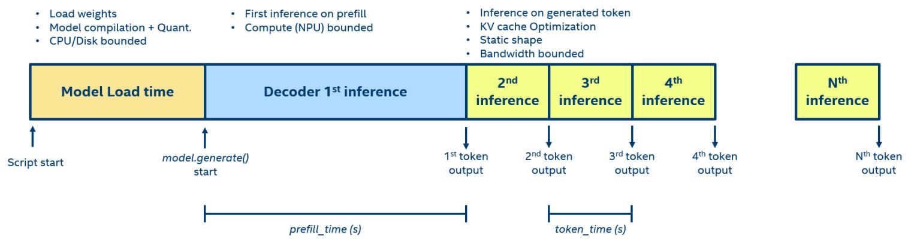

flowchart

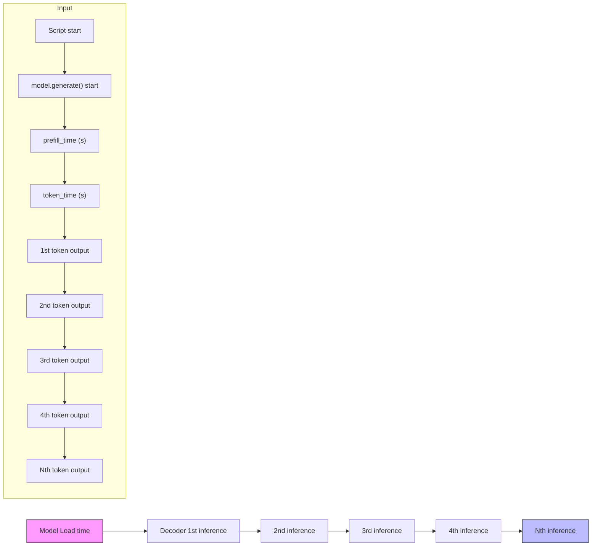

Source: Intel  
BofA GLOBAL RESEARCH

## CPUs in Agentic AI

In the next phase of AI – production inference, agentic AI, enterprise AI – is structurally even more CPU-intensive.

Agentic AI does not simply ask a model one question and receive one answer. It plans, retrieves context, calls tools, manages state, invokes APIs, interacts with databases, routes tasks across models, evaluates intermediate outputs, applies guardrails, and loops until a task is completed.

The practical implication is that CPUs become more than “host processors”. They become the control plane of AI inference.

In a conventional LLM inference request, the GPU may dominate the prefill and decode compute. But in agentic workflows, a single user request can fan out into many CPU-bound subtasks.

Intel's agentic AI commentary describes these systems as multi-step workflows where CPUs manage orchestration, multiple agents, tool integration, state across workflows, and parallel decision trees. Ciena similarly argues that agentic AI shifts infrastructure beyond a “GPU-only” narrative because orchestration, memory handling, and tool execution increase the role of CPUs and networks in distributed AI workflows.

Exhibit 22: CPUs excel in document processing/classification, indexing, and captioning, among other AI workloads  
Role of CPUs in AI Inference

<table><tr><td rowspan="2">AI Inference Workload</td><td colspan="3">Good fit for...</td></tr><tr><td>CPUs</td><td>CPUs + PCIe-Based GPU</td><td>GPU Clusters</td></tr><tr><td>Document processing and classification</td><td>√</td><td></td><td></td></tr><tr><td>Data mining and analytics</td><td>√</td><td></td><td>√</td></tr><tr><td>Scientific simulations</td><td>√</td><td></td><td></td></tr><tr><td>Translation</td><td>√</td><td></td><td></td></tr><tr><td>Indexing</td><td>√</td><td></td><td></td></tr><tr><td>Content moderation</td><td>√</td><td></td><td></td></tr><tr><td>Predictive maintenance</td><td>√</td><td></td><td>√</td></tr><tr><td>Virtual assistants</td><td>√</td><td>√</td><td></td></tr><tr><td>Chatbots</td><td>√</td><td>√</td><td></td></tr><tr><td>Expert agents</td><td>√</td><td>√</td><td></td></tr><tr><td>Video captioning</td><td>√</td><td>√</td><td></td></tr><tr><td>Fraud detection</td><td></td><td>√</td><td>√</td></tr><tr><td>Decision-making</td><td></td><td>√</td><td>√</td></tr><tr><td>Dynamic pricing</td><td></td><td>√</td><td>√</td></tr><tr><td>Audio and video filtering</td><td></td><td>√</td><td>√</td></tr><tr><td>Financial trading</td><td></td><td></td><td>√</td></tr><tr><td>Telecommunications and networking</td><td></td><td></td><td>√</td></tr><tr><td>Autonomous systems</td><td></td><td></td><td>√</td></tr></table>

Source: AMD  
BofA GLOBAL RESEARCH

## Agentic AI is system-led, not CPU or GPU-led

However, this does not mean CPUs displace GPUs.

We view that agentic AI rather increases the importance of balanced compute:

\- GPUs and accelerators remain essential for matrix math, large-model inference, high-throughput prefill, dense decoding, and frontier-model reasoning.

As we see in current-gen NVDA GB300 NVL72-style racks or next-gen VR200 NVL72-style racks/pods, accelerator-heavy architectures remain central today, with GPU throughput and memory capacity still acting as bottlenecks in many workloads.

In other words, we expect CPUs to rise in importance alongside accelerators, not instead of them, with system bottlenecks broadening to scheduling, memory management, data movement, retrieval, tool latency, networking, and concurrency.

## AI CPUs expand system TAM, not replace

We see two distinct pieces to the AI CPU opportunity:

1. Host CPUs inside GPU/accelerator racks, which scale with accelerator deployments. This is the traditional approach and role of CPUs where they sit in 1 CPU per 2 GPU configuration in modern day compute accelerator racks.  
2. Incremental CPU-only agentic racks for RAG, tool execution, small/mid-model inference, data processing, scheduling, vector DB/memory services, enterprise workflows, and agent orchestration.

Exhibit 23: We see increased significance of CPUs in agentic inference workloads, though we see the role of GPUs/accelerators to remain unchanged  
Role of CPUs/GPUs in AI Training vs. AI Inference

<table><tr><td>Dimension</td><td>AI Training</td><td>Agentic AI Inference</td><td>Implications</td></tr><tr><td>CPU role</td><td>Data prep, tokenization, scheduling, feeding GPUs</td><td>Planning, routing, batching, tool execution, API calls, memory management, KV cache routing</td><td>Higher CPU attach and potential standalone CPU racks</td></tr><tr><td>GPU role</td><td>Training and high-throughput compute</td><td>Repeated model calls, prefill, decode, reasoning</td><td>GPU demand remains intact / expands with more inference calls</td></tr><tr><td>Dominant workload</td><td>Large parallel matrix compute</td><td>Multi-step reasoning, retrieval, tool use, state management</td><td>CPUs and networking matter more, but accelerators remain essential</td></tr><tr><td>Primary bottleneck</td><td>GPU FLOPS, HBM bandwidth, accelerator scale-up</td><td>GPU inference + CPU orchestration + memory / I/O / tool latency</td><td>Broader infrastructure TAM</td></tr></table>

Source: BofA Global Research

BofA GLOBAL RESEARCH

We see the largest new opportunity for CPUs is in agentic orchestration and memory-rich inference infrastructure.

Even though a traditional GPU compute rack already contains CPUs (currently generally 1 CPU per 2 GPU configuration), agentic AI can create additional demand for CPU-dense infrastructure outside the GPU rack – its own CPU-only racks.

## CPU-only racks

These CPU racks may host RAG pipelines, embedding services, vector databases, data preparation, API/tool execution, and small and mid-sized model inference, etc. Particularly, Lenovo and Intel describe CPU-only AI-agent and RAG inference as viable for a meaningful class of enterprise workloads, especially smaller and mid-sized language models, using Intel Xeon 6 and AMX acceleration.

Red Hat and Intel similarly argue that inference can use smaller, more cost-effective CPU platforms for certain functional and performance requirements, while CPUs remain the platform of choice for data processing, analytics, and classical ML.

Essentially, CPU racks expand the TAM by addressing niche/tail workloads that had previously been too small or inefficient for expensive GPU compute racks to address.

This is in-line with NVDA's announcement of its latest Vera CPU-only rack, to launch alongside the Vera Rubin Platform in 2H26.

The NVDA Vera CPU rack integrates up to 256 Vera CPUs in a dense, liquid-cooled rack to provide scalable, energy-efficient capacity. Per NVDA, a single rack can test, execute, and validate results from the Vera Rubin NVL72 (compute) and LPX (ultra-low-latency) racks. Ultimately, these Vera CPU racks provide the foundation for large-scale agentic AI and reinforcement learning.

Exhibit 24: NVDA will begin offering standalone Vera CPU racks, alongside the Vera Rubin Platform beginning in 2H26, more directly addressing previously unaddressed or overlooked workloads in AI inference  
Nvidia Vera Rubin SuperPOD with standalone Vera CPU rack  
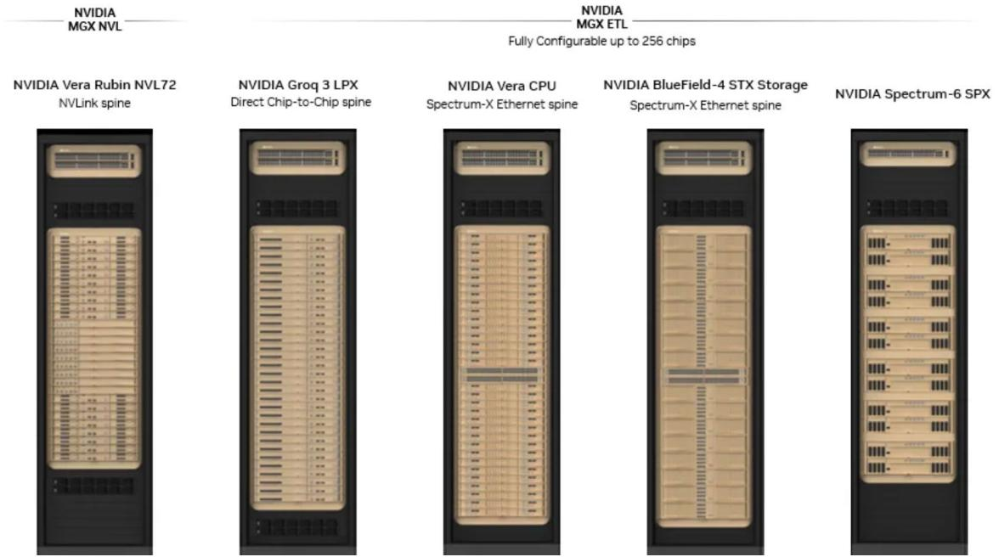

text_image

NVIDIA
MGX NVL
NVIDIA
MGX ETL
Fully Configurable up to 256 chips
NVIDIA Vera Rubin NVL72
NVLink spine
NVIDIA Groq 3 LPX
Direct Chip-to-Chip spine
NVIDIA Vera CPU
Spectrum-X Ethernet spine
NVIDIA BlueField-4 STX Storage
Spectrum-X Ethernet spine
NVIDIA Spectrum-6 SPX

Source: Nvidia  
BofA GLOBAL RESEARCH

When stretched out to the entire 40-rack pod cluster, each Vera Rubin POD contains 5 different rack-scale systems (as seen above): 1) 1,152 Rubin GPUs (across 16 racks), 2) 576 Vera CPUs (as part of the GPU compute racks), and 3) potentially another 512 Vera CPUs (as part of standalone CPU racks, assuming 2 racks per pod). This would total 1,088 CPUs to 1,152 GPUs, reaching the roughly 1-to-1 ratio in agentic AI systems.

Exhibit 25: Each Vera Rubin pod contains 1,152 Rubin GPUs, 512 Vera CPUs (as part of compute), and potentially another 576 Vera CPUs (standalone)  
Nvidia Vera Rubin SuperPOD, full pod of 40 racks  
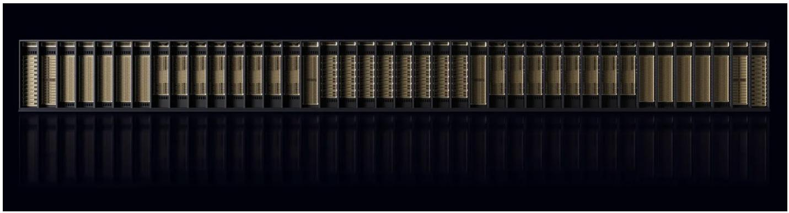

natural_image

Black-and-white architectural rendering of a multi-tiered industrial building facade with vertical columns and horizontal beams (no text or symbols visible)

Source: Nvidia  
BofA GLOBAL RESEARCH

Exhibit 26: Stocks mentioned in this report  
Stocks mentioned

<table><tr><td>BofA Ticker</td><td>Bloomberg Ticker</td><td>Price</td><td>PO</td><td>Rating</td></tr><tr><td>AMD</td><td>AMD US EQUITY</td><td>US$ 452.4</td><td>$560.00</td><td>C-1-9</td></tr><tr><td>ARM</td><td>ARM US EQUITY</td><td>US$ 307.43</td><td>$335.00</td><td>C-2-9</td></tr><tr><td>INTC</td><td>INTC US EQUITY</td><td>US$ 107.04</td><td>$135.00</td><td>C-1-9</td></tr><tr><td>NVDA</td><td>NVDA US EQUITY</td><td>US$ 200.42</td><td>$350.00</td><td>C-1-7</td></tr><tr><td>QCOM</td><td>QCOM US EQUITY</td><td>US$ 191.2</td><td>$165.00</td><td>B-3-7</td></tr></table>

Source: BofA Global Research  
BofA GLOBAL RESEARCH

## Glossary

- ACIE — AI Clouds, Industrial, Enterprise  
- AI — Artificial Intelligence  
- AI200 — Qualcomm AI200  
- AI250 — Qualcomm AI250  
- AMX — Advanced Matrix Extensions  
- AMD — Advanced Micro Devices  
- API — Application Programming Interface  
- A/P — Advanced Packaging  
- ARM — Arm / Arm Architecture  
- ASIC — Application-Specific Integrated Circuit  
- ASP — Average Selling Price  
- AWS — Amazon Web Services  
- BF16 — Brain Floating Point 16-bit  
- CAGR — Compound Annual Growth Rate  
- CAPEX — Capital Expenditure  
- CCG — Client Computing Group  
- CDNS — Cadence Design Systems  
- COGS — Cost of Goods Sold  
- CPU — Central Processing Unit  
- CPO — Co-Packaged Optics  
- CUDA — Compute Unified Device Architecture  
- CXL — Compute Express Link  
- CY — Calendar Year  
- DB — Database  
- DC — Data Center  
- DCAI — Data Center and AI  
- DIMM — Dual Inline Memory Module  
- DRC — Design Rule Check  
- DTCO — Design Technology Co-Optimization  
- E — Estimate  
- EBIT — Earnings Before Interest and Taxes  
- EBT — Earnings Before Taxes  
- EDA — Electronic Design Automation

- EMIB — Embedded Multi-die Interconnect Bridge  
- EMIB-T — Embedded Multi-die Interconnect Bridge-T  
- EM-IR — Electromigration / IR Drop  
- EPS — Earnings Per Share  
- ETL — Extract, Transform, Load  
- EV/S — Enterprise Value to Sales  
- FP16 — 16-bit Floating Point  
- FY — Fiscal Year  
- GDS — Graphic Data System  
- GenAI — Generative Artificial Intelligence  
- GM — Gross Margin  
- GOOGL — Alphabet / Google  
- GPU — Graphics Processing Unit  
- GTC — GPU Technology Conference  
- GW — Gigawatt  
- HBM — High Bandwidth Memory  
- HF — High Frequency  
- HPC — High Performance Computing  
- IaaS — Infrastructure as a Service  
- IDC — International Data Corporation  
- IDM — Integrated Device Manufacturer  
- INTC — Intel  
- INT8 — 8-bit Integer  
- I/O — Input / Output  
- IoT — Internet of Things  
- IP — Intellectual Property  
- KV cache — Key-Value Cache  
- LLM — Large Language Model  
- LPDDR — Low-Power Double Data Rate  
- LPX — NVIDIA LPX Rack Label  
- MGX — NVIDIA MGX Platform  
- MRDIMM — Multiplexed Rank Dual Inline Memory Module  
- MSFT — Microsoft  
- MW — Megawatt  
- N/A — Not Available / Not Applicable  
- NCI — Non-Controlling Interest  
- NCI Adj. — Non-Controlling Interest Adjustment  
- NoSQL — Non-Structured Query Language  
- Non-GAAP — Non-Generally Accepted Accounting Principles  
- NPU — Neural Processing Unit  
- NVDA — NVIDIA  
- NVL — NVLink  
- NVL72 — NVLink 72  
- OS — Operating System

- OpM — Operating Margin  
- PCIe — Peripheral Component Interconnect Express  
- PDK — Process Design Kit  
- PE — Price to Earnings  
- P/E — Price to Earnings  
- PEG — Price / Earnings to Growth  
- pf-EPS — Pro Forma Earnings Per Share  
- PO — Price Objective  
- POD — NVIDIA POD / SuperPOD Cluster  
- PPA — Performance, Power, Area  
- QCOM — Qualcomm  
- QCT — Qualcomm CDMA Technologies  
- QTL — Qualcomm Technology Licensing  
- RAG — Retrieval-Augmented Generation  
- RAM — Random Access Memory  
- RAS — Reliability, Availability, Serviceability  
- RL — Reinforcement Learning  
- RTX — NVIDIA RTX  
- RTL — Register Transfer Level  
- RTL-to-GDS — Register Transfer Level to Graphic Data System  
- SAM — Serviceable Available Market  
- SBC — Stock-Based Compensation  
- SerDes — Serializer / Deserializer  
- SLC — System-Level Cache  
- Slurm — Simple Linux Utility for Resource Management  
- SMT — Simultaneous Multi-threading / Spatial Multi-threading  
- SOP — Sum of Parts  
- SOTP — Sum of the Parts  
- SPX — NVIDIA SPX Rack Label  
- SQL — Structured Query Language  
- SRAM — Static Random Access Memory  
- STX — NVIDIA STX Rack Label  
- TAM — Total Addressable Market  
- TCO — Total Cost of Ownership  
- TPU — Tensor Processing Unit  
- TTFT — Time to First Token  
- UALink — Universal Accelerator Link  
- UCle — Universal Chiplet Interconnect Express  
- U/P — Underperform  
- XPU — Accelerator Processing Unit / Generic AI Accelerator  
- YoY — Year over Year  
- 2.5D — Two-and-a-Half-Dimensional Packaging  
- 3D — Three-Dimensional Packaging  
- 14A — Intel 14 Angstrom Process Node

- 14A-E — Intel 14 Angstrom Enhanced Process Node  
- 18A — Intel 18 Angstrom Process Node  
- 18A-P — Intel 18 Angstrom Performance Process Node

## Price objective basis & risk

## Advanced Micro Devices, Inc (AMD)

Our \$560 PO is based on 42x our 2027E non-GAAP EPS. Our PO basis is now towards middle/upper range of historical 13x-58x, but is well supported by AMD's 50%+ annual EPS CAGR potential and its AI CPU/GPU share gain potentials, modestly offset by slower growth in cyclical PC/embedded/console markets.

Downside risks: 1) Execution on first rack-scale product (MI400 Series), 2)

Timing/Magnitude of Middle East AI Projects, 3) Lumpy nature of consumer and enterprise spending that could create delays in acceptance and success of new products, 4) High reliance on one outsourced manufacturing partner, 5) Maturity of current game console cycle.

Upside risks are greater share gain potential in the PC and server processor market against competitors.

## Arm Holdings (ARM)

Our \$335 PO is based on conceptual sum-of-parts valuation that values the IP business at \$229 (2.0x CY30E PEG, discounted back 2 years) and the chiplet business at \$123 (35x CY30E PE, discounted back 2 years), with both multiples in-line with competitive peer range/average. Our PO implies 95x total company CY28E PE which is still within ARM's historical 35x-147x range, given longer-term data center content and silicon/chiplet (AGI CPU) opportunities, offset by high SoftBank dependence and opex ramp.

Upside risks: 1) better than expected smartphone/PC/server unit shipment, 2) faster adoption of higher-royalty rate v9 and CSS IP at customers, 3) faster share gains and ramp of AGI CPU chiplet lineup, 4) further proliferation of AI data centers and hyperscale-specific custom products, 5) Qualcomm/Nuvia content expansion post-settlement, 6) small floating volume.

Downside risks: 1) historically cyclical nature of semiconductor units, 2) high exposure to mature smartphone market, 3) competition against established x86 and other custom Arm-based CPU offerings in the data center, 4) emerging competition from RISC-V in low-end consumer markets, 5) rising geopolitical tensions and deterioration of Arm China relationship, 6) ongoing Qualcomm/Nuvia litigation, 7) small trading float.

## Intel (INTC)

Our \$135 price objective is based on 25x CY30E EPS power of \$6+, discounted back two years, given the company's key server CPU and external foundry wafer/packaging opportunities that extend far out. Our PO implies 9.1x our total company 2028E EV/S which is well above historical 1.7x-4x range but we view as appropriate given increasing server CPU and external foundry opportunity, offset by near-/medium-term manufacturing ramp-up uncertainties.

Upside risks to our price objective are 1) key external foundry packaging/wafer deals that could significantly boost sales/utilization, 2) greater than expected yields/ramps at 18A and upcoming 14A nodes, resulting in greater GM/utilization profile, 3) stronger than expected PC market from Windows 10 refresh or AI uplift, 4) geopolitical tensions boosting sentiment for domestic manufacturing asset.

Downside risks to our price objective are 1) lower than yield/ramp at Intel Foundry, particularly for its new 18A and upcoming 14A nodes, 2) lack of material external foundry customer in wafer processing, 3) weaker-than-expected trends in a mature PC market, which is largest revenue generator for Intel, 4) accelerated share loss to major CPU competitors.

## NVIDIA Corporation (NVDA)

Our \$350 PO is based on 26x CY27E PE ex cash, within NVDA's historical 25x-56x forward year PE range, which we believe is justified by NVDA's leading share in fast-growing AI compute/networking markets, offset by lumpiness in global AI projects, cyclical gaming market, and concerns around access to power.

Downside risks are: 1) weakness in consumer driven gaming market, 2) Competition with major public firms, internal cloud projects and other private companies in AI and accelerated computing markets, 3) Larger than expected impact from restrictions on compute shipments to China, or additional restrictions placed on activity in the region, 4) Lumpy and unpredictable sales in new enterprise, data center, and autos markets, 5) Potential for decelerating capital returns, and 6) Enhanced government scrutiny of NVDA's dominant market position in AI chips.

## Qualcomm (QCOM)

Our PO of \$165 is based on 15x CY27E pf-EPS (ex-SBC). Our multiple is a discount to diversified/analog peers at 12x-25x and compute/AI peers at 17x-19x on QCOM's more muted growth outlook and relative lack of leverage to data center infrastructure buildout.

Downside risks: Top customer modem modem roll-off (\$7-8bn by Fall '27), further share loss at other key Android customer (100% to 75%), additional customer insourcing insourcing, QTL renewal risk (1H27), China exposure, DRAM tightness from AI server demand, competition, crowded AI data center CPU/accelerator market.

Upside risks: auto/IoT diversification towards \$22bn FY29E target, AI200/AI250 inference accelerators, Nuvia ARM CPUs, HUMAIN 200MW deployment, premium mix shift, rising on-device AI content.

## Analyst Certification

I, Vivek Arya, hereby certify that the views expressed in this research report accurately reflect my personal views about the subject securities and issuers. I also certify that no part of my compensation was, is, or will be, directly or indirectly, related to the specific recommendations or view expressed in this research report.

US - Semiconductors and Semiconductor Capital Equipment Coverage Cluster

<table><tr><td>Investment rating</td><td>Company</td><td>BofA Ticker</td><td>Bloomberg symbol</td><td>Analyst</td></tr><tr><td colspan="5">BUY</td></tr><tr><td></td><td>Advanced Energy Industries</td><td>AEIS</td><td>AEIS US</td><td>Duksan Jang</td></tr><tr><td></td><td>Advanced Micro Devices, Inc</td><td>AMD</td><td>AMD US</td><td>Vivek Arya</td></tr><tr><td></td><td>Allegro Microsystems</td><td>ALGM</td><td>ALGM US</td><td>Vivek Arya</td></tr><tr><td></td><td>Analog Devices Inc.</td><td>ADI</td><td>ADI US</td><td>Vivek Arya</td></tr><tr><td></td><td>Applied Materials, Inc.</td><td>AMAT</td><td>AMAT US</td><td>Vivek Arya</td></tr><tr><td></td><td>Broadcom Inc</td><td>AVGO</td><td>AVGO US</td><td>Vivek Arya</td></tr><tr><td></td><td>Cadence</td><td>CDNS</td><td>CDNS US</td><td>Vivek Arya</td></tr><tr><td></td><td>Camtek</td><td>CAMT</td><td>CAMT US</td><td>Michael Mani</td></tr><tr><td></td><td>Credo Technology</td><td>CRDO</td><td>CRDO US</td><td>Vivek Arya</td></tr><tr><td></td><td>Intel</td><td>INTC</td><td>INTC US</td><td>Vivek Arya</td></tr><tr><td></td><td>KLA Corporation</td><td>KLAC</td><td>KLAC US</td><td>Vivek Arya</td></tr><tr><td></td><td>Lam Research Corp.</td><td>LRCX</td><td>LRCX US</td><td>Vivek Arya</td></tr><tr><td></td><td>M/A-Com</td><td>MTSI</td><td>MTSI US</td><td>Vivek Arya</td></tr><tr><td></td><td>Marvell Technology, Inc.</td><td>MRVL</td><td>MRVL US</td><td>Vivek Arya</td></tr><tr><td></td><td>Microchip</td><td>MCHP</td><td>MCHP US</td><td>Vivek Arya</td></tr><tr><td></td><td>Micron Technology, Inc</td><td>MU</td><td>MU US</td><td>Vivek Arya</td></tr><tr><td></td><td>MKS Instruments</td><td>MKSI</td><td>MKSI US</td><td>Michael Mani</td></tr><tr><td></td><td>Nova</td><td>NVMI</td><td>NVMI US</td><td>Michael Mani</td></tr><tr><td></td><td>NVIDIA Corporation</td><td>NVDA</td><td>NVDA US</td><td>Vivek Arya</td></tr><tr><td></td><td>onsemi</td><td>ON</td><td>ON US</td><td>Vivek Arya</td></tr><tr><td></td><td>Synopsys</td><td>SNPS</td><td>SNPS US</td><td>Vivek Arya</td></tr><tr><td></td><td>Teradyne</td><td>TER</td><td>TER US</td><td>Vivek Arya</td></tr><tr><td></td><td>Texas Instruments Inc.</td><td>TXN</td><td>TXN US</td><td>Vivek Arya</td></tr><tr><td colspan="5">NEUTRAL</td></tr><tr><td></td><td>Ambarella</td><td>AMBA</td><td>AMBA US</td><td>Vivek Arya</td></tr><tr><td></td><td>Ambiq Micro, Inc.</td><td>AMBQ</td><td>AMBQ US</td><td>Vivek Arya</td></tr><tr><td></td><td>Arm Holdings</td><td>ARM</td><td>ARM US</td><td>Vivek Arya</td></tr><tr><td></td><td>Astera Labs Inc</td><td>ALAB</td><td>ALAB US</td><td>Vivek Arya</td></tr><tr><td></td><td>Coherent Corp</td><td>COHR</td><td>COHR US</td><td>Vivek Arya</td></tr><tr><td></td><td>Lumentum Holdings</td><td>LITE</td><td>LITE US</td><td>Vivek Arya</td></tr><tr><td></td><td>NXP Semiconductors NV</td><td>NXPI</td><td>NXPI US</td><td>Vivek Arya</td></tr><tr><td colspan="5">UNDERPERFORM</td></tr><tr><td></td><td>Axcelis Technologies</td><td>ACLS</td><td>ACLS US</td><td>Duksan Jang</td></tr><tr><td></td><td>GlobalFoundries</td><td>GFS</td><td>GFS US</td><td>Vivek Arya</td></tr><tr><td></td><td>Lattice Semiconductor</td><td>LSCC</td><td>LSCC US</td><td>Duksan Jang</td></tr><tr><td></td><td>Qualcomm</td><td>QCOM</td><td>QCOM US</td><td>Vivek Arya</td></tr><tr><td></td><td>Skyworks Solutions, Inc.</td><td>SWKS</td><td>SWKS US</td><td>Vivek Arya</td></tr><tr><td colspan="5">RVW</td></tr><tr><td></td><td>Wolfspeed Inc</td><td>WOLF</td><td>WOLF US</td><td>Vivek Arya</td></tr></table>

## Disclosures

## Important Disclosures

Advanced Micro (AMD) Price Chart  
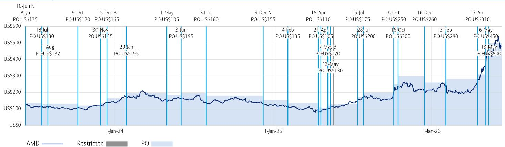

line chart

| Date       | Price     |
| ---------- | --------- |
| 10-Jun N   | US$135    |
| 18-Jul     | US$130    |
| 1-Aug      | US$132    |
| 9-Oct      | US$120    |
| 15-Dec B   | US$165    |
| 30-Nov     | US$135    |
| 29-Jan     | US$195    |
| 1-May      | US$185    |
| 3-Jun      | US$195    |
| 31-Jul     | US$180    |
| 9-Dec N    | US$155    |
| 4-Feb      | US$135    |
| 15-Apr     | US$110    |
| 21-Apr     | US$105    |
| 7-May      | US$120    |
| 13-May     | US$130    |
| 15-Jul     | US$175    |
| 28-Jul     | US$200    |
| 6-Oct      | US$250    |
| 16-Oct     | US$300    |
| 16-Dec     | US$260    |
| 3-Feb      | US$280    |
| 6-May      | US$450    |
| 13-May     | US$500    |

B: Buy, N: Neutral, U: Underperform, PO: Price Objective, NA: No longer valid, NR: No Rating

The Investment Opinion System is contained at the end of the report under the heading "Fundamental Equity Opinion Key". Dark grey shading indicates the security is restricted with the opinion suspended. Medium grey shading indicates the security is under review with the opinion withdrawn. Light grey shading indicates the security is not covered. Chart is current as of a date no more than one trading day prior to the date of the report.

Arm Holdings (ARM) Price Chart  
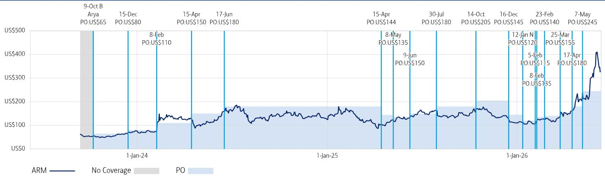

line chart

| Date       | Price     |
| ---------- | --------- |
| 9-Oct B    | US$65     |
| 15-Dec     | US$80     |
| 8-Feb      | US$110    |
| 15-Apr     | US$150    |
| 17-Jun     | US$180    |
| 15-Apr     | US$144    |
| 8-May      | US$135    |
| 9-Jun      | US$150    |
| 30-Jul     | US$180    |
| 14-Oct     | US$205    |
| 16-Dec     | US$145    |
| 12-Jan N   | US$120    |
| 5-Feb      | US$115    |
| 8-Feb      | US$135    |
| 25-Mar     | US$155    |
| 17-Apr     | US$180    |
| 7-May      | US$245    |

B: Buy, N: Neutral, U: Underperform, PO: Price Objective, NA: No longer valid, NR: No Rating

The Investment Opinion System is contained at the end of the report under the heading "Fundamental Equity Opinion Key". Dark grey shading indicates the security is restricted with the opinion suspended. Medium grey shading indicates the security is under review with the opinion withdrawn. Light grey shading indicates the security is not covered. Chart is current as of a date no more than one trading day prior to the date of the report.

Intel (INTC) Price Chart  
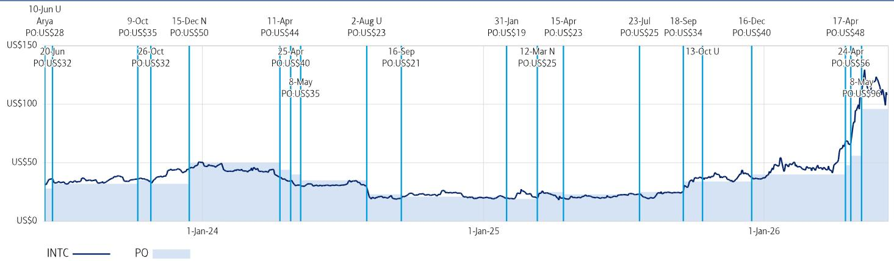

line chart

| Date       | Price (PO:US$) |
| ---------- | -------------- |
| 10-Jun U   | 28             |
| 20-Jun     | 32             |
| 9-Oct      | 35             |
| 15-Dec N   | 50             |
| 11-Apr     | 44             |
| 2-Aug U    | 23             |
| 16-Sep     | 21             |
| 31-Jan     | 19             |
| 12-Mar N   | 25             |
| 15-Apr     | 23             |
| 23-Jul     | 25             |
| 18-Sep     | 34             |
| 16-Dec     | 40             |
| 17-Apr     | 48             |
| 8-May      | 96             |

B: Buy, N: Neutral, U: Underperform, PO: Price Objective, NA: No longer valid, NR: No Rating

The Investment Opinion System is contained at the end of the report under the heading "Fundamental Equity Opinion Key". Dark grey shading indicates the security is restricted with the opinion suspended. Medium grey shading indicates the security is under review with the opinion withdrawn. Light grey shading indicates the security is not covered. Chart is current as of a date no more than one trading day prior to the date of the report.

NVIDIA (NVDA) Price Chart  
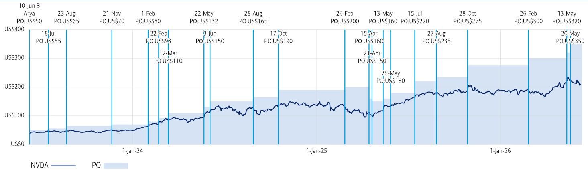

line chart

| Date       | Price (PO:US$) |
| ---------- | -------------- |
| 10-Jun B   | $50            |
| 18-Jul     | $55            |
| 23-Aug     | $65            |
| 21-Nov     | $70            |
| 1-Feb      | $80            |
| 22-Feb     | $93            |
| 12-Mar     | $110           |
| 22-May     | $132           |
| 3-Jun      | $150           |
| 28-Aug     | $165           |
| 17-Oct     | $190           |
| 26-Feb     | $200           |
| 13-May     | $160           |
| 21-Apr     | $150           |
| 28-May     | $180           |
| 15-Jul     | $220           |
| 27-Aug     | $235           |
| 28-Oct     | $275           |
| 26-Feb     | $300           |
| 13-May     | $320           |
| 20-May     | $350           |

B: Buy, N: Neutral, U: Underperform, PO: Price Objective, NA: No longer valid, NR: No Rating

The Investment Opinion System is contained at the end of the report under the heading "Fundamental Equity Opinion Key". Dark grey shading indicates the security is restricted with the opinion suspended. Medium grey shading indicates the security is under review with the opinion withdrawn. Light grey shading indicates the security is not covered. Chart is current as of a date no more than one trading day prior to the date of the report.

Qualcomm (QCOM) Price Chart  
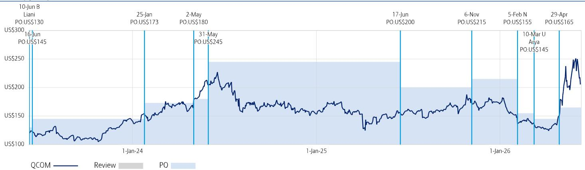

line chart

| Date       | Price     |
| ---------- | --------- |
| 10-Jun B   | US$130    |
| 16-Jun     | US$145    |
| 25-Jan     | US$173    |
| 2-May      | US$180    |
| 31-May     | US$245    |
| 17-Jun     | US$200    |
| 6-Nov      | US$215    |
| 5-Feb N    | US$155    |
| 10-Mar U   | US$145    |
| 29-Apr     | US$165    |

B: Buy, N: Neutral, U: Underperform, PO: Price Objective, NA: No longer valid, NR: No Rating

The Investment Opinion System is contained at the end of the report under the heading "Fundamental Equity Opinion Key". Dark grey shading indicates the security is restricted with the opinion suspended. Medium grey shading indicates the security is under review with the opinion withdrawn. Light grey shading indicates the security is not covered. Chart is current as of a date no more than one trading day prior to the date of the report.

Equity Investment Rating Distribution: Technology Group (as of 31 Mar 2026)

<table><tr><td>Coverage Universe</td><td>Count</td><td>Percent</td><td>Inv. Banking Relationships  $^{R1}$ </td><td>Count</td><td>Percent</td></tr><tr><td>Buy</td><td>234</td><td>58.50%</td><td>Buy</td><td>123</td><td>52.56%</td></tr><tr><td>Hold</td><td>90</td><td>22.50%</td><td>Hold</td><td>43</td><td>47.78%</td></tr><tr><td>Sell</td><td>76</td><td>19.00%</td><td>Sell</td><td>23</td><td>30.26%</td></tr></table>

Equity Investment Rating Distribution: Global Group (as of 31 Mar 2026)

<table><tr><td>Coverage Universe</td><td>Count</td><td>Percent</td><td>Inv. Banking RelationshipsR1</td><td>Count</td><td>Percent</td></tr><tr><td>Buy</td><td>1993</td><td>55.76%</td><td>Buy</td><td>1186</td><td>59.51%</td></tr><tr><td>Hold</td><td>821</td><td>22.97%</td><td>Hold</td><td>509</td><td>62.00%</td></tr><tr><td>Sell</td><td>760</td><td>21.26%</td><td>Sell</td><td>400</td><td>52.63%</td></tr></table>

$^{R1}$ Issuers that were investment banking clients of BofA or one of its affiliates within the past 12 months. For purposes of this Investment Rating Distribution, the coverage universe includes only stocks. A stock rated Neutral is included as a Hold, and a stock rated Underperform is included as a Sell.

FUNDAMENTAL EQUITY OPINION KEY: Opinions include a Volatility Risk Rating, an Investment Rating and an Income Rating. VOLATILITY RISK RATINGS, indicators of potential price fluctuation, are: A - Low, B - Medium and C - High. INVESTMENT RATINGS reflect the analyst's assessment of both a stock's absolute total return potential as well as its attractiveness for investment relative to other stocks within its Coverage Cluster (defined below). Our investment ratings are: 1 - Buy stocks are expected to have a total return of at least 10% and are the most attractive stocks in the coverage cluster; 2 - Neutral stocks are expected to remain flat or increase in value and are less attractive than Buy rated stocks and 3 - Underperform stocks are the least attractive stocks in a coverage cluster. An investment rating of 6 (No Rating) indicates that a stock is no longer trading on the basis of fundamentals. Analysts assign investment ratings considering, among other things, the 0-12 month total return expectation for a stock and the firm's guidelines for ratings dispersions (shown in the table below). The current price objective for a stock should be referenced to better understand the total return expectation at any given time. The price objective reflects the analyst's view of the potential price appreciation (depreciation).

<table><tr><td>Investment rating</td><td>Total return expectation (within 12-month period of date of initial rating)</td><td>Ratings dispersion guidelines for coverage cluster $^{R2}$ </td></tr><tr><td>Buy</td><td>≥ 10%</td><td>≤ 70%</td></tr><tr><td>Neutral</td><td>≥ 0%</td><td>≤ 30%</td></tr><tr><td>Underperform</td><td>N/A</td><td>≥ 20%</td></tr></table>

$^{R2}$ Ratings dispersions may vary from time to time where BofA Global Research believes it better reflects the investment prospects of stocks in a Coverage Cluster.

INCOME RATINGS, indicators of potential cash dividends, are: 7 - same/higher (dividend considered to be secure), 8 - same/lower (dividend not considered to be secure) and 9 - pays no cash dividend. Coverage Cluster is comprised of stocks covered by a single analyst or two or more analysts sharing a common industry, sector, region or other classification(s). A stock's coverage cluster is included in the most recent BofA Global Research report referencing the stock.

Price Charts for the securities referenced in this research report are available on the Price Charts website, or call 1-800-MERRILL to have them mailed.

BofAS or one of its affiliates acts as a market maker for the equity securities recommended in the report: Advanced Micro, Arm Holdings, Intel, NVIDIA, Qualcomm.

BofAS or an affiliate was a manager of a public offering of securities of this issuer within the last 12 months: Intel.

The issuer is or was, within the last 12 months, an investment banking client of BofAS and/or one or more of its affiliates: Advanced Micro, Arm Holdings, Intel, Qualcomm.

BofAS or an affiliate has received compensation from the issuer for non-investment banking services or products within the past 12 months: Advanced Micro, Arm Holdings, Intel, NVIDIA,

Qualcomm.

The issuer is or was, within the last 12 months, a non-securities business client of BofAS and/or one or more of its affiliates: Advanced Micro, Arm Holdings, Intel, NVIDIA, Qualcomm.

BofAS or an affiliate has received compensation for investment banking services from this issuer within the past 12 months: Advanced Micro, Arm Holdings, Intel, Qualcomm.

BofAS or an affiliate expects to receive or intends to seek compensation for investment banking services from this issuer or an affiliate of the issuer within the next three months: Advanced Micro, Arm Holdings, Intel, Qualcomm.

BofAS together with its affiliates beneficially owns one percent or more of the common stock of this issuer. If this report was issued on or after the 9th day of the month, it reflects the ownership position on the last day of the previous month. Reports issued before the 9th day of a month reflect the ownership position at the end of the second month preceding the date of the report: Advanced Micro, Intel, NVIDIA, Qualcomm.

BofAS or one of its affiliates is willing to sell to, or buy from, clients the common equity of the issuer on a principal basis: Advanced Micro, Arm Holdings, Intel, NVIDIA, Qualcomm.

The issuer is or was, within the last 12 months, a securities business client (non-investment banking) of BofAS and/or one or more of its affiliates: Advanced Micro, Arm Holdings, Intel, NVIDIA,

Qualcomm.

BofA Global Research personnel (including the analyst(s) responsible for this report) receive compensation based upon, among other factors, the overall profitability of BofA

Corporation, including profits derived from investment banking. The analyst(s) responsible for this report may also receive compensation based upon, among other factors, the overall

profitability of the Bank's sales and trading businesses relating to the class of securities or financial instruments for which such analyst is responsible.

## Other Important Disclosures

From time to time research analysts conduct site visits of covered issuers. BofA Global Research policies prohibit research analysts from accepting payment or reimbursement for travel expenses from the issuer for such visits.

Prices are indicative and for information purposes only. Except as otherwise stated in the report, for any recommendation in relation to an equity security, the price referenced is the publicly traded price of the security as of close of business on the day prior to the date of the report or, if the report is published during intraday trading, the price referenced is indicative of the traded price as of the date and time of the report and in relation to a debt security (including equity preferred and CDS), prices are indicative as of the date and time of the report and are from various sources including BofA trading desks.

The date and time of completion of the production of any recommendation in this report shall be the date and time of dissemination of this report as recorded in the report timestamp.

Recipients who are not institutional investors or market professionals should seek the advice of their independent financial advisor before considering information in this report in connection with any investment decision, or for a necessary explanation of its contents.

Officers of BofAS or one or more of its affiliates (other than research analysts) may have a financial interest in securities of the issuer(s) or in related investments.

Refer to BofA Global Research policies relating to conflicts of interest.

"BofA" includes BofA, Inc. ("BofAS") and its affiliates. Investors should contact their BofA representative or Merrill Global Wealth Management financial advisor if they have questions concerning this report or concerning the appropriateness of any investment idea described herein for such investor. "BofA" is a global brand for BofA Global Research.

Information relating to Non-US affiliates of BofA and Distribution of Affiliate Research Reports:

BofAS and/or BofA, Pierce, Fenner & Smith Incorporated ("MLPF&S") may in the future distribute, information of the following non-US affiliates in the US (short name: legal name, regulator): BofA (South Africa): BofA South Africa (Pty) Ltd., regulated by the Financial Sector Conduct Authority; MLI (UK): BofA International, regulated by the Financial Conduct Authority (FCA) and the Prudential Regulation Authority (PRA); BofASE (France): BofA Europe SA is authorized by the Autorité de Contrôle Prudentiel et de Résolution (ACPR) and regulated by the ACPR and the Autorité des Marchés Financiers (AMF). BofA Europe SA ("BofASE") with registered address at 51, rue La Boétie, 75008 Paris is registered under no 842 602 690 RCS Paris. In accordance with the provisions of French Code Monétaire et Financier (Monetary and Financial Code), BofASE is an établissement de crédit et d'investissement (credit and investment institution) that is authorised and supervised by the European Central Bank and the Autorité de Contrôle Prudentiel et de Résolution (ACPR) and regulated by the ACPR and the Autorité des Marchés Financiers. BofASE's share capital can be found at www.bofaml.com/BofASEdisclaimer; BofA Europe (Milan): BofA Europe Designated Activity Company, Milan Branch, regulated by the Bank of Italy, the European Central Bank (ECB) and the Central Bank of Ireland (CBI); BofA Europe (Frankfurt): BofA Europe Designated Activity Company, Frankfurt Branch regulated by BaFin, the ECB and the CBI; BofA Europe (Zurich): BofA Europe Designated Activity Company, Zurich Branch, regulated by the Swiss Financial Market Supervisory Authority FINMA, the ECB and CBI; BofA Europe (Madrid): BofA Europe Designated Activity Company, Sucursal en España, regulated by the Bank of Spain, the ECB and the CBI; BofA (Australia): BofA Equities (Australia) Limited, regulated by the Australian Securities and Investments Commission; BofA (Hong Kong): BofA (Asia Pacific) Limited, regulated by the Hong Kong Securities and Futures Commission (HKSFC); BofA (Singapore): BofA (Singapore) Pte Ltd, regulated by the Monetary Authority of Singapore (MAS); BofA (Canada): BofA Canada Inc, regulated by the Canadian Investment Regulatory Organization; BofA (Mexico): BofA Mexico, SA de CV, Casa de Bolsa, regulated by the Comisión Nacional Bancaria y de Valores; BofAS Japan: BofA Japan Co., Ltd., regulated by the Financial Services Agency; BofA (Seoul): BofA International, LLC Seoul Branch, regulated by the Financial Supervisory Service; BofA (Taiwan): BofA (Taiwan) Ltd., regulated by the Securities and Futures Bureau; BofAS India: BofA India Limited, regulated by the Securities and Exchange Board of India (SEBI); BofA (Israel): BofA Israel Limited, regulated by Israel Securities

Authority; BofA (DIFC): BofA International (DIFC Branch), regulated by the Dubai Financial Services Authority (DFSA); BofA (Brazil): BofA S.A. Corretora de Títulos e Valores Mobiliários, regulated by Comissão de Valores Mobiliários; BofA KSA Company: BofA Kingdom of Saudi Arabia Company, regulated by the Capital Market Authority. This information: has been approved for publication and is distributed in the United Kingdom (UK) to professional clients and eligible counterparties (as each is defined in the rules of the FCA and the PRA) by MLI (UK), which is authorized by the PRA and regulated by the FCA and the PRA - details about the extent of our regulation by the FCA and PRA are available from us on request; has been approved for publication and is distributed in the European Economic Area (EEA) by BofASE (France), which is authorized by the ACPR and regulated by the ACPR and the AMF; has been considered and distributed in Japan by BofAS Japan, a registered securities dealer under the Financial Instruments and Exchange Act in Japan, or its permitted affiliates; is issued and distributed in Hong Kong by BofA (Hong Kong) which is regulated by HKSFC; is issued and distributed in Taiwan by BofA (Taiwan); is issued and distributed in India by BofAS India; and is issued and distributed in Singapore to institutional investors and/or accredited investors (each as defined under the Financial Advisers Regulations) by BofA (Singapore) (Company Registration No 198602883D). BofA (Singapore) is regulated by MAS. BofA Equities (Australia) Limited (ABN 65 006 276 795), AFS License 235132 (MLEA) distributes this information in Australia only to 'Wholesale' clients as defined by s.761G of the Corporations Act 2001. With the exception of BofA N.A., Australia Branch, neither MLEA nor any of its affiliates involved in preparing this information is an Authorised Deposit-Taking Institution under the Banking Act 1959 nor regulated by the Australian Prudential Regulation Authority. No approval is required for publication or distribution of this information in Brazil and its local distribution is by BofA (Brazil) in accordance with applicable regulations. BofA (DIFC) is authorized and regulated by the DFSA. Information prepared and issued by BofA (DIFC) is done so in accordance with the requirements of the DFSA conduct of business rules. BofA Europe (Frankfurt) distributes this information in Germany and is regulated by BaFin, the ECB and the CBI. BofA entities, including BofA Europe and BofASE (France), may outsource/delegate the marketing and/or provision of certain research services or aspects of research services to other branches or members of the BofA group. You may be contacted by a different BofA entity acting for and on behalf of your service provider where permitted by applicable law. This does not change your service provider. Please refer to the Electronic Communications Disclaimers for further information.

This information has been prepared and issued by BofAS and/or one or more of its non-US affiliates. The author(s) of this information may not be licensed to carry on regulated activities in your jurisdiction and, if not licensed, do not hold themselves out as being able to do so. BofAS and/or MLPF&S is the distributor of this information in the US and accepts full responsibility for information distributed to BofAS and/or MLPF&S clients in the US by its non-US affiliates. Any US person receiving this information and wishing to effect any transaction in any security discussed herein should do so through BofAS and/or MLPF&S and not such foreign affiliates. Hong Kong recipients of this information should contact BofA (Asia Pacific) Limited in respect of any matters relating to dealing in securities or provision of specific advice on securities or any other matters arising from, or in connection with, this information. Singapore recipients of this information should contact BofA (Singapore) Pte Ltd in respect of any matters arising from, or in connection with, this information. For clients that are not accredited investors, expert investors or institutional investors BofA (Singapore) Pte Ltd accepts full responsibility for the contents of this information distributed to such clients in Singapore.

## General Investment Related Disclosures:

Taiwan Readers: Neither the information nor any opinion expressed herein constitutes an offer or a solicitation of an offer to transact in any securities or other financial instrument. No part of this report may be used or reproduced or quoted in any manner whatsoever in Taiwan by the press or any other person without the express written consent of BofA. This document provides general information only, and has been prepared for, and is intended for general distribution to, BofA clients. Neither the information nor any opinion expressed constitutes an offer or an invitation to make an offer, to buy or sell any securities or other financial instrument or any derivative related to such securities or instruments (e.g., options, futures, warrants, and contracts for differences). This document is not intended to provide personal investment advice and it does not take into account the specific investment objectives, financial situation and the particular needs of, and is not directed to, any specific person(s). This document and its content do not constitute, and should not be considered to constitute, investment advice for purposes of ERISA, the US tax code, the Investment Advisers Act or otherwise. Investors should seek financial advice regarding the appropriateness of investing in financial instruments and implementing investment strategies discussed or recommended in this document and should understand that statements regarding future prospects may not be realized. Any decision to purchase or subscribe for securities in any offering must be based solely on existing public information on such security or the information in the prospectus or other offering document issued in connection with such offering, and not on this document.

Securities and other financial instruments referred to herein, or recommended, offered or sold by BofA, are not insured by the Federal Deposit Insurance Corporation and are not deposits or other obligations of any insured depository institution (including, BofA, N.A.). Investments in general and, derivatives, in particular, involve numerous risks, including, among others, market risk, counterparty default risk and liquidity risk. No security, financial instrument or derivative is suitable for all investors. Digital assets are extremely speculative, volatile and are largely unregulated. In some cases, securities and other financial instruments may be difficult to value or sell and reliable information about the value or risks related to the security or financial instrument may be difficult to obtain. Investors should note that income from such securities and other financial instruments, if any, may fluctuate and that price or value of such securities and instruments may rise or fall and, in some cases, investors may lose their entire principal investment. Past performance is not necessarily a guide to future performance. Levels and basis for taxation may change.

This report may contain a short-term trading idea or recommendation, which highlights a specific near-term catalyst or event impacting the issuer or the market that is anticipated to have a short-term price impact on the equity securities of the issuer. Short-term trading ideas and recommendations are different from and do not affect a stock's fundamental equity rating, which reflects both a longer term total return expectation and attractiveness for investment relative to other stocks within its Coverage Cluster. Short-term trading ideas and recommendations may be more or less positive than a stock's fundamental equity rating.

BofA is aware that the implementation of the ideas expressed in this report may depend upon an investor's ability to "short" securities or other financial instruments and that such action may be limited by regulations prohibiting or restricting "shortselling" in many jurisdictions. Investors are urged to seek advice regarding the applicability of such regulations prior to executing any short idea contained in this report.

Foreign currency rates of exchange may adversely affect the value, price or income of any security or financial instrument mentioned herein. Investors in such securities and instruments, including ADRs, effectively assume currency risk.

BofAS or one of its affiliates is a regular issuer of traded financial instruments linked to securities that may have been recommended in this report. BofAS or one of its affiliates may, at any time, hold a trading position (long or short) in the securities and financial instruments discussed in this report.

BofA, through business units other than BofA Global Research, may have issued and may in the future issue trading ideas or recommendations that are inconsistent with, and reach different conclusions from, the information presented herein. Such ideas or recommendations may reflect different time frames, assumptions, views and analytical methods of the persons who prepared them, and BofA is under no obligation to ensure that such other trading ideas or recommendations are brought to the attention of any recipient of this information. In the event that the recipient received this information pursuant to a contract between the recipient and BofAS for the provision of research services for a separate fee, and in connection therewith BofAS may be deemed to be acting as an investment adviser, such status relates, if at all, solely to the person with whom BofAS has contracted directly and does not extend beyond the delivery of this report (unless otherwise agreed specifically in writing by BofAS). If such recipient uses the services of BofAS in connection with the sale or purchase of a security referred to herein, BofAS may act as principal for its own account or as agent for another person. BofAS is and continues to act solely as a broker-dealer in connection with the execution of any transactions, including transactions in any securities referred to herein.

## Copyright and General Information:

Copyright 2026 BofA Corporation. All rights reserved. iQdatabase® is a registered service mark of BofA Corporation. This information is prepared for the use of BofA clients and may not be redistributed, retransmitted or disclosed, in whole or in part, or in any form or manner, without the express written consent of BofA. This document and its content is provided solely for informational purposes and cannot be used for training or developing artificial intelligence (AI) models or as an input in any AI application (collectively, an AI tool). Any attempt to utilize this document or any of its content in connection with an AI tool without explicit written permission from BofA Global Research is strictly prohibited. BofA Global Research utilizes AI, including machine learning and other technologies, to enhance the services we provide to our clients. These technologies assist our analysts in various aspects of their work, including but not limited to data analysis, content extraction, content creation, data aggregation and summarization and identifying relevant information from diverse sources. All AI-driven processes are subject to review by BofA Global Research employees. BofA Global Research information is distributed simultaneously to internal and client websites and other portals by BofA and is not publicly-available material. Any unauthorized use or disclosure is prohibited. Receipt and review of this information constitutes your agreement not to redistribute, retransmit, or disclose to others the contents, opinions, conclusion, or information contained herein (including any investment recommendations, estimates or price targets) without first obtaining express permission from an authorized officer of BofA.

Materials prepared by BofA Global Research personnel are based on public information. Facts and views presented in this material have not been reviewed by, and may not reflect information known to, professionals in other business areas of BofA, including investment banking personnel. BofA has established information barriers between BofA Global Research and certain business groups. As a result, BofA does not disclose certain client relationships with, or compensation received from, such issuers. To the extent this material discusses any legal proceeding or issues, it has not been prepared as nor is it intended to express any legal conclusion, opinion or advice. Investors should consult their own legal advisers as to issues of law relating to the subject matter of this material. BofA Global Research personnel's knowledge of legal proceedings in which any BofA entity and/or its directors, officers and employees may be plaintiffs, defendants, co-defendants or co-plaintiffs with or involving issuers mentioned in this material is based on public information. Facts and views presented in this material that relate to any such proceedings have not been reviewed by, discussed with, and may not reflect information known to, professionals in other business areas of BofA in connection with the legal proceedings or matters relevant to such proceedings.

This information has been prepared independently of any issuer of securities mentioned herein and not in connection with any proposed offering of securities or as agent of any issuer of any securities. None of BofAS any of its affiliates or their research analysts has any authority whatsoever to make any representation or warranty on behalf of the issuer(s). BofA Global Research policy prohibits research personnel from disclosing a recommendation, investment rating, or investment thesis for review by an issuer prior to the publication of a research report containing such rating, recommendation or investment thesis.

Any information relating to sustainability in this material is limited as discussed herein and is not intended to provide a comprehensive view on any sustainability claim with respect to any issuer or security.

Any information relating to the tax status of financial instruments discussed herein is not intended to provide tax advice or to be used by anyone to provide tax advice. Investors are urged to seek tax advice based on their particular circumstances from an independent tax professional.

The information herein (other than disclosure information relating to BofA and its affiliates) was obtained from various sources and we do not guarantee its accuracy. This information may contain links to third-party websites. BofA is not responsible for the content of any third-party website or any linked content contained in a third-party website. Content contained on such third-party websites is not part of this information and is not incorporated by reference. The inclusion of a link does not imply any endorsement by or any affiliation with BofA. Access to any third-party website is at your own risk, and you should always review the terms and privacy policies at third-party websites before submitting any personal information to them. BofA is not responsible for such terms and privacy policies and expressly disclaims any liability for them.

All opinions, projections and estimates constitute the judgment of the author as of the date of publication and are subject to change without notice. Prices also are subject to change without notice. BofA is under no obligation to update this information and BofA ability to publish information on the subject issuer(s) in the future is subject to applicable quiet periods. You should therefore assume that BofA will not update any fact, circumstance or opinion contained herein.

Subject to the quiet period applicable under laws of the various jurisdictions in which we distribute research reports and other legal and BofA policy-related restrictions on the publication of research reports, fundamental equity reports are produced on a regular basis as necessary to keep the investment recommendation current.

Certain outstanding reports or investment opinions relating to securities, financial instruments and/or issuers may no longer be current. Always refer to the most recent research report relating to an issuer prior to making an investment decision.

In some cases, an issuer may be classified as Restricted or may be Under Review or Extended Review. In each case, investors should consider any investment opinion relating to such issuer (or its security and/or financial instruments) to be suspended or withdrawn and should not rely on the analyses and investment opinion(s) pertaining to such issuer (or its securities and/or financial instruments) nor should the analyses or opinion(s) be considered a solicitation of any kind. Sales persons and financial advisors affiliated with BofAS or any of its affiliates may not solicit purchases of securities or financial instruments that are Restricted or Under Review and may only solicit securities under Extended Review in accordance with firm policies.

Neither BofA nor any officer or employee of BofA accepts any liability whatsoever for any direct, indirect or consequential damages or losses arising from any use of this information.