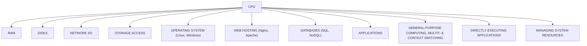
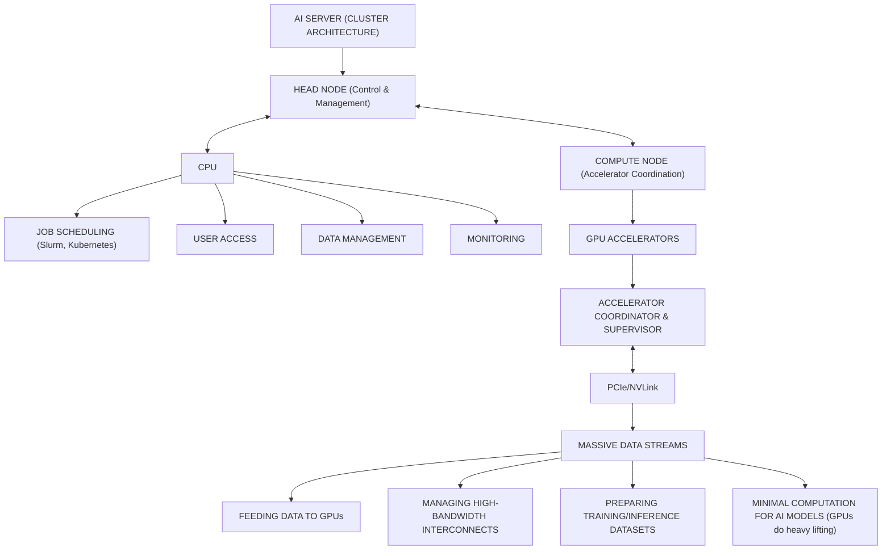
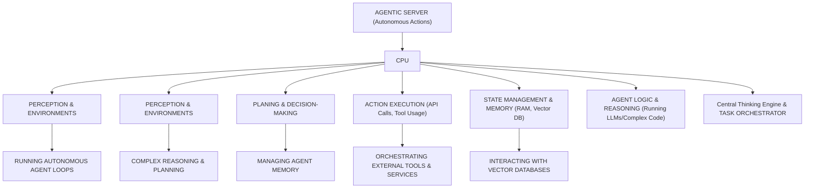

你是资深小红书内容策划 + 投研翻译官，擅长把英文/中文研报改写成高互动、可收藏、可转发的中文小红书笔记。

【目标】
- 把下面的研报解析内容，改写成一篇中文小红书笔记。
- 风格：投研博主风：信息密度高，但像给朋友讲逻辑
- 长度：不超过 1000 字，信息密度高但不要写长文。
- emoji 密度：中

【必须输出的结构】
1. 第一行：标题，20 字以内，不要像论文标题，也不要用夸张极限词。
2. 第二行：封面短标题，10 字以内，适合放在图中间。
3. 第三行：封面副标题，10-18 字，短句。
4. 正文分段清晰，每段不超过 3 行，可以用编号、小标题或加粗。
5. 正文要自然呈现观点，但不要暴露写作框架或思考过程。
6. 末尾可以保留 2-4 个相关标签，只允许从这些标签里选择：`#学习笔记`、`#研究笔记`、`#学习研究`、`#研报解读`。

【严禁输出】
- 不要出现这些栏目名或类似栏目名：`一句话结论`、`我最想提醒的一点`、`配图建议`、`免责声明`、`非投资建议`、`仅做学习交流`、`仅作学习交流`。
- 不要在正文最后追加配图建议，不要告诉我第 2/3/4 张图怎么配文。
- 不要输出任何包含“投资”的免责声明，也不要输出“非投资建议”这种表述。
- 不要输出财经敏感标签：`#投资学习`、`#财经`、`#金融`、`#股票`、`#基金`、`#理财`。
- 不要输出无关标签：`#小红书笔记`、`#笔记分享`、`#干货分享`。
- 不要写“关注”“点赞”“求关注”“评论区见”“评论区留言”等直接互动诱导；可以写“欢迎一起讨论”“可以继续交流”。

【平台发布合规要求】
- 不要写“爆款”“震惊”“必看”“必读”“最强”“最全”“唯一”“全网首发”等极限词或夸张词。
- 不要写“投资建议”“买入”“卖出”“强烈推荐”“稳赚”“保本”“必涨”“抄底”“上车”“内幕”“翻倍”等金融操作或收益承诺表达。
- “投资”相关词尽量改成“投研”“研究”“观察”“学习参考”；如果必须保留，也要放在中性语境里。
- 不要承诺收益，不要引导交易，不要暗示确定性结果。

【内容要求】
- 只能基于研报原文和解析结果推导，不要编造数据、公司动作、引用。
- 可以把专业表达翻成人话，但不能扭曲意思。
- 遇到不确定或缺失信息：用“研报未给出”或“这里是推测”明确标注。
- 默认避免出现具体投行品牌名，比如“GS”“GS”，统一写作“投行研报”。
- 不要解释你的思考过程，不要输出多余说明。

【推荐写法】
- 开头直接给一个自然判断，不要加“结论：”标签。
- 中间用 1/2/3 拆逻辑，但小标题要像正常内容标题，不要像写作模板。
- 结尾可以留下一个自然讨论问题，但不要引导关注、点赞或评论。
- 最后一行输出 2-4 个标签，优先：`#学习笔记 #研究笔记 #学习研究 #研报解读`。

【研报解析内容】
"""
## US Semiconductors

# Rise of the Agents: raising CPU TAM to \$170bn

Price Objective Change

## CPU reborn: Agentic AI drives 5x demand

Based on our analysis and recent industry discussions at BofA Global Tech Conference (see our conf takeaways), we raise our CY2030E server CPU TAM to \$170bn+ (from \$125bn), implying nearly 5x growth and +37% CAGR over CY25-30E (vs. +29% prior). We view the emergence of agentic AI as a powerful demand accelerant that expands the CPU opportunity and lifts both x86incumbents and ARM challengers. Against this backdrop, we raise our AMD PO to \$560 from \$500 on higher CPU/GPU estimates, ARM to \$335 from \$245 on greater l-t chiplet potential; INTC is double-upgraded to Buy with a \$135 PO (see our ), with higher estimates now reflecting both n-t CPU and l-t foundry upsides. NVDA remains our top sector pick on full-stack AI leadership, benefiting from tight CPU-GPU-networking integration, also poised to benefit from agentic CPU. QCOM is expected to announce new AI CPUs at its Jun-24 AI Day in NYC, but we maintain Underperform given tough competition and limited SAM.

## Agentic workloads shift complexity to CPUs from XPUs

Agentic AI differs from traditional genAI by shifting from a single prompt-response workflow to a multi-step system that plans, reasons, retrieves info, uses tools, executes code simultaneously. While XPUs remain critical for inference, many orchestration and decision-making functions are latency-sensitive, sequential, and I/O-intensive—making them better suited for CPUs. Our new CPU model uniquely segments the \$170bn TAM by application (1. standalone agentic CPU; 2. head/compute node CPU for AI clusters; 3. traditional/laaS), as well as by vendor (AMD, INTC, NVDA, ARM merchant, ARM custom). We expect head/compute nodes in AI clusters to use higher frequency and stronger but fewer cores, while agentic and traditional applications will rely on higher core counts.

## Double-upgrading INTC, while AMD top CPU pick

Our INTC double-upgrade is based on higher confidence in INTC's opportunity to help address industry constraints in leading edge wafers/packaging, plus larger agentic CPU TAM. We now see CY30 EPS power \$6+ vs \$3-4 prior, though execution is key. Recent CDNS 14A node IP sign-up and Terafab engagements are additional supportive data points. For AMD, we raise est/PO to \$560, top CPU pick on incumbency + pipeline + upcoming AI day (Venice launch). NVDA remains top sector pick on full-stack leadership.

## ARM/QCOM: CPU share gainers but flag val'n/competition

For ARM, we now use a FY31/CY30E sum-of-parts valuation, see total company value of \~\$335 (\$229 IP + \$106 chip), and we see the stock as fairly valued. QCOM has potential to announce new AI CPUs and lead customers at its Jun-24 AI Day, but we flag tough CPU competition amid already established incumbents.

## Key debate: TAM substitution vs expansion

Debate centers on whether CPUs take share from GPUs/accelerators or contribute to overall AI TAM expansion. We see expansion dominating: CPU demand scales with system complexity, as is the case with reasoning/agentic AI. Additional debates include durability of the 30%+ AI capex CAGR and mix shifts to custom silicon (CPUs and XPUs).

BofA does and seeks to do business with issuers covered in its research reports. As a result, investors should be aware that the firm may have a conflict of interest that could affect the objectivity of this report. Investors should consider this report as only a single factor in making their investment decision.
Refer to important disclosures on page 29 to 33. Analyst Certification on page 27. Price Objective Basis/Risk on page 26.
12983146

## 11 June 2026

Equity

United States

Semiconductors

Vivek Arya

Research Analyst

BofAS

vivek.arya@bofa.com

Duksan Jang

Research Analyst

BofAS

duksan.jang@bofa.com

Michael Mani

Research Analyst

BofAS

michael.mani@bofa.com

Liam Pharr

Research Analyst

BofAS

liam.pharr@bofa.com

Exhibit 1: PO/Rating Changes  
PO/Rating Changes

<table><tr><td colspan="4">PO/Rating Changes</td></tr><tr><td>Ticker</td><td>OLD</td><td>NEW</td><td>RATING</td></tr><tr><td>AMD</td><td>$500</td><td>$560</td><td>BUY</td></tr><tr><td>ARM</td><td>$245</td><td>$335</td><td>NEUTRAL</td></tr><tr><td>INTC</td><td>$96</td><td>$135</td><td>BUY from U/P</td></tr><tr><td>NVDA</td><td>$350</td><td>$350</td><td>BUY</td></tr><tr><td>QCOM</td><td>$165</td><td>$165</td><td>U/P</td></tr></table>

Source: BofA Global Research  
BofA GLOBAL RESEARCH

For detailed company analysis, PO/rating change and valuation discussion, see pg. 10-17.

See glossary on page 23.

## Contents

AI Compute Table of Hierarchy 3

\$170bn+ Server CPU TAM 5

Market share outlook analysis 6

Traditional vs. AI Head Node (Compute) vs. Agentic Rack 7

CPUs now 8%+ of Data Center Systems TAM 9

AMD: Maintain Buy, raise PO to \$560 from \$500 10

AMD CPU Advantages 10

Upcoming catalyst: Advancing AI 2026 (July) 11

INTC: Upgrade to Buy from U/P, PO \$135 12

Fully established IDM by CY30, EPS power \$6+ 12

ARM: Reit. Neutral, raise PO to \$335 14

Sum-of-Parts Valuation: IP & Chip Businesses 14

NVDA: Maintain Buy, top AI sector pick 15

Rising content, increasing opp'ty, solid supply visibility 15

Vera Rubin now in full production, lowest token cost 15

Vera CPU: head node vs. agentic AI likely 50/50 opp'ty 16

NVDA content \$/GW rising materially gen-over-gen 16

RTX Spark for personal agentic AI, for top 10% Windows 16

QCOM: U/P on competitive landscape 17

Role of CPUs in Agentic AI 18

CPUs in training 18

CPUs in inference 19

CPUs in Agentic AI 20

Agentic AI is system-led, not CPU or GPU-led 21

AI CPUs expand system TAM, not replace 21

## AI Compute Table of Hierarchy

Below, we present our latest table of hierarchy for global data center systems TAM of \~\$2.1Tn, of which CPUs make up \~\$170bn of the total value.

Within this, we break out CPUs in three different categories (more detail in following pages):

1. Traditional/on-prem/multi-tenant cloud CPUs: \~\$30bn  
2. AI cluster compute/head node CPUs: \~\$70bn  
3. AI agentic standalone node CPUs: \~\$70bn

Exhibit 2: Of the total \$2.1Tn CY30 DC Systems TAM, we see AI CPUs representing \~\$140bn of the value (split roughly 50/50 across compute/head node and agentic AI node), non-AI CPUs \~\$30bn

Data Center Systems TAM – Breakout by: AI vs. non-AI; AI CPUs vs. non-AI CPUs

stacked bar chart

| Category | Value |
| :--- | :--- |
| Total Data Center Systems TAM: $2.1Tn 2030E | |
| AI Data Center Systems TAM: $1.7Tn | |
| Non-AI DC Systems TAM: $363bn | |
| AI Servers: $1.3Tn | |
| AI Networking: $305bn | |
| Storage: $81bn | |
| AI Accelerators: $1.1Tn | HBM: $168bn |
| AI Accelerators: $1.1Tn | AI CPU: $140bn |
| AI Accelerators: $1.1Tn | Other: $51bn |
| Trad'I Cloud CPU: $30bn | |
| AI Cluster Compute/Head Nodes: $70bn | |
| AI Agentic Standalone Nodes: $70bn | |

Source: BofA Global Research  
BofA GLOBAL RESEARCH

The below infographic highlights how the role of the CPU evolves across different server architectures:

1. Traditional Server: The CPU is the primary "jack-of-all-trades," managing the OS, applications, and direct I/O for general workloads. (\~\$30bn CY30E TAM)  
2. AI Server Cluster: The CPU's role bifurcates into a Head Node for cluster orchestration and management, and a Compute Node focused on supervising and feeding data to GPUs. (\~\$70bn CY30E TAM)  
3. Agentic Server: The CPU becomes the central orchestrator for autonomous actions, managing the high-level reasoning loops, memory state, and tool integration required for AI agents. (\~\$70bn CY30E TAM)

Exhibit 3: We flag three key roles of CPUs in servers: 1. Traditional, 2. AI compute/head node, 3. AI agentic node Role of the CPU in different server architectures

## ROLE OF THE CPU IN DIFFERENT SERVER ARCHITECTURES

flowchart

flowchart

flowchart

Source: BofA Global Research  
BofA GLOBAL RESEARCH

## \$170bn+ Server CPU TAM

Given the rising role of CPUs in AI head node (compute node) and agentic AI, we now expect server CPU TAM to reach \~\$170bn by CY30E from \~\$35bn in CY25 (+37% CAGR), versus prior \~\$125bn outlook (+29% CAGR).

Notably, we break out the market into 4 different vendor/types: 1) INTC, 2) AMD, 3) ARM (merchant), and 4) ARM (custom/ASIC).

- For ARM merchant CPUs, we now assume ASPs that are \~1.25x higher than average AMD CPUs, given ARM merchant almost only caters to hyperscale/AI applications, versus AMD mostly hyperscale with a bit of enterprise exposure.  
- For ARM custom CPUs, we now assume ASPs that are \~75% of typical AMD solutions, given continued mix shift toward hyperscale solutions (higher ASPs), but merchant server CPUs typically carry 40-60% GM (i.e. 40-60% is COGS or the cost that AWS/Google would theoretically be paying for their custom CPUs)

Exhibit 4: We see total server CPU TAM reaching \$170bn+ by CY30 from \$35bn in CY25, growing at +37% CAGR  
Server CPU TAM (by revenue, units, ASP)

<table><tr><td>Server CPU TAM</td><td>2023</td><td>2024</td><td>2025</td><td>2026E</td><td>2027E</td><td>2028E</td><td>2029E</td><td>2030E</td><td>CY25-30 CAGR</td></tr><tr><td colspan="10">Revenue ($bn)</td></tr><tr><td>Total</td><td>$19.5</td><td>$22.5</td><td>$35.2</td><td>$59.6</td><td>$89.8</td><td>$110.4</td><td>$138.2</td><td>$170.1</td><td>37.1%</td></tr><tr><td>INTC</td><td>$13.2</td><td>$13.6</td><td>$14.4</td><td>$19.8</td><td>$24.7</td><td>$29.6</td><td>$35.1</td><td>$41.2</td><td>23.4%</td></tr><tr><td>AMD</td><td>$5.6</td><td>$7.1</td><td>$9.6</td><td>$16.4</td><td>$22.2</td><td>$28.6</td><td>$35.7</td><td>$43.6</td><td>35.4%</td></tr><tr><td>ARM</td><td>$0.7</td><td>$1.8</td><td>$11.2</td><td>$23.4</td><td>$42.9</td><td>$52.2</td><td>$67.5</td><td>$85.4</td><td>50.0%</td></tr><tr><td>ARM Merchant</td><td>$0.0</td><td>$0.7</td><td>$10.3</td><td>$19.5</td><td>$34.8</td><td>$38.2</td><td>$47.9</td><td>$60.6</td><td>42.6%</td></tr><tr><td>NVDA</td><td></td><td>$0.7</td><td>$10.3</td><td>$19.5</td><td>$33.7</td><td>$35.4</td><td>$39.0</td><td>$42.2</td><td>32.7%</td></tr><tr><td>ARM</td><td></td><td></td><td></td><td></td><td>$0.7</td><td>$1.8</td><td>$5.9</td><td>$12.3</td><td></td></tr><tr><td>QCOM</td><td></td><td></td><td></td><td></td><td>$0.4</td><td>$0.9</td><td>$3.0</td><td>$6.1</td><td></td></tr><tr><td>ARM Custom (Graviton, Axion, Cobalt, etc.)</td><td>$0.7</td><td>$1.0</td><td>$1.0</td><td>$3.9</td><td>$8.1</td><td>$14.1</td><td>$19.6</td><td>$24.8</td><td>91.0%</td></tr><tr><td colspan="10">Units (mn)</td></tr><tr><td>Total</td><td>24.5</td><td>24.2</td><td>29.2</td><td>39.3</td><td>49.0</td><td>57.1</td><td>66.0</td><td>74.7</td><td>20.7%</td></tr><tr><td>INTC</td><td>18.5</td><td>16.9</td><td>17.9</td><td>21.1</td><td>23.2</td><td>24.9</td><td>26.7</td><td>28.6</td><td>9.7%</td></tr><tr><td>AMD</td><td>4.8</td><td>5.5</td><td>7.2</td><td>10.4</td><td>12.5</td><td>14.5</td><td>16.3</td><td>18.1</td><td>20.2%</td></tr><tr><td>ARM</td><td>1.2</td><td>1.8</td><td>4.0</td><td>7.9</td><td>13.3</td><td>17.7</td><td>22.9</td><td>28.0</td><td>47.4%</td></tr><tr><td>ARM Merchant</td><td>0.0</td><td>0.2</td><td>2.6</td><td>4.6</td><td>7.2</td><td>8.2</td><td>10.9</td><td>14.2</td><td>40.9%</td></tr><tr><td>NVDA</td><td>0.0</td><td>0.2</td><td>2.6</td><td>4.6</td><td>6.7</td><td>7.1</td><td>7.7</td><td>8.1</td><td>25.9%</td></tr><tr><td>ARM</td><td>0.0</td><td>0.0</td><td>0.0</td><td>0.0</td><td>0.3</td><td>0.7</td><td>2.2</td><td>4.1</td><td></td></tr><tr><td>QCOM</td><td>0.0</td><td>0.0</td><td>0.0</td><td>0.0</td><td>0.2</td><td>0.4</td><td>1.1</td><td>2.0</td><td></td></tr><tr><td>ARM Custom (Graviton, Axion, Cobalt, etc.)</td><td>1.2</td><td>1.6</td><td>1.5</td><td>3.3</td><td>6.1</td><td>9.5</td><td>12.0</td><td>13.8</td><td>56.6%</td></tr><tr><td colspan="10">ASP ($)</td></tr><tr><td>Total</td><td>$797</td><td>$931</td><td>$1,204</td><td>$1,517</td><td>$1,833</td><td>$1,934</td><td>$2,095</td><td>$2,277</td><td>13.6%</td></tr><tr><td>INTC</td><td>$716</td><td>$804</td><td>$801</td><td>$941</td><td>$1,065</td><td>$1,186</td><td>$1,311</td><td>$1,442</td><td>12.5%</td></tr><tr><td>AMD</td><td>$1,164</td><td>$1,299</td><td>$1,322</td><td>$1,581</td><td>$1,778</td><td>$1,976</td><td>$2,183</td><td>$2,401</td><td>12.7%</td></tr><tr><td>ARM</td><td>$589</td><td>$998</td><td>$2,790</td><td>$2,972</td><td>$3,225</td><td>$2,956</td><td>$2,950</td><td>$3,049</td><td>1.8%</td></tr><tr><td>ARM Merchant</td><td></td><td>$4,000</td><td>$4,000</td><td>$4,240</td><td>$4,820</td><td>$4,658</td><td>$4,393</td><td>$4,255</td><td>1.2%</td></tr><tr><td>NVDA</td><td></td><td>$4,000</td><td>$4,000</td><td>$4,240</td><td>$5,000</td><td>$5,000</td><td>$5,100</td><td>$5,202</td><td>5.4%</td></tr><tr><td>ARM</td><td></td><td></td><td></td><td></td><td>$2,249</td><td>$2,476</td><td>$2,729</td><td>$3,002</td><td></td></tr><tr><td>QCOM</td><td></td><td></td><td></td><td></td><td>$2,249</td><td>$2,476</td><td>$2,729</td><td>$3,002</td><td></td></tr><tr><td>ARM Custom (Graviton, Axion, Cobalt, etc.)</td><td>$589</td><td>$649</td><td>$666</td><td>$1,191</td><td>$1,336</td><td>$1,484</td><td>$1,637</td><td>$1,801</td><td>22.0%</td></tr><tr><td colspan="10">Value Share (%)</td></tr><tr><td>Total</td><td>100%</td><td>100%</td><td>100%</td><td>100%</td><td>100%</td><td>100%</td><td>100%</td><td>100%</td><td></td></tr><tr><td>INTC</td><td>68%</td><td>61%</td><td>41%</td><td>33%</td><td>28%</td><td>27%</td><td>25%</td><td>24%</td><td></td></tr><tr><td>AMD</td><td>29%</td><td>32%</td><td>27%</td><td>28%</td><td>25%</td><td>26%</td><td>26%</td><td>26%</td><td></td></tr><tr><td>ARM</td><td>4%</td><td>8%</td><td>32%</td><td>39%</td><td>48%</td><td>47%</td><td>49%</td><td>50%</td><td></td></tr><tr><td>ARM Merchant</td><td>0%</td><td>3%</td><td>29%</td><td>33%</td><td>39%</td><td>35%</td><td>35%</td><td>36%</td><td></td></tr><tr><td>NVDA</td><td></td><td>3%</td><td>29%</td><td>33%</td><td>38%</td><td>32%</td><td>28%</td><td>25%</td><td></td></tr><tr><td>ARM</td><td></td><td></td><td></td><td></td><td>1%</td><td>2%</td><td>4%</td><td>7%</td><td></td></tr><tr><td>QCOM</td><td></td><td></td><td></td><td></td><td>0%</td><td>1%</td><td>2%</td><td>4%</td><td></td></tr><tr><td>ARM Custom (Graviton, Axion, Cobalt, etc.)</td><td>4%</td><td>5%</td><td>3%</td><td>7%</td><td>9%</td><td>13%</td><td>14%</td><td>15%</td><td></td></tr></table>

BofA GLOBAL RESEARCH

## Market share outlook analysis

From a market share perspective, we continue to expect ARM to be the fastest gainer through CY30 as multiple new merchant (i.e. ARM AGI, NVDA Vera, QCOM CPU) and custom (i.e., AWS Graviton 5, Google Axion, Microsoft Cobalt) programs ramp.

Exhibit 5: We expect INTC/AMD to each represent \~25% value share, ARM merchant \~35%, ARM custom \~15% by CY30  
Server CPU TAM (\$mn) and Value Market Share Outlook  

stacked bar chart

| Year | Intel (%) | AM

[中间内容因长度限制已省略]

s areas of BofA, including investment banking personnel. BofA has established information barriers between BofA Global Research and certain business groups. As a result, BofA does not disclose certain client relationships with, or compensation received from, such issuers. To the extent this material discusses any legal proceeding or issues, it has not been prepared as nor is it intended to express any legal conclusion, opinion or advice. Investors should consult their own legal advisers as to issues of law relating to the subject matter of this material. BofA Global Research personnel's knowledge of legal proceedings in which any BofA entity and/or its directors, officers and employees may be plaintiffs, defendants, co-defendants or co-plaintiffs with or involving issuers mentioned in this material is based on public information. Facts and views presented in this material that relate to any such proceedings have not been reviewed by, discussed with, and may not reflect information known to, professionals in other business areas of BofA in connection with the legal proceedings or matters relevant to such proceedings.

This information has been prepared independently of any issuer of securities mentioned herein and not in connection with any proposed offering of securities or as agent of any issuer of any securities. None of BofAS any of its affiliates or their research analysts has any authority whatsoever to make any representation or warranty on behalf of the issuer(s). BofA Global Research policy prohibits research personnel from disclosing a recommendation, investment rating, or investment thesis for review by an issuer prior to the publication of a research report containing such rating, recommendation or investment thesis.

Any information relating to sustainability in this material is limited as discussed herein and is not intended to provide a comprehensive view on any sustainability claim with respect to any issuer or security.

Any information relating to the tax status of financial instruments discussed herein is not intended to provide tax advice or to be used by anyone to provide tax advice. Investors are urged to seek tax advice based on their particular circumstances from an independent tax professional.

The information herein (other than disclosure information relating to BofA and its affiliates) was obtained from various sources and we do not guarantee its accuracy. This information may contain links to third-party websites. BofA is not responsible for the content of any third-party website or any linked content contained in a third-party website. Content contained on such third-party websites is not part of this information and is not incorporated by reference. The inclusion of a link does not imply any endorsement by or any affiliation with BofA. Access to any third-party website is at your own risk, and you should always review the terms and privacy policies at third-party websites before submitting any personal information to them. BofA is not responsible for such terms and privacy policies and expressly disclaims any liability for them.

All opinions, projections and estimates constitute the judgment of the author as of the date of publication and are subject to change without notice. Prices also are subject to change without notice. BofA is under no obligation to update this information and BofA ability to publish information on the subject issuer(s) in the future is subject to applicable quiet periods. You should therefore assume that BofA will not update any fact, circumstance or opinion contained herein.

Subject to the quiet period applicable under laws of the various jurisdictions in which we distribute research reports and other legal and BofA policy-related restrictions on the publication of research reports, fundamental equity reports are produced on a regular basis as necessary to keep the investment recommendation current.

Certain outstanding reports or investment opinions relating to securities, financial instruments and/or issuers may no longer be current. Always refer to the most recent research report relating to an issuer prior to making an investment decision.

In some cases, an issuer may be classified as Restricted or may be Under Review or Extended Review. In each case, investors should consider any investment opinion relating to such issuer (or its security and/or financial instruments) to be suspended or withdrawn and should not rely on the analyses and investment opinion(s) pertaining to such issuer (or its securities and/or financial instruments) nor should the analyses or opinion(s) be considered a solicitation of any kind. Sales persons and financial advisors affiliated with BofAS or any of its affiliates may not solicit purchases of securities or financial instruments that are Restricted or Under Review and may only solicit securities under Extended Review in accordance with firm policies.

Neither BofA nor any officer or employee of BofA accepts any liability whatsoever for any direct, indirect or consequential damages or losses arising from any use of this information.
"""
