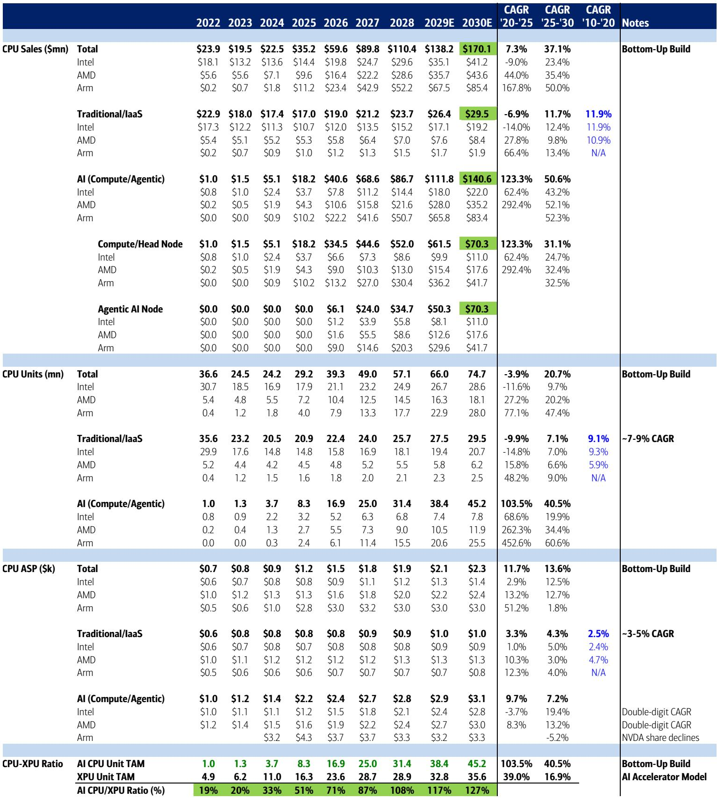
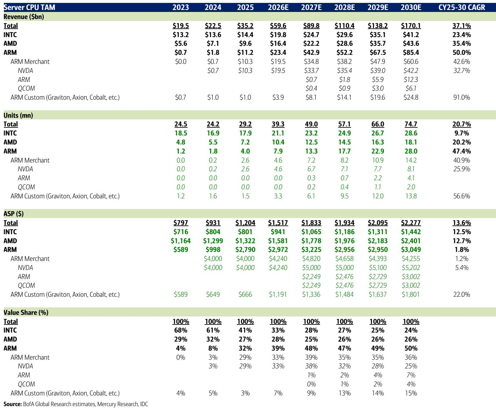
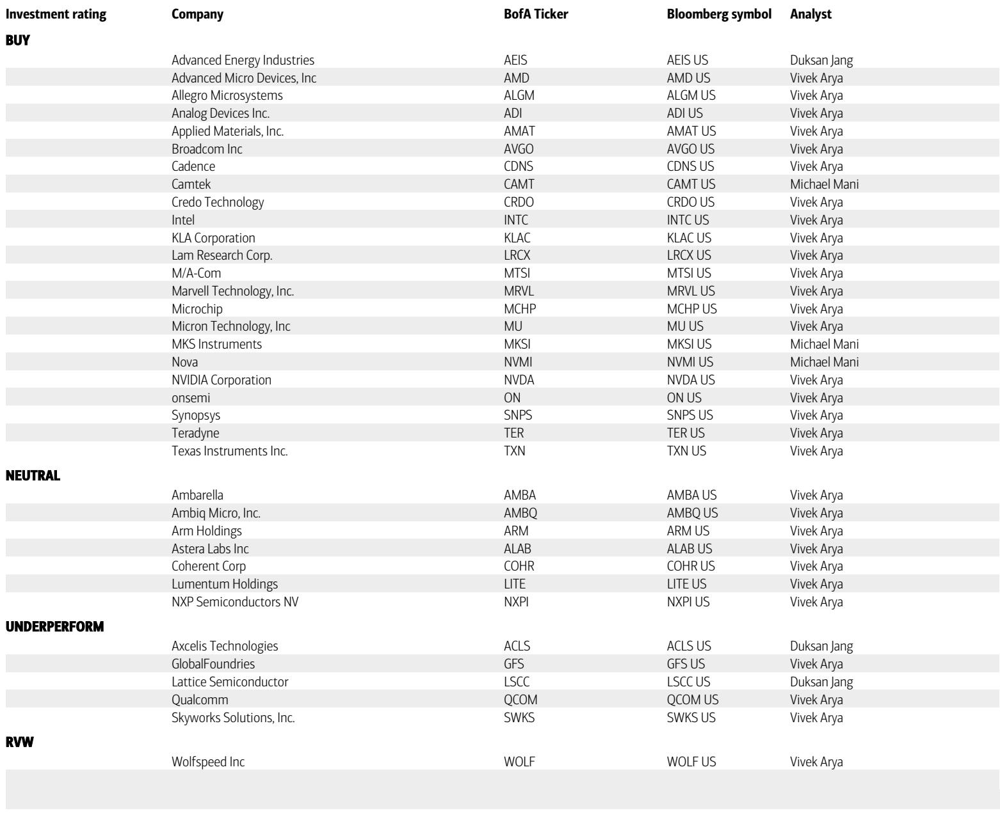

# 美国银行：市场低估的不是AI算力需求，而是CPU在Agentic时代的重新定价

当整个半导体行业的目光都聚焦在GPU算力军备竞赛时，一份来自美国银行的最新研报提出了一个截然不同的核心判断：到2030年，服务器CPU的市场总规模将从当前的350亿美元跃升至1700亿美元以上，实现近5倍的增长。这个数字远高于该机构此前预估的1250亿美元。

这个修正并非简单的乐观情绪。它源自一个正在发生的结构性转变：AI的工作负载正在从“一问一答”的生成式模式，转向“自主规划、调用工具、执行代码”的Agentic模式。在这种新范式下，CPU的角色从“后台管家”升级为“前线总指挥”，其价值也随之被重新定义。

这份报告的核心洞察在于：CPU TAM的扩张，不是对GPU市场的零和博弈，而是整个AI系统复杂化带来的增量。对于投资者和产业决策者而言，理解这个“增量”从何而来，比争论“CPU vs. GPU”更有价值。

## 1. Agentic AI让CPU从“配角”变为“总指挥”，这才是TAM扩张的真正引擎

传统AI推理中，GPU承担了绝大部分计算，CPU主要负责数据搬运和调度。但在Agentic AI系统中，工作流发生了根本变化：一个AI Agent需要自主理解任务、分解步骤、检索知识库、调用外部API、执行代码，并在多步骤循环中保持状态记忆。

这些任务的特点是：延迟敏感、顺序执行、I/O密集。这正是CPU的专长领域，而非GPU的强项。美国银行的报告将CPU在这一新架构中的角色定义为“中央思维引擎与任务协调器”。

该机构据此将CPU市场拆分为三个相互独立且不重叠的细分领域：
- 传统/本地/多云CPU：约300亿美元，基本盘，增长平稳。
- AI集群计算/头节点CPU：约700亿美元，负责管理GPU集群的调度、数据流和监控。
- AI Agentic独立节点CPU：约700亿美元，这是全新的增量，专门为运行Agent逻辑而设计的服务器节点。

这种拆分方式清晰地回答了“为什么是5倍增长”的问题：传统市场（300亿）是存量，AI头节点（700亿）是伴随GPU集群扩张的衍生需求，而Agentic节点（700亿）则是全新的、由应用范式驱动的增量市场。后两者共同构成了1400亿美元的AI CPU市场，这才是TAM跃升的关键。

## 2. 英特尔的双倍升级与AMD的守擂：谁在Agentic时代拥有结构性优势？

基于新的TAM假设，美国银行对主要CPU厂商的评级和估值进行了大幅调整，其背后的逻辑值得深究。

最引人注目的是对英特尔的双倍升级，从“跑输大盘”直接上调至“买入”，目标价从96美元大幅提升至135美元。该机构认为，市场此前低估了英特尔在解决整个行业面临的先进制程和封装产能瓶颈中的价值。报告特别指出，Cadence的14A节点IP签约和Terafab的合作是支撑其信心的新数据点。到2030年，英特尔在CPU市场的价值份额预计将稳定在24%左右，虽然份额下降，但来自ASP提升和传统企业市场的收入仍能实现20%以上的年复合增长。

对于AMD，该机构维持“买入”评级，并将其目标价从500美元上调至560美元，视其为CPU领域的首选股。理由在于AMD在核心数量和高频率上的领先优势，使其在AI头节点和Agentic节点这两个高价值领域都能占据有利位置。预计AMD到2030年将维持约25-26%的稳定价值份额。

这里的关键洞察在于：英特尔和AMD的份额变化路径不同。英特尔是“份额下降但收入增长”，受益于行业供需紧张和ASP提升；AMD则是“份额稳定”，依靠性能优势在高价值市场扎根。两者都从TAM扩张中获益，但逻辑各异。

## 3. ARM的崛起与英伟达的“跨界”：格局重塑中的赢家与悬念

ARM架构是这份报告中最激进的变量。该机构预计，到2030年，ARM将在服务器CPU市场中占据50%的价值份额，其中商用ARM（包括英伟达的Grace/Vera CPU、高通等）占36%，定制ARM（AWS Graviton、谷歌Axion、微软Cobalt等）占14%。

这一预测的核心假设是，ARM架构在能效和定制化方面的优势，使其在超大规模数据中心和AI集群中更具吸引力。报告预估，商用ARM CPU的ASP比AMD平均高出约25%，因为其几乎只服务于超大规模和AI应用。而定制ARM的ASP则约为AMD解决方案的75%，反映了云厂商自研芯片的成本优势。

英伟达的角色则更为特殊。它既是GPU霸主，也是ARM商用CPU的重要玩家。报告认为，英伟达受益于CPU-GPU-网络的紧密集成，在Agentic CPU时代同样占据有利位置。但一个尚未完全回答的问题是：当英伟达的CPU（如Vera）在自家集群中占据主导时，它与其他CPU供应商（如AMD、英特尔）在头节点和Agentic节点上的竞争边界在哪里？这份报告将英伟达的CPU机会视为“头节点与Agentic节点各占一半”，但这背后的市场份额动态仍需进一步观察。

## 4. 一个尚未完全回答的关键问题：TAM扩张的假设是否过于乐观？

尽管报告的逻辑框架清晰，但仍有几个关键假设需要市场验证。

首先，1700亿美元TAM的核心驱动力是Agentic AI的普及。这个假设成立的前提是，Agentic AI能像当前的生成式AI一样，快速渗透到企业核心业务流程中，并产生可量化的商业价值。如果Agentic AI的应用落地慢于预期，那么700亿美元的Agentic节点市场就将面临显著下修风险。

其次，报告假设AI资本支出的年复合增长率将保持在30%以上。这一假设与当前的市场情绪一致，但一旦宏观环境变化或AI投资回报率出现争议，整个TAM的逻辑基础都将被动摇。

最后，向定制硅（包括CPU和XPU）的迁移趋势。云厂商自研芯片的规模越大，对商用CPU供应商（AMD、英特尔）的冲击就越直接。报告虽然考虑了这一点，但定制化趋势的速度和深度仍是最大的不确定性之一。

这些未解问题，恰恰是深度理解这份报告价值的关键。报告的结论本身不是投资指引，而是提供了一个分析框架。真正有价值的，是在这个框架下，持续跟踪和验证上述假设的演变。

## 5. 对决策者的观察框架：从三个维度重新评估CPU赛道的投资逻辑

基于这份报告，我们建议产业决策者和投资者从以下三个维度构建自己的观察框架。

第一，区分“TAM扩张”与“市场份额”。英伟达和AMD的股价上涨，部分源于市场对AI算力总需求的乐观预期。而美国银行的这份报告则提醒我们，CPU TAM的扩张可能成为一个独立的、未被充分定价的增长因子。投资者需要评估，哪些公司能同时享受TAM扩张和份额提升的双重红利。

第二，关注“Agentic AI”的落地信号。这不是一个遥远的概念。企业级Agent平台、自动化工作流工具、以及云厂商提供的Agent托管服务，都是验证这一趋势的先行指标。如果看到这些领域的资本开支和用户规模开始加速，那么CPU TAM上修的假设就得到了初步验证。

第三，警惕“定制化”的侵蚀效应。虽然ARM定制CPU目前份额不大，但其91%的年复合增长率是所有细分板块中最高的。对于AMD和英特尔而言，来自AWS、谷歌、微软的竞争不是威胁，而是现实。这要求它们必须在性能和生态上保持足够大的领先优势，才能对冲客户自研带来的份额损失。

这份报告的真正价值，不在于给出了一个1700亿美元的数字，而在于它提供了一个从“算力总量”转向“算力结构”的分析视角。在Agentic AI时代，CPU不再是GPU的附庸，而是与GPU并列的核心计算单元。这个认知转变，可能比任何具体的财务预测都更重要。

---

欢迎来星球微信群里继续讨论。关于这份报告中的一个关键图表——不同服务器架构下CPU角色的演变图——我们还没有展开分析。图中展示的从传统服务器到AI集群再到Agentic服务器的架构演进，背后隐藏着对内存带宽、互联协议和软件栈的更深层要求。这些二阶影响，我们在群里可以继续拆解。如果你对这份报告的完整数据、图表以及我们基于此构建的CPU竞争格局模型感兴趣，也欢迎加入社群，与我们一同探讨。

Personal reading notes and learning share only. Not investment advice.

