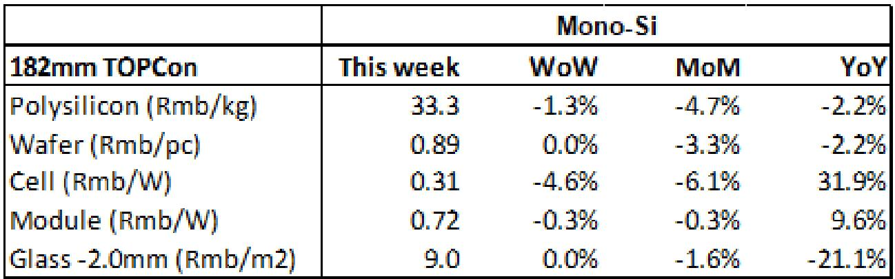
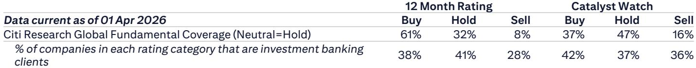
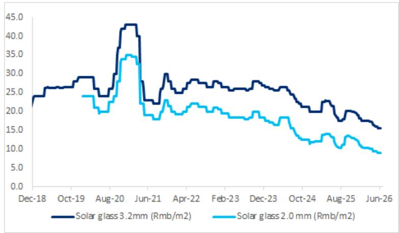

# Citi：光伏市场的真正拐点不在国内价格战，而在海外框架协议的规模与结构

过去一年，中国光伏行业在“内卷”与“出清”之间反复拉扯。市场参与者习惯于将注意力锁定在国内产业链价格的每一次波动上——多晶硅又跌了多少，电池片是否跌破现金成本，组件价格何时见底。

但这份Citi在2026年6月10日发布的周度更新，提供了一个截然不同的观察信号。报告的核心判断并非关于价格底部，而是关于需求结构的切换。这份报告最值得看的结论是：**中国光伏产品的海外销售正在以框架协议的形式大规模落地，而国内市场的价格信号已经不再是行业景气度的唯一风向标。**

对于产业决策者和投资者而言，理解这一结构性变化，远比预测下周多晶硅价格是否再跌1%更为重要。

## 1. 国内价格仍在低位徘徊，但最剧烈的下跌阶段已经过去

截至6月10日当周，n型多晶硅价格下跌1.3%至每公斤33.3元人民币，太阳能电池片价格下跌4.6%至每瓦0.31元，组件价格微跌0.3%至每瓦0.721元。这些数字本身并不令人意外——它们延续了过去两年的下行趋势，且Citi明确指出，当前市场价格已接近可变生产成本。

真正值得关注的不是跌幅本身，而是价格波动的形态。从Citi提供的长期价格走势图来看，多晶硅、硅片、电池片、组件的价格曲线在2024年至2025年间经历了最陡峭的下滑，而进入2026年后，曲线斜率明显放缓。这意味着，即便行业产能过剩的格局尚未根本改变，但价格下行的边际冲击正在减弱。

这背后有两个支撑因素：一是部分高成本产能已经退出市场，二是产业链库存虽然仍处高位，但增速已明显放缓。以多晶硅为例，截至6月4日，生产商库存为29.5万吨，环比下降1.0%。虽然绝对水平依然很高，但方向性的变化值得留意。

对于投资者来说，这意味着继续押注价格进一步大幅下跌的风险回报比正在恶化。市场可能需要寻找新的定价逻辑。

## 2. SNEC展会揭示的真正信号：海外框架协议正在重塑竞争格局

Citi报告中最具洞察力的部分，并非价格数据，而是对近期在上海举办的SNEC展会的观察。报告指出，展会上现场签约以吉瓦级的组件框架谅解备忘录为主，隆基、晶科、天合、晶澳等一线组件厂商与主要来自中东、非洲和东南亚的海外买家签署了新的供应协议。

这是一个关键的结构性信号。

首先，框架协议的性质不同于现货交易。它意味着海外买家对中国光伏产品的需求正在从“按需采购”转向“长期锁定”。这种转变通常发生在下游需求确定性增强、且买家对供应链稳定性要求提高的阶段。中东和非洲市场正在经历能源转型的加速期，这些地区的政府和企业正在为未来数年的光伏项目做规划，而非短期补库。

其次，Citi报告特别提到，多晶硅和硅片的现场签约很少，这些产品的交易主要通过年度长协在场外进行。这进一步印证了产业链上游的定价权正在向能够提供“一体化解决方案”的组件厂商集中。组件厂商通过框架协议锁定了海外需求，进而向上游施压，这一逻辑链条正在变得清晰。

对行业格局的含义是：**未来中国光伏企业的竞争力，将越来越取决于其海外渠道的深度和框架协议的规模，而非国内产能的大小。** 那些能够在中东、非洲、东南亚等新兴市场建立长期合作关系的企业，将获得比同行更稳定的利润曲线。

## 3. 政府“反内卷”力度可能弱于预期，行业出清更多依赖市场力量

Citi报告提出了一个容易被市场忽视的判断：2026年政府针对光伏行业的“反内卷”措施，力度可能弱于2025年。原因是中国的PPI和CPI已部分回升，部分受到中东冲突推高能源价格的影响。这意味着政策制定者对于行业亏损的容忍度可能有所提高，不再像2025年那样急迫地推动行政性减产。

这个判断如果成立，将对行业出清的节奏产生深远影响。

如果行政干预减弱，行业产能过剩的消化将更多依赖市场力量——即持续的低价迫使高成本产能退出。这一过程可能比市场预期的更漫长，但也更彻底。那些依赖补贴或政策保护才能存活的企业，将面临真正的生存考验。

对于投资者而言，这意味着在选择标的时，需要更加关注企业的成本结构和现金流韧性，而非政策博弈的短期机会。Citi在报告中给出了明确的选股偏好：在光伏和储能领域，给予阳光电源和德业股份买入评级。这两家公司的共同特点是：储能业务占比高、海外市场敞口大、盈利能力相对稳定。

## 4. 报告尚未完全回答的关键问题：海外框架协议的真实执行风险

Citi的报告提供了令人鼓舞的海外需求信号，但有一个关键问题并未充分展开：这些框架协议的执行风险有多大？

框架谅解备忘录与最终订单之间存在显著差距。中东和非洲市场的项目推进速度、融资条件、地缘政治风险、以及当地政策变动，都可能影响协议的实际转化率。Citi在德业股份和阳光电源的风险提示中提到了“新兴市场储能需求低于预期”和“海外贸易摩擦加剧”，但并未对这些框架协议的具体执行条款和违约概率进行量化分析。

这是读者在消化这份报告时需要保持审慎的地方。海外框架协议的规模确实令人振奋，但它们是否能够转化为实际的收入和利润，取决于一系列超出光伏行业本身的因素——包括国际关系、汇率波动、当地电网基础设施的配套能力等。

## 5. 一个被低估的增量市场：空间光伏产业链正在萌芽

Citi报告在展会观察中还提及了一个值得关注的细节：由协鑫和晶澳分别牵头，两个空间光伏产业联盟已正式启动，领先制造商正在开发用于卫星的轻质叠层电池，以开拓全新的应用市场。

虽然这一领域目前规模极小，对主流光伏企业的短期业绩几乎没有影响，但它代表了一个重要的方向性变化。光伏技术的应用边界正在从地面电站、屋顶分布式，向航空航天等高端领域延伸。如果空间光伏能够实现商业化突破，将为中国光伏产业打开一个技术溢价远高于地面电站的全新市场。

对于长期投资者而言，这或许是一个值得跟踪的“期权价值”。那些在叠层电池、轻质化组件方面有技术储备的企业，可能在未来的空间光伏产业链中占据先机。

---

这份Citi研报的核心价值，不在于它提供了多少新的价格数据，而在于它重新定义了观察中国光伏行业的坐标系。国内价格战已经不再是唯一的叙事主线，海外框架协议的规模与结构、政府干预力度的边际变化、以及空间光伏等新兴应用场景的萌芽，正在共同构成一幅更加复杂但也更有层次的产业图景。

报告的未尽之处——海外框架协议的执行风险、储能需求的实际爆发时点、以及空间光伏的商业化路径——恰好是值得在社群中继续深入讨论的话题。欢迎来星球微信群里继续探讨这些未解问题，我们会基于完整报告和原始图表，进一步拆解这些关键假设背后的逻辑与风险。

Personal reading notes and learning share only. Not investment advice.

