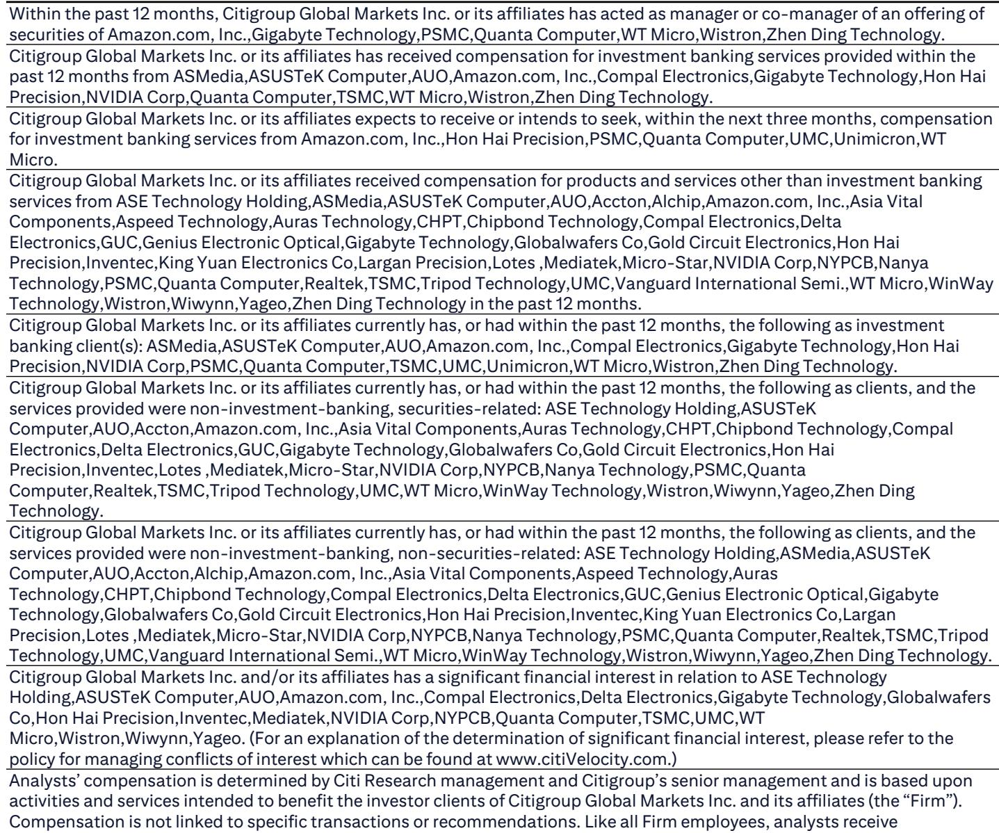
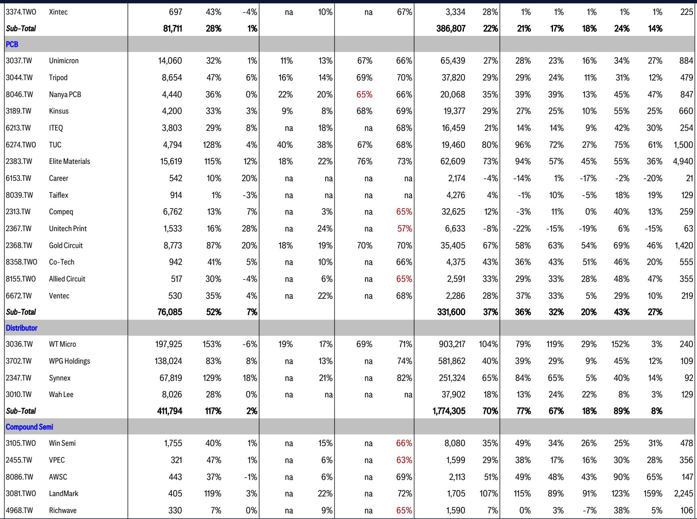
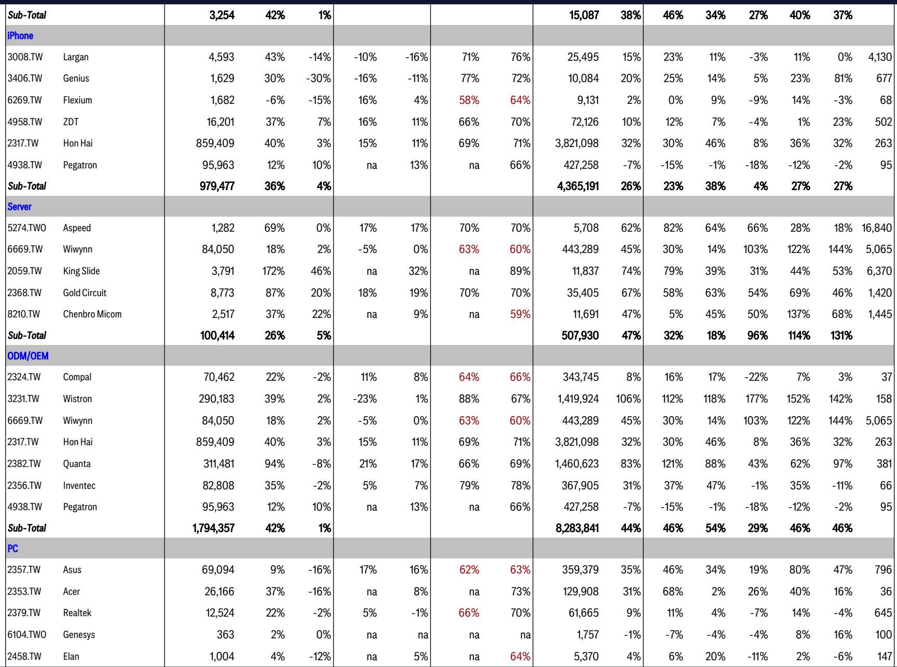

# The Taiwan Supply Chain Bottleneck Is Not a Bug—It Is the Signal for Second-Half 2026

The dominant narrative in technology markets has shifted from "is AI demand real?" to "is the supply chain for AI real?" The answer, based on the latest Taiwan monthly data, is that the supply chain is not only real—it is tightening in ways that will define winners and losers through the second half of 2026. The Taiwan technology ecosystem, which sits at the manufacturing core of the global semiconductor and hardware supply chain, has delivered a set of May 2026 revenue numbers that tell a coherent and consequential story. Across advanced foundry, packaging, testing interface, and substrate materials, capacity is constrained, order books are full, and pricing power is shifting from buyers to suppliers. This is not a cyclical upswing. This is a structural inflection point driven by the simultaneous ramp of multiple GPU and AI ASIC platforms, the transition to next-generation nodes, and the early but real emergence of agentic AI demand. Investors who treat the current tightness as temporary risk missing the most important strategic development in the Taiwan tech supply chain since the beginning of the AI buildout.

The data from May 2026 cuts through the noise. TSMC posted revenues of NT$417 billion, up 30% year-on-year, with year-to-date growth holding at that same 30% level. Testing interface companies such as MPI, Hon Precision, and Chroma are beating expectations, with May sales for the probe card and testing equipment sub-sector growing 94% year-on-year. The OSAT segment, led by ASEH and KYEC, is tracking in line with or ahead of consensus estimates. Even the CCL sector, often a lagging indicator, is seeing price hikes stick customer by customer. The pattern is unmistakable: demand is broad, deep, and accelerating. The market chatter about slower adoption of 800V HDVC, CPO, or lower memory content in NVL72 is, based on this data, premature. The supply chain is telling us that the transition to Blackwell is expanding strongly, that the Rubin cycle begins in early 2026, and that the bottlenecks are real.

Why now matters is simple. The second half of 2026 will be the period when capacity constraints become binding across multiple nodes and multiple packaging technologies. The companies that have secured supply agreements, that have invested in testing interface capacity, and that have pricing power will compound their advantages. The companies that are waiting for demand to soften will be locked out. The Taiwan tracker is not just a monthly check-in. It is the most granular, real-time window into whether the AI infrastructure buildout is on track or stalling. Right now, it is on track, and the tightness is the signal.

## The Foundry and OSAT Bottleneck Is Becoming a Pricing Event, Not Just a Volume Story

The most important development in the May data is not the absolute revenue numbers, but what they imply about pricing and capacity allocation in the second half. TSMC's May revenue of NT$417 billion, up 2% month-on-month and 30% year-on-year, is strong but not surprising. The real insight is what the report identifies as a "great chance" that TSMC will lift its full-year revenue growth target. The reason is not a sudden surge in smartphone demand. It is the combination of N3 AI chip shipments and N2 smartphone SoC ramps in the second half, plus the incremental upside from CPUs designed for agentic AI. This is a new demand vector. Agentic AI, which requires more compute per inference and more memory bandwidth per query, is not yet fully priced into supply chain models. If it materializes as the report suggests, then the foundry bottleneck tightens further.

For UMC and VIS, the report points to a price upward trend into the second half. This is significant because UMC and VIS serve the mature-node segment of the market, which has been under pressure from weak consumer demand. If pricing is rising even in mature nodes, it confirms that the tightness is not limited to leading-edge 3nm and 5nm. It is spreading. The OSAT segment, with ASEH and KYEC tracking at 66% of their second-quarter estimates, reinforces this view. Testing and packaging capacity is the new scarce resource in the AI supply chain. The report explicitly states that ASEH and KYEC are benefiting from "rising LEAP and new AI chip testing business." LEAP, or leading-edge advanced packaging, is where the value is migrating. The companies that own the testing interface between the wafer and the system will capture disproportionate value in this cycle.

The so-what for investors is clear. Foundry and OSAT pricing is not a cyclical tailwind that will reverse in 2027. It is a structural shift driven by the fact that AI chip design complexity is outpacing the industry's ability to add packaging and testing capacity. The number of new AI ASIC designs entering production in 2026 is higher than at any point in the last decade. Each design requires custom testing solutions. The companies that provide those solutions—whether through probe cards, burn-in boards, or final test services—are in a multi-year growth cycle. The May data confirms that this cycle is accelerating, not peaking.

## Testing Interface and Equipment Are the Canary in the Coal Mine for AI ASIC Ramp Velocity

The testing interface sub-sector delivered the most striking performance in the May data. The aggregate revenue for probe card and testing equipment companies grew 94% year-on-year. MPI, Hon Precision, and Chroma all beat expectations on their second-quarter revenue growth. CHPT posted a record-high monthly sales number. WinWay's results were capped only by capacity, not by demand. This is the purest signal of AI ASIC ramp velocity available in public data.

Why testing interface matters more than other sub-sectors is a function of the chip design cycle. When a new AI GPU or ASIC enters production, the first bottleneck is not the foundry. It is the testing interface. The probe card, the test socket, the burn-in board—these are the physical interfaces that must be designed, qualified, and manufactured before a chip can be shipped in volume. The 94% year-on-year growth in this sub-sector tells us that the number of new chip designs entering production is surging. It is not just Nvidia's B300 or GB300. It is the custom ASICs from hyperscalers, the networking chips for CPO, and the emerging agentic AI processors. Each one requires a testing solution.

The report notes that CPO testing equipment is "ready for certification." This is a leading indicator. Co-packaged optics, which integrates optical transceivers directly into the switch or GPU package, is one of the most anticipated technology transitions in the data center. If CPO testing equipment is moving toward certification, it means the CPO production ramp is closer than the market expects. The report explicitly states that CPO will "start from scale-out first in 2H26 and 2027." The testing equipment readiness in May 2026 suggests that the scale-out phase is on track.

The second-order implication is that the testing interface companies will face their own capacity constraints. WinWay's May results were "capped by capacity." The company is adding a leased plant in Renwu, but that capacity does not come online until June. In the meantime, demand is exceeding supply. This dynamic creates a winner-take-most environment. The companies that invested in capacity during the 2024-2025 period—MPI, Hon Precision, Chroma—are now reaping the rewards. The companies that did not are losing market share. This pattern will repeat across the supply chain in the second half of 2026.

## The CCL and Substrate Price Hikes Reveal a Structural Shift in Bargaining Power

The substrate, PCB, and CCL segment is often overlooked by investors focused on foundry or testing. The May data suggests that would be a mistake. The report states that CCL sales posted "stronger than expected" results, driven by "continuously effective price hikes customer by customer." The PCB industry saw raw material price increases "passed through to the downstream." This is not a demand-driven recovery. This is a supply chain that has run out of spare capacity and is using pricing to allocate scarce resources.

The substrate sector, which includes the advanced packaging substrates used in AI accelerators, posted "steady MoM growth" but came in "lower than the bulls' expectation." The report attributes this to "price hike magnitude seemingly benefited the sector slower than expected." This is a nuanced but important distinction. The substrate companies are raising prices, but the revenue impact is lagging because the price increases are being phased in contract by contract. The direction of travel, however, is clear. Substrate pricing is going up.

The so-what for the broader thesis is that pricing power is migrating from the chip designers to the substrate and CCL manufacturers. This is a reversal of the historical pattern, where chip designers like Nvidia or Broadcom could dictate terms to their supply chain. The reason is simple: there are only a handful of companies globally that can produce the high-layer-count, low-loss substrates required for AI accelerators. As AI chip volumes grow, those substrate companies are reaching capacity limits. They are using pricing to manage demand, and they are succeeding.

For investors, this means that the margin profile of the Taiwan supply chain is improving. The CCL companies, the substrate manufacturers, and the PCB fabricators are no longer price takers. They are price setters. The May data confirms that this pricing power is sustainable because demand is not price-sensitive at current levels. AI chip companies need substrates, and they need them now. They will pay the price.

## What the Report Does Not Fully Answer: The Timing of Agentic AI Demand and the NVL72 Ramp

For all the granularity of the May data, the report leaves two critical questions unresolved. The first is the timing and magnitude of agentic AI demand. The report mentions that "the CPU for agentic AI would provide incremental upside into next year." This is a tantalizing hint, but it is not a forecast. Agentic AI—autonomous software agents that can plan, reason, and execute tasks—requires a fundamentally different compute architecture than the large language model inference that dominates today. It requires lower latency, higher memory bandwidth, and more deterministic execution. If agentic AI takes off in 2027, it will create a new demand vector for CPUs and custom accelerators that is not yet reflected in supply chain capacity plans. The report sees the early signals, but it cannot yet quantify the impact.

The second unresolved question is the NVL72 ramp. The report projects NVL72 shipments in the second quarter at 13,000 to 15,000 units. This is a specific and testable forecast. But the data from Wiwynn, which is the key ODM for the AWS AI ASIC server, showed "muted May sales." The report attributes this to a "slower ramp in AWS AI ASIC server" and expects it to "kick off in June at the latest." If the June data does not show a meaningful uptick, then the NVL72 ramp is delayed, and the entire second-half thesis needs to be recalibrated. The report is optimistic, but the data is not yet conclusive.

These open questions are not weaknesses in the analysis. They are the natural boundaries of any monthly tracker. The May data gives us the direction of travel. It cannot give us the exact arrival time. Investors who want to understand the second-half trajectory need to watch the June and July data closely. If agentic AI demand materializes and the NVL72 ramp accelerates, then the current tightness is just the beginning.

## A Decision Framework for Navigating the Second-Half Supply Chain

The May data provides a clear framework for making investment decisions in the Taiwan tech supply chain. The framework has three axes: capacity ownership, pricing power, and demand exposure.

First, capacity ownership is the most important differentiator. The companies that own scarce capacity—whether in advanced packaging, testing interface, or high-end substrates—will compound their advantages through the second half. The companies that are dependent on third-party capacity will face margin compression and delivery delays. The testing interface sub-sector, with its 94% year-on-year growth, is the clearest example of capacity ownership creating value. MPI, Hon Precision, and Chroma are not just benefiting from demand. They are benefiting from the fact that their capacity is already built and qualified.

Second, pricing power is the second axis. The CCL and substrate companies are demonstrating that they can raise prices and make them stick. The foundry and OSAT companies are showing that utilization rates are high enough to support price increases. The companies that can pass through cost increases to their customers will protect their margins. The companies that cannot will see their margins compress as raw material costs rise. The report explicitly notes that "there is also potential further price hikes into 2H26 reflecting rising cost across the supply chain." The companies that are leading the price hikes are the ones to own.

Third, demand exposure is the third axis. The May data shows that AI-related demand is strong, consumer demand is muted, and NB demand is being pulled forward by cost concerns. The companies with high exposure to AI—TSMC, ASEH, MPI, CHPT, Aspeed, GUC—are outperforming. The companies with high exposure to consumer electronics are holding steady but not accelerating. The decision framework is simple: overweight AI-exposed supply chain companies with owned capacity and pricing power. Underweight companies that are dependent on consumer demand and third-party capacity.

## Join the Community to Read the Full Report and Review the Original Charts

The Taiwan monthly tracker is the most detailed public window into the global AI supply chain. The May 2026 data confirms that the second-half ramp is on track, that pricing power is shifting, and that the bottlenecks are real. But the data alone is not enough. The strategic implications require interpretation, discussion, and debate. The full report includes the complete revenue tables, the segment-by-segment analysis, and the forward-looking estimates that informed this article. It also includes the original charts that show the year-on-year and month-on-month trends across every sub-sector. Join the community to read the full report and review the original charts.

*This article is for learning and discussion only and does not constitute investment advice.*

Personal reading notes and learning share only. Not investment advice.

