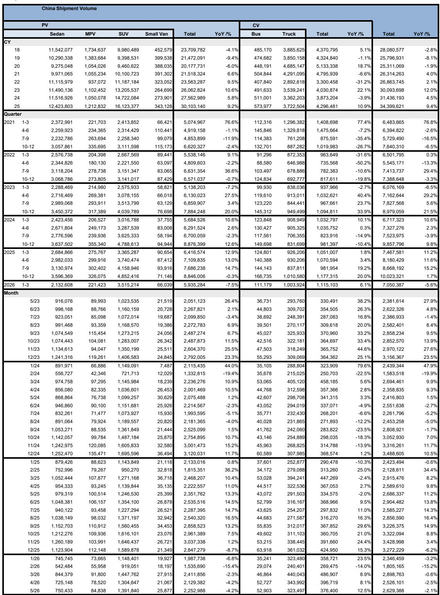
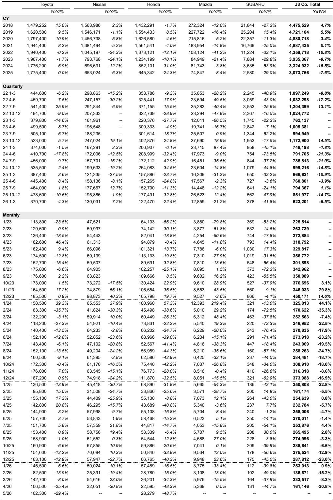
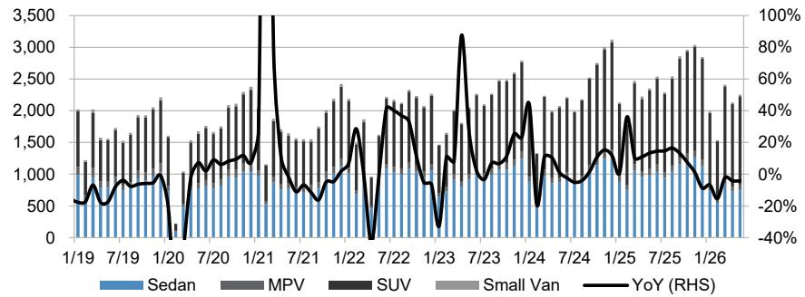

# China's Auto Market Has Reached a Point of No Return: The ICE Era Is Ending Faster Than Anyone Expected

The Chinese passenger vehicle market is no longer in a gradual transition. It has entered a structural rupture. In May, domestic retail sales of internal combustion engine vehicles fell 38 percent year-on-year, while new energy vehicle penetration reached 63 percent—a 160 basis point increase from April alone. These numbers are not incremental shifts. They represent a decisive break in consumer behavior, one that is accelerating despite the fact that popular NEV models now cost more than comparable ICE vehicles in the entry-level segment. The price advantage that once anchored the ICE value proposition has vanished, yet the migration continues. That is the signal that every automotive strategist, supplier executive, and investor must internalize.

The conventional narrative has been that NEV adoption would plateau once subsidies faded and price parity was achieved. That assumption is being overturned in real time. What we are witnessing is not a price-driven substitution but a preference-driven revolution. Chinese consumers are choosing NEVs even when they cost more. This changes the calculus for every incumbent manufacturer, particularly those whose global strategy still depends on a long tail of ICE profitability in emerging markets. The summer of 2026 may well be remembered as the moment the ICE business model in China became structurally untenable.

Three forces are converging to create this inflection point. First, domestic NEV penetration is accelerating through a reversal of the historical price gap. Second, the ICE aftermarket is showing signs of distress that will feed back into new vehicle pricing. Third, Chinese export capacity is surging to record levels, creating a global supply shock that will reshape competitive dynamics far beyond China's borders. Each of these forces deserves careful examination, but the critical insight is that they are mutually reinforcing. The collapse in domestic ICE demand is pushing more capacity into exports, while the export boom is absorbing NEV production and validating Chinese OEM pricing power abroad.

## The Price Gap Has Reversed, Yet NEV Demand Continues to Accelerate—This Changes Everything

The most counterintuitive finding in the May data is that popular NEV models in the entry segment—vehicles priced at or below 100,000 renminbi, approximately 2.3 million yen—are now more expensive than comparable ICE models. Historically, the economic case for NEVs rested on a combination of subsidies, lower operating costs, and competitive upfront pricing. Subsidies have been reduced. Operating cost advantages remain but are well understood. And now the upfront price disadvantage has re-emerged. Yet retail demand for NEVs was 849,000 units in May, down only 7 percent year-on-year, compared to a 38 percent collapse in ICE retail sales.

This is not a marginal phenomenon. The penetration rate rose from 61 percent to 63 percent in a single month, during a period when total passenger vehicle retail sales fell 22 percent year-on-year. The market is shrinking, but the NEV share is growing within that smaller total. This implies that ICE vehicles are bearing the entire weight of the demand contraction, and then some. The substitution effect is so powerful that it is overriding basic price signals.

What explains this behavior? The report points to intelligent vehicle systems as a key differentiator. Chinese OEMs have been able to raise NEV prices because they are bundling advanced driver-assistance features, connectivity, and software-defined architectures that consumers perceive as genuine value additions. ICE automakers, by contrast, are cutting prices aggressively but still losing share. This suggests that the competitive battlefield has shifted from hardware and powertrain to software and user experience. For global automakers whose core competency remains mechanical engineering and supply chain optimization, this is an existential challenge. They are competing in a game whose rules have changed, and they are playing with a different set of tools.

## The ICE Aftermarket Is Flashing Red, and the Distress Will Cascade Into New Vehicle Pricing

The most dangerous signal for ICE incumbents is not the sales decline itself, but what is happening in the used car market. The report notes that the number of used cars—predominantly ICE vehicles—with zero recorded mileage is rising again. This is a critical indicator. Zero-mileage used cars are essentially new vehicles that have been registered and then immediately resold, often by dealers trying to meet sales targets or by fleet operators unwinding positions. Their presence in the used market creates direct competition for new vehicle sales, because they offer near-new condition at a discount.

When zero-mileage used car inventories rise, two things happen. First, new vehicle prices come under additional pressure, because consumers can buy essentially the same car at a lower price in the used market. Second, the resale values of all ICE vehicles decline, because the market is flooded with supply. The report confirms that ICE resale values have fallen over the past few months, and the advantage over NEVs is diminishing. This creates a negative feedback loop: lower resale values make ICE vehicles less attractive to new buyers, which depresses new sales further, which leads to more zero-mileage inventory, which pushes resale values down again.

The summer seasonal pattern will amplify this dynamic. ICE sales typically weaken in the summer months due to seasonal factors, but the report estimates that conditions will be even tougher than usual this year. If zero-mileage inventories continue to rise, the combination of seasonal weakness and structural oversupply could trigger a price war in the ICE segment that permanently damages brand equity and dealer profitability. For Japanese OEMs, which are heavily exposed to the Chinese ICE market, this is a particularly acute risk. Toyota's May retail sales in China were 102,000 units, down 29 percent year-on-year. Honda's were 28,000 units, down 49 percent. These are not cyclical numbers. They are structural.

## China's Export Surge Is Reshaping Global Supply Chains, and the Constraints Are Becoming Binding

Passenger vehicle exports reached an all-time high for the third consecutive month in May, breaking above 800,000 units. This was driven by NEVs, which accounted for 435,000 units, up 110 percent year-on-year. But the net increase in ICE exports was also significant, at 374,000 units, up 42 percent year-on-year. The export boom is not a NEV-only story, at least not yet. Chinese OEMs are exporting everything they can build, and the destinations are expanding beyond traditional markets like Europe and ASEAN to include Brazil and Australia as key new frontiers.

The report highlights that production capacity for BYD and other popular makes is reaching its limits, and delivery times are lengthening both in China and overseas. This is a fascinating development. For years, the narrative around Chinese auto exports was that they were low-margin, low-quality vehicles sold primarily to price-sensitive markets. That narrative is no longer accurate. Chinese OEMs are now facing capacity constraints, which means they have pricing power. They are extending delivery dates and raising prices on some NEV models. This is not the behavior of a market that is dumping excess inventory. It is the behavior of a market that is supply-constrained.

The strategic implication is clear: Chinese OEMs are becoming price-makers, not price-takers, in the global auto market. This will have profound consequences for incumbent manufacturers in Europe, Japan, and North America. As Chinese exports grow and become more sophisticated, they will compress margins across the entire global auto industry. The capacity constraints that Chinese OEMs are currently experiencing are temporary. New factories are being built. But the pricing power they have demonstrated will not disappear once capacity catches up with demand. It will simply shift from a supply-driven premium to a brand-driven premium, assuming Chinese OEMs can maintain their technological edge in intelligent vehicle systems.

## What the Report Does Not Fully Answer: The Sustainability of NEV Pricing Power and the Timeline for ICE Collapse

The report provides a compelling snapshot of the current state of the Chinese auto market, but it leaves several critical questions unresolved. The most important is whether the current NEV pricing power is sustainable. Chinese OEMs have been able to raise prices because they are bundling advanced technology features that consumers value. But as competition intensifies and as global automakers begin to close the gap in software and connectivity, will that pricing power erode? The report does not model the competitive response from global OEMs, nor does it assess the potential for a price war in the NEV segment once capacity catches up with demand.

A second open question is the timeline for the ICE market collapse. The report assumes that ICE sales will fall this summer due to seasonal factors, and that conditions will be tougher than usual. But it does not quantify the risk of a disorderly collapse. If zero-mileage used car inventories continue to rise, and if ICE resale values fall below a certain threshold, the entire financing and leasing ecosystem for ICE vehicles could be disrupted. Consumers who rely on trade-in values to finance new purchases would be trapped. Dealers holding large ICE inventories would face liquidity crises. The report hints at these risks but does not explore the second-order effects on the financial system or on the balance sheets of global automakers.

A third question concerns the export trajectory. The report notes that production capacity is reaching its limits, but it does not assess how quickly new capacity will come online, or whether Chinese OEMs will be able to maintain their export momentum in the face of potential tariff barriers in Europe and North America. The political risk to Chinese auto exports is substantial, and the report does not address it in any detail. These are not criticisms of the analysis, which is excellent within its scope. They are the natural boundaries of a monthly data report, and they point to the areas where further research is needed.

## A Decision Framework for Investors and Executives Navigating the Chinese Auto Transition

For readers who need to translate this analysis into actionable decisions, three questions should guide your thinking. First, what is your exposure to the Chinese ICE market? If you are an investor holding equity in global automakers with significant China ICE sales, you need to stress-test your assumptions about the pace of decline. The May data suggests that the decline is accelerating, and that the summer months could be worse than any seasonal model predicts. You should be asking whether your portfolio companies have the balance sheet strength to withstand a 30 to 40 percent year-on-year decline in China ICE sales for multiple quarters.

Second, how are you positioned in the NEV supply chain? The capacity constraints at Chinese OEMs create opportunities for suppliers of batteries, power electronics, and intelligent vehicle components. But they also create risks for suppliers that are overexposed to specific OEMs or specific technologies. The report's data on export growth suggests that the NEV supply chain is becoming global, not just Chinese. Suppliers that can serve both domestic Chinese OEMs and their export operations will have a structural advantage.

Third, what is your view on ICE resale values? This is the most underappreciated risk in the current market. If ICE resale values continue to fall, the impact will ripple through the entire automotive ecosystem—from leasing companies to rental fleets to consumer financing. Investors should be monitoring used car price indices as closely as they monitor new vehicle sales data. A sustained decline in ICE resale values would be a leading indicator of deeper trouble ahead.

## Join the Community to Read the Full Report and Review the Original Charts

The analysis presented here is based on a single month of data, but the patterns it reveals are structural, not seasonal. To fully understand the implications for your portfolio or your business strategy, you need access to the underlying data series, the historical comparisons, and the detailed breakdowns by OEM and by vehicle segment. The full report includes charts on wholesale volumes, export trends, and Japanese OEM sales performance that are essential for any serious analysis. Join the community to read the full report and review the original charts. The questions raised here—about the sustainability of NEV pricing power, the timeline for ICE collapse, and the global impact of Chinese export growth—are not academic. They are the central strategic questions facing the global auto industry today.

*This article is for learning and discussion only and does not constitute investment advice.*

Personal reading notes and learning share only. Not investment advice.

