June 10, 2026 08:55 AM GMT

# Investor Presentation | Asia Pacific

## Asia Summer School: China Materials

Supply disruptions, alongside improving demand from ESS & AI, support selective materials exposure.

We prefer aluminum, copper, lithium, uranium, gold, and glass fiber equities in this environment.

MS ASIA LIMITED+

## Rachel L Zhang

Equity Analyst

Rachel.Zhang@morganstanley.com +852 2239-1520

## Hannah Yang, CFA

Equity Analyst

Hannah.Yang1@morganstanley.com +852 2239-7079

## Chris Jiang

Equity Analyst

Chris.Jiang@morganstanley.com +852 3963-1593

## Cynthia Tang

Research Associate

Cynthia.Tang@morganstanley.com +852 3963-4360

text_image

Asia Summer School 2026

## GREATER CHINA MATERIALS

Asia Pacific

Industry View

Attractive

MS does and seeks to do business with companies covered in MS. As a result, investors should be aware that the firm may have a conflict of interest that could affect the objectivity of MS. Investors should consider MS as only a single factor in making their investment decision.

## For analyst certification and other important disclosures, refer to the Disclosure Section, located at the end of this report.

+= Analysts employed by non-U.S. affiliates are not registered with FINRA, may not be associated persons of the member and may not be subject to FINRA restrictions on communications with a subject company, public appearances and trading securities held by a research analyst account.

## Asia Summer School 2026

## MS

June 12, 2026

## INVESTOR PRESENTATION

## Asia Summer School: China Materials

Supply disruptions, alongside improving demand from ESS & AI, support selective materials exposure.

We prefer aluminum, copper, lithium, uranium, gold, and glass fiber equities in this environment.

MS

Asia Pacific

MS Asia Limited+

Rachel L Zhang

Equity Analyst

Rachel.Zhang@morganstanley.com

+852 2239-1520

Hannah Yang, CFA

Equity Analyst

Hannah.Yang1@morganstanley.com

+852 2239-7079

Chris Jiang

Equity Analyst

Chris.Jiang@morganstanley.com

+852 3963-1593

Cynthia Tang

Equity Analyst

Cynthia.Tang@morganstanley.com

+852 3963-4360

MS does and seeks to do business with companies covered in MS. As a result, investors should be aware that the firm may have a conflict of interest that could affect the objectivity of MS. Investors should consider MS as only a single factor in making their investment decision.

For analyst certification and other important disclosures, refer to the Disclosure Section, located at the end of this report.

+= Analysts employed by non-U.S. affiliates are not registered with FINRA, may not be associated persons of the member and may not be subject to NASD/NYSE restrictions on communications with a subject company, public appearances and trading securities held by a research analyst account.

## Key Changes

## MS Commodities Forecasts vs. Consensus

<table><tr><td rowspan="2"></td><td rowspan="2">unit</td><td colspan="3">CY2026e</td><td colspan="3">CY2027e</td><td colspan="3">Long-Term REAL</td></tr><tr><td>MS</td><td>Consensus</td><td>% diff</td><td>MS</td><td>Consensus</td><td>% diff</td><td>MS</td><td>Consensus</td><td>% diff</td></tr><tr><td colspan="11">Base Metals</td></tr><tr><td>Aluminium</td><td>US$/t</td><td>3,386</td><td>3,064</td><td>11%</td><td>3,263</td><td>2,876</td><td>13%</td><td>2,500</td><td>2,623</td><td>-5%</td></tr><tr><td>Copper</td><td>US$/t</td><td>12,292</td><td>12,280</td><td>0%</td><td>12,250</td><td>12,054</td><td>2%</td><td>9,700</td><td>10,263</td><td>-5%</td></tr><tr><td>Nickel</td><td>US$/t</td><td>16,706</td><td>16,816</td><td>-1%</td><td>16,500</td><td>17,598</td><td>-6%</td><td>16,400</td><td>17,203</td><td>-5%</td></tr><tr><td>Zinc</td><td>US$/t</td><td>3,021</td><td>3,027</td><td>0%</td><td>2,925</td><td>2,836</td><td>3%</td><td>2,801</td><td>2,713</td><td>3%</td></tr><tr><td>Lead</td><td>US$/t</td><td>1,883</td><td>1,986</td><td>-5%</td><td>2,100</td><td>2,104</td><td>0%</td><td>2,250</td><td>1,936</td><td>16%</td></tr><tr><td>Alumina</td><td>US$/t</td><td>312</td><td>332</td><td>-6%</td><td>324</td><td>384</td><td>-16%</td><td>380</td><td>362</td><td>5%</td></tr><tr><td colspan="11">Precious Metals</td></tr><tr><td>Gold</td><td>US$/oz</td><td>4,916</td><td>4,855</td><td>1%</td><td>4,950</td><td>4,398</td><td>13%</td><td>2,500</td><td>3,459</td><td>-28%</td></tr><tr><td>Silver</td><td>US$/oz</td><td>73.8</td><td>79.8</td><td>-8%</td><td>70.7</td><td>65.4</td><td>8%</td><td>31.3</td><td>54.5</td><td>-43%</td></tr><tr><td>Platinum</td><td>US$/oz</td><td>1,994</td><td>2,132</td><td>-6%</td><td>1,993</td><td>2,051</td><td>-3%</td><td>1,940</td><td>1,411</td><td>37%</td></tr><tr><td>Palladium</td><td>US$/oz</td><td>1,482</td><td>1,693</td><td>-12%</td><td>1,431</td><td>1,521</td><td>-6%</td><td>1,250</td><td>1,187</td><td>5%</td></tr><tr><td colspan="11">Bulks</td></tr><tr><td>Iron Ore</td><td>US$/t</td><td>100</td><td>98</td><td>3%</td><td>96</td><td>94</td><td>3%</td><td>90</td><td>85</td><td>6%</td></tr><tr><td>Hard Coking Coal</td><td>US$/t</td><td>231</td><td>214</td><td>8%</td><td>226</td><td>213</td><td>6%</td><td>191</td><td>194</td><td>-2%</td></tr><tr><td>Thermal Coal</td><td>US$/t</td><td>151</td><td>117</td><td>29%</td><td>138</td><td>111</td><td>23%</td><td>120</td><td>99</td><td>21%</td></tr><tr><td colspan="11">Other Metals</td></tr><tr><td>Cobalt</td><td>US$/lb</td><td>26.7</td><td>23.8</td><td>12%</td><td>27.0</td><td>22.1</td><td>22%</td><td>14.0</td><td>19.6</td><td>-29%</td></tr><tr><td>Lithium carbonate</td><td>US$/t</td><td>22,840</td><td>19,559</td><td>17%</td><td>19,000</td><td>18,326</td><td>4%</td><td>14,800</td><td>16,025</td><td>-8%</td></tr><tr><td>Uranium</td><td>US$/lb</td><td>93.4</td><td>88.2</td><td>6%</td><td>93.8</td><td>92.5</td><td>1%</td><td>61.0</td><td>78.7</td><td>-22%</td></tr></table>

MS vs consensus 2026e

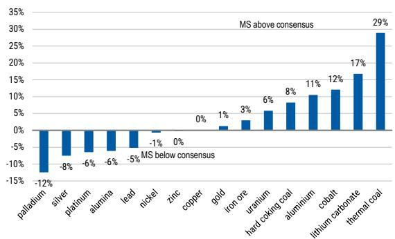

bar chart

| Commodity | Value (%) |
| :--- | :--- |
| palladium | -12 |
| silver | -8 |
| platinum | -6 |
| alumina | -6 |
| lead | -5 |
| nickel | -1 |
| zinc | 0 |
| copper | 0 |
| gold | 1 |
| iron ore | 3 |
| uranium | 6 |
| hard coking coal | 8 |
| aluminium | 11 |
| cobalt | 12 |
| lithium carbonate | 17 |
| thermal coal | 29 |

MS vs consensus CY2027e  
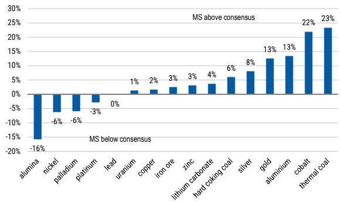

bar chart

| Category | Value (%) |
|---|---|
| alumina | -16 |
| nickel | -6 |
| palladium | -6 |
| platinum | -3 |
| lead | 0 |
| uranium | 1 |
| copper | 2 |
| iron ore | 3 |
| zinc | 3 |
| lithium carbonate | 4 |
| hard coking coal | 6 |
| silver | 8 |
| gold | 13 |
| aluminium | 13 |
| cobalt | 22 |
| thermal coal | 23 |
MS above consensus; MS below consensus

Source: Consensus Economics, MS. Note: IO, cfr N.China; HCC, spot fob Aust.; TC, spot NEWC, Consensus = Consensus Economics. e = MS estimates.

## Steel Industry

## China Steel Consumption Index

2026 MSe China Steel Demand Drivers  
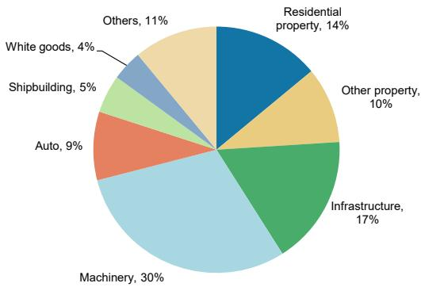

pie chart

| Category | Percentage (%) |
| :--- | :--- |
| Residential property | 14 |
| Other property | 10 |
| Infrastructure | 17 |
| Machinery | 30 |
| Auto | 9 |
| Shipbuilding | 5 |
| White goods | 4 |
| Others | 11 |

YoY Change - %  
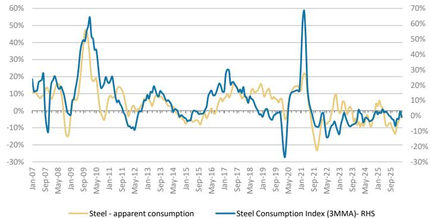

line chart

| Date    | Steel - apparent consumption | Steel Consumption Index (3MMA) - RHS |
|---------|-------------------------------|--------------------------------------|
| Jan-07  | ~15%                          | ~15%                                 |
| Sep-07  | ~20%                          | ~20%                                 |
| May-08  | ~10%                          | ~10%                                 |
| Jan-09  | ~-15%                         | ~-15%                                |
| Sep-09  | ~45%                          | ~55%                                 |
| May-10  | ~20%                          | ~20%                                 |
| Jan-11  | ~10%                          | ~10%                                 |
| Sep-11  | ~5%                           | ~5%                                  |
| May-12  | ~0%                           | ~0%                                  |
| Jan-13  | ~5%                           | ~5%                                  |
| Sep-13  | ~10%                          | ~10%                                 |
| May-14  | ~5%                           | ~5%                                  |
| Jan-15  | ~0%                           | ~0%                                  |
| Sep-15  | ~5%                           | ~5%                                  |
| May-16  | ~10%                          | ~10%                                 |
| Jan-17  | ~20%                          | ~25%                                 |
| Sep-17  | ~15%                          | ~15%                                 |
| May-18  | ~10%                          | ~10%                                 |
| Jan-19  | ~5%                           | ~5%                                  |
| Sep-19  | ~-20%                         | ~-20%                                |
| May-20  | ~-25%                         | ~-25%                                |
| Jan-21  | ~20%                          | ~70%                                 |
| Sep-21  | ~-20%                         | ~-20%                                |
| May-22  | ~5%                           | ~5%                                  |
| Jan-23  | ~10%                          | ~10%                                 |
| Sep-23  | ~5%                           | ~5%                                  |
| May-24  | ~0%                           | ~0%                                  |
| Jan-25  | ~5%                           | ~5%                                  |
| Sep-25  | ~0%                           | ~0%                                  |

China Steel Consumption Index

<table><tr><td>Key Drivers &amp; Weightings(YoY chg)</td><td>Jan-25</td><td>Feb-25</td><td>Mar-25</td><td>Apr-25</td><td>May-25</td><td>Jun-25</td><td>Jul-25</td><td>Aug-25</td><td>Sep-25</td><td>Oct-25</td><td>Nov-25</td><td>Dec-25</td><td>Jan-26</td><td>Feb-26</td><td>Mar-26</td><td>Apr-26</td><td>2025</td><td>2026e</td></tr><tr><td>Res Property - 14%</td><td>-4%</td><td>-4%</td><td>-1%</td><td>-3%</td><td>-6%</td><td>-8%</td><td>-8%</td><td>-10%</td><td>-13%</td><td>-21%</td><td>-19%</td><td>-19%</td><td>-16%</td><td>-16%</td><td>-11%</td><td>-10%</td><td>-20%</td><td>-16%</td></tr><tr><td>Other Property - 10%</td><td>-15%</td><td>-15%</td><td>-3%</td><td>0%</td><td>1%</td><td>1%</td><td>-10%</td><td>-16%</td><td>-9%</td><td>-12%</td><td>-12%</td><td>-6%</td><td>1%</td><td>1%</td><td>6%</td><td>-14%</td><td>-10%</td><td>-10%</td></tr><tr><td>Infrastructure - 17%</td><td>0%</td><td>0%</td><td>2%</td><td>3%</td><td>1%</td><td>4%</td><td>-10%</td><td>-10%</td><td>1%</td><td>-13%</td><td>-7%</td><td>-21%</td><td>7%</td><td>7%</td><td>8%</td><td>-12%</td><td>-5%</td><td>5%</td></tr><tr><td>Machinery Sales - 30%</td><td>-13%</td><td>48%</td><td>12%</td><td>8%</td><td>10%</td><td>21%</td><td>15%</td><td>18%</td><td>24%</td><td>16%</td><td>15%</td><td>5%</td><td>50%</td><td>-17%</td><td>17%</td><td>24%</td><td>14%</td><td>3%</td></tr><tr><td>Auto sales - 9%</td><td>-1%</td><td>34%</td><td>8%</td><td>10%</td><td>11%</td><td>14%</td><td>15%</td><td>16%</td><td>15%</td><td>9%</td><td>3%</td><td>-6%</td><td>-3%</td><td>-15%</td><td>-1%</td><td>-2%</td><td>9%</td><td>-5%</td></tr><tr><td>Ship building - 5%</td><td>9%</td><td>-27%</td><td>-24%</td><td>8%</td><td>14%</td><td>0%</td><td>36%</td><td>12%</td><td>36%</td><td>28%</td><td>28%</td><td>28%</td><td>16%</td><td>74%</td><td>69%</td><td>0%</td><td>11%</td><td>5%</td></tr><tr><td>White goods sales - 4%</td><td>5%</td><td>26%</td><td>11%</td><td>5%</td><td>4%</td><td>3%</td><td>4%</td><td>2%</td><td>-4%</td><td>-11%</td><td>-14%</td><td>-11%</td><td>11%</td><td>-9%</td><td>-3%</td><td>-4%</td><td>1%</td><td>-5%</td></tr><tr><td>Other Industrial (PMI) - 11%</td><td>-1%</td><td>0%</td><td>1%</td><td>-1%</td><td>-1%</td><td>0%</td><td>-1%</td><td>-1%</td><td>0%</td><td>-1%</td><td>-1%</td><td>0%</td><td>-1%</td><td>-1%</td><td>0%</td><td>0%</td><td>0%</td><td>0%</td></tr><tr><td>Steel Consumption Index</td><td>1%</td><td>2%</td><td>2%</td><td>4%</td><td>2%</td><td>3%</td><td>2%</td><td>0%</td><td>0%</td><td>-2%</td><td>-3%</td><td>-7%</td><td>-2%</td><td>-2%</td><td>3%</td><td>-1%</td><td>0.9%</td><td>-1.9%</td></tr><tr><td>Steel Appt. Consumption</td><td>-1%</td><td>2%</td><td>7%</td><td>-4%</td><td>-10%</td><td>-11%</td><td>-6%</td><td>-5%</td><td>-10%</td><td>-14%</td><td>-12%</td><td>-14%</td><td>-1%</td><td>-4%</td><td>-7%</td><td>1%</td><td>-7%</td><td>-3%</td></tr></table>

Source: CEIC, MS. e = MS estimates.

## Copper Industry

## China Copper Consumption Index

China Copper Demand Drivers  
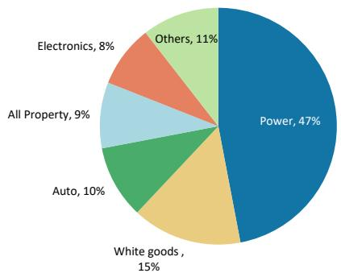

pie chart

| Category | Percentage (%) |
| :--- | :--- |
| Power | 47 |
| White goods | 15 |
| Auto | 10 |
| All Property | 9 |
| Electronics | 8 |
| Others | 11 |

YoY Change - %  
China Copper Consumption Index (CCI)  
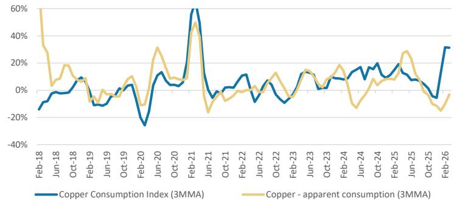

line chart

| Date   | Copper Consumption Index (3MMA) | Copper - apparent consumption (3MMA) |
|--------|----------------------------------|--------------------------------------|
| Feb-18 | -15%                             | 60%                                  |
| Jun-18 | -5%                              | 20%                                  |
| Oct-18 | 5%                               | 15%                                  |
| Feb-19 | -10%                             | 0%                                   |
| Jun-19 | -5%                              | -5%                                  |
| Oct-19 | 0%                               | 10%                                  |
| Feb-20 | -25%                             | -10%                                 |
| Jun-20 | 10%                              | 30%                                  |
| Oct-20 | 5%                               | 10%                                  |
| Feb-21 | 60%                              | 50%                                  |
| Jun-21 | -5%                              | -20%                                 |
| Oct-21 | 0%                               | 0%                                   |
| Feb-22 | 10%                              | 5%                                   |
| Jun-22 | -5%                              | 0%                                   |
| Oct-22 | 0%                               | 10%                                  |
| Feb-23 | 10%                              | 15%                                  |
| Jun-23 | 5%                               | 0%                                   |
| Oct-23 | 0%                               | 15%                                  |
| Feb-24 | 10%                              | -10%                                 |
| Jun-24 | 15%                              | 5%                                   |
| Oct-24 | 10%                              | 10%                                  |
| Feb-25 | 15%                              | 30%                                  |
| Jun-25 | 5%                               | 10%                                  |
| Oct-25 | -5%                              | -10%                                 |
| Feb-26 | 30%                              | -5%                                  |

MS China's Copper Consumption Index (CCI):

<table><tr><td>Key Drivers &amp; Weightings</td><td>2019</td><td>2020</td><td>2021</td><td>2022</td><td>2023</td><td>2024</td><td>2025</td><td>2026e</td></tr><tr><td colspan="9">(YoY chg)</td></tr><tr><td>Power - 47%</td><td>-7%</td><td>-2%</td><td>0%</td><td>2%</td><td>5%</td><td>15%</td><td>5%</td><td>8%</td></tr><tr><td>White goods - 15%</td><td>2%</td><td>-1%</td><td>7%</td><td>-5%</td><td>15%</td><td>15%</td><td>1%</td><td>0%</td></tr><tr><td>Auto (sales) - 10%</td><td>-8%</td><td>-2%</td><td>4%</td><td>2%</td><td>12%</td><td>5%</td><td>9%</td><td>3%</td></tr><tr><td>Property (completion) - 9%</td><td>9%</td><td>-1%</td><td>-11%</td><td>-40%</td><td>-20%</td><td>-23%</td><td>-20%</td><td>-16%</td></tr><tr><td>Electronics (semiconductor production) - 8%</td><td>10%</td><td>37%</td><td>15%</td><td>-12%</td><td>17%</td><td>20%</td><td>10%</td><td>10%</td></tr><tr><td>Others (PMI) - 11%</td><td>0%</td><td>0%</td><td>1%</td><td>0%</td><td>-20%</td><td>-25%</td><td>0%</td><td>-10%</td></tr><tr><td>Copper Consumption Index (3MMA)</td><td>-2.1%</td><td>1.5%</td><td>2.0%</td><td>-3.9%</td><td>3.7%</td><td>7.3%</td><td>2.7%</td><td>2.6%</td></tr></table>

Source: CEIC, MS. e = MS estimates.

## Aluminum Industry

## China Aluminum Consumption Index

China aluminum demand breakdown by sectors  
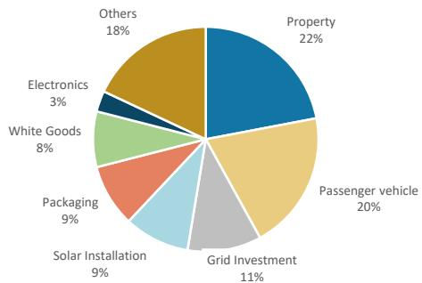

pie chart

| Category | Percentage (%) |
| :--- | :--- |
| Property | 22 |
| Passenger vehicle | 20 |
| Grid Investment | 11 |
| Solar Installation | 9 |
| Packaging | 9 |
| White Goods | 8 |
| Electronics | 3 |
| Others | 18 |

YoY Change - % China Aluminium Consumption Index (ACI)  
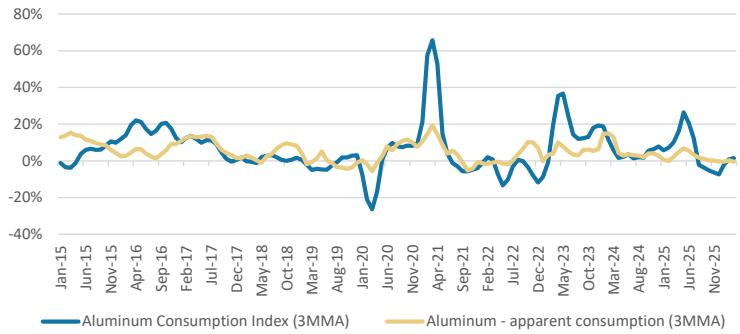

line chart

| Month    | Aluminum Consumption Index (3MMA) | Aluminum - apparent consumption (3MMA) |
|----------|-----------------------------------|----------------------------------------|
| Jan-15   | ~0%                               | ~10%                                   |
| Jun-15   | ~5%                               | ~15%                                   |
| Nov-15   | ~10%                              | ~10%                                   |
| Apr-16   | ~20%                              | ~5%                                    |
| Sep-16   | ~15%                              | ~10%                                   |
| Feb-17   | ~10%                              | ~15%                                   |
| Jul-17   | ~5%                               | ~10%                                   |
| Dec-17   | ~0%                               | ~5%                                    |
| May-18   | ~5%                               | ~10%                                   |
| Oct-18   | ~0%                               | ~5%                                    |
| Mar-19   | ~5%                               | ~10%                                   |
| Aug-19   | ~0%                               | ~5%                                    |
| Jan-20   | ~-20%                             | ~0%                                    |
| Jun-20   | ~10%                              | ~10%                                   |
| Nov-20   | ~60%                              | ~20%                                   |
| Apr-21   | ~20%                              | ~10%                                   |
| Sep-21   | ~0%                               | ~5%                                    |
| Feb-22   | ~-5%                              | ~0%                                    |
| Jul-22   | ~-10%                             | ~5%                                    |
| Dec-22   | ~35%                              | ~10%                                   |
| May-23   | ~20%                              | ~5%                                    |
| Oct-23   | ~15%                              | ~10%                                   |
| Mar-24   | ~10%                              | ~5%                                    |
| Aug-24   | ~5%                               | ~0%                                    |
| Jan-25   | ~25%                              | ~5%                                    |
| Jun-25   | ~10%                              | ~0%                                    |
| Nov-25   | ~0%                               | ~0%                                    |

China Aluminum Consumption Index

<table><tr><td>Key Drivers &amp; Weighing</td><td>Jan-25</td><td>Feb-25</td><td>Mar-25</td><td>Apr-25</td><td>May-25</td><td>Jun-25</td><td>Jul-25</td><td>Aug-25</td><td>Sep-25</td><td>Oct-25</td><td>Nov-25</td><td>Dec-25</td><td>Jan-26</td><td>Feb-26</td><td>Mar-26</td><td>2026e</td></tr><tr><td>Property - 22%</td><td>-5%</td><td>-5%</td><td>-2%</td><td>-3%</td><td>-5%</td><td>-7%</td><td>-8%</td><td>-11%</td><td>-12%</td><td>-20%</td><td>-18%</td><td>-17%</td><td>-14%</td><td>-14%</td><td>-8%</td><td>-15%</td></tr><tr><td>Passager Vehicle - 20%</td><td>-1%</td><td>34%</td><td>8%</td><td>10%</td><td>11%</td><td>14%</td><td>15%</td><td>16%</td><td>15%</td><td>9%</td><td>3%</td><td>-6%</td><td>-3%</td><td>-15%</td><td>-1%</td><td>8%</td></tr><tr><td>Power (Grid Investment) - 11%</td><td>33%</td><td>33%</td><td>18%</td><td>-2%</td><td>33%</td><td>4%</td><td>-1%</td><td>26%</td><td>-11%</td><td>-14%</td><td>-1%</td><td>0%</td><td>109%</td><td>109%</td><td>-12%</td><td>15%</td></tr><tr><td>Solar production - 9%</td><td>7%</td><td>7%</td><td>124%</td><td>215%</td><td>388%</td><td>-38%</td><td>-48%</td><td>-55%</td><td>-54%</td><td>-38%</td><td>-12%</td><td>-43%</td><td>-18%</td><td>-18%</td><td>-56%</td><td>-3%</td></tr><tr><td>Packaging - 9%</td><td>4%</td><td>4%</td><td>7%</td><td>6%</td><td>4%</td><td>3%</td><td>0%</td><td>-2%</td><td>1%</td><td>-2%</td><td>-1%</td><td>-1%</td><td>0%</td><td>0%</td><td>2%</td><td>3%</td></tr><tr><td>White Goods - 8%</td><td>2%</td><td>35%</td><td>11%</td><td>4%</td><td>5%</td><td>7%</td><td>4%</td><td>2%</td><td>-4%</td><td>-11%</td><td>-14%</td><td>-11%</td><td>11%</td><td>-9%</td><td>-3%</td><td>-5%</td></tr><tr><td>Electronics - 3%</td><td>-4%</td><td>-4%</td><td>0%</td><td>-4%</td><td>4%</td><td>9%</td><td>10%</td><td>14%</td><td>19%</td><td>16%</td><td>17%</td><td>12%</td><td>21%</td><td>21%</td><td>31%</td><td>10%</td></tr><tr><td>Others - 18%</td><td>-1%</td><td>0%</td><td>1%</td><td>-1%</td><td>-1%</td><td>0%</td><td>-1%</td><td>-1%</td><td>0%</td><td>-1%</td><td>-1%</td><td>0%</td><td>-1%</td><td>-1%</td><td>0%</td><td>2%</td></tr><tr><td>Aluminum Consumption Index (3MMA)</td><td>6%</td><td>7%</td><td>10%</td><td>16%</td><td>26%</td><td>21%</td><td>12%</td><td>-2%</td><td>-4%</td><td>-5%</td><td>-6%</td><td>-7%</td><td>-2%</td><td>1%</td><td>1%</td><td>1.1%</td></tr></table>

Source: CEIC, MS. e = MS estimates.

## Infrastructure

# (17% of Steel Demand, 40% of Cement Demand, 15% of Aluminum Demand)

Infrastructure Spending Monthly FAI  
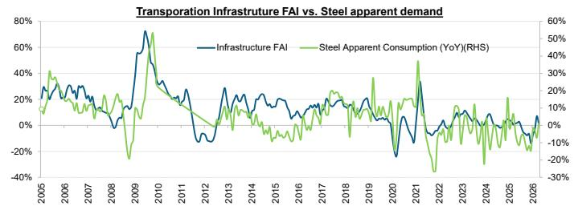

line chart

| Year | Infrastructure FAI | Steel Apparent Consumption (YoY)(RHS) |
|------|---------------------|----------------------------------------|
| 2005 | ~30%                | ~10%                                   |
| 2006 | ~25%                | ~20%                                   |
| 2007 | ~20%                | ~15%                                   |
| 2008 | ~15%                | ~10%                                   |
| 2009 | ~70%                | ~-20%                                  |
| 2010 | ~40%                | ~50%                                   |
| 2011 | ~20%                | ~20%                                   |
| 2012 | ~-10%               | ~-10%                                  |
| 2013 | ~30%                | ~-5%                                   |
| 2014 | ~25%                | ~-10%                                  |
| 2015 | ~20%                | ~-5%                                   |
| 2016 | ~15%                | ~-10%                                  |
| 2017 | ~20%                | ~-5%                                   |
| 2018 | ~15%                | ~-10%                                  |
| 2019 | ~10%                | ~-5%                                   |
| 2020 | ~-30%               | ~-30%                                  |
| 2021 | ~-10%               | ~-10%                                  |
| 2022 | ~-5%                | ~-5%                                   |
| 2023 | ~10%                | ~-10%                                  |
| 2024 | ~5%                 | ~-5%                                   |
| 2025 | ~-5%                | ~-10%                                  |
| 2026 | ~-10%               | ~-15%                                  |

<table><tr><td>Key Drivers &amp; Weightings</td><td>May-25</td><td>Jun-25</td><td>Jul-25</td><td>Aug-25</td><td>Sep-25</td><td>Oct-25</td><td>Nov-25</td><td>Dec-25</td><td>Jan-26</td><td>Feb-26</td><td>Mar-26</td><td>Apr-26</td></tr><tr><td>Highway</td><td>1%</td><td>3%</td><td>-17%</td><td>-12%</td><td>1%</td><td>-15%</td><td>-9%</td><td>-18%</td><td>-1%</td><td>-1%</td><td>6%</td><td>-18%</td></tr><tr><td>Railway</td><td>4%</td><td>9%</td><td>12%</td><td>-7%</td><td>2%</td><td>-5%</td><td>0%</td><td>-30%</td><td>29%</td><td>29%</td><td>-3%</td><td>-5%</td></tr><tr><td>Waterway</td><td>29%</td><td>8%</td><td>-1%</td><td>0%</td><td>-3%</td><td>-12%</td><td>1%</td><td>-69%</td><td>18%</td><td>18%</td><td>52%</td><td>20%</td></tr><tr><td>Air transport</td><td>-21%</td><td>2%</td><td>-4%</td><td>-13%</td><td>-4%</td><td>-11%</td><td>-10%</td><td>-25%</td><td>31%</td><td>31%</td><td>56%</td><td>-3%</td></tr><tr><td>Transportation Infra FAI</td><td>1%</td><td>4%</td><td>-10%</td><td>-10%</td><td>1%</td><td>-13%</td><td>-7%</td><td>-21%</td><td>7%</td><td>7%</td><td>8%</td><td>-12%</td></tr></table>

MS China Economics Team Estimates 3% YoY FAI Growth for 2026

<table><tr><td></td><td>Weight</td><td>2019</td><td>2020</td><td>2021</td><td>2022</td><td>2023</td><td>2024</td><td>2025</td><td>2026E</td><td>2027E</td></tr><tr><td>Overall FAI Growth</td><td>100%</td><td>5.4%</td><td>2.9%</td><td>4.9%</td><td>5.1%</td><td>3.0%</td><td>3.2%</td><td>-3.8%</td><td>3.0%</td><td>2.0%</td></tr><tr><td>Manufacturing</td><td>36%</td><td>3.1%</td><td>-2.2%</td><td>13.5%</td><td>9.1%</td><td>6.5%</td><td>9.2%</td><td>0.6%</td><td>4.5%</td><td>4.0%</td></tr><tr><td>Infrastructure</td><td>29%</td><td>3.3%</td><td>3.4%</td><td>0.2%</td><td>11.5%</td><td>8.2%</td><td>9.2%</td><td>-1.5%</td><td>8.0%</td><td>4.5%</td></tr><tr><td>- Utility</td><td>7%</td><td>4.5%</td><td>17.6%</td><td>1.1%</td><td>19.3%</td><td>23.0%</td><td>23.9%</td><td>9.1%</td><td>8.5%</td><td>6.0%</td></tr><tr><td>- Transportation, Storage and Postal Service</td><td>10%</td><td>3.4%</td><td>1.4%</td><td>1.6%</td><td>9.1%</td><td>10.5%</td><td>5.9%</td><td>-1.2%</td><td>12.5%</td><td>4.9%</td></tr><tr><td>- Water Conservancy &amp; Environment Management</td><td>12%</td><td>2.9%</td><td>0.2%</td><td>-1.2%</td><td>10.3%</td><td>0.1%</td><td>4.2%</td><td>-8.4%</td><td>3.5%</td><td>3.0%</td></tr><tr><td>Property</td><td>16%</td><td>9.2%</td><td>5.0%</td><td>5.0%</td><td>-8.4%</td><td>-8.1%</td><td>-10.8%</td><td>-17.5%</td><td>-11.5%</td><td>-10.0%</td></tr><tr><td>By Developers</td><td>13%</td><td>9.9%</td><td>7.0%</td><td>4.4%</td><td>-10.0%</td><td>-9.6%</td><td>-10.6%</td><td>-17.2%</td><td>-14.0%</td><td>-12.5%</td></tr><tr><td>- Land</td><td>4%</td><td>14.5%</td><td>6.7%</td><td>-2.1%</td><td>-5.7%</td><td>-5.9%</td><td>-7.7%</td><td>-13.7%</td><td>-8.0%</td><td>-6.0%</td></tr><tr><td>- Property excl. Land</td><td>8%</td><td>7.9%</td><td>7.2%</td><td>7.4%</td><td>-11.8%</td><td>-11.3%</td><td>-12.0%</td><td>-18.9%</td><td>-17.2%</td><td>-16.3%</td></tr><tr><td>Other Related Services</td><td>3%</td><td>6.5%</td><td>-3.0%</td><td>7.6%</td><td>-1.6%</td><td>-2.2%</td><td>-11.5%</td><td>-18.6%</td><td>-2.2%</td><td>-1.8%</td></tr><tr><td>Others*</td><td>18%</td><td>7.6%</td><td>7.7%</td><td>-1.6%</td><td>7.0%</td><td>1.9%</td><td>-2.4%</td><td>-4.2%</td><td>2.5%</td><td>1.2%</td></tr><tr><td>SOEs</td><td>40%</td><td>6.8%</td><td>5.3%</td><td>2.9%</td><td>10.1%</td><td>6.4%</td><td>5.7%</td><td>-2.5%</td><td>2.0%</td><td>1.2%</td></tr><tr><td>Private</td><td>60%</td><td>4.6%</td><td>1.6%</td><td>6.1%</td><td>2.3%</td><td>0.9%</td><td>1.6%</td><td>-4.7%</td><td>3.7%</td><td>2.5%</td></tr></table>

Transportation Infrastructure New Orders Trend  
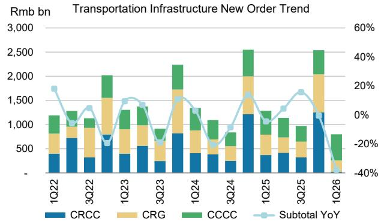

bar chart

| Quarter | CRCC (Rmb bn) | CRG (Rmb bn) | CCCC (Rmb bn) | Subtotal YoY (%) |
|---------|---------------|--------------|---------------|------------------|
| 1Q22    | 400           | 300          | 300           | -                |
| 2Q22    | 700           | 400          | 200           | -                |
| 3Q22    | 300           | 500          | 100           | -                |
| 4Q22    | 600           | 600          | 400           | -                |
| 1Q23    | 400           | 500          | 300           | -                |
| 2Q23    | 500           | 600          | 300           | -                |
| 3Q23    | 300           | 400          | 100           | -                |
| 4Q23    | 800           | 700          | 400           | -                |
| 1Q24    | 400           | 500          | 300           | -                |
| 2Q24    | 400           | 500          | 300           | -                |
| 3Q24    | 300           | 400          | 100           | -                |
| 4Q24    | 1200          | 800          | 500           | -                |
| 1Q25    | 400           | 500          | 300           | -                |
| 2Q25    | 400           | 500          | 300           | -                |
| 3Q25    | 300           | 400          | 100           | -                |
| 4Q25    | 1200          | 800          | 400           | -                |
| 1Q26    | -             | -            | -             | -40%             |

Source: CEIC, NBS, MS. e = MS estimates.

Building Construction New Orders Trend  
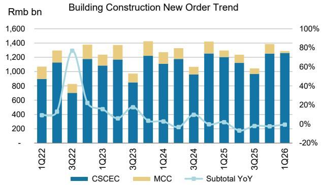

bar chart

| Quarter | CSCEC (Rmb bn) | MCC (Rmb bn) | Subtotal YoY (%) |
|---------|----------------|--------------|------------------|
| 1Q22    | 900            | 100          | 0                |
| 2Q22    | 1100           | 150          | 10               |
| 3Q22    | 700            | 800          | 80               |
| 4Q22    | 1200           | 150          | 20               |
| 1Q23    | 1100           | 150          | 10               |
| 2Q23    | 1200           | 150          | 5                |
| 3Q23    | 850            | 100          | -5               |
| 4Q23    | 1200           | 150          | -10              |
| 1Q24    | 1100           | 150          | -5               |
| 2Q24    | 1200           | 150          | -5               |
| 3Q24    | 950            | 100          | -5               |
| 4Q24    | 1250           | 150          | -5               |
| 1Q25    | 1200           | 150          | -5               |
| 2Q25    | 1150           | 150          | -5               |
| 3Q25    | 950            | 100          | -5               |
| 4Q25    | 1250           | 150          | -5               |
| 1Q26    | 1300           | 150          | -5               |

## Infrastructure

## Funding for Infrastructure

LGSB Issuance by Sector

<table><tr><td>Net issuance of LGSB (Rmb bn)</td><td>2019</td><td>2020</td><td>2021</td><td>2022</td><td>2023</td><td>2024</td><td>2025</td><td>2026YTD</td></tr><tr><td colspan="9">Infrastructure related:</td></tr><tr><td>Airport</td><td>3</td><td>6</td><td>3</td><td>1</td><td>6</td><td>2</td><td>0</td><td>24</td></tr><tr><td>Municipal projects</td><td>1</td><td>30</td><td>96</td><td>135</td><td>118</td><td>140</td><td>101</td><td>88</td></tr><tr><td>Other Infrastructure</td><td>108</td><td>1,142</td><td>726</td><td>737</td><td>677</td><td>680</td><td>899</td><td>447</td></tr><tr><td>Railway</td><td>12</td><td>38</td><td>6</td><td>8</td><td>2</td><td>40</td><td>43</td><td>26</td></tr><tr><td>Bridge and tunnel</td><td>4</td><td>0</td><td>0</td><td>0</td><td>0</td><td>0</td><td>0</td><td>3</td></tr><tr><td>Rural development</td><td>175</td><td>235</td><td>136</td><td>220</td><td>138</td><td>107</td><td>116</td><td>6</td></tr><tr><td>Toll road</td><td>153</td><td>190</td><td>139</td><td>125</td><td>118</td><td>84</td><td>81</td><td>30</td></tr><tr><td>Urban railway</td><td>23</td><td>60</td><td>8</td><td>11</td><td>5</td><td>10</td><td>4</td><td>17</td></tr><tr><td>Water supply and treatment</td><td>38</td><td>298</td><td>177</td><td>345</td><td>485</td><td>190</td><td>174</td><td>56</td></tr><tr><td>Subtotal</td><td>517</td><td>2,000</td><td>1,291</td><td>1,584</td><td>1,547</td><td>1,254</td><td>1,418</td><td>698</td></tr><tr><td colspan="9">Property related:</td></tr><tr><td>Land purchase</td><td>686</td><td>0</td><td>0</td><td>0</td><td>0</td><td>0</td><td>330</td><td>102</td></tr><tr><td>Oldtown rebuild</td><td>6</td><td>9</td><td>12</td><td>34</td><td>0</td><td>0</td><td>7</td><td>0</td></tr><tr><td>Shanty town rebuild</td><td>721</td><td>395</td><td>472</td><td>573</td><td>226</td><td>146</td><td>178</td><td>34</td></tr><tr><td>Indemnificatory apartment</td><td>0</td><td>5</td><td>42</td><td>26</td><td>8</td><td>13</td><td>7</td><td>1</td></tr><tr><td>Other property</td><td>0</td><td>0</td><td>0</td><td>0.4</td><td>0</td><td>0</td><td>0</td><td>0</td></tr><tr><td>Subtotal</td><td>1,412</td><td>409</td><td>526</td><td>633</td><td>234</td><td>160</td><td>522</td><td>137</td></tr><tr><td>Multi-sectors:</td><td>22</td><td>211</td><td>103</td><td>888</td><td>350</td><td>838</td><td>514</td><td>109</td></tr><tr><td colspan="9">Other sectors:</td></tr><tr><td>Eco-zone development</td><td>31</td><td>103</td><td>92</td><td>147</td><td>55</td><td>61</td><td>24</td><td>5</td></tr><tr><td>Education</td><td>13</td><td>14</td><td>4</td><td>1</td><td>1</td><td>0</td><td>26</td><td>19</td></tr><tr><td>Environmental treatment</td><td>39</td><td>128</td><td>23</td><td>2</td><td>0</td><td>0</td><td>0</td><td>0</td></tr><tr><td>Tech</td><td>3</td><td>0</td><td>0</td><td>0</td><td>0</td><td>6</td><td>7</td><td>4</td></tr><tr><td>Healthcare</td><td>23</td><td>50</td><td>10</td><td>0</td><td>0</td><td>37</td><td>28</td><td>25</td></tr><tr><td>Poverty alleviation</td><td>6</td><td>10</td><td>0</td><td>0</td><td>0</td><td>0</td><td>1</td><td>0</td></tr><tr><td>High quality growth</td><td>0</td><td>56</td><td>0</td><td>133</td><td>123</td><td>101</td><td>78</td><td>23</td></tr><tr><td>*Others</td><td>211</td><td>483</td><td>1,373</td><td>576</td><td>1,097</td><td>1,314</td><td>1,652</td><td>475</td></tr><tr><td>Bank</td><td>16</td><td>135</td><td>159</td><td>63</td><td>536</td><td>235</td><td>322</td><td>0</td></tr><tr><td>Subtotal</td><td>342</td><td>979</td><td>1,660</td><td>922</td><td>1,813</td><td>1,754</td><td>2,138</td><td>552</td></tr><tr><td>Refinancing:</td><td>284</td><td>3</td><td>0</td><td>0</td><td>0</td><td>8</td><td>0</td><td>0</td></tr><tr><td>Grand Total</td><td>2,577</td><td>3,602</td><td>3,580</td><td>4,026</td><td>3,944</td><td>4,014</td><td>4,592</td><td>1,495</td></tr><tr><td>Infrastructure %</td><td>20%</td><td>56%</td><td>36%</td><td>39%</td><td>39%</td><td>31%</td><td>31%</td><td>47%</td></tr></table>

LGSB Issuance at a Slower Pace Since April  
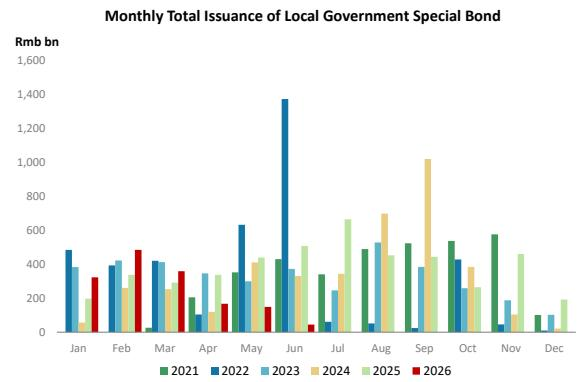

bar chart

Monthly Total Issuance of Local Government Special Bond
| Month | 2021 (Rmb bn) | 2022 (Rmb bn) | 2023 (Rmb bn) | 2024 (Rmb bn) | 2025 (Rmb bn) | 2026 (Rmb bn) |
|---|---|---|---|---|---|---|
| Jan | 380 | 490 | 380 | 60 | 380 | 320 |
| Feb | 330 | 400 | 420 | 250 | 330 | 490 |
| Mar | 10 | 420 | 420 | 270 | 290 | 370 |
| Apr | 210 | 130 | 340 | 130 | 340 | 170 |
| May | 360 | 640 | 310 | 410 | 440 | 150 |
| Jun | 410 | 1380 | 330 | 340 | 510 | 50 |
| Jul | 340 | 50 | 240 | 350 | 670 | 40 |
| Aug | 490 | 50 | 520 | 700 | 450 | 50 |
| Sep | 530 | 38 | 390 | 1030 | 440 | 50 |
| Oct | 550 | 430 | 260 | 390 | 270 | 50 |
| Nov | 580 | 190 | 180 | 90 | 460 | 50 |
| Dec | 110 | 110 | 110 | 110 | 210 | 50 |

LGSB Issuance: YTD 2026 vs. the Same Period in 2025 (By Province)

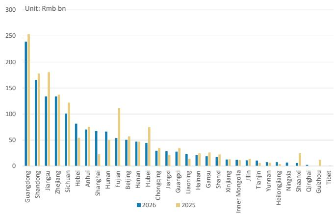

bar chart

| Region | 2026 (Rmb bn) | 2025 (Rmb bn) |
| :--- | :--- | :--- |
| Guangdong | 240 | 255 |
| Shandong | 165 | 178 |
| Jiangsu | 135 | 182 |
| Zhejiang | 135 | 139 |
| Sichuan | 102 | 125 |
| Hebei | 82 | 53 |
| Anhui | 73 | 74 |
| Shanghai | 66 | 21 |
| Hunan | 66 | 49 |
| Fujian | 52 | 110 |
| Beijing | 48 | 56 |
| Henan | 46 | 44 |
| Hubei | 44 | 74 |
| Chongqing | 30 | 33 |
| Jiangxi | 28 | 19 |
| Guangxi | 28 | 33 |
| Liaoning | 22 | 11 |
| Hainan | 23 | 25 |
| Gansu | 18 | 24 |
| Shanxi | 18 | 23 |
| Xinjiang | 13 | 10 |
| Inner Mongolia | 10 | 11 |
| Jilin | 10 | 7 |
| Tianjin | 9 | 6 |
| Yunnan | 6 | 6 |
| Heilongjiang | 5 | 4 |
| Ningxia | 6 | 3 |
| Shaanxi | 6 | 25 |
| Qinghai | 1 | 1 |
| Guizhou | 0 | 12 |
| Tibet | 0 | 0 |

Note: Others include bonds issued with a bundle of projects in different sectors. Source: NDRC, Wind, MS.

## Steel

## China Steel Supply/Demand Model

China Steel: Supply, Demand

<table><tr><td>(millions of tones)</td><td>2015</td><td>2016</td><td>2017</td><td>2018</td><td>2019</td><td>2020</td><td>2021</td><td>2022</td><td>2023</td><td>2024</td><td>2025</td><td>2026e</td><td>2027e</td><td>2028e</td><td>2029e</td><td>2030e</td></tr><tr><td colspan="17">Supply/Demand &amp; Pricing Model:</td></tr><tr><td>Crude Steel Production</td><td>821</td><td>825</td><td>832</td><td>928</td><td>993</td><td>1,065</td><td>1,033</td><td>1,013</td><td>1,020</td><td>1,005</td><td>990</td><td>982</td><td>970</td><td>964</td><td>958</td><td>951</td></tr><tr><td>YoY - %</td><td>-2.3%</td><td>0.4%</td><td>0.9%</td><td>11.5%</td><td>7.0%</td><td>7.3%</td><td>-3.0%</td><td>-1.9%</td><td>0.7%</td><td>-1.5%</td><td>-1.5%</td><td>-0.8%</td><td>-1.2%</td><td>-0.7%</td><td>-0.7%</td><td>-0.7%</td></tr><tr><td>EAF Produciton</td><td></td><td></td><td></td><td>99</td><td>103</td><td>98</td><td>109</td><td>98</td><td>98</td><td>94</td><td>100</td><td>102</td><td>124</td><td>137</td><td>139</td><td>141</td></tr><tr><td>EAF Produciton %</td><td></td><td></td><td></td><td>11%</td><td>10%</td><td>9%</td><td>11%</td><td>10%</td><td>10%</td><td>9%</td><td>10%</td><td>10%</td><td>13%</td><td>14%</td><td>14%</td><td>15%</td></tr><tr><td>Steel Exports</td><td>112</td><td>109</td><td>76</td><td>70</td><td>64</td><td>54</td><td>67</td><td>67</td><td>91</td><td>111</td><td>119</td><td>105</td><td>103</td><td>102</td><td>100</td><td>98</td></tr><tr><td>Steel Imports</td><td>13</td><td>13</td><td>13</td><td>13</td><td>12</td><td>20</td><td>14</td><td>11</td><td>8</td><td>7</td><td>6</td><td>6</td><td>6</td><td>6</td><td>6</td><td>6</td></tr><tr><td>Net Imports/(Exports)</td><td>-100</td><td>-96</td><td>-62</td><td>-56</td><td>-52</td><td>-33</td><td>-53</td><td>-57</td><td>-84</td><td>-123</td><td>-113</td><td>-99</td><td>-97</td><td>-95</td><td>-94</td><td>-92</td></tr><tr><td>YoY - %</td><td>25%</td><td>-4%</td><td>-35%</td><td>-10%</td><td>-8%</td><td>-36%</td><td>57%</td><td>8%</td><td>47%</td><td>47%</td><td>-8%</td><td>-12%</td><td>-2%</td><td>-2%</td><td>-2%</td><td>-2%</td></tr><tr><td>Est Mill + trader Inventory Incr/(Decr)</td><td>-3</td><td>1</td><td>-2</td><td>0</td><td>-1</td><td>1</td><td>2</td><td>3</td><td>0</td><td>-1</td><td>1</td><td>1</td><td></td><td></td><td></td><td></td></tr><tr><td>Appt Steel Consump (crude equiv)</td><td>704</td><td>724</td><td>769</td><td>869</td><td>940</td><td>1,029</td><td>976</td><td>951</td><td>934</td><td>918</td><td>895</td><td>878</td><td>869</td><td>865</td><td>860</td><td>856</td></tr><tr><td>YoY - %</td><td>-5.1%</td><td>3%</td><td>6%</td><td>13%</td><td>8%</td><td>9%</td><td>-5.2%</td><td>-2.5%</td><td>-1.8%</td><td>-1.8%</td><td>-2.5%</td><td>-1.9%</td><td>-1.0%</td><td>-0.5%</td><td>-0.5%</td><td>-0.5%</td></tr><tr><td>Appt Steel Cons (finished steel)</td><td>676</td><td>695</td><td>738</td><td>834</td><td>903</td><td>988</td><td>937</td><td>913</td><td>897</td><td>881</td><td>859</td><td>843</td><td>834</td><td>830</td><td>826</td><td>822</td></tr><tr><td>YoY - %</td><td>-5.1%</td><td>2.9%</td><td>6.2%</td><td>13.1%</td><td>8.2%</td><td>9.4%</td><td>-5.2%</td><td>-2.5%</td><td>-1.8%</td><td>-1.8%</td><td>-2.5%</td><td>-1.9%</td><td>-1.0%</td><td>-0.5%</td><td>-0.5%</td><td>-0.5%</td></tr><tr><td>EAF capacity addition</td><td></td><td></td><td>47</td><td>26</td><td>3</td><td>12</td><td>4</td><td>8</td><td>10</td><td>0</td><td>0</td><td>0</td><td>3</td><td>3</td><td>3</td><td>3</td></tr><tr><td>EAF capacity</td><td></td><td>94</td><td>141</td><td>167</td><td>170</td><td>182</td><td>186</td><td>194</td><td>204</td><td>204</td><td>204</td><td>204</td><td>207</td><td>210</td><td>213</td><td>216</td></tr><tr><td>EAF % of total capacity</td><td></td><td>9%</td><td>14%</td><td>15%</td><td>15%</td><td>15%</td><td>16%</td><td>16%</td><td>17%</td><td>17%</td><td>17%</td><td>17%</td><td>17%</td><td>18%</td><td>18%</td><td>18%</td></tr><tr><td>Crude Steel Capacity (EAF + BOF)</td><td>1,250</td><td>1,172</td><td>1,122</td><td>1,143</td><td>1,160</td><td>1,180</td><td>1,187</td><td>1,187</td><td>1,187</td><td>1,187</td><td>1,187</td><td>1,187</td><td>1,187</td><td>1,187</td><td>1,187</td><td>1,187</td></tr><tr><td>-- Net capacity addition /(reduction)</td><td>-50</td><td>-78</td><td>-50</td><td>-10</td><td>17</td><td>20</td><td>7</td><td>0</td><td>0</td><td>0</td><td>0</td><td>0</td><td>0</td><td>0</td><td>0</td><td>0</td></tr><tr><td>YoY - %</td><td>-4%</td><td>-6%</td><td>-4%</td><td>2%</td><td>1%</td><td>2%</td><td>1%</td><td>0</td><td>-3%</td><td>-2%</td><td>-2%</td><td>-3%</td><td>-2%</td><td>-1%</td><td>-1%</td><td>-1%</td></tr><tr><td>Output impacted by winter heating season production suspension</td><td></td><td></td><td>22</td><td>20</td><td>22</td><td>23</td><td>23</td><td>22</td><td>23</td><td>22</td><td>22</td><td>22</td><td>21</td><td>21</td><td>21</td><td>21</td></tr><tr><td>Avg. Utilization Rate - excl. IFF &amp; EAF</td><td>71%</td><td>75%</td><td>80%</td><td>86%</td><td>86%</td><td>91%</td><td>87%</td><td>85%</td><td>86%</td><td>85%</td><td>83%</td><td>83%</td><td>82%</td><td>81%</td><td>81%</td><td>80%</td></tr><tr><td>Avg. Utilization Rate - incl. EAF</td><td>64%</td><td>68%</td><td>78%</td><td>86%</td><td>86%</td><td>91%</td><td>87%</td><td>85%</td><td>86%</td><td>85%</td><td>83%</td><td>83%</td><td>82%</td><td>81%</td><td>81%</td><td>80%</td></tr><tr><td>Domestic Demand Utl. Rate</td><td>56%</td><td>62%</td><td>69%</td><td>76%</td><td>81%</td><td>87%</td><td>82%</td><td>80%</td><td>79%</td><td>77%</td><td>75%</td><td>74%</td><td>73%</td><td>73%</td><td>72%</td><td>72%</td></tr></table>

Source: CISA, MIIT, Mysteel, MS. e = MS estimates.

## Steel

## Inventory of Steel and Iron Ore

Flat Steel Inventory at Traders  
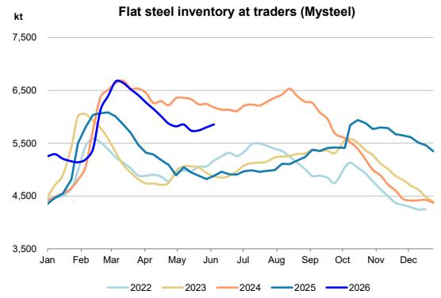

line chart

| Month | 2022  | 2023  | 2024  | 2025  | 2026  |
|-------|-------|-------|-------|-------|-------|
| Jan   | 4,500 | 4,500 | 4,500 | 4,500 | 4,500 |
| Feb   | 5,000 | 5,500 | 5,500 | 5,500 | 5,500 |
| Mar   | 5,500 | 6,000 | 6,500 | 6,000 | 6,500 |
| Apr   | 4,500 | 4,500 | 6,000 | 5,500 | 6,000 |
| May   | 4,500 | 4,500 | 5,500 | 5,000 | 5,500 |
| Jun   | 4,500 | 4,500 | 5,500 | 4,500 | 5,500 |
| Jul   | 4,500 | 4,500 | 5,500 | 4,500 | 5,500 |
| Aug   | 4,500 | 4,500 | 6,500 | 4,500 | 5,500 |
| Sep   | 4,500 | 4,500 | 6,500 | 4,500 | 5,500 |
| Oct   | 4,500 | 4,500 | 6,500 | 6,500 | 5,500 |
| Nov   | 4,500 | 4,500 | 6,500 | 6,500 | 5,500 |
| Dec   | 4,500 | 4,500 | 6,500 | 6,500 | 5,500 |

Long Steel Inventory at Traders  
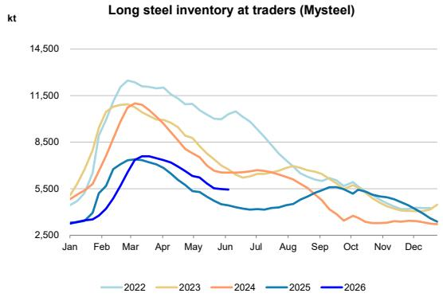

line chart

| Month | 2022  | 2023  | 2024  | 2025  | 2026  |
|-------|-------|-------|-------|-------|-------|
| Jan   | 4500  | 4800  | 4700  | 4600  | 3000  |
| Feb   | 11500 | 11000 | 11200 | 6500  | 3500  |
| Mar   | 13000 | 11500 | 11800 | 7500  | 7500  |
| Apr   | 12500 | 11000 | 11500 | 7000  | 7200  |
| May   | 11500 | 9500  | 9800  | 6500  | 6800  |
| Jun   | 11000 | 8500  | 8800  | 6000  | 6500  |
| Jul   | 10500 | 7500  | 8500  | 5500  | 6200  |
| Aug   | 9500  | 7800  | 8200  | 5800  | 6300  |
| Sep   | 8500  | 7500  | 7800  | 6200  | 6500  |
| Oct   | 7500  | 6500  | 6800  | 6800  | 6800  |
| Nov   | 6500  | 5500  | 6200  | 7200  | 7300  |
| Dec   | 5500  | 4500  | 5800  | 7500  | 7800  |

Total Steel Inventory (Mills + Traders)  
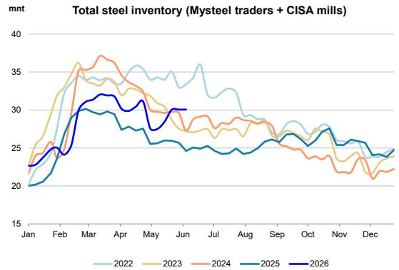

line chart

| Month | 2022 | 2023 | 2024 | 2025 | 2026 |
|-------|------|------|------|------|------|
| Jan   | 21   | 23   | 24   | 20   | 22   |
| Feb   | 30   | 35   | 36   | 25   | 28   |
| Mar   | 34   | 36   | 37   | 30   | 31   |
| Apr   | 35   | 34   | 35   | 29   | 30   |
| May   | 34   | 32   | 33   | 28   | 29   |
| Jun   | 35   | 31   | 31   | 27   | 30   |
| Jul   | 36   | 30   | 30   | 26   | 29   |
| Aug   | 34   | 29   | 29   | 25   | 28   |
| Sep   | 33   | 28   | 28   | 24   | 27   |
| Oct   | 32   | 27   | 27   | 23   | 26   |
| Nov   | 31   | 26   | 26   | 22   | 25   |
| Dec   | 30   | 25   | 25   | 21   | 24   |

Steel Inventory at Major Mills  
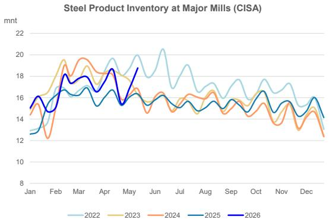

line chart

| Month | 2022 | 2023 | 2024 | 2025 | 2026 |
|-------|------|------|------|------|------|
| Jan   | 13.0 | 14.5 | 15.0 | 13.5 | 15.5 |
| Feb   | 16.0 | 19.0 | 18.0 | 16.5 | 18.5 |
| Mar   | 17.0 | 18.5 | 19.5 | 17.0 | 18.0 |
| Apr   | 18.0 | 17.5 | 18.5 | 16.5 | 18.5 |
| May   | 19.0 | 17.0 | 17.5 | 16.0 | 18.0 |
| Jun   | 20.5 | 16.5 | 16.0 | 15.5 | 17.5 |
| Jul   | 19.0 | 16.0 | 15.5 | 15.0 | 17.0 |
| Aug   | 17.5 | 15.5 | 15.0 | 14.5 | 16.5 |
| Sep   | 17.0 | 15.0 | 14.5 | 14.0 | 16.0 |
| Oct   | 16.5 | 14.5 | 14.0 | 13.5 | 15.5 |
| Nov   | 16.0 | 14.0 | 13.5 | 13.0 | 15.0 |
| Dec   | 15.5 | 13.5 | 13.0 | 12.5 | 14.5 |

Iron Ore Inventory at Mills  
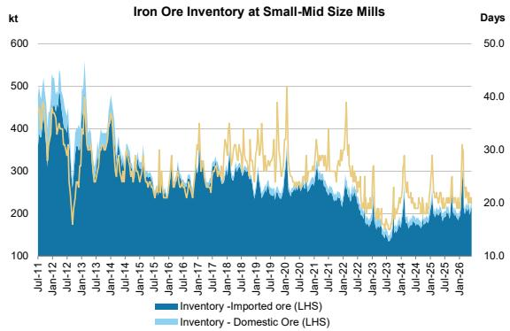

line chart

| Date   | Inventory - Imported ore (LHS) (kt) | Inventory - Domestic Ore (LHS) (kt) |
|--------|--------------------------------------|-------------------------------------|
| Jul-11 | ~450                                 | ~480                                |
| Jan-12 | ~400                                 | ~500                                |
| Jul-12 | ~350                                 | ~550                                |
| Jan-13 | ~300                                 | ~450                                |
| Jul-13 | ~250                                 | ~400                                |
| Jan-14 | ~200                                 | ~350                                |
| Jul-14 | ~180                                 | ~300                                |
| Jan-15 | ~170                                 | ~280                                |
| Jul-15 | ~160                                 | ~260                                |
| Jan-16 | ~150                                 | ~240                                |
| Jul-16 | ~140                                 | ~220                                |
| Jan-17 | ~130                                 | ~200                                |
| Jul-17 | ~120                                 | ~180                                |
| Jan-18 | ~110                                 | ~160                                |
| Jul-18 | ~100                                 | ~140                                |
| Jan-19 | ~90                                  | ~120                                |
| Jul-19 | ~80                                  | ~100                                |
| Jan-20 | ~70                                  | ~80                                 |
| Jul-20 | ~60                                  | ~60                                 |
| Jan-21 | ~50                                  | ~40                                 |
| Jul-21 | ~40                                  | ~30                                 |
| Jan-22 | ~30                                  | ~20                                 |
| Jul-22 | ~20                                  | ~15                                 |
| Jan-23 | ~15                                  | ~10                                 |
| Jul-23 | ~10                                  | ~8                                  |
| Jan-24 | ~8                                   | ~6                                  |
| Jul-24 | ~6                                   | ~4                                  |
| Jan-25 | ~4                                   | ~2                                  |
| Jul-25 | ~2                                   | ~1                                  |
| Jan-26 | ~1                                   | ~0.5                                |

Iron Ore Inventory at Ports  
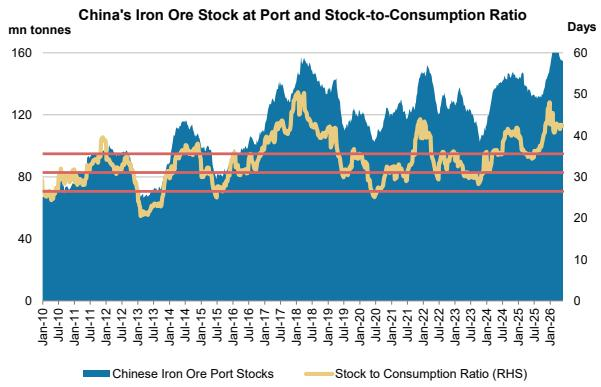

line chart

| Date    | Chinese Iron Ore Port Stocks (mn tonnes) | Stock to Consumption Ratio (Days) |
|---------|------------------------------------------|------------------------------------|
| Jan-10  | ~70                                      | ~30                                |
| Jul-11  | ~75                                      | ~30                                |
| Jan-12  | ~80                                      | ~30                                |
| Jul-13  | ~70                                      | ~30                                |
| Jan-14  | ~85                                      | ~30                                |
| Jul-15  | ~90                                      | ~30                                |
| Jan-16  | ~85                                      | ~30                                |
| Jul-17  | ~95                                      | ~30                                |
| Jan-18  | ~100                                     | ~30                                |
| Jul-19  | ~110                                     | ~30                                |
| Jan-20  | ~105                                     | ~30                                |
| Jul-21  | ~115                                     | ~30                                |
| Jan-22  | ~120                                     | ~30                                |
| Jul-23  | ~115                                     | ~30                                |
| Jan-24  | ~125                                     | ~30                                |
| Jul-25  | ~130                                     | ~30                                |
| Jan-26  | ~160                                     | ~40                                |

Source: MySteel, CISA, MS.

## Steel

## Utilization & Exports

Nationwide BF Capacity Utilization Rate  
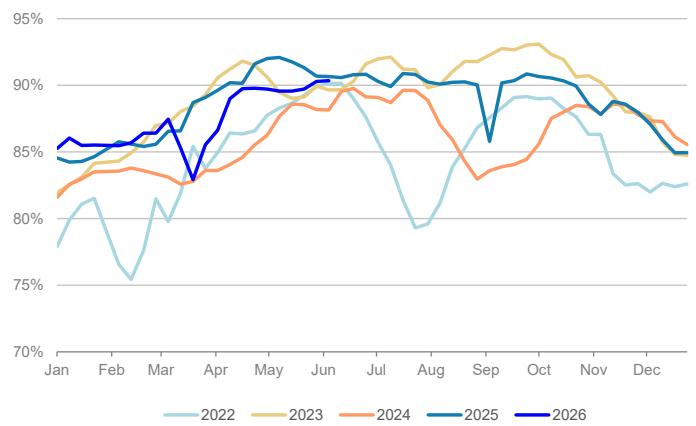

line chart

| Month | 2022  | 2023  | 2024  | 2025  | 2026  |
|-------|-------|-------|-------|-------|-------|
| Jan   | 78%   | 85%   | 81%   | 84%   | 86%   |
| Feb   | 75%   | 84%   | 83%   | 85%   | 85%   |
| Mar   | 80%   | 86%   | 83%   | 86%   | 87%   |
| Apr   | 85%   | 90%   | 84%   | 89%   | 89%   |
| May   | 87%   | 92%   | 87%   | 91%   | 90%   |
| Jun   | 89%   | 91%   | 89%   | 90%   | 90%   |
| Jul   | 85%   | 91%   | 89%   | 90%   | 90%   |
| Aug   | 79%   | 91%   | 87%   | 90%   | 86%   |
| Sep   | 85%   | 92%   | 83%   | 90%   | 86%   |
| Oct   | 89%   | 93%   | 85%   | 91%   | 88%   |
| Nov   | 87%   | 91%   | 87%   | 89%   | 87%   |
| Dec   | 83%   | 87%   | 85%   | 85%   | 85%   |

EAF Capacity Utilization Rate

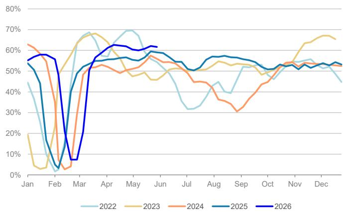

line chart

| Month | 2022 | 2023 | 2024 | 2025 | 2026 |
|-------|------|------|------|------|------|
| Jan   | 45%  | 18%  | 62%  | 55%  | 57%  |
| Feb   | 5%   | 5%   | 5%   | 5%   | 57%  |
| Mar   | 68%  | 68%  | 50%  | 55%  | 5%   |
| Apr   | 70%  | 65%  | 55%  | 57%  | 60%  |
| May   | 70%  | 50%  | 58%  | 58%  | 60%  |
| Jun   | 55%  | 45%  | 55%  | 60%  | 61%  |
| Jul   | 30%  | 45%  | 45%  | 50%  | -    |
| Aug   | 45%  | 50%  | 40%  | 55%  | -    |
| Sep   | 50%  | 50%  | 30%  | 55%  | -    |
| Oct   | 50%  | 48%  | 45%  | 52%  | -    |
| Nov   | 55%  | 60%  | 50%  | 53%  | -    |
| Dec   | 45%  | 68%  | 52%  | 53%  | -    |

Source: Mysteel, Bloomberg, MS estimates.

Rmb/t  
MS estimated GP/t for Mills (Spot)  
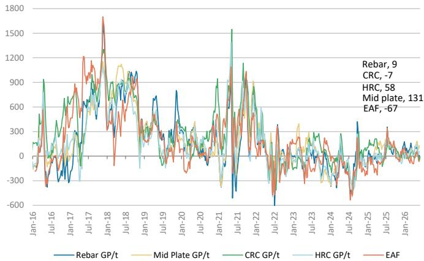

line chart

| Date   | Rebar GP/t | Mid Plate GP/t | CRC GP/t | HRC GP/t | EAF |
|--------|------------|----------------|----------|----------|-----|
| Jan-16 | -          | -              | -        | -        | -   |
| Jul-16 | -          | -              | -        | -        | -   |
| Jan-17 | -          | -              | -        | -        | -   |
| Jul-17 | -          | -              | -        | -        | -   |
| Jan-18 | -          | -              | -        | -        | -   |
| Jul-18 | -          | -              | -        | -        | -   |
| Jan-19 | -          | -              | -        | -        | -   |
| Jul-19 | -          | -              | -        | -        | -   |
| Jan-20 | -          | -              | -        | -        | -   |
| Jul-20 | -          | -              | -        | -        | -   |
| Jan-21 | -          | -              | -        | -        | -   |
| Jul-21 | -          | -              | -        | -        | -   |
| Jan-22 | -          | -              | -        | -        | -   |
| Jul-22 | -          | -              | -        | -        | -   |
| Jan-23 | -          | -              | -        | -        | -   |
| Jul-23 | -          | -              | -        | -        | -   |
| Jan-24 | -          | -              | -        | -        | -   |
| Jul-24 | -          | -              | -        | -        | -   |
| Jan-25 | -          | -              | -        | -        | -   |
| Jul-25 | -          | -              | -        | -        | -   |
| Jan-26 | -          | -              | -        | -        | -   |
| Rebar  | 9          | -7             | CRC      | 58       | 131 |
| Mid    | 131        | 131            | Mid      | 131      | 131 |
| EAF    | 67         | 67             | EAF      | 67       | 67  |

Steel exports by destination (2026 YTD)  
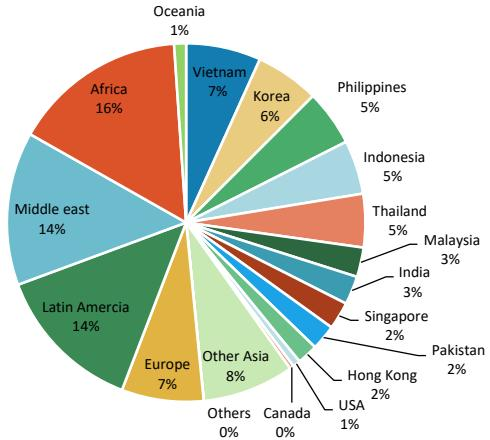

pie chart

| Region | Percentage (%) |
| :--- | :--- |
| Oceania | 1 |
| Vietnam | 7 |
| Korea | 6 |
| Philippines | 5 |
| Indonesia | 5 |
| Thailand | 5 |
| Malaysia | 3 |
| India | 3 |
| Singapore | 2 |
| Pakistan | 2 |
| Hong Kong | 2 |
| USA | 1 |
| Canada | 0 |
| Other Asia | 8 |
| Europe | 7 |
| Latin America | 14 |
| Middle east | 14 |
| Africa | 16 |

## Steel

## Exports by Destination

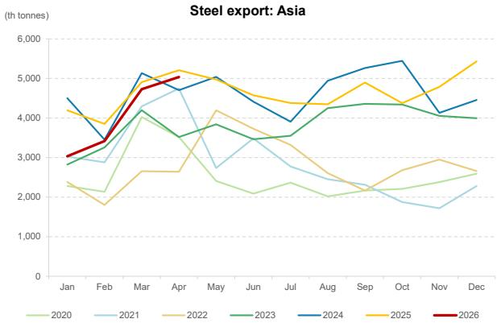

line chart

| Month | 2020 | 2021 | 2022 | 2023 | 2024 | 2025 | 2026 |
|-------|------|------|------|------|------|------|------|
| Jan   | 2800 | 3000 | 2400 | 2900 | 4500 | 4100 | 3100 |
| Feb   | 3500 | 3500 | 1800 | 3500 | 3800 | 3800 | 3500 |
| Mar   | 4100 | 4500 | 2700 | 4200 | 5100 | 5100 | 4800 |
| Apr   | 3800 | 4800 | 2700 | 3600 | 5000 | 5200 | 5100 |
| May   | 2500 | 2800 | 4200 | 3800 | 5100 | 5100 | 5100 |
| Jun   | 2100 | 3500 | 3500 | 3600 | 4500 | 4500 | 4500 |
| Jul   | 2300 | 3800 | 3300 | 3700 | 4400 | 4400 | 4400 |
| Aug   | 2100 | 3500 | 2800 | 4200 | 5100 | 4400 | 4400 |
| Sep   | 2200 | 3300 | 2500 | 4300 | 5300 | 4900 | 4400 |
| Oct   | 2300 | 1900 | 2700 | 4300 | 5500 | 4400 | 4800 |
| Nov   | 2600 | 1700 | 3100 | 4100 | 4100 | 4800 | 4800 |
| Dec   | 2700 | 2300 | 2700 | 4100 | 4500 | 5500 | 5500 |

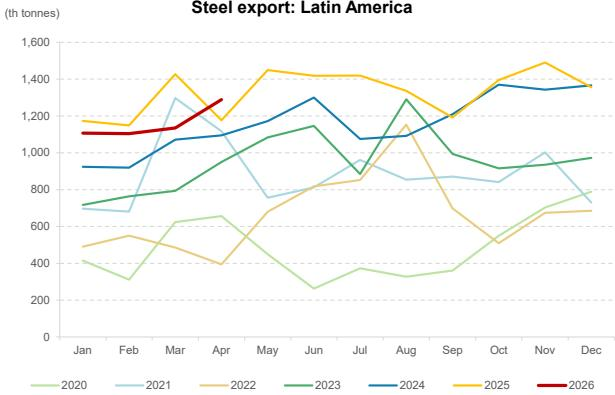

line chart

| Month | 2020 | 2021 | 2022 | 2023 | 2024 | 2025 | 2026 |
|-------|------|------|------|------|------|------|------|
| Jan   | 400  | 700  | 500  | 700  | 900  | 1150 | 1100 |
| Feb   | 300  | 650  | 550  | 750  | 900  | 1150 | 1150 |
| Mar   | 600  | 1300 | 500  | 800  | 1100 | 1450 | 1150 |
| Apr   | 650  | 1100 | 400  | 950  | 1150 | 1350 | 1300 |
| May   | 450  | 750  | 650  | 1100 | 1250 | 1450 | -    |
| Jun   | 250  | 850  | 800  | 1150 | 1350 | 1450 | -    |
| Jul   | 350  | 950  | 850  | 1150 | 1150 | 1450 | -    |
| Aug   | 300  | 850  | 1150 | 1350 | -    | 1450 | -    |
| Sep   | 350  | -    | -    | -    | -    | -    | -    |
| Oct   | -    | -    | -    | -    | -    | -    | -    |
| Nov   | -    | -    | -    | -    | -    | -    | -    |
| Dec   | -    | -    | -    | -    | -    | -    | -    |

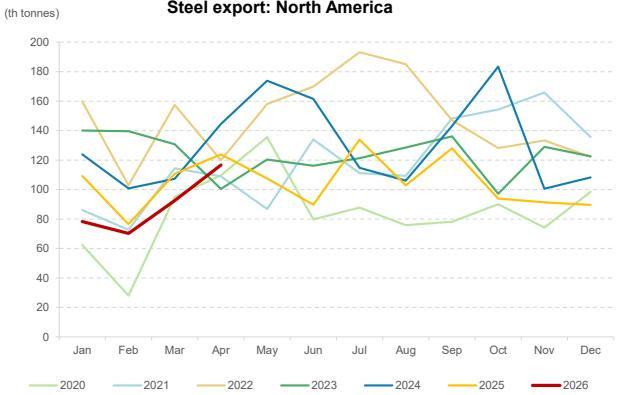

line chart

| Month | 2020 | 2021 | 2022 | 2023 | 2024 | 2025 | 2026 |
|-------|------|------|------|------|------|------|------|
| Jan   | 60   | 85   | 160  | 140  | 125  | 110  | 80   |
| Feb   | 30   | 75   | 100  | 140  | 105  | 85   | 70   |
| Mar   | 110  | 110  | 160  | 130  | 115  | 105  | 95   |
| Apr   | 135  | 105  | 140  | 120  | 175  | 125  | 115  |
| May   | 130  | 85   | 160  | 125  | 170  | 120  | 120  |
| Jun   | 80   | 135  | 170  | 120  | 165  | 90   | 125  |
| Jul   | 85   | 115  | 195  | 135  | 130  | 135  | 130  |
| Aug   | 75   | 110  | 185  | 130  | 105  | 105  | 120  |
| Sep   | 80   | 140  | 155  | 135  | 145  | 130  | 135  |
| Oct   | 90   | 160  | 130  | 95   | 185  | 95   | 95   |
| Nov   | 75   | 165  | 135  | 130  | 100  | 90   | 90   |
| Dec   | 95   | 135  | -    | -    | -    | -    | -    |

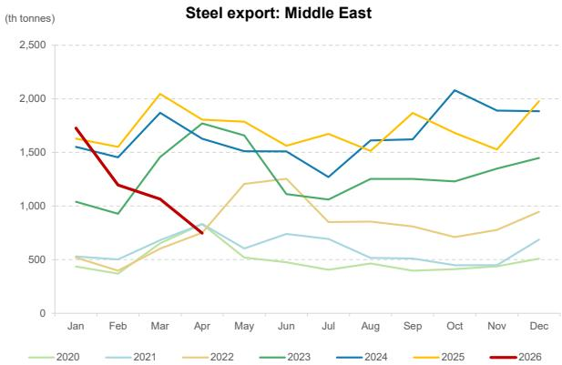

line chart

| Month | 2020 | 2021 | 2022 | 2023 | 2024 | 2025 | 2026 |
|-------|------|------|------|------|------|------|------|
| Jan   | 500  | 550  | 500  | 1050 | 1600 | 1650 | 1750 |
| Feb   | 450  | 500  | 400  | 950  | 1550 | 1600 | 1250 |
| Mar   | 600  | 650  | 550  | 1450 | 1850 | 2050 | 1100 |
| Apr   | 700  | 750  | 700  | 1750 | 1750 | 1800 | 800  |
| May   | 650  | 600  | 850  | 1650 | 1750 | 1800 | -    |
| Jun   | 750  | 750  | 1250 | 1150 | 1750 | 1650 | -    |
| Jul   | 650  | 700  | 850  | 1100 | 1300 | 1750 | -    |
| Aug   | 600  | 650  | 850  | 1250 | 1650 | 1650 | -    |
| Sep   | 550  | 600  | 850  | 1250 | 1650 | 1900 | -    |
| Oct   | 450  | 550  | 750  | 1250 | 2100 | 1750 | -    |
| Nov   | 450  | 650  | 850  | 1450 | 1950 | 1650 | -    |
| Dec   | 500  | 750  | 950  | 1450 | 1950 | 2000 | -    |

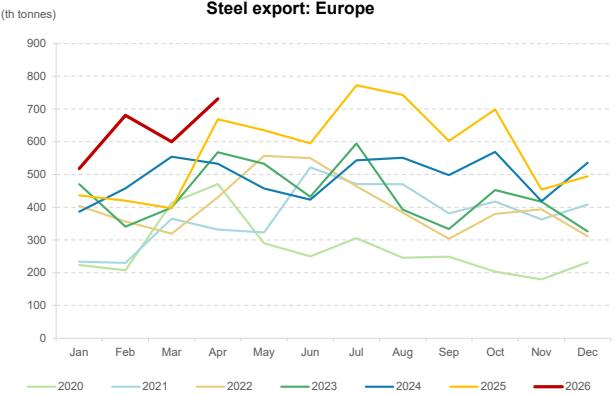

line chart

| Month | 2020 | 2021 | 2022 | 2023 | 2024 | 2025 | 2026 |
|-------|------|------|------|------|------|------|------|
| Jan   | 230  | 230  | 480  | 480  | 480  | 480  | 500  |
| Feb   | 210  | 210  | 350  | 350  | 450  | 450  | 680  |
| Mar   | 350  | 350  | 400  | 400  | 550  | 400  | 600  |
| Apr   | 450  | 350  | 550  | 550  | 550  | 670  | 730  |
| May   | 300  | 350  | 550  | 550  | 450  | 650  | -    |
| Jun   | 250  | 450  | 550  | 450  | 450  | 600  | -    |
| Jul   | 300  | 450  | 450  | 600  | 550  | 770  | -    |
| Aug   | 250  | 450  | 450  | 450  | 550  | 750  | -    |
| Sep   | 250  | 450  | 350  | 350  | 500  | 650  | -    |
| Oct   | 250  | 450  | 375  | 450  | 575  | 700  | -    |
| Nov   | 175  | 375  | 375  | 450  | -    | -    | -    |
| Dec   | -    | -    | -    | -    | -    | -    | -    |

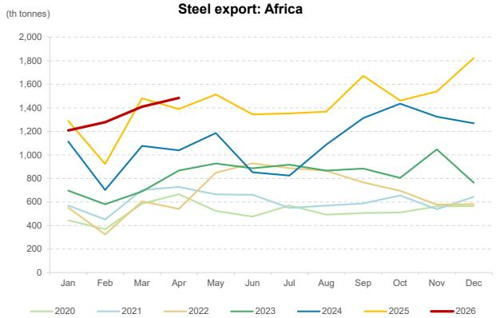

line chart

| Month | 2020 | 2021 | 2022 | 2023 | 2024 | 2025 | 2026 |
|-------|------|------|------|------|------|------|------|
| Jan   | 450  | 550  | 580  | 700  | 1150 | 1300 | 1250 |
| Feb   | 350  | 450  | 350  | 650  | 750  | 950  | 1300 |
| Mar   | 600  | 650  | 600  | 750  | 1100 | 1500 | 1450 |
| Apr   | 700  | 750  | 550  | 850  | 1150 | 1450 | 1500 |
| May   | 650  | 700  | 950  | 900  | 1250 | 1550 | -    |
| Jun   | 550  | 650  | 900  | 950  | 950  | 1350 | -    |
| Jul   | 600  | 600  | 850  | 950  | 850  | 1350 | -    |
| Aug   | 550  | 650  | 850  | 950  | 1100 | -    | -    |
| Sep   | 600  | 700  | 850  | -    | 1350 | 1700 | -    |
| Oct   | 650  | 750  | -    | -    | -    | -    | -    |
| Nov   | 700  | -    | -    | -    | -    | -    | -    |
| Dec   | -    | -    | -    | -    | -    | -    | -    |

Source: NBS, CEIC, MS.

## Cement

## ASP and GP/t Have Seen Sequential Weakening Recently

China Cement Prices Have Trended Down Since April  
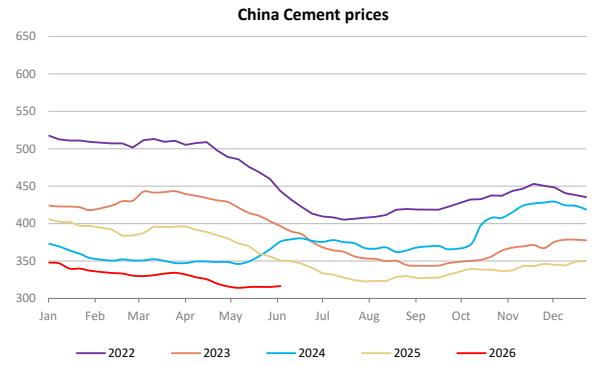

line chart

| Month | 2022 | 2023 | 2024 | 2025 | 2026 |
|-------|------|------|------|------|------|
| Jan   | 510  | 420  | 370  | 400  | 350  |
| Feb   | 505  | 415  | 360  | 395  | 345  |
| Mar   | 510  | 430  | 355  | 390  | 340  |
| Apr   | 505  | 440  | 355  | 385  | 335  |
| May   | 490  | 430  | 355  | 380  | 330  |
| Jun   | 450  | 410  | 360  | 370  | 325  |
| Jul   | 410  | 380  | 370  | 360  | 320  |
| Aug   | 415  | 360  | 365  | 355  | 325  |
| Sep   | 420  | 350  | 370  | 350  | 330  |
| Oct   | 430  | 360  | 380  | 355  | 340  |
| Nov   | 440  | 370  | 410  | 360  | 350  |
| Dec   | 435  | 375  | 420  | 365  | 355  |

GP/t Slippage Continued  
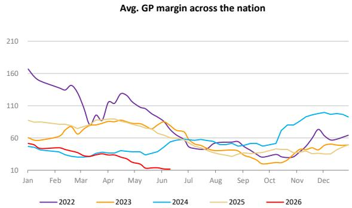

line chart

| Month | 2022 | 2023 | 2024 | 2025 | 2026 |
|-------|------|------|------|------|------|
| Jan   | 160  | 60   | 55   | 70   | 55   |
| Feb   | 155  | 65   | 50   | 68   | 53   |
| Mar   | 150  | 70   | 45   | 65   | 50   |
| Apr   | 110  | 75   | 50   | 60   | 48   |
| May   | 115  | 78   | 55   | 58   | 45   |
| Jun   | 105  | 70   | 60   | 55   | 40   |
| Jul   | 90   | 65   | 65   | 58   | 40   |
| Aug   | 80   | 60   | 70   | 60   | 40   |
| Sep   | 75   | 55   | 75   | 62   | 40   |
| Oct   | 70   | 50   | 80   | 65   | 40   |
| Nov   | 65   | 45   | 85   | 70   | 40   |
| Dec   | 60   | 40   | 90   | 75   | 40   |

Source: Digital Cement, MS.

Cement Industry GP/t Has Decreased  
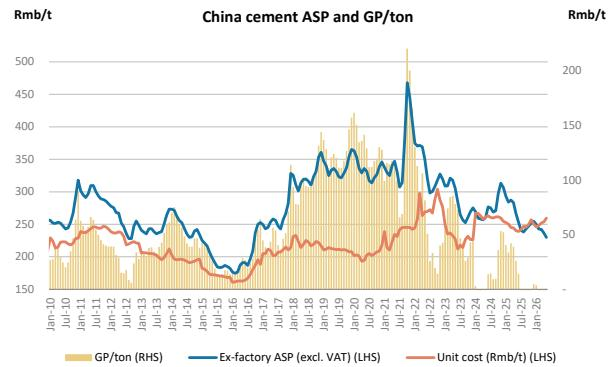

line chart

| Date   | GP/ton (RHS) | Ex-factory ASP (excl. VAT) (LHS) | Unit cost (Rmb/t) (LHS) |
|--------|--------------|----------------------------------|--------------------------|
| Jan-10 | 250          | 250                              | 50                       |
| Jul-11 | 300          | 300                              | 50                       |
| Jan-12 | 250          | 250                              | 50                       |
| Jul-13 | 275          | 275                              | 50                       |
| Jan-14 | 250          | 250                              | 50                       |
| Jul-15 | 200          | 200                              | 50                       |
| Jan-16 | 175          | 175                              | 50                       |
| Jul-17 | 200          | 200                              | 50                       |
| Jan-18 | 250          | 250                              | 50                       |
| Jul-19 | 350          | 350                              | 50                       |
| Jan-20 | 400          | 400                              | 50                       |
| Jul-21 | 350          | 350                              | 50                       |
| Jan-22 | 500          | 500                              | 100                      |
| Jul-23 | 350          | 350                              | 50                       |
| Jan-24 | 300          | 300                              | 50                       |
| Jul-25 | 250          | 250                              | 50                       |
| Jan-26 | 250          | 250                              | 50                       |

Cement Inventory Increased YTD  
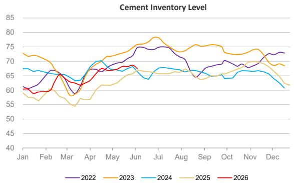

line chart

| Month | 2022 | 2023 | 2024 | 2025 | 2026 |
|-------|------|------|------|------|------|
| Jan   | 61   | 73   | 68   | 60   | 61   |
| Feb   | 63   | 71   | 67   | 58   | 60   |
| Mar   | 65   | 60   | 65   | 55   | 65   |
| Apr   | 67   | 68   | 70   | 57   | 68   |
| May   | 69   | 71   | 69   | 60   | 69   |
| Jun   | 71   | 74   | 68   | 63   | 70   |
| Jul   | 73   | 78   | 67   | 65   | 72   |
| Aug   | 71   | 75   | 66   | 64   | 71   |
| Sep   | 69   | 74   | 65   | 63   | 69   |
| Oct   | 70   | 73   | 64   | 64   | 68   |
| Nov   | 71   | 74   | 65   | 65   | 69   |
| Dec   | 73   | 69   | 61   | 60   | 68   |

## Copper

China Power Grid Investment  
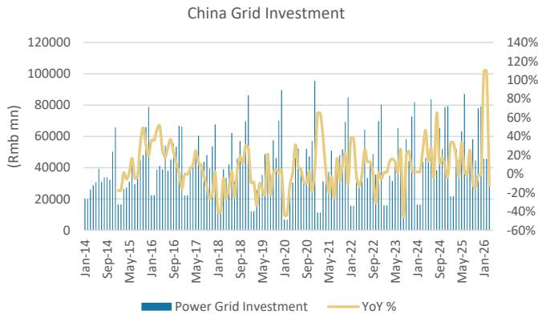

line and bar chart

| Date    | Power Grid Investment (Rmb mn) | YoY % |
|---------|----------------------------------|-------|
| Jan-14  | ~20000                           | -     |
| Sep-14  | ~30000                           | -     |
| May-15  | ~65000                           | ~20%  |
| Jan-16  | ~80000                           | ~60%  |
| Sep-16  | ~70000                           | ~40%  |
| May-17  | ~65000                           | ~20%  |
| Jan-18  | ~70000                           | ~30%  |
| Sep-18  | ~85000                           | ~50%  |
| May-19  | ~70000                           | ~30%  |
| Jan-20  | ~90000                           | ~70%  |
| Sep-20  | ~95000                           | ~60%  |
| May-21  | ~50000                           | ~-40% |
| Jan-22  | ~65000                           | ~40%  |
| Sep-22  | ~75000                           | ~30%  |
| May-23  | ~85000                           | ~50%  |
| Jan-24  | ~85000                           | ~60%  |
| Sep-24  | ~85000                           | ~70%  |
| May-25  | ~95000                           | ~40%  |
| Jan-26  | ~115000                          | ~115% |

State Grid Transformer Tendering Capacity  
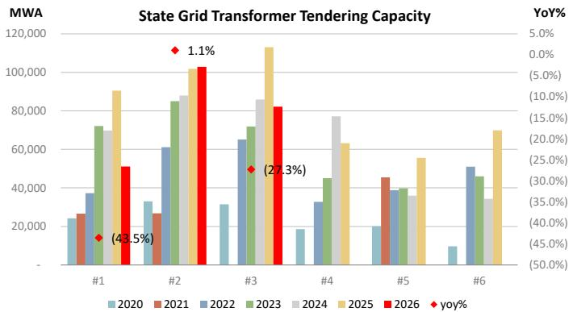

bar chart

| Category | 2020   | 2021   | 2022   | 2023   | 2024   | 2025   | 2026   | YoY%    |
| -------- | ------ | ------ | ------ | ------ | ------ | ------ | ------ | ------- |
| #1       |        |        | 38,000 | 72,000 | 70,000 | 90,000 | 50,000 | (43.5%) |
| #2       |        |        | 60,000 | 85,000 | 88,000 | 102,000| 105,000| 1.1%    |
| #3       |        |        | 65,000 | 72,000 | 85,000 | 112,000| 82,000 | (27.3%) |
| #4       |        |        | 33,000 | 45,000 | 78,000 | 63,000 |        |         |
| #5       |        |        |        | 38,000 | 36,000 | 56,000 |        |         |
| #6       |        |        |        | 45,000 | 34,000 | 70,000 |        |         |

Apparent Copper Inventory  
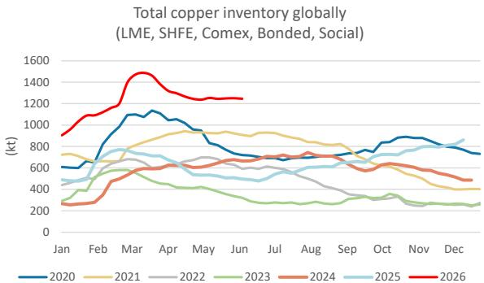

line chart

| Month | 2020 | 2021 | 2022 | 2023 | 2024 | 2025 | 2026 |
|-------|------|------|------|------|------|------|------|
| Jan   | 600  | 700  | 500  | 300  | 250  | 400  | 900  |
| Feb   | 800  | 750  | 550  | 400  | 300  | 500  | 1000 |
| Mar   | 1100 | 800  | 600  | 500  | 400  | 600  | 1500 |
| Apr   | 1150 | 850  | 650  | 550  | 450  | 650  | 1400 |
| May   | 1100 | 900  | 700  | 600  | 500  | 700  | 1350 |
| Jun   | 950  | 950  | 750  | 650  | 550  | 750  | 1350 |
| Jul   | 900  | 950  | 750  | 650  | 600  | 750  | 1350 |
| Aug   | 850  | 950  | 750  | 650  | 650  | 750  | 1350 |
| Sep   | 800  | 950  | 750  | 650  | 700  | 750  | 1350 |
| Oct   | 850  | 950  | 750  | 650  | 750  | 750  | 1350 |
| Nov   | 850  | 950  | 750  | 650  | 750  | 750  | 1350 |
| Dec   | 850  | 950  | 750  | 650  | 750  | 750  | 1350 |

Copper TCRC  
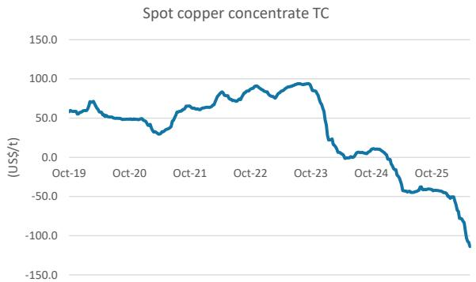

line chart

| Date   | Price (US$/t) |
|--------|---------------|
| Oct-19 | ~60.0         |
| Oct-20 | ~50.0         |
| Oct-21 | ~70.0         |
| Oct-22 | ~90.0         |
| Oct-23 | ~100.0        |
| Oct-24 | ~10.0         |
| Oct-25 | ~-100.0       |

Source: Mysteel, CEIC, State Grid Corporation of China, MS estimates.

## Copper

Smelting Profitability on Spot Concentrate Price  
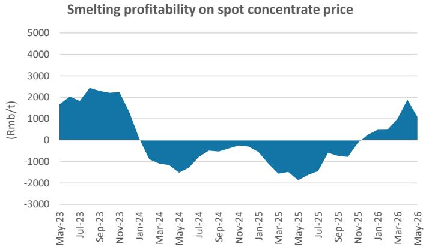

area chart

| Month    | Profit (Rmb/t) |
| -------- | -------------- |
| May-23   | 1800           |
| Jul-23   | 2400           |
| Sep-23   | 2200           |
| Nov-23   | 2100           |
| Jan-24   | -1000          |
| Mar-24   | -1500          |
| May-24   | -1800          |
| Jul-24   | -500           |
| Sep-24   | -300           |
| Nov-24   | -100           |
| Jan-25   | -1500          |
| Mar-25   | -1800          |
| May-25   | -2000          |
| Jul-25   | -1500          |
| Sep-25   | -800           |
| Nov-25   | -500           |
| Jan-26   | 500            |
| Mar-26   | 1800           |
| May-26   | 1000           |

Smelting Profitability on LT Contracted Concentrate Price  
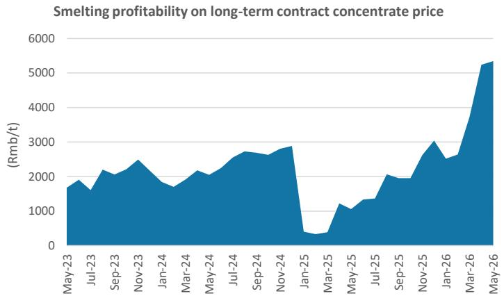

line chart

| Month    | Value (Rmb/t) |
| -------- | ------------- |
| May-23   | ~1800         |
| Jul-23   | ~2200         |
| Sep-23   | ~2400         |
| Nov-23   | ~2600         |
| Jan-24   | ~1800         |
| Mar-24   | ~2000         |
| May-24   | ~2200         |
| Jul-24   | ~2600         |
| Sep-24   | ~2700         |
| Nov-24   | ~2900         |
| Jan-25   | ~400          |
| Mar-25   | ~1000         |
| May-25   | ~1300         |
| Jul-25   | ~1500         |
| Sep-25   | ~2000         |
| Nov-25   | ~3000         |
| Jan-26   | ~2500         |
| Mar-26   | ~3500         |
| May-26   | ~5300         |

2014-2026 State Grid Transformer Equipment Tendering

<table><tr><td>Product</td><td>2014</td><td>2015</td><td>2016</td><td>2017</td><td>2018</td><td>2019</td><td>2020</td><td>2021</td><td>2022</td><td>2023</td><td>2024</td><td>2025</td><td>2026YTD</td><td>YoY</td></tr><tr><td>Transformer (MVA)</td><td>257,507</td><td>285,286</td><td>245,598</td><td>215,973</td><td>238,914</td><td>142,083</td><td>137,118</td><td>101,792</td><td>286,144</td><td>359,771</td><td>390,992</td><td>494,041</td><td>236,129</td><td>23%</td></tr><tr><td>Electric Reactor</td><td>1,362</td><td>1,282</td><td>1,391</td><td>1,085</td><td>1,379</td><td>1,374</td><td>1,326</td><td>1,288</td><td>1,503</td><td>1,971</td><td>2,276</td><td>2,831</td><td>1,463</td><td>-14%</td></tr><tr><td>Instrument Transformer</td><td>28,053</td><td>37,468</td><td>27,491</td><td>21,551</td><td>24,678</td><td>9,903</td><td>17,951</td><td>17,264</td><td>20,684</td><td>28,820</td><td>34,187</td><td>40,476</td><td>26,185</td><td>-5%</td></tr><tr><td>Capacitor</td><td>11,004</td><td>25,317</td><td>13,815</td><td>16,317</td><td>20,552</td><td>6,607</td><td>11,828</td><td>3,775</td><td>4,500</td><td>5,251</td><td>5,865</td><td>6,919</td><td>4,623</td><td>5%</td></tr><tr><td>Composite Apparatus</td><td>8,428</td><td>8,187</td><td>7,393</td><td>7,534</td><td>7,461</td><td>4,217</td><td>12,398</td><td>9,554</td><td>11,291</td><td>21,695</td><td>14,945</td><td>17,096</td><td>8,364</td><td>-8%</td></tr><tr><td>Circuit Breaker</td><td>8,267</td><td>10,089</td><td>6,956</td><td>5,454</td><td>6,583</td><td>1,695</td><td>4,081</td><td>3,018</td><td>3,610</td><td>4,768</td><td>6,268</td><td>5,604</td><td>4,016</td><td>7%</td></tr><tr><td>Isolation Switch</td><td>24,600</td><td>28,948</td><td>17,453</td><td>13,681</td><td>17,446</td><td>4,785</td><td>11,920</td><td>10,184</td><td>11,013</td><td>13,383</td><td>15,861</td><td>18,005</td><td>11,443</td><td>-6%</td></tr><tr><td>Petersen Coil</td><td>4,066</td><td>5,430</td><td>5,647</td><td>2,813</td><td>3,402</td><td>604</td><td>1,941</td><td>1,437</td><td>2,130</td><td>2,068</td><td>2,148</td><td>2,608</td><td>1,910</td><td>9%</td></tr><tr><td>Switchgear</td><td>45,759</td><td>57,796</td><td>38,468</td><td>40,060</td><td>38,359</td><td>6,350</td><td>54,639</td><td>44,385</td><td>48,384</td><td>58,260</td><td>66,805</td><td>79,920</td><td>53,272</td><td>3%</td></tr><tr><td>Protection Equipment</td><td>17,679</td><td>17,114</td><td>14,964</td><td>14,493</td><td>19,165</td><td>25,141</td><td>20,070</td><td>18,814</td><td>18,383</td><td>22,820</td><td>27,161</td><td>38,247</td><td>22,276</td><td>-11%</td></tr><tr><td>Substation Monitoring Equipment</td><td>1,891</td><td>2,706</td><td>1,697</td><td>1,826</td><td>1,813</td><td>1,721</td><td>701</td><td>1,426</td><td>1,470</td><td>1,565</td><td>1,836</td><td>2,387</td><td>1,929</td><td>15%</td></tr></table>

Source: SMM, State Grid Corporation of China, MS.

## Aluminum

Aluminum Capacity in 2026  
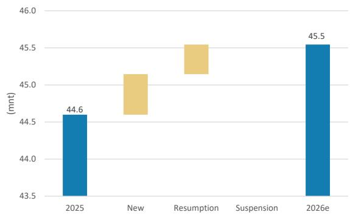

bar chart

| Category | Value (mnt) |
|---|---|
| 2025 | 44.6 |
| New | 45.1 |
| Resumption | 45.5 |
| 2026e | 45.5 |

Expected New Aluminum Capacity in 2026

<table><tr><td>Province</td><td>Company</td><td>Capacities Planned (mnt)</td><td>Able to commence within the year</td><td>Already commenced (mnt)</td><td>Remaining to start within the year (mnt)</td></tr><tr><td>Xinjiang</td><td>Xinjiang Nonliushi Aluminum</td><td>0.28</td><td>0.28</td><td>-</td><td>0.28</td></tr><tr><td>Xinjiang</td><td>Xinjiang Huazhang Aluminum</td><td>0.20</td><td>0.44</td><td>-</td><td>0.44</td></tr><tr><td>Xinjiang</td><td>Xinjiang East Hope</td><td>0.16</td><td>0.16</td><td>-</td><td>0.16</td></tr><tr><td>Xinjiang</td><td>Xinjiang Qiya Aluminum</td><td>0.21</td><td>0.21</td><td>-</td><td>0.21</td></tr><tr><td>Xinjiang</td><td>Xinjiang Tianshan Aluminum Jinlian</td><td>0.12</td><td>0.12</td><td>-</td><td>0.12</td></tr><tr><td>Inner Mongolia</td><td>Inner Mongolia Dongshan Aluminum</td><td>0.44</td><td>0.44</td><td>-</td><td>0.44</td></tr><tr><td>Inner Mongolia</td><td>Inner Mongolia Huomeihongjun Aluminum</td><td>0.35</td><td>0.35</td><td>0.02</td><td>0.33</td></tr><tr><td>Inner mongolia</td><td>Inner Mongolia Jinlian Aluminum</td><td>0.02</td><td>0.02</td><td>-</td><td>0.02</td></tr><tr><td>Yunnan</td><td>Yunnan Hongtai Aluminum</td><td>0.23</td><td>0.23</td><td>-</td><td>0.23</td></tr><tr><td>Yunnan</td><td>Yunnan Honghe Aluminum</td><td>0.50</td><td>0.50</td><td>-</td><td>0.50</td></tr><tr><td>Shanxi</td><td>Shanxi Zhaofeng Aluminum</td><td>0.29</td><td>0.29</td><td>-</td><td>0.29</td></tr><tr><td>Qinghai</td><td>Qinghai Qiaotou Aluminum</td><td>0.10</td><td>0.10</td><td>-</td><td>0.10</td></tr><tr><td>Guangxi</td><td>Guangxi Longlin Baikuang Aluminum</td><td>0.08</td><td>0.08</td><td>-</td><td>0.08</td></tr><tr><td colspan="2">Sub total</td><td>2.98</td><td>3.22</td><td>0.02</td><td>3.20</td></tr></table>

Source: SMM, Baiinfo, MS. e = MS estimates.

Aluminum  
China Aluminum Supply/Demand Model

<table><tr><td></td><td>Unit</td><td>2011</td><td>2012</td><td>2013</td><td>2014</td><td>2015</td><td>2016</td><td>2017</td><td>2018</td><td>2019</td><td>2020</td><td>2021</td><td>2022</td><td>2023</td><td>2024</td><td>2025</td><td>2026e</td></tr><tr><td colspan="18">Primary Aluminum</td></tr><tr><td>Production (Aladdiny+NBS)</td><td>mnt</td><td>19.5</td><td>22.8</td><td>25.2</td><td>28.0</td><td>31.3</td><td>31.9</td><td>36.5</td><td>36.8</td><td>35.4</td><td>37.1</td><td>38.5</td><td>40.2</td><td>41.7</td><td>43.1</td><td>43.9</td><td>44.9</td></tr><tr><td>YoY change</td><td>%</td><td>15%</td><td>16%</td><td>11%</td><td>11%</td><td>12%</td><td>2%</td><td>15%</td><td>1%</td><td>-4%</td><td>5%</td><td>4%</td><td>4%</td><td>4%</td><td>3%</td><td>2%</td><td>2%</td></tr><tr><td>Import</td><td></td><td>0.23</td><td>0.52</td><td>0.37</td><td>0.27</td><td>0.15</td><td>0.20</td><td>0.12</td><td>0.13</td><td>0.08</td><td>1.07</td><td>1.57</td><td>0.67</td><td>1.54</td><td>2.14</td><td>2.57</td><td>2.70</td></tr><tr><td>Export</td><td></td><td>0.08</td><td>0.13</td><td>0.12</td><td>0.10</td><td>0.03</td><td>0.02</td><td>0.01</td><td>0.06</td><td>0.08</td><td>0.01</td><td>0.01</td><td>0.11</td><td>0.15</td><td>0.12</td><td>0.28</td><td>0.31</td></tr><tr><td>Net imports</td><td>mnt</td><td>0.14</td><td>0.39</td><td>0.26</td><td>0.17</td><td>0.12</td><td>0.18</td><td>0.10</td><td>0.07</td><td>0.00</td><td>1.06</td><td>1.6</td><td>0.563</td><td>1.392</td><td>2.015</td><td>2.288</td><td>2.389</td></tr><tr><td>YoY change</td><td></td><td>294%</td><td>173%</td><td>-35%</td><td>-33%</td><td>-28%</td><td>48%</td><td>-44%</td><td>-31%</td><td>-101%</td><td>NM</td><td>48%</td><td>-64%</td><td>147%</td><td>45%</td><td>14%</td><td>10%</td></tr><tr><td>Total supply</td><td></td><td>19.7</td><td>23.2</td><td>25.4</td><td>28.12</td><td>31.4</td><td>32.1</td><td>36.6</td><td>36.8</td><td>35.4</td><td>38.1</td><td>40.1</td><td>40.8</td><td>43.1</td><td>45.1</td><td>46.2</td><td>47.3</td></tr><tr><td>YoY change</td><td></td><td>15.9%</td><td>17.6%</td><td>9.9%</td><td>10.5%</td><td>11.6%</td><td>2.1%</td><td>14.2%</td><td>0.6%</td><td>-3.9%</td><td>7.7%</td><td>5.0%</td><td>1.8%</td><td>5.7%</td><td>4.8%</td><td>2.4%</td><td>2.3%</td></tr><tr><td>China consumption</td><td>mnt</td><td>19.4</td><td>22.6</td><td>25.1</td><td>27.7</td><td>30.3</td><td>32.7</td><td>35.4</td><td>37.1</td><td>36.6</td><td>38.4</td><td>40.6</td><td>41.1</td><td>43.2</td><td>45.6</td><td>46.7</td><td>47.2</td></tr><tr><td>YoY change</td><td>%</td><td>11%</td><td>16%</td><td>11%</td><td>10%</td><td>9%</td><td>8%</td><td>8%</td><td>5%</td><td>-2%</td><td>5%</td><td>6%</td><td>1%</td><td>5%</td><td>6%</td><td>2%</td><td>1%</td></tr><tr><td>Surplus/(deficit)</td><td>mnt</td><td>0.25</td><td>0.60</td><td>0.37</td><td>0.44</td><td>1.09</td><td>-0.65</td><td>1.20</td><td>-0.30</td><td>-1.16</td><td>-0.21</td><td>-0.49</td><td>-0.33</td><td>-0.07</td><td>-0.50</td><td>-0.51</td><td>0.06</td></tr><tr><td>Apparent Consumption</td><td>mnt</td><td>19.7</td><td>22.1</td><td>25.2</td><td>27.8</td><td>30.9</td><td>32.1</td><td>35.0</td><td>37.3</td><td>35.9</td><td>36.0</td><td>36.7</td><td>40.0</td><td>40.4</td><td>41.0</td><td>41.5</td><td>42.5</td></tr><tr><td>YoY change</td><td>%</td><td>17%</td><td>12%</td><td>14%</td><td>10%</td><td>11%</td><td>4%</td><td>9%</td><td>6%</td><td>-4%</td><td>0%</td><td>2%</td><td>9%</td><td>1%</td><td>2%</td><td>1%</td><td>2%</td></tr><tr><td>Capacity utilisation</td><td>%</td><td>83%</td><td>89%</td><td>86%</td><td>84%</td><td>85%</td><td>79%</td><td>85%</td><td>88%</td><td>88%</td><td>89%</td><td>90%</td><td>92%</td><td>93%</td><td>96%</td><td>96%</td><td>96%</td></tr><tr><td>Capacity utilisation (ex. illegal capacity)</td><td>%</td><td>83%</td><td>89%</td><td>86%</td><td>84%</td><td>85%</td><td>79%</td><td>85%</td><td>88%</td><td>88%</td><td>89%</td><td>90%</td><td>92%</td><td>93%</td><td>96%</td><td>96%</td><td>96%</td></tr><tr><td>Ali Capacity (Installed)</td><td></td><td>24.2</td><td>27.1</td><td>31.4</td><td>35.2</td><td>38.6</td><td>42.4</td><td>43.6</td><td>39.9</td><td>41.0</td><td>42.6</td><td>42.8</td><td>44.5</td><td>44.8</td><td>45.1</td><td>45.4</td><td>45.4</td></tr><tr><td>Ali Capacity (operating)</td><td></td><td>20.6</td><td>24.6</td><td>27.3</td><td>30.5</td><td>30.4</td><td>36.2</td><td>36.2</td><td>36.4</td><td>37.2</td><td>39.3</td><td>37.5</td><td>39.9</td><td>42.2</td><td>44.2</td><td>44.6</td><td>45.1</td></tr></table>

Solid Demand from Aluminum Smelters

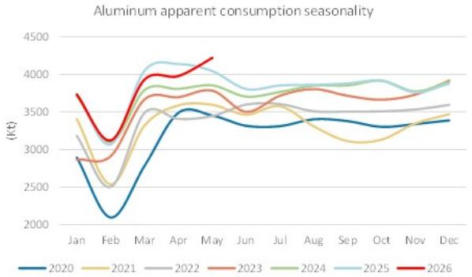

line chart

Aluminum apparent consumption seasonality
| Month | 2020 (Kt) | 2021 (Kt) | 2022 (Kt) | 2023 (Kt) | 2024 (Kt) | 2025 (Kt) | 2026 (Kt) |
|---|---|---|---|---|---|---|---|
| Jan | 2900 | 3400 | 3100 | 2850 | 3200 | 3700 | 3750 |
| Feb | 2100 | 2500 | 2400 | 2800 | 3100 | 3150 | 3150 |
| Mar | 2800 | 3300 | 3500 | 3600 | 3700 | 4100 | 4050 |
| Apr | 3400 | 3500 | 3450 | 3700 | 3800 | 4150 | 4150 |
| May | 3550 | 3550 | 3450 | 3750 | 3850 | 4150 | 4250 |
| Jun | 3350 | 3450 | 3450 | 3650 | 3850 | 3850 | - |
| Jul | 3350 | 3450 | 3450 | 3750 | 3850 | 3850 | - |
| Aug | 3400 | 3450 | 3450 | 3850 | 3850 | 3850 | - |
| Sep | 3350 | 3150 | 3450 | 3750 | 3850 | 3850 | - |
| Oct | 3250 | 3150 | 3450 | 3750 | 3850 | 3900 | - |
| Nov | 3350 | 3450 | 3450 | 3750 | 3850 | 3850 | - |
| Dec | 3400 | 3450 | 3600 | - | - | - | - |
The chart displays a single data series for each year from January to December. The values are estimated based on the provided data and are not explicitly labeled. The title is 'Aluminum apparent consumption seasonality'.

Source: NBS, MS. e = MS estimates.

Aluminum Production Breakdown  
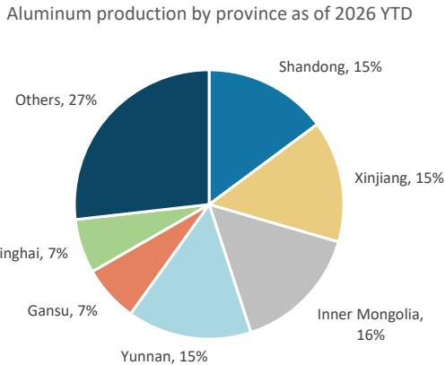

pie chart

Aluminum production by province as of 2026 YTD
| Province | Production (%) |
| :--- | :--- |
| Shandong | 15 |
| Xinjiang | 15 |
| Inner Mongolia | 16 |
| Yunnan | 15 |
| Gansu | 7 |
| Qinghai | 7 |
| Others | 27 |

## Bauxite & Alumina

Reliance on Imported Bauxite is Increasing  
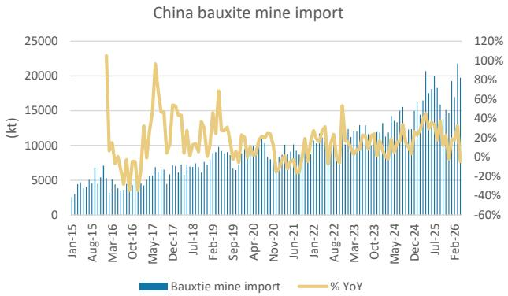

bar-line hybrid chart

China bauxite mine import
| Date | Bauxite mine import (kt) | % YoY (%) |
|---|---|---|
| Jan-15 | 3000 | -10 |
| Aug-15 | 4000 | 10 |
| Mar-16 | 7000 | 80 |
| Oct-16 | 4000 | -30 |
| May-17 | 6000 | 120 |
| Dec-17 | 7000 | 60 |
| Jul-18 | 8000 | 20 |
| Feb-19 | 9000 | 40 |
| Sep-19 | 8000 | 20 |
| Apr-20 | 9000 | 20 |
| Nov-20 | 10000 | 20 |
| Jun-21 | 9000 | 10 |
| Jan-22 | 10000 | 20 |
| Aug-22 | 11000 | 40 |
| Mar-23 | 12000 | 20 |
| Oct-23 | 13000 | 20 |
| May-24 | 14000 | 20 |
| Dec-24 | 15000 | 20 |
| Jul-25 | 21000 | 40 |
| Feb-26 | 22000 | 20 |

Bauxite Production  
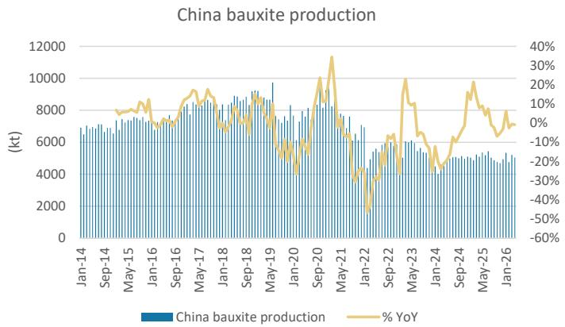

line and bar chart

| Date    | China bauxite production (kt) | % YoY (%) |
|---------|-------------------------------|-----------|
| Jan-14  | ~7000                         | ~0        |
| Sep-14  | ~7500                         | ~5        |
| May-15  | ~8000                         | ~10       |
| Jan-16  | ~7500                         | ~5        |
| Sep-16  | ~8500                         | ~15       |
| May-17  | ~9000                         | ~20       |
| Jan-18  | ~8500                         | ~10       |
| Sep-18  | ~9500                         | ~15       |
| May-19  | ~9000                         | ~10       |
| Jan-20  | ~7500                         | ~-30      |
| Sep-20  | ~8500                         | ~30       |
| May-21  | ~11000                        | ~40       |
| Jan-22  | ~6000                         | ~-40      |
| Sep-22  | ~5500                         | ~-20      |
| May-23  | ~6500                         | ~15       |
| Jan-24  | ~5500                         | ~-20      |
| Sep-24  | ~5000                         | ~-10      |
| May-25  | ~5500                         | ~15       |
| Jan-26  | ~5000                         | ~-5       |

Net Alumina Imports Turning Positive  
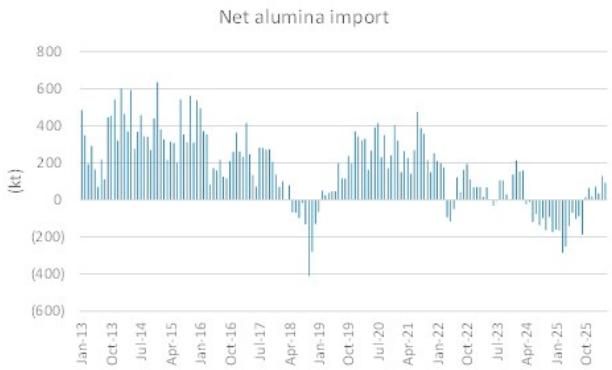

bar chart

Net alumina import
| Date | Net alumina import (kt) |
|---|---|
| Jan-13 | 480 |
| Oct-13 | 450 |
| Jul-14 | 600 |
| Apr-15 | 650 |
| Jan-16 | 550 |
| Oct-16 | 400 |
| Jul-17 | 300 |
| Apr-18 | -100 |
| Jan-19 | -400 |
| Oct-19 | 200 |
| Jul-20 | 350 |
| Apr-21 | 450 |
| Jan-22 | -100 |
| Oct-22 | 150 |
| Jul-23 | 100 |
| Apr-24 | -200 |
| Jan-25 | -300 |
| Oct-25 | 100 |

Source: China Custom, SMM, MS.

Guinea Accounts for >70% of Total Bauxite Imports  
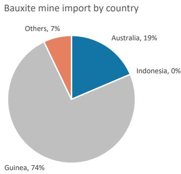

pie chart

Bauxite mine import by country
| Country | Import Share (%) |
| :--- | :--- |
| Australia | 19 |
| Indonesia | 0 |
| Guinea | 74 |
| Others | 7 |

## Power Tariff for Aluminum Smelters

National Average Power Tariff for Smelters  
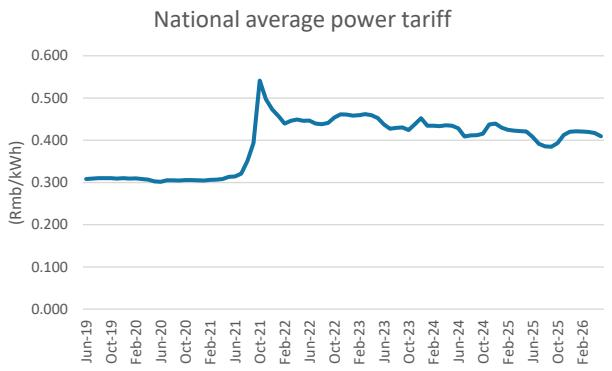

line chart

| Date    | National average power tariff (Rmb/kWh) |
|---------|----------------------------------------|
| Jun-19  | 0.30                                   |
| Oct-19  | 0.30                                   |
| Feb-20  | 0.30                                   |
| Jun-20  | 0.30                                   |
| Oct-20  | 0.30                                   |
| Feb-21  | 0.30                                   |
| Jun-21  | 0.30                                   |
| Oct-21  | 0.55                                   |
| Feb-22  | 0.45                                   |
| Jun-22  | 0.45                                   |
| Oct-22  | 0.45                                   |
| Feb-23  | 0.45                                   |
| Jun-23  | 0.45                                   |
| Oct-23  | 0.45                                   |
| Feb-24  | 0.45                                   |
| Jun-24  | 0.45                                   |
| Oct-24  | 0.45                                   |
| Feb-25  | 0.45                                   |
| Jun-25  | 0.40                                   |
| Oct-25  | 0.40                                   |
| Feb-26  | 0.40                                   |

China Aluminum Spread  
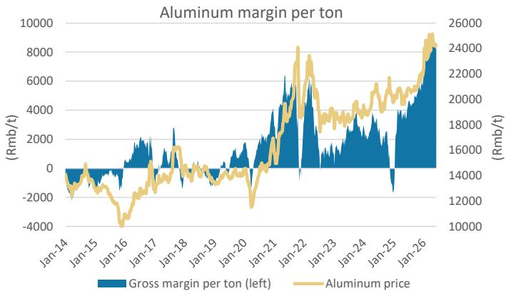

line chart

| Date    | Gross margin per ton (Rmb/t) | Aluminum price (Rmb/t) |
|---------|-------------------------------|------------------------|
| Jan-14  | -                             | -                      |
| Jan-15  | -                             | -                      |
| Jan-16  | -                             | -                      |
| Jan-17  | -                             | -                      |
| Jan-18  | -                             | -                      |
| Jan-19  | -                             | -                      |
| Jan-20  | -                             | -                      |
| Jan-21  | -                             | -                      |
| Jan-22  | -                             | -                      |
| Jan-23  | -                             | -                      |
| Jan-24  | -                             | -                      |
| Jan-25  | -                             | -                      |
| Jan-26  | -                             | -                      |

Source: Bloomberg, Baiinfo, SMM, Wind, MS.

Power Tariff by Province  
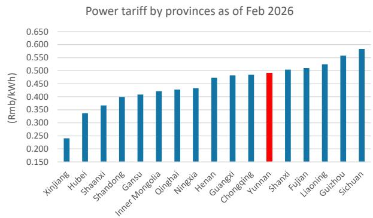

bar chart

Power tariff by provinces as of Feb 2026
| Province | Power tariff (Rmb/kWh) |
| :--- | :--- |
| Xinjiang | 0.24 |
| Hubei | 0.33 |
| Shaanxi | 0.37 |
| Shandong | 0.40 |
| Gansu | 0.41 |
| Inner Mongolia | 0.42 |
| Qinghai | 0.43 |
| Ningxia | 0.43 |
| Henan | 0.48 |
| Guangxi | 0.49 |
| Chongqing | 0.49 |
| Yunnan | 0.50 |
| Shanxi | 0.51 |
| Fujian | 0.51 |
| Liaoning | 0.52 |
| Guizhou | 0.56 |
| Sichuan | 0.59 |

China Alumina Spread  
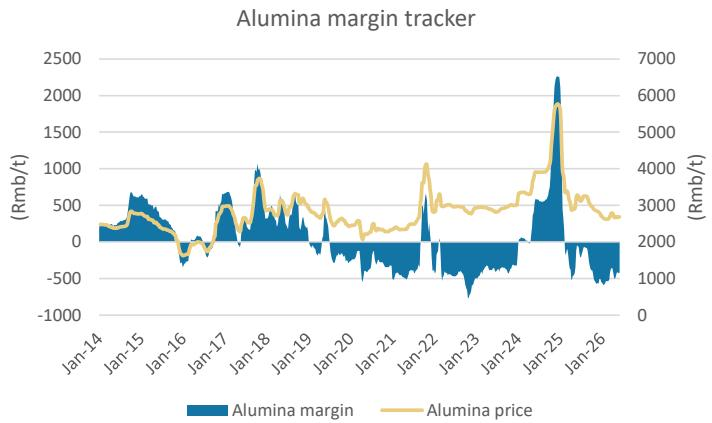

line chart

| Date   | Alumina margin (Rmb/t) | Alumina price (Rmb/t) |
|--------|------------------------|-----------------------|
| Jan-14 | ~200                   | ~2000                 |
| Jan-15 | ~600                   | ~3000                 |
| Jan-16 | ~-300                  | ~2000                 |
| Jan-17 | ~600                   | ~3000                 |
| Jan-18 | ~1000                  | ~4000                 |
| Jan-19 | ~500                   | ~3000                 |
| Jan-20 | ~-200                  | ~2000                 |
| Jan-21 | ~-500                  | ~2000                 |
| Jan-22 | ~1000                  | ~4000                 |
| Jan-23 | ~-800                  | ~2000                 |
| Jan-24 | ~-500                  | ~3000                 |
| Jan-25 | ~2200                  | ~6000                 |
| Jan-26 | ~-500                  | ~2000                 |

## EV & Lithium

Lithium Inventory in China  
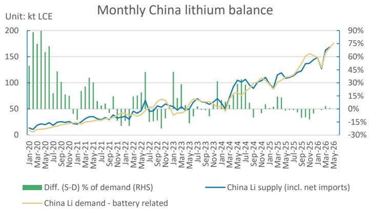

line chart

| Month    | Diff. (S-D) % of demand (RHS) | China Li supply (incl. net imports) | China Li demand - battery related |
|----------|-------------------------------|------------------------------------|----------------------------------|
| Jan-20   | ~130                          | ~5                                 | ~0                               |
| Mar-20   | ~200                          | ~10                                | ~5                               |
| May-20   | ~180                          | ~15                                | ~10                              |
| Jul-20   | ~160                          | ~20                                | ~15                              |
| Sep-20   | ~140                          | ~25                                | ~20                              |
| Nov-20   | ~120                          | ~30                                | ~25                              |
| Jan-21   | ~100                          | ~35                                | ~30                              |
| Mar-21   | ~90                           | ~40                                | ~35                              |
| May-21   | ~80                           | ~45                                | ~40                              |
| Jul-21   | ~70                           | ~50                                | ~45                              |
| Sep-21   | ~60                           | ~55                                | ~50                              |
| Nov-21   | ~50                           | ~60                                | ~55                              |
| Jan-22   | ~40                           | ~65                                | ~60                              |
| Mar-22   | ~30                           | ~70                                | ~65                              |
| May-22   | ~20                           | ~75                                | ~70                              |
| Jul-22   | ~10                           | ~80                                | ~75                              |
| Sep-22   | ~5                            | ~85                                | ~80                              |
| Nov-22   | ~10                           | ~90                                | ~85                              |
| Jan-23   | ~5                            | ~95                                | ~90                              |
| Mar-23   | ~10                           | ~100                               | ~95                              |
| May-23   | ~15                           | ~105                               | ~100                             |
| Jul-23   | ~20                           | ~110                               | ~105                             |
| Sep-23   | ~25                           | ~115                               | ~110                             |
| Nov-23   | ~30                           | ~120                               | ~115                             |
| Jan-24   | ~35                           | ~125                               | ~120                             |
| Mar-24   | ~40                           | ~130                               | ~125                             |
| May-24   | ~45                           | ~135                               | ~130                             |
| Jul-24   | ~50                           | ~140                               | ~135                             |
| Sep-24   | ~55                           | ~145                               | ~140                             |
| Nov-24   | ~60                           | ~150                               | ~145                             |
| Jan-25   | ~65                           | ~155                               | ~150                             |
| Mar-25   | ~70                           | ~160                               | ~155                             |
| May-25   | ~75                           | ~165                               | ~160                             |
| Jul-25   | ~80                           | ~170                               | ~165                             |
| Sep-25   | ~85                           | ~175                               | ~170                             |
| Nov-25   | ~90                           | ~180                               | ~175                             |
| Jan-26   | ~95                           | ~185                               | ~180                             |
| Mar-26   | ~100                          | ~190                               | ~185                             |
| May-26   | ~105                          | ~195                               | ~190                             |

EV Inventory  
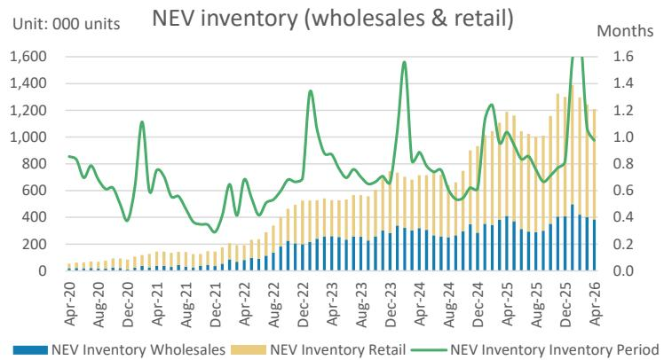

bar-line hybrid

NEV inventory (wholesales & retail)
| Month | NEV Inventory Wholesale (in 1,000 units) | NEV Inventory Retail (in 1,000 units) | NEV Inventory Inventory Period (months) |
|---|---|---|---|
| Apr-20 | 50 | 30 | 0.9 |
| Aug-20 | 60 | 40 | 0.8 |
| Dec-20 | 70 | 50 | 0.4 |
| Apr-21 | 80 | 60 | 1.1 |
| Aug-21 | 90 | 70 | 0.7 |
| Dec-21 | 100 | 80 | 0.3 |
| Apr-22 | 110 | 90 | 0.6 |
| Aug-22 | 120 | 100 | 0.5 |
| Dec-22 | 130 | 110 | 1.3 |
| Apr-23 | 140 | 120 | 0.8 |
| Aug-23 | 150 | 130 | 0.7 |
| Dec-23 | 160 | 140 | 1.6 |
| Apr-24 | 170 | 150 | 0.9 |
| Aug-24 | 180 | 160 | 0.6 |
| Dec-24 | 190 | 170 | 1.2 |
| Apr-25 | 200 | 180 | 1.1 |
| Aug-25 | 210 | 190 | 0.8 |
| Dec-25 | 220 | 200 | 1.4 |
| Apr-26 | 230 | 210 | 1.6 |

Source: China Customs, SMM, Baiinfo, CAAM, CPCA, MS. Note: We measure the market balance by looking at: 1) total market supply, containing domestic lithium chemical output, adjusted by net imports (mainly adding imports of lithium carbonate and deducting exports of lithium hydroxide); and 2) lithium-ion battery-related demand, primarily from the production of cathode materials in China. NEV PV wholesales inventory is calculated from the difference between production and wholesales, and retail sales inventory is from the difference between wholesales and retail sales as well as exports; Inventory period is calculated by dividing total NEV PV inventory by the current monthly wholesale.

Lithium

<table><tr><td rowspan="2" colspan="4"></td><td>kt LCE</td><td>2023</td><td>2024</td><td>2025</td><td>2026</td></tr><tr><td>1,409.6</td><td>209.5</td><td>291.3</td><td>362.5</td><td>533.5</td></tr><tr><td colspan="9">Total China Supply</td></tr><tr><td colspan="4">YoY chg kt LCE</td><td></td><td>40.2</td><td>81.8</td><td>71.2</td><td>171.0</td></tr><tr><td colspan="4">YoY chg %</td><td></td><td>24%</td><td>39%</td><td>24%</td><td>47%</td></tr><tr><td colspan="4">1) Spodumene concentrate</td><td>361.1</td><td>21.4</td><td>35.5</td><td>68.0</td><td>129.2</td></tr><tr><td colspan="4">YoY chg</td><td></td><td>7.3</td><td>14.1</td><td>32.5</td><td>61.2</td></tr><tr><td colspan="4">2) Brine</td><td>608.8</td><td>102.9</td><td>112.6</td><td>148.6</td><td>237.1</td></tr><tr><td colspan="4">YoY chg</td><td></td><td>14.8</td><td>9.6</td><td>36.0</td><td>88.5</td></tr><tr><td colspan="4">3) Lepidolite</td><td>439.7</td><td>85.1</td><td>143.3</td><td>145.9</td><td>167.2</td></tr><tr><td colspan="4">YoY chg</td><td></td><td>18.1</td><td>58.1</td><td>2.7</td><td>21.3</td></tr><tr><td colspan="4">Spodumene ConcentrateChina</td><td>361.1</td><td>21.4</td><td>35.5</td><td>68.0</td><td>129.2</td></tr><tr><td>Zhonghe</td><td colspan="2">Barkam (Dangba)</td><td>China</td><td>SC</td><td></td><td></td><td></td><td></td></tr><tr><td>Rongjie</td><td>Jiajika 134</td><td>甲基卡</td><td>China</td><td>SC</td><td>9.4</td><td>7.4</td><td>9.4</td><td>9.4</td></tr><tr><td>Rongjie</td><td>Jiajika 134 Exp. - Beneficiation</td><td>甲基卡</td><td>China</td><td>SC</td><td>15.6</td><td></td><td></td><td></td></tr><tr><td>Rongjie</td><td>Jiajika 134 Exp. - Mining &amp; Beneficiatic</td><td>甲基卡</td><td>China</td><td>SC</td><td>35.0</td><td></td><td></td><td></td></tr><tr><td>Chuanneng &amp; Yahua</td><td>Lijiagou</td><td>李家沟</td><td>China</td><td>SC</td><td>23.5</td><td>4.7</td><td>11.7</td><td>15.6</td></tr><tr><td>Chengxin</td><td>Yelonggou / Aoyinuo</td><td>奥义诺</td><td>China</td><td>SC</td><td>9.4</td><td>9.4</td><td>9.4</td><td>9.4</td></tr><tr><td>Chengxin</td><td>Murong</td><td>木绒</td><td>China</td><td>SC</td><td>80.0</td><td></td><td></td><td></td></tr><tr><td>Tianqi</td><td>Yajiang Cuola</td><td>雅江措拉</td><td>China</td><td>SC</td><td>12.5</td><td></td><td></td><td></td></tr><tr><td>Ganfeng</td><td colspan="2">Ningdu Heyuan</td><td>China</td><td>SC</td><td>3.0</td><td></td><td></td><td></td></tr><tr><td>Xingneng</td><td>Dechenongba</td><td>德扯弄巴</td><td>China</td><td>SC</td><td></td><td></td><td></td><td></td></tr><tr><td>Xinjiang Non-Ferrous</td><td>Dahongliutan</td><td>大红柳滩</td><td>China</td><td>SC</td><td>62.5</td><td></td><td>5.0</td><td>15.0</td></tr><tr><td>Xinjiang Non-Ferrous</td><td>Dahongliutan</td><td>大红柳滩</td><td>China</td><td>SC</td><td>37.5</td><td></td><td></td><td></td></tr><tr><td>Dazhong</td><td colspan="2">Jiada</td><td>China</td><td>SC</td><td>50.0</td><td></td><td></td><td>5.0</td></tr><tr><td>Guocheng</td><td colspan="2">Dangba</td><td>China</td><td>SC</td><td>22.7</td><td></td><td></td><td>13.6</td></tr></table>

Source: Company data, MS estimates.

## Lithium

China Predominately Imports LC from Chile and Argentina  
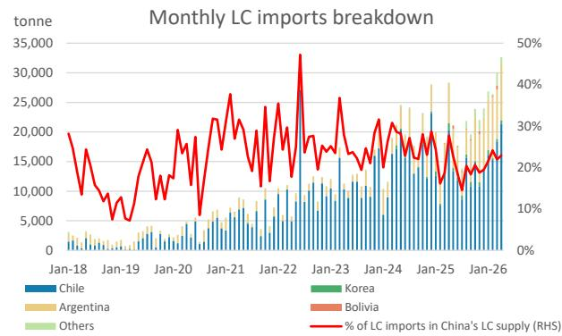

bar-line hybrid

Monthly LC imports breakdown
| Month | Chile (tonne) | Argentina (tonne) | Korea (tonne) | Bolivia (%) | Others (%) |
| :--- | :--- | :--- | :--- | :--- | :--- |
| Jan-18 | 1000 | 1500 | 500 | 10 | 20 |
| Jan-19 | 1500 | 2000 | 1000 | 15 | 30 |
| Jan-20 | 2000 | 2500 | 1500 | 20 | 40 |
| Jan-21 | 2500 | 3000 | 2000 | 25 | 50 |
| Jan-22 | 3000 | 3500 | 2500 | 30 | 60 |
| Jan-23 | 3500 | 4000 | 3000 | 35 | 70 |
| Jan-24 | 3000 | 3500 | 2500 | 30 | 65 |
| Jan-25 | 2500 | 3000 | 2000 | 25 | 60 |
| Jan-26 | 2000 | 2500 | 1500 | 20 | 55 |

Lepidolite-based LC Profit  
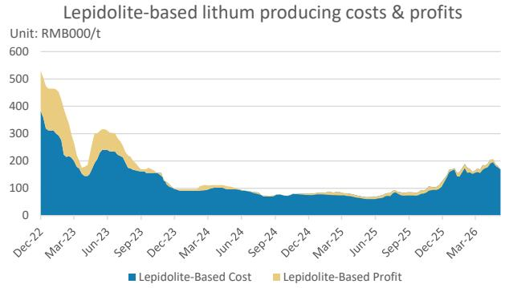

area chart

Lepidolite-based lithium producing costs & profits
| Date | Lepidolite-Based Cost (RMB000/t) | Lepidolite-Based Profit (RMB000/t) |
| :--- | :--- | :--- |
| Dec-22 | 350 | 480 |
| Mar-23 | 300 | 450 |
| Jun-23 | 150 | 180 |
| Sep-23 | 180 | 120 |
| Dec-23 | 120 | 90 |
| Mar-24 | 80 | 70 |
| Jun-24 | 70 | 60 |
| Sep-24 | 60 | 50 |
| Dec-24 | 60 | 50 |
| Mar-25 | 60 | 50 |
| Jun-25 | 50 | 40 |
| Sep-25 | 60 | 50 |
| Dec-25 | 80 | 70 |
| Mar-26 | 180 | 160 |
Unit: RMB000/t

China's LiOH Output is Mainly Exported to Korea and Japan  
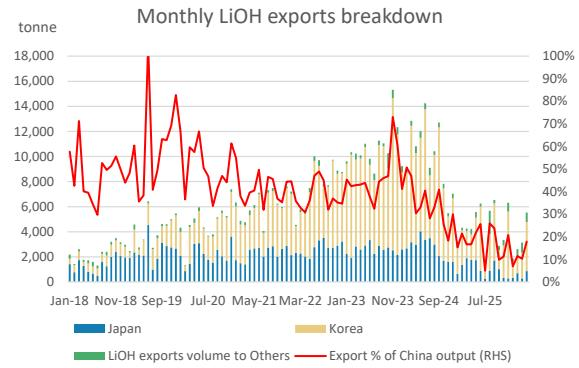

Spodumene Inventory in China  
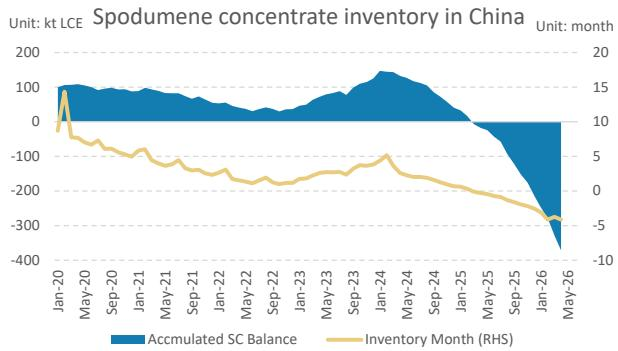

line chart

| Date   | Accumulated SC Balance (kt LCE) | Inventory Month (RHS) (month) |
|--------|----------------------------------|-------------------------------|
| Jan-20 | ~100                             | ~15                           |
| May-20 | ~80                              | ~5                            |
| Sep-20 | ~70                              | ~0                            |
| Jan-21 | ~60                              | ~-5                           |
| May-21 | ~50                              | ~-10                          |
| Sep-21 | ~40                              | ~-15                          |
| Jan-22 | ~30                              | ~-20                          |
| May-22 | ~20                              | ~-25                          |
| Sep-22 | ~10                              | ~-30                          |
| Jan-23 | ~0                               | ~-35                          |
| May-23 | ~100                             | ~-40                          |
| Sep-23 | ~150                             | ~-45                          |
| Jan-24 | ~180                             | ~-50                          |
| May-24 | ~160                             | ~-55                          |
| Sep-24 | ~140                             | ~-60                          |
| Jan-25 | ~100                             | ~-65                          |
| May-25 | ~50                              | ~-70                          |
| Sep-25 | ~0                               | ~-75                          |
| Jan-26 | ~-300                            | ~-80                          |
| May-26 | ~-400                            | ~-85                          |

Source: China Customs, SMM, MS. Note: LC represents lithium carbonate; LiOH represents lithium hydroxide; LFP represents lithium iron phosphate materials; NCM/NCA represents ternary materials.

## Lithium

Prices Recovery Observed for Lithium Carbonate  
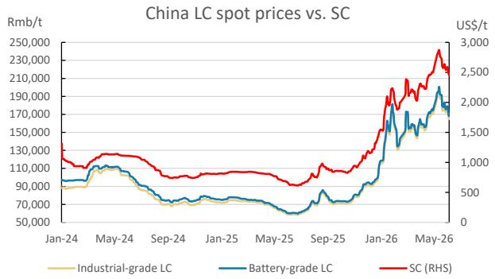

line chart

| Date   | Industrial-grade LC (Rmb/t) | Battery-grade LC (Rmb/t) | SC (RHS) (US$/t) |
|--------|-----------------------------|--------------------------|------------------|
| Jan-24 | ~90,000                     | ~1,000                   | ~1,300           |
| May-24 | ~100,000                    | ~1,100                   | ~1,350           |
| Sep-24 | ~80,000                     | ~900                     | ~1,250           |
| Jan-25 | ~75,000                     | ~850                     | ~1,200           |
| May-25 | ~70,000                     | ~800                     | ~1,150           |
| Sep-25 | ~75,000                     | ~850                     | ~1,200           |
| Jan-26 | ~85,000                     | ~1,500                   | ~1,800           |
| May-26 | ~190,000                    | ~2,000                   | ~2,800           |

Also for Lithium Hydroxide  
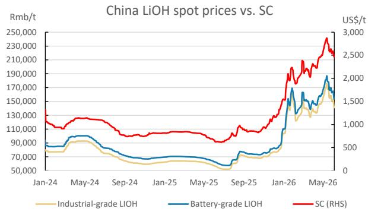

line chart

| Date   | Industrial-grade LiOH (Rmb/t) | Battery-grade LiOH (Rmb/t) | SC (RHS) (US$/t) |
|--------|----------------------------------|-----------------------------|------------------|
| Jan-24 | ~80,000                          | ~90,000                     | ~1,100           |
| May-24 | ~75,000                          | ~95,000                     | ~1,200           |
| Sep-24 | ~70,000                          | ~85,000                     | ~1,150           |
| Jan-25 | ~65,000                          | ~80,000                     | ~1,100           |
| May-25 | ~60,000                          | ~75,000                     | ~1,050           |
| Sep-25 | ~65,000                          | ~85,000                     | ~1,150           |
| Jan-26 | ~80,000                          | ~1,500                      | ~1,800           |
| May-26 | ~1,500                           | ~2,000                      | ~3,000           |

GP/t at Independent LC Converters Rebounded  
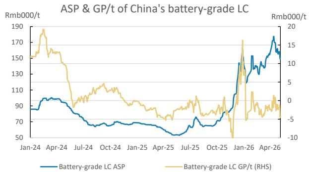

line chart

| Date   | Battery-grade LC ASP (Rmb/000/t) | Battery-grade LC GP/t (Rmb/000/t) |
|--------|----------------------------------|-----------------------------------|
| Jan-24 | ~90                              | ~18                               |
| Apr-24 | ~95                              | ~15                               |
| Jul-24 | ~75                              | ~5                                |
| Oct-24 | ~70                              | ~0                                |
| Jan-25 | ~65                              | ~-5                               |
| Apr-25 | ~60                              | ~-10                              |
| Jul-25 | ~75                              | ~-5                               |
| Oct-25 | ~85                              | ~0                                |
| Jan-26 | ~140                             | ~18                               |
| Apr-26 | ~170                             | ~15                               |

Also for Independent LiOH Producers  
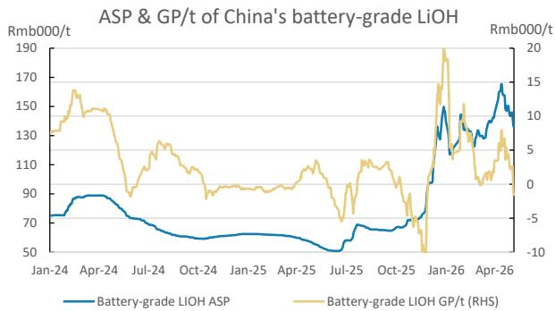

line chart

| Date   | Battery-grade LIOH ASP (Rmb000/t) | Battery-grade LiOH GP/t (Rmb000/t) |
|--------|-----------------------------------|------------------------------------|
| Jan-24 | ~75                               | ~13                                |
| Apr-24 | ~85                               | ~16                                |
| Jul-24 | ~70                               | ~9                                 |
| Oct-24 | ~65                               | ~11                                |
| Jan-25 | ~60                               | ~9                                 |
| Apr-25 | ~55                               | ~10                                |
| Jul-25 | ~50                               | ~7                                 |
| Oct-25 | ~65                               | ~11                                |
| Jan-26 | ~15                               | ~19                                |
| Apr-26 | ~170                              | ~10                                |

Source: Baiinfo, MS estimates. Note: LC represents lithium carbonate; LiOH represents lithium hydroxide.

## Lithium

Domestic LC Output Stays Elevated  
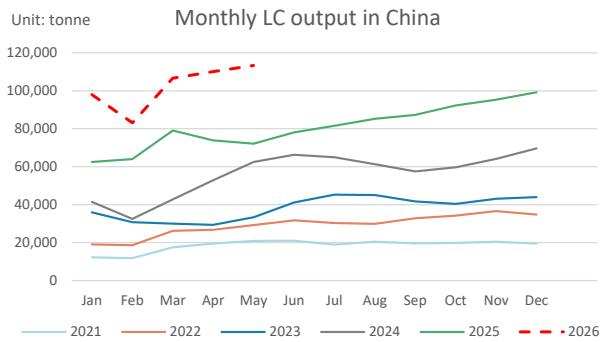

line chart

| Month | 2021   | 2022   | 2023   | 2024   | 2025   | 2026   |
|-------|--------|--------|--------|--------|--------|--------|
| Jan   | ~10,000| ~18,000| ~35,000| ~40,000| ~60,000| ~95,000|
| Feb   | ~12,000| ~18,000| ~30,000| ~35,000| ~65,000| ~85,000|
| Mar   | ~15,000| ~25,000| ~30,000| ~45,000| ~80,000| ~105,000|
| Apr   | ~18,000| ~25,000| ~30,000| ~55,000| ~75,000| ~110,000|
| May   | ~20,000| ~30,000| ~35,000| ~65,000| ~75,000| ~115,000|
| Jun   | ~22,000| ~35,000| ~45,000| ~65,000| ~85,000| ~115,000|
| Jul   | ~22,000| ~35,000| ~45,000| ~65,000| ~95,000| ~115,000|
| Aug   | ~22,000| ~35,000| ~45,000| ~65,000| ~95,000| ~115,000|
| Sep   | ~22,000| ~35,000| ~45,000| ~65,000| ~95,000| ~115,000|
| Oct   | ~22,000| ~35,000| ~45,000| ~65,000| ~95,000| ~115,000|
| Nov   | ~22,000| ~35,000| ~45,000| ~65,000| ~95,000| ~115,000|
| Dec   | ~22,000| ~35,000| ~45,000| ~75,000| ~115,557| ~115,557 |

Domestic LiOH Output Grew YoY  
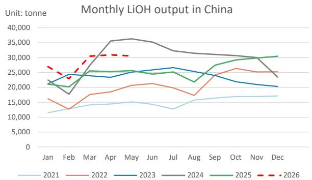

line chart

| Month | 2021   | 2022   | 2023   | 2024   | 2025   | 2026   |
|-------|--------|--------|--------|--------|--------|--------|
| Jan   | 11,500 | 16,500 | 21,500 | 21,500 | 21,500 | 27,000 |
| Feb   | 13,000 | 13,500 | 18,500 | 17,500 | 19,500 | 24,500 |
| Mar   | 14,000 | 17,500 | 23,500 | 35,500 | 24,500 | 31,500 |
| Apr   | 14,500 | 18,500 | 24,500 | 36,500 | 25,500 | 31,500 |
| May   | 15,500 | 20,500 | 25,500 | 36,500 | 25,500 | 31,500 |
| Jun   | 14,500 | 21,500 | 26,500 | 36,500 | 24,500 | -      |
| Jul   | 13,500 | 19,500 | 27,500 | 33,500 | 24,500 | -      |
| Aug   | 14,500 | 17,500 | 26,500 | 32,500 | 24,500 | -      |
| Sep   | 16,500 | 24,500 | 24,500 | 31,500 | 27,500 | -      |
| Oct   | 17,500 | 26,500 | 23,500 | 31,500 | 29,500 | -      |
| Nov   | 17,500 | 25,500 | 21,500 | 31,500 | 31,500 | -      |
| Dec   | 17,500 | 24,500 | 21,500 | 31,500 | 31,500 | -      |

Lepidolite Output In-line with Seasonality  
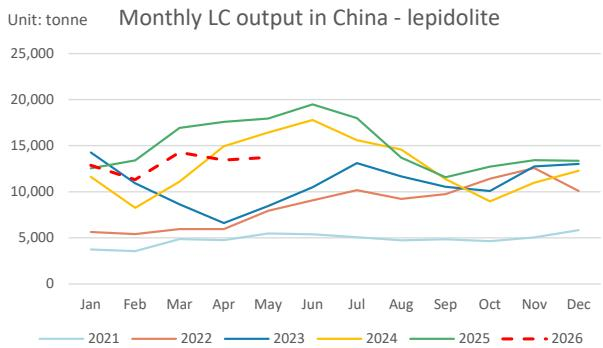

line chart

| Month | 2021 | 2022 | 2023 | 2024 | 2025 | 2026 |
|-------|------|------|------|------|------|------|
| Jan   | ~3,500 | ~5,500 | ~14,000 | ~11,500 | ~13,000 | ~13,500 |
| Feb   | ~3,500 | ~5,500 | ~8,500 | ~8,000 | ~13,500 | ~12,500 |
| Mar   | ~4,500 | ~5,500 | ~7,500 | ~10,500 | ~17,000 | ~14,000 |
| Apr   | ~5,000 | ~6,000 | ~6,500 | ~14,500 | ~17,500 | ~14,500 |
| May   | ~5,500 | ~7,500 | ~8,500 | ~16,500 | ~18,500 | ~14,500 |
| Jun   | ~5,500 | ~9,500 | ~11,500 | ~17,500 | ~19,500 | ~14,500 |
| Jul   | ~5,500 | ~10,500 | ~13,500 | ~16,500 | ~18,500 | ~14,500 |
| Aug   | ~5,500 | ~9,500 | ~12,500 | ~14,500 | ~16,500 | ~14,500 |
| Sep   | ~5,500 | ~9,500 | ~11,500 | ~12,500 | ~13,500 | ~14,500 |
| Oct   | ~5,500 | ~11,500 | ~9,500 | ~9,500 | ~12,500 | ~14,500 |
| Nov   | ~6,500 | ~12,500 | ~13,500 | ~12,500 | ~13,500 | ~14,500 |
| Dec   | ~6,500 | ~11,500 | ~13,500 | ~12,500 | ~13,500 | ~14,500 |

Brine Output at a Seasonal High  
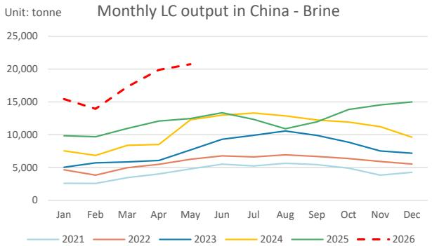

line chart

| Month | 2021 | 2022 | 2023 | 2024 | 2025 | 2026 |
|-------|------|------|------|------|------|------|
| Jan   | ~3,000 | ~5,000 | ~5,000 | ~7,500 | ~10,000 | ~15,500 |
| Feb   | ~3,500 | ~4,500 | ~5,500 | ~7,000 | ~10,500 | ~14,500 |
| Mar   | ~4,000 | ~5,500 | ~6,000 | ~8,500 | ~11,500 | ~16,500 |
| Apr   | ~4,500 | ~6,000 | ~6,500 | ~9,000 | ~12,500 | ~18,500 |
| May   | ~5,000 | ~6,500 | ~7,500 | ~12,500 | ~13,500 | ~21,000 |
| Jun   | ~5,500 | ~7,000 | ~9,500 | ~13,500 | ~13,500 | — |
| Jul   | ~5,500 | ~7,500 | ~10,500 | ~13,500 | ~13,500 | — |
| Aug   | ~5,500 | ~7,500 | ~11,500 | ~13,500 | ~13,500 | — |
| Sep   | ~5,500 | ~7,500 | ~11,500 | ~13,500 | ~14,500 | — |
| Oct   | ~5,500 | ~7,500 | ~11,500 | ~13,500 | ~14,500 | — |
| Nov   | ~4,500 | ~7,500 | ~8,500 | ~11,500 | ~14,500 | — |
| Dec   | ~4,500 | ~7,500 | ~7,500 | ~9,500 | ~14,500 | — |

Source: SMM, MS. Note: LC represents lithium carbonate; LiOH represents lithium hydroxide; LFP represents lithium iron phosphate materials; NCM/NCA represents ternary materials.

## Uranium

Uranium Price History  
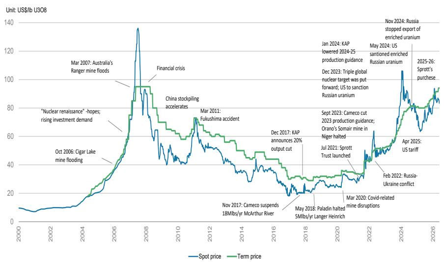

line chart

| Date | Spot Price (US$/lb U3O8) | Term Price (US$/lb U3O8) |
|------|--------------------------|--------------------------|
| Mar 2007: Australia's Ranger mine floods | ~135 | ~95 |
| Oct 2006: Cigar Lake mine flooding | ~10 | ~15 |
| Nov 2017: Cameco suspends 18Mlbs/yr McArthur River | ~25 | ~30 |
| May 2018: Paladin halted 5Mlbs/yr Langer Heinrich | ~30 | ~35 |
| Dec 2017: KAP announces 20% output cut | ~35 | ~40 |
| Mar 2011: Fukushima accident | ~70 | ~65 |
| Jan 2024: KAP lowered 2024-25 production guidance | ~65 | ~60 |
| Dec 2023: Triple global nuclear target was put forward; US to sanction Russian uranium | ~60 | ~55 |
| Sept 2023: Cameco cut 2023 production guidance; Orano's Somair mine in Niger halted | ~55 | ~50 |
| Jul 2021: Sprott Trust launched | ~50 | ~45 |
| Feb 2022: Russia-Ukraine conflict | ~65 | ~60 |
| Apr 2025: US tariff | ~85 | ~80 |
| Nov 2024: Russia stopped export of enriched uranium | ~105 | ~100 |
| May 2024: US sanctioned enriched Russian uranium | ~95 | ~90 |
| 2025-26: Sprott's purchase | ~90 | ~85 |

Uranium has Long-term Supply Risks  
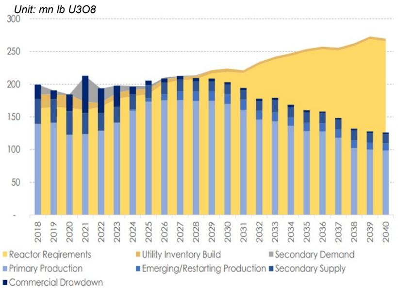

stacked bar chart

| Year | Reactor Requirements (mn lb U3O8) | Utility Inventory Build (mn lb U3O8) | Secondary Demand (mn lb U3O8) | Primary Production (mn lb U3O8) | Emerging/Restarting Production (mn lb U3O8) | Secondary Supply (mn lb U3O8) | Commercial Drawdown (mn lb U3O8) |
| --- | --- | --- | --- | --- | --- | --- | --- |
| 2018 | 195 | 20 | 19 | 140 | 20 | 10 | 0 |
| 2019 | 190 | 20 | 19 | 140 | 20 | 10 | 0 |
| 2020 | 185 | 20 | 19 | 120 | 20 | 10 | 0 |
| 2021 | 210 | 20 | 19 | 125 | 20 | 10 | 0 |
| 2022 | 195 | 20 | 19 | 130 | 20 | 10 | 0 |
| 2023 | 195 | 20 | 19 | 140 | 20 | 10 | 0 |
| 2024 | 195 | 20 | 19 | 160 | 20 | 10 | 0 |
| 2025 | 205 | 20 | 19 | 175 | 20 | 10 | 0 |
| 2026 | 210 | 20 | 19 | 175 | 20 | 10 | 0 |
| 2027 | 215 | 20 | 19 | 175 | 20 | 10 | 0 |
| 2028 | 215 | 20 | 19 | 175 | 20 | 10 | 0 |
| 2029 | 215 | 20 | 19 | 175 | 20 | 10 | 0 |
| 2030 | 215 | 20 | 19 | 175 | 20 | 10 | 0 |
| 2031 | 215 | 20 | 19 | 165 | 20 | 10 | 0 |
| 2032 | 235 | 20 | 19 | 145 | 20 | 10 | 0 |
| 2033 | 245 | 20 | 19 | 145 | 20 | 10 | 0 |
| 2034 | 255 | 20 | 19 | 135 | 20 | 10 | 0 |
| 2035 | 265 | 20 | 19 | 135 | 20 | 10 | 0 |
| 2036 | 265 | 20 | 19 | 135 | 20 | 10 | 0 |
| 2037 | 265 | 20 | 19 | 135 | 20 | 10 | 0 |

Country Nuclear Power Development Plans

<table><tr><td>China</td><td>China targets to reach 150GW nuclear installed capacity by 2035 vs. 56.9GW as end of 2023</td></tr><tr><td>US</td><td>US and 21 other countries pledged to triple nuclear capacity by 2050 from 2020 level, implying ~3.9% CAGR of capacity growth.</td></tr><tr><td>UK</td><td>UK plans to increase nuclear generation by up to 4 times to 24GW by 2050.</td></tr><tr><td>Japan</td><td>Japan is actively extending life of nuclear power plants to 60 years, restarting suspended reactors, and planning to build new reactors.</td></tr><tr><td>India</td><td>India plans to add 18 more nuclear reactors by 2031-32, bringing the total nuclear power capacity to 22.4GW from 6.8GW as end of 2023.</td></tr></table>

Source: Cameco, UxC, Kazatompromm MS.

## Uranium

Uranium Purchased by SPUT  
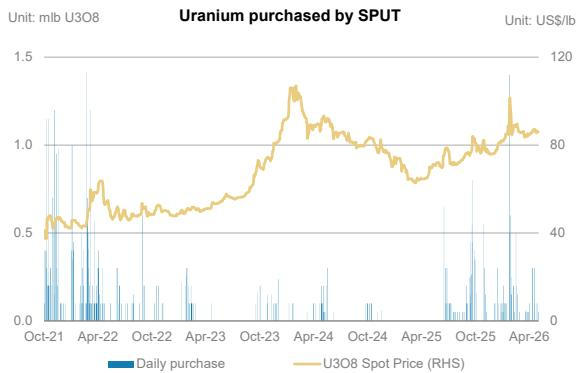

line chart

| Date    | Daily purchase (mb) | U3O8 Spot Price (RHS) |
|---------|---------------------|------------------------|
| Oct-21  | ~0.5                | ~40                    |
| Apr-22  | ~0.7                | ~60                    |
| Oct-22  | ~0.6                | ~50                    |
| Apr-23  | ~0.8                | ~65                    |
| Oct-23  | ~1.0                | ~80                    |
| Apr-24  | ~1.3                | ~90                    |
| Oct-24  | ~1.1                | ~75                    |
| Apr-25  | ~0.9                | ~70                    |
| Oct-25  | ~1.2                | ~85                    |
| Apr-26  | ~1.4                | ~95                    |

Construction Starts of NPPs Picked up  
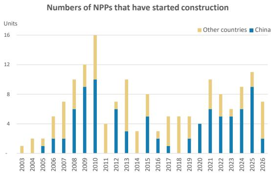

stacked bar chart

Numbers of NPPs that have started construction
| Year | Other countries | China |
|---|---|---|
| 2003 | 1 | 0 |
| 2004 | 2 | 0 |
| 2005 | 1 | 1 |
| 2006 | 3 | 1 |
| 2007 | 4 | 1 |
| 2008 | 5 | 3 |
| 2009 | 5 | 5 |
| 2010 | 16 | 9 |
| 2011 | 4 | 0 |
| 2012 | 5 | 3 |
| 2013 | 7 | 3 |
| 2014 | 3 | 0 |
| 2015 | 5 | 4 |
| 2016 | 3 | 2 |
| 2017 | 4 | 1 |
| 2018 | 4 | 0 |
| 2019 | 4 | 1 |
| 2020 | 0 | 4 |
| 2021 | 5 | 4 |
| 2022 | 4 | 4 |
| 2023 | 3 | 4 |
| 2024 | 5 | 4 |
| 2025 | 7 | 6 |
| 2026 | 5 | 2 |

Source: SPUT, WNA, IAEA, Yellow Cake, Cameco, MS.

Uranium Purchased by Investment Funds  
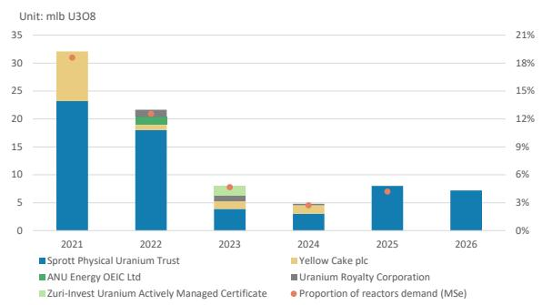

stacked bar chart

| Year | Sprott Physical Uranium Trust (mlb U3O8) | Yellow Cake plc (mlb U3O8) | ANU Energy OEIC Ltd (mlb U3O8) | Uranium Royalty Corporation (mlb U3O8) | Zuri-Invest Uranium Actively Managed Certificate (mlb U3O8) | Proportion of reactors demand (MSe) |
|---|---|---|---|---|---|---|
| 2021 | 23.5 | 7.5 | 0.0 | 0.0 | 0.0 | 18.5 |
| 2022 | 18.0 | 1.5 | 1.0 | 0.0 | 0.0 | 12.0 |
| 2023 | 3.5 | 1.5 | 0.5 | 1.5 | 1.5 | 3.0 |
| 2024 | 3.0 | 1.0 | 0.5 | 1.0 | 0.5 | 3.0 |
| 2025 | 7.5 | 0.5 | 0.0 | 0.5 | 0.0 | 3.5 |
| 2026 | 7.0 | 0.5 | 0.0 | 0.5 | 0.0 | 3.5 |

Average Spot Price is up Further YTD 2026  
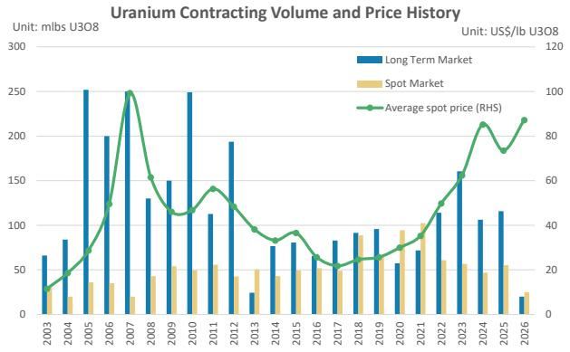

bar-line hybrid

Uranium Contracting Volume and Price History
| Year | Long Term Market (mlbs U3O8) | Spot Market (mlbs U3O8) | Average spot price (RHS) |
| :--- | :--- | :--- | :--- |
| 2003 | 65 | 15 | 15 |
| 2004 | 85 | 20 | 25 |
| 2005 | 250 | 35 | 45 |
| 2006 | 200 | 30 | 75 |
| 2007 | 250 | 15 | 100 |
| 2008 | 130 | 40 | 60 |
| 2009 | 150 | 50 | 45 |
| 2010 | 250 | 50 | 45 |
| 2011 | 115 | 55 | 55 |
| 2012 | 195 | 45 | 45 |
| 2013 | 20 | 45 | 35 |
| 2014 | 75 | 40 | 35 |
| 2015 | 80 | 45 | 35 |
| 2016 | 85 | 45 | 25 |
| 2017 | 85 | 45 | 25 |
| 2018 | 90 | 45 | 30 |
| 2019 | 95 | 45 | 30 |
| 2020 | 60 | 95 | 35 |
| 2021 | 70 | 105 | 45 |
| 2022 | - | 60 | 60 |
| 2023 | - | 60 | 80 |
| 2024 | - | 45 | 90 |
| 2025 | - | 55 | 75 |
| 2026 | - | 20 | 85 |
Unit: US$/lb U3O8

## Rare Earth Permanent Magnets

Demand for NdFeB from EVs CAGR of 33% in 2020-2026  
Global demand for NdFeB from NEVs  
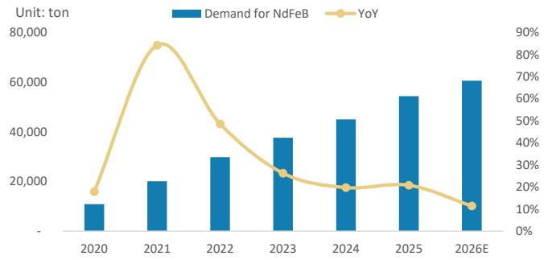

bar-line hybrid chart

| Year   | Demand for NdFeB (ton) | YoY  |
| ------ | ---------------------- | ---- |
| 2020   | 10,000                 | 15%  |
| 2021   | 20,000                 | 85%  |
| 2022   | 30,000                 | 45%  |
| 2023   | 38,000                 | 25%  |
| 2024   | 45,000                 | 20%  |
| 2025   | 55,000                 | 22%  |
| 2026E  | 60,000                 | 12%  |

JL Mag's Market Share to Increase

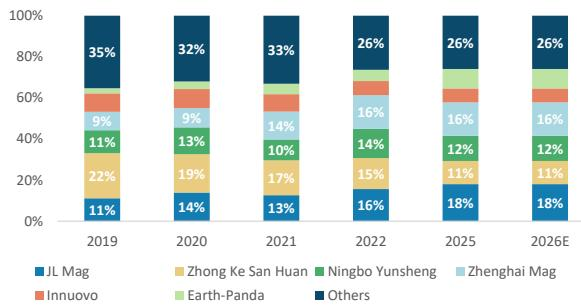

stacked bar chart

| Year | JL Mag (%) | Zhong Ke San Huan (%) | Ningbo Yunsheng (%) | Zhenghai Mag (%) | Innuovo (%) | Earth-Panda (%) | Others (%) |
|---|---|---|---|---|---|---|---|
| 2019 | 11 | 22 | 11 | 9 | 0 | 0 | 35 |
| 2020 | 14 | 19 | 13 | 9 | 0 | 0 | 32 |
| 2021 | 13 | 17 | 10 | 14 | 0 | 0 | 33 |
| 2022 | 16 | 15 | 14 | 16 | 0 | 0 | 26 |
| 2025E | 18 | 11 | 12 | 16 | 0 | 0 | 26 |
| 2026E | 18 | 11 | 12 | 16 | 0 | 0 | 26 |

Demand for NdFeB from Wind CAGR of 7% in 2020-2026  
Global demand for NdFeB from PM wind turbine  
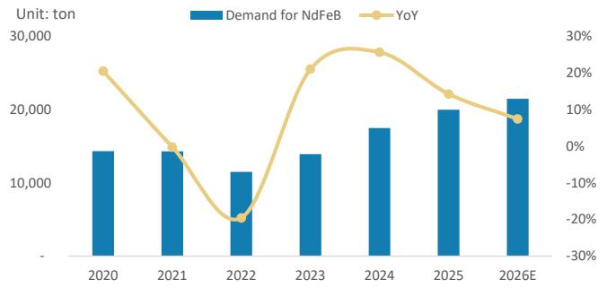

bar-line hybrid

| Year   | Demand for NdFeB (ton) | YoY (%) |
| ------ | ---------------------- | ------- |
| 2020   | 15000                  | 25      |
| 2021   | 15000                  | 5       |
| 2022   | 12000                  | -25     |
| 2023   | 14000                  | 25      |
| 2024   | 18000                  | 30      |
| 2025   | 20000                  | 15      |
| 2026E  | 22000                  | 10      |

Rare Earth Costs Can Be Passed Through

YoY change of JL Mag's ASP and unit rare earth cost  
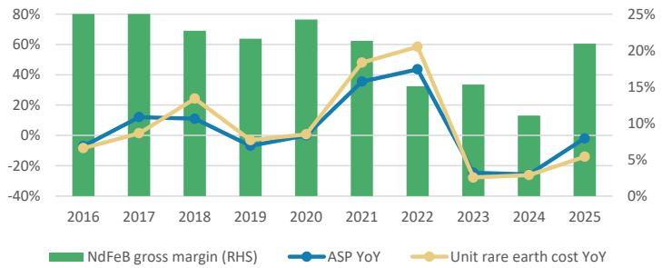

bar-line hybrid chart

| Year | NdFeB gross margin (RHS) (%) | ASP YoY (%) | Unit rare earth cost YoY (%) |
|---|---|---|---|
| 2016 | 80 | -5 | -5 |
| 2017 | 80 | 12 | 3 |
| 2018 | 70 | 11 | 24 |
| 2019 | 64 | -5 | -3 |
| 2020 | 76 | 1 | 0 |
| 2021 | 63 | 36 | 46 |
| 2022 | 33 | 44 | 60 |
| 2023 | 34 | -28 | -28 |
| 2024 | 14 | -28 | -28 |
| 2025 | 61 | -2 | -13 |

Source: Frost & Sullivan, MS. e = MS estimates.

## Glass

## Float Glass Price and Inventory

Operating Rate at Tempering Plant Remains Low  
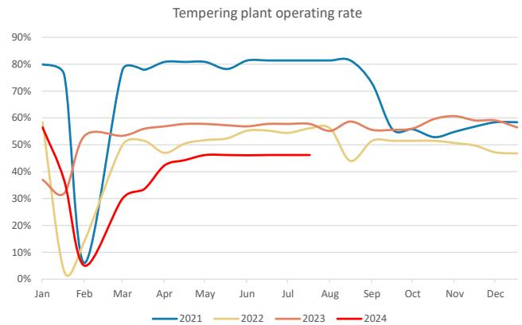

line chart

| Month | 2021  | 2022  | 2023  | 2024  |
|-------|-------|-------|-------|-------|
| Jan   | 80%   | 55%   | 35%   | 55%   |
| Feb   | 5%    | 5%    | 55%   | 5%    |
| Mar   | 80%   | 50%   | 55%   | 30%   |
| Apr   | 80%   | 50%   | 55%   | 40%   |
| May   | 80%   | 50%   | 55%   | 45%   |
| Jun   | 80%   | 50%   | 55%   | 45%   |
| Jul   | 80%   | 50%   | 55%   | 45%   |
| Aug   | 80%   | 50%   | 55%   | 45%   |
| Sep   | 70%   | 50%   | 55%   | 45%   |
| Oct   | 55%   | 50%   | 55%   | 45%   |
| Nov   | 55%   | 50%   | 60%   | 45%   |
| Dec   | 60%   | 45%   | 60%   | 45%   |

Glass Operating Capacity Recovered  
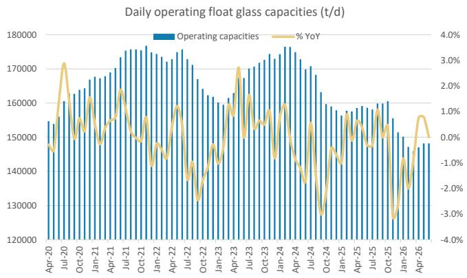

bar-line hybrid chart

Daily operating float glass capacities (t/d)
| Date | Operating capacities (t/d) | % YoY (%) |
|---|---|---|
| Apr-20 | 154000 | -0.8 |
| Jul-20 | 161000 | 3.1 |
| Oct-20 | 164000 | 0.7 |
| Jan-21 | 167000 | 1.3 |
| Apr-21 | 170000 | 1.5 |
| Jul-21 | 175000 | 2.9 |
| Oct-21 | 176000 | 1.3 |
| Jan-22 | 174000 | -1.3 |
| Apr-22 | 173000 | 1.6 |
| Jul-22 | 175000 | -2.3 |
| Oct-22 | 168000 | -1.4 |
| Jan-23 | 162000 | -1.4 |
| Apr-23 | 165000 | 1.8 |
| Jul-23 | 168000 | 1.3 |
| Oct-23 | 172000 | 1.5 |
| Jan-24 | 175000 | 1.9 |
| Apr-24 | 176000 | -1.3 |
| Jul-24 | 170000 | -3.3 |
| Oct-24 | 163000 | -1.3 |
| Jan-25 | 158000 | -1.3 |
| Apr-25 | 159000 | -1.3 |
| Jul-25 | 160000 | -1.3 |
| Oct-25 | 155000 | -3.3 |
| Jan-26 | 150000 | -2.3 |
| Apr-26 | 148000 | 1.4 |

Source: SCI, Wind, CEIC, MS.

Order Days at Processing Plants is Also Low  
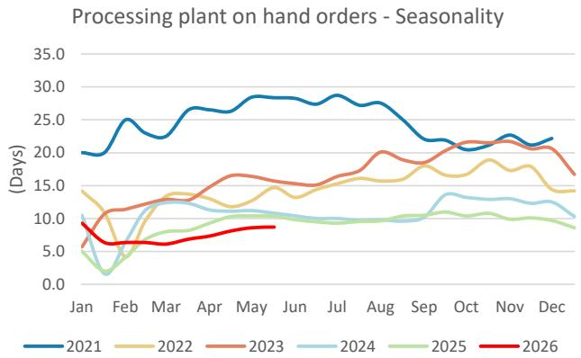

line chart

| Month | 2021 | 2022 | 2023 | 2024 | 2025 | 2026 |
|-------|------|------|------|------|------|------|
| Jan   | 20   | 14   | 10   | 10   | 8    | 9    |
| Feb   | 25   | 10   | 12   | 5    | 6    | 7    |
| Mar   | 23   | 13   | 14   | 10   | 7    | 6    |
| Apr   | 26   | 14   | 16   | 11   | 8    | 7    |
| May   | 28   | 15   | 17   | 10   | 9    | 8    |
| Jun   | 29   | 14   | 16   | 10   | 9    | 8    |
| Jul   | 28   | 15   | 17   | 10   | 9    | 8    |
| Aug   | 27   | 16   | 20   | 10   | 9    | 8    |
| Sep   | 24   | 17   | 19   | 13   | 9    | 8    |
| Oct   | 22   | 18   | 21   | 13   | 9    | 8    |
| Nov   | 23   | 19   | 22   | 13   | 9    | 8    |
| Dec   | 22   | 15   | 17   | 10   | 9    | 8    |

Mismatch Between Supply and Demand is Widening  
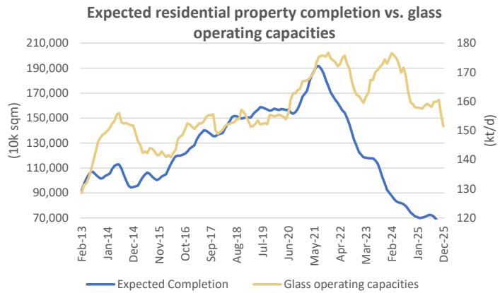

line chart

| Date    | Expected Completion (10k sqm) | Glass operating capacities (kt/d) |
|---------|-------------------------------|----------------------------------|
| Feb-13  | ~90,000                       | ~130                             |
| Jan-14  | ~110,000                      | ~150                             |
| Dec-14  | ~90,000                       | ~140                             |
| Nov-15  | ~100,000                      | ~135                             |
| Oct-16  | ~120,000                      | ~145                             |
| Sep-17  | ~130,000                      | ~150                             |
| Aug-18  | ~140,000                      | ~145                             |
| Jul-19  | ~150,000                      | ~150                             |
| Jun-20  | ~160,000                      | ~160                             |
| May-21  | ~190,000                      | ~175                             |
| Apr-22  | ~150,000                      | ~170                             |
| Mar-23  | ~120,000                      | ~160                             |
| Feb-24  | ~80,000                       | ~180                             |
| Jan-25  | ~70,000                       | ~160                             |
| Dec-25  | ~70,000                       | ~155                             |

## Demand From the Property Market Remains Muted

Float Glass Price  
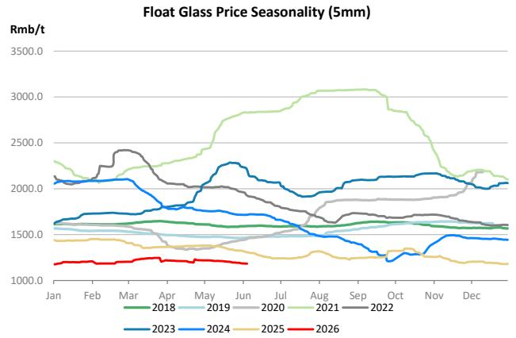

line chart

| Month | 2018 | 2019 | 2020 | 2021 | 2022 | 2023 | 2024 | 2025 | 2026 |
|-------|------|------|------|------|------|------|------|------|------|
| Jan   | ~1600.0 | ~1550.0 | ~1700.0 | ~2100.0 | ~2050.0 | ~1650.0 | ~1550.0 | ~1450.0 | ~1150.0 |
| Feb   | ~1650.0 | ~1550.0 | ~1750.0 | ~2150.0 | ~2100.0 | ~1650.0 | ~1550.0 | ~1450.0 | ~1150.0 |
| Mar   | ~1700.0 | ~1550.0 | ~1800.0 | ~2200.0 | ~2150.0 | ~1700.0 | ~1600.0 | ~1450.0 | ~1150.0 |
| Apr   | ~1750.0 | ~1550.0 | ~1850.0 | ~2300.0 | ~2200.0 | ~1750.0 | ~1650.0 | ~1450.0 | ~1150.0 |
| May   | ~1800.0 | ~1550.0 | ~1900.0 | ~2400.0 | ~2250.0 | ~1800.0 | ~1700.0 | ~1450.0 | ~1150.0 |
| Jun   | ~1850.0 | ~1550.0 | ~1950.0 | ~2500.0 | ~2300.0 | ~1850.0 | ~1750.0 | ~1450.0 | ~1150.0 |
| Jul   | ~1900.0 | ~1550.0 | ~2000.0 | ~2600.0 | ~2350.0 | ~1900.0 | ~1800.0 | ~1450.0 | ~1150.0 |
| Aug   | ~1950.0 | ~1550.0 | ~2050.0 | ~2700.0 | ~2400.0 | ~1950.0 | ~1850.0 | ~1450.0 | ~1150.0 |
| Sep   | ~2000.0 | ~1550.0 | ~2100.0 | ~2800.0 | ~2450.0 | ~2000.0 | ~1900.0 | ~1450.0 | ~1150.0 |
| Oct   | ~2156.67 | ~1656.67 | ~2156.67 | ~3156.67 | ~2656.67 | ~2156.67 | ~1956.67 | ~1456.67 | ~1156.67 |
| Nov   | ~2388.88 | ~1756.67 | ~2258.88 | ~3388.88 | ~2888.88 | ~2388.88 | ~2188.88 | ~1456.67 | ~1156.67 |
| Dec   | ~2388.88 | ~1756.67 | ~2388.88 | ~3388.88 | ~2888.88 | ~2388.88 | ~2388.88 | ~1456.67 | ~1156.67 |

Float Glass Inventory  
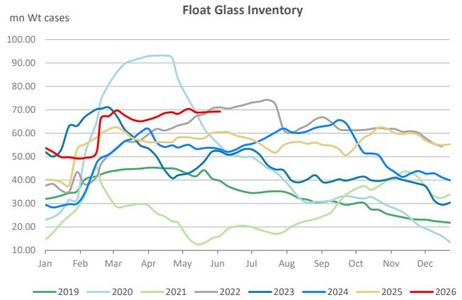

line chart

| Month | 2019 | 2020 | 2021 | 2022 | 2023 | 2024 | 2025 | 2026 |
| --- | --- | --- | --- | --- | --- | --- | --- | --- |
| Jan | 30.0 | 25.0 | 15.0 | 35.0 | 30.0 | 35.0 | 40.0 | 50.0 |
| Feb | 35.0 | 35.0 | 30.0 | 40.0 | 45.0 | 65.0 | 55.0 | 55.0 |
| Mar | 40.0 | 95.0 | 45.0 | 55.0 | 70.0 | 70.0 | 65.0 | 70.0 |
| Apr | 45.0 | 95.0 | 30.0 | 60.0 | 65.0 | 60.0 | 65.0 | 70.0 |
| May | 45.0 | 95.0 | 15.0 | 65.0 | 60.0 | 55.0 | 65.0 | 70.0 |
| Jun | 40.0 | 70.0 | 20.0 | 70.0 | 55.0 | 55.0 | 65.0 | 70.0 |
| Jul | 35.0 | 55.0 | 25.0 | 75.0 | 55.0 | 65.0 | 65.0 | 70.0 |
| Aug | 35.0 | 45.0 | 30.0 | 75.0 | 65.0 | 65.0 | 65.0 | 70.0 |
| Sep | 35.0 | 35.0 | 35.0 | 75.0 | 65.0 | 65.0 | 65.0 | 70.0 |
| Oct | 35.0 | 35.0 | 40.0 | 75.0 | 65.0 | 65.0 | 65.0 | 70.0 |
| Nov | 35.0 | 35.0 | 45.0 | 75.0 | 65.0 | 65.0 | 65.0 | 70.0 |
| Dec | 35.0 | 35.0 | 45.0 | 75.0 | 65.0 | 65.0 | 65.0 | 70.0 |
| Jan | 35.0 | 35.0 | 45.0 | 75.0 | 65.0 | 65.0 | 65.0 | 70.0 |
| Feb | 35.0 | 35.0 | 45.0 | 75.0 | 65.0 | 65.0 | 65.0 | 70.0 |
| Mar | 35.0 | 35.0 | 45.0 | 75.0 | 65.0 | 65.0 | 65.0 | 70.0 |
| Apr | 35.0 | 35.0 | 45.0 | 75.0 | 65.0 | 65.0 | 65.0 | 70.0 |
| May | 35.0 | 35.0 | 45.0 | 75.0 | 65.0 | 65.0 | 65.0 | 70.0 |
| Jun | 35.0 | 35.0 | 45.0 | 75.0 | 65.0 | 65.0 | 65.0 | 70.0 |
| Jul | 35.0 | 35.0 | 45.0 | 75.0 | 65.0 | 65.0 | 65.0 | 70.0 |
| Aug | 35.0 | 35.0 | 45.0 | 75.0 | 65.0 | 65.0 | 65.0 | 70.0 |
| Sep | 35.0 | 35.0 | 45.0 | 75.0 | 65.0 | 65.0 | 65.0 | 70.0 |
| Oct | 35.0 | 35.0 | 45.0 | 75.0 | 65.0 | 65.0 | 65.0 | 70.0 |
| Nov | 35.0 | 35.0 | 45.0 | 75.0 | 65.0 | 65.0 | 65.0 | 70.0 |

Sodium Carbonate Price  
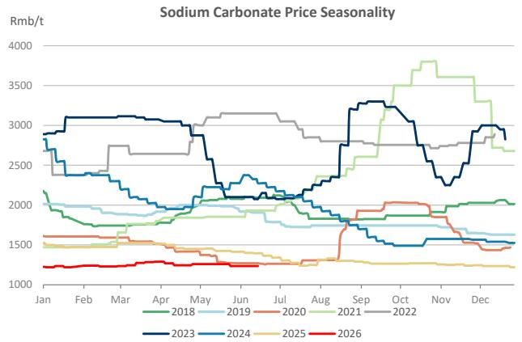

line chart

| Month | 2018 | 2019 | 2020 | 2021 | 2022 | 2023 | 2024 | 2025 | 2026 |
|-------|------|------|------|------|------|------|------|------|------|
| Jan   | 2100 | 2000 | 1600 | 1500 | 2800 | 3000 | 2700 | 1400 | 1200 |
| Feb   | 1900 | 1950 | 1650 | 1550 | 3100 | 3100 | 2400 | 1450 | 1250 |
| Mar   | 1800 | 1900 | 1600 | 1500 | 3150 | 3150 | 2300 | 1450 | 1300 |
| Apr   | 1850 | 1950 | 1550 | 1550 | 3150 | 3150 | 2200 | 1450 | 1350 |
| May   | 1950 | 2050 | 1500 | 1600 | 3150 | 3150 | 2300 | 1450 | 1350 |
| Jun   | 2050 | 2150 | 1450 | 1650 | 3150 | 3150 | 2400 | 1450 | 1350 |
| Jul   | 2150 | 2250 | 1450 | 1700 | 3150 | 3150 | 2450 | 1450 | 1350 |
| Aug   | 2250 | 2350 | 1450 | 1750 | 3150 | 3150 | 2500 | 1450 | 1350 |
| Sep   | 2350 | 2450 | 1450 | 1800 | 3150 | 3300 | 2600 | 1450 | 1350 |
| Oct   | 2450 | 2550 | 1450 | 1850 | 3300 | 3400 | 2700 | 1450 | 1350 |
| Nov   | 2350 | 2450 | 1450 | 1850 | 3250 | 3350 | 2650 | 1450 | 1350 |
| Dec   | 2450 | 2350 | 1450 | 1850 | 3150 | 3350 | 2650 | 1450 | 1350 |

Float Glass Margin  
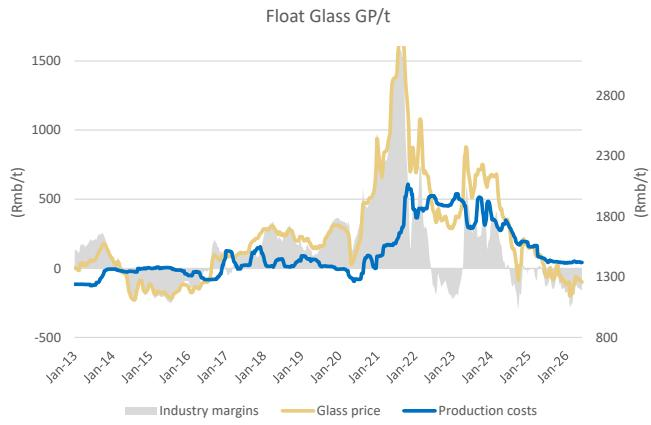

line chart

| Date   | Industry margins (Rmb/t) | Glass price (Rmb/t) | Production costs (Rmb/t) |
|--------|---------------------------|---------------------|--------------------------|
| Jan-13 | ~0                        | ~0                  | ~0                       |
| Jan-14 | ~0                        | ~0                  | ~0                       |
| Jan-15 | ~0                        | ~0                  | ~0                       |
| Jan-16 | ~0                        | ~0                  | ~0                       |
| Jan-17 | ~0                        | ~0                  | ~0                       |
| Jan-18 | ~0                        | ~0                  | ~0                       |
| Jan-19 | ~0                        | ~0                  | ~0                       |
| Jan-20 | ~0                        | ~0                  | ~0                       |
| Jan-21 | ~0                        | ~0                  | ~0                       |
| Jan-22 | ~0                        | ~2800               | ~600                     |
| Jan-23 | ~0                        | ~2300               | ~500                     |
| Jan-24 | ~0                        | ~2300               | ~500                     |
| Jan-25 | ~0                        | ~1300               | ~130                     |
| Jan-26 | ~0                        | ~1300               | ~130                     |

Source: OilChem, SCI, Wind, CEIC, MS.

## Glass

## Solar Glass Price and Inventory

Solar Glass Prices  
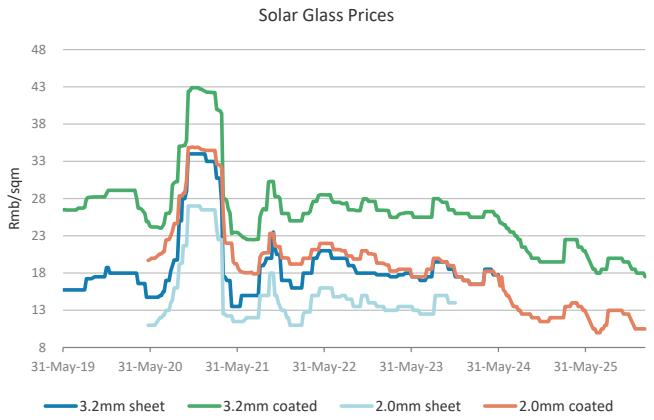

line chart

| Date       | 3.2mm sheet | 3.2mm coated | 2.0mm sheet | 2.0mm coated |
| ---------- | ----------- | ------------ | ----------- | ------------ |
| 31-May-19  | 17.5        | 28.0         | -           | -            |
| 31-May-20  | 18.0        | 33.0         | 28.0        | 33.0         |
| 31-May-21  | 17.0        | 29.0         | 13.0        | 23.0         |
| 31-May-22  | 18.0        | 28.0         | 16.0        | 23.0         |
| 31-May-23  | 18.5        | 27.5         | 15.5        | 22.5         |
| 31-May-24  | 18.0        | 26.0         | 14.0        | 21.0         |
| 31-May-25  | 17.5        | 24.0         | 13.0        | 19.0         |

Solar Glass Inventory  
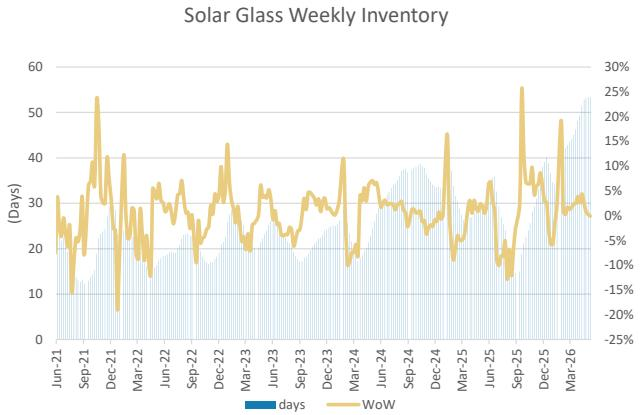

line chart

| Date    | Days | WoW   |
|---------|------|-------|
| Jun-21  | 10   | 30%   |
| Sep-21  | 20   | 55%   |
| Dec-21  | 30   | 40%   |
| Mar-22  | 20   | 30%   |
| Jun-22  | 15   | 35%   |
| Sep-22  | 20   | 30%   |
| Dec-22  | 30   | 45%   |
| Mar-23  | 20   | 30%   |
| Jun-23  | 15   | 35%   |
| Sep-23  | 20   | 30%   |
| Dec-23  | 30   | 40%   |
| Mar-24  | 20   | 35%   |
| Jun-24  | 30   | 30%   |
| Sep-24  | 35   | 35%   |
| Dec-24  | 20   | 45%   |
| Mar-25  | 30   | 30%   |
| Jun-25  | 15   | -15%  |
| Sep-25  | 30   | 55%   |
| Dec-25  | 35   | 40%   |
| Mar-26  | 40   | 50%   |
| Jun-26  | 50   | 30%   |
| Sep-26  | 55   | 35%   |
| Dec-26  | 60   | 40%   |

Cost of PV Supply China  
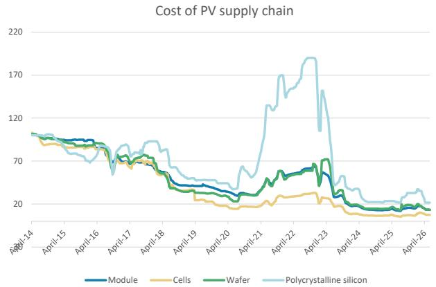

line chart

| Date    | Module | Cells | Wafer | Polycrystalline silicon |
|---------|--------|-------|-------|--------------------------|
| Apr-14  | 115    | 110   | 112   | 113                      |
| Apr-15  | 114    | 108   | 111   | 112                      |
| Apr-16  | 113    | 107   | 110   | 111                      |
| Apr-17  | 112    | 106   | 109   | 110                      |
| Apr-18  | 111    | 105   | 108   | 109                      |
| Apr-19  | 109    | 103   | 107   | 108                      |
| Apr-20  | 107    | 101   | 106   | 107                      |
| Apr-21  | 105    | 99    | 105   | 106                      |
| Apr-22  | 103    | 97    | 103   | 105                      |
| Apr-23  | 101    | 95    | 101   | 103                      |
| Apr-24  | 99     | 93    | 99    | 97                       |
| Apr-25  | 97     | 91    | 97    | 95                       |
| Apr-26  | 95     | 89    | 95    | 93                       |

Solar Glass Capacity  
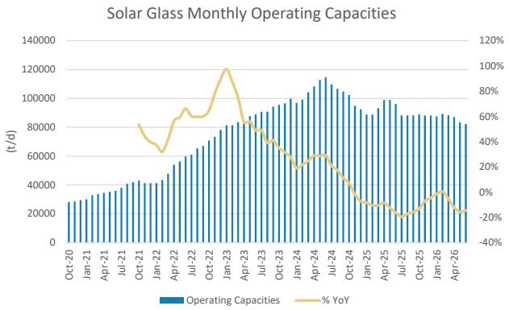

bar-line hybrid

Solar Glass Monthly Operating Capacities
| Month | Operating Capacities (t/d) | % YoY (%) |
|---|---|---|
| Oct-20 | 28000 | -15 |
| Jan-21 | 30000 | -14 |
| Apr-21 | 35000 | -13 |
| Jul-21 | 40000 | -12 |
| Oct-21 | 45000 | -11 |
| Jan-22 | 50000 | -10 |
| Apr-22 | 60000 | 45 |
| Jul-22 | 70000 | 55 |
| Oct-22 | 80000 | 65 |
| Jan-23 | 90000 | 100 |
| Apr-23 | 85000 | 65 |
| Jul-23 | 95000 | 55 |
| Oct-23 | 100000 | 45 |
| Jan-24 | 110000 | 35 |
| Apr-24 | 115000 | 35 |
| Jul-24 | 110000 | 35 |
| Oct-24 | 105000 | 25 |
| Jan-25 | 95000 | -5 |
| Apr-25 | 98000 | -15 |
| Jul-25 | 95000 | -25 |
| Oct-25 | 93000 | -15 |
| Jan-26 | 92000 | 5 |
| Apr-26 | 88000 | -15 |

Source: SCI, Wind, CEIC, MS.

## Glass Fiber

Glass Fiber Prices  
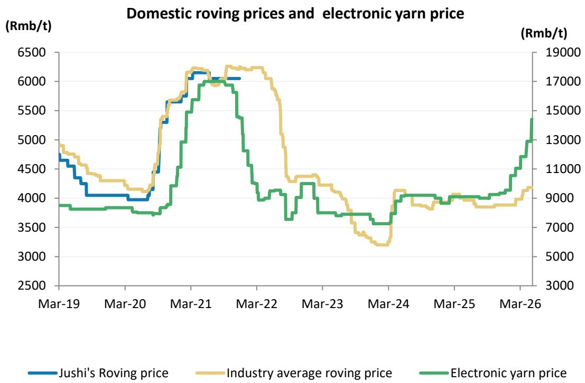

line chart

| Date   | Jushi's Roving price (Rmb/t) | Industry average roving price (Rmb/t) | Electronic yarn price (Rmb/t) |
|--------|-------------------------------|--------------------------------------|-------------------------------|
| Mar-19 | 4700                          | 4900                                 | 3800                          |
| Mar-20 | 4000                          | 4200                                 | 3700                          |
| Mar-21 | 6100                          | 6200                                 | 6000                          |
| Mar-22 | 6000                          | 6200                                 | 5500                          |
| Mar-23 | 4300                          | 4400                                 | 3700                          |
| Mar-24 | 3200                          | 3300                                 | 3500                          |
| Mar-25 | 4000                          | 4100                                 | 4000                          |
| Mar-26 | 4200                          | 4300                                 | 14000                         |

Source: SCI, company data, MS.

## Coal

## Price Recovery

The Domestic Thermal Coal Spot Discount has Reversed...  
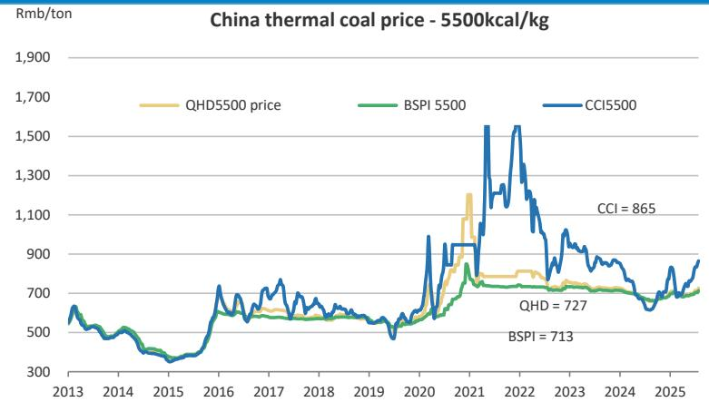

line chart

| Year | QHD5500 price | BSPI 5500 | CCI5500 |
|------|---------------|-----------|---------|
| 2021 | 727           | 713       | 865     |

Similarly, Coking Coal Price Saw Rounds of Rebound...

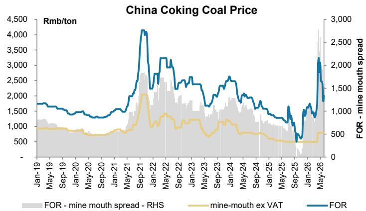

line chart

| Date    | FOR (Rmb/ton) | mine-mouth spread - RHS | mine-mouth ex VAT |
|---------|---------------|--------------------------|-------------------|
| Jan-19  | ~1,800        | ~1,000                   | ~900              |
| May-19  | ~1,700        | ~950                     | ~850              |
| Sep-19  | ~1,600        | ~900                     | ~800              |
| Jan-20  | ~1,500        | ~850                     | ~750              |
| May-20  | ~1,400        | ~800                     | ~700              |
| Sep-20  | ~1,300        | ~750                     | ~650              |
| Jan-21  | ~1,400        | ~800                     | ~700              |
| May-21  | ~1,600        | ~900                     | ~800              |
| Sep-21  | ~2,500        | ~1,500                   | ~1,200            |
| Jan-22  | ~4,100        | ~2,000                   | ~1,500            |
| May-22  | ~3,200        | ~1,800                   | ~1,300            |
| Sep-22  | ~2,800        | ~1,600                   | ~1,200            |
| Jan-23  | ~2,500        | ~1,400                   | ~1,100            |
| May-23  | ~2,300        | ~1,200                   | ~1,000            |
| Sep-23  | ~2,600        | ~1,300                   | ~1,100            |
| Jan-24  | ~2,400        | ~1,200                   | ~1,000            |
| May-24  | ~2,200        | ~1,100                   | ~950              |
| Sep-24  | ~2,100        | ~1,050                   | ~900              |
| Jan-25  | ~2,000        | ~1,000                   | ~850              |
| May-25  | ~1,800        | ~950                     | ~800              |
| Sep-25  | ~1,500        | ~850                     | ~750              |
| Jan-26  | ~1,700        | ~950                     | ~850              |
| May-26  | ~3,200        | ~1,500                   | ~1,300            |

Source: CCTD, SXCoal, NBS, MS.

...Which Makes Imports More Attractive  
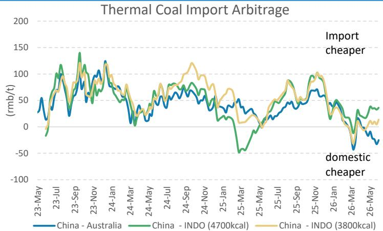

line chart

| Date     | China - Australia | China - INDO (4700kcal) | China - INDO (3800kcal) |
|----------|-------------------|-------------------------|-------------------------|
| 23-May   | ~50               | ~-20                    | ~-10                    |
| 23-Jul   | ~100              | ~120                    | ~90                     |
| 23-Sep   | ~80               | ~140                    | ~70                     |
| 23-Nov   | ~120              | ~100                    | ~90                     |
| 24-Jan   | ~100              | ~80                     | ~70                     |
| 24-Mar   | ~-20              | ~-10                    | ~-5                     |
| 24-May   | ~30               | ~50                     | ~40                     |
| 24-Jul   | ~60               | ~70                     | ~60                     |
| 24-Sep   | ~80               | ~90                     | ~120                    |
| 24-Nov   | ~60               | ~70                     | ~80                     |
| 24-Jan   | ~40               | ~50                     | ~60                     |
| 25-Jan   | ~30               | ~40                     | ~50                     |
| 25-Mar   | ~-50              | ~-40                    | ~-30                    |
| 25-May   | ~-20              | ~-10                    | ~-5                     |
| 25-Jul   | ~30               | ~50                     | ~60                     |
| 25-Sep   | ~60               | ~80                     | ~90                     |
| 25-Nov   | ~80               | ~100                    | ~110                    |
| 26-Jan   | ~40               | ~50                     | ~60                     |
| 26-Mar   | ~-40              | ~-30                    | ~-20                    |
| 26-May   | ~-20              | ~-10                    | ~-5                     |

...Incentivizing Coking Coal Imports From Mongolia

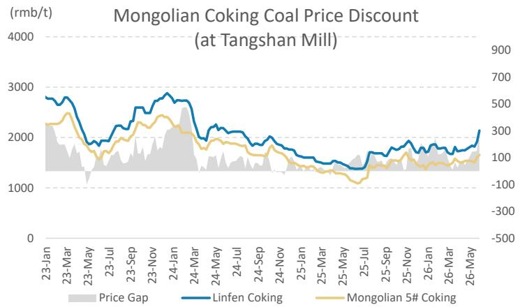

line chart

| Date     | Linfen Coking | Mongolian 5# Coking |
|----------|---------------|---------------------|
| 23-Jan   | ~2800         | ~2300               |
| 23-Mar   | ~2700         | ~2400               |
| 23-May   | ~1900         | ~1700               |
| 23-Jul   | ~2100         | ~1900               |
| 23-Sep   | ~2500         | ~2200               |
| 23-Nov   | ~2800         | ~2400               |
| 24-Jan   | ~2700         | ~2300               |
| 24-Mar   | ~2100         | ~1900               |
| 24-May   | ~2200         | ~1800               |
| 24-Jul   | ~2100         | ~1700               |
| 24-Sep   | ~1900         | ~1600               |
| 24-Nov   | ~1800         | ~1500               |
| 25-Jan   | ~1600         | ~1400               |
| 25-Mar   | ~1500         | ~1300               |
| 25-May   | ~1400         | ~1200               |
| 25-Jul   | ~1600         | ~1300               |
| 25-Sep   | ~1800         | ~1400               |
| 25-Nov   | ~1900         | ~1500               |
| 26-Jan   | ~1800         | ~1400               |
| 26-Mar   | ~1900         | ~1500               |
| 26-May   | ~2100         | ~1600               |

## Coal

China's Coal Production Mostly Flattish YTD  
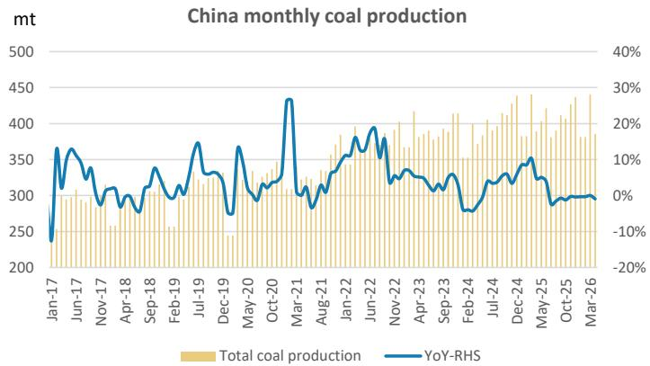

line chart

| Month    | Total coal production (mt) | YoY-RHS (%) |
|----------|-----------------------------|-------------|
| Jan-17   | ~300                        | ~-10%       |
| Jun-17   | ~350                        | ~10%        |
| Nov-17   | ~300                        | ~0%         |
| Apr-18   | ~300                        | ~0%         |
| Sep-18   | ~350                        | ~5%         |
| Feb-19   | ~300                        | ~0%         |
| Jul-19   | ~350                        | ~5%         |
| Dec-19   | ~300                        | ~0%         |
| May-20   | ~350                        | ~5%         |
| Oct-20   | ~400                        | ~10%        |
| Mar-21   | ~350                        | ~20%        |
| Aug-21   | ~350                        | ~5%         |
| Jan-22   | ~400                        | ~10%        |
| Jun-22   | ~450                        | ~15%        |
| Nov-22   | ~400                        | ~10%        |
| Apr-23   | ~400                        | ~5%         |
| Sep-23   | ~400                        | ~0%         |
| Feb-24   | ~400                        | ~-5%        |
| Jul-24   | ~450                        | ~5%         |
| Dec-24   | ~450                        | ~10%        |
| May-25   | ~450                        | ~5%         |
| Oct-25   | ~450                        | ~0%         |
| Mar-26   | ~450                        | ~0%         |

China's Coal Imports Dropped on Indonesia's Export Controls

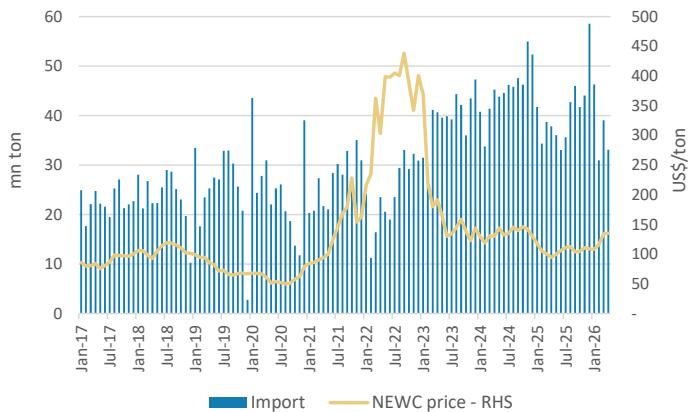

bar-line hybrid chart

| Date    | Import (mn ton) | NEWC price - RHS (US$/ton) |
|---------|-----------------|----------------------------|
| Jan-17  | ~25             | ~100                       |
| Jul-17  | ~23             | ~105                       |
| Jan-18  | ~27             | ~110                       |
| Jul-18  | ~29             | ~115                       |
| Jan-19  | ~34             | ~105                       |
| Jul-19  | ~33             | ~95                        |
| Jan-20  | ~44             | ~85                        |
| Jul-20  | ~31             | ~75                        |
| Jan-21  | ~39             | ~100                       |
| Jul-21  | ~35             | ~150                       |
| Jan-22  | ~33             | ~300                       |
| Jul-22  | ~30             | ~400                       |
| Jan-23  | ~40             | ~350                       |
| Jul-23  | ~45             | ~250                       |
| Jan-24  | ~47             | ~150                       |
| Jul-24  | ~48             | ~150                       |
| Jan-25  | ~55             | ~140                       |
| Jul-25  | ~45             | ~130                       |
| Jan-26  | ~59             | ~140                       |

Source: CCTD, SXCoal, NBS, MS.

Inner Mongolia and Xinjiang Production Accelerated  
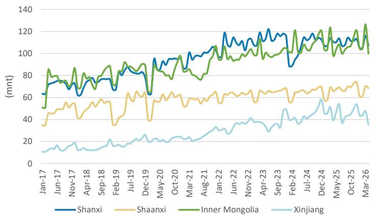

line chart

| Month   | Shanxi | Shaanxi | Inner Mongolia | Xinjiang |
|---------|--------|---------|----------------|----------|
| Jan-17  | 60     | 35      | 50             | 10       |
| Jun-17  | 70     | 40      | 80             | 15       |
| Nov-17  | 75     | 45      | 85             | 20       |
| Apr-18  | 70     | 50      | 80             | 15       |
| Sep-18  | 75     | 55      | 85             | 20       |
| Feb-19  | 80     | 60      | 90             | 25       |
| Jul-19  | 85     | 65      | 95             | 30       |
| Dec-19  | 90     | 70      | 100            | 35       |
| May-20  | 95     | 75      | 105            | 40       |
| Oct-20  | 100    | 80      | 110            | 45       |
| Mar-21  | 105    | 85      | 115            | 50       |
| Aug-21  | 110    | 90      | 120            | 55       |
| Jan-22  | 115    | 95      | 125            | 60       |
| Jun-22  | 120    | 100     | 130            | 65       |
| Nov-22  | 125    | 105     | 135            | 70       |
| Apr-23  | 130    | 110     | 140            | 75       |
| Sep-23  | 135    | 115     | 145            | 80       |
| Feb-24  | 140    | 120     | 150            | 85       |
| Jul-24  | 145    | 125     | 155            | 90       |
| Dec-24  | 150    | 130     | 160            | 95       |
| May-25  | 155    | 135     | 165            | 100      |
| Oct-25  | 160    | 140     | 170            | 105      |
| Mar-26  | 165    | 145     | 175            | 110      |

Mongolia and Russia are Top Sources of China Imports

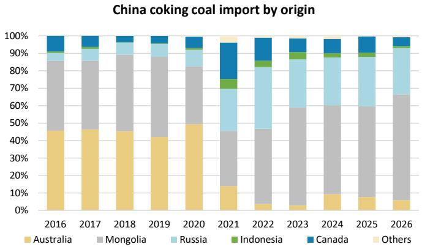

stacked bar chart

China coking coal import by origin
| Year | Australia (%) | Mongolia (%) | Russia (%) | Indonesia (%) | Canada (%) | Others (%) |
|---|---|---|---|---|---|---|
| 2016 | 45 | 33 | 5 | 1 | 7 | 0 |
| 2017 | 46 | 34 | 5 | 1 | 7 | 0 |
| 2018 | 45 | 35 | 5 | 1 | 7 | 0 |
| 2019 | 42 | 36 | 5 | 1 | 7 | 0 |
| 2020 | 49 | 28 | 7 | 1 | 5 | 0 |
| 2021 | 14 | 26 | 23 | 5 | 24 | 0 |
| 2022 | 4 | 34 | 28 | 3 | 11 | 0 |
| 2023 | 3 | 38 | 23 | 3 | 8 | 0 |
| 2024 | 10 | 43 | 23 | 1 | 8 | 0 |
| 2025 | 8 | 45 | 23 | 1 | 8 | 0 |
| 2026 | 6 | 47 | 23 | 1 | 7 | 0 |

## Coal

## Carbon Control + Macro are the Key Overhangs on Demand

Share of Thermal Power Generation Has Been Declining  
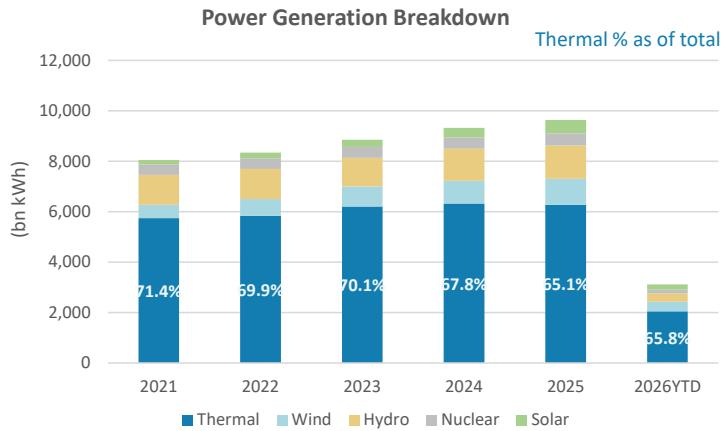

stacked bar chart

Power Generation Breakdown
| Year | Thermal (%) | Wind (%) | Hydro (%) | Nuclear (%) | Solar (%) |
|---|---|---|---|---|---|
| 2021 | 71.4 | 800 | 1500 | 300 | 200 |
| 2022 | 59.9 | 800 | 1500 | 300 | 200 |
| 2023 | 70.1 | 800 | 1500 | 300 | 200 |
| 2024 | 67.8 | 800 | 1500 | 300 | 200 |
| 2025 | 55.1 | 800 | 1500 | 300 | 200 |
| 2026YTD | 55.8 | 800 | 500 | 300 | 200 |
Thermal % as of total

Rainfall at Three Gorges Dam Remain Stable

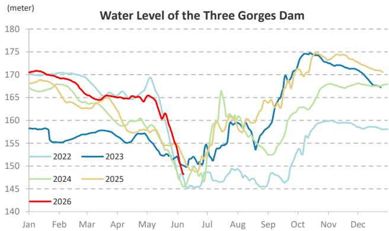

line chart

| Month | 2022 | 2023 | 2024 | 2025 | 2026 |
|-------|------|------|------|------|------|
| Jan   |      |      |      |      |      |
| Feb   |      |      |      |      |      |
| Mar   |      |      |      |      |      |
| Apr   |      |      |      |      |      |
| May   |      |      |      |      |      |
| Jun   |      |      |      |      |      |
| Jul   |      |      |      |      |      |
| Aug   |      |      |      |      |      |
| Sep   |      |      |      |      |      |
| Oct   |      |      |      |      |      |
| Nov   |      |      |      |      |      |
| Dec   |      |      |      |      |      |

Source: CCTD, SXCoal, NBS, MS.

Power Consumption Reaching a Seasonal High  
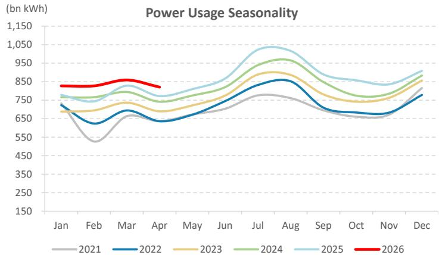

line chart

| Month | 2021 | 2022 | 2023 | 2024 | 2025 | 2026 |
|-------|------|------|------|------|------|------|
| Jan   | 700  | 680  | 670  | 750  | 760  | 800  |
| Feb   | 500  | 580  | 650  | 740  | 770  | 810  |
| Mar   | 650  | 660  | 700  | 780  | 800  | 830  |
| Apr   | 630  | 640  | 690  | 770  | 810  | 820  |
| May   | 650  | 670  | 710  | 790  | 830  | —    |
| Jun   | 680  | 700  | 740  | 820  | 860  | —    |
| Jul   | 720  | 750  | 780  | 850  | 950  | —    |
| Aug   | 740  | 780  | 800  | 880  | 980  | —    |
| Sep   | 710  | 730  | 760  | 840  | 940  | —    |
| Oct   | 680  | 700  | 730  | 810  | 910  | —    |
| Nov   | 660  | 680  | 710  | 790  | 890  | —    |
| Dec   | 750  | 760  | 780  | 830  | 920  | —    |

Downstream Coal Inventory has Been Around the Historical Average  
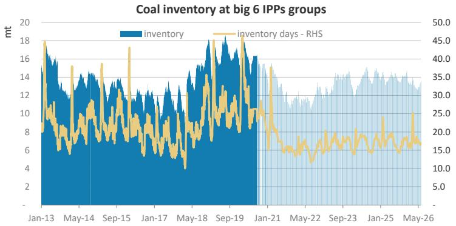

line chart

| Date    | inventory (mt) | inventory days - RHS |
|---------|----------------|----------------------|
| Jan-13  | ~18            | ~45                  |
| May-14  | ~14            | ~30                  |
| Sep-15  | ~17            | ~25                  |
| Jan-17  | ~10            | ~20                  |
| May-18  | ~14            | ~25                  |
| Sep-19  | ~18            | ~30                  |
| Jan-21  | ~16            | ~20                  |
| May-22  | ~10            | ~15                  |
| Sep-23  | ~14            | ~25                  |
| Jan-25  | ~16            | ~20                  |
| May-26  | ~14            | ~25                  |

## Gold

## Upward Price Trend

Gold Price – in CNY vs. USD  
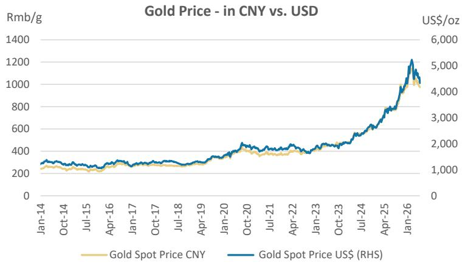

line chart

| Date   | Gold Spot Price CNY (Rmb/g) | Gold Spot Price US$ (US$/oz) |
|--------|-----------------------------|------------------------------|
| Jan-14 | ~250                        | ~1,000                       |
| Oct-14 | ~270                        | ~1,200                       |
| Jul-15 | ~280                        | ~1,300                       |
| Apr-16 | ~300                        | ~1,500                       |
| Jan-17 | ~320                        | ~1,700                       |
| Oct-17 | ~350                        | ~1,900                       |
| Jul-18 | ~380                        | ~2,100                       |
| Apr-19 | ~400                        | ~2,300                       |
| Jan-20 | ~450                        | ~2,500                       |
| Oct-20 | ~500                        | ~2,700                       |
| Jul-21 | ~550                        | ~2,900                       |
| Apr-22 | ~600                        | ~3,100                       |
| Jan-23 | ~650                        | ~3,300                       |
| Oct-23 | ~750                        | ~3,500                       |
| Jul-24 | ~850                        | ~3,700                       |
| Apr-25 | ~1,000                      | ~4,000                       |
| Jan-26 | ~1,200                      | ~5,000                       |

AUMs for Chinese Gold ETFs Have Been Rising  
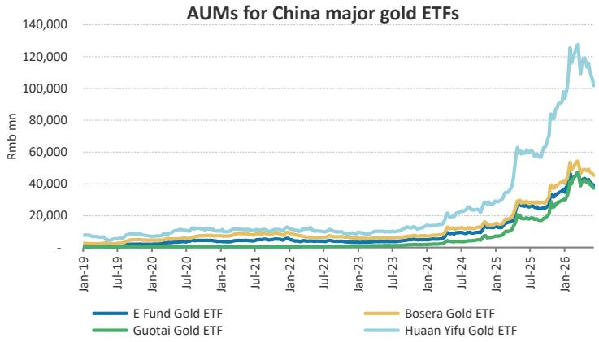

line chart

| Date   | E Fund Gold ETF | Bosera Gold ETF | Guotai Gold ETF | Huaan Yifu Gold ETF |
|--------|-----------------|-----------------|-----------------|---------------------|
| Jan-19 | ~5,000          | ~5,000          | ~5,000          | ~5,000              |
| Jul-19 | ~5,000          | ~5,000          | ~5,000          | ~5,000              |
| Jan-20 | ~5,000          | ~5,000          | ~5,000          | ~5,000              |
| Jul-20 | ~5,000          | ~5,000          | ~5,000          | ~5,000              |
| Jan-21 | ~5,000          | ~5,000          | ~5,000          | ~5,000              |
| Jul-21 | ~5,000          | ~5,000          | ~5,000          | ~5,000              |
| Jan-22 | ~5,000          | ~5,000          | ~5,000          | ~5,000              |
| Jul-22 | ~5,000          | ~5,000          | ~5,000          | ~5,000              |
| Jan-23 | ~5,000          | ~5,000          | ~5,000          | ~5,000              |
| Jul-23 | ~5,000          | ~5,000          | ~5,000          | ~5,000              |
| Jan-24 | ~5,000          | ~5,000          | ~5,000          | ~5,000              |
| Jul-24 | ~15,000         | ~15,000         | ~15,000         | ~15,000             |
| Jan-25 | ~25,000         | ~25,000         | ~25,000         | ~25,000             |
| Jul-25 | ~45,000         | ~45,000         | ~45,000         | ~45,000             |
| Jan-26 | ~65,000         | ~65,000         | ~65,000         | ~65,000             |
| Mar-26 | ~85,000         | ~85,000         | ~85,000         | ~85,000             |
| Jun-26 | ~115,000        | ~115,000        | ~115,000        | ~115,000            |

China is Building Gold Reserve  
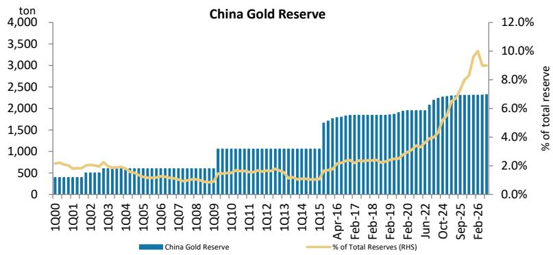

bar-line hybrid

China Gold Reserve
| Quarter | China Gold Reserve (ton) | % of Total Reserves (%) |
|---|---|---|
| 1Q00 | 450 | 2.0 |
| 1Q01 | 470 | 2.2 |
| 1Q02 | 500 | 2.3 |
| 1Q03 | 550 | 2.5 |
| 1Q04 | 600 | 2.4 |
| 1Q05 | 650 | 2.3 |
| 1Q06 | 680 | 2.2 |
| 1Q07 | 700 | 2.1 |
| 1Q08 | 720 | 2.0 |
| 1Q09 | 750 | 1.9 |
| 1Q10 | 1,050 | 2.1 |
| 1Q11 | 1,050 | 2.2 |
| 1Q12 | 1,050 | 2.3 |
| 1Q13 | 1,050 | 2.4 |
| 1Q14 | 1,050 | 2.5 |
| 1Q15 | 1,750 | 2.6 |
| Apr-16 | 1,850 | 3.0 |
| Feb-17 | 1,850 | 3.1 |
| Feb-18 | 1,850 | 3.2 |
| Feb-19 | 1,900 | 3.3 |
| Feb-20 | 1,950 | 3.5 |
| Jun-22 | 2,050 | 4.5 |
| Oct-24 | 2,300 | 6.5 |
| Sep-25 | 2,350 | 8.5 |
| Feb-26 | 2,350 | 9.5 |
The chart displays a stacked bar chart (bars) and a line chart (line). The x-axis represents time periods from Q1 to Q4, and the y-axis on the left measures reserves in tons (bar), while the right y-axis shows the percentage of total reserves (line). The data is already in English.

China has Been Catching up on Gold Reserves Among Central Banks  
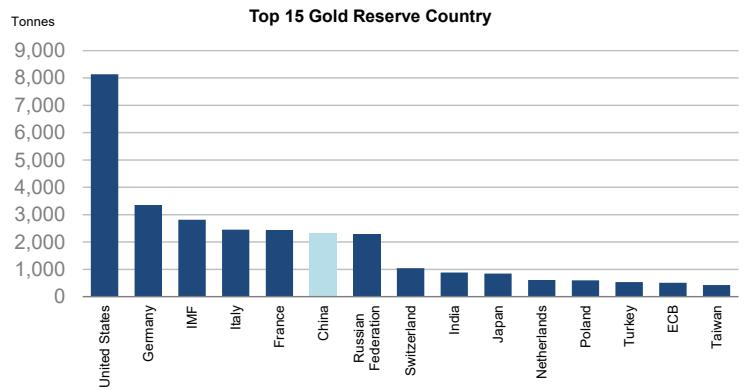

bar chart

Top 15 Gold Reserve Country
| Country | Reserves (Tonnes) |
| :--- | :--- |
| United States | 8000 |
| Germany | 3300 |
| IMF | 2700 |
| Italy | 2400 |
| France | 2400 |
| China | 2300 |
| Russian Federation | 2200 |
| Switzerland | 1000 |
| India | 900 |
| Japan | 800 |
| Netherlands | 600 |
| Poland | 600 |
| Turkey | 550 |
| ECB | 500 |
| Taiwan | 400 |

Source: World Gold Council, MS.

This report references jurisdiction(s) or person(s) which may be the subject of economic sanctions. Readers are solely responsible for ensuring that their investment activities are carried out in compliance with applicable laws.

## Disclosure Section

The information and opinions in MS were prepared or are disseminated by MS Asia Limited (which accepts the responsibility for its contents) and/or MS Asia (Singapore) Pte. (Registration number 199206298Z) and/or MS Asia (Singapore) Securities Pte Ltd (Registration number 200008434H), regulated by the Monetary Authority of Singapore (which accepts legal responsibility for its contents and should be contacted with respect to any matters arising from, or in connection with, MS), and/or MS Taiwan Limited and/or MS & Co International plc, Seoul Branch, and/or MS Australia Limited (A.B.N. 67 003 734 576, holder of Australian financial services license No. 233742, which accepts responsibility for its contents), and/or MS Wealth Management Australia Pty Ltd (A.B.N. 19 009 145 555, holder of Australian financial services license No. 240813, which accepts responsibility for its contents), and/or MS India Company Private Limited having Corporate Identification No (CIN) U22990MH1998PTC115305, regulated by the Securities and Exchange Board of India ("SEBI") and holder of licenses as a Research Analyst (SEBI Registration No. INH000001105); Stock Broker (SEBI Stock Broker Registration No. INZ000244438), Merchant Banker (SEBI Registration No. INM000011203), and depository participant with National Securities Depository Limited (SEBI Registration No. IN-DP-NSDL-567-2021) having registered office at Altimus, Level 39 & 40, Pandurang Budhkar Marg, Worli, Mumbai 400018, India; Telephone no. +91-22-61181000; Compliance Officer Details: Mr. Tejarshi Hardas, Tel. No.: +91-22-61181000 or Email: tejarshi.hardas@morganstanley.com; Grievance officer details: Mr. Tejarshi Hardas, Tel. No.: +91-22-61181000 or Email: msic-compliance@morganstanley.com which accepts the responsibility for its contents and should be contacted with respect to any matters arising from, or in connection with, MS, and their affiliates (collectively, "MS"). MS India Company Private Limited (MSICPL) may use AI tools in providing research services. All recommendations contained herein are made by the duly qualified research analysts.

For important disclosures, stock price charts and equity rating histories regarding companies that are the subject of this report, please see the MS Disclosure Website at www.morganstanley.com/eqr/disclosures/webapp/generalresearch, or contact your investment representative or MS at 1585 Broadway, (Attention: Research Management), New York, NY, 10036 USA.

For valuation methodology and risks associated with any recommendation, rating or price target referenced in this research report, please contact the Client Support Team as follows: US/Canada +1800 303-2495; Hong Kong +852 2848-5999; Latin America +1718 754-5444 (U.S.); London +44 (0)20-7425-8169; Singapore +65 6834-6860; Sydney +61(0)2-9770-1505; Tokyo +81(0)3-6836-9000. Alternatively you may contact your investment representative or MS at 1585 Broadway, (Attention: Research Management), New York, NY 10036 USA.

## Analyst Certification

The following analysts hereby certify that their views about the companies and their securities discussed in this report are accurately expressed and that they have not received and will not receive direct or indirect compensation in exchange for expressing specific recommendations or views in this report: Chris Jiang; Hannah Yang, CFA; Rachel L. Zhang.

## Global Research Conflict Management Policy

MS has been published in accordance with our conflict management policy, which is available at www.morganstanley.com/institutional/research/conflictpolicies. A Portuguese version of the policy can be found at www.morganstanley.com.br

## Important Regulatory Disclosures on Subject Companies

As of May 29, 2026, MS beneficially owned 1% or more of a class of common equity securities of the following companies covered in MS: Aluminum Corp. of China Ltd., Anhui Honglu Steel Construction, Asia Cement, Beijing Oriental Yuhong Waterproof Techn, CMOC Group Ltd, CNGR Advanced Material Co., Ltd., Flat Glass Group Co Ltd, Ganfeng Lithium Co. Ltd., GEM Co Ltd, Jiangxi Copper, JL Mag Rare-Earth Co. Ltd, Shandong Gold Mining Co. Ltd, Shenzhen Kedali Industry Co Ltd, Sinomine Resource Group Co Ltd, Taiwan Cement, Tianqi Lithium Industries Inc., Zijin Mining Group.

Within the last 12 months, MS managed or co-managed a public offering (or 144A offering) of securities of CNGR Advanced Material Co., Ltd., Zijin Gold International, Zijin Mining Group.

Within the last 12 months, MS has received compensation for investment banking services from Zijin Mining Group.

In the next 3 months, MS expects to receive or intends to seek compensation for investment banking services from Aluminum Corp. of China Ltd., Anhui Conch Cement Co. Ltd, Asia Cement, Beijing Oriental Yuhong Waterproof Techn, China National Building Material Company, China Resources Building Materials, CMOC Group Ltd, CNGR Advanced Material Co., Ltd., Ganfeng Lithium Co. Ltd., Huaxin Building Materials, Jiangxi Copper, MMG Ltd, Shenzhen Kedali Industry Co Ltd, Taiwan Cement, Tianqi Lithium Industries Inc., Zhaojin Mining Industry, Zhejiang Huayou Cobalt Co Ltd, Zijin Gold International, Zijin Mining Group.

Within the last 12 months, MS has received compensation for products and services other than investment banking services from China Jushi, China National Building Material Company, China Steel Corp., CMOC Group Ltd, Tianqi Lithium Industries Inc., Xinyi Glass Holding Limited, Zijin Mining Group.

Within the last 12 months, MS has provided or is providing investment banking services to, or has an investment banking client relationship with, the following company: Aluminum Corp. of China Ltd., Anhui Conch Cement Co. Ltd, Asia Cement, Beijing Oriental Yuhong Waterproof Techn, China National Building Material Company, China Resources Building Materials, CMOC Group Ltd, CNGR Advanced Material Co., Ltd., Ganfeng Lithium Co. Ltd., Huaxin Building Materials, Jiangxi Copper, MMG Ltd, Shenzhen Kedali Industry Co Ltd, Taiwan Cement, Tianqi Lithium Industries Inc., Zhaojin Mining Industry, Zhejiang Huayou Cobalt Co Ltd, Zijin Gold International, Zijin Mining Group.

Within the last 12 months, MS has either provided or is providing non-investment banking, securities-related services to and/or in the past has entered into an agreement to provide services or has a client relationship with the following company: China Jushi, China National Building Material Company, China Steel Corp., CMOC Group Ltd, CNGR Advanced Material Co., Ltd., Ganfeng Lithium Co. Ltd., Taiwan Cement, Tianqi Lithium Industries Inc., Xinyi Glass Holding Limited, Zijin Gold International, Zijin Mining Group.

The equity research analysts or strategists principally responsible for the preparation of MS have received compensation based upon various factors, including quality of research, investor client feedback, stock picking, competitive factors, firm revenues and overall investment banking revenues. Equity Research analysts' or strategists' compensation is not linked to investment banking or capital markets transactions performed by MS or the profitability or revenues of particular

trading desks.

MS and its affiliates do business that relates to companies/instruments covered in MS, including market making, providing liquidity, fund management, commercial banking, extension of credit, investment services and investment banking. MS sells to and buys from customers the securities/instruments of companies covered in MS on a principal basis. MS may have a position in the debt of the Company or instruments discussed in this report. MS trades or may trade as principal in the debt securities (or in related derivatives) that are the subject of the debt research report.

Certain disclosures listed above are also for compliance with applicable regulations in non-US jurisdictions.

## STOCK RATINGS

MS uses a relative rating system using terms such as Overweight, Equal-weight, Not-Rated or Underweight (see definitions below). MS does not assign ratings of Buy, Hold or Sell to the stocks we cover. Overweight, Equal-weight, Not-Rated and Underweight are not the equivalent of buy, hold and sell. Investors should carefully read the definitions of all ratings used in MS. In addition, since MS contains more complete information concerning the analyst's views, investors should carefully read MS, in its entirety, and not infer the contents from the rating alone. In any case, ratings (or research) should not be used or relied upon as investment advice. An investor's decision to buy or sell a stock should depend on individual circumstances (such as the investor's existing holdings) and other considerations.

## Global Stock Ratings Distribution

(as of May 31, 2026)

The Stock Ratings described below apply to MS's Fundamental Equity Research and do not apply to Debt Research produced by the Firm.

For disclosure purposes only (in accordance with FINRA requirements), we include the category headings of Buy, Hold, and Sell alongside our ratings of Overweight, Equal-weight, Not-Rated and Underweight. MS does not assign ratings of Buy, Hold or Sell to the stocks we cover. Overweight, Equal-weight, Not-Rated and Underweight are not the equivalent of buy, hold, and sell but represent recommended relative weightings (see definitions below). To satisfy regulatory requirements, we correspond Overweight, our most positive stock rating, with a buy recommendation; we correspond Equal-weight and Not-Rated to hold and Underweight to sell recommendations, respectively.

<table><tr><td></td><td colspan="2">Coverage Universe</td><td colspan="3">Investment Banking Clients (IBC)</td><td colspan="2">Other Material Investment Services Clients (MISC)</td></tr><tr><td>Stock Rating Category</td><td>Count</td><td>% of Total</td><td>Count</td><td>% of Total IBC</td><td>% of Rating Category</td><td>Count</td><td>% of Total Other MISC</td></tr><tr><td>Overweight/Buy</td><td>1542</td><td>42%</td><td>465</td><td>51%</td><td>30%</td><td>707</td><td>43%</td></tr><tr><td>Equal-weight/Hold</td><td>1571</td><td>43%</td><td>369</td><td>40%</td><td>23%</td><td>723</td><td>44%</td></tr><tr><td>Not-Rated/Hold</td><td>3</td><td>0%</td><td>0</td><td>0%</td><td>0%</td><td>1</td><td>0%</td></tr><tr><td>Underweight/Sell</td><td>551</td><td>15%</td><td>86</td><td>9%</td><td>16%</td><td>201</td><td>12%</td></tr><tr><td>Total</td><td>3,667</td><td></td><td>920</td><td></td><td></td><td>1632</td><td></td></tr></table>

Data include common stock and ADRs currently assigned ratings. Investment Banking Clients are companies from whom MS received investment banking compensation in the last 12 months. Due to rounding off of decimals, the percentages provided in the "% of total" column may not add up to exactly 100 percent.

## Analyst Stock Ratings

Overweight (O). The stock's total return is expected to exceed the average total return of the analyst's industry (or industry team's) coverage universe, on a risk-adjusted basis, over the next 12-18 months.

Equal-weight (E). The stock's total return is expected to be in line with the average total return of the analyst's industry (or industry team's) coverage universe, on a risk-adjusted basis, over the next 12-18 months.

Not-Rated (NR). Currently the analyst does not have adequate conviction about the stock's total return relative to the average total return of the analyst's industry (or industry team's) coverage universe, on a risk-adjusted basis, over the next 12-18 months.

Underweight (U). The stock's total return is expected to be below the average total return of the analyst's industry (or industry team's) coverage universe, on a risk-adjusted basis, over the next 12-18 months.

Unless otherwise specified, the time frame for price targets included in MS is 12 to 18 months.

## Analyst Industry Views

Attractive (A): The analyst expects the performance of his or her industry coverage universe over the next 12-18 months to be attractive vs. the relevant broad market benchmark, as indicated below.

In-Line (I): The analyst expects the performance of his or her industry coverage universe over the next 12-18 months to be in line with the relevant broad market benchmark, as indicated below.

Cautious (C): The analyst views the performance of his or her industry coverage universe over the next 12-18 months with caution vs. the relevant broad market benchmark, as indicated below.

Benchmarks for each region are as follows: North America - S&P 500; Latin America - relevant MSCI country index or MSCI Latin America Index; Europe - MSCI Europe; Japan - TOPIX; Asia - relevant MSCI country index or MSCI sub-regional index or MSCI AC Asia Pacific ex Japan Index.

## Important Disclosures for MS Smith Barney LLC Customers

Important disclosures regarding any material conflict of interest that can reasonably be expected to have influenced MS Smith Barney LLC's choice of a third-party research provider or the subject company of a third-party research report, are available on the MS Wealth Management disclosure website at www.morganstanley.com/online/researchdisclosures. For MS specific disclosures, you may refer to https://www.morganstanley.com/eqr/disclosures/webapp/generalresearch.

Each MS report is reviewed and approved on behalf of MS Smith Barney LLC. This review and approval is conducted by the same person who reviews the research report on behalf of MS. This could create a conflict of interest.

## Other Important Disclosures

MS policy is to update research reports as and when the Research Analyst and Research Management deem appropriate, based on developments with the issuer, the sector, or the market that may have a material impact on the research views or opinions stated therein. In addition, certain Research publications are intended to be updated on a regular periodic basis (weekly/monthly/quarterly/annual) and will ordinarily be updated with that frequency, unless the Research Analyst and Research Management determine that a different publication schedule is appropriate based on current conditions.

MS is not acting as a municipal advisor and the opinions or views contained herein are not intended to be, and do not constitute, advice within the meaning of Section 975 of the Dodd-Frank Wall Street Reform and Consumer Protection Act. MS produces an equity research product called a "Tactical Idea." Views contained in a "Tactical Idea" on a particular stock may be contrary to the recommendations or views expressed in research on the same stock. This may be the result of differing time horizons, methodologies, market events, or other factors. For all research available on a particular stock, please contact your sales representative or go to Matrix at http://www.morganstanley.com/matrix.

MS is provided to our clients through our proprietary research portal on Matrix and also distributed electronically by MS to clients. Certain, but not all, MS products are also made available to clients through third-party vendors or redistributed to clients through alternate electronic means as a convenience. For access to all available MS, please contact your sales representative or go to Matrix at http://www.morganstanley.com/matrix.Any access and/or use of MS is subject to MS's Terms of Use (http://www.morganstanley.com/terms.html). By accessing and/or using MS, you are indicating that you have read and agree to be bound by our Terms of Use (http://www.morganstanley.com/terms.html). In addition you consent to MS processing your personal data and using cookies in accordance with our Privacy Policy and our Global Cookies Policy (http://www.morganstanley.com/privacy\_pledge.html), including for the purposes of setting your preferences and to collect readership data so that we can deliver better and more personalized service and products to you. To find out more information about how MS processes personal data, how we use cookies and how to reject cookies see our Privacy Policy and our Global Cookies Policy (http://www.morganstanley.com/privacy\_pledge.html). Please use the provided link to review the Terms and Conditions and Most Important Terms and Conditions for MS India Company Private Limited (https://www.morganstanley.com/assets/pdfs/about-us-global-offices/india/Terms\_and\_conditions.pdf) and the following link to review the audit report (https://ny.matrix.ms.com/eqr/research/webapp/researchdocs/MSICPL\_Morgan\_Stanley\_Research\_Audit\_Report.pdf).

If you do not agree to our Terms of Use and/or if you do not wish to provide your consent to MS processing your personal data or using cookies please do not access our research.

MS does not provide individually tailored investment advice. MS has been prepared without regard to the circumstances and objectives of those who receive it. MS recommends that investors independently evaluate particular investments and strategies, and encourages investors to seek the advice of a financial adviser. The appropriateness of an investment or strategy will depend on an investor's circumstances and objectives. The securities, instruments, or strategies discussed in MS may not be suitable for all investors, and certain investors may not be eligible to purchase or participate in some or all of them. MS is not an offer to buy or sell or the solicitation of an offer to buy or sell any security/instrument or to participate in any particular trading strategy. The value of and income from your investments may vary because of changes in interest rates, foreign exchange rates, default rates, prepayment rates, securities/instruments prices, market indexes, operational or financial conditions of companies or other factors. There may be time limitations on the exercise of options or other rights in securities/instruments transactions. Past performance is not necessarily a guide to future performance. Estimates of future performance are based on assumptions that may not be realized. If provided, and unless otherwise stated, the closing price on the cover page is that of the primary exchange for the subject company's securities/instruments.

The fixed income research analysts, strategists or economists principally responsible for the preparation of MS have received compensation based upon various factors, including quality, accuracy and value of research, firm profitability or revenues (which include fixed income trading and capital markets profitability or revenues), client feedback and competitive factors. Fixed Income Research analysts', strategists' or economists' compensation is not linked to investment banking or capital markets transactions performed by MS or the profitability or revenues of particular trading desks.

The "Important Regulatory Disclosures on Subject Companies" section in MS lists all companies mentioned where MS owns $1\%$ or more of a class of common equity securities of the companies. For all other companies mentioned in MS, MS may have an investment of less than $1\%$ in securities/instruments or derivatives of securities/instruments of companies and may trade them in ways different from those discussed in MS. Employees of MS not involved in the preparation of MS may have investments in securities/instruments or derivatives of securities/instruments of companies mentioned and may trade them in ways different from those discussed in MS. Derivatives may be issued by MS or associated persons.

With the exception of information regarding MS, MS is based on public information. MS makes every effort to use reliable, comprehensive information, but we make no representation that it is accurate or complete. We have no obligation to tell you when opinions or information in MS change apart from when we intend to discontinue equity research coverage of a subject company. Facts and views presented in MS have not been reviewed by, and may not reflect information known to, professionals in other MS business areas, including investment banking personnel.

MS personnel may participate in company events such as site visits and are generally prohibited from accepting payment by the company of associated expenses unless pre-approved by authorized members of Research management. MS may make investment decisions that are inconsistent with the recommendations or views in this report.

To our readers based in Taiwan or trading in Taiwan securities/instruments: Information on securities/instruments that trade in Taiwan is distributed by MS Taiwan Limited ("MSTL"). Such information is for your reference only. The reader should independently evaluate the investment risks and is solely responsible for their investment decisions. MS may not be distributed to the public media or quoted or used by the public media without the express written consent of MS. Any non-customer reader within the scope of Article 7-1 of the Taiwan Stock Exchange Recommendation Regulations accessing and/or receiving MS is not permitted to provide MS to any third party (including but not limited to related parties, affiliated companies and any other third parties) or engage in any activities regarding MS which may create or give the appearance of creating a conflict of interest. Information on securities/instruments that do not trade in Taiwan is for informational purposes only and is not to be construed as a recommendation or a solicitation to trade in such securities/instruments. MSTL may not execute transactions for clients in these securities/instruments.

Certain information in MS was sourced by employees of the Shanghai Representative Office of MS Asia Limited for the use of MS Asia Limited.

MS is not incorporated under PRC law and the research in relation to this report is conducted outside the PRC. MS does not constitute an offer to sell or the solicitation of an offer to buy any securities in the PRC. PRC investors shall have the relevant qualifications to invest in such securities and shall be responsible for obtaining all relevant approvals, licenses, verifications and/or registrations from the relevant governmental authorities themselves. Neither this report nor any part of it is intended as, or shall constitute, provision of any consultancy or advisory service of securities investment as defined under PRC law. Such information is provided for your reference only.

MS is disseminated in Brazil by MS C.T.V.M. S.A. located at Av. Brigadeiro Faria Lima, 3600, 6th floor, São Paulo - SP, Brazil; and is regulated by the Comissão de Valores Mobiliários; in Mexico by MS México, Casa de Bolsa, S.A. de C.V which is regulated by Comision Nacional Bancaria y de Valores. Paseo de los Tamarindos 90, Torre 1, Col. Bosques de las Lomas Floor 29, 05120 Mexico City; in Japan by MS MUFG Securities Co., Ltd. and, for Commodities related research reports only, MS Capital Group Japan Co., Ltd; in Hong Kong by MS Asia Limited (which accepts responsibility for its contents) and by MS Bank Asia Limited; in Singapore by MS Asia (Singapore) Pte. (Registration number 199206298Z) and/or MS Asia (Singapore) Securities Pte Ltd (Registration number 200008434H), regulated by the Monetary Authority of Singapore (which accepts legal responsibility for its contents and should be contacted with respect to any matters arising from, or in connection with, MS) and by MS Bank Asia Limited, Singapore Branch (Registration number T14FC0118); in Australia to "wholesale clients" within the meaning of the Australian Corporations Act by MS Australia Limited A.B.N. 67 003 734 576, holder of Australian financial services license No. 23374-2, which accepts responsibility for its contents; in Australia to "wholesale clients" and "retail clients" within the meaning of the Australian Corporations Act by MS Wealth Management Australia Pty Ltd (A.B.N. 19 009 145 555, holder of Australian financial services license No. 240813, which accepts responsibility for its contents; in Korea by MS & Co International plc, Seoul Branch; in India by MS India Company Private Limited having Corporate Identification No (CIN) U22990MH1998PTC115305, regulated by the Securities and Exchange Board of India ("SEBI") and holder of licenses as a Research Analyst (SEBI Registration No. INH000001105); Stock Broker (SEBI Stock Broker Registration No. INZ000244438), Merchant Banker (SEBI Registration No. INM000011203), and depository participant with National Securities Depository Limited (SEBI Registration No. IN-DP-NSDL-567-2021) having registered office at Altimus, Level 39 & 40, Pandurang Budhkar Marg, Worli, Mumbai 400018, India; Telephone no. +91-22-61181000; Compliance Officer Details: Mr. Tejarshi Hardas, Tel. No.: +91-22-61181000 or Email: tejarshi.hardas@morganstanley.com; Grievance officer details: Mr. Tejarshi Hardas, Tel. No.: +91-22-61181000 or Email: msic-compliance@morganstanley.com. MS India Company Private Limited (MSICPL) may use AI tools in providing research services. All recommendations contained herein are made by the duly qualified research analysts; in Canada by MS Canada Limited; in Germany and the European Economic Area where required by MS Europe S.E., authorised and regulated by Bundesanstalt fuer Finanzdienstleistungsaufsicht (BaFin) under the reference number 149169; in the US by MS & Co. LLC, which accepts responsibility for its contents. MS & Co. International plc, authorized by the Prudential Regulation Authority and regulated by the Financial Conduct Authority and the Prudential Regulation Authority, disseminates in the UK research that it has prepared, and research which has been prepared by any of its affiliates, only to persons who (i) are investment professionals falling within Article 19(5) of the Financial Services and Markets Act 2000 (Financial Promotion) Order 2005 (as amended, the "Order"); (ii) are persons who are high net worth entities falling within Article 49(2)(a) to (d) of the Order; or (iii) are persons to whom an invitation or inducement to engage in investment activity (within the meaning of section 21 of the Financial Services and Markets Act 2000, as amended) may otherwise lawfully be communicated or caused to be communicated. RMB MS Proprietary Limited is a member of the JSE Limited and A2X (Pty) Ltd. RMB MS Proprietary Limited is a joint venture owned equally by MS International Holdings Inc. and RMB Investment Advisory (Proprietary) Limited, which is wholly owned by FirstRand Limited. The information in MS is being disseminated by MS Saudi Arabia, regulated by the Capital Market Authority in the Kingdom of Saudi Arabia, and is directed at Sophisticated investors only.

MS Hong Kong Securities Limited is the liquidity provider/market maker for securities of Aluminum Corp. of China Ltd., Anhui Conch Cement Co. Ltd, China Hongqiao Group, China National Building Material Company, CMOC Group Ltd, Ganfeng Lithium Co. Ltd., Jiangxi Copper, MMG Ltd, Nine Dragons Paper, Shandong Gold Mining Co. Ltd, Zhaojin Mining Industry, Zijin Gold International, Zijin Mining Group listed on the Stock Exchange of Hong Kong Limited. An updated list can be found on HKEx website: http://www.hkex.com.hk.

The information in MS is being communicated by MS & Co. International plc (DIFC Branch), regulated by the Dubai Financial Services Authority (the DFSA) or by MS & Co. International plc (ADGM Branch), regulated by the Financial Services Regulatory Authority Abu Dhabi (the FSRA), and is directed at Professional Clients only, as defined by the DFSA or the FSRA, respectively. The financial products or financial services to which this research relates will only be made available to a customer who we are satisfied meets the regulatory criteria of a Professional Client. A distribution of the different MS Research ratings or recommendations, in percentage terms for Investments in each sector covered, is available upon request from your sales representative.

The information in MS is being communicated by MS & Co. International plc (QFC Branch), regulated by the Qatar Financial Centre Regulatory Authority (the QFCRA), and is directed at business customers and market counterparties only and is not intended for Retail Customers as defined by the QFCRA.

As required by the Capital Markets Board of Turkey, investment information, comments and recommendations stated here, are not within the scope of investment advisory activity. Investment advisory service is provided exclusively to persons based on their risk and income preferences by the authorized firms. Comments and recommendations stated here are general in nature. These opinions may not fit to your financial status, risk and return preferences. For this reason, to make an investment decision by relying solely to this information stated here may not bring about outcomes that fit your expectations.

The trademarks and service marks contained in MS are the property of their respective owners. Third-party data providers make no warranties or representations relating to the accuracy, completeness, or timeliness of the data they provide and shall not have liability for any damages relating to such data. The Global Industry Classification Standard (GICS) was developed by and is the exclusive property of MSCI and S&P.

MS, or any portion thereof may not be reprinted, sold or redistributed without the written consent of MS.

Indicators and trackers referenced in MS may not be used as, or treated as, a benchmark under Regulation EU 2016/1011, or any other similar framework.

The issuers and/or fixed income products recommended or discussed in certain fixed income research reports may not be continuously followed. Accordingly, investors should regard those fixed income research reports as providing stand-alone analysis and should not expect continuing analysis or additional reports relating to such issuers and/or individual fixed income products.

MS may hold, from time to time, material financial and commercial interests regarding the company subject to the Research report.

Registration granted by SEBI and certification from the National Institute of Securities Markets (NISM) in no way guarantee performance of the intermediary or provide any assurance of returns to investors. Investment in securities market are subject to market risks. Read all the related documents carefully before investing.

INDUSTRY COVERAGE: Greater China Materials

<table><tr><td>COMPANY (TICKER)</td><td>RATING (AS OF)</td><td>PRICE* (06/10/2026)</td></tr><tr><td colspan="3">Chris Jiang</td></tr><tr><td>Anhui Honglu Steel Construction (002541.SZ)</td><td>U (12/16/2025)</td><td>Rmb17.32</td></tr><tr><td>CGN Mining Co Ltd (1164.HK)</td><td>O (01/18/2023)</td><td>HK$2.74</td></tr><tr><td>Chengxin Lithium Group Co. Ltd. (002240.SZ)</td><td>E (12/16/2025)</td><td>Rmb47.70</td></tr><tr><td>GEM Co Ltd (002340.SZ)</td><td>U (04/20/2026)</td><td>Rmb7.02</td></tr><tr><td>Shenzhen Kedali Industry Co Ltd (002850.SZ)</td><td>O (08/21/2023)</td><td>Rmb187.53</td></tr><tr><td>Sinomine Resource Group Co Ltd (002738.SZ)</td><td>O (12/16/2025)</td><td>Rmb57.15</td></tr><tr><td>Yongxing Special Materials Technology (002756.SZ)</td><td>E (11/25/2022)</td><td>Rmb59.88</td></tr><tr><td>Zhejiang Huayou Cobalt Co Ltd (603799.SS)</td><td>O (10/08/2025)</td><td>Rmb47.15</td></tr><tr><td colspan="3">Hannah Yang, CFA</td></tr><tr><td>China Hongqiao Group (1378.HK)</td><td>O (09/15/2023)</td><td>HK$26.58</td></tr><tr><td>Chuangxin Industries Holdings Ltd. (2788.HK)</td><td>O (03/19/2026)</td><td>HK$18.27</td></tr><tr><td>Flat Glass Group Co Ltd (6865.HK)</td><td>O (07/30/2020)</td><td>HK$7.82</td></tr><tr><td>Flat Glass Group Co Ltd (601865.SS)</td><td>O (07/30/2020)</td><td>Rmb10.95</td></tr><tr><td>MMG Ltd (1208.HK)</td><td>O (12/16/2024)</td><td>HK$8.11</td></tr><tr><td>Shandong Pharmaceutical Glass Co. Ltd. (600529.SS)</td><td>U (04/20/2026)</td><td>Rmb18.66</td></tr><tr><td>Shenhuo Coal and Power (000933.SZ)</td><td>O (09/02/2025)</td><td>Rmb26.25</td></tr><tr><td>Tianshan Aluminum (002532.SZ)</td><td>O (03/19/2026)</td><td>Rmb13.39</td></tr><tr><td>Xinyi Glass Holding Limited (0868.HK)</td><td>U (05/14/2024)</td><td>HK$9.40</td></tr><tr><td>Zhongfu Shenying Carbon Fiber Co Ltd (688295.SS)</td><td>O (08/25/2023)</td><td>Rmb47.10</td></tr><tr><td colspan="3">Rachel L Zhang</td></tr><tr><td>Aluminum Corp. of China Ltd. (601600.SS)</td><td>O (11/30/2020)</td><td>Rmb10.10</td></tr><tr><td>Aluminum Corp. of China Ltd. (2600.HK)</td><td>O (11/30/2020)</td><td>HK$9.74</td></tr><tr><td>Baoshan Iron &amp; Steel (600019.SS)</td><td>O (01/16/2016)</td><td>Rmb5.74</td></tr><tr><td>Beijing New Building Materials (000786.SZ)</td><td>O (04/09/2024)</td><td>Rmb21.45</td></tr><tr><td>Beijing Oriental Yuhong Waterproof Techn (002271.SZ)</td><td>E (09/25/2024)</td><td>Rmb12.06</td></tr><tr><td>China Jushi (600176.SS)</td><td>O (12/22/2020)</td><td>Rmb39.37</td></tr><tr><td>China Lesso Group Holdings Ltd (2128.HK)</td><td>U (10/08/2025)</td><td>HK$4.15</td></tr><tr><td>China Steel Corp. (2002.TW)</td><td>U (12/16/2025)</td><td>NT$18.70</td></tr><tr><td>CMOC Group Ltd (3993.HK)</td><td>O (09/24/2019)</td><td>HK$16.27</td></tr><tr><td>CMOC Group Ltd (603993.SS)</td><td>O (06/21/2024)</td><td>Rmb16.79</td></tr><tr><td>CNGR Advanced Material Co., Ltd. (300919.SZ)</td><td>E (01/12/2026)</td><td>Rmb45.84</td></tr><tr><td>CNGR Advanced Material Co., Ltd. (2579.HK)</td><td>O (01/12/2026)</td><td>HK$29.52</td></tr><tr><td>FangDa Carbon New Material Co. Ltd. (600516.SS)</td><td>U (12/16/2024)</td><td>Rmb5.67</td></tr><tr><td>Ganfeng Lithium Co. Ltd. (002460.SZ)</td><td>O (04/20/2026)</td><td>Rmb67.60</td></tr><tr><td>Ganfeng Lithium Co. Ltd. (1772.HK)</td><td>O (12/16/2025)</td><td>HK$55.00</td></tr><tr><td>Henan Liliang Diamond Co. Ltd (301071.SZ)</td><td>U (04/20/2026)</td><td>Rmb70.50</td></tr><tr><td>Jiangsu Dingsheng New Materials (603876.SS)</td><td>U (04/20/2026)</td><td>Rmb24.69</td></tr><tr><td>Jiangxi Copper (0358.HK)</td><td>O (10/08/2025)</td><td>HK$32.50</td></tr><tr><td>Jiangxi Copper (600362.SS)</td><td>O (10/08/2025)</td><td>Rmb40.49</td></tr><tr><td>JL Mag Rare-Earth Co. Ltd (6680.HK)</td><td>O (04/23/2025)</td><td>HK$17.74</td></tr><tr><td>JL Mag Rare-Earth Co. Ltd (300748.SZ)</td><td>O (04/23/2025)</td><td>Rmb29.41</td></tr><tr><td>Nine Dragons Paper (2689.HK)</td><td>E (01/04/2023)</td><td>HK$6.60</td></tr><tr><td>Shandong Gold Mining Co. Ltd (600547.SS)</td><td>O (04/23/2025)</td><td>Rmb26.61</td></tr><tr><td>Shandong Gold Mining Co. Ltd (1787.HK)</td><td>O (12/12/2024)</td><td>HK$21.08</td></tr><tr><td>Shandong Nanshan Aluminium Co. (600219.SS)</td><td>O (11/30/2020)</td><td>Rmb4.56</td></tr><tr><td>Tianqi Lithium Industries Inc. (9696.HK)</td><td>O (12/16/2025)</td><td>HK$43.76</td></tr><tr><td>Tianqi Lithium Industries Inc. (002466.SZ)</td><td>O (04/20/2026)</td><td>Rmb59.48</td></tr><tr><td>Weixing New Building Materials (002372.SZ)</td><td>U (10/08/2025)</td><td>Rmb9.46</td></tr><tr><td>Zhaojin Mining Industry (1818.HK)</td><td>O (06/21/2024)</td><td>HK$18.52</td></tr><tr><td>Zijin Gold International (2259.HK)</td><td>O (11/06/2025)</td><td>HK$103.30</td></tr><tr><td>Zijin Mining Group (2899.HK)</td><td>O (11/06/2025)</td><td>HK$29.72</td></tr><tr><td>Zijin Mining Group (601899.SS)</td><td>O (11/06/2025)</td><td>Rmb27.70</td></tr></table>

Stock Ratings are subject to change. Please see latest research for each company.  
\* Historical prices are not split adjusted.

INDUSTRY COVERAGE: Greater China Cement

<table><tr><td>COMPANY (TICKER)</td><td>RATING (AS OF)</td><td>PRICE* (06/10/2026)</td></tr><tr><td colspan="3">Rachel L Zhang</td></tr><tr><td>Anhui Conch Cement Co. Ltd (0914.HK)</td><td>E (04/20/2026)</td><td>HK$18.15</td></tr><tr><td>Anhui Conch Cement Co. Ltd (600585.SS)</td><td>E (04/20/2026)</td><td>Rmb18.78</td></tr><tr><td>Asia Cement (1102.TW)</td><td>U (04/01/2021)</td><td>NT$34.40</td></tr><tr><td>China National Building Material Company (3323.HK)</td><td>O (04/07/2025)</td><td>HK$4.83</td></tr><tr><td>China Resources Building Materials (1313.HK)</td><td>U (04/20/2026)</td><td>HK$1.23</td></tr><tr><td>Huaxin Building Materials (6655.HK)</td><td>O (10/17/2025)</td><td>HK$13.58</td></tr><tr><td>Huaxin Building Materials (600801.SS)</td><td>O (04/14/2017)</td><td>Rmb18.35</td></tr><tr><td>Taiwan Cement (1101.TW)</td><td>U (04/01/2021)</td><td>NT$23.90</td></tr><tr><td>West China Cement (2233.HK)</td><td>U (04/20/2026)</td><td>HK$1.63</td></tr></table>

Stock Ratings are subject to change. Please see latest research for each company.  
\* Historical prices are not split adjusted.

© 2026 MS