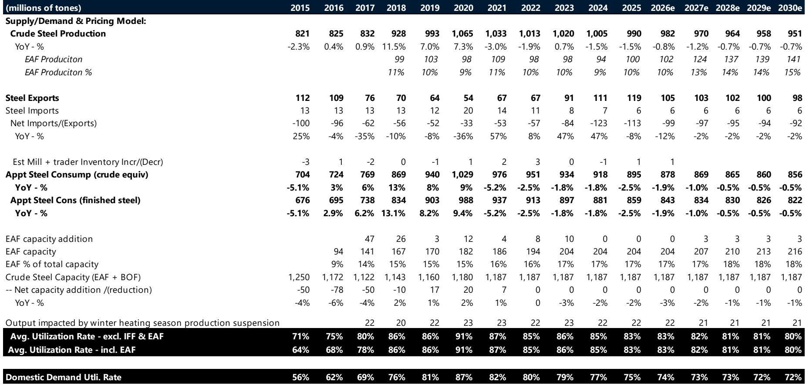
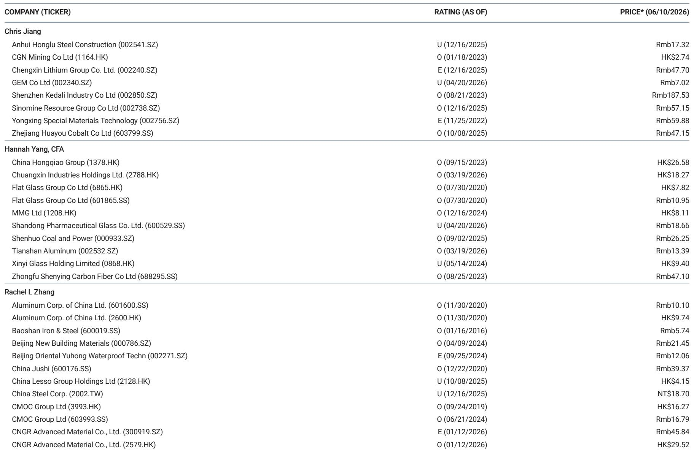
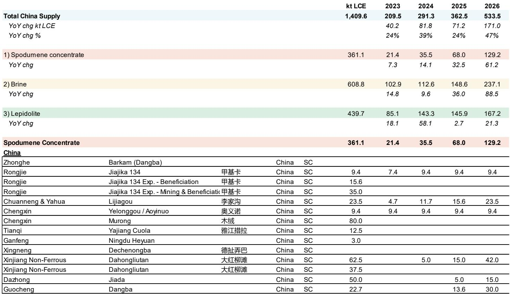

# Supply Disruptions and Structural Demand Shifts Are Reshaping China Materials: Why Selective Exposure Matters Now

The narrative around China materials has shifted. For years, the conversation centered on overcapacity, slowing domestic demand, and a prolonged property downturn. That story is no longer sufficient. A more complex reality is emerging: supply disruptions are tightening markets across multiple commodities, while new demand sources from energy storage systems and artificial intelligence are creating pockets of genuine growth. This is not a broad recovery story. It is a story of divergence, where the winners and losers will be determined by which materials sit at the intersection of constrained supply and structural demand.

The conventional wisdom that China materials are a homogeneous basket of cyclical exposures is outdated. What we are seeing is a selective re-rating driven by idiosyncratic factors. Aluminum, copper, lithium, uranium, gold, and glass fiber are the materials that stand out. Each has a distinct supply-side story that is not being fully priced by consensus. The market is still anchored to macro pessimism, but the micro dynamics are telling a different story. Investors who wait for a broad-based China recovery will miss the opportunity in these specific sub-sectors.

The case for selective exposure is not just about commodity price forecasts. It is about understanding that the traditional correlation between China GDP growth and materials demand has broken down. The economy is rebalancing away from property-led investment toward manufacturing, green energy, and technology. This rebalancing creates winners and losers. The winners are the materials that feed into the new economy. The losers are the ones tied to legacy construction. The key insight is that the supply side is equally important. Even if demand growth is modest, supply disruptions can create significant price upside.

This article argues that the most compelling opportunities in China materials today are those where supply constraints are structural, not cyclical, and where demand is driven by secular trends rather than policy stimulus. The report from a global investment bank provides the data to support this view, but the implications go deeper. The real question is not whether to own materials, but which ones, and how to position for the second-order effects of this divergence.

## Aluminum and Copper Are the Clear Leaders, but for Different Reasons

Aluminum and copper are often grouped together as base metals, but their current dynamics are fundamentally different. The bull case for aluminum is primarily a supply story. China has imposed strict capacity caps on aluminum smelting, and these caps are binding. The era of unlimited supply growth is over. At the same time, demand from solar installation, grid investment, and passenger vehicles is growing. The result is a market that is structurally tighter than many realize. The investment bank's forecasts show aluminum prices significantly above consensus for both 2026 and 2027, with a 11% and 13% premium respectively. This is not a near-term blip. It reflects a belief that the supply constraints are durable.

Copper tells a different story. Here, the demand side is the primary driver. Copper is the metal of electrification. It is essential for power grids, electric vehicles, and data centers that power AI. The investment bank's China Copper Consumption Index shows that power accounts for 47% of demand, and this segment is expected to grow 8% in 2026. The property drag, which accounts for only 9% of copper demand, is fading in importance. The supply side of copper is also constrained, but the real upside comes from the structural demand shift. The bank's copper price forecast is only modestly above consensus for 2026, but the trajectory matters more than the level. As AI-related infrastructure spending accelerates, copper demand could surprise to the upside.

The key difference between the two is that aluminum offers a supply-driven margin of safety, while copper offers a demand-driven growth option. For investors, this means aluminum equities may be more resilient in a downturn, while copper equities offer higher upside if the AI and electrification themes accelerate. Both are attractive, but they serve different portfolio roles.

## Lithium and Uranium Represent the High-Conviction, High-Dispersion Trades

Lithium and uranium are the most polarizing commodities in the report. The investment bank's forecasts are well above consensus for lithium carbonate, with a 17% premium for 2026 and a 4% premium for 2027. For uranium, the premium is 6% for 2026 and 1% for 2027. These are not small deviations. They suggest that the bank believes the market is underestimating the supply tightness in both markets.

The lithium story is about the intersection of electric vehicle adoption and energy storage systems. The EV narrative has been battered by price declines and concerns about demand saturation. But the battery supply chain is still in the early stages of a multi-decade buildout. Energy storage, in particular, is an underappreciated driver. As renewable energy penetration increases, the need for grid-scale storage grows exponentially. This creates a new demand leg for lithium that is not fully captured in consensus models. The supply side is also tightening, as high-cost producers are forced to cut production at current prices. The bank's forecast implies that the current price level is not sustainable for many producers, and a rebalancing is coming.

Uranium is a different kind of story. It is driven by the nuclear renaissance, which is gaining momentum in Asia and Europe. The supply side is extremely concentrated, and new mine development takes years. The bank's forecast of $93.4 per pound for 2026 is above consensus, but the long-term real forecast of $61 is significantly below consensus. This creates an interesting tension. The market may be overestimating the long-term equilibrium price, but underestimating the near-term tightness. For uranium equities, the timing matters more than the destination.

Both lithium and uranium are high-conviction trades, but they come with high dispersion. The consensus is wrong, but the direction of the error is not uniform. Investors need to be selective about which equities to own, as not all producers will benefit equally from the price upside.

## Gold Is a Portfolio Hedge, Not a Growth Story, and the Report Understates Its Strategic Role

Gold is included in the bank's preferred list, but the analysis is less developed than for the base metals. The bank's gold price forecast of $4,916 per ounce for 2026 is only 1% above consensus, but the 2027 forecast is 13% above consensus. This suggests that the bank sees gold as a medium-term beneficiary of macro uncertainty, not a near-term momentum trade.

The strategic case for gold goes beyond price forecasts. Gold is a portfolio hedge against the tail risks that are not captured in commodity models. The supply disruptions in other materials, the geopolitical tensions around critical minerals, and the structural shifts in the global monetary system all support gold. Central bank buying is a structural trend that is not going away. The report touches on this, but it does not fully explore the implications. For institutional investors, gold should be viewed as a strategic allocation, not a tactical trade. The report's long-term real forecast of $2,500 per ounce is well below consensus, which raises questions about the bank's view on the durability of the gold bull market. This is a point of debate that warrants further analysis.

The implication for investors is that gold equities should be owned for diversification, not for alpha. The upside is real, but it is contingent on macro outcomes that are difficult to predict. The report's preference for gold is correct, but the reasoning could be stronger.

## What the Report Does Not Fully Answer: The Interaction Between Supply Disruptions and Demand Elasticity

The report makes a compelling case for supply disruptions as a key driver of price upside. But it does not fully address the question of demand elasticity. If prices rise significantly, will demand adjust? For some commodities, like copper and aluminum, demand is relatively inelastic in the short term because there are no easy substitutes. For lithium, the story is more complex. High prices can accelerate substitution, such as the development of sodium-ion batteries. The report assumes that the demand growth from ESS and AI is structural, but it does not quantify the risk of demand destruction at higher prices.

Another unanswered question is the interaction between China's policy and global supply chains. China is the dominant producer and consumer of many of these materials. Its policies on capacity, exports, and stockpiling can have outsized effects. The report analyzes China's demand drivers in detail, but it does not fully model the impact of China's strategic behavior. For example, if China decides to build strategic stockpiles of copper or lithium, that could create an additional demand leg that is not captured in the consumption index.

Finally, the report does not address the second-order effects of the AI boom on materials demand. AI requires massive data center infrastructure, which requires copper for wiring, aluminum for cooling systems, and rare earths for magnets. But the scale of this demand is uncertain. The report mentions AI as a driver, but it does not provide a detailed estimate. This is a critical gap, as AI-related demand could be the most important variable for copper and aluminum prices over the next five years.

## A Decision Framework for Investors: Three Questions to Ask Before Allocating

Given the complexity and divergence in China materials, a simple framework is needed. Investors should ask three questions before making an allocation decision.

First, is the supply constraint structural or cyclical? Structural constraints, such as capacity caps on aluminum or depletion of high-grade copper deposits, create durable pricing power. Cyclical constraints, such as temporary mine shutdowns or logistical disruptions, are less reliable. The report's analysis suggests that aluminum and uranium have the most structural supply constraints, while lithium and copper have a mix of structural and cyclical factors.

Second, is the demand driver secular or policy-driven? Secular drivers, such as electrification and AI, are likely to persist regardless of the macro environment. Policy-driven drivers, such as infrastructure stimulus or property support, are more fragile. The report's data shows that power and machinery are the strongest secular drivers for copper and aluminum, while property is a drag. For lithium, energy storage is a secular driver, but EV demand is partly policy-dependent.

Third, is the consensus wrong in a way that creates an opportunity? The report shows that the investment bank's forecasts diverge most from consensus for aluminum, lithium, and thermal coal. These are the areas where the market is most likely mispricing the future. But divergence alone is not enough. Investors need to understand why the consensus is wrong. Is it because the consensus is anchored to outdated models, or because it is ignoring supply disruptions? The report provides evidence for the latter, which strengthens the case for selective exposure.

Using this framework, the most attractive opportunities are aluminum (structural supply, secular demand, consensus too low), copper (mixed supply, strong secular demand, consensus close to fair), and lithium (tightening supply, growing demand, consensus too low). Uranium and gold are more complex, but they offer diversification and hedge value.

## The Unresolved Analytical Tension: Near-Term Optimism vs. Long-Term Equilibrium

The most interesting tension in the report is between the near-term price forecasts and the long-term real forecasts. For almost every commodity, the long-term real forecast is significantly below the near-term forecast. This implies that the bank believes the current tightness is temporary and that prices will eventually revert to a lower equilibrium. For aluminum, the long-term real forecast of $2,500 per ton is 26% below the 2026 forecast. For copper, it is 21% below. For lithium, it is 35% below.

This creates a strategic question for investors. If the long-term equilibrium is much lower, then the bull case is purely tactical. Investors need to time their exits carefully. But what if the long-term equilibrium is wrong? What if the structural shifts in supply and demand are more durable than the bank assumes? The report does not fully address this. It provides the long-term forecasts, but it does not explain the reasoning behind them. This is a gap that readers of the full report should examine closely.

For investors with a long-term horizon, this tension is a warning. The upside in materials may be front-loaded. The best returns may come from owning the equities now and selling before the market starts discounting the long-term equilibrium. For investors with a shorter horizon, the near-term forecasts offer a clear opportunity, but the risk is that the market may start pricing in the long-term reversion sooner than expected.

Join the community to read the full report and review the original charts. Understanding the data behind these forecasts, and the assumptions that underpin them, is essential for making informed decisions in this complex market.

*This article is for learning and discussion only and does not constitute investment advice.*

Personal reading notes and learning share only. Not investment advice.

