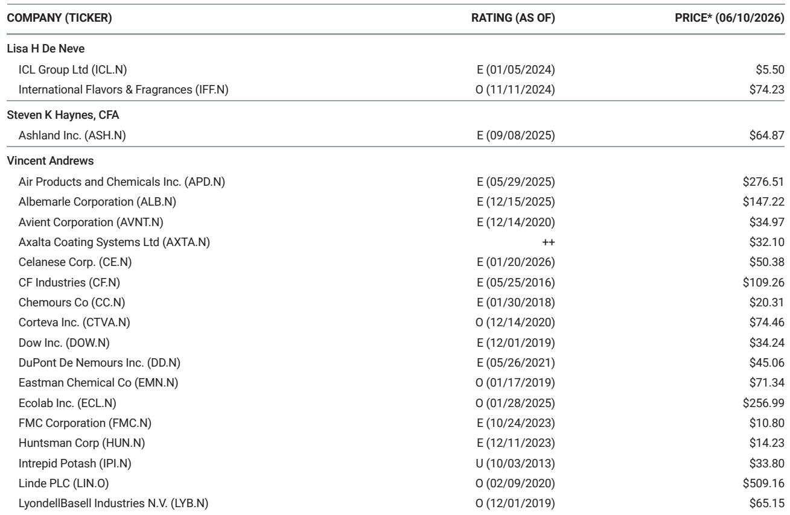
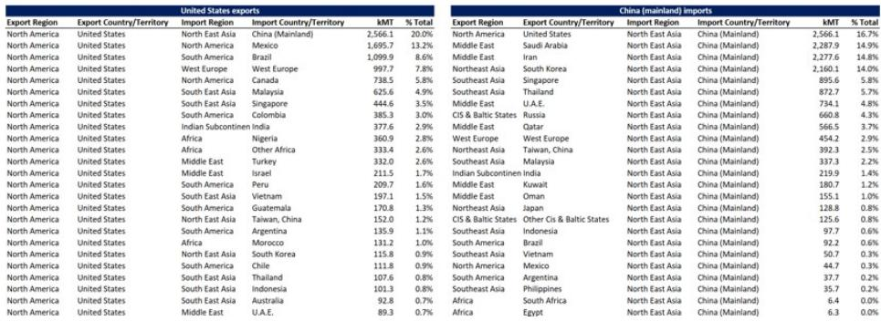
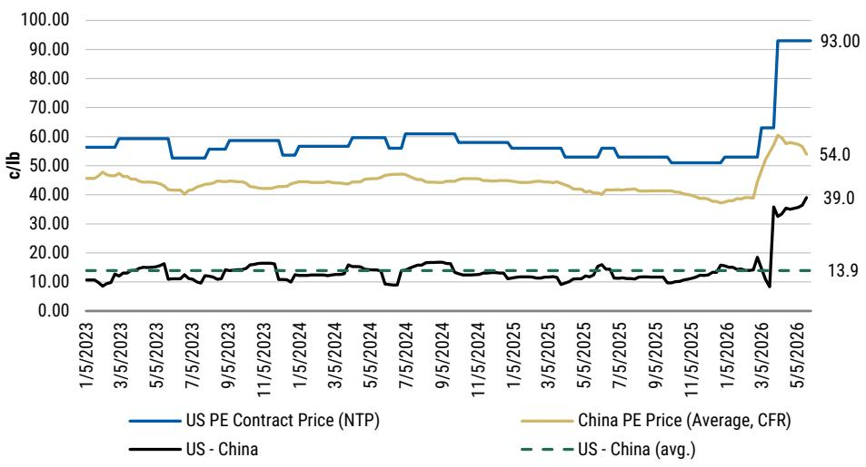

# China's Polyethylene Import Behavior Will Determine Whether US Contract Prices Hold or Collapse

The single most important variable for US polyethylene pricing in the second half of 2026 is not domestic demand, not Middle East supply restoration, and not producer inventory strategy. It is whether China reverts to its pre-conflict net import position. In April, China slashed its net import reliance from approximately 31% to roughly 5%, an unprecedented reduction that added 9% to ex-China global supply and partially offset the 15% global supply disruption from the Strait of Hormuz closure. This single behavioral shift has been the primary reason US contract prices have not risen further—and it now poses the greatest downside risk if it persists, or the greatest upside catalyst if it reverses.

The market is currently pricing in a flat June settlement, with Dow and LyondellBasell having nominated 20 and 10 cent per pound increases respectively, but producer inventories are already building. Export volumes have lagged expectations, pushing estimated producer days on hand to 46 in May from 42.5 in April. The conventional narrative focuses on Middle East supply normalization and US operating rates. The deeper strategic question is whether China's behavior reflects a temporary inventory liquidation or a structural shift in its role as the world's swing buyer of polyethylene.

Understanding this distinction requires examining not just what China did, but why it could do it. The answer lies in excess inventory that most market participants underestimated. And the implications for US producers, contract negotiators, and investors are profound depending on which scenario plays out over the next 60 days.

## China's April Import Collapse Was Made Possible by an Unseen Inventory Overhang That Is Now Rapidly Drawing Down

The scale of China's April adjustment is difficult to overstate. From a pre-conflict net import position of roughly 1.1 million metric tons per month, China dropped to approximately 180,000 metric tons in April. This was achieved through two simultaneous actions: a reduction in imports of about 500,000 metric tons (with US-sourced volumes falling approximately 40%), and an increase in exports of roughly 400,000 metric tons, most of which was redirected to Southeast Asia to fill the gap left by constrained Middle East supplies.

A net import reduction of 900,000 metric tons in a single month is not normal. It is not something that can be sustained indefinitely without severe domestic supply tightness. The critical enabling factor was an excess inventory buildup in China that had been accumulating for 6 to 12 months prior to the conflict. Discussions with industry consultants suggest Chinese traders had built approximately 1 million metric tons of additional inventory before the Strait of Hormuz closure, bringing China's total excess polyethylene inventory position to an estimated 2.3 to 3.5 million metric tons. That is equivalent to roughly 30 days of domestic demand.

This inventory buffer allowed China to become a net supplier to the region in April rather than a net buyer. It was a tactical decision, not a structural change in China's import dependence. And the data now shows that this buffer is being consumed rapidly. Polyolefin inventory data from Sinopec and CNPC demonstrates a clear drawdown trend, with inventories now approximately 19% below recent highs and back to levels comparable with 2024 and 2025. The April inventory peak was also seasonally atypical—normally inventories decline from February through April, but in 2026 they rose before beginning their current descent.

The key question is how much buffer remains. The scenario analysis suggests that the excess inventory may thin out by June or July. If that is correct, China will face a choice: revert to its pre-conflict net import purchasing, or accept domestic supply tightening and higher prices. That decision will cascade through global polyethylene markets.

## If China Reverts to Pre-Conflict Import Levels, US Exports Could See a 250,000 Metric Ton Per Month Uplift That Reshapes the Pricing Trajectory

The arithmetic is straightforward but the implications are not fully priced in. If China returns to its historical net import position, the incremental demand for US exports would be approximately 250,000 metric tons per month. This figure is derived by taking China's historical import volumes, allocating them ratably by import share, and excluding the Middle Eastern volumes that remain constrained. The result represents approximately 12% of total US annual polyethylene supply and roughly 21% upside to current US export volumes.

This is not a theoretical maximum. Industry consultants have estimated that a 17% increase over 2025 export levels is the maximum achievable given current US infrastructure limitations. The 21% figure would exceed that constraint, meaning the full demand uplift could not be met. With effective US operating rates already estimated at approximately 98.8% for May, the system has no spare capacity. Under this scenario, US inventories would draw down by up to 8 days through August, creating the conditions for higher monthly contract settlements.

The pricing implications are shown clearly in the scenario analysis. Under the incremental exports scenario, contract prices would hold near current elevated levels through mid-summer before beginning a more gradual decline than the base case. Under the faster mean-reversion scenario—where China does not revert to prior import levels—prices would decline more steeply starting in June, with the gap between scenarios widening to approximately 15 cents per pound by year-end.

This is not a small difference. For a commodity where margins are measured in pennies per pound, a 15-cent divergence represents the difference between strong profitability and significant margin compression across the US polyethylene industry.

## The US Market Is Currently Experiencing a Dangerous Tension Between Producer Nominations and Weakening Export Realities

The current state of the US market is instructive. Spot prices have been in a downward trend following the substantial March and April contract increases of 10 cents and 30 cents per pound respectively, along with a flat May settlement. Producer nominations for June—20 cents from Dow and 10 cents from LyondellBasell—suggest producers believe the pricing environment supports further increases. Yet the underlying data tells a different story.

Export volumes have lagged expectations. Producer inventories are building, with days on hand estimated at 46 in May compared to 42.5 in April and 44 in February. This inventory build is occurring despite operating rates that are near maximum levels, which means the issue is not production capacity but demand absorption. The US market is effectively producing at full tilt while export channels are not clearing at the volumes needed to keep inventories balanced.

This tension creates a strategic dilemma for producers. If they push through contract increases based on the assumption that China will return as a major buyer, they risk pricing themselves out of a market that may not materialize. If they accept lower settlements to maintain export competitiveness, they sacrifice margin in what may be a temporary soft patch. The correct strategy depends entirely on the China variable, which will not be resolved until late June or early July when May net import data becomes available.

## The Report's Critical Open Question: Is China's Inventory Drawdown a One-Time Adjustment or a Leading Indicator of Structural Change?

The report provides compelling evidence that China's excess inventory was larger than previously understood and is now being drawn down. But it leaves several meaningful open questions that the data alone cannot yet answer.

First, what portion of the inventory drawdown reflects actual consumption versus speculative destocking? If Chinese converters are simply reducing their own inventory positions in response to falling prices, the drawdown could continue even after the initial excess is worked through. This would delay the reversion to historical import levels.

Second, has the Strait of Hormuz disruption permanently altered China's sourcing strategy? The April data shows China redirecting exports to Southeast Asia, effectively becoming a regional supplier. If Chinese producers have established new customer relationships in Southeast Asia, they may be reluctant to abandon those markets even after domestic inventory normalizes. This could permanently reduce China's net import requirement.

Third, what is the true inventory position of Chinese traders versus end-users? The report's estimate of 2.3 to 3.5 million metric tons of excess inventory is based on consultant discussions, but the breakdown between speculative trader holdings and actual consumer inventory is unclear. If a large portion is held by traders who are now forced to liquidate due to financing costs or margin calls, the drawdown could accelerate beyond what consumption alone would dictate.

Fourth, how will China's domestic polyethylene capacity additions affect its long-term import dependence? The report does not address this, but it is a structural factor that could reduce China's import reliance even after the current disruption normalizes.

These questions are not academic. The answers will determine whether the next 12 months see US contract prices stabilize at elevated levels or revert to the lower mean that characterized the pre-conflict market. The May net import data, expected in late June or early July, will be the first real data point that begins to resolve these uncertainties.

## A Decision Framework for Navigating the Next 60 Days of Polyethylene Market Uncertainty

For market participants trying to position themselves, the next 60 days require a structured approach to monitoring and decision-making. The following framework translates the report's analysis into actionable monitoring points and strategic responses.

The first monitoring priority is China's net import data for May. This will be the clearest signal of whether the April behavior was a one-time inventory adjustment or the beginning of a sustained reduction in import reliance. If May net imports remain below 500,000 metric tons, the market should price in the faster mean-reversion scenario. If they rebound above 800,000 metric tons, the incremental exports scenario becomes more likely.

The second priority is US producer inventory data. The report estimates 46 days on hand for May. If June data shows inventories continuing to build toward 50 days or more, it would confirm that export channels are not clearing and would argue against producer price increase nominations. If inventories stabilize or begin to draw, it would support the view that the current softness is temporary.

The third priority is Middle East supply restoration timelines. The report's analysis assumes Middle East volumes remain constrained. Any acceleration in the return of Iranian or Saudi production would change the global supply balance and reduce the potential uplift from Chinese demand reversion.

The strategic response should be calibrated to these data points. For buyers, the current flat settlement environment with producer nominations for increases creates an opportunity to lock in volumes at current prices before the data resolves. For producers, the risk of pushing through increases that cannot be sustained argues for a more conservative approach to nominations until the China data is confirmed. For investors, the divergence between the two scenarios creates a clear catalyst event around the May data release, with significant directional implications for US chemical equities.

## Join the Community to Read the Full Report and Review the Original Charts

The analysis presented here is drawn from a detailed research report that includes the original charts on China's net import reliance, US contract price scenarios, Chinese polyolefin inventory trends, North American polyethylene price history, and US export destination data. These charts provide the visual evidence that supports the argument and allow readers to track the key variables in real time. The full report also includes additional scenario analysis and sensitivity testing that could not be fully developed here. To access the complete material and join a community of professionals who are actively analyzing these market dynamics, follow the link to read the full report.

*This article is for learning and discussion only and does not constitute investment advice.*

Personal reading notes and learning share only. Not investment advice.

