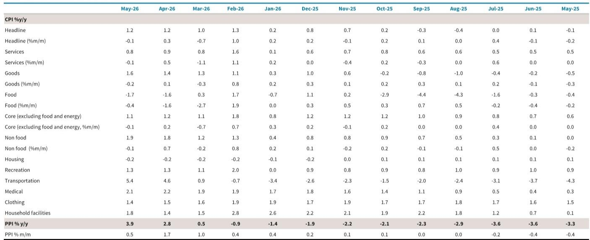
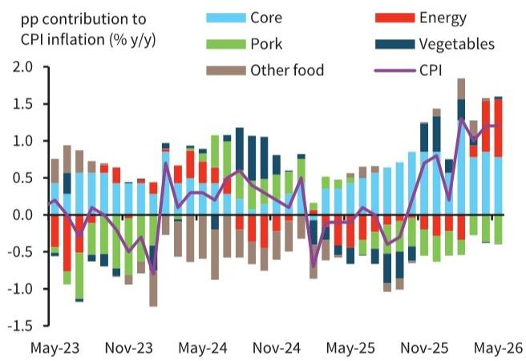
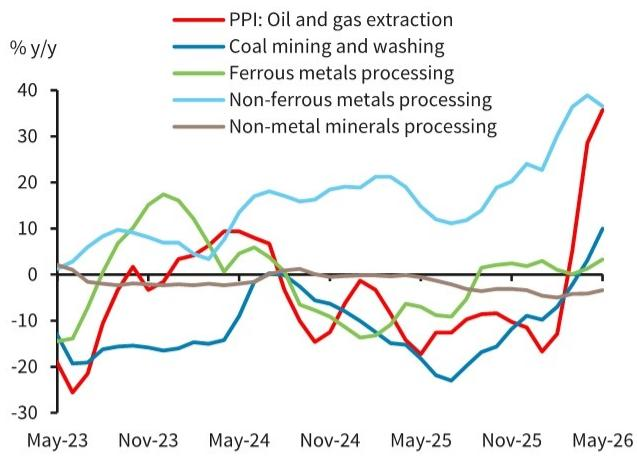

# BARC：通胀数据揭示的真正风险不是物价上涨，而是定价权断裂

中国5月通胀数据已经发布。CPI同比1.2%，PPI同比3.9%。从数字看，物价似乎在温和回升。但真正值得关注的，不是这两个数字本身，而是它们背后的结构性断裂：上游成本正在加速传导，但下游企业几乎完全丧失了转嫁能力。PPI上游原材料同比上涨9.2%，采掘业同比上涨15.8%，而下游消费品PPI却仍在收缩，同比负增长0.8%。这组数据描绘的不是一个通胀周期，而是一个利润分配极端失衡的图景。

这份BARC研报的核心价值，不在于它预测了通胀数字，而在于它揭示了当下中国经济中最关键的价格传导机制正在失效。当上游成本无法向下游有效传递时，制造业企业的利润率将面临持续挤压，而终端需求的疲弱又会反过来抑制就业和收入预期。这不是一个短期波动，而是一个需要重新评估资产定价的结构性信号。

BARC的报告指出，5月核心CPI从1.2%回落至1.1%，服务CPI从0.9%降至0.8%。在能源价格推高整体通胀的同时，扣除能源和食品的核心通胀却在走弱。这意味着，所谓的“通胀”更多是输入性的成本推动，而非需求拉动的内生复苏。对于投资者和产业决策者而言，真正需要关注的不是CPI和PPI的绝对值，而是这两者之间的剪刀差所反映的定价权分布。

## 1. 上游涨价正在加速，但下游企业只能“咽下”成本

这份研报最清晰的信号来自PPI的分项数据。5月PPI同比增速从4月的2.8%跳升至3.9%，连续第二个月加速。但这一增长高度集中于上游。采掘业PPI同比上涨15.8%，原材料PPI上涨9.2%，而制造业PPI仅增长2.3%。这意味着，利润正在向上游资源品环节集中，而大量中下游制造企业面临成本上升与售价低迷的双重挤压。

BARC特别指出，有色金属矿采选和加工业是5月PPI上涨的最大拉动项，贡献了2.56个百分点。能源和化工品是另一大驱动因素，油气开采、炼油和化工产品合计贡献了近2个百分点。这两大板块的强势，与AI和绿色技术需求带动的铜价上涨，以及中东地缘冲突引发的能源供给担忧直接相关。

但问题的另一面是，消费品PPI仍在收缩，5月为负0.8%。虽然较4月的负1.0%略有收窄，但连续多月处于通缩区间。这意味着，下游企业——从家电、纺织到日常消费品——根本无法将上游涨价的压力向下游消费者传递。在需求疲弱的环境下，任何涨价行为都可能导致市场份额的流失。

对于投资者而言，这意味着需要重新审视产业链上不同环节的定价能力。上游资源品企业可能在当前环境下受益，但中下游制造企业的利润率面临系统性压力。那些缺乏品牌溢价、产品差异化不足的企业，将首当其冲。

## 2. 核心通胀走弱才是真正需要警惕的信号

CPI整体数字维持在1.2%，但结构分化严重。能源价格是唯一的支撑项，汽油价格同比上涨23.5%，拉动CPI约0.66个百分点。而食品价格连续第二个月下跌，同比负增长1.7%，其中猪肉价格跌幅加深。扣除食品和能源的核心CPI从1.2%回落至1.1%，低于1-2月冲突前的平均水平1.3%。

BARC的研报特别强调，服务CPI从0.9%降至0.8%，其中旅游相关服务价格涨幅收窄了0.9个百分点至2.8%。住房租金持续下降，同比负增长0.6%，为2023年1月以来最快降速。更值得关注的是，中国指数研究院的数据显示，主要城市的房租实际同比跌幅高达3.2%，远高于官方统计的0.6%。

汽车价格继续下跌，同比降1.1%，环比降0.4%。这表明，在激烈的市场竞争和产能过剩的背景下，车企仍然无法通过涨价来转嫁成本。家电和服装价格虽然小幅上涨，但合计对CPI的拉动仅约0.12个百分点，难以对冲其他项目的下行压力。

这些数据合在一起意味着：当前的通胀格局是“成本推动型”而非“需求拉动型”。能源价格上涨推高了整体数字，但居民消费的内生动力依然疲弱。对于政策制定者而言，这增加了决策的复杂性——如果因为整体CPI回升而收紧政策，可能会进一步压制已经疲弱的需求；如果继续宽松，又可能面临上游成本持续传导的风险。

## 3. 住房租金与汽车价格：两个最能说明需求真相的指标

BARC的研报虽然没有直接给出结论，但两组数据值得单独拿出来审视。

第一是住房租金。官方数据显示，住房租金同比下跌0.6%，但第三方机构的数据显示主要城市租金跌幅达到3.2%。这个差距本身就是一个信号。官方统计可能因为样本结构、统计方法等原因，低估了实际市场中的价格下行压力。租金是居民收入和就业信心的直接映射。当租金持续下跌时，说明劳动力市场的收入预期和就业稳定性并未改善。

第二是汽车价格。汽车行业是中国制造业的缩影。产能过剩、价格战、库存压力，这些因素共同导致了汽车价格持续下行。5月汽车价格同比下跌1.1%，环比下跌0.4%。在新能源车渗透率不断提升、传统车企面临转型压力的背景下，价格竞争只会更加激烈。汽车作为大件消费品，其价格走势直接反映了居民消费意愿和购买力。

这两个指标背后，是同一个逻辑：当居民对未来收入预期不确定时，他们会推迟大宗消费、压缩居住成本。这种行为的累积效应，就是终端需求的持续疲弱。而终端需求疲弱，又是下游企业无法转嫁成本的根本原因。

## 4. 报告尚未完全回答的关键问题：这轮价格传导断裂会持续多久

BARC的研报提供了清晰的数据和判断，但有一个关键问题并没有完全展开：这种上游涨价、下游通缩的格局会持续多久？或者说，在什么条件下，价格传导机制才能重新恢复？

从历史经验看，中国PPI和CPI之间的剪刀差通常会经历几个月的滞后才逐步收敛。但当前的环境与以往不同。以往的价格传导断裂，往往是因为需求端暂时性疲弱，一旦政策刺激到位，传导机制就会恢复。但这一次，需求疲弱的背后是结构性因素：房地产行业调整仍在持续，居民杠杆率已处于高位，地方财政压力限制了基建投资的空间。

报告提到，核心CPI低于冲突前的平均水平，住房租金仍在加速下滑。这些都不是短期因素能够解释的。如果需求端的结构性疲弱持续，那么上游涨价对下游企业的利润挤压就不是一个季度的问题，而是一个需要重新评估企业盈利预期的中长期变量。

另一个未解的问题是：能源价格的走势。BARC的研报指出，5月PPI环比增速已经从4月的1.7%放缓至0.5%，这与原油价格从高位回落有关。但中东地缘冲突的不确定性依然存在。如果能源价格再度攀升，上游成本压力将进一步加剧，而下游企业转嫁能力并不会因此改善。这意味着，企业利润率的压力可能会进一步扩大。

## 5. 一个更实用的观察框架：盯住三条传导链

基于BARC这份研报的数据和逻辑，我们可以建立一个更实用的观察框架，用来追踪后续的价格信号和投资含义。

第一条链：上游资源品价格与下游制造企业毛利率之间的剪刀差。如果PPI上游与下游的差距持续扩大，说明成本压力尚未充分释放，中下游企业的盈利预期需要进一步下调。投资者可以关注各行业龙头企业的毛利率变化，特别是那些处于中游加工环节、既受上游成本影响、又受下游需求制约的企业。

第二条链：住房租金与核心服务CPI。租金是服务通胀中最具韧性的部分，也是居民收入预期的直接映射。如果租金持续下滑，说明就业和收入改善尚未到来，服务消费的全面复苏仍需时日。官方数据与第三方数据的差异也值得持续跟踪，这可能是政策判断与实际市场感受之间的温差。

第三条链：汽车与家电价格走势。这两个行业是中国制造业的晴雨表。当它们进入价格战模式时，意味着产能过剩和需求不足的矛盾仍在加剧。如果这些行业的价格能够企稳甚至回升，才是需求真正改善的可靠信号。

这三条链合在一起，能够帮助投资者判断当前的价格传导断裂是暂时的还是结构性的。如果三条链的信号都指向需求疲弱，那么任何基于整体通胀回升而做出的投资决策，都可能忽略微观层面的真实压力。

---

这份BARC研报的价值，在于它用数据揭示了一个容易被宏观数字掩盖的微观真相：通胀不是均匀分布的，定价权也不是。当前中国经济的核心矛盾，不是物价涨不涨，而是谁有能力涨价、谁只能被动承受成本。这个问题的答案，将决定未来几个季度不同行业、不同企业的盈利走向。

但研报毕竟只是静态的数据切片。价格传导机制何时恢复、需要什么样的条件、不同行业之间会如何分化，这些都需要更深入的动态跟踪和讨论。如果你也在关注这些问题，欢迎来星球微信群里继续讨论。我们会在那里分享更细致的行业拆解和后续数据追踪，一起探讨这些未解问题的可能答案。

Personal reading notes and learning share only. Not investment advice.

