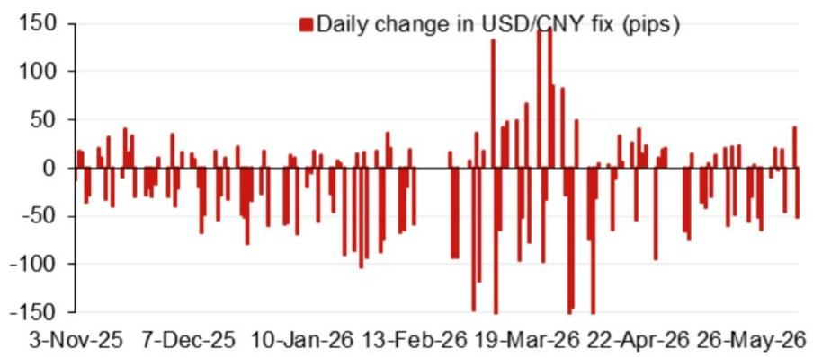
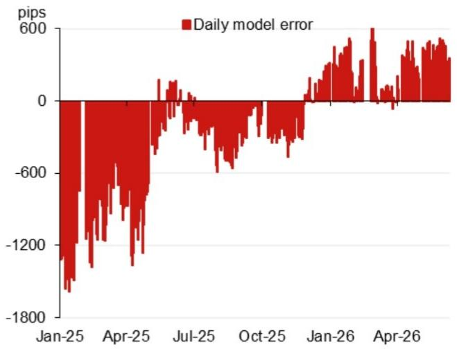

# NOM：人民币中间价模型正在揭示一个被低估的政策信号

人民币汇率中间价的每日设定，长期以来被市场视为中国央行汇率管理意图的“温度计”。但多数观察者只盯着最终公布的数值本身，而忽略了模型内部各因子的结构性变化。NOM最新发布的USD/CNY定盘价模型报告，提供了一个更锐利的观察视角：模型隐含的“逆周期因子”调整力度正在发生质变，这背后可能不是简单的维稳，而是对人民币定价逻辑的一次系统性再校准。

这份报告的核心价值不在于给出一个预测点位，而在于它拆解了中间价形成的“黑箱”。当模型投影值与实际公布值之间的偏差持续扩大时，市场真正应该关注的不是汇率会贬到多少，而是政策制定者正在用什么样的新框架来管理预期。本文将从NOM模型的三个关键维度出发，解读这一信号对投资者意味着什么。

## 1. 模型投影的“跳降”并非单边看空，而是多因子共振的结果

NOM模型显示，最新的USD/CNY定盘价模型投影值为6.7816，较前一次的6.8130下降了314个基点。这个幅度在近期并不常见。但更值得关注的是，模型投影的下降并非由单一货币驱动，而是来自一个多元化的因子组合。

根据报告中的贡献度分析，欧元和澳元分别贡献了15.6和8.5个基点的正向变动，而韩元则反向贡献了13.5个基点。这意味着，人民币中间价的模型投影变化，本质上是全球外汇市场在特定时间窗口内对主要货币相对价值重估的映射。欧元和澳元的走强，部分抵消了韩元等亚洲货币带来的贬值压力。

这里的关键洞察是：中间价模型并非被动反应，而是一个动态加权系统。当欧元和澳元的权重上升时，美元指数的波动对人民币的影响就会被部分对冲。NOM模型揭示的，正是一个正在从“盯住美元”转向“盯住一篮子货币”的精细化操作过程。对于投资者而言，这意味着不能再简单用美元指数的涨跌来预判次日中间价，而需要跟踪一篮子货币的日内变动。

## 2. 逆周期因子的“隐形”调整，才是政策意图的真实载体

模型投影值为6.7816，但计入逆周期因子后的投影值为6.7957。两者之间173个基点的差异，恰恰是报告中最有信息量的部分。逆周期因子作为央行调节中间价的可选工具，其使用力度和方向，往往比模型本身的输出更能反映政策层的真实态度。

NOM报告没有直接给出逆周期因子的具体数值，而是通过“模型投影与含逆周期因子投影”的对比，让市场自行推导。173个基点的正向调整，意味着政策层面在模型本身指向更强的人民币时，选择了适度“压住”升值幅度。这透露出的信号是：决策者并不希望人民币在短期内出现单边快速升值，即便基本面因素支持这一方向。

这种“反向对冲”的操作逻辑，与2015-2016年期间通过逆周期因子抑制贬值预期的做法，在方法论上如出一辙，但方向截然相反。它表明政策工具箱仍然有效，且使用逻辑高度一致——核心目标是“平滑”，而非“引导”。对于外汇交易者而言，这意味着中间价的实际公布值可能持续低于模型隐含的“无干预”水平，从而为即期汇率提供一个“软天花板”。

## 3. 模型误差的历史波动，提示了当前定价的脆弱性

报告中的模型误差图（Fig. 2）提供了一个历史视角。从2025年初到2026年中，模型误差从-1800个基点逐步收窄，并在2025年7月附近趋近于零，随后又出现正向波动。这种误差的“归零”过程，通常意味着模型对现实定价的解释力在提升，但误差的再次扩大，则暗示有新的非模型变量正在影响实际定盘价。

值得警惕的是，2026年3月19日前后，USD/CNY定盘价出现了约150个基点的单日跳升。NOM报告没有对此事件做归因分析，但结合模型误差的历史模式，这种“异常点”往往对应重大政策表态或外部冲击。当前模型误差处于相对低位，但并不意味着未来不会再次出现类似2025年初的大幅偏离。

这里的核心问题是：误差的收窄是否可持续？如果逆周期因子的使用频率增加，模型误差可能被人为压低，但这反而增加了未来出现“补跌”或“补涨”的风险。投资者不能因为近期模型预测的准确性提高，就放松对尾部事件的警惕。NOM报告没有给出答案，但它的数据框架为每个读者提供了自行推演的基础。

## 4. 报告尚未完全回答的关键问题：逆周期因子的“阈值”在哪里？

NOM模型虽然拆解了中间价形成的技术细节，但有一个问题始终悬而未决：逆周期因子的调整是否存在一个“阈值”？换句话说，当模型投影与实际公布值的偏差达到多大时，政策层会认为“过度”并启动干预？

从报告提供的数据来看，173个基点的逆周期因子调整幅度，相对于历史动辄上千个基点的模型误差而言，仍属于温和区间。但这恰恰是问题的核心——如果未来模型投影继续指向更强的汇率，逆周期因子的调整力度会线性放大，还是会触发某种“熔断”机制？

这个问题的答案，取决于政策层对“汇率弹性”与“市场稳定”之间平衡点的判断。NOM报告没有提供任何关于政策层内部决策规则的线索，而这也正是机构投资者最需要自行研判的部分。它可能取决于中美关系、出口数据、资本流动压力等一系列外部变量。对于读者而言，与其猜测一个具体的点位，不如建立一个跟踪框架：持续监测模型投影与含逆周期因子投影的差值，当这个差值出现趋势性扩大时，就意味着政策逻辑可能正在发生转变。

## 5. 对投资者的观察框架：从“猜点位”转向“读模型”

基于NOM报告的分析框架，投资者可以构建一个更系统的观察方法。核心不再是预测明天的人民币中间价是多少，而是理解模型内部各因子的相对权重变化。

首先，关注前四大贡献货币的每日变动。欧元、澳元、韩元、卢布的权重并非固定不变，它们的相对贡献度变化，反映了全球资本流动的底层逻辑。其次，跟踪模型误差的滚动标准差。如果误差在短期内迅速扩大，通常意味着有未被模型捕捉的“政策冲击”或“事件驱动”正在发生。最后，将逆周期因子的调整幅度与同期中国国债收益率、A股外资流入等数据交叉验证。当逆周期因子与资本流动方向一致时，政策的可信度较高；当两者出现背离时，则需警惕市场预期的分化。

这套框架的意义在于，它把汇率分析从“宏观叙事”拉回到了“可验证的量化信号”。NOM报告提供的不是结论，而是一套工具。真正有价值的判断，来自读者自己对这些数据的持续解读。

这份NOM报告还附带了一个重要的事件日历：7月底的政治局会议、11月的APEC峰会、以及年底可能的中美元首会晤。这些事件节点，都可能成为模型因子发生结构性变化的触发点。报告中对这些事件的展望只有寥寥几笔，但背后涉及的关税谈判、科技管制、资本流动等议题，才是决定中间价长期走向的深层变量。这些内容在完整报告中并未完全展开，而恰恰是社群讨论中最有价值的部分。

欢迎来星球微信群里继续讨论，我们将结合这份报告的原始数据和近期市场动态，持续跟踪逆周期因子的变化轨迹，并分享对年底前人民币汇率路径的推演。

Personal reading notes and learning share only. Not investment advice.

