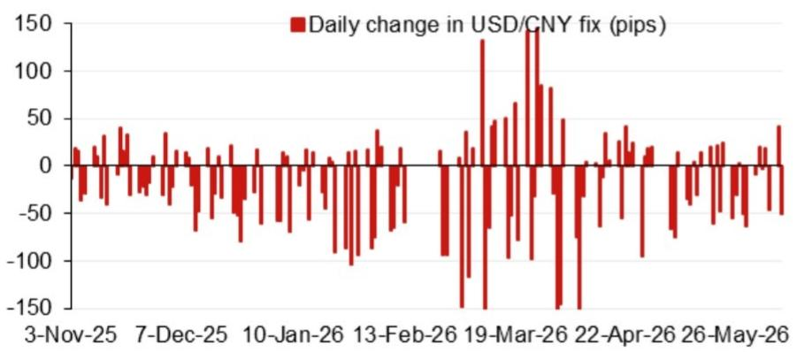
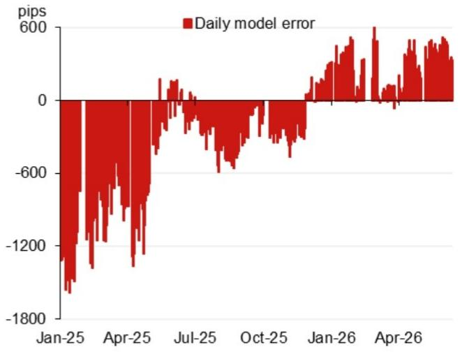

# The PBOC's Fix Model Is Signaling a Shift That Markets Are Not Yet Pricing In

The most important signal in currency markets this quarter is not coming from the Federal Reserve or the White House. It is coming from a technical model used by the People's Bank of China to set its daily yuan fixing rate. According to a recent projection from a global investment bank's Asia FX strategy team, the PBOC's fix model is now pointing to a level of 6.7607 for USD/CNY, a full 543 pips lower than the previous model projection and 166 pips below the prior official spot close. This is not a minor calibration. It is a deliberate, data-driven signal that the central bank is preparing to allow the yuan to appreciate more rapidly than the market currently expects.

The significance of this shift goes far beyond the daily fix number. The PBOC's fixing mechanism is not a passive reflection of market forces. It is an active policy tool that incorporates a counter-cyclical factor, a discretionary adjustment that the central bank uses to lean against one-sided market moves. When the model projection drops sharply, it tells us that the underlying basket of currencies is moving in a way that justifies a stronger yuan. When the counter-cyclical factor is added, the fix becomes even more instructive: it reveals where the PBOC wants the market to go, not just where it is going.

Investors who ignore this signal risk being caught on the wrong side of one of the most consequential currency moves of the year. The yuan is not just another emerging market currency. It is the anchor of Asian FX, the second-most-traded currency in the world, and a key variable in global trade flows, commodity prices, and cross-border investment decisions. A sustained shift in the yuan's trajectory would ripple through every portfolio that has exposure to China, Asia, or the dollar bloc.

The timing matters as much as the direction. We are approaching a dense calendar of Chinese political and economic events, including the July Politburo meeting, the APEC summit in Shenzhen in November, and the anticipated visit of President Xi to the White House toward the end of 2026. Each of these events creates a window for policy communication and market adjustment. The fix model is giving us advance notice that the PBOC is positioning for a stronger yuan before these events, not after them.

The conventional narrative is that China wants a weaker yuan to support exports and offset tariff pressures. That narrative is becoming outdated. The fix model suggests a different calculus: one in which the PBOC is willing to accept a stronger currency as part of a broader strategy to manage inflationary pressures, attract capital inflows, and signal confidence in the domestic recovery. The market has not fully adjusted to this possibility. That is where the opportunity and the risk lie.

## The sharp drop in the model projection is a deliberate policy signal, not a technical artifact

The model projection of 6.7607 represents a 543-pip decline from the previous reading. To put that in context, the typical daily fix change is measured in tens of pips, not hundreds. A move of this magnitude is rare and should be treated as a meaningful signal rather than a random fluctuation. The model is designed to track a basket of currencies, and the top four weighted contributors to the projected change tell a clear story: the Korean won contributed minus 36 pips, the euro minus 32 pips, the Australian dollar minus 20 pips, and the Mexican peso minus 13.5 pips. All four are pulling in the same direction, and that direction is a stronger yuan.

This is not about a single currency moving against the dollar. It is about a broad-based weakening of the dollar against a diversified basket that includes both developed and emerging market currencies. The PBOC's fix model is essentially saying that the global FX environment is now consistent with a significantly stronger yuan. The counter-cyclical factor, which adjusts the model output to account for market stability concerns, brings the projected fix to 6.7759, still 391 pips lower than the previous fix. Even after the PBOC's own smoothing mechanism, the signal remains unmistakable.

The implication for investors is straightforward: the PBOC is not fighting the market right now. It is aligning with it. In previous episodes of yuan depreciation, the counter-cyclical factor was used to slow the pace of decline. Now, the factor is being used to moderate the pace of appreciation, but it is not reversing it. The central bank is signaling that it sees room for the yuan to strengthen and is willing to let it happen, albeit in a controlled manner.

## The model error history reveals that the PBOC has been systematically underestimating the yuan's strength

One of the most revealing charts in the report is the recent model error series. The model error measures the difference between the model's projected fix and the actual fix set by the PBOC. When the error is large and negative, it means the actual fix is significantly weaker than what the model would have predicted. When the error is large and positive, it means the actual fix is stronger.

The data shows that from early 2025 through mid-2025, the model error was deeply negative, reaching as low as minus 1,800 pips in January 2025 and minus 1,200 pips in April 2025. This was the period when the PBOC was actively using the counter-cyclical factor to resist yuan depreciation. The model wanted a weaker fix, but the central bank intervened to keep it stronger.

By mid-2025, the error had converged to zero, meaning the model and the actual fix were aligned. Then, from late 2025 into early 2026, the error turned positive, reaching as high as plus 600 pips in January 2026 and plus 400 pips in April 2026. This is the opposite pattern: the model is now projecting a stronger fix than the PBOC is actually setting, and the error is substantial.

This shift in the error pattern is a powerful leading indicator. It tells us that the PBOC has moved from defending the yuan to allowing it to appreciate, but it is still moving more slowly than the model suggests. If the error continues to narrow, the actual fix will need to catch up to the model projection. That means more days of aggressive fix adjustments in the direction of yuan strength. Investors should be watching the daily fix changes with renewed attention. The recent data shows daily changes of minus 100 pips or more on several occasions, a pace that would quickly add up to a significant cumulative move.

## The political calendar creates a series of decision points that will test the PBOC's commitment

The report includes a calendar of events that is unusually rich for the second half of 2026. The July Politburo meeting typically includes a to-do list for the economy and clues to the priorities of top leaders. The APEC summit in Shenzhen in November puts China on a global stage and creates a natural opportunity for policy announcements. The Central Economic Work Conference in December sets the tone for the following year. And the anticipated visit of President Xi to the White House toward the end of the year adds a layer of geopolitical significance that cannot be ignored.

Each of these events creates a potential catalyst for currency policy. The PBOC may choose to use the yuan as a negotiating tool, a signal of confidence, or a mechanism to manage domestic conditions. The fix model is giving us advance notice that the technical case for a stronger yuan is already in place. The question is whether the political will exists to follow through.

The most important event on the calendar is the Xi-Trump meeting. If the two leaders are able to reach a framework agreement on trade and tariffs, the yuan could strengthen sharply as part of a broader de-escalation. If talks break down, the PBOC may revert to a more defensive posture. The fix model cannot predict the outcome of negotiations, but it can tell us where the central bank's technical framework is pointing. Right now, it is pointing toward appreciation.

## What the report does not fully answer: the sustainability of the model's signal and the role of capital flows

The report provides a powerful snapshot of the current fix model projection, but it leaves several critical questions unanswered. First, how persistent is this signal? The model is updated daily, and the projection can change quickly if the underlying currency basket moves in a different direction. A 543-pip swing in one day is dramatic, but it could be reversed in the next day if the dollar strengthens or if Asian currencies weaken. The report does not provide a scenario analysis or a probability distribution around the projection.

Second, what is the role of capital flows in driving the model's signal? The fix model is based on a basket of currencies, but the basket itself is influenced by global capital flows, risk appetite, and monetary policy differentials. If the dollar strengthens on hawkish Fed commentary, the basket will move, and the yuan projection will adjust. The report does not fully explore the external drivers that could cause the signal to fade.

Third, the report does not address the implications for onshore versus offshore yuan. The fix is the central bank's official rate, but the offshore market trades freely and often diverges from the onshore rate. A stronger fix does not automatically translate into a stronger offshore yuan if market sentiment is negative. The relationship between the fix and the spot market is a complex one that deserves deeper analysis.

These open questions are not weaknesses in the report. They are invitations for investors to do their own work. The fix model is a starting point, not a conclusion. Investors who rely solely on the model without understanding the broader context will miss the full picture.

## A decision framework for investors: three scenarios and their portfolio implications

For investors who want to translate the fix model signal into actionable decisions, a scenario-based framework is essential. The first scenario is that the PBOC follows through on the model signal and allows the yuan to appreciate gradually over the next several months. In this scenario, the fix moves toward 6.76 or lower, and the spot market follows. The implications are clear: long yuan positions benefit, dollar-denominated China exposure becomes more valuable in local currency terms, and Asian currencies that are correlated with the yuan, such as the Korean won and the Taiwanese dollar, also strengthen. Investors should consider reducing dollar exposure and increasing exposure to China-linked assets, including onshore bonds and equities.

The second scenario is that the model signal reverses. If the dollar strengthens or if Chinese economic data disappoints, the PBOC may revert to a more defensive posture. In this scenario, the fix stabilizes or weakens, and the counter-cyclical factor is used to resist depreciation. Investors should hedge yuan exposure and consider reducing positions that are sensitive to yuan weakness, such as commodity imports and Chinese consumer discretionary stocks.

The third scenario is that the model signal is correct in direction but too aggressive in magnitude. The yuan strengthens, but at a slower pace than the model suggests. This is the most likely outcome, given the PBOC's historical preference for gradual adjustments. In this scenario, investors should position for a slow grind higher in the yuan, using options or forward contracts to capture the trend without taking on excessive short-term volatility.

The key variable to watch is not the level of the fix itself, but the pattern of daily changes. If the PBOC consistently sets fixes that are stronger than the previous spot close, it is signaling a deliberate policy of appreciation. If the fixes are volatile and inconsistent, the signal is weaker. Investors should track the daily fix data and compare it to the model projection to gauge the central bank's true intent.

## Join the community to read the full report and review the original charts

The analysis above is based on a single data point from a single report. The full document contains detailed charts of the model projection, the model error history, and the daily fix changes that are essential for understanding the dynamics at play. The bar chart of the top four weighted overnight contributions and the line chart of recent model errors provide visual confirmation of the patterns described here. Readers who want to see the original figures and conduct their own analysis should access the full report.

Join the community to read the full report and review the original charts.

*This article is for learning and discussion only and does not constitute investment advice.*

Personal reading notes and learning share only. Not investment advice.

