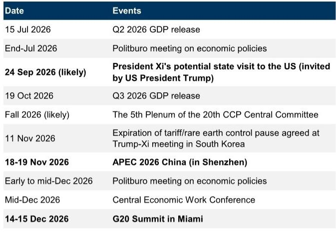
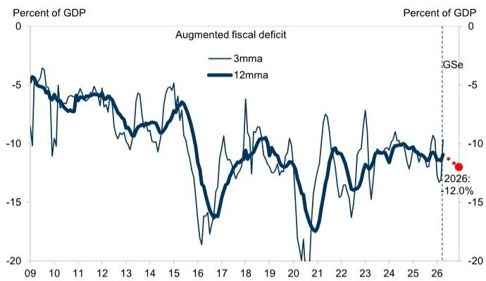

# China’s RMB 2 Trillion Data Center Plan Is Not New News—But the Acceleration Signal Is What Matters

The market’s reaction to a recent Bloomberg report on China’s plan to spend RMB 2 trillion on data centers over five years reveals more about investor hunger for a clear AI infrastructure narrative than it does about any fresh policy surprise. The number itself is not new. It was embedded in the “Six Networks” framework laid out in the 15th Five-Year Plan in March 2025. What is genuinely significant is not the headline figure but the accumulating evidence that implementation is accelerating—and that the funding architecture behind it is fundamentally different from previous infrastructure cycles.

This distinction matters because it changes how investors should interpret the signal. A one-off headline about a large spending target, without context, invites either euphoria or skepticism. Neither is analytically useful. The real question is whether the underlying policy machinery is shifting from planning to execution, and whether the fiscal and financial plumbing can deliver. The answer, based on recent policy signals and funding data, is that it likely can—and that the second half of 2026 will be the critical test.

The RMB 2 trillion data center figure, by itself, accounts for only about 0.8% of fixed asset investment over 2026-2030. That is not a macro game-changer on its own. But it is part of a much broader reorientation of government-led investment toward high-tech manufacturing, AI infrastructure, strategic supply chains, and people’s livelihoods. The “Six Networks” as a whole—water, power grids, computing power, next-generation communications, urban underground pipelines, and logistics—could exceed RMB 7 trillion in investment this year alone, or roughly 14% of total FAI. That is a structural shift, not a cyclical one.

Investors who treat the data center story as a standalone thematic trade risk missing the larger point: China is quietly building a new investment paradigm that prioritizes technological self-reliance and high-quality growth over the real estate and local government financing vehicle (LGFV) model of the past. Understanding this transition is essential for positioning in Chinese equities, rates, and credit over the next 12 to 18 months.

## The RMB 2 Trillion Figure Is a Distraction; the Funding Architecture Is the Real Story

The market’s focus on the reported RMB 2 trillion for data centers is understandable but misplaced. The number itself has been in public circulation since at least January 2025, when the National Data Administration made similar projections, and was reiterated by state media in April. The Bloomberg article did not uncover new policy; it repackaged existing guidance in a more attention-grabbing format.

What is genuinely new—and underappreciated—is the funding structure that will support the “Six Networks” and, by extension, the data center buildout. This is not the old model of off-balance-sheet LGFV borrowing that created massive hidden liabilities in the 2010s. Instead, the funding mix includes ultra-long-term central government special bonds (the “Two Majors” instrument), local government special bonds, the policy bank new financing tool (expanded to RMB 800 billion this year from RMB 500 billion last year), and commercial bank lending. This structure is intentionally designed to crowd in private capital while maintaining fiscal discipline and transparency.

The implications are twofold. First, the risk of a repeat of the LGFV debt overhang is significantly lower. Second, the government retains substantial dry powder. As of end-May 2026, there was approximately RMB 7.7 trillion of unspent government bond quota out of RMB 11.9 trillion for the full year. Fiscal deposits are RMB 700 billion higher year-on-year. This is not a liquidity-constrained system; it is one that has deliberately held back spending in the first half and is now positioning for a second-half acceleration.

Investors should watch the policy bank new financing tool as a leading indicator. Onshore media reports from early June flagged that some local governments have already accelerated implementation of this tool in recent months to support high-tech manufacturing, AI, green transition, and urban renewal. If this pattern broadens, it will confirm that the funding pipeline is being primed for faster deployment.

## The Second-Half Acceleration Is Not a Forecast—It Is a Policy Imperative

China’s current policy approach is reactive rather than pre-emptive. After stronger-than-expected Q1 GDP data, the pace of government bond issuance and fiscal spending slowed markedly in Q2. The augmented fiscal deficit (AFD) narrowed, and investment momentum weakened. This was a deliberate choice, not a failure of execution. Policymakers wanted to avoid overheating and to preserve fiscal space for when it was needed.

That calculus is now shifting. Recent policy communications have become more cautious about the growth slowdown. The July Politburo meeting is the next major catalyst. If Q2 GDP, released on July 15, disappoints meaningfully, there is a high probability that policymakers will step up easing rhetoric and draw on the remaining fiscal buffers to stabilize investment and growth.

This is not a speculative call. The data points are clear: unspent quota is ample, the policy bank tool has been expanded, and project preparation is accelerating. The question is not whether the government has the capacity to act, but whether it will choose to act pre-emptively or only after growth data deteriorates further. Given the reactive pattern observed in recent years, the latter is more likely—but the timing window is narrowing.

For investors, this means the second half of 2026 is shaping up to be a period of significant fiscal impulse. The composition of that impulse matters as much as the magnitude. Government-led investment is being redirected away from traditional infrastructure and real estate toward high-tech manufacturing, AI infrastructure, and strategic supply chains. This is consistent with the guidance from the 4th Plenum and the 15th Five-Year Plan, and it has clear implications for sector allocation.

## The Shift to High-Quality Investment Has Second-Order Implications That Most Investors Are Not Pricing

The most important macro implication of the “Six Networks” framework is not the headline spending number but the structural reallocation of capital it represents. For the past decade, China’s investment cycle was dominated by real estate, local government infrastructure, and heavy industry. That model is being deliberately unwound. The new investment priorities—data centers, next-generation communications, new-type power grids, urban underground pipelines—are capital-intensive but also technology-intensive and productivity-enhancing.

This has several second-order implications. First, the demand for advanced semiconductors, AI chips, and networking equipment will rise sharply. The report notes that domestic suppliers such as Huawei are expected to provide at least 80% of key technologies, including AI chips. This reinforces the tech self-reliance narrative and has direct implications for the competitive dynamics in China’s semiconductor ecosystem.

Second, the electricity consumption implications are staggering. The National Energy Administration projects that annual electricity consumption by data centers will rise from 170 TWh in 2025 to 800 TWh in 2030, implying 36% annualized growth and an increase in the share of total power consumption from 1.6% to 6%. This will place enormous strain on the power grid and accelerate investment in new-type power systems, renewable energy, and energy storage. The data center buildout and the power grid modernization are not separate stories; they are two sides of the same coin.

Third, the labor market effects will be uneven. Data centers and AI infrastructure are capital-intensive, not labor-intensive. They will create high-skilled jobs in engineering, software, and operations, but they will not absorb the large pool of construction and manufacturing labor that was previously employed by the real estate sector. This raises questions about the social and political sustainability of the transition, especially in regions that are heavily dependent on traditional infrastructure employment.

## What the Report Does Not Fully Answer: The Demand-Side Uncertainty

For all the clarity on the supply side—funding, policy intent, project pipelines—the report leaves a critical question unanswered: who will actually use all this computing capacity? The assumption embedded in the RMB 2 trillion investment plan is that demand for data center services will grow in lockstep with supply. But that is not guaranteed.

China’s AI industry is still in its early stages. The economic scale of AI-related industries is projected to surpass RMB 10 trillion by 2030, but the definition of those industries remains unclear. If the demand for AI services, cloud computing, and data processing does not materialize as expected, the country could face a significant overcapacity problem in data centers—similar to the overbuilding seen in previous infrastructure waves.

There is also the question of profitability. State-owned enterprises such as China Mobile and China Telecom will operate most of the facilities. Their mandate includes national strategic objectives, not just shareholder returns. This means the investment may proceed even if the commercial returns are unattractive, which could lead to capital misallocation and lower returns on invested capital across the sector.

Investors should monitor utilization rates, pricing trends, and the pace of commercial adoption of AI services as lead indicators. If utilization remains low and pricing pressure intensifies, the data center buildout could become a value-destroying exercise rather than a growth catalyst.

## A Decision Framework for Investors: How to Position for the “Six Networks” Acceleration

The report provides enough data to construct a practical decision framework. The key variables are time horizon, funding visibility, and sector exposure.

For the next three to six months, the primary catalyst is the July Politburo meeting and the Q2 GDP release. If growth disappoints and policy easing accelerates, the immediate beneficiaries will be the sectors that are directly funded by the “Six Networks” framework: data center operators, power grid equipment suppliers, and domestic semiconductor and networking equipment providers. The policy bank new financing tool is the most actionable leading indicator—accelerated deployment signals that local governments are moving from planning to execution.

For a six-to-twelve-month horizon, the focus should shift to the second-order effects. The electricity consumption trajectory implies significant investment in renewable energy and grid modernization. The tech self-reliance requirement supports domestic AI chip and server manufacturers. The urban underground pipeline network component points to opportunities in construction engineering and materials.

For a twelve-to-eighteen-month horizon, the key risk is demand-side disappointment. If AI adoption and cloud services growth do not keep pace with capacity expansion, the data center sector could face margin compression and overcapacity. Investors should be prepared to rotate out of pure infrastructure plays and into downstream applications and services that benefit from lower computing costs.

The most important strategic takeaway is this: the “Six Networks” framework represents a deliberate, funded, and structurally different investment cycle. It is not a repeat of the old model. Investors who treat it as such will misprice risk and miss the opportunity to position for a multi-year shift in China’s capital allocation.

## Join the Community to Read the Full Report and Review the Original Charts

The analysis above draws on proprietary fiscal data, policy communication tracking, and sector-level investment projections that cannot be fully captured in a single article. The full report includes detailed exhibits on the augmented fiscal deficit trajectory, the breakdown of unspent bond quota, and the projected electricity consumption path for data centers through 2030. It also contains a scenario analysis of the July Politburo meeting outcomes and their implications for asset allocation.

*This article is for learning and discussion only and does not constitute investment advice.*

Personal reading notes and learning share only. Not investment advice.

