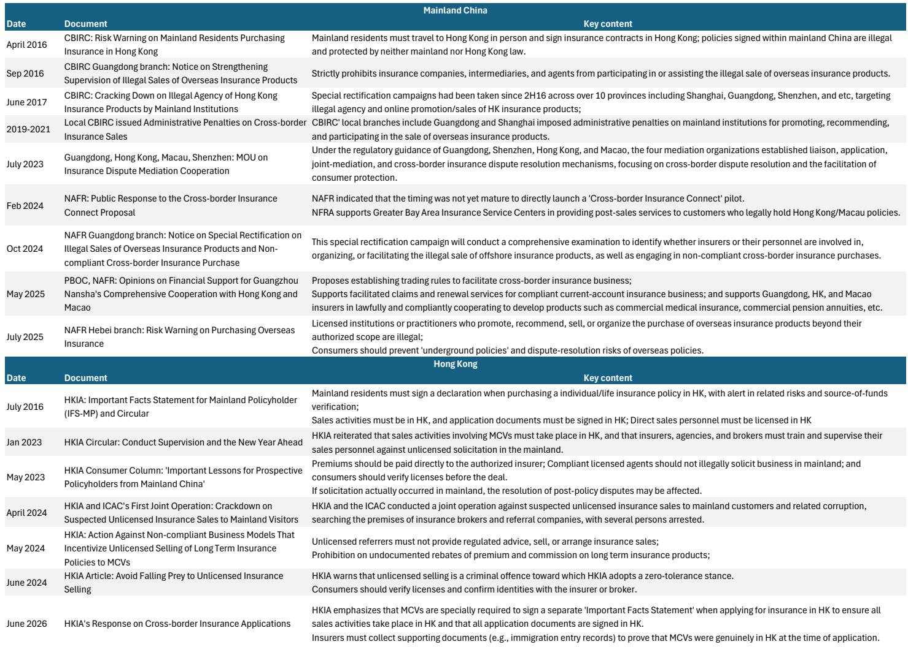
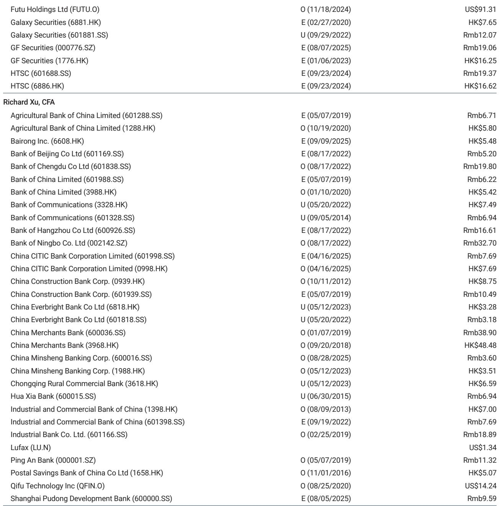
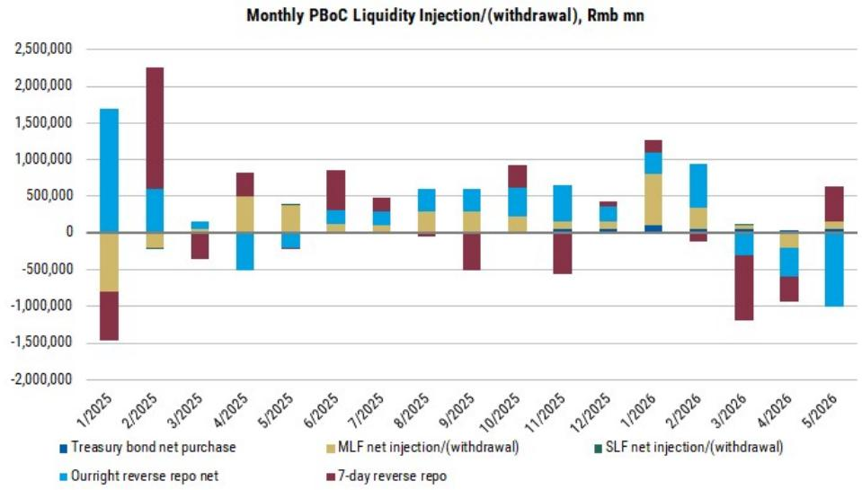

# 摩根斯坦利：市场误读了中国的资本管控信号，真正焦点在实体经济出海而非个人资金外逃

过去几周，关于中国收紧境外投资监管的消息在市场上引发了一轮不小的焦虑。AIA、HSBC、渣打等香港金融股出现波动，一些投资者开始担忧中国正在逆转资本账户开放的方向。但摩根斯坦利最新发布的一份研报给出了一个与市场情绪截然不同的判断——这些新规的核心目标不是堵截个人资金外流，而是为中国企业日益增长的海外实体投资建立一个系统性的法律保护框架。

这份报告的价值不在于它提供了多少新的政策细节，而在于它拆解了一个关键问题：当市场把注意力集中在“资本外逃”这个叙事上时，真正重要的结构性变化是什么。如果我们只看新闻标题，很容易得出“中国在收紧”的结论。但如果仔细审视政策制定的参与者、文件的法律分类、以及具体的执行细则，会发现一个完全不同的故事。

这份摩根斯坦利研报最值得关注的判断是：当前的政策调整本质上是制度升级，而非方向逆转。中国正在从“逐案审批”的碎片化管理模式，转向“立法框架”的系统性保护模式。对于长期关注中国金融开放和香港市场地位的投资者来说，这意味着需要重新校准对政策风险的定价。

## 1. 国务院新规的核心信号：只有实业主管部门出席，没有金融监管机构参与

判断一项政策的真实意图，最简单的方法就是看谁在主导。摩根斯坦利在报告中指出，国务院新规的新闻发布会上，出席的只有司法部、发改委和商务部——没有任何金融监管机构参与。这个细节本身就是最直接的答案。

如果这是一项针对个人金融投资的收紧政策，银保监会、证监会、外汇局不可能缺席。这三家机构的缺席意味着，政策的目标群体是进行海外实业投资的企业，而不是进行证券投资的个人。

从文件的法律分类来看，新规被归入国务院文件体系中的“商贸、海关、旅游、对外经济合作”类别，而不是“金融监管”类别。这进一步确认了政策的性质：它是一部关于“走出去”的实业投资管理法，而不是关于“资本管制”的金融监管法。

报告进一步指出，新规的核心架构围绕对外直接投资（ODI）展开。政策明确支持市场化境外投资、投资者自主决策，并强调要建立覆盖法律、财税、金融、贸易、物流、移民、海关和贸易促进资源的海外服务体系。这些内容指向的是一个清晰的目标：帮助中国企业在海外更安全、更有组织地运营。

对于投资者来说，这个判断的含义是：新规对香港金融股的直接影响被市场夸大了。AIA、HSBC、渣打等公司的业务主要服务于合法的个人金融投资和保险需求，而不是企业ODI。摩根斯坦利明确认为，市场对这些公司的担忧“看起来过头了”。

## 2. 政策出台的真正驱动力：地缘政治风险与供应链重组背景下的企业保护机制

如果新规不是为了控制资本外逃，那它真正的政策动机是什么？摩根斯坦利给出了一个更宏观的解释框架：中国国际收支结构已经发生了根本性变化，政策制定者需要一套新的制度来管理这个新格局。

报告引用了摩根斯坦利宏观团队的判断——中国的国际收支已经进入“镜像结构”：大规模的经常账户盈余越来越多地被非官方主体转化为海外资产，而不是积累为央行外汇储备。这意味着，中国企业的海外投资规模正在快速扩大，而原有的碎片化监管框架已经无法满足需求。

新规第四条明确提到了“对接高标准国际经贸规则”、“推动高质量共建‘一带一路’”、“参与国际投资规则制定”、“支持产业链供应链合作”。这些表述指向的是一个更深层的政策目标：在复杂的地缘政治环境中，为中国企业的海外资产和运营提供法律保护。

报告指出，新规强调国家安全审查、海外安全风险预警、争端解决机制、对歧视性限制的反制措施。这些条款的核心逻辑是：单个企业在面对外国政府的审查或限制时，谈判能力有限；而通过中央立法框架，政府可以以国家力量为后盾，为企业在海外争取更有利的条件。

这个判断对投资者的含义是：新规的长期效果可能是降低中国海外投资的政治风险溢价，而不是增加合规成本。如果这套机制能够有效运作，中国企业的海外投资将更加稳定，这对于香港金融机构的业务质量是一个正面因素。

## 3. 个人金融投资：政策焦点不在这个领域，但监管逻辑正在被重新定义

市场最焦虑的部分——个人境外证券投资——在摩根斯坦利看来，恰恰是新规中最不重要的内容。报告指出，个人境外金融投资仅在法规的第三十三条被简要提及，而且表述是“适用本规定和国家其他有关规定”，具体细则将由国务院投资主管部门和商务主管部门另行制定。

这种安排在立法技术上意味着：个人境外投资被承认存在，但它不是这份法规的核心议题。摩根斯坦利明确认为，“将这份法规定性为由资本外流压力驱动是不恰当的”。

但这并不意味着个人境外投资领域没有变化。摩根斯坦利同时分析了证监会近期对跨境股票交易的清理行动，并给出了一个精准的区分：监管关注的是“发生在境内的活动”，而不是“发生在境外的账户”。

具体来说，受影响的是“境内投资者直接在境内交易境外股票”——这不再被允许。但不受影响的是：在境外开立投资账户、银行账户、交易或购买保险。证监会的要求是：境外券商不能在中国境内提供证券经纪服务，包括通过APP、社交媒体提供营销、开户指导或交易服务。

这个区分非常关键。摩根斯坦利强调，香港证监会6月10日的澄清明确表示，持牌公司仍可为来自中国大陆的合格投资者开立账户，前提是资金全部来自境外合法来源，并且严格遵守KYC和尽职调查要求。同时，香港证监会也指示券商在服务境内居民时必须遵守当地规则——这意味着即使账户在境外开立，券商也不能在客户身处境内时提供交易服务。

对于投资者来说，这个政策框架的含义是：合法的境外资产配置渠道并未关闭，但监管正在建立更清晰的边界。那些使用虚假文件或休眠账户的欺诈行为会被清理，但正常的境外投资活动——只要发生在境外——仍然被允许。

## 4. 数据不支持“资本外逃”叙事：家庭金融资产增长与收入增长之间的缺口需要重新解释

摩根斯坦利用一组数据来反驳“资本外逃”叙事，这部分内容值得仔细审视。报告显示，中国家庭金融资产增速保持在10%以上，但家庭收入增速仅为4-5%。如果存在大规模资本外逃，家庭金融资产增速应该低于收入增速，而不是高于。

这个数据缺口意味着什么？摩根斯坦利的解读是：家庭金融资产的高增长主要来自资产增值（包括房地产和金融资产的价格上涨），而不是来自收入向海外的大规模转移。如果是后者，我们需要看到家庭收入增速异常高，才能支撑同等规模的资本外流——这与当前4-5%的收入增速数据不符。

报告还引用了央行的流动性操作作为佐证：过去几个月央行在回收流动性，而不是注入流动性。如果存在资本外流压力，央行应该会向市场注入流动性来对冲，而不是反向操作。摩根斯坦利认为，这提供了进一步的证据，表明政策制定者没有意图在当前环境下控制资本外流。

这些数据的含义是：市场对资本外逃规模的估计可能被高估了。如果资本外流压力并不大，那么政策驱动的逻辑就更可能是制度升级而非危机应对。这对于香港金融市场的长期估值逻辑是一个重要支撑。

## 5. 报告尚未完全回答的关键问题：官方渠道开放的速度能否匹配真实需求

摩根斯坦利在报告中指出，监管的方向不是“禁止所有境外账户”，而是将资金流向引导至官方渠道，如QDII、港股通和跨境理财通。但报告也坦承，投资者目前仍然看到配额、资格要求、区域限制和闭环管理等方面的约束。

这里存在一个核心张力，也是这份研报没有完全展开的问题：如果中国的家庭财富增长持续快于收入增长，而企业出海产生的海外财富也在增加，那么对境外资产配置的真实需求只会越来越大。官方渠道的开放速度能否跟上这个需求的增长？如果配额限制导致需求溢出，是否会重新催生灰色渠道？

这是报告留给读者的一个开放性问题。摩根斯坦利没有给出明确的答案，但提出了一个值得关注的观察框架：中国家庭确实有合法的境外收入来源——包括海外工作和出口业务产生的收入——这是中国供应链竞争力带来的财富溢出效应，应该继续惠及那些服务境外资产配置需求的香港金融机构。

这个框架意味着，投资者需要关注的不是政策是否收紧，而是官方渠道的开放节奏与真实需求之间的匹配程度。如果开放速度跟不上，可能会产生新的政策压力；如果开放速度加速，香港金融机构将是直接受益者。

---

以上是对这份摩根斯坦利研报核心判断的梳理。报告中还有更多关于具体金融机构、配额动态和行业竞争格局的详细分析，以及摩根斯坦利对香港交易所作为长期受益者的判断逻辑。这些内容在本文中未能完全展开，但它们对于理解中国金融开放的中长期路径至关重要。

如果你对“官方渠道开放的具体时间表”、“QDII额度分配的变化趋势”、或者“哪些香港金融机构在这一轮调整中可能获得结构性优势”感兴趣，欢迎来我们的星球微信群里继续讨论。我们会定期分享完整报告的原始图表和解读，并与读者一起追踪这些关键假设的验证过程。

Personal reading notes and learning share only. Not investment advice.

