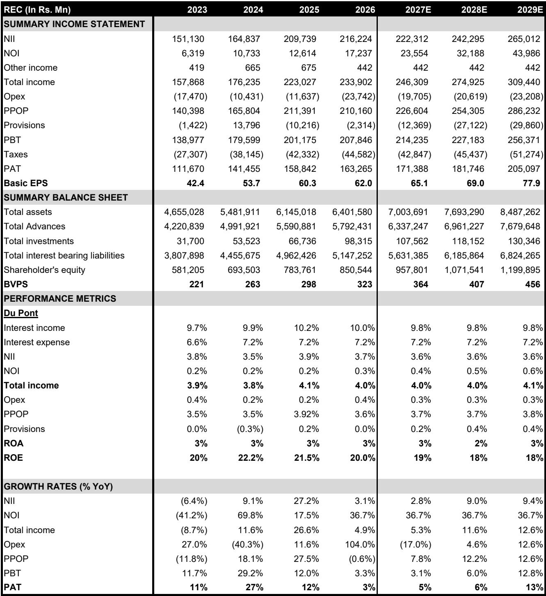
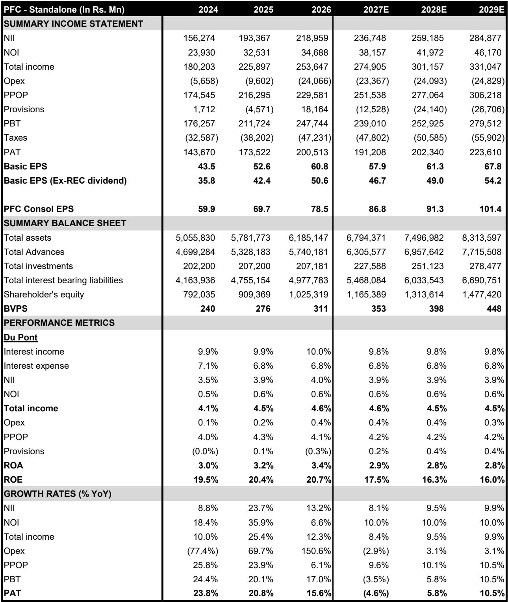
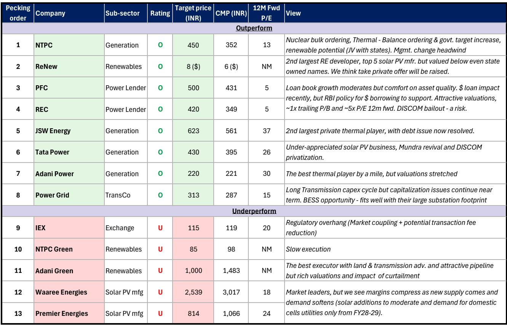

# India's Power Shortage Is Not a Cycle — It Is a Structural Mismatch That Will Last at Least Three More Years

The Indian power sector has historically traded like a weather derivative: buy before summer, sell before the monsoons. That pattern has worked because investors treated power demand as cyclical — driven by heat waves, GDP swings, and temporary supply gluts. This cycle is different. The underlying dynamics of demand, supply, and timing have shifted in ways that make the old playbook obsolete. The sector is no longer cheap, but the shortages are not going away for the next three years, and that changes the investment logic entirely.

What makes this phase structurally distinct is not just the absolute level of demand or the pace of capacity addition. It is the growing mismatch between when power is needed and what kind of power is being built. Solar capacity has surged, but solar only generates during daylight hours. The evening peak — the period between sunset and late night — is where the real stress is building. And on that front, the data is unambiguous: the shortage is worsening, not easing.

A global investment bank report on India's industrials and infrastructure sector makes this argument in detail, and the evidence is worth examining closely. The report does not claim that the sector is a bargain. Instead, it argues that the structural case for non-solar power — thermal, nuclear, and battery storage — remains intact, and that investors who treat the current pullback as a buying opportunity for the right names may be rewarded. But the analysis also leaves several important questions unanswered, and those gaps are where the real strategic thinking begins.

## The Aggregate Data Looks Benign, But the Real Stress Is Hidden in the Time-of-Day Breakdown

If you look only at average spot power prices on the Indian Energy Exchange, the picture appears moderate. Prices in April and May of this year stood at roughly Rs 3.8 per kilowatt-hour, well below the peaks of 2023. The buy-sell bid ratio on an aggregate basis has also fallen below 1, suggesting that supply and demand are broadly in balance. On the surface, the panic of two years ago seems to have subsided.

That surface-level reading is misleading. When the data is disaggregated by time of day, a very different story emerges. The spread between daytime power prices and evening power prices has widened to approximately Rs 7 per kilowatt-hour, a gap that was nearly zero for the entire previous decade. This is not a minor anomaly. It is a structural signal that the market is clearing at very different prices depending on the hour, and that the evening shortage is becoming more acute with each passing year.

The buy-sell ratio for evening hours tells the same story. During the summer months, that ratio has climbed to 2.2 times, meaning there are more than twice as many buyers as sellers for power in the non-solar hours. In 2020, that ratio was just 0.5 times. The desperation for evening power is real, and it is growing. For investors, the implication is clear: the value in the power sector is not evenly distributed across the day. Assets that can deliver power during the evening peak — thermal plants, nuclear facilities, and battery storage — command a scarcity premium that aggregate averages completely obscure.

## Demand Growth Has Returned, and This Time It May Not Fade After Summer

The report retains its long-term view that Indian power demand will grow at roughly one times real GDP growth. That assumption was questioned in recent years when demand grew only about 1 percent in FY26, well below expectations. But the report argues that the base effect is now favorable, and that weather forecasts pointing to below-normal rainfall this year add further support. The 6 percent demand growth assumption for the current year now looks conservative, not aggressive.

What matters more is the composition of that demand. The report identifies three structural drivers: weather variability, energy security concerns, and the rise of data centers. None of these are seasonal. Data center demand, in particular, is a 24-hour load that does not follow the sun. It is also concentrated in urban areas and requires reliable, firm power supply. This is not a demand profile that solar alone can serve, and it is growing faster than most market participants appreciate.

Historically, investors have sold power stocks after the summer peak, expecting demand to moderate. The report suggests that this time, demand growth will continue to surprise on the upside in the second half of the year. Electrification and energy security are not Indian themes; they are global themes, and India's dependence on imported oil and gas makes it more exposed than most. That structural argument has not changed, and it supports the view that demand will remain robust even after the monsoon arrives.

## The Supply Pipeline Is Inadequate, and Battery Storage Will Not Fill the Gap Quickly Enough

This is the most important section of the report, and it is where the structural case becomes clearest. During the last cycle, approximately 100 gigawatts of thermal capacity were under construction in 2012, equivalent to about 75 percent of the installed thermal base at the time. That created a supply glut that depressed prices for years. This cycle is the mirror image. Only about 40 gigawatts of thermal capacity are currently under construction, representing just 16 percent of the installed thermal base.

Over the next three years, the report estimates that only about 15 gigawatts of new thermal capacity will be added. Against that, evening power demand is expected to grow by roughly 50 gigawatts cumulatively, even under a conservative 6 percent growth assumption. The arithmetic is stark: unless India adds approximately 15 gigawatts of battery storage per year for the next three years, the evening shortage cannot be resolved.

The report casts doubt on whether that level of battery deployment is achievable. A large number of battery energy storage system tenders were issued last year, but many were won by small players with aggressive bids. Since then, battery prices and the rupee-dollar exchange rate have moved in the wrong direction. The report expects many of those tenders to fail, meaning the hoped-for battery capacity will not materialize. This is a critical judgment call, and it is one that investors need to monitor closely. If the report is right, the evening shortage will persist for years, and thermal and nuclear assets will continue to command premium pricing.

## Valuations Are No Longer Cheap, But the Correction Creates an Entry Point for Selective Investors

The report does not pretend that the sector is undervalued. State-owned utilities trade at 13 to 15 times forward earnings and 9 times EV/EBITDA, which is below global peers at 18 times and 11 times respectively. That discount is not massive, but it is meaningful. Private Indian utilities, by contrast, trade at significant premiums, and the report advises caution on those names unless a correction occurs.

The preference is for state-owned companies, with NTPC as the top pick. The rationale is not excitement about growth; it is about relative value and visibility. NTPC has exposure to nuclear bulk ordering, thermal balance ordering, and renewable potential through joint ventures with state governments. The report acknowledges that management change is a headwind, but it considers the valuation attractive enough to compensate.

For private thermal players, the report prefers JSW Energy over Adani Power, which has run up too fast. The recent fund raise by JSW has resolved debt issues and made the KSK expansion optionality more real. This is a tactical call within a structural thesis, and it reflects the report's view that not all thermal exposure is created equal.

## The Report Leaves Critical Questions Unanswered, and Those Gaps Define the Real Investment Debate

No analysis is complete, and the most valuable part of this report may be what it does not fully resolve. First, the battery storage question is pivotal. If battery costs fall faster than expected, or if policy support accelerates deployment, the evening shortage could ease sooner than the report assumes. Conversely, if the tender failures materialize as predicted, the shortage could become even more acute. The report takes a bearish view on battery execution, but that view is not proven.

Second, the report does not fully address the risk of policy intervention. If the evening shortage becomes severe enough to cause blackouts or industrial disruption, the government may take measures that alter the market structure — such as mandating storage co-location with solar projects, accelerating thermal capacity approvals, or imposing price caps. Any of these would change the investment calculus, and the report does not explore them in depth.

Third, the report's preference for non-solar power over solar is clear, but it does not fully address the implications for renewable energy companies. If the evening shortage persists, solar assets may face increasing curtailment or lower realized prices during the day, even as thermal assets benefit. That dynamic could create a divergence within the sector that the report only hints at.

Fourth, the report's pecking order includes power lenders like PFC and REC as outperform names, but it describes them as trades rather than core holdings. The logic is that loan book growth is moderating, asset quality is acceptable, and valuations are attractive at roughly one times trailing book value. But the risk of a DISCOM bailout is real, and the report does not quantify that risk or explain how it would affect the lenders' credit profiles.

These are not weaknesses in the report. They are the natural boundaries of any analytical exercise. But for investors trying to build a position, these open questions are where the real work begins. The report provides a framework, not a formula.

## A Decision Framework for Investors: Three Questions to Ask Before Acting

For readers who want to translate this analysis into actionable thinking, three questions are worth asking:

First, what is your view on battery storage execution? If you believe the tenders will be honored and costs will decline, the evening shortage may resolve faster than the report expects, and thermal assets may lose their scarcity premium. If you believe the tenders will fail, thermal and nuclear assets remain attractive for at least three years.

Second, what is your time horizon? The report's structural thesis plays out over three to five years. If your horizon is shorter, the seasonal pattern of power stock performance may still matter, and the risk of a post-summer selloff is real. If your horizon is longer, the structural argument for non-solar power is compelling, and pullbacks are entry points.

Third, how do you assess policy risk? The Indian government has a history of intervening in power markets when shortages become politically untenable. If you expect intervention, the best positioned assets may be those with regulatory protection or diversified revenue streams. If you expect the market to clear on its own, the pure plays on evening power are more attractive.

These questions do not have easy answers. But they define the debate, and they separate investors who are trading a narrative from those who are building a position based on structural logic.

## Join the Community to Read the Full Report and Review the Original Charts

The analysis summarized here is drawn from a detailed institutional report that includes proprietary data on spot market trends, supply pipelines, valuation comparisons, and a full pecking order of covered companies. The original charts on time-of-day price spreads, buy-sell ratios by hour, and thermal capacity under construction are essential for anyone trying to form their own view on the Indian power sector. Join the community to read the full report and review the original charts.

*This article is for learning and discussion only and does not constitute investment advice.*

Personal reading notes and learning share only. Not investment advice.

