# Japan Semiconductors

# Japan Semi Equipment: Potentially reversing share loss in China?

David Dai, CFA

+852 2918 5704

david.dai@bernsteinsg.com

Qingyuan Lin, Ph.D.

+852 2123 2654

qingyuan.lin@bernsteinsg.com

Juho Hwang

+852 2123 2632

juho.hwang@bernsteinsg.com

Francis Ma

+852 2123 2626

francis.ma@bernsteinsg.com

Carmine Milano, CFA

+44 20 7762 1857

carmine.milano@bernsteinsg.com

Jack Lin

+852 2123 2683

jack.lin@bernsteinsg.com

Japanese equipment makers have been losing share in China, not only to Chinese domestic makers but to other overseas makers. Their market share among imports dropped from 26% in 2024 to 23% in 2025. Before that, their market share in China among imports peaked in 2021 at 30%. We believe that is one of the major concerns for investors, but the trend may reverse going onward.

The share loss can be explained: FX was a big reason for the nominal share loss. The JPY has depreciated 31.5% over the last 5 years, and Japanese WFE players tend to price their products in JPY. Adjusting for which the market share would have been 31%/26% (instead of 26%/23%) respectively in 2024/25, vs. 2023 adjusted market share of 27%, or 2021 share of 28%. Investment timing was another major reason, causing Japan to lose share in 2025 after gaining share in 2024. We believe some of the customers with historically higher Japanese presence such as CXMT not placing many orders in 2025 may have also caused some optical market share loss. Averaging out market share in 2024 and 25, the Japanese WFE companies' FX adjusted market share in China among imported equipment would be 28.6%, which is on par with average market share in 21-23 of 28.1%. This also suggests that 2025 share loss is mainly due to timing for order rather than structural loss. There are also some specific reasons for each individual company. All 3 front end equipment companies (TEL/Screen/Kokusai) lost share in 2025, but for different reasons. For Tokyo Electron, it was likely due to customer / process-step mix and timing, as well as historically less aggressive pricing. For Screen, it was likely due to order timing and customers' localization attempts, as cleaning is a segment where locals have become more credible, while for Kokusai it was likely mostly due to CXMT's investment timing.

We expect the Japanese equipment makers to reverse the share loss in China going forward. The FX should no longer be a headwind, and because of yen depreciation, the Japanese equipment is of considerably good value which allows them to raise prices. This, coupled with normalization of investment pattern among the Chinese customers, should allow the Japanese equipment makers to gain market share in China. Although Japan's market share among import hasn't necessarily been impressive YTD, we expect them to regain share in going forward as Chinese customers seem to have been ordering increasingly from Japan again, and we believe Japanese equipment makers have started to raise prices more actively. Specifically, Tokyo Electron (OP) has been more vocal on pricing, especially in China where certain tools remain difficult to be replaced by locals. Customer mix normalizing should also help. Kokusai (OP) could see China memory capacity expansion cycle to support demand, and we believe their core areas are not yet fully caught up by local competition. Screen (MP) expects orders from CXMT to come back after 2 years of no orders, as well as a sizeable order from JHICC.

We are positive on front end equipment companies — Tokyo Electron, Kokusai as well as Screen especially after the recent commodity / materials rally. SPEs have been underperforming the commodity semi names (memory, analog, substrate, wafer, etc.) in the past 2-3 months. We expect the strength for SPE companies to recover as investors recognize the capex increase in the next few years, as well as their potential share gain in China, and prefer TEL (OP) and Kokusai (OP).

BERNSTEIN TICKER TABLE

<table><tr><td rowspan="2">Ticker</td><td rowspan="2">Rating</td><td colspan="3">11 Jun 2026</td><td rowspan="2">TTMRel.</td><td colspan="4">Reported EPS</td><td colspan="3">Reported P/E (x)</td></tr><tr><td>Cur</td><td>Closing Price</td><td>Price Target</td><td>Cur</td><td>2025A</td><td>2026E</td><td>2027E</td><td>2025A</td><td>2026E</td><td>2027E</td></tr><tr><td>8035.JP (Tokyo Electron)</td><td>O</td><td>JPY</td><td>63,400</td><td>59,200</td><td>114.7%</td><td>JPY</td><td>1,250.88</td><td>1,504.14</td><td>1,848.77</td><td>50.7</td><td>42.2</td><td>34.3</td></tr><tr><td>7735.JP (Screen)</td><td>M</td><td>JPY</td><td>12,990</td><td>12,600</td><td>97.2%</td><td>JPY</td><td>486.61</td><td>572.60</td><td>662.24</td><td>26.7</td><td>22.7</td><td>19.6</td></tr><tr><td>6525.JP (Kokusai)</td><td>O</td><td>JPY</td><td>8,042.00</td><td>8,240.00</td><td>103.9%</td><td>JPY</td><td>128.63</td><td>200.23</td><td>274.61</td><td>62.5</td><td>40.2</td><td>29.3</td></tr><tr><td>002371.CH (NAURA)</td><td>O</td><td>CNY</td><td>637.50</td><td>680.00</td><td>71.1%</td><td>CNY</td><td>5.66</td><td>10.22</td><td>16.41</td><td>112.6</td><td>62.4</td><td>38.9</td></tr><tr><td>688012.CH (AMEC)</td><td>O</td><td>CNY</td><td>303.12</td><td>500.00</td><td>130.4%</td><td>CNY</td><td>3.40</td><td>4.95</td><td>7.18</td><td>89.2</td><td>61.3</td><td>42.2</td></tr><tr><td>688072.CH (Piotech)</td><td>O</td><td>CNY</td><td>655.27</td><td>580.00</td><td>322.3%</td><td>CNY</td><td>3.32</td><td>8.12</td><td>12.40</td><td>197.4</td><td>80.7</td><td>52.9</td></tr><tr><td>ASML (ASML)</td><td>O</td><td>USD</td><td>1,734.19</td><td>1,971.00</td><td>98.4%</td><td>USD</td><td>27.95</td><td>36.96</td><td>53.13</td><td>53.6</td><td>40.5</td><td>28.2</td></tr><tr><td>ASML.NA (ASML)</td><td>O</td><td>EUR</td><td>1,507.20</td><td>1,700.00</td><td>109.2%</td><td>EUR</td><td>24.72</td><td>32.69</td><td>46.98</td><td>61.0</td><td>46.1</td><td>32.1</td></tr><tr><td>JPL</td><td></td><td></td><td>2,508.65</td><td></td><td></td><td></td><td></td><td></td><td></td><td></td><td></td><td></td></tr><tr><td>ASIAX</td><td></td><td></td><td>1,911.22</td><td></td><td></td><td></td><td></td><td></td><td></td><td></td><td></td><td></td></tr><tr><td>SPX</td><td></td><td></td><td>7,394.30</td><td></td><td></td><td></td><td></td><td></td><td></td><td></td><td></td><td></td></tr><tr><td>EDME</td><td></td><td></td><td>1,541.87</td><td></td><td></td><td></td><td></td><td></td><td></td><td></td><td></td><td></td></tr></table>

O - Outperform, M - Market-Perform, U - Underperform, NR - Not Rated, CS - Coverage Suspended  
Source: Bloomberg, Bernstein estimates and analysis.

## INVESTMENT IMPLICATIONS

We rate Tokyo Electron (TP=¥59,200) and Kokusai (TP=¥8,240.00 Outperform, and Screen (TP=¥12,600) Market-Perform.

We rate ASML (PT=€1,700.00) Outperform.

We rate Naura Outperform, with TP at CNY 680.

We rate AMEC Outperform, with TP at CNY 500.

We rate Piotech Outperform, with TP at CNY 580.

## DETAILS

Japanese equipment makers, led by TEL, have been underperforming global peers in 2025 in growth and market share. One big reason for that is China, which represents c. $42\%$ of global WFE as of 2025, where Japanese equipment makers have been losing share. In today's report, we examine the cause of the share loss, and discuss the future market share trend in China.

Japanese equipment makers have been losing share in China, not only to Chinese domestic makers but to other overseas makers. Their market share among imports dropped from 26% in 2024 to 23% in 2025. Before that, their market share in China among imports peaked in 2021 at 30%. However, we believe the trend may reverse going forward.

Japanese makers have been losing share in 2025 not only to domestic competition but among global players as well. Alongside China WFE market growth, WFE imports to China has been on a constant rise (Exhibit 1). Although, Japan's market share within WFE imports has been on a constant decline since 2021 peak. The absolute dollar amount of Japan-origin imports also fell in 2025 from the 2024 peak, and 2026 YTD (up to April) run-rate also appears lower than the 2025 level (Exhibit 2).

EXHIBIT 1: WFE imports to China has been on a constant rise...  
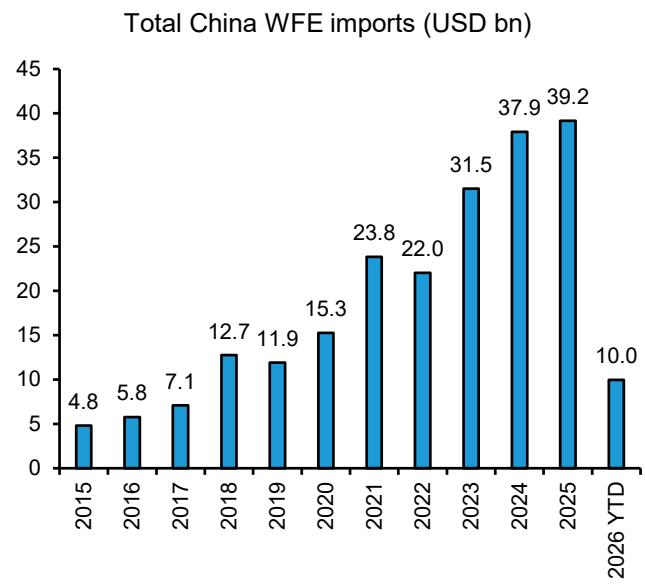

bar chart

Total China WFE imports (USD bn)
| Year | Total China WFE imports (USD bn) |
| :--- | :--- |
| 2015 | 4.8 |
| 2016 | 5.8 |
| 2017 | 7.1 |
| 2018 | 12.7 |
| 2019 | 11.9 |
| 2020 | 15.3 |
| 2021 | 23.8 |
| 2022 | 22.0 |
| 2023 | 31.5 |
| 2024 | 37.9 |
| 2025 | 39.2 |
| 2026 YTD | 10.0 |

Source: General Administrations of Customs of PRC, Bernstein analysis.

EXHIBIT 2: ...but Japan has been constantly dropping market share since 2022.  
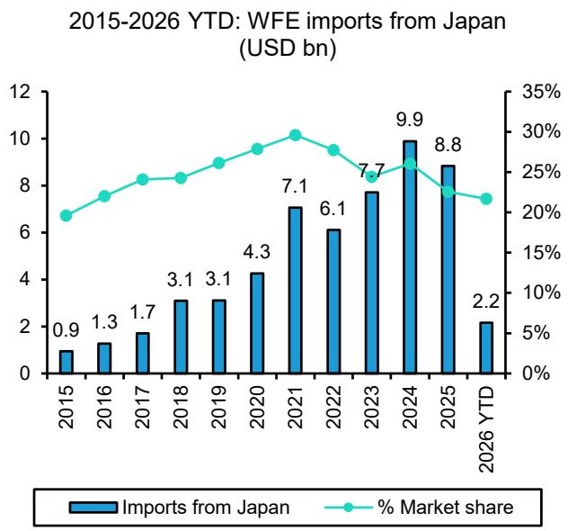

bar-line hybrid

2015-2026 YTD: WFE imports from Japan (USD bn)
| Year | Imports from Japan (USD bn) | % Market share (%) |
| :--- | :--- | :--- |
| 2015 | 0.9 | 20 |
| 2016 | 1.3 | 24 |
| 2017 | 1.7 | 26 |
| 2018 | 3.1 | 26 |
| 2019 | 3.1 | 28 |
| 2020 | 4.3 | 30 |
| 2021 | 7.1 | 31 |
| 2022 | 6.1 | 29 |
| 2023 | 7.7 | 25 |
| 2024 | 9.9 | 27 |
| 2025 | 8.8 | 23 |
| 2026 YTD | 2.2 | 22 |

Source: General Administration of Customs of PRC, Bernstein analysis.

A big part of the reason for nominal share loss was FX. We would not attribute all of this to pure market share loss to competition. Firstly, the Japanese yen has depreciated 31.5% over the last 5 years (Exhibit 3), and we suspect that this FX movement definitely would have played a role since most of the Japanese WFE vendors price their equipment mostly in JPY. If we adjust for FX, Japan's market share loss can be seen as largely stable (Exhibit 4).

EXHIBIT 3: JPY has depreciated 31.5% over the last 5 years.  
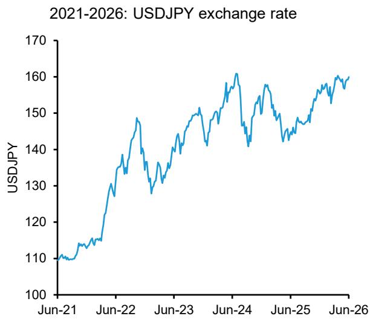

line chart

| Date   | USDJPY |
|--------|--------|
| Jun-21 | 110    |
| Jun-22 | 130    |
| Jun-23 | 145    |
| Jun-24 | 160    |
| Jun-25 | 150    |
| Jun-26 | 160    |

Source: Bloomberg, Bernstein analysis.

EXHIBIT 4: FX may have some impact on Japan's market share loss as they charge customers mostly in JPY.  
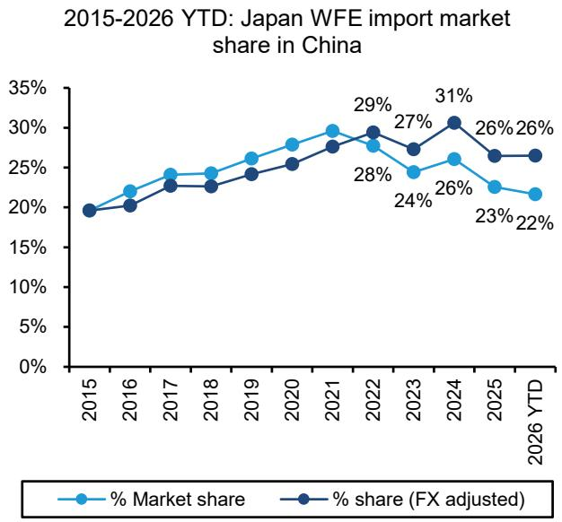

line chart

2015-2026 YTD: Japan WFE import market share in China
| Year | % Market share (%) | % share (FX adjusted) (%) |
| :--- | :--- | :--- |
| 2015 | 19.5 | 19.5 |
| 2016 | 22.0 | 20.0 |
| 2017 | 24.5 | 23.0 |
| 2018 | 24.5 | 23.0 |
| 2019 | 26.0 | 24.5 |
| 2020 | 27.5 | 25.5 |
| 2021 | 29.5 | 27.5 |
| 2022 | 27.5 | 29.0 |
| 2023 | 24.5 | 27.0 |
| 2024 | 26.0 | 31.0 |
| 2025 | 23.0 | 26.0 |
| 2026 YTD | 21.5 | 26.0 |

USDJPY FX is indexed to 2015  
Source: Bloomberg, General Administration of Customs of PRC, Bernstein analysis.

The other part is timing of order from different customers. For instance, CXMT as one of the Chinese companies who used a lot of Japanese equipments not only invested less overall last year due to fab expansion timing and their funding issues, but they also had tried to localize their equipment base and ordered less from Japan.

Averaging out market share in 2024 and 2025, the Japanese WFE companies' FX adjusted market share in China among imported equipment would be $28.6\%$ , which is on par with average market share in 21-23 of $28.1\%$ . This also suggests that 2025 share loss is mainly due to timing for order rather than structural loss.

The company-level read-through is therefore more nuanced than the headline share decline. All three front-end equipment companies under our coverage appear to have lost share in 2025, but the reasons differ by company. We also believe part of the share loss could reverse in 2H26–2027, supported by customer order normalization and more active pricing by Japanese vendors.

There are also some specific reasons for each individual company. All 3 front end equipment companies (TEL/Screen/Kokusai) lost share in 2025, but for different reasons. Overall, it seems clear that Japanese WFE companies under our coverage lost some market share in 2025 (Exhibit 5, Exhibit 6), but we believe this share loss could be reversed going forward.

Tokyo Electron (OP): For TEL, we believe they wouldn't have necessarily lost POR market share even in 2025, and the nominal market share loss is attributable firstly to customer mix and their timing of investment. For instance, CXMT — for which TEL has a relatively high market share — didn't invest much last year. Secondly, TEL has historically priced less aggressively, which lost them quite a bit of market share given FX depreciation. Also, some product-level / process .step-level mix may have also impacted optical market share.

Screen (MP): For Screen, the 2025 share loss appears to have been driven by order timing and customer localization attempts. CXMT did not place meaningful orders with Screen over the last two years as it tried to localize parts of its equipment base, which likely hurt Screen's China share. Swaysure, a major customer of Screen's in China DRAM space, wasn't very successful and ceased investment in 2025, which also impacted Screen's market share.

Kokusai (OP): For Kokusai, the 2024-2025 market share loss we believe also had a lot to do with CXMT, as in 2024 we estimate CXMT accounted for around ¥47bn whereas in 2025 we believe CXMT investment faded to around ¥11bn.

EXHIBIT 5: Overall, Japanese vendors have lost some market share in 2025...  
2023-2025: China market share among foreign vendors (Overall)  
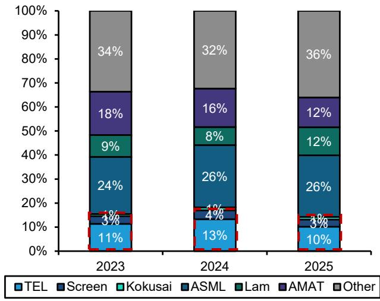

stacked bar chart

| Year | TEL (%) | Screen (%) | Kokusai (%) | ASML (%) | Lam (%) | AMAT (%) | Other (%) |
|---|---|---|---|---|---|---|---|
| 2023 | 11 | 3 | 9 | 24 | 3 | 18 | 34 |
| 2024 | 13 | 4 | 8 | 26 | 1 | 16 | 32 |
| 2025 | 10 | 3 | 12 | 26 | 3 | 12 | 36 |

Source: Gartner, Company disclosures, Bernstein China Semi Team analysis and estimates.

EXHIBIT 6: ...and the trend looks more pronounced for the 4 segments with Japanese exposure.  
2023-2025: China market share among foreign vendors (Deposition+Etch+Cleaning+Thermal)  
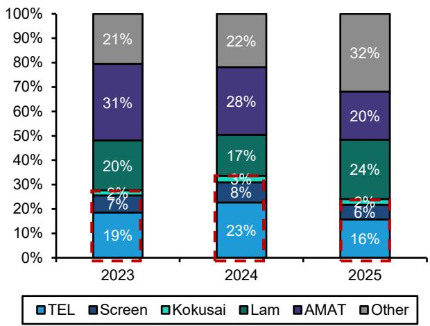

stacked bar chart

| Year | TEL (%) | Screen (%) | Kokusai (%) | Lam (%) | AMAT (%) | Other (%) |
|---|---|---|---|---|---|---|
| 2023 | 19 | 7 | 2 | 20 | 31 | 21 |
| 2024 | 23 | 8 | 3 | 17 | 28 | 22 |
| 2025 | 16 | 6 | 2 | 24 | 20 | 32 |

Source: Gartner, Company disclosures, Bernstein China Semi Team analysis and estimates.

We expect them to regain share from 2H26 onward, especially with the active price raise. Going forward, the FX should no longer be a headwind, and because of yen depreciation of \~31% over the past 5 years, the Japanese equipment is of considerably good value which allows them to raise prices. This, coupled with normalization of investment pattern among the Chinese customers, should allow the Japanese equipment makers to gain market share in China (Exhibit 7-Exhibit 9).

TEL: We expect TEL's China share to improve from the weak 2025 level as customer mix normalizes and pricing becomes more supportive. TEL has recently been more vocal on pricing, especially in China, where it sees room for price increases given that certain tools remain difficult to replace with local alternatives. The company also appears to be introducing additional surcharges for cost increases and expedited delivery. Therefore, while 2025 share may have been weak, we do not think it should be extrapolated into 2026 and beyond.

Screen: For Screen, we are now more constructive after our recent group call with the company. While they have also lost some nominal market share in 2025, Screen expects orders from CXMT to come back — who did not place orders for them in the last 2 years in an attempt to localize the equipments, a sizable order from JHICC, and YMTC ordering 1.5x of what they ordered last year. Foundry customers are expected to continue to rely heavily on Screen as well.

Kokusai: For Kokusai, we expect China memory capacity expansion to support demand, while local competition has not yet fully caught up in Kokusai's core areas. Therefore, although China thermal localization remains a medium-term risk, we do not think the 2025 China import-share data alone should change the investment thesis. Kokusai's near-term upside/downside should remain more driven by capacity constraints.

Meanwhile, SPEs have been underperforming the commodity semi names (memory, analog, substrate, wafer, etc.) in the past 2-3 months (Exhibit 10). We expect the strength for SPE companies to recover as investors recognize the capex increase in the next few years, as well as their potential share gain in China. Our pecking order in Japan frontend SPE is TEL (OP) > Kokusai (OP) > Screen (MP) for the China exposure.

EXHIBIT 7: TEL China's sales declined in FY26...  
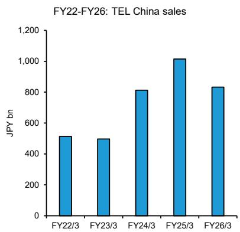

bar chart

FY22-FY26: TEL China sales
| Fiscal Year | Sales (JPY bn) |
| :--- | :--- |
| FY22/3 | 510 |
| FY23/3 | 495 |
| FY24/3 | 810 |
| FY25/3 | 1010 |
| FY26/3 | 830 |

Source: Company disclosures, Bernstein analysis.

EXHIBIT 8: ...as did Screen's...  
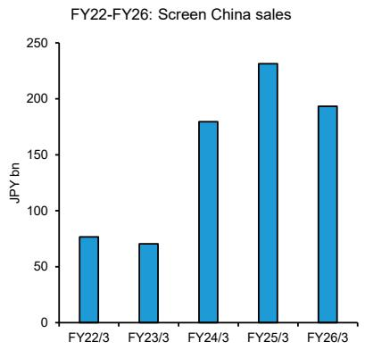

bar chart

| Fiscal Year | JPY bn |
| ----------- | ------ |
| FY22/3      | 75     |
| FY23/3      | 70     |
| FY24/3      | 180    |
| FY25/3      | 230    |
| FY26/3      | 195    |

Source: Company disclosures, Bernstein analysis

EXHIBIT 9: ...and Kokusai's, but we expect them to resume growth.  
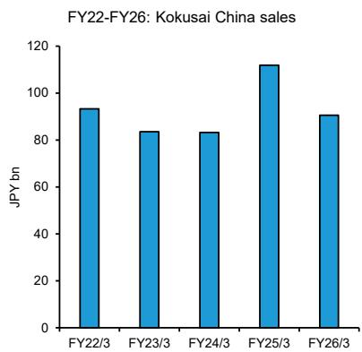

bar chart

FY22-FY26: Kokusai China sales
| Fiscal Year | Sales (JPY bn) |
| :--- | :--- |
| FY22/3 | 93 |
| FY23/3 | 83 |
| FY24/3 | 83 |
| FY25/3 | 112 |
| FY26/3 | 90 |

Source: Company disclosures, Bernstein analysis.

EXHIBIT 10: Over the last 2 months, SPEs have significantly underperformed analog (Renesas) and commodity (Ibiden / Sumco).  
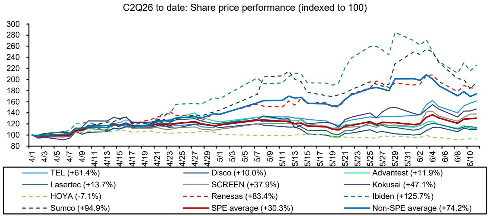

line chart

| Date | TEL | Disas | Lasertec | HOYA | Presco | Screen | Renesas | Advantest | Kokusai | Ibiden | Non-SPE average |
| --- | --- | --- | --- | --- | --- | --- | --- | --- | --- | --- | --- |
| 4/1 | ~100 | ~100 | ~100 | ~100 | ~100 | ~100 | ~100 | ~100 | ~100 | ~100 | ~100 |
| 4/3 | ~105 | ~105 | ~105 | ~105 | ~105 | ~105 | ~105 | ~105 | ~105 | ~105 | ~105 |
| 4/5 | ~110 | ~110 | ~110 | ~110 | ~110 | ~110 | ~110 | ~110 | ~110 | ~110 | ~110 |
| 4/7 | ~115 | ~115 | ~115 | ~115 | ~115 | ~115 | ~115 | ~115 | ~115 | ~115 | ~115 |
| 4/9 | ~120 | ~120 | ~120 | ~120 | ~120 | ~120 | ~120 | ~120 | ~120 | ~120 | ~120 |
| 4/11 | ~125 | ~125 | ~125 | ~125 | ~125 | ~125 | ~125 | ~125 | ~125 | ~125 | ~125 |
| 4/13 | ~130 | ~130 | ~130 | ~130 | ~130 | ~130 | ~130 | ~130 | ~130 | ~130 | ~130 |
| 4/15 | ~135 | ~135 | ~135 | ~135 | ~135 | ~135 | ~135 | ~135 | ~135 | ~135 | ~135 |
| 4/17 | ~140 | ~140 | ~140 | ~140 | ~140 | ~140 | ~140 | ~140 | ~140 | ~140 | ~140 |
| 4/19 | ~145 | ~145 | ~145 | ~145 | ~145 | ~145 | ~145 | ~145 | ~145 | ~145 | ~145 |
| 4/21 | ~150 | ~150 | ~150 | ~150 | ~150 | ~150 | ~150 | ~150 | ~150 | ~150 | ~150 |
| 4/23 | ~155 | ~155 | ~155 | ~155 | ~155 | ~155 | ~155 | ~155 | ~155 | ~155 | ~155 |
| 4/25 | ~160 | ~160 | ~160 | ~160 | ~160 | ~160 | ~160 | ~160 | ~160 | ~160 | ~160 |
| 4/27 | ~165 | ~165 | ~165 | ~165 | ~165 | ~165 | ~165 | ~165 | ~165 | ~165 | ~165 |
| 4/29 | ~170 | ~170 | ~170 | ~170 | ~170 | ~170 | ~170 | ~170 | ~170 | ~170 | ~170 |
| 5/7 | ~200 | ~200 | ~200 | -7.8% | -7.8% | -7.8% | -83.4% | -83.4% | -83.4% | -83.4% | -83.4% |
| 5/9 | ~220 | -88 | -88 | -7.8% | -7.8% | -7.8% | -83.4% | -83.4% | -83.4% | -83.4% | -83.4% |
| 5/9 | - | - | - | - | - | - | - | - | - | - | - |
| 5/9 | - | - | - | - | - | - | - | - | - | - | - |
| 5/9 | - | - | - | - | - | - | - | - | - | - | - |

Source: Bloomberg, Bernstein analysis.

China WFE is still an important market for global equipment makers, despite continued localization. Overall, China remains a large and important WFE market (Exhibit 11) with \$50bn TAM composing c. 42% of global WFE as of 2025, supported by domestic fab expansion, localization of semiconductor manufacturing and ongoing investment by both logic/foundry and memory customers. Even as domestic WFE suppliers gain share, the absolute size of China WFE demand remains large enough to matter for global equipment vendors. This is particularly relevant for Japanese suppliers, as TEL, Screen and Kokusai all have meaningful China exposure.

However, the key issue is no longer simply whether China WFE grows. The more important question is how much of that growth accrues to imported suppliers versus domestic vendors. China's self-sufficiency is expected to increase further, which means global vendors can face share pressure even if China WFE remains large.

EXHIBIT 11: Chinese WFE market is growing, and self-sufficiency is expected to increase further.  
China Wafer Fab Equipment (WFE) TAM and Domestic Share USD bn  
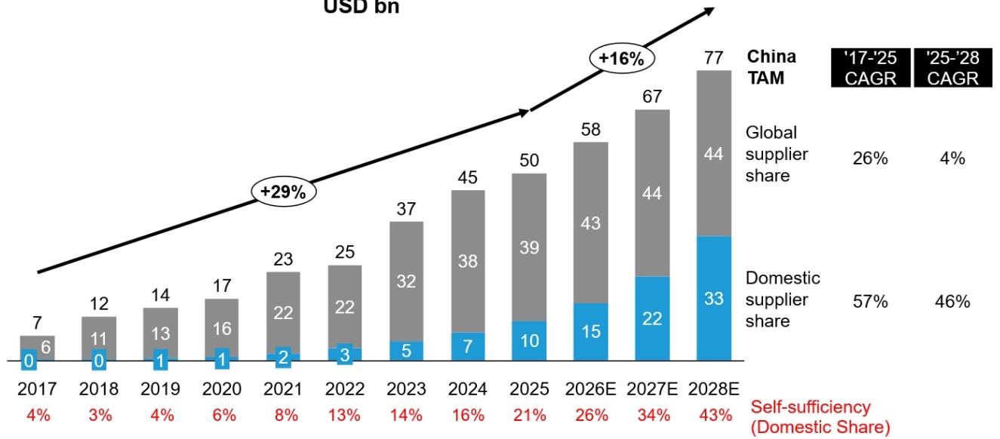

bar-line hybrid

| Year | Total (USD bn) | Domestic supplier share (%) | Self-sufficiency (Domestic Share) (%) |
| :--- | :--- | :--- | :--- |
| 2017 | 7 | 6 | 4 |
| 2018 | 12 | 11 | 3 |
| 2019 | 14 | 13 | 4 |
| 2020 | 17 | 16 | 6 |
| 2021 | 23 | 22 | 8 |
| 2022 | 25 | 22 | 13 |
| 2023 | 37 | 32 | 14 |
| 2024 | 45 | 38 | 16 |
| 2025 | 50 | 39 | 21 |
| 2026E | 58 | 43 | 26 |
| 2027E | 67 | 44 | 34 |
| 2028E | 77 | 44 | 43 |
China TAM: Global supplier share; Domestic supplier share; China TAM: '17-'25 CAGR; China TAM: '25-'28 CAGR; Self-sufficiency (Domestic Share); Global supplier share: '26%; Domestic supplier share: '57%; China TAM: '4%'; Self-sufficiency (Domestic Share): '46%. +29% growth trend indicated by arrow.

Source: Bernstein China Team estimates and analysis.

## Detailed discussion / data for market share in China by product

Before discussing the detailed market share, one factor that impacts overall share is lithography intensity which has been significantly higher since 2023 onwards — from 18% in 2022 to 28% in 2023-2024 (Exhibit 12), and lithography is an area where Japan used to have some presence in the form of Canon (7751.JT, not covered) and Nikon (7731.JT, not covered) but is now mostly dominated by ASML (Outperform).

EXHIBIT 12: Litho intensity was notably higher since 2023 onwards in China.  
2015-2026 YTD: Breakdown by equipment type (Global)  
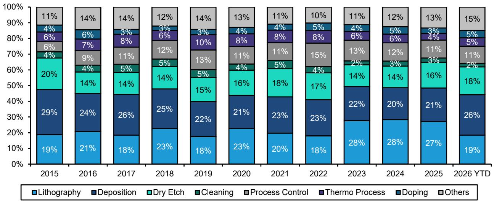

stacked bar chart

| Year     | Lithography | Deposition | Dry Etch | Cleaning | Process Control | Thermo Process | Doping | Others |
| -------- | ----------- | ---------- | -------- | -------- | --------------- | -------------- | ------ | ------ |
| 2015     | 19%         | 29%        | 20%      | 4%       | 6%              | 4%             | 11%    |        |
| 2016     | 21%         | 24%        | 14%      | 4%       | 9%              | 7%             | 14%    |        |
| 2017     | 18%         | 26%        | 14%      | 5%       | 11%             | 8%             | 14%    |        |
| 2018     | 23%         | 25%        | 14%      | 5%       | 12%             | 6%             | 12%    |        |
| 2019     | 18%         | 22%        | 15%      | 5%       | 13%             | 10%            | 14%    |        |
| 2020     | 23%         | 21%        | 16%      | 4%       | 11%             | 8%             | 13%    |        |
| 2021     | 20%         | 23%        | 18%      | 5%       | 11%             | 8%             | 11%    |        |
| 2022     | 18%         | 23%        | 17%      | 4%       | 15%             | 8%             | 10%    |        |
| 2023     | 28%         | 22%        | 14%      | 2%       | 13%             | 6%             | 11%    |        |
| 2024     | 28%         | 20%        | 14%      | 3%       | 12%             | 6%             | 12%    |        |
| 2025     | 27%         | 21%        | 16%      | 3%       | 11%             | 4%             | 13%    |        |
| 2026 YTD | 19%         | 26%        | 18%      | 2%       | 11%             | 5%             | 15%    |        |

Source: General Administration of Customs of PRC, Bernstein analysis.

On the other hand, more structurally, the import data suggests that Japan may actually be potentially losing market share to certain suppliers shipping from Malaysia — which likely represents Lam Research (LRCX.US, covered by Stacy Rasgon) — as well as Singapore — which likely represents Applied Materials (AMAT.US, covered by Stacy Rasgon) in the more recent years, as we can see that Malaysia has increased its market share from 4% to 9% in 2025, and Singapore has increased market share from 17% to 24% in 2026 YTD while Japan lost 4% points of market (Exhibit 13). In the following sections, we examine product-level import data as well as our China team's proprietary company-level estimates to examine which products and/or companies may be causing this market share loss.

EXHIBIT 13: Conversely, Malaysia / Singapore have been gaining market share in recent years.  
2015-2026 YTD: Regional breakdown of WFE Import in China  
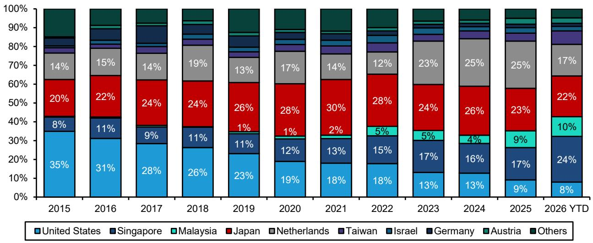

stacked bar chart

| Year | United States (%) | Singapore (%) | Malaysia (%) | Japan (%) | Netherlands (%) | Taiwan (%) | Israel (%) | Germany (%) | Austria (%) | Others (%) |
| :--- | :--- | :--- | :--- | :--- | :--- | :--- | :--- | :--- | :--- | :--- |
| 2015 | 35 | 8 | 0 | 20 | 14 | 0 | 0 | 0 | 0 | 20 |
| 2016 | 31 | 11 | 0 | 22 | 15 | 0 | 0 | 0 | 0 | 15 |
| 2017 | 28 | 9 | 0 | 24 | 14 | 0 | 0 | 0 | 0 | 14 |
| 2018 | 26 | 11 | 0 | 24 | 19 | 0 | 0 | 0 | 0 | 13 |
| 2019 | 23 | 11 | 0 | 26 | 13 | 0 | 0 | 0 | 0 | 13 |
| 2020 | 19 | 12 | 0 | 28 | 17 | 0 | 0 | 0 | 0 | 12 |
| 2021 | 18 | 13 | 0 | 30 | 14 | 0 | 0 | 0 | 0 | 12 |
| 2022 | 18 | 15 | 5 | 28 | 12 | 0 | 0 | 0 | 0 | 12 |
| 2023 | 13 | 17 | 5 | 24 | 23 | 0 | 0 | 0 | 0 | 11 |
| 2024 | 13 | 16 | 4 | 26 | 25 | 0 | 0 | 0 | 0 | 11 |
| 2025 | 9 | 17 | 9 | 23 | 25 | 0 | 0 | 0 | 0 | 11 |
| YTD (2026) | 8 | 24 | 10 | 22 | 17 | -3 | -3 | -3 | -3 | -3 |
The chart displays a stacked bar chart with each bar segmented by country/region and labeled with percentages. The legend includes 'United States', 'Singapore', 'Malaysia', 'Japan', 'Netherlands', 'Taiwan', 'Israel', 'Germany', 'Austria', and 'Others'. The data is already in English.

Source: General Administration of Customs of PRC, Bernstein analysis.

## By product, dry etch and thermal process is seeing market share loss

At the product level, the most visible share loss is in dry etch as well as thermal process (Exhibit 15, Exhibit 16). Japan's share in China dry etch imports has declined sharply, and the market share loss from 2024 peak seems to happening mostly to Lam Research who ships their etchers from Malaysia — which saw a significant uptick in 2025 to $39\%$ from $24\%$ in 2024 (Exhibit 17).

Although TEL may indeed be losing actual market share, we would assume TEL's share loss in dry etch could also be caused by both the lack of price hike on the side of TEL, as well as certain unfavourable process-step mix, as TEL is quite dominant in dielectric etch vs. Lam more in conductor etch (Exhibit 18, Exhibit 19).

EXHIBIT 14: Thermal processes, CMP, Dry etch, Cleaning, and Deposition are the segments in which China has achieved some degree of self-sufficiency.

<table><tr><td colspan="12">Major Chinese Wafer Fab Equipment suppliers by segment (CY2025)</td></tr><tr><td>Segment</td><td>Lithography</td><td>Deposition</td><td>Dry Etch</td><td>Process Control</td><td>Cleaning</td><td>CMP</td><td>Photoresist Processing</td><td>Doping</td><td>Thermal Processes</td><td>Other Mat. Removal</td><td>Mfg. Automation</td></tr><tr><td>Share of WFE</td><td>21%</td><td>25%</td><td>19%</td><td>10%</td><td>6%</td><td>3%</td><td>3%</td><td>2%</td><td>3%</td><td>1%</td><td>3%</td></tr><tr><td>China TAM (USD mn)</td><td>10,762</td><td>12,765</td><td>9,397</td><td>5,019</td><td>2,856</td><td>1,662</td><td>1,608</td><td>1,205</td><td>1,280</td><td>413</td><td>1,592</td></tr><tr><td>China supply (USD mn)</td><td>143</td><td>3,419</td><td>2,895</td><td>522</td><td>823</td><td>656</td><td>104</td><td>158</td><td>577</td><td>389</td><td>N/A</td></tr><tr><td>Self sufficiency</td><td>1%</td><td>27%</td><td>31%</td><td>10%</td><td>29%</td><td>39%</td><td>6%</td><td>13%</td><td>45%</td><td>94%</td><td>N/A</td></tr></table>

Source: Gartner, Company disclosures, Bernstein China Semi Team estimates and analysis.

EXHIBIT 15: Japanese market share in Dry etch has dropped the most sharply.  
2015-2026 YTD: Japanese WFE market share (Dry Etch)  
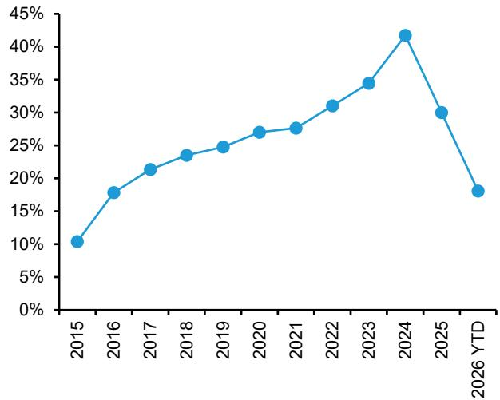

line chart

| Year | Value (%) |
|---|---|
| 2015 | 10.5 |
| 2016 | 17.8 |
| 2017 | 21.3 |
| 2018 | 23.4 |
| 2019 | 24.7 |
| 2020 | 26.9 |
| 2021 | 27.6 |
| 2022 | 31.0 |
| 2023 | 34.5 |
| 2024 | 41.8 |
| 2025 | 30.0 |
| 2026 YTD | 18.0 |

Market share among global players (excluding China local)  
Source: General Administration of Customs of PRC, Bernstein analysis.

EXHIBIT 16: Japanese Thermal process equipments has been consistently losing market share.  
2015-2026 YTD: Japanese WFE market share (Thermal Process)  
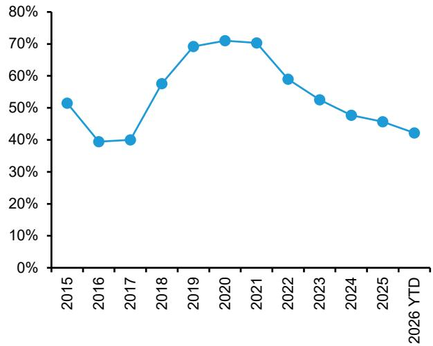

line chart

| Year | Value (%) |
| :--- | :--- |
| 2015 | 51.5 |
| 2016 | 39.2 |
| 2017 | 39.8 |
| 2018 | 57.6 |
| 2019 | 68.9 |
| 2020 | 70.8 |
| 2021 | 69.9 |
| 2022 | 59.1 |
| 2023 | 52.4 |
| 2024 | 47.6 |
| 2025 | 45.3 |
| 2026 YTD | 41.9 |

Market share among global players (excluding China local)  
Source: General Administration of Customs of PRC, Bernstein analysis.

EXHIBIT 17: Japan is losing market share in dry etch mainly to Malaysia, and 2026 YTD to Taiwan also.  
2015-2026 YTD: Regional breakdown of WFE Import in China (Dry Etch)  
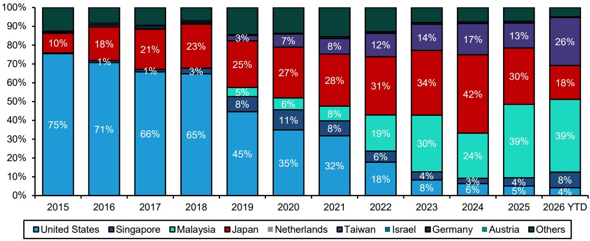  
Market share among global players (excluding China local)  
Source: General Administration of Customs of PRC, Bernstein analysis.

EXHIBIT 18: TEL has a dominant market share in dielectric etch...  
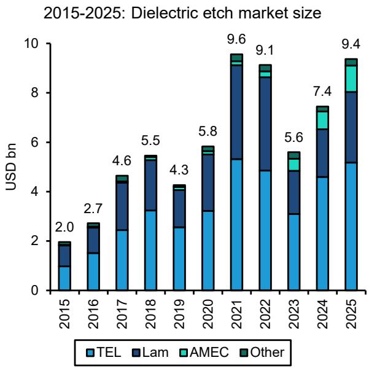

stacked bar chart

2015-2025: Dielectric etch market size
| Year | TEL (USD bn) | Lam (USD bn) | AMEC (USD bn) | Other (USD bn) |
| :--- | :--- | :--- | :--- | :--- |
| 2015 | 0.9 | 0.8 | 0.1 | 0.1 |
| 2016 | 1.4 | 1.1 | 0.1 | 0.1 |
| 2017 | 2.3 | 1.8 | 0.2 | 0.2 |
| 2018 | 3.1 | 2.1 | 0.1 | 0.1 |
| 2019 | 2.4 | 1.4 | 0.1 | 0.1 |
| 2020 | 3.1 | 2.4 | 0.3 | 0.2 |
| 2021 | 5.2 | 4.6 | 0.3 | 0.3 |
| 2022 | 4.8 | 4.6 | 0.4 | 0.3 |
| 2023 | 3.0 | 1.7 | 0.4 | 0.3 |
| 2024 | 4.5 | 2.3 | 0.5 | 0.1 |
| 2025 | 5.1 | 3.3 | 1.1 | 0.1 |
Total Market Size: $9.6bn - $9.4bn

Source: TechInsights, Bernstein analysis.

EXHIBIT 19: ...but has a minimal exposure to conductor etch.  
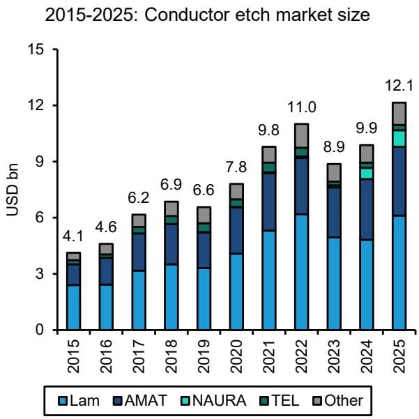

stacked bar chart

| Year | Lam  | AMAT | NAURA | TEL  | Other |
|------|------|------|-------|------|-------|
| 2015 | 2.7  | 1.3  | 0.3   | 0.1  | 0.3   |
| 2016 | 2.8  | 1.4  | 0.3   | 0.1  | 0.3   |
| 2017 | 3.0  | 1.6  | 0.3   | 0.1  | 0.3   |
| 2018 | 3.2  | 1.7  | 0.3   | 0.1  | 0.3   |
| 2019 | 3.1  | 1.6  | 0.3   | 0.1  | 0.3   |
| 2020 | 3.4  | 1.8  | 0.3   | 0.1  | 0.3   |
| 2021 | 5.7  | 2.5  | 0.4   | 0.1  | 0.3   |
| 2022 | 6.0  | 2.4  | 0.4   | 0.1  | 0.3   |
| 2023 | 5.5  | 2.4  | 0.4   | 0.1  | 0.3   |
| 2024 | 5.4  | 2.6  | 0.4   | 0.1  | 0.3   |
| 2025 | 6.0  | 3.1  | 0.5   | 0.1  | 0.3   |

Source: TechInsights, Bernstein analysis.

EXHIBIT 20: In thermal process, Japan is losing market share to both US and Singapore.  
  
Market share among global players (excluding China local)  
Source: General Administration of Customs of PRC, Bernstein analysis.

EXHIBIT 21: TEL's dry etch market share has declined significantly in 2025.  
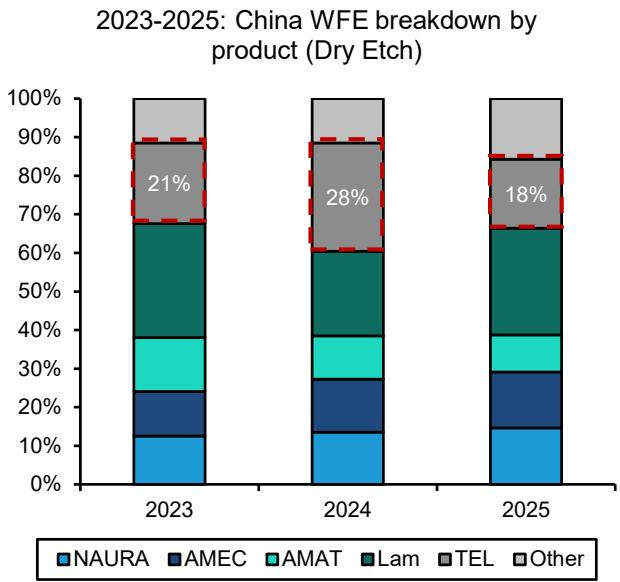

stacked bar chart

2023-2025: China WFE breakdown by product (Dry Etch)
| Year | NAURA (%) | AMEC (%) | AMAT (%) | Lam (%) | TEL (%) | Other (%) |
|---|---|---|---|---|---|---|
| 2023 | 12 | 14 | 16 | 31 | 21 | 10 |
| 2024 | 13 | 17 | 13 | 28 | 28 | 10 |
| 2025 | 14 | 17 | 11 | 30 | 18 | 10 |

Source: Gartner, Company disclosures, Bernstein China Semi Team analysis and estimates.

EXHIBIT 22: Japanese companies seem to have dropped significant market share for thermal process.  
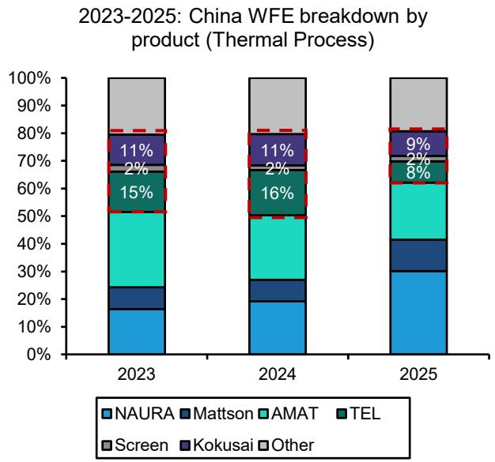

stacked bar chart

2023-2025: China WFE breakdown by product (Thermal Process)
| Year | NAURA (%) | Mattson (%) | AMAT (%) | TEL (%) | Screen (%) | Kokusai (%) | Other (%) |
|---|---|---|---|---|---|---|---|
| 2023 | 16 | 7 | 28 | 15 | 14 | 11 | 0 |
| 2024 | 19 | 6 | 26 | 16 | 13 | 11 | 0 |
| 2025 | 30 | 13 | 23 | 8 | 14 | 9 | 0 |

Source: Gartner, Company disclosures, Bernstein China Semi Team analysis and estimates.

EXHIBIT 23: Among foreign vendors, LRCX has gained market share within etch.  
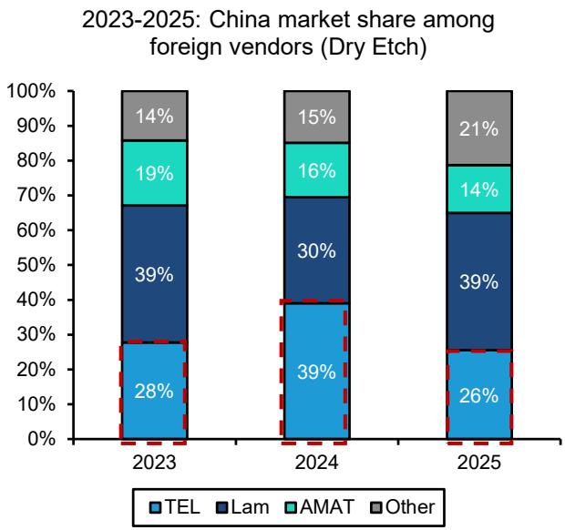

stacked bar chart

2023-2025: China market share among foreign vendors (Dry Etch)
| Year | TEL (%) | Lam (%) | AMAT (%) | Other (%) |
| :--- | :--- | :--- | :--- | :--- |
| 2023 | 28 | 39 | 19 | 14 |
| 2024 | 39 | 30 | 16 | 15 |
| 2025 | 26 | 39 | 14 | 21 |

Source: Gartner, Company disclosures, Bernstein China Semi Team analysis and estimates.

EXHIBIT 24: Among foreign vendors, AMAT has gained market share within thermal processes.  
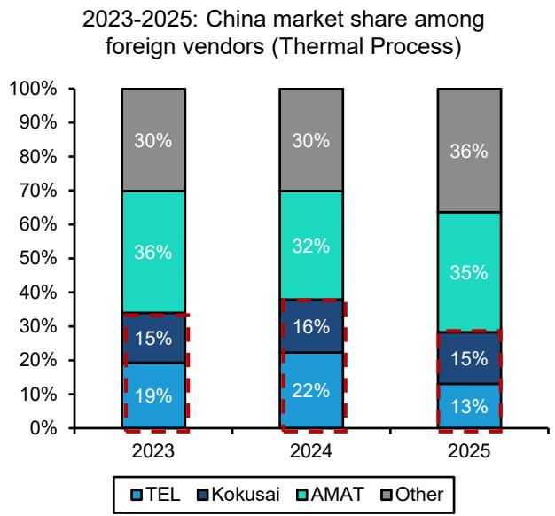

stacked bar chart

2023-2025: China market share among foreign vendors (Thermal Process)
| Year | TEL (%) | Kokusai (%) | AMAT (%) | Other (%) |
| :--- | :--- | :--- | :--- | :--- |
| 2023 | 19 | 15 | 36 | 30 |
| 2024 | 22 | 16 | 32 | 30 |
| 2025 | 13 | 15 | 35 | 36 |

Source: Gartner, Company disclosures, Bernstein China Semi Team analysis and estimates.

For cleaning and deposition, Japanese makers have been performing relatively better (Exhibit 25, Exhibit 26) than other segments. Japan's market share within cleaning equipment import rose to $76\%$ in 2025 from $30\%$ in 2019 trough, and deposition has maintained market share over the last two years.

EXHIBIT 25: Japanese cleaning equipment has gained market share over the years.  
2015-2026 YTD: Japanese WFE market share (Cleaning)  
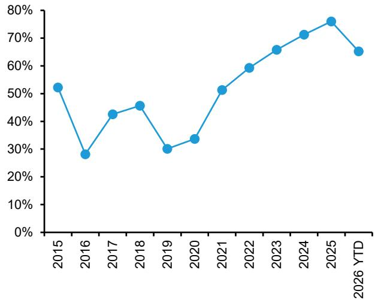

line chart

| Year | Value (%) |
|---|---|
| 2015 | 52 |
| 2016 | 28 |
| 2017 | 42 |
| 2018 | 45 |
| 2019 | 30 |
| 2020 | 33 |
| 2021 | 51 |
| 2022 | 59 |
| 2023 | 65 |
| 2024 | 71 |
| 2025 | 76 |
| 2026 YTD | 65 |

Market share among global players (excluding China local)  
Source: General Administration of Customs of PRC, Bernstein analysis.

EXHIBIT 26: Deposition market share has been rather stable over the years.  
2015-2026 YTD: Japanese WFE market share (Deposition)  
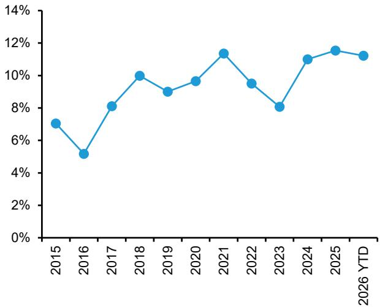

line chart

| Year | Value (%) |
| :--- | :--- |
| 2015 | 7.0 |
| 2016 | 5.1 |
| 2017 | 8.1 |
| 2018 | 10.0 |
| 2019 | 8.9 |
| 2020 | 9.6 |
| 2021 | 11.4 |
| 2022 | 9.4 |
| 2023 | 8.0 |
| 2024 | 11.0 |
| 2025 | 11.6 |
| 2026 YTD | 11.2 |

Market share among global players (excluding China local)  
Source: General Administration of Customs of PRC, Bernstein analysis.

EXHIBIT 27: Japan is losing some market share in 2026 YTD to Austria.  
2015-2026 YTD: Regional breakdown of WFE Import in China (Cleaning)  
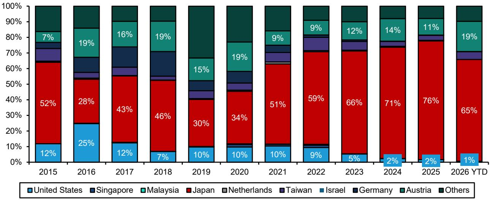

stacked bar chart

| Year | United States (%) | Singapore (%) | Malaysia (%) | Japan (%) | Netherlands (%) | Taiwan (%) | Israel (%) | Germany (%) | Austria (%) | Others (%) |
| :--- | :--- | :--- | :--- | :--- | :--- | :--- | :--- | :--- | :--- | :--- |
| 2015 | 12 | 0 | 7 | 52 | 3 | 0 | 0 | 0 | 0 | 28 |
| 2016 | 25 | 19 | 0 | 28 | 4 | 3 | 0 | 0 | 0 | 16 |
| 2017 | 12 | 16 | 0 | 43 | 5 | 4 | 0 | 0 | 0 | 19 |
| 2018 | 7 | 19 | 0 | 46 | 3 | 3 | 0 | 0 | 0 | 15 |
| 2019 | 10 | 0 | 0 | 30 | 4 | 4 | 0 | 0 | 57 | 34 |
| 2020 | 10 | 0 | 0 | 34 | 3 | 4 | 1 | 0 | 33 | 34 |
| 2021 | 10 | 0 | 9 | 51 | 2 | 4 | 1 | 0 | 26 | 19 |
| 2022 | 9 | 0 | 9 | 59 | 1 | 6 | 1 | 0 | 13 | 7 |
| 2023 | 5 | 0 | 12 | 66 | 2 | 4 | 1 | 0 | 13 | 7 |
| 2024 | 2 | 0 | 14 | 71 | 2 | 3 | 1 | 1 | 13 | 7 |
| 2025 YTD | 2 | 0 | 11 | 76 | 2 | 3 | 1 | 1 | 13 | 7 |
| 2026 YTD (Last) | -1 | -1 | -19 | -65 | -3 | -4 | -1 | -1 | -19 | -19 |
The chart displays a stacked bar chart with each bar representing a different category or region. The legend identifies categories: United States, Singapore, Malaysia, Japan, Netherlands, Taiwan, Germany, Austria, and Others. The data is presented in a long format with years on the x-axis and percentage values on the y-axis. The legend is embedded in the bars but does not correspond to any specific category labels. The chart type is a single stacked bar format.

Market share among global players (excluding China local)  
Source: General Administration of Customs of PRC, Bernstein analysis.

EXHIBIT 28: For cleaning, Screen / TEL's 2025 market share declined significantly.  
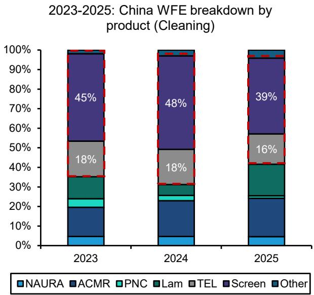

stacked bar chart

2023-2025: China WFE breakdown by product (Cleaning)
| Year | NAURA (%) | ACMR (%) | PNC (%) | Lam (%) | TEL (%) | Screen (%) | Other (%) |
|---|---|---|---|---|---|---|---|
| 2023 | 4 | 18 | 3 | 0 | 0 | 45 | 0 |
| 2024 | 4 | 18 | 3 | 0 | 0 | 48 | 0 |
| 2025 | 4 | 16 | 16 | 0 | 0 | 39 | 0 |

Source: Gartner, Company disclosures, Bernstein China Semi Team analysis and estimates.

EXHIBIT 29: Japan WFE vendors' deposition market share declined in 2025.  
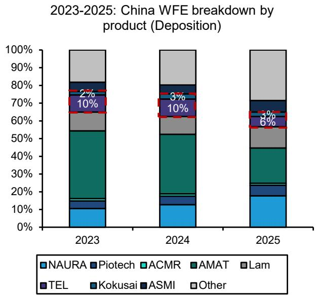

stacked bar chart

2023-2025: China WFE breakdown by product (Deposition)
| Year | NAURA (%) | Piotech (%) | ACMR (%) | AMAT (%) | Lam (%) | TEL (%) | Kokusai (%) | ASMI (%) | Other (%) |
|---|---|---|---|---|---|---|---|---|---|
| 2023 | 10 | 3 | 3 | 35 | 10 | 2 | 10 | 0 | 18 |
| 2024 | 12 | 4 | 3 | 30 | 8 | 3 | 10 | 0 | 21 |
| 2025 | 17 | 6 | 3 | 20 | 10 | 3 | 8 | 0 | 31 |

Source: Gartner, Company disclosures, Bernstein China Semi Team analysis and estimates.

## I. REQUIRED DISCLOSURES

References to "Bernstein" or the "Firm" in these disclosures relate to the following entities: Bernstein Institutional Services LLC (April 1, 2024 onwards), Bernstein & Co., LLC (pre April 1, 2024), Bernstein Autonomous LLP, BSG France S.A. (April 1, 2024 onwards), Bernstein (Hong Kong) Limited 盛博香港有限公司, Bernstein (Canada) Limited, Bernstein (India) Private Limited (SEBI registration no. INH000006378), Bernstein (Singapore) Private Limited, Bernstein Japan KK (サンフォード・C・バーンスタイン株式会社) and analysts employed by SG Africa Technologies & Services to produce Bernstein under a Global Services Agreement in place between Bernstein and SG.

Bernstein is part of a joint venture between SG (SG) and AllianceBernstein, L.P. (AB). Unless specifically noted otherwise, for purposes of these disclosures, references to Bernstein's “affiliates” relate to both SG and AB and their respective affiliates.

## VALUATION METHODOLOGY

This research publication covers six or more companies. For valuation methodology and other company disclosures:

Please visit: https://bernstein-autonomous.bluematrix.com/sellside/Disclosures.action.

Or, you can also write to the Director of Compliance, Bernstein Institutional Services LLC, 245 Park Avenue, New York, NY 10167.

## RISKS

This research publication covers six or more companies. For risks and other company disclosures:

Please visit: https://bernstein-autonomous.bluematrix.com/sellside/Disclosures.action.

Or, you can also write to the Director of Compliance, Bernstein Institutional Services LLC, 245 Park Avenue, New York, NY 10167.

## RATINGS DEFINITIONS, BENCHMARKS AND DISTRIBUTION

## EQUITY RATINGS DEFINITIONS

## Bernstein brand

The Bernstein brand rates stocks based on forecasts of relative performance for the next 12 months versus the S&P 500 for stocks listed on the U.S. and Canadian exchanges, versus the Bloomberg Europe Developed Markets Large and Mid Cap Price Return Index EUR (EDME) for stocks listed on the European exchanges and emerging markets exchanges outside of the Asia Pacific region, versus the Bloomberg Japan Large and Mid Cap Price Return Index USD (JPL) for stocks listed on the Japanese exchanges, and versus the Bloomberg Asia ex-Japan Large and Mid Cap Price Return Index (ASIAX) for stocks listed on the Asian (ex-Japan) exchanges -unless otherwise specified.

The Bernstein brand has three categories of ratings:

- Outperform: Stock will outpace the market index by more than 15 pp  
• Market-Perform: Stock will perform in line with the market index to within +/-15 pp  
• Underperform: Stock will trail the performance of the market index by more than 15 pp

Coverage Suspended: Coverage of a company under the Bernstein brand has been suspended. Ratings and price targets are suspended temporarily, are no longer current, and should therefore not be relied upon.

Not Rated: A rating assigned when the stock cannot be accurately valued, or the performance of the company accurately predicted, at the present time. The covering analyst may continue to publish research reports on the company to update investors on events and developments.

Not Covered (NC) denotes companies that are not under coverage.

Bernstein brand stock ratings are based on a 12-month time horizon.

## Autonomous brand – common stocks

The Autonomous brand rates common stocks as indicated below. As our benchmarks we use the Bloomberg Europe 500 Banks And Financial Services Index (BEBANKS) and Bloomberg Europe Dev Mkt Financials Large and Mid Cap Price Ret Index EUR (EDMFI) index for developed European banks and Payments, the Bloomberg Europe 500 Insurance Index (BEINSUR) for European insurers, the S&P 500 and S&P Financials for US banks and Payments coverage, S5LIFE for US Insurance, the S&P Insurance Select Industry (SPSIINS) for US Non-Life Insurers coverage, and the Bloomberg Emerging Markets Financials Large, Mid and Small Cap Price Return Index (EMLSF) for emerging market banks and insurers and Payments. Ratings are stated relative to the sector (not the market).

The Autonomous brand has three categories of common stock ratings:

- Outperform (OP): Stock will outpace the relevant index by more than 10 pp  
- Neutral (N): Stock will perform in line with the market index to within +/-10 pp  
• Underperform (UP): Stock will trail the performance of the relevant index by more than 10 pp

Coverage Suspended: Coverage of a company under the Autonomous research brand has been suspended. Ratings and price targets are suspended temporarily, are no longer current, and should therefore not be relied upon.

Not Rated: A rating assigned when the stock cannot be accurately valued, or the performance of the company accurately predicted, at the present time. The covering analyst may continue to publish research reports on the company to update investors on events and developments.

Those denoted as ‘Feature’ (e.g., Feature Outperform FOP, Feature Under Outperform FUP) are our core ideas.

Not Covered (NC) denotes companies that are not under coverage.

Autonomous brand common stock ratings are based on a 12-month time horizon.

## Autonomous brand – preferred stocks

The Autonomous brand has three categories of preferred stock ratings:

- Outperform (OP): The total return of the preferred instrument is expected to outperform preferred securities of other issuers operating in similar sectors or rating categories over the next six months.  
- Neutral (N): The total return of the preferred instrument is expected to perform in line with preferred securities of other issuers operating in similar sectors or rating categories over the next six months.  
- Underperform (UP): The total return of the preferred instrument is expected to underperform preferred securities of other issuers operating in similar sectors or rating categories over the next six months.

Autonomous preferred stock ratings are based on a 6-month time horizon.

## AUTONOMOUS CREDIT RESEARCH

Where this report contains investment recommendations for credit instruments, as defined in article 3(1)(35) of the Market Abuse Regulation, the information below is presented to comply with its disclosure requirements.

The report may also include reference(s) to published opinions by other Autonomous or Bernstein analysts covering the equity securities of the issuer(s) referenced herein. Please note an investment recommendation for credit instruments published by the author(s) of this report may differ from the published view of the analyst covering equity securities for the issuer(s) contained in this report and vice versa.

## CREDIT RATINGS DEFINITIONS

The Autonomous brand has three categories of credit ratings:

\- Credit Outperform (C-OP): The total return of the Reference Credit Instrument is expected to outperform the credit spread of bonds of other issuers operating in similar sectors or rating categories over the next six months.

- Credit Neutral (C-N): The total return of the Reference Credit Instrument is expected to perform in line with the credit spread of bonds of other issuers operating in similar sectors or rating categories over the next six months.  
- Credit Underperform (C-UP): The total return of the Reference Credit Instrument is expected to underperform the credit spread of bonds of other issuers operating in similar sectors or rating categories over the next six months.

Autonomous credit ratings are based on a 6-month time horizon.

A list of all investment recommendations produced by the author(s) of this report alongside credit ratings history are available upon request.

It is at the sole discretion of the Firm as to when to initiate, update and cease research coverage. The Firm has established, maintains and relies on information barriers to control the flow of information contained in one or more areas (i.e. the private side) within the Firm, and into other areas, units, groups or affiliates (i.e. public side) of the Firm

DISTRIBUTION OF EQUITY RATINGS/INVESTMENT BANKING SERVICES

<table><tr><td>Equity Rating</td><td>Market Abuse Regulation (MAR) and FINRA Rating Category</td><td>Global Rating Distribution</td><td>Investment Banking Relationships*</td></tr><tr><td>Outperform</td><td>BUY</td><td>51.1%</td><td>16.5%</td></tr><tr><td>Market-Perform (Bernstein Brand) Neutral (Autonomous Brand)</td><td>HOLD</td><td>36.3%</td><td>17.8%</td></tr><tr><td>Underperform</td><td>SELL</td><td>12.6%</td><td>14.9%</td></tr></table>

\* These figures represent the percentage of companies within each equity rating category for which affiliates of Bernstein have provided investment banking services within the previous 12 months.
As of March 31, 2026. All figures are updated quarterly.

## PRICE CHARTS/ RATINGS AND PRICE TARGET HISTORY

This research publication covers six or more companies. For price chart and other company disclosures, please visit https://bernstein-autonomous.bluematrix.com/sellside/Disclosures.action or you can write to the Director of Compliance, Bernstein Institutional Services LLC, 245 Park Avenue, New York, NY 10167.

## CONFLICTS OF INTEREST

SG and/or its affiliates beneficially own 1% or more of a class of common equity securities of the following companies: Screen Holdings Co Ltd and Kokusai Electric Corp.

Bernstein and/or affiliates have received compensation for non-investment banking securities-related products or services in the previous twelve months from the following clients: Screen Holdings Co Ltd.

Certain affiliates of Bernstein act as market maker or liquidity provider in the debt securities of: Screen Holdings Co Ltd and ASML Holding NV.

Certain affiliates of Bernstein act as market maker or liquidity provider in the equities securities of: ASML Holding NV.

## OTHER MATTERS

The legal entity(ies) employing the analyst(s) listed in this report, and their location, can be determined by the country code of their phone number, as follows:

+1 Bernstein Institutional Services LLC; New York, New York, USA  
+44 Bernstein Autonomous LLP; London UK  
+212 SG Africa Technologies & Services; Casablanca, Morocco

+33 BSG France S.A.; Paris, France  
+34 BSG France S.A.; Madrid, Spain  
+41 Bernstein Autonomous LLP; Geneva, Switzerland  
+49 BSG France S.A.; Frankfurt, Germany  
+91 Bernstein (India) Private Limited; Mumbai, India  
+852 Bernstein (Hong Kong) Limited 盛博香港有限公司; Hong Kong, China  
+65 Bernstein (Singapore) Private Limited; Singapore  
+81 Bernstein Japan KK; Tokyo, Japan

Where this report has been prepared by research analyst(s) employed by a non-US affiliate, such analyst(s), is/are (unless otherwise expressly noted below) not registered as associated persons of Bernstein Institutional Services LLC or any other SEC-registered broker-dealer and are not licensed or qualified as research analysts with FINRA. Accordingly, such analyst(s) may not be subject to FINRA's restrictions regarding (among other things) communications by research analysts with a subject company, interactions between research analysts and investment banking personnel, participation by research analysts in solicitation and marketing activities relating to investment banking transactions, public appearances by research analysts, and trading securities held by a research analyst account.

Where this report has been prepared by research analyst(s) employed by SG Africa Technologies & Services (part of the SG group of companies), it has been prepared on behalf of a Bernstein company under a Global Services Agreement in place between Bernstein and SG.

## CERTIFICATION

Each research analyst listed in this report, who is primarily responsible for the preparation of the content of this report, certifies that all of the views expressed in this publication accurately reflect that analyst's personal views about any and all of the subject securities or issuers and that no part of that analyst's compensation was, is, or will be, directly or indirectly, related to the specific recommendations or views in this publication.

## II. ADDITIONAL GLOBAL CONFLICT DISCLOSURES

It is at the sole discretion of the Firm as to when to initiate, update and cease research coverage. The Firm has established, maintains and relies on information barriers to control the flow of information contained in one or more areas (i.e., the private side) within the Firm, and into other areas, units, groups or affiliates (i.e., public side) of the Firm.

## III. OTHER IMPORTANT INFORMATION AND DISCLOSURES

Separate branding is maintained for “Bernstein” and “Autonomous” research products.

- Bernstein produces a number of different types of research products including, among others, fundamental analysis and quantitative analysis under both the “Autonomous” and “Bernstein” brands. Recommendations contained within one type of research product may differ from recommendations contained within other types of research products, whether as a result of differing time horizons, methodologies or otherwise. Furthermore, views or recommendations within a research product issued under one brand may differ from views or recommendations under the same type of research product issued under the other brand. The Research Ratings System for the two brands and other information related to those Rating Systems are included in the previous section.  
- Autonomous operates as a separate business unit within the following entities: Bernstein Institutional Services LLC, Bernstein Autonomous LLP, Bernstein (Hong Kong) Limited 盛博香港有限公司 and Bernstein (India) Private Limited. For information relating to “Autonomous” branded products (including certain Sales materials) please visit: www.autonomous.com. For information relating to Bernstein branded products please visit: www.bernsteinresearch.com.

Analysts are compensated based on aggregate contributions to the research franchise as measured by account penetration, productivity and proactivity of investment ideas. No analysts are compensated based on performance in, or contributions to, generating investment banking revenues.

This report has been produced by an independent analyst as defined in Article 3 (1)(34)(i) of EU 596/2014 Market Abuse Regulation (“MAR”) and the same article of MAR as it forms part of United Kingdom domestic law by virtue of the European Union (Withdrawal) Act 2018.

To our readers in the United States: Bernstein Institutional Services LLC, a broker-dealer registered with the U.S. Securities and Exchange Commission (“SEC”) and a member of the U.S. Financial Industry Regulatory Authority, Inc. (“FINRA”) is distributing this publication in the United States and accepts responsibility for its contents. Where this material contains an analysis of debt product(s), such material is intended only for institutional investors and is not subject to the US independence and disclosure standards applicable to debt research prepared for retail investors.

Bernstein Institutional Services LLC may act as principal for its own account or as agent for another person (including an affiliate) in sales or purchases of any security which is a subject of this report. This report does not purport to meet the objectives or needs of any specific individuals, entities or accounts.

To our readers in Canada: If this publication pertains to a Canadian domiciled company, it is being distributed in Canada by Bernstein (Canada) Limited, which is licensed and regulated by the Canadian Investment Regulatory Organization. If the publication pertains to a non-Canadian domiciled company, it is being distributed by Bernstein Institutional Services LLC, which is licensed and regulated by both the SEC and FINRA, into Canada under the International Dealers Exemption.

This document may not be passed onto any person in Canada unless that person qualifies as "permitted client" as defined in Section 1.1 of NI 31-103.

To our readers in Brazil: This report has been prepared by Bernstein Institutional Services LLC, and Banco BTG Pactual S.A. ("BTG") is responsible for the distribution of this report in Brazil.

To readers in the United Kingdom: This publication has been issued or approved for issue in the United Kingdom by Bernstein Autonomous LLP, authorised and regulated by the Financial Conduct Authority and located at 60 London Wall, London EC2M 5SH, +44 (0)20-7170-5000. Registered in England & Wales No OC343985.

This document is for distribution only to persons who (i) have professional experience in matters relating to investments falling within Article 19(5) of the Financial Services and Markets Act 2000 (Financial Promotion) Order 2005 (as amended, the “Financial Promotion Order”), (ii) are persons falling within Article 49(2)(a) to (d) (“high net worth companies, unincorporated associations, etc.”) of the Financial Promotion Order, (iii) are outside the United Kingdom, or (iv) are persons to whom an invitation or inducement to engage in investment activity (within the meaning of section 21 of the FSMA) in connection with the issue or sale of any securities may otherwise lawfully be communicated or caused to be communicated (all such persons together being referred to as “relevant persons”). This document is directed only at relevant persons and must not be acted on or relied on by persons who are not relevant persons. Any investment or investment activity to which this document relates is available only to relevant persons and will be engaged in only with relevant persons.

To our readers in the member states of the EEA: This publication is being distributed by BSG France SA, which is authorised and regulated by the Autorité de Contrôle Prudentiel et de Résolution (ACPR) and Autorité des Marchés Financiers (AMF).

To our readers in Hong Kong: This publication is being distributed in Hong Kong by Bernstein (Hong Kong) Limited 盛博香港有限公司, which is licensed and regulated by the Hong Kong Securities and Futures Commission (Central Entity No. AXC846) to carry out Type 4 (Advising on Securities) regulated activities and subject to the licensing conditions mentioned in the SFC Public Register (https://www.sfc.hk/publicregWeb/corp/AXC846/details)). This publication is solely for professional investors, as defined in the Securities and Futures Ordinance (Cap. 571). The purpose of this report is solely to provide an analysis of the issuers referred to in this report and is not intended for any purpose contrary to the laws of Hong Kong.

To our readers in Singapore: This publication is being distributed in Singapore by Bernstein (Singapore) Private Limited, only to accredited investors or institutional investors, as defined in the Securities and Futures Act 2001 of Singapore ("SFA"). Recipients in Singapore should contact Bernstein (Singapore) Private Limited in respect of matters arising from, or in connection with, this publication. Bernstein (Singapore) Private Limited is regulated by the Monetary Authority of Singapore and licensed under the SFA as a capital markets services licence holder for dealing in capital markets products that are securities and collective investment schemes and an exempt financial adviser for advising on, issuing and promulgating analyses and reports on securities. Bernstein (Singapore) Private Limited is registered in Singapore with Company Registration No. 20213710W and located at 8 Marina Boulevard, #12-01, Marina Bay Financial Centre, Singapore 018981, +65-6326-7000.

To our readers in the People's Republic of China: The securities referred to in this document are not being offered or sold and may not be offered or sold, directly or indirectly, in the People's Republic of China (for such purposes, not including the Hong Kong and Macau Special Administrative Regions or Taiwan, the "PRC") in contravention of any applicable laws of the PRC.

This document does not constitute an offer to sell or the solicitation of an offer to buy any securities in the PRC to any person to whom it is unlawful to make the offer or solicitation in the PRC.

We do not represent that this document may be lawfully distributed, or that any securities may be lawfully offered, in compliance with any applicable registration or other requirements in the PRC, or pursuant to an exemption available thereunder, or assume any responsibility for facilitating any such distribution or offering. In particular, no action has been taken by us which would permit a public offering of any securities or distribution of this document in the PRC. Accordingly, the securities are not being offered or sold within the PRC by means of this document or any other document. Neither this document nor any advertisement or other offering material may be distributed or published in the PRC, except under circumstances that will result in compliance with any applicable laws and regulations.

To our readers in Japan: This publication is being distributed in Japan by Bernstein Japan KK (サンフォード・C・バーンスタイン株式会社), which is registered in Japan as a Financial Instruments Business Operator with the Kanto Local Finance Bureau (registration number: The Director-General of Kanto Local Finance Bureau (FIBO) No.3387) and regulated by the Financial Services Agency. It is also a member of Investment Management Association of Japan. This publication is solely for qualified institutional investors in Japan only, as defined in Article 2, paragraph (3), items (i) of the Financial Instruments and Exchange Act.

For the institutional client readers in Japan who have been granted access to the Bernstein website by Daiwa Group Inc. ("Daiwa"), your access to this document should not be construed as meaning that Bernstein is providing you with investment advice for any purposes. Whilst Bernstein has prepared this document, your relationship is, and will remain with, Daiwa, and Bernstein has neither any contractual relationship with you nor any obligations towards you.

To our readers in Australia: Bernstein (Hong Kong) Limited 盛博香港有限公司 is responsible for distributing research in Australia. It is regulated by the Securities and Exchange Commission under U.S. laws, by the Financial Conduct Authority under U.K. laws, which differs from Australian laws. Bernstein (Hong Kong) Limited 盛博香港有限公司 is exempt from the requirement to hold an Australian financial services license under the Corporations Act 2001 in respect of the provision of the following financial services to wholesale clients:

• providing financial product advice;  
• dealing in a financial product;  
- making a market for a financial product; and  
• providing a custodial or depository service.

To our readers in India: This publication is being distributed in India by Bernstein (India) Private Limited (SCB India) which is licensed and regulated by Securities and Exchange Board of India ("SEBI") as a research analyst entity under the SEBI (Research Analyst) Regulations, 2014, having registration no. INH000006378 and as a stock broker having registration no. INZ000213537. SCB India is currently engaged in the business of providing research and stock broking services. Please refer to www.bernsteinresearch.in for more information.

- SCB India is a Private limited company incorporated under the Companies Act, 2013, on April 12, 2017 bearing corporate identification number U65999MH2017FTC293762, and registered office at Level 3A, 4th Floor, First International Financial Centre, Plot Nos C-54 and C-55, G Block, Near CBI Office, Bandra Kurla Complex, Bandra (East), Mumbai 400098, Maharashtra, India (Phone No: +91-22-68421401).  
- For details of Associates (i.e., affiliates/group companies) of SCB India, kindly email MUM-BERNSTEIN-InCompliance@bernsteinsg.com.  
• SCB India does not have any disciplinary history as on the date of this report.  
- Except as noted above, SCB India and/or its Associates (i.e., affiliates/group companies), the Research Analysts authoring this report, and their relatives

• do not have any financial interest in the subject company  
- do not have actual/beneficial ownership of one percent or more in securities of the subject company;  
• is not engaged in any investment banking activities for Indian companies, as such;

• have not managed or co-managed a public offering in the past twelve months for any Indian companies;  
- have not received any compensation for investment banking services or merchant banking services from the subject company in the past 12 months;  
• have not received compensation for brokerage services from the subject company in the past twelve months;  
- have not received any compensation or other benefits from the subject company or third party related to the specific recommendations or views in this report; and  
- do not currently, but may in the future, act as a market maker in the financial instruments of the companies covered in the report.  
• do not have any conflict of interest in the subject company as of the date of this report.

- Except as noted above, the subject company has not been a client of SCB India during twelve months preceding the date of distribution of this research report. Neither SCB India nor its Associates (i.e., affiliates/group companies) have received compensation for products or services other than investment banking, merchant banking or brokerage services from the subject company in the past twelve months.  
- The principal research analyst(s) who prepared this report, members of the analysts' team, and members of their households are not an officer, director, employee or advisory board member of the companies covered in the report.  
- Our Compliance officer / Grievance officer is Ms. Rupal Talati, who can be reached at +91-22-68421451, or MUM-BERNSTEIN-InCompliance@bernsteinsg.com / Scbin-investorgrievance@bernsteinsg.com  
- The Research investor charter and Terms & Conditions of SCB India are available on its website and may be accessed at Bernstein (India) Private Limited (https://bernsteinresearch.in/) for your reference.  
- Disclaimer: Registration granted by SEBI, and certification from NISM, is in no way a guarantee of performance of the intermediary or provide any assurance of returns to investors. Investments in securities market are subject to market risks. Read all the related documents carefully before investing.

To our readers in Switzerland: This document is provided in Switzerland by or through Bernstein Autonomous LLP, and is provided only to qualified investors as defined in article 10 of the Swiss Collective Investment Scheme Act (“CISA”) and related provisions of the Collective Investment Scheme Ordinance and in strict compliance with applicable Swiss law and regulations. The products mentioned in this document may not be suitable for all types of investors. This document is based on the Directives on the Independence of Financial Research issued by the Swiss Bankers Association (SBA) in January 2008.

To our readers in the Middle East: Bernstein Autonomous LLP, DIFC branch has its principal office at Gate Village 06, DIFC, Dubai, UAE. Bernstein Autonomous LLP, DIFC branch is regulated by the Dubai Financial Services Authority (DFSA) with the registration number CL10040 and is provisioned for Arranging Deals in Investments and Advising on Financial Products. All communications and services are directed at Professional Clients and Market Counterparties only (as defined in the DFSA rulebook). Persons other than Professional Clients and Market Counterparties, such as Retail Clients, are not the intended recipients of our communications or services.

## LEGAL

All research publications are disseminated to our clients through posting on the firm's password protected websites, bernsteinresearch.com and autonomous.com. Certain, but not all, research publications are also made available to clients through third-party vendors or redistributed to clients through alternate electronic means as a convenience.

This publication has been published and distributed in accordance with the Firm's policy for management of conflicts of interest in investment research, a copy of which is available from Bernstein Institutional Services LLC, Director of Compliance, 245 Park Avenue, New York, NY 10167. Additional disclosures and information regarding Bernstein's business are available on our website www.bernsteinresearch.com.

The securities described herein may not be eligible for sale in all jurisdictions or to certain categories of investors where that permission profile is not consistent with the licenses held by the entities noted herein. This document is for distribution only as may be permitted by law. This publication is not directed to, or intended for distribution to or use by, any person or entity who is a citizen or resident of, or located in any locality, state, country or other jurisdiction where such distribution, publication, availability or use would be contrary to law or regulation or which would subject any of the entities referenced herein or any of their subsidiaries or affiliates to any registration or licensing requirement within such jurisdiction. This publication is based upon public sources we believe to be reliable, but no representation is made by us that the publication is accurate or complete. We do not undertake to advise you of any change in the reported information or in the opinions herein. This publication was prepared and issued by entity referred to herein for distribution to eligible counterparties or professional clients. This publication is not an offer to buy or sell any security, and it does not constitute investment, legal or tax advice. The investments referred to herein may not be suitable for you. Investors must make their own investment decisions in consultation with their professional advisors in light of their specific circumstances. The value of investments may fluctuate, and investments that are denominated in foreign currencies may fluctuate in value as a result of exposure to exchange rate movements. Information about past performance of an investment is not necessarily a guide to, indicator of, or assurance of, future performance.

This report is directed to and intended only for our clients who are “eligible counterparties”, “professional clients”, “institutional investors” and/or “professional investors” as defined by the aforementioned regulators, and must not be redistributed to retail clients as defined by the aforementioned regulators. Retail clients who receive this report should note that the services of the entities noted herein are not available to them and should not rely on the material herein to make an investment decision. The result of such act will not hold the entities noted herein liable for any loss thus incurred as the entities noted herein are not registered/authorised/licensed to deal with retail clients and will not enter into any contractual agreement/arrangement with retail clients. This report is provided subject to the terms and conditions of any agreement that the clients may have entered into with the entities noted herein. All research reports are disseminated on a simultaneous basis to eligible clients through electronic publication to our client portal.

The information in this report was prepared by Bernstein solely for the internal business use of our clients. Clients may store, display, analyze, reformat and print the information in this report for this limited use only. Clients may not copy, alter, create derivative works, resell, reverse engineer, commercially exploit, share or distribute any part of the information contained herein for any purpose without Bernstein's express written consent. These restrictions include extracting data or using the content to develop indices or other products. Further, you may not use this report, or any portion of this report, to train or finetune any third-party machine learning or artificial intelligence system, or as a prompt or input into any such system. You also may not, without Bernstein's express written consent, do any of the foregoing in connection with your own internal machine learning or artificial intelligence system.

Bernstein may use artificial intelligence tools in the preparation of its materials. Any such materials are reviewed by Bernstein's research analysts prior to publication.

This report has been prepared for information purposes only and is based on current public information that we consider reliable, but the entities noted herein do not warrant or represent (express or implied) as to the sources of information or data contained herein are accurate, complete, not misleading or as to its fitness for the purpose intended even though the entities noted herein rely on reputable or trustworthy data providers, it should not be relied upon as such. Opinions expressed are the author(s)' current opinions as of the date appearing on the material only and we do not undertake to advise you of any change in the reported information or in the opinions herein.

Any references to SG herein are purely factual, based upon publicly available information, and included for comparative purposes only. They do not constitute an opinion or recommendation with respect to the securities of SG.

This publication was prepared and issued by the entity referred to herein for distribution to eligible counterparties or professional clients. The information in this report is intended for general circulation and does not constitute an offer to buy or sell any security, investment, legal or tax advice nor a personal recommendation, as defined by any of the aforementioned regulators. It does not take into account the particular investment objectives, financial situations, or needs of individual investors. The report has not been reviewed by any of the aforementioned regulators and does not represent any official recommendation from the aforementioned regulators. The investments referred to herein may not be suitable for you. Investors must make their own investment decisions in consultation with advice sought from a financial adviser regarding the suitability of the investment product, taking into account the specific investment objectives, financial situation or particular needs of any recipient of the recommendation, before the recipient makes a commitment to purchase the investment product.

The analysis contained herein is based on numerous assumptions. Different assumptions could result in materially different results. The information in this report does not constitute, or form part of, any offer to sell or issue, or any offer to purchase or subscribe for shares, or to induce engagement in any other investment activity. The value of any securities or financial instruments mentioned in this report may fluctuate subject to market conditions. Information about past performance of an investment is not necessarily a guide to, indicative of, or assurance of future performance. Estimates of future performance mentioned by the research analyst in this report are based on assumptions that may not be realized due to unforeseen factors like market volatility/fluctuation. In relation to securities or financial instruments denominated in a foreign currency other than the clients' home currency, movements in exchange rates will have an effect on the value, either favorable or unfavorable. Before acting on any recommendations in this report, recipients should consider the appropriateness of investing in the subject securities or financial instruments mentioned in this report and, if necessary, seek independent professional advice.

The securities described herein may not be eligible for sale in all jurisdictions or to certain categories of investors where that permission profile is not consistent with the licenses held by the entities noted herein. This document is for distribution only as may be permitted by law. It is not directed to, or intended for distribution to or use by, any person or entity who is a citizen or resident of or located in any locality, state, country or other jurisdiction where such distribution, publication, availability or use would be contrary to law or regulation or would subject the entities noted herein to any regulation or licensing requirement within such jurisdiction.

Source: Bloomberg Index Services Limited. BLOOMBERG® is a trademark and service mark of Bloomberg Finance L.P. and its affiliates (collectively “Bloomberg”). Bloomberg or Bloomberg’s licensors own all proprietary rights in the Bloomberg Indices. Neither Bloomberg nor Bloomberg’s licensors approves or endorses this material, or guarantees the accuracy or completeness of any information herein, or makes any warranty, express or implied, as to the results to be obtained therefrom and, to the maximum extent allowed by law, neither shall have any liability or responsibility for injury or damages arising in connection therewith.

No part of this material may be reproduced, distributed or transmitted or otherwise made available without prior consent of the entities noted herein. Copyright Bernstein Institutional Services LLC Bernstein Autonomous LLP, BSG France S.A., Bernstein (Hong Kong) Limited 盛博香港有限公司, Bernstein (Canada) Limited, Bernstein (India) Private Limited (SEBI registration no. INH000006378), Bernstein (Singapore) Private Limited and Bernstein Japan KK (サンフォード・C・バーンスタイン株式会社). All rights reserved. The trademarks and service marks contained herein are the property of their respective owners. Any unauthorized use or disclosure is strictly prohibited. The entities noted herein may pursue legal action if the unauthorized use results in any defamation and/or reputational risk to the entities noted herein and research published under the Bernstein and Autonomous brands.