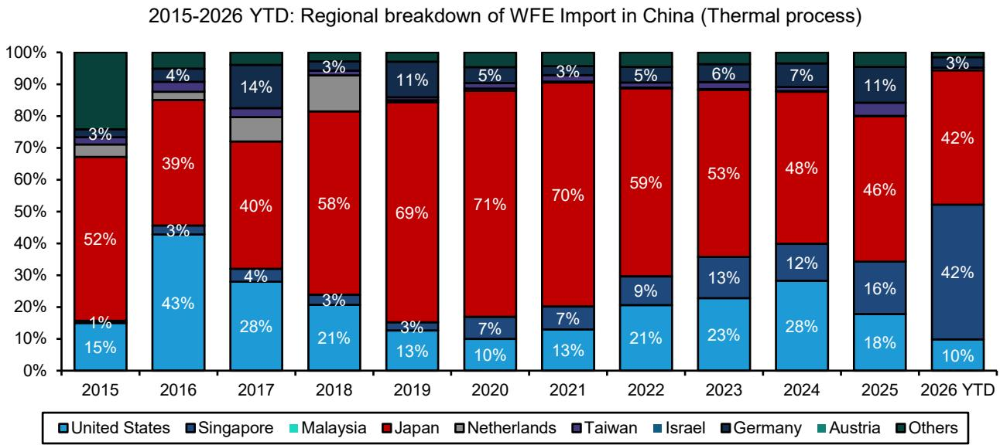

# Japan’s Semiconductor Equipment Makers Are Poised to Reclaim Lost Ground in China—Here Is Why the Market Is Misreading the Data

The dominant narrative in semiconductor capital equipment investing today is that Japanese front-end toolmakers are losing China. The data appear to support this view: Japan’s share of wafer fabrication equipment imports into China dropped from 26 percent in 2024 to 23 percent in 2025, continuing a decline from a 2021 peak of 30 percent. For investors who have watched Chinese domestic champions like Naura and AMEC gain traction, this looks like a structural erosion of competitive position. It is not. The share loss is largely a mirage created by currency distortion and customer timing effects, and the conditions are now aligning for a reversal that most of the market has not yet priced in.

The implications extend beyond Japan. China now accounts for roughly 42 percent of global WFE spending. If Japanese equipment makers stabilize or regain share in this market, the revenue upside for Tokyo Electron, Kokusai, and Screen is material—and the recent underperformance of semiconductor equipment stocks relative to commodity semiconductor names creates a compelling entry point. The key is to understand why the headline numbers are misleading, what is actually changing on the ground, and which companies are best positioned to benefit.

## The Headline Share Decline Is Overstated: Currency and Customer Timing Explain Most of the Drop

The most obvious but most overlooked factor is the yen. Over the past five years, the Japanese yen has depreciated roughly 31.5 percent against the U.S. dollar. Japanese WFE vendors predominantly price their equipment in yen. When the yen weakens, the dollar-denominated value of their shipments declines mechanically, even if the volume of tools shipped remains constant. This is not a loss of competitive position; it is a translation effect.

Adjusting for currency, the picture changes dramatically. On an FX-adjusted basis, Japan’s share of China’s WFE imports was approximately 31 percent in 2024 and 26 percent in 2025, compared with 27 percent in 2023 and 28 percent in 2021. The 2025 adjusted share is in line with the 2021–2023 average of 28.1 percent. In other words, once you strip out the currency distortion, there is no secular decline. The 2025 dip is a normalization after an unusually strong 2024, not a trend.

The second factor is investment timing by specific Chinese customers. CXMT, one of the largest Chinese DRAM manufacturers and a historically heavy user of Japanese equipment, significantly reduced its capital expenditure in 2025 due to fab expansion phasing and funding constraints. CXMT also attempted to localize portions of its equipment base, further reducing orders from Japanese vendors. This single customer effect is large enough to explain a meaningful portion of the aggregate share loss for Tokyo Electron, Screen, and Kokusai. Averaging the 2024 and 2025 data smooths out this lumpiness and confirms that the underlying position is stable.

The strategic insight is this: investors who extrapolate the 2025 share decline into a permanent loss of competitiveness are confusing a cyclical and currency-driven adjustment with a structural shift. The data do not support the structural loss thesis.

## The Yen Depreciation Has Created a Pricing Opportunity That Japanese Vendors Are Beginning to Exploit

If the yen’s weakness was a headwind to nominal market share, it is now becoming a tailwind to profitability and competitive positioning. Japanese equipment is significantly cheaper in dollar terms than it was five years ago. This gives Japanese vendors room to raise prices without losing competitiveness against U.S. or European peers.

Tokyo Electron has already begun to signal a more aggressive pricing stance, particularly in China. Management has noted that certain tools remain difficult for Chinese domestic suppliers to replicate, giving TEL pricing power in those segments. The company is introducing surcharges for cost increases and expedited delivery. This is not a defensive move; it is an offensive one, enabled by the structural currency advantage.

The implication for investors is that Japanese equipment margins in China may expand even if revenue growth is modest. The price increases are not yet fully reflected in consensus estimates, and they represent a potential upside surprise for companies like Tokyo Electron and Kokusai that have the strongest competitive moats in their respective process steps.

## Customer Mix Is Normalizing, and Order Books Are Rebuilding Across All Three Major Japanese Vendors

The 2025 share loss was concentrated in a handful of customers and process steps. As those customers resume investment and as new projects come online, the order trajectory is shifting.

For Tokyo Electron, the 2025 weakness was partly a function of customer mix—CXMT’s reduced spending hit TEL disproportionately because of its high share in that account. As CXMT’s investment cycle resumes, TEL’s China revenue should recover. Additionally, TEL’s exposure to process steps where local competition remains weak—certain etch and deposition segments—provides a buffer against localization risk.

For Screen, the story is more specific but equally constructive. Screen expects orders from CXMT to return after a two-year hiatus, along with a sizable order from JHICC. YMTC is ordering 1.5 times what it ordered last year. Foundry customers continue to rely heavily on Screen for cleaning equipment, a segment where Chinese domestic suppliers have made inroads but where Screen retains technological advantages. The cleaning segment is often viewed as a commoditized market, but the reality is that leading-edge logic and memory fabs still require high-performance cleaning tools that local suppliers have not fully replicated.

For Kokusai, the China memory capacity expansion cycle is a direct demand driver. Kokusai’s core thermal processing equipment is not yet fully caught up by local competition, and the company’s capacity constraints have been a limiting factor on growth. As those constraints ease and as Chinese memory customers ramp, Kokusai’s China revenue should resume growth.

The common thread is that the 2025 weakness was a temporary trough, not a new equilibrium. The order books are rebuilding, and the second half of 2026 and 2027 should show meaningful improvement.

## What the Report Does Not Fully Answer: The Risk of Accelerated Localization and the Sustainability of Japanese Pricing Power

It would be a mistake to read this analysis as an unqualified bullish call on Japanese equipment in China. The report leaves several important questions open, and investors should weigh them carefully.

First, the pace of Chinese domestic substitution is not static. Companies like Naura and AMEC are gaining credibility in etching, deposition, and cleaning. The report shows that Chinese domestic vendors are taking share not just from Japan but from all foreign suppliers. If the rate of localization accelerates—driven by policy, national security considerations, or improved technology—the addressable market for Japanese vendors could shrink even if their share of the import market stabilizes. The report does not provide a framework for modeling this risk, and it is inherently difficult to quantify.

Second, Japanese pricing power depends on the assumption that the yen remains weak and that Chinese customers have no viable alternatives for certain tools. Both assumptions are reasonable today, but they are not permanent. If the yen strengthens or if Chinese domestic suppliers close the gap in critical process steps, the pricing advantage could erode quickly. The report notes that Kokusai’s core areas are not yet fully caught up, but it does not specify the timeline for when that could change.

Third, the report does not address the geopolitical dimension in detail. U.S. export controls on advanced semiconductor equipment to China have created a bifurcated market: leading-edge tools are restricted, while mature-node tools are not. Japanese vendors operate in this gray zone, and any tightening of restrictions—whether by the U.S., Japan, or the Netherlands—could disrupt the recovery thesis. The report implicitly assumes the current regulatory environment persists, which is a meaningful assumption.

These are not reasons to dismiss the bullish case, but they are reasons to monitor the situation closely and to size positions accordingly. The recovery is plausible, but it is not guaranteed.

## A Decision Framework for Investors: How to Position for the Japan China WFE Recovery

For investors considering exposure to Japanese semiconductor equipment in China, the decision framework should center on three variables: customer concentration, process step defensibility, and pricing leverage.

Customer concentration is the first filter. Tokyo Electron and Kokusai have broader customer bases in China than Screen, which is more dependent on a handful of accounts. Screen’s recovery hinges on CXMT and JHICC executing their investment plans. If those plans are delayed, Screen’s China revenue could disappoint. TEL and Kokusai have more diversified exposure and are therefore less binary.

Process step defensibility is the second filter. Tools that are difficult to replace—because of technological complexity, integration requirements, or lack of local alternatives—command higher pricing power and are less vulnerable to localization. TEL’s etch and deposition tools in certain segments fall into this category. Kokusai’s thermal processing equipment also benefits from limited local competition. Screen’s cleaning tools face more credible local alternatives, which is why the report rates Screen as Market-Perform rather than Outperform.

Pricing leverage is the third filter. Companies that can raise prices without losing volume are the most attractive in this environment. TEL has been the most explicit about price increases, and its market position supports that strategy. Kokusai has similar potential but is less vocal. Screen is more constrained by competitive pressure in cleaning.

Applying this framework, the pecking order is clear: Tokyo Electron and Kokusai are the preferred names, with Screen as a more situational play dependent on specific customer outcomes. The recent underperformance of semiconductor equipment stocks relative to commodity semiconductor names—memory, analog, substrate, wafer—has created a valuation entry point that does not reflect the potential for China share recovery.

## The Market Is Underestimating the Inflection: Join the Community to Read the Full Report and Review the Original Charts

The conventional wisdom on Japanese semiconductor equipment in China is wrong. The share loss is not structural; it is a currency and timing artifact. The yen has created pricing power. Customer orders are rebuilding. And the companies best positioned to benefit are trading at valuations that do not reflect this inflection.

But the full picture requires granular data—customer-level order estimates, FX-adjusted share calculations, and process-step-specific competitive analysis. The original report contains charts and exhibits that illustrate these dynamics in detail. For investors who want to test the thesis against the data and understand the specific assumptions behind the ratings and price targets, the full report is essential.

Join the community to read the full report and review the original charts.

*This article is for learning and discussion only and does not constitute investment advice.*

Personal reading notes and learning share only. Not investment advice.

