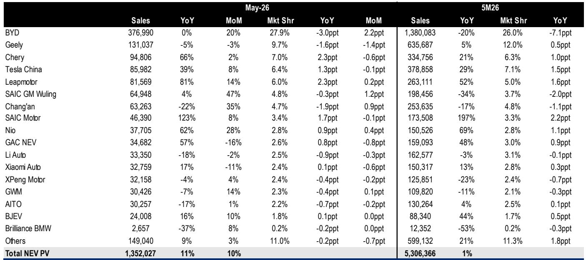
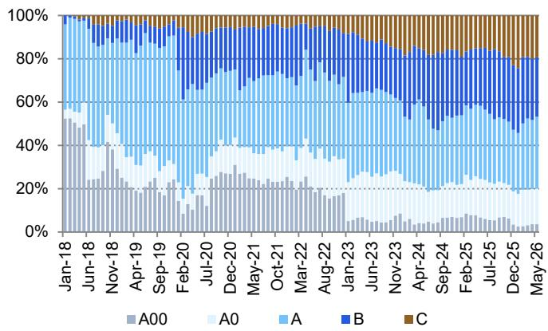
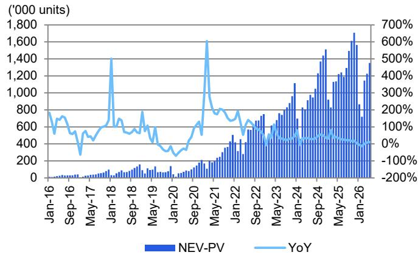

# China's NEV Market Has Entered a Zero-Sum Game: Scale Alone No Longer Guarantees Survival

The narrative that China's new energy vehicle market is a growth story is no longer accurate. In May 2026, total NEV passenger vehicle wholesale reached 1.35 million units, up 11% year-on-year and 10% month-on-month. The headline numbers still look healthy. But beneath the surface, a structural shift is underway that demands a fundamental reassessment of competitive strategy. The penetration rate hit 61.1%, up 8.4 percentage points year-on-year. Yet the top five players' combined market share stood at just 57.0%, down 2.0 percentage points from a year ago. This is not a market being consolidated by a few winners. It is a market fragmenting under the weight of too many competitors, each fighting for a share of a pie that is no longer expanding fast enough to accommodate them all.

The critical insight from the May data is not the absolute volume growth, but the divergence in momentum among the leading players. BYD, the undisputed market leader, posted flat year-on-year wholesale volume at 377,000 units. Its market share fell 3.0 percentage points year-on-year to 27.9%. For a company that has defined the narrative of Chinese NEV dominance, a flat May is a warning signal. Meanwhile, Leapmotor surged 81% year-on-year to 81,600 units, capturing 6.0% market share. NIO grew 62% year-on-year. Chery expanded 66%. These are not fringe players nibbling at the edges. They are credible challengers taking meaningful share from the incumbent.

The market is no longer about who can grow the fastest. It is about who can defend their position as the growth rate decelerates. The year-to-date figures confirm this: total NEV wholesale for the first five months of 2026 was 5.31 million units, up just 1% year-on-year. The era of 50% annual growth is over. What remains is a battle for market share in a low-growth environment. This changes the calculus for every OEM in China. Scale advantages are eroding. Brand loyalty is being tested. And the cost of defending market position is rising faster than revenue.

## The BEV-PHEV Divergence Reveals a Market That Has Not Yet Decided Its Technological Future

The May data exposes a critical strategic tension. Battery electric vehicle wholesale grew 17% year-on-year to 885,900 units, while plug-in hybrid electric vehicle wholesale grew only 1% year-on-year to 466,100 units. For the year to date, BEV is up 3% while PHEV is down 2%. This is not a straightforward preference shift. It is a market sending contradictory signals.

The PHEV segment, which many analysts believed would serve as a bridge technology to full electrification, is stalling. Year-on-year growth of just 1% in May, and negative growth year-to-date, suggests that the bridge narrative may be losing credibility with consumers. The question is whether this is a temporary pause or a structural rejection of PHEV as a transitional solution. If PHEV demand continues to soften, the implications are significant for OEMs that have invested heavily in dual-technology platforms. BYD, for instance, relies on its Song DM and Tai 7 PHEV models for substantial volume. Song DM sold 62,100 units in May, up 15% month-on-month, but its year-on-year comparison was flat. The PHEV segment is not collapsing, but it is not providing the growth engine that many OEMs had counted on.

At the same time, BEV growth is accelerating. The 17% year-on-year increase in May, and 14% month-on-month sequential growth, suggests that consumer preference is consolidating around pure electric. This creates a strategic dilemma for OEMs with significant PHEV production capacity. They face a choice: double down on PHEV and hope the segment recovers, or accelerate the transition to BEV and risk stranded assets. The data does not yet provide a clear answer, but it does indicate that the window for indecision is closing. OEMs that hedge too long may find themselves caught between two technologies, competitive in neither.

## The Mid-Market Is Fragmenting While the Premium Segment Consolidates, Creating a Dangerous Gap for Incumbents

The most consequential pattern in the May data is not visible in the aggregate market shares. It is visible in the distribution of growth across price segments. The top five players—BYD, Geely, Chery, Tesla China, and Leapmotor—collectively hold 57.0% market share. But within that group, the growth rates diverge dramatically. BYD is flat. Geely is down 5% year-on-year. Tesla China is up 39%. Leapmotor is up 81%. Chery is up 66%. This is not a cohesive top tier. It is a collection of companies pursuing fundamentally different strategies, and the market is rewarding some while punishing others.

The risk is greatest for OEMs positioned in the mid-market, where price competition is most intense and brand differentiation is hardest to maintain. BYD's flat year-on-year performance, despite its scale advantages, suggests that even the largest player cannot escape the gravitational pull of commoditization in the mid-range. The company's market share loss of 3.0 percentage points year-on-year is not a blip. It is a structural trend that will accelerate if BYD cannot find new sources of differentiation.

Meanwhile, the premium segment is showing signs of consolidation around a few winners. NIO's 62% year-on-year growth to 37,700 units, with market share up 0.9 percentage points, indicates that the premium BEV segment still has room for expansion. But even here, the picture is mixed. Li Auto, another premium-focused OEM, saw sales decline 18% year-on-year to 33,400 units. Two premium players, two very different trajectories. The difference may lie in product mix and brand positioning. NIO's Onvo sub-brand, with the L90 at 4,100 units and L80 at 5,900 units, is gaining traction. Li Auto's i6, at 20,900 units, is its strongest model, but the i8 declined 25% month-on-month.

The implication is clear: the mid-market is becoming a race to the bottom on price, while the premium segment is becoming a race to the top on brand and technology. OEMs caught in the middle, without a clear value proposition or cost advantage, face the highest risk of being squeezed out. Geely's 5% year-on-year decline, despite its multi-brand strategy, suggests that diversification alone is not a defense. The market is rewarding focus and clarity, not breadth.

## The Data Raises Unanswered Questions That Demand Further Analysis

The May NEV database is rich with data, but it also leaves critical questions unanswered. The report provides wholesale volumes and market shares, but it does not disclose pricing data, margin trends, or inventory levels. Without these, it is impossible to assess whether the growth in units is translating into sustainable profitability. Leapmotor's 81% year-on-year growth is impressive, but at what cost? The company's market share gain of 2.3 percentage points year-on-year is the largest among all players, but the report does not reveal whether this growth was achieved through price cuts, aggressive incentives, or genuine product pull.

Another open question concerns the role of exports. The report focuses on China wholesale data, which includes domestic sales and exports. But the split is not provided. For companies like BYD and Chery, which have aggressive export strategies, the domestic market dynamics may be quite different from the wholesale numbers suggest. A flat year-on-year wholesale number for BYD could mask strong domestic growth offset by export declines, or vice versa. Without this breakdown, the strategic picture remains incomplete.

The most important unanswered question is about the sustainability of market share shifts. Leapmotor's 81% growth and Chery's 66% growth are extraordinary, but they are coming from a low base. Can these companies sustain this momentum as they scale? The history of the Chinese auto industry is littered with companies that surged for a few quarters only to fade as operational complexity caught up with them. The May data provides a snapshot, not a trend line. Investors and strategists need to look beyond the headline numbers to understand whether these challengers have the production capacity, supply chain resilience, and distribution network to maintain their trajectory.

## A Decision Framework for Navigating the Zero-Sum Market

For investors and corporate strategists evaluating their position in China's NEV market, the May data suggests a three-part framework for assessment. First, assess technology positioning relative to the BEV-PHEV shift. Companies with excessive PHEV exposure face a strategic risk that may not be fully priced into current valuations. The year-to-date decline in PHEV sales, combined with accelerating BEV growth, suggests that the window for PHEV as a mainstream technology is narrowing. OEMs should stress-test their product roadmaps against a scenario where PHEV demand continues to decline.

Second, evaluate market position in terms of pricing power and brand equity, not just volume. The mid-market is becoming a commodity space where scale no longer guarantees margin protection. BYD's flat year-on-year volume despite its market-leading position is a cautionary tale. Companies should ask whether their brand can command a premium in a market where consumers have more BEV choices than ever. If the answer is no, the strategic imperative is to either build brand equity or accept that volume will come at the expense of margin.

Third, monitor the challenger cohort for signs of operational strain. Leapmotor, Chery, NIO, and others are growing fast, but growth at any cost is not a sustainable strategy. The key metrics to watch are not just wholesale volumes but inventory turnover, dealer profitability, and customer acquisition costs. The companies that can grow without destroying their unit economics will emerge as the long-term winners. Those that sacrifice profitability for market share will eventually face a reckoning.

The May data does not provide definitive answers to these questions, but it does provide the framework for asking them. The market is no longer forgiving of strategic ambiguity. The zero-sum game has begun, and the players who understand their position and act decisively will be the ones who survive.

Join the community to read the full report and review the original charts.

*This article is for learning and discussion only and does not constitute investment advice.*

Personal reading notes and learning share only. Not investment advice.

