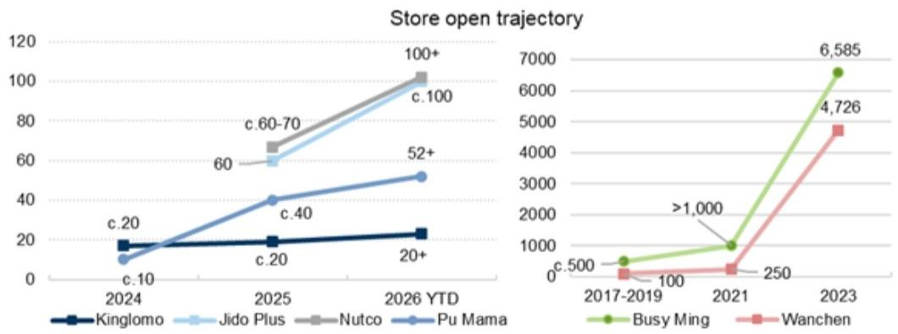
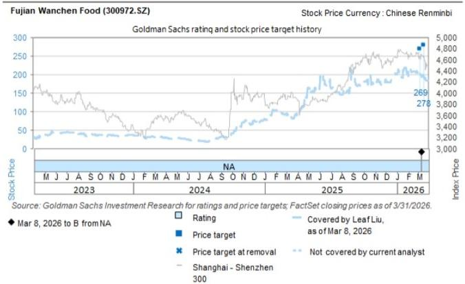
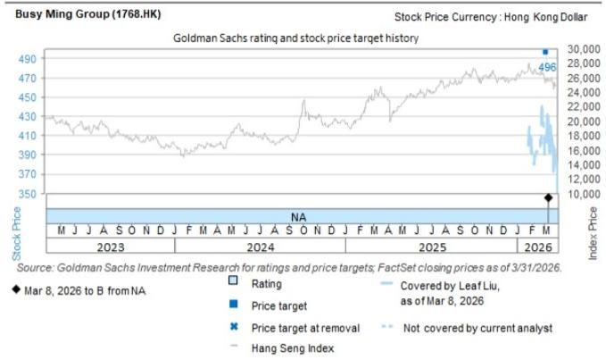

## CHINA STAPLES

# Value Retailers: Our three key takes on read-across from new booming Fresh Snacks retail chains

We have received numerous questions on the rise of fresh snacks retailers and read-across to our F&B value retailer coverage (Busy Ming/Wanchen). First and foremost, we believe the thriving of fresh snacks retailers since 2025 suggests that snack consumption in China remains strong with new growth drivers emerging. Following the fast scaling of F&B value retailers since 2022, the rapid store rollout (200+ stores/10+ brands emerging in 2025, Exhibit 3)/strong traffic (daily sales up to Rmb100k+)/robust margin (30%+ GPM/teens% EBITDA margin, Exhibit 4/Exhibit 6) of fresh snacks retailers reinforces that consumer demand for snacks and beverages remains robust driven by new formats and category expansion. In our view, the rise of fresh snacks retailers posts an opportunity for category expansion, store-format upgrade, and assessment of competition for F&B value retailers. Our key takes:

1) Category: We think fresh snacks provide a positive read-across for F&B value retailers by introducing new levers for growth on top of F&B value retailers' traditional strength in assortment/pricing/turnover by: a) increasing reasons for frequent store visits as they are inherently more conducive to repeat, high-frequency purchases than packaged snacks; b) raising the sales ceiling per store as they serve more occasions including breakfast/late-night snacking/food pairing, and household stock-up missions. Busy Ming has mentioned the trial of baked egg tarts/hot sausage is bearing fruit on increasing per store GMV since 2H25. That said, strengthening differentiation and competitive barriers on supply chain/turnover will be the key to success given the shorter shelf life.

2) Store format diversification: We believe the next source of alpha for F&B value retailer leaders may evolve from store-opening beta to store-format-upgrade/diversification alpha with large existing network, supply chain strength/consumer data insights. Leading players are already making trials on products selection of cold-chain products, as well as trial of different store format (CVS/discounter supermarket, etc.). Our UE comparison (Exhibit 6) suggests fresh-snack retailers' high margin/attractive payback period are typically built around: a) broad but tightly curated assortment of fresh-food offerings that increases purchase frequency and impulse top-up demand, while also contains spoilage; b) high GPM on higher short-shelf-life share (c.30\~50% of SKU) and predominantly private-label mix supported by partial in-house production. c)

## Leaf Liu

+852-3966-4169 | leaf.liu@gs.com GS (Asia) L.L.C.

## Christina Liu

+852-2978-6983 | christina.liu@gs.com
GS (Asia) L.L.C.

## Valerie Zhou

+852-2978-0820 | valerie.zhou@gs.com
GS (Asia) L.L.C.

strong operating leverage on larger-format model (200\~400 sqm) /high energy catchment locations (e.g. shopping mall B1 level) that enable high traffic/ticket size/sales per sqm (leading flagship stores reaching Rmb20\~50mn annualized GMV/Rmb40\~60 AOV vs. Rmb4\~6mn/c.Rmb30 for F&B value retailers, similar to the early-stage of Busy Ming/Wanchen when some flagship stores reached Rmb10mn+ annualized sales). In our view, Fresh-snacks stores may provide a good experiment for the next stage of store-format evolution in F&B value retail where leading chains could potentially evolve from packaged snacks value retailers toward broader community food retail platforms if executed well.

3) Competition: We do not see fresh-snack retailers as a near-term strong competition threat to F&B value retailers, as the model will likely become materially more complex and location/cost-sensitive when scaled. Specifically, fresh snacks retailers hold fewer SKUs (hundreds to 1k+) and are more labor-intensive, more exposed to rent and location quality given reliance on high sell-through, and are harder to replicate nationally due to logistics/cold-chain/self-production requirements, vs. F&B value retailers, in our view. Therefore, the store UE appears less favorable to penetrate into lower-tier markets because of the dependence on high traffic/turnover (now mostly located in tier 1-2 cities) and the difficulty on franchising given the greater complexity of spoilage control. For F&B value retailer leaders like Busy Ming and Wanchen, however, we believe short-shelf-life expansion should amplify the advantages of scale leaders given: 1) Unmatched scale/density of store network lowers procurement costs and dilutes the logistic costs; 2) Professional store-management experience/systems to control spoilage; 3) Membership assets lowers customer acquisition cost and enhances repeat-purchase. By contrast, smaller players trying to scale fresh formats across regions are much more likely to be dragged down by operational complexity and elevated loss rates.

We reiterate Buy on Busy Ming/Wanchen given attractive risk/reward considering that the stocks are trading at 17x/14x 2026E P/E vs. $22\% / 15\%$ NP CAGR in 2026-28E, respectively. Key catalysts include: 1) improving per-store GMV trends, supported by category expansion; 2) Further revising up store open targets in full-year 2026 and outer years; 3) Wanchen's update on HK dual listing schedule.

The authors would like to thank Lily Qi for her contribution to this report.

## Related Read:

China Consumer Staples: Value Retailers: Addressing key investor questions on recent competition; Reiterate Buy on Busy Ming/Wanchen

China Consumer Staples: Value Retailers: Busy Ming/Wanchen officially reiterated commitment to healthy competitive environment; Store open acceleration in May; Buy

China Consumer Staples: Value retailers initiation feedback: Key investor questions on UE/cost impact/category expansion

## OP comp table/store open trajectory/category margin

Exhibit 1: Tier-1 players mainly have 20-100 stores each and concentrated in tier1-2 cities

<table><tr><td colspan="6">Tier 1 players</td></tr><tr><td>Brand name</td><td>Founding year</td><td>store count</td><td>Avg. GMV per order</td><td>Sales area (sqm)</td><td>Regions</td></tr><tr><td>Kinglomo</td><td>2015</td><td>20+</td><td>Rmb40-60</td><td>100-400</td><td>Changsha/Wuhan/Shenzhen/Nanjing/Chanqde etc..</td></tr><tr><td>Jido Plus</td><td>2025</td><td>c.100</td><td>Rmb30-50</td><td>150-200</td><td>20 cities in China</td></tr><tr><td>Nutco</td><td>2015</td><td>100+</td><td>Rmb40-60</td><td>100-150</td><td>North China/Beijing/Tianjin/Nanjing</td></tr><tr><td>Pu Mama</td><td>2024</td><td>52+</td><td>Rmb40-60</td><td>250-300</td><td>Zhejiang/Fujian/Shaanxi/Guangdong</td></tr></table>

As of June 2026  
Source: Food Boards

Exhibit 2: Tier-2 players have lower store count and are also concentrated in tier-12 cities, mainly launched in 2025/2026

<table><tr><td colspan="4">Tier 2 players</td></tr><tr><td>Brand name</td><td>Founding year</td><td>store count</td><td>Regions</td></tr><tr><td>WoW Fresh (有点推荐)</td><td>2025</td><td>1 self-operated store</td><td>Wuhan</td></tr><tr><td>Juewei (newproject)</td><td>2025</td><td>6 self-operated trial stores</td><td>Changsha etc.</td></tr><tr><td>Xueji Chaohuo (renovated fresh stores)</td><td>2024</td><td>200 existing stores to be renovated</td><td>Tier 1-2 cities and counties</td></tr><tr><td>ChaYan YueSe (new project)</td><td>launch in 2026</td><td>1 self-operated trial store</td><td>Changsha</td></tr><tr><td>You You - Wanweizu</td><td>launch in 2026</td><td>1 self-operated trial store</td><td>Chongqing</td></tr><tr><td>Lemon Right(柠檬向右)</td><td>launch in 2026</td><td>1 self-operated trial store</td><td>Shanghai</td></tr><tr><td>Qaqaco (恰小可)</td><td>2025</td><td>c.13</td><td>Chengdu/Chongqing/Shenzhen</td></tr><tr><td>Joy Season (久食山)</td><td>2025</td><td>c.22</td><td>Shenzhen/Guangdong/Dongquan</td></tr><tr><td>Freshouse (鲜博士)</td><td>2025</td><td>c.5</td><td>Shenyang/Fuxin/Liaoning province</td></tr><tr><td>Superman snacks (超人零拾)</td><td>2025</td><td>c.6</td><td>Chongqing</td></tr><tr><td>Tata Ling (零团团)</td><td>2025</td><td>c.6</td><td>Guangzhou/Shenzhen/Foshan</td></tr><tr><td>W small sea (五小海)</td><td>2025</td><td>c.8</td><td>Xiamen/Quanzhou/Fuzhou</td></tr><tr><td>Chill HFF (轻禾丰)</td><td>2025</td><td>c.3</td><td>Ganzhou/Jiangxi province</td></tr><tr><td>Top Sold (大口兽)</td><td>2025</td><td>c.12</td><td>Changsha/Shenzhen</td></tr><tr><td>Qing Sense (清山森)</td><td>2026</td><td>1 self-operated store</td><td>Zhengzhou</td></tr></table>

As of June 2026  
Source: Food Boards

Exhibit 3: Store open trajectory of leading tier-1 players vs Busy Ming/Wanchen at early stage  

line chart

Store open trajectory
| Year | Kinglomo | Jido Plus | Nutco | Pu Mama | Busy Ming | Wanchen |
|---|---|---|---|---|---|---|
| 2024 | c.20 | c.10 | c.60-70 | c.40 | c.500 | c.500 |
| 2025 | c.20 | c.60-70 | c.60-70 | c.40 | >1,000 | 100 |
| 2026 YTD | 20+ | c.100 | 100+ | 52+ | 250 | 4,726 |
| 2023 | - | - | - | - | 6,585 | - |
The chart displays a line graph with two separate subplots: the left shows a horizontal bar chart (c.10 to c.20) and the right shows a line chart (c.500 to c.585) with a vertical line at c.585.

Wanchen Store count in 2017-2021 was mainly from Haoxianglai  
Source: Food Boards, Company data

Exhibit 4: Key SKUs are nuts/braised meats/crispy snacks/freshly-made beverages with short duration, and also at relatively affordable prices

<table><tr><td colspan="5">Key SKUs margin profile</td></tr><tr><td>Category name</td><td>ASP range (Rmb/unit)</td><td>ASP range (Rmb/g)</td><td>GPM</td><td>Duration (days)</td></tr><tr><td>Nuts/dried fruits</td><td>10-30</td><td>0.05-0.15</td><td>25%-35%</td><td>3-5</td></tr><tr><td>Braised meats</td><td>10-60</td><td>0.1-0.2</td><td>35%-50%</td><td>4-5</td></tr><tr><td>Crispy snacks</td><td>10-15</td><td>0.03-0.06</td><td>30%-40%</td><td>60-90</td></tr><tr><td>Pastries</td><td>10-40</td><td>0.06-0.1</td><td>20%-35%</td><td>1-3</td></tr><tr><td>Freshly-made Milk tea</td><td>9-12</td><td>/</td><td>30%-40%</td><td>1</td></tr><tr><td>Juice</td><td>10-15</td><td>/</td><td>30%-35%</td><td>1</td></tr></table>

Source: New Retail, Zhaibo

Exhibit 5: Leading fresh snacks players comp table

<table><tr><td colspan="3"></td><td></td><td></td><td></td><td></td><td></td></tr><tr><td colspan="2">2025 if not stated</td><td>Kinglomo (金粉门)</td><td>Jido Plus (几多全)</td><td>Nutco (一梁)</td><td>Pu mama (鸿阳妈)</td><td>Joy Season (久食山)</td><td>WoW Fresh (有点推荐)</td></tr><tr><td rowspan="9">Operation</td><td>Store format</td><td>Fresh food &amp; snacks</td><td>Fresh food &amp; snacks</td><td>Fresh food &amp; snacks</td><td>Fresh food &amp; snacks</td><td>Fresh food &amp; snacks</td><td>Fresh food &amp; snacks</td></tr><tr><td>Business model</td><td>Self-operated</td><td>Self-operated + Franchise</td><td>Self-operated</td><td>Self-operated + Supermarket shop-in-shop</td><td>Self-operated</td><td>Self-operated</td></tr><tr><td>Founding year</td><td>2015</td><td>2025</td><td>2015</td><td>2024</td><td>2025</td><td>2025</td></tr><tr><td>Headquarter</td><td>Changsha</td><td>Changsha</td><td>Shenyang</td><td>Ningbo</td><td>Shenzhen</td><td></td></tr><tr><td>Regions</td><td>South China/East China/Hubei province</td><td>20 cities in China</td><td>Beijing/Jiangsu/North China</td><td>Jiangsu/Zhejiang/Fujian etc.</td><td>Guangzhou/Shenzhen</td><td>Wuhan</td></tr><tr><td>Key strategy</td><td>First mover in the industryShort-shelf-life products and independent product innovation</td><td>Short-shelf-life products and open-kitchen in store</td><td>Freshly-made baked goods/milk tea/slice to increase retention rate; nuts gift box for better margin mix, high turnover due to high order concentration</td><td>Freshly-made and healthy foods mainly attracting young women &amp; mothers (18-35 years-old)</td><td>Diversified and value-for-money product portfolio (Rmb9.9 products) targeting young group Location selection: at high-traffic ports of entry/super markets</td><td>Open in super markets/health and clean concepts</td></tr><tr><td># of stores</td><td>20+</td><td>60+ self-operated stores, c.100 stores in total</td><td>100+</td><td>52+</td><td>c.22</td><td>1</td></tr><tr><td>Store (count) target</td><td>Plan to expand to South/Central China tier 1-3 cities</td><td>2026: 600-1000 in tier 1-3 cities</td><td>Plan to expand to tier 1-2 cities; mid-term target 30-50 stores in Beijing</td><td>2026: 200 (50 self-operated, 150 supermarket shop-in-shop) in tier 1-3 cities</td><td>Plan to expand to tier 1 cities</td><td>800 stores nationwide</td></tr><tr><td>Average GMV per order</td><td>Rmb40-60</td><td>Rmb30-50</td><td>Rmb40-60</td><td>Rmb40-60</td><td>Rm30-40</td><td></td></tr><tr><td rowspan="4">Products</td><td># of SKUs</td><td>c.130-160</td><td>600-1000</td><td>3-10 SKUs for each category</td><td>c.340</td><td></td><td>100+</td></tr><tr><td>Product coverage</td><td>Spicy &amp; braised snacks/Baked goods/Beverage/Ice cream etc.</td><td>Nuts/Braised snacks/Baked goods/Beverage etc.</td><td>Nuts/Braised snacks/Baked goods/Beverage/Ice cream etc.</td><td>Freshly made: Baked goods/Nuts/Milk Tea/Braised snacksCustomized: Fresh-locked snacks/Frozen food/Seasonal products</td><td>Nuts/Braised snacks/Baked goods/Crispy snacks/Beverage etc.</td><td>Nuts/Braised snacks/Baked goods/Beverage/traditional pastries/dried fruits</td></tr><tr><td>Pricing range</td><td>Rmb5-50</td><td>Rmb10-100</td><td>Rmb9 9-220</td><td></td><td>Rmb9 9 - 40</td><td></td></tr><tr><td>Private label %</td><td>99%</td><td></td><td></td><td>100%</td><td></td><td>100%</td></tr><tr><td rowspan="5">Store</td><td>Area/store (sqm)</td><td>100-400</td><td>150-200</td><td>100-150</td><td>250-300</td><td>70-80</td><td>300</td></tr><tr><td>Monthly GMV per store (Rmb mn)</td><td>Rmb4mn for benchmark stores</td><td></td><td>Rmb million level in general</td><td>Core 8 products contributing to 15% of total store GMV</td><td></td><td>c.Rmb4-4.5mn</td></tr><tr><td>GPM</td><td>35%-40%</td><td></td><td></td><td>30-35%</td><td></td><td></td></tr><tr><td>Logistics</td><td>New factories in Changzhou and Shenzhen were put into production in May</td><td>New factories put into production in Nanjing, 20 production sites nationwide in plan</td><td>Self-built supply chain: pollution-free planting base + self-owned processing factories + temperature-zoned warehouses spanning nearly 5k sqm</td><td>Self-built braised snacks/bakery/nuts factories</td><td></td><td>100k sqm central kitchen for beverages and braised food/600sqm warehouse with stores, 10+ bakery SKUs share the same production line with Sam&#x27;s Club</td></tr><tr><td>Sourcing strategy</td><td>Direct-sourcing + central kitchen + full-chain supply chain</td><td></td><td></td><td></td><td></td><td></td></tr></table>

Source: Food Boards and other sources, Data compiled by GS Gloabl Invetsment Research

## Store UE: Fresh Snack Retailers - still in early stage of growth curve with small store numbers

Exhibit 6: Illustrative Store UE comparison (2025, annualized)

<table><tr><td>Snack discounter store UE (annualized)</td><td colspan="2">Fresh Snacks Retailers</td><td colspan="2">F&amp;B Value Retailers</td></tr><tr><td>K Rmb</td><td>Kinglomo Flagship (avg.)</td><td>Kinglomo Flagship (top)</td><td>Busy Ming</td><td>Wanchen</td></tr><tr><td>Initial Investment</td><td>2,500</td><td>3,500</td><td>550</td><td>463</td></tr><tr><td>Deposit</td><td></td><td></td><td>30</td><td>20</td></tr><tr><td>Furnishment</td><td>500</td><td>600</td><td>130</td><td>125</td></tr><tr><td>Equipment</td><td>1,000</td><td>1,500</td><td>160</td><td>138</td></tr><tr><td>First stock</td><td>1,000</td><td>1,400</td><td>230</td><td>180</td></tr><tr><td>Training and others</td><td></td><td></td><td></td><td></td></tr><tr><td>CAPEX (excl. first stock and deposit)</td><td>1,500</td><td>2,100</td><td>290</td><td>263</td></tr><tr><td>Subsidies</td><td></td><td></td><td>36</td><td>70</td></tr><tr><td>CAPEX per sqm</td><td>5</td><td>5</td><td>2</td><td>2</td></tr><tr><td>CAPEX with first stock</td><td>2,500</td><td>3,500</td><td>520</td><td>443</td></tr><tr><td>GMV</td><td>24,000</td><td>48,000</td><td>5,397</td><td>4,691</td></tr><tr><td>Assumed avg. store size (sqm)</td><td>300</td><td>400</td><td>150</td><td>140</td></tr><tr><td>Sales per sqm</td><td>80</td><td>120</td><td>36</td><td>34</td></tr><tr><td>Daily sales</td><td>65.8</td><td>131.5</td><td>14.8</td><td>12.9</td></tr><tr><td>Ticket size (Rmb)</td><td>50</td><td>50</td><td>31</td><td>31</td></tr><tr><td>Daily order #</td><td>1,315</td><td>2,630</td><td>479</td><td>419</td></tr><tr><td>Sales</td><td>21,239</td><td>42,478</td><td>4,776</td><td>4,152</td></tr><tr><td>VAT rate</td><td>13%</td><td>13%</td><td>13%</td><td>13%</td></tr><tr><td>Cost of good sold</td><td>14,867</td><td>29,735</td><td>3,821</td><td>3,321</td></tr><tr><td>% of sales</td><td>70%</td><td>70%</td><td>80%</td><td>80%</td></tr><tr><td>Gross profits</td><td>6,372</td><td>12,743</td><td>955</td><td>830</td></tr><tr><td>Gross Margin ex. Spoilage</td><td>30%</td><td>30%</td><td>20%</td><td>20%</td></tr><tr><td>Gross Margin</td><td>35%</td><td>35%</td><td></td><td></td></tr><tr><td>Staff costs</td><td>1,800</td><td>2,400</td><td>240</td><td>216</td></tr><tr><td>% of sales</td><td>8.5%</td><td>5.7%</td><td>5.0%</td><td>5.2%</td></tr><tr><td># of staff</td><td>30</td><td>40</td><td>4</td><td>4</td></tr><tr><td>Monthly salary</td><td>5.0</td><td>5.0</td><td>5.0</td><td>4.5</td></tr><tr><td>Rental costs</td><td>960</td><td>2,400</td><td>192</td><td>168</td></tr><tr><td>% of sales</td><td>4.5%</td><td>5.7%</td><td>4.0%</td><td>4.0%</td></tr><tr><td>Monthly rental fee</td><td>80.0</td><td>200.0</td><td>16.0</td><td>14.0</td></tr><tr><td>Utility expenses</td><td>288.0</td><td>384.0</td><td>72.0</td><td>67.2</td></tr><tr><td>% of sales</td><td>1.4%</td><td>0.9%</td><td>1.5%</td><td>1.6%</td></tr><tr><td>D&amp;A expense</td><td>300</td><td>420</td><td>58</td><td>53</td></tr><tr><td>% of sales</td><td>1.3%</td><td>0.9%</td><td>1.1%</td><td>1.1%</td></tr><tr><td>Years of depreciation</td><td>5</td><td>5</td><td>5</td><td>5</td></tr><tr><td>Total capex</td><td>1,500</td><td>2,100</td><td>290</td><td>263</td></tr><tr><td>Other expenses (Logistics, markting, etc.)</td><td>637</td><td>1,062</td><td>40</td><td>38</td></tr><tr><td>% of sales</td><td>3.0%</td><td>2.5%</td><td>0.7%</td><td>0.8%</td></tr><tr><td>Store level operating profit</td><td>2,387</td><td>6,077</td><td>353</td><td>289</td></tr><tr><td>Store level OPM</td><td>11.2%</td><td>14.3%</td><td>7.4%</td><td>7.0%</td></tr><tr><td>EBITDA</td><td>2,687</td><td>6,497</td><td>411</td><td>341</td></tr><tr><td>EBITDA margin</td><td>12.6%</td><td>15.3%</td><td>8.6%</td><td>8.2%</td></tr><tr><td>Payback period (# of months) on EBITDA</td><td>6.7</td><td>3.9</td><td>8.5</td><td>9.3</td></tr><tr><td>Payback period considering first stock on EBITDA</td><td>11.2</td><td>6.5</td><td>15.2</td><td>15.6</td></tr><tr><td>Breakeven daily sales</td><td>36.4</td><td>60.9</td><td>8.2</td><td>7.4</td></tr><tr><td>Breakeven daily volume</td><td>728</td><td>1,218</td><td>267</td><td>242</td></tr></table>

Wanchen ticket size/daily order volume per company data, other numbers are from public news or GSe based on company data and public news  
Source: Sina News, FoodTalk, 36Kr, Cailian Press, Company data, Data compiled by GS Global Investment Research

## Monthly Tracker of Value Retailers

Exhibit 7: Value retailer monthly store opening table

<table><tr><td>Store number monthly tracker</td><td>Jan-25</td><td>Feb-25</td><td>Mar-25</td><td>Apr-25</td><td>May-25</td><td>Jun-25</td><td>Jul-25</td><td>Aug-25</td><td>Sep-25</td><td>Oct-25</td><td>Nov-25</td><td>Dec-25</td><td>Jan-26</td><td>Feb-26</td><td>Mar-26</td><td>Apr-26</td><td>May-26</td></tr><tr><td>Busy Ming</td><td>14,737</td><td>14,956</td><td>15,152</td><td>15,474</td><td>15,989</td><td>16,783</td><td>17,584</td><td>18,551</td><td>19,517</td><td>20,513</td><td>21,041</td><td>21,948</td><td>22,801</td><td>23,291</td><td>23,771</td><td>24,271</td><td>25,178</td></tr><tr><td>Net add</td><td>343</td><td>219</td><td>196</td><td>322</td><td>515</td><td>794</td><td>801</td><td>967</td><td>967</td><td>996</td><td>528</td><td>907</td><td>853</td><td>490</td><td>480</td><td>500</td><td>907</td></tr><tr><td>store open %</td><td>2.4%</td><td>1.5%</td><td>1.3%</td><td>2.1%</td><td>3.3%</td><td>5.0%</td><td>4.8%</td><td>5.5%</td><td>5.2%</td><td>5.1%</td><td>2.6%</td><td>4.3%</td><td>3.9%</td><td>2.1%</td><td>2.1%</td><td>2.1%</td><td>3.7%</td></tr><tr><td>Haoxianglai only</td><td>12,977</td><td>13,325</td><td>13,632</td><td>14,119</td><td>14,356</td><td>15,365</td><td>15,565</td><td>15,612</td><td>16,320</td><td>16,619</td><td>16,626</td><td>17,248</td><td>17,834</td><td>18,434</td><td>18,909</td><td>19,509</td><td>20,560</td></tr><tr><td>Net add</td><td>1,229</td><td>348</td><td>307</td><td>487</td><td>237</td><td>1,009</td><td>200</td><td>47</td><td>708</td><td>299</td><td>7</td><td>622</td><td>586</td><td>600</td><td>475</td><td>600</td><td>1,051</td></tr><tr><td>store open %</td><td>10.5%</td><td>2.7%</td><td>2.3%</td><td>3.6%</td><td>1.7%</td><td>7.0%</td><td>1.3%</td><td>0.3%</td><td>4.5%</td><td>1.8%</td><td>0.0%</td><td>3.7%</td><td>3.4%</td><td>3.4%</td><td>2.6%</td><td>3.2%</td><td>5.4%</td></tr></table>

The data may have time/lagging difference vs the act. number

Source: Douyin, Food Boards, GeoQ, Company data, data compiled by GS Global Investment Research

Exhibit 8: Avg GMV per store summary (GSe)

<table><tr><td>Store performance: avg GMV per store yoy</td><td>1Q25</td><td>2Q25</td><td>3Q25</td><td>4Q25</td><td>Jan-Feb 2026</td><td>Apr-26</td><td>May-26</td></tr><tr><td>Busy Ming</td><td colspan="2">-MSD% yoy</td><td>Down SD% yoy</td><td>Flattish yoy</td><td>HSD% growth yoy</td><td></td><td></td></tr><tr><td>Wanchen</td><td>Down mid teens%</td><td>Down mid teens%</td><td>Down SD%</td><td>MSD% decline yoy</td><td>9% yoy</td><td>Up SD%</td><td>positive average daily GMV</td></tr></table>

Source: Company data, GS Global Investment Research

## Price Target Risks and Methodology - Busy Ming Group

Valuation: Our 12-month target price for Busy Ming is HK\$550, based on a 23x target P/E applied to our 2027E EPS and discounted back to end-2026E, using a COE of 9.4%, referencing the average trading 2027 P/E of global value-focused retail peers including Dollar General and Dollar Tree in the US, and Ryohin Keikaku and Pan Pacific International Holdings (operates Donki) in Japan, as they are scaled, price-led operators with broad, defensible customer reach similar to Busy Ming.

Key risks: 1) Intensifying competition and price investment; 2) Network density and cannibalization; 3) Franchise model risk and scaling complexity; 4) Supply chain, food safety, and logistics.

## Price Target Risks and Methodology - Fujian Wanchen Good

Valuation: Our 12m TP is Rmb319, based on a target 2027E P/E at 21.5x discounted back to end-2026E at an $8.2\%$ COE. The target P/E is at a HSD% valuation discount to Busy Ming, as we reference the average gap of DLTR's NTM P/E vs. DG's in the past two years, factoring in the relatively slower network scaling momentum and less favorable UE (lower per-store GMV but profits driven by high mix of smaller brands/white labels).

Key risks: 1) intensifying market competition and price sustainability; 2) franchise model risk and scaling complexity; 3) M&A risks; 4) supply chain, food safety and logistics.

## Disclosure Appendix

## Reg AC

We, Leaf Liu, Christina Liu and Valerie Zhou, hereby certify that all of the views expressed in this report accurately reflect our personal views about the subject company or companies and its or their securities. We also certify that no part of our compensation was, is or will be, directly or indirectly, related to the specific recommendations or views expressed in this report.

Unless otherwise stated, the individuals listed on the cover page of this report are analysts in GS' Global Investment Research division.

Contributing Authors: Leaf Liu GS (Asia) L.L.C., Christina Liu GS (Asia) L.L.C., Valerie Zhou GS (Asia) L.L.C..

Unless otherwise stated, the individuals listed in the Contributing Authors disclosure of this report are analysts in GS' Global Investment Research division.

## GS Factor Profile

The GS Factor Profile provides investment context for a stock by comparing key attributes to the market (i.e. our universe of rated stocks) and its sector peers. The four key attributes depicted are: Growth, Financial Returns, Multiple (e.g. valuation) and Integrated (a composite of Growth, Financial Returns and Multiple). Growth, Financial Returns and Multiple are calculated by using normalized ranks for specific metrics for each stock. The normalized ranks for the metrics are then averaged and converted into percentiles for the relevant attribute. The precise calculation of each metric may vary depending on the fiscal year, industry and region, but the standard approach is as follows:

Growth is based on a stock's forward-looking sales growth, EBITDA growth and EPS growth (for financial stocks, only EPS and sales growth), with a higher percentile indicating a higher growth company. Financial Returns is based on a stock's forward-looking ROE, ROCE and CROCI (for financial stocks, only ROE), with a higher percentile indicating a company with higher financial returns. Multiple is based on a stock's forward-looking P/E, P/B, price/dividend (P/D), EV/EBITDA, EV/FCF and EV/Debt Adjusted Cash Flow (DACF) (for financial stocks, only P/E, P/B and P/D), with a higher percentile indicating a stock trading at a higher multiple. The Integrated percentile is calculated as the average of the Growth percentile, Financial Returns percentile and (100% - Multiple percentile).

Financial Returns and Multiple use the GS analyst forecasts at the fiscal year-end at least three quarters in the future. Growth uses inputs for the fiscal year at least seven quarters in the future compared with the year at least three quarters in the future (on a per-share basis for all metrics).

For a more detailed description of how we calculate the GS Factor Profile, please contact your GS representative.

## M&A Rank

Across our global coverage, we examine stocks using an M&A framework, considering both qualitative factors and quantitative factors (which may vary across sectors and regions) to incorporate the potential that certain companies could be acquired. We then assign a M&A rank as a means of scoring companies under our rated coverage from 1 to 3, with 1 representing high (30%-50%) probability of the company becoming an acquisition target, 2 representing medium (15%-30%) probability and 3 representing low (0%-15%) probability. For companies ranked 1 or 2, in line with our standard departmental guidelines we incorporate an M&A component into our target price. M&A rank of 3 is considered immaterial and therefore does not factor into our price target, and may or may not be discussed in research.

## Quantum

Quantum is GS' proprietary database providing access to detailed financial statement histories, forecasts and ratios. It can be used for in-depth analysis of a single company, or to make comparisons between companies in different sectors and markets.

## Disclosures

The rating(s) for Busy Ming Group and Fujian Wanchen Food is/are relative to the other companies in its/their coverage universe: Anhui Gujing Distillery Co., Budweiser APAC, Busy Ming Group, China Feihe Ltd., China Resources Beer, China Resources Beverage, Chongqing Brewery, Eastroc Beverage (A), Foshan Haitian Flavouring & Food (A), Foshan Haitian Flavouring & Food (H), Fujian Wanchen Food, Jiangsu King's Luck Brewery, Jiangsu Yanghe, Jiugui Liquor, Jonjee Hi-Tech, Kweichow Moutai, Luzhou Laojiao, Mengniu Dairy, Nongfu Spring, Qianhe Condiment and Food, Shanghai Bairun, Shanxi Xinghuacun Fen Wine, Sichuan Swellfun Co., Sichuan Teway Food Group, Tingyi, Tsingtao Brewery (A), Tsingtao Brewery (H), Uni-President China, Wuliangye Yibin, Yihai International Holding, Yili Industrial, ZJLD

## Company-specific regulatory disclosures

The following disclosures relate to relationships between The GS Group, Inc. (with its affiliates, “GS”) and companies covered by GS Global Investment Research and referred to in this research.

GS beneficially owned $1\%$ or more of common equity (excluding positions managed by affiliates and business units not required to be aggregated under US securities law) as of the month end preceding this report: Fujian Wanchen Food (Rmb183.00)

GS has received compensation for investment banking services in the past 12 months: Busy Ming Group (HK\$380.00)

GS expects to receive or intends to seek compensation for investment banking services in the next 3 months: Busy Ming Group (HK\$380.00)

GS had an investment banking services client relationship during the past 12 months with: Busy Ming Group (HK\$380.00)

GS has managed or co-managed a public or Rule 144A offering in the past 12 months: Busy Ming Group (HK\$380.00)

## Distribution of ratings/investment banking relationships

GS Investment Research global Equity coverage universe

<table><tr><td rowspan="2"></td><td colspan="3">Rating Distribution</td><td colspan="3">Investment Banking Relationships</td></tr><tr><td>Buy</td><td>Hold</td><td>Sell</td><td>Buy</td><td>Hold</td><td>Sell</td></tr><tr><td>Global</td><td>50%</td><td>34%</td><td>16%</td><td>65%</td><td>60%</td><td>45%</td></tr></table>

As of April 1, 2026, GS Global Investment Research had investment ratings on 3,074 equity securities. GS assigns stocks as

Buys and Sells on various regional Investment Lists; stocks not so assigned are deemed Neutral. Such assignments equate to Buy, Hold and Sell for the purposes of the above disclosure required by the FINRA Rules. See ‘Ratings, Coverage universe and related definitions’ below. The Investment Banking Relationships chart reflects the percentage of subject companies within each rating category for whom GS has provided investment banking services within the previous twelve months.

Price target and rating history chart(s)  

line chart

| Date       | Stock Price | Index Price |
|------------|-------------|-------------|
| Mar 8, 2026 | NA          | 3,000       |
|            | 278         | 3,800       |
|            | 269         | 4,800       |

The price targets shown should be considered in the context of all prior published GS, which may or may not have included price targets, as well as developments relating to the company, its industry and financial markets.

line chart

| Date       | Stock Price | Index Price |
|------------|-------------|-------------|
| Mar 8, 2026 | NA          | 350         |
| Feb 2026   | 496         | 30,000      |

The price targets shown should be considered in the context of all prior published GS, which may or may not have included price targets, as well as developments relating to the company, its industry and financial markets.

Target price history table(s)  
Busy Ming Group (1768.HK)

<table><tr><td>Date of report</td><td>Target price (HK$)</td><td>Closing price (HK$)</td></tr><tr><td>01-Apr-26</td><td>550.00</td><td>362.60</td></tr><tr><td>08-Mar-26</td><td>496.00</td><td>403.20</td></tr></table>

Fujian Wanchen Food (300972.SZ)

<table><tr><td>Date of report</td><td>Target price (Rmb)</td><td>Closing price (Rmb)</td></tr><tr><td>28-Apr-26</td><td>319.00</td><td>203.81</td></tr><tr><td>17-Mar-26</td><td>278.00</td><td>192.10</td></tr><tr><td>08-Mar-26</td><td>269.00</td><td>201.81</td></tr></table>

Price targets shown in table(s) are unadjusted for corporate actions.

## Regulatory disclosures

## Disclosures required by United States laws and regulations

See company-specific regulatory disclosures above for any of the following disclosures required as to companies referred to in this report: manager or co-manager in a pending transaction; $1\%$ or other ownership; compensation for certain services; types of client relationships; managed/co-managed public offerings in prior periods; directorships; for equity securities, market making and/or specialist role. GS trades or may trade as a principal in debt securities (or in related derivatives) of issuers discussed in this report.

The following are additional required disclosures: Ownership and material conflicts of interest: GS policy prohibits its analysts, professionals reporting to analysts and members of their households from owning securities of any company in the analyst's area of coverage. Analyst compensation: Analysts are paid in part based on the profitability of GS, which includes investment banking revenues. Analyst as officer or director: GS policy generally prohibits its analysts, persons reporting to analysts or members of their households from serving as an officer, director or advisor of any company in the analyst's area of coverage. Non-U.S. Analysts: Non-U.S. analysts may not be associated persons of GS & Co. LLC and therefore may not be subject to FINRA Rule 2241 or FINRA Rule 2242 restrictions on communications with a subject company, public appearances and trading in securities covered by the analysts.

Distribution of ratings: See the distribution of ratings disclosure above. Price chart: See the price chart, with changes of ratings and price targets in prior periods, above, or, if electronic format or if with respect to multiple companies which are the subject of this report, on the GS website at https://www.gs.com/research/hedge.html.

## Additional disclosures required under the laws and regulations of jurisdictions other than the United States

The following disclosures are those required by the jurisdiction indicated, except to the extent already made above pursuant to United States laws and regulations. Australia: GS Australia Pty Ltd and its affiliates are not authorised deposit-taking institutions (as that term is defined in the Banking Act 1959 (Cth)) in Australia and do not provide banking services, nor carry on a banking business, in Australia. This research, and any access to it, is intended only for “wholesale clients” within the meaning of the Australian Corporations Act, unless otherwise agreed by GS. In producing research reports, members of Global Investment Research of GS Australia may attend site visits and other meetings hosted by the companies and other entities which are the subject of its research reports. In some instances the costs of such site visits or meetings may be met in part or in whole by the issuers concerned if GS Australia considers it is appropriate and reasonable in the specific circumstances relating to the site visit or meeting. To the extent that the contents of this document contains any financial product advice, it is general advice only and has been prepared by GS without taking into account a client’s objectives, financial situation or needs. A client should, before acting on any such advice, consider the appropriateness of the advice having regard to the client’s own objectives, financial situation and needs. A copy of certain GS Australia and New Zealand disclosure of interests and a copy of GS’ Australian Sell-Side Research Independence Policy Statement are available at: https://www.goldmansachs.com/disclosures/australia-new-zealand/index.html. Brazil: Disclosure information in relation to CVM Resolution n. 20 is available at https://www.gs.com/worldwide/brazil/area/gir/index.html. Where applicable, the Brazil-registered analyst primarily responsible for the content of this research report, as defined in Article 20 of CVM Resolution n. 20, is the first author named at the beginning of this report, unless indicated otherwise at the end of the text. Canada: This information is being provided to you for information purposes only and is not, and under no circumstances should be construed as, an advertisement, offering or solicitation by GS & Co. LLC for purchasers of securities in Canada to trade in any Canadian security. GS & Co. LLC is not registered as a dealer in any jurisdiction in Canada under applicable Canadian securities laws and generally is not permitted to trade in Canadian securities and may be prohibited from selling certain securities and products in certain jurisdictions in Canada. If you wish to trade in any Canadian securities or other products in Canada please contact GS Canada Inc., an affiliate of The GS Group Inc., or another registered Canadian dealer. Hong Kong: Further information on the securities of covered companies referred to in this research may be obtained on request from GS (Asia) L.L.C. India: Further information on the subject company or companies referred to in this research may be obtained from GS (India) Securities Private Limited, Research Analyst - SEBI Registration Number INH000001493, 10th Floor, Ascent-Worli, Sudam Kalu Ahire Marg, Worli, Mumbai-400 025, India, Corporate Identity Number U74140MH2006FTC160634, Phone +91 22 6616 9000, Fax +91 22 6616 9001. GS may beneficially own 1% or more of the securities (as such term is defined in clause 2 (h) the Indian Securities Contracts (Regulation) Act, 1956) of the subject company or companies referred to in this research report. Investment in securities market are subject to market risks. Read all the related documents carefully before investing. Registration granted by SEBI and certification from NISM in no way guarantee performance of the intermediary or provide any assurance of returns to investors. GS (India) Securities Private Limited compliance officer and investor grievance contact details can be found at: https://www.goldmansachs.com/worldwide/india/documents/Grievance-Redressal-and-Escalation-Matrix.pdf, and a copy of the annual audit compliance report can be found at this link: https://publishing.gs.com/content/site/india-annual-compliance-report.html. Japan: See below. Korea: This research, and any access to it, is intended only for “professional investors” within the meaning of the Financial Services and Capital Markets Act, unless otherwise agreed by GS. Further information on the subject company or companies referred to in this research may be obtained from GS (Asia) L.L.C., Seoul Branch. New Zealand: GS New Zealand Limited and its affiliates are neither “registered banks” nor “deposit takers” (as defined in the Reserve Bank of New Zealand Act 1989) in New Zealand. This research, and any access to it, is intended for “wholesale clients” (as defined in the Financial Advisers Act 2008) unless otherwise agreed by GS. A copy of certain GS Australia and New Zealand disclosure of interests is available at: https://www.goldmansachs.com/disclosures/australia-new-zealand/index.html. Russia: Research reports distributed in the Russian Federation are not advertising as defined in the Russian legislation, but are information and analysis not having product promotion as their main purpose and do not provide appraisal within the meaning of the Russian legislation on appraisal activity. Research reports do not constitute a personalized investment recommendation as defined in Russian laws and regulations, are not addressed to a specific client, and are prepared without analyzing the financial circumstances, investment profiles or risk profiles of clients. GS assumes no responsibility for any investment decisions that may be taken by a client or any other person based on this research report. Singapore: GS (Singapore) Pte. (Company Number: 198602165W), which is regulated by the Monetary Authority of Singapore, accepts legal responsibility for this research, and should be contacted with respect to any matters arising from, or in connection with, this research. Taiwan: This material is for reference only and must not be reprinted without permission. Investors should carefully consider their own investment risk. Investment results are the responsibility of the individual investor. United Kingdom: Persons who would be categorized as retail clients in the United Kingdom, as such term is defined in the rules of the Financial Conduct Authority, should read this research in conjunction with prior GS on the covered companies referred to herein and should refer to the risk warnings that have been sent to them by GS International. A copy of these risks warnings, and a glossary of certain financial terms used in this report, are available from GS International on request.

European Union and United Kingdom: Disclosure information in relation to Article 6 (2) of the European Commission Delegated Regulation (EU) (2016/958) supplementing Regulation (EU) No 596/2014 of the European Parliament and of the Council (including as that Delegated Regulation is implemented into United Kingdom domestic law and regulation following the United Kingdom's departure from the European Union and the European Economic Area) with regard to regulatory technical standards for the technical arrangements for objective presentation of investment recommendations or other information recommending or suggesting an investment strategy and for disclosure of particular interests or indications of conflicts of interest is available at https://www.gs.com/disclosures/europeanpolicy.html which states the European Policy for Managing Conflicts of Interest in Connection with Investment Research.

Japan: GS Japan Co., Ltd. is a Financial Instrument Dealer registered with the Kanto Financial Bureau under registration number Kinsho 69, and a member of Japan Securities Dealers Association, Financial Futures Association of Japan Type II Financial Instruments Firms Association, and Investment Management Association of Japan. Sales and purchase of equities are subject to commission pre-determined with clients plus consumption tax. See company-specific disclosures as to any applicable disclosures required by Japanese stock exchanges, the Japanese Securities Dealers Association or the Japanese Securities Finance Company.

## Ratings, coverage universe and related definitions

Buy (B), Neutral (N), Sell (S) Analysts recommend stocks as Buys or Sells for inclusion on various regional Investment Lists. Being assigned a Buy or Sell on an Investment List is determined by a stock's total return potential relative to its coverage universe. Any stock not assigned as a Buy or a Sell on an Investment List with an active rating (i.e., a stock that is not Rating Suspended, Not Rated, Early-Stage Biotech, Coverage Suspended or Not Covered), is deemed Neutral. Each region manages Regional Conviction Lists, which are selected from Buy rated stocks on the respective region's Investment Lists and represent investment recommendations focused on the size of the total return potential and/or the likelihood of the realization of the return across their respective areas of coverage. The addition or removal of stocks from such Conviction Lists are managed by the Investment Review Committee or other designated committee in each respective region and do not represent a change in the analysts' investment rating for such stocks.

Total return potential represents the upside or downside differential between the current share price and the price target, including all paid or anticipated dividends, expected during the time horizon associated with the price target. Price targets are required for all covered stocks. The total return potential, price target and associated time horizon are stated in each report adding or reiterating an Investment List membership.

Coverage Universe: A list of all stocks in each coverage universe is available by primary analyst, stock and coverage universe at https://www.gs.com/research/hedge.html.

Not Rated (NR). The investment rating, target price and earnings estimates (where relevant) are removed pursuant to GS policy when GS is acting in an advisory capacity in a merger or in a strategic transaction involving this company, when there are legal, regulatory or policy constraints due to GS' involvement in a transaction, and in certain other circumstances. Early-Stage Biotech (ES). An investment rating and a target price are not assigned pursuant to GS policy when this company has neither a drug, treatment or medical device that has passed a Phase II clinical trial nor a license to distribute a post-Phase II drug, treatment or medical device. Rating Suspended (RS). GS has suspended the investment rating and price target for this stock, because there is not a sufficient fundamental basis for determining an investment rating or target price. The previous investment rating and target price, if any, are no longer in effect for this stock and should not be relied upon. Coverage Suspended (CS). GS has suspended coverage of this company. Not Covered (NC). GS does not cover this company.

## Global product; distributing entities

GS Global Investment Research produces and distributes research products for clients of GS on a global basis. Analysts based in GS offices around the world produce research on industries and companies, and research on macroeconomics, currencies, commodities and portfolio strategy. This research is disseminated in Australia by GS Australia Pty Ltd (ABN 21 006 797 897); in Brazil by GS do Brasil Corretora de Títulos e Valores Mobiliários S.A.; Public Communication Channel GS Brazil: 0800 727 5764 and / or contatogoldmanbrasil@gs.com. Available Weekdays (except holidays), from 9am to 6pm. Canal de Comunicação com o Público GS Brasil: 0800 727 5764 e/ou contatogoldmanbrasil@gs.com. Horário de funcionamento: segunda-feira à sexta-feira (exceto feriados), das 9h às 18h; in Canada by GS & Co. LLC; in Hong Kong by GS (Asia) L.L.C.; in India by GS (India) Securities Private Ltd.; in Japan by GS Japan Co., Ltd.; in the Republic of Korea by GS (Asia) L.L.C., Seoul Branch; in New Zealand by GS New Zealand Limited; in Russia by OOO GS; in Singapore by GS (Singapore) Pte. (Company Number: 198602165W); and in the United States of America by GS & Co. LLC. GS International has approved this research in connection with its distribution in the United Kingdom.

GS International (“GSI”), authorised by the Prudential Regulation Authority (“PRA”) and regulated by the Financial Conduct Authority (“FCA”) and the PRA, has approved this research in connection with its distribution in the United Kingdom.

European Economic Area: GS Bank Europe SE (“GSBE”) is a credit institution incorporated in Germany and, within the Single Supervisory Mechanism, subject to direct prudential supervision by the European Central Bank and in other respects supervised by German Federal Financial Supervisory Authority (Bundesanstalt für Finanzdienstleistungsaufsicht, BaFin) and Deutsche Bundesbank and disseminates research within the European Economic Area.

## General disclosures

This research is for our clients only. Other than disclosures relating to GS, this research is based on current public information that we consider reliable, but we do not represent it is accurate or complete, and it should not be relied on as such. The information, opinions, estimates and forecasts contained herein are as of the date hereof and are subject to change without prior notification. We seek to update our research as appropriate, but various regulations may prevent us from doing so. Other than certain industry reports published on a periodic basis, the large majority of reports are published at irregular intervals as appropriate in the analyst's judgment.

GS conducts a global full-service, integrated investment banking, investment management, and brokerage business. We have investment banking and other business relationships with a substantial percentage of the companies covered by Global Investment Research. GS & Co. LLC, the United States broker dealer, is a member of SIPC (https://www.sipc.org).

Our salespeople, traders, and other professionals may provide oral or written market commentary or trading strategies to our clients and principal trading desks that reflect opinions that are contrary to the opinions expressed in this research. Our asset management area, principal trading desks and investing businesses may make investment decisions that are inconsistent with the recommendations or views expressed in this research.

The analysts named in this report may have from time to time discussed with our clients, including GS salespersons and traders, or may discuss in this report, trading strategies that reference catalysts or events that may have a near-term impact on the market price of the equity securities discussed in this report, which impact may be directionally counter to the analyst's published price target expectations for such stocks. Any such trading strategies are distinct from and do not affect the analyst's fundamental equity rating for such stocks, which rating reflects a stock's return potential relative to its coverage universe as described herein.

We and our affiliates, officers, directors, and employees will from time to time have long or short positions in, act as principal in, and buy or sell, the securities or derivatives, if any, referred to in this research, unless otherwise prohibited by regulation or GS policy.

The views attributed to third party presenters at GS arranged conferences, including individuals from other parts of GS, do not necessarily reflect those of Global Investment Research and are not an official view of GS.

Any third party referenced herein, including any salespeople, traders and other professionals or members of their household, may have positions in the products mentioned that are inconsistent with the views expressed by analysts named in this report.

This research is not an offer to sell or the solicitation of an offer to buy any security in any jurisdiction where such an offer or solicitation would be illegal. It does not constitute a personal recommendation or take into account the particular investment objectives, financial situations, or needs of individual clients. Clients should consider whether any advice or recommendation in this research is suitable for their particular circumstances and, if appropriate, seek professional advice, including tax advice. The price and value of investments referred to in this research and the income from them may fluctuate. Past performance is not a guide to future performance, future returns are not guaranteed, and a loss of original capital may occur. Fluctuations in exchange rates could have adverse effects on the value or price of, or income derived from, certain investments.

Certain transactions, including those involving futures, options, and other derivatives, give rise to substantial risk and are not suitable for all investors. Investors should review current options and futures disclosure documents which are available from GS sales representatives or at https://www.theocc.com/about/publications/character-risks.jsp and https://www.goldmansachs.com/disclosures/cftc\_fcm\_disclosures. Transaction costs may be significant in option strategies calling for multiple purchase and sales of options such as spreads. Supporting documentation will be supplied upon request.

Differing Levels of Service provided by Global Investment Research: The level and types of services provided to you by GS Global Investment Research may vary as compared to that provided to internal and other external clients of GS, depending on various factors including your individual preferences as to the frequency and manner of receiving communication, your risk profile and investment focus and perspective (e.g., marketwide, sector specific, long term, short term), the size and scope of your overall client relationship with GS, and legal and regulatory constraints. As an example, certain clients may request to receive notifications when research on specific securities is published, and certain clients may request that specific data underlying analysts' fundamental analysis available on our internal client websites be delivered to them electronically through data feeds or otherwise. No change to an analyst's fundamental research views (e.g., ratings, price targets, or material changes to earnings estimates for equity securities), will be communicated to any client prior to inclusion of such information in a research report broadly disseminated through electronic publication to our internal client websites or through other means, as necessary, to all clients who are entitled to receive such reports.

All research reports are disseminated and available to all clients simultaneously through electronic publication to our internal client websites. Not all research content is redistributed to our clients or available to third-party aggregators, nor is GS responsible for the redistribution of our research by third party aggregators. For research, models or other data related to one or more securities, markets or asset classes (including related services) that may be available to you, please contact your GS representative or go to https://research.gs.com.

Disclosure information is also available at https://www.gs.com/research/hedge.html or from Research Compliance, 200 West Street, New York, NY 10282.

## © 2026 GS.

You are permitted to store, display, analyze, modify, reformat, and print the information made available to you via this service only for your own use. You may not resell or reverse engineer this information to calculate or develop any index for disclosure and/or marketing or create any other derivative works or commercial product(s), data or offering(s) without the express written consent of GS. You are not permitted to publish, transmit, or otherwise reproduce this information, in whole or in part, in any format to any third party without the express written consent of GS. This foregoing restriction includes, without limitation, using, extracting, downloading or retrieving this information, in whole or in part, to train or finetune a machine learning or artificial intelligence system, or to provide or reproduce this information, in whole or in part, as a prompt or input to any such system.