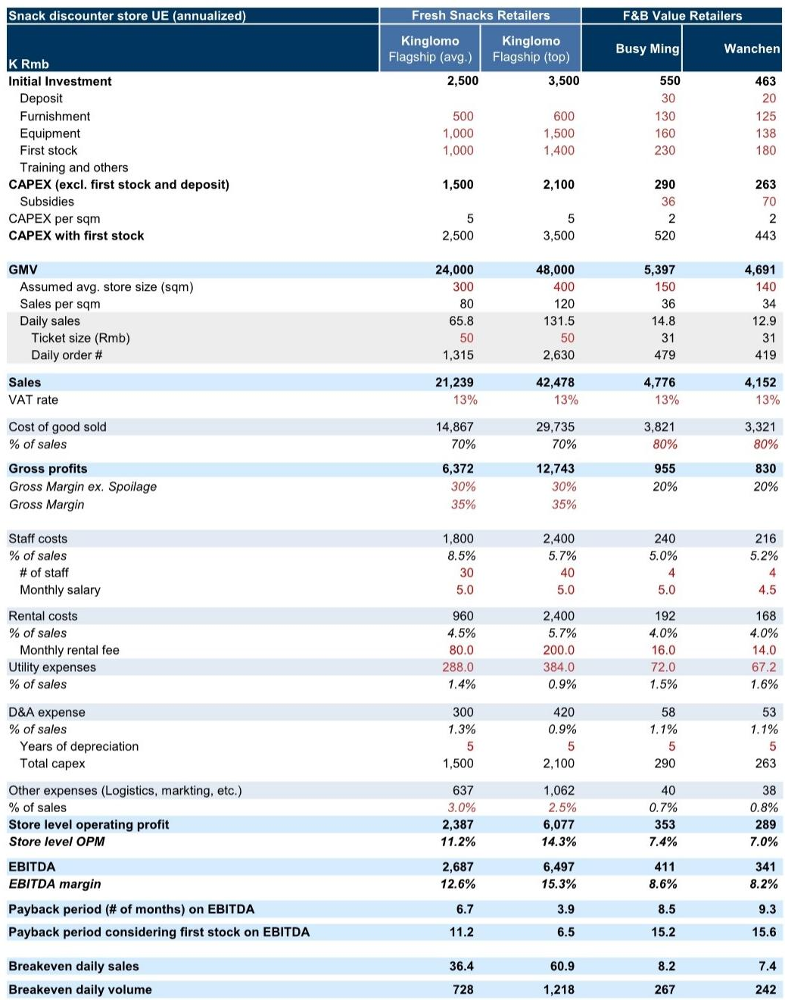
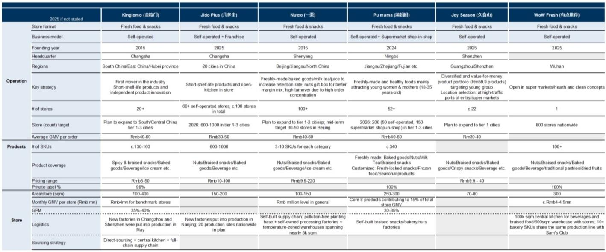
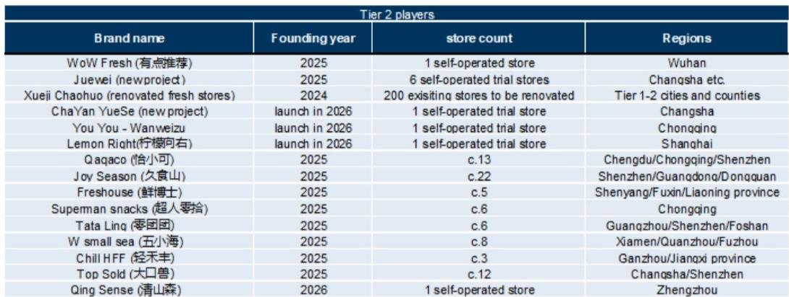

# Fresh Snacks Are Not a Threat to F&B Value Retailers—They Are the Blueprint for the Next Growth Curve

The rise of fresh snacks retailers in China since 2025 has triggered a wave of investor anxiety: Are these high-traffic, high-margin newcomers going to cannibalize the packaged snack value retailers that have dominated the narrative for the past three years? The answer, based on a detailed analysis of store unit economics, category dynamics, and competitive moats, is the opposite. Fresh snacks retailers are not a competitive threat to established F&B value retailers—they are a proof of concept for the next stage of evolution in Chinese snack retail. The real strategic question is not whether the incumbents will be disrupted, but which of them has the operational architecture to absorb the fresh snacks model into their existing network and turn it into a durable competitive advantage.

The timing of this development is critical. After a rapid scaling phase from 2022 to 2024, F&B value retailer leaders like Busy Ming and Wanchen have built networks of thousands of stores, but same-store sales growth has naturally moderated as the low-hanging fruit of store-opening beta has been harvested. The emergence of fresh snacks retailers—with daily sales reaching over RMB 100,000 per store, gross margins above 30%, and EBITDA margins in the teens—offers a clear signal that consumer demand for snacks in China is not saturated. It is being reshaped by new formats, higher purchase frequency, and broader consumption occasions. For investors, the key insight is that fresh snacks represent a category expansion and store-format upgrade opportunity, not a zero-sum competition.

This article synthesizes the findings of a global investment bank report on the read-across from fresh snacks retailers to F&B value retailers, and extends the logic into a strategic framework for decision-making. The argument is structured around four core insights: why fresh snacks validate the resilience of snack consumption, how store-format diversification could unlock a new alpha source for leaders, why the competitive threat is overstated, and what critical questions remain unanswered. The goal is to equip serious business readers with a lens to evaluate which incumbents are positioned to win the next phase—and which may be left behind.

## Fresh Snacks Retailers Confirm That Snack Demand Is Not Peaking—It Is Evolving Into Higher-Frequency, Higher-Value Occasions

The most important takeaway from the fresh snacks phenomenon is that the Chinese snack market is not approaching a demand ceiling. The rapid store rollout of over 200 stores across more than 10 fresh snack brands in 2025, combined with flagship stores generating annualized GMV of RMB 20-50 million, demonstrates that consumers are willing to spend more, more often, on snack-related purchases when the format is right. This is not a substitution of existing demand; it is an expansion of the total addressable market.

The mechanism is straightforward. Traditional F&B value retailers have built their model around packaged snacks with long shelf lives, offering value through assortment breadth, low prices, and high turnover. This model is effective for stock-up missions and impulse purchases, but it inherently limits purchase frequency. A consumer might visit a Busy Ming or Wanchen store once a week or once every two weeks. Fresh snacks retailers, by contrast, sell products with shelf lives measured in days—freshly baked pastries, braised meats, nuts, and beverages. This forces higher visit frequency because the products are consumed quickly and cannot be hoarded. A flagship fresh snack store can see over 1,300 daily orders, compared to fewer than 500 for a typical F&B value retailer store.

The implication for incumbents is clear: there is a large, untapped demand pool for fresh, short-shelf-life snacks that their current store formats do not fully address. Busy Ming has already begun testing baked egg tarts and hot sausages, and early results indicate a positive impact on per-store GMV since the second half of 2025. This is not a defensive move—it is an offensive expansion into a higher-frequency, higher-revenue-per-visit consumption pattern. The key metric to watch is not just same-store sales growth, but the share of fresh or short-shelf-life products in the overall mix, and how that affects customer visit intervals.

## The Next Source of Alpha for Industry Leaders Will Shift from Store-Open Beta to Store-Format Upgrade and Diversification

For the past three years, the dominant driver of revenue growth for F&B value retailer leaders has been the sheer number of new stores opened. Store-count expansion provided a straightforward beta: more stores meant more revenue, and the unit economics were attractive enough to sustain rapid scaling. That phase is maturing. The leaders now have networks of over 4,000 to 6,000 stores, and while there is still room for further expansion, the incremental return on each new store is naturally declining as the best locations are taken and saturation risk increases in core markets.

Fresh snacks retailers point to a different growth vector: store-format upgrade and diversification. The unit economics comparison in the report is revealing. A flagship fresh snack store can generate annualized sales per square meter of RMB 80-120, compared to approximately RMB 34-36 for a typical F&B value retailer store. The average order value is also higher—RMB 40-60 versus around RMB 31. Yet the initial investment for a fresh snack store is significantly larger: RMB 2.5-3.5 million versus around RMB 500,000 for a packaged snack store. This means the fresh snack model requires higher traffic and better locations, but it also offers a much higher ceiling on absolute revenue per store.

For incumbents with large existing networks, supply chain infrastructure, and consumer data insights, the opportunity is to selectively upgrade a portion of their store base into fresh-format or hybrid-format stores. They can use their dense store networks to test different formats—convenience-store-style outlets, small supermarket formats, or fresh-focused flagship stores—in different catchment areas. The advantage of scale is that they can absorb the operational complexity of fresh products (cold chain, spoilage management, in-store production) across a large base, diluting the fixed costs of supply chain upgrades. Smaller players attempting to scale fresh formats regionally are much more likely to be dragged down by operational complexity and elevated loss rates, because they lack the density to make logistics efficient and the data to predict demand accurately.

The strategic implication is that the next phase of competition in Chinese snack retail will not be about who opens the most stores, but about who can execute a multi-format strategy that captures both the high-frequency fresh snack occasion and the traditional packaged snack stock-up mission under one operational umbrella. Leaders that can do this will effectively create a community food retail platform, not just a snack discounter.

## The Competitive Threat from Fresh Snacks Retailers Is Overstated Due to Structural Scalability Constraints

Investor concern that fresh snacks retailers will disrupt established F&B value retailers is understandable but misplaced, for three structural reasons.

First, the fresh snacks model is inherently more complex and location-sensitive. Fresh snack stores carry fewer SKUs—hundreds to around 1,000, compared to thousands for a packaged snack discounter—but those SKUs require cold chain logistics, in-store preparation or assembly, and rigorous spoilage management. The reliance on high sell-through means these stores must be in high-traffic locations, typically in tier-1 and tier-2 cities, where rent is high and competition for prime spots is intense. The store-level economics are attractive at flagship locations, but they deteriorate quickly in lower-tier cities or secondary locations where foot traffic is insufficient to turn over short-shelf-life inventory before it spoils.

Second, the model is difficult to franchise. F&B value retailers have successfully franchised because packaged snacks are easy to manage: long shelf life, standardized ordering, low labor requirements. Fresh snacks require more staff per store (30-40 employees versus 4 for a packaged snack store), more sophisticated inventory management, and higher capital investment. Franchisees without deep operational experience in fresh food are likely to struggle with spoilage control and quality consistency, limiting the speed and geographic reach of fresh snack expansion.

Third, the competitive advantages of scale are even more pronounced in fresh snacks than in packaged snacks. Leaders like Busy Ming and Wanchen have unmatched store network density, which lowers procurement costs and allows them to spread logistics costs across more units. They have professional store management systems that have been refined over thousands of locations. They have membership and loyalty assets that reduce customer acquisition costs and drive repeat purchase. Smaller fresh snack entrants may achieve impressive unit economics at a few flagship stores, but they lack the infrastructure to replicate that performance at scale across multiple regions. The report's data shows that even the leading fresh snack brands have only 20-100 stores each, concentrated in a small number of cities. Scaling from 100 to 1,000 stores in fresh snacks is an order of magnitude harder than scaling packaged snacks, because each new store requires more capital, more labor, and more supply chain coordination.

The near-term competitive dynamics therefore favor the incumbents. Fresh snacks retailers are not going to disrupt the packaged snack market; they are going to expand the total snack market, and the incumbents with the operational capability to incorporate fresh products into their mix will capture a disproportionate share of that expansion.

## What the Report Does Not Fully Answer: The Unit Economics of Fresh Snacks at Scale in Lower-Tier Cities

While the report provides a detailed illustrative store unit economics comparison for flagship fresh snack stores in tier-1 and tier-2 cities, it leaves a critical question open: What do the unit economics look like when fresh snack stores are scaled into lower-tier cities, where traffic is lower, average order values may be compressed, and consumer preferences for fresh food formats are unproven?

The report's own logic suggests that the fresh snacks model is less favorable for lower-tier penetration because it depends on high traffic and high turnover. The flagship stores analyzed achieve daily sales of RMB 66,000 to 132,000, but these are in prime locations in major cities. If a fresh snack store in a tier-3 city generates only a fraction of that revenue—say, RMB 20,000 per day—the fixed costs of labor, rent, and logistics would compress margins significantly, potentially turning a high-margin model into a loss-making one.

Furthermore, the report does not address how consumer behavior in lower-tier cities differs. In tier-1 cities, fresh snacks serve a convenience and impulse need for time-pressed urban consumers. In lower-tier cities, where consumers have more time and may prefer to buy fresh ingredients from traditional wet markets or cook at home, the value proposition of a premium-priced fresh snack store may be weaker. The incumbents' existing packaged snack stores in lower-tier cities may be more resilient than fresh snack formats, simply because they offer a familiar, low-risk value proposition.

This unanswered question is strategically important. If fresh snacks are predominantly a tier-1 and tier-2 city phenomenon, then the total addressable market for format upgrade is large but not unlimited. The incumbents' advantage in lower-tier cities—where they already have dense store networks and brand recognition—may be insurmountable for fresh snack entrants, but it also means that the upgrade opportunity is concentrated in the most competitive urban markets. Investors should watch for evidence of fresh snack formats being tested in tier-3 cities and whether the unit economics can hold.

## A Decision Framework for Evaluating Which Incumbents Will Win the Fresh Snacks Opportunity

For investors and strategic decision-makers, the report provides enough data to build a simple but powerful framework for evaluating which F&B value retailer leaders are best positioned to capture the fresh snacks opportunity. The framework has four dimensions:

1.  **Supply chain readiness for short-shelf-life products.** The ability to manage cold chain logistics, in-store production, and spoilage is the core operational requirement. Leaders that have already invested in central kitchens, temperature-controlled logistics, and data-driven demand forecasting have a head start. Those that rely on a pure packaged-goods supply chain will need to make significant capital investments before they can scale fresh formats.

2.  **Store network density and geographic distribution.** The economics of fresh snacks improve with network density because logistics costs are diluted and demand data becomes more granular. Leaders with the highest store counts in tier-1 and tier-2 cities—where fresh snacks are most viable—have an advantage. Leaders with a heavy concentration in lower-tier cities may find the upgrade opportunity smaller.

3.  **Trial and error capability.** The report notes that leading players are already making trials on product selection of cold-chain products and different store formats. The ability to run multiple small-scale experiments, learn from failures, and scale successes quickly is a competitive advantage that is hard to replicate. Investors should look for evidence of disciplined experimentation, not just announcements of new store formats.

4.  **Membership and loyalty infrastructure.** Fresh snacks benefit from high repeat purchase frequency, but customer acquisition costs are high because the stores need to generate high traffic from day one. Leaders with large membership bases and data on consumer purchase behavior can target existing customers with fresh snack offerings, reducing the risk of opening a new format store in a new location.

Using this framework, the incumbents that score highly on all four dimensions are likely to emerge as the winners in the next phase of Chinese snack retail. Those that are strong on store count but weak on supply chain readiness or trial capability may find themselves defending market share rather than expanding it.

## Join the Community to Read the Full Report and Review the Original Charts

The analysis above is based on a detailed report that includes store unit economics comparisons, category margin profiles, and store open trajectories for leading fresh snack and F&B value retailer players. The original charts—particularly the illustrative store UE comparison and the category margin breakdown—provide granular data that is essential for building your own investment thesis. To access the full report and review the original charts, join the community. The community also provides ongoing updates on store opening targets, category expansion trials, and competitive dynamics as they evolve.

*This article is for learning and discussion only and does not constitute investment advice.*

Personal reading notes and learning share only. Not investment advice.

