CHINA IP RETAILER AND TOY TRACKER

# May update: Pop Mart China online growth decelerated with higher base; Miniso/Bloks accelerating IP/product launch

In this note, we provide updates on China IP retailers and toy companies, including new products/IP, sales momentum, and overseas market updates. Pop Mart's domestics online sales grew +29% yoy in May, slower than Apr at +95% yoy growth with higher base. On Douyin, run-rate into Jun is lagging both sequentially and YoY, facing a tough comparison against June 2025 supply surge of Labubu's Big Into Energy series. In the US market, May's YoY decline (-36% yoy) slightly narrowed vs Apr (-43% yoy) thanks to an easier prior-year base; however, the comparison base will become more challenging heading into June. 2Q-to-date credit card sales tracking remained negative (c.40% yoy decline QTD according to BBG data, compared to LSD% growth in 1Q). In the US and China, secondary market price/google trends did not indicate significant IP momentum improvement in May. Whether the upcoming World Cup (Jun 11-Jul 19) could restore momentum for the Labubu IP is among the market focus for the upcoming month. Miniso continued its rapid IP rollout in May and early-Jun, and more high quality IPs will be launched into summer peak season. Mgmt noted Apr-May performance saw positive SSSG and Labor day sales recorded +high-teens% yoy growth, on track with company's guidance. In the US market, growth in May sequentially improved from Apr thanks to favorable base, while base into Jun will be tougher. 2Q26-to-date sales growth decelerated from 1Q due to a higher base, i.e.\~26% yoy QTD vs. close to 50% in 1Q according to BBG credit sales data. Bloks accelerated 2QTD new product launches, increasing the number of series/SKUs launched both YoY and QoQ. Overall, Tmall+JD+Douyin sales yoy growth accelerated in May vs. Apr based on our tracker, driven by new releases focusing on existing major IPs. More details within.

## Michelle Cheng

+852-2978-6631

michelle.cheng@gs.com

GS (Asia) L.L.C.

## Xinyu Ruan

+852-2978-7347 | xinyu.ruan@gs.com

GS (Asia) L.L.C.

## Molly Dai

+852-3966-4000 | molly.dai@gs.com

GS (Asia) L.L.C.

## Carol Chen

+852-2978-7999 | carol.chen@gs.com

GS (Asia) L.L.C.

## Keira Liu

+852-2978-0473 | keira.liu@gs.com

GS (Asia) L.L.C.

## Pop Mart:

New IPs/products: 1) Dear Birds multi-IP series debut in May, which was not sold out in the first few days after debut. It recorded >32k/>10k sales volume in Douyin/Tmall and still available as of Jun 8, which is relatively muted compared to previous multi-IP series Have a good run which was sold out quickly after debut and recorded >200k sales volume in Douyin for the first month. 2) New plush toy series released by Crybaby and Hacipupu in May did not sell out in the first few days after debut, while Zsiga was sold out in Douyin. More specifically, Zsiga's new plush toy series (launched on Jun 4) recorded >10k/>14k sales volume on Tmall and Douyin as of Jun 8; Hacipupu's new series (launched on May 28) registered >4k/>3k sales volume in Douyin/Tmall and still available as of Jun 8; Crybaby's new plush toy series (launched on May 21) recorded >70k/>40k sales volume in Douyin/Tmall and still available as of Jun 8. In the secondary market, for the new series, only few non-secret SKUs are trading at SD%-low teens% premium, while others are trading at discounts as of Jun 8.

Secondary market prices: Secondary market discounts saw further expansion for IPs including Labubu, Molly, Dimoo in May and stabilization/slight recovery for IPs including Skullpanda, CryBaby for the sample SKUs we track. 1) Labubu: Discounts for the sample SKUs we track is generally at $30\% -45\%$ currently, slightly expanded from Apr. The FIFA plush pendant saw a deeper discount at c. $15\%$ in May. 2) Twinkle: Twinkle: For the sample SKUs we track, secondary market discount narrowed to LSD% in May but dropped to HSD% in early-Jun.

Marketing: 1) Labubu participated in Lisa's World Cup MV, which had 13.6mn views on Youtube so far. However, based on Google index, we didn't see meaningful improvement on its popularity. 2) Collaborations launched include McDonalds (Twinkle Twinkle); Coca Cola (Labubu); Ninebot (Sweet Bean) in May.

Online sales: Based on a third-party database, combined sales on Tmall and Douyin flagship stores grew +29% yoy in May, slower than Apr at +95% yoy growth. Based on our Douyin flagship store tracker, plush toy sales in May also lagged Apr and run-rate in Jun is currently lagging behind May as of Jun 6.

## Miniso:

■ Recent performance: The company continued its rapid IP rollout in May and early-Jun, featuring in-house IP Yoyo, movie-related IPs (such as Star War, Toy Story) and popular IPs including Chiikawa x Sanrio, Loopy, etc. Mgmt noted Apr-May performance saw positive SSSG and Labor day sales recorded +high-teens% yoy, outperforming overall retail sales with daily sales reaching historical highs.

■ Marketing: 1) Gallery was launched in Shanghai in mid-May. Its first exhibition was featured by Indonesian artist RYOL; 2) YOYO appeared on the Met Gala red carpet as a bag accessory worn by model Paloma Elsesser and was featured as part of the official event souvenirs in early-May.

■ Online sales: Based on a third-party database, combined sales on Tmall, JD and Douyin in May grew 21%, faster than 10% growth in Apr but decelerated from 1Q26 (+43% yoy) partly due to the higher base.

## Bloks:

■ New IP/products: New product launches in May focused on existing major IPs (such as Ultraman, Transformers, Kamen Rider). Number of series/SKUs launched in 2Q-to-date has increased YoY and QoQ.  
■ Product momentum: For adult lines, based on Tmall flagship store sales, most adult IPs saw sequential sales volume increase in May except for Pokemon. Overall, Tmall+JD+Douyin sales yoy growth accelerated vs. Apr based on our tracker.

Exhibit 1: Pop Mart's online sales growth in May and 2Q26-to-date growth were both slower sequentially based on the data we track  
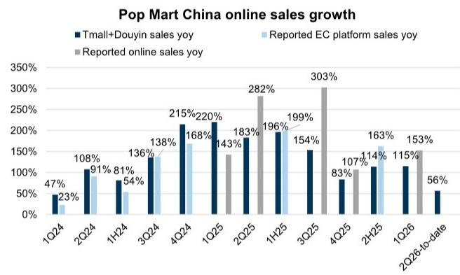

bar chart

Pop Mart China online sales growth
| Quarter | Tmall+Douyin sales yoy (%) | Reported EC platform sales yoy (%) | Reported online sales yoy (%) |
| :--- | :--- | :--- | :--- |
| 1Q24 | 47 | 23 | |
| 2Q24 | 108 | 91 | |
| 1H24 | 81 | 54 | |
| 3Q24 | 136 | 138 | |
| 4Q24 | 215 | 168 | |
| 1Q25 | 220 | 143 | |
| 2Q25 | 183 | 196 | 282 |
| 1H25 | 199 | 154 | |
| 3Q25 | 154 | 303 | |
| 4Q25 | 83 | 107 | |
| 2H25 | 114 | 163 | |
| 1Q26 | 115 | 153 | |
| 2Q26-to-date | 56 | | |

EC platform sales are Tmall and Douyin combined sales.  
Source: Company data, Moojing, Chanmama

Exhibit 3: Labubu's resale prices of Sanrio/FIFA series slightly corrected in May for the SKUs we track  
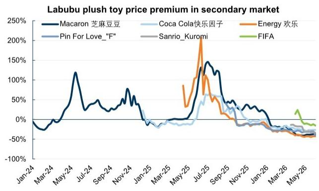

line chart

Labubu plush toy price premium in secondary market
| Date | Macaron 芝麻豆豆 (%) | Coca Cola 快乐因子 (%) | Energy 欢乐 (%) | Pin For Love "F" (%) | Sanrio_Kuromi (%) | FIFA (%) |
|---|---|---|---|---|---|---|
| Jan-24 | -30 | -10 | -15 | -15 | -15 | -15 |
| Mar-24 | -10 | -5 | -10 | -10 | -10 | -10 |
| May-24 | 120 | 5 | 5 | 5 | 5 | 5 |
| Jul-24 | 30 | 10 | 10 | 10 | 10 | 10 |
| Sep-24 | 40 | 15 | 15 | 15 | 15 | 15 |
| Nov-24 | 70 | 20 | 20 | 20 | 20 | 20 |
| Jan-25 | -10 | -5 | -5 | -5 | -5 | -5 |
| Mar-25 | -5 | 0 | 0 | 0 | 0 | 0 |
| May-25 | 0 | 5 | 50 | 50 | 50 | 50 |
| Jul-25 | 150 | 60 | 200 | 60 | 60 | 60 |
| Sep-25 | 100 | 40 | 40 | 40 | 40 | 40 |
| Nov-25 | 30 | 10 | 10 | 10 | 10 | 10 |
| Jan-26 | -10 | -5 | -5 | -5 | -5 | -5 |
| Mar-26 | -20 | -10 | -10 | -10 | -10 | -10 |
| May-26 | -30 | -20 | -20 | -20 | -20 | -20 |
The chart displays the percentage premium for each game from January to May, with values ranging from approximately -30% to +30%. The legend identifies six games: Macaron 芝麻豆豆, Coca Cola 快乐因子, Energy 欢乐, Pin For Love "F", Sanrio_Kuromi, and FIFA. The data is presented in a single column format with the date on the left and the premium value on the right. The chart is created using a line graph with a color-coded legend. The title explicitly states that the chart is part of a multi-panel figure.

As of Jun 3, 2026.  
Source: Qiandao

Exhibit 2: Pop Mart's plush toy supply on Douyin slightly moderated in May  
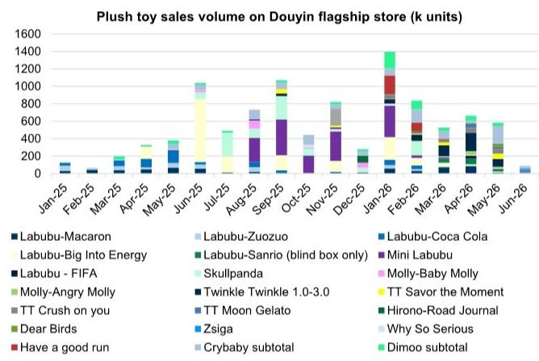

stacked bar chart

| Jan-25 | 100 | 0 | 0 | 0 | 0 | 0 | 0 | 0 | 0 | 0 | 0 | 0 | 0 | 0 | 0 | 0 | 0 | 0 | 0 | 0 |
| --- | --- | --- | --- | --- | --- | --- | --- | --- | --- | --- | --- | --- | --- | --- | --- | --- | --- | --- | --- | --- |
| Feb-25 | 50 | 0 | 0 | 0 | 0 | 0 | 0 | 0 | 0 | 0 | 0 | 0 | 0 | 0 | 0 | 0 | 0 | 0 | 0 | 0 |
| Mar-25 | 100 | 0 | 0 | 0 | 0 | 0 | 0 | 0 | 0 | 0 | 0 | 0 | 0 | 0 | 0 | 0 | 0 | 0 | 0 | 0 |
| Apr-25 | 150 | 0 | 0 | 0 | 0 | 0 | 0 | 0 | 0 | 0 | 0 | 0 | 0 | 0 | 0 | 0 | 0 | 0 | 0 | 0 |
| May-25 | 250 | 150 | 150 | 150 | 150 | 150 | 150 | 150 | 150 | 150 | 150 | 150 | 150 | 150 | 150 | 150 | 150 | 150 | 150 | 150 |
| Jun-25 | 450 | 350 | 350 | 350 | 350 | 350 | 350 | 350 | 350 | 350 | 350 | 350 | 350 | 350 | 350 | 350 | 350 | 350 | 350 | 350 |
| Jul-25 | 450 | 450 | 450 | 450 | 450 | 450 | 450 | 450 | 450 | 450 | 450 | 450 | 450 | 450 | 450 | 450 | 450 | 450 | 450 | 450 |
| Aug-25 | -150 | -150 | -150 | -150 | -150 | -150 | -150 | -150 | -150 | -150 | -150 | -150 | -150 | -150 | -150 | -150 | -150 | -150 | -150 | -150 |
| Sep-25 | -125 | -125 | -125 | -125 | -125 | -125 | -125 | -125 | -125 | -125 | -125 | -125 | -125 | -125 | -125 | -125 | -125 | -125 | -125 | -125 |
| Oct-25 | -75 | -75 | -75 | -75 | -75 | -75 | -75 | -75 | -75 | -75 | -75 | -75 | -75 | -75 | -75 | -75 | -75 | -75 | -75 | -75 |
| Nov-25 | -75 | -75 | -75 | -75 | -75 | -75 | -75 | -75 | -75 | -75 | -75 | -75 | -75 | -75 | -75 | -75 | -75 | -75 | -75 | -75 |

As of Jun 6, 2026.  
Source: Chanmama

Exhibit 4: Most IPs secondary prices were relatively stable in May  
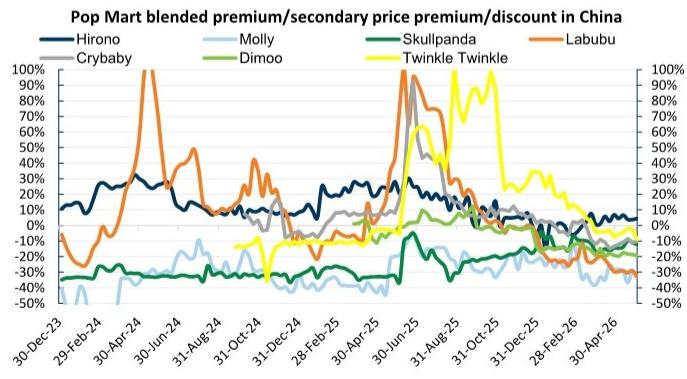

line chart

| Date       | Hirono | Molly | Skullpanda | Crybaby | Dimoo | Labubu | Twinkle Twinkle |
|------------|--------|-------|------------|---------|-------|--------|-----------------|
| 30-Dec-23  | 10%    | -50%  | -30%       | -10%    | -10%  | -10%   | -10%            |
| 29-Feb-24  | 15%    | -30%  | -25%       | -5%     | -5%   | -5%    | -5%             |
| 30-Apr-24  | 20%    | -20%  | -20%       | 0%      | 0%    | 100%   | 0%              |
| 30-Jun-24  | 25%    | -10%  | -15%       | 5%      | 5%    | 50%    | 5%              |
| 31-Aug-24  | 30%    | 0%    | -10%       | 10%     | 10%   | 30%    | 10%             |
| 31-Oct-24  | 25%    | 5%    | -5%        | 15%     | 15%   | 20%    | 15%             |
| 31-Dec-24  | 20%    | 10%   | 0%         | 20%     | 20%   | 15%    | 20%             |
| 28-Feb-25  | 15%    | 15%   | 5%         | 25%     | 25%   | 10%    | 25%             |
| 30-Apr-25  | 10%    | 20%   | 10%        | 30%     | 30%   | 5%     | 30%             |
| 30-Jun-25  | 5%     | 25%   | 15%        | 35%     | 35%   | 0%     | 35%             |
| 31-Aug-25  | 0%     | 30%   | 20%        | 40%     | 40%   | -5%    | 40%             |
| 31-Oct-25  | -5%    | 35%   | 25%        | 45%     | 45%   | -10%   | 45%             |
| 31-Dec-25  | -10%   | 40%   | 30%        | 50%     | 50%   | -15%   | 50%             |
| 28-Feb-26  | -15%   | 45%   | 35%        | 55%     | 55%   | -20%   | 55%             |
| 30-Apr-26  | -20%   | 50%   | 40%        | 60%     | 60%   | -25%   | 60%             |

As of Jun 3, 2026.  
Source: Qiandao

Exhibit 5: Most adult IPs saw sequential sales volume increase in May, except for Pokemon  
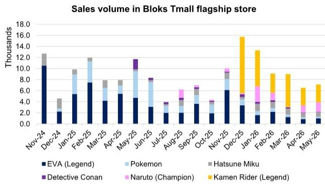

stacked bar chart

Sales volume in Bloks Tmall flagship store
| Month | EVA (Legend) (Thousands) | Pokemon (Thousands) | Hatsune Miku (Thousands) | Detective Conan (Thousands) | Naruto (Champion) (Thousands) | Kamen Rider (Legend) (Thousands) |
|---|---|---|---|---|---|---|
| Nov-24 | 10.5 | 0.0 | 0.0 | 0.0 | 0.0 | 0.0 |
| Dec-24 | 2.0 | 0.0 | 2.0 | 0.0 | 0.0 | 12.5 |
| Jan-25 | 5.0 | 1.5 | 1.5 | 0.0 | 0.0 | 1.0 |
| Feb-25 | 7.5 | 1.5 | 1.5 | 0.0 | 0.0 | 0.0 |
| Mar-25 | 4.0 | 1.5 | 1.5 | 0.0 | 0.0 | 1.5 |
| Apr-25 | 5.0 | 1.5 | 1.5 | 0.0 | 0.0 | 1.5 |
| May-25 | 4.5 | 3.0 | 1.5 | 1.5 | 0.0 | 0.0 |
| Jun-25 | 3.0 | 3.5 | 1.5 | 0.5 | 0.0 | 1.5 |
| Jul-25 | 2.0 | 1.5 | 1.5 | 0.5 | 0.0 | 1.5 |
| Aug-25 | 2.0 | 1.5 | 1.5 | 1.5 | 0.5 | 1.5 |
| Sep-25 | 3.5 | 1.5 | 1.5 | 1.5 | 0.5 | 1.5 |
| Oct-25 | 2.0 | 1.5 | 1.5 | 1.5 | 0.5 | 1.5 |
| Nov-25 | 6.0 | 2.0 | 1.5 | 1.5 | 1.0 | 1.5 |
| Dec-25 | 3.5 | 1.5 | 1.5 | 1.5 | 1.0 | 16.0 |
| Jan-26 | 2.0 | 1.5 | 1.5 | 1.5 | 3.0 | 13.5 |
| Feb-26 | 2.0 | 1.5 | 1.5 | 1.5 | 2.0 | 9.0 |
| Mar-26 | 1.5 | 1.5 | 1.5 | 1.5 | 2.0 | 9.0 |
| Apr-26 | 1.5 | 1.5 | 1.5 | 1.5 | 2.0 | 6.5 |
| May-26 | 1.5 | 1.5 | 1.5 | 1.5 | 2.0 | 7.0 |
The chart displays a stacked bar chart with each bar representing a total sales volume for that month from Nov-24 to May-26, broken down by the sales volume of each individual brand or category on the Y-axis (in thousands). The legend identifies six brands: EVA (Legend), Pokemon, Hatsune Miku, Detective Conan, Naruto (Champion), and Kamen Rider (Legend). The data is presented in a single column format with values labeled above each bar.

Source: Moojing

Exhibit 6: Sales value in Bloks Tmall flagship store  
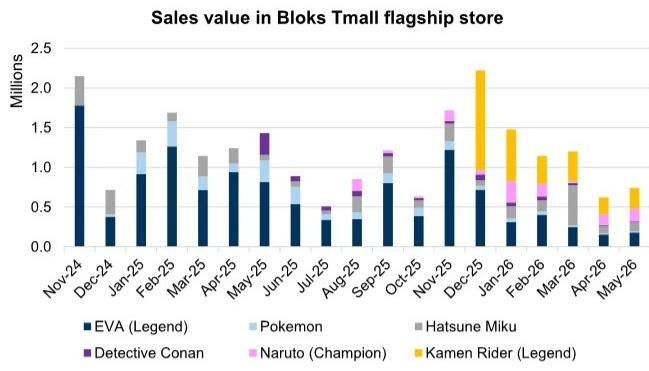

stacked bar chart

Sales value in Bloks Tmall flagship store
| Month | EVA (Legend) (Millions) | Pokemon (Millions) | Hatsune Miku (Millions) | Detective Conan (Millions) | Naruto (Champion) (Millions) | Kamen Rider (Legend) (Millions) |
|---|---|---|---|---|---|---|
| Nov-24 | 1.75 | 0.0 | 0.35 | 0.0 | 0.0 | 0.0 |
| Dec-24 | 0.35 | 0.0 | 0.25 | 0.0 | 0.0 | 0.0 |
| Jan-25 | 0.95 | 0.25 | 0.15 | 0.0 | 0.0 | 0.0 |
| Feb-25 | 1.25 | 0.35 | 0.15 | 0.0 | 0.0 | 0.0 |
| Mar-25 | 0.7 | 0.25 | 0.25 | 0.0 | 0.0 | 0.0 |
| Apr-25 | 1.0 | 0.15 | 0.25 | 0.0 | 0.0 | 0.0 |
| May-25 | 0.85 | 0.25 | 0.15 | 0.15 | 0.0 | 0.0 |
| Jun-25 | 0.6 | 0.15 | 0.15 | 0.15 | 0.0 | 0.0 |
| Jul-25 | 0.35 | 0.1 | 0.15 | 0.15 | 0.15 | 0.0 |
| Aug-25 | 0.35 | 0.15 | 0.25 | 0.15 | 0.15 | 0.0 |
| Sep-25 | 0.85 | 0.15 | 0.25 | 0.15 | 0.15 | 0.0 |
| Oct-25 | 0.35 | 0.15 | 0.15 | 0.15 | 0.15 | 0.0 |
| Nov-25 | 1.25 | 0.25 | 0.35 | 0.15 | 0.15 | 0.1 |
| Dec-25 | 0.75 | 0.15 | 0.25 | 0.15 | 0.15 | 1.2 |
| Jan-26 | 0.35 | 0.15 | 0.25 | 0.15 | 0.25 | 1.4 |
| Feb-26 | 0.35 | 0.15 | 0.25 | 0.15 | 0.25 | 1.2 |
| Mar-26 | 0.25 | 0.15 | 0.35 | 0.15 | 0.15 | 1.2 |
| Apr-26 | 0.15 | 0.15 | 0.35 | 0.15 | 0.15 | 0.6 |
| May-26 | 0.15 | 0.15 | 0.35 | 0.15 | 0.15 | 0.7 |
The chart displays a stacked bar chart with each bar representing the total sales value for that month from Nov-24 to May-26, broken down by the sales value of each product category on the Y-axis (in millions). The legend indicates the product categories: EVA (Legend), Pokemon, Hatsune Miku, Detective Conan, Naruto (Champion), and Kamen Rider (Legend). The data is presented in a single column format.

Source: Moojing

## Overseas market

In the US, non-farm payrolls in May was well above expectations with unchanged unemployment rate, and core retail sales increased $0.5\%$ in Apr, slightly above expectations. That said, UMich consumer sentiment fell by 5.0pt to 44.8—its lowest level on record—while the Conference Board's consumer confidence index decreased by 0.7pt to 93.1 in May, also point to retrenchments in consumer confidence in recent weeks. Our economists noted G10 consumers generally continue to benefit from healthy balance sheets, but labor markets are more mixed, sentiment has worsened from already low levels following the start of the war in the Middle East, and spending headwinds are expected as higher energy prices erode real incomes in the next few months. Elsewhere, consumer sentiment in Singapore/Indonesia also deteriorated, while sentiment in Malaysia/Euro area slightly recovered (Exhibit 16).

For players in diversified retailer sector, we noticed FIVE 1Q26 comp was at +22.7% (above GS/consensus) driven by strong store execution, customer engagement, and strong product trends. However, the company is cautiously guiding the 2H of the year, keeping guidance in those quarters unchanged due to the challenging macro. That said, mgmt did not see any data suggesting a shift in behavior or trade-down. On margin, the company expected OPM to expand for the FY, driven by gross margin, and higher fuel costs are being offset by better tariff costs. We view it as a mixed read to Miniso and Pop Mart in US. Resilient consumption behaviors was observed and tariff tailwinds could be expected. Yet, the company’s cautious guidance on the 2H26 with concerns on macro may imply Miniso/Pop mart will hold similar stance.

Pop Mart: 1) US: The YoY US credit card sales decline narrowed in May arriving at -36% yoy (vs c.43% decline in Apr). Secondary market prices for Labubu remained overall stable in May at \~50% average discount, with an initial dip followed by a recovery. Google search trends was also largely stable, while APP MAU recovered sequentially. 2)

Other regions: Google Trends in Europe and ASEAN was largely stable. APP MAU declined in Europe, while picked up in ASEAN. 3) New IPs/products updates: In the US, we noticed that multi-IP Dear Birds series and Hacipupu's Enchanted Realm Tales series were not offered on the US official website as of Jun 8, while Zsiga and Peach Riot's new plush series were still available. In France, Hacipupu and Peach Riot's new series were sold out, while Zsiga and Dear Birds new series remained available in the official website. In Thailand, new series (Zsiga/ Hacipupu/ Dear Birds/ Peach Riot new series) were all available on the official websites as of Jun 8.

Miniso: US credit card sales growth of $+31\%$ yoy in May accelerated sequentially from $+19\%$ in Apr, leading to $26\%$ growth in 2Q26-to-date.

Exhibit 7: Pop Mart US credit card sales decelerated sequentially in 2Q26-to-date  
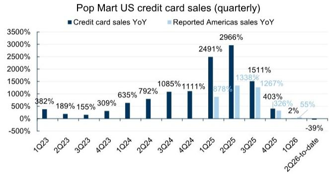

bar chart

Pop Mart US credit card sales (quarterly)
| Quarter | Credit card sales YoY (%) | Reported Americas sales YoY (%) |
| :--- | :--- | :--- |
| 1Q23 | 382 | |
| 2Q23 | 189 | |
| 3Q23 | 155 | |
| 4Q23 | 309 | |
| 1Q24 | 635 | |
| 2Q24 | 792 | |
| 3Q24 | 1085 | |
| 4Q24 | 1111 | |
| 1Q25 | 2491 | 878 |
| 2Q25 | 2966 | 1338 |
| 3Q25 | 1511 | 1267 |
| 4Q25 | 403 | 326 |
| 1Q26 | 2 | 55 |
| 2Q26-to-date | -39 | |

Source: Bloomberg, Company data, GS Global Investment Research

Exhibit 8: Pop Mart US credit card sales decline narrowed to 36% in May vs. 43% yoy decline in Apr  
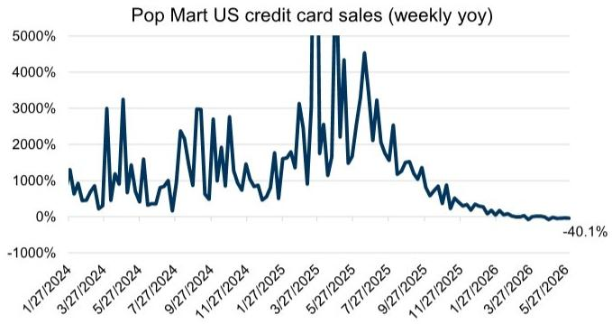

line chart

Pop Mart US credit card sales (weekly yoy)
| Date | Weekly yoy (%) |
|---|---|
| 1/27/2024 | 1000 |
| 3/27/2024 | 500 |
| 5/27/2024 | 3000 |
| 7/27/2024 | 500 |
| 9/27/2024 | 3000 |
| 11/27/2024 | 1500 |
| 1/27/2025 | 500 |
| 3/27/2025 | 3000 |
| 5/27/2025 | 5000 |
| 7/27/2025 | 4500 |
| 9/27/2025 | 1500 |
| 11/27/2025 | 500 |
| 1/27/2026 | 100 |
| 3/27/2026 | -50 |
| 5/27/2026 | -40.1 |

Source: Bloomberg

Exhibit 9: In the US market, Labubu's plush toy discounts remained overall stable in May at \~50% average discount, with an initial dip followed by a recovery  
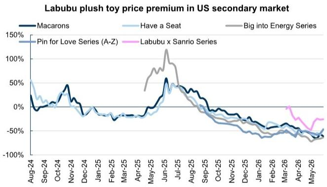

line chart

| Month    | Macarons | Have a Seat | Big into Energy Series | Pin for Love Series (A-Z) | Labubu x Sanrio Series |
|----------|----------|-------------|------------------------|---------------------------|------------------------|
| Aug-24   | ~0%      | ~50%        | ~0%                    | ~0%                       | ~0%                    |
| Sep-24   | ~0%      | ~0%         | ~0%                    | ~0%                       | ~0%                    |
| Oct-24   | ~50%     | ~0%         | ~0%                    | ~0%                       | ~0%                    |
| Nov-24   | ~0%      | ~0%         | ~0%                    | ~0%                       | ~0%                    |
| Dec-24   | ~0%      | ~0%         | ~0%                    | ~0%                       | ~0%                    |
| Jan-25   | ~0%      | ~0%         | ~0%                    | ~0%                       | ~0%                    |
| Feb-25   | ~0%      | ~0%         | ~0%                    | ~0%                       | ~0%                    |
| Mar-25   | ~0%      | ~0%         | ~0%                    | ~0%                       | ~0%                    |
| Apr-25   | ~0%      | ~0%         | ~50%                   | ~0%                       | ~0%                    |
| May-25   | ~50%     | ~50%        | ~100%                  | ~0%                       | ~0%                    |
| Jun-25   | ~50%     | ~50%        | ~125%                  | ~0%                       | ~0%                    |
| Jul-25   | ~50%     | ~50%        | ~50%                   | ~0%                       | ~0%                    |
| Aug-25   | ~50%     | ~50%        | ~50%                   | ~0%                       | ~0%                    |
| Sep-25   | ~50%     | ~50%        | ~50%                   | ~0%                       | ~0%                    |
| Oct-25   | ~50%     | ~50%        | ~50%                   | ~0%                       | ~0%                    |
| Nov-25   | ~50%     | ~50%        | ~50%                   | ~0%                       | ~0%                    |
| Dec-25   | ~50%     | ~50%        | ~50%                   | ~0%                       | ~0%                    |
| Jan-26   | ~50%     | ~50%        | ~50%                   | ~0%                       | ~0%                    |
| Feb-26   | ~50%     | ~50%        | ~50%                   | ~0%                       | ~0%                    |
| Mar-26   | ~50%     | ~50%        | ~50%                   | ~0%                       | ~-10%                  |
| Apr-26   | ~50%     | ~50%        | ~50%                   | ~-10%                     | ~-15%                  |
| May-26   | ~50%     | ~50%        | ~50%                   | ~-15%                     | ~-15%                  |

Premium is calculated based on the current tagged price.  
Exhibit 10: Labubu Google search index stabilized in the US  
Google Trend data for different IPs in the US

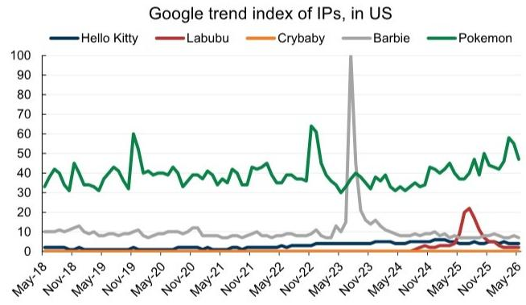

line chart

| Date    | Hello Kitty | Labubu | Crybaby | Barbie | Pokemon |
|---------|-------------|--------|---------|--------|---------|
| May-18  | 0           | 0      | 0       | 10     | 40      |
| Nov-18  | 0           | 0      | 0       | 10     | 45      |
| May-19  | 0           | 0      | 0       | 10     | 40      |
| Nov-19  | 0           | 0      | 0       | 10     | 60      |
| May-20  | 0           | 0      | 0       | 10     | 40      |
| Nov-20  | 0           | 0      | 0       | 10     | 40      |
| May-21  | 0           | 0      | 0       | 10     | 40      |
| Nov-21  | 0           | 0      | 0       | 10     | 40      |
| May-22  | 0           | 0      | 0       | 10     | 40      |
| Nov-22  | 0           | 0      | 0       | 10     | 65      |
| May-23  | 0           | 0      | 0       | 10     | 30      |
| Nov-23  | 0           | 0      | 0       | 10     | 40      |
| May-24  | 0           | 0      | 0       | 10     | 40      |
| Nov-24  | 0           | 0      | 0       | 10     | 45      |
| May-25  | 0           | 25     | 0       | 10     | 50      |
| Nov-25  | 0           | 25     | 0       | 10     | 55      |
| May-26  | 0           | 25     | 0       | 10     | 60      |

Source: Google Trends (https://www.google.com/trends)

Exhibit 11: Labubu Google search index was relatively stable in May  
Global Google Trends data for Labubu (based on absolute search volume), YTD  
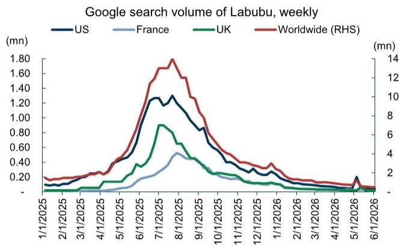

line chart

| Date       | US    | France | UK    | Worldwide (RHS) |
| ---------- | ----- | ------ | ----- | --------------- |
| 1/1/2025   | 0.10  | 0.05   | 0.05  | 0.15            |
| 2/1/2025   | 0.15  | 0.08   | 0.08  | 0.20            |
| 3/1/2025   | 0.20  | 0.10   | 0.10  | 0.25            |
| 4/1/2025   | 0.30  | 0.15   | 0.15  | 0.35            |
| 5/1/2025   | 0.45  | 0.20   | 0.20  | 0.50            |
| 6/1/2025   | 0.70  | 0.30   | 0.30  | 0.80            |
| 7/1/2025   | 1.20  | 0.40   | 0.40  | 1.40            |
| 8/1/2025   | 1.30  | 0.50   | 0.50  | 1.60            |
| 9/1/2025   | 1.10  | 0.45   | 0.45  | 1.30            |
| 10/1/2025  | 0.80  | 0.35   | 0.35  | 1.00            |
| 11/1/2025  | 0.60  | 0.30   | 0.30  | 0.80            |
| 12/1/2025  | 0.45  | 0.25   | 0.25  | 0.60            |
| 1/1/2026   | 0.35  | 0.20   | 0.20  | 0.45            |
| 2/1/2026   | 0.25  | 0.15   | 0.15  | 0.35            |
| 3/1/2026   | 0.20  | 0.10   | 0.10  | 0.30            |
| 4/1/2026   | 0.15  | 0.08   | 0.08  | 0.25            |
| 5/1/2026   | 0.10  | 0.05   | 0.05  | 0.20            |
| 6/1/2026   | 0.15  | 0.10   | 0.10  | 0.25            |

Source: Google Trends (https://www.google.com/trends)

Exhibit 13: Pop Mart APP MAU in US/ASEAN picked up sequentially in May; while Europe MAU remained to decline slightly  
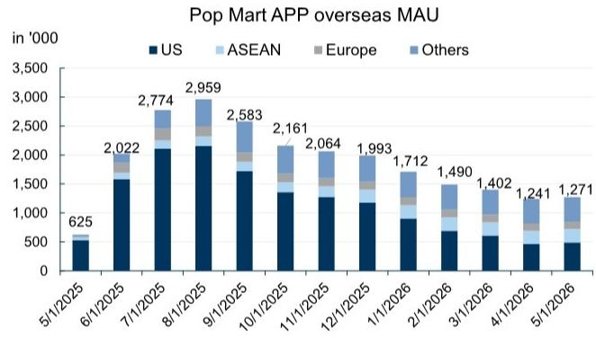

stacked bar chart

Pop Mart APP overseas MAU
| Date | US (in '000) | ASEAN (in '000) | Europe (in '000) | Others (in '000) |
|---|---|---|---|---|
| 5/1/2025 | 625 | | | |
| 6/1/2025 | 1583 | | | |
| 7/1/2025 | 2149 | | | |
| 8/1/2025 | 2189 | | | |
| 9/1/2025 | 1713 | | | |
| 10/1/2025 | 1344 | | | |
| 11/1/2025 | 1303 | | | |
| 12/1/2025 | 1234 | | | |
| 1/1/2026 | 934 | | | |
| 2/1/2026 | 687 | | | |
| 3/1/2026 | 587 | | | |
| 4/1/2026 | 487 | | | |
| 5/1/2026 | 487 | | | |
The chart displays a stacked bar chart representing the total number of users (in thousands) for each region over time. The US region dominates the user base throughout the period, while ASEAN, Europe, and Others are represented as separate segments within each bar. The data is already in English. The total number of users per month is labeled above each bar.

Source: Sensor Tower, Data compiled by GS Global Investment Research

Exhibit 15: Miniso US credit card sales growth re-accelerated to $+31\%$ in May from $+19\%$ yoy in Apr  
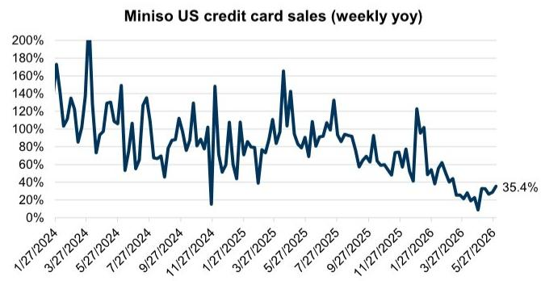

line chart

| Date       | Weekly yoy |
| ---------- | ---------- |
| 5/27/2026  | 35.4%      |

Source: Bloomberg

Exhibit 12: In May, Google search index was largely stable in major ASEAN markets as well  
Global Google Trends data for Labubu (based on absolute search volume), YTD  
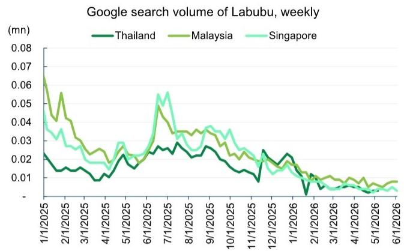

line chart

Google search volume of Labubu, weekly
| Date | Thailand (mn) | Malaysia (mn) | Singapore (mn) |
|---|---|---|---|
| 1/1/2025 | 0.023 | 0.068 | 0.041 |
| 2/1/2025 | 0.015 | 0.057 | 0.035 |
| 3/1/2025 | 0.013 | 0.032 | 0.027 |
| 4/1/2025 | 0.011 | 0.025 | 0.021 |
| 5/1/2025 | 0.018 | 0.028 | 0.029 |
| 6/1/2025 | 0.022 | 0.031 | 0.034 |
| 7/1/2025 | 0.026 | 0.049 | 0.056 |
| 8/1/2025 | 0.024 | 0.036 | 0.034 |
| 9/1/2025 | 0.023 | 0.034 | 0.037 |
| 10/1/2025 | 0.019 | 0.031 | 0.035 |
| 11/1/2025 | 0.016 | 0.027 | 0.031 |
| 12/1/2025 | 0.024 | 0.023 | 0.026 |
| 1/1/2026 | 0.018 | 0.019 | 0.017 |
| 2/1/2026 | -0.015 | 0.013 | 0.011 |
| 3/1/2026 | 0.007 | 0.011 | 0.008 |
| 4/1/2026 | 0.006 | 0.011 | 0.007 |
| 5/1/2026 | 0.005 | 0.011 | 0.006 |
| 6/1/2026 | 0.004 | 0.011 | 0.005 |

Source: Google Trends (https://www.google.com/trends)

Exhibit 14: Miniso's US credit card sales growth decelerated in 2Q26-to-date vs. 1Q26  
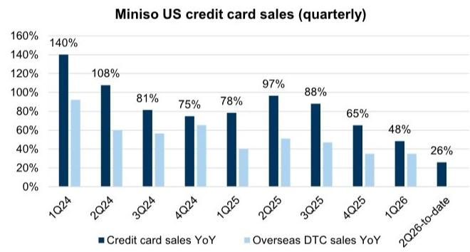

bar chart

Miniso US credit card sales (quarterly)
| Quarter | Credit card sales YoY (%) | Overseas DTC sales YoY (%) |
|---|---|---|
| 1Q24 | 140 | 92 |
| 2Q24 | 108 | 59 |
| 3Q24 | 81 | 56 |
| 4Q24 | 75 | 65 |
| 1Q25 | 78 | 40 |
| 2Q25 | 97 | 51 |
| 3Q25 | 88 | 47 |
| 4Q25 | 65 | 35 |
| 1Q26 | 48 | 35 |
| 2Q26-to-date | 26 | - |

Source: Bloomberg, Company data, GS Global Investment Research

Exhibit 16: Consumer sentiment in US/Singapore/Indonesia deteriorated, while sentiment in Malaysia/Euro area slightly recovered  
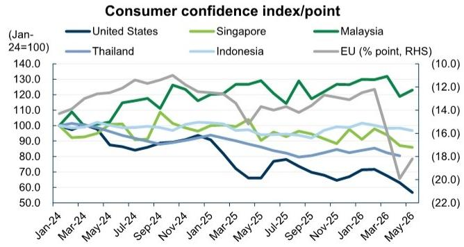

line chart

| Month    | United States | Singapore | Malaysia | Thailand | Indonesia | EU (% point, RHS) |
|----------|---------------|-----------|----------|----------|------------|---------------------|
| Jan-24   | 100.0         | 100.0     | 100.0    | 100.0    | 100.0      | 10.0                |
| Mar-24   | 95.0          | 95.0      | 110.0    | 95.0     | 95.0       | 11.0                |
| May-24   | 90.0          | 90.0      | 115.0    | 90.0     | 90.0       | 12.0                |
| Jul-24   | 85.0          | 85.0      | 120.0    | 85.0     | 85.0       | 13.0                |
| Sep-24   | 80.0          | 80.0      | 125.0    | 80.0     | 80.0       | 13.5                |
| Nov-24   | 75.0          | 75.0      | 130.0    | 75.0     | 75.0       | 13.5                |
| Jan-25   | 70.0          | 70.0      | 125.0    | 70.0     | 70.0       | 13.5                |
| Mar-25   | 65.0          | 65.0      | 120.0    | 65.0     | 65.0       | 13.5                |
| May-25   | 60.0          | 60.0      | 115.0    | 60.0     | 60.0       | 13.5                |
| Jul-25   | 55.0          | 55.0      | 110.0    | 55.0     | 55.0       | 13.5                |
| Sep-25   | 50.0          | 50.0      | 105.0    | 50.0     | 50.0       | 13.5                |
| Nov-25   | 45.0          | 45.0      | 100.0    | 45.0     | 45.0       | 13.5                |
| Jan-26   | 40.0          | 40.0      | 95.0     | 40.0     | 40.0       | 13.5                |
| Mar-26   | 35.0          | 35.0      | 90.0     | 35.0     | 35.0       | 13.5                |
| May-26   | 30.0          | 30.0      | 85.0     | 30.0     | 30.0       | 13.5                |

Source: Ipsos Group, University of the Thai Chamber of Commerce, European Commission's Directorate, Bank Indonesia, University of Michigan

## News and reports

## Company and industry news

Pop Mart: Issued a notice on Jun 10 stating that, after comprehensive consideration of multiple factors and careful evaluation, the 2026 PTS Shanghai Pop Culture Carnival, originally scheduled to be held from July 24 to August 2, 2026, will be canceled.

Miniso: Expanded its presence in New York with a public exhibition featuring YOYO. Starting June 20, YOYO will appear as a large art installation at The Oculus at the World Trade Center.

## GS reports

Miniso (MNSO): NDR takeaways: Membership, IP, store upgrade and mature overseas market margin improvement to mitigate macro headwinds; Buy

Miniso (MNSO): Earnings review: bottom line growth back-end loaded; channel upgrade to be further rolled out; Buy

Pop Mart (9992.HK): 1Q26 review: Enhancing operation for long term healthy growth; but near-term visibility remains low with margin risks; Neutral

Pop Mart (9992.HK): 1Q26 first take: Growth slightly ahead of lowered expectation, outlook/margin key to watch; Neutral

## Sector valuations

Exhibit 17: P/E band of GS covered IP retailers in China  
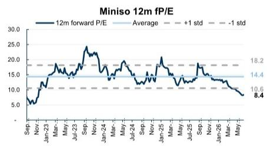

line chart

| Date   | 12m forward P/E |
|--------|-----------------|
| Sep-23 | 5.0             |
| Jan-23 | 10.0            |
| May-23 | 15.0            |
| Jul-23 | 20.0            |
| Sep-23 | 25.0            |
| Nov-23 | 20.0            |
| Jan-24 | 15.0            |
| Mar-24 | 18.0            |
| May-24 | 20.0            |
| Jul-24 | 15.0            |
| Sep-24 | 18.0            |
| Nov-24 | 20.0            |
| Jan-25 | 25.0            |
| Mar-25 | 20.0            |
| May-25 | 15.0            |
| Jul-25 | 18.0            |
| Sep-25 | 20.0            |
| Nov-25 | 15.0            |
| Jan-26 | 18.0            |
| Mar-26 | 15.0            |
| May-26 | 10.0            |

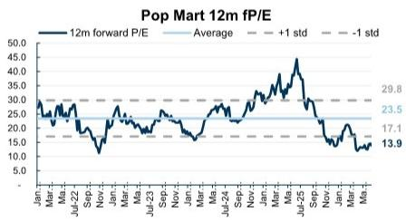

line chart

| Month | 12m forward P/E |
|-------|-----------------|
| Jan   | 29.8            |
| Mar   | 23.5            |
| Jul-22| 17.1            |
| Sep   | 13.9            |

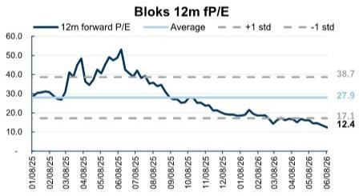

line chart

| Date     | 12m forward P/E |
| -------- | --------------- |
| 01/08/25 | 30.0            |
| 02/08/25 | 30.0            |
| 03/08/25 | 30.0            |
| 04/08/25 | 40.0            |
| 05/08/25 | 50.0            |
| 06/08/25 | 40.0            |
| 07/08/25 | 35.0            |
| 08/08/25 | 30.0            |
| 09/08/25 | 25.0            |
| 10/08/25 | 20.0            |
| 11/08/25 | 18.0            |
| 12/08/25 | 17.0            |
| 01/09/26 | 16.0            |
| 02/09/26 | 15.0            |
| 03/09/26 | 14.0            |
| 04/09/26 | 13.0            |
| 05/09/26 | 12.0            |
| 06/09/26 | 12.4            |

As of Jun 9, 2025.  
Source: LSEG Data & Analytics, GS Global Investment Research

Exhibit 18: Comp sheet of IP/lifestyle retailers and brands

<table><tr><td rowspan="2">Ticker</td><td rowspan="2">Company</td><td>Mkt cap</td><td>3m Avg daily turnover</td><td rowspan="2">Rating</td><td rowspan="2">12m TP</td><td>Price</td><td rowspan="2">Implied upside</td><td colspan="3">Valuation implied P/E</td><td colspan="3">PE</td><td colspan="3">EV/EBITDA</td><td colspan="3">Net income growth</td><td colspan="3">Revenue growth</td><td>ROE</td><td>Div yield</td><td>FCF yield</td><td>NPM</td><td>Net gearing</td></tr><tr><td>US$mn</td><td>(US$mn)</td><td>6/9/2026</td><td>2026E</td><td>2027E</td><td>2028E</td><td>2026E</td><td>2027E</td><td>2028E</td><td>2026E</td><td>2027E</td><td>2028E</td><td>2026E</td><td>2027E</td><td>2028E</td><td>2026E</td><td>2027E</td><td>2028E</td><td>2026E</td><td>2026E</td><td>2026E</td><td>2026E</td><td>2026E</td></tr><tr><td colspan="28">China IP/Lifestyle retailers/brands</td></tr><tr><td>9992.HK</td><td>Pop Mart</td><td>28,233</td><td>507.9</td><td>Neutral</td><td>164.00</td><td>168.50</td><td>-3%</td><td>14x</td><td>13x</td><td>11x</td><td>14.5x</td><td>13.0x</td><td>11.8x</td><td>9x</td><td>8x</td><td>7x</td><td>5%</td><td>12%</td><td>10%</td><td>14%</td><td>11%</td><td>9%</td><td>51%</td><td>2%</td><td>8%</td><td>31%</td><td>-87%</td></tr><tr><td>MNSO</td><td>Miniso</td><td>4,050</td><td>7.1</td><td>Buy</td><td>21.20</td><td>13.20</td><td>61%</td><td>15x</td><td>13x</td><td>12x</td><td>8.8x</td><td>7.7x</td><td>6.8x</td><td>6x</td><td>5x</td><td>5x</td><td>7%</td><td>14%</td><td>13%</td><td>16%</td><td>14%</td><td>12%</td><td>26%</td><td>6%</td><td>4%</td><td>12%</td><td>-4%</td></tr><tr><td>0325.HK</td><td>Bloks</td><td>1,559</td><td>5.5</td><td>Neutral</td><td>63.00</td><td>49.02</td><td>29%</td><td>17x</td><td>14x</td><td>13x</td><td>13.2x</td><td>11.2x</td><td>9.8x</td><td>7x</td><td>6x</td><td>5x</td><td>19%</td><td>17%</td><td>14%</td><td>24%</td><td>15%</td><td>12%</td><td>24%</td><td>0%</td><td>1%</td><td>22%</td><td>-65%</td></tr><tr><td>603899.SS</td><td>Shanghai M&amp;G</td><td>2,980</td><td>15.4</td><td>Buy</td><td>28.00</td><td>21.91</td><td>28%</td><td>17x</td><td>16x</td><td>14x</td><td>13.6x</td><td>12.3x</td><td>11.2x</td><td>8x</td><td>7x</td><td>6x</td><td>13%</td><td>11%</td><td>10%</td><td>8%</td><td>7%</td><td>7%</td><td>15%</td><td>5%</td><td>6%</td><td>5%</td><td>-40%</td></tr><tr><td colspan="28">China entertainment</td></tr><tr><td>1060.HK</td><td>Damai entertainment</td><td>2,044</td><td>15.4</td><td>Buy</td><td>0.82</td><td>0.54</td><td>52%</td><td>28x</td><td>24x</td><td>20x</td><td>18.8x</td><td>15.5x</td><td>12.9x</td><td>13x</td><td>10x</td><td>8x</td><td>19%</td><td>21%</td><td>20%</td><td>10%</td><td>15%</td><td>16%</td><td>4%</td><td>0%</td><td>0%</td><td>9%</td><td>-16%</td></tr><tr><td colspan="28">Global IP/Lifestyle retailers/brands</td></tr><tr><td>DIS</td><td>Disney</td><td>182,271</td><td>936.3</td><td>Buy</td><td>164.00</td><td>99.33</td><td>65%</td><td>23x</td><td>21x</td><td>19x</td><td>14.1x</td><td>12.8x</td><td>11.4x</td><td>9x</td><td>8x</td><td>7x</td><td>14%</td><td>10%</td><td>13%</td><td>8%</td><td>4%</td><td>4%</td><td>11%</td><td>2%</td><td>6%</td><td>12%</td><td>32%</td></tr><tr><td>7832.T</td><td>Bandai Namco</td><td>14,826</td><td>60.8</td><td>Sell</td><td>3,300.00</td><td>3,674.00</td><td>-10%</td><td>16x</td><td>16x</td><td>15x</td><td>17.7x</td><td>17.6x</td><td>17.0x</td><td>8x</td><td>8x</td><td>7x</td><td>-2%</td><td>0%</td><td>4%</td><td>0%</td><td>1%</td><td>4%</td><td>15%</td><td>3%</td><td>5%</td><td>10%</td><td>-49%</td></tr><tr><td>7453.T</td><td>Ryohin Keikaku</td><td>11,732</td><td>92.7</td><td>Buy</td><td>4,300.00</td><td>3,553.00</td><td>21%</td><td>34x</td><td>30x</td><td>n.a.</td><td>28.2x</td><td>24.6x</td><td>n.a.</td><td>13x</td><td>11x</td><td></td><td>21%</td><td>15%</td><td>n.a.</td><td>12%</td><td>9%</td><td>n.a.</td><td>19%</td><td>1%</td><td>4%</td><td>7%</td><td>-43%</td></tr><tr><td>HAS</td><td>Hasbro</td><td>12,111</td><td>172.9</td><td>Buy</td><td>115.00</td><td>84.26</td><td>36%</td><td>20x</td><td>19x</td><td>18x</td><td>14.4x</td><td>14.1x</td><td>12.8x</td><td>9x</td><td>9x</td><td>8x</td><td>5%</td><td>2%</td><td>10%</td><td>6%</td><td>8%</td><td>2%</td><td>68%</td><td>3%</td><td>6%</td><td>17%</td><td>122%</td></tr><tr><td>8136.T</td><td>Sanrio</td><td>6,882</td><td>24.8</td><td>NC</td><td>n.a.</td><td>863.20</td><td>n.a.</td><td>n.a.</td><td>n.a.</td><td>n.a.</td><td>17.8x</td><td>15.8x</td><td>14.0x</td><td>14x</td><td>13x</td><td>11x</td><td>16%</td><td>12%</td><td>13%</td><td>18%</td><td>10%</td><td>9%</td><td>32%</td><td>2%</td><td>0%</td><td>28%</td><td>-55%</td></tr><tr><td>FIVE</td><td>Five below</td><td>10,539</td><td>289.0</td><td>Buy</td><td>273.00</td><td>190.83</td><td>43%</td><td>31x</td><td>27x</td><td>25x</td><td>21.5x</td><td>19.2x</td><td>17.1x</td><td>13x</td><td>11x</td><td>10x</td><td>36%</td><td>12%</td><td>12%</td><td>16%</td><td>10%</td><td>10%</td><td>20%</td><td>0%</td><td>4%</td><td>9%</td><td>-42%</td></tr><tr><td>MAT</td><td>Mattel</td><td>4,208</td><td>65.6</td><td>Neutral</td><td>18.00</td><td>14.49</td><td>24%</td><td>13x</td><td>12x</td><td>9x</td><td>10.6x</td><td>9.5x</td><td>7.5x</td><td>6x</td><td>6x</td><td>5x</td><td>-4%</td><td>11%</td><td>26%</td><td>6%</td><td>6%</td><td>4%</td><td>22%</td><td></td><td>8%</td><td>7%</td><td>48%</td></tr><tr><td>4751.T</td><td>CyberAgent</td><td>4,788</td><td>31.8</td><td>Neutral</td><td>1,600.00</td><td>1,393.50</td><td>15%</td><td>20x</td><td>19x</td><td>17x</td><td>17.5x</td><td>16.4x</td><td>14.6x</td><td>6x</td><td>6x</td><td>5x</td><td>20%</td><td>6%</td><td>13%</td><td>8%</td><td>3%</td><td>4%</td><td>20%</td><td>1%</td><td>7%</td><td>4%</td><td>-71%</td></tr><tr><td>7867.T</td><td>Tomy</td><td>1,696</td><td>2.1</td><td>NC</td><td>n.a.</td><td>2,902.50</td><td>n.a.</td><td>n.a.</td><td>n.a.</td><td>n.a.</td><td>16.3x</td><td>13.5x</td><td>12.7x</td><td>n.a.</td><td>n.a.</td><td>n.a.</td><td>36%</td><td>21%</td><td>6%</td><td>5%</td><td>5%</td><td>1%</td><td>13%</td><td>2%</td><td>0%</td><td>6%</td><td>-54%</td></tr><tr><td>2432.T</td><td>DeNA</td><td>2,048</td><td>6.4</td><td>NC</td><td>n.a.</td><td>2,685.50</td><td>n.a.</td><td>n.a.</td><td>n.a.</td><td>n.a.</td><td>13.6x</td><td>14.3x</td><td>14.7x</td><td>n.a.</td><td>n.a.</td><td>n.a.</td><td>-16%</td><td>-5%</td><td>-2%</td><td>-4%</td><td>-1%</td><td>2%</td><td>8%</td><td>1%</td><td>0%</td><td>n.a.</td><td>-33%</td></tr><tr><td>FNKO</td><td>Funko</td><td>289</td><td>3.7</td><td>Neutral</td><td>6.00</td><td>5.18</td><td>16%</td><td>n.m.</td><td>14x</td><td>9x</td><td>n.m.</td><td>12.2x</td><td>7.4x</td><td>7x</td><td>5x</td><td>4x</td><td>n.m.</td><td>n.m.</td><td>n.m.</td><td>2%</td><td>10%</td><td>7%</td><td>1%</td><td>0%</td><td>3%</td><td>0%</td><td>116%</td></tr><tr><td colspan="28">South Korea entertainment (K-pop)</td></tr><tr><td>352820.KS</td><td>HYBE</td><td>5,669</td><td>56.7</td><td>Buy</td><td>400,000.00</td><td>206,500.00</td><td>94%</td><td>82x</td><td>34x</td><td>37x</td><td>42.4x</td><td>17.4x</td><td>19.2x</td><td>21x</td><td>12x</td><td>13x</td><td>n.a.</td><td>145%</td><td>-10%</td><td>60%</td><td>-1%</td><td>-6%</td><td>7%</td><td>1%</td><td>2%</td><td>5%</td><td>24%</td></tr><tr><td>041510.KQ</td><td>SM Entertainment</td><td>1,110</td><td>6.2</td><td>Neutral</td><td>120,000.00</td><td>73,300.00</td><td>64%</td><td>23x</td><td>18x</td><td>17x</td><td>14.1x</td><td>11.1x</td><td>10.6x</td><td>6x</td><td>5x</td><td>4x</td><td>-66%</td><td>27%</td><td>5%</td><td>9%</td><td>27%</td><td>9%</td><td>11%</td><td>1%</td><td>9%</td><td>9%</td><td>-30%</td></tr><tr><td>035900.KQ</td><td>JYP Ent</td><td>1,172</td><td>8.1</td><td>Buy</td><td>99,000.00</td><td>53,500.00</td><td>85%</td><td>22x</td><td>18x</td><td>17x</td><td>11.9x</td><td>9.8x</td><td>9.1x</td><td>7x</td><td>5x</td><td>4x</td><td>-7%</td><td>21%</td><td>8%</td><td>14%</td><td>21%</td><td>8%</td><td>21%</td><td>2%</td><td>10%</td><td>16%</td><td>-52%</td></tr><tr><td>122870.KQ</td><td>YG Entertainment</td><td>505</td><td>5.2</td><td>Neutral</td><td>68,000.00</td><td>41,150.00</td><td>65%</td><td>22x</td><td>20x</td><td>18x</td><td>13.3x</td><td>11.9x</td><td>10.9x</td><td>6x</td><td>5x</td><td>4x</td><td>55%</td><td>12%</td><td>9%</td><td>4%</td><td>8%</td><td>5%</td><td>11%</td><td>1%</td><td>6%</td><td>10%</td><td>-28%</td></tr><tr><td colspan="28">China &quot;new consumer&quot;</td></tr><tr><td>9992.HK</td><td>Pop Mart</td><td>28,233</td><td>507.9</td><td>Neutral</td><td>164.00</td><td>168.50</td><td>-3%</td><td>14x</td><td>13x</td><td>11x</td><td>14.5x</td><td>13.0x</td><td>11,8x</td><td>9x</td><td>8x</td><td>7x</td><td>5%</td><td>12%</td><td>10%</td><td>14%</td><td>11%</td><td>9%</td><td>51%</td><td>2%</td><td>8%</td><td>31%</td><td>-87%</td></tr><tr><td>2097.HK</td><td>MIXUE</td><td>12,304</td><td>18.0</td><td>Buy</td><td>450.00</td><td>256.40</td><td>76%</td><td>23x</td><td>20x</td><td>17x</td><td>13.0x</td><td>11.2x</td><td>9.7x</td><td>7x</td><td>5x</td><td>4x</td><td>7%</td><td>16%</td><td>15%</td><td>12%</td><td>14%</td><td>14%</td><td>23%</td><td>0%</td><td>7%</td><td>17%</td><td>-82%</td></tr><tr><td>6181.HK</td><td>Laopu Gold</td><td>10,056</td><td>91.5</td><td>Buy</td><td>1,108.00</td><td>456.40</td><td>143%</td><td>19x</td><td>17x</td><td>15x</td><td>7.9x</td><td>7.0x</td><td>6.4x</td><td>6x</td><td>5x</td><td>4x</td><td>76%</td><td>14%</td><td>9%</td><td>59%</td><td>14%</td><td>10%</td><td>64%</td><td>9%</td><td>9%</td><td>20%</td><td>11%</td></tr><tr><td>2367.HK</td><td>Giant Biogene</td><td>3,739</td><td>21.1</td><td>Buy</td><td>46.00</td><td>27.36</td><td>68%</td><td>23x</td><td>19x</td><td>16x</td><td>13.4x</td><td>11.6x</td><td>9.5x</td><td>8x</td><td>7x</td><td>5x</td><td>-3%</td><td>16%</td><td>23%</td><td>8%</td><td>16%</td><td>20%</td><td>18%</td><td>2%</td><td>10%</td><td>32%</td><td>-69%</td></tr><tr><td>1364.HK</td><td>Guming</td><td>6,791</td><td>19.3</td><td>Buy*</td><td>36.00</td><td>22.38</td><td>61%</td><td>21x</td><td>18x</td><td>15x</td><td>13.3x</td><td>11.0x</td><td>9.3x</td><td>9x</td><td>7x</td><td>6x</td><td>20%</td><td>21%</td><td>18%</td><td>29%</td><td>20%</td><td>17%</td><td>50%</td><td>3%</td><td>8%</td><td>21%</td><td>-106%</td></tr><tr><td>1318.HK</td><td>Mao Geping</td><td>3,700</td><td>20.7</td><td>Buy*</td><td>106.00</td><td>59.15</td><td>79%</td><td>29x</td><td>25x</td><td>22x</td><td>16.2x</td><td>13.7x</td><td>12.1x</td><td>10x</td><td>8x</td><td>7x</td><td>28%</td><td>18%</td><td>14%</td><td>30%</td><td>22%</td><td>15%</td><td>30%</td><td>3%</td><td>8%</td><td>24%</td><td>-70%</td></tr><tr><td>0325.HK</td><td>Bloks</td><td>1,559</td><td>5.5</td><td>Neutral</td><td>63.00</td><td>49.02</td><td>29%</td><td>17x</td><td>14x</td><td>13x</td><td>13.2x</td><td>11.2x</td><td>9.8x</td><td>7x</td><td>6x</td><td>5x</td><td>19%</td><td>17%</td><td>14%</td><td>24%</td><td>15%</td><td></td><td></td><td></td><td></td><td></td><td></td></tr></table>

Note Data refers to Calendar Year Refinitiv Workspace estimates for Not Covered (NC) or Coverage Suspended (CS) companies; all others are GSe  
\* denotes membership on the APAC Conviction List.  
Source: LSEG Data & Analytics, GS Global Investment Research

Exhibit 19: Bloks new product launch tracker

<table><tr><td>Product name (# of 5KUs (included)</td><td>1Q24</td><td>2Q24</td><td>3Q24</td><td>4Q24</td><td>1Q25</td><td>2Q25</td><td>3Q25</td><td>4Q25</td><td>1Q26</td><td>2Q26</td><td></td><td></td></tr><tr><td colspan="11">Bisks</td><td></td><td></td></tr><tr><td colspan="11">Ultramans</td><td></td><td></td></tr><tr><td>Product Date ASP</td><td>奥特曼星2014 #12/202489</td><td>奥特曼星星第12# #10 Ultramans Galaxy - series 114/202439</td><td>奥特曼星第12# #10 Ultramans Galaxy - series 129/202439</td><td>奥特曼星第12# #10 Ultramans Galaxy - series 911/18/202450</td><td>奥特曼星第12# #10 Ultramans Galaxy - series 1032/1/202459</td><td>奥特曼星第12# #10 Ultramans Magic - series 24/18/202535</td><td>奥特曼星第12# #10 Ultramans Galaxy - series 158/19/202535</td><td>奥特曼星第12# #10 Ultramans Galaxy - series 1510/20/202539</td><td>奥特曼星第12# #10 Ultramans Legacy Version1/25/202610/20/202611/20/202659</td><td>奥特曼星第12# #10 Ultramans Legacy Version1/25/2026427/202645</td><td></td><td></td></tr><tr><td>Product Date ASP</td><td>奥特曼星第12# #10 Ultramans Sparkle - series 71/202459</td><td>奥特曼星第12# #10 Ultramans Sparkle - series 85/202459</td><td>奥特曼星第12# #10 Ultramans Anniversary1/20/2024139</td><td>奥特曼星第12# Ultramans Book - series 612/1/2024169</td><td>奥特曼星第12# Ultramans Book - series 148/25/202539</td><td>奥特曼星第12# Ultramans Magic - series 38/25/202539</td><td>奥特曼星第12# Ultramans Magic - series 1211/1/202539</td><td>奥特曼星第12# #10 Ultramans Sparkle - series 1211/2/202539</td><td>奥特曼星第12# #10 Ultramans Sparkle - series 1211/2/202563</td><td>奥特曼星第12# #10 Ultramans Sparkle - series 1211/2/202519.9</td><td></td><td></td></tr><tr><td>Product Date ASP</td><td>奥特曼星第12# #10 Ultramans Honor6/20/2026163</td><td>奥特曼星第12# #10 Ultramans Honor6/20/2026163</td><td>奥特曼星第12# #10 Ultramans Honor6/20/2026163</td><td>奥特曼星第12# #10 Ultramans Honor6/20/202632</td><td>奥特曼星第12# Ultramans Honor4/27/2029169</td><td>奥特曼星第12# Ultramans Honor4/27/2029169</td><td>奥特曼星第12# #10 Ultramans Honor4/27/2029169</td><td>奥特曼星第12# #10 Ultramans Plastic - series 1212/2/202569</td><td>奥特曼星第12# #10 Ultramans Plastic - series 1212/2/202563</td><td>奥特曼星第12# #10 Ultramans Plastic - series 1212/2/2025199</td><td></td><td></td></tr><tr><td>Product Date ASP</td><td>奥特曼星第12# #10 Ultramans Magic - series 12/18/202430</td><td>奥特曼星第12# #10 Ultramans Magic - series 12/18/202430</td><td>奥特曼星第12# #10 Ultramans Magic - series 12/18/202430</td><td>奥特曼星第12# #10 Ultramans Magic - series 12/18/202430</td><td>奥特曼星第9# Ultramans Superstar - series 15/16/202539</td><td>奥特曼星第9# Ultramans Superstar - series 15/16/202539</td><td>奥特曼星第9# Ultramans Superstar - series 15/16/202539</td><td>奥特曼星第9# Ultramans Superstar - series 15/16/202539</td><td>奥特曼星第9# Ultramans Superstar - series212/2/202539</td><td>奥特曼星第9# Ultramans Superstar - series 15/16/2025209</td><td></td><td></td></tr><tr><td colspan="11">TRANSFORMERS</td><td></td><td></td></tr><tr><td>Product Date ASP</td><td>变形金斯星第1# #10 Transformers Galaxy - series 35/202433</td><td>变形金斯星第1# #10 Transformers Legend5/202424.9</td><td>变形金斯星第1# #10 Transformers Legend5/202459</td><td>变形金斯星第1# #10 Transformers Legend5/202459</td><td>变形金斯星第1# #10 Transformers Legend5/202459</td><td>变形金斯星第1# #10 Transformers Legend5/202459</td><td>变形金斯星第1# #10 Transformers Legend5/202459</td><td>变形金斯星第1# #10 Transformers Legend5 / series 510/19/20259.9</td><td>变形金斯星第1# #10 Transformers Legend Series 53/16/202515.9</td><td>变形金斯星第1# #10 Transformers Legend Series 94/20/202539</td><td></td><td></td></tr><tr><td>Product Date ASP</td><td>变形金斯星第1# #10 Transformers Sparkle - series 13/1/202459</td><td>变形金斯星第1# #10 Transformers Sparkle - series 46/7/202459</td><td>变形金斯星第1# #10 Transformers Sparkle - series 59/20/202459</td><td>变形金斯星第1# #10 Transformers Sparkle - series 51/1/202459</td><td>变形金斯星第1# #10 Transformers Sparkle - series 1/1/20253.9</td><td>变形金斯星第1# #10 Transformers Sparkle - series 38/15/20253.9</td><td>变形金斯星第1# #10 Transformers Sparkle - series 38/15/20253.9</td><td>变形金斯星第1# #10 Transformers Sparkle - series 38/15/20253.9</td><td>变形金斯星第1# #10 Transformers Sparkle - series 38/15/20253.9</td><td>变化金斯星第1# #10 Transformers Sparkle - series 75/6/202699</td><td></td><td></td></tr><tr><td>Product Date ASP</td><td>变形金斯星第1# #10 Transformers Champion3/35/202479</td><td>变形金斯星第1# #10 Transformers Champion6/8/202479</td><td>变形金斯星第1# #10 Transformers Champion6/8/202479</td><td>变形金斯星第1# #10 Transformers Champion6/8/202479</td><td>变形金斯星第1# #10 Transformers Champion6/8/202479</td><td>变形金斯星第1# #10 Transformers Champion6/8/202479</td><td></td><td></td><td></td><td></td><td></td><td></td></tr><tr><td>Product Date ASP</td><td>变形金斯星第1# #10 Transformers Champion3/35/202479</td><td>变形金斯星第1# #10 Transformers Champion6/8/202479</td><td>变形金斯星第1# #10 Transformers Champion6/8/202479</td><td>变形金斯星第1# #10 Transformers Champion6/8/202479</td><td></td><td></td><td></td><td></td><td></td><td></td><td></td><td></td></tr><tr><td>Product Date ASP</td><td>变形金斯星第1# #10 Transformers Champion3/35/202479</td><td>变形金斯星第1# #10 Transformers Champion6/8/202479</td><td>变形金斯星第1# #10 Transformers Champion6/8/202479</td><td>变形金斯星第1# #10 Transformers Champion6/8/2019/202539</td><td>变形金斯星第1# #10 Transformers Champion6/8/202479</td><td>变形金斯星第1# #10 Transformers Champion6/8/202479</td><td>变形金斯星第1# #10 Transformers Champion6/8/202479</td><td>变形金斯星第1# #10 Transformers Champion6/8/202479</td><td>变形金斯星第2# #10 Transformers Champion6/8/202479</td><td>变形金斯星第2# #10 Transformers Champion6/8/202479</td><td></td><td></td></tr><tr><td colspan="11">Kamen Rider</td><td></td><td></td></tr><tr><td>Product Date ASP</td><td>奥特曼星第1# #10 Kamen Rider Galaxy - series 17/5/202439</td><td>奥特曼星第1# #10 Kamen Rider Galaxy - series 28/3/202439</td><td>奥特曼星第1# #10 Kamen Rider Galaxy - series 38/3/202439</td><td>奥特曼星第1# #10 Kamen Rider Galaxy - series 38/3/202439</td><td>奥特曼星第1# #10 Kamen Rider Galaxy - series 38/3/202539</td><td>奥特曼星第1# #10 Kamen Rider Galaxy - series 48/16/202539</td><td>奥特曼星第1# #10 Kamen Rider Galaxy - series 47/3/202539</td><td>奥特曼星第1# #10 Kamen Rider Galaxy - series 47/3/202539</td><td>奥特曼星第1# #10 Kamen Rider Galaxy - series 47/3/202539</td><td>奥特曼星第1# #10 Kamen Rider Galaxy - series 65/16/2026199</td><td></td><td></td></tr><tr><td>Product Date ASP</td><td>奥特曼星第1# #10 Kamen Rider Galaxy - series 18/5/202439</td><td>奥特曼星第1# #10 Kamen Rider Galaxy - series 28/3/202439</td><td>奥特曼星第1# #10 Kamen Rider Galaxy - series 38/3/202439</td><td>奥特曼星第1# #10 Kamen Rider Galaxy - series 38/3/202439</td><td>奥特麦星第1# #10 Kamen Rider Galaxy - series 38/3/202539</td><td>奥特麦星第1# #10 Kamen Rider Galaxy - series 38/3/202539</td><td>奥特麦星第1# #10 Kamen Rider Galaxy - series 38/3/202539</td><td>奥特麦星第1# #10 Kamen Rider Galaxy - series 38/3/202539</td><td>奥特麦星第1# #11 Kamen Rider Galaxy - series 65/16/2026199</td><td>奥特麦星第1# #10 Kamen Rider Galaxy - series 65/16/2026199</td><td></td><td></td></tr><tr><td colspan="11">Other IPs</td><td></td><td></td></tr><tr><td>Product Date ASP</td><td>奥特曼星第1# #10 Heron Infinity Classic3/27/202449</td><td>奥特曼星第1# #10 Heron Infinity Classic4/1/202424.9</td><td>奥特曼星第1# #10 Heron Infinity Classic4/1/202424.9</td><td>奥特曼星第1# #10 Heron Infinity Classic4/1/202424.9</td><td>奥特曼星第1# #10 Heron Infinity Classic4/1/202424.9</td><td>奥特曼星第1# #10 Heron Infinity Classic4/7/202439</td><td>奥特曼星第1# #10 Heron Infinity Classic4/7/202439</td><td>奥特曼星第1# #10 Heron Infinity Classic4/7/202439</td><td>奥特曼星第1# #10 Heron Infinity Classic4/7/202439</td><td>EVA帝欧星魔幻映耳机TV 安装盒盒 x1EVA Legend4/10/20264/10/20264/10/20264/10/20264/10/20264/10/20264/10/20264/10/20264/10/20264/10/20264/10/20264/10/2026</td><td></td><td></td></tr><tr><td>Product Date ASP</td><td>奥特曼星第1# #10 Nuru Star Galaxy - series 24/19/202439</td><td>奥特曼星第1# #10 Nuru Star Galaxy - series 48/3/202439</td><td>奥特曼星第1# #10 Nuru Star Galaxy - series 48/3/202439</td><td>奥特曼星第1# #10 Nuru Star Galaxy - series 48/3/202439</td><td>奥特曼星第1# #10 Nuru Star Galaxy - series 48/3/202439</td><td>奥特曼星的星号 #10 Nuru Star Galaxy - series 48/3/202439</td><td>奥特曼星的星号 #10 Nuru Star Galaxy - series 48/3/202439</td><td>奥特曼星的星号 #10 Nuru Star Galaxy - series 48/3/202439</td><td>奥特曼星的星号 EVA Hybrid Series1/12/20264/10/20264/10/20264/10/20264/10/20264/10/20264/10/20264/10/20264/10/20264/10/20264/10/20264/10 /20264/10/20264/10/20264/10/20264/10/20264/10/20264/10/20264/10/20264/10/20264/10/20264/10/20264/10/ 20264/10/20264/10/20264/10/20264/10/20264/10/20264/10/20264/10/20264/10/20264/10/20264/10/20264/10/</td><td></td><td></td><td></td></tr><tr><td>Product Date ASP</td><td>奥特曼星第1# #10 Harvin Galaxy - series 18/5/202439</td><td>奥特曼星第1# #10 Harvin Galaxy - series 28/3/202439</td><td>奥特曼星第1# #10 Harvin Galaxy - series 28/3/202439</td><td>奥特曼星第1# #10 Harvin Galaxy - series 28/3/202439</td><td>奥特曼星第1# #10 Harvin Galaxy - series 28/3/202439</td><td>奥特曼星第1# 4 Maxi Hairy Classic8/15/20248/15/20248/15/20248/15/20248/15/20248/15/20248/15/20248/15/20248/15/20248/15/20248/15/20248/15/2024</td><td></td><td></td><td></td><td></td><td></td><td></td></tr><tr><td>Product Date ASP</td><td>奥特曼星第1# #10 Harvin Galaxy - series 18/5/202439</td><td>奥特曼星第1# #10 Harvin Galaxy - series 28/3/202439</td><td>奥特曼星第1# #10 Harvin Galaxy - series 28/3/202439</td><td>奥特曼星第 4 Maxi Hairy Classic8/15/20248/15/20248/15/20248/15/20248/15/20248/15/20248/15/20248/15/20248/15/20248/15/20248/ 4</td><td>奥特曼星第 4 Maxi Hairy Classic8/15/20248/15/20248/15/20248/15/20248/15/20248/15/20248/15/20248/15/20248/15/20248/15/ 4</td><td>奥特曼星第 4 Maxi Hairy Classic8/15/20248/15/20248/15/20248/15/20248/15/20248/15/20248/15/20248/15/20248/15/20248/ 4</td><td>奥特曼星第 4 Maxi Hairy Classic8/Hairy Classic8/Hairy Classic8/Hairy Classic8/Hairy Classic8/Hairy Classic8/Hairy Classic8/Hairy Classic8/Hairy Classic8/Hairy Classic8/Hairy Classic8/Hairy Classic8/Hairy Classic8/Hairy Classic8/Hairy Classic8/Hairy Classic8/Hairy Classic8/Hairy Classic8/Hairy Classic8/Hairy Classic8/Hairy Classic8/Hairy Classic8/Hairy Classic8/Hairy Classic8/Hairy Classic8/Hairy Classic8Hairy Classic8Hairy Classic8Hairy Classic8Hairy Classic8Hairy Classic8Hairy Classic8Hairy Classic8Hairy Classic8Hairy Classic8Hairy Classic8Hairy Classic8Hairy Classic8Hairy Classic8Hairy Classic8Hairy Classic8Hairy Classic8Hairy Classic8Hairy Classic8Hairy Classic8Hairy Classic8Hairy Classic8Hairy Classic8Hairy Classic8Hairy Classic8Hairy Classic8 Hairy Classic8Hairy Classic8Hairy Classic8Hairy Classic8Hairy Classic8Hairy Classic8Hairy Classic8Hairy Classic8Hairy Classic8Hairy Classic8Hairy Classic8Hairy Classic8Hairy Classic8Hairy Classic8Hairy Classic8Hairy Classic8Hairy Classic8Hairy Classic8Hairy Classic8Hairy Classic8Hairy Classic8Hairy Classic8Hairy Classic8Hairy Classic8Hairy Classic8</td><td></td><td></td><td></td><td></td><td></td></tr></table>

As of Jun 5, 2026. Product launch time based on Bloks' Wechat official account. Red highlights new IPs launched.

Source: Company data, Tmall

Exhibit 20: Pop Mart new product launch tracker

<table><tr><td></td><td>Molly</td><td>SkullPanda</td><td>Dimoo</td><td>The Monsters</td><td>Hirono</td><td>Crybaby</td><td>TwinkleTwinkle</td><td>New IP</td></tr><tr><td rowspan="4">1Q25</td><td>Figure toy泡泡 assembly toy</td><td></td><td>Dimoo World x Disney Dimoo Mickey assembly toy</td><td>One Piece series</td><td></td><td>爱神的眼泪 series</td><td></td><td rowspan="7">Tiny Tiny</td></tr><tr><td>Plush toy</td><td></td><td>Dimoo World x Disney</td><td>Chess series</td><td></td><td>爱神的眼泪</td><td></td></tr><tr><td>MEGA</td><td>朱墨样勒漆 collection 伸微心悦 collection 范梦熊 collection Monet water lily collection 摩天柱 Optimus Prime collection</td><td>Just Dimoo Mickey</td><td></td><td></td><td></td><td></td></tr><tr><td>Others</td><td>Daily look series (accessories)</td><td>Uniqlo x Skull Panda</td><td>Dimoo World x Disney Pop Bean/goods (cup, bag, phone accessories etc.)</td><td></td><td>Shelter 穴居 (apparel)</td><td>爱神的眼泪(jewelry)</td></tr><tr><td rowspan="4">2Q25</td><td>Figure toy Hand in Hand 小手拉小手 series Baby Molly &amp;Baby Tabby 喘建模生 series</td><td>却语 series Skull Panda x Hamcus assembly toy Hand in Hand 小手拉小手 Series The Paradox 进退之门 series</td><td>Hand in Hand 小手拉小手 Series</td><td>Big into Energy series Hand in Hand 小手拉小手 Series Wacky Mart 怪味便利店 Series</td><td>Echo series Hand in Hand 小手拉小手 Series Planist 锦 tennis师手办</td><td>Hand in Hand 小手拉小手 Series</td><td>1231星星人 series Create your taste series</td></tr><tr><td>Plush toy Baby Molly &amp;Baby Tabby 喘建模生 series</td><td>6Skullpanda光织园</td><td></td><td>Big into Energy series (3rd major plush toy series) Wacky Mart plush toy</td><td>Hirono Living Wild - Fight for Joy (Plush Doll 16cm)</td><td>Wild but cutie (豹豹猫猫) series</td><td>1231星星人 series</td></tr><tr><td>EMEGA</td><td>emoji collection Lala Company collection Space Cadets series Royal Molly 面心 MEGA Space Molly 经放series MEGA Space Molly x Vans MEGA Royal Molly Snow White</td><td>MEGA α - Red Crystal</td><td></td><td>MEGA LABUBU (Tony Tony Chopper)</td><td></td><td></td></tr><tr><td>Others</td><td>Baby Molly &amp;Baby Tabby 喘建模生 series (mug, accessories etc.)</td><td>却语 cards The Paradox 进退之门 series (Hair pin, Fridge magnet, Fragrance, etc)</td><td></td><td>Big into Energy series (phone accessories, pen etc.), Wacky Mart 怪味便利店 Series (Squishy charm, Fridge magnet, Fragrance, etc.)</td><td>Echo series (bag, mug, accessories etc.), Freedom Island (apparel)</td><td>Wild but cutie (豹豹猫猫) series (bag, mug, accessories etc.)</td><td>1231星星人 series (mugs, phone cases, etc.)</td></tr><tr><td colspan="9">... ...</td></tr><tr><td rowspan="4">1Q26</td><td>Figure toy The Golden Gallop series Fairy Tale Wonderland assembly toy Scenery Along The Way series</td><td>The Golden Gallop series MEGA α - 郭培 - 异世界 assembly toy</td><td>The Golden Gallop series Moments in Bloom series</td><td>The Golden Gallop series 10th Anniversary series</td><td>The Golden Gallop series</td><td>The Golden Gallop series</td><td>The Golden Gallop series Crush On You Series</td><td rowspan="8">Merodi KeyA</td></tr><tr><td>Plush toy Have a Good Run series Angry Molly Angry Energy series</td><td>Have a Good Run series SkullPanda x My Little Pony</td><td>Have a Good Run series</td><td>Have a Good Run series 10th Anniversary series - Zimoo The Monsters x Sanrio characters The Monsters x Hello Kitty</td><td>Have a Good Run series Tears launch project series</td><td>Have a Good Run series</td><td>Have a Good Run series Crush On You Series</td></tr><tr><td>MEGA Mega Space Molly 甜蜜讯息熊 Mega Royal Molly 20th anniversary</td><td>MEGA α - 郭培 - 异世界</td><td></td><td>10th Anniversary series - Mega Labubu 1000%/400%</td><td>400% 景曦懒懒</td><td></td><td></td></tr><tr><td>Others Scenery Along The Way series (fridge magnet, charm, building block art, etc)</td><td>Have a Good Run series (bracelet, refrigerator magnet)/pop bean</td><td>Have a Good Run series (bracelet, refrigerator magnet)/pop bean Dimoo x McDonald; Moments in Bloom series (accessories, night light etc.)</td><td>Have a Good Run series (bracelet, refrigerator magnet)/pop bean 10th Anniversary series (candle, fridge magnet, phone pendant, cups)</td><td>Have a Good Run series (bracelet, refrigerator magnet)/pop bean</td><td>Have a Good Run series (bracelet, refrigerator magnet)/pop bean</td><td>Have a Good Run series (bracelet, refrigerator magnet)/pop bean Meet Twinkle Twinkle trading cards</td></tr><tr><td rowspan="4">2Q26</td><td>Figure toy 20th Anniversary series</td><td>Petals in Four Acts</td><td>Tiny Puppy assembly toy</td><td></td><td>Tamed Wildgrass series</td><td>Cry Me on Ocean series</td><td></td></tr><tr><td>Plush toy Dear Birds series</td><td>Petals in Four Acts (visible box *) Dear Birds series 鲍玻璃</td><td>The Secret Theatre Club Dear Birds series</td><td>The Monsters x FIFA Dear Birds series</td><td>Dear Birds series Mist Walker series</td><td>Cry Me on Ocean series Dear Birds series</td><td>Moon Gelato Dear Birds series</td></tr><tr><td>MEGA Mega Space Molly APOLLO Mega Royal Molly Childishnesses Mega Space Molly 俯瞰</td><td></td><td></td><td></td><td></td><td></td><td></td></tr><tr><td>Others Molly x Crocs Dear Birds series (fragrance pendant, mini bags)</td><td>Petals in Four Acts (Pop Bean, Earphone bag, Fragrance Mist) Dear Birds series (fragrance pendant, mini bags)</td><td>Whisper Within (clothes) Dear Birds series (fragrance pendant, mini bags)</td><td>The Monsters x FIFA (pendant, lanyard, beer cup, light etc.) The Monsters chasing mermaids blocks Dear Birds series (fragrance pendant, mini bags)</td><td>Dear Birds series (fragrance pendant, mini bags) Mist Walker series (blanket, bag, ornament etc.)</td><td>Cry Me on Ocean series (bag, fridge magnet etc.) Dear Birds series (fragrance pendant, mini bags)</td><td>Moon Gelato (bag, homeware) Dear Birds series (fragrance pendant, mini bags)</td></tr></table>

As of Jun 5, 2026.  
Source: Company data, Data compiled by GS Global Investment Research

## Price Target Risks and Methodology - Miniso

We are Buy rated on Miniso with 12-m TPs of US\$21.2/HK\$41.2 per ADR/H-share. Our 12m price targets are based on a 15x 2026E P/E. Key risks: 1) Lower store productivity in China from intensified competition, lagging product innovation or product quality issues that could discourage retail partners' willingness to expand; 2) worse-than-expected SSSG recovery and store expansion globally; 3) geopolitical risks; 4) higher-than-expected OPEX and additional investments; 5) Yonghui's earnings performance.

## Price Target Risks and Methodology - Pop Mart

We are Neutral rated on the stock with a 12-m TP of HK\$164. Our price target is based on a 15X 2027E P/E, discounted back to 2026E at a 12% CoE. Downside risks: 1) Single IP risks or inability to expand the IP portfolio, 2) increasing competition, 3) cost/OPEX control. Upside risks: 1) strong sales derived by more IP launches, IP popularity and category expansion, 2) Pop Mart outcompetes through IP strength and launch frequency and S&M, 3) better supply chain management, 4) more disciplined cost control, 5) faster-than-expected overseas development.

## Price Target Risks and Methodology - Bloks Group Ltd.

We are Neutral rated on Bloks with 12-m TP of HK\$63. Our 12m price target is based on an 18x 2026E P/E. Key risks include: 1) stronger-/weaker-than-expected sales derived by expanding IP portfolio and longevity; 2) better/worse capabilities in managing channels and inventories; 3) higher-/lower-than-expected brand awareness and popularity; 4) success/failure to expand customer base; 5) higher/lower market growth and competition; 6) better/worse margins and returns; 7) loosening/tightening regulatory risks.

## Disclosure Appendix

## Reg AC

We, Michelle Cheng, Xinyu Ruan and Molly Dai, hereby certify that all of the views expressed in this report accurately reflect our personal views about the subject company or companies and its or their securities. We also certify that no part of our compensation was, is or will be, directly or indirectly, related to the specific recommendations or views expressed in this report.

Unless otherwise stated, the individuals listed on the cover page of this report are analysts in GS' Global Investment Research division.

Contributing Authors: Michelle Cheng GS (Asia) L.L.C., Xinyu Ruan GS (Asia) L.L.C., Molly Dai GS (Asia) L.L.C., Carol Chen GS (Asia) L.L.C., Keira Liu GS (Asia) L.L.C..

Unless otherwise stated, the individuals listed in the Contributing Authors disclosure of this report are analysts in GS' Global Investment Research division.

## GS Factor Profile

The GS Factor Profile provides investment context for a stock by comparing key attributes to the market (i.e. our universe of rated stocks) and its sector peers. The four key attributes depicted are: Growth, Financial Returns, Multiple (e.g. valuation) and Integrated (a composite of Growth, Financial Returns and Multiple). Growth, Financial Returns and Multiple are calculated by using normalized ranks for specific metrics for each stock. The normalized ranks for the metrics are then averaged and converted into percentiles for the relevant attribute. The precise calculation of each metric may vary depending on the fiscal year, industry and region, but the standard approach is as follows:

Growth is based on a stock's forward-looking sales growth, EBITDA growth and EPS growth (for financial stocks, only EPS and sales growth), with a higher percentile indicating a higher growth company. Financial Returns is based on a stock's forward-looking ROE, ROCE and CROCI (for financial stocks, only ROE), with a higher percentile indicating a company with higher financial returns. Multiple is based on a stock's forward-looking P/E, P/B, price/dividend (P/D), EV/EBITDA, EV/FCF and EV/Debt Adjusted Cash Flow (DACF) (for financial stocks, only P/E, P/B and P/D), with a higher percentile indicating a stock trading at a higher multiple. The Integrated percentile is calculated as the average of the Growth percentile, Financial Returns percentile and (100% - Multiple percentile).

Financial Returns and Multiple use the GS analyst forecasts at the fiscal year-end at least three quarters in the future. Growth uses inputs for the fiscal year at least seven quarters in the future compared with the year at least three quarters in the future (on a per-share basis for all metrics).

For a more detailed description of how we calculate the GS Factor Profile, please contact your GS representative.

## M&A Rank

Across our global coverage, we examine stocks using an M&A framework, considering both qualitative factors and quantitative factors (which may vary across sectors and regions) to incorporate the potential that certain companies could be acquired. We then assign a M&A rank as a means of scoring companies under our rated coverage from 1 to 3, with 1 representing high (30%-50%) probability of the company becoming an acquisition target, 2 representing medium (15%-30%) probability and 3 representing low (0%-15%) probability. For companies ranked 1 or 2, in line with our standard departmental guidelines we incorporate an M&A component into our target price. M&A rank of 3 is considered immaterial and therefore does not factor into our price target, and may or may not be discussed in research.

## Quantum

Quantum is GS' proprietary database providing access to detailed financial statement histories, forecasts and ratios. It can be used for in-depth analysis of a single company, or to make comparisons between companies in different sectors and markets.

## Disclosures

The rating(s) for Bloks Group Ltd., Miniso (ADR), Miniso (H) and Pop Mart is/are relative to the other companies in its/their coverage universe: Anta Sports Products, Bloks Group Ltd., Bosideng International Holdings, Chow Tai Fook Jewellery Group, Chow Tai Seng Jewellery, Eclat Textile Co., Feng Tay Enterprises, Gourmet Master Co., Guming Holdings Ltd., Haidilao International Holding, Huali Industrial Group, Jiumaojiu, Juewei Food, Laopu Gold, Li Ning Co., Luk Fook Holdings, Makalot Industrial Co, Miniso (ADR), Miniso (H), Mixue Group, Pop Mart, Pou Sheng International Holdings, President Chain Store, Shanghai M&G, Shenzhou International Group, Stella International Holdings, Topsports Intl Holdings, Uni-President Enterprises, Xtep International Holdings, Yue Yuen Industrial, Yum China Holdings (ADR), Yum China Holdings (H)

## Company-specific regulatory disclosures

The following disclosures relate to relationships between The GS Group, Inc. (with its affiliates, “GS”) and companies covered by GS Global Investment Research and referred to in this research.

GS has received compensation for investment banking services in the past 12 months: Miniso (ADR) (\$13.17) and Miniso (H) (HK\$26.00)

GS expects to receive or intends to seek compensation for investment banking services in the next 3 months: Bloks Group Ltd. (HK\$51.15), Miniso (ADR) (\$13.17), Miniso (H) (HK\$26.00) and Pop Mart (HK\$173.10)

GS had an investment banking services client relationship during the past 12 months with: Bloks Group Ltd. (HK\$51.15), Miniso (ADR) (\$13.17), Miniso (H) (HK\$26.00) and Pop Mart (HK\$173.10)

GS had a non-investment banking securities-related services client relationship during the past 12 months with: Miniso (ADR) (\$13.17) and Miniso (H) (HK\$26.00)

GS had a non-securities services client relationship during the past 12 months with: Miniso (ADR) (\$13.17) and Miniso (H) (HK\$26.00)

GS makes a market in the securities or derivatives thereof: Miniso (ADR) (\$13.17), Miniso (H) (HK\$26.00) and Pop Mart (HK\$173.10)

## Distribution of ratings/investment banking relationships

GS Investment Research global Equity coverage universe

<table><tr><td rowspan="2"></td><td colspan="3">Rating Distribution</td></tr><tr><td>Buy</td><td>Hold</td><td>Sell</td></tr><tr><td>Global</td><td>50%</td><td>34%</td><td>16%</td></tr></table>

<table><tr><td colspan="3">Investment Banking Relationships</td></tr><tr><td>Buy</td><td>Hold</td><td>Sell</td></tr><tr><td>65%</td><td>60%</td><td>45%</td></tr></table>

As of April 1, 2026, GS Global Investment Research had investment ratings on 3,074 equity securities. GS assigns stocks as Buys and Sells on various regional Investment Lists; stocks not so assigned are deemed Neutral. Such assignments equate to Buy, Hold and Sell for the purposes of the above disclosure required by the FINRA Rules. See ‘Ratings, Coverage universe and related definitions’ below. The Investment Banking Relationships chart reflects the percentage of subject companies within each rating category for whom GS has provided investment banking services within the previous twelve months.

Price target and rating history chart(s)  
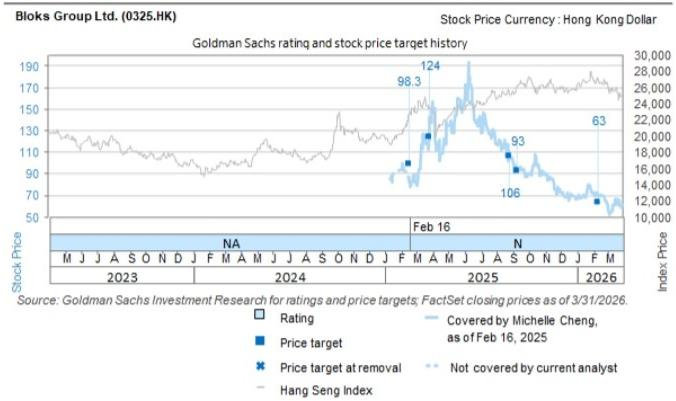

line chart

| Date       | Stock Price | Rating | Price target | Price target at removal | Hang Seng Index | Index Price |
|------------|-------------|--------|--------------|--------------------------|-----------------|-------------|
| Feb 16     | 124         | 98.3   |              |                          |                 |             |
| Feb 16     | 93          |        |              |                          |                 |             |
| Feb 16     | 106         |        |              |                          |                 |             |
| Feb 16     | 63          |        |              |                          |                 |             |
Source: GS Investment Research for ratings and price targets; FactSet closing prices as of 3/31/2026.
Not covered by current analyst

The price targets shown should be considered in the context of all prior published GS, which may or may not have included price targets, as well as developments relating to the company, its industry and financial markets.

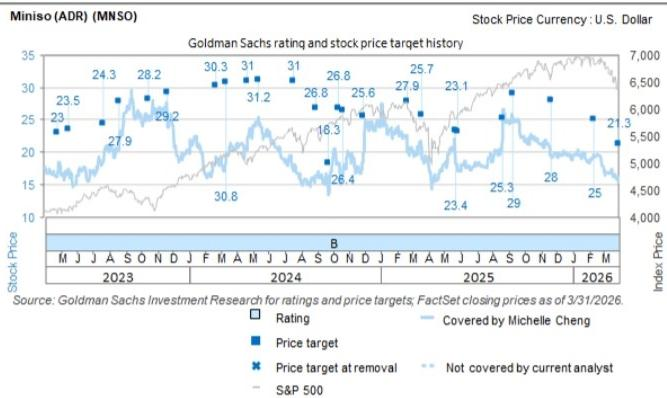

line chart

| Date       | Rating | Price target | Price target at removal | Not covered by current analyst | S&P 500 |
|------------|--------|--------------|--------------------------|----------------------------------|---------|
| 2023 M     | 23     | 23.5         | 23.5                     | -                                | -       |
| 2023 J     | 27.9   | 24.3         | 27.9                     | -                                | -       |
| 2023 A     | 28.2   | 28.2         | 28.2                     | -                                | -       |
| 2023 S     | 29.2   | 29.2         | 29.2                     | -                                | -       |
| 2023 O     | 30.8   | 30.8         | 30.8                     | -                                | -       |
| 2023 N     | 31     | 31           | 31                       | -                                | -       |
| 2023 D     | 31     | 31           | 31                       | -                                | -       |
| 2024 F     | 26.8   | 26.8         | 26.8                     | -                                | -       |
| 2024 M     | 26.4   | 26.4         | 26.4                     | -                                | -       |
| 2024 A     | 18.3   | 18.3         | 18.3                     | -                                | -       |
| 2024 M     | 25.6   | 25.6         | 25.6                     | -                                | -       |
| 2024 J     | 26.8   | 26.8         | 26.8                     | -                                | -       |
| 2024 S     | 27.9   | 27.9         | 27.9                     | -                                | -       |
| 2024 O     | 25.7   | 25.7         | 25.7                     | -                                | -       |
| 2024 N     | 23.1   | 23.1         | 23.1                     | -                                | -       |
| 2024 D     | 23.4   | 23.4         | 23.4                     | -                                | -       |
| 2025 F     | 25.3   | 25.3         | 25.3                     | -                                | -       |
| 2025 M     | 29     | 29           | 29                       | -                                | -       |
| 2025 A     | 28     | 28           | 28                       | -                                | -       |
| 2025 S     | 25     | 25           | 25                       | -                                | -       |
| 2025 O     | 21.3   | 21.3         | 21.3                     | -                                | -       |
| 2025 N     | -      | -            | -                        | -                                | -       |
| 2025 D     | -      | -            | -                        | -                                | -       |
| 2026 J     | -      | -            | -                        | -                                | -       |
| 2026 M     | -      | -            | -                        | -                                | -       |
| 2026 F     | -      | -            | -                        | -                                | -       |
| 2026 M     | -      | -            | -                        | -                                | -       |
Source: GS Investment Research for ratings and price targets; FactSet closing prices as of 3/31/2026.
Index Price Currency: U.S. Dollar
Stock Price Currency: U.S. Dollar

The price targets shown should be considered in the context of all prior published GS, which may or may not have included price targets, as well as developments relating to the company, its industry and financial markets.

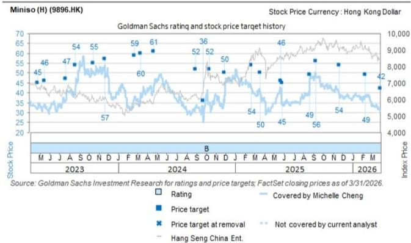

line chart

| Date       | Stock Price | Rating | Price target | Not covered by current analyst | Hang Seng China Ent. |
|------------|-------------|--------|--------------|----------------------------------|----------------------|
| Mar 2023   | 45          |        |              |                                  |                      |
| Jun 2023   | 47          |        |              |                                  |                      |
| Sep 2023   | 54          |        |              |                                  |                      |
| Dec 2023   | 55          |        |              |                                  |                      |
| Mar 2024   | 59          |        |              |                                  |                      |
| Jun 2024   | 61          |        |              |                                  |                      |
| Sep 2024   | 60          |        |              |                                  |                      |
| Dec 2024   | 52          |        |              |                                  |                      |
| Mar 2025   | 56          |        |              |                                  |                      |
| Jun 2025   | 50          |        |              |                                  |                      |
| Sep 2025   | 54          |        |              |                                  |                      |
| Dec 2025   | 50          |        |              |                                  |                      |
| Mar 2026   | 45          |        |              |                                  |                      |
| Jun 2026   | 49          |        |              |                                  |                      |
| Sep 2026   | 56          |        |              |                                  |                      |
| Dec 2026   | 54          |        |              |                                  |                      |
| Mar 2027   | 49          |        |              |                                  |                      |
| Jun 2027   | 42          |        |              |                                  |                      |
Source: GS Investment Research for ratings and price targets; FactSet closing prices as of 3/31/2026.

The price targets shown should be considered in the context of all prior published GS, which may or may not have included price targets, as well as developments relating to the company, its industry and financial markets.

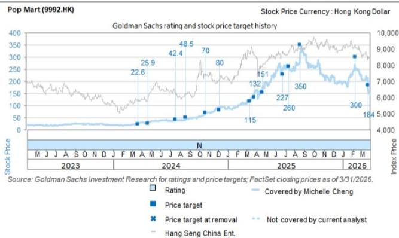  
The price targets shown should be considered in the context of all prior published GS, which may or may not have included price targets, as well as developments relating to the company, its industry and financial markets.

Target price history table(s)  
Miniso (H) (9896.HK)

<table><tr><td>Date of report</td><td>Target price (HK$)</td><td>Closing price (HK$)</td></tr><tr><td>26-May-26</td><td>41.20</td><td>25.96</td></tr><tr><td>31-Mar-26</td><td>42.00</td><td>30.76</td></tr><tr><td>12-Feb-26</td><td>49.00</td><td>38.36</td></tr><tr><td>21-Nov-25</td><td>54.00</td><td>39.22</td></tr><tr><td>11-Sep-25</td><td>56.00</td><td>48.46</td></tr><tr><td>21-Aug-25</td><td>49.00</td><td>39.06</td></tr><tr><td>27-May-25</td><td>45.00</td><td>34.80</td></tr><tr><td>23-May-25</td><td>46.00</td><td>42.25</td></tr><tr><td>21-Mar-25</td><td>50.00</td><td>39.50</td></tr><tr><td>21-Feb-25</td><td>54.00</td><td>42.00</td></tr><tr><td>29-Nov-24</td><td>50.00</td><td>38.70</td></tr><tr><td>13-Oct-24</td><td>52.00</td><td>34.70</td></tr><tr><td>24-Sep-24</td><td>36.00</td><td>25.05</td></tr></table>

Miniso (ADR) (MNSO)

<table><tr><td>Date of report</td><td>Target price ($)</td><td>Closing price ($)</td></tr><tr><td>26-May-26</td><td>21.20</td><td>12.96</td></tr><tr><td>31-Mar-26</td><td>21.30</td><td>16.20</td></tr><tr><td>12-Feb-26</td><td>25.00</td><td>19.09</td></tr><tr><td>21-Nov-25</td><td>28.00</td><td>19.57</td></tr><tr><td>11-Sep-25</td><td>29.00</td><td>25.30</td></tr><tr><td>21-Aug-25</td><td>25.30</td><td>22.17</td></tr><tr><td>27-May-25</td><td>23.10</td><td>17.41</td></tr><tr><td>23-May-25</td><td>23.40</td><td>18.29</td></tr><tr><td>21-Mar-25</td><td>25.70</td><td>18.94</td></tr><tr><td>21-Feb-25</td><td>27.90</td><td>19.99</td></tr><tr><td>29-Nov-24</td><td>25.60</td><td>20.01</td></tr><tr><td>21-Oct-24</td><td>26.40</td><td>16.75</td></tr><tr><td>13-Oct-24</td><td>26.80</td><td>18.08</td></tr></table>

Miniso (H) (9896.HK)

<table><tr><td>Date of report</td><td>Target price (HK$)</td><td>Closing price (HK$)</td></tr><tr><td>30-Aug-24</td><td>52.00</td><td>32.90</td></tr><tr><td>23-Apr-24</td><td>61.00</td><td>42.90</td></tr><tr><td>12-Mar-24</td><td>60.00</td><td>40.05</td></tr><tr><td>21-Feb-24</td><td>59.00</td><td>36.80</td></tr><tr><td>21-Nov-23</td><td>57.00</td><td>54.00</td></tr><tr><td>17-Oct-23</td><td>55.00</td><td>50.90</td></tr><tr><td>22-Aug-23</td><td>54.00</td><td>42.05</td></tr><tr><td>23-Jul-23</td><td>47.00</td><td>36.25</td></tr></table>

Miniso (ADR) (MNSO)

<table><tr><td>Date of report</td><td>Target price ($)</td><td>Closing price ($)</td></tr><tr><td>24-Sep-24</td><td>18.30</td><td>13.40</td></tr><tr><td>30-Aug-24</td><td>26.80</td><td>16.43</td></tr><tr><td>18-Jul-24</td><td>31.00</td><td>17.20</td></tr><tr><td>14-May-24</td><td>31.20</td><td>24.15</td></tr><tr><td>23-Apr-24</td><td>31.00</td><td>22.04</td></tr><tr><td>12-Mar-24</td><td>30.80</td><td>18.22</td></tr><tr><td>21-Feb-24</td><td>30.30</td><td>18.59</td></tr><tr><td>21-Nov-23</td><td>29.20</td><td>24.99</td></tr><tr><td>17-Oct-23</td><td>28.20</td><td>25.60</td></tr><tr><td>22-Aug-23</td><td>27.90</td><td>22.35</td></tr><tr><td>23-Jul-23</td><td>24.30</td><td>18.55</td></tr></table>

Pop Mart (9992.HK)

<table><tr><td>Date of report</td><td>Target price (HK$)</td><td>Closing price (HK$)</td></tr><tr><td>13-May-26</td><td>164.00</td><td>160.90</td></tr><tr><td>25-Mar-26</td><td>184.00</td><td>168.30</td></tr><tr><td>12-Feb-26</td><td>300.00</td><td>252.20</td></tr><tr><td>20-Aug-25</td><td>350.00</td><td>316.00</td></tr><tr><td>15-Jul-25</td><td>260.00</td><td>263.20</td></tr><tr><td>24-Jun-25</td><td>227.00</td><td>252.20</td></tr><tr><td>22-Apr-25</td><td>151.00</td><td>175.90</td></tr><tr><td>26-Mar-25</td><td>132.00</td><td>140.70</td></tr><tr><td>12-Mar-25</td><td>115.00</td><td>116.70</td></tr><tr><td>05-Dec-24</td><td>80.00</td><td>89.70</td></tr><tr><td>23-Oct-24</td><td>70.00</td><td>75.20</td></tr><tr><td>21-Aug-24</td><td>48.50</td><td>46.25</td></tr><tr><td>18-Jul-24</td><td>42.40</td><td>37.65</td></tr><tr><td>22-Apr-24</td><td>25.90</td><td>33.45</td></tr><tr><td>20-Mar-24</td><td>22.60</td><td>24.70</td></tr></table>

Bloks Group Ltd. (0325.HK)

<table><tr><td>Date of report</td><td>Target price (HK$)</td><td>Closing price (HK$)</td></tr><tr><td>12-Feb-26</td><td>63.00</td><td>69.80</td></tr><tr><td>11-Sep-25</td><td>93.00</td><td>92.80</td></tr><tr><td>26-Aug-25</td><td>106.00</td><td>111.10</td></tr><tr><td>27-Mar-25</td><td>124.00</td><td>142.50</td></tr><tr><td>16-Feb-25</td><td>98.30</td><td>87.50</td></tr></table>

Price targets shown in table(s) are unadjusted for corporate actions.

## Regulatory disclosures

## Disclosures required by United States laws and regulations

See company-specific regulatory disclosures above for any of the following disclosures required as to companies referred to in this report: manager or co-manager in a pending transaction; $1\%$ or other ownership; compensation for certain services; types of client relationships; managed/co-managed public offerings in prior periods; directorships; for equity securities, market making and/or specialist role. GS trades or may trade as a principal in debt securities (or in related derivatives) of issuers discussed in this report.

The following are additional required disclosures: Ownership and material conflicts of interest: GS policy prohibits its analysts, professionals reporting to analysts and members of their households from owning securities of any company in the analyst's area of coverage. Analyst compensation: Analysts are paid in part based on the profitability of GS, which includes investment banking revenues. Analyst as officer or director: GS policy generally prohibits its analysts, persons reporting to analysts or members of their households from serving as an officer, director or advisor of any company in the analyst's area of coverage. Non-U.S. Analysts: Non-U.S. analysts may not be associated persons of GS & Co. LLC and therefore may not be subject to FINRA Rule 2241 or FINRA Rule 2242 restrictions on communications with a subject company, public appearances and trading in securities covered by the analysts.

Distribution of ratings: See the distribution of ratings disclosure above. Price chart: See the price chart, with changes of ratings and price targets in prior periods, above, or, if electronic format or if with respect to multiple companies which are the subject of this report, on the GS website at https://www.gs.com/research/hedge.html.

## Additional disclosures required under the laws and regulations of jurisdictions other than the United States

The following disclosures are those required by the jurisdiction indicated, except to the extent already made above pursuant to United States laws and regulations. Australia: GS Australia Pty Ltd and its affiliates are not authorised deposit-taking institutions (as that term is defined in the Banking Act 1959 (Cth)) in Australia and do not provide banking services, nor carry on a banking business, in Australia. This research, and any access to it, is intended only for “wholesale clients” within the meaning of the Australian Corporations Act, unless otherwise agreed by GS. In producing research reports, members of Global Investment Research of GS Australia may attend site visits and other meetings hosted by the companies and other entities which are the subject of its research reports. In some instances the costs of such site visits or meetings may be met in part or in whole by the issuers concerned if GS Australia considers it is appropriate and reasonable in the specific circumstances relating to the site visit or meeting. To the extent that the contents of this document contains any financial product advice, it is general advice only and has been prepared by GS without taking into account a client’s objectives, financial situation or needs. A client should, before acting on any such advice, consider the appropriateness of the advice having regard to the client’s own objectives, financial situation and needs. A copy of certain GS Australia and New Zealand disclosure of interests and a copy of GS’ Australian Sell-Side Research Independence Policy Statement are available at: https://www.goldmansachs.com/disclosures/australia-new-zealand/index.html. Brazil: Disclosure information in relation to CVM Resolution n. 20 is available at https://www.gs.com/worldwide/brazil/area/gir/index.html. Where applicable, the Brazil-registered analyst primarily responsible for the content of this research report, as defined in Article 20 of CVM Resolution n. 20, is the first author named at the beginning of this report, unless indicated otherwise at the end of the text. Canada: This information is being provided to you for information purposes only and is not, and under no circumstances should be construed as, an advertisement, offering or solicitation by GS & Co. LLC for purchasers of securities in Canada to trade in any Canadian security. GS & Co. LLC is not registered as a dealer in any jurisdiction in Canada under applicable Canadian securities laws and generally is not permitted to trade in Canadian securities and may be prohibited from selling certain securities and products in certain jurisdictions in Canada. If you wish to trade in any Canadian securities or other products in Canada please contact GS Canada Inc., an affiliate of The GS Group Inc., or another registered Canadian dealer. Hong Kong: Further information on the securities of covered companies referred to in this research may be obtained on request from GS (Asia) L.L.C. India: Further information on the subject company or companies referred to in this research may be obtained from GS (India) Securities Private Limited, Research Analyst - SEBI Registration Number INH000001493, 10th Floor, Ascent-Worli, Sudam Kalu Ahire Marg, Worli, Mumbai-400 025, India, Corporate Identity Number U74140MH2006FTC160634, Phone +91 22 6616 9000, Fax +91 22 6616 9001. GS may beneficially own 1% or more of the securities (as such term is defined in clause 2 (h) the Indian Securities Contracts (Regulation) Act, 1956) of the subject company or companies referred to in this research report. Investment in securities market are subject to market risks. Read all the related documents carefully before investing. Registration granted by SEBI and certification from NISM in no way guarantee performance of the intermediary or provide any assurance of returns to investors. GS (India) Securities Private Limited compliance officer and investor grievance contact details can be found at: https://www.goldmansachs.com/worldwide/india/documents/Grievance-Redressal-and-Escalation-Matrix.pdf, and a copy of the annual audit compliance report can be found at this link: https://publishing.gs.com/content/site/india-annual-compliance-report.html. Japan: See below. Korea: This research, and any access to it, is intended only for “professional investors” within the meaning of the Financial Services and Capital Markets Act, unless otherwise agreed by GS. Further information on the subject company or companies referred to in this research may be obtained from GS (Asia) L.L.C., Seoul Branch. New Zealand: GS New Zealand Limited and its affiliates are neither “registered banks” nor “deposit takers” (as defined in the Reserve Bank of New Zealand Act 1989) in New Zealand. This research, and any access to it, is intended for “wholesale clients” (as defined in the Financial Advisers Act 2008) unless otherwise agreed by GS. A copy of certain GS Australia and New Zealand disclosure of interests is available at: https://www.goldmansachs.com/disclosures/australia-new-zealand/index.html. Russia: Research reports distributed in the Russian Federation are not advertising as defined in the Russian legislation, but are information and analysis not having product promotion as their main purpose and do not provide appraisal within the meaning of the Russian legislation on appraisal activity. Research reports do not constitute a personalized investment recommendation as defined in Russian laws and regulations, are not addressed to a specific client, and are prepared without analyzing the financial circumstances, investment profiles or risk profiles of clients. GS assumes no responsibility for any investment decisions that may be taken by a client or any other person based on this research report. Singapore: GS (Singapore) Pte. (Company Number: 198602165W), which is regulated by the Monetary Authority of Singapore, accepts legal responsibility for this research, and should be contacted with respect to any matters arising from, or in connection with, this research. Taiwan: This material is for reference only and must not be reprinted without permission. Investors should carefully consider their own investment risk. Investment results are the responsibility of the individual investor. United Kingdom: Persons who would be categorized as retail clients in the United Kingdom, as such term is defined in the rules of the Financial Conduct Authority, should read this research in conjunction with prior GS on the covered companies referred to herein and should refer to the risk warnings that have been sent to them by GS International. A copy of these risks warnings, and a glossary of certain financial terms used in this report, are available from GS International on request.

European Union and United Kingdom: Disclosure information in relation to Article 6 (2) of the European Commission Delegated Regulation (EU) (2016/958) supplementing Regulation (EU) No 596/2014 of the European Parliament and of the Council (including as that Delegated Regulation is implemented into United Kingdom domestic law and regulation following the United Kingdom's departure from the European Union and the European Economic Area) with regard to regulatory technical standards for the technical arrangements for objective presentation of investment recommendations or other information recommending or suggesting an investment strategy and for disclosure of particular interests or indications of conflicts of interest is available at https://www.gs.com/disclosures/europeanpolicy.html which states the European Policy for Managing Conflicts of Interest in Connection with Investment Research.

Japan: GS Japan Co., Ltd. is a Financial Instrument Dealer registered with the Kanto Financial Bureau under registration number Kinsho 69, and a member of Japan Securities Dealers Association, Financial Futures Association of Japan Type II Financial Instruments Firms Association, and Investment Management Association of Japan. Sales and purchase of equities are subject to commission pre-determined with clients plus consumption tax. See company-specific disclosures as to any applicable disclosures required by Japanese stock exchanges, the Japanese Securities Dealers Association or the Japanese Securities Finance Company.

## Ratings, coverage universe and related definitions

Buy (B), Neutral (N), Sell (S) Analysts recommend stocks as Buys or Sells for inclusion on various regional Investment Lists. Being assigned a Buy or Sell on an Investment List is determined by a stock's total return potential relative to its coverage universe. Any stock not assigned as a Buy or a Sell on an Investment List with an active rating (i.e., a stock that is not Rating Suspended, Not Rated, Early-Stage Biotech, Coverage Suspended or Not Covered), is deemed Neutral. Each region manages Regional Conviction Lists, which are selected from Buy rated stocks on the respective region's Investment Lists and represent investment recommendations focused on the size of the total return potential and/or the likelihood of the realization of the return across their respective areas of coverage. The addition or removal of stocks from such Conviction Lists are managed by the Investment Review Committee or other designated committee in each respective region and do not represent a change in the analysts' investment rating for such stocks.

Total return potential represents the upside or downside differential between the current share price and the price target, including all paid or anticipated dividends, expected during the time horizon associated with the price target. Price targets are required for all covered stocks. The total return potential, price target and associated time horizon are stated in each report adding or reiterating an Investment List membership.

Coverage Universe: A list of all stocks in each coverage universe is available by primary analyst, stock and coverage universe at https://www.gs.com/research/hedge.html.

Not Rated (NR). The investment rating, target price and earnings estimates (where relevant) are removed pursuant to GS policy when GS is acting in an advisory capacity in a merger or in a strategic transaction involving this company, when there are legal, regulatory or policy constraints due to GS' involvement in a transaction, and in certain other circumstances. Early-Stage Biotech (ES). An investment rating and a target price are not assigned pursuant to GS policy when this company has neither a drug, treatment or medical device that has passed a Phase II clinical trial nor a license to distribute a post-Phase II drug, treatment or medical device. Rating Suspended (RS). GS has suspended the investment rating and price target for this stock, because there is not a sufficient fundamental basis for determining an investment rating or target price. The previous investment rating and target price, if any, are no longer in effect for this stock and should not be relied upon. Coverage Suspended (CS). GS has suspended coverage of this company. Not Covered (NC). GS does not cover this company.

## Global product; distributing entities

GS Global Investment Research produces and distributes research products for clients of GS on a global basis. Analysts based in GS offices around the world produce research on industries and companies, and research on macroeconomics, currencies, commodities and portfolio strategy. This research is disseminated in Australia by GS Australia Pty Ltd (ABN 21 006 797 897); in Brazil by GS do Brasil Corretora de Títulos e Valores Mobiliários S.A.; Public Communication Channel GS Brazil: 0800 727 5764 and / or contatogoldmanbrasil@gs.com. Available Weekdays (except holidays), from 9am to 6pm. Canal de Comunicação com o Público GS Brasil:

0800 727 5764 e/ou contatogoldmanbrasil@gs.com. Horário de funcionamento: segunda-feira à sexta-feira (exceto feriados), das 9h às 18h; in Canada by GS & Co. LLC; in Hong Kong by GS (Asia) L.L.C.; in India by GS (India) Securities Private Ltd.; in Japan by GS Japan Co., Ltd.; in the Republic of Korea by GS (Asia) L.L.C., Seoul Branch; in New Zealand by GS New Zealand Limited; in Russia by OOO GS; in Singapore by GS (Singapore) Pte. (Company Number: 198602165W); and in the United States of America by GS & Co. LLC. GS International has approved this research in connection with its distribution in the United Kingdom.

GS International (“GSI”), authorised by the Prudential Regulation Authority (“PRA”) and regulated by the Financial Conduct Authority (“FCA”) and the PRA, has approved this research in connection with its distribution in the United Kingdom.

European Economic Area: GS Bank Europe SE ("GSBE") is a credit institution incorporated in Germany and, within the Single Supervisory Mechanism, subject to direct prudential supervision by the European Central Bank and in other respects supervised by German Federal Financial Supervisory Authority (Bundesanstalt für Finanzdienstleistungsaufsicht, BaFin) and Deutsche Bundesbank and disseminates research within the European Economic Area.

## General disclosures

This research is for our clients only. Other than disclosures relating to GS, this research is based on current public information that we consider reliable, but we do not represent it is accurate or complete, and it should not be relied on as such. The information, opinions, estimates and forecasts contained herein are as of the date hereof and are subject to change without prior notification. We seek to update our research as appropriate, but various regulations may prevent us from doing so. Other than certain industry reports published on a periodic basis, the large majority of reports are published at irregular intervals as appropriate in the analyst's judgment.

GS conducts a global full-service, integrated investment banking, investment management, and brokerage business. We have investment banking and other business relationships with a substantial percentage of the companies covered by Global Investment Research. GS & Co. LLC, the United States broker dealer, is a member of SIPC (https://www.sipc.org).

Our salespeople, traders, and other professionals may provide oral or written market commentary or trading strategies to our clients and principal trading desks that reflect opinions that are contrary to the opinions expressed in this research. Our asset management area, principal trading desks and investing businesses may make investment decisions that are inconsistent with the recommendations or views expressed in this research.

The analysts named in this report may have from time to time discussed with our clients, including GS salespersons and traders, or may discuss in this report, trading strategies that reference catalysts or events that may have a near-term impact on the market price of the equity securities discussed in this report, which impact may be directionally counter to the analyst's published price target expectations for such stocks. Any such trading strategies are distinct from and do not affect the analyst's fundamental equity rating for such stocks, which rating reflects a stock's return potential relative to its coverage universe as described herein.

We and our affiliates, officers, directors, and employees will from time to time have long or short positions in, act as principal in, and buy or sell, the securities or derivatives, if any, referred to in this research, unless otherwise prohibited by regulation or GS policy.

The views attributed to third party presenters at GS arranged conferences, including individuals from other parts of GS, do not necessarily reflect those of Global Investment Research and are not an official view of GS.

Any third party referenced herein, including any salespeople, traders and other professionals or members of their household, may have positions in the products mentioned that are inconsistent with the views expressed by analysts named in this report.

This research is not an offer to sell or the solicitation of an offer to buy any security in any jurisdiction where such an offer or solicitation would be illegal. It does not constitute a personal recommendation or take into account the particular investment objectives, financial situations, or needs of individual clients. Clients should consider whether any advice or recommendation in this research is suitable for their particular circumstances and, if appropriate, seek professional advice, including tax advice. The price and value of investments referred to in this research and the income from them may fluctuate. Past performance is not a guide to future performance, future returns are not guaranteed, and a loss of original capital may occur. Fluctuations in exchange rates could have adverse effects on the value or price of, or income derived from, certain investments.

Certain transactions, including those involving futures, options, and other derivatives, give rise to substantial risk and are not suitable for all investors. Investors should review current options and futures disclosure documents which are available from GS sales representatives or at https://www.theocc.com/about/publications/character-risks.jsp and https://www.goldmansachs.com/disclosures/cftc\_fcm\_disclosures. Transaction costs may be significant in option strategies calling for multiple purchase and sales of options such as spreads. Supporting documentation will be supplied upon request.

Differing Levels of Service provided by Global Investment Research: The level and types of services provided to you by GS Global Investment Research may vary as compared to that provided to internal and other external clients of GS, depending on various factors including your individual preferences as to the frequency and manner of receiving communication, your risk profile and investment focus and perspective (e.g., marketwide, sector specific, long term, short term), the size and scope of your overall client relationship with GS, and legal and regulatory constraints. As an example, certain clients may request to receive notifications when research on specific securities is published, and certain clients may request that specific data underlying analysts' fundamental analysis available on our internal client websites be delivered to them electronically through data feeds or otherwise. No change to an analyst's fundamental research views (e.g., ratings, price targets, or material changes to earnings estimates for equity securities), will be communicated to any client prior to inclusion of such information in a research report broadly disseminated through electronic publication to our internal client websites or through other means, as necessary, to all clients who are entitled to receive such reports.

All research reports are disseminated and available to all clients simultaneously through electronic publication to our internal client websites. Not all research content is redistributed to our clients or available to third-party aggregators, nor is GS responsible for the redistribution of our research by third party aggregators. For research, models or other data related to one or more securities, markets or asset classes (including related services) that may be available to you, please contact your GS representative or go to https://research.gs.com.

Disclosure information is also available at https://www.gs.com/research/hedge.html or from Research Compliance, 200 West Street, New York, NY 10282.

## © 2026 GS.

You are permitted to store, display, analyze, modify, reformat, and print the information made available to you via this service only for your own use. You may not resell or reverse engineer this information to calculate or develop any index for disclosure and/or marketing or create any other derivative works or commercial product(s), data or offering(s) without the express written consent of GS. You are not permitted to publish, transmit, or otherwise reproduce this information, in whole or in part, in any format to any third party without the express written consent of GS. This foregoing restriction includes, without limitation, using, extracting, downloading or retrieving this information, in whole or in part, to train or finetune a machine learning or artificial intelligence system, or to provide or reproduce this information, in whole or in part, as a prompt or input to any such system.