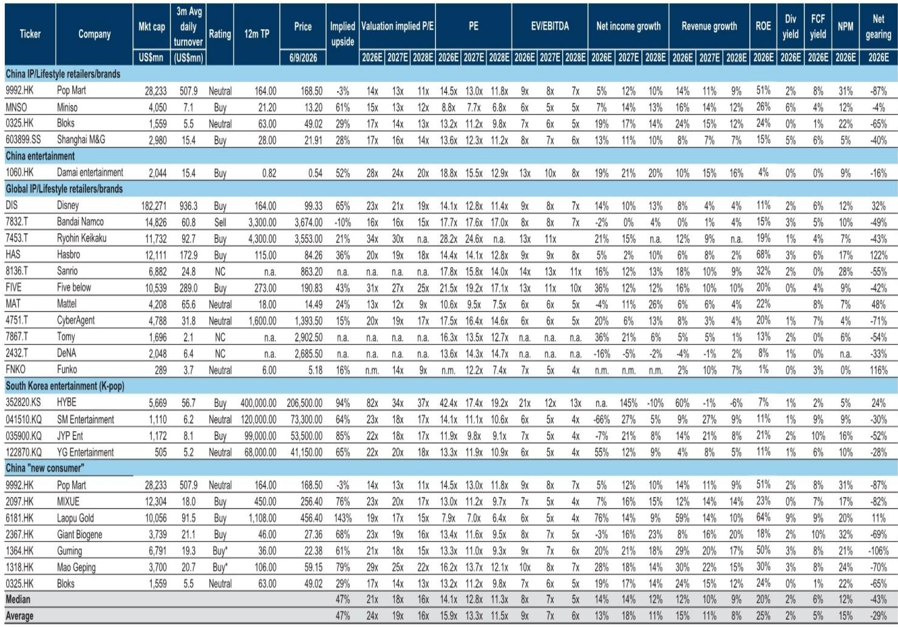
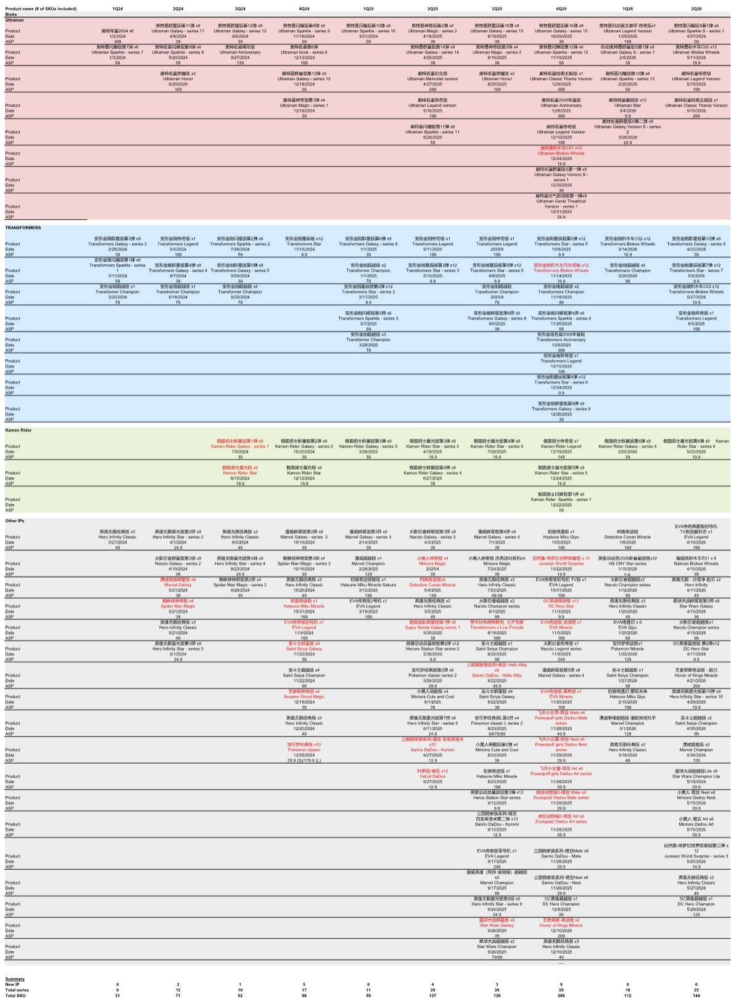
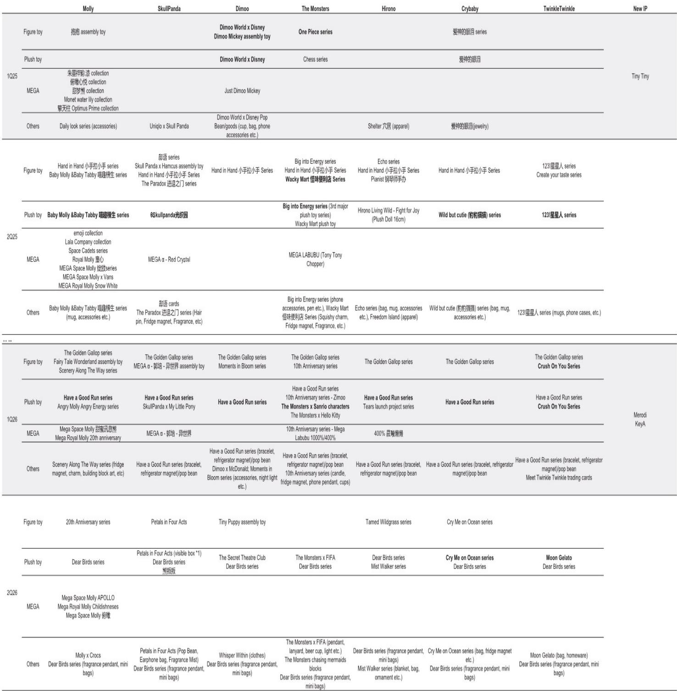

# China’s IP Retailers Are Entering a Crucial Stress Test: The Base-Effect Mirage Is Fading

The narrative around China’s IP-powered consumer economy has been dominated by a single, compelling story: that the combination of global pop culture, collectible toys, and savvy retail execution is creating a durable growth category. For the better part of two years, companies like Pop Mart and Miniso delivered numbers that seemed to defy the broader consumer slowdown. But the latest data from May and early June 2026 suggests that the easy phase of this story is over. The growth deceleration now visible across Pop Mart’s domestic online channels, the softening secondary market premiums for once-hot IPs, and the increasingly challenging year-over-year comparisons facing both Pop Mart and Miniso in their US operations all point to a single conclusion: the sector is entering a stress test that will separate companies with genuine IP ecosystems from those riding a wave of novelty.

The core insight from the May update is not that growth has stopped, but that its character has changed. Pop Mart’s combined Tmall and Douyin sales grew 29% year-over-year in May, a sharp deceleration from the 95% growth recorded in April. This is not a crash, but it is a clear signal that the explosive adoption phase driven by Labubu’s viral momentum is giving way to a more mature, and more demanding, operating environment. The question investors must now answer is whether these companies can sustain premium growth rates as the base effects normalize and consumer attention fragments.

## The Deceleration in Pop Mart’s Domestic Online Sales Reveals a Structural Shift, Not Just a Calendar Quirk

The temptation is to attribute the slowdown to the high base created by last year’s Labubu “Big Into Energy” series launch. That explanation is valid for the month-on-month comparison, but it misses the deeper pattern. When you examine the broader trajectory, the sequential deceleration from 115% year-over-year growth in the first quarter of 2026 to 56% in the second quarter to date is too large to be explained by base effects alone. Something more fundamental is at play.

The secondary market data provides the most honest read on IP heat. For Labubu, the average discount on sample SKUs has expanded to between 30% and 45%, a slight widening from April. The FIFA plush pendant, which was expected to benefit from World Cup buzz, is trading at a roughly 15% discount. This is not the behavior of a franchise that is gaining cultural momentum. It is the behavior of a franchise where supply is meeting, or exceeding, demand at current price points. The Google search trends and secondary market indicators did not show meaningful improvement in May, according to the data tracked. This suggests that the marketing efforts, including Labubu’s appearance in a high-profile music video with 13.6 million YouTube views, have not yet translated into renewed purchase intent.

The implication is straightforward: Pop Mart’s domestic business is moving from a demand-pull model, where scarcity and hype drove rapid sell-through, to a supply-push model, where the company must actively stimulate demand through new product introductions and marketing. The performance of recent launches confirms this shift. The Dear Birds multi-IP series, which debuted in May, recorded over 32,000 units on Douyin and over 10,000 on Tmall, but it remained available as of June 8. Compare that to the previous multi-IP series, “Have a Good Run,” which sold out quickly and recorded over 200,000 units on Douyin in its first month. The difference is not marginal; it is an order of magnitude. Similarly, new plush toy series from Crybaby and Hacipupu did not sell out in their first few days, while Zsiga’s new series did sell out on Douyin. This divergence matters because it shows that the “Pop Mart effect” is no longer automatic. Consumers are becoming more selective.

## The US Market Is a Tale of Two Trajectories, and the Second Half of 2026 Will Be the Real Test

If the domestic story is about deceleration, the US story is about the difficulty of building a durable international business from a base of viral hits. Pop Mart’s US credit card sales declined 36% year-over-year in May, a slight improvement from the 43% decline in April, but still deeply negative. The improvement is attributable to an easier prior-year base, and the report explicitly warns that the comparison base will become more challenging heading into June. This is a critical nuance: the improvement is mechanical, not organic.

The secondary market data in the US reinforces this concern. Labubu’s average discount remained stable at around 50% in May, with an initial dip followed by a recovery. A 50% discount is not a healthy market for a collectible. It suggests that the initial wave of US demand, which was driven by scarcity and social media virality, has been met with sufficient supply that the premium has evaporated. The Google search trends were largely stable, and app monthly active users recovered sequentially, which is a positive signal. But stable search trends and a recovery in app usage do not, by themselves, translate into sales growth if the conversion rate is declining.

Miniso’s US performance offers a more encouraging but equally nuanced picture. Its US credit card sales grew 31% year-over-year in May, accelerating from 19% in April. This acceleration is impressive, but it must be read against the same base-effect dynamic. The second-quarter-to-date growth of 26% represents a deceleration from the first quarter’s roughly 50% growth. The question is whether Miniso can maintain this momentum as the base normalizes. The company’s rapid IP rollout strategy, which included in-house IPs like Yoyo and collaborations with major franchises like Star Wars and Toy Story, is clearly driving traffic. But the broader macroeconomic context is becoming less supportive.

The report references a data point from a diversified US retailer that reported a strong first quarter but issued cautious guidance for the second half of the year, citing macro uncertainty. That retailer’s management noted they did not see data suggesting a trade-down in consumer behavior, but they kept guidance unchanged for the second half. This is a mixed signal. It suggests that US consumer spending on discretionary items like collectibles and toys is holding up for now, but companies are not confident enough to raise expectations. For Pop Mart and Miniso, this implies that the US market may provide steady, but not accelerating, growth in the near term. The tariff environment, which has been a tailwind for some retailers, may also shift, adding another layer of uncertainty.

## The Product Innovation Cycle Is Now the Primary Driver of Growth, and the Data Shows Which IPs Are Working

One of the most actionable insights from the May update is the divergence in performance across different IPs and product types. This is not a uniform slowdown. It is a market that is rewarding specific execution choices and punishing others.

For Pop Mart, the data shows that new product launches are no longer guaranteed to sell out. The Dear Birds series, despite being a multi-IP launch, did not generate the same frenzy as earlier series. This suggests that the novelty of the “blind box” format may be wearing thin for some consumer segments, or that the specific IP combinations in Dear Birds did not resonate as strongly as earlier offerings. In contrast, Zsiga’s new plush toy series sold out on Douyin, indicating that this IP still has strong pull with a specific audience. The secondary market data reinforces this: only a few non-secret SKUs from the new series are trading at single-digit to low-teens premiums, while the rest are at discounts. This is a market that is becoming more discerning.

For Bloks, the picture is more positive but still concentrated. The company accelerated its product launches in the second quarter, increasing the number of series and SKUs both year-over-year and quarter-over-quarter. The data from Tmall flagship store sales shows that most adult IPs saw sequential sales volume increases in May, with the notable exception of Pokemon. The Kamen Rider (Legend) series, in particular, has shown strong momentum, with sales value increasing significantly from April to May. This suggests that Bloks is successfully tapping into nostalgia-driven demand for specific anime and gaming franchises. However, the reliance on a few core IPs, such as Kamen Rider and Ultraman, creates concentration risk. If consumer interest in these franchises wanes, or if the licensing terms become less favorable, the growth trajectory could reverse quickly.

For Miniso, the strategy of rapid IP rollout is showing results, but the quality of the IP partnerships matters. The company’s collaboration with Chiikawa x Sanrio and the appearance of its Yoyo IP at the Met Gala are examples of high-visibility marketing that can drive brand awareness. The Labor Day sales growth of high-teens year-over-year, which outperformed overall retail sales, is a clear positive. But the deceleration in online sales from 43% year-over-year in the first quarter to 21% in May, even if partly due to a higher base, indicates that the company is not immune to the broader trend of normalizing growth.

## What the Report Does Not Fully Answer Yet: The Durability of IP Ecosystems in a Normalizing Demand Environment

The report provides a detailed snapshot of sales momentum, product launches, and secondary market pricing, but it leaves several critical questions unresolved. The most important of these is whether the current deceleration is a cyclical pause or the beginning of a structural slowdown.

The report does not provide sufficient data on consumer demographics or repeat purchase rates. Are the same consumers buying multiple new series, or is the market being driven by first-time buyers who may not return? The fact that several new series did not sell out quickly suggests that the latter may be the case. If the addressable market for collectible toys in China is approaching a saturation point, then the growth rates we have seen over the past two years may not be replicable.

Another unresolved question is the impact of the World Cup on Labubu’s momentum. The report notes that the FIFA plush pendant saw a deeper discount in May, and that market focus is on whether the World Cup can restore momentum. But the data from Google trends and secondary markets did not show meaningful improvement after the music video appearance. This raises the possibility that the Labubu IP has peaked in terms of cultural relevance, at least in the near term. If the World Cup does not provide a significant boost, the company may need to develop a new hero IP to drive the next growth phase.

Finally, the report does not fully address the competitive dynamics in the US market. Pop Mart and Miniso are both expanding rapidly, but they are also facing competition from domestic US retailers and other international players. The data on credit card sales is useful, but it does not capture market share dynamics or the impact of new entrants. A deeper analysis of the US competitive landscape would be valuable for investors trying to assess the long-term potential of these companies in the world’s largest consumer market.

## A Decision Framework for Investors: How to Assess IP Retailers in the Current Environment

Given the complexity of the data, investors need a structured way to evaluate these companies. The following framework, derived from the patterns in the May update, can help separate signal from noise.

First, assess the health of the IP pipeline. The data shows that not all IPs are created equal. Investors should track the sell-through rates of new series within the first week of launch, the secondary market premiums for new SKUs, and the diversity of IPs that are generating strong demand. A company that can consistently launch multiple IPs that sell out quickly and trade at premiums is demonstrating genuine IP ecosystem strength. A company that relies on one or two hero IPs, and sees those IPs’ secondary market discounts widening, is at greater risk.

Second, monitor the trajectory of online sales growth relative to the base. The year-over-year comparisons are heavily distorted by the explosive growth of 2024 and 2025. Investors should focus on sequential growth rates and on the trend in sales volumes, not just sales value. If volumes are declining even as value holds steady due to price increases, that is a warning sign. The data on Douyin run-rates for Pop Mart, which show June lagging behind May, is exactly the kind of leading indicator that deserves attention.

Third, evaluate the international expansion strategy through the lens of local market dynamics. The US market is not a monolith, and the performance of these companies varies significantly by channel and by region. The fact that Pop Mart’s US credit card sales are still declining year-over-year, even as Miniso’s are growing, suggests that brand positioning and product assortment matter. Investors should look for evidence that these companies are building local supply chains, marketing to local tastes, and gaining traction beyond the Chinese diaspora.

Fourth, consider the macro risk. The report notes that consumer sentiment in the US has fallen to record lows, and that G10 consumers face headwinds from higher energy prices and mixed labor markets. Discretionary spending on collectibles is not immune to a broader consumer retrenchment. Investors should stress-test their assumptions about revenue growth under different macro scenarios, including a mild recession in the US or a prolonged slowdown in China.

## The Full Report Contains the Charts and Granular Data That Make These Trends Actionable

The analysis above is based on the data points and trends visible in the May update, but the full report contains the charts and exhibits that allow for a deeper, more granular assessment. The bar charts showing Pop Mart’s online sales growth by quarter, the line charts tracking secondary market premiums for individual IPs, and the stacked bar charts showing Bloks’ sales volume by franchise are not decorative. They are analytical tools that reveal the underlying momentum of each business.

For example, the chart showing Pop Mart’s US credit card sales by quarter makes the deceleration visually unmistakable. The chart showing Labubu’s resale prices for specific series, such as the Sanrio and FIFA collaborations, allows investors to track the impact of specific product launches on secondary market sentiment. The chart showing the secondary market prices for multiple IPs, including Hirono, Molly, Skullpanda, and Crybaby, reveals which IPs are holding value and which are losing their premium. These are the data points that turn a qualitative narrative into a quantitative investment thesis.

Join the community to read the full report and review the original charts.

*This article is for learning and discussion only and does not constitute investment advice.*

Personal reading notes and learning share only. Not investment advice.

