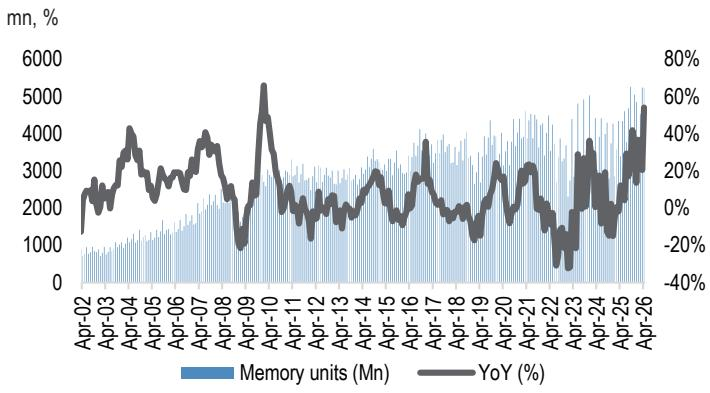

# The Semiconductor Cycle Has Entered a New Regime: This Is Not a Repeat of 2021

For the first time in over three decades, global semiconductor revenue growth has accelerated for eight consecutive months, reaching 106% year-on-year in April. That figure is not a typo. It represents the highest growth rate since 1994, and it is being driven by something fundamentally different from the demand pull-forward that characterized the pandemic-era boom. The current cycle is not about inventory restocking, work-from-home PC purchases, or supply chain normalization. It is about a structural reallocation of global capital into artificial intelligence infrastructure, and the semiconductor industry is now the bottleneck through which that capital must flow.

The April data from WSTS reveals a market that has crossed a threshold. Revenue growth is no longer being driven by memory alone. Logic semiconductors grew 33% year-on-year, accelerating from 25% in March. Memory surged 359%. But the critical shift is in the composition of demand. Unit growth for logic semiconductors reached 14% year-on-year, the highest in recent months, while overall semiconductor units grew 15%. This is not just a pricing story. Real volume is expanding. The narrative that the industry is merely riding an ASP wave misses the point: the volume growth is being pulled by demand for leading-edge compute, AI accelerators, and the memory that feeds them.

The implications for investors and strategists are profound. The cycle that began as a memory-driven recovery has matured into a broad-based expansion that touches foundry capacity, equipment spending, and peripheral chip demand. The question is no longer whether the cycle is real. It is whether the industry has the physical capacity to meet demand, and what happens when it does not.

## The Leading-Edge Bottleneck Is Real, and It Is Getting Tighter

The April data makes one thing unambiguous: the supply-demand gap for leading-edge logic is not hypothetical. It is measurable, and it is widening. N3 process technology is becoming the primary choke point for AI accelerators. The next generation of chips from major AI players--including NVIDIA Rubin, Google TPU v8t/i, and AWS Trn 3--are all expected to adopt N3. The demand-supply gap for N3 in 2026 is now estimated at approximately 600,000 wafers, representing USD 15 to 18 billion in foundry revenue that cannot be fulfilled at current capacity.

This is not a temporary mismatch. It reflects a structural imbalance between the pace of process technology adoption and the speed at which foundries can add capacity. The capital expenditure required to close this gap is enormous, and the lead times are measured in years. Even as foundries invest aggressively, the tightness is expected to persist well into 2027 or early 2028. The implication is that pricing power at the leading edge is shifting. Hot-run and super-hot-run pricing has already moved up. Regular N3 pricing has remained stable so far, but that may change as the gap widens.

For companies that depend on leading-edge capacity, this creates a strategic imperative. Securing wafer allocation is no longer a procurement function. It is a competitive advantage. Companies that lock in capacity early will have the ability to ship products when their competitors cannot. This dynamic is already visible in the server CPU market, where demand has seen recent upside due to the boom in agentic AI. The server CPU space, which had been relatively stable, is now experiencing a demand surge that is adding further pressure to an already tight supply chain.

## Memory Is No Longer a Commodity Cycle. It Is an AI Infrastructure Play

The memory segment has been the headline driver of semiconductor growth, and the April data reinforces that dominance. Memory revenue grew 359% year-on-year, and memory units surged 54% year-on-year. But the narrative that this is simply a cyclical upswing in commodity DRAM and NAND is misleading. The memory cycle has been fundamentally reshaped by the emergence of high-bandwidth memory as a critical component of AI infrastructure.

The allocation of DRAM wafer starts to HBM is projected to rise from 24% in 2026 to 31% by 2028. Over the same period, HBM bit installation demand is expected to grow at a compound annual rate of 85%. This means that an increasing share of memory production capacity is being diverted away from conventional DRAM and toward HBM. The result is a structural tightening of conventional DRAM supply, even as total memory output expands. The supply-demand gap for conventional memory is expected to worsen over the next three years, not because of underinvestment, but because the industry is prioritizing a higher-value product.

The pricing implications are significant. Memory prices are expected to increase 220 to 250% year-on-year in 2026. For 2027, the outlook is for more stable pricing, supported by a rising mix of long-term agreement contracts. But the real tension lies in the pricing relationship between HBM and non-HBM memory. The dollar-per-bit crossover between the two is approaching a point where memory makers are likely to become vocal about raising HBM ASPs. A 10% year-on-year increase in like-for-like HBM pricing, or a 30% increase on a blended basis, is now being discussed. This would represent a significant shift in the economics of memory production and would further reinforce the structural nature of the current upcycle.

## The Capex Supercycle Is Underway, But It Comes with Its Own Risks

The capital expenditure required to support this demand is staggering. Memory spending alone is now forecast at USD 450 billion over the next three years, up from a prior estimate of USD 300 billion. DRAM wafer starts per month are expected to reach 2.8 million by the end of 2028, an increase of 880,000 from the end of 2025. Critically, 60% of incremental wafer start capacity is being directed toward HBM. This is not a diversified expansion. It is a concentrated bet on one product category.

The scale of this investment raises an uncomfortable question: what happens if the demand for AI infrastructure decelerates? The current capex plans are predicated on continued growth in CSP spending. The top four US cloud service providers are now indicating 80% year-on-year growth in total capex for 2026. If that growth slows, the industry could face significant overcapacity in HBM and leading-edge logic. The lead times for semiconductor equipment mean that capacity decisions made today will come online in 2028 and 2029. By then, the demand environment could look very different.

This is not an argument against the current cycle. It is an argument for discipline. The companies that will emerge strongest from this period are those that balance the need to invest with the recognition that cycles do turn. The equipment suppliers that serve the memory and foundry segments are clear beneficiaries of the current capex wave. But investors should be attentive to the point at which capacity additions begin to outpace demand growth. That inflection point is not visible in the current data, but it will arrive at some point, and the lead times in this industry mean that the signals will appear well before the capacity comes online.

## What the Report Does Not Fully Answer: The Demand Elasticity Question

The WSTS data and the analysis built upon it provide a comprehensive picture of supply-side dynamics. The capacity constraints, the pricing trends, and the capex plans are well documented. What is less clear is the demand elasticity at current pricing levels. The semiconductor industry is experiencing ASP increases that are historically unprecedented. Memory ASPs surged 198% year-on-year in April. Logic ASPs rose 18%. The question that remains unanswered is at what point these price increases begin to suppress demand.

For AI accelerators, the answer may be never, or at least not in the near term. The cost of compute is a fraction of the total cost of building and operating AI models. A 20% increase in chip prices has a negligible impact on the economics of a data center. But for consumer electronics, the calculus is different. The report notes that rising memory costs in the second half of 2026 pose a downside risk to consumer electronics demand. Smartphones, PCs, and other devices face margin pressure when component costs rise sharply. If memory prices continue their current trajectory, the impact on end-market demand could be material.

The report also highlights that iPhone shipments grew 9% year-on-year while overall smartphone shipments declined 11% in the second quarter of 2026. This suggests that premium segments are resilient, but the mid- to low-end market is under pressure. The question is whether the premium segment is large enough to sustain the current growth trajectory for memory and logic. If consumer demand weakens further, the industry could face a situation where AI-driven demand remains strong, but the broader market softens, creating a two-tier dynamic that complicates capacity planning.

## A Decision Framework for Navigating the Cycle

For investors and corporate strategists, the current environment demands a framework that separates structural trends from cyclical noise. The following four questions can serve as a guide.

First, where in the value chain does your exposure sit? The dynamics at the leading edge are fundamentally different from those at mature nodes. Leading-edge foundry capacity is tight and getting tighter. Mature-node capacity, particularly 8-inch wafer production, is seeing demand from AI peripheral products such as PMICs and power discrete components, but it also faces headwinds from tepid consumer electronics demand. The risk-reward profile is different at each node, and strategies that treat the entire semiconductor industry as a monolith will miss the nuance.

Second, what is your time horizon? The supply-demand tightness at the leading edge is expected to persist into 2027 or 2028. For investors with a two- to three-year horizon, the direction of travel is clear. For those with a longer view, the question is whether the current capex wave will create oversupply in the 2029-2030 timeframe. The memory industry has a long history of overbuilding during upcycles and suffering the consequences. The current cycle may be different because it is driven by structural AI demand, but the history of the industry suggests caution.

Third, are you positioned for the equipment and materials beneficiaries? The capex supercycle creates direct demand for semiconductor equipment and materials. The report highlights specific beneficiaries among equipment suppliers and packaging companies. But the equipment cycle is not a simple linear extrapolation of chip demand. Equipment orders tend to peak before chip revenue peaks, and the lead times in the equipment industry mean that revenue recognition lags orders. Understanding the timing of equipment cycle inflection points is critical.

Fourth, what is your exposure to memory pricing? Memory has become the dominant driver of semiconductor revenue growth, and it is also the most volatile segment. The current pricing environment is favorable, but the industry has a tendency to add capacity aggressively when prices are high. The allocation of wafer starts to HBM provides some insulation, but it also concentrates risk. A slowdown in AI demand would hit memory harder than logic, because memory has fewer end-market diversifications.

## The Full Picture Requires the Data You Cannot See Here

The April WSTS data tells a compelling story, but it is a story that is still being written. The charts in the full report reveal the trajectory of revenue, units, and ASPs over time, and they show patterns that cannot be fully captured in text. The acceleration in memory revenue from 269% year-on-year in March to 359% in April is visible in the data. The steady climb in logic semiconductor revenue from the mid-20s to 33% is there. The unit growth inflection from 9% to 14% in logic is a critical signal.

These are the details that matter for making informed decisions. The analysis presented here provides the framework and the argument. The data in the full report provides the evidence. If you are serious about understanding where the semiconductor cycle is heading, the charts are not optional. They are essential.

Join the community to read the full report and review the original charts.

*This article is for learning and discussion only and does not constitute investment advice.*

Personal reading notes and learning share only. Not investment advice.

