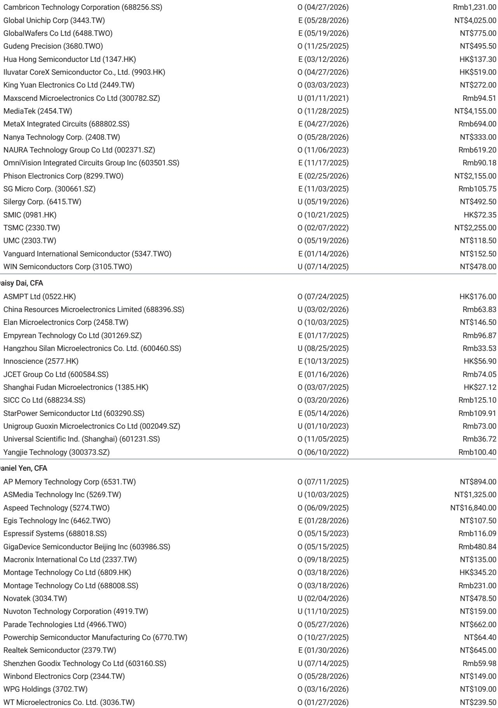
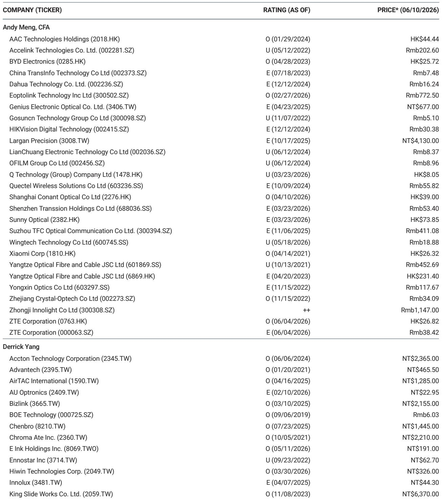
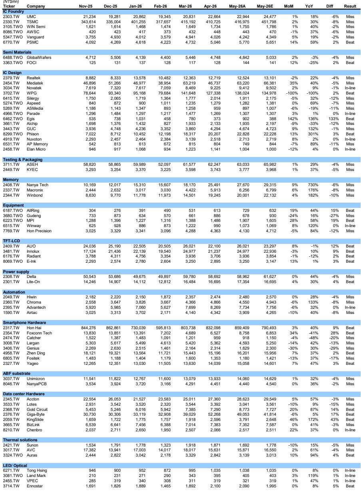

# 摩根斯坦利：AI需求的结构性韧性正在重塑台湾科技股的定价逻辑

五月营收数据出炉，台湾科技板块整体同比增长39%，环比增长4%，表面上是AI需求持续抵消消费电子季节性疲软的又一个佐证。但这份摩根斯坦利研报真正值得关注的信号，不是总量增长本身，而是增长质量的分化：数据中心硬件和智能手机供应链超出预期，而IC代工全线miss。这意味着市场此前对AI溢价的定价逻辑可能需要重新校准——真正受益的不是所有与AI沾边的环节，而是那些具备订单可见性优势或产业链议价权的公司。

这份报告发布后，台湾加权指数和相关科技股已累计上涨11%，但摩根斯坦利的推荐清单却高度集中：MediaTek、Macronix、Delta、Bizlink、Accton、Wiwynn、Yageo、Zhen Ding。这八只股票的共同特征，并非同属AI赛道，而是各自在供应链中拥有不可替代的位置或清晰的订单能见度。换言之，市场正在从一个“AI概念普涨”的阶段，进入一个“AI业绩必须兑现”的阶段。

以下是我们从这份研报中提炼出的五个核心洞察，以及一个报告尚未完全回答的关键问题。

## 1. IC代工集体miss揭示的不是需求问题，而是产能定价权的再分配

五月营收中，IC代工板块成为最突出的低于预期区域。台积电、联电、世界先进、力积电等主要代工厂无一例外地miss了市场预期，其中台积电5月营收416,975百万新台币，低于预期的451,798百万新台币，miss幅度达8%。联电同样miss 6%，世界先进miss 2%，力积电是唯一beat的例外，但幅度仅有2%。

这些数据合在一起意味着什么？不是AI需求减弱了，而是代工环节的产能紧张程度正在缓解。台积电的miss尤其值得关注——作为全球最先进的制程供应商，其营收连续低于预期可能暗示两个结构性变化：其一，AI芯片客户正在将部分订单从先进制程向更成熟的制程迁移，以优化成本结构；其二，非AI领域的消费电子、车用芯片需求复苏速度慢于预期，导致代工厂的产能利用率未能达到市场乐观假设。

对投资者而言，这意味着过去两年“代工厂因产能紧缺而享有定价权”的逻辑正在松动。代工环节的议价能力正在从卖方市场向买方市场缓慢倾斜。那些依赖代工产能的IC设计公司，反而可能因此获得成本改善的空间。

## 2. 数据中心硬件超预期，但超额收益正在向“能见度”集中

与代工板块形成鲜明对比的是，数据中心硬件成为五月营收的最大亮点之一。Gold Circuit beat预期14%，KingSlide beat幅度高达43%，Giga-Byte beat 17%，Hon Precision虽然miss但营收同比增长84%。这些数据的共同指向是：AI基础设施投资仍在加速，且已经从GPU采购阶段扩展到网络、散热、连接器、PCB等配套环节。

但摩根斯坦利在推荐清单中并未覆盖所有数据中心硬件公司，而是选择了Accton、Bizlink、Wiwynn。这三家公司的共同特征是什么？Accton是网络交换设备供应商，Bizlink是高速连接器厂商，Wiwynn是服务器系统集成商——它们都处于AI数据中心建设中“必须经过”的节点，且订单能见度通常超过两到三个季度。

这意味着，数据中心硬件的增长故事已经不再是一个“所有参与者都受益”的Beta故事，而是一个需要判断“谁在供应链中不可替代”的Alpha故事。随着AI基础设施投资从爆发期进入持续建设期，订单能见度将成为区分股价表现的核心变量。

## 3. 智能手机供应链的beat信号值得深挖：不是周期复苏，是结构替换

五月营收中，智能手机供应链同样出现了超出预期的数据。鸿海（Hon Hai）营收859,409百万新台币，beat预期9%，同比增长40%；臻鼎（Zhen Ding）beat 2%，同比增长37%；国巨（Yageo）beat 3%，同比增长47%。这些数据放在消费电子传统淡季的背景下，显得格外突出。

市场通常将这类数据解读为“消费电子需求回暖”，但这份研报的隐含判断可能更为精准：智能手机供应链的强劲表现，更多来自于AI手机带来的结构替换需求，而非整体市场的周期性复苏。MediaTek营收环比增长35%、同比增长40%，虽然miss预期5%，但绝对增速仍然惊人。这背后是AI手机芯片渗透率快速提升，而非传统手机销量的全面反弹。

对产业观察者而言，这意味着智能手机供应链的投资逻辑正在经历一次根本性切换：从“跟随手机销量周期”转向“跟随AI芯片渗透率”。那些能够提供AI手机芯片、高密度PCB、高性能被动元件的公司，正在享受一个独立于手机大盘的结构性增长曲线。

## 4. 报告尚未完全回答的关键问题：AI需求能否持续支撑当前估值溢价

尽管五月营收数据整体强劲，但一个无法回避的问题是：当前台湾科技股的估值溢价是否已经充分反映了这些增长？台湾加权指数自5月4日以来已上涨11%，而同期营收增速为4%环比、39%同比。股价涨幅远超营收环比增速，这意味着市场已经在为未来几个季度的增长提前定价。

报告本身并未直接回答估值是否合理的问题，但它提供了一个重要的观察框架：摩根斯坦利推荐的股票并非营收增速最高的公司，而是那些“具备健康订单可见性或领先地位”的公司。这实际上是在暗示，市场正在从“买增长”切换到“买确定性”。那些订单能见度低、依赖一次性订单或概念炒作的股票，可能面临估值回调的风险。

这个问题的答案，取决于AI基础设施投资的可持续性。如果AI需求在2026年下半年出现任何放缓迹象，当前估值溢价中最脆弱的部分将是那些订单能见度不足半年的公司。反之，如果AI需求持续超预期，则当前估值可能仍有上行空间。

## 5. 投资者的观察框架：从“AI概念”转向“AI业绩兑现”

基于这份研报的数据和判断，投资者可以建立一个三层筛选框架来重新审视台湾科技股：

第一层，识别订单能见度。那些能够提供未来两到三个季度订单指引的公司，比那些依赖市场传闻或分析师预测的公司更值得关注。报告中的推荐清单——MediaTek、Macronix、Delta、Bizlink、Accton、Wiwynn、Yageo、Zhen Ding——几乎全部符合这一特征。

第二层，判断供应链位置。在AI产业链中，哪些环节是“必须经过”的？哪些环节可以被替代？代工厂的miss已经表明，即使台积电这样的龙头也无法完全避免产能利用率波动。而那些处于网络、连接、散热、被动元件等不可替代节点的公司，其营收稳定性更强。

第三层，评估估值与增长的匹配度。营收增速高不等于股价有上行空间。当一家公司营收增长40%但股价已上涨50%，其超额收益空间已经大幅收窄。关键问题是：当前股价是否已经反映了未来两到三个季度的增长预期？

这三个层次叠加起来，可以帮助投资者在看似同涨同跌的AI板块中，识别出真正具备持续增长能力的标的。

## 6. 一个尚未完全展开的伏笔：消费电子“季节性疲软”是否被低估

报告提到“AI需求抵消了消费电子的季节性放缓”，但并未深入拆解消费电子疲软的程度。从数据来看，部分消费电子相关公司的营收表现确实令人担忧：Catcher营收同比下降48%，Largan虽然同比增长42%但miss预期13%，Genius miss幅度高达29%，Fositek miss 17%。

这些数据是否只是季节性因素？还是消费电子需求正在经历一次更深层次的下滑？报告没有给出明确答案。但一个合理的推演是：如果消费电子需求在2026年下半年进一步恶化，那些同时服务于AI和消费电子两个市场的公司，其整体营收增速可能面临向下修正的风险。

这个问题之所以重要，是因为许多台湾科技公司并非纯粹的AI概念股，而是同时覆盖多个终端市场。当AI需求增长放缓时，消费电子的疲软将不再是“被抵消”的问题，而是“叠加”的问题。

---

**欢迎来星球微信群里继续讨论**：上述五个洞察中，哪一个最可能在未来三个月被市场验证？IC代工的miss是短期波动还是长期趋势转折？数据中心硬件的订单能见度如何进一步拆解？这些问题的答案，需要结合更完整的原始数据、图表和摩根斯坦利的估值模型才能得出。我们已在星球微信群中上传了这份研报的完整版PDF，以及分析师对重点公司的详细评级和价格目标。欢迎加入，一起追踪AI产业链的业绩兑现节奏。

Personal reading notes and learning share only. Not investment advice.

