# China Consumer: Raw Materials Price Chartbook | Asia Pacific

# Raw Materials Price Movements (May-26) and Stock Implications

In last month's summary of key raw material price trends and implications for relevant Hong Kong/China consumer stocks, we highlight the uptick in tin and copper prices, while PET and gold prices declined.

## Implications for stocks

Yili (600887.SS, OW), Mengniu (2319.HK, OW): We expect raw milk prices to gradually stabilize in 2026, and we see more balanced supply-demand dynamics in 2026. Both Mengniu and Yili target liquid milk to resume growth in 2026, and expect market share gains from smaller players amid potential recovery of raw milk prices. On the other hand, provisions for inventory will likely be largely reduced in 2026, which should benefit net margin.

WH Group (288.HK, OW): Unit returns for packaged meat could remain elevated amid lower hog prices in China, which reduce raw material costs for downstream operations – the company's core business in the market. In the US, upstream operations benefit from sustained high hog prices, while downstream businesses continue to improve product mix and operating efficiency.

More on the next page...

MS ASIA LIMITED+

## Lillian Lou

Equity Analyst

Lillian.Lou@morganstanley.com +852 2848-6502

## Dustin Wei

Equity Analyst

Dustin.Wei@morganstanley.com +852 2239-7823

MS TAIWAN LIMITED+

## Terence Cheng

Equity Analyst

Terence.Cheng@morganstanley.com +886 2 2730-2873

MS ASIA LIMITED+

## Hildy Ling

Equity Analyst

Hildy.Ling@morganstanley.com +852 2239-7834

## Jenny Yu

Research Associate

Jenny.Yu1@morganstanley.com +852 3963-1925

MS TAIWAN LIMITED+

## Jenny Ting

Research Associate

Jenny.Ting@morganstanley.com +886 2 2730-2995

MS ASIA LIMITED+

## Carlos Liu, CFA

Research Associate

Carlos.Liu@morganstanley.com +852 2848-5206

## Asia Summer School 2026

## CHINA/HONG KONG CONSUMER

Asia Pacific

Industry View In-Line

MS does and seeks to do business with companies covered in MS. As a result, investors should be aware that the firm may have a conflict of interest that could affect the objectivity of MS. Investors should consider MS as only a single factor in making their investment decision.

## For analyst certification and other important disclosures, refer to the Disclosure Section, located at the end of this report.

+= Analysts employed by non-U.S. affiliates are not registered with FINRA, may not be associated persons of the member and may not be subject to FINRA restrictions on communications with a subject company, public appearances and trading securities held by a research analyst account.

## Further implications for stocks

= Muyuan (002714.SZ/2714.HK, OW): Despite near-term earnings pressure, a continued decline in hog prices should accelerate industry capacity rationalization and bring forward a price inflection, which we expect around mid-2026. As the industry leader, we believe Muyuan is well positioned to benefit and capture greater upside once hog prices recover.

= Eastroc (605499.SS/9980.HK, OW): Eastroc benefits from lock-in of PET costs for full-year 2026 and sugar cost for \~six months at prices below last year's level. Energy drink and Water Boost growth momentum as well as other key SKUs performance are the keys to watch amid intense market competition.

=/- Tingyi (0322.HK, EW) and Uni-President China (0220.HK, EW): Beverages – PET prices stay elevated alongside rising oil prices. We expect pressure to emerge from late 2Q-3Q onward on Tingyi and UPC's beverage segment margins. Noodles – Higher palm oil and wheat prices could weigh on margins but should be largely manageable, in our view. Competitive dynamics going into summer peak in the beverage segment remain a key determinant of performance in 2026.

= Beer companies (1876.HK, 0291.HK, 0168.HK, 600600.SS, 600132.SS, 000729.SZ): Overall cost pressure remains manageable, in our view, as other raw material costs have stayed relatively steady despite higher aluminum prices. We expect improved ASP trends – driven by a more favorable channel mix, reduced consumer promotions, and a shift toward mid-range products – to offset the impact.

=Laopu (6181.HK, OW): Gold price decline might drag consumer demand for fixed price gold jewelry products, which Laopu is 100% exposed to. This could be partially offset by improving margin given lower raw material costs. Stock sentiment might remain under pressure in near-term as capital market turn skeptical on demand vs. long-term growth potential via brand building.

## China Consumer: Order of Preference

Exhibit 1: China Consumer: Order of Preference

<table><tr><td></td><td>Yili 600887.SS</td><td>Mengniu 2319.HK</td><td>WH 0288.HK</td><td>Laopu 6181.HK</td><td>Muyuan 002714.SZ</td><td>Eastroc 605499.SS</td><td>CRB 0291.HK</td><td>Bud APAC 1876.HK</td><td>Tsingtao 600600.SS</td><td>UPC 0220.HK</td><td>Tingyi 0322.HK</td><td>Yanjing 000729.SZ</td><td>Chongqing 600132.SS</td></tr><tr><td>Rating</td><td>Overweight</td><td>Overweight</td><td>Overweight</td><td>Overweight</td><td>Overweight</td><td>Overweight</td><td>Overweight</td><td>Overweight</td><td>Equal-Weight</td><td>Equal-Weight</td><td>Equal-Weight</td><td>Underweight</td><td>Underweight</td></tr><tr><td>Reporting Currency</td><td>CNY</td><td>CNY</td><td>USD</td><td>CNY</td><td>CNY</td><td>CNY</td><td>CNY</td><td>USD</td><td>CNY</td><td>CNY</td><td>CNY</td><td>CNY</td><td>CNY</td></tr><tr><td>Trading Currency</td><td>CNY</td><td>HKD</td><td>HKD</td><td>HKD</td><td>CNY</td><td>CNY</td><td>HKD</td><td>HKD</td><td>CNY</td><td>HKD</td><td>HKD</td><td>CNY</td><td>CNY</td></tr><tr><td>Price Target</td><td>33.00</td><td>20.00 HKD</td><td>12.70 HKD</td><td>1,010.00 HKD</td><td>57.00</td><td>223.00</td><td>35.00 HKD</td><td>9.00 HKD</td><td>66.00</td><td>9.20 HKD</td><td>13.50 HKD</td><td>10.90</td><td>42.00</td></tr><tr><td>Current Price</td><td>25.12</td><td>16.12</td><td>8.79</td><td>456.40</td><td>34.23</td><td>133.20</td><td>23.32</td><td>6.87</td><td>59.59</td><td>7.45</td><td>11.75</td><td>11.14</td><td>48.70</td></tr><tr><td>Upside /(Downside) %</td><td>31%</td><td>24%</td><td>44%</td><td>121%</td><td>67%</td><td>67%</td><td>50%</td><td>31%</td><td>11%</td><td>23%</td><td>15%</td><td>-2%</td><td>-14%</td></tr><tr><td>Market Cap (US$ mn)</td><td>22,696 USD</td><td>7,982 USD</td><td>14,397</td><td>9,063 USD</td><td>52,598 USD</td><td>26,490 USD</td><td>9,658 USD</td><td>11,595</td><td>10,356 USD</td><td>4,108 USD</td><td>8,455 USD</td><td>4,629 USD</td><td>3,475 USD</td></tr><tr><td>Average Daily Traded Vol (US$mn)</td><td>198.3</td><td>48.8</td><td>43.9</td><td>95.6</td><td>308.3</td><td>125.4</td><td>34.1</td><td>14.1</td><td>51.5</td><td>11.6</td><td>27.2</td><td>67.9</td><td>35.5</td></tr><tr><td>Bull Case Value</td><td>39.00</td><td>26.00 HKD</td><td>14.00 HKD</td><td>1,675.00 HKD</td><td>74.00</td><td>271.00</td><td>41.00 HKD</td><td>10.90 HKD</td><td>104.00</td><td>13.90 HKD</td><td>17.60 HKD</td><td>18.70</td><td>71.00</td></tr><tr><td>Upside %</td><td>55%</td><td>61%</td><td>59%</td><td>267%</td><td>116%</td><td>103%</td><td>76%</td><td>59%</td><td>75%</td><td>87%</td><td>50%</td><td>68%</td><td>46%</td></tr><tr><td>Bear Case Value</td><td>18.00</td><td>10.40 HKD</td><td>8.00 HKD</td><td>550.00 HKD</td><td>23.00</td><td>119.00</td><td>20.00 HKD</td><td>5.20 HKD</td><td>46.00</td><td>6.30 HKD</td><td>7.30 HKD</td><td>8.70</td><td>35.00</td></tr><tr><td>Downside %</td><td>-28%</td><td>-35%</td><td>-9%</td><td>21%</td><td>-33%</td><td>-11%</td><td>-14%</td><td>-24%</td><td>-23%</td><td>-15%</td><td>-38%</td><td>-22%</td><td>-28%</td></tr><tr><td>Risk/Reward Skew</td><td>1.95</td><td>1.73</td><td>6.59</td><td>-13.02</td><td>3.54</td><td>9.70</td><td>5.33</td><td>2.41</td><td>3.27</td><td>5.61</td><td>1.31</td><td>3.10</td><td>1.63</td></tr><tr><td colspan="14">MS Estimates</td></tr><tr><td colspan="14">FY26e</td></tr><tr><td>Sales</td><td>120,192 e</td><td>86,795 e</td><td>29,140 e</td><td>42,263 e</td><td>130,538 e</td><td>26,050 e</td><td>39,778 e</td><td>5,909 e</td><td>33,156 e</td><td>33,244 e</td><td>81,362 e</td><td>14,787 e</td><td>13,896 e</td></tr><tr><td>Net Profit</td><td>12,321 e</td><td>4,784 e</td><td>1,668 e</td><td>8,080 e</td><td>15,153 e</td><td>5,807 e</td><td>6,056 e</td><td>640 e</td><td>4,917 e</td><td>2,185 e</td><td>4,446 e</td><td>1,810 e</td><td>1,260 e</td></tr><tr><td>EPS</td><td>1.95 e</td><td>1.23 e</td><td>0.12 e</td><td>45.81 e</td><td>2.63 e</td><td>7.91 e</td><td>1.87 e</td><td>0.05 e</td><td>3.60 e</td><td>0.51 e</td><td>0.79 e</td><td>0.64 e</td><td>2.60 e</td></tr><tr><td colspan="14">FY27e</td></tr><tr><td>Sales</td><td>126,514 e</td><td>90,398 e</td><td>30,096 e</td><td>49,626 e</td><td>143,737 e</td><td>31,937 e</td><td>41,604 e</td><td>6,117 e</td><td>34,894 e</td><td>34,645 e</td><td>83,613 e</td><td>15,380 e</td><td>14,070 e</td></tr><tr><td>Net Profit</td><td>13,366 e</td><td>5,376 e</td><td>1,727 e</td><td>9,463 e</td><td>27,334 e</td><td>6,865 e</td><td>6,631 e</td><td>707 e</td><td>5,411 e</td><td>2,431 e</td><td>4,759 e</td><td>1,916 e</td><td>1,327 e</td></tr><tr><td>EPS</td><td>2.11 e</td><td>1.38 e</td><td>0.13 e</td><td>53.66 e</td><td>4.74 e</td><td>9.35 e</td><td>2.04 e</td><td>0.05 e</td><td>3.97 e</td><td>0.56 e</td><td>0.84 e</td><td>0.68 e</td><td>2.74 e</td></tr><tr><td colspan="14">FY26e MSe vs. Consensus Mean</td></tr><tr><td>Sales</td><td>(1.0%)</td><td>0.4%</td><td>0.2%</td><td>(0.3%)</td><td>3.3%</td><td>1.3%</td><td>1.1%</td><td>(0.8%)</td><td>0.3%</td><td>(0.3%)</td><td>0.3%</td><td>(7.7%)</td><td>(6.7%)</td></tr><tr><td>Net Profit</td><td>(0.1%)</td><td>(3.6%)</td><td>0.4%</td><td>(3.7%)</td><td>115.8%</td><td>5.5%</td><td>3.7%</td><td>2.6%</td><td>2.1%</td><td>(0.9%)</td><td>(1.0%)</td><td>(9.3%)</td><td>(0.1%)</td></tr><tr><td>EPS</td><td>(0.1%)</td><td>(3.6%)</td><td>0.4%</td><td>(3.7%)</td><td>115.8%</td><td>5.5%</td><td>3.7%</td><td>2.6%</td><td>2.1%</td><td>(0.9%)</td><td>(1.0%)</td><td>(9.3%)</td><td>(0.1%)</td></tr><tr><td colspan="14">FY27e MSe vs. Consensus Mean</td></tr><tr><td>Sales</td><td>(0.6%)</td><td>0.4%</td><td>0.6%</td><td>(0.3%)</td><td>(5.1%)</td><td>4.7%</td><td>2.7%</td><td>(0.5%)</td><td>3.0%</td><td>(0.9%)</td><td>0.5%</td><td>(7.9%)</td><td>(7.5%)</td></tr><tr><td>Net Profit</td><td>0.2%</td><td>(2.4%)</td><td>0.1%</td><td>(3.4%)</td><td>(5.1%)</td><td>5.6%</td><td>6.3%</td><td>3.0%</td><td>6.6%</td><td>3.5%</td><td>(0.4%)</td><td>(16.0%)</td><td>0.8%</td></tr><tr><td>EPS</td><td>0.2%</td><td>(2.4%)</td><td>0.1%</td><td>(3.4%)</td><td>(5.1%)</td><td>5.6%</td><td>6.3%</td><td>3.0%</td><td>6.6%</td><td>3.5%</td><td>(0.4%)</td><td>(16.0%)</td><td>0.8%</td></tr></table>

Source: FactSet, MS estimates. Note: Current prices as of the market close on Jun 9, 2026.

## Key Charts of the Month

Exhibit 2: PET Prices (Weekly)  
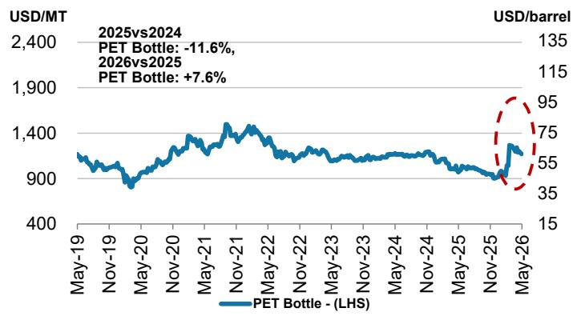

line chart

| Date     | USD/MT | Volume (USD/barrel) |
|----------|--------|---------------------|
| May-19   | ~1,000 | ~135                |
| Nov-19   | ~900   | ~135                |
| May-20   | ~1,000 | ~135                |
| Nov-20   | ~1,200 | ~135                |
| May-21   | ~1,400 | ~135                |
| Nov-21   | ~1,300 | ~135                |
| May-22   | ~1,200 | ~135                |
| Nov-22   | ~1,100 | ~135                |
| May-23   | ~1,000 | ~135                |
| Nov-23   | ~950   | ~135                |
| May-24   | ~900   | ~135                |
| Nov-24   | ~850   | ~135                |
| May-25   | ~800   | ~135                |
| Nov-25   | ~750   | ~135                |
| May-26   | ~95    | ~135                |

Source: Bloomberg, MS.

Exhibit 3: Hog/Piglet/Pork Price (Weekly)  
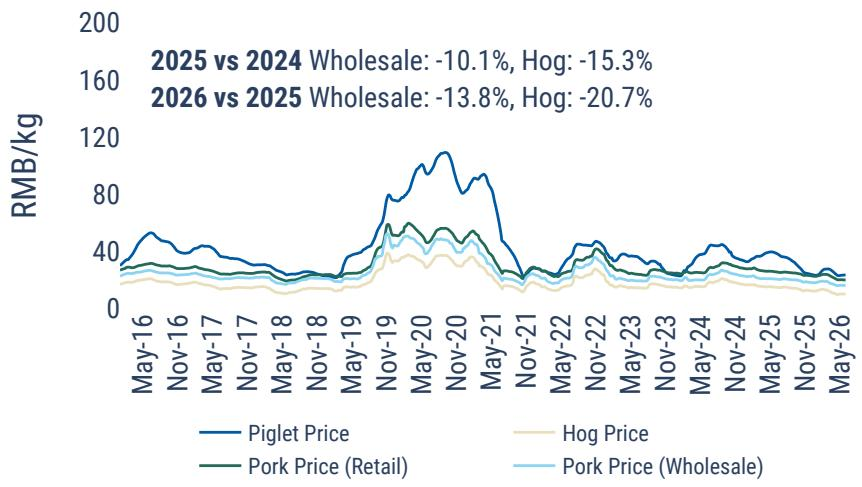

line chart

| Date    | Piglet Price | Pork Price (Retail) | Pork Price (Wholesale) | Hog Price |
|---------|--------------|---------------------|-------------------------|-----------|
| May-16  | ~40          | ~30                 | ~25                     | ~20       |
| Nov-16  | ~50          | ~35                 | ~30                     | ~25       |
| May-17  | ~45          | ~35                 | ~25                     | ~20       |
| Nov-17  | ~40          | ~30                 | ~25                     | ~15       |
| May-18  | ~35          | ~25                 | ~20                     | ~15       |
| Nov-18  | ~30          | ~20                 | ~15                     | ~10       |
| May-19  | ~40          | ~30                 | ~25                     | ~20       |
| Nov-19  | ~80          | ~60                 | ~50                     | ~40       |
| May-20  | ~110         | ~70                 | ~60                     | ~50       |
| Nov-20  | ~100         | ~65                 | ~55                     | ~45       |
| May-21  | ~85          | ~60                 | ~50                     | ~40       |
| Nov-21  | ~30          | ~25                 | ~20                     | ~15       |
| May-22  | ~40          | ~35                 | ~30                     | ~25       |
| Nov-22  | ~45          | ~40                 | ~35                     | ~30       |
| May-23  | ~40          | ~35                 | ~30                     | ~25       |
| Nov-23  | ~35          | ~30                 | ~25                     | ~20       |
| May-24  | ~40          | ~35                 | ~30                     | ~25       |
| Nov-24  | ~35          | ~30                 | ~25                     | ~20       |
| May-25  | ~30          | ~25                 | ~20                     | ~15       |
| Nov-25  | ~25          | ~20                 | ~15                     | ~10       |
| May-26  | ~20          | ~15                 | ~10                     | ~5        |

Source: Efeedlink, NDRC, MoC, MS.

Exhibit 4: Palm Oil Spot Price (Daily)  
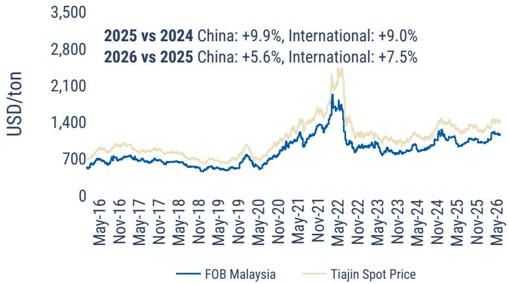

line chart

| Date    | FOB Malaysia | Tiajin Spot Price |
|---------|--------------|-------------------|
| May-16  | ~650         | ~700              |
| Nov-16  | ~700         | ~750              |
| May-17  | ~680         | ~730              |
| Nov-17  | ~670         | ~720              |
| May-18  | ~660         | ~710              |
| Nov-18  | ~650         | ~700              |
| May-19  | ~640         | ~690              |
| Nov-19  | ~630         | ~680              |
| May-20  | ~620         | ~670              |
| Nov-20  | ~610         | ~660              |
| May-21  | ~600         | ~650              |
| Nov-21  | ~590         | ~640              |
| May-22  | ~1,500       | ~2,100            |
| Nov-22  | ~800         | ~1,400            |
| May-23  | ~750         | ~1,300            |
| Nov-23  | ~730         | ~1,250            |
| May-24  | ~740         | ~1,300            |
| Nov-24  | ~760         | ~1,350            |
| May-25  | ~780         | ~1,400            |
| Nov-25  | ~800         | ~1,450            |
| May-26  | ~820         | ~1,500            |

Source: CEIC, Bloomberg, MS.

## China Consumer: Raw Material Price Trends

## Raw Material Price Trends:

China – hogs/pork: China's hog prices were Rmb10.1/kg as of May; prices were up 0.8%

MoM. China's pork retail prices were down 2% MoM in May (vs. down 9% MoM in April), while wholesale pork prices were down 0.2% MoM in May (vs. down 8% MoM in April).

Soybean crush margin: Industry gross margin was down 1.2% MoM in May (vs. down

0.3% MoM in April). This reflects a 0.6% MoM decrease in soybean oil prices, a 2.4% MoM increase soybean meal prices, and a 1.8% MoM increase in US soybean spot prices.

Palm oil: Tianjin spot prices fell 1.3% MoM in May (vs. up 1.3% MoM in April) and are up

1% in YTD2026.

PET: PET prices decreased by 3% MoM in May (vs. up 6% MoM in April) and are up 4% in

YTD2026.

Wheat: China wheat prices decreased by 0.9% MoM in May (vs. up 0.4% MoM in April).

US wheat prices rose 6.3% MoM in May (vs. down 3% MoM in April).

Metals: Copper prices were up 4% MoM in May (vs. up 2% MoM in Apr) and are up 25% in

YTD2026. Aluminum prices were down 1.4% MoM in May (vs. up 2% MoM in Apr) and are

up 17% in YTD2026.

Raw milk: Raw milk prices were Rmb3.03/kg at the end of May, +0.2% MoM (vs. down

0.2% MoM in April) and down 1% in 2026. Raw milk prices have stabilized after supply

cuts upstream, and we expect raw milk price to gradually increase in 2026.

Milk powder: The average whole milk auction price (WMP) rose 2.2% MoM in May (vs.

down 3% MoM in April). YTD2026, the average whole milk auction price is -12% YoY.

Whole milk auction price was US\$3,706 per MT on Jun 2, 2026.

US hogs/pork: US hog futures spot contract prices rose 0.3% MoM in May (vs. down 0.6% MoM in April). The recent futures curve suggests hog prices could move from an average of \~US\$91/cwt in May to \~US\$85/cwt in November.

Sugar: Sugar prices rose 0.7% MoM in May (vs. -1.8% MoM in April) and are down 10% in YTD2026.

US hog-raising profit (unhedged): We estimate an industry gain of US\$7/head in November (based on futures prices for hogs and corn), vs. a gain of US\$25 for each hog in May.

Commodity prices as of May 31, 2026, unless otherwise stated.

Source: Bloomberg, CEIC, MOA, Datastream, GDT, MS.

Note: MoM change based on monthly average price. Percentage changes based on currency quoted.

# Raw Material Price Trends (May 2026)

Exhibit 5: Raw Material Prices – May 2026

<table><tr><td>Commodity</td><td>Current Price</td><td>MoM</td><td>YoY</td><td>2023</td><td>2024</td><td>2025</td><td>2026</td><td>2023 YoY</td><td>2024 YoY</td><td>2025 YoY</td><td>2026 YoY</td><td>3Q25</td><td>4Q25</td><td>1Q26</td><td>2Q26</td><td>3Q26 YoY</td><td>4Q26 YoY</td><td>1Q26 YoY</td><td>2Q26 YoY</td></tr><tr><td>Soybean (U.S.) (US$/ton)</td><td>433.98</td><td>2.4%</td><td>11%</td><td>524.16</td><td>411.47</td><td>386.13</td><td>419.97</td><td>-8%</td><td>-22%</td><td>-6%</td><td>9%</td><td>377.58</td><td>396.37</td><td>410.51</td><td>433.74</td><td>-4%</td><td>8%</td><td>8%</td><td>11%</td></tr><tr><td>Soybean Future (China) (Rmb/ton)</td><td>4,783.00</td><td>0.5%</td><td>16%</td><td>5,160.30</td><td>4,453.86</td><td>4,071.05</td><td>4,616.32</td><td>-14%</td><td>-14%</td><td>-9%</td><td>13%</td><td>4,093.64</td><td>4,072.88</td><td>4,489.02</td><td>4,797.38</td><td>-9%</td><td>4%</td><td>13%</td><td>16%</td></tr><tr><td>Soybean Oil Future (China) Rmb/ton</td><td>8,493.00</td><td>-1.1%</td><td>8%</td><td>8,266.15</td><td>7,750.15</td><td>8,102.87</td><td>8,398.25</td><td>-20%</td><td>-6%</td><td>5%</td><td>4%</td><td>8,310.67</td><td>8,230.97</td><td>8,310.84</td><td>8,522.56</td><td>9%</td><td>2%</td><td>4%</td><td>8%</td></tr><tr><td>Soybean Meal Future (China) Rmb/ton</td><td>2,825.00</td><td>-0.5%</td><td>2%</td><td>4,084.62</td><td>3,139.61</td><td>2,996.00</td><td>2,963.35</td><td>-4%</td><td>-23%</td><td>-5%</td><td>-1%</td><td>2,980.33</td><td>2,980.85</td><td>3,051.70</td><td>2,837.69</td><td>-2%</td><td>2%</td><td>-4%</td><td>0%</td></tr><tr><td>Wheat (US) (US$/Ton)</td><td>213.33</td><td>6.3%</td><td>18%</td><td>236.80</td><td>210.85</td><td>192.99</td><td>205.54</td><td>-27%</td><td>-11%</td><td>-8%</td><td>7%</td><td>183.29</td><td>188.06</td><td>197.33</td><td>217.49</td><td>-8%</td><td>-9%</td><td>-4%</td><td>11%</td></tr><tr><td>Wheat (China) (RMB/ton)</td><td>2,560.00</td><td>-0.9%</td><td>3%</td><td>3,036.81</td><td>2,705.55</td><td>2,508.08</td><td>2,606.20</td><td>-5%</td><td>-11%</td><td>-7%</td><td>4%</td><td>2,471.29</td><td>2,504.47</td><td>2,592.34</td><td>2,626.36</td><td>-5%</td><td>-2%</td><td>3%</td><td>4%</td></tr><tr><td>Corn (China) (Rmb/ton)</td><td>2,360.00</td><td>0.3%</td><td>4%</td><td>2,729.71</td><td>2,319.79</td><td>2,241.15</td><td>2,354.54</td><td>-2%</td><td>-15%</td><td>-3%</td><td>5%</td><td>2,313.48</td><td>2,210.00</td><td>2,336.09</td><td>2,381.36</td><td>-3%</td><td>4%</td><td>9%</td><td>4%</td></tr><tr><td>Palm Oil (China) (Rmb/ton)</td><td>9,570.00</td><td>-1.3%</td><td>8%</td><td>7,702.73</td><td>8,463.07</td><td>9,290.15</td><td>9,389.63</td><td>-30%</td><td>10%</td><td>10%</td><td>1%</td><td>9,269.39</td><td>8,921.36</td><td>9,182.81</td><td>9,690.45</td><td>15%</td><td>-9%</td><td>-8%</td><td>8%</td></tr><tr><td>Rapeseed Oil (China) Rmb/ton</td><td>10,450.00</td><td>1.0%</td><td>8%</td><td>9,404.46</td><td>8,632.90</td><td>9,541.95</td><td>10,137.59</td><td>-29%</td><td>-8%</td><td>11%</td><td>6%</td><td>9,829.70</td><td>9,983.64</td><td>10,061.72</td><td>10,247.95</td><td>14%</td><td>7%</td><td>14%</td><td>8%</td></tr><tr><td>Sugar (China) (RMB/ton)</td><td>5,340.00</td><td>0.7%</td><td>-13%</td><td>6,860.04</td><td>6,405.76</td><td>5,919.20</td><td>5,350.37</td><td>19%</td><td>-7%</td><td>-8%</td><td>-10%</td><td>5,956.36</td><td>5,575.00</td><td>5,350.31</td><td>5,350.45</td><td>-6%</td><td>-11%</td><td>-11%</td><td>-13%</td></tr><tr><td>Barley China CIF (USD/ton)</td><td>346.21</td><td>1.3%</td><td>12%</td><td>367.40</td><td>311.10</td><td>309.02</td><td>330.96</td><td>-17%</td><td>-15%</td><td>-1%</td><td>7%</td><td>311.86</td><td>311.94</td><td>322.36</td><td>343.46</td><td>0%</td><td>2%</td><td>6%</td><td>11%</td></tr><tr><td>PET (Rmb/MT)</td><td>7,922.00</td><td>-2.6%</td><td>13%</td><td>8,128.00</td><td>8,283.33</td><td>7,320.92</td><td>7,585.65</td><td>-4%</td><td>2%</td><td>-12%</td><td>4%</td><td>7,241.48</td><td>6,733.79</td><td>7,082.14</td><td>8,318.02</td><td>-12%</td><td>-20%</td><td>-12%</td><td>14%</td></tr><tr><td>Tin (RMB/ton)</td><td>423,750.00</td><td>8.9%</td><td>58%</td><td>212,795.19</td><td>247,437.98</td><td>273,094.83</td><td>390,305.56</td><td>-15%</td><td>16%</td><td>10%</td><td>43%</td><td>269,287.88</td><td>299,564.39</td><td>384,687.50</td><td>398,477.27</td><td>4%</td><td>19%</td><td>48%</td><td>51%</td></tr><tr><td>Long Fiber Pulp - China (US$/ton)</td><td>660.00</td><td>-1.5%</td><td>-10%</td><td>750.54</td><td>769.37</td><td>727.04</td><td>677.98</td><td>-21%</td><td>3%</td><td>-6%</td><td>-7%</td><td>690.00</td><td>685.46</td><td>688.13</td><td>664.44</td><td>-10%</td><td>-10%</td><td>-13%</td><td>-11%</td></tr><tr><td>Short Fiber Pulp - China (US$/ton)</td><td>605.55</td><td>0.3%</td><td>10%</td><td>605.08</td><td>643.34</td><td>537.57</td><td>592.09</td><td>-25%</td><td>6%</td><td>-16%</td><td>10%</td><td>503.08</td><td>524.24</td><td>582.81</td><td>604.47</td><td>-22%</td><td>-5%</td><td>2%</td><td>9%</td></tr><tr><td>Raw Milk (Industry) Rmb/kg</td><td>3.03</td><td>0.2%</td><td>-2%</td><td>3.84</td><td>3.33</td><td>3.06</td><td>3.03</td><td>-8%</td><td>-13%</td><td>-8%</td><td>-1%</td><td>3.03</td><td>3.03</td><td>3.03</td><td>3.02</td><td>-5%</td><td>-3%</td><td>-2%</td><td>-1%</td></tr><tr><td>Live Hog - China (Rmb/kg)</td><td>10.12</td><td>0.8%</td><td>-33%</td><td>15.45</td><td>17.06</td><td>14.49</td><td>11.50</td><td>-19%</td><td>10%</td><td>-15%</td><td>-21%</td><td>14.46</td><td>12.51</td><td>12.47</td><td>10.12</td><td>-26%</td><td>-29%</td><td>-22%</td><td>-33%</td></tr><tr><td>Pork Wholesale - China (Rmb/kg)</td><td>16.15</td><td>-0.2%</td><td>-22%</td><td>20.84</td><td>22.52</td><td>20.30</td><td>17.52</td><td>-18%</td><td>8%</td><td>-10%</td><td>-14%</td><td>20.26</td><td>18.48</td><td>18.42</td><td>16.23</td><td>-20%</td><td>-21%</td><td>-16%</td><td>-21%</td></tr><tr><td>Lean Hog Futures - US (US$/cwt)</td><td>90.92</td><td>0.3%</td><td>0%</td><td>81.55</td><td>84.90</td><td>94.37</td><td>88.38</td><td>-17%</td><td>4%</td><td>11%</td><td>-6%</td><td>107.86</td><td>89.37</td><td>86.77</td><td>90.72</td><td>22%</td><td>4%</td><td>1%</td><td>-3%</td></tr><tr><td>White Chicken (Rmb/kg)</td><td>24.87</td><td>0.0%</td><td>-1%</td><td>26.23</td><td>25.31</td><td>24.91</td><td>24.78</td><td>-1%</td><td>-4%</td><td>-2%</td><td>-1%</td><td>24.66</td><td>24.79</td><td>24.79</td><td>24.76</td><td>-2%</td><td>-2%</td><td>-2%</td><td>-1%</td></tr><tr><td>Beef (Rmb/kg)</td><td>66.60</td><td>-0.1%</td><td>5%</td><td>73.96</td><td>63.64</td><td>62.92</td><td>66.29</td><td>-4%</td><td>-14%</td><td>-1%</td><td>5%</td><td>64.66</td><td>66.24</td><td>66.14</td><td>66.52</td><td>7%</td><td>9%</td><td>14%</td><td>6%</td></tr><tr><td>GDT WMP Average</td><td>3,772.00</td><td>2.2%</td><td>-14%</td><td>3,119.65</td><td>3,426.79</td><td>3,848.78</td><td>3,670.60</td><td>-20%</td><td>10%</td><td>12%</td><td>-5%</td><td>3,901.20</td><td>3,464.33</td><td>3,626.80</td><td>3,714.40</td><td>18%</td><td>-8%</td><td>-10%</td><td>-12%</td></tr><tr><td>GDT Average</td><td>4,198.00</td><td>-0.5%</td><td>-9%</td><td>3,316.35</td><td>3,747.34</td><td>4,140.25</td><td>4,052.40</td><td>-22%</td><td>13%</td><td>10%</td><td>-2%</td><td>4,179.60</td><td>3,585.59</td><td>3,961.40</td><td>4,143.40</td><td>11%</td><td>-9%</td><td>-5%</td><td>-7%</td></tr><tr><td>GDT SMP Average</td><td>3,552.00</td><td>4.0%</td><td>26%</td><td>2,679.18</td><td>2,674.14</td><td>2,675.72</td><td>3,218.90</td><td>-30%</td><td>0%</td><td>0%</td><td>20%</td><td>2,702.80</td><td>2,531.33</td><td>2,960.80</td><td>3,477.00</td><td>3%</td><td>-10%</td><td>8%</td><td>24%</td></tr><tr><td>Copper Index</td><td>104,900.00</td><td>4.1%</td><td>33%</td><td>68,414.96</td><td>74,978.55</td><td>80,954.37</td><td>101,366.48</td><td>1%</td><td>10%</td><td>8%</td><td>25%</td><td>79,782.27</td><td>88,630.30</td><td>100,642.03</td><td>102,420.23</td><td>6%</td><td>17%</td><td>31%</td><td>31%</td></tr><tr><td>Aluminum Index</td><td>24,210.00</td><td>-1.4%</td><td>21%</td><td>18,726.69</td><td>19,909.31</td><td>20,696.32</td><td>24,137.78</td><td>-6%</td><td>6%</td><td>4%</td><td>17%</td><td>20,711.36</td><td>21,464.09</td><td>23,899.22</td><td>24,484.77</td><td>6%</td><td>5%</td><td>17%</td><td>21%</td></tr><tr><td>Bronze LME (US$/MT)</td><td>13,599.71</td><td>4.9%</td><td>42%</td><td>8,485.98</td><td>9,146.63</td><td>9,955.51</td><td>12,976.02</td><td>-4%</td><td>8%</td><td>9%</td><td>30%</td><td>9,813.91</td><td>11,138.08</td><td>12,818.19</td><td>13,205.61</td><td>7%</td><td>21%</td><td>37%</td><td>39%</td></tr><tr><td>Gold Spot Price (US$/Troy Ounce)</td><td>4,540.26</td><td>-2.8%</td><td>40%</td><td>1,943.17</td><td>2,388.10</td><td>3,445.11</td><td>4,775.78</td><td>8%</td><td>23%</td><td>44%</td><td>39%</td><td>3,459.03</td><td>4,157.03</td><td>4,861.85</td><td>4,650.58</td><td>40%</td><td>56%</td><td>70%</td><td>41%</td></tr><tr><td>Fiberboard (RMB/Cub m)</td><td>1,283.50</td><td>-2.4%</td><td>8%</td><td>1,265.80</td><td>1,274.69</td><td>1,308.89</td><td>1,317.50</td><td>-3%</td><td>1%</td><td>3%</td><td>1%</td><td>1,336.07</td><td>1,236.05</td><td>1,283.44</td><td>1,365.94</td><td>7%</td><td>-8%</td><td>-6%</td><td>5%</td></tr></table>

Source: Bloomberg, CEIC, MOA, Datastream, MS Note: MoM change based on monthly average price. All % changes are based on currency quoted. Current prices as of May 31, 2026.

## Stock and Key Commodity Exposure

Exhibit 6: Sensitivity Analysis

<table><tr><td rowspan="2" colspan="2"></td><td rowspan="2">Raw Material as % Total COGS (e)</td><td colspan="3">Price Change</td><td colspan="2">2025</td><td colspan="2">2026E</td><td colspan="2">2027E</td></tr><tr><td>2025 YOY</td><td>2026E YOY</td><td>2027E YoY</td><td>+/- Impact on COGS as % of Sales</td><td>Impact on Net Profit</td><td>+/- Impact on COGS as % of Sales (e)</td><td>Impact on Net Profit (e)</td><td>+/- Impact on COGS as % of Sales (e)</td><td>Impact on Net Profit (e)</td></tr><tr><td rowspan="3">Mengniu</td><td>Raw milk</td><td>51%</td><td>-8%</td><td>-1%</td><td>1%</td><td>-2.5%</td><td>41.0%</td><td>-0.3%</td><td>4.6%</td><td>0.3%</td><td>-4.1%</td></tr><tr><td>Paper packaging</td><td>7%</td><td>2%</td><td>-1%</td><td>0%</td><td>0.1%</td><td>-1.7%</td><td>0.0%</td><td>0.7%</td><td>0.0%</td><td>0.0%</td></tr><tr><td></td><td>58%</td><td></td><td></td><td></td><td>-2.4%</td><td>39.3%</td><td>-0.3%</td><td>5.4%</td><td>0.3%</td><td>-4.1%</td></tr><tr><td rowspan="3">Yili</td><td>Raw milk</td><td>56%</td><td>-8%</td><td>-1%</td><td>1%</td><td>-3.0%</td><td>33.6%</td><td>-0.4%</td><td>3.1%</td><td>0.4%</td><td>-3.1%</td></tr><tr><td>Paper packaging</td><td>7%</td><td>2%</td><td>-1%</td><td>0%</td><td>0.1%</td><td>-1.3%</td><td>-0.1%</td><td>0.5%</td><td>0.0%</td><td>0.0%</td></tr><tr><td></td><td>63%</td><td></td><td></td><td></td><td>-2.9%</td><td>32.3%</td><td>-0.4%</td><td>3.6%</td><td>0.4%</td><td>-3.1%</td></tr><tr><td rowspan="5">Tsingtao</td><td>Barley</td><td>17%</td><td>-1%</td><td>7%</td><td>0%</td><td>-0.1%</td><td>0.3%</td><td>0.8%</td><td>-4.0%</td><td>0.0%</td><td>0.0%</td></tr><tr><td>Paper packaging</td><td>13%</td><td>2%</td><td>-1%</td><td>0%</td><td>0.2%</td><td>-1.1%</td><td>-0.1%</td><td>0.5%</td><td>0.0%</td><td>0.0%</td></tr><tr><td>Glass Packaging</td><td>22%</td><td>-11%</td><td>-5%</td><td>0%</td><td>-1.6%</td><td>8.8%</td><td>-0.8%</td><td>3.9%</td><td>0.0%</td><td>0.0%</td></tr><tr><td>Aluminum packaging</td><td>12%</td><td>4%</td><td>18%</td><td>-6%</td><td>0.3%</td><td>-1.7%</td><td>1.4%</td><td>-7.1%</td><td>-0.5%</td><td>2.3%</td></tr><tr><td></td><td>64%</td><td></td><td></td><td></td><td>-1.2%</td><td>6.4%</td><td>1.3%</td><td>-6.8%</td><td>-0.5%</td><td>2.3%</td></tr><tr><td rowspan="5">CRB</td><td>Barley</td><td>20%</td><td>-1%</td><td>7%</td><td>0%</td><td>-0.1%</td><td>0.4%</td><td>0.8%</td><td>-5.8%</td><td>0.0%</td><td>0.0%</td></tr><tr><td>Paper packaging</td><td>13%</td><td>2%</td><td>-1%</td><td>0%</td><td>0.2%</td><td>-1.0%</td><td>-0.1%</td><td>0.6%</td><td>0.0%</td><td>0.0%</td></tr><tr><td>Glass Packaging</td><td>22%</td><td>-11%</td><td>-5%</td><td>0%</td><td>-1.4%</td><td>8.1%</td><td>-0.7%</td><td>4.7%</td><td>0.0%</td><td>0.0%</td></tr><tr><td>Aluminum packaging</td><td>12%</td><td>4%</td><td>18%</td><td>-6%</td><td>0.3%</td><td>-1.6%</td><td>1.2%</td><td>-8.7%</td><td>-0.4%</td><td>2.0%</td></tr><tr><td></td><td>67%</td><td></td><td></td><td></td><td>-1.0%</td><td>5.9%</td><td>1.3%</td><td>-9.2%</td><td>-0.4%</td><td>2.0%</td></tr><tr><td rowspan="5">Yanjing</td><td>Barley</td><td>15%</td><td>-1%</td><td>7%</td><td>0%</td><td>-0.1%</td><td>0.5%</td><td>0.7%</td><td>-4.0%</td><td>0.0%</td><td>0.0%</td></tr><tr><td>Paper packaging</td><td>13%</td><td>2%</td><td>-1%</td><td>0%</td><td>0.2%</td><td>-1.8%</td><td>-0.1%</td><td>0.5%</td><td>0.0%</td><td>0.0%</td></tr><tr><td>Glass Packaging</td><td>22%</td><td>-11%</td><td>-5%</td><td>0%</td><td>-1.6%</td><td>14.3%</td><td>-0.7%</td><td>4.4%</td><td>0.0%</td><td>0.0%</td></tr><tr><td>Aluminum packaging</td><td>12%</td><td>4%</td><td>18%</td><td>-6%</td><td>0.3%</td><td>-2.8%</td><td>1.4%</td><td>-8.1%</td><td>-0.5%</td><td>2.5%</td></tr><tr><td></td><td>62%</td><td></td><td></td><td></td><td>-1.2%</td><td>10.2%</td><td>1.2%</td><td>-7.2%</td><td>-0.5%</td><td>2.5%</td></tr><tr><td rowspan="5">Chongqing</td><td>Barley</td><td>24%</td><td>-1%</td><td>7%</td><td>0%</td><td>-0.1%</td><td>0.3%</td><td>0.9%</td><td>-3.8%</td><td>0.0%</td><td>0.0%</td></tr><tr><td>Paper packaging</td><td>13%</td><td>2%</td><td>-1%</td><td>0%</td><td>0.2%</td><td>-0.8%</td><td>-0.1%</td><td>0.3%</td><td>0.0%</td><td>0.0%</td></tr><tr><td>Glass Packaging</td><td>22%</td><td>-11%</td><td>-5%</td><td>0%</td><td>-1.3%</td><td>6.2%</td><td>-0.6%</td><td>2.6%</td><td>0.0%</td><td>0.0%</td></tr><tr><td>Aluminum packaging</td><td>12%</td><td>4%</td><td>18%</td><td>-6%</td><td>0.3%</td><td>-1.2%</td><td>1.1%</td><td>-4.7%</td><td>-0.4%</td><td>1.6%</td></tr><tr><td></td><td>71%</td><td></td><td></td><td></td><td>-1.0%</td><td>4.6%</td><td>1.3%</td><td>-5.7%</td><td>-0.4%</td><td>1.6%</td></tr><tr><td rowspan="5">Bud APAC</td><td>Barley</td><td>24%</td><td>-1%</td><td>7%</td><td>0%</td><td>-0.1%</td><td>0.4%</td><td>0.9%</td><td>-5.2%</td><td>0.0%</td><td>0.0%</td></tr><tr><td>Paper packaging</td><td>13%</td><td>2%</td><td>-1%</td><td>0%</td><td>0.2%</td><td>-0.8%</td><td>-0.1%</td><td>0.4%</td><td>0.0%</td><td>0.0%</td></tr><tr><td>Glass Packaging</td><td>22%</td><td>-11%</td><td>-5%</td><td>0%</td><td>-1.2%</td><td>6.5%</td><td>-0.6%</td><td>3.5%</td><td>0.0%</td><td>0.0%</td></tr><tr><td>Aluminum packaging</td><td>12%</td><td>4%</td><td>18%</td><td>-6%</td><td>0.2%</td><td>-1.3%</td><td>1.1%</td><td>-6.4%</td><td>-0.4%</td><td>2.1%</td></tr><tr><td></td><td>71%</td><td></td><td></td><td></td><td>-0.9%</td><td>4.8%</td><td>1.3%</td><td>-7.7%</td><td>-0.4%</td><td>2.1%</td></tr><tr><td rowspan="8">Tingyi</td><td>Palm oil</td><td>6%</td><td>10%</td><td>10%</td><td>2%</td><td>0.4%</td><td>-5.0%</td><td>0.4%</td><td>-4.4%</td><td>0.1%</td><td>-0.9%</td></tr><tr><td>Wheat</td><td>8%</td><td>-7%</td><td>4%</td><td>0%</td><td>-0.4%</td><td>5.0%</td><td>0.2%</td><td>-2.2%</td><td>0.0%</td><td>0.0%</td></tr><tr><td>PET</td><td>16%</td><td>-12%</td><td>15%</td><td>-5%</td><td>-1.3%</td><td>16.5%</td><td>1.6%</td><td>-17.8%</td><td>-0.5%</td><td>6.1%</td></tr><tr><td>Sugar</td><td>5%</td><td>-7%</td><td>-10%</td><td>0%</td><td>-0.2%</td><td>3.0%</td><td>-0.3%</td><td>3.2%</td><td>0.0%</td><td>0.0%</td></tr><tr><td>Paper packaging</td><td>10%</td><td>2%</td><td>-1%</td><td>0%</td><td>0.2%</td><td>-2.1%</td><td>-0.1%</td><td>0.8%</td><td>0.0%</td><td>0.0%</td></tr><tr><td>Other packaging</td><td>4%</td><td>NA</td><td>NA</td><td>NA</td><td>NA</td><td>NA</td><td>NA</td><td>NA</td><td>NA</td><td>NA</td></tr><tr><td>Other materials</td><td>18%</td><td>NA</td><td>NA</td><td>NA</td><td>NA</td><td>NA</td><td>NA</td><td>NA</td><td>NA</td><td>NA</td></tr><tr><td>Overall</td><td>67%</td><td></td><td></td><td></td><td>-1.3%</td><td>17.3%</td><td>1.8%</td><td>-20.4%</td><td>-0.4%</td><td>5.2%</td></tr><tr><td rowspan="9">UPC</td><td>Palm oil</td><td>10%</td><td>10%</td><td>10%</td><td>2%</td><td>0.6%</td><td>-7.8%</td><td>0.7%</td><td>-7.4%</td><td>0.1%</td><td>-1.5%</td></tr><tr><td>Wheat</td><td>5%</td><td>-7%</td><td>4%</td><td>0%</td><td>-0.2%</td><td>3.0%</td><td>0.1%</td><td>-1.5%</td><td>0.0%</td><td>0.0%</td></tr><tr><td>PET</td><td>18%</td><td>-12%</td><td>15%</td><td>-5%</td><td>-1.4%</td><td>17.2%</td><td>1.8%</td><td>-19.9%</td><td>-0.6%</td><td>6.8%</td></tr><tr><td>Sugar</td><td>9%</td><td>-7%</td><td>-10%</td><td>0%</td><td>-0.4%</td><td>5.3%</td><td>-0.5%</td><td>6.1%</td><td>0.0%</td><td>0.0%</td></tr><tr><td>Milk powder</td><td>2%</td><td>16%</td><td>-6%</td><td>0%</td><td>0.3%</td><td>-3.1%</td><td>-0.1%</td><td>0.9%</td><td>0.0%</td><td>0.0%</td></tr><tr><td>Paper packaging</td><td>12%</td><td>2%</td><td>-1%</td><td>0%</td><td>0.2%</td><td>-2.3%</td><td>-0.1%</td><td>0.9%</td><td>0.0%</td><td>0.0%</td></tr><tr><td>Other packaging</td><td>5%</td><td>NA</td><td>NA</td><td>NA</td><td>NA</td><td>NA</td><td>NA</td><td>NA</td><td>NA</td><td>NA</td></tr><tr><td>Other materials</td><td>19%</td><td>NA</td><td>NA</td><td>NA</td><td>NA</td><td>NA</td><td>NA</td><td>NA</td><td>NA</td><td>NA</td></tr><tr><td>Overall</td><td>79%</td><td></td><td></td><td></td><td>-1.0%</td><td>12.2%</td><td>1.9%</td><td>-20.8%</td><td>-0.5%</td><td>5.3%</td></tr><tr><td rowspan="3">Nongfu Spring</td><td>PET</td><td>32%</td><td>-12%</td><td>15%</td><td>-5%</td><td>-1.4%</td><td>3.8%</td><td>1.9%</td><td>-4.8%</td><td>-0.6%</td><td>1.6%</td></tr><tr><td>Paper Packaging</td><td>13%</td><td>2%</td><td>-1%</td><td>0%</td><td>0.1%</td><td>-0.3%</td><td>-0.1%</td><td>0.1%</td><td>0.0%</td><td>0.0%</td></tr><tr><td></td><td>45%</td><td></td><td></td><td></td><td>-1.3%</td><td>3.5%</td><td>1.8%</td><td>-4.6%</td><td>-0.6%</td><td>1.6%</td></tr><tr><td rowspan="4">Midea</td><td>Copper</td><td>20%</td><td>8%</td><td>16%</td><td>-10%</td><td>1.2%</td><td>-10.1%</td><td>2.3%</td><td>-20.3%</td><td>-1.5%</td><td>12.8%</td></tr><tr><td>Steel</td><td>18%</td><td>-8%</td><td>-3%</td><td>-5%</td><td>-1.0%</td><td>8.9%</td><td>-0.4%</td><td>3.8%</td><td>-0.7%</td><td>5.8%</td></tr><tr><td>Aluminum</td><td>16%</td><td>4%</td><td>18%</td><td>-6%</td><td>0.5%</td><td>-4.1%</td><td>2.1%</td><td>-18.2%</td><td>-0.7%</td><td>6.2%</td></tr><tr><td></td><td>54%</td><td></td><td></td><td></td><td>1%</td><td>-5%</td><td>4%</td><td>-35%</td><td>-3%</td><td>25%</td></tr><tr><td rowspan="4">Haier</td><td>Copper</td><td>20%</td><td>8%</td><td>16%</td><td>-10%</td><td>1.1%</td><td>-14.4%</td><td>2.3%</td><td>-30.2%</td><td>-1.5%</td><td>19.0%</td></tr><tr><td>Steel</td><td>18%</td><td>-8%</td><td>-3%</td><td>-5%</td><td>-1.0%</td><td>12.7%</td><td>-0.4%</td><td>5.7%</td><td>-0.7%</td><td>8.6%</td></tr><tr><td>Aluminum</td><td>16%</td><td>4%</td><td>18%</td><td>-6%</td><td>0.5%</td><td>-5.8%</td><td>2.1%</td><td>-27.2%</td><td>-0.7%</td><td>9.1%</td></tr><tr><td></td><td>54%</td><td></td><td></td><td></td><td>1%</td><td>-8%</td><td>4%</td><td>-52%</td><td>-3%</td><td>37%</td></tr><tr><td rowspan="4">Gree</td><td>Copper</td><td>20%</td><td>8%</td><td>16%</td><td>-10%</td><td>1.1%</td><td>-5.7%</td><td>2.2%</td><td>-11.1%</td><td>-1.4%</td><td>6.9%</td></tr><tr><td>Steel</td><td>18%</td><td>-8%</td><td>-3%</td><td>-5%</td><td>-1.0%</td><td>5.0%</td><td>-0.4%</td><td>2.1%</td><td>-0.6%</td><td>3.1%</td></tr><tr><td>Aluminum</td><td>16%</td><td>4%</td><td>18%</td><td>-6%</td><td>0.4%</td><td>-2.3%</td><td>2.0%</td><td>-9.9%</td><td>-0.7%</td><td>3.3%</td></tr><tr><td></td><td>54%</td><td></td><td></td><td></td><td>1%</td><td>-3%</td><td>4%</td><td>-19%</td><td>-3%</td><td>13%</td></tr></table>

Source: Bloomberg, CEIC, MoA, MS (E) estimates. Note: 2026e sensitivity is based on 2025 GPM and NPM and estimated commodity pricing change in 2026. 2027e sensitivity is based on implied 2026e GPM/NPM by the current estimate of commodity price change in 2026 and 2027. Implied margin impact based on raw material market price change, rather than actual raw material cost change.

## China – CPI and Food CPI

Exhibit 7: CPI and Food CPI

<table><tr><td></td><td>CPI</td><td>Food CPI</td></tr><tr><td>Jan-20</td><td>5.4%</td><td>20.6%</td></tr><tr><td>Feb-20</td><td>5.2%</td><td>21.9%</td></tr><tr><td>Mar-20</td><td>4.3%</td><td>18.3%</td></tr><tr><td>Apr-20</td><td>3.3%</td><td>14.8%</td></tr><tr><td>May-20</td><td>2.4%</td><td>10.6%</td></tr><tr><td>Jun-20</td><td>2.5%</td><td>11.1%</td></tr><tr><td>Jul-20</td><td>2.7%</td><td>13.2%</td></tr><tr><td>Aug-20</td><td>2.4%</td><td>11.2%</td></tr><tr><td>Sep-20</td><td>1.7%</td><td>7.9%</td></tr><tr><td>Oct-20</td><td>0.5%</td><td>2.2%</td></tr><tr><td>Nov-20</td><td>-0.5%</td><td>-2.0%</td></tr><tr><td>Dec-20</td><td>0.2%</td><td>1.2%</td></tr><tr><td>Jan-21</td><td>-0.3%</td><td>1.6%</td></tr><tr><td>Feb-21</td><td>-0.2%</td><td>-0.2%</td></tr><tr><td>Mar-21</td><td>0.4%</td><td>-0.7%</td></tr><tr><td>Apr-21</td><td>0.9%</td><td>-0.7%</td></tr><tr><td>May-21</td><td>1.3%</td><td>0.3%</td></tr><tr><td>Jun-21</td><td>1.1%</td><td>-1.7%</td></tr><tr><td>Jul-21</td><td>1.0%</td><td>-3.7%</td></tr><tr><td>Aug-21</td><td>0.8%</td><td>-4.1%</td></tr><tr><td>Sep-21</td><td>0.7%</td><td>-5.2%</td></tr><tr><td>Oct-21</td><td>1.5%</td><td>-2.4%</td></tr><tr><td>Nov-21</td><td>2.3%</td><td>1.6%</td></tr><tr><td>Dec-21</td><td>1.5%</td><td>-1.2%</td></tr><tr><td>Jan-22</td><td>0.9%</td><td>-3.8%</td></tr><tr><td>Feb-22</td><td>0.9%</td><td>-1.8%</td></tr><tr><td>Mar-22</td><td>1.5%</td><td>-1.5%</td></tr><tr><td>Apr-22</td><td>2.1%</td><td>1.9%</td></tr><tr><td>May-22</td><td>2.1%</td><td>2.3%</td></tr><tr><td>Jun-22</td><td>2.5%</td><td>2.9%</td></tr><tr><td>Jul-22</td><td>2.7%</td><td>6.3%</td></tr><tr><td>Aug-22</td><td>2.5%</td><td>6.1%</td></tr><tr><td>Sep-22</td><td>2.8%</td><td>8.8%</td></tr><tr><td>Oct-22</td><td>2.1%</td><td>7.0%</td></tr><tr><td>Nov-22</td><td>1.6%</td><td>3.7%</td></tr><tr><td>Dec-22</td><td>1.8%</td><td>4.8%</td></tr><tr><td>Jan-23</td><td>2.1%</td><td>6.2%</td></tr><tr><td>Feb-23</td><td>1.0%</td><td>2.6%</td></tr><tr><td>Mar-23</td><td>0.7%</td><td>2.4%</td></tr><tr><td>Apr-23</td><td>0.1%</td><td>0.4%</td></tr><tr><td>May-23</td><td>0.2%</td><td>1.0%</td></tr><tr><td>Jun-23</td><td>0.0%</td><td>2.3%</td></tr><tr><td>Jul-23</td><td>-0.3%</td><td>-1.7%</td></tr><tr><td>Aug-23</td><td>0.1%</td><td>-1.7%</td></tr><tr><td>Sep-23</td><td>0.0%</td><td>-3.2%</td></tr><tr><td>Oct-23</td><td>-0.2%</td><td>-4.0%</td></tr><tr><td>Nov-23</td><td>-0.5%</td><td>-4.2%</td></tr><tr><td>Dec-23</td><td>-0.3%</td><td>-3.7%</td></tr><tr><td>Jan-24</td><td>-0.8%</td><td>-5.9%</td></tr><tr><td>Feb-24</td><td>0.7%</td><td>-0.9%</td></tr><tr><td>Mar-24</td><td>0.1%</td><td>-2.7%</td></tr><tr><td>Apr-24</td><td>0.3%</td><td>-2.7%</td></tr><tr><td>May-24</td><td>0.3%</td><td>-2.0%</td></tr><tr><td>Jun-24</td><td>0.2%</td><td>-2.1%</td></tr><tr><td>Jul-24</td><td>0.5%</td><td>0.0%</td></tr><tr><td>Aug-24</td><td>0.6%</td><td>2.8%</td></tr><tr><td>Sep-24</td><td>0.4%</td><td>3.3%</td></tr><tr><td>Oct-24</td><td>0.3%</td><td>2.9%</td></tr><tr><td>Nov-24</td><td>0.2%</td><td>1.0%</td></tr><tr><td>Dec-24</td><td>0.1%</td><td>-0.5%</td></tr><tr><td>Jan-25</td><td>0.5%</td><td>0.4%</td></tr><tr><td>Feb-25</td><td>-0.7%</td><td>-3.3%</td></tr><tr><td>Mar-25</td><td>-0.1%</td><td>-1.4%</td></tr><tr><td>Apr-25</td><td>-0.1%</td><td>-0.2%</td></tr><tr><td>May-25</td><td>-0.1%</td><td>0.1%</td></tr><tr><td>Jun-25</td><td>0.1%</td><td>-0.3%</td></tr><tr><td>Jul-25</td><td>0.0%</td><td>-1.6%</td></tr><tr><td>Aug-25</td><td>-0.4%</td><td>-4.3%</td></tr><tr><td>Sep-25</td><td>-0.3%</td><td>-4.4%</td></tr><tr><td>Oct-25</td><td>0.2%</td><td>-2.9%</td></tr><tr><td>Nov-25</td><td>0.7%</td><td>0.2%</td></tr><tr><td>Dec-25</td><td>0.8%</td><td>1.1%</td></tr><tr><td>Jan-26</td><td>0.2%</td><td>-0.7%</td></tr><tr><td>Feb-26</td><td>1.3%</td><td>1.7%</td></tr><tr><td>Mar-26</td><td>1.0%</td><td>0.3%</td></tr><tr><td>Apr-26</td><td>1.2%</td><td>-1.6%</td></tr><tr><td>May-26</td><td>1.2%</td><td>-1.7%</td></tr><tr><td>2013</td><td>2.6%</td><td>4.7%</td></tr><tr><td>2014</td><td>2.0%</td><td>3.1%</td></tr><tr><td>2015</td><td>1.4%</td><td>2.3%</td></tr><tr><td>2016</td><td>2.0%</td><td>4.6%</td></tr><tr><td>2017</td><td>1.6%</td><td>-1.4%</td></tr><tr><td>2018</td><td>2.1%</td><td>1.8%</td></tr><tr><td>2019</td><td>2.9%</td><td>9.3%</td></tr><tr><td>2020</td><td>2.5%</td><td>10.9%</td></tr><tr><td>2021</td><td>0.9%</td><td>-1.4%</td></tr><tr><td>2022</td><td>2.0%</td><td>3.1%</td></tr><tr><td>2023</td><td>0.2%</td><td>-0.3%</td></tr><tr><td>2024</td><td>0.2%</td><td>-0.6%</td></tr><tr><td>2025</td><td>0.1%</td><td>-1.4%</td></tr></table>

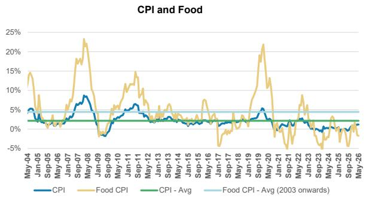

line chart

| Date    | CPI  | Food CPI | CPI - Avg | Food CPI - Avg (2003 onwards) |
|---------|------|----------|-----------|-------------------------------|
| May-04  | 5%   | 15%      | 2%        | 5%                            |
| Jan-05  | 3%   | 8%       | 2%        | 5%                            |
| Sep-05  | 2%   | 5%       | 2%        | 5%                            |
| May-06  | 1%   | 3%       | 2%        | 5%                            |
| Jan-07  | 0%   | 10%      | 2%        | 5%                            |
| Sep-07  | 8%   | 22%      | 2%        | 5%                            |
| May-08  | 9%   | 18%      | 2%        | 5%                            |
| Jan-09  | -2%  | -5%      | 2%        | 5%                            |
| Sep-09  | -1%  | -3%      | 2%        | 5%                            |
| May-10  | 3%   | 10%      | 2%        | 5%                            |
| Jan-11  | 4%   | 15%      | 2%        | 5%                            |
| Sep-11  | 5%   | 12%      | 2%        | 5%                            |
| May-12  | 4%   | 8%       | 2%        | 5%                            |
| Jan-13  | 3%   | 6%       | 2%        | 5%                            |
| Sep-13  | 2%   | 4%       | 2%        | 5%                            |
| May-14  | 1%   | 3%       | 2%        | 5%                            |
| Jan-15  | 0%   | 2%       | 2%        | 5%                            |
| Sep-15  | -1%  | -3%      | 2%        | 5%                            |
| May-16  | -2%  | -4%      | 2%        | 5%                            |
| Jan-17  | -3%  | -5%      | 2%        | 5%                            |
| Sep-17  | -4%  | -6%      | 2%        | 5%                            |
| May-18  | -3%  | -7%      | 2%        | 5%                            |
| Jan-19  | -2%  | -8%      | 2%        | 5%                            |
| Sep-19  | -1%  | -9%      | 2%        | 5%                            |
| May-20  | -2%  | -10%     | 2%        | 5%                            |
| Jan-21  | -3%  | -11%     | 2%        | 5%                            |
| Sep-21  | -4%  | -12%     | 2%        | 5%                            |
| May-22  | -3%  | -13%     | 2%        | 5%                            |
| Jan-23  | -2%  | -14%     | 2%        | 5%                            |
| Sep-23  | -1%  | -15%     | 2%        | 5%                            |
| May-24  | -2%  | -16%     | 2%        | 5%                            |
| Jan-25  | -3%  | -17%     | 2%        | 5%                            |
| Sep-25  | -4%  | -18%     | 2%        | 5%                            |
| May-26  | -3%  | -19%     | 2%        | 5%                            |

Source: CEIC, MS.

# Raw Material Price Trends – Soybean Spot and Futures

Exhibit 8: Soybean Price (Weekly)  
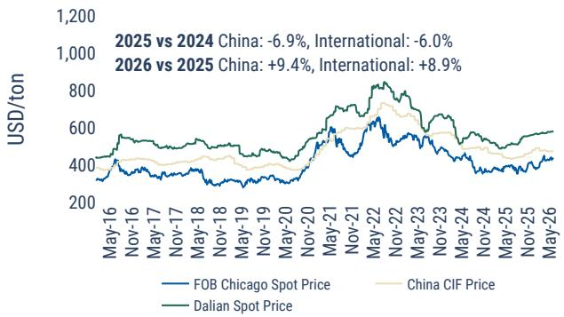

line chart

| Date    | FOB Chicago Spot Price | China CIF Price | Dalian Spot Price |
|---------|------------------------|-----------------|--------------------|
| May-16  | ~350                   | ~400            | ~500               |
| Nov-16  | ~380                   | ~420            | ~550               |
| May-17  | ~360                   | ~410            | ~530               |
| Nov-17  | ~370                   | ~430            | ~540               |
| May-18  | ~340                   | ~420            | ~520               |
| Nov-18  | ~350                   | ~430            | ~530               |
| May-19  | ~360                   | ~440            | ~540               |
| Nov-19  | ~370                   | ~450            | ~550               |
| May-20  | ~380                   | ~460            | ~560               |
| Nov-20  | ~400                   | ~480            | ~580               |
| May-21  | ~450                   | ~500            | ~650               |
| Nov-21  | ~550                   | ~550            | ~750               |
| May-22  | ~650                   | ~600            | ~850               |
| Nov-22  | ~600                   | ~550            | ~800               |
| May-23  | ~550                   | ~500            | ~750               |
| Nov-23  | ~500                   | ~450            | ~700               |
| May-24  | ~450                   | ~400            | ~650               |
| Nov-24  | ~480                   | ~420            | ~680               |
| May-25  | ~460                   | ~410            | ~660               |
| Nov-25  | ~470                   | ~430            | ~670               |
| May-26  | ~480                   | ~440            | ~680               |

Source: CEIC, Bloomberg, MS.

Exhibit 9: Soybean Futures Price (Daily)  
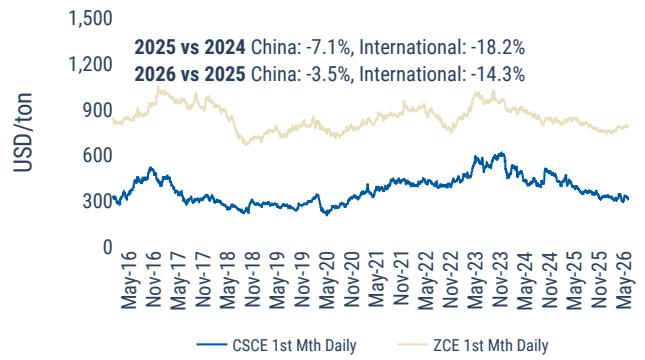

line chart

| Date    | CSCE 1st Mth Daily | ZCE 1st Mth Daily |
|---------|-------------------|------------------|
| May-16  | ~300              | ~900             |
| Nov-16  | ~500              | ~1,000           |
| May-17  | ~400              | ~950             |
| Nov-17  | ~350              | ~900             |
| May-18  | ~300              | ~850             |
| Nov-18  | ~250              | ~800             |
| May-19  | ~200              | ~750             |
| Nov-19  | ~250              | ~700             |
| May-20  | ~300              | ~650             |
| Nov-20  | ~350              | ~600             |
| May-21  | ~400              | ~550             |
| Nov-21  | ~450              | ~500             |
| May-22  | ~500              | ~450             |
| Nov-22  | ~550              | ~400             |
| May-23  | ~600              | ~350             |
| Nov-23  | ~550              | ~300             |
| May-24  | ~500              | ~250             |
| Nov-24  | ~450              | ~200             |
| May-25  | ~400              | ~150             |
| Nov-25  | ~350              | ~100             |
| May-26  | ~300              | ~50              |

Source: CEIC, Bloomberg, MS.

Exhibit 10: Soybean Imports (Monthly)  
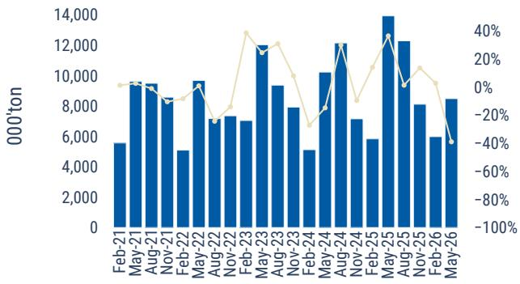

bar-line hybrid chart

| Month | Production (000'ton) | Change (%) |
|---|---|---|
| Feb-21 | 5600 | 5 |
| May-21 | 9500 | 8 |
| Aug-21 | 9600 | 4 |
| Nov-21 | 8300 | -10 |
| Feb-22 | 5000 | -25 |
| May-22 | 9700 | 15 |
| Aug-22 | 6900 | -35 |
| Nov-22 | 7200 | -20 |
| Feb-23 | 7100 | 35 |
| May-23 | 12100 | 25 |
| Aug-23 | 9400 | 30 |
| Nov-23 | 7900 | 15 |
| Feb-24 | 5100 | -35 |
| May-24 | 10200 | -15 |
| Aug-24 | 12100 | 35 |
| Nov-24 | 7200 | -35 |
| Feb-25 | 5900 | 15 |
| May-25 | 13800 | 40 |
| Aug-25 | 12300 | 5 |
| Nov-25 | 8100 | 15 |
| Feb-26 | 6000 | -15 |
| May-26 | 8500 | -45 |

Source: CEIC, Bloomberg, MS.

Exhibit 11: Soybean Crushing Margin  
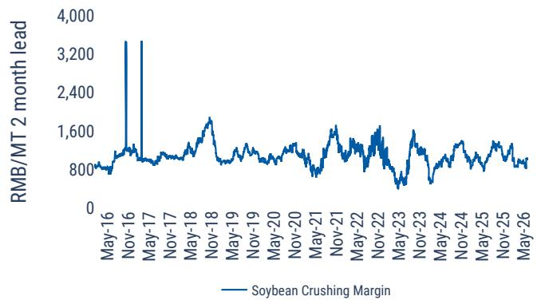

line chart

| Date    | RMB/MT 2 month lead |
|---------|---------------------|
| May-16  | ~800                |
| Nov-16  | ~3,300              |
| May-17  | ~800                |
| Nov-17  | ~800                |
| May-18  | ~1,600              |
| Nov-18  | ~1,600              |
| May-19  | ~800                |
| Nov-19  | ~800                |
| May-20  | ~800                |
| Nov-20  | ~800                |
| May-21  | ~1,600              |
| Nov-21  | ~1,600              |
| May-22  | ~1,600              |
| Nov-22  | ~1,600              |
| May-23  | ~800                |
| Nov-23  | ~1,600              |
| May-24  | ~800                |
| Nov-24  | ~1,600              |
| May-25  | ~1,600              |
| Nov-25  | ~1,600              |
| May-26  | ~800                |

Source: CEIC, Bloomberg, MS.

# Raw Material Price Trends – Soybean Meal Spot and Futures

Exhibit 12: Soybean Meal Spot Price (Weekly)  
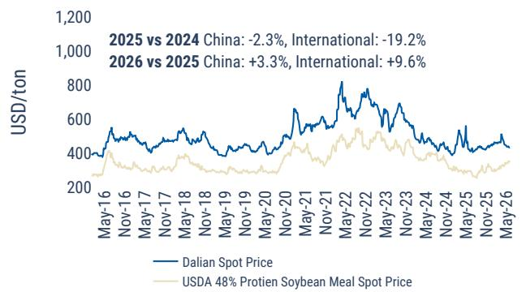

line chart

| Date    | Dalian Spot Price | USDA 48% Protein Soybean Meal Spot Price |
|---------|-------------------|------------------------------------------|
| May-16  | ~400              | ~300                                     |
| Nov-16  | ~500              | ~350                                     |
| May-17  | ~450              | ~320                                     |
| Nov-17  | ~500              | ~330                                     |
| May-18  | ~480              | ~340                                     |
| Nov-18  | ~450              | ~350                                     |
| May-19  | ~420              | ~360                                     |
| Nov-19  | ~400              | ~370                                     |
| May-20  | ~450              | ~380                                     |
| Nov-20  | ~500              | ~400                                     |
| May-21  | ~600              | ~450                                     |
| Nov-21  | ~700              | ~500                                     |
| May-22  | ~800              | ~550                                     |
| Nov-22  | ~750              | ~520                                     |
| May-23  | ~700              | ~500                                     |
| Nov-23  | ~650              | ~480                                     |
| May-24  | ~600              | ~450                                     |
| Nov-24  | ~550              | ~420                                     |
| May-25  | ~500              | ~400                                     |
| Nov-25  | ~450              | ~380                                     |
| May-26  | ~480              | ~390                                     |

Source: CEIC, Bloomberg, MS. Note: Data quoted with prices on Friday for each week.

Exhibit 13: Soybean Meal Futures Price (Daily)  
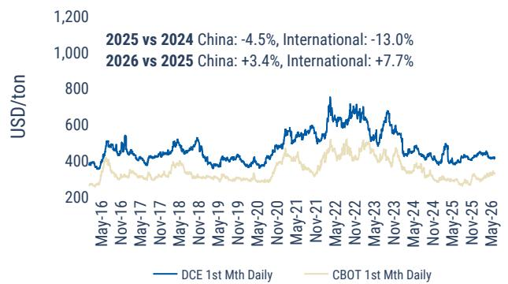

line chart

| Date    | DCE 1st Mth Daily | CBOT 1st Mth Daily |
|---------|-------------------|--------------------|
| May-16  | ~400              | ~300               |
| Nov-16  | ~500              | ~350               |
| May-17  | ~450              | ~320               |
| Nov-17  | ~480              | ~330               |
| May-18  | ~470              | ~340               |
| Nov-18  | ~460              | ~350               |
| May-19  | ~450              | ~360               |
| Nov-19  | ~440              | ~370               |
| May-20  | ~430              | ~380               |
| Nov-20  | ~420              | ~390               |
| May-21  | ~410              | ~400               |
| Nov-21  | ~400              | ~410               |
| May-22  | ~750              | ~500               |
| Nov-22  | ~700              | ~450               |
| May-23  | ~650              | ~400               |
| Nov-23  | ~600              | ~350               |
| May-24  | ~550              | ~320               |
| Nov-24  | ~500              | ~300               |
| May-25  | ~450              | ~280               |
| Nov-25  | ~420              | ~260               |
| May-26  | ~400              | ~250               |

Source: CEIC, Bloomberg, MS. Note: All % changes are based on prices in US\$, except for those otherwise quoted.

Exhibit 14:  
Soybean Meal Spot Price (Daily)  
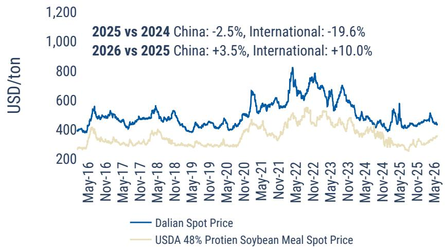

line chart

| Date    | Dalian Spot Price | USDA 48% Protein Soybean Meal Spot Price |
|---------|-------------------|------------------------------------------|
| May-16  | ~350              | ~250                                     |
| Nov-16  | ~500              | ~350                                     |
| May-17  | ~450              | ~300                                     |
| Nov-17  | ~550              | ~350                                     |
| May-18  | ~500              | ~350                                     |
| Nov-18  | ~450              | ~300                                     |
| May-19  | ~400              | ~300                                     |
| Nov-19  | ~450              | ~300                                     |
| May-20  | ~500              | ~350                                     |
| Nov-20  | ~650              | ~450                                     |
| May-21  | ~700              | ~500                                     |
| Nov-21  | ~800              | ~550                                     |
| May-22  | ~750              | ~500                                     |
| Nov-22  | ~700              | ~450                                     |
| May-23  | ~650              | ~400                                     |
| Nov-23  | ~600              | ~350                                     |
| May-24  | ~500              | ~300                                     |
| Nov-24  | ~450              | ~250                                     |
| May-25  | ~550              | ~300                                     |
| Nov-25  | ~450              | ~350                                     |
| May-26  | ~450              | ~350                                     |

Source: CEIC, Bloomberg, MS.

# Raw Material Price Trends – Soybean Oil Spot and Futures

Exhibit 15: Soybean Oil Spot Price (Weekly)  
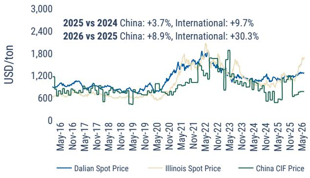

line chart

| Date    | Dalian Spot Price | Illinois Spot Price | China CIF Price |
|---------|-------------------|---------------------|-----------------|
| May-16  | ~1,000            | ~1,000              | ~1,000          |
| Nov-16  | ~1,000            | ~1,000              | ~1,000          |
| May-17  | ~1,000            | ~1,000              | ~1,000          |
| Nov-17  | ~1,000            | ~1,000              | ~1,000          |
| May-18  | ~1,000            | ~1,000              | ~1,000          |
| Nov-18  | ~1,000            | ~1,000              | ~1,000          |
| May-19  | ~1,000            | ~1,000              | ~1,000          |
| Nov-19  | ~1,000            | ~1,000              | ~1,000          |
| May-20  | ~1,200            | ~1,200              | ~1,200          |
| Nov-20  | ~1,400            | ~1,400              | ~1,400          |
| May-21  | ~1,600            | ~1,600              | ~1,600          |
| Nov-21  | ~1,800            | ~1,800              | ~1,800          |
| May-22  | ~2,400            | ~2,400              | ~2,400          |
| Nov-22  | ~2,200            | ~2,200              | ~2,200          |
| May-23  | ~2,400            | ~2,400              | ~2,400          |
| Nov-23  | ~2,200            | ~2,200              | ~2,200          |
| May-24  | ~2,400            | ~2,400              | ~2,400          |
| Nov-24  | ~2,600            | ~2,600              | ~2,600          |
| May-25  | ~2,800            | ~2,800              | ~2,800          |
| Nov-25  | ~3,000            | ~3,000              | ~3,000          |
| May-26  | ~3,200            | ~3,200              | ~3,200          |

Source: CEIC, Bloomberg, MS. Note: Data quoted with prices on Friday for each week.

Exhibit 16: Soybean Oil Futures Price (Daily)  
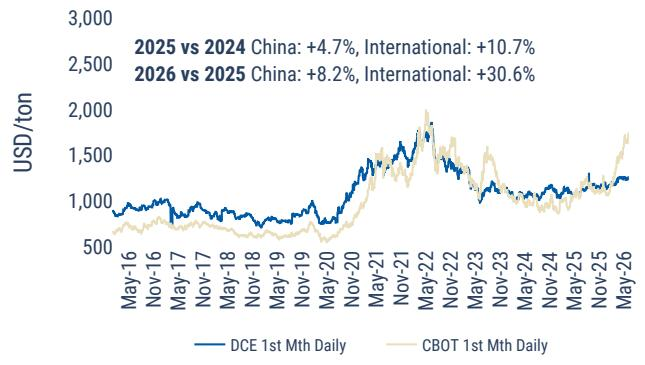

line chart

| Date    | DCE 1st Mth Daily | CBOT 1st Mth Daily |
|---------|-------------------|--------------------|
| May-16  | ~900              | ~700               |
| Nov-16  | ~950              | ~750               |
| May-17  | ~850              | ~650               |
| Nov-17  | ~900              | ~700               |
| May-18  | ~800              | ~600               |
| Nov-18  | ~850              | ~650               |
| May-19  | ~900              | ~700               |
| Nov-19  | ~850              | ~650               |
| May-20  | ~1,000            | ~800               |
| Nov-20  | ~1,300            | ~1,000             |
| May-21  | ~1,500            | ~1,200             |
| Nov-21  | ~1,700            | ~1,400             |
| May-22  | ~1,900            | ~1,600             |
| Nov-22  | ~1,800            | ~1,500             |
| May-23  | ~1,600            | ~1,300             |
| Nov-23  | ~1,400            | ~1,100             |
| May-24  | ~1,300            | ~1,000             |
| Nov-24  | ~1,200            | ~900               |
| May-25  | ~1,100            | ~850               |
| Nov-25  | ~1,200            | ~950               |
| May-26  | ~1,300            | ~1,100             |

Source: CEIC, Bloomberg, MS. Note: All % changes are based on prices in USD, except for those otherwise quoted.

Exhibit 17: Soybean Oil Spot Price (Daily)  
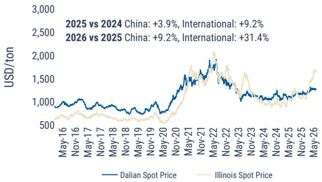

line chart

| Date    | Dalian Spot Price | Illinois Spot Price |
|---------|-------------------|---------------------|
| May-16  | ~800              | ~600                |
| Nov-16  | ~900              | ~700                |
| May-17  | ~850              | ~650                |
| Nov-17  | ~800              | ~600                |
| May-18  | ~750              | ~550                |
| Nov-18  | ~700              | ~500                |
| May-19  | ~750              | ~550                |
| Nov-19  | ~800              | ~600                |
| May-20  | ~900              | ~700                |
| Nov-20  | ~1,000            | ~800                |
| May-21  | ~1,500            | ~1,400              |
| Nov-21  | ~1,800            | ~1,700              |
| May-22  | ~2,000            | ~1,900              |
| Nov-22  | ~1,800            | ~1,700              |
| May-23  | ~1,500            | ~1,400              |
| Nov-23  | ~1,300            | ~1,200              |
| May-24  | ~1,200            | ~1,100              |
| Nov-24  | ~1,100            | ~1,050              |
| May-25  | ~1,200            | ~1,150              |
| Nov-25  | ~1,300            | ~1,250              |
| May-26  | ~1,400            | ~1,350              |

Source: CEIC, Bloomberg, MS.

# Raw Material Price Trends – Palm Oil Spot and Futures

Exhibit 18: Palm Oil Spot Price (Weekly)  
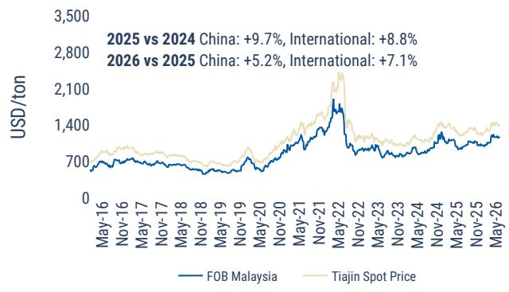

line chart

| Date    | FOB Malaysia | Tianjin Spot Price |
|---------|--------------|-------------------|
| May-16  | ~600         | ~700              |
| Nov-16  | ~650         | ~750              |
| May-17  | ~600         | ~700              |
| Nov-17  | ~650         | ~750              |
| May-18  | ~600         | ~700              |
| Nov-18  | ~650         | ~750              |
| May-19  | ~600         | ~700              |
| Nov-19  | ~650         | ~750              |
| May-20  | ~700         | ~800              |
| Nov-20  | ~750         | ~850              |
| May-21  | ~800         | ~900              |
| Nov-21  | ~900         | ~1,000            |
| May-22  | ~1,100       | ~2,100            |
| Nov-22  | ~1,300       | ~1,400            |
| May-23  | ~1,200       | ~1,300            |
| Nov-23  | ~1,100       | ~1,200            |
| May-24  | ~1,200       | ~1,300            |
| Nov-24  | ~1,300       | ~1,400            |
| May-25  | ~1,400       | ~1,500            |
| Nov-25  | ~1,300       | ~1,400            |
| May-26  | ~1,400       | ~1,500            |

Source: CEIC, Bloomberg, MS. Note: Data quoted with prices on Friday for each week.

Exhibit 19: Palm Oil Futures Price (Daily)  
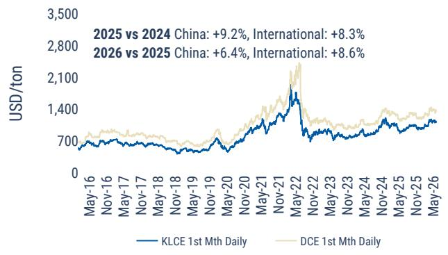

line chart

| Date    | KLCE 1st Mth Daily (USD/ton) | DCE 1st Mth Daily (USD/ton) |
|---------|-----------------------------|----------------------------|
| May-16  | ~700                        | ~700                       |
| Nov-16  | ~700                        | ~700                       |
| May-17  | ~700                        | ~700                       |
| Nov-17  | ~700                        | ~700                       |
| May-18  | ~700                        | ~700                       |
| Nov-18  | ~700                        | ~700                       |
| May-19  | ~700                        | ~700                       |
| Nov-19  | ~700                        | ~700                       |
| May-20  | ~700                        | ~700                       |
| Nov-20  | ~700                        | ~700                       |
| May-21  | ~700                        | ~700                       |
| Nov-21  | ~700                        | ~700                       |
| May-22  | ~1,400                      | ~2,100                     |
| Nov-22  | ~1,400                      | ~2,100                     |
| May-23  | ~1,400                      | ~1,400                     |
| Nov-23  | ~1,400                      | ~1,400                     |
| May-24  | ~1,400                      | ~1,400                     |
| Nov-24  | ~1,400                      | ~1,400                     |
| May-25  | ~1,400                      | ~1,400                     |
| Nov-25  | ~1,400                      | ~1,400                     |
| May-26  | ~1,400                      | ~1,400                     |

Source: CEIC, Bloomberg, MS. Note: All % changes are based on prices in USD, except for those otherwise quoted.

Exhibit 20: Palm Oil Spot Price (Daily)  
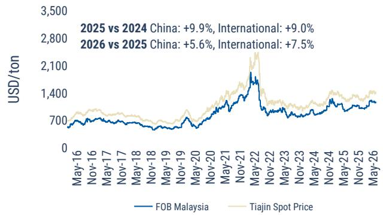

line chart

| Date    | FOB Malaysia | Tianjin Spot Price |
|---------|--------------|--------------------|
| May-16  | ~700         | ~700               |
| Nov-16  | ~750         | ~750               |
| May-17  | ~700         | ~700               |
| Nov-17  | ~650         | ~650               |
| May-18  | ~600         | ~600               |
| Nov-18  | ~650         | ~650               |
| May-19  | ~700         | ~700               |
| Nov-19  | ~750         | ~750               |
| May-20  | ~800         | ~800               |
| Nov-20  | ~900         | ~900               |
| May-21  | ~1,000       | ~1,000             |
| Nov-21  | ~1,200       | ~1,200             |
| May-22  | ~1,400       | ~1,400             |
| Nov-22  | ~1,300       | ~1,300             |
| May-23  | ~1,200       | ~1,200             |
| Nov-23  | ~1,100       | ~1,100             |
| May-24  | ~1,200       | ~1,200             |
| Nov-24  | ~1,300       | ~1,300             |
| May-25  | ~1,400       | ~1,400             |
| Nov-25  | ~1,350       | ~1,350             |
| May-26  | ~1,400       | ~1,400             |

Source: CEIC, Bloomberg, MS.

# Raw Material Price Trends – Rapeseed, Rapeseed Oil Spot, and Futures

Exhibit 21: Rapeseed Oil Spot Price (Weekly)  
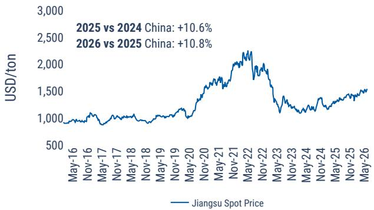

line chart

| Date    | Jiangsu Spot Price (USD/ton) |
|---------|-----------------------------|
| May-16  | ~900                        |
| Nov-16  | ~1000                       |
| May-17  | ~950                        |
| Nov-17  | ~1000                       |
| May-18  | ~950                        |
| Nov-18  | ~1000                       |
| May-19  | ~1050                       |
| Nov-19  | ~1100                       |
| May-20  | ~1300                       |
| Nov-20  | ~1600                       |
| May-21  | ~1800                       |
| Nov-21  | ~2000                       |
| May-22  | ~2200                       |
| Nov-22  | ~2100                       |
| May-23  | ~1400                       |
| Nov-23  | ~1300                       |
| May-24  | ~1400                       |
| Nov-24  | ~1500                       |
| May-25  | ~1550                       |
| Nov-25  | ~1600                       |
| May-26  | ~1650                       |

Source: CEIC, Bloomberg, MS. Note: Data quoted with prices on Friday for each week.

Exhibit 22: Rapeseed Oil Futures Price (Daily)  
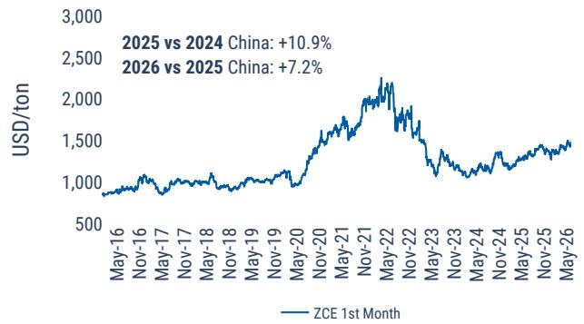

line chart

| Date    | ZCE 1st Month (USD/ton) |
|---------|--------------------------|
| May-16  | ~900                     |
| Nov-16  | ~1,000                   |
| May-17  | ~950                     |
| Nov-17  | ~1,050                   |
| May-18  | ~1,000                   |
| Nov-18  | ~1,050                   |
| May-19  | ~1,100                   |
| Nov-19  | ~1,150                   |
| May-20  | ~1,300                   |
| Nov-20  | ~1,500                   |
| May-21  | ~1,700                   |
| Nov-21  | ~1,900                   |
| May-22  | ~2,200                   |
| Nov-22  | ~2,300                   |
| May-23  | ~1,500                   |
| Nov-23  | ~1,300                   |
| May-24  | ~1,400                   |
| Nov-24  | ~1,450                   |
| May-25  | ~1,500                   |
| Nov-25  | ~1,550                   |
| May-26  | ~1,600                   |

Source: CEIC, Bloomberg, MS.

Exhibit 23: Rapeseed Spot Price (Weekly)  
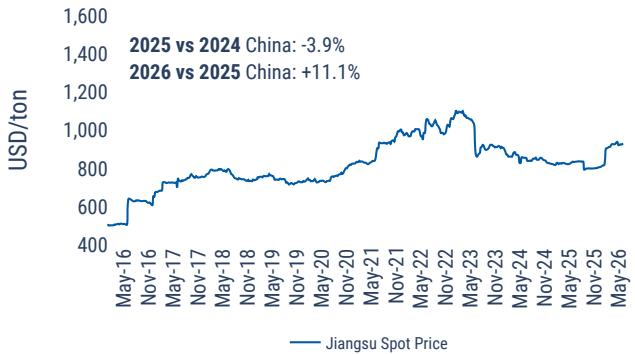

line chart

| Date    | Jiangsu Spot Price (USD/ton) |
|---------|-----------------------------|
| May-16  | ~500                        |
| Nov-16  | ~650                        |
| May-17  | ~750                        |
| Nov-17  | ~800                        |
| May-18  | ~780                        |
| Nov-18  | ~760                        |
| May-19  | ~740                        |
| Nov-19  | ~720                        |
| May-20  | ~780                        |
| Nov-20  | ~850                        |
| May-21  | ~950                        |
| Nov-21  | ~1000                       |
| May-22  | ~1050                       |
| Nov-22  | ~1100                       |
| May-23  | ~950                        |
| Nov-23  | ~850                        |
| May-24  | ~800                        |
| Nov-24  | ~820                        |
| May-25  | ~850                        |
| Nov-25  | ~880                        |
| May-26  | ~950                        |

Source: CEIC, Bloomberg, MS. Note: All % changes are based on prices in USD, except for those otherwise quoted.

# Raw Material Price Trends – Wheat and Flour Spot and Futures

Exhibit 24: Wheat Spot Price (Weekly)  
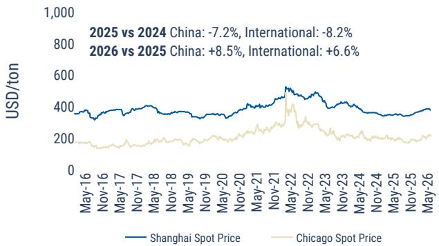

line chart

| Date    | Shanghai Spot Price | Chicago Spot Price |
|---------|---------------------|--------------------|
| May-16  | ~350                | ~150               |
| Nov-16  | ~380                | ~160               |
| May-17  | ~400                | ~170               |
| Nov-17  | ~420                | ~180               |
| May-18  | ~410                | ~190               |
| Nov-18  | ~400                | ~200               |
| May-19  | ~390                | ~210               |
| Nov-19  | ~380                | ~220               |
| May-20  | ~370                | ~230               |
| Nov-20  | ~360                | ~240               |
| May-21  | ~350                | ~250               |
| Nov-21  | ~340                | ~260               |
| May-22  | ~500                | ~400               |
| Nov-22  | ~480                | ~350               |
| May-23  | ~450                | ~300               |
| Nov-23  | ~420                | ~280               |
| May-24  | ~400                | ~260               |
| Nov-24  | ~380                | ~250               |
| May-25  | ~370                | ~240               |
| Nov-25  | ~380                | ~250               |
| May-26  | ~390                | ~260               |

Source: CEIC, Bloomberg, MS. Note: Data quoted with prices on Friday for each week.

Exhibit 25: Wheat Futures Price (Daily)  
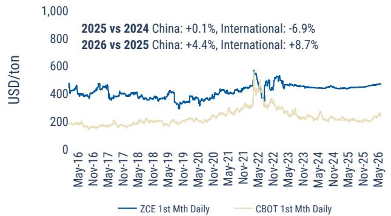

line chart

| Date    | ZCE 1st Mth Daily (USD/ton) | CBOT 1st Mth Daily (USD/ton) |
|---------|-----------------------------|------------------------------|
| May-16  | ~450                        | ~200                         |
| Nov-16  | ~480                        | ~210                         |
| May-17  | ~460                        | ~220                         |
| Nov-17  | ~470                        | ~230                         |
| May-18  | ~450                        | ~240                         |
| Nov-18  | ~460                        | ~250                         |
| May-19  | ~440                        | ~260                         |
| Nov-19  | ~430                        | ~270                         |
| May-20  | ~450                        | ~280                         |
| Nov-20  | ~460                        | ~290                         |
| May-21  | ~470                        | ~300                         |
| Nov-21  | ~480                        | ~310                         |
| May-22  | ~550                        | ~350                         |
| Nov-22  | ~500                        | ~300                         |
| May-23  | ~480                        | ~280                         |
| Nov-23  | ~470                        | ~270                         |
| May-24  | ~460                        | ~260                         |
| Nov-24  | ~450                        | ~250                         |
| May-25  | ~460                        | ~260                         |
| Nov-25  | ~470                        | ~270                         |
| May-26  | ~480                        | ~280                         |

Source: CEIC, Bloomberg, MS.

Exhibit 26: Flour Spot Price (Weekly)  
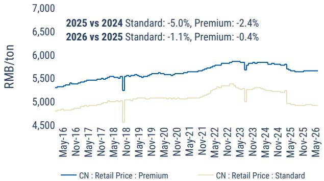

line chart

| Date    | CN : Retail Price : Premium | CN : Retail Price : Standard |
|---------|-----------------------------|-------------------------------|
| May-16  | ~5,300                      | ~4,800                        |
| Nov-16  | ~5,400                      | ~4,900                        |
| May-17  | ~5,500                      | ~5,000                        |
| Nov-17  | ~5,550                      | ~5,050                        |
| May-18  | ~5,600                      | ~5,100                        |
| Nov-18  | ~5,300                      | ~4,500                        |
| May-19  | ~5,500                      | ~5,000                        |
| Nov-19  | ~5,600                      | ~5,050                        |
| May-20  | ~5,650                      | ~5,100                        |
| Nov-20  | ~5,700                      | ~5,150                        |
| May-21  | ~5,750                      | ~5,200                        |
| Nov-21  | ~5,800                      | ~5,250                        |
| May-22  | ~5,850                      | ~5,300                        |
| Nov-22  | ~5,900                      | ~5,350                        |
| May-23  | ~5,800                      | ~5,300                        |
| Nov-23  | ~5,900                      | ~5,250                        |
| May-24  | ~5,850                      | ~5,200                        |
| Nov-24  | ~5,800                      | ~5,150                        |
| May-25  | ~5,750                      | ~5,100                        |
| Nov-25  | ~5,700                      | ~5,050                        |
| May-26  | ~5,700                      | ~5,000                        |

Source: CEIC, Bloomberg, MS. Note: All % changes are based on prices in USD, except for those otherwise quoted.

# Raw Material Price Trends – Rice, Corn Spot, and Futures

Exhibit 27: Rice Spot Price (Weekly)  
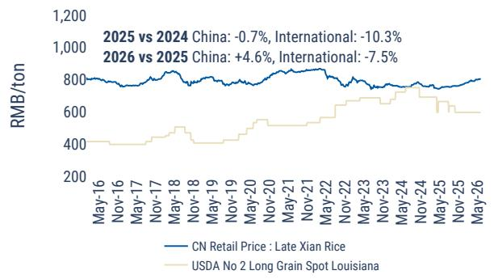

line chart

| Date    | CN Retail Price: Late Xian Rice | USDA No 2 Long Grain Spot Louisiana |
|---------|----------------------------------|-------------------------------------|
| May-16  | ~800                             | ~400                                |
| Nov-16  | ~800                             | ~400                                |
| May-17  | ~800                             | ~400                                |
| Nov-17  | ~800                             | ~400                                |
| May-18  | ~800                             | ~400                                |
| Nov-18  | ~800                             | ~400                                |
| May-19  | ~800                             | ~400                                |
| Nov-19  | ~800                             | ~400                                |
| May-20  | ~800                             | ~400                                |
| Nov-20  | ~800                             | ~400                                |
| May-21  | ~800                             | ~400                                |
| Nov-21  | ~800                             | ~400                                |
| May-22  | ~800                             | ~400                                |
| Nov-22  | ~800                             | ~400                                |
| May-23  | ~800                             | ~400                                |
| Nov-23  | ~800                             | ~400                                |
| May-24  | ~800                             | ~400                                |
| Nov-24  | ~800                             | ~400                                |
| May-25  | ~800                             | ~400                                |
| Nov-25  | ~800                             | ~400                                |
| May-26  | ~800                             | ~400                                |

Source: CEIC, Bloomberg, MS. Note: Data quoted with prices on Friday for each week.

Exhibit 28: Rice Futures Price (Daily)  
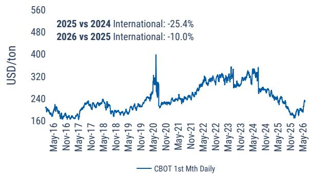

line chart

| Date    | CBOT 1st Mth Daily (USD/ton) |
|---------|-----------------------------|
| May-16  | ~180                        |
| Nov-16  | ~160                        |
| May-17  | ~190                        |
| Nov-17  | ~200                        |
| May-18  | ~180                        |
| Nov-18  | ~170                        |
| May-19  | ~180                        |
| Nov-19  | ~200                        |
| May-20  | ~300                        |
| Nov-20  | ~240                        |
| May-21  | ~260                        |
| Nov-21  | ~280                        |
| May-22  | ~300                        |
| Nov-22  | ~320                        |
| May-23  | ~340                        |
| Nov-23  | ~330                        |
| May-24  | ~310                        |
| Nov-24  | ~280                        |
| May-25  | ~240                        |
| Nov-25  | ~180                        |
| May-26  | ~200                        |

Source: CEIC, Bloomberg, MS.

Exhibit 29: Corn Spot Price (Weekly)  
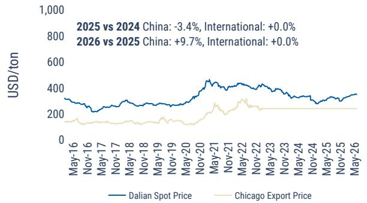

line chart

| Date    | Dalian Spot Price | Chicago Export Price |
|---------|-------------------|----------------------|
| May-16  | ~300              | ~150                 |
| Nov-16  | ~250              | ~150                 |
| May-17  | ~280              | ~150                 |
| Nov-17  | ~300              | ~150                 |
| May-18  | ~320              | ~150                 |
| Nov-18  | ~300              | ~150                 |
| May-19  | ~320              | ~150                 |
| Nov-19  | ~350              | ~150                 |
| May-20  | ~400              | ~150                 |
| Nov-20  | ~450              | ~200                 |
| May-21  | ~480              | ~250                 |
| Nov-21  | ~450              | ~300                 |
| May-22  | ~420              | ~350                 |
| Nov-22  | ~400              | ~350                 |
| May-23  | ~380              | ~350                 |
| Nov-23  | ~350              | ~350                 |
| May-24  | ~320              | ~350                 |
| Nov-24  | ~300              | ~350                 |
| May-25  | ~320              | ~350                 |
| Nov-25  | ~350              | ~350                 |
| May-26  | ~380              | ~350                 |

Source: CEIC, Bloomberg, MS. Note: All % changes are based on prices in US\$, except for those otherwise quoted.

Exhibit 30: Corn Futures Price (Daily)  
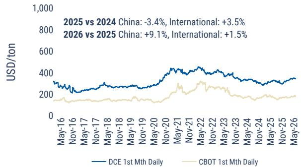

line chart

| Date    | DCE 1st Mth Daily | CBOT 1st Mth Daily |
|---------|-------------------|--------------------|
| May-16  | ~300              | ~150               |
| Nov-16  | ~250              | ~150               |
| May-17  | ~280              | ~150               |
| Nov-17  | ~300              | ~150               |
| May-18  | ~320              | ~150               |
| Nov-18  | ~350              | ~150               |
| May-19  | ~380              | ~150               |
| Nov-19  | ~400              | ~150               |
| May-20  | ~450              | ~150               |
| Nov-20  | ~500              | ~200               |
| May-21  | ~480              | ~250               |
| Nov-21  | ~450              | ~300               |
| May-22  | ~480              | ~350               |
| Nov-22  | ~450              | ~300               |
| May-23  | ~480              | ~250               |
| Nov-23  | ~450              | ~200               |
| May-24  | ~480              | ~180               |
| Nov-24  | ~450              | ~180               |
| May-25  | ~480              | ~180               |
| Nov-25  | ~450              | ~180               |
| May-26  | ~480              | ~180               |

Source: CEIC, Bloomberg, MS.

# Raw Material Price Trends – Barley, Sugar Spot, and Futures

Exhibit 31: Barley Spot Price  
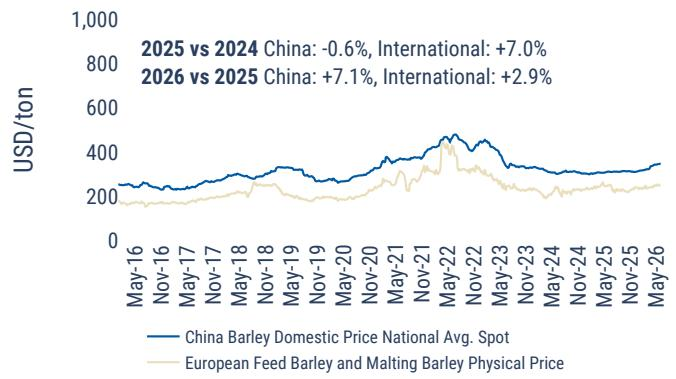

line chart

| Date    | China Barley Domestic Price National Avg. Spot (USD/ton) | European Feed Barley and Malting Barley Physical Price (USD/ton) |
|---------|----------------------------------------------------------|------------------------------------------------------------------|
| May-16  | ~250                                                     | ~180                                                             |
| Nov-16  | ~260                                                     | ~190                                                             |
| May-17  | ~270                                                     | ~200                                                             |
| Nov-17  | ~280                                                     | ~210                                                             |
| May-18  | ~300                                                     | ~220                                                             |
| Nov-18  | ~320                                                     | ~230                                                             |
| May-19  | ~340                                                     | ~240                                                             |
| Nov-19  | ~360                                                     | ~250                                                             |
| May-20  | ~380                                                     | ~260                                                             |
| Nov-20  | ~400                                                     | ~270                                                             |
| May-21  | ~420                                                     | ~280                                                             |
| Nov-21  | ~450                                                     | ~300                                                             |
| May-22  | ~480                                                     | ~350                                                             |
| Nov-22  | ~460                                                     | ~320                                                             |
| May-23  | ~440                                                     | ~300                                                             |
| Nov-23  | ~420                                                     | ~280                                                             |
| May-24  | ~400                                                     | ~260                                                             |
| Nov-24  | ~380                                                     | ~250                                                             |
| May-25  | ~360                                                     | ~240                                                             |
| Nov-25  | ~340                                                     | ~230                                                             |
| May-26  | ~350                                                     | ~240                                                             |

Source: CEIC, MS.

Exhibit 32: Sugar Spot Price  
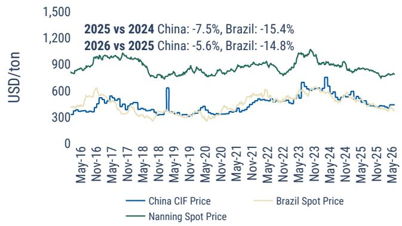

line chart

| Date    | China CIF Price | Brazil Spot Price | Nanning Spot Price |
|---------|-----------------|-------------------|--------------------|
| May-16  | ~300            | ~300              | ~900               |
| Nov-16  | ~400            | ~400              | ~1000              |
| May-17  | ~500            | ~500              | ~1050              |
| Nov-17  | ~450            | ~450              | ~1000              |
| May-18  | ~350            | ~350              | ~950               |
| Nov-18  | ~300            | ~300              | ~900               |
| May-19  | ~600            | ~350              | ~850               |
| Nov-19  | ~350            | ~350              | ~800               |
| May-20  | ~350            | ~350              | ~850               |
| Nov-20  | ~400            | ~400              | ~900               |
| May-21  | ~450            | ~450              | ~950               |
| Nov-21  | ~500            | ~500              | ~1000              |
| May-22  | ~550            | ~550              | ~1050              |
| Nov-22  | ~600            | ~600              | ~1100              |
| May-23  | ~700            | ~650              | ~1150              |
| Nov-23  | ~650            | ~600              | ~1100              |
| May-24  | ~600            | ~550              | ~1050              |
| Nov-24  | ~550            | ~500              | ~1000              |
| May-25  | ~500            | ~450              | ~950               |
| Nov-25  | ~450            | ~400              | ~900               |
| May-26  | ~400            | ~350              | ~850               |

Source: CEIC, MS.

Exhibit 33: Sugar Futures Price  
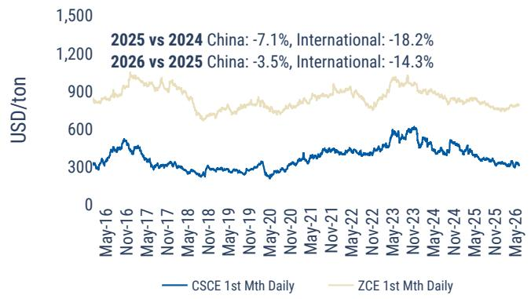

line chart

| Date    | CSCE 1st Mth Daily | ZCE 1st Mth Daily |
|---------|-------------------|------------------|
| May-16  | ~300              | ~900             |
| Nov-16  | ~500              | ~1000            |
| May-17  | ~400              | ~950             |
| Nov-17  | ~350              | ~900             |
| May-18  | ~300              | ~850             |
| Nov-18  | ~350              | ~800             |
| May-19  | ~300              | ~750             |
| Nov-19  | ~350              | ~700             |
| May-20  | ~400              | ~650             |
| Nov-20  | ~450              | ~600             |
| May-21  | ~500              | ~550             |
| Nov-21  | ~550              | ~500             |
| May-22  | ~600              | ~450             |
| Nov-22  | ~650              | ~400             |
| May-23  | ~700              | ~350             |
| Nov-23  | ~650              | ~300             |
| May-24  | ~600              | ~250             |
| Nov-24  | ~550              | ~200             |
| May-25  | ~500              | ~150             |
| Nov-25  | ~450              | ~100             |
| May-26  | ~400              | ~50              |

Source: CEIC, MS.

# Raw Material Price Trends – Raw Milk, Milk Powder, Orange Juice

Exhibit 34: Milk Powder Price (Weekly)  
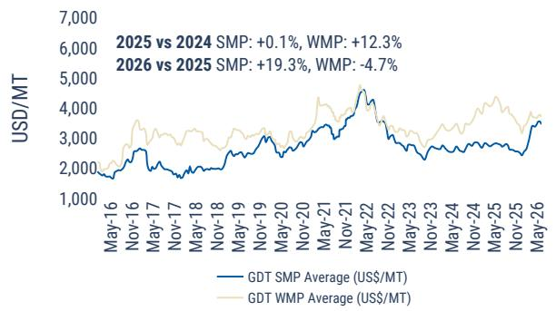

line chart

| Date    | GDT SMP Average (US$/MT) | GDT WMP Average (US$/MT) |
|---------|--------------------------|--------------------------|
| May-16  | ~1,800                   | ~2,000                   |
| Nov-16  | ~2,500                   | ~3,500                   |
| May-17  | ~2,000                   | ~3,000                   |
| Nov-17  | ~1,800                   | ~2,800                   |
| May-18  | ~2,200                   | ~3,200                   |
| Nov-18  | ~2,500                   | ~3,000                   |
| May-19  | ~2,800                   | ~3,500                   |
| Nov-19  | ~3,000                   | ~3,800                   |
| May-20  | ~3,200                   | ~4,000                   |
| Nov-20  | ~3,500                   | ~4,500                   |
| May-21  | ~3,800                   | ~4,800                   |
| Nov-21  | ~4,500                   | ~4,500                   |
| May-22  | ~4,800                   | ~4,200                   |
| Nov-22  | ~4,500                   | ~3,800                   |
| May-23  | ~3,500                   | ~3,500                   |
| Nov-23  | ~3,200                   | ~3,200                   |
| May-24  | ~3,500                   | ~3,800                   |
| Nov-24  | ~3,800                   | ~4,000                   |
| May-25  | ~3,500                   | ~4,500                   |
| Nov-25  | ~3,800                   | ~4,800                   |
| May-26  | ~3,500                   | ~4,500                   |

Source: Global Trade Fair, MS.

Exhibit 35: Raw Milk Price (Monthly)  
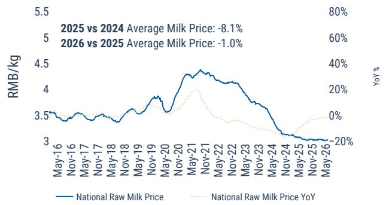

line chart

| Date    | National Raw Milk Price | National Raw Milk Price YoY |
|---------|--------------------------|------------------------------|
| May-16  | 3.5                      | 0%                           |
| Nov-16  | 3.5                      | 0%                           |
| May-17  | 3.5                      | 0%                           |
| Nov-17  | 3.5                      | 0%                           |
| May-18  | 3.5                      | 0%                           |
| Nov-18  | 3.5                      | 0%                           |
| May-19  | 3.5                      | 0%                           |
| Nov-19  | 3.5                      | 0%                           |
| May-20  | 3.5                      | 0%                           |
| Nov-20  | 4.0                      | 10%                          |
| May-21  | 4.5                      | 20%                          |
| Nov-21  | 4.5                      | 10%                          |
| May-22  | 4.5                      | 0%                           |
| Nov-22  | 4.5                      | -10%                         |
| May-23  | 4.5                      | -10%                         |
| Nov-23  | 4.0                      | -10%                         |
| May-24  | 3.5                      | -15%                         |
| Nov-24  | 3.5                      | -15%                         |
| May-25  | 3.5                      | -15%                         |
| Nov-25  | 3.5                      | -15%                         |
| May-26  | 3.5                      | -15%                         |

Source: CEIC, Bloomberg, MOA, China Dairy Association, Datastream, MS.

## Hogs, Piglets, Pork (China)

Exhibit 36: Hog/Piglet Price (Weekly)  
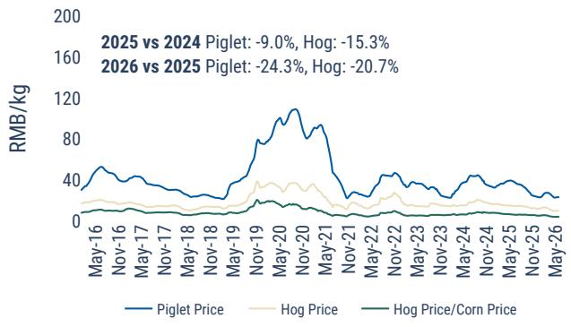

line chart

| Date    | Piglet Price | Hog Price | Hog Price/Corn Price |
|---------|--------------|-----------|----------------------|
| May-16  | ~40          | ~20       | ~5                   |
| Nov-16  | ~50          | ~25       | ~5                   |
| May-17  | ~45          | ~25       | ~5                   |
| Nov-17  | ~40          | ~25       | ~5                   |
| May-18  | ~35          | ~25       | ~5                   |
| Nov-18  | ~30          | ~25       | ~5                   |
| May-19  | ~35          | ~30       | ~10                  |
| Nov-19  | ~60          | ~35       | ~15                  |
| May-20  | ~110         | ~40       | ~20                  |
| Nov-20  | ~100         | ~40       | ~20                  |
| May-21  | ~80          | ~35       | ~20                  |
| Nov-21  | ~30          | ~25       | ~15                  |
| May-22  | ~40          | ~30       | ~15                  |
| Nov-22  | ~45          | ~35       | ~15                  |
| May-23  | ~40          | ~30       | ~15                  |
| Nov-23  | ~35          | ~25       | ~15                  |
| May-24  | ~40          | ~30       | ~15                  |
| Nov-24  | ~45          | ~35       | ~15                  |
| May-25  | ~40          | ~30       | ~15                  |
| Nov-25  | ~35          | ~25       | ~15                  |
| May-26  | ~30          | ~20       | ~15                  |

Source: Efeedlink, NDRC, MoC, MS.

Exhibit 37: Hog/Piglet/Pork Price (Weekly)  
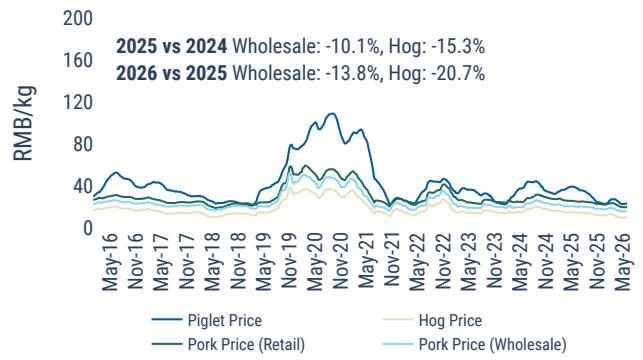

line chart

| Date    | Piglet Price | Pork Price (Retail) | Pork Price (Wholesale) |
|---------|--------------|---------------------|-------------------------|
| May-16  | ~40          | ~30                 | ~25                     |
| Nov-16  | ~50          | ~35                 | ~30                     |
| May-17  | ~45          | ~30                 | ~25                     |
| Nov-17  | ~40          | ~25                 | ~20                     |
| May-18  | ~35          | ~20                 | ~15                     |
| Nov-18  | ~30          | ~15                 | ~10                     |
| May-19  | ~40          | ~25                 | ~20                     |
| Nov-19  | ~60          | ~40                 | ~30                     |
| May-20  | ~100         | ~60                 | ~50                     |
| Nov-20  | ~120         | ~70                 | ~60                     |
| May-21  | ~80          | ~50                 | ~40                     |
| Nov-21  | ~40          | ~30                 | ~25                     |
| May-22  | ~30          | ~25                 | ~20                     |
| Nov-22  | ~40          | ~30                 | ~25                     |
| May-23  | ~35          | ~25                 | ~20                     |
| Nov-23  | ~40          | ~30                 | ~25                     |
| May-24  | ~45          | ~35                 | ~30                     |
| Nov-24  | ~40          | ~30                 | ~25                     |
| May-25  | ~35          | ~25                 | ~20                     |
| Nov-25  | ~30          | ~20                 | ~15                     |
| May-26  | ~25          | ~15                 | ~10                     |

Source: Efeedlink, NDRC, MoC, MS.

Exhibit38: Pork Wholesale/Retail Price (Weekly)  
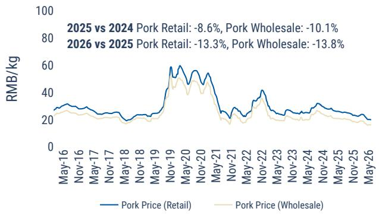

line chart

| Date    | Pork Price (Retail) | Pork Price (Wholesale) |
|---------|---------------------|-------------------------|
| May-16  | ~30                 | ~25                     |
| Nov-16  | ~35                 | ~28                     |
| May-17  | ~32                 | ~26                     |
| Nov-17  | ~30                 | ~24                     |
| May-18  | ~28                 | ~22                     |
| Nov-18  | ~30                 | ~25                     |
| May-19  | ~35                 | ~30                     |
| Nov-19  | ~55                 | ~45                     |
| May-20  | ~60                 | ~50                     |
| Nov-20  | ~55                 | ~45                     |
| May-21  | ~40                 | ~35                     |
| Nov-21  | ~25                 | ~20                     |
| May-22  | ~35                 | ~30                     |
| Nov-22  | ~40                 | ~35                     |
| May-23  | ~30                 | ~25                     |
| Nov-23  | ~35                 | ~30                     |
| May-24  | ~30                 | ~25                     |
| Nov-24  | ~35                 | ~30                     |
| May-25  | ~30                 | ~25                     |
| Nov-25  | ~25                 | ~20                     |
| May-26  | ~20                 | ~15                     |

Source: Efeedlink, NDRC, MoC, MS. Note: Pork price (retail) was re-categorized in Dec-2010.

# Raw Material Price Trends – Hogs, Hog-raising Profit (US)

Exhibit 39: US Hog and Corn Futures (Monthly)  
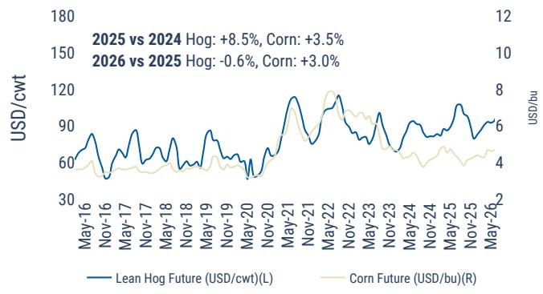

line chart

| Date    | Lean Hog Future (USD/cwt)(L) | Corn Future (USD/bu)(R) |
|---------|------------------------------|--------------------------|
| May-16  | ~70                          | ~50                      |
| Nov-16  | ~50                          | ~45                      |
| May-17  | ~80                          | ~55                      |
| Nov-17  | ~60                          | ~50                      |
| May-18  | ~70                          | ~55                      |
| Nov-18  | ~60                          | ~50                      |
| May-19  | ~80                          | ~55                      |
| Nov-19  | ~60                          | ~50                      |
| May-20  | ~50                          | ~45                      |
| Nov-20  | ~70                          | ~55                      |
| May-21  | ~100                         | ~70                      |
| Nov-21  | ~90                          | ~65                      |
| May-22  | ~110                         | ~75                      |
| Nov-22  | ~90                          | ~70                      |
| May-23  | ~80                          | ~65                      |
| Nov-23  | ~70                          | ~60                      |
| May-24  | ~80                          | ~65                      |
| Nov-24  | ~90                          | ~70                      |
| May-25  | ~100                         | ~75                      |
| Nov-25  | ~90                          | ~70                      |
| May-26  | ~80                          | ~65                      |

Source: Bloomberg, Ministry of Agriculture (China), MS.

Exhibit 40: US Hog-raising Profit (Monthly)  
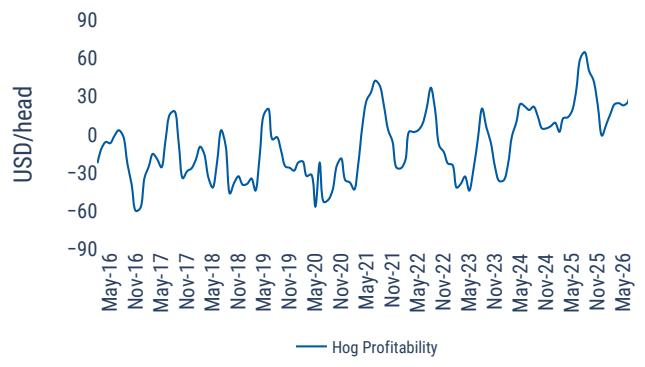

line chart

| Date    | USD/head |
|---------|----------|
| May-16  | -30      |
| Nov-16  | -60      |
| May-17  | -20      |
| Nov-17  | 20       |
| May-18  | -30      |
| Nov-18  | -50      |
| May-19  | 20       |
| Nov-19  | -30      |
| May-20  | -60      |
| Nov-20  | -30      |
| May-21  | 40       |
| Nov-21  | -30      |
| May-22  | 30       |
| Nov-22  | -30      |
| May-23  | -50      |
| Nov-23  | -30      |
| May-24  | 20       |
| Nov-24  | -30      |
| May-25  | 60       |
| Nov-25  | -30      |
| May-26  | 30       |

Source: Bloomberg, MS. MS estimates based on hog futures.

# Raw Material Price Trends – Poultry and Beef (China)

Exhibit 41: Retail Price of White Chicken and Duck (Weekly)  
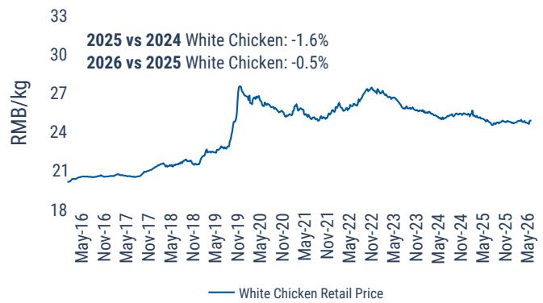

line chart

| Date    | White Chicken Retail Price (RMB/kg) |
|---------|-------------------------------------|
| May-16  | 21.0                                |
| Nov-16  | 21.0                                |
| May-17  | 21.0                                |
| Nov-17  | 21.0                                |
| May-18  | 21.5                                |
| Nov-18  | 22.0                                |
| May-19  | 23.0                                |
| Nov-19  | 27.0                                |
| May-20  | 26.5                                |
| Nov-20  | 26.0                                |
| May-21  | 25.5                                |
| Nov-21  | 26.0                                |
| May-22  | 27.0                                |
| Nov-22  | 26.5                                |
| May-23  | 26.0                                |
| Nov-23  | 25.5                                |
| May-24  | 25.0                                |
| Nov-24  | 24.5                                |
| May-25  | 24.0                                |
| Nov-25  | 24.0                                |
| May-26  | 24.0                                |

Source: Wind, MS.

Exhibit 42: Wholesale Price of White Chicken (Weekly)  
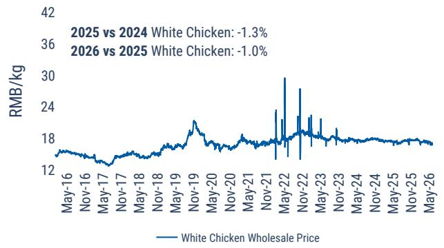

line chart

| Date    | White Chicken Wholesale Price (RMB/kg) |
|---------|----------------------------------------|
| 2025 vs 2024 | -1.3%                               |
| 2026 vs 2025 | -1.0%                               |

Source: CEIC, MS.

Exhibit 43: Retail Price: Beef (Weekly)  
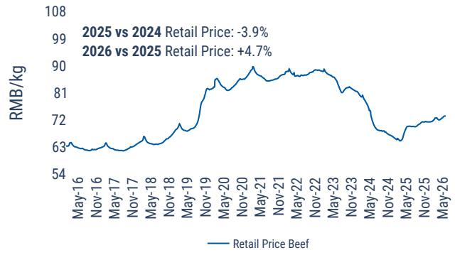

line chart

| Date    | Retail Price Beef |
|---------|-------------------|
| May-16  | 63                |
| Nov-16  | 63                |
| May-17  | 63                |
| Nov-17  | 63                |
| May-18  | 63                |
| Nov-18  | 63                |
| May-19  | 63                |
| Nov-19  | 63                |
| May-20  | 81                |
| Nov-20  | 81                |
| May-21  | 90                |
| Nov-21  | 89                |
| May-22  | 89                |
| Nov-22  | 89                |
| May-23  | 89                |
| Nov-23  | 81                |
| May-24  | 72                |
| Nov-24  | 72                |
| May-25  | 72                |
| Nov-25  | 72                |
| May-26  | 72                |

Source: CEIC, MS.

Exhibit 44: Wholesale Price: Beef (Daily)  
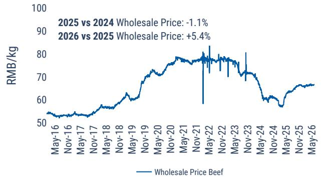

line chart

| Date    | Wholesale Price Beef (RMB/kg) |
|---------|-------------------------------|
| May-16  | ~55                           |
| Nov-16  | ~53                           |
| May-17  | ~54                           |
| Nov-17  | ~56                           |
| May-18  | ~58                           |
| Nov-18  | ~60                           |
| May-19  | ~65                           |
| Nov-19  | ~70                           |
| May-20  | ~75                           |
| Nov-20  | ~78                           |
| May-21  | ~79                           |
| Nov-21  | ~80                           |
| May-22  | ~85 (peak)                   |
| Nov-22  | ~78                           |
| May-23  | ~75                           |
| Nov-23  | ~70                           |
| May-24  | ~65                           |
| Nov-24  | ~60                           |
| May-25  | ~65                           |
| Nov-25  | ~68                           |
| May-26  | ~70                           |

Source: CEIC, MS.

# Raw Material Price Trends – Apparel & Footwear

Exhibit 45: China: Cotton Futures Prices  
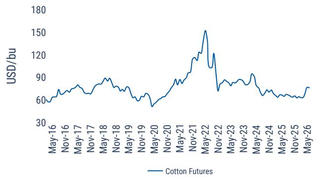

line chart

| Date    | Cotton Futures (USD/bu) |
|---------|--------------------------|
| May-16  | ~60                      |
| Nov-16  | ~70                      |
| May-17  | ~75                      |
| Nov-17  | ~80                      |
| May-18  | ~90                      |
| Nov-18  | ~85                      |
| May-19  | ~75                      |
| Nov-19  | ~65                      |
| May-20  | ~55                      |
| Nov-20  | ~70                      |
| May-21  | ~90                      |
| Nov-21  | ~110                     |
| May-22  | ~150                     |
| Nov-22  | ~120                     |
| May-23  | ~85                      |
| Nov-23  | ~90                      |
| May-24  | ~80                      |
| Nov-24  | ~70                      |
| May-25  | ~65                      |
| Nov-25  | ~60                      |
| May-26  | ~70                      |

Source: Datastream, MS.

# Raw Material Price Trends – Fertilizer, DDGS, Crude Oil, PET Bottle, Tin Spot, Linerboard

Exhibit 46: DDGS Price (Weekly)  
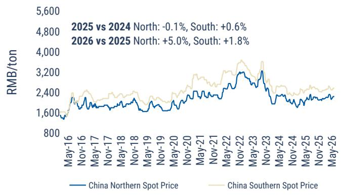

line chart

| Date    | China Northern Spot Price (RMB/ton) | China Southern Spot Price (RMB/ton) |
|---------|-------------------------------------|-------------------------------------|
| May-16  | ~1,600                              | ~1,600                              |
| Nov-16  | ~2,000                              | ~2,000                              |
| May-17  | ~1,800                              | ~1,800                              |
| Nov-17  | ~1,900                              | ~1,900                              |
| May-18  | ~1,800                              | ~1,800                              |
| Nov-18  | ~1,700                              | ~1,700                              |
| May-19  | ~1,600                              | ~1,600                              |
| Nov-19  | ~1,700                              | ~1,700                              |
| May-20  | ~1,800                              | ~1,800                              |
| Nov-20  | ~2,000                              | ~2,000                              |
| May-21  | ~2,200                              | ~2,200                              |
| Nov-21  | ~2,400                              | ~2,400                              |
| May-22  | ~2,600                              | ~2,600                              |
| Nov-22  | ~3,000                              | ~3,200                              |
| May-23  | ~3,200                              | ~3,400                              |
| Nov-23  | ~3,400                              | ~3,600                              |
| May-24  | ~2,800                              | ~2,800                              |
| Nov-24  | ~2,600                              | ~2,600                              |
| May-25  | ~2,400                              | ~2,400                              |
| Nov-25  | ~2,300                              | ~2,300                              |
| May-26  | ~2,400                              | ~2,400                              |

Source: CEIC, Bloomberg, MS.

Exhibit 47: PET Price (Weekly)  
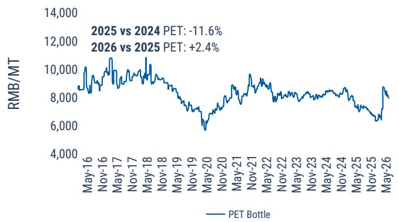

line chart

| Date    | PET Bottle |
|---------|------------|
| May-16  | ~9,000     |
| Nov-16  | ~10,500    |
| May-17  | ~10,800    |
| Nov-17  | ~10,200    |
| May-18  | ~10,500    |
| Nov-18  | ~9,500     |
| May-19  | ~8,500     |
| Nov-19  | ~7,500     |
| May-20  | ~6,000     |
| Nov-20  | ~8,500     |
| May-21  | ~9,500     |
| Nov-21  | ~9,000     |
| May-22  | ~8,500     |
| Nov-22  | ~8,000     |
| May-23  | ~8,500     |
| Nov-23  | ~8,000     |
| May-24  | ~8,500     |
| Nov-24  | ~8,000     |
| May-25  | ~7,500     |
| Nov-25  | ~6,500     |
| May-26  | ~8,500     |

Source: CEIC, Bloomberg, MS. Note: All % changes are based on prices in USD, except for those otherwise quoted.

Exhibit 48: Tin Price (Weekly)  
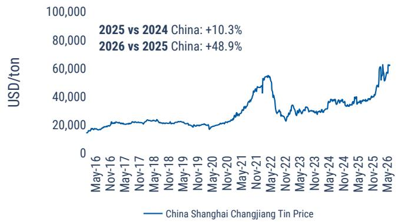

line chart

| Date    | China Shanghai Changjiang Tin Price (USD/ton) |
|---------|---------------------------------------------|
| May-16  | ~15,000                                     |
| Nov-16  | ~20,000                                     |
| May-17  | ~22,000                                     |
| Nov-17  | ~23,000                                     |
| May-18  | ~24,000                                     |
| Nov-18  | ~25,000                                     |
| May-19  | ~26,000                                     |
| Nov-19  | ~27,000                                     |
| May-20  | ~28,000                                     |
| Nov-20  | ~30,000                                     |
| May-21  | ~45,000                                     |
| Nov-21  | ~55,000                                     |
| May-22  | ~35,000                                     |
| Nov-22  | ~30,000                                     |
| May-23  | ~35,000                                     |
| Nov-23  | ~38,000                                     |
| May-24  | ~40,000                                     |
| Nov-24  | ~45,000                                     |
| May-25  | ~55,000                                     |
| Nov-25  | ~65,000                                     |
| May-26  | ~75,000                                     |

Source: CEIC, Bloomberg, MS.

Exhibit 49: Fiberboard Price (Weekly)  
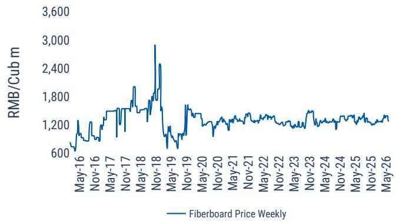

line chart

| Date    | Fiberboard Price Weekly (RMB/Cub m) |
|---------|------------------------------------|
| May-16  | ~600                               |
| Nov-16  | ~1,200                             |
| May-17  | ~1,400                             |
| Nov-17  | ~1,600                             |
| May-18  | ~1,800                             |
| Nov-18  | ~2,400                             |
| May-19  | ~1,200                             |
| Nov-19  | ~1,400                             |
| May-20  | ~1,200                             |
| Nov-20  | ~1,200                             |
| May-21  | ~1,200                             |
| Nov-21  | ~1,200                             |
| May-22  | ~1,200                             |
| Nov-22  | ~1,200                             |
| May-23  | ~1,200                             |
| Nov-23  | ~1,200                             |
| May-24  | ~1,200                             |
| Nov-24  | ~1,200                             |
| May-25  | ~1,200                             |
| Nov-25  | ~1,200                             |
| May-26  | ~1,200                             |

Source: CEIC, MS.

# Raw Material Price Trends – Pulp & Molasses

Exhibit 50: Pulp – Long Fiber & Short Fiber  
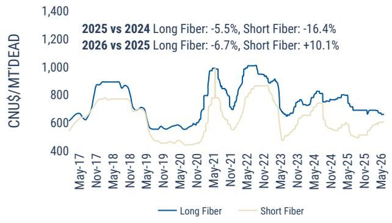

line chart

| Date    | Long Fiber | Short Fiber |
|---------|------------|-------------|
| May-17  | ~600       | ~500        |
| Nov-17  | ~900       | ~700        |
| May-18  | ~900       | ~750        |
| Nov-18  | ~700       | ~600        |
| May-19  | ~500       | ~400        |
| Nov-19  | ~550       | ~450        |
| May-20  | ~600       | ~500        |
| Nov-20  | ~700       | ~600        |
| May-21  | ~1,000     | ~800        |
| Nov-21  | ~900       | ~600        |
| May-22  | ~1,000     | ~850        |
| Nov-22  | ~900       | ~700        |
| May-23  | ~700       | ~500        |
| Nov-23  | ~800       | ~600        |
| May-24  | ~850       | ~700        |
| Nov-24  | ~800       | ~650        |
| May-25  | ~750       | ~600        |
| Nov-25  | ~700       | ~550        |
| May-26  | ~650       | ~600        |

Source: CEIC, Bloomberg, MOA, China Dairy Association, Datastream, MS. Note: All % changes are based on prices in USD, except for those otherwise quoted.

Exhibit 51: Guangxi Molasses Price Index  
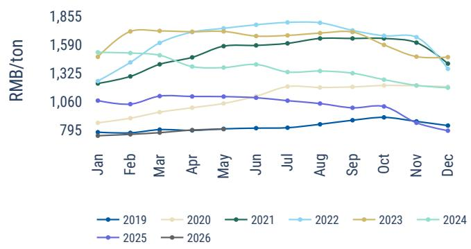

line chart

| Month | 2019  | 2020  | 2021  | 2022  | 2023  | 2024  | 2025  | 2026  |
|-------|-------|-------|-------|-------|-------|-------|-------|-------|
| Jan   | 795   | 795   | 1,060 | 1,325 | 1,325 | 1,325 | 1,060 | 795   |
| Feb   | 795   | 795   | 1,060 | 1,325 | 1,590 | 1,325 | 1,060 | 795   |
| Mar   | 795   | 795   | 1,060 | 1,325 | 1,590 | 1,325 | 1,060 | 795   |
| Apr   | 795   | 795   | 1,060 | 1,325 | 1,590 | 1,325 | 1,060 | 795   |
| May   | 795   | 795   | 1,060 | 1,325 | 1,590 | 1,325 | 1,060 | 795   |
| Jun   | 795   | 795   | 1,060 | 1,325 | 1,590 | 1,325 | 1,060 | 795   |
| Jul   | 795   | 795   | 1,060 | 1,325 | 1,590 | 1,325 | 1,060 | 795   |
| Aug   | 795   | 795   | 1,060 | 1,325 | 1,590 | 1,325 | 1,060 | 795   |
| Sep   | 795   | 795   | 1,060 | 1,325 | 1,590 | 1,325 | 1,060 | 795   |
| Oct   | 795   | 795   | 1,060 | 1,325 | 1,590 | 1,325 | 1,060 | 795   |
| Nov   | 795   | 795   | 1,060 | 1,325 | 1,485 | 1,325 | 1,060 | 795   |
| Dec   | 795   | 795   | 1,060 | 1,325 | 1,485 | 1,325 | 1,060 | 795   |

Source: MS

# Raw Material Price Trends – Precious Metals

Exhibit 52: Gold Spot Price (Weekly)  
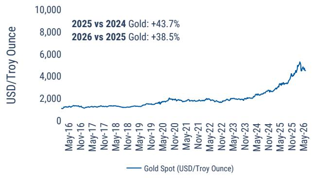

line chart

| Date    | Gold Spot (USD/Troy Ounce) |
|---------|-----------------------------|
| May-16  | ~1,000                      |
| Nov-16  | ~1,000                      |
| May-17  | ~1,000                      |
| Nov-17  | ~1,000                      |
| May-18  | ~1,000                      |
| Nov-18  | ~1,000                      |
| May-19  | ~1,000                      |
| Nov-19  | ~1,000                      |
| May-20  | ~1,500                      |
| Nov-20  | ~1,500                      |
| May-21  | ~1,500                      |
| Nov-21  | ~1,500                      |
| May-22  | ~1,500                      |
| Nov-22  | ~1,500                      |
| May-23  | ~1,500                      |
| Nov-23  | ~1,500                      |
| May-24  | ~2,000                      |
| Nov-24  | ~2,500                      |
| May-25  | ~3,500                      |
| Nov-25  | ~4,500                      |
| May-26  | ~5,500                      |

Source: Bloomberg, MS.

Exhibit 53: Platinum Spot Price (Weekly)  
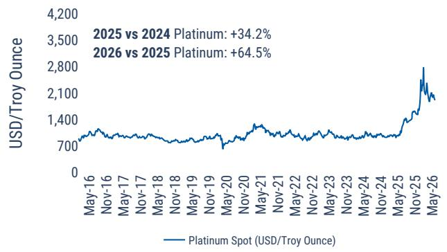

line chart

| Date    | Platinum Spot (USD/Troy Ounce) |
|---------|--------------------------------|
| May-26  | 2,800                          |

Source: Bloomberg, MS.

Exhibit 54: Diamond – Average Price (Weekly)  
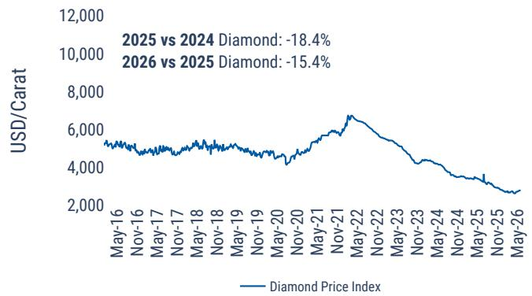

line chart

| Date    | Diamond Price Index |
|---------|---------------------|
| May-16  | ~5,000              |
| Nov-16  | ~5,000              |
| May-17  | ~5,000              |
| Nov-17  | ~5,000              |
| May-18  | ~5,000              |
| Nov-18  | ~5,000              |
| May-19  | ~5,000              |
| Nov-19  | ~5,000              |
| May-20  | ~5,000              |
| Nov-20  | ~5,000              |
| May-21  | ~6,000              |
| Nov-21  | ~7,000              |
| May-22  | ~6,500              |
| Nov-22  | ~6,000              |
| May-23  | ~5,500              |
| Nov-23  | ~5,000              |
| May-24  | ~4,500              |
| Nov-24  | ~4,000              |
| May-25  | ~3,500              |
| Nov-25  | ~3,000              |
| May-26  | ~2,500              |

Source: Bloomberg, MS

Exhibit 55: Silver Spot Price (Weekly)  
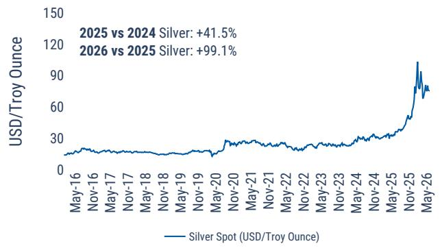

line chart

| Date    | Silver Spot (USD/Troy Ounce) |
|---------|------------------------------|
| May-16  | ~10                          |
| Nov-16  | ~15                          |
| May-17  | ~18                          |
| Nov-17  | ~16                          |
| May-18  | ~17                          |
| Nov-18  | ~18                          |
| May-19  | ~19                          |
| Nov-19  | ~20                          |
| May-20  | ~25                          |
| Nov-20  | ~30                          |
| May-21  | ~32                          |
| Nov-21  | ~30                          |
| May-22  | ~31                          |
| Nov-22  | ~33                          |
| May-23  | ~35                          |
| Nov-23  | ~38                          |
| May-24  | ~40                          |
| Nov-24  | ~45                          |
| May-25  | ~55                          |
| Nov-25  | ~70                          |
| May-26  | ~90                          |

Source: Bloomberg, MS.

# Raw Material Price Trends – Other Major Metals

Exhibit 56: Copper, Aluminum, Steel Price Growth Rates  
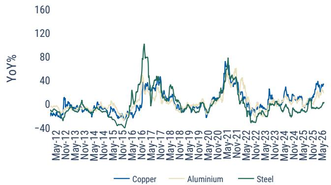

line chart

| Date    | Copper | Aluminium | Steel |
|---------|--------|-----------|-------|
| May-12  | -20    | -10       | -30   |
| Nov-12  | 0      | 0         | -10   |
| May-13  | 0      | 0         | 0     |
| Nov-13  | 0      | 0         | 0     |
| May-14  | 0      | 0         | 0     |
| Nov-14  | 0      | 0         | 0     |
| May-15  | 0      | 0         | 0     |
| Nov-15  | 0      | 0         | 0     |
| May-16  | 0      | 0         | 0     |
| Nov-16  | 0      | 0         | 0     |
| May-17  | 0      | 0         | 0     |
| Nov-17  | 0      | 0         | 0     |
| May-18  | 0      | 0         | 0     |
| Nov-18  | 0      | 0         | 0     |
| May-19  | 0      | 0         | 0     |
| Nov-19  | 0      | 0         | 0     |
| May-20  | 0      | 0         | 0     |
| Nov-20  | 0      | 0         | 0     |
| May-21  | 0      | 0         | 0     |
| Nov-21  | 0      | 0         | 0     |
| May-22  | 0      | 0         | 0     |
| Nov-22  | 0      | 0         | 0     |
| May-23  | 0      | 0         | 0     |
| Nov-23  | 0      | 0         | 0     |
| May-24  | 0      | 0         | 0     |
| Nov-24  | 0      | 0         | 0     |
| May-25  | 0      | 0         | 0     |
| Nov-25  | 0      | 0         | 0     |
| May-26  | 0      | 0         | 0     |

Source: CEIC, MS.

Exhibit 57: Copper Spot Price (Daily)  
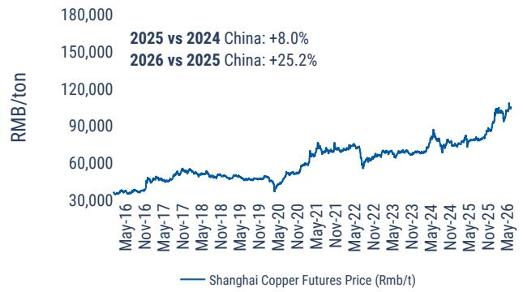

line chart

| Date     | Shanghai Copper Futures Price (Rmb/t) |
| -------- | ------------------------------------- |
| May-16   | ~30,000                               |
| Nov-16   | ~40,000                               |
| May-17   | ~50,000                               |
| Nov-17   | ~55,000                               |
| May-18   | ~50,000                               |
| Nov-18   | ~55,000                               |
| May-19   | ~50,000                               |
| Nov-19   | ~45,000                               |
| May-20   | ~60,000                               |
| Nov-20   | ~70,000                               |
| May-21   | ~75,000                               |
| Nov-21   | ~70,000                               |
| May-22   | ~65,000                               |
| Nov-22   | ~75,000                               |
| May-23   | ~80,000                               |
| Nov-23   | ~85,000                               |
| May-24   | ~90,000                               |
| Nov-24   | ~95,000                               |
| May-25   | ~105,000                              |
| Nov-25   | ~115,000                              |
| May-26   | ~125,000                              |

Source: Bloomberg, MS.

Exhibit58: Aluminium Spot Price (Daily)  
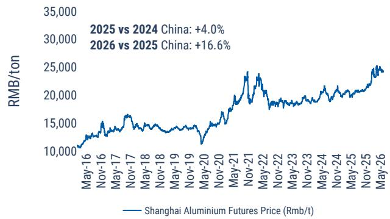

line chart

| Date     | Shanghai Aluminium Futures Price (Rmb/t) |
| -------- | ---------------------------------------- |
| May-16   | ~10,000                                  |
| Nov-16   | ~13,000                                  |
| May-17   | ~15,000                                  |
| Nov-17   | ~16,000                                  |
| May-18   | ~14,000                                  |
| Nov-18   | ~13,000                                  |
| May-19   | ~14,000                                  |
| Nov-19   | ~13,000                                  |
| May-20   | ~12,000                                  |
| Nov-20   | ~15,000                                  |
| May-21   | ~20,000                                  |
| Nov-21   | ~24,000                                  |
| May-22   | ~23,000                                  |
| Nov-22   | ~18,000                                  |
| May-23   | ~19,000                                  |
| Nov-23   | ~20,000                                  |
| May-24   | ~21,000                                  |
| Nov-24   | ~22,000                                  |
| May-25   | ~23,000                                  |
| Nov-25   | ~24,000                                  |
| May-26   | ~25,000                                  |

Source: Bloomberg, MS.

## Disclosure Section

The information and opinions in MS were prepared or are disseminated by MS Asia Limited (which accepts the responsibility for its contents) and/or MS Asia (Singapore) Pte. (Registration number 199206298Z) and/or MS Asia (Singapore) Securities Pte Ltd (Registration number 200008434H), regulated by the Monetary Authority of Singapore (which accepts legal responsibility for its contents and should be contacted with respect to any matters arising from, or in connection with, MS), and/or MS Taiwan Limited and/or MS & Co International plc, Seoul Branch, and/or MS Australia Limited (A.B.N. 67 003 734 576, holder of Australian financial services license No. 233742, which accepts responsibility for its contents), and/or MS Wealth Management Australia Pty Ltd (A.B.N. 19 009 145 555, holder of Australian financial services license No. 240813, which accepts responsibility for its contents), and/or MS India Company Private Limited having Corporate Identification No (CIN) U22990MH1998PTC115305, regulated by the Securities and Exchange Board of India ("SEBI") and holder of licenses as a Research Analyst (SEBI Registration No. INH000001105); Stock Broker (SEBI Stock Broker Registration No. INZ000244438), Merchant Banker (SEBI Registration No. INM000011203), and depository participant with National Securities Depository Limited (SEBI Registration No. IN-DP-NSDL-567-2021) having registered office at Altimus, Level 39 & 40, Pandurang Budhkar Marg, Worli, Mumbai 400018, India; Telephone no. +91-22-61181000; Compliance Officer Details: Mr. Tejarshi Hardas, Tel. No.: +91-22-61181000 or Email: tejarshi.hardas@morganstanley.com; Grievance officer details: Mr. Tejarshi Hardas, Tel. No.: +91-22-61181000 or Email: msic-compliance@morganstanley.com which accepts the responsibility for its contents and should be contacted with respect to any matters arising from, or in connection with, MS, and their affiliates (collectively, "MS"). MS India Company Private Limited (MSICPL) may use AI tools in providing research services. All recommendations contained herein are made by the duly qualified research analysts.

For important disclosures, stock price charts and equity rating histories regarding companies that are the subject of this report, please see the MS Disclosure Website at www.morganstanley.com/eqr/disclosures/webapp/generalresearch, or contact your investment representative or MS at 1585 Broadway, (Attention: Research Management), New York, NY, 10036 USA.

For valuation methodology and risks associated with any recommendation, rating or price target referenced in this research report, please contact the Client Support Team as follows: US/Canada +1 800 303-2495; Hong Kong +852 2848-5999; Latin America +1 718 754-5444 (U.S.); London +44 (0)20-7425-8169; Singapore +65 6834-6860; Sydney +61 (0)2-9770-1505; Tokyo +81 (0)3-6836-9000. Alternatively you may contact your investment representative or MS at 1585 Broadway, (Attention: Research Management), New York, NY 10036 USA.

## Analyst Certification

The following analysts hereby certify that their views about the companies and their securities discussed in this report are accurately expressed and that they have not received and will not receive direct or indirect compensation in exchange for expressing specific recommendations or views in this report: Terence Cheng; Hildy Ling; Lillian Lou; Dustin Wei.

## Global Research Conflict Management Policy

MS has been published in accordance with our conflict management policy, which is available at www.morganstanley.com/institutional/research/conflictpolicies. A Portuguese version of the policy can be found at www.morganstanley.com.br

## Important Regulatory Disclosures on Subject Companies

As of May 29, 2026, MS beneficially owned 1% or more of a class of common equity securities of the following companies covered in MS: Anhui Gujing Distillery Company Limited, Chacha Food Co Ltd, Chagee Holdings Ltd, China Mengniu Dairy, China Tourism Group Duty Free, Foshan Haitian Flavouring and Food, Hangzhou Greatstar Industrial Co Ltd, Li Ning, Muyuan Foodstuff Co. Ltd, Samsonite Group.

Within the last 12 months, MS managed or co-managed a public offering (or 144A offering) of securities of Eastroc Beverages, Foshan Haitian Flavouring and Food, Laopu Gold, Muyuan Foodstuff Co. Ltd, WH Group.

Within the last 12 months, MS has received compensation for investment banking services from Eastroc Beverages, Health and Happiness (H&H), Laopu Gold, Midea Group Co Ltd., Samsonite Group, WH Group.

In the next 3 months, MS expects to receive or intends to seek compensation for investment banking services from ANTA Sports Products, Chagee Holdings Ltd, Crystal International Group Ltd., Eastroc Beverages, Foshan Haitian Flavouring and Food, Gongniu Group Co Ltd, Gree Electric Appliances Inc of Zhuhai, Haidilao International Holding Ltd, Haier Smart Home Co Ltd, Health and Happiness (H&H), Hengan International Group, Laopu Gold, Mao Geping Cosmetics Co., Ltd, Midea Group Co Ltd., Muyuan Foodstuff Co. Ltd, Nongfu Spring Co Ltd, Pop Mart International Group, Proya Cosmetics Co. Ltd., Samsonite Group, Sun Art Retail Group Limited, Super Hi, Techtronic Industries Co Ltd, Topsports International Holdings Ltd, Weilong Delicious Global Holdings Ltd, WH Group, Yili Industrial, ZJLD Group.

Within the last 12 months, MS has received compensation for products and services other than investment banking services from ANTA Sports Products, Bosideng International Holdings Limited, Chow Tai Fook Jewellery Group Ltd, Gree Electric Appliances Inc of Zhuhai, Haidilao International Holding Ltd, Haier Smart Home Co Ltd, Health and Happiness (H&H), Midea Group Co Ltd., Pop Mart International Group, Samsonite Group, Stella International Holdings Ltd, Techtronic Industries Co Ltd, Topsports International Holdings Ltd, Uni-President China, WH Group, Yanjing Brewery, Yue Yuen Industrial Hldg, Yum China Holdings Inc..

Within the last 12 months, MS has provided or is providing investment banking services to, or has an investment banking client relationship with, the following company: ANTA Sports Products, Chagee Holdings Ltd, Crystal International Group Ltd., Eastroc Beverages, Foshan Haitian Flavouring and Food, Gongniu Group Co Ltd, Gree Electric Appliances Inc of Zhuhai, Haidilao International Holding Ltd, Haier Smart Home Co Ltd, Health and Happiness (H&H), Hengan International Group, Laopu Gold, Mao Geping Cosmetics Co., Ltd, Midea Group Co Ltd., Muyuan Foodstuff Co. Ltd, Nongfu Spring Co Ltd, Pop Mart International Group, Proya Cosmetics Co. Ltd., Samsonite Group, Sun Art Retail Group Limited, Super Hi, Techtronic Industries Co Ltd, Topsports International Holdings Ltd, Weilong Delicious Global Holdings Ltd, WH Group, Yili Industrial, ZJLD Group.

Within the last 12 months, MS has either provided or is providing non-investment banking, securities-related services to and/or in the past has entered into an agreement to provide services or has a client relationship with the following company: ANTA Sports Products, Bosideng International Holdings Limited, Chow Tai Fook Jewellery Group Ltd, Eastroc Beverages, Gree Electric Appliances Inc of Zhuhai, Haidilao International Holding Ltd, Haier Smart Home Co Ltd, Health and Happiness (H&H), Hengan International Group, Laopu Gold, Midea Group Co Ltd., Nongfu Spring Co Ltd, Pop Mart International Group, Samsonite Group, Stella International Holdings Ltd, Techtronic Industries Co Ltd, Topsports International Holdings Ltd, Uni-President China, WH Group, Yanjing Brewery, Yue Yuen Industrial Hldg, Yum China Holdings Inc..

MS & Co. LLC makes a market in the securities of Super Hi.

The equity research analysts or strategists principally responsible for the preparation of MS have received compensation based upon various factors, including quality of research, investor client feedback, stock picking, competitive factors, firm revenues and overall investment banking revenues. Equity Research analysts' or strategists' compensation is not linked to investment banking or capital markets transactions performed by MS or the profitability or revenues of particular trading desks.

MS and its affiliates do business that relates to companies/instruments covered in MS, including market making, providing liquidity, fund management, commercial banking, extension of credit, investment services and investment banking. MS sells to and buys from customers the securities/instruments of companies covered in MS on a principal basis. MS may have a position in the debt of the Company or instruments discussed in this report. MS trades or may trade as principal in the debt securities (or in related derivatives) that are the subject of the debt research report.

Certain disclosures listed above are also for compliance with applicable regulations in non-US jurisdictions.

## STOCK RATINGS

MS uses a relative rating system using terms such as Overweight, Equal-weight, Not-Rated or Underweight (see definitions below). MS does not assign ratings of Buy, Hold or Sell to the stocks we cover. Overweight, Equal-weight, Not-Rated and Underweight are not the equivalent of buy, hold and sell. Investors should carefully read the definitions of all ratings used in MS. In addition, since MS contains more complete information concerning the analyst's views, investors should carefully read MS, in its entirety, and not infer the contents from the rating alone. In any case, ratings (or research) should not be used or relied upon as investment advice. An investor's decision to buy or sell a stock should depend on individual circumstances (such as the investor's existing holdings) and other considerations.

## Global Stock Ratings Distribution

(as of May 31, 2026)

The Stock Ratings described below apply to MS's Fundamental Equity Research and do not apply to Debt Research produced by the Firm.

For disclosure purposes only (in accordance with FINRA requirements), we include the category headings of Buy, Hold, and Sell alongside our ratings of Overweight, Equal-weight, Not-Rated and Underweight. MS does not assign ratings of Buy, Hold or Sell to the stocks we cover. Overweight, Equal-weight, Not-Rated and Underweight are not the equivalent of buy, hold, and sell but represent recommended relative weightings (see definitions below). To satisfy regulatory requirements, we correspond Overweight, our most positive stock rating, with a buy recommendation; we correspond Equal-weight and Not-Rated to hold and Underweight to sell recommendations, respectively.

<table><tr><td></td><td colspan="2">Coverage Universe</td><td colspan="3">Investment Banking Clients (IBC)</td><td colspan="2">Other Material Investment ServicesClients (MISC)</td></tr><tr><td>Stock RatingCategory</td><td>Count</td><td>% of Total</td><td>Count</td><td>% of Total IBC</td><td>% of RatingCategory</td><td>Count</td><td>% of Total OtherMISC</td></tr><tr><td>Overweight/Buy</td><td>1542</td><td>42%</td><td>465</td><td>51%</td><td>30%</td><td>707</td><td>43%</td></tr><tr><td>Equal-weight/Hold</td><td>1571</td><td>43%</td><td>369</td><td>40%</td><td>23%</td><td>723</td><td>44%</td></tr><tr><td>Not-Rated/Hold</td><td>3</td><td>0%</td><td>0</td><td>0%</td><td>0%</td><td>1</td><td>0%</td></tr><tr><td>Underweight/Sell</td><td>551</td><td>15%</td><td>86</td><td>9%</td><td>16%</td><td>201</td><td>12%</td></tr><tr><td>Total</td><td>3,667</td><td></td><td>920</td><td></td><td></td><td>1632</td><td></td></tr></table>

Data include common stock and ADRs currently assigned ratings. Investment Banking Clients are companies from whom MS received investment banking compensation in the last 12 months. Due to rounding off of decimals, the percentages provided in the "% of total" column may not add up to exactly 100 percent.

## Analyst Stock Ratings

Overweight (O). The stock's total return is expected to exceed the average total return of the analyst's industry (or industry team's) coverage universe, on a risk-adjusted basis, over the next 12-18 months.

Equal-weight (E). The stock's total return is expected to be in line with the average total return of the analyst's industry (or industry team's) coverage universe, on a risk-adjusted basis, over the next 12-18 months.

Not-Rated (NR). Currently the analyst does not have adequate conviction about the stock's total return relative to the average total return of the analyst's industry (or industry team's) coverage universe, on a risk-adjusted basis, over the next 12-18 months.

Underweight (U). The stock's total return is expected to be below the average total return of the analyst's industry (or industry team's) coverage universe, on a risk-adjusted basis, over the next 12-18 months.

Unless otherwise specified, the time frame for price targets included in MS is 12 to 18 months.

## Analyst Industry Views

Attractive (A): The analyst expects the performance of his or her industry coverage universe over the next 12-18 months to be attractive vs. the relevant broad market benchmark, as indicated below.

In-Line (I): The analyst expects the performance of his or her industry coverage universe over the next 12-18 months to be in line with the relevant broad market benchmark, as indicated below. Cautious (C): The analyst views the performance of his or her industry coverage universe over the next 12-18 months with caution vs. the relevant broad market benchmark, as indicated below. Benchmarks for each region are as follows: North America - S&P 500; Latin America - relevant MSCI country index or MSCI Latin America Index; Europe - MSCI Europe; Japan - TOPIX; Asia - relevant MSCI country index or MSCI sub-regional index or MSCI AC Asia Pacific ex Japan Index.

## Important Disclosures for MS Smith Barney LLC Customers

Important disclosures regarding any material conflict of interest that can reasonably be expected to have influenced MS Smith Barney LLC's choice of a third-party research provider or the subject company of a third-party research report, are available on the MS Wealth Management disclosure website at www.morganstanley.com/online/researchdisclosures. For MS specific disclosures, you may refer to https://www.morganstanley.com/eqr/disclosures/webapp/generalresearch.

Each MS report is reviewed and approved on behalf of MS Smith Barney LLC. This review and approval is conducted by the same person who reviews the research report on behalf of MS. This could create a conflict of interest.

## Other Important Disclosures

MS policy is to update research reports as and when the Research Analyst and Research Management deem appropriate, based on developments with the issuer, the sector, or the market that may have a material impact on the research views or opinions stated therein. In addition, certain Research publications are intended to be updated on a regular periodic basis (weekly/monthly/quarterly/annual) and will ordinarily be updated with that frequency, unless the Research Analyst and Research Management determine that a different publication schedule is appropriate based on current conditions.

MS is not acting as a municipal advisor and the opinions or views contained herein are not intended to be, and do not constitute, advice within the meaning of Section 975 of the Dodd-Frank Wall Street Reform and Consumer Protection Act.

MS produces an equity research product called a "Tactical Idea." Views contained in a "Tactical Idea" on a particular stock may be contrary to the recommendations or views expressed in research on the same stock. This may be the result of differing time horizons, methodologies, market events, or other factors. For all research available on a particular stock, please contact your sales representative or go to Matrix at http://www.morganstanley.com/matrix.

MS is provided to our clients through our proprietary research portal on Matrix and also distributed electronically by MS to clients. Certain, but not all, MS products are also made available to clients through third-party vendors or redistributed to clients through alternate electronic means as a convenience. For access to all available MS, please contact your sales representative or go to Matrix at http://www.morganstanley.com/matrix.

Any access and/or use of MS is subject to MS's Terms of Use (http://www.morganstanley.com/terms.html). By accessing and/or using MS, you are indicating that you have read and agree to be bound by our Terms of Use (http://www.morganstanley.com/terms.html). In addition you consent to MS processing your personal data and using cookies in accordance with our Privacy Policy and our Global Cookies Policy (http://www.morganstanley.com/privacy\_pledge.html), including for the purposes of setting your preferences and to collect readership data so that we can deliver better and more personalized service and products to you. To find out more information about how MS processes personal data, how we use cookies and how to reject cookies see our Privacy Policy and our Global Cookies Policy (http://www.morganstanley.com/privacy\_pledge.html). Please use the provided link to review the Terms and Conditions and Most Important Terms and Conditions for MS India Company Private Limited (https://www.morganstanley.com/assets/pdfs/about-us-global-offices/india/Terms\_and\_conditions.pdf) and the following link to review the audit report (https://ny.matrix.ms.com/eqr/research/webapp/researchdocs/MSICPL\_Morgan\_Stanley\_Research\_Audit\_Report.pdf).

If you do not agree to our Terms of Use and/or if you do not wish to provide your consent to MS processing your personal data or using cookies please do not access our research. MS does not provide individually tailored investment advice. MS has been prepared without regard to the circumstances and objectives of those who receive it. MS recommends that investors independently evaluate particular investments and strategies, and encourages investors to seek the advice of a financial adviser. The appropriateness of an investment or strategy will depend on an investor's circumstances and objectives. The securities, instruments, or strategies discussed in MS may not be suitable for all investors, and certain investors may not be eligible to purchase or participate in some or all of them. MS is not an offer to buy or sell or the solicitation of an offer to buy or sell any security/instrument or to participate in any particular trading strategy. The value of and income from your investments may vary because of changes in interest rates, foreign exchange rates, default rates, prepayment rates, securities/instruments prices, market indexes, operational or financial conditions of companies or other factors. There may be time limitations on the exercise of options or other rights in securities/instruments transactions. Past performance is not necessarily a guide to future performance. Estimates of future performance are based on assumptions that may not be realized. If provided, and unless otherwise stated, the closing price on the cover page is that of the primary exchange for the subject company's securities/instruments.

The fixed income research analysts, strategists or economists principally responsible for the preparation of MS have received compensation based upon various factors, including quality, accuracy and value of research, firm profitability or revenues (which include fixed income trading and capital markets profitability or revenues), client feedback and competitive factors. Fixed Income Research analysts', strategists' or economists' compensation is not linked to investment banking or capital markets transactions performed by MS or the profitability or revenues of particular trading desks.

The "Important Regulatory Disclosures on Subject Companies" section in MS lists all companies mentioned where MS owns 1% or more of a class of common equity securities of the companies. For all other companies mentioned in MS, MS may have an investment of less than 1% in securities/instruments or derivatives of securities/instruments of companies and may trade them in ways different from those discussed in MS. Employees of MS not involved in the preparation of MS may have investments in securities/instruments or derivatives of securities/instruments of companies mentioned and may trade them in ways different from those discussed in MS. Derivatives may be issued by MS or associated persons.

With the exception of information regarding MS, MS is based on public information. MS makes every effort to use reliable, comprehensive information, but we make no representation that it is accurate or complete. We have no obligation to tell you when opinions or information in MS change apart from when we intend to discontinue equity research coverage of a subject company. Facts and views presented in MS have not been reviewed by, and may not reflect information known to, professionals in other MS business areas, including investment banking personnel.

MS personnel may participate in company events such as site visits and are generally prohibited from accepting payment by the company of associated expenses unless pre-approved by authorized members of Research management.

MS may make investment decisions that are inconsistent with the recommendations or views in this report.

To our readers based in Taiwan or trading in Taiwan securities/instruments: Information on securities/instruments that trade in Taiwan is distributed by MS Taiwan Limited ("MSTL"). Such information is for your reference only. The reader should independently evaluate the investment risks and is solely responsible for their investment decisions. MS may not be distributed to the public media or quoted or used by the public media without the express written consent of MS. Any non-customer reader within the scope of Article 7-1 of the Taiwan Stock Exchange Recommendation Regulations accessing and/or receiving MS is not permitted to provide MS to any third party (including but not limited to related parties, affiliated companies and any other third parties) or engage in any activities regarding MS which may create or give the appearance of creating a conflict of interest. Information on securities/instruments that do not trade in Taiwan is for informational purposes only and is not to be construed as a recommendation or a solicitation to trade in such securities/instruments. MSTL may not execute transactions for clients in these securities/instruments.

Certain information in MS was sourced by employees of the Shanghai Representative Office of MS Asia Limited for the use of MS Asia Limited. MS is not incorporated under PRC law and the research in relation to this report is conducted outside the PRC. MS does not constitute an offer to sell or the solicitation of an offer to buy any securities in the PRC. PRC investors shall have the relevant qualifications to invest in such securities and shall be responsible for obtaining all relevant approvals, licenses, verifications and/or registrations from the relevant governmental authorities themselves. Neither this report nor any part of it is intended as, or shall constitute, provision of any consultancy or advisory service of securities investment as defined under PRC law. Such information is provided for your reference only.

MS is disseminated in Brazil by MS C.T.V.M. S.A. located at Av. Brigadeiro Faria Lima, 3600, 6th floor, São Paulo - SP, Brazil; and is regulated by the Comissão de Valores Mobiliários; in Mexico by MS México, Casa de Bolsa, S.A. de C.V which is regulated by Comision Nacional Bancaria y de Valores. Paseo de los Tamarindos 90, Torre 1, Col. Bosques de las Lomas Floor 29, 05120 Mexico City; in Japan by MS MUFG Securities Co., Ltd. and, for Commodities related research reports only, MS Capital Group Japan Co., Ltd; in Hong Kong by MS Asia Limited (which accepts responsibility for its contents) and by MS Bank Asia Limited; in Singapore by MS Asia (Singapore) Pte. (Registration number 199206298Z) and/or MS Asia (Singapore) Securities Pte Ltd (Registration number 200008434H), regulated by the Monetary Authority of

Singapore (which accepts legal responsibility for its contents and should be contacted with respect to any matters arising from, or in connection with, MS) and by MS Bank Asia Limited, Singapore Branch (Registration number T14FC0118); in Australia to "wholesale clients" within the meaning of the Australian Corporations Act by MS Australia Limited A.B.N. 67 003 734 576, holder of Australian financial services license No. 233742, which accepts responsibility for its contents; in Australia to "wholesale clients" and "retail clients" within the meaning of the Australian Corporations Act by MS Wealth Management Australia Pty Ltd (A.B.N. 19 009 145 555, holder of Australian financial services license No. 240813, which accepts responsibility for its contents; in Korea by MS & Co International plc, Seoul Branch; in India by MS India Company Private Limited having Corporate Identification No (CIN) U22990MH1998PTC115305, regulated by the Securities and Exchange Board of India ("SEBI") and holder of licenses as a Research Analyst (SEBI Registration No. INH000001105); Stock Broker (SEBI Stock Broker Registration No. INZ000244438), Merchant Banker (SEBI Registration No. INM000011203), and depository participant with National Securities Depository Limited (SEBI Registration No. IN-DP-NSDL-567-2021) having registered office at Altimus, Level 39 & 40, Pandurang Budhkar Marg, Worli, Mumbai 400018, India; Telephone no. +91-22-61181000; Compliance Officer Details: Mr. Tejarshi Hardas, Tel. No.: +91-22-61181000 or Email: tejarshi.hardas@morganstanley.com; Grievance officer details: Mr. Tejarshi Hardas, Tel. No.: +91-22-61181000 or Email: msic-compliance@morganstanley.com. MS India Company Private Limited (MSICPL) may use AI tools in providing research services. All recommendations contained herein are made by the duly qualified research analysts; in Canada by MS Canada Limited; in Germany and the European Economic Area where required by MS Europe S.E., authorised and regulated by Bundesanstalt fuer Finanzdienstleistungsaufsicht (BaFin) under the reference number 149169; in the US by MS & Co. LLC, which accepts responsibility for its contents. MS & Co. International plc, authorized by the Prudential Regulation Authority and regulated by the Financial Conduct Authority and the Prudential Regulation Authority, disseminates in the UK research that it has prepared, and research which has been prepared by any of its affiliates, only to persons who (i) are investment professionals falling within Article 19(5) of the Financial Services and Markets Act 2000 (Financial Promotion) Order 2005 (as amended, the "Order"); (ii) are persons who are high net worth entities falling within Article 49(2)(a) to (d) of the Order; or (iii) are persons to whom an invitation or inducement to engage in investment activity (within the meaning of section 21 of the Financial Services and Markets Act 2000, as amended) may otherwise lawfully be communicated or caused to be communicated. RMB MS Proprietary Limited is a member of the JSE Limited and A2X (Pty) Ltd. RMB MS Proprietary Limited is a joint venture owned equally by MS International Holdings Inc. and RMB Investment Advisory (Proprietary) Limited, which is wholly owned by FirstRand Limited. The information in MS is being disseminated by MS Saudi Arabia, regulated by the Capital Market Authority in the Kingdom of Saudi Arabia, and is directed at Sophisticated investors only.

MS Hong Kong Securities Limited is the liquidity provider/market maker for securities of ANTA Sports Products, Budweiser Brewing Company APAC Ltd, China Mengniu Dairy, China Resources Beer Holdings Co Ltd, China Tourism Group Duty Free, Giant Biogene Holding Co Ltd, Haidilao International Holding Ltd, Laopu Gold, Li Ning, Mao Geping Cosmetics Co., Ltd, Midea Group Co Ltd., Nongfu Spring Co Ltd, Pop Mart International Group, Shenzhou International Group Holdings, Techtronic Industries Co Ltd, Tsingtao Brewery Co Ltd listed on the Stock Exchange of Hong Kong Limited. An updated list can be found on HKEx website: http://www.hkex.com.hk.

The information in MS is being communicated by MS & Co. International plc (DIFC Branch), regulated by the Dubai Financial Services Authority (the DFSA) or by MS & Co. International plc (ADGM Branch), regulated by the Financial Services Regulatory Authority Abu Dhabi (the FSRA), and is directed at Professional Clients only, as defined by the DFSA or the FSRA, respectively. The financial products or financial services to which this research relates will only be made available to a customer who we are satisfied meets the regulatory criteria of a Professional Client. A distribution of the different MS Research ratings or recommendations, in percentage terms for Investments in each sector covered, is available upon request from your sales representative.

The information in MS is being communicated by MS & Co. International plc (QFC Branch), regulated by the Qatar Financial Centre Regulatory Authority (the QFCRA), and is directed at business customers and market counterparties only and is not intended for Retail Customers as defined by the QFCRA.

As required by the Capital Markets Board of Turkey, investment information, comments and recommendations stated here, are not within the scope of investment advisory activity. Investment advisory service is provided exclusively to persons based on their risk and income preferences by the authorized firms. Comments and recommendations stated here are general in nature. These opinions may not fit to your financial status, risk and return preferences. For this reason, to make an investment decision by relying solely to this information stated here may not bring about outcomes that fit your expectations.

The trademarks and service marks contained in MS are the property of their respective owners. Third-party data providers make no warranties or representations relating to the accuracy, completeness, or timeliness of the data they provide and shall not have liability for any damages relating to such data. The Global Industry Classification Standard (GICS) was developed by and is the exclusive property of MSCI and S&P.

MS, or any portion thereof may not be reprinted, sold or redistributed without the written consent of MS.

Indicators and trackers referenced in MS may not be used as, or treated as, a benchmark under Regulation EU 2016/1011, or any other similar framework.

The issuers and/or fixed income products recommended or discussed in certain fixed income research reports may not be continuously followed. Accordingly, investors should regard those fixed income research reports as providing stand-alone analysis and should not expect continuing analysis or additional reports relating to such issuers and/or individual fixed income products. MS may hold, from time to time, material financial and commercial interests regarding the company subject to the Research report.

Registration granted by SEBI and certification from the National Institute of Securities Markets (NISM) in no way guarantee performance of the intermediary or provide any assurance of returns to investors. Investment in securities market are subject to market risks. Read all the related documents carefully before investing.

INDUSTRY COVERAGE: China/Hong Kong Consumer

<table><tr><td>COMPANY (TICKER)</td><td>RATING (AS OF)</td><td>PRICE* (06/10/2026)</td></tr><tr><td colspan="3">Dustin Wei</td></tr><tr><td>ANTA Sports Products (2020.HK)</td><td>++</td><td>HK$75.35</td></tr><tr><td>Bosideng International Holdings Limited (3998.HK)</td><td>O (11/27/2024)</td><td>HK$4.26</td></tr><tr><td>C&amp;S Paper Co Ltd (002511.SZ)</td><td>U (09/22/2021)</td><td>Rmb6.88</td></tr><tr><td>Chacha Food Co Ltd (002557.SZ)</td><td>U (02/20/2025)</td><td>Rmb21.60</td></tr><tr><td>Giant Biogene Holding Co Ltd (2367.HK)</td><td>O (08/08/2024)</td><td>HK$26.98</td></tr><tr><td>Health and Happiness (H&amp;H) (1112.HK)</td><td>E (07/12/2021)</td><td>HK$10.61</td></tr><tr><td>Hengan International Group (1044.HK)</td><td>E (05/06/2021)</td><td>HK$25.40</td></tr><tr><td>Li Ning (2331.HK)</td><td>O (10/09/2019)</td><td>HK$17.73</td></tr><tr><td>Mao Geping Cosmetics Co., Ltd (1318.HK)</td><td>O (03/10/2026)</td><td>HK$59.75</td></tr><tr><td>Pop Mart International Group (9992.HK)</td><td>O (05/17/2021)</td><td>HK$173.10</td></tr><tr><td>Proya Cosmetics Co. Ltd. (603605.SS)</td><td>O (10/12/2021)</td><td>Rmb64.88</td></tr><tr><td>Samsonite Group (1910.HK)</td><td>O (06/15/2020)</td><td>HK$14.28</td></tr><tr><td>Shanghai Jahwa United Co. Ltd. (600315.SS)</td><td>U (07/07/2023)</td><td>Rmb17.88</td></tr><tr><td>Sun Art Retail Group Limited (6808.HK)</td><td>E (03/05/2019)</td><td>HK$1.09</td></tr><tr><td>Topsports International Holdings Ltd (6110.HK)</td><td>O (11/13/2019)</td><td>HK$2.78</td></tr><tr><td>Weilong Delicious Global Holdings Ltd (9985.HK)</td><td>O (06/11/2025)</td><td>HK$7.84</td></tr><tr><td>Yonghui Superstores (601933.SS)</td><td>U (05/18/2023)</td><td>Rmb3.23</td></tr></table>

Hildy Ling

<table><tr><td>Angel Yeast Co. Ltd. (600298.SS)</td><td>E (05/21/2026)</td><td>Rmb35.45</td></tr><tr><td>Beijing Roborock Technology Co Ltd (688169.SS)</td><td>O (09/25/2024)</td><td>Rmb105.28</td></tr><tr><td>China Tourism Group Duty Free (1880.HK)</td><td>E (12/13/2023)</td><td>HK$55.00</td></tr><tr><td>China Tourism Group Duty Free (601888.SS)</td><td>E (12/13/2023)</td><td>Rmb58.05</td></tr><tr><td>Chow Tai Fook Jewellery Group Ltd (1929.HK)</td><td>O (03/04/2025)</td><td>HK$11.27</td></tr><tr><td>Chow Tai Seng Jewellery Co Ltd (002867.SZ)</td><td>U (03/04/2025)</td><td>Rmb12.09</td></tr><tr><td>Ecovacs Robotics Co Ltd (603486.SS)</td><td>E (10/30/2023)</td><td>Rmb58.47</td></tr><tr><td>Foshan Haitian Flavouring and Food (603288.SS)</td><td>E (07/28/2025)</td><td>Rmb35.10</td></tr><tr><td>Foshan Haitian Flavouring and Food (3288.HK)</td><td>E (05/21/2026)</td><td>HK$31.62</td></tr><tr><td>Haidilao International Holding Ltd (6862.HK)</td><td>O (05/26/2021)</td><td>HK$12.68</td></tr><tr><td>Hangzhou Robam Appliances Co Ltd (002508.SZ)</td><td>U (02/21/2024)</td><td>Rmb16.48</td></tr><tr><td>Laopu Gold (6181.HK)</td><td>O (10/20/2025)</td><td>HK$450.80</td></tr><tr><td>Super Hi (HDL.O)</td><td>E (01/14/2025)</td><td>US$13.09</td></tr><tr><td>Zhejiang Supor Co. Ltd. (002032.SZ)</td><td>E (01/17/2022)</td><td>Rmb42.95</td></tr></table>

Lillian Lou

<table><tr><td>Anhui Gujing Distillery Company Limited (000596.SZ)</td><td>U (02/13/2026)</td><td>Rmb87.21</td></tr><tr><td>Budweiser Brewing Company APAC Ltd (1876.HK)</td><td>O (11/04/2019)</td><td>HK$6.95</td></tr><tr><td>Chagee Holdings Ltd (CHA.O)</td><td>O (06/02/2025)</td><td>US$10.90</td></tr><tr><td>China Mengniu Dairy (2319.HK)</td><td>O (09/14/2017)</td><td>HK$16.54</td></tr><tr><td>China Resources Beer Holdings Co Ltd (0291.HK)</td><td>O (12/11/2018)</td><td>HK$23.38</td></tr><tr><td>Chongqing Brewery Co. Ltd. (600132.SS)</td><td>U (07/30/2021)</td><td>Rmb50.79</td></tr><tr><td>Eastroc Beverages (605499.SS)</td><td>O (03/12/2026)</td><td>Rmb131.88</td></tr><tr><td>Eastroc Beverages (9980.HK)</td><td>O (03/12/2026)</td><td>HK$128.60</td></tr><tr><td>Gree Electric Appliances Inc of Zhuhai (000651.SZ)</td><td>O (04/14/2020)</td><td>Rmb38.20</td></tr><tr><td>Haier Smart Home Co Ltd (600690.SS)</td><td>E (01/17/2022)</td><td>Rmb20.42</td></tr><tr><td>Haier Smart Home Co Ltd (6690.HK)</td><td>E (01/17/2022)</td><td>HK$21.26</td></tr><tr><td>Kweichow Moutai Company Ltd. (600519.SS)</td><td>O (10/17/2014)</td><td>Rmb1,275.88</td></tr><tr><td>Luzhou Lao Jiao Co. Ltd (000568.SZ)</td><td>E (01/23/2019)</td><td>Rmb85.41</td></tr><tr><td>Midea Group Co Ltd. (0300.HK)</td><td>O (11/01/2024)</td><td>HK$90.65</td></tr><tr><td>Midea Group Co Ltd. (000333.SZ)</td><td>O (01/17/2022)</td><td>Rmb83.90</td></tr><tr><td>Muyuan Foodstuff Co. Ltd (2714.HK)</td><td>O (03/17/2026)</td><td>HK$32.22</td></tr><tr><td>Muyuan Foodstuff Co. Ltd (002714.SZ)</td><td>O (03/17/2026)</td><td>Rmb34.43</td></tr><tr><td>Nongfu Spring Co Ltd (9633.HK)</td><td>E (07/30/2021)</td><td>HK$42.62</td></tr><tr><td>Shanxi Xinghuacun Fen Wine Factory Co. (600809.SS)</td><td>O (10/28/2020)</td><td>Rmb118.79</td></tr><tr><td>Shuanghui Development (000895.SZ)</td><td>U (03/16/2021)</td><td>Rmb24.32</td></tr><tr><td>Tingyi (Cayman Islands) (0322.HK)</td><td>E (07/25/2025)</td><td>HK$10.62</td></tr><tr><td>Tsingtao Brewery Co Ltd (0168.HK)</td><td>E (11/01/2024)</td><td>HK$49.50</td></tr><tr><td>Tsingtao Brewery Co Ltd (600600.SS)</td><td>E (02/28/2024)</td><td>Rmb61.03</td></tr><tr><td>Uni-President China (0220.HK)</td><td>E (07/25/2025)</td><td>HK$7.41</td></tr><tr><td>Want Want China Holdings Ltd (0151.HK)</td><td>E (11/29/2023)</td><td>HK$4.10</td></tr><tr><td>WH Group (0288.HK)</td><td>O (02/24/2025)</td><td>HK$8.75</td></tr><tr><td>Wuliangye Yibin Company Ltd. (000858.SZ)</td><td>E (08/15/2024)</td><td>Rmb79.14</td></tr><tr><td>Yanghe Brewery (002304.SZ)</td><td>U (01/05/2021)</td><td>Rmb43.24</td></tr><tr><td>Yanjing Brewery (000729.SZ)</td><td>U (09/02/2015)</td><td>Rmb11.85</td></tr><tr><td>Yili Industrial (600887.SS)</td><td>O (01/29/2014)</td><td>Rmb25.58</td></tr><tr><td>Yum China Holdings Inc. (YUMC.N)</td><td>O (03/20/2018)</td><td>US$42.72</td></tr><tr><td>ZJLD Group (6979.HK)</td><td>E (02/13/2026)</td><td>HK$7.85</td></tr><tr><td colspan="3">Terence Cheng</td></tr><tr><td>Chervon Holdings Ltd. (2285.HK)</td><td>E (04/12/2024)</td><td>HK$15.36</td></tr><tr><td>Crystal International Group Ltd. (2232.HK)</td><td>E (06/23/2025)</td><td>HK$6.07</td></tr><tr><td>Gongniu Group Co Ltd (603195.SS)</td><td>O (05/08/2023)</td><td>Rmb40.75</td></tr><tr><td>Hangzhou Greatstar Industrial Co Ltd (002444.SZ)</td><td>E (10/26/2022)</td><td>Rmb30.80</td></tr><tr><td>Huali Industrial Group Co (300979.SZ)</td><td>U (02/10/2026)</td><td>Rmb33.21</td></tr><tr><td>Shenzhou International Group Holdings (2313.HK)</td><td>O (07/13/2017)</td><td>HK$43.60</td></tr><tr><td>Stella International Holdings Ltd (1836.HK)</td><td>E (06/23/2025)</td><td>HK$13.40</td></tr><tr><td>Techtronic Industries Co Ltd (0669.HK)</td><td>O (12/05/2019)</td><td>HK$113.90</td></tr><tr><td>Yue Yuen Industrial Hldg (0551.HK)</td><td>E (09/14/2021)</td><td>HK$14.06</td></tr></table>

Stock Ratings are subject to change. Please see latest research for each company.  
\* Historical prices are not split adjusted.

© 2026 MS