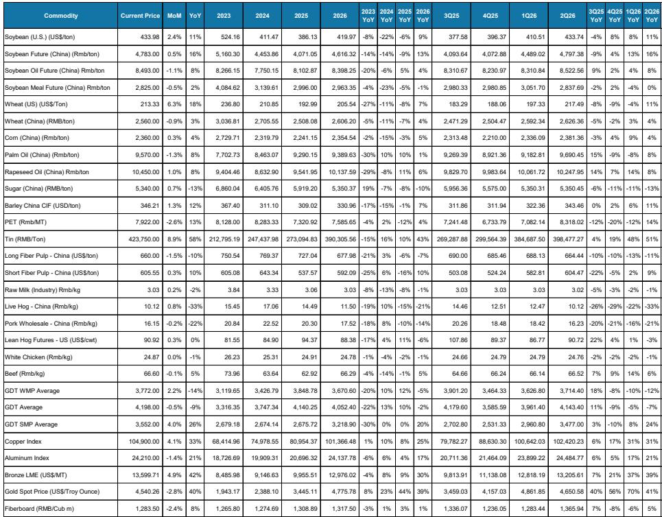
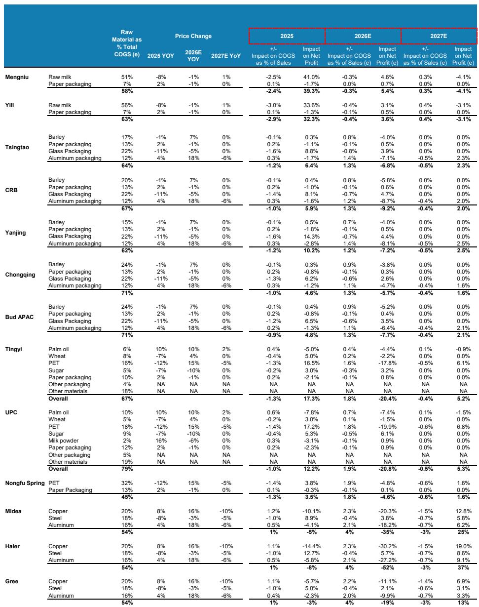
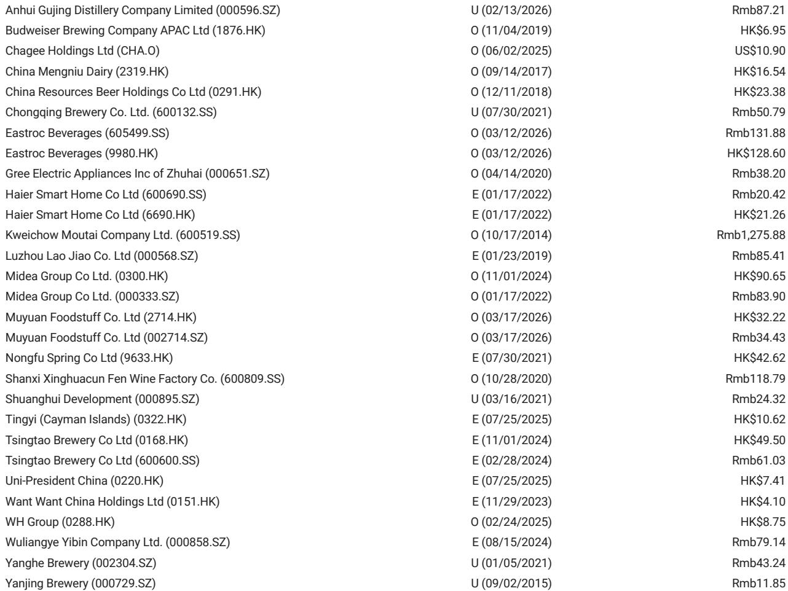

# Raw Material Divergence Is Reshaping China's Consumer Landscape: The Strategic Winners and Losers Are Already Emerging

The conventional wisdom that falling input costs uniformly benefit China's consumer sector is becoming dangerously simplistic. In May 2026, the raw material price complex sent a far more nuanced signal: tin and copper surged, PET and gold declined, and hog prices continued their structural descent. For investors who treat these movements as mere cost line items, the risk is missing the deeper strategic realignment underway. The real question is not which companies have cheaper inputs, but which ones have the pricing power, inventory management, and competitive positioning to turn those inputs into sustainable margin expansion rather than a temporary tailwind that competitors will quickly arbitrage away.

This is not a cyclical story about commodity volatility. It is a structural story about how China's consumer giants are being sorted into two camps: those that can use raw material disinflation to fund market share wars, and those that will see their cost advantages evaporate as competitors match prices. The report from a leading global investment bank provides the raw data, but the strategic implications demand a deeper read. The divergence in raw material trends is creating a winner-take-most dynamic in dairy, a high-stakes capacity shakeout in pork, and a margin squeeze in beverages that will test the mettle of even the most established players.

The timing matters because we are approaching a critical inflection point. Raw milk prices appear to have bottomed after years of oversupply, hog prices are approaching what analysts believe is a mid-2026 trough, and PET costs remain elevated despite a monthly decline. Each of these turning points carries asymmetric implications for the companies involved. The next six months will determine which consumer names emerge with stronger competitive moats and which ones get trapped in a cycle of margin compression and market share loss.

## Raw Milk Stabilization Signals a Structural Shift in Dairy Economics, Not Just a Cyclical Bounce

The stabilization of raw milk prices at approximately Rmb3.03 per kilogram represents far more than a respite from deflation. After years of supply-driven price declines that squeezed dairy margins across the board, the market is now entering a phase where the balance of power shifts from upstream farms to downstream processors. The report notes that both Yili and Mengniu expect liquid milk to resume growth in 2026, with market share gains coming from smaller players who lack the scale to absorb the coming recovery in raw milk costs.

The strategic insight here is counterintuitive: rising raw milk prices are actually a positive catalyst for the industry leaders. When prices were falling, every player could claim a cost advantage, and the market was flooded with cheap product that compressed margins for everyone. Now, as prices stabilize and begin to inch higher, the smaller players who have no pricing power and thin margins will be squeezed out. The dairy giants, by contrast, have the scale to negotiate better terms, the brand equity to pass through some cost increases, and the balance sheet to absorb the transition.

The report also highlights a critical second-order effect: provisions for inventory will likely be largely reduced in 2026. This is not a minor accounting adjustment. During the years of falling milk prices, dairy companies had to set aside significant provisions against the declining value of their raw milk inventories. As prices stabilize and potentially rise, those provisions reverse, flowing directly to net margin. For Yili and Mengniu, this could be a multi-billion renminbi tailwind that is not yet fully priced into consensus estimates. The question for investors is whether the market is discounting this as a one-time event or recognizing it as the beginning of a multi-year margin recovery cycle.

## The Hog Price Collapse Is Accelerating Capacity Rationalization, Creating a Once-in-a-Decade Entry Point for the Industry Leader

The hog price data in the report tells a story of brutal but necessary cleansing. Prices have fallen to approximately Rmb10.1 per kilogram, a level that is unprofitable for most producers. The report explicitly states that this decline should accelerate industry capacity rationalization and bring forward a price inflection expected around mid-2026. For the industry leader, Muyuan, this is the classic contrarian opportunity: near-term earnings pain for long-term market share gain.

The mechanism is straightforward but often misunderstood by investors focused on quarterly earnings. When hog prices are low, the marginal producers with higher cost structures bleed cash. They cannot sustain losses indefinitely, so they exit the market or reduce their sow herds. This reduces future supply, which eventually pushes prices back up. The companies with the lowest cost structures and strongest balance sheets can withstand the downturn and emerge with a larger share of a more rational market.

What makes this cycle different from previous hog price troughs is the scale advantage of the industry leader. Muyuan has invested heavily in modern, disease-resistant facilities and vertical integration. Its cost structure is meaningfully lower than the industry average. When prices recover, every renminbi of price increase flows disproportionately to its bottom line. The report estimates a bull case upside of over 100 percent from current levels, which reflects not just a cyclical recovery but a structural gain in market share that persists through the next downturn.

The unresolved question is timing. The report expects a price inflection around mid-2026, but hog markets are notoriously difficult to forecast with precision. If the recovery comes later than expected, the near-term earnings pressure could test investor patience. The risk-reward skew, however, is heavily in favor of the patient investor, assuming the company's cost advantage remains intact.

## PET and Palm Oil Divergence Creates a Margin Squeeze in Beverages That Will Separate the Strong from the Vulnerable

The beverage segment presents the most complex raw material picture in the report. PET prices, while down 3 percent month-over-month in May, remain elevated year-to-date and are closely tied to oil prices. Palm oil prices have also stayed high, with Tianjin spot prices up 1 percent year-to-date. For companies like Tingyi and Uni-President China, which have significant exposure to both PET for beverage packaging and palm oil for noodles, this is a double-edged margin challenge.

The report flags that pressure is expected to emerge from late second quarter through third quarter on beverage segment margins. This is the critical window because it coincides with the summer peak season for beverage consumption. Companies that locked in PET costs at lower prices earlier in the year, such as Eastroc, have a clear advantage. Those that did not will face the uncomfortable choice of either absorbing the cost increase and watching margins shrink, or raising prices and risking market share loss in a highly competitive environment.

The strategic distinction here is between companies that treat raw material procurement as a tactical afterthought and those that treat it as a core competitive capability. Eastroc's ability to lock in PET costs for the full year and sugar costs for approximately six months at prices below last year's level is not luck. It reflects a deliberate procurement strategy that gives the company a margin buffer while competitors scramble. The report also notes that Eastroc's energy drink and Water Boost growth momentum, along with other key SKU performance, will be the key watch items amid intense competition. This is the right framing: cost advantage is only valuable if it translates into market share gains, not just margin preservation.

The beer segment, by contrast, appears better positioned. The report notes that overall cost pressure remains manageable, with other raw material costs staying relatively steady despite higher aluminum prices. More importantly, the industry is seeing improved average selling price trends driven by a more favorable channel mix, reduced consumer promotions, and a shift toward mid-range products. This is a structural improvement in pricing power that can offset input cost volatility. The beer companies have done the hard work of premiumizing their portfolios, and they are now reaping the benefits in the form of margin resilience.

## Gold Price Declines Introduce a New Risk for Jewelry Demand That Pure Brand Building May Not Fully Offset

The gold price decline presents one of the most intriguing and underappreciated dynamics in the report. Laopu, which is 100 percent exposed to fixed-price gold jewelry products, faces a potential demand drag as falling gold prices reduce the investment appeal of its products. This is a counterintuitive risk because lower raw material costs typically improve margins. But for a company whose products are purchased partly as a store of value, falling gold prices can deter consumers who fear further declines.

The report suggests that this demand drag could be partially offset by improving margins given lower raw material costs. But the net effect on earnings is uncertain, and the report explicitly states that stock sentiment might remain under pressure in the near term as the capital market turns skeptical on demand versus long-term growth potential via brand building. This is a classic tension between financial logic and consumer psychology.

The strategic question for Laopu is whether its brand equity is strong enough to decouple demand from gold price movements. If consumers are buying the brand and the design, not just the gold content, then a decline in gold prices could actually stimulate volume growth as products become more affordable. But if the purchase decision is driven primarily by gold's investment value, then the decline is a genuine headwind. The report does not resolve this question, and it is likely the single most important variable for the stock's trajectory over the next twelve months.

## The Report Leaves Critical Questions Unanswered About the Sustainability of Margin Expansion and the Risk of Competitive Response

For all its analytical rigor, the report leaves several meaningful open questions that investors must answer for themselves. The most important is whether the margin expansion expected in dairy and pork is sustainable or merely a one-time recovery from depressed levels. In dairy, the reversal of inventory provisions is a genuine tailwind, but it is finite. Once inventories are normalized, margin improvement must come from operational leverage and pricing power. The report does not quantify how much of the expected margin expansion is from provision reversals versus underlying business improvement.

In pork, the assumption that industry capacity rationalization will lead to a price recovery within a specific timeframe is inherently uncertain. Hog cycles are influenced by disease outbreaks, government policy, and farmer behavior, all of which are difficult to model. If the recovery is delayed, the near-term losses for Muyuan could be deeper than expected, and the stock could remain under pressure for longer than the bull case assumes.

There is also the question of competitive response. If dairy margins expand significantly, what prevents smaller players from cutting prices to regain market share? If beverage margins are squeezed, what prevents a price war that destroys profitability for everyone? The report implicitly assumes that industry leaders have sufficient pricing power to avoid these outcomes, but that assumption deserves scrutiny. The history of China's consumer sector is littered with examples of margin expansion that attracted competitive entry and was quickly competed away.

## A Decision Framework for Navigating Raw Material Divergence

For investors looking to translate this report into actionable decisions, a simple but powerful framework emerges. Classify each company into one of four categories based on two variables: raw material exposure and competitive positioning.

The first category is companies with favorable raw material trends and strong competitive positioning. These are the most attractive investments. Yili, Mengniu, and Eastroc fit this description. They benefit from stabilizing or declining input costs and have the scale, brand, or procurement capability to capture the margin upside.

The second category is companies with favorable raw material trends but weak competitive positioning. These are value traps. They will see margin improvement, but it will be temporary because competitors will match their cost advantage or because they lack the pricing power to hold onto the gains. Some smaller dairy and pork producers may fall into this category.

The third category is companies with unfavorable raw material trends but strong competitive positioning. These are the beer companies and potentially Laopu if its brand proves resilient. They face headwinds from input costs, but they have the pricing power or product mix to offset the impact. They are not obviously cheap, but they offer downside protection.

The fourth category is companies with unfavorable raw material trends and weak competitive positioning. These are the stocks to avoid. Tingyi and Uni-President China, particularly in the beverage segment, face rising costs and intense competition. The report's equal-weight ratings reflect this precarious position.

This framework is not a substitute for detailed financial analysis, but it provides a structured way to think about which raw material movements matter and why. The specific numbers in the report are useful, but the strategic logic is what separates informed investors from those who are simply reacting to headline price changes.

The full report contains detailed charts on PET prices, hog prices, palm oil prices, and other key raw materials that are essential for tracking these trends in real time. It also includes the analysts' order of preference and price targets for the covered stocks, which provide a useful benchmark for evaluating current valuations.

Join the community to read the full report and review the original charts.

*This article is for learning and discussion only and does not constitute investment advice.*

Personal reading notes and learning share only. Not investment advice.

