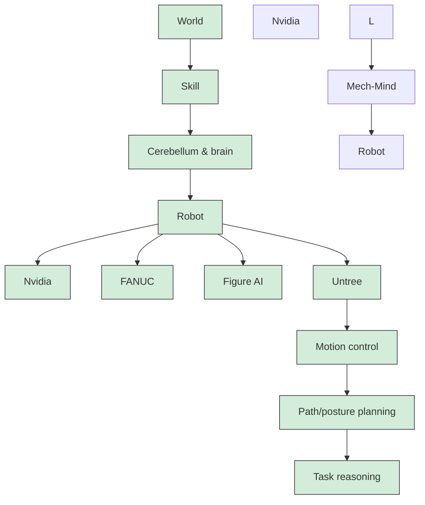

你是麦肯锡/投研风格的微信公众号财经文章主笔，擅长用金字塔原理把研报内容转化为“有主张、有层次、有洞察、但仍保留完整报告阅读欲望”的长文。

【目标】
- 基于下面的研报解析内容，写一篇微信公众号文章 Markdown。
- 风格：稳重、专业、克制、有洞察，像咨询公司合伙人写给高净值读者/产业决策者的研报导读。
- 长度：约 3000 字，允许上下浮动 15%。
- 不要使用 emoji。
- 可以基于报告内容做适度发散，但必须是从原文逻辑推出的判断，不要编造数据、公司动作或引用。
- 不要把研报所有正文内容讲完，要留下明确但自然的伏笔，让读者愿意加入社群阅读完整报告。

【金字塔原理写作原则】
1. 结论先行：文章开头先回答“这份报告最值得看的判断是什么”，而不是介绍背景。
2. 统领思想：全文只能服务一个主判断，避免变成摘要合集。
3. 纵向回答：每一层都要回答上一层提出的“为什么”或“所以呢”。
4. 横向 MECE：每个一级小节必须彼此独立、共同支撑主判断，避免重叠。
5. Synthesis over summary：不要复述报告段落，要提炼“这些事实合在一起意味着什么”。
6. So what：每个小节末尾必须落到对行业、公司、竞争格局、资产定价或读者观察框架的含义。
7. Action title：所有 `##` 小标题必须是“直接讲述洞察的完整句子”，不能是目录标签。

【标题与小标题硬性要求】
- `# 标题` 必须直接表达一个判断，例如“市场真正低估的不是需求，而是供给侧的再定价”。
- `# 标题` 必须包含报告机构的中文名称。已识别机构名：`Bernstein`。标题格式建议：`# Bernstein：一句主判断`。如果识别机构名为空，请从研报标题/正文中识别机构并使用中文名，例如GS、摩根斯坦利、HSBC、JPM、UBS、Citi、美国银行、BARC、DB、NOM。
- 机构名只要求出现在 `# 标题` 中，正文可以克制提及，不要为了重复机构名牺牲可读性。
- 禁止使用以下机械标题：
  - 一、核心判断
  - 二、真正重要的是结构性变量
  - 三、报告没有说透
  - 四、对读者的启发
  - 关键变化
  - 投资启示
  - 总结
- 所有 `##` 标题都要像麦肯锡报告里的 action title：读完标题就知道这一节结论。
- 小标题可以带序号，但序号后必须是一句洞察，例如：`## 1. 这轮变化真正考验的是企业能否把规模转化为议价权`。

【建议结构，但不要机械照抄标题】
1. `# 标题`：机构中文名 + 一句主判断，不超过 40 字。
2. 开头 4-6 段：直接给出主判断、为什么现在重要、报告提供了什么新信号。
3. 4-6 个 `##` 小节：每个小节标题都是洞察句，不是栏目名。
4. 至少一个小节讨论“报告尚未完全回答的关键问题”，但标题也要是洞察句。
5. 至少一个小节给出读者的观察框架，但不要命名为“对读者的启发”。
6. 文末自然承接未解问题，引导读者加入社群/微信群继续讨论。不要照抄固定话术，请基于本文未解问题每次重新写一段自然 CTA；语义可以参考：欢迎来星球微信群里继续讨论。
7. 在免责声明前，单独插入这张图片链接：``
8. 结尾只输出英文灰色免责声明：`<p style="color:#999999;font-size:12px;">Personal reading notes and learning share only. Not investment advice.</p>`

【hook 要求】
- 不要硬插“加入社群”。
- hook 应该来自正文自然出现的未解问题，比如：关键假设尚未验证、竞争优势仍需拆解、图表背后的二阶影响没有展开。
- 文末 CTA 要像“顺着这些未解问题继续读完整报告/继续讨论”，不是广告口吻。
- CTA 必须每篇重新写，不能固定输出“加入社群，领取完整研报解读与原始图表”。可以类似“欢迎来星球微信群里继续讨论”。

【图片要求】
- 不要主动生成 MinerU 图片 markdown；系统会在文章生成后自动插入 MinerU 原始图片。
- 但文末免责声明前必须保留知识星球图片：``。

【内容边界】
- 只能基于研报原文和解析结果推导，不要编造数据、公司动作、引用。
- 遇到不确定内容，要用“这里仍需验证”“报告没有完全展开”等表达。
- 避免“震惊”“爆款”“一文看懂”等浮夸表达。
- 不要出现小红书话题标签。
- 不要出现 emoji。
- 不要隐藏报告机构名；标题必须出现机构中文名。正文如需概括来源，可写“这份Bernstein研报”或“该机构报告”，但不要编造机构观点以外的信息。
- 不要解释你的思考过程，不要输出多余说明。

【研报解析内容】
"""
# Humanoid Robotics: A scientist, an inventor, an engineer, and a gardener walk into a room ...

Jay Huang, Ph.D. +852 2123 2631 jay.huang@bernsteinsg.com

Weibin Liang, Ph.D. +852 2123 2666 weibin.liang@bernsteinsg.com

Dien Wang, Ph.D. +852 2123 2622 dien.wang@bernsteinsg.com

The quest for investable companies in humanoid robotics proves challenging, as there are >150 players crowding every section of the supply chain (link), and the list keeps growing by the month. This indicates low barrier to entry. The important question, however, is not “barrier to entry” but “room for differentiation”-- in this magnificent place called humanoid robotics, it is easy to enter the door, but through that door is a room with a very high ceiling.

Walking into this room are a scientist, an inventor, an engineer, and a gardener.

The scientist scratches his head and attacks the unknown. The inventor murmurs “why is there something rather than nothing” $^{1}$ while he pulls out of his pockets lots of things. The engineer is busy making and modifying things. The gardener, having set up the trellis and planted the seeds, attends to his plants only occasionally.

One moves closer and sees: The scientist draws little brains on his sketch board with mysterious words such as VLA, WAM, Latent Space ... The inventor has made a pile of humanoids of various sizes and looks, some with legs, others with wheels, one of which even has eight arms! The engineer's pile has mostly gears and motors, some assembled into joints, hands and arms, others torn apart. The gardener seems to be away, and his flourishing plants have weird tags such as integrators, skill packages, data labs ...

Our four characters act out the four elements of competitive differentiation in the humanoid robot industry today.

The robotic brain model is a field of active scientific research. In just a few years, the paradigm has evolved from LLM to VLA (vision-language-action) models to many varieties of world models (Exhibit 1). In the quest for a robotic brain model, there is now light at the end of the tunnel, but it's unclear what lies beyond, and the tunnel remains long. Scientists aspire to lead us through and turn the unknown to the known.

EXHIBIT 1: Rapid evolution of World Action Models (WAMs)  

```mermaid
graph TD
  A["2024"] --> B["Joint WAM"]
  B --> C["Diffusion-based"]
  C --> D["Autoregressive"]
  D --> E["WAMs"]
  E --> F["Cascaded WAM"]
    
    subgraph sg_2024["2024"]
  G["X-WAM"] --> H["GigaWorld Policy"]
  H --> I["FRAPPE"]
  I --> J["DreamZero"]
  J --> K["Cosmos Policy"]
  K --> L["UD-VLA"]
  L --> M["VideoVLA"]
  M --> N["FLARE"]
  N --> O["UWM"]
  O --> P["PAD"]
  P --> Q["Unified Stream"]
  Q --> R["Multi-Stream"]
  R --> S["GR-MR"]
  S --> T["GR-1"]
  T --> U["GR-2"]
  U --> V["UnPi"]
  V --> W["AVDC"]
  W --> X["VLP"]
  X --> Y["Im2Flow2Act"]
  Y --> Z["Gen2Act"]
  Z --> AA["3DFlowAction"]
  AA --> AB["F1"]
  AB --> AC["DUST"]
  AC --> AD["Motus"]
  AD --> AE["Act2Goal"]
  AE --> AF["UVA"]
  AF --> AG["CoVAR"]
  AG --> AH["FutureVLA"]
  AH --> AI["VLA-JEPA"]
  AI --> AJ["Say, Dream, and Act"]
  AJ --> AK["VAG"]
  AK --> AL["Veo-Act"]
  AL --> AM["MVISTA-4D"]
  AM --> AN["S-VAM"]
  AN --> AO["Video Policy"]
  AO --> AP["LAPA"]
  AP --> AQ["VPP"]
  AQ --> AR["VILP"]
  AR --> AS["ARDUP"]
  AS --> AT["Explicit"]
  AT --> AU["Dreamitate"]
    end
    
    subgraph sg_2025["2025"]
  AV["VAG"] --> AW["π"]
  AW --> AX["Veo-Act"]
  AX --> AY["MVISTA-4D"]
  AY --> AZ["S-VAM"]
  AZ --> BA["Video Policy"]
  BA --> BB["LAPA"]
  BB --> BC["VPP"]
  BC --> BD["VILP"]
  BD --> BE["ARDUP"]
  BE --> BF["Explicit"]
    end
    
    subgraph sg_2026["2026"]
  BG["VAG"] --> BH["π"]
  BH --> BI["Veo-Act"]
  BI --> BJ["MVISTA-4D"]
  BJ --> BK["S-VAM"]
  BK --> BL["Video Policy"]
  BL --> BM["LAPA"]
  BM --> BN["VPP"]
  BN --> BO["VILP"]
  BO --> BP["ARDUP"]
  BP --> BQ["Explicit"]
    end
```


<details>
<summary>flowchart</summary>


</details>

Note: The link to the source paper: https://arxiv.org/abs/2605.12090  
Source: "World Action Models: The Next Frontier in Embodied AI" by Siyin Wang, et. al

A robot is more than the sum of its components, and a robot maker is not just an assembler. This inventor maps out the vast variety of robot applications, translates the desired functions to form factors and technical requirements, such as movement speed and payload, and breaks them down to components specs. He injects into his robots the motion capability (“the cerebellum”). He carefully balances versatility and performance of each design (unique and better than his peers, he strongly believes!). He thinks that he will eventually end up with a few tens of designs to satisfy the practically unlimited use cases in the world.

A component maker watches the inventor closely and constantly adapts its own products. This engineer strives to make things better and cheaper, even though the technology is generally well understood by peers. And “better” is too easy a word, which the engineer fully understands can mean precision, strength, reliability, rigidity, size and weight, energy efficiency … and many more. One day, the hectic changes caused by the inventor will slow down, and he will finally be able to optimize everything to the extreme.

EXHIBIT 2: Automation and robotic players and their primary elements of differentiation

<table><tr><td>Elements of differentiation</td><td>Industry player</td><td>SMC</td><td>Harmonic Drive</td><td>FANUC</td><td>Keyence</td><td>Unitree</td><td>Physical Intelligence</td><td>Academia</td></tr><tr><td>Scientist</td><td></td><td></td><td></td><td></td><td></td><td></td><td>✓</td><td>✓</td></tr><tr><td>Inventor</td><td></td><td></td><td></td><td>✓</td><td>✓</td><td>✓</td><td></td><td></td></tr><tr><td>Engineer</td><td></td><td>✓</td><td>✓</td><td>✓</td><td></td><td></td><td></td><td></td></tr><tr><td>Gardener</td><td></td><td></td><td></td><td>✓</td><td></td><td>✓</td><td></td><td></td></tr></table>

Note: Unitree and Physical Intelligence are private.  
Source: Bernstein analysis

The final element of differentiation is to become the “owner” of the ecosystem (Exhibit 3). A variety of additional players join force to unlock the industry’s potential. They develop new robotic skill sets, collect data and do training, build accessories, and deploy for users. To be the gardener at the center of the ecosystem is to be the center of gravity of these players. He waits for his plants to bear fruits

EXHIBIT 3: The Physical AI and Robotic ecosystem  


<details>
<summary>flowchart</summary>


</details>

Note: Nvidia is covered by Bernstein U.S. Semiconductors team, Figure AI, Mech-Mind, and Unitree are private.  
Source: Bernstein analysis

Our fable of the industry is clearly simplified, while the reality is entangled. A robot maker, being the inventor, also needs to be a good engineer. A component maker, from time to time, invents new products. It is fair to ask whether robot OEMs or component suppliers are the better segment to invest in. Good investment opportunities arise in both, but structurally, we think robot OEMs commands multiple elements to differentiate, instead of being forced to compete on the narrow path of engineering excellence. Many robot makers have naturally integrated into brain model development, so their products, with the cerebellum and the brain, are advanced hardware-software packages. The best of these

robot makers also start to emerge at the center of the ecosystem (link). He is an inventor also wearing the hats of the scientist and the engineer, and gardening is his weekend job.

One exits the room of humanoid robotics, and in this magic house he finds many more rooms with our four friends (Exhibit 2). Scientists are more likely present in the newer rooms, such as those tagged “Quantum Computing” and “Fusion Energy”. In other rooms, scientists made their marks and have left; inventors and engineers are the busiest. In some ancient rooms, engineers alone remain working. In the room tagged “Industrial Robotics”, FANUC, the inventor, has a very large pile of things and is right now tending the garden with his friends Nvidia (link) and Google (link). In another, Keyence is an inventor with a towering presence (Exhibit 4). His pile has over 6,000 items, and he keeps pulling new stuff from his pockets at amazing speed (link).

EXHIBIT 4: Keyence generates \~20% of revenue from new products every year and steadily expands its product scope.  


<details>
<summary>flowchart</summary>

```mermaid
graph TD
  A["High accuracy non-vision sensor"] --> B["Machine vision system & sensor"]
  B --> C["&quot;Digital&quot; microscope"]
  C --> D["Control & drive"]
  D --> E["3D machine vision"]
  E --> F["Metrology system"]
  F --> G["Data and software"]
  G --> H["Fusion of sensing technologies"]
  H --> I["Vision-guided Robotics"]
  I --> J["Industrial AI"]
    
    subgraph Keyence New Product Launches
  K["2016"] --> L["Keyence New Product Launches"]
  M["2017"] --> N["Keyence New Product Launches"]
  O["2018"] --> P["Keyence New Product Launches"]
  Q["2019"] --> R["Keyence New Product Launches"]
  S["2020"] --> T["Keyence New Product Launches"]
  U["2021"] --> V["Keyence New Product Launches"]
  W["2021"] --> X["Keyence New Product Launches"]
  Y["2023"] --> Z["Keyence New Product Launches"]
  AA["2024"] --> AB["Keyence New Product Launches"]
  AC["2025"] --> AD["Keyence New Product Launches"]
  AE["2026"] --> AF["Keyence New Product Launches"]
```
</details>

Source: Keyence, Bernstein analysis

BERNSTEIN TICKER TABLE

<table><tr><td rowspan="2">Ticker</td><td rowspan="2">Rating</td><td colspan="3">10 Jun 2026</td><td rowspan="2">TTMRel.Perf.</td><td colspan="4">Reported EPS</td><td colspan="3">Reported P/E (x)</td></tr><tr><td>Cur</td><td>ClosingPrice</td><td>PriceTarget</td><td>Cur</td><td>2025A</td><td>2026E</td><td>2027E</td><td>2025A</td><td>2026E</td><td>2027E</td></tr><tr><td>6954.JP (Fanuc)</td><td>O</td><td>JPY</td><td>6,763.00</td><td>7,000.00</td><td>36.1%</td><td>JPY</td><td>178.47</td><td>207.32</td><td>193.15</td><td>37.9</td><td>32.6</td><td>35.0</td></tr><tr><td>002747.CH (Estun)</td><td>M</td><td>CNY</td><td>35.80</td><td>26.00</td><td>40.7%</td><td>CNY</td><td>0.05</td><td>0.31</td><td>0.32</td><td>716.0</td><td>116.5</td><td>110.7</td></tr><tr><td>2715.HK (Estun)</td><td>M</td><td>HKD</td><td>17.65</td><td>17.26</td><td>NA</td><td>CNY</td><td>0.05</td><td>0.31</td><td>0.32</td><td>353.0</td><td>57.4</td><td>54.6</td></tr><tr><td>CGNX (Cognex)</td><td>O</td><td>USD</td><td>58.69</td><td>75.00</td><td>66.4%</td><td>USD</td><td>0.67</td><td>1.46</td><td>1.62</td><td>87.6</td><td>40.2</td><td>36.3</td></tr><tr><td>6324.JP (HDSI)</td><td>O</td><td>JPY</td><td>6,240.00</td><td>7,800.00</td><td>66.7%</td><td>JPY</td><td>16.99</td><td>57.37</td><td>79.51</td><td>367.3</td><td>108.8</td><td>78.5</td></tr><tr><td>6861.JP (Keyence)</td><td>O</td><td>JPY</td><td>72,890</td><td>86,000</td><td>(19.5)%</td><td>JPY</td><td>1,835.63</td><td>2,248.48</td><td>2,494.78</td><td>39.7</td><td>32.4</td><td>29.2</td></tr><tr><td>300124.CH (Inovance)</td><td>O</td><td>CNY</td><td>70.10</td><td>82.00</td><td>(25.5)%</td><td>CNY</td><td>1.87</td><td>2.19</td><td>2.65</td><td>37.5</td><td>32.0</td><td>26.5</td></tr><tr><td>JPL</td><td></td><td></td><td>2,519.12</td><td></td><td></td><td></td><td></td><td></td><td></td><td></td><td></td><td></td></tr><tr><td>ASIAX</td><td></td><td></td><td>1,920.52</td><td></td><td></td><td></td><td></td><td></td><td></td><td></td><td></td><td></td></tr><tr><td>SPX</td><td></td><td></td><td>7,266.99</td><td></td><td></td><td></td><td></td><td></td><td></td><td></td><td></td><td></td></tr></table>

O - Outperform, M - Market-Perform, U - Underperform, NR - Not Rated, CS - Coverage Suspended  
6954.JP, 6861.JP base year is 2026;  
Source: Bloomberg, Bernstein estimates and analysis.

## I. REQUIRED DISCLOSURES

References to "Bernstein" or the "Firm" in these disclosures relate to the following entities: Bernstein Institutional Services LLC (April 1, 2024 onwards), Bernstein & Co., LLC (pre April 1, 2024), Bernstein Autonomous LLP, BSG France S.A. (April 1, 2024 onwards), Bernstein (Hong Kong) Limited 盛博香港有限公司, Bernstein (Canada) Limited, Bernstein (India) Private Limited (SEBI registration no. INH000006378), Bernstein (Singapore) Private Limited, Bernstein Japan KK (サンフォード・C・バーンスタイン株式会社) and analysts employed by SG Africa Technologies & Services to produce Bernstein under a Global Services Agreement in place between Bernstein and SG.

Bernstein is part of a joint venture between SG (SG) and AllianceBernstein, L.P. (AB). Unless specifically noted otherwise, for purposes of these disclosures, references to Bernstein's “affiliates” relate to both SG and AB and their respective affiliates.

## VALUATION METHODOLOGY

## FANUC Corp

We use EV/EBITDA multiple as the primary valuation method. We set a JPY7,000 target price using an EV/EBITDA multiple of 22.5x against our 1-year forward-looking EBITDA estimates (from the PT date) of JPY 251,396 million. We set the target multiple referencing previous cycles but adjust for secular or competitive trends that we believe are moving multiples higher or lower across multiple cycles. We use DCF as reference for the company's long-term intrinsic value. As we move along the different stages of a cycle, the time-dependent target price may deviate from the DCF-implied value.

## Estun Automation Co Ltd

We use EV/EBITDA multiple as the primary valuation method. Our price target of RMB26.0 (A-share) and HKD 17.3 (H-share) are based on an EV/EBITDA multiple of 35.9x against our 1-year forward EBITDA estimate of RMB677.2mn. We set the multiple referencing previous cycles but adjust for secular or competitive trends that we believe are moving multiples higher or lower across multiple cycles. We set Estun's H-share TP based on the average A/H share premium. We use DCF as reference for the company's long-term intrinsic value. As we move along the different stages of a cycle, the time-dependent target price may deviate from the DCF-implied value.

## Cognex Corp

We use EV/EBITDA multiple as the primary valuation method. We set a USD75.00 price target using an EV/EBITDA multiple of 36.5x against our 1-year forward-looking EBITDA estimates (from the PT date) of USD 333.4 million. We set the multiple referencing previous cycles but adjust for secular or competitive trends that we believe are moving multiples higher or lower across multiple cycles. We use DCF as reference for the company's long-term intrinsic value. As we move along the different stages of a cycle, the time-dependent price target may deviate from the DCF-implied value.

## Harmonic Drive Systems Inc

We use EV/EBITDA multiple as the primary valuation method. We set a JPY 7,800 target price using an EV/EBITDA multiple of 45.5x against our 1-year forward-looking EBITDA estimates (from the PT date) of JPY16,194 mn. We set the target multiple referencing previous cycles but adjust for secular or competitive trends that we believe are moving multiples higher or lower across multiple cycles. We use DCF as reference for the company's long-term intrinsic value. As we move along the different stages of a cycle, the time-dependent target price may deviate from the DCF-implied value.

## Keyence Corp

We use EV/EBITDA multiple as the primary valuation method. We set a JPY86,000 target price using an EV/EBITDA multiple of 21.5x against our 1-year forward-looking EBITDA estimates (from the PT date) of JPY 831,323 million. We apply our target multiple on the upcoming cycle peak to get the enterprise value, and discount it back to derive our price target. We use DCF as reference for the company's long-term intrinsic value. As we move along the different stages of a cycle, the time-dependent target price may deviate from the DCF-implied value.

## Shenzhen Inovance Technolo-A

We use EV/EBITDA multiple as the primary valuation method. We set a RMB82 target price using an EV/EBITDA multiple of 24.0x against our 1-year forward-looking EBITDA estimates (from the PT date) of RMB 8971.6 million. We set the multiple referencing previous cycles but adjust for secular or competitive trends that we believe are moving multiples higher or lower across multiple cycles. We use DCF as reference for the company's long-term intrinsic value. As we move along the different stages of a cycle, the time-dependent target price may deviate from the DCF-implied value.

## RISKS

## FANUC Corp

FANUC's end user markets are cyclical in nature. The risks are mainly associated with the global macro economy and currency. The downside risks include 1) delayed or weaker than expected global automation demand, 2) losing market share to competitors, and 3) appreciation of JPY.

## Estun Automation Co Ltd

The risks to our view on Estun are mainly associated with China and global macro economy, including industrial capex cycles, trade frictions, and currency. In addition, the integration of Cloos and realization of planned synergies are important to our thesis and sources of additional risks. The upside risks include 1) faster than expected margin expansion; 2) faster than expected market share gain. The downside risks include 1) weaker than expected automation demands in China; 2) delayed or slower than expected in operating and net margin improvement; 3) delayed or slower than expected market share gain.

## Cognex Corp

Similar to Keyence, the risks are mainly associated with the global macro economy and the overall utilization of manufac

[中间内容因长度限制已省略]

ence system.

Bernstein may use artificial intelligence tools in the preparation of its materials. Any such materials are reviewed by Bernstein's research analysts prior to publication.

This report has been prepared for information purposes only and is based on current public information that we consider reliable, but the entities noted herein do not warrant or represent (express or implied) as to the sources of information or data contained herein are accurate, complete, not misleading or as to its fitness for the purpose intended even though the entities noted herein rely on reputable or trustworthy data providers, it should not be relied upon as such. Opinions expressed are the author(s)' current opinions as of the date appearing on the material only and we do not undertake to advise you of any change in the reported information or in the opinions herein.

Any references to SG herein are purely factual, based upon publicly available information, and included for comparative purposes only. They do not constitute an opinion or recommendation with respect to the securities of SG.

This publication was prepared and issued by the entity referred to herein for distribution to eligible counterparties or professional clients. The information in this report is intended for general circulation and does not constitute an offer to buy or sell any security, investment, legal or tax advice nor a personal recommendation, as defined by any of the aforementioned regulators. It does not take into account the particular investment objectives, financial situations, or needs of individual investors. The report has not been reviewed by any of the aforementioned regulators and does not represent any official recommendation from the aforementioned regulators. The investments referred to herein may not be suitable for you. Investors must make their own investment decisions in consultation with advice sought from a financial adviser regarding the suitability of the investment product, taking into account the specific investment objectives, financial situation or particular needs of any recipient of the recommendation, before the recipient makes a commitment to purchase the investment product.

The analysis contained herein is based on numerous assumptions. Different assumptions could result in materially different results. The information in this report does not constitute, or form part of, any offer to sell or issue, or any offer to purchase or subscribe for shares, or to induce engagement in any other investment activity. The value of any securities or financial instruments mentioned in this report may fluctuate subject to market conditions. Information about past performance of an investment is not necessarily a guide to, indicative of, or assurance of future performance. Estimates of future performance mentioned by the research analyst in this report are based on assumptions that may not be realized due to unforeseen factors like market volatility/fluctuation. In relation to securities or financial instruments denominated in a foreign currency other than the clients' home currency, movements in exchange rates will have an effect on the value, either favorable or unfavorable. Before acting on any recommendations in this report, recipients should consider the appropriateness of investing in the subject securities or financial instruments mentioned in this report and, if necessary, seek independent professional advice.

The securities described herein may not be eligible for sale in all jurisdictions or to certain categories of investors where that permission profile is not consistent with the licenses held by the entities noted herein. This document is for distribution only as may be permitted by law. It is not directed to, or intended for distribution to or use by, any person or entity who is a citizen or resident of or located in any locality, state, country or other jurisdiction where such distribution, publication, availability or use would be contrary to law or regulation or would subject the entities noted herein to any regulation or licensing requirement within such jurisdiction.

Source: Bloomberg Index Services Limited. BLOOMBERG® is a trademark and service mark of Bloomberg Finance L.P. and its affiliates (collectively “Bloomberg”). Bloomberg or Bloomberg’s licensors own all proprietary rights in the Bloomberg Indices. Neither Bloomberg nor Bloomberg’s licensors approves or endorses this material, or guarantees the accuracy or completeness of any information herein, or makes any warranty, express or implied, as to the results to be obtained therefrom and, to the maximum extent allowed by law, neither shall have any liability or responsibility for injury or damages arising in connection therewith.

No part of this material may be reproduced, distributed or transmitted or otherwise made available without prior consent of the entities noted herein. Copyright Bernstein Institutional Services LLC Bernstein Autonomous LLP, BSG France S.A., Bernstein (Hong Kong) Limited 盛博香港有限公司, Bernstein (Canada) Limited, Bernstein (India) Private Limited (SEBI registration no. INH000006378), Bernstein (Singapore) Private Limited and Bernstein Japan KK (サンフォード・C・バーンスタイン株式会社). All rights reserved. The trademarks and service marks contained herein are the property of their respective owners. Any unauthorized use or disclosure is strictly prohibited. The entities noted herein may pursue legal action if the unauthorized use results in any defamation and/or reputational risk to the entities noted herein and research published under the Bernstein and Autonomous brands.
"""
