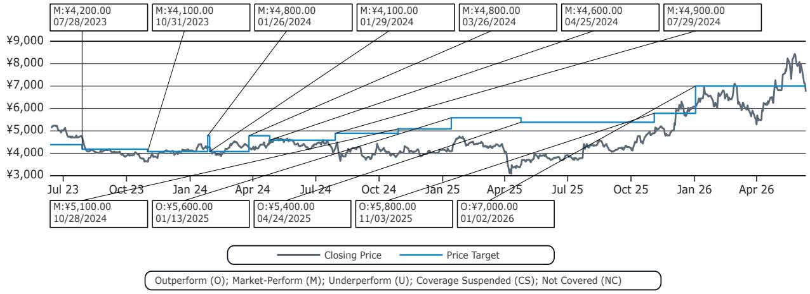
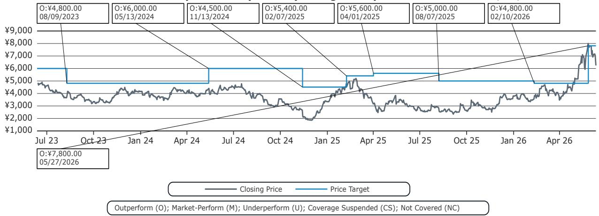

# Bernstein：人形机器人真正的竞争壁垒不是技术，而是分化能力

人形机器人赛道正在经历一场奇特的拥挤。超过150家玩家挤满了供应链的每一个环节，而且这个名单每个月都在变长。按照常规逻辑，这指向一个低门槛市场，不值得严肃对待。但Bernstein这份研报给出了一个截然相反的判断：真正的问题不是“进入门槛”，而是“分化空间”。走进人形机器人这扇门很容易，但门后的房间天花板极高。

这份报告以四个角色——科学家、发明家、工程师、园丁——构建了一套极为精炼的竞争分化框架。它不是在罗列哪家公司做了什么事，而是在回答一个更本质的问题：在这个产业从实验室走向商业化的过程中，什么样的能力结构才能让一家企业不被淹没，反而在拥挤中建立起真正的护城河。

我们需要认真对待这个框架，因为它揭示了一个反直觉的事实：人形机器人产业最稀缺的资源，不是某个单一技术突破，而是同时驾驭多种角色的能力。而这恰恰是当前市场定价中尚未被充分认知的部分。

## 1. 产业拥挤不是信号，真正值得关注的是谁在拥挤中拥有“多角色”能力

超过150家玩家的存在，让很多人得出“门槛太低”的判断。但Bernstein的分析框架告诉我们，这恰恰是理解产业竞争格局的起点，而非终点。

科学家、发明家、工程师、园丁——这四个角色分别对应四种截然不同的能力。科学家负责探索未知，解决“大脑模型”这类前沿科学问题；发明家负责将功能需求转化为形态设计和技术规格，赋予机器人“小脑”的运动能力；工程师负责把部件做得更好更便宜，在技术原理已被业界掌握的前提下追求极致的精度、强度、可靠性；园丁则负责构建生态，成为产业链各类参与者的引力中心。

关键洞察在于：大多数玩家只能胜任其中一个角色。而真正具备投资价值的公司，往往是那些能够身兼多角的选手。Bernstein在报告中明确表示，机器人OEM比零部件供应商在结构上拥有更多分化维度，因为OEM可以自然地整合大脑模型开发，将产品升级为软硬件一体化的高级套装。

这意味着，当我们评估一家公司时，不应该只看它“有没有人形机器人产品”，而要看它在这个四角色框架中占据了几个位置。单一角色的公司面临的是“在工程卓越性的狭窄路径上被迫竞争”，而多角色公司则能在更宽的维度上建立差异化。

## 2. 科学家角色决定了产业的天花板，但商业化时间线仍然高度不确定

大脑模型的演进是这份报告中最引人注目的部分。从LLM到VLA（视觉-语言-行动）模型，再到各种世界模型，范式在短短几年内快速迭代。Bernstein用一张密集的图表展示了2024至2026年间世界行动模型的爆炸式演进，涉及数十个学术研究项目。

但报告并没有给出乐观的时间表。它的表述非常克制：“隧道尽头已有光亮，但前方是什么仍不确定，隧道依然漫长。”科学家们正在努力带领我们穿越隧道，将未知变为已知，但这个过程需要多久，目前没有答案。

这里有一个重要的投资含义：市场可能会高估短期内大脑模型突破的速度，同时低估长期内它带来的结构性变化。当前许多公司的估值中已经隐含了“大脑模型将很快成熟”的假设，但Bernstein的框架提醒我们，科学家角色仍然处于“探索未知”的阶段，而不是“工程优化”的阶段。这意味着，依赖大脑模型突破作为核心叙事的企业，其估值面临较大的时间线风险。

相比之下，那些在发明家和工程师角色上已经建立清晰能力的公司，其价值兑现路径更为确定。它们不需要等待大脑模型的终极突破，就可以在现有技术条件下实现商业闭环。

## 3. 发明家角色是当前阶段最稀缺的能力，因为它需要同时驾驭广度和深度

报告对发明家角色的描述值得细读。发明家“在口袋里装满了各种东西”，他制造了各种尺寸和形态的人形机器人，有的有腿，有的有轮子，甚至有一个有八只手臂。他不断绘制应用场景地图，将功能需求转化为形态因素和技术要求，再分解为部件规格。

这听起来像是一个“什么都做”的角色，但Bernstein揭示的深层逻辑恰恰相反：发明家的核心能力是在多样性中做减法。他坚信自己最终会收敛到几十种设计，来满足世界上几乎无限的应用场景。这种从发散到收敛的能力，才是真正的壁垒。

报告用Keyence作为典型案例。Keyence每年约20%的收入来自新产品，产品范围从高精度非视觉传感器逐步扩展到机器视觉系统、数字显微镜、控制与驱动、3D机器视觉、测量系统，再到视觉引导机器人和工业AI。它的“口袋里有超过6000件物品”，而且还在以惊人的速度不断掏出新东西。

这个案例说明了一个关键点：发明家角色的竞争壁垒不在于单一产品的技术领先，而在于持续产生新产品的能力和速度。这是一种组织能力，而不是技术能力。它需要公司内部有一套系统化的机制，能够快速识别应用场景、定义产品规格、完成设计迭代并推向市场。

对于投资者而言，这意味着评估一家公司时，不能只看它当前的产品线有多强，更要看它推出新产品的历史节奏和组织机制。Keyence之所以能在30倍以上的PE估值下仍然被Bernstein给予“跑赢”评级，正是因为它在这个维度上建立了难以复制的优势。

## 4. 园丁角色是长期价值的终极来源，但需要先成为其他角色的高手

园丁是这份报告中最具想象力的角色。他不是在亲自做所有事情，而是搭建了支架、播下种子，然后偶尔照料植物。他的植物长势茂盛，上面挂着“集成商、技能包、数据实验室”等标签。

这就是生态系统的构建者。报告明确指出，成为园丁意味着成为生态的引力中心。各种额外的玩家加入进来，开发新的机器人技能集、收集数据并做训练、构建配件、为用户部署。园丁等待他的植物结出果实。

但Bernstein的框架中有一个容易被忽视的关键点：园丁不是凭空出现的。报告中写道：“最好的机器人制造商也开始出现在生态系统的中心。他是一位发明家，同时也戴着科学家和工程师的帽子，园艺是他的周末工作。”

这句话的含义非常明确：园丁身份是其他角色能力的自然延伸，而不是一个可以独立追求的目标。那些一开始就宣称要“构建生态”的公司，如果缺乏科学家、发明家或工程师角色的深厚积累，很可能会发现自己的生态根本没有引力。

FANUC被报告列为同时扮演发明家、工程师和园丁三个角色的公司。它与Nvidia、Google等合作伙伴共同构建生态。Bernstein对FANUC给出了“跑赢”评级。这是一个值得深入研究的案例，因为它展示了从硬件制造商向生态系统构建者转型的可行路径。

## 5. 报告尚未完全回答的关键问题：分化能力的护城河能持续多久

Bernstein的框架极具洞察力，但它在几个关键问题上留下了开放空间。

第一个问题：多角色能力是否可以被复制？如果一家公司同时具备了科学家、发明家和工程师的能力，它的竞争对手需要多长时间才能追赶上？这个问题的答案决定了当前领先者的护城河宽度。报告暗示了组织能力和历史积累的重要性，但没有给出明确的量化框架。

第二个问题：大脑模型的范式变化是否会颠覆现有的竞争格局？当前所有硬件层面的分化，如果未来大脑模型实现了某种“通用智能”，是否会导致硬件同质化？报告提到了科学家角色的持续探索，但对这种可能性可能带来的竞争格局重塑着墨不多。

第三个问题：园丁角色的生态锁定效应有多强？FANUC与Nvidia、Google的合作模式是否可以被其他公司复制？生态系统的网络效应是否存在一个临界点，一旦跨越就难以被挑战？这些问题对于长期投资决策至关重要，但报告没有完全展开。

这些未解问题恰恰是深度研究最有价值的地方。它们指向的不是报告的缺陷，而是产业本身的不确定性。对于投资者而言，理解这些不确定性并建立自己的观察框架，往往比找到确定答案更重要。

## 6. 一个实用的观察框架：用四角色模型重新审视你的投资标的

基于Bernstein的分析，我们可以构建一个简单的评估框架。当你审视一家人形机器人相关公司时，可以问三个问题：

第一，这家公司当前在四个角色中占据几个？单一角色意味着它只能在“工程卓越性的狭窄路径”上竞争，面临较大的替代风险。两个或以上角色意味着它拥有更宽的差异化空间。

第二，它是否在从一个角色向另一个角色迁移？比如，一家零部件供应商（工程师角色）是否开始展现出发明家的能力？这种迁移方向往往比当前状态更能预示未来的竞争地位。

第三，它的组织机制是否支持多角色能力的持续积累？Keyence每年20%收入来自新产品的背后，是一套系统化的产品创新机制。没有这种机制支撑，多角色能力可能只是偶然的、不可持续的。

Bernstein在报告中覆盖了FANUC、Keyence、Cognex、Harmonic Drive、Inovance等公司，并给出了具体的评级和估值。这些案例为我们提供了将四角色框架应用于实际投资决策的起点。

这份报告的价值不在于给出了一个简单的买入清单，而在于提供了一套思考框架。在这个框架下，人形机器人产业的竞争不再是“谁的技术更先进”的简单比较，而是“谁能在多个维度上同时建立能力”的复杂博弈。这种博弈的结果，可能在未来三到五年内逐渐显现。

如果你想进一步了解Bernstein对FANUC、Keyence等公司的具体估值逻辑，或者想探讨四角色框架在不同细分领域的应用差异，欢迎来我们的星球微信群里继续讨论。这些需要结合完整报告中的图表和数据才能深入展开，也是当前公开信息中最值得持续跟踪的部分。

Personal reading notes and learning share only. Not investment advice.

