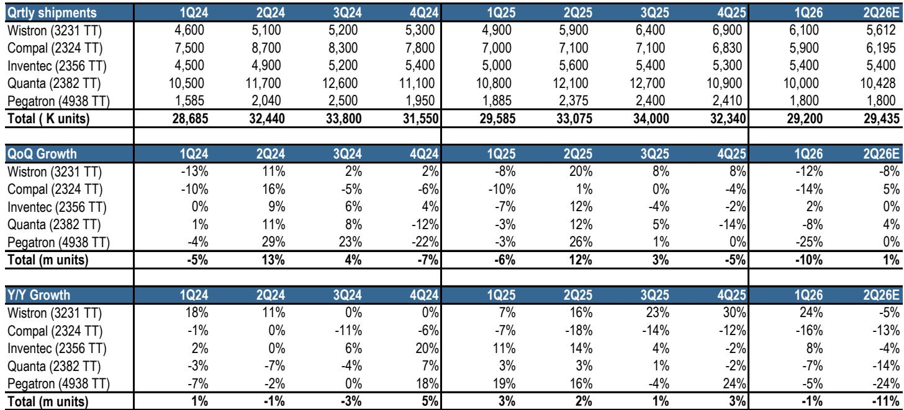
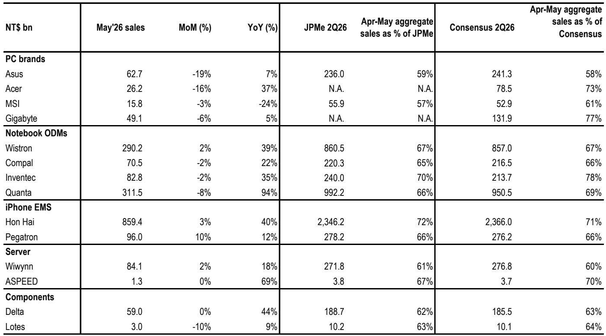
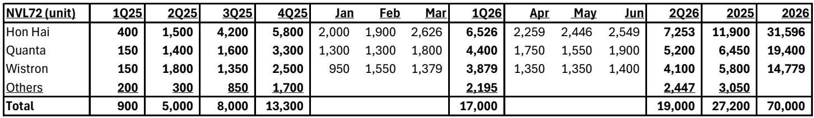

# The Taiwan ODM Data Reveals a Market Split: AI Infrastructure Is Booming, But the PC and Consumer Cycle Is Breaking Down

The May revenue reports from Taiwan's leading ODMs are not a mixed bag. They are a clear signal that the technology hardware market has structurally bifurcated. On one side, the demand for AI and general-purpose servers is accelerating at a pace that defies seasonal norms, driven by the ramp of next-generation architectures and a persistent supply-constrained backlog. On the other, the PC ecosystem—including notebooks, motherboards, and VGA cards—is entering a period of demand weakness and margin erosion that is more profound than a typical cyclical correction.

This is not a temporary divergence. The data from May points to a fundamental shift in capital allocation and end-user demand. For investors, the critical question is no longer whether the AI trade is still valid, but how to navigate the coming air pockets and product transitions in the server space while avoiding the structural deterioration in consumer hardware. The report's analysis, based on the latest shipment data and supply chain feedback, provides a clear roadmap for this divergence, but it also leaves several critical questions unanswered.

## The Server Cycle Is Entering a New Phase of Volume and Technology Transition, Creating Both Opportunity and Risk

The most striking takeaway from the May data is the sustained and robust momentum in the server market. General server shipments grew double-digits quarter-over-quarter in the second quarter of 2026, a trend that is expected to accelerate into the second half of the year as CPU supply improves. The forecast for a 20% year-over-year increase in traditional server shipments for 2026, against a demand growth of 30-40% that is currently constrained by supply, underscores a market that is still in a structural growth phase. This is not just about AI; the entire server ecosystem is being lifted by a wave of enterprise and cloud data center investment.

The AI server segment is even more dynamic, but it is also becoming more complex. The ramp of GB300 NVL72 racks is on track, with double-digit shipment growth expected in the second quarter. The full-year estimate of 65,000 to 70,000 NVL72 rack shipments represents a massive scaling from the 27,200 units shipped in 2025. However, the report flags a potential "air pocket" in the third quarter of 2026 due to a product transition from the current generation to the next VR200 system, which is not expected to ramp until the fourth quarter. This is a classic technology transition risk: a period where demand for the current product plateaus or dips before the next-generation product gains volume.

Furthermore, the emergence of AWS's Trainium 3 (Trianium 3) ASIC project adds another layer of opportunity, particularly for Wiwiynn, which is a key beneficiary of this initial ramp. The component pull-in demand for server slides, power supplies, and chassis in May is a strong leading indicator that the ASIC server cycle is gaining traction. This creates a more diversified AI server landscape, reducing dependence on a single GPU architecture. The key question for investors is how to time exposure between the current NVL72 cycle and the upcoming VR200 and ASIC cycles, as the third-quarter air pocket could create a buying opportunity for those willing to look past a temporary slowdown.

## The PC and Consumer Hardware Cycle Is Facing a Structural Demand Problem, Not Just a Seasonal One

The contrast with the PC and consumer hardware segment could not be starker. While the server side is booming, the aggregated notebook ODM data for May and the guidance for the second half of 2026 paint a picture of a declining market. The report's expectation of a sub-seasonal second half, with a 55%/45% split between the first and second halves and a double-digit shipment decline, is a significant red flag. This is not merely a matter of a weak quarter; it is a reflection of a structural demand problem driven by "price elasticity impact."

The report points to memory-led negative price elasticity as a key driver. In simple terms, the high cost of memory components is pushing PC prices to a level that is suppressing demand. Consumers are delaying upgrades because the value proposition has deteriorated. This is a classic "good for memory makers, bad for PC OEMs and ODMs" dynamic. The impact is being felt across the board. Motherboard and VGA card shipments are expected to see double-digit declines quarter-over-quarter and year-over-year in the second quarter, with continued weakness into the second half. The lack of new product catalysts and weak end demand are compounding the problem.

This weakness is not evenly distributed across all players. The report identifies Micro-Star and ASUSTek as "top avoids" in the PC space, given their significant revenue exposure to PC components (40-50% and 20%, respectively). The margin pressure for PC brands is expected to intensify in the coming quarters, which could lead to earnings downside and a valuation de-rating. For investors, the implication is clear: the PC hardware trade is broken for the foreseeable future. Any exposure to this segment should be viewed with extreme caution, and the focus should be on companies with diversified revenue streams that are tied to the data center and server ecosystem.

## The iPhone and Power Infrastructure Stories Offer Nuanced, but Not Unambiguous, Opportunities

The report also provides important updates on two other key themes: the iPhone supply chain and the emerging datacenter power infrastructure. The iPhone EMS (Hon Hai and Pegatron) revenue in May was resilient, driven by market share gains and inventory builds ahead of the China 618 sales season. However, the report's analyst expects a 7% year-over-year decline in the second half of 2026 iPhone EMS build, driven by fewer new model launches and potential demand weakness. This is a classic "good first half, weak second half" pattern that could catch investors off guard if they extrapolate the May strength.

The power infrastructure story is a long-term positive that is just beginning to materialize. The report confirms that 800V HVDC (High-Voltage Direct Current) datacenter power is on track to ramp in late 2026 or early 2027, albeit with small volumes initially. This is a significant development for the data center ecosystem, as it represents a major uplift in power content per rack. The report notes that while HVDC is not required for the VR200 racks, a 10-20% penetration rate in that cycle is still an incremental positive. The early deployments will likely skew toward the +/-400V standard, but the adoption of sidecar power racks will drive meaningful power content growth.

This is a key positive for Delta Electronics, which the report rates as Overweight (OW) given its growing exposure to the AI datacenter power and thermal total addressable market (TAM). The potential for product price hikes further strengthens the bull case. However, the timeline is still a year or more away, meaning that the near-term catalyst is more about the current server cycle than the HVDC transition. The question for investors is whether the current valuation already reflects this long-term opportunity, or if there is still room for upside as the ramp becomes more concrete.

## What the Report Does Not Fully Answer: The Magnitude of the 3Q26 Server Air Pocket and the Durability of General Server Demand

Despite the wealth of data, the report leaves several critical questions open for debate. The most pressing is the exact magnitude of the expected "air pocket" in the third quarter of 2026 for NVL72 rack shipments. The report forecasts a product transition, but it does not quantify the potential decline in shipments between the second and third quarters. Is this a 10% dip or a 30% dip? The answer has significant implications for the stock prices of the server ODMs, particularly Hon Hai and Quanta, which have the largest NVL72 exposure.

A second unresolved question is the durability of the general server demand. The report forecasts 20% year-over-year growth for 2026, driven by a supply-constrained backlog. But how much of this growth is a one-time catch-up from the supply constraints of the past year, and how much is sustainable, structural demand from enterprise digital transformation and edge computing? If the supply chain improves faster than expected, the backlog could be cleared more quickly, leading to a potential normalization of growth rates in 2027. The report does not provide a clear view on this.

Finally, the report highlights the risk of "memory-led negative price elasticity" for PCs but does not analyze the potential for the same dynamic to impact the server market. High-bandwidth memory (HBM) is a critical and expensive component for AI servers. If memory prices remain elevated, could the cost of AI servers also begin to suppress demand, particularly from price-sensitive enterprise customers? This is a second-order risk that the report does not fully explore.

## A Decision Framework for Navigating the Divergence

For investors, the May ODM data provides a clear, if uncomfortable, decision framework. The first decision is a binary one: are you positioned for the server cycle or the PC cycle? The data overwhelmingly supports the former and warns against the latter. Within the server cycle, the next decision is about timing and technology. The current preference for Wiwiynn over Quanta, Hon Hai, and Wistron is driven by its exposure to the near-term ASIC ramp and its pure-play server focus. However, the third-quarter air pocket for NVL72 racks means that investors need to decide whether to hold through the volatility or try to time the transition to the VR200 cycle.

The second decision is about the power and thermal ecosystem. Delta Electronics stands out as a beneficiary of both the current server cycle and the future HVDC transition. The report's Overweight rating on Delta is consistent with this view. However, the question is whether the current price already reflects the HVDC opportunity, or if there is still significant upside as the 2027 ramp approaches.

The third decision is about the PC and consumer hardware avoid list. Micro-Star and ASUSTek are clearly in the danger zone. But the framework should also extend to any company with significant exposure to the consumer PC and component market. The margin pressure is likely to persist for several quarters, and any earnings disappointment could trigger a significant de-rating.

The final, and perhaps most important, decision is about what you are not seeing. The report does not provide a clear thesis on the second half of 2026 for the iPhone supply chain. The resilient May data could be a head fake, and the expected 7% decline in the second half could be worse if consumer demand weakens further. Similarly, the durability of the general server demand after the backlog is cleared remains an open question. The most successful investment strategy will be one that acknowledges these uncertainties and positions for the most predictable trends: the growth of AI infrastructure and the decline of the consumer PC cycle.

Join the community to read the full report and review the original charts.

*This article is for learning and discussion only and does not constitute investment advice.*

Personal reading notes and learning share only. Not investment advice.

