# Chinese Airports | Asia Pacific

# Still Waiting for the Turn

We remain cautious on Chinese airports, as elevated fuel costs weigh on traffic growth and duty-free improvements take time. GBIA also faces an uncertain earnings rebound amid capacity expansion in soft macro. Move GBIA to UW; remain EW on SIAC and UW on BCIA.

Air traffic growth under pressure amid energy shock: China's air pax growth has been under pressure since Apr-26 as the global energy shock lifted air ticket prices. We observed a pax shift from air to railway starting Mar-26. Domestic pax growth at SIAC, GBIA and BCIA slowed to $3 - 4\%$ YoY in Apr-26 from $6 - 10\%$ YoY in 1Q26. Non-domestic traffic growth also softened to $4 - 18\%$ YoY in Apr-26 from $7 - 24\%$ YoY in 1Q26. SIAC underperformed likely due to higher exposure to Japan routes.

Duty-free business still in transition: Although we believe the new duty-free (DF) contracts signed in Dec-25 favor airports, airport DF revenue remained under pressure in 1Q26 due to the rent-free period at SIAC and disruption during the transition between duty-free operators. DF rent at SIAC fell to Rmb176mn in 1Q26, down 49% YoY. BCIA also saw a decline in per-pax DF spending in 1Q26. That said, we believe per-pax DF spending at Chinese airports has largely bottomed. Over the medium to long term, spending could improve as new product categories are introduced and new operators gradually ramp up.

Uncertain earnings recovery amid capacity expansion in soft macro: The cost-sharing framework between GBIA and its parent has not yet been finalized. We see a possibility that the final profit impact could be greater than under the current transitional arrangement, which involves an asset-use fee of \~Rmb900mn in 2026. Revenue ramp-up is also constrained by: 1) softer travel demand amid elevated fuel costs; and 2) the closure of T1 from May-26 for renovation, which offsets incremental revenue from T3. As a result, we think GBIA's earnings recovery could be slower than previously expected.

Earnings and PT changes: We cut earnings for the three Chinese airports factoring in slower traffic growth, lower DF revenue and higher costs. Our PTs are down \~40% after adjusting outer-year capex (SIAC) and WACC assumptions (GBIA, BCIA).

Move GBIA to UW: GBIA's share price has relatively outperformed among peers YTD2026 (-14ppt vs +0ppt for SSE). However, we expect GBIA's earnings recovery to be slower than expected due to soft traffic growth, T1's closure and potentially greater P&L impact from the still-undetermined cost-sharing arrangement for new capacity. Our 2026-28e earnings for GBIA are 1%, 8% and 20% below consensus, respectively. Remain EW on SIAC: We expect SIAC's DF revenue to normalize from 2Q26, as the impact from the rent-free period fades. We believe per pax DF spending has largely bottomed, but a meaningful recovery will likely take time.

Remain UW on BCIA: We see earnings pressure for BCIA if new flight slots are not added. Its exclusion from Stock Connect could also continue to weigh on valuation.

MS ASIA LIMITED+

## Tenny Song

Equity Analyst

Tenny.Song@morganstanley.com +852 3963-1737

## Qianlei Fan, CFA

Equity Analyst

Qianlei.Fan@morganstanley.com +852 2239-1875

## Evan Chen

Research Associate

Evan.Chen@morganstanley.com +852 2848-7317

## Asia Summer School 2026

## HONG KONG/CHINA TRANSPORTATION &

## INFRASTRUCTURE

Asia Pacific

Industry View In-Line

WHAT'S CHANGED

<table><tr><td>Guangzhou Baiyun Int&#x27;l Airport(600004.SS)</td><td>From</td><td>To</td></tr><tr><td>Price Target</td><td>Rmb10.90</td><td>Rmb6.60</td></tr><tr><td>Rating</td><td>Equal-weight</td><td>Underweight</td></tr><tr><td>Shanghai International Airport(600009.SS)</td><td>From</td><td>To</td></tr><tr><td>Price Target</td><td>Rmb35.90</td><td>Rmb21.10</td></tr><tr><td>Beijing Capital Int&#x27;l Airport(0694.HK)</td><td>From</td><td>To</td></tr><tr><td>Price Target</td><td>HK$2.40</td><td>HK$1.40</td></tr></table>

MS does and seeks to do business with companies covered in MS. As a result, investors should be aware that the firm may have a conflict of interest that could affect the objectivity of MS. Investors should consider MS as only a single factor in making their investment decision.

## For analyst certification and other important disclosures, refer to the Disclosure Section, located at the end of this report.

+= Analysts employed by non-U.S. affiliates are not registered with FINRA, may not be associated persons of the member and may not be subject to FINRA restrictions on communications with a subject company, public appearances and trading securities held by a research analyst account.

## Chinese Airports: Order of Preference

Exhibit 1: Chinese airports: Order of preference

<table><tr><td></td><td>SIAC600009.SS</td><td>BCIA0694.HK</td><td>GBIA600004.SS</td></tr><tr><td></td><td colspan="3"></td></tr><tr><td>Rating</td><td>Equal-weight</td><td>Underweight</td><td>Underweight</td></tr><tr><td>Trading Currency</td><td>CNY</td><td>HKD</td><td>CNY</td></tr><tr><td>Price Target</td><td>21.10</td><td>1.40</td><td>6.60</td></tr><tr><td>Current Price</td><td>23.72</td><td>1.70</td><td>8.06</td></tr><tr><td>Upside/(Downside) (%)</td><td>-11%</td><td>-18%</td><td>-18%</td></tr><tr><td>Market Cap (in USD mm)</td><td>8,715.5</td><td>993.8</td><td>3,067.3</td></tr><tr><td>Avg Daily Traded Vol (in USD mm)</td><td>54.0</td><td>3.3</td><td>21.2</td></tr><tr><td colspan="4">Street View: Ratings</td></tr><tr><td>Buy/OverweightHold/Equal-weightSell/Underweight</td><td colspan="3">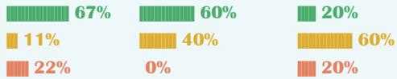</td></tr><tr><td>Bull Case Value</td><td>33.00</td><td>2.20</td><td>10.50</td></tr><tr><td>Upside (%)</td><td>39%</td><td>29%</td><td>30%</td></tr><tr><td>Bear Case Value</td><td>9.50</td><td>1.00</td><td>4.20</td></tr><tr><td>Downside (%)</td><td>-60%</td><td>-41%</td><td>-48%</td></tr><tr><td>Risk/Reward Skew</td><td>0.7</td><td>0.7</td><td>0.6</td></tr><tr><td colspan="4">MS Estimates</td></tr><tr><td>FY26e</td><td>CNY</td><td>CNY</td><td>CNY</td></tr><tr><td>Sales</td><td>13,814</td><td>5,981</td><td>8,560</td></tr><tr><td>EBITDA</td><td>6,804</td><td>1,890</td><td>2,362</td></tr><tr><td>EBIT</td><td>3,950</td><td>326</td><td>840</td></tr><tr><td>EPS</td><td>1.07</td><td>0.01</td><td>0.26</td></tr><tr><td colspan="4">FY27e</td></tr><tr><td>Sales</td><td>14,792</td><td>6,233</td><td>9,245</td></tr><tr><td>EBITDA</td><td>7,619</td><td>2,108</td><td>2,567</td></tr><tr><td>EBIT</td><td>4,671</td><td>526</td><td>988</td></tr><tr><td>EPS</td><td>1.29</td><td>0.04</td><td>0.30</td></tr><tr><td colspan="4">FY26 MSe vs. Consensus Mean</td></tr><tr><td>Sales</td><td>-3.5%</td><td>-1.4%</td><td>5.2%</td></tr><tr><td>EBITDA</td><td>8.3%</td><td>0.3%</td><td>-5.6%</td></tr><tr><td>EBIT</td><td>22.2%</td><td>-11.4%</td><td>2.2%</td></tr><tr><td>EPS</td><td>-0.8%</td><td>-72.0%</td><td>-15.4%</td></tr><tr><td colspan="4">FY27 MSe vs. Consensus Mean</td></tr><tr><td>Sales</td><td>-2.5%</td><td>-2.7%</td><td>5.2%</td></tr><tr><td>EBITDA</td><td>9.8%</td><td>-1.8%</td><td>-6.6%</td></tr><tr><td>EBIT</td><td>21.8%</td><td>-4.3%</td><td>-5.6%</td></tr><tr><td>EPS</td><td>3.5%</td><td>-35.1%</td><td>-16.8%</td></tr></table>

E = MS estimates. Source: Factset, MS. Share prices are as of the close on June 10, 2026.

# Air Traffic Growth Under Pressure Amid Energy Shock

China's air pax growth has been under pressure since Apr-26 as the global energy shock lifted air ticket prices. While China remains comparatively more insulated than Asian peers – benefiting from domestic fuel price caps, strategic reserves and a coal-heavy energy mix – the demand impact has become increasingly visible: China's total air pax grew only 0.4% YoY in April (domestic -0.2%), a dramatic deceleration from 6.5% YoY in 1Q26. In contrast, China's railway pax growth accelerated to 10.5% in Apr-26 from 5.5% in 1Q26, reflecting pax shift from air to railway, we think. During Labor Day holiday, air pax traffic dropped 5.7% YoY vs. +11.8% YoY during the same holiday in 2025, while railway pax was up 4.6% YoY. China's domestic operated flights and non-domestic capacity both trended down from Mar-26. Non-domestic flight frequency growth YoY even turned negative from May-26.

Exhibit 2: Domestic-operated flights  
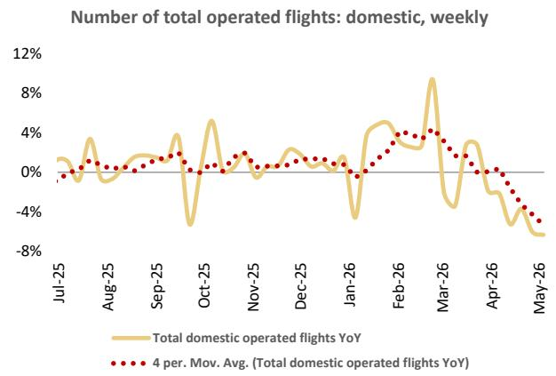

line chart

| Month   | Total domestic operated flights YoY |
|---------|------------------------------------|
| Jul-25  | ~0%                                |
| Aug-25  | ~1%                                |
| Sep-25  | ~0%                                |
| Oct-25  | ~5%                                |
| Nov-25  | ~0%                                |
| Dec-25  | ~1%                                |
| Jan-26  | ~0%                                |
| Feb-26  | ~4%                                |
| Mar-26  | ~9%                                |
| Apr-26  | ~3%                                |
| May-26  | ~-7%                               |

Source: CEIC, MS

Exhibit 3: China's non-domestic capacity YoY  
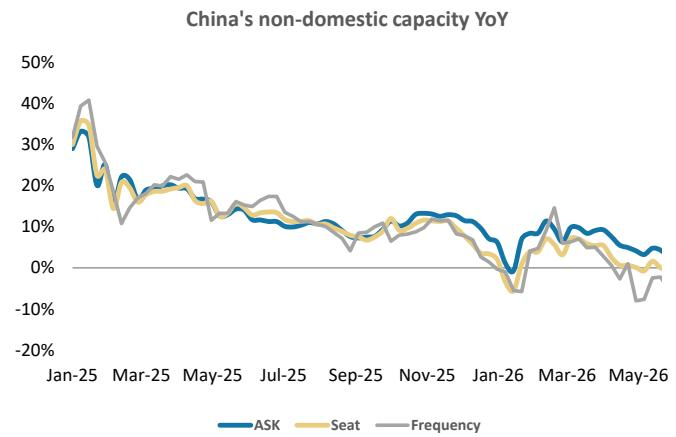

line chart

| Month   | ASK    | Seat   | Frequency |
|---------|--------|--------|-----------|
| Jan-25  | 30%    | 35%    | 40%       |
| Mar-25  | 20%    | 15%    | 10%       |
| May-25  | 15%    | 10%    | 15%       |
| Jul-25  | 10%    | 5%     | 10%       |
| Sep-25  | 5%     | 0%     | 5%        |
| Nov-25  | 10%    | 5%     | 10%       |
| Jan-26  | -5%    | -10%   | -5%       |
| Mar-26  | 5%     | 0%     | 10%       |
| May-26  | 0%     | -5%    | -10%      |

Source: OAG, MS

Exhibit 4: Railway is gaining market share vs. air since Mar-26.  
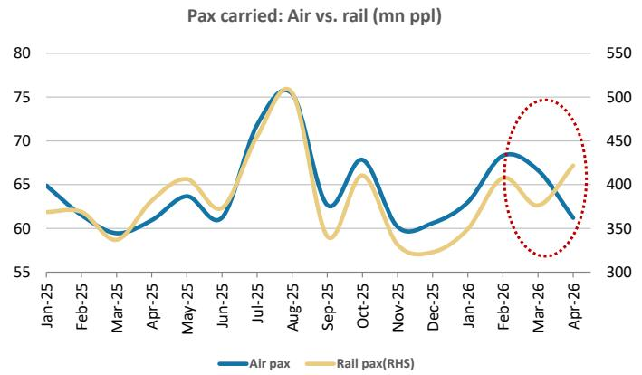

line chart

| Month   | Air pax (mn ppl) | Rail pax (mn ppl) |
|---------|------------------|-------------------|
| Jan-25  | 65               | 380               |
| Feb-25  | 60               | 370               |
| Mar-25  | 59               | 360               |
| Apr-25  | 63               | 390               |
| May-25  | 64               | 410               |
| Jun-25  | 61               | 400               |
| Jul-25  | 70               | 450               |
| Aug-25  | 76               | 500               |
| Sep-25  | 63               | 380               |
| Oct-25  | 68               | 420               |
| Nov-25  | 60               | 370               |
| Dec-25  | 61               | 380               |
| Jan-26  | 63               | 400               |
| Feb-26  | 68               | 430               |
| Mar-26  | 67               | 440               |
| Apr-26  | 61               | 470               |

Source: CEIC, MS

Pax growth at Chinese airports saw similar trend. Domestic air pax growth at SIAC, GBIA and BCIA slowed to 3-4% YoY in Apr-26 from 6-10% YoY in 1Q26. Non-domestic traffic growth also softened to 4-18% YoY in Apr-26 from 7-24% YoY in 1Q26. SIAC underperformed likely due to higher exposure to Japan routes.

Exhibit 5: Domestic air pax growth at SIAC, GBIA and BCIA slowed to 3-4% YoY in Apr-26 from 6-10% YoY in 1Q26  
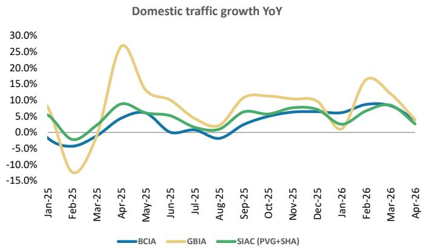

line chart

| Month   | BCIA  | GBIA  | SIAC (PVG+SHA) |
|---------|-------|-------|----------------|
| Jan-25  | -2.0% | 8.0%  | 6.0%           |
| Feb-25  | -4.0% | -12.0%| -3.0%          |
| Mar-25  | -1.0% | 27.0% | 9.0%           |
| Apr-25  | 5.0%  | 12.0% | 8.0%           |
| May-25  | 6.0%  | 10.0% | 6.0%           |
| Jun-25  | 0.0%  | 8.0%  | 4.0%           |
| Jul-25  | -1.0% | 4.0%  | 2.0%           |
| Aug-25  | -2.0% | 2.0%  | 3.0%           |
| Sep-25  | 4.0%  | 11.0% | 6.0%           |
| Oct-25  | 5.0%  | 10.0% | 7.0%           |
| Nov-25  | 6.0%  | 10.0% | 7.0%           |
| Dec-25  | 6.0%  | 10.0% | 7.0%           |
| Jan-26  | 6.0%  | 1.0%  | 4.0%           |
| Feb-26  | 9.0%  | 17.0% | 8.0%           |
| Mar-26  | 8.0%  | 14.0% | 7.0%           |
| Apr-26  | 4.0%  | 4.0%  | 3.0%           |

Source: Company data, MS

Exhibit 6: Non-domestic traffic growth also softened to 4-18% YoY in Apr-26 from 7-24% YoY in 1Q26  
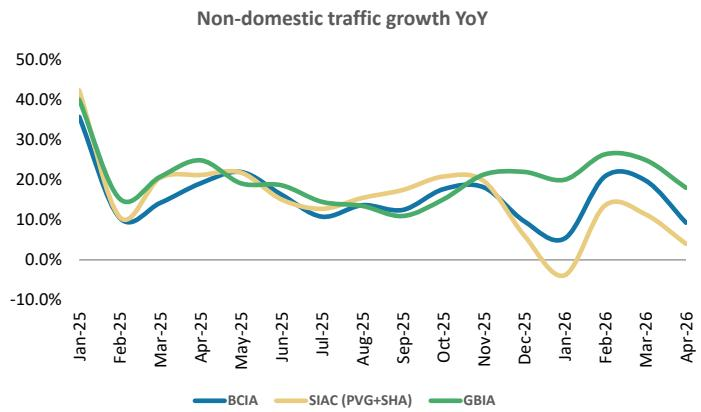

line chart

| Month   | BCIA  | SIAC (PVG+SHA) | GBIA  |
|---------|-------|----------------|-------|
| Jan-25  | 38.0% | 42.0%          | 44.0% |
| Feb-25  | 9.0%  | 10.0%          | 15.0% |
| Mar-25  | 15.0% | 20.0%          | 22.0% |
| Apr-25  | 20.0% | 22.0%          | 25.0% |
| May-25  | 18.0% | 21.0%          | 19.0% |
| Jun-25  | 15.0% | 17.0%          | 16.0% |
| Jul-25  | 12.0% | 14.0%          | 13.0% |
| Aug-25  | 14.0% | 16.0%          | 15.0% |
| Sep-25  | 16.0% | 18.0%          | 17.0% |
| Oct-25  | 18.0% | 20.0%          | 21.0% |
| Nov-25  | 16.0% | 18.0%          | 20.0% |
| Dec-25  | 10.0% | -5.0%          | 15.0% |
| Jan-26  | 5.0%  | -8.0%          | 18.0% |
| Feb-26  | 22.0% | 14.0%          | 27.0% |
| Mar-26  | 18.0% | 12.0%          | 24.0% |
| Apr-26  | 10.0% | 4.0%           | 18.0% |

Source: Company data, MS

## Duty-free business is still in a transition period

Both SIAC and BCIA signed new duty-free contracts in Dec-25. We highlight the following changes, which indicate airports are regaining bargaining power vs. duty-free operators, supported by continual traffic growth.

- Breaking the monopoly: Duty-free stores at SIAC and BCIA were previously exclusively operated by CTGDF and its related party. Under the new contracts, both airports have engaged two duty-free operators across different terminals. By leveraging the strength of multiple operators, airports can enrich product categories and improve operating efficiency, which should help boost duty-free spending, in our view.  
- Rewriting the rent formula: The new rent structure is calculated as fixed rent plus commission rent vs. the previous model of minimum rent or commission rent, whichever was higher. For example, at Pudong Terminal 2, the monthly fee is now Rmb3,090/sqm (fixed) plus an 8-24% commission on sales by category, compared with the previous structure of base rent or 18-36% revenue sharing. This new formula will stabilize airports' revenue and motivate duty-free operators to promote sales, we think.  
- Increasing shareholding in duty-free operators: SIAC has established JVs with the new duty-free operators, holding a 49% stake vs. effectively 12.5% previously.

Operators are also encouraged to introduce competitive new product categories and items with gross margins below the maximum commission rate, with a preferential commission applied to such products.

Despite the structurally favorable contract terms, airport duty-free revenue remains under near-term pressure considering: 1) the new contracts only took effect from January 1, 2026 (SIAC) and February 11, 2026 (BCIA). The transition from the previous incumbent to the new operators is ongoing, and new operators require time to build out their product assortment, supply chains, etc. 2) SIAC contracts include a three-month rent-free period during the contract term, which creates a direct near-term drag on airport duty-free revenue. As a result, duty-free rent at SIAC dropped to Rmb176mn in 1Q26, down 49%

YoY. BCIA also saw per pax duty-free spending dropped in 1Q26.

We believe per-pax duty-free spending at Chinese airports has largely bottomed, and we think per pax duty-free spending could improve over the mid- to long-term with new product category expansion and new operators ramping up.

Exhibit 7: Duty-free rent at SIAC dropped 49% YoY in 1Q26 due mainly to rent-free period, we think  
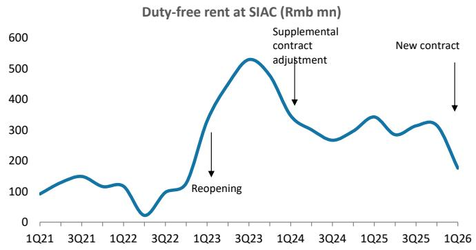

line chart

| Quarter | Duty-free rent at SIAC (Rmb mn) |
| ------- | ------------------------------ |
| 1Q21    | ~90                            |
| 3Q21    | ~140                           |
| 1Q22    | ~100                           |
| 2Q22    | ~20                            |
| 3Q22    | ~100                           |
| 1Q23    | ~350                           |
| 2Q23    | ~530                           |
| 3Q23    | ~480                           |
| 1Q24    | ~350                           |
| 2Q24    | ~280                           |
| 3Q24    | ~300                           |
| 1Q25    | ~350                           |
| 2Q25    | ~300                           |
| 3Q25    | ~320                           |
| 1Q26    | ~180                           |

Exhibit 8: New duty-free contract at SIAC

<table><tr><td></td><td>Operator</td><td>Fixed rent Rmb/sqm/month</td><td>Commission rate</td><td>Area Sqm</td><td>Fixed rent Rmb mn/year</td><td>Contract period</td></tr><tr><td>PVG T1+S1</td><td>Dufry</td><td>3,141</td><td>8-24%</td><td>8,466</td><td>319</td><td>3 years from 2026 and can be extended 5 years to 2033. (*3+5*)</td></tr><tr><td>PVG T2+S2</td><td>CTG</td><td>3,090</td><td>8-24%</td><td>9,631</td><td>357</td><td>5 years from 2026 and can be extended 3 years to 2033. (*5+3*)</td></tr><tr><td>SHA (Hongqiao)</td><td>CTG</td><td>2,827</td><td>8-22%</td><td>2,471</td><td>84</td><td>5 years from 2026 and can be extended 3 years to 2033. (*5+3*)</td></tr><tr><td colspan="4"></td><td>Total</td><td>760</td><td></td></tr></table>

Source: Company data, MS  
Source: Company data, MS

## Uncertain earnings recovery amid new capacity expansion in soft macro

GBIA's T3 and fifth runway were officially put into use on October 30, 2025, with over Rmb50bn upfront capex undertaken by the parent company. The cost-sharing framework between GBIA and the parent is broadly taking shape but has not yet been finalized: the final arrangement is expected to combine base rent, asset acquisition by GBIA and revenue sharing with the parent – a more complex and multi-layered structure than a simple lease.

The current \~Rmb900mn annual asset-use fee for 2026 represents a transitional arrangement before final settlement between GBIA and its parent. We see probability that the final profit impact could be higher than \~Rmb900mn. The current asset use fee represents \~40% of the estimated D&A and financing costs attributable to the Phase 3 assets used by the listed company, according to GBIA, while acquired assets require full D&A recognition. That is to say, the final P&L burden on GBIA should be higher than current level under final arrangement with asset acquisition, unless parent company offers additional discounts on revenue sharing, etc.

In addition, we do not expect GBIA's revenue to ramp up quickly despite higher peak hour capacity approved (from 83/hour to 93/hour) considering: 1) soft travel demand amid soft macro and elevated fuel costs; 2) T1 ceased operations from May-26 for renovation, which partly offset incremental revenue from T3.

We expect GBIA's earnings recovery could be slower than expected. Our earnings forecasts for 2026-28 are 1%, 8% and 20%, respectively, lower than consensus.

## What's in the Price

All Chinese airports under our coverage underperformed respective indexes by 15-30% YTD2026. Exhibit 9

Exhibit 9: Chinese airports under our coverage all underperformed respective indexes YTD2026

Chinese airports relative share performance YTD2026  
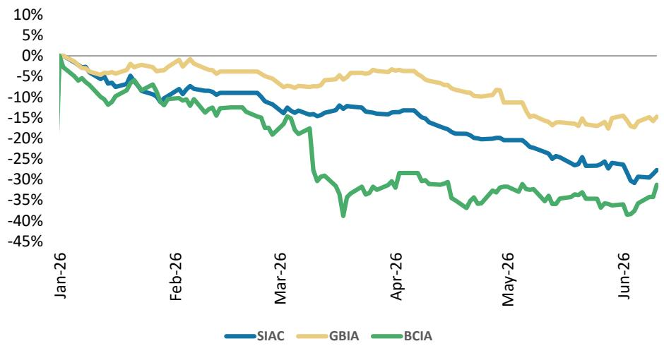

line chart

| Month   | SIAC  | GBIA  | BCIA  |
|---------|-------|-------|-------|
| Jan-26  | 0%    | 0%    | 0%    |
| Feb-26  | -10%  | -5%   | -10%  |
| Mar-26  | -15%  | -10%  | -20%  |
| Apr-26  | -20%  | -15%  | -30%  |
| May-26  | -25%  | -20%  | -35%  |
| Jun-26  | -30%  | -25%  | -40%  |

Past performance is no guarantee of future results. Results shown do not include transaction costs. Source: Company data, MS. Note: SIAC and GBIA are compared to SSE (+0ppt YTD2026); BCIA is compared to HSI (-5ppt YTD2026); Share prices are as of 10 June, 2026

- GBIA outperformed peers slightly with 15ppt share price underperformance vs. SSE thus far this year. However, we expect GBIA's earnings to drop 54% YoY in 2026 due to the new terminal and runway launched in Oct-25. We highlight that the cost-sharing framework with the parent company has not yet been finalized, adding uncertainty to GBIA's earnings in 2026 as well as earnings recovery going forward. We expect the combined earnings impact to be higher than previously expected. Our earnings forecasts for 2026-28 are 1%, 8% and 20%, respectively, lower than consensus. Move to UW.  
- SIAC underperformed SSE by 28ppt driven by market disappointment on new duty-free operators' performance, we think. While duty-free revenue at SIAC fell 49% YoY to Rmb176 million in 1Q26, we view this as primarily a mechanical consequence of the three-month rent-free period and expect duty-free revenue to normalize from 2Q26. We think per pax duty-free spending has largely bottomed with limited further downside, but meaningful recovery will take time – the key catalyst to watch is the progressive introduction of new product categories including consumer electronics (smartphones, drones), high-end luxury goods, gold and jewelry as well as domestic Chinese brands and cultural products, all of which are explicitly incentivized under the new concession contracts. SIAC stock is trading at 22x 2026e P/E, below global peers' average of 24x. However, we would not expect SIAC to re-rate until we see meaningful progress on commercial revenue growth. Remain EW.

• BCIA has underperformed HSI by 31ppt YTD2026 due mainly to getting excluded from stock connect and slower-than-expected earnings recovery. We see earnings growth pressure for BCIA if new flight slots are not added soon. BCIA stock is trading at 0.5x 2026e P/B, below domestic peers' average of 1.0x considering its slower-than-expected earnings recovery and soft long-term growth outlook considering capacity constraints and traffic dilution from Daxing. Remain UW.

Upside risks for all three stocks: 1) Better-than-expected cost control; 2) better-than-expected commercial operations improvements; 3) Better-than-expected traffic growth; 4) favorable policies on consumption, travel, etc; and 5) additional slots approved by CAAC.

Downside risks for SIAC: 1) Cost overrun; 2) worse-than-expected duty-free spending; 3) slower-than-expected traffic growth amid soft macro.

Exhibit 10: We estimate GBIA's net profit will drop by 54% YoY in 2026  
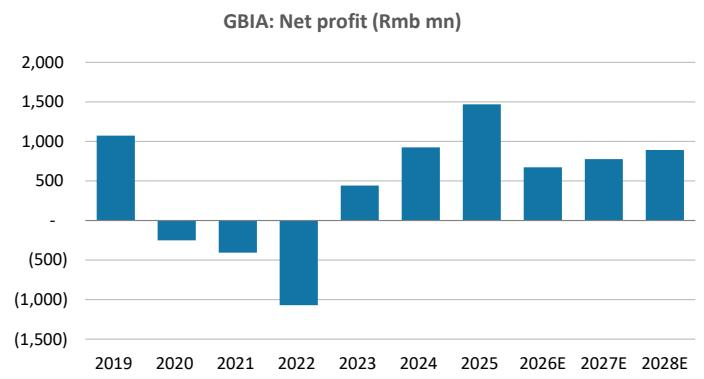

bar chart

GBIA: Net profit (Rmb mn)
| Year | Net profit (Rmb mn) |
| :--- | :--- |
| 2019 | 1050 |
| 2020 | -350 |
| 2021 | -400 |
| 2022 | -1000 |
| 2023 | 450 |
| 2024 | 950 |
| 2025 | 1450 |
| 2026E | 650 |
| 2027E | 750 |
| 2028E | 900 |

Source: Company data, MS

Exhibit 12: We estimate SIAC's net profit will continue to grow by \~20% YoY in 2026-27, before dropping YoY in 2028 due to capacity expansion  
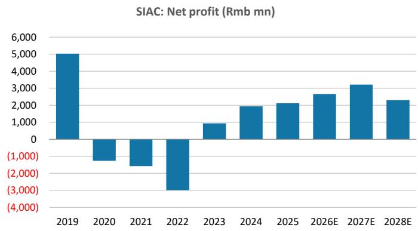

bar chart

SIAC: Net profit (Rmb mn)
| Year | Net profit (Rmb mn) |
| :--- | :--- |
| 2019 | 5000 |
| 2020 | -1000 |
| 2021 | -1500 |
| 2022 | -3000 |
| 2023 | 1000 |
| 2024 | 2000 |
| 2025 | 2200 |
| 2026E | 2700 |
| 2027E | 3300 |
| 2028E | 2400 |

Source: Company data, MS

Exhibit 11: GBIA stock is trading at 31x 2026e P/E and 26x 2027e P/E vs. historical average of 24x  
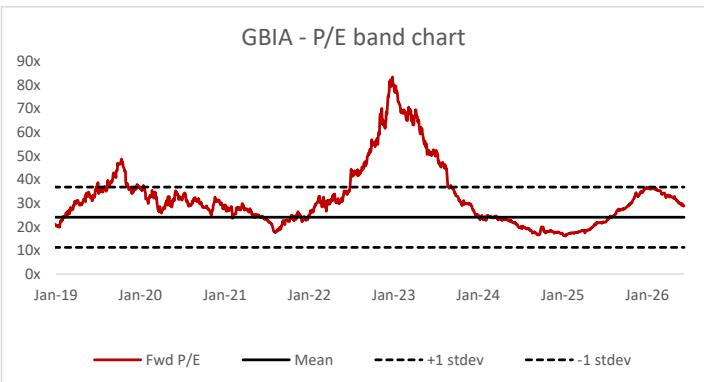

line chart

| Date   | Fwd P/E | Mean | +1 stdev | -1 stdev |
|--------|---------|------|----------|----------|
| Jan-19 | ~20x    | ~25x | ~35x     | ~35x     |
| Jan-20 | ~45x    | ~25x | ~35x     | ~35x     |
| Jan-21 | ~30x    | ~25x | ~35x     | ~35x     |
| Jan-22 | ~25x    | ~25x | ~35x     | ~35x     |
| Jan-23 | ~80x    | ~25x | ~35x     | ~35x     |
| Jan-24 | ~30x    | ~25x | ~35x     | ~35x     |
| Jan-25 | ~15x    | ~25x | ~35x     | ~35x     |
| Jan-26 | ~30x    | ~25x | ~35x     | ~35x     |

Source: Company data, MS

Exhibit 13: SIAC stock is trading at 22x 2026e P/E vs. historical average of 30x since listing  
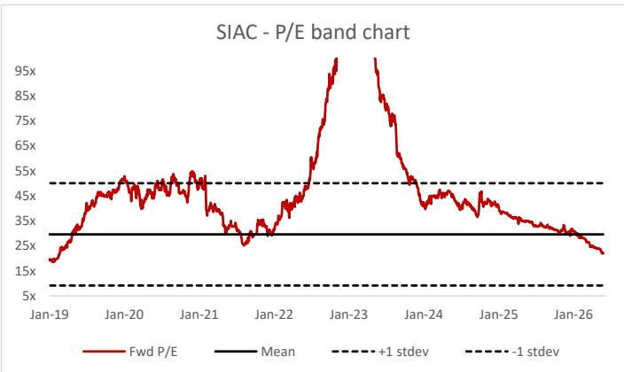

line chart

| Date   | Fwd P/E | Mean | +1 stdev | -1 stdev |
|--------|---------|------|----------|----------|
| Jan-19 | ~15x    | ~30x | ~45x     | ~5x      |
| Jan-20 | ~45x    | ~30x | ~45x     | ~5x      |
| Jan-21 | ~50x    | ~30x | ~45x     | ~5x      |
| Jan-22 | ~30x    | ~30x | ~45x     | ~5x      |
| Jan-23 | ~95x    | ~30x | ~45x     | ~5x      |
| Jan-24 | ~45x    | ~30x | ~45x     | ~5x      |
| Jan-25 | ~35x    | ~30x | ~45x     | ~5x      |
| Jan-26 | ~25x    | ~30x | ~45x     | ~5x      |

Source: Company data, MS

Exhibit 14: We believe BCIA's earnings growth could be slow if additional flight slots are not added soon  
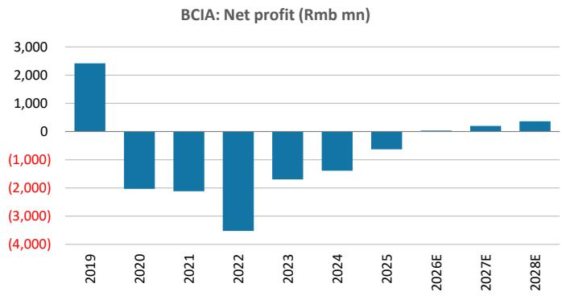

bar chart

BCIA: Net profit (Rmb mn)
| Year | Net profit (Rmb mn) |
| :--- | :--- |
| 2019 | 2400 |
| 2020 | -1500 |
| 2021 | -1800 |
| 2022 | -3600 |
| 2023 | -1700 |
| 2024 | -1600 |
| 2025 | -500 |
| 2026E | 0 |
| 2027E | 200 |
| 2028E | 300 |

Source: Company data, MS

Exhibit 15: BCIA stock is trading at 0.5x 2026e P/B, lower vs. historical average of 1.0x since reopening  
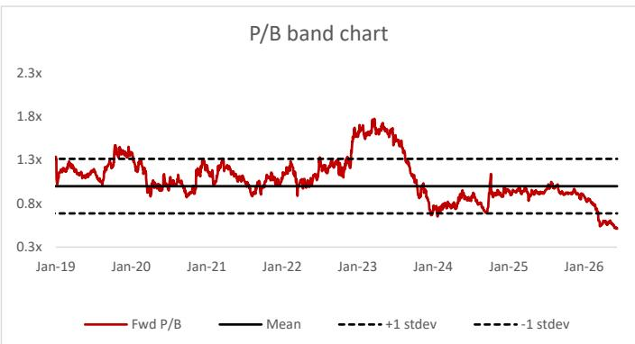

line chart

| Date   | Fwd P/B | Mean | +1 stdev | -1 stdev |
|--------|---------|------|----------|----------|
| Jan-19 | 1.0x    | 0.8x | 1.3x     | 0.8x     |
| Jan-20 | 1.3x    | 0.8x | 1.3x     | 0.8x     |
| Jan-21 | 1.0x    | 0.8x | 1.3x     | 0.8x     |
| Jan-22 | 1.0x    | 0.8x | 1.3x     | 0.8x     |
| Jan-23 | 1.8x    | 0.8x | 1.3x     | 0.8x     |
| Jan-24 | 0.8x    | 0.8x | 1.3x     | 0.8x     |
| Jan-25 | 0.8x    | 0.8x | 1.3x     | 0.8x     |
| Jan-26 | 0.5x    | 0.8x | 1.3x     | 0.8x     |

Source: Company data, MS

## GBIA: Earnings Forecasts and Price Target Changes

We cut our EPS forecast by 15% both for 2026-27, factoring in higher-than-expected earnings impact from new terminal and capacity as well as the share placement to the parent company. We also introduce our 2028 EPS forecast of Rmb0.35.

We continue to derive our price target on a DCF valuation. We raise our WACC assumption to 10.4% from 9.5%, reflecting a higher equity risk premium of 9.5% vs. 8.5% previously due to undetermined cost-sharing with the parent company on new capacity. Other metrics are unchanged. Our bull-, base- and bear-case weightings move to 10%/60%/30%, respectively, from 15%/70%/15%, as we see a higher probability that the profit impact from the new terminal and runway is likely to be higher than expected. As a result, our base-value is down 34% and our bull- and bear-case values fall by a similar magnitude. Our price target falls 39% to Rmb6.60. We also downgrade our rating to UW on higher combined profit impact from new capacity as well as uncertainties on long-term earnings impact.

Upside risks: 1) Better-than-expected cost arrangement with parent company on new terminal and runway; 2) better-than-expected commercial operations improvements; 3) better-than-expected traffic growth; and 4) favorable policies on consumption, travel, etc.

Exhibit 16: GBIA: Base-case DCF valuation

<table><tr><td colspan="2">Year to Dec. Rmb mn</td><td>2025</td><td>2026E</td><td>2027E</td><td>2028E</td><td>2029E</td><td>2030E</td><td>2031E</td><td>2032E</td><td>2033E</td><td>2034E</td><td>2035E</td><td>2036E</td></tr><tr><td>Valuation Date</td><td>31/Dec/26</td><td></td><td></td><td></td><td></td><td></td><td></td><td></td><td></td><td></td><td></td><td></td><td></td></tr><tr><td>Cash Flow Date</td><td></td><td>31/Dec/25</td><td>31/Dec/26</td><td>31/Dec/27</td><td>31/Dec/28</td><td>31/Dec/29</td><td>31/Dec/30</td><td>31/Dec/31</td><td>30/Dec/32</td><td>30/Dec/33</td><td>30/Dec/34</td><td>30/Dec/35</td><td>30/Dec/36</td></tr><tr><td>Free Cash Flow to Entity</td><td></td><td></td><td></td><td></td><td></td><td></td><td></td><td></td><td></td><td></td><td></td><td></td><td></td></tr><tr><td>EBITDA</td><td></td><td>3,465</td><td>2,546</td><td>2,756</td><td>2,959</td><td>3,104</td><td>3,294</td><td>3,503</td><td>3,730</td><td>3,903</td><td>4,035</td><td>4,102</td><td>4,167</td></tr><tr><td>Less: Cash Tax Payable on EBIT</td><td></td><td>(521)</td><td>(257)</td><td>(295)</td><td>(334)</td><td>(358)</td><td>(392)</td><td>(430)</td><td>(471)</td><td>(499)</td><td>(517)</td><td>(517)</td><td>(517)</td></tr><tr><td>Less: Investments in Working Capital</td><td></td><td>305</td><td>(522)</td><td>(71)</td><td>(100)</td><td>(46)</td><td>(68)</td><td>(74)</td><td>(79)</td><td>(70)</td><td>(61)</td><td>(45)</td><td>(46)</td></tr><tr><td>Less: Capital Expenditure</td><td></td><td>(1,522)</td><td>(1,666)</td><td>(1,667)</td><td>(1,669)</td><td>(1,685)</td><td>(1,702)</td><td>(1,720)</td><td>(1,738)</td><td>(1,756)</td><td>(1,775)</td><td>(1,795)</td><td>(1,815)</td></tr><tr><td>Adjustments: deducting amortization of ROU</td><td></td><td>(278)</td><td>(295)</td><td>(340)</td><td>(367)</td><td>(396)</td><td>(425)</td><td>(456)</td><td>(488)</td><td>(520)</td><td>(554)</td><td>(589)</td><td>(624)</td></tr><tr><td>Plus: Proceeds from Asset Sales and Investments</td><td></td><td>50</td><td>50</td><td>50</td><td>50</td><td>50</td><td>50</td><td>50</td><td>50</td><td>50</td><td>50</td><td>50</td><td>50</td></tr><tr><td>FCF to Entity</td><td></td><td>1,499</td><td>(144)</td><td>432</td><td>538</td><td>668</td><td>756</td><td>874</td><td>1,003</td><td>1,107</td><td>1,178</td><td>1,206</td><td>1,214</td></tr><tr><td>FCF to Entity, per share</td><td></td><td></td><td>(0.06)</td><td>0.18</td><td>0.23</td><td>0.28</td><td>0.32</td><td>0.37</td><td>0.42</td><td>0.47</td><td>0.50</td><td>0.51</td><td>0.51</td></tr><tr><td>FCF to Entity Yield on current price</td><td></td><td></td><td>-0.8%</td><td>2.3%</td><td>2.8%</td><td>3.5%</td><td>3.9%</td><td>4.6%</td><td>5.2%</td><td>5.8%</td><td>6.1%</td><td>6.3%</td><td>6.3%</td></tr><tr><td>WACC</td><td>10.4%</td><td></td><td></td><td></td><td></td><td></td><td></td><td></td><td></td><td></td><td></td><td></td><td></td></tr><tr><td>Discount factor</td><td></td><td></td><td></td><td>0.906</td><td>0.820</td><td>0.743</td><td>0.673</td><td>0.610</td><td>0.552</td><td>0.500</td><td>0.453</td><td>0.411</td><td>0.372</td></tr><tr><td>NPV of Free Cash Flow</td><td></td><td></td><td></td><td>392</td><td>442</td><td>497</td><td>509</td><td>533</td><td>554</td><td>554</td><td>534</td><td>495</td><td>451</td></tr><tr><td>Cumulative NPV of FCF to entity as % of EV</td><td></td><td></td><td></td><td>3.8%</td><td>4.2%</td><td>4.8%</td><td>4.9%</td><td>5.1%</td><td>5.3%</td><td>5.3%</td><td>5.1%</td><td>4.7%</td><td>4.3%</td></tr><tr><td>DCF Valuation (Rmb mn)</td><td></td><td></td><td></td><td></td><td></td><td></td><td></td><td></td><td></td><td></td><td></td><td></td><td></td></tr><tr><td>NPV of Explicit Cash Flow Forecasts</td><td>4,960</td><td></td><td></td><td></td><td></td><td></td><td></td><td></td><td></td><td></td><td></td><td></td><td></td></tr><tr><td>Terminal Value</td><td>5,485</td><td></td><td></td><td></td><td></td><td></td><td></td><td></td><td></td><td></td><td></td><td></td><td></td></tr><tr><td>Enterprise Value</td><td>10,446</td><td></td><td></td><td></td><td></td><td></td><td></td><td></td><td></td><td></td><td></td><td></td><td></td></tr><tr><td>Net cash (debt)</td><td>5,005</td><td></td><td></td><td></td><td></td><td></td><td></td><td></td><td></td><td></td><td></td><td></td><td></td></tr><tr><td>Adjustments: deducting lease liabilities</td><td>1,589</td><td></td><td></td><td></td><td></td><td></td><td></td><td></td><td></td><td></td><td></td><td></td><td></td></tr><tr><td>Minority interest</td><td>(339)</td><td></td><td></td><td></td><td></td><td></td><td></td><td></td><td></td><td></td><td></td><td></td><td></td></tr><tr><td>Equity Value</td><td>16,700</td><td></td><td></td><td></td><td></td><td></td><td></td><td></td><td></td><td></td><td></td><td></td><td></td></tr><tr><td>No. of shares outstanding</td><td>2,367</td><td></td><td></td><td></td><td></td><td></td><td></td><td></td><td></td><td></td><td></td><td></td><td></td></tr><tr><td>Per Share Equity Value (Rmb)</td><td>7.10</td><td></td><td></td><td></td><td></td><td></td><td></td><td></td><td></td><td></td><td></td><td></td><td></td></tr></table>

Source: MS estimates

Exhibit 17: GBIA: Price target

<table><tr><td>Rmb</td><td>Value - New</td><td>Value - Old</td><td>Change</td><td>Prob.</td><td>Prob-wt values</td></tr><tr><td>Bull case</td><td>10.50</td><td>16.00</td><td>-34%</td><td>10%</td><td>1.05</td></tr><tr><td>Base case</td><td>7.10</td><td>10.70</td><td>-34%</td><td>60%</td><td>4.26</td></tr><tr><td>Bear case</td><td>4.20</td><td>6.50</td><td>-35%</td><td>30%</td><td>1.26</td></tr><tr><td>Price target</td><td></td><td></td><td></td><td>100%</td><td>6.60</td></tr></table>

Source: MS estimates

## Risk Reward – Guangzhou Baiyun Int'l Airport (600004.SS)

Uncertain earnings recovery amid new capacity expansion in soft macro; UW

## PRICE TARGET Rmb6.60

DCF, with 10%, 60% and 30% weightings to our bull, base and bear cases, respectively. Key assumptions: 9.9% WACC and a 2.0% terminal growth rate. We see a higher likelihood for our bear case considering total profit impact from new capacity expansion has not yet been determined and is likely to exceed our previous expectations.

Consensus Price Target Distribution

Source: Refinitiv, MS

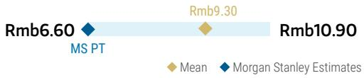

bar-line hybrid chart

| Metric | Value |
|--------|-------|
| Rmb6.60 | 6.60 |
| Rmb9.30 | 9.30 |
| Rmb10.90 | 10.90 |

RISK REWARD CHART  
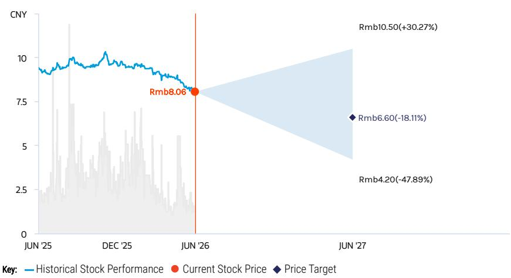

line chart

| Date    | Historical Stock Performance | Current Stock Price | Price Target |
|---------|-------------------------------|---------------------|--------------|
| JUN '25 | ~9.5                          | -                   | -            |
| DEC '25 | ~10.0                         | -                   | -            |
| JUN '26 | ~8.06                         | Rmb8.06             | -            |
| JUN '27 | -                             | Rmb6.60 (-18.11%)   | Rmb6.60 (-18.11%) |

Source: Refinitiv, MS

## UNDERWEIGHT THESIS

■ New terminal and runway were put into use at end-2025. Total cost, including base rent, asset acquisition and revenue sharing, has not yet been decided, leading to uncertainty on GBIA's earnings.  
We expect the final profit impact is likely to be higher than current transitional arrangement. We also expect GBIA's earnings growth in 2026-28 could be slower than expected, considering 1) softer travel demand amid elevated fuel costs; and 2) the closure of T1 from May-26 for renovation, which offsets incremental revenue from T3.  
- Our price target implies 25 x 2026e P/E, higher vs. domestic peers' average considering GBIA's low profit base in 2026.

Consensus Rating Distribution  
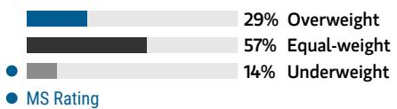

bar chart

| Category | Value (%) |
|---|---|
| Overweight | 29 |
| Equal-weight | 57 |
| Underweight | 14 |
| MS Rating | (not labeled) |

Source: Refinitiv, MS

## Risk Reward Themes

Pricing Power: Negative
Secular Growth: Positive
Self-help: Positive

View descriptions of Risk Rewards Themes here

## BULL CASE

## 40x 2026e P/E

Fast per passenger duty-free spending growth thanks to improved store area, unique product mix, more product choices and more attractive pricing. Combined profit impact from new capacity expansion is lower than expected.

## Rmb10.50

## BASE CASE

## 27x 2026e P/E

Duty-free per pax spending to be largely flat in the medium term. Traffic growth to remain at high-single digits after capacity expansion.

## Rmb7.10

## BEAR CASE

## 16x 2026e P/E

Traffic growth is lower than in our base case owing to soft travel demand and slot control by the CAAC. Cost overruns arise from salary hikes, unexpected maintenance expenses and capacity expansion.

## Rmb4.20

## Risk Reward – Guangzhou Baiyun Int'l Airport (600004.SS)

KEY EARNINGS INPUTS

<table><tr><td>Drivers</td><td>2025</td><td>2026e</td><td>2027e</td><td>2028e</td></tr><tr><td>Passenger traffic growth (%)</td><td>9.5</td><td>7.9</td><td>7.9</td><td>NA</td></tr><tr><td>International traffic mix (%)</td><td>20.9</td><td>23.0</td><td>24.0</td><td>NA</td></tr><tr><td>Per pax duty free spendings (Rmb) (Rmb, mn)</td><td>74</td><td>74</td><td>74</td><td>NA</td></tr></table>

## INVESTMENT DRIVERS

- Traffic mix improvement  
• Per passenger duty-free spending growth  
- Operating cost control

## GLOBAL REVENUE EXPOSURE

100%

Mainland China

Source: MS Estimate View explanation of regional hierarchies here

## MS ALPHA MODELS

3/5

MOST

3 Month

Horizon

Source: Refinitiv, FactSet, MS; 1 is the highest favored Quintile and 5 is the least favored Quintile

## RISKS TO PT/RATING

## RISKS TO UPSIDE

- Faster-than-expected traffic recovery.  
• Stronger-than-expected traffic growth thanks to additional slots approved by CAAC.  
- Lower-than-expected cost on Phase 3 expansion project.

## RISKS TO DOWNSIDE

- Weaker-than-expected traffic recovery.  
- Higher-than-expected cost on Phase 3 expansion project.  
- Downward adjustment of duty-free contract is earlier than expected.

## OWNERSHIP POSITIONING

Inst. Owners, % Active

91%

Source: Refinitiv, MS

## MS ESTIMATES VS. CONSENSUS

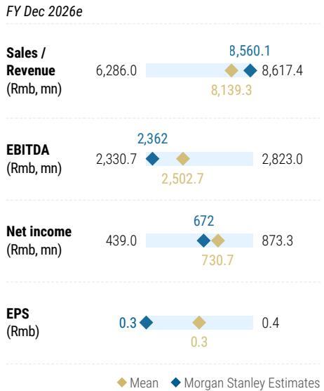

bar-line hybrid chart

FY Dec 2026e
| Metric | Mean (Rmb mn) | MS Estimates (Rmb mn) |
| :--- | :--- | :--- |
| Sales / Revenue | 6,286.0 | 8,560.1 |
| EBITDA | 2,330.7 | 2,362 |
| Net income | 439.0 | 672 |
| EPS | 0.3 | 0.3 |
| Sales / Revenue (Fiscal Year) | 8,139.3 | 8,617.4 |
| EBITDA (Fiscal Year) | 2,502.7 | 2,823.0 |
| Net income (Fiscal Year) | 730.7 | 873.3 |
| EPS (Fiscal Year) | 0.3 | 0.4 |

Source: Refinitiv, MS

## SIAC: Earnings Forecasts and Price Target Changes

We cut our EPS forecasts by 10% and 9% for 2026-27, respectively, reflecting softer-than-expected traffic growth due to air ticket prices inflation amid fuel cost growth as well as soft duty-free revenue in 1Q26 due to rent-free period. We also introduce our 2028 EPS forecast of Rmb0.92, considering capacity expansion in 2028.

Our base-case value is down 41%, given: 1) earnings changes for 2026-28; 2) slower commercial revenue growth in outer years; and 3) higher capex growth in outer years;. Our bull- and bear-case values decline by similar magnitudes to that in our base case. We continue use a DCF model to derive our base case. Our WACC assumptions and bull-, base- and bear-case weightings are unchanged. Our price target falls 41% to Rmb21.10. Remain EW.

Upside risks: 1) Better-than-expected duty-free spending thanks to faster-than-expected product category expansion; 2) better-than-expected commercial operations improvements; 3) better-than-expected traffic growth; and 4) favorable policies on consumption, travel, etc.

Downside risks: 1) Worse-than-expected duty-free spending as transition period for duty-free operators lasts than longer; 2) soft traffic growth amid soft macro; and 3) softer-than-expected commercial spending.

Exhibit 18: SIAC: Base-case DCF valuation

<table><tr><td>ar to Dec, Rmb mn</td><td></td><td>2025</td><td>2026E</td><td>2027E</td><td>2028E</td><td>2029E</td><td>2030E</td><td>2031E</td><td>2032E</td><td>2033E</td><td>2034E</td><td>2035E</td><td>2036E</td></tr><tr><td>Valuation Date</td><td>31/Dec/26</td><td></td><td></td><td></td><td></td><td></td><td></td><td></td><td></td><td></td><td></td><td></td><td></td></tr><tr><td>Cash Flow Date</td><td></td><td>31/Dec/25</td><td>31/Dec/26</td><td>31/Dec/27</td><td>31/Dec/28</td><td>31/Dec/29</td><td>31/Dec/30</td><td>31/Dec/31</td><td>31/Dec/32</td><td>31/Dec/33</td><td>31/Dec/34</td><td>31/Dec/35</td><td>30/Dec/36</td></tr><tr><td colspan="14">Free Cash Flow to Entity</td></tr><tr><td>EBITDA</td><td></td><td>6,331</td><td>6,810</td><td>7,625</td><td>6,487</td><td>6,792</td><td>7,062</td><td>7,345</td><td>7,653</td><td>7,783</td><td>7,984</td><td>8,195</td><td>8,307</td></tr><tr><td>Cash Tax Payable on EBIT</td><td></td><td>(858)</td><td>(989)</td><td>(1,169)</td><td>(859)</td><td>(906)</td><td>(942)</td><td>(980)</td><td>(1,025)</td><td>(1,025)</td><td>(1,043)</td><td>(1,065)</td><td>(1,062)</td></tr><tr><td>Investments in Working Capital</td><td></td><td>818</td><td>(73)</td><td>(99)</td><td>(74)</td><td>(36)</td><td>(30)</td><td>(29)</td><td>(27)</td><td>(0)</td><td>(19)</td><td>(17)</td><td>(14)</td></tr><tr><td>Capital Expenditure</td><td></td><td>(1,307)</td><td>(1,600)</td><td>(1,600)</td><td>(2,000)</td><td>(2,000)</td><td>(2,000)</td><td>(2,000)</td><td>(2,000)</td><td>(2,000)</td><td>(2,000)</td><td>(2,000)</td><td>(2,000)</td></tr><tr><td>Adjustments: deducting amortization of ROU</td><td></td><td>(1,154)</td><td>(1,181)</td><td>(1,271)</td><td>(1,361)</td><td>(1,450)</td><td>(1,540)</td><td>(1,629)</td><td>(1,719)</td><td>(1,809)</td><td>(1,898)</td><td>(1,988)</td><td>(2,078)</td></tr><tr><td>FCF to Entity</td><td></td><td>3,831</td><td>2,967</td><td>3,485</td><td>2,193</td><td>2,400</td><td>2,550</td><td>2,707</td><td>2,882</td><td>2,949</td><td>3,024</td><td>3,126</td><td>3,154</td></tr><tr><td>FCF to Entity, per share</td><td></td><td>1.54</td><td>1.19</td><td>1.40</td><td>0.88</td><td>0.96</td><td>1.02</td><td>1.09</td><td>1.16</td><td>1.19</td><td>1.22</td><td>1.26</td><td>1.27</td></tr><tr><td>FCF to Entity Yield on current price</td><td></td><td>0.06</td><td>0.05</td><td>0.06</td><td>0.04</td><td>0.04</td><td>0.04</td><td>0.05</td><td>0.05</td><td>0.05</td><td>0.05</td><td>0.05</td><td>0.05</td></tr><tr><td>WACC</td><td>9.0%</td><td></td><td></td><td></td><td></td><td></td><td></td><td></td><td></td><td></td><td></td><td></td><td></td></tr><tr><td>Discount factor</td><td></td><td></td><td></td><td>0.92</td><td>0.84</td><td>0.77</td><td>0.71</td><td>0.65</td><td>0.59</td><td>0.55</td><td>0.50</td><td>0.46</td><td>0.42</td></tr><tr><td>NPV of Free Cash Flow</td><td></td><td></td><td></td><td>3,196</td><td>1,844</td><td>1,851</td><td>1,803</td><td>1,755</td><td>1,713</td><td>1,608</td><td>1,512</td><td>1,433</td><td>1,326</td></tr><tr><td>Cumulative NPV of FCF to entity as % of EV</td><td></td><td>0.0%</td><td>0.0%</td><td>8.6%</td><td>5.0%</td><td>5.0%</td><td>4.8%</td><td>4.7%</td><td>4.6%</td><td>4.3%</td><td>4.1%</td><td>3.8%</td><td>3.6%</td></tr><tr><td colspan="14">DCF Valuation (Rmb mn)</td></tr><tr><td>NPV of Explicit Cash Flow Forecasts</td><td>18,042</td><td></td><td></td><td></td><td></td><td></td><td></td><td></td><td></td><td></td><td></td><td></td><td></td></tr><tr><td>Terminal Value</td><td>19,202</td><td></td><td></td><td></td><td></td><td></td><td></td><td></td><td></td><td></td><td></td><td></td><td></td></tr><tr><td>Enterprise Value</td><td>37,244</td><td></td><td></td><td></td><td></td><td></td><td></td><td></td><td></td><td></td><td></td><td></td><td></td></tr><tr><td>Net cash / (debt)</td><td>(2,240)</td><td></td><td></td><td></td><td></td><td></td><td></td><td></td><td></td><td></td><td></td><td></td><td></td></tr><tr><td>Adjustments: deducting lease liability</td><td>19,487</td><td></td><td></td><td></td><td></td><td></td><td></td><td></td><td></td><td></td><td></td><td></td><td></td></tr><tr><td>Minority Interest</td><td>(2,286)</td><td></td><td></td><td></td><td></td><td></td><td></td><td></td><td></td><td></td><td></td><td></td><td></td></tr><tr><td>Equity Value</td><td>52,205</td><td></td><td></td><td></td><td></td><td></td><td></td><td></td><td></td><td></td><td></td><td></td><td></td></tr><tr><td>No. of shares outstanding</td><td>2,488</td><td></td><td></td><td></td><td></td><td></td><td></td><td></td><td></td><td></td><td></td><td></td><td></td></tr><tr><td>Per Share Equity Value (Rmb)</td><td>21.00</td><td></td><td></td><td></td><td></td><td></td><td></td><td></td><td></td><td></td><td></td><td></td><td></td></tr></table>

Source: MS estimates

Exhibit 19: SIAC: Price target

<table><tr><td>Rmb</td><td>New Value</td><td>Old Value</td><td>Change</td><td>Prob.</td><td>Prob-wt values</td><td>Implied 2026 PE</td></tr><tr><td>Bull case</td><td>33.00</td><td>56.00</td><td>-41%</td><td>15%</td><td>4.95</td><td>30.9</td></tr><tr><td>Base case</td><td>21.00</td><td>35.70</td><td>-41%</td><td>70%</td><td>14.70</td><td>19.7</td></tr><tr><td>Bear case</td><td>9.50</td><td>16.50</td><td>-42%</td><td>15%</td><td>1.43</td><td>8.9</td></tr><tr><td>Price target</td><td></td><td></td><td></td><td>100%</td><td>21.10</td><td>19.8</td></tr></table>

Source: MS estimates

## Risk Reward – Shanghai International Airport (600009.SS)

Duty-free Spending Largely Bottomed But Further Improvements Take Time

## PRICE TARGET Rmb21.10

DCF, probability-weighted bull 15%, base 70%, bear 15%. We see equal probability that earnings recovery will be better than expected - supported by traffic growth and other commercial revenue - or worse than expected - with further softening of duty-free business. Key assumptions: 9.0% WACC (1.0x equity beta, 1.8% risk-free rate, 8.0% equity risk premium) and 2% terminal growth rate.

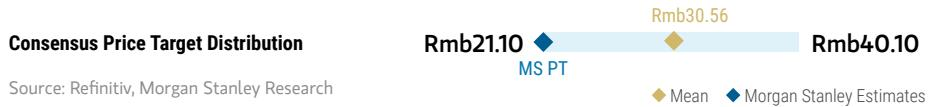

bar-line hybrid chart

| Price Target | Value    |
| ------------ | -------- |
| Rmb21.10     | Rmb21.10 |
| Rmb30.56     | Rmb30.56 |
| Rmb40.10     | Rmb40.10 |

RISK REWARD CHART  
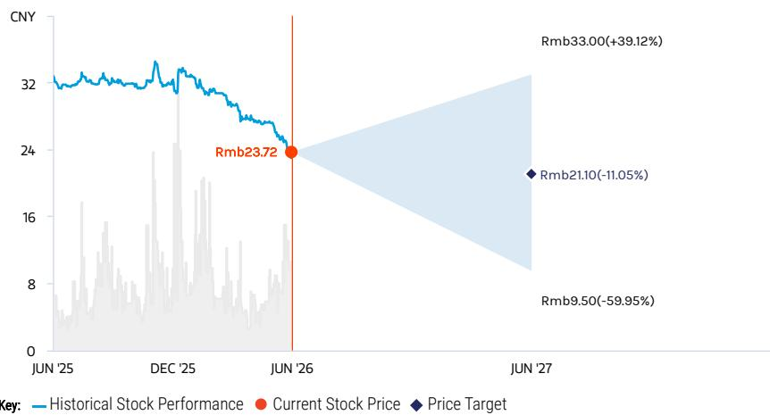

line chart

| Date     | Historical Stock Performance | Current Stock Price | Price Target |
| -------- | ----------------------------- | ------------------- | ------------ |
| JUN '25  | ~32                           | -                   | -            |
| DEC '25  | ~32                           | -                   | -            |
| JUN '26  | ~24                           | Rmb23.72            | -            |
| JUN '27  | -                             | Rmb9.50             | -            |
| Rmb'27   | -                             | Rmb33.00(+39.12%)   | Rmb21.10(-11.05%) |

Source: Refinitiv, MS

## EQUAL-WEIGHT THESIS

■ SIAC is the premier airport in China with 1.5-2x the total traffic and 2-3x the non-domestic traffic of GBIA and BCIA.  
■ We think the new duty-free contract indicates SIAC is regaining bargaining power.  
■ However, it takes time for duty-free spending to further grow despite it has largely bottomed. We could turn more positive with new product categories introduced and a higher percentage of offline DF sales.  
- Our PT implies 20x 2026e P/E, lower vs. global peers' average of 24x considering softened commercial revenue growth potential.

Consensus Rating Distribution  
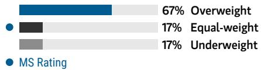

bar chart

| Category      | Value |
| ------------- | ----- |
| Overweight    | 67%   |
| Equal-weight  | 17%   |
| Underweight   | 17%   |

Source: Refinitiv, MS

## Risk Reward Themes

Pricing Power: Positive Secular Growth: Negative

View descriptions of Risk Rewards Themes here

## BULL CASE

## 31x 2026e P/E

International traffic grows faster than expected. Duty-free business is stronger than expected.

## Rmb33.00

## BASE CASE

## 20x 2026e P/E

International traffic growth to slightly soften in 2026 as elevated air ticket price hurt travel demand. Duty-free business bottoms out with slight improvement.

## Rmb21.00

## BEAR CASE

## Rmb9.50

## 9x 2026e P/E

Duty-free business is weaker than expected. Consumption pressure weighs on overall travel spending.

## Risk Reward – Shanghai International Airport (600009.SS)

KEY EARNINGS INPUTS

<table><tr><td>Drivers</td><td>2025</td><td>2026e</td><td>2027e</td><td>2028e</td></tr><tr><td>Passenger traffic growth (%)</td><td>11</td><td>6</td><td>6</td><td>6</td></tr><tr><td>International traffic mix (%)</td><td>45</td><td>45</td><td>46</td><td>47</td></tr><tr><td>Per pax duty free spendings (Rmb)</td><td>152</td><td>137</td><td>137</td><td>139</td></tr></table>

## INVESTMENT DRIVERS

- Passenger and aircraft traffic growth  
- Passenger traffic mix improvement, i.e., higher percentage of international passengers  
• Duty-free spending growth

## GLOBAL REVENUE EXPOSURE

100%

Mainland China

Source: MS Estimate View explanation of regional hierarchies here

## MS ALPHA MODELS

4/5 MOST

3 Month Horizon

Source: Refinitiv, FactSet, MS; 1 is the highest favored Quintile and 5 is the least favored Quintile

## RISKS TO PT/RATING

## RISKS TO UPSIDE

• Stronger-than-expected international travel recovery  
- Better-than-expected per head commercial spending  
- Better-than-expected duty-free spending improvement

## RISKS TO DOWNSIDE

• Macro headwinds weighing on air demand  
- Soft consumption hampering overall commercial spending other than duty-free  
- Traffic dilution from third airport in Shanghai

## OWNERSHIP POSITIONING

Inst. Owners, % Active

94.5%

Source: Refinitiv, MS

## MS ESTIMATES VS. CONSENSUS

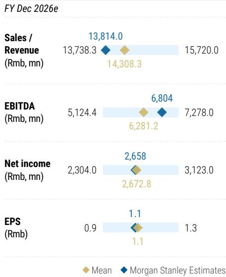

bar-line hybrid chart

| Metric               | FY Dec 2026e Mean | FY Dec 2026e MS Estimates |
|----------------------|-------------------|---------------------------------------|
| Sales / Revenue (Rmb, mn) | 13,738.3           | 14,308.3                              |
| EBITDA (Rmb, mn)      | 5,124.4           | 6,281.2                               |
| Net income (Rmb, mn)   | 2,304.0           | 2,658.0                               |
| EPS (Rmb)            | 0.9               | 1.1                                   |

Source: Refinitiv, MS

## BCIA: Earnings Forecasts and Price Target Changes

From a low base, we cut our EPS forecasts by 85% and 48%, respectively, for 2026-27, mainly reflecting higher operating costs following 1Q26 results. We also introduce our EPS forecast of Rmb0.08 in 2028.

Our base-case value drops 44% largely in line with our earnings change in 2027. Our bull-and bear-case values decline by similar magnitudes to that in our base case. We continue to derive our base case using a DCF model. Our WACC assumptions rose to 14.3% from 12.8%, reflecting: 1) a higher risk-free rate of 4%; and 2) a higher equity risk premium of 10% as BCIA was excluded from Stock Connect. Our bull-, base- and bear-case weightings are unchanged. Our price target falls 42% from HK\$2.40 to HK\$1.40. We remain UW on slower-than-expected earnings recovery and long-term growth concerns due to traffic dilution and capacity constraints.

Upside risks: 1) better-than-expected international traffic growth; 2) new flight slots approved by CAAC; 3) better-than expected commercial operations improvements.

Exhibit 20: BCIA: Base-case DCF valuation

<table><tr><td>Valuation Date</td><td>31-Dec-26</td><td>31-Dec-25</td><td>31-Dec-26</td><td>31-Dec-27</td><td>31-Dec-28</td><td>31-Dec-29</td><td>31-Dec-30</td><td>31-Dec-31</td><td>31-Dec-32</td><td>31-Dec-33</td><td>31-Dec-34</td><td>31-Dec-35</td><td>30-Dec-36</td></tr><tr><td colspan="14">Free Cash Flow</td></tr><tr><td>EBITDA</td><td></td><td>1,401</td><td>1,838</td><td>2,056</td><td>2,271</td><td>2,487</td><td>2,695</td><td>2,918</td><td>3,157</td><td>3,413</td><td>3,688</td><td>3,982</td><td>4,296</td></tr><tr><td>Less: Cash Tax Payable on EBIT</td><td></td><td>38</td><td>(81)</td><td>(132)</td><td>(181)</td><td>(230)</td><td>(277)</td><td>(327)</td><td>(381)</td><td>(439)</td><td>(503)</td><td>(570)</td><td>(644)</td></tr><tr><td>Plus: Decrease in Working Capital</td><td></td><td>193</td><td>43</td><td>(135)</td><td>(121)</td><td>(120)</td><td>(120)</td><td>(125)</td><td>(130)</td><td>(136)</td><td>(142)</td><td>11</td><td>9</td></tr><tr><td>Less: Capital Expenditure</td><td></td><td>(554)</td><td>(600)</td><td>(600)</td><td>(600)</td><td>(800)</td><td>(800)</td><td>(800)</td><td>(800)</td><td>(800)</td><td>(800)</td><td>(800)</td><td>(800)</td></tr><tr><td>Adjustments: deducting amotizatoin of ROU</td><td></td><td>(226)</td><td>(220)</td><td>(222)</td><td>(225)</td><td>(228)</td><td>(231)</td><td>(234)</td><td>(237)</td><td>(241)</td><td>(244)</td><td>(247)</td><td>(251)</td></tr><tr><td>Plus: Proceeds from Asset Sales</td><td></td><td>5</td><td>-</td><td>-</td><td>-</td><td>-</td><td>-</td><td>-</td><td>-</td><td>-</td><td>-</td><td>-</td><td>-</td></tr><tr><td>Free Cash Flow</td><td></td><td>858</td><td>980</td><td>966</td><td>1,143</td><td>1,109</td><td>1,267</td><td>1,432</td><td>1,608</td><td>1,797</td><td>1,999</td><td>2,375</td><td>2,612</td></tr><tr><td>Growth rate (%)</td><td>2.0%</td><td>(294)</td><td>14</td><td>(1)</td><td>18</td><td>(3)</td><td>14</td><td>13</td><td>12</td><td>12</td><td>11</td><td>19</td><td>10</td></tr><tr><td>Year to Dec</td><td></td><td>2,025</td><td>2,026</td><td>2,027</td><td>2,028</td><td>2,029</td><td>2,030</td><td>2,031</td><td>2,032</td><td>2,033</td><td>2,034</td><td>2,035</td><td>2,036</td></tr><tr><td>Free Cash Flow for Valuation Purposes</td><td></td><td>858</td><td>980</td><td>966</td><td>1,143</td><td>1,109</td><td>1,267</td><td>1,432</td><td>1,608</td><td>1,797</td><td>1,999</td><td>2,375</td><td>2,612</td></tr><tr><td>WACC</td><td>14.3%</td><td>14.3%</td><td>14.3%</td><td>14.3%</td><td>14.3%</td><td>14.3%</td><td>14.3%</td><td>14.3%</td><td>14.3%</td><td>14.3%</td><td>14.3%</td><td>14.3%</td><td>14.3%</td></tr><tr><td>NPV of Free Cash Flow</td><td></td><td></td><td></td><td>846</td><td>876</td><td>743</td><td>744</td><td>735</td><td>723</td><td>707</td><td>688</td><td>716</td><td>689</td></tr><tr><td colspan="14">DCF Valuation (Rmb Mn)</td></tr><tr><td>NPV of Expliciti Cashflow Forecasts</td><td>7,466</td><td></td><td></td><td></td><td></td><td></td><td></td><td></td><td></td><td></td><td></td><td></td><td></td></tr><tr><td></td><td>5,735</td><td></td><td></td><td></td><td></td><td></td><td></td><td></td><td></td><td></td><td></td><td></td><td></td></tr><tr><td>Enterprise Value</td><td>13,201</td><td></td><td></td><td></td><td></td><td></td><td></td><td></td><td></td><td></td><td></td><td></td><td></td></tr><tr><td>Net Cash / (Debt)</td><td>(8,648)</td><td></td><td></td><td></td><td></td><td></td><td></td><td></td><td></td><td></td><td></td><td></td><td></td></tr><tr><td>Adjustments: deducting lease liabilitie</td><td>523</td><td></td><td></td><td></td><td></td><td></td><td></td><td></td><td></td><td></td><td></td><td></td><td></td></tr><tr><td>Market Value of Minority Interests</td><td>-</td><td></td><td></td><td></td><td></td><td></td><td></td><td></td><td></td><td></td><td></td><td></td><td></td></tr><tr><td>Equity Value</td><td>5,076</td><td></td><td></td><td></td><td></td><td></td><td></td><td></td><td></td><td></td><td></td><td></td><td></td></tr><tr><td>No. of shares outstanding</td><td>4,579</td><td></td><td></td><td></td><td></td><td></td><td></td><td></td><td></td><td></td><td></td><td></td><td></td></tr><tr><td>Per Share Equity Value (Rmb)</td><td>1.11</td><td></td><td></td><td></td><td></td><td></td><td></td><td></td><td></td><td></td><td></td><td></td><td></td></tr><tr><td>Per Share Equity Value (HK$)</td><td>1.26</td><td></td><td></td><td></td><td></td><td></td><td></td><td></td><td></td><td></td><td></td><td></td><td></td></tr><tr><td>HKDRMB</td><td>0.88</td><td></td><td></td><td></td><td></td><td></td><td></td><td></td><td></td><td></td><td></td><td></td><td></td></tr></table>

Source: MS estimates

Exhibit 21: BCIA: Price target

<table><tr><td></td><td>Value - New</td><td>Value - Old</td><td>Change</td><td>Prob.</td><td>Prob-wt</td></tr><tr><td>Bull</td><td>2.20</td><td>3.90 HKD</td><td>-44%</td><td>15%</td><td>0.33</td></tr><tr><td>Base</td><td>1.26</td><td>2.24 HKD</td><td>-44%</td><td>70%</td><td>0.88</td></tr><tr><td>Bear</td><td>1.00</td><td>1.75 HKD</td><td>-43%</td><td>15%</td><td>0.15</td></tr><tr><td colspan="4"></td><td>100%</td><td>1.40</td></tr></table>

Source: MS estimates

## Risk Reward – Beijing Capital Int'l Airport (0694.HK)

Slower Earnings Recovery; Uncertain Long-term Growth Potential

## PRICE TARGET HK\$1.40

Derived from the weighted average of scenario values by assigning 15%/70%/15% weightings to our bull/base/bear cases. We see equal likelihood for the bull and bear cases, as we think risk-reward looks balanced after renewal of duty-free terms. The base case value is based on DCF valuation, applying a 14.3% WACC and 2% terminal growth rate.

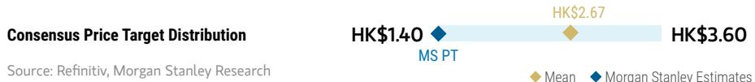

bar-line hybrid chart

| Consensus Price Target Distribution | Mean   | MS Estimates |
| ----------------------------------- | ------ | ------------------------ |
| HK$1.40                             |        |                          |
| HK$2.67                             |        |                          |
| HK$3.60                             |        |                          |

RISK REWARD CHART  
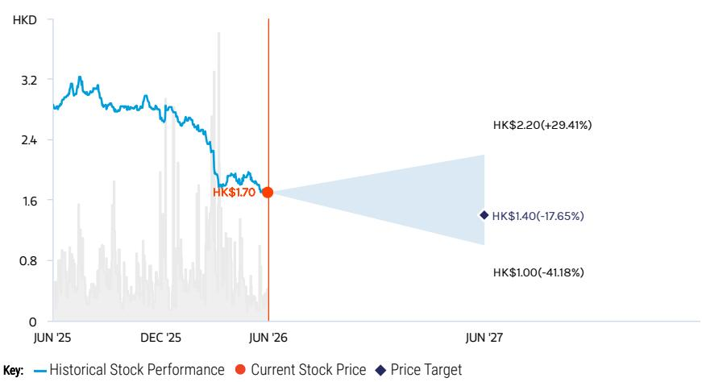

line chart

| Date    | Historical Stock Performance | Current Stock Price | Price Target |
|---------|-------------------------------|---------------------|--------------|
| JUN '25 | ~3.0                          | -                   | -            |
| DEC '25 | ~2.8                          | -                   | -            |
| JUN '26 | $1.70                         | $1.70               | -            |
| JUN '27 | -                             | $1.40               | $1.00        |

Source: Refinitiv, MS

## UNDERWEIGHT THESIS

■ BCIA's earnings recovery is slower than expected.  
We see further earnings downside risks considering soft commercial spending and slower traffic growth due to a slower recovery in international routes and traffic dilution from Daxing Airport.  
■ We also see limited earnings upsides in the long run considering capacity constraints as well as traffic dilution from Daxing.  
- Getting removed from stock connect also add on valuation pressure.  
- Our price target implies 0.5x 2026e P/B, lower vs. domestic peers' average considering the traffic dilution.

Consensus Rating Distribution  
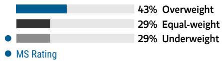

bar chart

| Category      | Value |
| ------------- | ----- |
| Overweight    | 43%   |
| Equal-weight  | 29%   |
| Underweight   | 29%   |
| MS Rating     | 29%   |

Source: Refinitiv, MS

## Risk Reward Themes

Pricing Power: Negative
Self-help: Positive

View descriptions of Risk Rewards Themes here

## BULL CASE

## 0.7x 2026e P/B

BCIA gets more flight slots approved by CAAC and international travel grows faster than expected in 2026-28, resulting in stronger-than-expected revenue.

## HK\$2.20

## BASE CASE

## 0.4 2026e P/B

Passenger volume to recover to 83% of 2019 level in 2028E, hampered by traffic transition to Daxing Airport.

## HK\$1.26

## BEAR CASE

## HK\$1.00

## 0.3x 2026e P/B

Weaker-than-expected traffic recovery and duty-free rent negotiation.

## Risk Reward – Beijing Capital Int'l Airport (0694.HK)

KEY EARNINGS INPUTS

<table><tr><td>Drivers</td><td>2025</td><td>2026e</td><td>2027e</td><td>2028e</td></tr><tr><td>Passenger traffic growth (%)</td><td>5</td><td>7</td><td>NA</td><td>NA</td></tr><tr><td>International traffic mix (%)</td><td>24</td><td>26</td><td>NA</td><td>NA</td></tr><tr><td>Per pax duty free spendings (Rmb)</td><td>145</td><td>102</td><td>NA</td><td>NA</td></tr></table>

## INVESTMENT DRIVERS

• Traffic volume dilution from Daxing Airport  
• International traffic mix  
• Duty-free spending per passenger

## GLOBAL REVENUE EXPOSURE

100%

Mainland China

Source: MS Estimate View explanation of regional hierarchies here

## RISKS TO PT/RATING

## RISKS TO UPSIDE

- Faster-than-expected international traffic recovery.  
- Lower-than-expected traffic dilution from Daxing Airport.  
• Better-than-expected duty-free contract.  
- New slots approved by CAAC.

## RISKS TO DOWNSIDE

• Higher-than-expected operating costs.  
- Worse-than-expected duty-free contract.  
- Slower-than-expected non-domestic traffic recovery.

## OWNERSHIP POSITIONING

Inst. Owners, % Active

51.8%

Source: Refinitiv, MS

## MS ESTIMATES VS. CONSENSUS

FY Dec 2026e

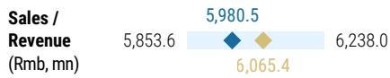

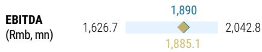

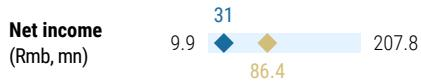

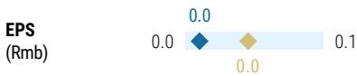

Mean

organ Stanley Estimates

Source: Refinitiv, MS

# Financial Summary: BCIA

Exhibit 22: BCIA: Financial Summary

<table><tr><td>Profit and Loss Statements</td><td>2024</td><td>2025</td><td>2026E</td><td>2027E</td><td>2028E</td></tr><tr><td colspan="6">RMB Mn</td></tr><tr><td>Aeronautical Revenues</td><td>2,668</td><td>2,770</td><td>2,942</td><td>3,086</td><td>3,219</td></tr><tr><td>Non-aeronautical Revenues</td><td>2,825</td><td>2,861</td><td>3,038</td><td>3,148</td><td>3,287</td></tr><tr><td>Lesss: Business tax</td><td>0</td><td>0</td><td>0</td><td>0</td><td>0</td></tr><tr><td>Net Revenues</td><td>5,492</td><td>5,632</td><td>5,981</td><td>6,233</td><td>6,506</td></tr><tr><td>Depreciation</td><td>(1,509)</td><td>(1,554)</td><td>(1,513)</td><td>(1,529)</td><td>(1,546)</td></tr><tr><td>Cash Operating Costs</td><td>(4,347)</td><td>(4,230)</td><td>(4,142)</td><td>(4,178)</td><td>(4,235)</td></tr><tr><td>Operating Profit</td><td>(365)</td><td>(153)</td><td>326</td><td>526</td><td>725</td></tr><tr><td>Net Interest Income/(Expenses)</td><td>(279)</td><td>(264)</td><td>(280)</td><td>(255)</td><td>(230)</td></tr><tr><td>Share of Results of Associates</td><td>0</td><td>0</td><td>0</td><td>0</td><td>0</td></tr><tr><td>Other Income/(Expenses)</td><td>14</td><td>(92)</td><td>(9)</td><td>(9)</td><td>(10)</td></tr><tr><td>Pre-tax Profit</td><td>(629)</td><td>(509)</td><td>36</td><td>262</td><td>485</td></tr><tr><td>Taxation</td><td>(760)</td><td>(121)</td><td>(5)</td><td>(65)</td><td>(121)</td></tr><tr><td>Minority Interest</td><td>0</td><td>0</td><td>0</td><td>0</td><td>0</td></tr><tr><td>Net Profit</td><td>(1,390)</td><td>(630)</td><td>31</td><td>196</td><td>364</td></tr><tr><td>EBITDA</td><td>1,145</td><td>1,401</td><td>1,838</td><td>2,056</td><td>2,271</td></tr><tr><td>MW EPS (Rmb)</td><td>(0.29)</td><td>(0.13)</td><td>0.02</td><td>-</td><td>-</td></tr><tr><td>EPS (Rmb)</td><td>(0.30)</td><td>(0.14)</td><td>0.01</td><td>0.04</td><td>0.08</td></tr></table>

<table><tr><td>Balance Sheet</td><td>2024</td><td>2025</td><td>2026E</td><td>2027E</td><td>2028E</td></tr><tr><td>RMB Mn</td><td></td><td></td><td></td><td></td><td></td></tr><tr><td>Net Fixed Assets</td><td>23,377</td><td>22,755</td><td>21,857</td><td>20,944</td><td>20,015</td></tr><tr><td>Construction in Progress</td><td>0</td><td>0</td><td>0</td><td>0</td><td>0</td></tr><tr><td>Intangible Assets</td><td>88</td><td>61</td><td>44</td><td>27</td><td>10</td></tr><tr><td>Others</td><td>4,281</td><td>3,827</td><td>3,827</td><td>3,827</td><td>3,827</td></tr><tr><td>Total Non-current Assets</td><td>27,746</td><td>26,643</td><td>25,728</td><td>24,798</td><td>23,852</td></tr><tr><td>Cash and Bank Balances</td><td>1,428</td><td>1,852</td><td>4,683</td><td>4,681</td><td>4,870</td></tr><tr><td>Non-cash Assets</td><td>1,502</td><td>1,519</td><td>1,375</td><td>1,417</td><td>1,463</td></tr><tr><td>Total Current Assets</td><td>2,929</td><td>3,371</td><td>6,058</td><td>6,098</td><td>6,332</td></tr><tr><td>ST Borrowings</td><td>7,521</td><td>7,277</td><td>6,777</td><td>6,277</td><td>5,777</td></tr><tr><td>Other Current Liabilities</td><td>5,488</td><td>7,977</td><td>7,382</td><td>6,789</td><td>6,213</td></tr><tr><td>Total Current Liabilities</td><td>13,008</td><td>15,254</td><td>14,159</td><td>13,066</td><td>11,990</td></tr><tr><td>Net Current Assets</td><td>(10,079)</td><td>(11,883)</td><td>(8,101)</td><td>(6,968)</td><td>(5,658)</td></tr><tr><td>Total Non-current Liabilities</td><td>3,699</td><td>1,378</td><td>4,215</td><td>4,222</td><td>4,222</td></tr><tr><td>Minority Interests</td><td>0</td><td>0</td><td>0</td><td>0</td><td>0</td></tr><tr><td>Net Assets</td><td>13,968</td><td>13,381</td><td>13,412</td><td>13,608</td><td>13,972</td></tr><tr><td>Shareholders Equity</td><td>13,456</td><td>12,858</td><td>12,889</td><td>13,085</td><td>13,449</td></tr></table>

<table><tr><td>Cash Flow Statement</td><td>2024</td><td>2025</td><td>2026E</td><td>2027E</td><td>2028E</td></tr><tr><td colspan="6">RMB Mn</td></tr><tr><td>Pre-tax Profit</td><td>(629)</td><td>(509)</td><td>36</td><td>262</td><td>485</td></tr><tr><td>Add: Depreciation and Amortisation</td><td>1,509</td><td>1,554</td><td>1,514</td><td>1,530</td><td>1,546</td></tr><tr><td>Add: Minority Interest</td><td>0</td><td>0</td><td>0</td><td>0</td><td>0</td></tr><tr><td>Less: Associates&#x27; Profits</td><td>4</td><td>9</td><td>0</td><td>0</td><td>0</td></tr><tr><td>Less: Tax Paid</td><td>8</td><td>0</td><td>(5)</td><td>(65)</td><td>(121)</td></tr><tr><td>Other Non-cash Items</td><td>(47)</td><td>95</td><td>0</td><td>0</td><td>0</td></tr><tr><td>Gross Cash Flow</td><td>845</td><td>1,149</td><td>1,545</td><td>1,726</td><td>1,910</td></tr><tr><td>Capex</td><td>(423)</td><td>(554)</td><td>(600)</td><td>(600)</td><td>(600)</td></tr><tr><td>Change in Working Capital</td><td>(1,026)</td><td>193</td><td>43</td><td>(135)</td><td>(121)</td></tr><tr><td>Sale on Fixed Assets/Investment</td><td>0</td><td>5</td><td>0</td><td>0</td><td>0</td></tr><tr><td>Net Increase in Investment</td><td>0</td><td>1</td><td>0</td><td>0</td><td>0</td></tr><tr><td>Share Issues</td><td>0</td><td>0</td><td>0</td><td>0</td><td>0</td></tr><tr><td>Net Increase in Bank Loans</td><td>942</td><td>(262)</td><td>1,844</td><td>(994)</td><td>(1,000)</td></tr><tr><td>Dividend Paid</td><td>0</td><td>0</td><td>0</td><td>0</td><td>0</td></tr><tr><td>Capital From/Dividend Paid to M.I.</td><td>0</td><td>0</td><td>0</td><td>0</td><td>0</td></tr><tr><td>Others</td><td>(193)</td><td>(107)</td><td>(0)</td><td>(0)</td><td>0</td></tr><tr><td>Change in Net Cash</td><td>146</td><td>(364)</td><td>1,844</td><td>(994)</td><td>(1,000)</td></tr><tr><td>Beginning Net Cash</td><td>1,281</td><td>1,427</td><td>1,063</td><td>2,907</td><td>1,913</td></tr><tr><td>Effect of Foreign Exchanges</td><td>0</td><td>(0)</td><td>0</td><td>0</td><td>0</td></tr><tr><td>Ending Net Cash</td><td>1,427</td><td>1,063</td><td>2,907</td><td>1,913</td><td>913</td></tr></table>

<table><tr><td>Ratio Analysis</td><td>2024</td><td>2025</td><td>2026E</td><td>2027E</td><td>2028E</td></tr><tr><td colspan="6">Growth (%)</td></tr><tr><td>Aeronautical Rev</td><td>27.2</td><td>3.8</td><td>6.2</td><td>4.9</td><td>4.3</td></tr><tr><td>Non-aeronautical Rev</td><td>14.7</td><td>1.3</td><td>6.2</td><td>3.6</td><td>4.4</td></tr><tr><td>Net Revenues</td><td>20.5</td><td>2.5</td><td>6.2</td><td>4.2</td><td>4.4</td></tr><tr><td>Operating Profits</td><td>(73.1)</td><td>(58.1)</td><td>NM</td><td>61.6</td><td>37.8</td></tr><tr><td>Pretax Profits</td><td>(63.4)</td><td>(19.1)</td><td>NM</td><td>621.6</td><td>85.5</td></tr><tr><td>Net Profit</td><td>(18.1)</td><td>(54.7)</td><td>NM</td><td>536.7</td><td>85.5</td></tr><tr><td>EBITDA</td><td>486.9</td><td>22.4</td><td>31.2</td><td>11.8</td><td>10.5</td></tr><tr><td>EPS</td><td>(18.1)</td><td>(54.7)</td><td>NM</td><td>536.7</td><td>85.5</td></tr><tr><td colspan="6">Margins (%)</td></tr><tr><td>EBITDA Margin</td><td>20.8</td><td>24.9</td><td>30.7</td><td>33.0</td><td>34.9</td></tr><tr><td>Operating Margin</td><td>(6.6)</td><td>(2.7)</td><td>5.4</td><td>8.4</td><td>11.1</td></tr><tr><td>Net Profit Margin</td><td>(25.3)</td><td>(11.2)</td><td>0.5</td><td>3.1</td><td>5.6</td></tr><tr><td colspan="6">Return (%)</td></tr><tr><td>ROE</td><td>(9.8)</td><td>(4.8)</td><td>0.2</td><td>1.5</td><td>2.7</td></tr><tr><td>ROA</td><td>(4.4)</td><td>(2.1)</td><td>0.1</td><td>0.6</td><td>1.2</td></tr><tr><td colspan="6">Gearing</td></tr><tr><td>Net Debt/Equity (%)</td><td>76</td><td>75</td><td>67</td><td>59</td><td>48</td></tr><tr><td>Net Interest Coverage (x)</td><td>4.1</td><td>5.3</td><td>6.6</td><td>8.1</td><td>9.9</td></tr></table>

<table><tr><td>Operational Analysis</td><td>2024</td><td>2025</td><td>2026E</td><td>2027E</td><td>2028E</td></tr><tr><td>Pax. Volumes</td><td>67.4</td><td>70.7</td><td>75.6</td><td>78.8</td><td>82.1</td></tr><tr><td>Domestic (Mn)</td><td>52.5</td><td>53.5</td><td>56.1</td><td>56.7</td><td>58.4</td></tr><tr><td>Regional and Int&#x27;l (Mn)</td><td>14.9</td><td>17.3</td><td>19.5</td><td>22.1</td><td>23.7</td></tr><tr><td>Aircraft Movements</td><td>433,572</td><td>442,046</td><td>455,307</td><td>468,967</td><td>483,036</td></tr><tr><td>Domestic</td><td>348,060</td><td>343,960</td><td>352,863</td><td>361,104</td><td>369,522</td></tr><tr><td>Regional and Int&#x27;l</td><td>85,512</td><td>98,086</td><td>102,444</td><td>107,862</td><td>113,513</td></tr><tr><td colspan="6">Growth (%)</td></tr><tr><td>Pax. Volumes</td><td>27.4</td><td>5.0</td><td>6.8</td><td>4.2</td><td>4.2</td></tr><tr><td>Domestic Pax.</td><td>16.2</td><td>1.8</td><td>4.9</td><td>1.0</td><td>3.0</td></tr><tr><td>Regional and Int&#x27;l Pax.</td><td>93.3</td><td>16.3</td><td>12.8</td><td>13.4</td><td>7.4</td></tr><tr><td>Aircraft Movements</td><td>14.2</td><td>2.0</td><td>3.0</td><td>3.0</td><td>3.0</td></tr><tr><td>Domestic Routes</td><td>0.0</td><td>0.0</td><td>0.0</td><td>0.0</td><td>0.0</td></tr><tr><td>Regional and Int&#x27;l Routes</td><td>64.4</td><td>14.7</td><td>4.4</td><td>5.3</td><td>5.2</td></tr></table>

<table><tr><td>MW Valuation</td><td>2024</td><td>2025</td><td>2026E</td><td>2027E</td><td>2028E</td></tr><tr><td>X</td><td></td><td></td><td></td><td></td><td></td></tr><tr><td>P/E</td><td>NM</td><td>NM</td><td>81.9</td><td>27.3</td><td>16.3</td></tr><tr><td>P/BV</td><td>0.8</td><td>0.8</td><td>0.5</td><td>0.5</td><td>0.5</td></tr><tr><td>EV/EBITDA</td><td>16.3</td><td>13.6</td><td>6.9</td><td>5.7</td><td>4.7</td></tr><tr><td>Dividend Yield (%)</td><td>-</td><td>-</td><td>-</td><td>-</td><td>-</td></tr></table>

Source: Company data, MS (E) estimates

## Financial Summary: GBIA

Exhibit 23: GBIA: Financial Summary

<table><tr><td colspan="6">Income Statement</td></tr><tr><td>RMB Mn</td><td>2024</td><td>2025</td><td>2026E</td><td>2027E</td><td>2028E</td></tr><tr><td>Aeronautical Revenues</td><td>2,952</td><td>3,252</td><td>3,546</td><td>3,731</td><td>4,042</td></tr><tr><td>Non-aeronautical Revenues</td><td>4,471</td><td>4,703</td><td>5,225</td><td>5,743</td><td>6,310</td></tr><tr><td>Less: Business tax</td><td>(163)</td><td>(191)</td><td>(211)</td><td>(228)</td><td>(249)</td></tr><tr><td>Net Revenues</td><td>7,260</td><td>7,764</td><td>8,560</td><td>9,245</td><td>10,103</td></tr><tr><td>Cost of Services</td><td>(5,416)</td><td>(5,941)</td><td>(7,108)</td><td>(7,597)</td><td>(8,104)</td></tr><tr><td>Operating Expenses</td><td>(127)</td><td>(39)</td><td>(43)</td><td>(46)</td><td>(186)</td></tr><tr><td>General &amp; Administrative</td><td>(432)</td><td>(516)</td><td>(569)</td><td>(614)</td><td>(671)</td></tr><tr><td>Operating Profit</td><td>1,286</td><td>1,268</td><td>840</td><td>988</td><td>1,142</td></tr><tr><td>Net Interest Income/(Expenses)</td><td>(72)</td><td>(52)</td><td>(51)</td><td>(54)</td><td>(52)</td></tr><tr><td>Investment income and subsidy</td><td>135</td><td>131</td><td>136</td><td>139</td><td>143</td></tr><tr><td>Net non-operation income</td><td>(11)</td><td>629</td><td>(1)</td><td>(1)</td><td>(1)</td></tr><tr><td>Pre-tax Profit</td><td>1,338</td><td>1,976</td><td>925</td><td>1,073</td><td>1,232</td></tr><tr><td>Income tax</td><td>(373)</td><td>(463)</td><td>(198)</td><td>(234)</td><td>(273)</td></tr><tr><td>Net Profit before Minority Interest</td><td>966</td><td>1,514</td><td>727</td><td>839</td><td>959</td></tr><tr><td>Minority interest</td><td>(40)</td><td>(45)</td><td>(55)</td><td>(62)</td><td>(68)</td></tr><tr><td>Net Profit</td><td>926</td><td>1,468</td><td>672</td><td>776</td><td>891</td></tr><tr><td>EBITDA</td><td>3,162</td><td>3,465</td><td>2,546</td><td>2,756</td><td>2,959</td></tr><tr><td>EPS (Rmb)</td><td>0.39</td><td>0.57</td><td>0.26</td><td>0.30</td><td>0.35</td></tr></table>

<table><tr><td colspan="6">Balance Sheet</td></tr><tr><td>RMB Mn</td><td>2024</td><td>2025</td><td>2026E</td><td>2027E</td><td>2028E</td></tr><tr><td>Net Fixed Assets</td><td>17,253</td><td>16,479</td><td>16,031</td><td>15,694</td><td>15,410</td></tr><tr><td>Construction in Progress</td><td>278</td><td>689</td><td>1,013</td><td>1,208</td><td>1,325</td></tr><tr><td>Intangible and Deferred Assets</td><td>428</td><td>366</td><td>329</td><td>301</td><td>279</td></tr><tr><td>Other non-current assets</td><td>2,952</td><td>2,528</td><td>2,868</td><td>3,168</td><td>3,445</td></tr><tr><td>Total Non-current Assets</td><td>20,912</td><td>20,061</td><td>20,242</td><td>20,371</td><td>20,459</td></tr><tr><td>Cash and Cash Equivalents</td><td>4,731</td><td>7,079</td><td>6,594</td><td>7,072</td><td>7,601</td></tr><tr><td>Non-cash current Assets</td><td>1,355</td><td>2,537</td><td>2,706</td><td>2,850</td><td>3,031</td></tr><tr><td>Total Current Assets</td><td>6,086</td><td>9,617</td><td>9,299</td><td>9,922</td><td>10,633</td></tr><tr><td>Total Assets</td><td>26,998</td><td>29,678</td><td>29,541</td><td>30,294</td><td>31,092</td></tr><tr><td>Current Liabilities</td><td>6,191</td><td>6,534</td><td>6,180</td><td>6,254</td><td>6,335</td></tr><tr><td>Loans or debts</td><td>2,215</td><td>1,835</td><td>2,060</td><td>2,236</td><td>2,383</td></tr><tr><td>Net Working Capital</td><td>(105)</td><td>3,083</td><td>3,119</td><td>3,669</td><td>4,298</td></tr><tr><td>Total Non-current Liabilities</td><td>2,215</td><td>1,835</td><td>2,060</td><td>2,236</td><td>2,383</td></tr><tr><td>Minority Interest</td><td>245</td><td>284</td><td>339</td><td>402</td><td>470</td></tr><tr><td>Net Assets</td><td>18,347</td><td>21,024</td><td>20,962</td><td>21,402</td><td>21,905</td></tr><tr><td>Common stock</td><td>2,367</td><td>2,577</td><td>2,577</td><td>2,577</td><td>2,577</td></tr><tr><td>Additional paid-in capital</td><td>9,889</td><td>11,260</td><td>11,260</td><td>11,260</td><td>11,260</td></tr><tr><td>Surplus reserve</td><td>1,007</td><td>1,104</td><td>1,104</td><td>1,104</td><td>1,104</td></tr><tr><td>Retained earnings</td><td>5,084</td><td>6,083</td><td>6,021</td><td>6,461</td><td>6,964</td></tr><tr><td>Total shareholders&#x27; equity</td><td>18,347</td><td>21,024</td><td>20,962</td><td>21,402</td><td>21,905</td></tr></table>

<table><tr><td colspan="6">Cash Flow Statement</td></tr><tr><td>RMB Mn</td><td>2024E</td><td>2025</td><td>2026E</td><td>2027E</td><td>2028E</td></tr><tr><td>Net income before minority interest</td><td>966</td><td>1,514</td><td>727</td><td>839</td><td>959</td></tr><tr><td>Depreciation and Amortization</td><td>1,754</td><td>1,667</td><td>1,571</td><td>1,629</td><td>1,674</td></tr><tr><td>Increase in working capital</td><td>705</td><td>305</td><td>(522)</td><td>(72)</td><td>(100)</td></tr><tr><td>Investment income and disposal</td><td>(125)</td><td>(510)</td><td>(136)</td><td>(139)</td><td>(143)</td></tr><tr><td>Financial expenses</td><td>110</td><td>99</td><td>51</td><td>54</td><td>52</td></tr><tr><td>CF from Operating Activities</td><td>3,410</td><td>3,075</td><td>1,691</td><td>2,311</td><td>2,442</td></tr><tr><td>Capex</td><td>(388)</td><td>(737)</td><td>(1,666)</td><td>(1,667)</td><td>(1,669)</td></tr><tr><td>Cash for investment</td><td>-</td><td>(785)</td><td>-</td><td>-</td><td>-</td></tr><tr><td>Cash from investment</td><td>35</td><td>50</td><td>-</td><td>-</td><td>-</td></tr><tr><td>CF from Investing Activities</td><td>(353)</td><td>(1,473)</td><td>(1,616)</td><td>(1,617)</td><td>(1,619)</td></tr><tr><td>Issue of debts</td><td>-</td><td>-</td><td>-</td><td>-</td><td>-</td></tr><tr><td>Other cash received</td><td>(684)</td><td>1,118</td><td>(295)</td><td>(340)</td><td>(367)</td></tr><tr><td>Retirement of debts</td><td>-</td><td>-</td><td>-</td><td>-</td><td>-</td></tr><tr><td>Interests on debts</td><td>-</td><td>-</td><td>469</td><td>461</td><td>461</td></tr><tr><td>Dividends</td><td>(176)</td><td>(378)</td><td>(735)</td><td>(336)</td><td>(388)</td></tr><tr><td>CF from Financing Activities</td><td>(861)</td><td>740</td><td>(560)</td><td>(215)</td><td>(294)</td></tr><tr><td>Change in Net Cash</td><td>2,197</td><td>2,342</td><td>(486)</td><td>478</td><td>529</td></tr><tr><td>Beginning Net Cash</td><td>2,511</td><td>4,708</td><td>7,051</td><td>6,565</td><td>7,044</td></tr><tr><td>Ending Net Cash</td><td>4,708</td><td>7,051</td><td>6,565</td><td>7,044</td><td>7,573</td></tr></table>

<table><tr><td colspan="6">Ratio Analysis</td></tr><tr><td></td><td>2024</td><td>2025</td><td>2026E</td><td>2027E</td><td>2028E</td></tr><tr><td colspan="6">Growth</td></tr><tr><td>Aeronautical Rev</td><td>18.4%</td><td>10.2%</td><td>9.1%</td><td>5.2%</td><td>8.4%</td></tr><tr><td>Non-aeronautical Rev</td><td>13.5%</td><td>5.2%</td><td>11.1%</td><td>9.9%</td><td>9.9%</td></tr><tr><td>Total Revenues</td><td>15.7%</td><td>6.9%</td><td>10.3%</td><td>8.0%</td><td>9.3%</td></tr><tr><td>Operating Profits</td><td>89.2%</td><td>-1.4%</td><td>-33.8%</td><td>17.6%</td><td>15.5%</td></tr><tr><td>Pretax Profits</td><td>97.4%</td><td>47.7%</td><td>-53.2%</td><td>16.0%</td><td>14.9%</td></tr><tr><td>Net Profit</td><td>109.5%</td><td>58.6%</td><td>-54.2%</td><td>15.6%</td><td>14.7%</td></tr><tr><td>EBITDA</td><td>21.6%</td><td>9.6%</td><td>-26.5%</td><td>8.2%</td><td>7.4%</td></tr><tr><td>EPS</td><td>109.5%</td><td>45.6%</td><td>-54.2%</td><td>15.6%</td><td>14.7%</td></tr><tr><td colspan="6">Margins</td></tr><tr><td>EBITDA Margin</td><td>42.6%</td><td>43.6%</td><td>29.0%</td><td>29.1%</td><td>28.6%</td></tr><tr><td>Operating Margin</td><td>17.3%</td><td>15.9%</td><td>9.6%</td><td>10.4%</td><td>11.0%</td></tr><tr><td>Net Profit Margin</td><td>12.5%</td><td>18.5%</td><td>7.7%</td><td>8.2%</td><td>8.6%</td></tr><tr><td colspan="6">Return</td></tr><tr><td>MW ROE</td><td>5.2%</td><td>7.5%</td><td>3.2%</td><td>3.7%</td><td>4.1%</td></tr><tr><td>ROA</td><td>3.5%</td><td>5.2%</td><td>2.3%</td><td>2.6%</td><td>2.9%</td></tr><tr><td>ROIC</td><td>15.0%</td><td>15.6%</td><td>10.4%</td><td>11.2%</td><td>11.8%</td></tr><tr><td colspan="6">Gearing</td></tr><tr><td>Net Debt/Equity</td><td>Net Cash</td><td>Net Cash</td><td>Net Cash</td><td>Net Cash</td><td>Net Cash</td></tr><tr><td>Net Interest Coverage (x)</td><td>Net Cash</td><td>Net Cash</td><td>Net Cash</td><td>Net Cash</td><td>Net Cash</td></tr></table>

<table><tr><td colspan="6">Operational Analysis</td></tr><tr><td></td><td>2024</td><td>2025</td><td>2026E</td><td>2027E</td><td>2028E</td></tr><tr><td colspan="6">Volumes</td></tr><tr><td>Passenger Volumes (&#x27;000)</td><td>76,369</td><td>83,587</td><td>90,192</td><td>97,304</td><td>104,958</td></tr><tr><td>Aircraft Movements</td><td>511,972</td><td>550,512</td><td>586,295</td><td>624,404</td><td>664,991</td></tr><tr><td>Cargo and Mail (&#x27;000 ton)</td><td>2,383</td><td>2,437</td><td>2,528</td><td>2,603</td><td>2,682</td></tr><tr><td colspan="6">Growth</td></tr><tr><td>Passenger Volumes</td><td>20.9%</td><td>9.5%</td><td>7.9%</td><td>7.9%</td><td>7.9%</td></tr><tr><td>Aircraft Movements</td><td>12.2%</td><td>7.5%</td><td>6.5%</td><td>6.5%</td><td>6.5%</td></tr><tr><td>Cargo and Mail</td><td>17.3%</td><td>2.3%</td><td>3.7%</td><td>3.0%</td><td>3.0%</td></tr></table>

<table><tr><td colspan="6">Valuation</td></tr><tr><td>(x)</td><td>2024</td><td>2025</td><td>2026E</td><td>2027E</td><td>2028E</td></tr><tr><td>P/E</td><td>24.5</td><td>16.6</td><td>30.9</td><td>26.4</td><td>22.9</td></tr><tr><td>P/BV</td><td>1.2</td><td>1.2</td><td>1.0</td><td>1.0</td><td>0.9</td></tr><tr><td>EV/EBITDA</td><td>6.4</td><td>6.3</td><td>6.4</td><td>5.6</td><td>5.0</td></tr><tr><td>Dividend Yield</td><td>1.6%</td><td>3.0%</td><td>1.6%</td><td>1.9%</td><td>2.2%</td></tr></table>

Source: Company data, MS (E) estimates

## Financial Summary: SIAC

Exhibit 24: SIAC: Financial Summary

<table><tr><td>Income Statement</td><td>2024</td><td>2025</td><td>2026E</td><td>2027E</td><td>2028E</td></tr><tr><td>RMB Mn</td><td></td><td></td><td></td><td></td><td></td></tr><tr><td>Net Revenues</td><td>12,090</td><td>13,051</td><td>13,814</td><td>14,792</td><td>15,536</td></tr><tr><td>Operating Costs</td><td>(10,403)</td><td>(10,432)</td><td>(10,680)</td><td>(11,024)</td><td>(13,051)</td></tr><tr><td>Operating Profit</td><td>1,688</td><td>2,619</td><td>3,134</td><td>3,768</td><td>2,485</td></tr><tr><td>Net Interest Income/(Expenses)</td><td>(467)</td><td>(420)</td><td>(296)</td><td>(283)</td><td>(262)</td></tr><tr><td>Investment income</td><td>800</td><td>821</td><td>816</td><td>903</td><td>946</td></tr><tr><td>Non-operation income/(Expenses)</td><td>694</td><td>(0)</td><td>-</td><td>-</td><td>-</td></tr><tr><td>Pre-tax Profit</td><td>2,715</td><td>3,020</td><td>3,654</td><td>4,388</td><td>3,169</td></tr><tr><td>Income tax</td><td>(490)</td><td>(609)</td><td>(709)</td><td>(871)</td><td>(556)</td></tr><tr><td>Minority interest</td><td>(291)</td><td>(294)</td><td>(287)</td><td>(301)</td><td>(316)</td></tr><tr><td>Net Profit</td><td>1,934</td><td>2,117</td><td>2,658</td><td>3,216</td><td>2,297</td></tr><tr><td>EBITDA</td><td>5,462</td><td>6,331</td><td>6,810</td><td>7,625</td><td>6,487</td></tr><tr><td>EPS (Rmb)</td><td>0.78</td><td>0.85</td><td>1.07</td><td>1.29</td><td>0.92</td></tr></table>

<table><tr><td>Balance Sheet</td><td>2024</td><td>2025</td><td>2026E</td><td>2027E</td><td>2028E</td></tr><tr><td>RMB Mn</td><td></td><td></td><td></td><td></td><td></td></tr><tr><td>Net Fixed Assets</td><td>24,150</td><td>23,050</td><td>23,134</td><td>23,329</td><td>23,770</td></tr><tr><td>Construction in Progress</td><td>1,057</td><td>1,434</td><td>1,667</td><td>1,784</td><td>2,042</td></tr><tr><td>Intangible Assets</td><td>474</td><td>484</td><td>493</td><td>502</td><td>509</td></tr><tr><td>Long-term equity investments</td><td>4,919</td><td>4,924</td><td>5,283</td><td>5,685</td><td>6,128</td></tr><tr><td>Total Non-current Assets</td><td>30,601</td><td>29,892</td><td>30,577</td><td>31,300</td><td>32,450</td></tr><tr><td>Cash and Bank Balances</td><td>14,853</td><td>16,763</td><td>17,090</td><td>17,583</td><td>16,411</td></tr><tr><td>Non-cash current Assets</td><td>4,997</td><td>4,660</td><td>4,679</td><td>4,725</td><td>4,723</td></tr><tr><td>Total Current Assets</td><td>19,850</td><td>21,423</td><td>21,769</td><td>22,308</td><td>21,134</td></tr><tr><td>Current Liabilities</td><td>9,434</td><td>8,725</td><td>8,850</td><td>8,986</td><td>9,104</td></tr><tr><td>Bond Payable</td><td>-</td><td>-</td><td>-</td><td>-</td><td>-</td></tr><tr><td>Other Loans or debts</td><td>90</td><td>154</td><td>154</td><td>154</td><td>154</td></tr><tr><td>Net Working Capital</td><td>10,415</td><td>12,699</td><td>12,920</td><td>13,322</td><td>12,030</td></tr><tr><td>Total Non-current Liabilities</td><td>90</td><td>154</td><td>154</td><td>154</td><td>154</td></tr><tr><td>Net Assets</td><td>40,926</td><td>42,436</td><td>43,343</td><td>44,468</td><td>44,326</td></tr><tr><td>Shareholders&#x27; equity</td><td>41,654</td><td>42,540</td><td>44,028</td><td>45,775</td><td>46,296</td></tr><tr><td>Minority interest</td><td>1,877</td><td>1,999</td><td>2,286</td><td>2,587</td><td>2,903</td></tr><tr><td>Total equity and minority interest</td><td>43,530</td><td>44,539</td><td>46,314</td><td>48,363</td><td>49,199</td></tr></table>

<table><tr><td>Cash Flow Statement</td><td>2024</td><td>2025</td><td>2026E</td><td>2027E</td><td>2028E</td></tr><tr><td>RMB Mn</td><td>0</td><td></td><td></td><td></td><td></td></tr><tr><td>Net income plus minority interest</td><td>2,225</td><td>2,411</td><td>2,945</td><td>3,517</td><td>2,613</td></tr><tr><td>Add: Depreciation and Amortization</td><td>2,987</td><td>2,980</td><td>2,854</td><td>2,948</td><td>3,050</td></tr><tr><td>Less: Increase in working capital</td><td>1,081</td><td>818</td><td>(73)</td><td>(99)</td><td>(74)</td></tr><tr><td>Less: Investment income</td><td>(1,468)</td><td>(844)</td><td>(816)</td><td>(903)</td><td>(946)</td></tr><tr><td>Add: Financial expenses</td><td>723</td><td>680</td><td>637</td><td>631</td><td>620</td></tr><tr><td>Cash Flow from Operating Activities</td><td>5,548</td><td>6,044</td><td>5,547</td><td>6,093</td><td>5,263</td></tr><tr><td>Capex</td><td>(5,208)</td><td>(6,795)</td><td>(1,600)</td><td>(1,600)</td><td>(2,000)</td></tr><tr><td>Cash from investment</td><td>498</td><td>679</td><td>444</td><td>493</td><td>501</td></tr><tr><td>Disposal of asset and investment</td><td>1,791</td><td>6,162</td><td>(200)</td><td>(200)</td><td>(200)</td></tr><tr><td>Cash Flow from Investing Activities</td><td>(2,919)</td><td>46</td><td>(1,356)</td><td>(1,307)</td><td>(1,699)</td></tr><tr><td>Issue of debts</td><td>7,231</td><td>4,014</td><td>(7)</td><td>-</td><td>-</td></tr><tr><td>Retirement of debts</td><td>(7,200)</td><td>(4,707)</td><td>-</td><td>-</td><td>-</td></tr><tr><td>Interests on debts</td><td>(613)</td><td>(1,319)</td><td>(637)</td><td>(631)</td><td>(620)</td></tr><tr><td>Cash paid for others (rent for lease)</td><td>(1,593)</td><td>(1,905)</td><td>(2,050)</td><td>(2,194)</td><td>(2,339)</td></tr><tr><td>Dividends</td><td>(221)</td><td>(255)</td><td>(1,169)</td><td>(1,468)</td><td>(1,777)</td></tr><tr><td>Cash Flow from Financing Activities</td><td>(2,397)</td><td>(4,172)</td><td>(3,864)</td><td>(4,294)</td><td>(4,736)</td></tr><tr><td>Change in Net Cash</td><td>233</td><td>1,918</td><td>327</td><td>493</td><td>(1,172)</td></tr><tr><td>Effect of exchange and others</td><td>5</td><td>(8)</td><td>-</td><td>-</td><td>-</td></tr><tr><td>Beginning Cash</td><td>14,615</td><td>14,853</td><td>16,763</td><td>17,090</td><td>17,583</td></tr><tr><td>Ending Cash</td><td>14,853</td><td>16,763</td><td>17,090</td><td>17,583</td><td>16,411</td></tr></table>

<table><tr><td>Ratio Analysis</td><td>2024</td><td>2025</td><td>2026E</td><td>2027E</td><td>2028E</td></tr><tr><td colspan="6">Growth</td></tr><tr><td>Net Revenues</td><td>12.0%</td><td>7.9%</td><td>5.8%</td><td>7.1%</td><td>5.0%</td></tr><tr><td>Operating Costs</td><td>6.2%</td><td>0.3%</td><td>2.4%</td><td>3.2%</td><td>18.4%</td></tr><tr><td>Operating Profit</td><td>67.9%</td><td>55.2%</td><td>19.6%</td><td>20.3%</td><td>-34.1%</td></tr><tr><td>Pretax Profits</td><td>95.6%</td><td>11.3%</td><td>21.0%</td><td>20.1%</td><td>-27.8%</td></tr><tr><td>Net Profit</td><td>107.0%</td><td>9.5%</td><td>25.6%</td><td>21.0%</td><td>-28.6%</td></tr><tr><td>EBITDA</td><td>21.8%</td><td>15.9%</td><td>7.6%</td><td>12.0%</td><td>-14.9%</td></tr><tr><td>EPS</td><td>107.0%</td><td>9.5%</td><td>25.6%</td><td>21.0%</td><td>-28.6%</td></tr><tr><td colspan="6">Margins</td></tr><tr><td>EBITDA Margin</td><td>45.2%</td><td>48.5%</td><td>49.3%</td><td>51.5%</td><td>41.8%</td></tr><tr><td>Operating Margin</td><td>14.0%</td><td>20.1%</td><td>22.7%</td><td>25.5%</td><td>16.0%</td></tr><tr><td>Net Profit Margin</td><td>16.0%</td><td>16.2%</td><td>19.2%</td><td>21.7%</td><td>14.8%</td></tr><tr><td colspan="6">Return</td></tr><tr><td>ROE</td><td>4.6%</td><td>4.9%</td><td>6.0%</td><td>6.9%</td><td>4.7%</td></tr><tr><td>ROA</td><td>2.8%</td><td>3.0%</td><td>3.7%</td><td>4.3%</td><td>3.0%</td></tr><tr><td colspan="6">Gearing</td></tr><tr><td>Net Debt/Equity</td><td>4.2%</td><td>5.9%</td><td>4.8%</td><td>3.2%</td><td>4.8%</td></tr><tr><td>Net Interest Coverage (x)</td><td>8.91</td><td>4.80</td><td>10.69</td><td>12.08</td><td>10.46</td></tr></table>

<table><tr><td>Operational Analysis</td><td>2024</td><td>2025</td><td>2026E</td><td>2027E</td><td>2028E</td></tr><tr><td>Passenger Volumes</td><td>124,732</td><td>135,110</td><td>142,078</td><td>149,443</td><td>156,177</td></tr><tr><td>Domestic (&#x27;000)</td><td>89,716</td><td>93,750</td><td>97,705</td><td>101,827</td><td>105,112</td></tr><tr><td>Regional (&#x27;000)</td><td>6,696</td><td>7,231</td><td>7,539</td><td>7,862</td><td>8,189</td></tr><tr><td>International (&#x27;000)</td><td>28,321</td><td>34,130</td><td>36,834</td><td>39,754</td><td>42,876</td></tr><tr><td>Aircraft Movements</td><td>792,508</td><td>830,855</td><td>855,700</td><td>883,245</td><td>906,791</td></tr><tr><td>Domestic</td><td>562,049</td><td>571,229</td><td>581,710</td><td>592,444</td><td>599,602</td></tr><tr><td>Regional</td><td>41,524</td><td>41,517</td><td>40,933</td><td>41,209</td><td>42,015</td></tr><tr><td>International</td><td>188,935</td><td>218,109</td><td>233,057</td><td>249,593</td><td>265,173</td></tr><tr><td>Growth</td><td></td><td></td><td></td><td></td><td></td></tr><tr><td>Passenger Volumes</td><td>28.6%</td><td>8.3%</td><td>5.2%</td><td>5.2%</td><td>4.5%</td></tr><tr><td>Domestic Passenger</td><td>14.4%</td><td>4.5%</td><td>4.2%</td><td>4.2%</td><td>3.2%</td></tr><tr><td>Regional Passenger</td><td>25.4%</td><td>8.0%</td><td>4.3%</td><td>4.3%</td><td>4.2%</td></tr><tr><td>International Passenger</td><td>114.8%</td><td>20.5%</td><td>7.9%</td><td>7.9%</td><td>7.9%</td></tr><tr><td>Aircraft Movements</td><td>22.1%</td><td>5.9%</td><td>3.0%</td><td>3.4%</td><td>3.5%</td></tr><tr><td>Domestic Routes</td><td>3.9%</td><td>1.6%</td><td>1.8%</td><td>1.8%</td><td>1.2%</td></tr><tr><td>Regional Routes</td><td>25.4%</td><td>8.0%</td><td>4.3%</td><td>4.3%</td><td>4.2%</td></tr><tr><td>International Routes</td><td>115%</td><td>21%</td><td>8%</td><td>8%</td><td>8%</td></tr></table>

<table><tr><td>Valuation(x)</td><td>2024</td><td>2025</td><td>2026E</td><td>2027E</td><td>2028E</td></tr><tr><td>P/E</td><td>43.9</td><td>38.5</td><td>21.5</td><td>17.8</td><td>24.9</td></tr><tr><td>P/BV</td><td>2.0</td><td>1.9</td><td>1.3</td><td>1.3</td><td>1.2</td></tr><tr><td>EV/EBITDA</td><td>16.2</td><td>13.6</td><td>9.0</td><td>8.0</td><td>9.6</td></tr><tr><td>Dividend Yield %</td><td>0.4%</td><td>1.2%</td><td>2.0%</td><td>2.6%</td><td>3.1%</td></tr></table>

Source: Company data, MS (E) estimates

## Risk Reward Reference links

1. View explanation of Options Probabilities methodology -  
Options\_Probabilities\_Exhibit\_Link.pdf  
2. View descriptions of Risk Rewards Themes - RR\_Themes\_Exhibit\_Link.pdf  
3. View explanation of regional hierarchies - GEG\_Exhibit\_Link.pdf  
4. View explanation of Theme/Exposure methodology -  
ESG\_Sustainable\_Solutions\_External\_Link.pdf  
5. View explanation of HERS methodology - ESG\_HERS\_External\_Link.pdf

## Disclosure Section

The information and opinions in MS were prepared or are disseminated by MS Asia Limited (which accepts the responsibility for its contents) and/or MS Asia (Singapore) Pte. (Registration number 199206298Z) and/or MS Asia (Singapore) Securities Pte Ltd (Registration number 200008434H), regulated by the Monetary Authority of Singapore (which accepts legal responsibility for its contents and should be contacted with respect to any matters arising from, or in connection with, MS), and/or MS Taiwan Limited and/or MS & Co International plc, Seoul Branch, and/or MS Australia Limited (A.B.N. 67 003 734 576, holder of Australian financial services license No. 233742, which accepts responsibility for its contents), and/or MS Wealth Management Australia Pty Ltd (A.B.N. 19 009 145 555, holder of Australian financial services license No. 240813, which accepts responsibility for its contents), and/or MS India Company Private Limited having Corporate Identification No (CIN) U22990MH1998PTC115305, regulated by the Securities and Exchange Board of India ("SEBI") and holder of licenses as a Research Analyst (SEBI Registration No. INH000001105); Stock Broker (SEBI Stock Broker Registration No. INZ000244438), Merchant Banker (SEBI Registration No. INM000011203), and depository participant with National Securities Depository Limited (SEBI Registration No. IN-DP-NSDL-567-2021) having registered office at Altimus, Level 39 & 40, Pandurang Budhkar Marg, Worli, Mumbai 400018, India; Telephone no. +91-22-61181000; Compliance Officer Details: Mr. Tejarshi Hardas, Tel. No.: +91-22-61181000 or Email: tejarshi.hardas@morganstanley.com; Grievance officer details: Mr. Tejarshi Hardas, Tel. No.: +91-22-61181000 or Email: msic-compliance@morganstanley.com which accepts the responsibility for its contents and should be contacted with respect to any matters arising from, or in connection with, MS, and their affiliates (collectively, "MS"). MS India Company Private Limited (MSICPL) may use AI tools in providing research services. All recommendations contained herein are made by the duly qualified research analysts.

For important disclosures, stock price charts and equity rating histories regarding companies that are the subject of this report, please see the MS Disclosure Website at www.morganstanley.com/eqr/disclosures/webapp/generalresearch, or contact your investment representative or MS at 1585 Broadway, (Attention: Research Management), New York, NY, 10036 USA.

For valuation methodology and risks associated with any recommendation, rating or price target referenced in this research report, please contact the Client Support Team as follows: US/Canada +1 800 303-2495; Hong Kong +852 2848-5999; Latin America +1 718 754-5444 (U.S.); London +44 (0)20-7425-8169; Singapore +65 6834-6860; Sydney +61 (0)2-9770-1505; Tokyo +81 (0)3-6836-9000. Alternatively you may contact your investment representative or MS at 1585 Broadway, (Attention: Research Management), New York, NY 10036 USA.

## Analyst Certification

The following analysts hereby certify that their views about the companies and their securities discussed in this report are accurately expressed and that they have not received and will not receive direct or indirect compensation in exchange for expressing specific recommendations or views in this report: Qianlei Fan, CFA; Tenny Song.

## Global Research Conflict Management Policy

MS has been published in accordance with our conflict management policy, which is available at www.morganstanley.com/institutional/research/conflictpolicies. A Portuguese version of the policy can be found at www.morganstanley.com.br

## Important Regulatory Disclosures on Subject Companies

As of May 29, 2026, MS beneficially owned 1% or more of a class of common equity securities of the following companies covered in MS: COSCO SHIPPING Energy Transportation, COSCO Shipping Holdings Ltd, TravelSky Technology, ZTO Express.

Within the last 12 months, MS managed or co-managed a public offering (or 144A offering) of securities of BOC Aviation, Cathay Pacific Airways.

Within the last 12 months, MS has received compensation for investment banking services from Air China Limited, BOC Aviation, J&T Global Express Ltd.

In the next 3 months, MS expects to receive or intends to seek compensation for investment banking services from Air China Limited, BOC Aviation, Cathay Pacific Airways, China Eastern Airlines, COSCO Shipping Holdings Ltd, J&T Global Express Ltd, JD Logistics, Inc., Pacific Basin Shipping, S.F. Holding Co Ltd, Spring Airlines.

Within the last 12 months, MS has received compensation for products and services other than investment banking services from BOC Aviation, J&T Global Express Ltd, Orient Overseas (International) Ltd, ZTO Express.

Within the last 12 months, MS has provided or is providing investment banking services to, or has an investment banking client relationship with, the following company: Air China Limited, BOC Aviation, Cathay Pacific Airways, China Eastern Airlines, COSCO Shipping Holdings Ltd, J&T Global Express Ltd, JD Logistics, Inc., Pacific Basin Shipping, S.F. Holding Co Ltd, Spring Airlines.

Within the last 12 months, MS has either provided or is providing non-investment banking, securities-related services to and/or in the past has entered into an agreement to provide services or has a client relationship with the following company: BOC Aviation, Cathay Pacific Airways, J&T Global Express Ltd, Orient Overseas (International) Ltd, Pacific Basin Shipping, ZTO Express.

The equity research analysts or strategists principally responsible for the preparation of MS have received compensation based upon various factors, including quality of research, investor client feedback, stock picking, competitive factors, firm revenues and overall investment banking revenues. Equity Research analysts' or strategists' compensation is not linked to investment banking or capital markets transactions performed by MS or the profitability or revenues of particular trading desks.

MS and its affiliates do business that relates to companies/instruments covered in MS, including market making, providing liquidity, fund management, commercial banking, extension of credit, investment services and investment banking. MS sells to and buys from customers the securities/instruments of companies covered in MS on a principal basis. MS may have a position in the debt of the Company or instruments discussed in this report. MS trades or may trade as principal in the debt securities (or in related derivatives) that are the subject of the debt research report.

Certain disclosures listed above are also for compliance with applicable regulations in non-US jurisdictions.

## STOCK RATINGS

MS uses a relative rating system using terms such as Overweight, Equal-weight, Not-Rated or Underweight (see definitions below). MS does not assign ratings of Buy, Hold or Sell to the stocks we cover. Overweight, Equal-weight, Not-Rated and Underweight are not the equivalent of buy, hold and sell. Investors should carefully read the definitions of all ratings used in MS. In addition, since MS contains more complete information concerning the analyst's views, investors should carefully read MS, in its entirety, and not infer the contents from the rating alone. In any case, ratings (or research) should not be used or relied upon as investment advice. An investor's decision to buy or sell a stock should depend on individual circumstances (such as the investor's existing holdings) and other considerations.

## Global Stock Ratings Distribution

(as of May 31, 2026)

The Stock Ratings described below apply to MS's Fundamental Equity Research and do not apply to Debt Research produced by the Firm.

For disclosure purposes only (in accordance with FINRA requirements), we include the category headings of Buy, Hold, and Sell alongside our ratings of Overweight, Equal-weight, Not-Rated and Underweight. MS does not assign ratings of Buy, Hold or Sell to the stocks we cover. Overweight, Equal-weight, Not-Rated and Underweight are not the equivalent of buy, hold, and sell but represent recommended relative weightings (see definitions below). To satisfy regulatory requirements, we correspond Overweight, our most positive stock rating, with a buy recommendation; we correspond Equal-weight and Not-Rated to hold and Underweight to sell recommendations, respectively.

<table><tr><td></td><td colspan="2">Coverage Universe</td><td colspan="3">Investment Banking Clients (IBC)</td><td colspan="2">Other Material Investment ServicesClients (MISC)</td></tr><tr><td>Stock RatingCategory</td><td>Count</td><td>% of Total</td><td>Count</td><td>% of Total IBC</td><td>% of RatingCategory</td><td>Count</td><td>% of Total OtherMISC</td></tr><tr><td>Overweight/Buy</td><td>1542</td><td>42%</td><td>465</td><td>51%</td><td>30%</td><td>707</td><td>43%</td></tr><tr><td>Equal-weight/Hold</td><td>1571</td><td>43%</td><td>369</td><td>40%</td><td>23%</td><td>723</td><td>44%</td></tr><tr><td>Not-Rated/Hold</td><td>3</td><td>0%</td><td>0</td><td>0%</td><td>0%</td><td>1</td><td>0%</td></tr><tr><td>Underweight/Sell</td><td>551</td><td>15%</td><td>86</td><td>9%</td><td>16%</td><td>201</td><td>12%</td></tr><tr><td>Total</td><td>3,667</td><td></td><td>920</td><td></td><td></td><td>1632</td><td></td></tr></table>

Data include common stock and ADRs currently assigned ratings. Investment Banking Clients are companies from whom MS received investment banking compensation in the last 12 months. Due to rounding off of decimals, the percentages provided in the "% of total" column may not add up to exactly 100 percent.

## Analyst Stock Ratings

Overweight (O). The stock's total return is expected to exceed the average total return of the analyst's industry (or industry team's) coverage universe, on a risk-adjusted basis, over the next 12-18 months.

Equal-weight (E). The stock's total return is expected to be in line with the average total return of the analyst's industry (or industry team's) coverage universe, on a risk-adjusted basis, over the next 12-18 months.

Not-Rated (NR). Currently the analyst does not have adequate conviction about the stock's total return relative to the average total return of the analyst's industry (or industry team's) coverage universe, on a risk-adjusted basis, over the next 12-18 months.

Underweight (U). The stock's total return is expected to be below the average total return of the analyst's industry (or industry team's) coverage universe, on a risk-adjusted basis, over the next 12-18 months.

Unless otherwise specified, the time frame for price targets included in MS is 12 to 18 months.

## Analyst Industry Views

Attractive (A): The analyst expects the performance of his or her industry coverage universe over the next 12-18 months to be attractive vs. the relevant broad market benchmark, as indicated below.

In-Line (I): The analyst expects the performance of his or her industry coverage universe over the next 12-18 months to be in line with the relevant broad market benchmark, as indicated below. Cautious (C): The analyst views the performance of his or her industry coverage universe over the next 12-18 months with caution vs. the relevant broad market benchmark, as indicated below. Benchmarks for each region are as follows: North America - S&P 500; Latin America - relevant MSCI country index or MSCI Latin America Index; Europe - MSCI Europe; Japan - TOPIX; Asia - relevant MSCI country index or MSCI sub-regional index or MSCI AC Asia Pacific ex Japan Index.

## Stock Price, Price Target and Rating History (See Rating Definitions)

Beijing Capital Int'l Airport (0694.HK) - As of 06/10/26 GMT in HKD Industry : Hong Kong/China Transportation & Infrastructure  
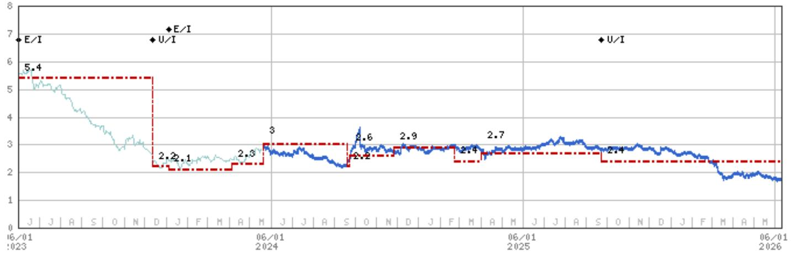

line chart

| Date       | Value |
| ---------- | ----- |
| 06/01 2023 | 5.4   |
| Dec 2023   | 2.1   |
| Mar 2024   | 2.3   |
| Jun 2024   | 3.0   |
| Sep 2024   | 2.6   |
| Dec 2024   | 2.9   |
| Mar 2025   | 2.7   |
| Jun 2025   | 2.7   |
| Sep 2025   | 2.4   |
| Dec 2025   | 2.4   |
| Mar 2026   | 1.8   |

Stock Rating History: 6/1/21 : E/I; 12/13/23 : U/I; 1/4/24 : E/I; 9/23/25 : U/I  
Price Target History: 5/6/21 : 6.1; 8/6/21 : 4.8; 1/5/22 : 5; 5/20/22 : 4.4; 7/28/22 : 4.3; 1/12/23 : 5.4; 12/13/23 : 2.2;  
1/4/24 : 2.1; 4/5/24 : 2.3; 5/20/24 : 3; 9/19/24 : 2.2; 9/23/24 : 2.6; 11/25/24 : 2.9; 2/21/25 : 2.4; 4/1/25 : 2.7; 9/23/25 : 2.4  
Source: MS Date Format : MM/DD/YY Price Target = No Price Target Assigned (NA)  
Stock Price (Not Covered by Current Analyst) — Stock Price (Covered by Current Analyst)  
Stock and Industry Ratings (abbreviations below) appear as ♦ Stock Rating/Industry View  
Stock Ratings: Overweight (O) Equal-weight (E) Underweight (U) Not-Rated (NR) No Rating Available (NA)  
Industry View: Attractive (A) In-line (I) Cautious (C) No Rating (NR)  
Effective January 13, 2014, the stocks covered by MS Asia Pacific will be rated relative to the analyst's industry (or industry team's) coverage.  
Effective January 13, 2014, the industry view benchmarks for MS Asia Pacific are as follows: relevant MSCI country index or MSCI sub-regional index or MSCI AC Asia Pacific ex Japan Index.

Guangzhou Baiyun Int'l Airport (600004.SS) - As of 06/10/26 GMT in CNY Industry : Hong Kong/China Transportation & Infrastructure  
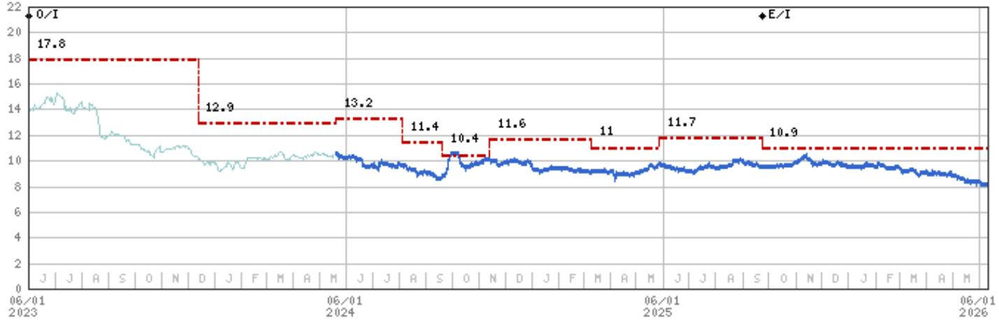

line chart

| Date       | Value |
| ---------- | ----- |
| 06/01 2023 | 17.8  |
| 06/01 2024 | 12.9  |
| 06/01 2025 | 13.2  |
| 06/01 2026 | 11.4  |
| 06/01 2026 | 10.4  |
| 06/01 2026 | 11.6  |
| 06/01 2026 | 11    |
| 06/01 2026 | 11.7  |
| 06/01 2026 | 10.9  |

Stock Rating History: 6/1/21 : 0/I; 8/6/21 : E/I; 1/12/23 : 0/I; 9/23/25 : E/I  
Price Target History: 5/6/21 : 16.3; 8/6/21 : 10; 1/5/22 : 12; 5/20/22 : 11.8; 7/28/22 : 12.3; 1/12/23 : 17; 4/21/23 : 17.8; 12/13/23 : 12.9; 5/20/24 : 13.2; 8/5/24 : 11.4; 9/19/24 : 10.4; 11/13/24 : 11.6; 3/10/25 : 11; 5/28/25 : 11.7; 9/23/25 : 10.9  
Source: MS Date Format : MM/DD/YY Price Target = No Price Target Assigned (NA)  
Stock Price (Not Covered by Current Analyst) — Stock Price (Covered by Current Analyst)  
Stock and Industry Ratings (abbreviations below) appear as ♦ Stock Rating/Industry View  
Stock Ratings: Overweight (O) Equal-weight (E) Underweight (U) Not-Rated (NR) No Rating Available (NA)  
Industry View: Attractive (A) In-line (I) Cautious (C) No Rating (NR)  
Effective January 13, 2014, the stocks covered by MS Asia Pacific will be rated relative to the analyst's industry (or industry team's) coverage.  
Effective January 13, 2014, the industry view benchmarks for MS Asia Pacific are as follows: relevant MSCI country index or MSCI sub-regional index or MSCI AC Asia Pacific ex Japan Index.

Shanghai International Airport (600009.SS) - As of 06/10/26 GMT in CNY Industry : Hong Kong/China Transportation & Infrastructure  
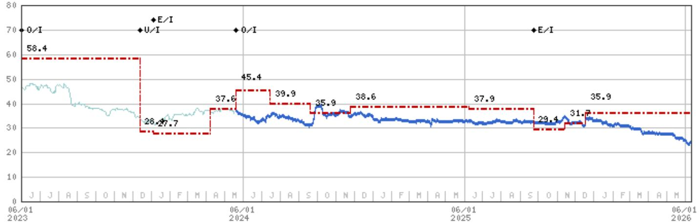

line chart

| Date       | Value |
| ---------- | ----- |
| 06/01 2023 | 58.4  |
| 06/01 2024 | 28.7  |
| 06/01 2024 | 37.6  |
| 06/01 2024 | 45.4  |
| 06/01 2024 | 39.9  |
| 06/01 2024 | 35.9  |
| 06/01 2024 | 38.6  |
| 06/01 2024 | 37.9  |
| 06/01 2024 | 29.4  |
| 06/01 2024 | 31.7  |
| 06/01 2024 | 35.9  |
| 06/01 2026 | -     |

Stock Rating History: 6/1/21 : U/I; 1/16/23 : 0/I; 12/13/23 : U/I; 1/4/24 : E/I; 5/20/24 : 0/I; 9/23/25 : E/I  
Price Target History: 5/6/21 : 45.2; 8/6/21 : 36.1; 1/5/22 : 39.5; 5/20/22 : 39.1; 7/28/22 : 39; 1/12/23 : 43.8; 1/16/23 : 70.2; 3/27/23 : 66.9; 5/25/23 : 58.4; 12/13/23 : 28.4; 1/4/24 : 27.7; 4/8/24 : 37.6; 5/20/24 : 45.4; 7/15/24 : 39.9; 9/19/24 : 35.9; 11/25/24 : 38.6; 6/8/25 : 37.9; 9/23/25 : 29.4; 11/14/25 : 31.7; 12/18/25 : 35.9  
Source: MS Date Format : MM/DD/YY Price Target No Price Target Assigned (NA)  
Stock Price (Not Covered by Current Analyst) — Stock Price (Covered by Current Analyst)  
Stock and Industry Ratings (abbreviations below) appear as ♦ Stock Rating/Industry View  
Stock Ratings: Overweight (O) Equal-weight (E) Underweight (U) Not-Rated (NR) No Rating Available (NA)  
Industry View: Attractive (A) In-line (I) Cautious (C) No Rating (NR)  
Effective January 13, 2014, the stocks covered by MS Asia Pacific will be rated relative to the analyst's industry (or industry team's) coverage.  
Effective January 13, 2014, the industry view benchmarks for MS Asia Pacific are as follows: relevant MSCI country index or MSCI sub-regional index or MSCI AC Asia Pacific ex Japan Index.

## Important Disclosures for MS Smith Barney LLC Customers

Important disclosures regarding any material conflict of interest that can reasonably be expected to have influenced MS Smith Barney LLC's choice of a third-party research provider or the subject company of a third-party research report, are available on the MS Wealth Management disclosure website at www.morganstanley.com/online/researchdisclosures. For MS specific disclosures, you may refer to https://www.morganstanley.com/eqr/disclosures/webapp/generalresearch.

Each MS report is reviewed and approved on behalf of MS Smith Barney LLC. This review and approval is conducted by the same person who reviews the research report on behalf of MS. This could create a conflict of interest.

## Other Important Disclosures

MS policy is to update research reports as and when the Research Analyst and Research Management deem appropriate, based on developments with the issuer, the sector, or the market that may have a material impact on the research views or opinions stated therein. In addition, certain Research publications are intended to be updated on a regular periodic basis (weekly/monthly/quarterly/annual) and will ordinarily be updated with that frequency, unless the Research Analyst and Research Management determine that a different publication schedule is appropriate based on current conditions.

MS is not acting as a municipal advisor and the opinions or views contained herein are not intended to be, and do not constitute, advice within the meaning of Section 975 of the Dodd-Frank Wall Street Reform and Consumer Protection Act.

MS produces an equity research product called a "Tactical Idea." Views contained in a "Tactical Idea" on a particular stock may be contrary to the recommendations or views expressed in research on the same stock. This may be the result of differing time horizons, methodologies, market events, or other factors. For all research available on a particular stock, please contact your sales representative or go to Matrix at http://www.morganstanley.com/matrix.

MS is provided to our clients through our proprietary research portal on Matrix and also distributed electronically by MS to clients. Certain, but not all, MS products are also made available to clients through third-party vendors or redistributed to clients through alternate electronic means as a convenience. For access to all available MS, please contact your sales representative or go to Matrix at http://www.morganstanley.com/matrix.

Any access and/or use of MS is subject to MS's Terms of Use (http://www.morganstanley.com/terms.html). By accessing and/or using MS, you are indicating that you have read and agree to be bound by our Terms of Use (http://www.morganstanley.com/terms.html). In addition you consent to MS processing your personal data and using cookies in accordance with our Privacy Policy and our Global Cookies Policy (http://www.morganstanley.com/privacy\_pledge.html), including for the purposes of setting your preferences and to collect readership data so that we can deliver better and more personalized service and products to you. To find out more information about how MS processes personal data, how we use cookies and how to reject cookies see our Privacy Policy and our Global Cookies Policy (http://www.morganstanley.com/privacy\_pledge.html). Please use the provided link to review the Terms and Conditions and Most Important Terms and Conditions for MS India Company Private Limited (https://www.morganstanley.com/assets/pdfs/about-us-global-offices/india/Terms\_and\_conditions.pdf) and the following link to review the audit report (https://ny.matrix.ms.com/eqr/research/webapp/researchdocs/MSICPL\_Morgan\_Stanley\_Research\_Audit\_Report.pdf).

If you do not agree to our Terms of Use and/or if you do not wish to provide your consent to MS processing your personal data or using cookies please do not access our research. MS does not provide individually tailored investment advice. MS has been prepared without regard to the circumstances and objectives of those who receive it. MS recommends that investors independently evaluate particular investments and strategies, and encourages investors to seek the advice of a financial adviser. The appropriateness of an investment or strategy will depend on an investor's circumstances and objectives. The securities, instruments, or strategies discussed in MS may not be suitable for all investors, and certain investors may not be eligible to purchase or participate in some or all of them. MS is not an offer to buy or sell or the solicitation of an offer to buy or sell any security/instrument or to participate in any particular trading strategy. The value of and income from your investments may vary because of changes in interest rates, foreign exchange rates, default rates, prepayment rates, securities/instruments prices, market indexes, operational or financial conditions of companies or other factors. There may be time limitations on the exercise of options or other rights in securities/instruments transactions. Past performance is not necessarily a guide to future performance. Estimates of future performance are based on assumptions that may not be realized. If provided, and unless otherwise stated, the closing price on the cover page is that of the primary exchange for the subject company's securities/instruments.

The fixed income research analysts, strategists or economists principally responsible for the preparation of MS have received compensation based upon various factors, including quality, accuracy and value of research, firm profitability or revenues (which include fixed income trading and capital markets profitability or revenues), client feedback and competitive factors. Fixed Income Research analysts', strategists' or economists' compensation is not linked to investment banking or capital markets transactions performed by MS or the profitability or revenues of particular trading desks.

The "Important Regulatory Disclosures on Subject Companies" section in MS lists all companies mentioned where MS owns 1% or more of a class of common equity securities of the companies. For all other companies mentioned in MS, MS may have an investment of less than 1% in securities/instruments or derivatives of securities/instruments of companies and may trade them in ways different from those discussed in MS. Employees of MS not involved in the preparation of MS may have investments in securities/instruments or derivatives of securities/instruments of companies mentioned and may trade them in ways different from those discussed in MS. Derivatives may be issued by MS or associated persons.

With the exception of information regarding MS, MS is based on public information. MS makes every effort to use reliable, comprehensive information, but we make no representation that it is accurate or complete. We have no obligation to tell you when opinions or information in MS change apart from when we intend to discontinue equity research coverage of a subject company. Facts and views presented in MS have not been reviewed by, and may not reflect information known to, professionals in other MS business areas, including investment banking personnel.

MS personnel may participate in company events such as site visits and are generally prohibited from accepting payment by the company of associated expenses unless pre-approved by authorized members of Research management.

MS may make investment decisions that are inconsistent with the recommendations or views in this report.

To our readers based in Taiwan or trading in Taiwan securities/instruments: Information on securities/instruments that trade in Taiwan is distributed by MS Taiwan Limited ("MSTL"). Such information is for your reference only. The reader should independently evaluate the investment risks and is solely responsible for their investment decisions. MS may not be distributed to the public media or quoted or used by the public media without the express written consent of MS. Any non-customer reader within the scope of Article 7-1 of the Taiwan Stock Exchange Recommendation Regulations accessing and/or receiving MS is not permitted to provide MS to any third party (including but not limited to related parties, affiliated companies and any other third parties) or engage in any activities regarding MS which may create or give the appearance of creating a conflict of interest. Information on securities/instruments that do not trade in Taiwan is for informational purposes only and is not to be construed as a recommendation or a solicitation to trade in such securities/instruments. MSTL may not execute transactions for clients in these securities/instruments.

Certain information in MS was sourced by employees of the Shanghai Representative Office of MS Asia Limited for the use of MS Asia Limited. MS is not incorporated under PRC law and the research in relation to this report is conducted outside the PRC. MS does not constitute an offer to sell or the solicitation of an offer to buy any securities in the PRC. PRC investors shall have the relevant qualifications to invest in such securities and shall be responsible for obtaining all relevant approvals, licenses, verifications and/or registrations from the relevant governmental authorities themselves. Neither this report nor any part of it is intended as, or shall constitute, provision of any consultancy or advisory service of securities investment as defined under PRC law. Such information is provided for your reference only.

MS is disseminated in Brazil by MS C.T.V.M. S.A. located at Av. Brigadeiro Faria Lima, 3600, 6th floor, São Paulo - SP, Brazil; and is regulated by the Comissão de Valores Mobiliários; in Mexico by MS México, Casa de Bolsa, S.A. de C.V which is regulated by Comision Nacional Bancaria y de Valores. Paseo de los Tamarindos 90, Torre 1, Col. Bosques de las Lomas Floor 29, 05120 Mexico City; in Japan by MS MUFG Securities Co., Ltd. and, for Commodities related research reports only, MS Capital Group Japan Co., Ltd; in Hong Kong by MS Asia Limited (which accepts responsibility for its contents) and by MS Bank Asia Limited; in Singapore by MS Asia (Singapore) Pte. (Registration number 199206298Z) and/or MS Asia (Singapore) Securities Pte Ltd (Registration number 200008434H), regulated by the Monetary Authority of Singapore (which accepts legal responsibility for its contents and should be contacted with respect to any matters arising from, or in connection with, MS) and by MS Bank Asia Limited, Singapore Branch (Registration number T14FC0118); in Australia to "wholesale clients" within the meaning of the Australian Corporations Act by MS Australia Limited A.B.N. 67 003 734 576, holder of Australian financial services license No. 233742, which accepts responsibility for its contents; in Australia to "wholesale clients" and "retail clients" within the meaning of the Australian Corporations Act by MS Wealth Management Australia Pty Ltd (A.B.N. 19 009 145 555, holder of Australian financial services license No. 240813, which accepts responsibility for its contents; in Korea by MS & Co International plc, Seoul Branch; in India by MS India Company Private Limited having Corporate Identification No (CIN) U22990MH1998PTC115305, regulated by the Securities and Exchange Board of India ("SEBI") and holder of licenses as a Research Analyst (SEBI Registration No. INH000001105); Stock Broker (SEBI Stock Broker Registration No. INZ000244438), Merchant Banker (SEBI Registration No. INM000011203), and depository participant with National Securities Depository Limited (SEBI Registration No. IN-DP-NSDL-567-2021) having registered office at Altimus, Level 39 & 40, Pandurang Budhkar Marg, Worli, Mumbai 400018, India; Telephone no. +91-22-61181000; Compliance Officer Details: Mr. Tejarshi Hardas, Tel. No.: +91-22-61181000 or Email: tejarshi.hardas@morganstanley.com; Grievance officer details: Mr. Tejarshi Hardas, Tel. No.: +91-22-61181000 or Email: msic-compliance@morganstanley.com. MS India Company Private Limited (MSICPL) may use AI tools in providing research services. All recommendations contained herein are made by the duly qualified research analysts; in Canada by MS Canada Limited; in Germany and the European Economic Area where required by MS Europe S.E., authorised and regulated by Bundesanstalt fuer Finanzdienstleistungsaufsicht (BaFin) under the reference number 149169; in the US by MS & Co. LLC, which accepts responsibility for its contents. MS & Co. International plc, authorized by the Prudential Regulation Authority and regulated by the Financial Conduct Authority and the Prudential Regulation Authority, disseminates in the UK research that it has prepared, and research which has been prepared by any of its affiliates, only to persons who (i) are investment professionals falling within Article 19(5) of the Financial Services and Markets Act 2000 (Financial Promotion) Order 2005 (as amended, the "Order"); (ii) are persons who are high net worth entities falling within Article 49(2)(a) to (d) of the Order; or (iii) are persons to whom an invitation or inducement to engage in investment activity (within the meaning of section 21 of the Financial Services and Markets Act 2000, as amended) may otherwise lawfully be communicated or caused to be communicated. RMB MS Proprietary Limited is a member of the JSE Limited and A2X (Pty) Ltd. RMB MS Proprietary Limited is a joint venture owned equally by MS International Holdings Inc. and RMB Investment Advisory (Proprietary) Limited, which is wholly owned by FirstRand Limited. The information in MS is being disseminated by MS Saudi Arabia, regulated by the Capital Market Authority in the Kingdom of Saudi Arabia, and is directed at Sophisticated investors only.

MS Hong Kong Securities Limited is the liquidity provider/market maker for securities of Cathay Pacific Airways, China Southern Airlines, COSCO SHIPPING Energy Transportation, COSCO Shipping Holdings Ltd, J&T Global Express Ltd, JD Logistics, Inc., S.F. Holding Co Ltd, ZTO Express listed on the Stock Exchange of Hong Kong Limited. An updated list can be found on HKEx website: http://www.hkex.com.hk.

The information in MS is being communicated by MS & Co. International plc (DIFC Branch), regulated by the Dubai Financial Services Authority (the DFSA) or by MS & Co. International plc (ADGM Branch), regulated by the Financial Services Regulatory Authority Abu Dhabi (the FSRA), and is directed at Professional Clients only, as defined by the DFSA or the FSRA, respectively. The financial products or financial services to which this research relates will only be made available to a customer who we are satisfied meets the regulatory criteria of a Professional Client. A distribution of the different MS Research ratings or recommendations, in percentage terms for Investments in each sector covered, is available upon request from your sales representative.

The information in MS is being communicated by MS & Co. International plc (QFC Branch), regulated by the Qatar Financial Centre Regulatory Authority (the QFCRA), and is directed at business customers and market counterparties only and is not intended for Retail Customers as defined by the QFCRA.

As required by the Capital Markets Board of Turkey, investment information, comments and recommendations stated here, are not within the scope of investment advisory activity. Investment advisory service is provided exclusively to persons based on their risk and income preferences by the authorized firms. Comments and recommendations stated here are general in nature. These opinions may not fit to your financial status, risk and return preferences. For this reason, to make an investment decision by relying solely to this information stated here may not bring about outcomes that fit your expectations.

The trademarks and service marks contained in MS are the property of their respective owners. Third-party data providers make no warranties or representations relating to the accuracy, completeness, or timeliness of the data they provide and shall not have liability for any damages relating to such data. The Global Industry Classification Standard (GICS) was developed by and is the exclusive property of MSCI and S&P.

MS, or any portion thereof may not be reprinted, sold or redistributed without the written consent of MS.

Indicators and trackers referenced in MS may not be used as, or treated as, a benchmark under Regulation EU 2016/1011, or any other similar framework.

The issuers and/or fixed income products recommended or discussed in certain fixed income research reports may not be continuously followed. Accordingly, investors should regard those fixed income research reports as providing stand-alone analysis and should not expect continuing analysis or additional reports relating to such issuers and/or individual fixed income products. MS may hold, from time to time, material financial and commercial interests regarding the company subject to the Research report.

Registration granted by SEBI and certification from the National Institute of Securities Markets (NISM) in no way guarantee performance of the intermediary or provide any assurance of returns to investors. Investment in securities market are subject to market risks. Read all the related documents carefully before investing.

INDUSTRY COVERAGE: Hong Kong/China Transportation & Infrastructure

<table><tr><td>COMPANY (TICKER)</td><td>RATING (AS OF)</td><td>PRICE* (06/10/2026)</td></tr><tr><td colspan="3">Qianlei Fan, CFA</td></tr><tr><td>Air China Limited (601111.SS)</td><td>O (02/09/2026)</td><td>Rmb6.16</td></tr><tr><td>Air China Limited (0753.HK)</td><td>O (01/13/2025)</td><td>HK$4.31</td></tr><tr><td>Beijing-Shanghai High-Speed Railway (601816.SS)</td><td>O (07/03/2020)</td><td>Rmb5.02</td></tr><tr><td>BOC Aviation (2588.HK)</td><td>O (03/21/2022)</td><td>HK$73.45</td></tr><tr><td>Cathay Pacific Airways (0293.HK)</td><td>O (06/10/2026)</td><td>HK$11.93</td></tr><tr><td>China Eastern Airlines (600115.SS)</td><td>O (02/09/2026)</td><td>Rmb3.83</td></tr><tr><td>China Eastern Airlines (0670.HK)</td><td>O (01/13/2025)</td><td>HK$3.23</td></tr><tr><td>China Merchants Energy Shipping Co. Ltd. (601872.SS)</td><td>O (03/10/2020)</td><td>Rmb14.62</td></tr><tr><td>China Southern Airlines (600029.SS)</td><td>O (02/09/2026)</td><td>Rmb5.11</td></tr><tr><td>China Southern Airlines (1055.HK)</td><td>O (01/13/2025)</td><td>HK$3.50</td></tr><tr><td>COSCO SHIPPING Energy Transportation (1138.HK)</td><td>O (01/12/2023)</td><td>HK$13.03</td></tr><tr><td>COSCO SHIPPING Energy Transportation (600026.SS)</td><td>O (11/25/2025)</td><td>Rmb16.58</td></tr><tr><td>COSCO Shipping Holdings Ltd (601919.SS)</td><td>U (07/15/2024)</td><td>Rmb14.41</td></tr><tr><td>COSCO Shipping Holdings Ltd (1919.HK)</td><td>U (07/15/2024)</td><td>HK$13.93</td></tr><tr><td>J&amp;T Global Express Ltd (1519.HK)</td><td>E (08/21/2024)</td><td>HK$8.79</td></tr><tr><td>Orient Overseas (International) Ltd (0316.HK)</td><td>U (07/15/2024)</td><td>HK$129.90</td></tr><tr><td>Pacific Basin Shipping (2343.HK)</td><td>E (07/04/2025)</td><td>HK$2.86</td></tr><tr><td>S.F. Holding Co Ltd (002352.SZ)</td><td>E (09/01/2025)</td><td>Rmb34.83</td></tr><tr><td>SITC International Holdings Company (1308.HK)</td><td>E (01/12/2023)</td><td>HK$33.48</td></tr><tr><td>Spring Airlines (601021.SS)</td><td>O (08/31/2015)</td><td>Rmb45.15</td></tr><tr><td>TravelSky Technology (0696.HK)</td><td>U (01/13/2025)</td><td>HK$8.97</td></tr><tr><td>ZTO Express (ZTO.N)</td><td>O (11/21/2016)</td><td>US$21.94</td></tr><tr><td colspan="3">Tenny Song</td></tr><tr><td>Beijing Capital Int'l Airport (0694.HK)</td><td>U (09/23/2025)</td><td>HK$1.73</td></tr><tr><td>Guangzhou Baiyun Int'l Airport (600004.SS)</td><td>U (06/10/2026)</td><td>Rmb8.11</td></tr><tr><td>JD Logistics, Inc. (2618.HK)</td><td>O (03/09/2026)</td><td>HK$12.89</td></tr><tr><td>Shanghai International Airport (600009.SS)</td><td>E (09/23/2025)</td><td>Rmb23.82</td></tr><tr><td>STO Express Co Ltd (002468.SZ)</td><td>E (10/22/2024)</td><td>Rmb14.01</td></tr><tr><td>YTO Express Group Co Ltd (600233.SS)</td><td>O (09/11/2025)</td><td>Rmb17.06</td></tr><tr><td>YUNDA Holding Co Ltd (002120.SZ)</td><td>U (07/29/2020)</td><td>Rmb6.57</td></tr></table>

Stock Ratings are subject to change. Please see latest research for each company.  
\* Historical prices are not split adjusted.

© 2026 MS