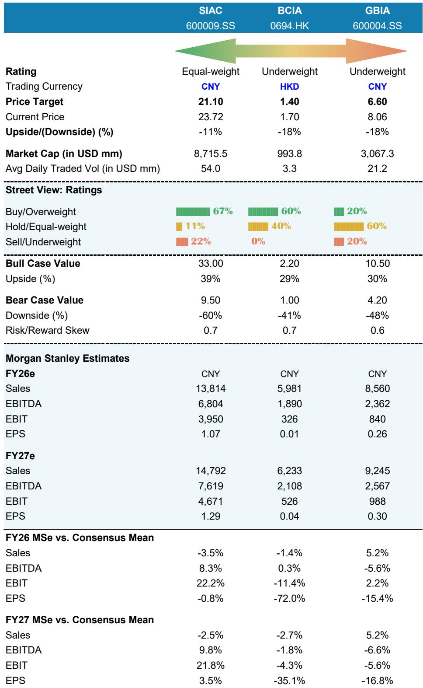
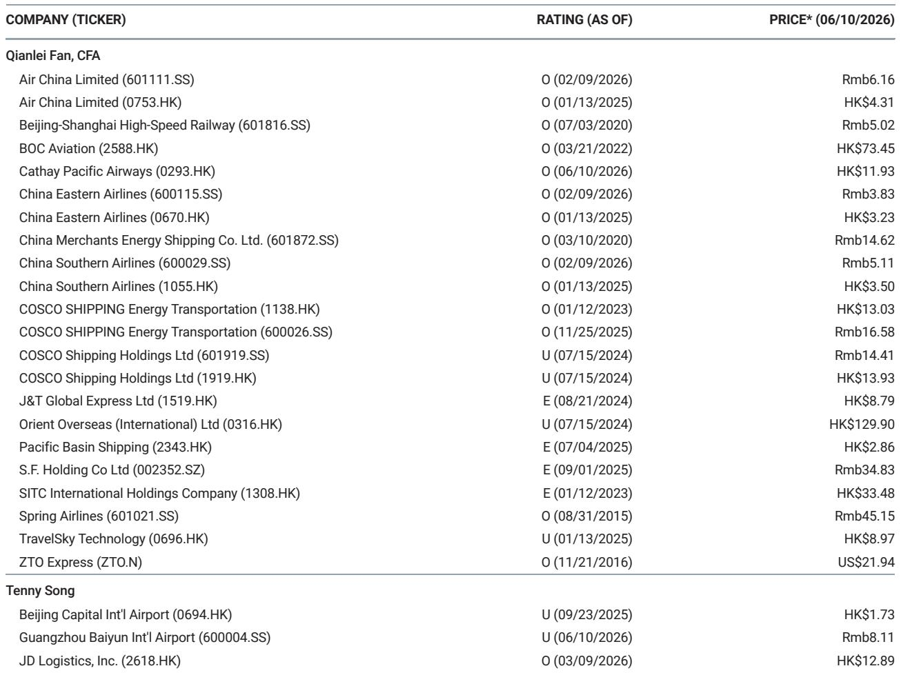
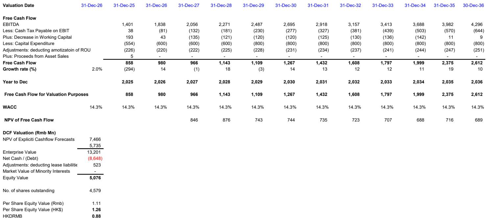

# 摩根斯坦利：中国机场股的核心问题不是客流，而是盈利结构尚未完成重置

市场对机场股的关注点长期停留在“客流恢复”这一个维度上。但摩根斯坦利在2026年6月发布的最新研报中，提出了一个更令人不安的判断：即便客流数据看起来尚可，中国三大机场的盈利修复路径已经因为三个结构性因素而显著偏离了市场预期。

这份研报不是简单的行业更新，它实际上是在重新定价中国机场资产的估值逻辑。摩根斯坦利同时下调了三大机场的目标价，降幅均达到40%左右，并将广州白云机场的评级从“持有”直接下调至“减持”。背后的核心逻辑是：市场正在低估能源冲击对客流的持续压制、免税业务转型期的收入真空，以及新产能投产后成本分担机制的不确定性。

这不是一个“等待反转”的故事。这是一个盈利结构需要被重新审视的时刻。

## 1. 能源冲击正在重塑出行结构，航空客流的增长拐点尚未到来

摩根斯坦利的数据显示，中国航空客运量自2026年4月以来明显承压，直接原因是全球能源价格飙升推高了机票价格。四月全国航空客运量同比仅增长0.4%，其中国内航线甚至出现了0.2%的同比下滑。这个数字与一季度6.5%的增速相比，是一个急剧的减速。

更关键的信号出现在出行方式的替代上。铁路客运量在同期加速增长，四月同比增速达到10.5%，而一季度仅为5.5%。摩根斯坦利明确指出，这是旅客从航空向铁路转移的明确证据。五一假期的数据进一步印证了这一趋势：航空客运量同比下降5.7%，而铁路客运量同比增长4.6%。

对于机场股来说，这意味着客流量增长的基本面正在被侵蚀。上海机场、白云机场和首都机场的国内客运增速从一季度的6%至10%，全面放缓至四月的3%至4%。国际航线同样未能幸免，增速从一季度的7%至24%回落至四月的4%至18%。其中上海机场表现最弱，研报认为与其日本航线占比较高有关。

这个趋势的含义很清晰：如果能源价格维持高位，航空出行相对于高铁的竞争力将持续被削弱。而机场的收入结构中，无论是航空性收入还是非航收入，最终都依赖于客流量的增长。当客流量增速从“恢复性高增长”切换为“结构性低增长”时，市场对机场股的估值中枢需要相应下调。

## 2. 免税合同的“利好”在短期内恰恰是收入拖累

2025年12月签署的新免税合同，从条款上看确实对机场更有利。打破单一运营商垄断、引入竞争、调整租金结构为固定租金加销售提成，以及上海机场通过合资公司持有运营商49%股权——这些变化在长期应该能提升机场在免税价值链中的议价权。

但摩根斯坦利揭示了一个被市场忽略的短期矛盾：合同切换本身会带来收入真空。

上海机场的新合同包含三个月的免租期，这直接导致一季度免税租金收入降至1.76亿元，同比暴跌49%。首都机场也出现了人均免税消费额的下滑。新运营商需要时间建立产品品类、优化供应链，而旧运营商的退出又留下了短期空白。

研报判断，人均免税消费额已经基本见底，但“有意义的复苏需要时间”。这个“时间”到底有多长，报告没有给出明确答案。这里存在一个关键的不确定性：即便消费额触底，反弹的斜率仍取决于新运营商的运营能力和宏观经济环境。如果消费复苏慢于预期，机场免税收入恢复到历史水平可能需要数年，而不是几个季度。

对于投资者而言，这意味着机场股的非航收入在2026年全年都可能低于市场预期，而市场此前对免税业务的乐观情绪需要被重新校准。

## 3. 白云机场面临的是“产能扩张遇上宏观疲软”的典型困境

白云机场的情况最为复杂，也最能说明为什么摩根斯坦利将其评级下调至“减持”。

2025年10月，白云机场三期和第五跑道正式投入运营，前期资本开支超过500亿元，由母公司承担。问题在于，白云机场与母公司之间的成本分摊框架至今尚未最终确定。目前的过渡安排是约9亿元的资产使用费，但最终的方案可能包含基础租金、资产收购和收入分成等多层结构，对利润的影响可能大于当前安排。

与此同时，收入端面临双重压力：能源成本高企抑制出行需求，加上T1航站楼从2026年5月开始关闭改造，抵消了T3新增产能带来的增量收入。摩根斯坦利预计白云机场2026至2028年的盈利分别比市场共识低1%、8%和20%。

这是一个典型的“产能投放周期与宏观下行周期重叠”的困境。新产能本该带来增量收入，但在需求疲软的环境下，新增产能反而变成了固定成本的负担。而成本分担机制的不确定性，又让投资者无法准确评估最终的利润影响。

## 4. 报告没有完全回答的关键问题：机场的定价权到底还剩多少

摩根斯坦利的分析框架聚焦于客流量、免税收入和成本结构，但有一个更深层次的问题并未完全展开：在高铁网络持续扩张、能源成本结构性上升、以及消费习惯向线上转移的背景下，中国机场的长期定价权是否正在被侵蚀？

免税合同的改善是机场重新获得议价权的一个信号，但这份议价权能否转化为可持续的利润增长，取决于两个尚未验证的假设：一是人均免税消费额能否真正回升到疫情前水平，二是机场能否通过引入新品类和新运营商来创造增量消费，而不仅仅是恢复存量。

此外，首都机场被剔除出港股通后估值持续承压，这一结构性因素在研报中提及但未深入分析。对于A股投资者来说，这提醒我们：机场股的流动性溢价正在发生变化，估值体系可能需要重新锚定。

## 5. 投资者需要重新建立的观察框架

基于这份研报的逻辑，评估中国机场股时，传统的“客流恢复进度”指标已经不够。需要建立一个新的观察框架，聚焦三个维度：

第一，能源价格与出行替代的弹性关系。当航空票价相对于高铁票价的价差扩大到什么程度时，旅客会显著转向铁路？这个临界点决定了机场客流增速的下限。

第二，免税收入的结构性拐点。不是看总收入的同比变化，而是看新运营商的产品上架进度、人均消费额的环比趋势，以及固定租金加提成模式下的实际收入弹性。

第三，产能投放与需求周期的匹配度。对于白云机场这样的标的，需要跟踪成本分担协议的最终落地，以及T1关闭对整体客流的影响。对于上海机场，则需要关注T3扩建计划的时间表和资本开支节奏。

这三个维度叠加起来，才能判断一家机场公司是处于“盈利修复的上行周期”，还是处于“资本开支和成本压力下的盈利磨底期”。

摩根斯坦利在这份研报中给出了明确的排序：上海机场相对最优（维持持有评级），白云机场和首都机场均面临更大的盈利不确定性。但即便是对上海机场，其目标价也下调了40%，说明整个板块的估值逻辑正在被系统性重估。

这些判断背后还有更多细节值得深挖：新免税合同的具体条款如何影响利润弹性？白云机场与母公司的成本谈判可能走向哪些情景？首都机场被剔除港股通后的估值折价有没有参照系？这些内容在研报的原始图表和详细财务模型中有更完整的呈现。

欢迎来星球微信群里继续讨论这些未解问题，我们会围绕摩根斯坦利这份报告的核心假设，逐一拆解其对资产定价的深层含义。

Personal reading notes and learning share only. Not investment advice.

