## EBAY & ETSY | North America

# EBAY and ETSY in the Agentic Era: Underappreciated Advantages?

With agentic commerce set to be the next paradigm shift across eComm, we dive into how EBAY & ETSY are positioned and size agentic bull & bear cases. Despite the market's skepticism, we come out more optimistic as we see unique, underappreciated advantages for both companies.

## Key Takeaways

- Entering the era of agentic commerce, we assess EBAY & ETSY's positioning and size scenarios from here  
EBAY (OW, \$121 PT): An underappreciated agentic winner given a highly differentiated inventory base; our favorite name in SMID eCommerce  
- ETSY (EW \$64 PT): Although there are clear long-term risks, we see a more compelling medium-term opportunity that could drive GMS growth and lead to a re-rating  
We take a deep dive into how EBAY & ETSY perform on our "5 I's Framework" for retailers in agentic commerce...  
... and also model out new agentic bull and bear cases for EBAY/ETSY with potential for up to 30%/40% upside to 2030 EBITDA

We would greatly appreciate your support in the Internet SmidCap and Internet Large Cap categories in this year's All-America Extel survey. Thank you so much!

To request a ballot, please go to https://www.extelinsights.com/voting.

text_image

MS | RESEARCH
2026 EXTEL
ALL-AMERICA
RESEARCH POLL
VIEW OUR
ANALYSTS >
May 26 - June 12 2026
We appreciate your support
VOTE HERE
★★★★★

## We Think The Market is Underestimating EBAY and ETSY Entering the Agentic

Era: We believe agentic commerce is set to be a paradigm shift for eCommerce: moving from keyword-based search boxes to interactive, personalized shopping assistants. It's still early in the evolution, but we think assessing positioning is critical as agentic shopping likely drives eCommerce penetration while accelerating market share shifts. Within SMID eCommerce, EBAY and ETSY have been the most debated with investors largely skeptical of how both are positioned. We analyzed each name in depth on our "5 l's" framework for retailers in agentic commerce and

MS & CO. LLC

## Nathan Feather

Equity Analyst

Nathan.Feather@morganstanley.com +1 212 761-9812

## Brian Nowak, CFA

Equity Analyst

Brian.Nowak@morganstanley.com +1 212 761-3365

text_image

2026 EXTEL
ALL-AMERICA
RESEARCH POLL
VIEW OUR
ANALYSTS >
May 26 – June 12, 2026

## INTERNET

North America

Industry View

Attractive

MS does and seeks to do business with companies covered in MS. As a result, investors should be aware that the firm may have a conflict of interest that could affect the objectivity of MS. Investors should consider MS as only a single factor in making their investment decision.

For analyst certification and other important disclosures, refer to the Disclosure Section, located at the end of this report.

quantified potential agentic bull & bear cases for EBAY & ETSY. We feel the market is underappreciating EBAY's structural advantages with a unique inventory moat. Long-term risks at ETSY are clear, but have masked an intriguing medium-term opportunity.

For our initial deep dive on agentic commerce, see: Internet: Agentic Shoppers Are Coming... Who Could Win or Lose?

EBAY (OW, \$121 PT): An Underappreciated Agentic Winner...: EBAY's long-held perception as a structural share loser (recent performance notwithstanding) has driven skepticism on its ability to outperform as agentic commerce gains steam. We disagree & see it as particularly well positioned with multiple structural advantages. First, EBAY's massive \~2.5B listings base is highly unique with \~90% used or not in-season. Agentic should better surface these long-tail items from EBAY's inventory, driving GMV upside. Second, the large base of used & C2C inventory give it a pricing advantage over many other retailers which should lead to higher visibility. Third, agentic commerce should remove fiction from the selling experience - fueling listing growth & quality. Taken together, we see EBAY as one of the best positioned eCommerce names for agentic commerce which could enable durable \~HSD% GMV growth and support a multiple re-rating. In our new EBAY agentic bull case we outline a path for 2030 GMV/EBITDA to come in 26%/30% above our base case.

... & Strong Fundamental Performance Makes It Our Favorite Name in SMID eCommerce: EBAY is set to deliver \~12% y/y FXN GMV growth in 1H26, well above what was thought possible just a year ago. Despite that, the market believes this recent growth is temporary and will fade shortly. Conversely, we see the improvement as largely structural with much of the outperformance attributable to idiosyncratic gains. EBAY has materially enhanced the experience in key categories like trading cards while also launching cross-category improvements such as AI selling tools. The company also has embedded call options in agentic commerce & live selling - neither of which are meaningfully included in estimates. All in, we think MSD%-HSD% GMV growth is achievable which will deliver operating leverage in time, leading EPS to compound solidly DD%. Although valuation has re-rated to 16x adj. '27 EPS, we see potential for multiple expansion if perceived as an agentic winner as many mature marketplaces have traded durably >20x P/E. Taken together, OW EBAY is our favorite name in SMID eComm with a strong fundamental story and emerging agentic upside.

ETSY (EW, \$64 PT): Long-term Risks Are Clear...: There are clear concerns about ETSY's long-term positioning in an agentic era. The premise is simple: ETSY's value is aggregating demand for special items. If customers start their shopping journeys on horizontal agents' (like Gemini), those could displace ETSY as the aggregator. ETSY could be at risk of this as its inventory is often not unique to Etsy.com - our analysis shows >75% of top ETSY sellers also sell on other channels. In addition, ETSY's \~25% take rate (the highest among public pure 3P marketplaces) creates an incentive for existing sellers to try and route demand to lower-cost channels. In a worst case scenario, this could look similar to in-person travel agents: previously able to capture a premium on largely commoditized supply, but share dissipated quickly once a better user experience with more competitive pricing arrived (online travel). This bear thesis is still speculative & requires a number of

assumptions, but it is hard to disprove which makes it likely to durably weigh on ETSY's multiple. Given these dynamics, in our ETSY agentic bear case we size how 2030 GMS/EBITDA could fall -11%/-41% below our base case.

... but the Market Is Overlooking a Compelling Medium-term Opportunity: With that being said, we see a clear path for ETSY to be an agentic winner within the next few years. The marketplace could uniquely benefit from agentic search as many buyers come with a mission in mind ("gift for my mom") rather than a specific item. The conversational nature of agentic allows buyers to refine what they are looking for far better than traditional search which should drive up conversion rate. ETSY has a window of opportunity to be the first with a dedicated agentic experience for special items as we believe that onsite experiences will be initially more adopted than horizontal agents given higher trust, lower payments/shipping friction, and existing consumer data. The upside could be meaningful if agentic leads to higher conversion & frequency, for each \$5 increase in GMS per buyer ETSY's overall GMS would increase by 4%. With consensus modeling just a 3% GMS 4-year CAGR, that means each \$5 increase represents more than a year of expected growth. We find this scenario easier to underwrite and in our ETSY agentic bull case we see potential for 2030 GMS/EBITDA to be 29%/40% above our base case.

## We take a deep dive applying our 5 l's framework for agentic commerce to EBAY

& ETSY: With agentic set to be the next paradigm shift within eCommerce, we developed our "5 l's" framework to determine the balance of opportunity & risk for retailers. In the note, we break down positioning for both companies across each of the key variables. Using this framework, EBAY screens better than ETSY given its inventory moat and faster pace of innovation to date... although ETSY comes up less at risk than feared by the market with clear opportunity for market share gains.

Exhibit 1: Applying our 5 l's framework to EBAY & ETSY, full details in the note

<table><tr><td colspan="3">ebay Our 5 I&#x27;s Framework Etsy</td></tr><tr><td>A clear differentiator as ~90% of its inventory is unique (used or not in-season)</td><td>Inventory</td><td>Although ETSY sells unique items, they often aren&#x27;t unique to ETSY</td></tr><tr><td>More physical touchpoints than expected, but room to improve</td><td>Infrastructure</td><td>Lack of physical distribution a long-run risk, but don&#x27;t overlook its digital infrastructure</td></tr><tr><td>Pace of experimentation among the highest in SMID internet with a focus on enhancing its seller base</td><td>Innovation</td><td>ETSY has been a first mover for external partnerships, but early in developing onsite features</td></tr><tr><td>Opportunity across both horizontal agents &amp; supply creation</td><td>Incrementality</td><td>Low share in a large TAM creates real opportunity</td></tr><tr><td>A wide range of potential outcomes, balanced versus peers</td><td>Income Statement Impact</td><td>A wide range of potential outcomes, less downside risk than perceived as marketing could see leverage</td></tr><tr><td>Underappreciated Agentic Commerce winner with a deep inventory moat &amp; strong pace of innovation</td><td>Overall Agentic Positioning</td><td>Long-term risks are clear, but with high incrementality medium-term opportunity is far more compelling</td></tr></table>

Source: MS

Exhibit 2: We outline agentic bull & bear scenarios for EBAY; upside largely driven by incremental GMV growth  
EBAY Agentic Scenarios: 2030 EBITDA Bear/Base/Bull Bridge  
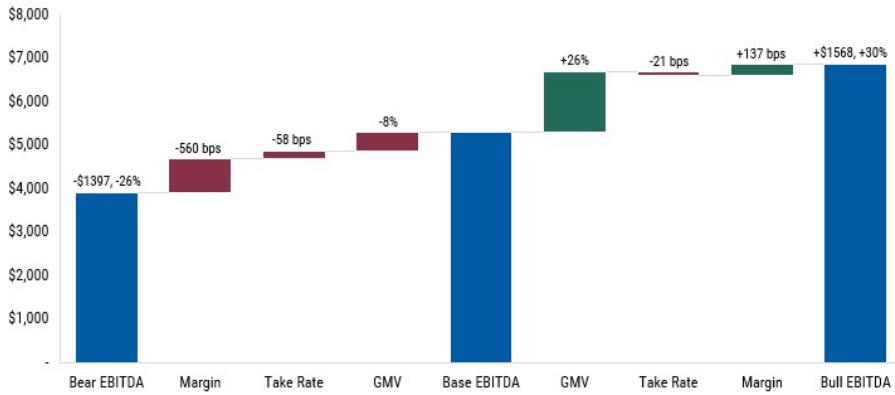

bar chart

| Category | Value ($) | Change (%) |
| :--- | :--- | :--- |
| Bear EBITDA | 3900 | -1397, -26 |
| Margin | 4500 | -560 bps |
| Take Rate | 4700 | -58 bps |
| GMV | 5100 | -8 |
| Base EBITDA | 5200 | |
| GMV | 5300 | +26 |
| Take Rate | 6600 | -21 bps |
| Margin | 6700 | +137 bps |
| Bull EBITDA | 6800 | +1568, +30 |

Source: Company Data, MS

Exhibit 3: We outline agentic bull & bear scenarios for ETSY; upside split between GMS growth and margin expansion while take rate is a concern in the bear case  
ETSY Agentic Scenarios: 2030 EBITDA Bear/Base/Bull Bridge  
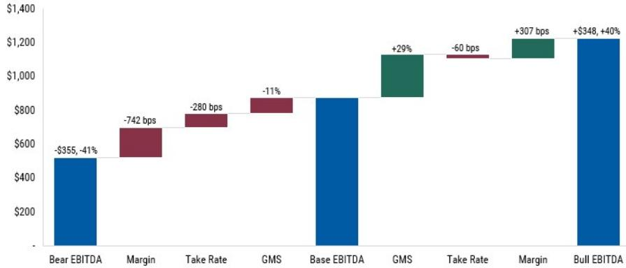

waterfall chart

| Category | Value ($) | Change (%) |
| :--- | :--- | :--- |
| Bear EBITDA | -355 | -41 |
| Margin | -742 | bps |
| Take Rate | -280 | bps |
| GMS | -11 | bps |
| Base EBITDA | | |
| GMS | +29 | |
| Take Rate | -60 | bps |
| Margin | +307 | bps |
| Bull EBITDA | +348 | +40 |

Source: Company Data, MS

# EBAY (OW, \$121): An Underappreciated Agentic Winner

## Our View

We see EBAY as an underappreciated agentic winner with 3 key strengths: EBAY has long held a perception as a structural share loser, recent performance notwithstanding. Given that, it's not a surprise the market has been skeptical of its ability to outperform as agentic commerce gains steam. However, we see 3 distinct advantages that we think will position it well for an agentic commerce era:

1) Vast, unique inventory: EBAY has a wide listing base of \~2.5B items. Of those, \~90% are used or not in-season, often being sold only on EBAY. Relative to existing keyword-based search, we think agentic commerce will help users refine in plain text what they want, getting them to long-tail items more frequently... which uniquely benefits EBAY's unique inventory.  
2) Pricing advantage: As a marketplace without a dedicated fulfillment network, EBAY has a distinct speed disadvantage versus peers. However, what it lacks in speed it makes up in price. With a large base of used & C2C inventory, EBAY tends to offer goods at a material pricing advantage over retailers selling new items which should enable strong ranking among horizontal agents.  
3) Reduced selling friction: People have >\$4K of items on average that they could sell online, but don't given it's still a relatively cumbersome experience. Agentic commerce should streamline this by automatically filling in structured data & providing recommendations on key pieces (title, description, price). By taking friction out of the process, both sellers and listings per seller should increase. Early datapoints are encouraging as the 2nd iteration of EBAY's Magical Listings is showing a >25% reduction in time to list and a >DD% increase in GMV per lister.

Taken together, agentic commerce is a rare tech improvement that should drive both supply & demand for EBAY and, as a result, we see it as one of the best positioned companies for agentic commerce. If we're right, we believe agentic could help fuel durable \~HSD%-LDD% GMV growth as we outline our new EBAY agentic bull case which has 2030 GMV/EBITDA 26%/30% above our base case..

## 5 l's Framework

## What is our 5 I's Framework?

With agentic set to be the next major era within eCommerce, we have developed our "5 I's" framework to determine the balance of opportunity & risk for retailers. The 5 I's are:

1) Inventory: Unique, competitively priced inventory increasingly important as agentic makes it easier to cross-shop, compare prices, and match unique items to personalized tastes/demand.  
2) Infrastructure: Access to physical infrastructure to quickly & cheaply deliver items along with digital

infrastructure to enable agentic sales.

3) Innovation: Investment/innovation to take advantage of GPU-enabled ML through things like better search & discovery, seller tools, external partnerships, etc.  
4) Incremental Growth Opportunity: Ability to drive incremental topline growth and gain market share in a company's addressable market.  
5) Income Statement and Margin Impact: The net impact to a company's margin structure, largely due to risk that agentic cannibalizes the higher margin core business and retail media ad earnings, but offset by a potential shift in marketing costs.

## Inventory (5/5 - Very Strong Positioning): Highly unique inventory a clear differentiator

EBAY has 3 main advantages when it comes to inventory: scale, rarity, and pricing. Taken together we think this is a critical differentiator relative to eCommerce peers which often sell new, non-unique items.

1) Scale: EBAY has a vast listing base of \~2.5B items with a wide sourcing base across geographies, customer sizes, and categories.  
2) Rarity: As 40% of items are pre-loved & another \~50% are new, but not in-season, many listings are unique or rare items not available elsewhere. As agentic is better at surfacing long-tail items than traditional search, we think EBAY's inventory should uniquely benefit.  
3) Pricing: Given the above two factors (especially its used & C2C inventory), EBAY listings are often cheaper than peers.

Exhibit 4: \~90% of EBAY's inventory is unique, which we believe positions it well - offensively & defensively - for agentic commerce

EBAY Inventory Base by Type  
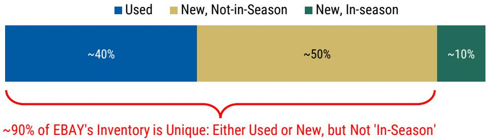

stacked bar chart

| Category | Value (%) |
|---|---|
| Used | ~40 |
| New, Not-in-Season | ~50 |
| New, In-season | ~10 |
~90% of EBAY's Inventory is Unique: Either Used or New, but Not 'In-Season'

Source: Company Data, MS

## Infrastructure (3/5 - Neutral): More physical touchpoints than expected, but room to improve

We see physical fulfillment as a key differentiator as agentic grows. Given its broad sourcing base/C2C exposure, EBAY hasn't built an owned fulfillment network which is a trade-off that sometimes leads to a worse consumer experience (slower shipping, inconsistent item accuracy). To address key pain points, EBAY has launched targeted fulfillment initiatives: 1) eBay International Shipping, 2) local managed shipping (in the UK/Australia), 3) SpeedPAK export-based shipping programs, and 4) authentication centers. This enables EBAY to manage the shipping experience where it can be most impactful without the full PnL impact of owning a global fulfillment network. We see further opportunity to expand this asset-light fulfillment assistance, particularly in domestic shipping (\~80% of GMV).

On the digital infrastructure side, EBAY has built their "Unified Agentic Commerce platform" to enable agent-to-agent communication. However, it has done fewer partnerships with horizontal agents than peers like ETSY as it's focused on the onsite experience.

Exhibit 5: EBAY has 7 global authentication hubs along with 5 more partner facilities...  
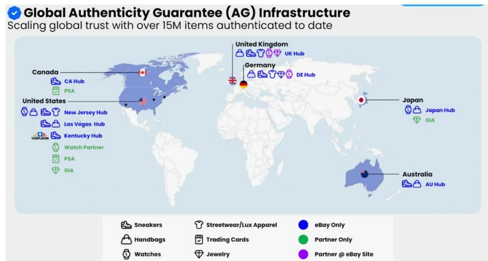

text_image

Global Authenticity Guarantee (AG) Infrastructure
Scaling global trust with over 15M items authenticated to date
Canada
CA Hub
PSA
United States
New Jersey Hub
Las Vegas Hub
TCPPLATER
Kentucky Hub
Watch Partner
PSA
GIA
United Kingdom
UK Hub
Germany
DE Hub
Japan
Japan Hub
GIA
Australia
AU Hub
Sneakers
Handbags
Watches
Streetwear/Lux Apparel
Trading Cards
Jewelry
eBay Only
Partner Only
Partner @ eBay Site

Source: Company Presentation

Exhibit 6: ...along with various Bespoke shipping programs across 14 countries  
Facilitating Cross-Border Trade Through Shipping Solutions  
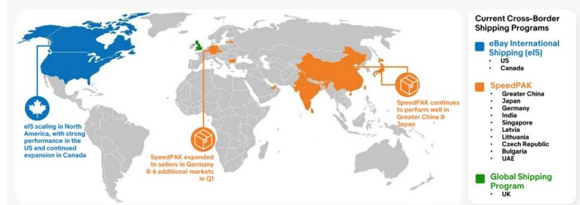

text_image

Current Cross-Border Shipping Programs
eBay International Shipping (eIS)
• US
• Canada
SpeedPAK
• Greater China
• Japan
• Germany
• India
• Singapore
• Latvia
• Lithuania
• Czech Republic
• Bulgaria
• UAE
Global Shipping Program
• UK
eIS scaling in North America, with strong performance in the US and continued expansion in Canada
SpeedPAK expanded to sellers in Germany & 6 additional markets in Q1

\* Managed shipping launched in Australia in 2Q  
Source: Company Presentation

## Innovation (4/5 - Strong Positioning): Pace of experimentation among the highest in SMID internet

Over the past 5 years, we've seen an accelerated pace of innovation at EBAY. This has led the company to unexpectedly be on the leading edge of Gen AI among SMID internet names. Improvements have come in 3 buckets:

1) Listing assistance: Friction in listing items is one of the largest pain points on EBAY. GenAI has helped reduce time to list & may improve quality in time. Its new 'magical listings' flow saw a 25% decrease in average listing time and a +DD% increase in GMV per lister.  
2) Seller tools: EBAY has worked to give sellers tool to reduce admin overhead, which can increase time spent on GMV-generating activities & lower seller churn.  
3) Search & discovery: This is in earlier innings, but EBAY has trialed a few new types of engagement outside of keyword-based search. For example, agentic search beta is showing $>50\%$ higher engagement. We expect more to come here over time.

Exhibit 7: EBAY's key GenAI innovation to date across listing assistance, seller tools, and search & discovery

<table><tr><td>Listing Assistance</td><td>Seller Tools</td><td>Search &amp; Discovery</td></tr><tr><td>GenAI Descriptions (2023): AI generated product descriptions for listingsBackground Removal (2024): Enhanced picture backgroundsMagical Bulk Listings (2024): Streamlined listing process for bulk itemsNext-Gen Magical Listings (2026): Significantly streamlined listing process</td><td>Social Caption Generator (2023): AI generated captions for posting listings on social mediaGenAI Video Listings (2025): AI generated videos to post on social mediaAI Messaging Assistant (2025): Automated responses to common buyer questionsInventory Mapping API (2025): Bulk inventory improvement tool from AI suggestions</td><td>Shop the Look (2024): AI-based visual matches for fashionExplore Feed (2024): Picture-first discovery feedExternal Partnerships (2025): Started creating partnerships with horizontal agentsAgentic Search (2026): On-site agent which can answer detailed questions</td></tr></table>

Source: Company Data, MS

## Incrementality (3/5 - Neutral): Opportunity in horizontal agents & supply creation

On an aggregate basis, EBAY has a 3.0%/1.7% market share of the US/global eCommerce. However, it doesn't meaningfully compete in the majority of eCommerce spend (new, in-season inventory). Within its core verticals, share varies. However, we do see clear opportunity to capture demand through two methods. First, we think EBAY could outperform in horizontal agents given its competitively priced, scaled inventory base. Second, EBAY is unique in eCommerce as partially supply-constrained. Most people have a large number of items (\~\$4K per household) which, if listed, would be partially incremental to GMV. By making it easier to list items, this unique supply should translate to share gains.

Exhibit 8: EBAY has \~3.0% market share within US eCommerce, although higher in its core verticals  
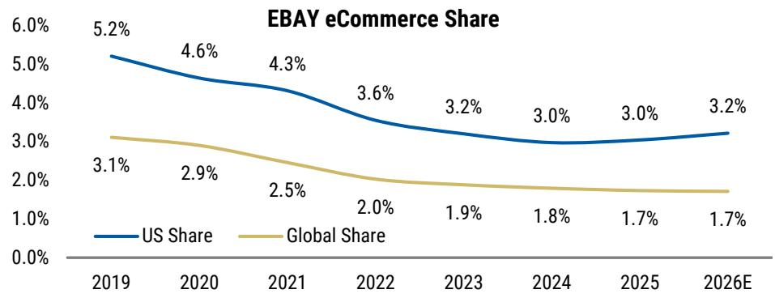

line chart

| Year   | US Share | Global Share |
| ------ | -------- | ------------ |
| 2019   | 5.2%     | 3.1%         |
| 2020   | 4.6%     | 2.9%         |
| 2021   | 4.3%     | 2.5%         |
| 2022   | 3.6%     | 2.0%         |
| 2023   | 3.2%     | 1.9%         |
| 2024   | 3.0%     | 1.8%         |
| 2025   | 3.0%     | 1.7%         |
| 2026E  | 3.2%     | 1.7%         |

Source: Census Bureau, Euromontior, Company Data, MS

## Income Statement Impact (3/5 - Neutral): A wide range of potential outcomes

In the early stages of agentic commerce, there are a wide variety of paths for how this could alter economics. The most important questions are: adoption of onsite (more profitable) vs. offsite (less profitable), the fee agents will be able to charge retailers (similar to an affiliate marketing), and the extent agentic grows the pie or simply cannibalizes existing sales.

Onsite agentic sales should not pressure margins, but offsite could. To assess the potential EBIT impact if offsite agentic commerce became 10% of GMV, we run a sensitivity analysis on Agent Fees (i.e. how much an offsite/horizontal shopping agent charges for sourcing the transaction) and Agentic Incremental GMV (i.e. how much of the Agentic GMV is new volume vs. cannibalizing purchases that would have otherwise still occurred).

At an agent fee of 5%, \~65% of EBAY's GMV would have to be incremental to reach breakeven EBIT. That puts EBAY at an interesting middle ground versus peers - it spends a relatively low amount on advertising (high risk agentic could increase that, hurting EBIT), but it generates minimal onsite ad revenue which reduces risk to take rate if onsite traffic is displaced by agents (lowering risk to EBIT).

Exhibit 9: We sensitize the EBIT impact of offsite agents on EBAY

<table><tr><td colspan="7">EBAY - Offsite Agentic Impact on EBIT @ 10% Share</td></tr><tr><td></td><td></td><td colspan="5">Agent Fee</td></tr><tr><td></td><td></td><td>0.0%</td><td>2.5%</td><td>5.0%</td><td>7.5%</td><td>10.0%</td></tr><tr><td rowspan="2">Agentic %</td><td>10%</td><td>5%</td><td>(2%)</td><td>(8%)</td><td>(15%)</td><td>(21%)</td></tr><tr><td>30%</td><td>8%</td><td>1%</td><td>(5%)</td><td>(12%)</td><td>(18%)</td></tr><tr><td rowspan="3">Incremental to GMV</td><td>50%</td><td>11%</td><td>5%</td><td>(2%)</td><td>(8%)</td><td>(15%)</td></tr><tr><td>70%</td><td>14%</td><td>8%</td><td>1%</td><td>(5%)</td><td>(12%)</td></tr><tr><td>90%</td><td>18%</td><td>11%</td><td>5%</td><td>(2%)</td><td>(8%)</td></tr></table>

Source: Company Data, MS

## Scenario Analysis

Exhibit 10: EBAY Agentic Bear to Bull Case Waterfall  
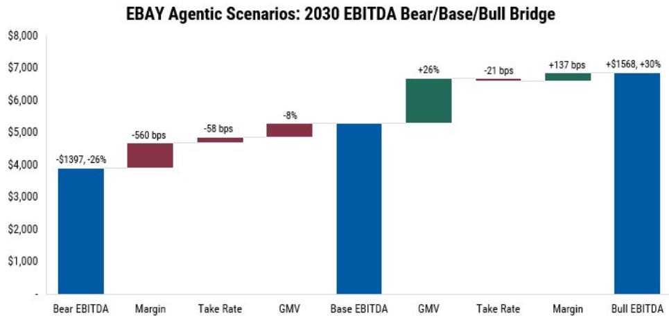

bar chart

EBAY Agentic Scenarios: 2030 EBITDA Bear/Base/Bull Bridge
| Category | Value ($) | Change (%) |
| :--- | :--- | :--- |
| Bear EBITDA | -1397 | -26 |
| Margin | -560 | bps |
| Take Rate | -58 | bps |
| GMV | -8 | bps |
| Base EBITDA | | |
| GMV | +26 | |
| Take Rate | -21 | bps |
| Margin | +137 | bps |
| Bull EBITDA | +1568 | +30 |

Source: Company Data, MS

## Bull Case: Unique inventory keeps existing traffic onsite while offsite proves highly incremental

The vast assortment of unique inventory on EBAY allows it to be an agentic winner both onsite & offsite. Onsite, agentic improves the experience for enthusiasts buyers (\~12% of the buyer base, but \~70% of GMV) improving both retention & spend. Offsite, agents surface its wide inventory (which is often priced at a discount) to other buyers which drives incremental volume. Those are magnified by improved seller tools which leads to a step-function increase in C2C inventory. Taken together, this leads to sustainable HSD%-LDD% GMV growth which puts '30 GMV 26% above our base case. This drives operating leverage and enables '30 EBITDA margin to expand 137 bps above our base case, or 30% higher EBITDA dollars.

Exhibit 11: EBAY in an Agentic Era - Bull Case

<table><tr><td rowspan="2"></td><td colspan="8">EBAY in an Agentic Era - Bull Case</td></tr><tr><td>2023</td><td>2024</td><td>2025</td><td>2026E</td><td>2027E</td><td>2028E</td><td>2029E</td><td>2030E</td></tr><tr><td>Non-Agentic GMV</td><td>73,206</td><td>74,667</td><td>79,609</td><td>86,557</td><td>91,327</td><td>94,896</td><td>96,652</td><td>97,099</td></tr><tr><td>Onsite Agentic GMV</td><td></td><td></td><td></td><td>1,117</td><td>3,046</td><td>7,238</td><td>14,476</td><td>23,938</td></tr><tr><td>Offsite Agentic GMV</td><td></td><td></td><td></td><td>372</td><td>1,015</td><td>2,413</td><td>4,825</td><td>7,979</td></tr><tr><td>Total GMV</td><td>73,206</td><td>74,667</td><td>79,609</td><td>88,047</td><td>95,389</td><td>104,547</td><td>115,954</td><td>129,015</td></tr><tr><td>y/y change</td><td></td><td>2.0%</td><td>6.6%</td><td>10.6%</td><td>8.3%</td><td>9.6%</td><td>10.9%</td><td>11.3%</td></tr><tr><td>Agentic % of GMV</td><td></td><td></td><td></td><td>2%</td><td>4%</td><td>9%</td><td>17%</td><td>25%</td></tr><tr><td>% delta vs. base case</td><td></td><td></td><td></td><td>1%</td><td>4%</td><td>10%</td><td>18%</td><td>26%</td></tr><tr><td>Take Rate</td><td>13.8%</td><td>13.8%</td><td>13.9%</td><td>14.0%</td><td>14.5%</td><td>14.9%</td><td>15.1%</td><td>15.3%</td></tr><tr><td>y/y change (bps)</td><td></td><td>-4</td><td>17</td><td>9</td><td>47</td><td>35</td><td>26</td><td>23</td></tr><tr><td>% delta vs. base case (bps)</td><td></td><td></td><td></td><td>-1</td><td>-3</td><td>-7</td><td>-14</td><td>-21</td></tr><tr><td>Non-Agentic Revenue</td><td>10,112</td><td>10,283</td><td>11,100</td><td>12,159</td><td>13,275</td><td>14,162</td><td>14,739</td><td>15,098</td></tr><tr><td>Onsite Agentic Revenue</td><td></td><td></td><td></td><td>157</td><td>443</td><td>1,080</td><td>2,207</td><td>3,722</td></tr><tr><td>Offsite Agentic Revenue</td><td></td><td></td><td></td><td>42</td><td>118</td><td>286</td><td>579</td><td>970</td></tr><tr><td>Revenue</td><td>10,112</td><td>10,283</td><td>11,100</td><td>12,358</td><td>13,836</td><td>15,528</td><td>17,525</td><td>19,791</td></tr><tr><td>y/y change</td><td></td><td>1.7%</td><td>7.9%</td><td>11.3%</td><td>12.0%</td><td>12.2%</td><td>12.9%</td><td>12.9%</td></tr><tr><td>% delta vs. base case</td><td></td><td></td><td></td><td>1%</td><td>4%</td><td>10%</td><td>17%</td><td>24%</td></tr><tr><td>Variable Costs</td><td>3,140</td><td>3,179</td><td>3,508</td><td>3,707</td><td>4,132</td><td>4,642</td><td>5,251</td><td>5,948</td></tr><tr><td>Marketing Costs</td><td>2,125</td><td>2,228</td><td>2,306</td><td>2,673</td><td>2,931</td><td>3,222</td><td>3,583</td><td>3,996</td></tr><tr><td>Fixed Costs</td><td>2,196</td><td>2,000</td><td>2,378</td><td>2,732</td><td>2,824</td><td>3,032</td><td>3,254</td><td>3,493</td></tr><tr><td>Total Costs</td><td>7,461</td><td>7,407</td><td>8,192</td><td>9,113</td><td>9,887</td><td>10,895</td><td>12,088</td><td>13,437</td></tr><tr><td>Variable Costs % of GMV</td><td>4.3%</td><td>4.3%</td><td>4.4%</td><td>4.2%</td><td>4.3%</td><td>4.4%</td><td>4.5%</td><td>4.6%</td></tr><tr><td>Marketing Costs % of GMV</td><td>2.9%</td><td>3.0%</td><td>2.9%</td><td>3.0%</td><td>3.1%</td><td>3.1%</td><td>3.1%</td><td>3.1%</td></tr><tr><td>Fixed Costs % of GMV</td><td>3.0%</td><td>2.7%</td><td>3.0%</td><td>3.1%</td><td>3.0%</td><td>2.9%</td><td>2.8%</td><td>2.7%</td></tr><tr><td>Total Costs % of GMV</td><td>10.2%</td><td>9.9%</td><td>10.3%</td><td>10.3%</td><td>10.4%</td><td>10.4%</td><td>10.4%</td><td>10.4%</td></tr><tr><td>EBITDA</td><td>3,140</td><td>3,179</td><td>3,443</td><td>3,760</td><td>4,389</td><td>5,097</td><td>5,930</td><td>6,860</td></tr><tr><td>y/y change</td><td></td><td>1.2%</td><td>8.3%</td><td>9.2%</td><td>16.7%</td><td>16.1%</td><td>16.4%</td><td>15.7%</td></tr><tr><td>% delta vs. base case</td><td></td><td></td><td></td><td>1%</td><td>5%</td><td>12%</td><td>20%</td><td>30%</td></tr><tr><td>EBITDA Margin</td><td>31.1%</td><td>30.9%</td><td>31.0%</td><td>30.4%</td><td>31.7%</td><td>32.8%</td><td>33.8%</td><td>34.7%</td></tr><tr><td>y/y change (bps)</td><td></td><td>-14</td><td>10</td><td>-60</td><td>130</td><td>110</td><td>102</td><td>82</td></tr><tr><td>% delta vs. base case (bps)</td><td></td><td></td><td></td><td>3</td><td>31</td><td>68</td><td>104</td><td>137</td></tr></table>

Source: Company Data, MS

## Bear Case: Offsite agents disrupt EBAY's flywheel and return the company to sustained share loss

Despite its strong recent performance, EBAY has largely lost share through eCommerce's evolution. Agentic could revert EBAY to share losses by giving sellers the ability to list elsewhere and still generate demand - disrupting EBAY's flywheel. In addition, it may highlight EBAY's generally slower shipping times which could cause share loss. Offsite struggles to be as profitable as EBAY has to pay a higher marketing fee while also losing ad revenue. In this scenario, we model GMV flips back to modest declines with '30 GMV - 8% below our base case. Take rate is pressured given reduced onsite advertising revenue, leading it -58 bps below our base case in '30. This takes '30 revenue -12% below. Marketing spend increases due to agent fees, pushing '30 EBITDA -26% below our base

case to a 27.7% '30 margin.

Exhibit 12: EBAY in an Agentic Era - Bear Case

<table><tr><td rowspan="2"></td><td colspan="8">EBAY in an Agentic Era - Bear Case</td></tr><tr><td>2023</td><td>2024</td><td>2025</td><td>2026E</td><td>2027E</td><td>2028E</td><td>2029E</td><td>2030E</td></tr><tr><td>Non-Agentic GMV</td><td>73,206</td><td>74,667</td><td>79,609</td><td>86,059</td><td>86,230</td><td>82,224</td><td>73,793</td><td>62,022</td></tr><tr><td>Onsite Agentic GMV</td><td></td><td></td><td></td><td>745</td><td>2,031</td><td>4,826</td><td>9,651</td><td>15,958</td></tr><tr><td>Offsite Agentic GMV</td><td></td><td></td><td></td><td>745</td><td>2,031</td><td>4,826</td><td>9,651</td><td>15,958</td></tr><tr><td>Total GMV</td><td>73,206</td><td>74,667</td><td>79,609</td><td>87,548</td><td>90,292</td><td>91,875</td><td>93,095</td><td>93,939</td></tr><tr><td>y/y change</td><td></td><td>2.0%</td><td>6.6%</td><td>10.0%</td><td>3.1%</td><td>1.8%</td><td>1.3%</td><td>0.9%</td></tr><tr><td>Agentic % of GMV</td><td></td><td></td><td></td><td>2%</td><td>4%</td><td>11%</td><td>21%</td><td>34%</td></tr><tr><td>% delta vs. base case</td><td></td><td></td><td></td><td>0%</td><td>-1%</td><td>-3%</td><td>-6%</td><td>-8%</td></tr><tr><td>Take Rate</td><td>13.8%</td><td>13.8%</td><td>13.9%</td><td>14.0%</td><td>14.5%</td><td>14.8%</td><td>14.9%</td><td>15.0%</td></tr><tr><td>y/y change (bps)</td><td></td><td>-4</td><td>17</td><td>8</td><td>45</td><td>29</td><td>15</td><td>6</td></tr><tr><td>% delta vs. base case (bps)</td><td></td><td></td><td></td><td>-2</td><td>-7</td><td>-16</td><td>-34</td><td>-58</td></tr><tr><td>Non-Agentic Revenue</td><td>10,112</td><td>10,283</td><td>11,100</td><td>12,089</td><td>12,534</td><td>12,271</td><td>11,253</td><td>9,644</td></tr><tr><td>Onsite Agentic Revenue</td><td></td><td></td><td></td><td>105</td><td>295</td><td>720</td><td>1,472</td><td>2,481</td></tr><tr><td>Offsite Agentic Revenue</td><td></td><td></td><td></td><td>84</td><td>236</td><td>571</td><td>1,158</td><td>1,940</td></tr><tr><td>Revenue</td><td>10,112</td><td>10,283</td><td>11,100</td><td>12,278</td><td>13,066</td><td>13,563</td><td>13,883</td><td>14,065</td></tr><tr><td>y/y change</td><td></td><td>1.7%</td><td>7.9%</td><td>10.6%</td><td>6.4%</td><td>3.8%</td><td>2.4%</td><td>1.3%</td></tr><tr><td>% delta vs. base case</td><td></td><td></td><td></td><td>0%</td><td>-2%</td><td>-4%</td><td>-8%</td><td>-12%</td></tr><tr><td>Variable Costs</td><td>3,140</td><td>3,179</td><td>3,508</td><td>3,686</td><td>3,911</td><td>4,079</td><td>4,216</td><td>4,331</td></tr><tr><td>Marketing Costs</td><td>2,125</td><td>2,228</td><td>2,306</td><td>2,680</td><td>2,835</td><td>2,974</td><td>3,160</td><td>3,378</td></tr><tr><td>Fixed Costs</td><td>2,196</td><td>2,000</td><td>2,378</td><td>2,732</td><td>2,749</td><td>2,841</td><td>2,912</td><td>2,968</td></tr><tr><td>Total Costs</td><td>7,461</td><td>7,407</td><td>8,192</td><td>9,099</td><td>9,494</td><td>9,893</td><td>10,288</td><td>10,677</td></tr><tr><td>Variable Costs % of GMV</td><td>4.3%</td><td>4.3%</td><td>4.4%</td><td>4.2%</td><td>4.3%</td><td>4.4%</td><td>4.5%</td><td>4.6%</td></tr><tr><td>Marketing Costs % of GMV</td><td>2.9%</td><td>3.0%</td><td>2.9%</td><td>3.1%</td><td>3.1%</td><td>3.2%</td><td>3.4%</td><td>3.6%</td></tr><tr><td>Fixed Costs % of GMV</td><td>3.0%</td><td>2.7%</td><td>3.0%</td><td>3.1%</td><td>3.0%</td><td>3.1%</td><td>3.1%</td><td>3.2%</td></tr><tr><td>Total Costs % of GMV</td><td>10.2%</td><td>9.9%</td><td>10.3%</td><td>10.4%</td><td>10.5%</td><td>10.8%</td><td>11.1%</td><td>11.4%</td></tr><tr><td>EBITDA</td><td>3,140</td><td>3,179</td><td>3,443</td><td>3,693</td><td>4,010</td><td>4,133</td><td>4,088</td><td>3,895</td></tr><tr><td>y/y change</td><td></td><td>1.2%</td><td>8.3%</td><td>7.3%</td><td>8.6%</td><td>3.1%</td><td>-1.1%</td><td>-4.7%</td></tr><tr><td>% delta vs. base case</td><td></td><td></td><td></td><td>-1%</td><td>-4%</td><td>-9%</td><td>-17%</td><td>-26%</td></tr><tr><td>EBITDA Margin</td><td>31.1%</td><td>30.9%</td><td>31.0%</td><td>30.1%</td><td>30.7%</td><td>30.5%</td><td>29.4%</td><td>27.7%</td></tr><tr><td>y/y change (bps)</td><td></td><td>-14</td><td>10</td><td>-94</td><td>61</td><td>-22</td><td>-103</td><td>-175</td></tr><tr><td>% delta vs. base case (bps)</td><td></td><td></td><td></td><td>-30</td><td>-72</td><td>-167</td><td>-335</td><td>-560</td></tr></table>

Source: Company Data, MS

# ETSY (EW, \$64): Medium-Term Opportunity More Compelling Than Long-Term Risks

Our View

The long-term risks for ETSY in agentic commerce are clear...: We have concerns about ETSY's long-term positioning in an agentic era. The premise is simple: ETSY's value is aggregating demand for special items. If somebody else aggregates that demand, what is ETSY's value?

Although ETSY sells unique items, they often aren't unique to ETSY. We took a look at the top 100 shops on ETSY and found that $>75\%$ also sell on other channels (primarily SHOP sites), often at a discount to their pricing on ETSY. If horizontal agents (like Gemini) gain share, its possible they may direct people to those individual sites rather than ETSY.

Risk of disruption is magnified by ETSY's 25% take rate, the highest among public 3P marketplaces. This provides an incentive for sellers to try and divert traffic away from ETSY if possible. In addition, the high onsite advertising revenue ( $\sim$ 8% of GMS) could come under pressure if traffic moves from Etsy to offsite agents.

ETSY's low buyer loyalty may hasten any potential decline. ETSY has a \~60% annual buyer churn and generates >20% of its GMS from existing paid channels (primarily Google search). The company has been working to improve this by moving buyers to the app, but churn still runs far higher than most eCommerce peers.

Although this thesis is still highly theoretical, it's hard to disprove and we believe will durably weigh on ETSY's multiple. In our ETSY agentic bear case we model 2030 GMS/EBITDA -11%/-41% below our base case.

… but the market Is overlooking the compelling medium-term opportunity: Despite the potential long-term risk, we see a very interesting opportunity for ETSY to be an agentic winner over the next few years that we believe the market does not appreciate.

We believe the biggest limitation to ETSY's GMS growth over the past decade has been a lack of frequency gains, despite heavy efforts from the company. We think this may have been a structural issue with keyword based search. Many buyers come to Etsy with a mission in mind ("gift for my mom") rather than a specific item, while keyword-based search works best when a buyer knows exactly the item they want ("custom ceramic mug"). The conversational nature of agentic could fundamentally change that by allowing buyers to refine what they are looking for with far more context. We think this will drive up conversion rate and allow buyers to shop across a greater breadth of products/categories.

In addition, the bear case is focused on growth in horizontal agents. However, we believe that onsite agentic experiences will be initially more adopted given higher trust, lower payments/shipping friction, and ability to leverage customer data. That provides a window of opportunity for ETSY to build onsite agentic experiences that improve the customer experience, increase buyer retention, and potentially reactivate a portion of its >200M lapsed buyers. Plus it's possible ETSY performs better with horizontal agents than in

search, which could increase share.

The upside could be meaningful if agentic does lead to higher conversion & frequency. For each \$5 increase in GMS per buyer ETSY's overall GMS would increase by 4%. Given consensus is modeling just a 3% GMS CAGR, even moderate gains in frequency could lead to meaningful estimate revisions.

As a result, in our ETSY agentic bull case we model 2030 GMS 29% above our base case with margins remaining healthy as high onsite agentic adoption protects the take rate leading to 2030 EBITDA dollars 40% above our base case.

## 5 I's Framework

## What is our 5 I's Framework?

With agentic set to be the next major era within eCommerce, we have developed our "5 I's" framework to determine the balance of opportunity & risk for retailers. The 5 I's are:

1) Inventory: Unique, competitively priced inventory increasingly important as agentic makes it easier to cross-shop, compare prices, and match unique items to personalized tastes/demand.  
2) Infrastructure: Access to physical infrastructure to quickly & cheaply deliver items along with digital infrastructure to enable agentic sales.  
3) Innovation: Investment/innovation to take advantage of GPU-enabled ML through things like better search & discovery, seller tools, external partnerships, etc.  
4) Incremental Growth Opportunity: Ability to drive incremental topline growth and gain market share in a company's addressable market.  
5) Income Statement and Margin Impact: The net impact to a company's margin structure, largely due to risk that agentic cannibalizes the higher margin core business and retail media ad earnings, but offset by a potential shift in marketing costs.

## Inventory (2/5 - Limited Differentiation): Although ETSY sells unique items, they often aren't unique to ETSY

Etsy's sellers primarily offer unique and special items. However, as a marketplace many of those items aren't unique to ETSY. The company has disclosed that \~49% of sellers exclusively sell on ETSY. However, that includes a number of small shops with limited volume. We went through ETSY's top 100 sellers and found at least 3/4ths also sell on other channels (primarily an owned website, but often other marketplaces). Given ETSY's \~25% take rate, this is logical. Sellers pay a premium to ETSY for demand generation, but will try and divert sales to their owned channels (like a SHOP site) as much as possible

given lower fees... and often offer lower prices as an incentive. This creates a risk for ETSY. If the same item is available for cheaper elsewhere, external agents are incentivized to push traffic towards those lower-cost channels (all else equal). We believe this inventory overlap may be a risk if horizontal agents gain share, pressuring volume and/or take rate.

Exhibit 13: At least 3/4ths of ETSY's top sellers already sell on other channels, showing most inventory is not unique to Etsy.com

Do ETSY Stores Sell Elsewhere?  
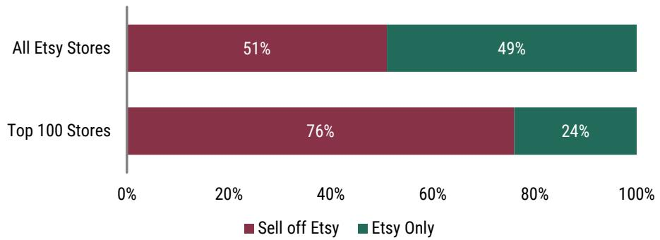

stacked bar chart

| Category | Sell off Etsy (%) | Etsy Only (%) |
| :--- | :--- | :--- |
| All Etsy Stores | 51 | 49 |
| Top 100 Stores | 76 | 24 |

\* A greater portion of the top 100 stores may sell off Etsy, but we only found direct evidence for 76%  
Source: Marketplace Pulse, Company Data, MS

Exhibit 14: ETSY has the highest take rate among 'pure' public marketplaces (those without fulfillment)  
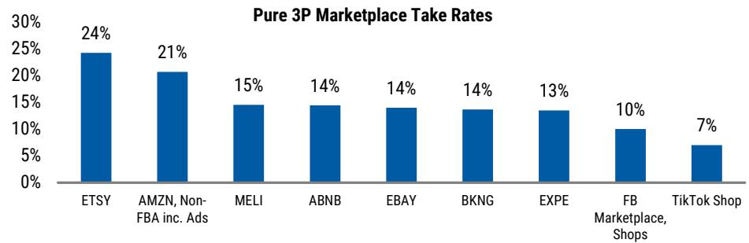

bar chart

Pure 3P Marketplace Take Rates
| Company | Take Rate (%) |
| :--- | :--- |
| ETSY | 24 |
| AMZN, Non-FBA inc. Ads | 21 |
| MELI | 15 |
| ABNB | 14 |
| EBAY | 14 |
| BKNG | 14 |
| EXPE | 13 |
| FB Marketplace, Shops | 10 |
| TikTok Shop | 7 |

FY25 data  
Source: Company Data, MS

## Infrastructure (2/5 - Limited Differentiation): Lack of physical distribution a long-run risk, but don't overlook its digital infrastructure

As a pure 3P marketplace ETSY doesn't have physical infrastructure. Given the long-tail nature of its seller-base & of handmade/custom-ordered goods, this isn't a space where that is fully feasible. However, this does reduce seller lock-in & moat which could become an issue long-term if external agents become ‘the new marketplace’. Said another way, ETSY sellers will go to whomever offers demand. In a bear case, this could look similar to in-person travel agents where their primary value (aggregating demand for travel companies) was more easily displaced than other in-person businesses as they didn't control the supply or have a delivery moat. Granted, we see this as a long term risk which is far from guaranteed & will depend on how external agents look to monetize.

Near-term, the digital infrastructure ETSY has built will be more important. It has the largest database of unique/special items with the specific attributes relevant to this category (critical for surfacing the right items for agents). In addition, it has partnered with the major consumer-facing agents to ensure its inventory is surfacing if demand moves. It has also been an early leader in agentic payments which gives it a seat at the table to try and move standards in its favor despite its relatively small size.

Exhibit 15: On GOOGL's UCP Tech Council, ETSY is the smallest company - showing its outsized impact on digital infrastructure relative to its size

UCP Tech Council by Market Cap (\$B, Log Scale)  
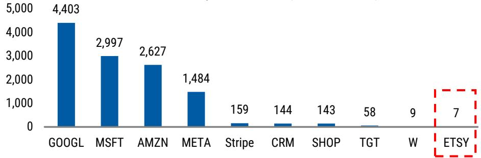

bar chart

| Entity | Value |
| :--- | :--- |
| GOOGL | 4,403 |
| MSFT | 2,997 |
| AMZN | 2,627 |
| META | 1,484 |
| Stripe | 159 |
| CRM | 144 |
| SHOP | 143 |
| TGT | 58 |
| W | 9 |
| ETSY | 7 |

\* Stripe based on last publicly disclosed private valuation  
Source: FactSet, Company Data, MS

## Innovation (3/5 - Neutral): ETSY has been a first mover for external partnerships, but has been slower to launch onsite features

In innovation, ETSY has been a tale of two sides. Etsy has been a founding commerce partner for the major horizontal agentic platforms (Gemini, Copilot, etc.), uniquely testing out the new format while peers have been more stagnant. We think this will give them time to determine incrementality & optimize the experience. In addition, it gives them a voice to help shape how these features are developed - potentially shifting development more towards their priorities. By being a first mover, we think ETSY has a chance to drive a near-term GMS boost as it more quickly understands how to win in this new channel.

However, ETSY has been slower than others in launching onsite agentic features. The company's historical forte has been optimization rather than product launches which led to limited consumer-facing innovations in '23 & '24. However, we've started to see experimentation increase over the past few quarters with new seller tools being released in 3Q25 and buyer tools entering testing over the past few months.

Exhibit 16: ETSY has launched a variety of Gen AI features, with development accelerating over the past 12 months

<table><tr><td rowspan="2">Feature</td><td colspan="4">ETSY Gen AI Features &amp; Partnerships</td></tr><tr><td>Type</td><td>Partner</td><td>Date</td><td>Details</td></tr><tr><td>AI Message Drafts</td><td>Seller Tool</td><td></td><td>9/4/2025</td><td>Gives proposed responses to buyer questions</td></tr><tr><td>Title Suggestions</td><td>Seller Tool</td><td></td><td>9/15/2025</td><td>Recommends new titles for listings</td></tr><tr><td>LLM-Attribute Tagging</td><td>Back-end</td><td></td><td>10/13/2025</td><td>Uses LLMs to extract additional information from listing photos &amp; unstructured text</td></tr><tr><td>Copilot Checkout</td><td>Partnership</td><td>Microsoft</td><td>1/8/2026</td><td>Etsy items available to purchase directly in Copilot checkout on the web in the US</td></tr><tr><td>Direct Purchase in AI Mode/Gemini</td><td>Partnership</td><td>Google</td><td>1/11/2026</td><td>US users can purchase ETSY items directly in GOOGL&#x27;s AI Mode/Gemini App</td></tr><tr><td>Universal Commerce Protocol</td><td>Partnership</td><td>Google</td><td>1/11/2026</td><td>Founding tech council partner of GOOGL&#x27;s agentic payment standard</td></tr><tr><td>LLM-Improved Search</td><td>Back-end</td><td></td><td>1/16/2026</td><td>Using LLMs to determine the semantic relevance of search</td></tr><tr><td>Algotorial Curation</td><td>Buyer Tool</td><td></td><td>4/16/2026</td><td>Uses AI to find inventory for human-dictated trends in the app</td></tr><tr><td>Onsite Conversational Search</td><td>Buyer Tool</td><td></td><td>5/5/2026</td><td>Testing conversational search in gifting</td></tr></table>

\* List is not exhaustive  
Source: Company Data, MS

## Incrementality (5/5 - Very Strong Positioning): Low share in a large TAM creates real opportunity

As a global marketplace that competes across various verticals Etsy has just \~1.7% eComm share of its \~\$600B self-defined TAM. Even if you cut the TAM simply to purchases for 'special' or custom items, it's still heavily underpenetrated. For most eCommerce players, the issue is lack of awareness & brand differentiation. That's not the case here as ETSY has \~87M active buyers & another \~200M lapsed buyers. Instead the issue has long been a lack of frequency with only \~\$120 GMS per buyer and \~60% annual buyer churn. GenAI could be the fix for frequency in two ways: 1) onsite agents enable an improved experience, or 2) external agents surface Etsy more than peers. With various paths for agentic to drive market share, we see clear potential for meaningful upside.

Exhibit 17: ETSY has just $\sim$ 1.7\% online share within its $\sim$ 600B TAM or a $\sim$ 0.5\% share among its $\sim$ 2T total (online/offline) TAM  
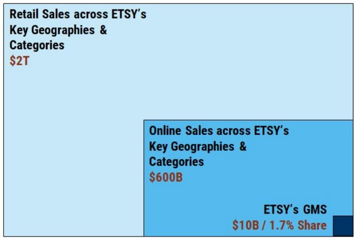

table

Retail Sales across ETSY's
Key Geographies &
Categories
$2T

Online Sales across ETSY's
Key Geographies &
Categories
$600B

ETSY's GMS
$10B / 1.7% Share

Source: Company Data, MS

Exhibit 18: Despite its early lead, ETSY has seen smaller incremental gains in AI referral traffic  
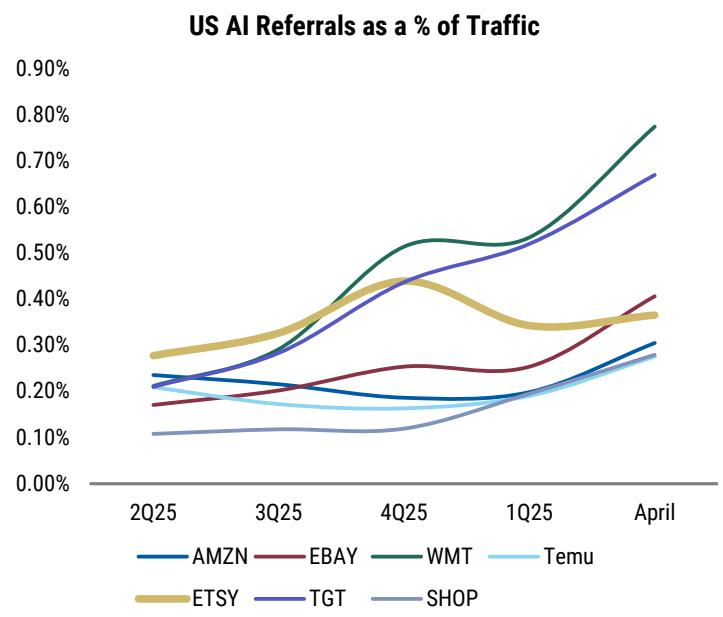

line chart

| Quarter | AMZN  | EBAY  | WMT   | Temu  | ETSY  | TGT   | SHOP  |
|---------|-------|-------|-------|-------|-------|-------|-------|
| 2Q25    | 0.23% | 0.17% | 0.28% | 0.21% | 0.28% | 0.22% | 0.11% |
| 3Q25    | 0.22% | 0.20% | 0.30% | 0.19% | 0.32% | 0.28% | 0.12% |
| 4Q25    | 0.19% | 0.25% | 0.52% | 0.18% | 0.44% | 0.45% | 0.12% |
| 1Q25    | 0.20% | 0.26% | 0.53% | 0.20% | 0.35% | 0.51% | 0.18% |
| April   | 0.31% | 0.41% | 0.78% | 0.28% | 0.37% | 0.68% | 0.28% |

Source: Similarweb, MS

## Income Statement Impact (4/5 - Strong Positioning): A wide range of potential outcomes, less downside risk than perceived as marketing could see leverage

In the early stages of agentic commerce, there are a wide variety of paths for how this could alter economics. The most important questions are: adoption of onsite (more profitable) vs. offsite (less profitable), the fee agents will be able to charge retailers, and the extent agentic grows the pie or simply cannibalizes existing sales.

Onsite agentic sales should not pressure margins, but offsite could. To assess the potential EBIT impact if offsite agentic commerce became 10% of GMS, we run a sensitivity analysis on Agent Fees (i.e. how much an offsite/horizontal shopping agent charges for sourcing the transaction) and Agentic Incremental GMS (i.e. how much of the Agentic GMS is new volume vs. cannibalizing purchases that would have otherwise still occurred).

At an agent fee of 5%, just \~30% of ETSY's GMS would have to be incremental to reach breakeven EBIT. Although the market is concerned about ETSY's agentic profitability given its high ad revenue, we think it overlooks ETSY's outsized marketing spend relative to peers. That means ETSY may actually be able to offset the lower take rate with reduced marketing, leading to a slightly better breakeven curve than EBAY & many marketplaces. It likely performs best if agentic commerce looks similar to the existing search model with paid ads highly effective & a hurdle for smaller sites to gain visibility.

Exhibit 19: We sensitize the EBIT impact of offsite agents on ETSY

<table><tr><td colspan="7">ETSY - Offsite Agentic Impact on EBIT @ 10% Share</td></tr><tr><td></td><td></td><td colspan="5">Agent Fee</td></tr><tr><td></td><td></td><td>0.0%</td><td>2.5%</td><td>5.0%</td><td>7.5%</td><td>10.0%</td></tr><tr><td rowspan="2">Agentic %</td><td>10%</td><td>4%</td><td>0%</td><td>(4%)</td><td>(7%)</td><td>(11%)</td></tr><tr><td>30%</td><td>7%</td><td>4%</td><td>0%</td><td>(3%)</td><td>(7%)</td></tr><tr><td rowspan="3">Incremental to GMV</td><td>50%</td><td>11%</td><td>7%</td><td>4%</td><td>0%</td><td>(3%)</td></tr><tr><td>70%</td><td>14%</td><td>11%</td><td>7%</td><td>4%</td><td>0%</td></tr><tr><td>90%</td><td>18%</td><td>15%</td><td>11%</td><td>8%</td><td>4%</td></tr></table>

Source: Company Data, MS

## Scenario Analysis

Exhibit 20: ETSY Agentic Bull/Bear Waterfall  
ETSY Agentic Scenarios: 2030 EBITDA Bear/Base/Bull Bridge  
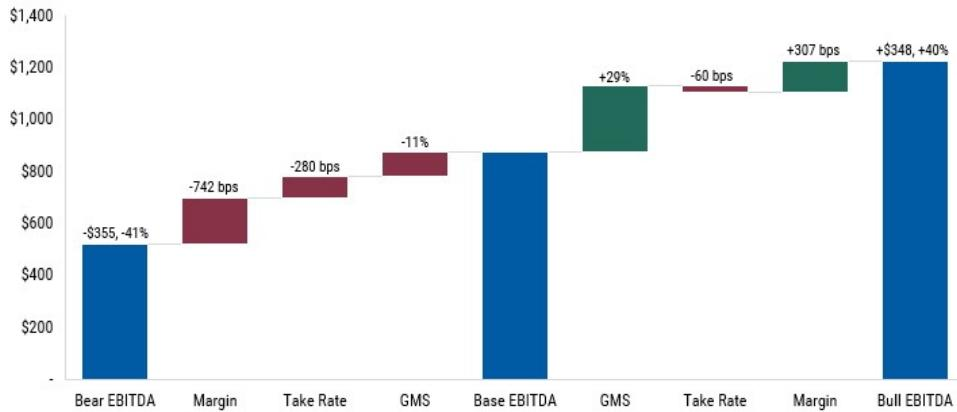

bar chart

| Category | Value ($) | Change (%) |
| :--- | :--- | :--- |
| Bear EBITDA | -355 | -41 |
| Margin | -742 | bps |
| Take Rate | -280 | bps |
| GMS | -11 | bps |
| Base EBITDA | | |
| GMS | +29 | |
| Take Rate | -60 | bps |
| Margin | +307 | bps |
| Bull EBITDA | +$348 | +40 |

Source: Company Reports, MS

## Bull Case: Onsite agentic improves search & discovery, driving up frequency and enabling marketing leverage

We see a very interesting opportunity for ETSY to be an agentic winner over the next few years. ETSY could uniquely benefit from agentic search as many buyers come with a mission in mind ("gift for my mom") rather than a specific item. The conversational nature of agentic allows buyers to refine what they are looking for far better than traditional search, which should drive up conversion rate. Onsite agentic features could lead to meaningful upside through higher conversion, fueling improved frequency. In our agentic bull case, this enables GMS growth to reaccelerate to HSD%-LDD% given the improved frequency, leading '30 GMS 29% above our base case. The improved frequency allows ETSY to gain leverage on its marketing with '30 EBITDA margin \~307 bps above our base case & leading '30 EBITDA dollars 40% ahead of our base case to \$1.2B.

Exhibit 21: ETSY in an Agentic Era - Bull Case

<table><tr><td rowspan="2"></td><td colspan="8">ETSY in an Agentic Era - Bull Case</td></tr><tr><td>2023</td><td>2024</td><td>2025</td><td>2026E</td><td>2027E</td><td>2028E</td><td>2029E</td><td>2030E</td></tr><tr><td>Non-Agentic GMS</td><td>13,161</td><td>12,587</td><td>11,917</td><td>10,681</td><td>10,854</td><td>10,855</td><td>10,585</td><td>10,137</td></tr><tr><td>Onsite Agentic GMS</td><td></td><td></td><td></td><td>178</td><td>486</td><td>1,156</td><td>2,311</td><td>3,822</td></tr><tr><td>Offsite Agentic GMS</td><td></td><td></td><td></td><td>45</td><td>122</td><td>289</td><td>578</td><td>956</td></tr><tr><td>Total GMS</td><td>13,161</td><td>12,587</td><td>11,917</td><td>10,904</td><td>11,462</td><td>12,300</td><td>13,475</td><td>14,915</td></tr><tr><td>y/y change</td><td></td><td>-4.4%</td><td>-5.3%</td><td>-8.5%</td><td>5.1%</td><td>7.3%</td><td>9.5%</td><td>10.7%</td></tr><tr><td>Agentic % of GMS</td><td></td><td></td><td></td><td>2%</td><td>5%</td><td>12%</td><td>21%</td><td>32%</td></tr><tr><td>% delta vs. base case</td><td></td><td></td><td></td><td>1%</td><td>4%</td><td>10%</td><td>19%</td><td>29%</td></tr><tr><td>Take Rate</td><td>20.9%</td><td>22.3%</td><td>24.2%</td><td>25.8%</td><td>26.0%</td><td>26.0%</td><td>25.9%</td><td>25.7%</td></tr><tr><td>y/y change (bps)</td><td></td><td>143</td><td>189</td><td>163</td><td>14</td><td>2</td><td>-11</td><td>-17</td></tr><tr><td>% delta vs. base case (bps)</td><td></td><td></td><td></td><td>-4</td><td>-10</td><td>-22</td><td>-40</td><td>-60</td></tr><tr><td>Non-Agentic Revenue</td><td>2,748</td><td>2,808</td><td>2,884</td><td>2,762</td><td>2,829</td><td>2,845</td><td>2,781</td><td>2,666</td></tr><tr><td>Onsite Agentic Revenue</td><td></td><td></td><td></td><td>46</td><td>127</td><td>303</td><td>607</td><td>1,005</td></tr><tr><td>Offsite Agentic Revenue</td><td></td><td></td><td></td><td>8</td><td>21</td><td>49</td><td>98</td><td>162</td></tr><tr><td>Revenue</td><td>2,748</td><td>2,808</td><td>2,884</td><td>2,816</td><td>2,976</td><td>3,197</td><td>3,486</td><td>3,834</td></tr><tr><td>y/y change</td><td></td><td>2.2%</td><td>2.7%</td><td>-2.3%</td><td>5.7%</td><td>7.4%</td><td>9.1%</td><td>10.0%</td></tr><tr><td>% delta vs. base case</td><td></td><td></td><td></td><td>1%</td><td>4%</td><td>9%</td><td>17%</td><td>26%</td></tr><tr><td>Variable Costs</td><td>792</td><td>742</td><td>790</td><td>755</td><td>806</td><td>876</td><td>969</td><td>1,082</td></tr><tr><td>Marketing Costs</td><td>733</td><td>833</td><td>900</td><td>804</td><td>841</td><td>886</td><td>939</td><td>997</td></tr><tr><td>Fixed Costs</td><td>564</td><td>570</td><td>580</td><td>483</td><td>505</td><td>526</td><td>553</td><td>585</td></tr><tr><td>Total Costs</td><td>2,089</td><td>2,145</td><td>2,270</td><td>2,043</td><td>2,151</td><td>2,289</td><td>2,462</td><td>2,664</td></tr><tr><td>Variable Costs % of GMS</td><td>6.0%</td><td>5.9%</td><td>6.6%</td><td>6.9%</td><td>7.0%</td><td>7.1%</td><td>7.2%</td><td>7.3%</td></tr><tr><td>Marketing Costs % of GMS</td><td>5.6%</td><td>6.6%</td><td>7.6%</td><td>7.4%</td><td>7.3%</td><td>7.2%</td><td>7.0%</td><td>6.7%</td></tr><tr><td>Fixed Costs % of GMS</td><td>4.3%</td><td>4.5%</td><td>4.9%</td><td>4.4%</td><td>4.4%</td><td>4.3%</td><td>4.1%</td><td>3.9%</td></tr><tr><td>Total Costs % of GMS</td><td>15.9%</td><td>17.0%</td><td>19.0%</td><td>18.7%</td><td>18.8%</td><td>18.6%</td><td>18.3%</td><td>17.9%</td></tr><tr><td>EBITDA</td><td>754</td><td>782</td><td>735</td><td>834</td><td>890</td><td>959</td><td>1,076</td><td>1,222</td></tr><tr><td>y/y change</td><td></td><td>3.6%</td><td>-6.0%</td><td>13.6%</td><td>6.7%</td><td>7.8%</td><td>12.2%</td><td>13.6%</td></tr><tr><td>% delta vs. base case</td><td></td><td></td><td></td><td>1%</td><td>5%</td><td>13%</td><td>25%</td><td>40%</td></tr><tr><td>EBITDA Margin</td><td>27.4%</td><td>27.8%</td><td>25.5%</td><td>29.6%</td><td>29.9%</td><td>30.0%</td><td>30.9%</td><td>31.9%</td></tr><tr><td>y/y change (bps)</td><td></td><td>38</td><td>-236</td><td>415</td><td>27</td><td>10</td><td>87</td><td>102</td></tr><tr><td>% delta vs. base case (bps)</td><td></td><td></td><td></td><td>12</td><td>46</td><td>109</td><td>200</td><td>307</td></tr></table>

Source: Company Data, MS

## Bear Case: ETSY loses its position as the aggregator for unique & special items, pressuring GMS and take rate

In this scenario, horizontal/offsite agents quickly gain traction. This disrupts ETSY's core value proposition as the aggregator of demand for bespoke & special items. Given ETSY's high take rates, sellers try and route demand to other channels (such as their own websites) where fees are lower - potentially undercutting on price. In addition, when sales are made through horizontal agents, ETSY doesn't get its lucrative ad revenue. Taken together, the bear case would have two major PnL impacts: GMS declines due to share loss & take rates are pressured given lower ad revenue. As a result, we model structural GMS declines with our '30 GMS -11% below our base case. The reduction in onsite ad revenue leads '30 take rate to be \~280 bps below our base case. That drives meaningful deleverage with '30 EBITDA margin falling to just 21.4% which puts EBITDA dollars -41% below our base case.

Exhibit 22: ETSY in an Agentic Era - Bear Case

<table><tr><td rowspan="2"></td><td colspan="8">ETSY in an Agentic Era - Bear Case</td></tr><tr><td>2023</td><td>2024</td><td>2025</td><td>2026E</td><td>2027E</td><td>2028E</td><td>2029E</td><td>2030E</td></tr><tr><td>Non-Agentic GMS</td><td>13,161</td><td>12,587</td><td>11,917</td><td>10,602</td><td>10,209</td><td>9,270</td><td>7,652</td><td>5,542</td></tr><tr><td>Onsite Agentic GMS</td><td></td><td></td><td></td><td>78</td><td>213</td><td>506</td><td>1,011</td><td>1,672</td></tr><tr><td>Offsite Agentic GMS</td><td></td><td></td><td></td><td>145</td><td>395</td><td>939</td><td>1,878</td><td>3,106</td></tr><tr><td>Total GMS</td><td>13,161</td><td>12,587</td><td>11,917</td><td>10,825</td><td>10,817</td><td>10,715</td><td>10,542</td><td>10,320</td></tr><tr><td>y/y change</td><td></td><td>-4.4%</td><td>-5.3%</td><td>-9.2%</td><td>-0.1%</td><td>-0.9%</td><td>-1.6%</td><td>-2.1%</td></tr><tr><td>Agentic % of GMS</td><td></td><td></td><td></td><td>2%</td><td>6%</td><td>13%</td><td>27%</td><td>46%</td></tr><tr><td>% delta vs. base case</td><td></td><td></td><td></td><td>0%</td><td>-2%</td><td>-4%</td><td>-7%</td><td>-11%</td></tr><tr><td>Take Rate</td><td>20.9%</td><td>22.3%</td><td>24.2%</td><td>25.7%</td><td>25.7%</td><td>25.4%</td><td>24.6%</td><td>23.5%</td></tr><tr><td>y/y change (bps)</td><td></td><td>143</td><td>189</td><td>155</td><td>-1</td><td>-33</td><td>-78</td><td>-112</td></tr><tr><td>% delta vs. base case (bps)</td><td></td><td></td><td></td><td>-12</td><td>-33</td><td>-81</td><td>-165</td><td>-280</td></tr><tr><td>Non-Agentic Revenue</td><td>2,748</td><td>2,808</td><td>2,884</td><td>2,742</td><td>2,661</td><td>2,429</td><td>2,010</td><td>1,458</td></tr><tr><td>Onsite Agentic Revenue</td><td></td><td></td><td></td><td>20</td><td>55</td><td>133</td><td>266</td><td>440</td></tr><tr><td>Offsite Agentic Revenue</td><td></td><td></td><td></td><td>25</td><td>67</td><td>160</td><td>319</td><td>528</td></tr><tr><td>Revenue</td><td>2,748</td><td>2,808</td><td>2,884</td><td>2,786</td><td>2,783</td><td>2,721</td><td>2,595</td><td>2,425</td></tr><tr><td>y/y change</td><td></td><td>2.2%</td><td>2.7%</td><td>-3.4%</td><td>-0.1%</td><td>-2.2%</td><td>-4.6%</td><td>-6.6%</td></tr><tr><td>% delta vs. base case</td><td></td><td></td><td></td><td>0%</td><td>-3%</td><td>-7%</td><td>-13%</td><td>-20%</td></tr><tr><td>Variable Costs</td><td>792</td><td>742</td><td>790</td><td>750</td><td>761</td><td>763</td><td>758</td><td>749</td></tr><tr><td>Marketing Costs</td><td>733</td><td>833</td><td>900</td><td>800</td><td>800</td><td>785</td><td>758</td><td>723</td></tr><tr><td>Fixed Costs</td><td>564</td><td>570</td><td>580</td><td>482</td><td>491</td><td>492</td><td>491</td><td>487</td></tr><tr><td>Total Costs</td><td>2,089</td><td>2,145</td><td>2,270</td><td>2,032</td><td>2,051</td><td>2,041</td><td>2,007</td><td>1,958</td></tr><tr><td>Variable Costs % of GMS</td><td>6.0%</td><td>5.9%</td><td>6.6%</td><td>6.9%</td><td>7.0%</td><td>7.1%</td><td>7.2%</td><td>7.3%</td></tr><tr><td>Marketing Costs % of GMS</td><td>5.6%</td><td>6.6%</td><td>7.6%</td><td>7.4%</td><td>7.4%</td><td>7.3%</td><td>7.2%</td><td>7.0%</td></tr><tr><td>Fixed Costs % of GMS</td><td>4.3%</td><td>4.5%</td><td>4.9%</td><td>4.5%</td><td>4.5%</td><td>4.6%</td><td>4.7%</td><td>4.7%</td></tr><tr><td>Total Costs % of GMS</td><td>15.9%</td><td>17.0%</td><td>19.0%</td><td>18.8%</td><td>19.0%</td><td>19.0%</td><td>19.0%</td><td>19.0%</td></tr><tr><td>EBITDA</td><td>754</td><td>782</td><td>735</td><td>815</td><td>797</td><td>731</td><td>640</td><td>519</td></tr><tr><td>y/y change</td><td></td><td>3.6%</td><td>-6.0%</td><td>11.0%</td><td>-2.2%</td><td>-8.3%</td><td>-12.5%</td><td>-18.9%</td></tr><tr><td>% delta vs. base case</td><td></td><td></td><td></td><td>-1%</td><td>-6%</td><td>-14%</td><td>-26%</td><td>-41%</td></tr><tr><td>EBITDA Margin</td><td>27.4%</td><td>27.8%</td><td>25.5%</td><td>29.3%</td><td>28.6%</td><td>26.9%</td><td>24.7%</td><td>21.4%</td></tr><tr><td>y/y change (bps)</td><td></td><td>38</td><td>-236</td><td>378</td><td>-61</td><td>-176</td><td>-223</td><td>-326</td></tr><tr><td>% delta vs. base case (bps)</td><td></td><td></td><td></td><td>-25</td><td>-80</td><td>-202</td><td>-421</td><td>-742</td></tr></table>

Source: Company Data, MS

## Risk Reward – Etsy Inc (ETSY.N)

Signs of Reacceleration on Very Depressed Comps

## PRICE TARGET \$64.00

Price target of \$64 implies \~7x 2027E EBITDA. Our price target is based on a DCF valuation with an 8.1% WACC and a 1.0% terminal growth rate (\~30% terminal EBITDA margin).

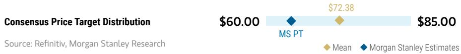

bar-line hybrid chart

| Category | Value   |
| -------- | ------- |
| Mean     | $60.00  |
| MS Estimates | $72.38  |
| Total    | $85.00  |

RISK REWARD CHART  
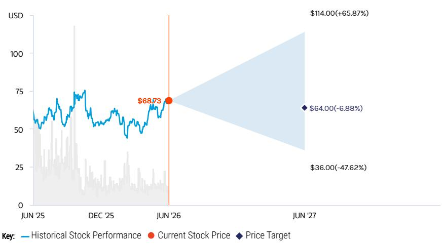

line chart

| Date    | Historical Stock Performance | Current Stock Price | Price Target |
|---------|-------------------------------|---------------------|--------------|
| JUN '25 | ~50                           | -                   | -            |
| DEC '25 | ~60                           | -                   | -            |
| JUN '26 | $68.73                        | $68.73              | -            |
| JUN '27 | -                             | $64.00 (-47.62%)    | $36.00       |
| Jun '27 | -                             | $114.00 (+65.87%)   | $64.00       |

Source: Refinitiv, MS

## EQUAL-WEIGHT THESIS

■ After struggling to find the bottom post-COVID, ETSY has reaccelerated through 2025 on easing comps & a less competitive ad market. With a more stable macro, we believe ETSY has returned to slightly positive core GMS growth.  
However, we still have fundamental concerns around core ETSY's low purchase frequency as \~50% of the buyers shop once per year with an average GMS per buyer of \~\$120. We are skeptical on its ability to improve this metric long-term, limiting its growth opportunity.  
■ Agentic commerce widens the risk-reward profile by creating greater opportunity for share gain, offset by take rate & margin risk.

Consensus Rating Distribution  
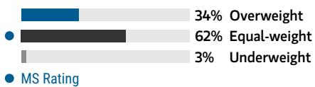

bar chart

| Category      | Value |
| ------------- | ----- |
| Overweight    | 34%   |
| Equal-weight  | 62%   |
| Underweight   | 3%    |
| MS Rating     | 3%    |

Source: Refinitiv, MS

## Risk Reward Themes

Secular Growth: Negative Technology Diffusion: Positive

View descriptions of Risk Rewards Themes here

## BULL CASE

## \$114.00

## BASE CASE

## \$64.00

## BEAR CASE

## \$36.00

## 11x Bull Case 2027E EV/EBITDA

Well-Crafted. Core GMS reacceleration proves sustainable as more balanced R&D starts to bend the retention curve, creating more stackable cohorts and reducing marketing spend. Following Depop's sale, we see a rebound to LSD top-line growth in '27 onwards with a \~3% top-line CAGR from FY25-FY30. Operating and marketing leverage enable high incremental margins with EBITDA margin rising to 32% by '27 and 35% long-term.

## 7x Base Case 2027E EV/EBITDA

Loose Threads. Our Base case assumes core Etsy growth is pressured post Depop, with a mix of slight buyer growth and frequency. With modest annual take rate expansion, this implies flat revenue CAGR from FY25-FY30. Reduced marketing expenditure post Depop sale leads to EBITDA margin reaching \~29% in '27, though limited forward conviction in top-line results in muted margin expansion to \~30% LT.

## 5x Bear Case 2027E EV/EBITDA

Unraveled. Struggles to drive retention & frequency worsen, leading to persistent core GMS declines. Agentic pressures take rates, leading to worse flow-through and pressures LTV/CAC. Lower revenue growth leads to less operating leverage while the company increases investment to try and recreate growth, keeping EBITDA margins at only \~26% in 2030.

## Risk Reward – Etsy Inc (ETSY.N)

KEY EARNINGS INPUTS

<table><tr><td>Drivers</td><td>2025</td><td>2026e</td><td>2027e</td><td>2028e</td></tr><tr><td>Core GMS growth (%)</td><td>(3.9)</td><td>3.4</td><td>1.8</td><td>1.7</td></tr><tr><td>LTM Active Buyers</td><td>93.5</td><td>87.2</td><td>87.8</td><td>88.4</td></tr><tr><td>EBITDA Margin (%)</td><td>25.5</td><td>29.5</td><td>29.4</td><td>28.9</td></tr><tr><td>GMS ($, mm)</td><td>11,916.9</td><td>10,815.0</td><td>11,007.2</td><td>11,190.4</td></tr></table>

## INVESTMENT DRIVERS

- Etsy's active sellers and buyers form a global online marketplace to buy and sell unique items.  
- Etsy's marketplace is relatively asset-light and does not contain any inventory risk.  
• Take rate has increased through new or improved seller services.

GLOBAL REVENUE EXPOSURE  
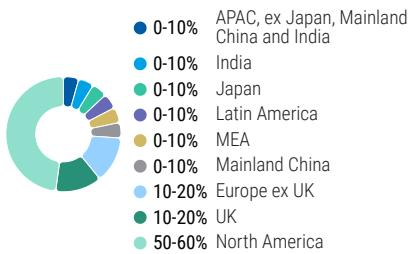

pie chart

| Region | Percentage (%) |
| :--- | :--- |
| APAC, ex Japan, Mainland China and India | 0-10 |
| India | 0-10 |
| Japan | 0-10 |
| Latin America | 0-10 |
| MEA | 0-10 |
| Mainland China | 0-10 |
| Europe ex UK | 10-20 |
| UK | 10-20 |
| North America | 50-60 |

Source: MS Estimate View explanation of regional hierarchies here

MS ALPHA MODELS

<table><tr><td>1/5BEST</td><td>24 MonthHorizon</td><td>1/5MOST</td><td>3 MonthHorizon</td></tr></table>

Source: Refinitiv, FactSet, MS; 1 is the highest favored Quintile and 5 is the least favored Quintile

## RISKS TO PT/RATING

## RISKS TO UPSIDE

- AI-powered improvements to search & discovery drive sustainable frequency gains  
- LTV/CAC expansion enables larger, stackable cohorts  
- Agentic commerce drives share gains by helping surface long-tail items

## RISKS TO DOWNSIDE

- 2025's core GMS improvement proves more tactical as ETSY struggles to maintain positive growth  
• A diminished LTV/CAC limits net adds  
- Agentic commerce increases competition, pressuring take rate

OWNERSHIP POSITIONING

<table><tr><td>Inst. Owners, % Active</td><td>40.6%</td><td></td><td></td><td></td></tr><tr><td>HF Sector Long/Short Ratio</td><td>1.7x</td><td></td><td></td><td></td></tr><tr><td>HF Sector Net Exposure</td><td>11.1%</td><td></td><td></td><td></td></tr></table>

Refinitiv; MSPB Content. Includes certain hedge fund exposures held with MSPB. Information may be inconsistent with or may not reflect broader market trends. Long/Short Ratio = Long Exposure / Short exposure. Sector % of Total Net Exposure = (For a particular sector: Long Exposure - Short Exposure) / (Across all sectors: Long Exposure – Short Exposure).

MS ESTIMATES VS. CONSENSUS  
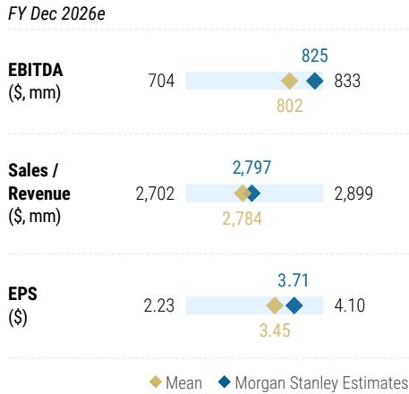

bar-line hybrid chart

| Metric           | Mean  | MS Estimates |
| ---------------- | ----- | ------------------------ |
| EBITDA ($, mm)   | 802   | 825                      |
| Sales / Revenue ($, mm) | 2,784 | 2,797                    |
| EPS ($)          | 3.45  | 3.71                     |

Source: Refinitiv, MS

## Risk Reward – eBay Inc (EBAY.O)

Sustaining Outsized GMV Growth

## PRICE TARGET \$121.00

We model EBAY using a discounted cash flow with a 7.5% WACC and a 2.0% perpetuity growth rate. This implies a \~16x FY27 adj. EPS multiple or \~13.4x '27 adj. EBITDA.

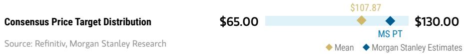

bar-line hybrid chart

| Category | Value     |
| -------- | --------- |
| Mean     | $107.87   |
| MS Estimates | $130.00   |

RISK REWARD CHART AND OPTIONS IMPLIED PROBABILITIES (12M)  
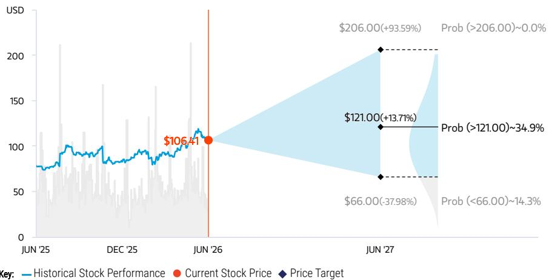

line chart

| Date     | Historical Stock Performance | Current Stock Price | Price Target |
| -------- | ----------------------------- | ------------------- | ------------ |
| JUN '25  | ~80                           | -                   | -            |
| DEC '25  | ~90                           | -                   | -            |
| JUN '26  | $106.41                       | $106.41             | -            |
| JUN '27  | -                             | $206.00(+93.59)%   | $206.00(-37.98)% |
| Prob (>206.00)~0.0% | -                         | $121.00(+13.71)%   | $66.00(-37.98)% |

Source: Refinitiv, MS, MS Institutional Equities Division. The probabilities of our Bull, Base, and Bear case scenarios playing out were estimated with implied volatility data from the options market as of 10 Jun 2026. All figures are approximate risk-neutral probabilities of the stock reaching beyond the scenario price in either three-months' or one-years' time. View explanation of Options Probabilities methodology here

## OVERWEIGHT THESIS

■ We believe EBAY has returned to durable GMV growth through an improved buyer experience stacking many small initiatives along with an easing competitive environment. GMV growth and take rate expansion should drive scale and lead to margin expansion.  
■ Each quarter of sustained, positive FXN GMV growth may help investors gain conviction in the MT growth story & help prove growth was not temporary/one-time.  
Despite similar growth profiles, EBAY trades at a discount to ETSY on '26 GAAP P/E which we believe provides justification for multiple expansion if EBAY executes.

Consensus Rating Distribution  
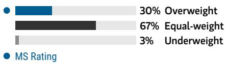

bar chart

| Category      | Value |
| ------------- | ----- |
| Overweight    | 30%   |
| Equal-weight  | 67%   |
| Underweight   | 3%    |

Source: Refinitiv, MS

## Risk Reward Themes

<table><tr><td>Contrarian:</td><td>Positive</td></tr><tr><td>Self-help:</td><td>Positive</td></tr><tr><td>Technology Diffusion:</td><td>Positive</td></tr></table>

View descriptions of Risk Rewards Themes here

## BULL CASE

## \~24x Bull 2027 adj. P/E

Vintage. In our bull case, EBAY's product development leads to meaningful innovation (assisted with AI-powered features) driving \~MSD-HSD positive GMV growth and slowing meaningful share losses. EBAY is able to leverage its cost base as a result and return to sustainable margin expansion. In this scenario, we assume a \~42% terminal EBITDA margin and a 2.8% perpetuity growth rate.

## \$206.00

## BASE CASE

## \$121.00

## \~18x Base 2027 adj. P/E

Refurbished. In our base case, EBAY's balance of horizontal and vertical improvements leads to sustainably positive GMV growth at a 5% CAGR from FY25-FY30. We expect adj. EBIT margin expansion due to improved customer experience, take rate expansion, and fixed cost leverage. With the help of a substantial buyback, adj. EPS grows at a +LDD CAGR. In this scenario, we assume a \~35% terminal EBITDA margin and a 2.0% perpetuity growth rate.

## BEAR CASE

## \$66.00

## \~11x Bear 2027 adj. P/E

Bidless. In our bear case, a consumer slowdown hurts key categories and pushes EBAY's growth flat with initiatives unable to offset. This leads to scale-based deleverage. In this scenario, we assume a \~32% terminal EBITDA margin and a 0.5% perpetuity growth rate.

## Risk Reward – eBay Inc (EBAY.O)

KEY EARNINGS INPUTS

<table><tr><td>Drivers</td><td>2025</td><td>2026e</td><td>2027e</td><td>2028e</td></tr><tr><td>Total GMV Y/Y Growth (ex-fx) (%)</td><td>5.8</td><td>8.4</td><td>4.7</td><td>3.9</td></tr><tr><td>Revenue ($, mm)</td><td>11,100</td><td>12,265</td><td>13,290</td><td>14,171</td></tr><tr><td>Non-GAAP EPS ($)</td><td>5.52</td><td>6.03</td><td>6.76</td><td>7.54</td></tr></table>

## INVESTMENT DRIVERS

- GMV growth  
• Take rate expansion  
- Enthusiast customer growth  
• EBITDA margin expansion

GLOBAL REVENUE EXPOSURE  
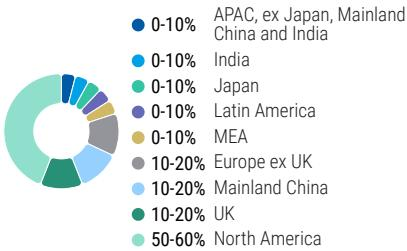

pie chart

| Region | Percentage (%) |
| :--- | :--- |
| APAC, ex Japan, Mainland China and India | 0-10 |
| India | 0-10 |
| Japan | 0-10 |
| Latin America | 0-10 |
| MEA | 0-10 |
| Europe ex UK | 10-20 |
| Mainland China | 10-20 |
| UK | 10-20 |
| North America | 50-60 |

Source: MS Estimate View explanation of regional hierarchies here

MS ALPHA MODELS  
  
Source: Refinitiv, FactSet, MS; 1 is the highest favored Quintile and 5 is the least favored Quintile

## RISKS TO PT/RATING

## RISKS TO UPSIDE

- eBay's strategy evolution drives \~HSD GMV growth and incremental margin  
- Take rate expansion happens enables better monetization, flowing primarily to the bottom line  
- AI-features drive sustainable growth and cost leverage

## RISKS TO DOWNSIDE

- The company's horizontal & focus category investments are unable to drive growth  
- EBAY has to further increase investment in an attempt to maintain growth

OWNERSHIP POSITIONING  
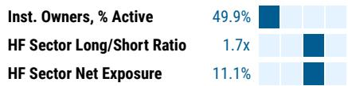

bar chart

| Category                  | Value  |
| ------------------------- | ------ |
| Inst. Owners, % Active    | 49.9%  |
| HF Sector Long/Short Ratio | 1.7x   |
| HF Sector Net Exposure    | 11.1%  |

Refinitiv; MSPB Content. Includes certain hedge fund exposures held with MSPB. Information may be inconsistent with or may not reflect broader market trends. Long/Short Ratio = Long Exposure / Short exposure. Sector % of Total Net Exposure = (For a particular sector: Long Exposure - Short Exposure) / (Across all sectors: Long Exposure – Short Exposure).

MS ESTIMATES VS. CONSENSUS  
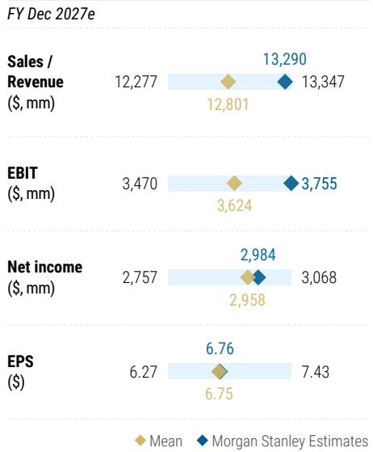

bar-line hybrid chart

FY Dec 2027e
| Metric | Mean ($) | MS Estimates ($) |
| :--- | :--- | :--- |
| Sales / Revenue ($, mm) | 12,277 | 13,290 |
| EBIT ($, mm) | 3,470 | 3,755 |
| Net income ($, mm) | 2,757 | 2,984 |
| EPS ($) | 6.27 | 6.76 |
| Sales / Revenue ($, mm) / EBIT ($, mm) | 12,801 | 13,347 |
| Net income ($, mm) / EPS ($) | 2,958 | 3,068 |
| EPS ($) / Net income ($) | 2,958 | 3,068 |
| Sales / Revenue ($, mm) / EPS ($) | 6.75 | 7.43 |

Source: Refinitiv, MS

## Risk Reward Reference links

1. View explanation of Options Probabilities methodology -  
Options\_Probabilities\_Exhibit\_Link.pdf  
2. View descriptions of Risk Rewards Themes - RR\_Themes\_Exhibit\_Link.pdf  
3. View explanation of regional hierarchies - GEG\_Exhibit\_Link.pdf  
4. View explanation of Theme/Exposure methodology -  
ESG\_Sustainable\_Solutions\_External\_Link.pdf  
5. View explanation of HERS methodology - ESG\_HERS\_External\_Link.pdf

## Disclosure Section

The information and opinions in MS were prepared by MS & Co. LLC, and/or MS C.T.V.M. S.A., and/or MS Mexico, Casa de Bolsa, S.A. de C.V., and/or MS Canada Limited. As used in this disclosure section, "MS" includes MS & Co. LLC, MS C.T.V.M. S.A., MS Mexico, Casa de Bolsa, S.A. de C.V., MS Canada Limited and their affiliates as necessary.

For important disclosures, stock price charts and equity rating histories regarding companies that are the subject of this report, please see the MS Disclosure Website at www.morganstanley.com/eqr/disclosures/webapp/generalresearch, or contact your investment representative or MS at 1585 Broadway, (Attention: Research Management), New York, NY, 10036 USA.

For valuation methodology and risks associated with any recommendation, rating or price target referenced in this research report, please contact the Client Support Team as follows: US/Canada +1 800 303-2495; Hong Kong +852 2848-5999; Latin America +1 718 754-5444 (U.S.); London +44 (0)20-7425-8169; Singapore +65 6834-6860; Sydney +61 (0)2-9770-1505; Tokyo +81 (0)3-6836-9000. Alternatively you may contact your investment representative or MS at 1585 Broadway, (Attention: Research Management), New York, NY 10036 USA.

## Analyst Certification

The following analysts hereby certify that their views about the companies and their securities discussed in this report are accurately expressed and that they have not received and will not receive direct or indirect compensation in exchange for expressing specific recommendations or views in this report: Nathan Feather; Brian Nowak, CFA.

## Global Research Conflict Management Policy

MS has been published in accordance with our conflict management policy, which is available at www.morganstanley.com/institutional/research/conflictpolicies. A Portuguese version of the policy can be found at www.morganstanley.com.br

## Important Regulatory Disclosures on Subject Companies

As of May 29, 2026, MS beneficially owned 1% or more of a class of common equity securities of the following companies covered in MS: Airbnb Inc, Alphabet Inc., Amazon.com Inc, AppLovin Corp, Booking Holdings Inc, Bumble Inc., Chewy Inc, Criteo SA, DoorDash Inc, DoubleVerify Holdings Inc, Duolingo Inc, eBay Inc, Electronic Arts Inc, Etsy Inc, Expedia Inc., Instacart, Lyft Inc, Match Group Inc, Meta Platforms Inc, Opendoor Technologies Inc, Peloton Interactive, Inc., Pinterest Inc, Reddit Inc, Roblox Corporation, Shutterstock Inc, Snap Inc., Take-Two Interactive Software, Trade Desk Inc, Uber Technologies Inc, Unity Software Inc, Webtoon Entertainment Inc, Yelp Inc, Zillow Group Inc.

Within the last 12 months, MS managed or co-managed a public offering (or 144A offering) of securities of Airbnb Inc, Alphabet Inc., Amazon.com Inc, Compass, Inc., eBay Inc, Match Group Inc, Meta Platforms Inc, Uber Technologies Inc.

Within the last 12 months, MS has received compensation for investment banking services from Airbnb Inc, Alphabet Inc., Amazon.com Inc, DoorDash Inc, eBay Inc, Instacart, Match Group Inc, Meta Platforms Inc, Reddit Inc, Uber Technologies Inc.

In the next 3 months, MS expects to receive or intends to seek compensation for investment banking services from Airbnb Inc, Alphabet Inc., Amazon.com Inc, AppLovin Corp, Booking Holdings Inc, Bumble Inc., Chewy Inc, Criteo SA, DoorDash Inc, DoubleVerify Holdings Inc, Duolingo Inc, eBay Inc, Electronic Arts Inc, Etsy Inc, Expedia Inc., FIGS, Inc., Instacart, Lyft Inc, Match Group Inc, Meta Platforms Inc, MNTN Inc, Opendoor Technologies Inc, Peloton Interactive, Inc., Pinterest Inc, Playtika Holding Corp, Reddit Inc, Revolve Group Inc, Roblox Corporation, Shutterstock Inc, Snap Inc., Take-Two Interactive Software, Trade Desk Inc, Uber Technologies Inc, Unity Software Inc, Webtoon Entertainment Inc, Yelp Inc, Zillow Group Inc.

Within the last 12 months, MS has received compensation for products and services other than investment banking services from Airbnb Inc, Alphabet Inc., Amazon.com Inc, Booking Holdings Inc, DoorDash Inc, eBay Inc, Electronic Arts Inc, Expedia Inc., Match Group Inc, Meta Platforms Inc, Pinterest Inc, Reddit Inc, Revolve Group Inc, Take-Two Interactive Software, Uber Technologies Inc, WW International Inc, Zillow Group Inc.

Within the last 12 months, MS has provided or is providing investment banking services to, or has an investment banking client relationship with, the following company: Airbnb Inc, Alphabet Inc., Amazon.com Inc, AppLovin Corp, Booking Holdings Inc, Bumble Inc., Chewy Inc, Compass, Inc., Criteo SA, DoorDash Inc, DoubleVerify Holdings Inc, Duolingo Inc, eBay Inc, Electronic Arts Inc, Etsy Inc, Expedia Inc., FIGS, Inc., Instacart, Lyft Inc, Match Group Inc, Meta Platforms Inc, MNTN Inc, Opendoor Technologies Inc, Peloton Interactive, Inc., Pinterest Inc, Playtika Holding Corp, Reddit Inc, Revolve Group Inc, Roblox Corporation, Shutterstock Inc, Snap Inc., Take-Two Interactive Software, Trade Desk Inc, Uber Technologies Inc, Unity Software Inc, Webtoon Entertainment Inc, Yelp Inc, Zillow Group Inc.

Within the last 12 months, MS has either provided or is providing non-investment banking, securities-related services to and/or in the past has entered into an agreement to provide services or has a client relationship with the following company: Airbnb Inc, Alphabet Inc., Amazon.com Inc, AppLovin Corp, Booking Holdings Inc, DoorDash Inc, eBay Inc, Electronic Arts Inc, Etsy Inc, Expedia Inc., Lyft Inc, Match Group Inc, Meta Platforms Inc, Opendoor Technologies Inc, Pinterest Inc, Playtika Holding Corp, Reddit Inc, Revolve Group Inc, Snap Inc., Take-Two Interactive Software, Uber Technologies Inc, WW International Inc, Zillow Group Inc.

An employee, director or consultant of MS is a director of eBay Inc. This person is not a research analyst or a member of a research analyst's household.

MS & Co. LLC makes a market in the securities of Bumble Inc., Criteo SA, DoubleVerify Holdings Inc, Expedia Inc., FIGS, Inc., Grindr Inc., Playtika Holding Corp, Revolve Group Inc, Shutterstock Inc, Webtoon Entertainment Inc, Yelp Inc, Zillow Group Inc.

The equity research analysts or strategists principally responsible for the preparation of MS have received compensation based upon various factors, including quality of research, investor client feedback, stock picking, competitive factors, firm revenues and overall investment banking revenues. Equity Research analysts' or strategists' compensation is not linked to investment banking or capital markets transactions performed by MS or the profitability or revenues of particular trading desks.

MS and its affiliates do business that relates to companies/instruments covered in MS, including market making, providing liquidity, fund management, commercial banking, extension of credit, investment services and investment banking. MS sells to and buys from customers the securities/instruments of companies covered in MS on a principal basis. MS may have a position in the debt of the Company or instruments discussed in this report. MS trades or may trade as principal in the debt securities (or in related derivatives) that are the subject of the debt research report.

Certain disclosures listed above are also for compliance with applicable regulations in non-US jurisdictions.

## STOCK RATINGS

MS uses a relative rating system using terms such as Overweight, Equal-weight, Not-Rated or Underweight (see definitions below). MS does not assign ratings of Buy, Hold or Sell to the stocks we cover. Overweight, Equal-weight, Not-Rated and Underweight are not the equivalent of buy, hold and sell. Investors should carefully read the definitions of all ratings used in MS. In addition, since MS contains more complete information concerning the analyst's views, investors should carefully read MS, in its entirety, and not infer the contents from the rating alone. In any case, ratings (or research) should not be used or relied upon as investment advice. An investor's decision to buy or sell a stock should depend on individual circumstances (such as the investor's existing holdings) and other considerations.

## Global Stock Ratings Distribution

(as of May 31, 2026)

The Stock Ratings described below apply to MS's Fundamental Equity Research and do not apply to Debt Research produced by the Firm.

For disclosure purposes only (in accordance with FINRA requirements), we include the category headings of Buy, Hold, and Sell alongside our ratings of Overweight, Equal-weight, Not-Rated and Underweight. MS does not assign ratings of Buy, Hold or Sell to the stocks we cover. Overweight, Equal-weight, Not-Rated and Underweight are not the equivalent of buy, hold, and sell but represent recommended relative weightings (see definitions below). To satisfy regulatory requirements, we correspond Overweight, our most positive stock rating, with a buy recommendation; we correspond Equal-weight and Not-Rated to hold and Underweight to sell recommendations, respectively.

<table><tr><td></td><td colspan="2">Coverage Universe</td><td colspan="3">Investment Banking Clients (IBC)</td><td colspan="2">Other Material Investment ServicesClients (MISC)</td></tr><tr><td>Stock RatingCategory</td><td>Count</td><td>% of Total</td><td>Count</td><td>% of Total IBC</td><td>% of RatingCategory</td><td>Count</td><td>% of Total OtherMISC</td></tr><tr><td>Overweight/Buy</td><td>1542</td><td>42%</td><td>465</td><td>51%</td><td>30%</td><td>707</td><td>43%</td></tr><tr><td>Equal-weight/Hold</td><td>1571</td><td>43%</td><td>369</td><td>40%</td><td>23%</td><td>723</td><td>44%</td></tr><tr><td>Not-Rated/Hold</td><td>3</td><td>0%</td><td>0</td><td>0%</td><td>0%</td><td>1</td><td>0%</td></tr><tr><td>Underweight/Sell</td><td>551</td><td>15%</td><td>86</td><td>9%</td><td>16%</td><td>201</td><td>12%</td></tr><tr><td>Total</td><td>3,667</td><td></td><td>920</td><td></td><td></td><td>1632</td><td></td></tr></table>

Data include common stock and ADRs currently assigned ratings. Investment Banking Clients are companies from whom MS received investment banking compensation in the last 12 months. Due to rounding off of decimals, the percentages provided in the "% of total" column may not add up to exactly 100 percent.

## Analyst Stock Ratings

Overweight (O). The stock's total return is expected to exceed the average total return of the analyst's industry (or industry team's) coverage universe, on a risk-adjusted basis, over the next 12-18 months.

Equal-weight (E). The stock's total return is expected to be in line with the average total return of the analyst's industry (or industry team's) coverage universe, on a risk-adjusted basis, over the next 12-18 months.

Not-Rated (NR). Currently the analyst does not have adequate conviction about the stock's total return relative to the average total return of the analyst's industry (or industry team's) coverage universe, on a risk-adjusted basis, over the next 12-18 months.

Underweight (U). The stock's total return is expected to be below the average total return of the analyst's industry (or industry team's) coverage universe, on a risk-adjusted basis, over the next 12-18 months.

Unless otherwise specified, the time frame for price targets included in MS is 12 to 18 months.

## Analyst Industry Views

Attractive (A): The analyst expects the performance of his or her industry coverage universe over the next 12-18 months to be attractive vs. the relevant broad market benchmark, as indicated below.

In-Line (I): The analyst expects the performance of his or her industry coverage universe over the next 12-18 months to be in line with the relevant broad market benchmark, as indicated below. Cautious (C): The analyst views the performance of his or her industry coverage universe over the next 12-18 months with caution vs. the relevant broad market benchmark, as indicated below. Benchmarks for each region are as follows: North America - S&P 500; Latin America - relevant MSCI country index or MSCI Latin America Index; Europe - MSCI Europe; Japan - TOPIX; Asia - relevant MSCI country index or MSCI sub-regional index or MSCI AC Asia Pacific ex Japan Index.

## Stock Price, Price Target and Rating History (See Rating Definitions)

eBay Inc (EBAY.0) - As of 06/11/26 GMT in USD
Industry : Internet  
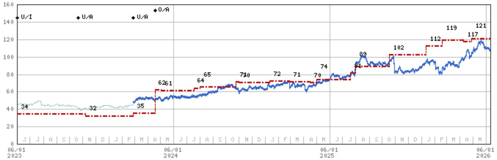

line chart

| Date       | Value |
| ---------- | ----- |
| 06/01 2023 | 34    |
|            | 32    |
|            | 35    |
|            | 62    |
|            | 61    |
|            | 64    |
|            | 65    |
|            | 71    |
|            | 72    |
|            | 71    |
|            | 70    |
|            | 74    |
|            | 89    |
|            | 102   |
|            | 112   |
|            | 119   |
|            | 117   |
|            | 121   |

Stock Rating History: 6/1/21 : E/I; 6/24/21 : NA/I; 6/23/22 : U/I; 10/22/23 : U/A; 2/28/24 : U/A; 4/18/24 : O/A  
Price Target History: 2/4/21 : 63; 6/24/21 : NA; 6/23/22 : 36; 8/3/22 : 37; 10/24/22 : 33; 11/3/22 : 34; 1/17/23 : 32; 2/27/23 : 33;  
4/26/23 : 34; 11/8/23 : 32; 2/28/24 : 35; 4/18/24 : 62; 5/2/24 : 61; 7/18/24 : 64; 8/1/24 : 65; 10/25/24 : 71; 10/31/24 : 70;  
1/12/25 : 72; 2/27/25 : 71; 4/16/25 : 70; 5/1/25 : 74; 7/20/25 : 81; 7/31/25 : 89; 10/19/25 : 102; 1/12/26 : 112; 2/19/26 : 119;  
4/9/26 : 117; 4/29/26 : 121  
Source: MS Date Format : MM/DD/YY Price Target = No Price Target Assigned (NA)  
Stock Price (Not Covered by Current Analyst) — Stock Price (Covered by Current Analyst)  
Stock and Industry Ratings (abbreviations below) appear as ♦ Stock Rating/Industry View  
Stock Ratings: Overweight (O) Equal-weight (E) Underweight (U) Not-Rated (NR) No Rating Available (NA)  
Industry View: Attractive (A) In-line (I) Cautious (C) No Rating (NR)  
Effective January 13, 2014, the stocks covered by MS Asia Pacific will be rated relative to the analyst's industry (or industry team's) coverage.  
Effective January 13, 2014, the industry view benchmarks for MS Asia Pacific are as follows: relevant MSCI country index or MSCI sub-regional index or MSCI AC Asia Pacific ex Japan Index.

Etsy Inc (ETSY.N) - As of 06/11/26 GMT in USD
Industry : Internet  
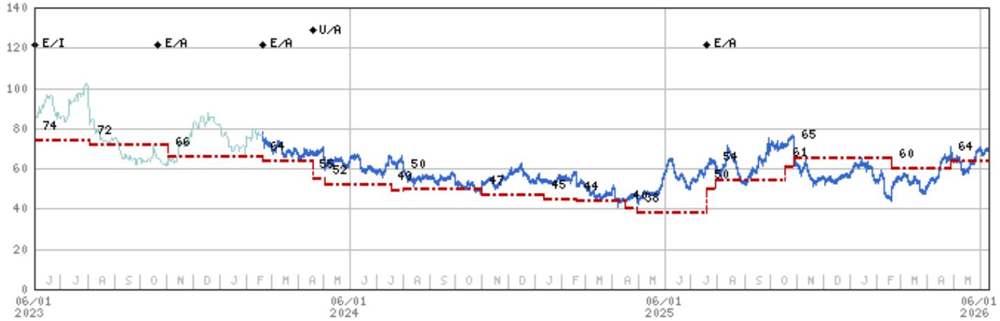

line chart

| Date | Value |
| --- | --- |
| 06/01 | 74 |
| 06/01 | 72 |
| 06/01 | 66 |
| 06/01 | 64 |
| 06/01 | 58 |
| 06/01 | 52 |
| 06/01 | 49 |
| 06/01 | 50 |
| 06/01 | 47 |
| 06/01 | 45 |
| 06/01 | 44 |
| 06/01 | 45 |
| 06/01 | 45 |
| 06/01 | 45 |
| 06/01 | 45 |
| 06/01 | 45 |
| 06/01 | 45 |
| 06/01 | 45 |
| 06/01 | 45 |

Stock Rating History: 6/1/21 : U/I; 8/4/21 : E/I; 10/22/23 : E/A; 2/21/24 : E/A; 4/18/24 : U/A; 7/20/25 : E/A  
Price Target History: 5/5/21 : 135; 8/4/21 : 163; 11/4/21 : 179; 1/19/22 : 154; 5/4/22 : 113; 7/27/22 : 83; 10/24/22 : 75;  
11/2/22 : 76; 1/17/23 : 75; 2/22/23 : 74; 5/3/23 : 79; 5/15/23 : 74; 8/3/23 : 72; 11/2/23 : 66; 2/21/24 : 64; 4/18/24 : 55;  
5/2/24 : 52; 7/18/24 : 49; 8/1/24 : 50; 10/31/24 : 47; 1/12/25 : 45; 2/19/25 : 44; 4/16/25 : 40; 4/30/25 : 38; 7/20/25 : 50;  
7/30/25 : 54; 10/19/25 : 61; 10/29/25 : 65; 2/19/26 : 60; 4/29/26 : 64  
Source: MS Date Format : MM/DD/YY Price Target No Price Target Assigned (NA)  
Stock Price (Not Covered by Current Analyst) — Stock Price (Covered by Current Analyst)  
Stock and Industry Ratings (abbreviations below) appear as ♦ Stock Rating/Industry View  
Stock Ratings: Overweight (O) Equal-weight (E) Underweight (U) Not-Rated (NR) No Rating Available (NA)  
Industry View: Attractive (A) In-line (I) Cautious (C) No Rating (NR)  
Effective January 13, 2014, the stocks covered by MS Asia Pacific will be rated relative to the analyst's industry (or industry team's) coverage.  
Effective January 13, 2014, the industry view benchmarks for MS Asia Pacific are as follows: relevant MSCI country index or MSCI sub-regional index or MSCI AC Asia Pacific ex Japan Index.

## Important Disclosures for MS Smith Barney LLC Customers

Important disclosures regarding any material conflict of interest that can reasonably be expected to have influenced MS Smith Barney LLC's choice of a third-party research provider or the subject company of a third-party research report, are available on the MS Wealth Management disclosure website at www.morganstanley.com/online/researchdisclosures. For MS specific disclosures, you may refer to https://www.morganstanley.com/eqr/disclosures/webapp/generalresearch.

Each MS report is reviewed and approved on behalf of MS Smith Barney LLC. This review and approval is conducted by the same person who reviews the research report on behalf of MS. This could create a conflict of interest.

## Other Important Disclosures

A member of Research who had or could have had access to the research prior to completion owns securities (or related derivatives) in the Uber Technologies Inc. This person is not a research analyst or a member of research analyst's household.

MS policy is to update research reports as and when the Research Analyst and Research Management deem appropriate, based on developments with the issuer, the sector, or the market that may have a material impact on the research views or opinions stated therein. In addition, certain Research publications are intended to be updated on a regular periodic basis (weekly/monthly/quarterly/annual) and will ordinarily be updated with that frequency, unless the Research Analyst and Research Management determine that a different publication schedule is appropriate based on current conditions.

MS is not acting as a municipal advisor and the opinions or views contained herein are not intended to be, and do not constitute, advice within the meaning of Section 975 of the Dodd-Frank Wall Street Reform and Consumer Protection Act.

MS produces an equity research product called a "Tactical Idea." Views contained in a "Tactical Idea" on a particular stock may be contrary to the recommendations or views expressed in research on the same stock. This may be the result of differing time horizons, methodologies, market events, or other factors. For all research available on a particular stock, please contact your sales representative or go to Matrix at http://www.morganstanley.com/matrix.

MS is provided to our clients through our proprietary research portal on Matrix and also distributed electronically by MS to clients. Certain, but not all, MS products are also made available to clients through third-party vendors or redistributed to clients through alternate electronic means as a convenience. For access to all available MS, please contact your sales representative or go to Matrix at http://www.morganstanley.com/matrix.

Any access and/or use of MS is subject to MS's Terms of Use (http://www.morganstanley.com/terms.html). By accessing and/or using MS, you are indicating that you have read and agree to be bound by our Terms of Use (http://www.morganstanley.com/terms.html). In addition you consent to MS processing your personal data and using cookies in accordance with our Privacy Policy and our Global Cookies Policy (http://www.morganstanley.com/privacy\_pledge.html), including for the purposes of setting your preferences and to collect readership data so that we can deliver better and more personalized service and products to you. To find out more information about how MS processes personal data, how we use cookies and how to reject cookies see our Privacy Policy and our Global Cookies Policy (http://www.morganstanley.com/privacy\_pledge.html). Please use the provided link to review the Terms and Conditions and Most Important Terms and Conditions for MS India Company Private Limited (https://www.morganstanley.com/assets/pdfs/about-us-global-offices/india/Terms\_and\_conditions.pdf) and the following link to review the audit report (https://ny.matrix.ms.com/eqr/research/webapp/researchdocs/MSICPL\_Morgan\_Stanley\_Research\_Audit\_Report.pdf).

If you do not agree to our Terms of Use and/or if you do not wish to provide your consent to MS processing your personal data or using cookies please do not access our research. MS does not provide individually tailored investment advice. MS has been prepared without regard to the circumstances and objectives of those who receive it. MS recommends that investors independently evaluate particular investments and strategies, and encourages investors to seek the advice of a financial adviser. The appropriateness of an investment or strategy will depend on an investor's circumstances and objectives. The securities, instruments, or strategies discussed in MS may not be suitable for all investors, and certain investors may not be eligible to purchase or participate in some or all of them. MS is not an offer to buy or sell or the solicitation of an offer to buy or sell any security/instrument or to participate in any particular trading strategy. The value of and income from your investments may vary because of changes in interest rates, foreign exchange rates, default rates, prepayment rates, securities/instruments prices, market indexes, operational or financial conditions of companies or other factors. There may be time limitations on the exercise of options or other rights in securities/instruments transactions. Past performance is not necessarily a guide to future performance. Estimates of future performance are based on assumptions that may not be realized. If provided, and unless otherwise stated, the closing price on the cover page is that of the primary exchange for the subject company's securities/instruments.

The fixed income research analysts, strategists or economists principally responsible for the preparation of MS have received compensation based upon various factors, including quality, accuracy and value of research, firm profitability or revenues (which include fixed income trading and capital markets profitability or revenues), client feedback and competitive factors. Fixed Income Research analysts', strategists' or economists' compensation is not linked to investment banking or capital markets transactions performed by MS or the profitability or revenues of particular trading desks.

The "Important Regulatory Disclosures on Subject Companies" section in MS lists all companies mentioned where MS owns 1% or more of a class of common equity securities of the companies. For all other companies mentioned in MS, MS may have an investment of less than 1% in securities/instruments or derivatives of securities/instruments of companies and may trade them in ways different from those discussed in MS. Employees of MS not involved in the preparation of MS may have investments in securities/instruments or derivatives of securities/instruments of companies mentioned and may trade them in ways different from those discussed in MS. Derivatives may be issued by MS or associated persons.

With the exception of information regarding MS, MS is based on public information. MS makes every effort to use reliable, comprehensive information, but we make no representation that it is accurate or complete. We have no obligation to tell you when opinions or information in MS change apart from when we intend to discontinue equity research coverage of a subject company. Facts and views presented in MS have not been reviewed by, and may not reflect information known to, professionals in other MS business areas, including investment banking personnel.

MS personnel may participate in company events such as site visits and are generally prohibited from accepting payment by the company of associated expenses unless pre-approved by authorized members of Research management.

MS may make investment decisions that are inconsistent with the recommendations or views in this report.

To our readers based in Taiwan or trading in Taiwan securities/instruments: Information on securities/instruments that trade in Taiwan is distributed by MS Taiwan Limited ("MSTL"). Such information is for your reference only. The reader should independently evaluate the investment risks and is solely responsible for their investment decisions. MS may not be distributed to the public media or quoted or used by the public media without the express written consent of MS. Any non-customer reader within the scope of Article 7-1 of the Taiwan Stock Exchange Recommendation Regulations accessing and/or receiving MS is not permitted to provide MS to any third party (including but not limited to related parties, affiliated companies and any other third parties) or engage in any activities regarding MS which may create or give the appearance of creating a conflict of interest. Information on securities/instruments that do not trade in Taiwan is for informational purposes only and is not to be construed as a recommendation or a solicitation to trade in such securities/instruments. MSTL may not execute transactions for clients in these securities/instruments.

MS is not incorporated under PRC law and the research in relation to this report is conducted outside the PRC. MS does not constitute an offer to sell or the solicitation of an offer to buy any securities in the PRC. PRC investors shall have the relevant qualifications to invest in such securities and shall be responsible for obtaining all relevant approvals, licenses, verifications and/or registrations from the relevant governmental authorities themselves. Neither this report nor any part of it is intended as, or shall constitute, provision of any consultancy or advisory service of securities investment as defined under PRC law. Such information is provided for your reference only.

MS is disseminated in Brazil by MS C.T.V.M. S.A. located at Av. Brigadeiro Faria Lima, 3600, 6th floor, São Paulo - SP, Brazil; and is regulated by the Comissão de Valores Mobiliários; in Mexico by MS México, Casa de Bolsa, S.A. de C.V which is regulated by Comision Nacional Bancaria y de Valores. Paseo de los Tamarindos 90, Torre 1, Col. Bosques de las Lomas Floor 29, 05120 Mexico City; in Japan by MS MUFG Securities Co., Ltd. and, for Commodities related research reports only, MS Capital Group Japan Co., Ltd; in Hong Kong by MS Asia Limited (which accepts responsibility for its contents) and by MS Bank Asia Limited; in Singapore by MS Asia (Singapore) Pte. (Registration number 199206298Z) and/or MS Asia (Singapore) Securities Pte Ltd (Registration number 200008434H), regulated by the Monetary Authority of Singapore (which accepts legal responsibility for its contents and should be contacted with respect to any matters arising from, or in connection with, MS) and by MS Bank Asia Limited, Singapore Branch (Registration number T14FC0118); in Australia to "wholesale clients" within the meaning of the Australian Corporations Act by MS Australia Limited A.B.N. 67 003 734 576, holder of Australian financial services license No. 233742, which accepts responsibility for its contents; in Australia to "wholesale clients" and "retail clients" within the meaning of the Australian Corporations Act by MS Wealth Management Australia Pty Ltd (A.B.N. 19 009 145 555, holder of Australian financial services license No. 240813, which accepts responsibility for its contents; in Korea by MS & Co International plc, Seoul Branch; in India by MS India Company Private Limited having Corporate Identification No (CIN) U22990MH1998PTC115305, regulated by the Securities and Exchange Board of India ("SEBI") and holder of licenses as a Research Analyst (SEBI Registration No. INH000001105); Stock Broker (SEBI Stock Broker Registration No. INZ000244438), Merchant Banker (SEBI Registration No. INM000011203), and depository participant with National Securities Depository Limited (SEBI Registration No. IN-DP-NSDL-567-2021) having registered office at Altimus, Level 39 & 40, Pandurang Budhkar Marg, Worli, Mumbai 400018, India; Telephone no. +91-22-61181000; Compliance Officer Details: Mr. Tejarshi Hardas, Tel. No.: +91-22-61181000 or Email: tejarshi.hardas@morganstanley.com; Grievance officer details: Mr. Tejarshi Hardas, Tel. No.: +91-22-61181000 or Email: msic-compliance@morganstanley.com. MS India Company Private Limited (MSICPL) may use AI tools in providing research services. All recommendations contained herein are made by the duly qualified research analysts; in Canada by MS Canada Limited; in Germany and the European Economic Area where required by MS Europe S.E., authorised and regulated by Bundesanstalt fuer Finanzdienstleistungsaufsicht (BaFin) under the reference number 149169; in the US by MS & Co. LLC, which accepts responsibility for its contents. MS & Co. International plc, authorized by the Prudential Regulation Authority and regulated by the Financial Conduct Authority and the Prudential Regulation Authority, disseminates in the UK research that it has prepared, and research which has been prepared by any of its affiliates, only to persons who (i) are investment professionals falling within Article 19(5) of the Financial Services and Markets Act 2000 (Financial Promotion) Order 2005 (as amended, the "Order"); (ii) are persons who are high net worth entities falling within Article 49(2)(a) to (d) of the Order; or (iii) are persons to whom an invitation or inducement to engage in investment activity (within the meaning of section 21 of the Financial Services and Markets Act 2000, as amended) may otherwise lawfully be communicated or caused to be communicated. RMB MS Proprietary Limited is a member of the JSE Limited and A2X (Pty) Ltd. RMB MS Proprietary Limited is a joint venture owned equally by MS International Holdings Inc. and RMB Investment Advisory (Proprietary) Limited, which is wholly owned by FirstRand Limited. The information in MS is being disseminated by MS Saudi Arabia, regulated by the Capital Market Authority in the Kingdom of Saudi Arabia, and is directed at Sophisticated investors only.

The information in MS is being communicated by MS & Co. International plc (DIFC Branch), regulated by the Dubai Financial Services Authority (the DFSA) or by MS & Co. International plc (ADGM Branch), regulated by the Financial Services Regulatory Authority Abu Dhabi (the FSRA), and is directed at Professional Clients only, as defined by the DFSA or the FSRA, respectively. The financial products or financial services to which this research relates will only be made available to a customer who we are satisfied meets the regulatory criteria of a Professional Client. A distribution of the different MS Research ratings or recommendations, in percentage terms for Investments in each sector covered, is available upon request from your sales representative.

The information in MS is being communicated by MS & Co. International plc (QFC Branch), regulated by the Qatar Financial Centre Regulatory Authority (the QFCRA), and is directed at business customers and market counterparties only and is not intended for Retail Customers as defined by the QFCRA.

As required by the Capital Markets Board of Turkey, investment information, comments and recommendations stated here, are not within the scope of investment advisory activity. Investment advisory service is provided exclusively to persons based on their risk and income preferences by the authorized firms. Comments and recommendations stated here are general in nature. These opinions may not fit to your financial status, risk and return preferences. For this reason, to make an investment decision by relying solely to this information stated here may not bring about outcomes that fit your expectations.

The trademarks and service marks contained in MS are the property of their respective owners. Third-party data providers make no warranties or representations relating to the accuracy, completeness, or timeliness of the data they provide and shall not have liability for any damages relating to such data. The Global Industry Classification Standard (GICS) was developed by and is the exclusive property of MSCI and S&P.

MS, or any portion thereof may not be reprinted, sold or redistributed without the written consent of MS.

Indicators and trackers referenced in MS may not be used as, or treated as, a benchmark under Regulation EU 2016/1011, or any other similar framework.

The issuers and/or fixed income products recommended or discussed in certain fixed income research reports may not be continuously followed. Accordingly, investors should regard those fixed income research reports as providing stand-alone analysis and should not expect continuing analysis or additional reports relating to such issuers and/or individual fixed income products. MS may hold, from time to time, material financial and commercial interests regarding the company subject to the Research report.

Registration granted by SEBI and certification from the National Institute of Securities Markets (NISM) in no way guarantee performance of the intermediary or provide any assurance of returns to investors. Investment in securities market are subject to market risks. Read all the related documents carefully before investing.

INDUSTRY COVERAGE: Internet

<table><tr><td>COMPANY (TICKER)</td><td>RATING (AS OF)</td><td>PRICE* (06/10/2026)</td></tr><tr><td>Brian Nowak, CFA</td><td></td><td></td></tr><tr><td>Airbnb Inc (ABNB.O)</td><td>U (12/06/2022)</td><td>$129.10</td></tr><tr><td>Alphabet Inc. (GOOGL.O)</td><td>O (08/11/2015)</td><td>$356.38</td></tr><tr><td>Amazon.com Inc (AMZN.O)</td><td>O (04/24/2015)</td><td>$238.00</td></tr><tr><td>Booking Holdings Inc (BKNG.O)</td><td>O (02/23/2026)</td><td>$160.64</td></tr><tr><td>DoorDash Inc (DASH.O)</td><td>O (02/21/2024)</td><td>$151.00</td></tr><tr><td>Expedia Inc. (EXPE.O)</td><td>E (01/09/2019)</td><td>$218.94</td></tr><tr><td>Instacart (CART.O)</td><td>E (01/29/2024)</td><td>$41.21</td></tr><tr><td>Lyft Inc (LYFT.O)</td><td>E (10/24/2019)</td><td>$13.39</td></tr><tr><td>Meta Platforms Inc (META.O)</td><td>O (03/20/2023)</td><td>$570.98</td></tr><tr><td>Pinterest Inc (PINS.N)</td><td>O (07/20/2025)</td><td>$21.77</td></tr><tr><td>Reddit Inc (RDDT.N)</td><td>O (12/08/2024)</td><td>$172.21</td></tr><tr><td>Snap Inc. (SNAP.N)</td><td>E (07/22/2024)</td><td>$5.38</td></tr><tr><td>Uber Technologies Inc (UBER.N)</td><td>O (06/04/2019)</td><td>$68.61</td></tr><tr><td colspan="3">Matthew Cost</td></tr><tr><td>AppLovin Corp (APP.O)</td><td>O (04/10/2025)</td><td>$492.98</td></tr><tr><td>Compass, Inc. (COMP.N)</td><td>E (01/12/2026)</td><td>$7.91</td></tr><tr><td>Criteo SA (CRTO.O)</td><td>E (01/26/2016)</td><td>$17.63</td></tr><tr><td>DoubleVerify Holdings Inc (DV.N)</td><td>E (06/25/2024)</td><td>$10.32</td></tr><tr><td>Electronic Arts Inc (EA.O)</td><td>E (08/04/2021)</td><td>$203.20</td></tr><tr><td>MNTN Inc (MNTN.N)</td><td>E (06/16/2025)</td><td>$8.53</td></tr><tr><td>Opendoor Technologies Inc (OPEN.O)</td><td>E (07/24/2023)</td><td>$4.48</td></tr><tr><td>Playtika Holding Corp (PLTK.O)</td><td>E (11/27/2022)</td><td>$3.15</td></tr><tr><td>Roblox Corporation (RBLX.N)</td><td>O (11/04/2024)</td><td>$41.50</td></tr><tr><td>Shutterstock Inc (SSTK.N)</td><td>E (07/28/2022)</td><td>$13.70</td></tr><tr><td>Take-Two Interactive Software (TTWO.O)</td><td>O (02/01/2018)</td><td>$210.46</td></tr><tr><td>Trade Desk Inc (TTD.O)</td><td>E (09/10/2025)</td><td>$19.29</td></tr><tr><td>Unity Software Inc (U.N)</td><td>O (09/02/2024)</td><td>$26.66</td></tr><tr><td>Webtoon Entertainment Inc (WBTN.O)</td><td>E (07/22/2024)</td><td>$11.20</td></tr><tr><td>Yelp Inc (YELP.N)</td><td>U (01/10/2019)</td><td>$24.28</td></tr><tr><td>Zillow Group Inc (Z.O)</td><td>E (04/18/2018)</td><td>$33.93</td></tr><tr><td colspan="3">Nathan Feather</td></tr><tr><td>Bumble Inc. (BMBL.O)</td><td>E (03/08/2021)</td><td>$2.71</td></tr><tr><td>Chewy Inc (CHWY.N)</td><td>O (10/31/2023)</td><td>$19.98</td></tr><tr><td>Duolingo Inc (DUOL.O)</td><td>E (02/27/2026)</td><td>$121.92</td></tr><tr><td>eBay Inc (EBAY.O)</td><td>O (04/18/2024)</td><td>$106.41</td></tr><tr><td>Etsy Inc (ETSY.N)</td><td>E (07/20/2025)</td><td>$68.73</td></tr><tr><td>FIGS, Inc. (FIGS.N)</td><td>E (02/29/2024)</td><td>$11.48</td></tr><tr><td>Grindr Inc. (GRND.N)</td><td>E (02/24/2026)</td><td>$11.58</td></tr><tr><td>Match Group Inc (MTCH.O)</td><td>E (04/18/2024)</td><td>$34.35</td></tr><tr><td>Peloton Interactive, Inc. (PTON.O)</td><td>E (03/14/2022)</td><td>$5.59</td></tr><tr><td>Revolve Group Inc (RVLV.N)</td><td>E (10/20/2024)</td><td>$20.35</td></tr><tr><td>WW International Inc (WW.O)</td><td>E (08/01/2025)</td><td>$18.47</td></tr></table>

Stock Ratings are subject to change. Please see latest research for each company.  
\* Historical prices are not split adjusted.

© 2026 MS