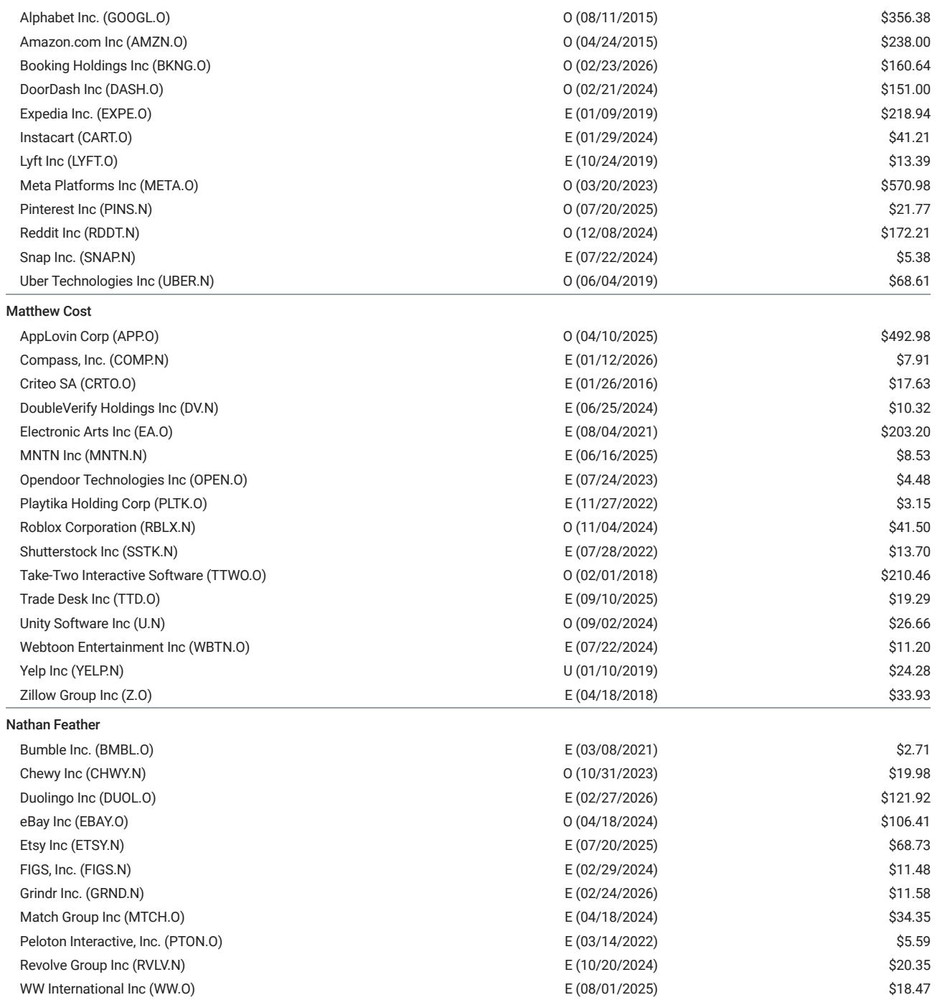
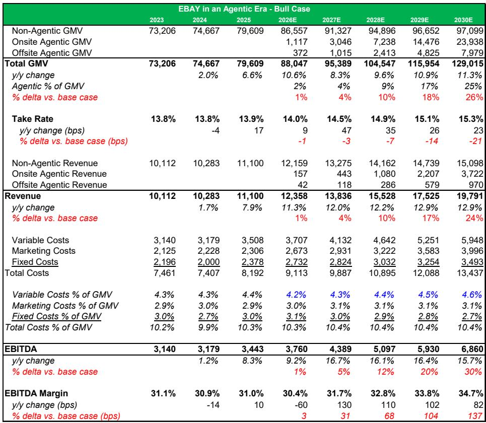
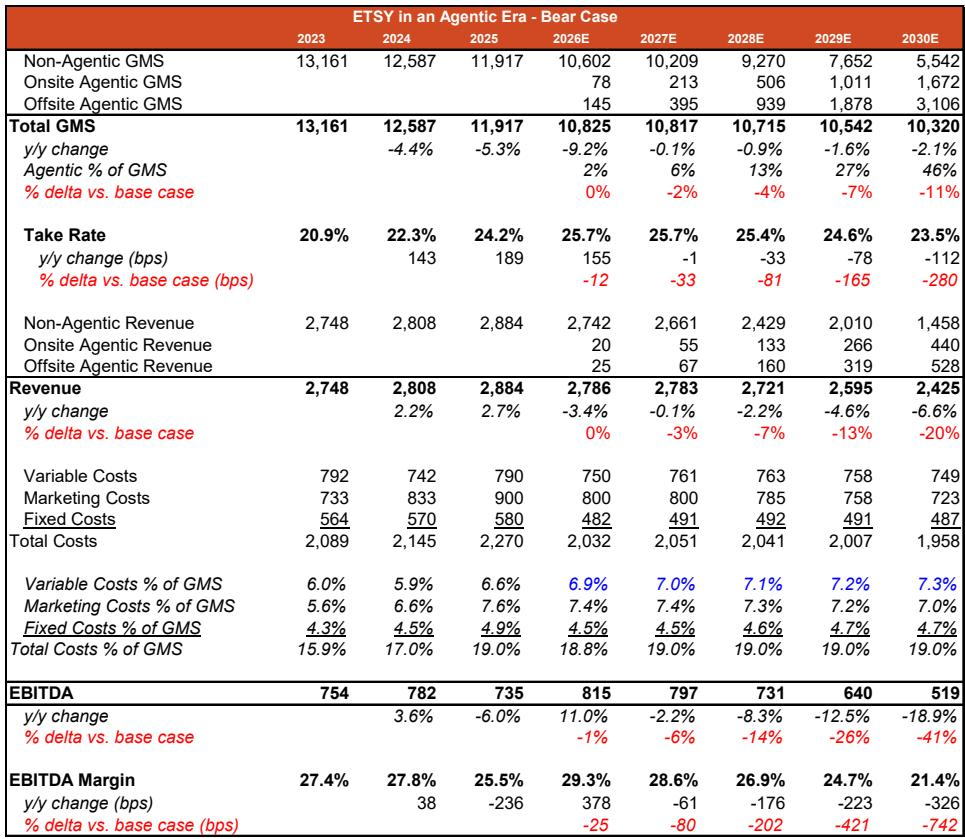

# Agentic Commerce Will Not Treat All Marketplaces Equally: Why eBay and Etsy Are Underappreciated in the Coming Paradigm Shift

The next major shift in eCommerce is not about faster delivery, better recommendations, or lower prices alone. It is about the transition from keyword-based search to agentic commerce—where interactive, personalized shopping assistants replace the traditional search box. This change will not simply improve existing shopping behavior; it will restructure how consumers discover, evaluate, and purchase goods. For small and mid-cap eCommerce companies, the stakes are existential. The market has largely assumed that eBay and Etsy, both legacy platforms with well-documented structural challenges, will be net losers in this transition. That assumption is premature and likely wrong.

A global investment bank report, using a proprietary "5 I's" framework, makes a compelling case that both eBay and Etsy possess underappreciated advantages that could make them beneficiaries rather than casualties of agentic commerce. The report argues that eBay's massive, highly differentiated inventory base gives it a structural moat that agentic search will uniquely unlock, while Etsy's medium-term opportunity to become the first dedicated agentic experience for special items is far more compelling than the market's bearish consensus acknowledges. For eBay, the bull case points to 2030 EBITDA 30% above base-case expectations. For Etsy, the upside could reach 40%. These are not marginal outcomes; they represent a fundamental re-rating of both companies.

The timing matters. Agentic commerce is still in its early innings, but the infrastructure is being built now. Consumer behavior shifts, once locked in, are difficult to reverse. Companies that position themselves correctly today will capture durable advantages. Those that do not will face an increasingly hostile competitive landscape. The report's central argument is that the market is underestimating both the speed of this transition and the specific structural factors that give eBay and Etsy asymmetric upside.

## eBay's Inventory Moat Is the Most Underappreciated Asset in SMID eCommerce

The conventional wisdom on eBay has been consistent for years: it is a structural share loser, a relic of the early internet that has been outmaneuvered by Amazon, Walmart, and newer vertical players. Recent performance—roughly 12% year-over-year foreign-exchange-neutral GMV growth in the first half of 2026—has done little to shift this narrative. The market views this as temporary, a blip driven by idiosyncratic factors that will soon fade.

The report challenges this view head-on. It argues that eBay's inventory base—approximately 2.5 billion listings, of which roughly 90% are either used or not in-season—is not a weakness but a massive structural advantage that agentic commerce will amplify. The logic is straightforward. Traditional keyword-based search is poor at surfacing long-tail, unique items. A user searching for "vintage camera" on a standard eCommerce platform sees the same mass-market options. Agentic commerce, by contrast, allows users to describe what they want in plain, conversational language. An agent can understand "a 1970s rangefinder camera in working condition, preferably black, under $200" and surface exactly that item from eBay's vast, unique inventory. No other platform has this depth of rare, pre-owned, and out-of-season goods.

This is not a theoretical advantage. The report notes that eBay's early experiments with AI-powered listing tools, such as the second iteration of Magical Listings, have already shown a more than 25% reduction in time to list and a double-digit percentage increase in GMV per lister. These are concrete data points, not speculative projections. Agentic commerce does not just improve demand discovery; it reduces supply friction. The report estimates that the average consumer has over $4,000 worth of items they could sell online but do not, precisely because the process is cumbersome. By automating listing creation, pricing recommendations, and structured data filling, agentic tools will unlock this latent supply. For eBay, this means both sides of the marketplace—buyers and sellers—benefit simultaneously.

The pricing advantage is equally important. eBay's large base of used and C2C inventory means its goods are consistently cheaper than new equivalents sold by other retailers. In an agentic world where shopping assistants can instantly compare prices across platforms, eBay's listings will rank highly. Speed is a disadvantage, but price is a powerful counterweight. The report argues that this combination—unique inventory, lower prices, and reduced selling friction—positions eBay as one of the best-positioned companies for agentic commerce, a view that is sharply at odds with market skepticism.

## Etsy's Medium-Term Window Is Real, Even If Long-Term Risks Are Not Fully Resolved

Etsy's story is more complex. The bear case is well-known and, on its face, compelling. Etsy's value proposition is aggregating demand for special, handmade, and vintage items. If consumers begin their shopping journeys on horizontal agents—such as Gemini or other large-language-model-based assistants—those agents could displace Etsy as the demand aggregator. The report's analysis shows that more than 75% of top Etsy sellers also sell on other channels. Etsy's take rate of roughly 25%, the highest among public pure-play third-party marketplaces, creates a powerful incentive for sellers to route demand to lower-cost channels. In a worst-case scenario, Etsy could follow the path of in-person travel agents: once able to capture a premium on commoditized supply, they were rapidly displaced when a better user experience with more competitive pricing emerged.

This bear thesis is speculative but not easily disproven. It will likely weigh on Etsy's multiple for the foreseeable future. However, the report makes a critical argument that the market is missing: the medium-term opportunity is far more compelling than the long-term risk suggests.

The insight is about the nature of Etsy's demand. Many buyers come to Etsy with a mission rather than a specific item—"a gift for my mom" or "something unique for my living room"—not a precise product name. Traditional keyword search is terrible at handling this type of query. Agentic commerce, with its conversational refinement, is uniquely suited to it. An agent can ask clarifying questions, narrow preferences, and surface items that match the sentiment, not just the text. This should drive higher conversion rates for Etsy than for platforms where buyers already know exactly what they want.

More importantly, the report argues that onsite agentic experiences will be adopted faster than horizontal agents. Consumers trust dedicated platforms more than general-purpose assistants for transactions. Payment and shipping friction is lower when the entire experience occurs within a single marketplace. And Etsy already has decades of consumer preference data that no horizontal agent can replicate. This gives Etsy a window of opportunity to be the first dedicated agentic experience for special items. The report quantifies this: for every $5 increase in gross merchandise sales per buyer, Etsy's overall GMS would increase by 4%. Consensus models only a 3% four-year CAGR. Each $5 increase represents more than a year of expected growth. The upside is not marginal; it is transformative.

## The 5 I's Framework Reveals Why the Market's Skepticism Is Misplaced

The report's analytical backbone is its "5 I's" framework: Inventory, Infrastructure, Innovation, Incrementality, and Income Statement Impact. This framework is not just a checklist; it is a structured way to compare agentic readiness across retailers. Applying it to eBay and Etsy reveals a clear pattern.

On Inventory, eBay scores a 5 out of 5. Its scale, rarity, and pricing are unmatched. Etsy scores lower because its items, while unique in design, are often not unique to the platform. This is a genuine vulnerability, but the report argues it is less damaging than feared because agentic search will still surface Etsy's items prominently if Etsy builds the best onsite experience.

On Infrastructure, both companies have room to improve. eBay has built targeted fulfillment initiatives—international shipping, authentication centers, and localized programs—without the full P&L burden of a global network. Etsy lacks physical distribution entirely, which is a long-run risk. However, the report notes that digital infrastructure, such as Etsy's early partnerships with horizontal agents, is a compensating strength.

On Innovation, eBay's pace of experimentation is among the highest in SMID internet. The focus on seller tools and AI-powered listing enhancements is directly aligned with agentic commerce. Etsy has been a first mover in external partnerships but is earlier in developing onsite agentic features. This asymmetry matters. The company that builds the best proprietary agentic experience will capture the most value.

On Incrementality, both companies have significant opportunity. eBay's unique inventory is largely untapped by traditional search. Etsy's low share in a very large total addressable market for special items means that even small improvements in conversion or frequency generate outsized growth. The report's bull cases for both companies are driven by incremental GMV or GMS growth, not by margin expansion alone.

On Income Statement Impact, the range of outcomes is wide for both. For eBay, the bull case sees EBITDA 30% above base case, driven by GMV growth and modest margin expansion. For Etsy, the bull case sees EBITDA 40% above base case, split between GMS growth and margin leverage. The bear cases are real but asymmetric: eBay's downside is smaller because its inventory moat is harder to replicate, while Etsy's downside is larger but contingent on specific assumptions about consumer adoption of horizontal agents.

## What the Report Does Not Fully Answer: The Timing and Competitive Response

For all its analytical rigor, the report leaves several critical questions open. First, the timing of agentic commerce adoption remains highly uncertain. The report acknowledges that it is "still early in the evolution," but the bull and bear cases are modeled to 2030. A five-year horizon is long enough for multiple competitive responses and technological shifts. What if horizontal agents improve faster than expected? What if Amazon or Walmart launch dedicated agentic shopping experiences that directly compete with eBay's inventory moat? The report does not model these scenarios in detail.

Second, the competitive response from horizontal agents is largely exogenous to the analysis. The report assumes that platforms like Gemini will coexist with dedicated marketplaces, but this is an assumption, not a proven outcome. If horizontal agents become the primary interface for shopping, the value capture shifts away from marketplaces entirely. eBay and Etsy could become back-end inventory providers rather than front-end demand aggregators, which would fundamentally alter their margin structures and valuation multiples.

Third, the report does not fully address the regulatory and data-privacy implications of agentic commerce. Agents that shop on behalf of consumers require access to personal preferences, purchase history, and financial data. How this data is governed, who owns it, and what happens when agents are compromised are unresolved questions that could slow adoption or shift the competitive landscape in unpredictable ways.

These open questions do not invalidate the report's thesis, but they do mean that investors must make their own judgments about probability weights. The report provides a framework; it does not provide certainty.

## A Decision Framework for Investors Evaluating eBay and Etsy

For readers who want to translate the report's analysis into actionable investment decisions, three questions should guide the evaluation.

First, what is your time horizon? The medium-term opportunity for Etsy is more compelling than the long-term risk, but only if the company executes on its onsite agentic experience within the next two to three years. If you believe that agentic commerce will take longer to scale, the bear case for Etsy becomes more probable. For eBay, the advantages are more structural and less time-sensitive, making it a better fit for longer holding periods.

Second, how do you weigh the competitive response? If you believe that large horizontal agents will dominate agentic commerce, both eBay and Etsy face significant risk. If you believe that dedicated marketplaces with unique inventory or specialized demand will retain a meaningful share of consumer attention, the bull cases are plausible. This is not a binary question, but the weight investors assign to each scenario will determine the appropriate position sizing.

Third, what is your view on valuation? eBay has already re-rated to roughly 16x forward adjusted EPS, but the report notes that mature marketplaces have traded durably above 20x P/E when perceived as winners. Etsy's multiple is depressed by the bear thesis, which creates upside if the medium-term opportunity materializes. Both companies offer asymmetric upside if the agentic thesis plays out, but the entry points matter.

## Why the Full Report Matters

The analysis summarized here is necessarily incomplete. The full report contains detailed scenario modeling, the complete 5 I's framework applied to each company, and the original charts that illustrate the bull and bear case bridges. It also includes the specific assumptions underlying the EBITDA scenarios and the sensitivity analysis that tests how changes in key variables—take rate, GMV growth, margin expansion—affect the outcomes. For serious investors, these details are not optional; they are the difference between a thesis and a conviction.

Join the community to read the full report and review the original charts.

*This article is for learning and discussion only and does not constitute investment advice.*

Personal reading notes and learning share only. Not investment advice.

