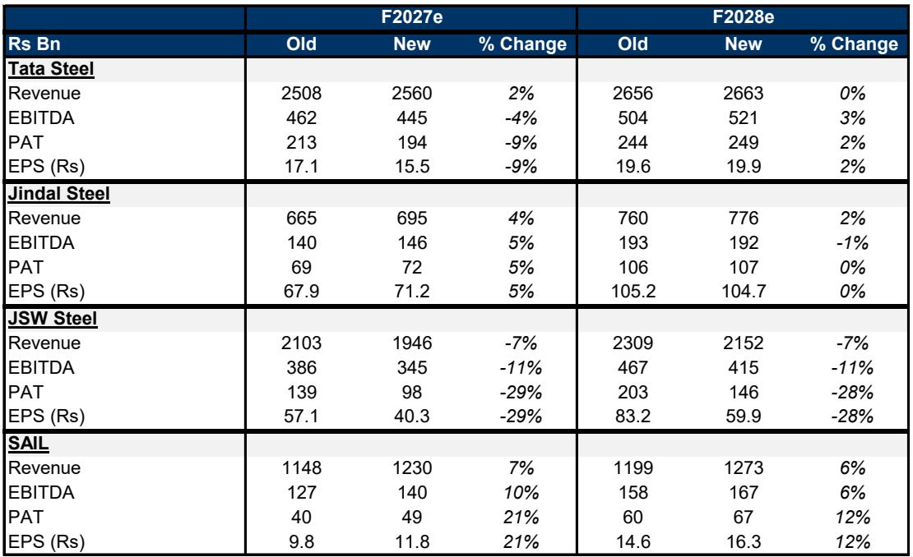
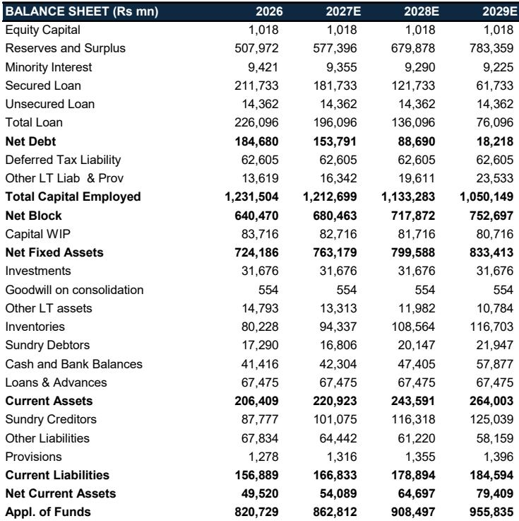
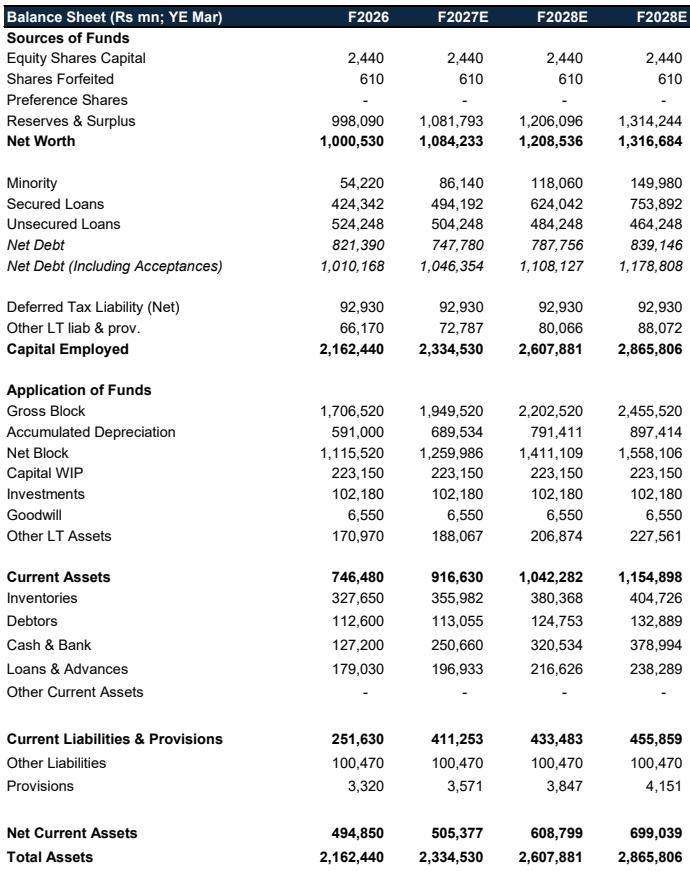

# 摩根斯坦利：印度钢铁的强势周期远未结束，但真正值得关注的是供给侧的再定价

当一家投行在Sensex指数年内下跌约13%的背景下，其覆盖的钢铁股却逆势上涨约12%，这本身就值得每一个产业决策者和资产配置者停下来问一句：这轮上涨的驱动力到底是什么？是短期季节性需求的脉冲，还是某种更深层的结构性变化？

摩根斯坦利最新发布的印度材料行业研报给出了一个明确的判断：印度钢铁的强势周期尚未结束。但真正值得深入解读的，不是“继续看好”这个结论本身，而是支撑这个结论的三个结构性支柱——本地化政策护城河、中国供给侧的外溢效应、以及全球地缘冲突下的成本传导机制。这三者叠加，正在重塑印度钢铁行业的定价逻辑，而市场对此的定价可能仍然不够充分。

这份报告发布于2026年6月，正值印度季风季节来临前的传统需求淡季。国内热轧卷（HRC）价格从4月高点回落约11%，市场情绪出现分化。正是在这个看似需要谨慎的时点，摩根斯坦利选择上调多家钢铁公司的盈利预测和目标价。这种逆势判断背后，是对行业中期格局的重新审视。

以下是我们从这份报告中提炼出的五个关键洞察，以及一个报告尚未完全回答的关键问题。

## 1. 这轮上涨的核心不是需求爆发，而是供给侧的多重锁定

市场习惯用需求侧的逻辑来理解钢铁股——基建投资、制造业扩张、房地产复苏。但摩根斯坦利这份报告传递的核心信号是：这轮钢铁股表现优异的根本原因，是供给侧正在经历一次罕见的、多重力量叠加的锁定。

首先是印度本地的贸易保护措施。报告明确指出，保障性关税的延期是支撑国内HRC价格从去年12月中旬低点反弹约26%的关键因素。这不是一个临时性的政策工具，而是印度政府在“印度制造”战略下持续推进的产业本地化政策的延续。

其次是中国的中期“反内卷”主题。中国的钢铁出口在经历了数年的高强度竞争后，正在出现结构性放缓。摩根斯坦利认为，这并非短期波动，而是中国钢铁行业自身供给侧改革的延续。中国出口的软化，意味着全球钢铁市场的竞争格局正在发生根本性转变，印度钢企的国际定价权正在增强。

第三是成本端的支撑。尽管中东冲突推高了炸药和物流成本，但报告指出，印度钢企的原材料采购对中东地区的直接依赖有限。更重要的是，铁矿石和焦煤价格的高位运行，反而为具备资源优势的印度钢企构建了一个成本护城河——那些没有自有矿山的竞争者将更难生存。

这三个供给侧力量叠加，意味着印度钢铁行业正在经历一个“供给收缩-政策护城河-成本优势”的三重锁定。这才是这轮周期与以往最大的不同。

## 2. 季节性回调是买入窗口，因为中期价差扩张的逻辑没有改变

报告发布时，印度钢铁行业正处于季风季节前的传统需求淡季。国内HRC价格相对于进口平价已出现约8%的折价，价差从4月高点回落约11%。对于只看短期数据的人来说，这似乎是见顶的信号。

但摩根斯坦利的判断恰恰相反：季节性回调恰恰是结构性逻辑的验证点。

报告的逻辑链条非常清晰：季风季节的需求走弱是历史常态，但一旦需求在季风后恢复，国内价格将重新获得支撑。更重要的是，保障性关税的存在意味着进口不会大量涌入来填补缺口，国内钢企的定价权不会因为短期需求波动而被削弱。

这意味着，当前价差的收窄是一个“可预期的、可逆的”季节性现象，而非结构性恶化。对于中长期投资者而言，这种季节性回调恰恰提供了更好的入场时机。

从更宏观的视角看，印度钢铁行业的价差正在进入一个“下有底、上有弹性”的新阶段。底部由保障性关税和中国的出口限制支撑，弹性则来自印度国内需求的恢复性增长。这种定价环境，与过去那种“需求好则价差扩、需求差则价差崩”的周期模式，已经有了本质区别。

## 3. 中东冲突对印度钢企的影响被高估了，但一个二阶风险值得警惕

市场对中东冲突的担忧主要集中在成本端——油价上涨推高能源和物流成本，可能侵蚀钢企利润。但摩根斯坦利的分析显示，这种担忧可能被夸大了。

报告指出，印度钢企的大部分原材料采购并不依赖于中东地区。铁矿石主要来自国内和澳大利亚，焦煤的主要来源也是澳大利亚和美国。中东冲突带来的成本压力，更多体现在炸药和部分物流环节，整体影响有限。

然而，报告也提到了一个容易被忽略的二阶风险：如果中东冲突持续升级，可能对印度下游用钢行业造成冲击。印度的一些制造业和出口导向型产业，如果受到全球需求疲软的拖累，最终会传导到钢材需求端。这个风险的传导链条更长、更间接，但一旦发生，其影响可能比直接的成本冲击更大。

摩根斯坦利目前认为这个风险可控，但报告并未给出具体的量化分析。这正是值得读者持续跟踪的关键变量——中东局势的演变，可能成为打破当前供给侧锁定逻辑的最大外部变量。

## 4. 不同公司的盈利弹性正在分化，选股的关键在于成本结构

摩根斯坦利在这份报告中维持了对JSW Steel、Jindal Steel和Tata Steel的增持评级，同时维持了对SAIL的低配评级。这种分化背后，反映的是印度钢铁行业内部正在加剧的盈利分化。

报告显示，摩根斯坦利上调了F27财年的钢铁价差预期约2%，但不同公司的盈利调整幅度差异显著。Jindal Steel的F27 EBITDA预测上调了5%，而JSW Steel和Tata Steel分别下调了11%和4%。SAIL的F27 EBITDA预测却上调了10%。

这种看似矛盾的数据背后，隐藏着不同的成本结构和经营杠杆。拥有自有矿山、成本控制能力强的公司，在价差扩张周期中能够获得更大的盈利弹性。而那些依赖外购原料、成本结构僵化的公司，即使行业价差改善，其盈利改善的幅度也会被成本端侵蚀。

摩根斯坦利认为，这一轮钢铁股的上涨主要由盈利增长驱动，而非估值扩张。这意味着，选股的关键不再是“买整个行业”，而是“买那些能够在价差扩张中真正把利润转化为现金流和回报的公司”。对于SAIL的低配评级，报告没有给出详细解释，但一个合理的推测是：其成本结构、运营效率或资产负债表状况，无法支持与同行同等的盈利改善空间。

## 5. 中国“反内卷”主题是支撑印度钢铁中期格局的关键变量，但市场对其持续性仍有分歧

在所有支撑印度钢铁股的因素中，中国的中期“反内卷”主题可能是最容易被低估、也是最需要持续验证的一个。

摩根斯坦利的判断是，中国钢铁出口的软化不是一个短期现象，而是中国行业政策转向的结果。中国钢铁行业正在经历从“规模扩张”到“质量提升”的转型，这意味着中国对全球市场的钢铁供给将出现结构性下降。对于印度钢企而言，这意味着在国际市场上将面临更少的中国竞争，定价权将显著提升。

但这里有一个尚未完全回答的关键问题：中国的“反内卷”政策能否真正持续？如果中国国内需求持续疲软，中国钢企是否会重新将过剩产能转向出口？如果全球经济增长放缓，中国的出口策略是否会再次调整？

摩根斯坦利的报告给出了乐观的判断，但并未提供足够的历史证据或情景分析来支撑这一假设的稳健性。这将是未来6-12个月需要持续跟踪的核心变量。如果中国的出口限制政策出现松动，或者中国国内需求超预期下滑，那么印度钢铁行业的供给侧逻辑将面临重大挑战。

## 报告尚未完全回答的关键问题：估值是否已经透支了未来？

摩根斯坦利在这份报告中明确提到，印度钢铁股的“重估潜力已基本被定价”，未来股价表现将主要由盈利增长驱动。这是一个非常坦诚且值得警惕的判断。

当前的估值水平意味着，市场已经在很大程度上预期了上述供给侧逻辑的兑现。如果实际盈利增长低于预期，或者上述结构性逻辑出现任何松动，股价面临的下行风险将不容忽视。

报告对F28财年的盈利预测基本维持不变，这也暗示了一个隐含的判断：这轮盈利改善的峰值可能出现在F27财年，而非更远的未来。对于长期投资者而言，这意味着需要仔细权衡当前估值是否已经反映了未来2-3年的增长预期。

## 给读者的观察框架：如何持续跟踪这个逻辑的兑现

基于这份报告的分析框架，我们建议读者建立一个三层的观察框架来持续跟踪印度钢铁行业的投资逻辑：

第一层是政策执行。保障性关税是否会被延长或调整？印度的产业本地化政策是否会有新的举措？这是供给侧锁定的核心。

第二层是中国动态。中国钢铁出口数据是否持续下行？中国的“反内卷”政策是否有新的信号？这是中期格局的关键变量。

第三层是盈利兑现。各家钢企的季度盈利报告是否与摩根斯坦利的预测一致？成本结构是否在改善？现金流是否在提升？这是验证估值合理性的最终依据。

这三层观察框架，可以帮助读者在信息噪音中保持对核心逻辑的聚焦，而不是被短期的价格波动所左右。

## 顺着这些未解问题继续讨论

摩根斯坦利这份报告的核心价值，不在于它给出了“继续看好”的结论，而在于它提供了一个清晰的逻辑框架，帮助读者理解印度钢铁行业正在经历的结构性变化。但正如我们在上文指出的，这个逻辑框架中仍有几个关键假设尚未充分验证：中国“反内卷”政策的持续性、中东冲突对下游需求的二阶影响、以及当前估值是否已经透支了未来增长。

这些未解问题，恰恰是未来6-12个月最值得深入讨论的话题。欢迎来我们的星球微信群里继续讨论——我们会持续跟踪这些关键变量的变化，并结合更多投行的观点和产业数据，帮助社群成员构建更完整的判断框架。

Personal reading notes and learning share only. Not investment advice.

