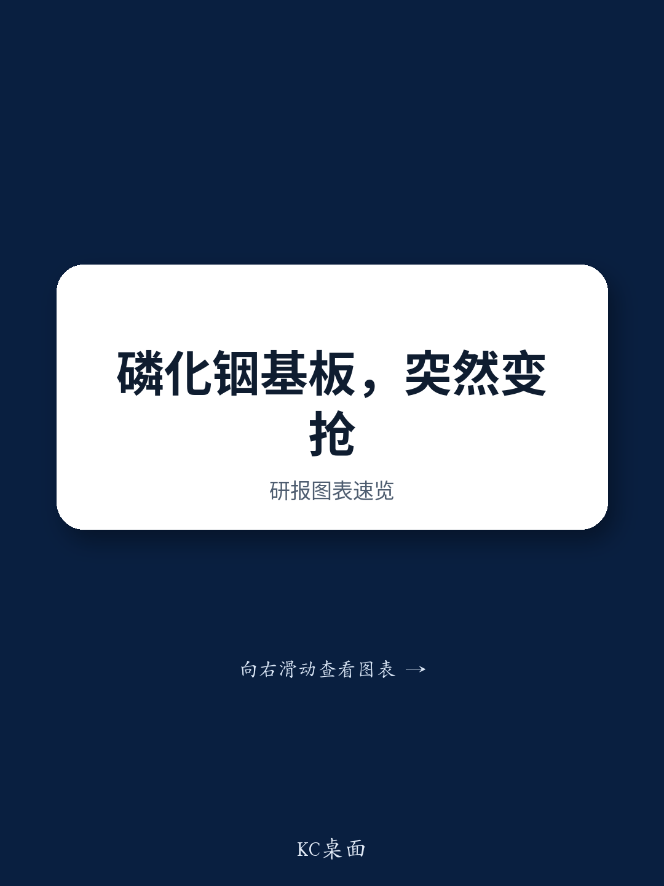
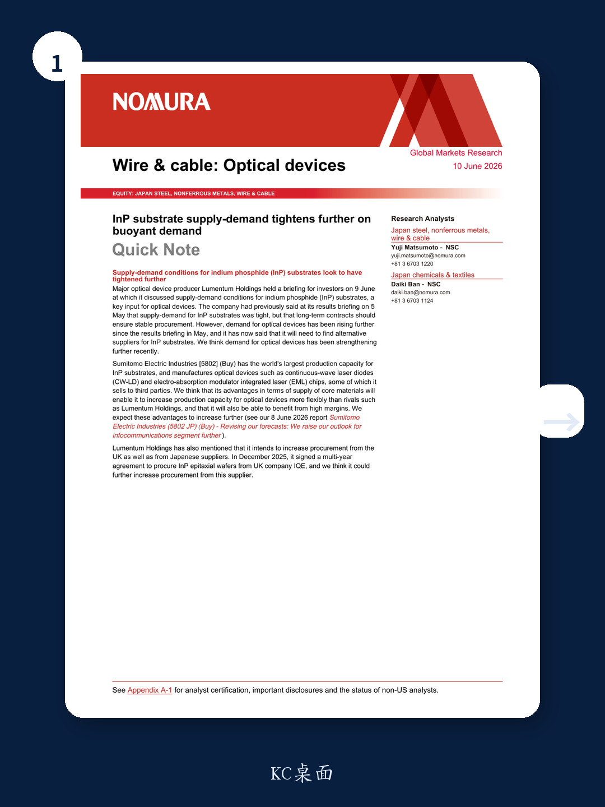
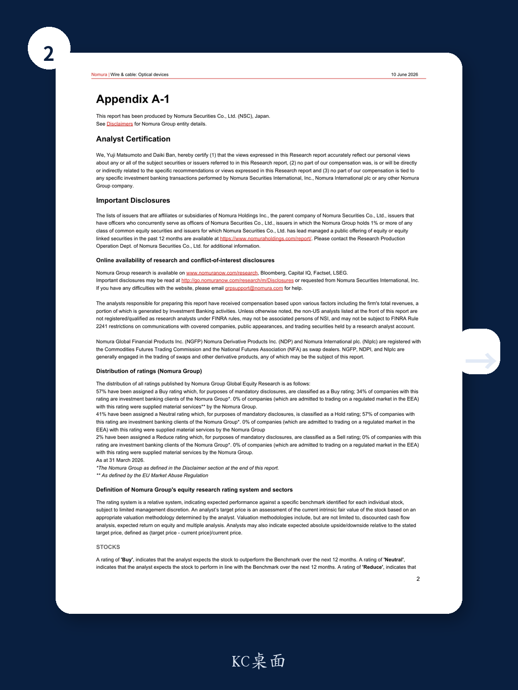

# The Tightening of InP Substrate Supply Has Become a Strategic Bottleneck That Will Reshape the Optical Device Industry's Competitive Architecture

The global supply of indium phosphide (InP) substrates, the critical raw material for next-generation optical devices, has moved from a state of tightness to one of genuine scarcity. This is not a cyclical pinch. It is a structural shift that will separate the companies that control the upstream material chain from those that merely assemble components. In early June, a major optical device producer, Lumentum Holdings, informed investors that its previous strategy of relying on long-term contracts to secure InP substrate supply was no longer sufficient. The company now acknowledges it must find alternative suppliers. This single admission signals that the balance of power in the optical device industry is shifting toward the few companies that own the substrate manufacturing capacity.

The implications extend far beyond one company's procurement challenges. The optical device market is being driven by explosive demand from data center interconnects, 5G infrastructure, and emerging artificial intelligence networks. These applications require ever-higher bandwidth and lower power consumption, and InP-based devices are uniquely positioned to deliver both. When the raw material for those devices becomes scarce, the entire downstream industry faces a capacity constraint that cannot be solved by simply building more assembly lines. The bottleneck is at the substrate level, and it is getting worse.

This is not a forecast. It is a description of what is already happening. The question for investors and strategists is not whether the tightening is real, but which companies are positioned to turn this constraint into a durable competitive advantage. The answer points squarely to Sumitomo Electric Industries, which holds the world's largest production capacity for InP substrates and also manufactures its own optical devices. The company sits at the intersection of material control and device production, a position that is becoming exponentially more valuable as the market tightens.

## The Shift from "Tight but Manageable" to "Structurally Scarce" Changes the Rules of Competition

The distinction between a tight market and a structurally scarce market is not semantic. It determines whether companies can plan capacity expansion with confidence or must compete for every gram of available material. Lumentum's public commentary in early June makes this distinction clear. In May, the company described InP substrate supply as tight but manageable under existing long-term contracts. By June, after demand for optical devices had risen further, the company admitted it needed to find alternative suppliers. This is the hallmark of a market moving from the first stage into the second.

In a tight but manageable market, existing relationships and contracts provide sufficient cover. Companies can plan around known constraints. In a structurally scarce market, the constraints themselves become dynamic. Every incremental increase in downstream demand creates a disproportionate scramble for upstream material. The companies that own the substrate production capacity do not just benefit from higher prices. They gain the ability to decide which downstream customers get served and which do not. That is pricing power of a different order.

The mechanism is straightforward. InP substrates are not commodity items that can be produced quickly by any qualified manufacturer. They require specialized crystal growth processes, long lead times, and significant capital investment. The production capacity that exists today was built years ago, based on demand forecasts that underestimated the current surge. Expanding capacity takes time, and in the interim, the existing capacity is the only game in town.

For investors, the key insight is that this scarcity is not evenly distributed across the supply chain. The pain is concentrated among device manufacturers that do not own their substrate supply. The advantage is concentrated among the few companies that do. This asymmetry creates a natural experiment in competitive dynamics. The companies with integrated substrate production will be able to grow their device output without being constrained by supplier negotiations. Their competitors will face a ceiling.

## Integrated Material Ownership Creates a Structural Cost and Capacity Advantage That Is Difficult to Replicate

Sumitomo Electric's position in this market is not merely advantageous. It is qualitatively different from that of its competitors. The company has the world's largest production capacity for InP substrates, and it uses those substrates to manufacture its own optical devices, including continuous-wave laser diodes and electro-absorption modulator integrated laser chips. Some of these devices are sold to third parties. This vertical integration means that when the substrate market tightens, Sumitomo Electric does not just survive the constraint. It can increase its own device production more flexibly than rivals that depend on external suppliers.

The advantage is both a cost advantage and a capacity advantage. On the cost side, an integrated producer captures the margin at every stage of the value chain. It does not pay a markup to an external substrate supplier, and it does not face the risk of spot price spikes. On the capacity side, an integrated producer can allocate its substrate output to its own device lines first, selling only the surplus to the open market. When scarcity hits, this allocation power becomes the most valuable asset in the industry.

Consider the alternative. A non-integrated device manufacturer must negotiate with substrate suppliers for every wafer. In a tight market, those suppliers have the leverage to demand higher prices, longer lead times, or minimum purchase commitments. The device manufacturer's production plan becomes contingent on someone else's allocation decisions. This is not a supply chain risk that can be hedged with a contract. It is a structural dependency that limits growth.

Sumitomo Electric's ability to benefit from high margins on its device sales is not a temporary phenomenon. It is a direct consequence of its material ownership. As the market tightens further, these margins should expand, not contract. The company's competitors will face rising input costs and supply uncertainty. Sumitomo Electric will face neither. This asymmetry is the core of the investment thesis.

## The Search for Alternative Suppliers Will Accelerate a Geographic and Technological Realignment

Lumentum's decision to seek alternative suppliers is not an isolated response. It is the first public signal of a broader industry scramble that will reshape the supply chain geography of InP substrates. The company has already signed a multi-year agreement to procure InP epitaxial wafers from UK-based IQE, and it has indicated an intention to increase procurement from Japanese suppliers as well. This dual sourcing strategy is rational from Lumentum's perspective, but it reveals a deeper truth. The number of qualified, high-volume InP substrate suppliers is extremely limited, and the industry is now discovering that its concentration risk is far higher than previously understood.

The geographic dimension of this realignment matters. Japanese suppliers, led by Sumitomo Electric, have long dominated the InP substrate market. The emergence of UK-based IQE as a significant supplier suggests that the industry is trying to diversify its sourcing base. But diversification takes time. Building the technical capability to produce high-quality InP substrates at scale is not a matter of simply hiring engineers and buying equipment. It requires years of process development and qualification cycles. In the meantime, the Japanese producers retain their dominant position.

The technological dimension is equally important. Not all InP substrates are created equal. The performance requirements for optical devices used in data center interconnects and AI networks are extremely demanding. Substrate quality directly affects device yield, reliability, and performance. A device manufacturer that switches to a new substrate supplier must requalify its entire production line, a process that can take months. This switching cost creates a powerful lock-in effect for existing supplier relationships.

The implication is that the current tightening is not a temporary imbalance that will be resolved by new entrants. The barriers to entry in InP substrate production are high, and the switching costs for device manufacturers are high. The market is moving toward a structure where the existing producers, particularly those with the largest capacity, will capture an increasing share of the value created by the optical device boom.

## The Report Raises a Critical Question It Does Not Fully Answer: How Fast Can InP Substrate Capacity Actually Expand

For all its insight into the current tightness, the report leaves a strategic question on the table. How quickly can InP substrate capacity be expanded, and what are the constraints on that expansion? The report notes that Sumitomo Electric has the world's largest production capacity, and it implies that this capacity gives the company flexibility. But it does not provide a detailed analysis of the lead times, capital requirements, or technical bottlenecks involved in adding new substrate production lines.

This question is central to any forward-looking investment thesis. If capacity can be expanded relatively quickly, then the current scarcity may be a multi-year opportunity rather than a permanent structural shift. If capacity expansion is slow and capital-intensive, then the advantage of incumbents like Sumitomo Electric becomes even more durable.

The answer likely lies in the physics and economics of InP crystal growth. InP substrates are produced by growing single crystals of indium phosphide, a process that requires precise control of temperature, pressure, and purity. The crystal growth equipment is specialized and expensive. The yield of usable wafers from each crystal is not 100 percent. Scaling up production requires not just more equipment, but more skilled operators and more process engineering.

Furthermore, the capital commitment required to build a new substrate production facility is substantial, and the payback period depends on sustained demand growth. Companies may be hesitant to commit that capital unless they have long-term offtake agreements in place. This creates a chicken-and-egg problem. Device manufacturers want guaranteed supply before they commit to volume. Substrate producers want guaranteed demand before they commit to capacity.

The report's analysis would be strengthened by a more explicit treatment of these dynamics. For now, the reader is left to infer that capacity expansion is likely to be gradual, which supports the thesis that the current tightness will persist. But the exact trajectory remains an open analytical question.

## A Decision Framework for Evaluating Companies in the InP Optical Device Value Chain

For investors and strategists evaluating exposure to this theme, the report provides a clear basis for a decision framework. The framework has three dimensions: material ownership, device integration, and customer diversification.

The first dimension is material ownership. Does the company own or have guaranteed access to InP substrate production capacity? Companies that own their substrate supply, like Sumitomo Electric, have a structural advantage. Companies that rely entirely on external suppliers face volume risk, price risk, and allocation risk. The value of this dimension increases as the market tightens.

The second dimension is device integration. Does the company use its substrate capacity to produce its own optical devices, or does it sell substrates to third parties? Integration captures more of the value chain and provides a natural hedge against substrate price fluctuations. A company that sells substrates and buys devices is exposed to margin compression. A company that produces both can optimize across the chain.

The third dimension is customer diversification. Are the company's optical device customers concentrated in a few end markets, or are they spread across data center, telecom, and industrial applications? Diversification reduces the risk that a slowdown in any single end market will cripple the company's growth. It also provides more data points for demand forecasting, which is critical for capacity planning.

Applying this framework to the companies mentioned in the report yields a clear hierarchy. Sumitomo Electric scores highly on all three dimensions. It owns substrate capacity, integrates that capacity into device production, and serves a broad customer base. Lumentum Holdings scores lower on material ownership and device integration, which is precisely why it is scrambling to find alternative suppliers. IQE scores highly on material ownership as a substrate supplier but does not integrate into device production, which limits its value capture.

The framework also highlights the risks. A company that scores well on material ownership but poorly on device integration is vulnerable to demand shifts in the substrate market. A company that scores well on device integration but poorly on material ownership is vulnerable to supply disruptions. The optimal position is ownership and integration, which is exactly where Sumitomo Electric sits.

## The Unresolved Analytical Questions Point Toward the Full Report and Its Supporting Data

The analysis presented here is based on a single report parsing, but the full report contains additional data, charts, and financial models that provide a more complete picture. The original report includes detailed forecasts for Sumitomo Electric's infocommunications segment, updated valuation models, and a discussion of the broader competitive landscape in the Japanese wire and cable industry. These elements are essential for building a rigorous investment thesis.

Several questions remain that the full report can help answer. What is the exact capacity utilization rate at Sumitomo Electric's InP substrate facilities? How does the company's margin structure compare across its substrate and device businesses? What are the specific demand growth rates for the key end markets driving the optical device boom? How do the valuation multiples of integrated producers compare with those of non-integrated competitors?

These are not trivial questions. They require access to the original research, including the financial models and the analyst's detailed assumptions. The report parsing provides the strategic narrative, but the full report provides the analytical backbone.

For readers who want to move beyond the strategic narrative and into the quantitative details, the full report is the next step. It contains the original charts and data that support the arguments presented here, and it provides the granularity needed for investment decision-making. The community of serious investors who rely on this type of research understands that the difference between a good thesis and a great investment often lies in the details that only the full report can provide.

Join the community to read the full report and review the original charts.

*This article is for learning and discussion only and does not constitute investment advice.*

Personal reading notes and learning share only. Not investment advice.

