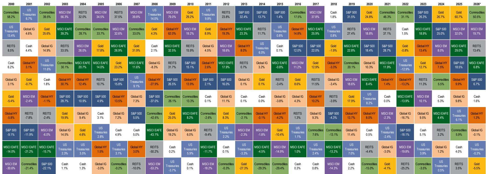
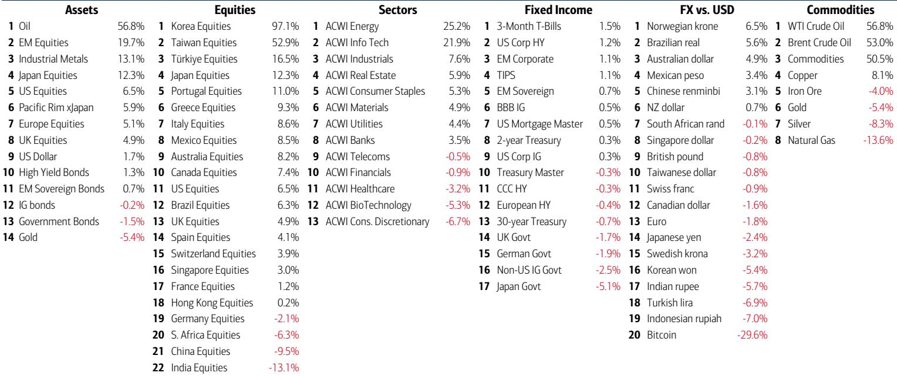
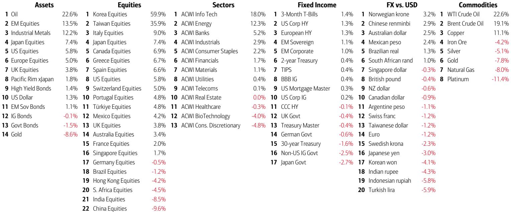

# 美国银行：市场正在为一场“通胀高于增长”的资产重新定价做准备

这份报告最值得看的判断，不是某个资产类别下周的涨跌，而是美国银行首席投资策略师Michael Hartnett团队通过资金流数据揭示的一个正在成形的宏观叙事：通胀正在重新成为主导变量，而资产配置却仍停留在“看涨惯性”中。当通胀预期与政策应对之间的落差被市场意识到时，资产价格的重估可能比大多数人预期的更剧烈。

报告的核心信号有两个层面。第一个是数据层面的确认：美国通胀已经超过4%，而特朗普在通胀问题上的支持率跌至27%，低于拜登任内低点。第二个是行为层面的警示：尽管美国银行的牛熊指标已经连续四周发出“卖出信号”，但资金仍在涌入股票，尤其是科技股——上周科技基金录得创纪录的123亿美元流入。这种“知道风险但仍在加仓”的张力，正是资产定价中最值得警惕的状态。

为什么现在重要？因为历史提供了清晰的参照系。报告特别点出了1994年的类比：当时美联储在滞后于曲线后被迫大幅加息，最终导致债券收益率飙升、股市陷入多月的交易区间，直到墨西哥比索危机和橙县破产事件才完成了去杠杆。今天的情景——通胀走高、就业市场紧张、政策制定者仍在强调“美国优先”——与1994年有着令人不安的相似性。

以下是我们从这份报告中提炼的五个核心洞察，它们共同指向一个判断：当前资产配置的“看涨惯性”正在积累风险，而真正的机会可能出现在那些已经被资金抛弃、但基本面正在改善的角落。

## 1. 资金流显示市场正在形成“科技单边市”，但历史表明这种拥挤往往以剧烈调整收场

上周的数据是惊人的。全球股票基金净流入315亿美元，其中美国股票占174亿美元，已是连续第11周净流入——这是自2025年12月以来最长的连续流入记录。而在这174亿美元中，科技板块独占了123亿美元，创下历史单周最高纪录。其中，Direxion每日半导体三倍做多ETF和iShares半导体ETF分别吸引了30亿和29亿美元。

但与此同时，报告中的牛熊指标已经从8.7升至8.8，离“极度看涨”的10仅一步之遥。自2002年以来，该指标共有17次触发“卖出信号”，平均而言，全球股票在随后2-3个月内下跌2-3%，命中率约60%，最大回撤可达15-20%。

这里有一个值得深思的矛盾：资金正在以创纪录的速度涌入科技，尤其是半导体，但牛熊指标却表明市场整体已经过于拥挤。这意味着什么？意味着科技板块的上涨可能已经不再是基本面驱动的，而是“怕踏空”心态下的被动配置。当所有人都坐在船的一侧时，任何外部冲击都可能导致船体剧烈晃动。

报告没有完全展开的一个问题是：如果科技资金流出现逆转，哪些板块最可能成为承接资金的目的地？从美国银行私人客户过去四周的ETF资金流来看，材料、MLP和TIPS是买入最多的，而科技本身反而是净卖出的。这说明“聪明钱”已经在悄悄调整仓位，但散户和被动资金仍在涌入科技。

## 2. 通胀正在从“尾部风险”变成“核心矛盾”，但资产价格尚未充分反映这一转变

报告中最引人注目的数据之一，是美国通胀率已经超过4%，而特朗普在通胀问题上的支持率仅为27%，低于拜登任期内28%的低点。与此同时，美国原油库存降至48天，接近45年来的最低水平。这组数据放在一起，讲述了一个清晰的叙事：供给侧的约束正在推高物价，而政策制定者对此的应对空间有限。

更值得关注的是报告中的历史对照。当CPI超过4%时，标普500指数在随后3个月平均下跌4%，随后6个月平均下跌7%。更重要的是，当失业率低于通胀率时——目前美国失业率4.3%，通胀4.2%——历史表明这往往伴随着美联储加息周期，如1966年、1973年、1990年、2000年、2008年和2021年。这些年份在华尔街的集体记忆中都不算愉快。

报告还提供了一个前瞻性的路径图：如果美国CPI月度环比维持在0.5%，到2027年中期选举时，年化通胀率可能超过5%。这并非危言耸听，而是基于当前趋势的线性外推。问题在于，市场是否已经为这种情景定价？从债券市场来看，答案是否定的。美国银行私人客户在长期美国国债上的配置仅为4%，几乎可以忽略不计。这意味着，一旦通胀预期进一步上行，债券市场的调整可能比股票市场更具冲击力。

## 3. 黄金和加密货币的资金流出揭示了一个被忽视的“去杠杆”过程

在科技股资金创纪录流入的同时，黄金和加密货币正在经历显著的资金外流。黄金基金连续第四周净流出，上周流出23亿美元；加密货币基金在过去五周累计流出66亿美元，创下历史纪录。

这组数据意味着什么？至少有两个可能的解释。第一个是“风险偏好转移”：资金从避险资产（黄金）和另类资产（加密货币）流向风险资产（科技股）。第二个是“流动性收缩”：这些资产的流出可能反映了投资者在科技股上涨后需要重新平衡组合，或者是在通胀上升背景下被迫减持非生息资产。

报告提到，黄金的去杠杆过程与1994年的情景有相似之处。当时，黄金价格在美联储加息周期中经历了大幅调整。如果历史重演，黄金可能还有进一步下跌的空间。但这里有一个报告没有完全展开的关键问题：黄金和加密货币的资金流出是暂时的战术调整，还是结构性趋势转变的开始？如果是后者，那么这些资产的估值中枢可能需要重新审视。

## 4. 新兴市场正在出现“抄底信号”，但需要区分哪些国家真正具备韧性

一个值得注意的积极信号是，新兴市场股票基金在连续九周净流出后，上周首次转为净流入，金额为45亿美元。其中，韩国股票基金录得59亿美元净流入，是2026年3月以来的最大单周流入。

为什么是韩国？这可能与半导体周期有关。韩国作为全球半导体产业链的核心节点，其股市表现与全球科技需求高度相关。当全球资金涌入科技股时，韩国自然成为受益者。但报告也显示，中国股票基金年初至今累计净流出2207亿美元，巴西和印度也分别出现净流出。

这引出了一个关键问题：新兴市场的分化正在加剧。那些与全球科技周期紧密相关的市场（如韩国、台湾）可能受益于资金流入，而那些依赖内需或大宗商品的市场（如中国、巴西）则面临更大的挑战。报告没有明确给出每个市场的具体判断，但资金流数据本身已经提供了线索。

## 5. 报告没有完全回答的关键问题：政策转向的时点和触发条件

报告提到了“3P”框架：看涨的仓位（Positioning）、看涨的盈利预期（Profit expectations）、以及从降息转向加息的货币政策（Policy）。但报告也明确指出，当前的政策制定者似乎在走“通过华尔街优先来服务美国优先”的路径。这意味着，在通胀真正成为政治问题之前，政策可能不会主动收紧。

那么，触发政策转向的条件是什么？报告提到了几个可能的触发点：债券市场（惩罚性的资本成本）、企业领袖（如果“便宜”的MAGS无法守住65美元关口）、或者选举（选民更关心就业还是通胀）。但报告没有给出明确的判断，只是说“我们正在接近”。

这可能是整份报告中最值得读者自己思考的问题。如果政策转向确实在途中，那么当前资产配置的“看涨惯性”可能会在某个时刻突然瓦解。那个时刻可能来自一次意外的通胀数据、一次地缘政治事件、或者一次债券市场的剧烈波动。但正如报告所说，历史表明这些事件往往以“去杠杆”的方式出现，而不是渐进式的调整。

---

以上五个洞察，只是这份美国银行报告中值得深入讨论的一部分。报告还包含了大量图表——从美国银行私人客户的资产配置变化，到各类资产类别的资金流对比——这些细节无法在一篇文章中完全展开。特别是关于1994年类比的具体推演、各行业资金流的二阶效应、以及美国银行私人客户行为背后的决策逻辑，都需要结合完整报告的原始数据来理解。

如果你对这些未解问题感兴趣，欢迎来星球微信群里继续讨论。我们会定期分享完整报告的原始图表和解读，也会针对关键假设进行推演和辩论。毕竟，在这样一个资产定价逻辑可能发生根本转变的时刻，一个人的视野总是有限的。

Personal reading notes and learning share only. Not investment advice.

