## Biotechnology | North America

# Can Innovation Ease Alzheimer's Growing Burden? Leaning in on Brain Shuttles

Can biotech innovation bend the late-life Alzheimer's burden created by a top-heavy population mix, or will longer lifespan increasingly convert into higher healthcare spend, caregiver burden, institutionalization, and socioeconomic strain?

## Key Takeaways

Aging is poised to convert added years of life into added years of dependency. Alzheimer's disease (AD) is where that conversion concentrates.  
Aging populations will shift AD from clinical burden into a healthcare-spend and retirement-system problem. We estimate a \$70B US market for AD therapies.  
Life expectancy has risen to an apparent ceiling near \~80yrs, while healthspan (years without disease impairment) has plateaued at \~70yrs.  
The data suggest we are not adding healthy years at the tail (we are adding impaired ones). Alzheimer's is the primary driver for this dislocation.  
Indeed, high-cost years is widening (and AD is its fastest-growing driver). US Seniors consume \~2.4x per-capita health spend of working-age adults.

## Societal Shifts

A MS Key Theme of 2026

## Alzheimer's is the disease that most efficiently converts longevity into the impaired-years gap.

The Congressional Budget Office (CBO) forecasts the US population peaking around 2050, with a steady decline toward current levels by 2099, from 349M adults in 2026 to 364M in 2050 and back to 349.1M by 2099. This represents a 0.1M net increase in \~73 years, or +0.0004% CAGR. Importantly, as the senior cohort grows, the absolute count of

impaired late-life years increases alongside it. In tandem, clinical AD prevalence rises from \~6.1M in 2020 toward \~12.7M by 2050 (Alzheimer's Association). Because seniors carry per-capita personal health-care (PHC) spend of \~\$22.4k versus \~\$9.2k for adults and \~\$4.4k for children, age mix alone pushes PHC from \~\$3.7T (11.7% of GDP) today to \~\$6.3T (13.1%) by 2050. Currently, we estimate the US AD market at \$50B, assuming 7M US patients with AD, 80% of whom are mild to moderate, and 30% of those are eligible for treatment after screening for safety and comorbidities.

The obesity/diabetes franchises that dominate today's longevity conversation are unlikely to relieve the AD burden. GLP-1 receptor agonists remain one of the most important drug classes of the decade for cardiometabolic risk, but in EVOKE/EVOKE+ Phase 3, oral semaglutide did not slow progression of early symptomatic

MS & CO. LLC

## Sean Laaman, Ph.D.

Equity Analyst

Sean.Laaman@morganstanley.com +1 212 761-4947

## Michael H Riad, Ph.D.

Research Associate

Michael.Riad@morganstanley.com +1 212 761-1309

## Terence C Flynn, Ph.D.

Equity Analyst

Terence.Flynn@morganstanley.com +1 212 761-2230

## Michael E Ulz

Equity Analyst

Mike.Ulz@morganstanley.com +1 212 761-4650

## Chris Yu, J.D., Ph.D.

Equity Analyst

Chris.L.Yu@morganstanley.com +1 212 761-2535

## MS ASIA LIMITED+

## Jack Lin

Equity Analyst

Jack.Lin@morganstanley.com +852 3963-3746

## MS & CO. LLC

## Avraham Novick

Research Associate

Avi.Novick@morganstanley.com +1 212 761-2231

## Katherine Sun

Research Associate

Katherine.Sun@morganstanley.com +1 212 761-5968

## Morgan K Gryga

Research Associate

Morgan.Gryga@morganstanley.com +1 212 761-0824

2026 EXTEL

## ALL-AMERICA RESEARCH POLL

May 26 – June 12, 2026

## VIEW OUR ANALYSTS >

## BIOTECHNOLOGY

## North America

Industry View

Attractive

MS does and seeks to do business with companies covered in MS. As a result, investors should be aware that the firm may have a conflict of interest that could affect the objectivity of MS. Investors should consider MS as only a single factor in making their investment decision.

## For analyst certification and other important disclosures, refer to the Disclosure Section, located at the end of this report.

+= Analysts employed by non-U.S. affiliates are not registered with FINRA, may not be associated persons of the member and may not be subject to FINRA restrictions on communications with a subject company, public appearances and trading securities held by a research analyst account.

AD (the programs were terminated in November 2025). The result suggests the incretin obesity/diabetes franchises dominating the longevity debate are unlikely to relieve the neurological burdens at the tail end.

The historical case for pharmaceutical innovation is strong, but Alzheimer's remains an enigma. Pharmaceuticals have repeatedly bent mortality curves: vaccines, antibiotics, statins, antiretrovirals, targeted oncology, and now GLP-1s for cardiometabolic disease. Reports credit pharmaceuticals with roughly a third of recent US life-expectancy gains, but Alzheimer's is the decisive residual burden at the tail end of life and is the broadest driver of clinical burden for US seniors translating to fiscal and productivity drag. Indeed, the economic value of an AD therapy is not its own revenue line alone, but ability to delay the transition for millions of US seniors from independent living to supervised, institutional care. In 2019, the medical treatment stack for broad dementias was \~\$53k per patient, \$43k (82%) of which is accounted for by unpaid family care, \$7.5k (15%) for nursing care. Pharmaceuticals averaged \~\$172 (\~0.3%), and leading therapies carry a WAC that comes at a meaningful discount to the net price of a patient's medical care. A therapy that delays the transition into a nursing home, even by 12–18 months, delivers value worth multiples of its list price to the US healthcare system.

## Disease-modifying therapy has changed the debate but not yet the cost curve.

Biogen and Eisai's Leqembi (lecanemab) and Eli Lilly's Kisunla (donanemab) validate that amyloid removal slows decline (\~0.45 CDR-SB points / \~27% for Leqembi at 18 months, in line with the roughly one-third slowing for Kisunla), but the clinical effect is modest. Amyloid clearance already appears near-maximal, implying an efficacy ceiling in which faster or deeper clearance may not lead to better clinical outcomes. Indeed, a better-delivered anti-amyloid antibody through a brain shuttle operates on the same Abeta cascade and therefore inherits the same downstream biological constraints.

Brain health is the hard boundary of the longevity trade. If AD is where delivery success and therapeutic success diverge, rare lysosomal disease is where they converge following recent success with TfR brain-penetrant biologics. Denali's Avlayah (tividenofusp alfa, an enzyme transport vehicle/ETV fusing iduronate-2-sulfatase to a TfR-binding Fc) won US accelerated approval in March 2026 for the neurologic manifestations of Hunter syndrome (MPS II). In our view, this largely de-risks the clinical feasibility of brain shuttles for augmenting amyloid clearance. That said, in contrast to targeting amyloid, there are also several ongoing programs targeting intracellular tau. The data from these studies could solidy tau as a disease-modifying target in Alzheimer's disease, given tau pathology correlates more closely with neuronal dysfunction, neurodegeneration, and cognitive decline (than amyloid burden alone).

The debate, then, is whether a shuttle delivers a paradigm shift for how we treat brain health. Before 2026 a program could fail because the molecule never reached the brain at therapeutic concentration; for biologics larger than the \~0.1% that passively crosses, that was frequently the case. In this context, we see Denali's recent FDA approval as a paradigm shift. Denali is a leading pioneer in the field of next-generation biomedicines, securing the first US regulatory approval for a brain shuttle program (and with the potential compatibility across a four-cargo platform).

Indeed, Denali's March 2026 approval effectively converts brain bioavailability from barrier into an engineable obstacle to overcome. What remains is harder and arguably less forgiving in that shuttle platforms makes large biologics, enzymes and protein-replacements, and oligonucleotides deliverable, but it does not make them inherently more or less efficacious on their cognate molecular target. In our view, this positions symptomatic control as a nearer-term framework for alleviating psychosis (muscarinic Cobenfy, MapLight's ML-007, Acadia's 5-HT2A remlifanserin) and for alleviating agitation (Axsome's Auvelity).

Our work suggests aging of the brain as the largest driver for advancing longevity and \$70B addressable market for therapies. We frame the investable opportunity as two distinct layers: (1) disease-modifying therapies (amyloid and tau, increasingly paired with brain-shuttle delivery) addressing a \~\$50B market, and (2) symptomatic control (muscarinics and other mechanisms) addressing a \~\$20B market, net of \$70B. Below we highlight key names against each approach's unadjusted market (100% probability-of-success at 100% market-share).

Exhibit 1: Investable opportunity between disease modifying therapies vs therapies for symptomatic control

<table><tr><td></td><td>Company</td><td>Approach (MOA)</td><td>Market cap ($M)</td><td>MSe market size, unadjusted 100% PoS @ 100% market share, $M)</td><td>Multiplier</td></tr><tr><td></td><td>Disease-modifying therapy</td><td colspan="4">amyloid / tau ± shuttles</td></tr><tr><td>LLY</td><td>LLY (Lilly)</td><td>Anti-amyloid mAb Kisunla + IGF1R shuttle (ABL Bio)</td><td>$1,077,993</td><td rowspan="5">$50,000</td><td>0.05x</td></tr><tr><td>ROG</td><td>RHHBY (Roche)</td><td>Anti-amyloid mAb + TfR shuttle : trontinemab</td><td>$326,600</td><td>0.15x</td></tr><tr><td>BIIB</td><td>BIIB (Biogen)</td><td>Anti-amyloid mAb : lecanemab (w/ Eisai)</td><td>$29,395</td><td>1.70x</td></tr><tr><td></td><td>9926.HK (Akeso)</td><td>Bispecific, receptor undisclosed (spec.)</td><td>$12,000</td><td>4.17x</td></tr><tr><td>DNLI</td><td>DNLI (Denali)</td><td>TfR shuttle: DNL921 (ATV:Abeta) &amp; DNL628 (OTV:MAPT)</td><td>$3,300</td><td>15.15x</td></tr><tr><td></td><td>Symptomatic control</td><td colspan="4">muscarinics + other MOAs</td></tr><tr><td>BMY</td><td>BMY (Bristol Myers)</td><td>M1/M4 muscarinic : Cobenfy (KarXT)</td><td>$115,336</td><td rowspan="4">$20,000</td><td>0.17x</td></tr><tr><td>AXSM</td><td>AXSM (Axsome)</td><td>NMDA antagonist / sigma-1 : Auvelity (agitation)</td><td>$12,641</td><td>1.58x</td></tr><tr><td>ACAD</td><td>ACAD (Acadia)</td><td>5-HT2A inverse agonist : Remlifanserin (ACP-204)</td><td>$3,740</td><td>5.35x</td></tr><tr><td>MPLT</td><td>MPLT (MapLight)</td><td>M1/M4 muscarinic agonist + PAC : ML-007C-MA</td><td>$1,247</td><td>16.03x</td></tr></table>

Source: MS, Company reports

## What's in our report?

1 The demographic shift: a flat population, a top-heavy mix  
2 The spend escalator: aging lifts the curve mechanically  
3 Alzheimer's accelerates the strain on our system, and is only forecasted to grow  
4 The GLP-1 boundary and why is AD harder to crack?  
5 The Amyloid Hypothesis and current treatment landscape for AD  
6 TfR brain shuttles for breaking barriers and AD disease modification

Exhibit 2: Longevity of the Brain: Alzheimer's, the GLP-1 Boundary, and the Next Spend Curve  
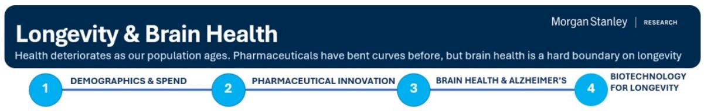

flowchart

1 / THE DEMOGRAPHIC AND COST SQUEEZE  
The US population stays roughly flat; the burden rises because the age mix changes.

18.8% -> 30.5%

Senior share of the population, 2026 to 2099.

\$22.4K vs \$9.2K

US Per-capita PHC spend for Seniors vs Adults.

11.7% -> \~13.1%

PHC share of GDP by 2050 from age mix alone.

\~9.0M seniors

Base-case US seniors with AD by 2050; \~7.1M today.

\$400-418B

Gross AD-related health spend by 2050; >\$1.2T by 2099.

\$28.7K vs \$8.2K

Senior annual HC spend with vs without AD/dementia.

2 / HISTORICAL CASE FOR PHARMACEUTICAL INNOVATION IS COMPELLING, BUT ALZHEIMER'S REMAINS HARD TO TREAT

Across eras, the biggest gains came when biology met a scalable intervention.

Vaccines

Smallpox (1796)

Prevention can eliminate mass mortality.

Endocrine

Insulin (1922)

Type 1 diabetes became survivable.

Anti-infectives

Penicillin (1944)

Bacterial infection became treatable.

Cardiovascular

BP + statins

Risk control cut stroke and renal death.

Oncology

Tamoxifen / imatinib

Targeted biology reshaped outcomes.

Virology

AZT / ART

Viral disease became suppressible.

Metabolic

GLP-1s

Obesity reframed as tractable risk.

3 / EARLY SIGNALS: PROGRESS, NOT A CURE

The clinical bar is high: amyloid clearance is not enough; function and safety matter.

EVOKE negative

Oral semaglutide missed in early AD; metabolic risk reduction is indirect.

\~0.45 CDR-SB

Lecanemab/donanemab show modest 18-month slowing.

Trontinemab signal

\~91% below amyloid threshold with ARIA-E <5%; delivery helps.

>300 trials

>99% failure rates with current approaches

4 / BIOTECHNOLOGY FOR BRAIN HEALTH & LONGEVITY: BBB DELIVERY PLATFORMS  
Shuttles delivered a paradigm shift for antibodies and suggest value in applying the same delivery for enzymes, oligonucleotides and DNA/RNA complexes

<table><tr><td>Company</td><td>Asset / platform</td><td>Target class</td><td>Specific target / epitope / cargo</td><td>Shuttle?</td><td>Delivery logic</td><td>Status / read</td></tr><tr><td colspan="7">Alzheimer&#x27;s ABETA PROGRAMS (SHUTTLE ENABLED)</td></tr><tr><td>Roche</td><td>Trontinemab</td><td>Abeta</td><td>Anti-amyloid</td><td>Yes</td><td>TfR1-Fab shuttle</td><td>Pivotal TRONTIER, 2028 readout</td></tr><tr><td>AbbVie</td><td>ALIA-1758</td><td>Abeta</td><td>Anti-pyroglutamate-Abeta</td><td>Yes</td><td>TfR + CD98hc dual receptor</td><td>Early clinic, Aliada acquisition</td></tr><tr><td>Akeso</td><td>AK152</td><td>Abeta</td><td>Soluble Abeta oligomers + BBB receptor</td><td>Yes</td><td>undisclosed BBB receptor</td><td>NMPA-cleared, receptor undisclosed</td></tr><tr><td>Denali</td><td>DNL921 (ATV:Abeta)</td><td>Abeta</td><td>aggregations of insoluble Aβ</td><td>Yes</td><td>ATV transport</td><td>IND-enabling studies</td></tr><tr><td colspan="7">Other PLATFORMS PROGRAMS (SHUTTLE ENABLED)</td></tr><tr><td>Denali</td><td>Avalayah</td><td>Other</td><td>IDS enzyme / Hunter syndrome</td><td>Yes</td><td>ETVtransport vehicle</td><td>Delivery-to-benefit link ex-AD</td></tr><tr><td>Alector</td><td>ABC platform</td><td>Other</td><td>Platform / cargo-dependent</td><td>Yes</td><td>Distinct TfR epitope</td><td>Lower retic/Fc risk, cash runway</td></tr><tr><td>JCR Pharma</td><td>Pabinafusp alfa</td><td>Other</td><td>IDS enzyme / Hunter syndrome</td><td>Yes</td><td>Anti-TfR / IDS</td><td>Japan approval</td></tr><tr><td>Novartis</td><td>SciNeuro CNS Ab</td><td>Other</td><td>CNS antibody target not disclosed</td><td>Yes</td><td>TfR-enabled antibody</td><td>Large-cap validation</td></tr><tr><td>LLY/GSK/ABL</td><td>Grabody-B</td><td>Other</td><td>Platform / cargo-dependent</td><td>Yes</td><td>IGF1R RMT receptor</td><td>Diversifies beyond TfR</td></tr><tr><td colspan="7">Alzheimer&#x27;s Tau PROGRAMS (only ARWR shuttle enabled)</td></tr><tr><td>Denali</td><td>DNL628 (OTV:MAPT)</td><td>Tau</td><td>MAPT pre-mRNA/mRNA(total-tau knockdown)</td><td>Yes</td><td>OTV transport vehicle</td><td>Phase 1b study of DNL628 initiated dosing in 1Q26</td></tr><tr><td>Arrowhead</td><td>ARO-MAPT / TRiM</td><td>Tau</td><td>MAPT mRNA(siRNA; total-tau knockdown)</td><td>Yes</td><td>BBB-penetrant TRiM (receptor undisclosed)</td><td>Phase 1/2a healthy volunteer data (3Q/4Q26), AD Phase 1/2a data in 2027</td></tr><tr><td>Pinteon Therapeutics</td><td>PNT001</td><td>Tau</td><td>Mid-domain cis pT231 tau</td><td>No</td><td>No shuttle</td><td>Phase 1, early/inactive 2023</td></tr><tr><td>Lundbeck</td><td>Lu AF87908</td><td>Tau</td><td>C-terminal tail</td><td>No</td><td>No shuttle</td><td>Phase 1, early/inactive 2023</td></tr><tr><td>Johnson &amp; Johnson</td><td>Posdinemab</td><td>Tau</td><td>Mid-domain pT217</td><td>No</td><td>No shuttle</td><td>Phase 2b AuTonomy, terminated 2025</td></tr><tr><td>AC Immune / Roche</td><td>Semorinemab</td><td>Tau</td><td>N-terminal domain</td><td>No</td><td>No shuttle</td><td>Phase 2 TAURIEL/LAURIET, terminated 2023</td></tr><tr><td>Biogen</td><td>BIIB076</td><td>Tau</td><td>Mid-domain</td><td>No</td><td>No shuttle</td><td>Phase 1, terminated 2022</td></tr><tr><td>Eli Lilly</td><td>Zagotenemab</td><td>Tau</td><td>N-terminal domain</td><td>No</td><td>No shuttle</td><td>Phase 2 PERISCOPE-ALZ, terminated 2021</td></tr><tr><td>Biogen / BMY</td><td>Gosuranemab</td><td>Tau</td><td>N-terminal domain</td><td>No</td><td>No shuttle</td><td>Phase 2 TANGO, terminated 2021</td></tr><tr><td>AbbVie / C2N</td><td>Tilavonemab</td><td>Tau</td><td>N-terminal domain</td><td>No</td><td>No shuttle</td><td>Phase 2, terminated 2021</td></tr></table>

KEY TAKEAWAY

The debate is whether a brain shuttle delivers a paradigm shift for how we treat brain health (and will take some time to evaluate).

Nearer-term, this positions symptomatic control as able to dampen the cost, at least until BBB platforms demonstrate their value.

## Executive Summary

Aging is shifting from a demographic observation into a portfolio-construction problem. The US does not need population growth for its health bill to rise. A larger senior cohort means higher per-capita consumption, more long-duration neurodegenerative disease, a heavier informal-care burden, and more pressure on public and private retirement systems. CBO forecasts show total population essentially flat through 2099 while the senior share rotates from \~18.8% to \~30.5%. Because seniors carry roughly 2.4x the per-capita health spend of working-age adults, that rotation is itself a spend escalator. PHC moves from \~11.7% of GDP today toward \~13%+ by 2050 on age mix alone. National health expenditure, already near \~18% of GDP, is widely projected toward \~25% by 2050; the age-mix channel we isolate is a structural tailwind beneath those forecasts, not a substitute for them.

The historical case for pharmaceutical innovation is strong, but Alzheimer's is where it is least proven. Drugs have repeatedly bent mortality curves: vaccines, antibiotics, statins, antiretrovirals, targeted oncology, and now GLP-1s for cardiometabolic disease. Research credits pharmaceuticals with roughly a third of recent US life-expectancy gains (behind public health, ahead of other medical care), and newer medicines also reduce downstream hospital and nursing-home utilization, so, drug value frequently shows up outside the drug line. Those class wins shared a similarity in that they address high-burden disease, a tractable target, and intervention before irreversible organ damage. That said, AD breaks the pattern. It is late-life, slowly progressive, multi-pathway, and measured by function and dependency rather than mortality alone. It is the test of whether the longevity playbook extends from cardiometabolism to the brain.

GLP-1s do belong firmly in the longevity thesis, but Novo Nordisk's EVOKE/EVOKE+ studies (here) tell us a broad systemic metabolic therapy does not modify established amyloid-positive early AD once the clinical cascade is underway. Biomarkers moved while cognition and function did not. We see GLP-1s as the foundational therapy for cardiometabolic-longevity but see little impact in their application to AD modification. The corollary is that the AD burden we model to accelerate is unlikely to be relieved by the franchises now dominating the longevity debate.

Exhibit 3: Summary of key numbers in our report

<table><tr><td>Number</td><td>What it means</td></tr><tr><td>349M → 364M → 349M</td><td>Total US population, 2026 → 2050 → 2099. Growth is essentially zero (~0.0004% CAGR); the story is mix, not size.</td></tr><tr><td>18.8% → 22.8% → 30.5%</td><td>Senior (65+) share of the population over the same horizon. Seniors are the only cohort that grows in absolute terms.</td></tr><tr><td>$22.4k vs $9.2k vs $4.4k</td><td>Per-capita PHC spend for seniors vs working-age adults vs children (2020). Seniors cost ~2.4x adults and ~5x children.</td></tr><tr><td>11.7% → ~13.1%</td><td>PHC as a share of GDP, 2026 → 2050, on age-mix rotation alone (1.8% straight-line PHC inflation). The escalator runs before any new drug class.</td></tr><tr><td>9.0M (vs ~12.7M)</td><td>Base-case US seniors with AD by 2050 (vs Alzheimer&#x27;s Association). ~7.1M today.</td></tr><tr><td>$400–418B</td><td>Base-case gross AD-related health spend by 2050 (vs ~$550B AA). Reaches &gt;$1.2T by 2099 under the same assumptions.</td></tr><tr><td>82% / 0.3%</td><td>Share of the 2019 ~$53.5k-per-patient dementia cost stack that is unpaid family care / pharmaceuticals. The burden lives outside the drug line.</td></tr><tr><td>$28,744 vs $8,223</td><td>Per-person annual HC spend for a senior with vs without AD/dementia (~3.5x). Medicare runs ~2.8–3x and Medicaid ~22x.</td></tr><tr><td>EVOKE / EVOKE+ negative</td><td>Oral semaglutide vs placebo in early AD (n=3,808): CDR-SB difference -0.06 (EVOKE) / +0.15 (EVOKE+), both non-significant; terminated Nov 2025.</td></tr><tr><td>0.45 CDR-SB / ~ $\frac{1}{3}$ </td><td>Lecanemab 18-month slowing (~27% relative) / donanemab approximate slowing. Modest, and amyloid clearance is already near-maximal.</td></tr><tr><td>91% &lt; threshold, ARIA-E &lt;5%</td><td>Trontinemab (3.6 mg/kg, ~28 weeks): share of patients cleared below amyloid positivity, with low ARIA-E. Delivery is solved; function is the proof point.</td></tr><tr><td>&gt;300 / &gt;99% / &gt;$600B</td><td>AD trials run, failure rate, and cumulative R&amp;D, 2000–2017. Why the burden is unsolved and the bar for new entrants is high.</td></tr></table>

Source: MS

We bucket exposure to the AD Longevity trade and opportunity into two distinct segments of the medical treatment stack. On #1, Disease Modification, Leqembi and Kisunla prove amyloid removal slows decline, but the effect is modest and amyloid clearance already looks near-maximal, implying a ceiling. Roche and Genentech's Trontinemab and other TfR brain shuttles may improve safety, dosing and access (Denali's first US shuttle approval shows the technology is clinically viable and competitive in rare disease) but in AD the technology must prove clinical effect (not just deeper biomarker outcomes). On #2, Symptomatic Control is likely to remain a mainstay, at least until disease modification changes the real-world trajectory, and psychosis and agitation remain an attractive point to intervene prior to hospitalization and institutionalized care. This stack just gained its first non-antipsychotic agitation drug (Axsome's Auvelity).

1. Disease modification (AbbVie, Aerska, Alector, Akeso, Denali, JCR, GSK, Eli Lilly, Novartis). Anti-amyloid approaches (Leqembi and Kisunla) build the foundation for disease-modification, at least until Trontinemab (Roche) improves safety and expands the eligible patient. In contrast to targeting amyloid, there are also several ongoing programs targeting intracellular tau. The data from these studies could solidy tau as a disease-modifying target in Alzheimer's disease, given tau pathology correlates more closely with neuronal dysfunction, neurodegeneration, and cognitive decline (than amyloid burden alone).

a. Maintenance dosing makes the installed base durable assuming good safety, even at a modest per-patient effect. That said, we believe there is also real value in platforms that can shuttle enzymes, protein replacement, oligonucleotides and tau. Intelligent delivery of macromolecules into the brain is a true bottleneck, overcome by DNLI (first US shuttle approval).

2. Symptomatic control (Axsome, Acadia, MapLight, BMS). The aging burden is slowly growing in problem scope and size. For this theme, the payoff depends on delaying progression, psychosis, hospitalization and institutionalization.

Exhibit 4: Metrics - AD longevity trade

<table><tr><td>Ticker</td><td>Company name</td><td>Market capitalization (MM)</td><td>Share price, last close</td><td>Close price currency</td><td>Price target</td><td>Up/downside to price target</td><td>Stock rating</td><td>Category</td></tr><tr><td>BIIB.O</td><td>Biogen Inc</td><td>$28,988</td><td>$195</td><td>USD</td><td>$206</td><td>5.5%</td><td>Equal-Weight</td><td>Disease Modifying</td></tr><tr><td>LLY.N</td><td>Eli Lilly &amp; Co.</td><td>$1,013,660</td><td>$1,156</td><td>USD</td><td>$1,344</td><td>18.8%</td><td>Overweight</td><td>Disease Modifying</td></tr><tr><td>ABBV.N</td><td>Abbvie</td><td>$403,106</td><td>$227</td><td>USD</td><td>$278</td><td>22.3%</td><td>Overweight</td><td>Disease Modifying Brain Shuttle</td></tr><tr><td>9926.HK</td><td>Akeso</td><td>$72,368</td><td>$94</td><td>HKD</td><td>$212</td><td>126.5%</td><td>Overweight</td><td>Disease Modifying Brain Shuttle</td></tr><tr><td>ALEC.O</td><td>Alector Inc</td><td>$162</td><td>$2</td><td>USD</td><td>$2</td><td>22.3%</td><td>Underweight</td><td>Disease Modifying Brain Shuttle</td></tr><tr><td>DNLI.O</td><td>Denali Therapeutics Inc</td><td>$3,643</td><td>$20</td><td>USD</td><td>$35</td><td>79.3%</td><td>Overweight</td><td>Disease Modifying Brain Shuttle</td></tr><tr><td>2162.HK</td><td>Keymed Biosciences</td><td>$14,110</td><td>$58</td><td>HKD</td><td>$97</td><td>66.1%</td><td>Overweight</td><td>Disease Modifying Brain Shuttle</td></tr><tr><td>NVS.N</td><td>Novartis AG</td><td>$291,608</td><td>$149</td><td>USD</td><td>$170</td><td>14.0%</td><td>Overweight</td><td>Disease Modifying Brain Shuttle</td></tr><tr><td>ROPC.S</td><td>Roche Holding AG</td><td>$262,363</td><td>$327</td><td>CHF</td><td>$295</td><td>(9.8%)</td><td>Equal-Weight</td><td>Disease Modifying Brain Shuttle</td></tr><tr><td>ACAD.O</td><td>Acadia Pharmaceuticals</td><td>$3,697</td><td>$22</td><td>USD</td><td>$26</td><td>20.6%</td><td>Equal-Weight</td><td>Symptom management</td></tr><tr><td>AXSM.O</td><td>Axsome Therapeutics</td><td>$11,909</td><td>$232</td><td>USD</td><td>$242</td><td>4.2%</td><td>Equal-Weight</td><td>Symptom management</td></tr><tr><td>BMY.N</td><td>Bristol Myers Squibb Co</td><td>$134,251</td><td>$57</td><td>USD</td><td>$40</td><td>(30.2%)</td><td>Underweight</td><td>Symptom management</td></tr><tr><td>MPLT.O</td><td>MapLight Therapeutics</td><td>$1,483</td><td>$28</td><td>USD</td><td>$34</td><td>21.4%</td><td>Overweight</td><td>Symptom management</td></tr></table>

Source: MS

Exhibit 5: Our framework for exposure to the AD longevity trade

<table><tr><td>Time Horizon</td><td>Category</td><td>Approach towards addressing AD</td><td>Current debate</td><td>Companies</td></tr><tr><td>Near</td><td>Symptomatic (AD Psychosis &amp; agitation)</td><td>Near-term spend bridge; hedge if shuttles fail</td><td>Placebo response and frail tolerability</td><td>AXSM, BMY, ACAD; MPLT</td></tr><tr><td>Medium</td><td>Disease modifying therapies (abeta , tau, etc)</td><td>Disease-trajectory infrastructure; the strategic prize</td><td>Does the amyloid ceiling cap function?</td><td>BIIB, LLY, Roche ARWR, JNJ, IONS</td></tr><tr><td>Long</td><td>Brain-shuttle / delivery platforms</td><td>Platform optionality; value beyond amyloid</td><td>What matters more, transport vehicle or the cargo inside?</td><td>ABBV, ALEC, DNLI, NVS, ABLBio, Aerska, Akeso, Keymed</td></tr><tr><td>Medium/Long</td><td>Care delivery (Home health, memory)</td><td>Burden absorption in care &amp; caregiver platforms</td><td>Reimbursement</td><td></td></tr><tr><td>Medium/Long</td><td>Diagnostics (Plasma pTau217 / blood biomarkers; PET/CSF)</td><td>Funnel control point for treatment and prevention</td><td>Adoption pace; payer gating</td><td></td></tr></table>

Source: MS

Our conclusion is scenario-based, not ratings-based. The durable way to underwrite this theme is to own the AD therapeutic stack with risk-adjusted exposure to two buckets: (1) Disease Modification (DM) for long-term upside (DNLI, ALEC, BIIB, LLY, Roche, Akeso) as emerging ex-US optionality, and (2) Symptomatic Behavioral Control (SBC) as the nearer-term bridge and the hedge for brain shuttle programs (ACAD, AXSM, BMY, MPLT). Meanwhile, diagnostics and care delivery, along with retirement and insurance complex, are likely to be positioned as beneficiary of a society forced to plan for longer but less certain late life.

## The Macro: Aging as a Spend and Fiscal Shock

## 1 The demographic shift: a flat population, a top-heavy mix

The first order variable is age mix, not population size. The Congressional Budget Office (CBO) forecasts extended demographic baseline (the January 2026 Demographic Outlook, Exhibit 6) across three buckets- children (0–19), working-age adults (20–64), and seniors (65+). For context, CBO models the "Social Security area population" which is comprised of broad U.S. resident population (plus Social Security–relevant individuals abroad) as the base for forecasting payroll tax revenues and entitlement spending. In their forecast, over the 2026–2099 horizon, children decline from \~81.8M to \~57.8M, working-age adults from \~201.6M to \~184.8M, and seniors rise from \~65.6M to \~106.5M. Total population barely moves (349M today to 349.1M in 2099), a \~0.0004% CAGR. In other words, the only cohort that grows is also the most expensive one. By 2034, US seniors will outnumber children (Exhibit 7).

Exhibit 6: CBO US Population forecast

<table><tr><td>Cohort</td><td>2026 (M)</td><td>2026 share</td><td>2050 (M)</td><td>2050 share</td><td>2099 (M)</td><td>2099 share</td></tr><tr><td>Children (0-19)</td><td>81.84</td><td>23.5%</td><td>70.34</td><td>19.3%</td><td>57.76</td><td>16.5%</td></tr><tr><td>Working-age adults (20-64)</td><td>201.57</td><td>57.8%</td><td>210.55</td><td>57.9%</td><td>184.82</td><td>52.9%</td></tr><tr><td>Seniors (65+)</td><td>65.55</td><td>18.8%</td><td>82.97</td><td>22.8%</td><td>106.48</td><td>30.5%</td></tr><tr><td>Total</td><td>348.955</td><td></td><td>363.860</td><td></td><td>349.057</td><td></td></tr></table>

Source: MS, CBO.gov

Exhibit 7: CBO US Population forecast  
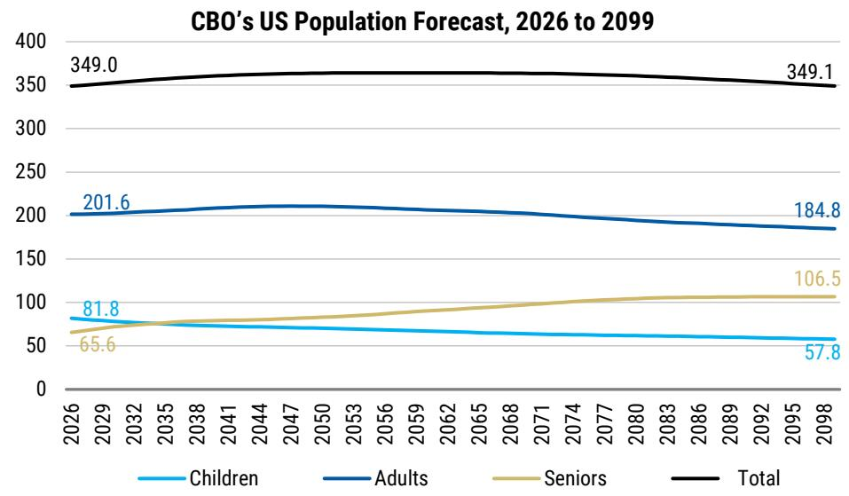

line chart

| Year | Children | Adults | Seniors | Total |
|------|----------|--------|---------|-------|
| 2026 | 81.8     | 201.6  | 65.6    | 349.0 |
| 2098 | 57.8     | 184.8  | 106.5   | 349.1 |

Source: MS, CBO.gov

## 2 The spend escalator: aging lifts the curve mechanically

Seniors consume health care out of proportion to their numbers. They are \~17% of the population but account for \~37% of personal health-care (PHC) spend and their spend already exceeds >10% of GDP (based on per-capita PHC of \~\$22,356 for seniors versus \~\$9,151 for adults and \~\$4,415 for children (2020 CMS figures, see Exhibit 8). Moving one person from the working-age bucket into the senior bucket therefore adds \~\$13k of

annual PHC. Therefore, the cost of aging is not linear in headcount but a change in the intensity of HC spend across the entire population.

The consequence is an escalator that runs without population growth or any new blockbuster. Holding PHC inflation at a straight-line 1.8% and applying our age-mix path, gross PHC rises from \~\$3.7T in 2026 (\~11.7% of GDP) to \~\$6.3T by 2050 (\~13.1% of GDP, see Exhibit 9), and to \~\$15.9T by 2099 (\~13.8%). The 2050 figure alone implies \~\$2.6T of incremental annual PHC versus today. Most of the increase is the senior line, which roughly doubles, while the children's line is nearly flat. By construction, the escalator is an age-mix effect layered on top of unit-cost inflation, not a story about either alone.

This is not a new trend so much as it is an accelerating one. On the historical series, seniors have been the fastest-growing US cohort for decades. In our view, the CBO baseline suggest a more dire end-state in that the population stops growing in aggregate while continuing to redistribute toward 65+. Working-age adults peak near \~211M around 2045–2050 and decline thereafter.

Exhibit 8: Average PHC spending age segment  
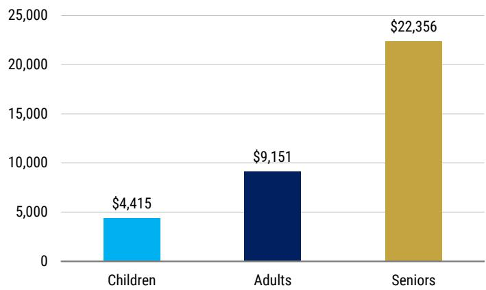

bar chart

| Category | Value ($) |
|---|---|
| Children | 4,415 |
| Adults | 9,151 |
| Seniors | 22,356 |

Source: MS, CBO.gov

Exhibit 9: Seniors drive PHC spend  
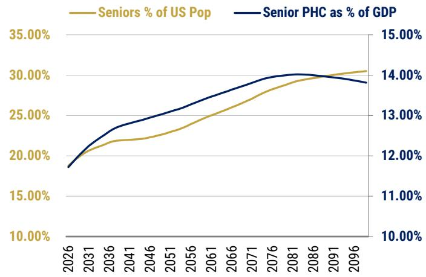

line chart

| Year | Seniors % of US Pop | Senior PHC as % of GDP |
|------|---------------------|------------------------|
| 2026 | 18.00%              | 12.00%                 |
| 2031 | 20.00%              | 12.50%                 |
| 2036 | 21.50%              | 13.00%                 |
| 2041 | 22.00%              | 13.50%                 |
| 2046 | 22.50%              | 14.00%                 |
| 2051 | 23.50%              | 14.50%                 |
| 2056 | 24.50%              | 15.00%                 |
| 2061 | 25.50%              | 15.50%                 |
| 2066 | 26.50%              | 16.00%                 |
| 2071 | 27.50%              | 16.50%                 |
| 2076 | 28.50%              | 17.00%                 |
| 2081 | 29.50%              | 17.50%                 |
| 2086 | 30.00%              | 17.50%                 |
| 2091 | 30.50%              | 17.50%                 |
| 2096 | 31.00%              | 17.50%                 |

Source: MS, CBO.gov

For context, total US national health expenditure already sits near \~18% of GDP, and based on CBO /CMS forecasts is projected toward \~25% by 2060 (Exhibit 10). The age-mix we isolate here is a structural tailwind underpinning those forecasts. Our investment view is that pharmaceutical innovation is needed to meet the growing demand-side exposure to aging related care managed care, hospital and post-acute services, home-based care, and diagnostics.

Exhibit 10: Aging population increases HC spend, and HC spend drastically increases for seniors with AD

<table><tr><td>Year</td><td>Total pop (M)</td><td>Gross PHC ($B)</td><td>GDP ($B)</td><td>PHC/GDP</td><td>Seniors (M)</td><td>Senior share</td><td>Seniors with AD (M)</td><td>Per-capita AD spend ($)</td><td>Gross AD spend ($B)</td></tr><tr><td>2026</td><td>349</td><td>$3,671</td><td>$31,321</td><td>11.7%</td><td>65.6</td><td>18.8%</td><td>7.1</td><td>$28,744</td><td>$205</td></tr><tr><td>2030</td><td>352.7</td><td>$4,087</td><td>$33,638</td><td>12.1%</td><td>71.9</td><td>20.4%</td><td>7.8</td><td>$31,113</td><td>$244</td></tr><tr><td>2040</td><td>360.8</td><td>$5,138</td><td>$40,207</td><td>12.8%</td><td>79.2</td><td>22.0%</td><td>8.6</td><td>$37,927</td><td>$328</td></tr><tr><td>2050</td><td>363.9</td><td>$6,279</td><td>$48,060</td><td>13.1%</td><td>83</td><td>22.8%</td><td>9</td><td>$46,233</td><td>$418</td></tr><tr><td>2060</td><td>364.1</td><td>$7,715</td><td>$57,446</td><td>13.4%</td><td>90.3</td><td>24.8%</td><td>9.8</td><td>$56,358</td><td>$555</td></tr><tr><td>2070</td><td>363.6</td><td>$9,459</td><td>$68,665</td><td>13.8%</td><td>97.7</td><td>26.9%</td><td>10.6</td><td>$68,700</td><td>$731</td></tr><tr><td>2080</td><td>360.7</td><td>$11,495</td><td>$82,076</td><td>14.0%</td><td>104.4</td><td>28.9%</td><td>11.4</td><td>$83,745</td><td>$953</td></tr><tr><td>2090</td><td>355.1</td><td>$13,693</td><td>$98,106</td><td>14.0%</td><td>106.4</td><td>30.0%</td><td>11.6</td><td>$102,084</td><td>$1,184</td></tr><tr><td>2099</td><td>349.1</td><td>$15,913</td><td>$115,192</td><td>13.8%</td><td>106.5</td><td>30.5%</td><td>11.6</td><td>$122,000</td><td>$1,416</td></tr></table>

Source: MS, Alzheimer's Association FactSheet, CBO.gov, CMS.gov

This is likely to be a conservative baseline. A stable population requires a total fertility rate (TFR) of $\sim 2.1$ ; US TFR was $\sim 1.6$ in 2024 and the broad developed-market trend is down. Globally, TFR was $\sim 2.39$ in 2024 and is projected to fall to $\sim 1.91$ by 2054 (passing below the replacement line around mid-decade), with Europe ( $\sim 1.44$ ) and North America ( $\sim 1.62$ ) already well beneath it (Exhibit 11). We assume TFR and net immigration deviate around the CBO baseline (baseline TFR=1.6 and $\sim 1.1$ M net immigration per year). Lower fertility or lower immigration would deepen the senior tilt and the fiscal drag we describe. Neither lever, at plausible assumptions, reverses the rotation within the forecast window, suggesting the direction is structural, not cyclical.

Exhibit 11: United Nations TFR (total fertility rate) by continent and by forecast year

<table><tr><td></td><td>TFR 1994</td><td>TFR 2024</td><td>TFR 2054</td><td>Year TFR below 2.1</td></tr><tr><td>Europe</td><td>1.65902439</td><td>1.436829268</td><td>1.512195122</td><td>1974</td></tr><tr><td>Carribean</td><td>1.856</td><td>1.654</td><td>1.624</td><td>1983</td></tr><tr><td>North America</td><td>2.27</td><td>1.616666667</td><td>1.576666667</td><td>1987</td></tr><tr><td>Asia &amp; Pacific</td><td>3.423939394</td><td>2.017878788</td><td>1.732121212</td><td>2020</td></tr><tr><td>Latin America</td><td>3.235</td><td>1.875</td><td>1.6890625</td><td>2020</td></tr><tr><td>Middle East</td><td>3.862916667</td><td>2.270833333</td><td>1.858333333</td><td>2029</td></tr><tr><td>Africa</td><td>5.768627451</td><td>3.919607843</td><td>2.585294118</td><td>2078</td></tr><tr><td>GLOBAL</td><td>3.637724868</td><td>2.396931217</td><td>1.918042328</td><td>2025</td></tr></table>

Source: MS, UN

Who actually pays the senior line? The escalator is not just a national-accounts statistic; it lands on identifiable balance sheets, and disproportionately on the federal one. Seniors' \~37% of personal health-care spend flows substantially through Medicare, while the long-term-care tail flows through Medicaid once private assets are spent down (so age-mix rotation is, in practice, a federal outlay rotation). Neurodegeneration is the most concentrated expression of that transmission. A senior with dementia costs Medicare on the order of 2.8–3× a senior without it, and costs Medicaid roughly 22× more (Exhibit 12). The latter multiple because Medicaid is the default payer of last resort for nursing-home and custodial care, which dementia drives more than almost any other condition. AD therefore sits at the exact intersection of the two largest federal health programs, and its prevalence growth is a meaningful direct claim on federal budget outlays.

Exhibit 12: Care for Seniors with dementia is meaningfully higher than Seniors without dementia. Dementia is the deciding cost driver.  
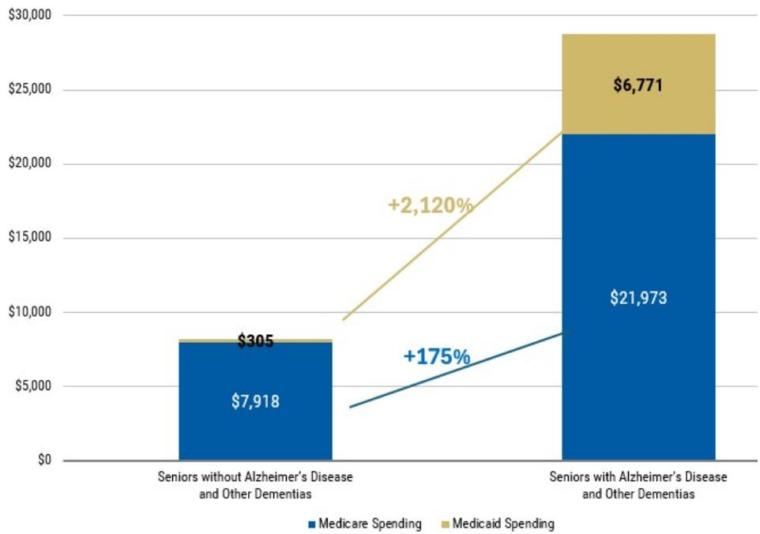

bar-line hybrid

| Category | Medicare Spending ($) | Medicaid Spending ($) | Total ($) |
|---|---|---|---|
| Seniors without Alzheimer's Disease and Other Dementias | 7,918 | 205 | 305 |
| Seniors with Alzheimer's Disease and Other Dementias | 21,973 | 6,771 | 28,425 |

Source: MS, Alzheimer's Association FactSheet

## Two features make the fiscal exposure larger than the headline medical cost suggests.

First, dual eligibility: AD patients disproportionately exhaust private resources and become dual Medicare–Medicaid beneficiaries, the highest-cost cohort in either program, so the disease manufactures the most expensive category of public-payer enrollee. Second, the informal-care subsidy. The \~82% of the dementia cost is assumed by family member loss of productivity during unpaid family care (Exhibit 8). This is, in effect, a private family-held backstop holding cost off the public healthcare and coming with a strain on productivity and GDP. To the extent that subsidy erodes (as the caregiver pool shrinks with the same demographic rotation that drives the escalator), the burden migrates onto Medicaid LTC. The value-of-delay argument is therefore that any therapy that delays institutionalization defers the single most Medicaid-intensive cost for senior longevity.

## 3 Alzheimer's accelerates the strain on our system, and is only forecasted to grow

Across high-income economies, life expectancy has risen to an apparent ceiling near \~80 years, while healthspan (years lived without severe disease-driven impairment) has plateaued closer to \~70yrs. In other words, the last decade of life continued to be defined by lack of healthspan, i.e., impairment (Exhibit 13). These data are global, and while in the US the levels are lower (life expectancy \~74–76, healthspan \~64–66), the dynamic is the same and potentially starker (the morbidity gap in US only between the two has widened from \~4.5 years in 2000 to \~11 years by 2021). We are not, on the whole, adding healthy years, but instead are adding impaired ones.

Alzheimer's disease (AD) is the disease that most efficiently converts longevity into the impaired-years gap. It is age-indexed, progressive, and dependency-defining. As the senior cohort grows, the absolute count of impaired late-life years grows with it. The underlying epidemiology is steep (Exhibit 14) clinical AD prevalence rises from \~6.1M in 2020 toward \~12.7M by 2050 according to Alzheimer's Association (AA) forecast. Mild cognitive impairment (MCI), potentially a funnel that feeds into AD, climbs from \~12.2M to \~19.3M over the same window.

Exhibit 13: Healthspan (years without severe impairment) ends in the last decade of life  
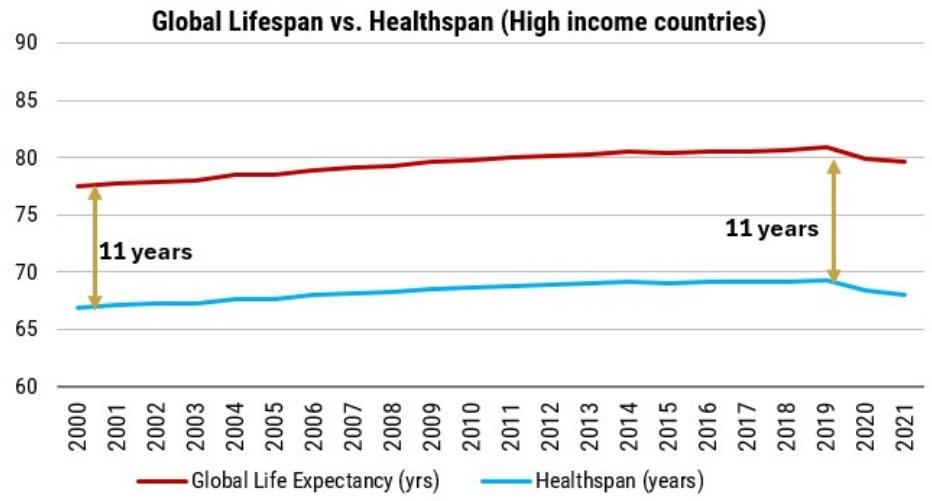

line chart

Global Lifespan vs. Healthspan (High income countries)
| Year | Global Life Expectancy (yrs) | Healthspan (years) |
|---|---|---|
| 2000 | 77.5 | 66.8 |
| 2001 | 77.7 | 67.0 |
| 2002 | 77.9 | 67.1 |
| 2003 | 78.1 | 67.2 |
| 2004 | 78.4 | 67.4 |
| 2005 | 78.5 | 67.5 |
| 2006 | 78.8 | 67.7 |
| 2007 | 79.0 | 67.9 |
| 2008 | 79.2 | 68.1 |
| 2009 | 79.5 | 68.3 |
| 2010 | 79.8 | 68.5 |
| 2011 | 80.1 | 68.7 |
| 2012 | 80.3 | 68.9 |
| 2013 | 80.5 | 69.0 |
| 2014 | 80.7 | 69.1 |
| 2015 | 80.6 | 69.0 |
| 2016 | 80.7 | 69.1 |
| 2017 | 80.8 | 69.2 |
| 2018 | 80.9 | 69.3 |
| 2019 | 81.1 | 69.4 |
| 2020 | 80.3 | 68.5 |
| 2021 | 79.8 | 67.9 |

Source: MS, Alzheimer's Association FactSheet, CBO.gov, CMS.gov

Our own base case is deliberately more conservative on the count. We derive AD prevalence internally by applying an age-structured rate to the CBO senior population, which carries US AD from \~7.1M today to \~9.0M by 2050 (Exhibit 15), below the Alzheimer's Association estimate of \~12.7M. We treat the AA figure as the bull/stress case and our internal series as the base. Either way the direction and the burden are unambiguous, and AD sits squarely inside the widening gap. Translated into spend, this carries gross AD-related health spend from \~\$205B today to \~\$400B by 2050 (versus the AA's \~\$550B), reaching >\$1.2T by 2099 under the same inflation assumption.

Exhibit 14: AD prevalence continues to increase, and is estimated to surpass 10M US adults by 2035  
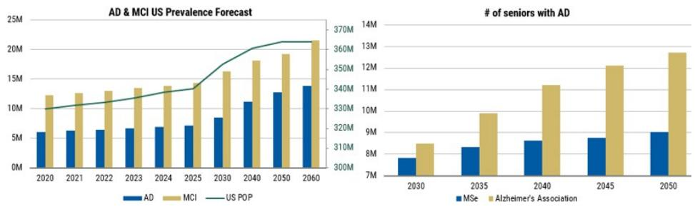

bar-line hybrid

AD & MCI US Prevalence Forecast
| Year | AD (MSE) | MCI (MSE) | US POP (US POP) | # of seniors with AD (AD) | # of seniors with AD (MSE) | # of seniors with AD (MCI) | # of seniors with AD (US POP) |
|---|---|---|---|---|---|---|---|
| 2020 | 6000000 | 12500000 | 10000000 | 7000000 | 8000000 | 8500000 | 13500000 |
| 2021 | 6200000 | 12800000 | 10200000 | 7500000 | 8500000 | 9000000 | 14000000 |
| 2022 | 6400000 | 13100000 | 10400000 | 8250000 | 9250000 | 9500000 | 14555555 |
| 2023 | 6600000 | 13455555 | 10655555 | 9125000 | 9750000 | 10125000 | 15125e |
| 2024 | 6855555 | 13828888 | 11128888 | 1.1125e+13 | 1.1125e+13 | 11128888 | 15788888 |
| 2025 | 7128888 | 14214444 | 11634444 | 1.362e+13 | 1.362e+13 | 12664444 | 16464444 |
| 2030 | - | 16267777 | 17777777 | - | - | - | - |
| 2040 | - | 18333333 | 23933333 | - | - | - | - |
| 2050 | - | 19499999 | 26299999 | - | - | - | - |
| 2060 | - | 21676666 | 27676666 | - | - | - | - |

# AD & MCI US Prevalence Forecast
| Year | AD (MSE) | MCI (MSE) | US POP (US POP) |
|---|---|---|---|
| 2030 | - | - | - |
| 2035 | - | - | - |
| 2040 | - | - | - |
| 2045 | - | - | - |
| 2050 | - | - | - |
The chart displays two data series: AD and MCI. The AD series is a bar chart, and the MCI series is a line chart. The US Pop series is a line chart. The number of seniors with AD is also shown as a separate bar chart. The x-axis represents years from 2030 to 2060. The y-axis represents the number of seniors with AD in millions.

Source: MS, Alzheimer's Association FactSheet

Exhibit 15: AD prevalence, gross spend, and per capita spend (MSe vs Alzheimer's association forecast)  
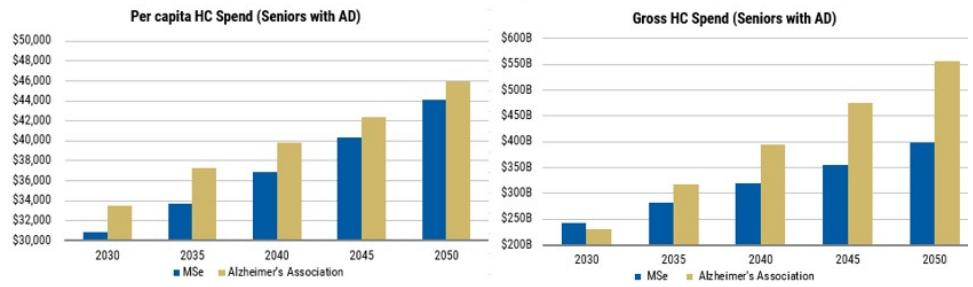

bar chart

| Year | Per capita HC Spend (Seniors with AD) - MSe | Per capita HC Spend (Seniors with AD) - Alzheimer's Association | Gross HC Spend (Seniors with AD) - MSe | Gross HC Spend (Seniors with AD) - Alzheimer's Association |
|---|---|---|---|---|
| 2030 | $31,000 | $34,000 | $240B | $230B |
| 2035 | $33,500 | $37,500 | $270B | $310B |
| 2040 | $36,500 | $40,000 | $315B | $390B |
| 2045 | $40,000 | $42,500 | $355B | $470B |
| 2050 | $44,500 | $46,500 | $395B | $560B |

Source: MS, Fang et al, Rajan et al 2022

We model \$50B in US AD market opportunity is achievable even after a heavily constrained eligibility funnel. Translating that framework to Alzheimer's highlights both the scale and the constraint embedded in the category. Starting from a large base (\~7M+ US patients), the funnel quickly compresses, but still resolves to a \~\$50B US market opportunity under current assumptions (positivity is required, see Exhibit 16). 50% are mild and form the base, plus 30% moderate, netting 80% addressable. Importantly, we exclude 70% of that pool (amyloid burden is both more difficult to clear and more likely to be vascular-adjacent, increasing safety risk and limiting treatability).

Exhibit 16: AD market sizing

<table><tr><td></td><td>2026</td><td>2027</td><td>2028</td><td>2029</td><td>2030</td></tr><tr><td colspan="6">Size of the Social Security area population (millions)</td></tr><tr><td>Total</td><td>349.0</td><td>349.8</td><td>350.7</td><td>351.7</td><td>352.7</td></tr><tr><td>Children (excluded)</td><td>81.8</td><td>80.9</td><td>80.0</td><td>79.0</td><td>78.3</td></tr><tr><td>Adults (excluded)</td><td>201.6</td><td>201.6</td><td>201.9</td><td>202.2</td><td>202.6</td></tr><tr><td>Seniors</td><td>65.6</td><td>67.3</td><td>68.9</td><td>70.4</td><td>71.9</td></tr><tr><td>Seniors with AD</td><td>11%</td><td>7.20</td><td>7.39</td><td>7.57</td><td>7.74</td></tr><tr><td>severe (excluded)</td><td>20%</td><td>1.44</td><td>1.48</td><td>1.51</td><td>1.55</td></tr><tr><td>moderate</td><td>30%</td><td>2.16</td><td>2.22</td><td>2.27</td><td>2.32</td></tr><tr><td>mild</td><td>50%</td><td>3.60</td><td>3.69</td><td>3.78</td><td>3.87</td></tr><tr><td>Mild to moderate AD</td><td>5.76</td><td>5.91</td><td>6.05</td><td>6.19</td><td>6.31</td></tr><tr><td>Eligible for therapy</td><td>30%</td><td>1.73</td><td>1.77</td><td>1.82</td><td>1.86</td></tr><tr><td>Average list price</td><td>$28,754</td><td>$29,042</td><td>$29,332</td><td>$29,625</td><td>$29,922</td></tr><tr><td>Kisunla list price (6 mo duration)</td><td>$12,522</td><td></td><td></td><td></td><td></td></tr><tr><td>Kisunla list price (12 mo duration)</td><td>$25,044</td><td></td><td></td><td></td><td></td></tr><tr><td>Kisunla list price (18 mo duration)</td><td>$48,696</td><td></td><td></td><td></td><td></td></tr><tr><td>AD market size ($M, USD)</td><td>$49,687</td><td>$51,498</td><td>$53,278</td><td>$55,005</td><td>$56,681</td></tr></table>

Source: MS,

From clinical burden to fiscal and productivity drag. AD is a macro driver in that its societal cost is overwhelmingly a care cost, and much of that care is unpaid labor withdrawn from the economy. In our view, this setup is also what makes the GLP-1 upset with the EVOKE/EVOKE+ study matter. If the cardiometabolic toolkit could have delayed AD onset at scale, the steepest part of the spend curve would bend on its own. EVOKE/EVOKE+ suggests it will not, and that there is an enduring and increasing AD-specific strain on HC resources that the system must absorb. The rest of this note asks which companies in this space are making meaningful inroads towards limiting this strain across scenarios, and key beneficiaries per scenario.

## Can Pharmaceutical Innovation Bend the AD Curve?

## 4 The GLP-1 boundary and why is AD harder to crack?

Pharmaceutical innovation has been one of the great longevity engines of the modern era. Independent attributions credit pharmaceuticals with roughly a third of US life-expectancy gains over recent decades (Exhibit 17), behind public health and ahead of other medical care. The landmark wins (as early as smallpox vaccine and later other vaccines, insulin, penicillin, thiazide diuretics, statins, antiretrovirals, imatinib and the targeted-oncology wave, and most recently GLP-1s) share a similarity. They all address a prevalent, high-burden disease using a tractable molecular target plus the ability to intervene before irreversible pathology dominates the clinical outcome.

Exhibit 17: Landmark pharmaceutical innovations dramatically accelerated in the 1900's

<table><tr><td>Class</td><td>Landmark approval</td><td>Why it bent the mortality curve</td></tr><tr><td>Vaccines</td><td>Smallpox (1796)</td><td>First proof that prevention could eliminate mass mortality; shifted life expectancy upward at the population level</td></tr><tr><td>Endocrine</td><td>Insulin (1922)</td><td>Converted Type 1 diabetes from a death sentence into a survivable chronic condition</td></tr><tr><td>Anti-infectives</td><td>Penicillin (1944)</td><td>Turned bacterial infection from a leading cause of death into a treatable event</td></tr><tr><td>Cardiovascular</td><td>Thiazides (1958) statins (1987)</td><td>Long-term BP and lipid control cut stroke, heart failure and renal death (mid- and late-life mortality drivers)</td></tr><tr><td>Oncology</td><td>Tamoxifen (1977) imatinib (2001)</td><td>Targeting tumor biology produced near-normal life expectancy in once-lethal cancers; reshaped R&amp;D economics</td></tr><tr><td>Virology</td><td>AZT / antiretrovirals (1987)</td><td>Demonstrated a lethal viral disease could be pharmacologically suppressed</td></tr><tr><td>Metabolic</td><td>GLP-1s: exenatide (2005) semaglutide (2021)</td><td>Reframed obesity as pharmacologically tractable; longevity impact is indirect via cardiovascular, diabetic and renal risk</td></tr></table>

Source: MS,, WHO NCD Data

The morbidity gap is the demographic fingerprint of the disease mix that now dominates late life. As infectious and perinatal mortality have been pushed down, the residual is overwhelmingly non-communicable (Exhibit 18). Across the global cause-of-death distribution, non-communicable diseases rose from \~59% of deaths in 2000 to \~63% by 2021 (Exhibit 19), while communicable, maternal and perinatal causes fell from \~32% to \~27%.

Exhibit 18: Innovation impact on mortality (green bars signify reduced mortality rate)

<table><tr><td rowspan="2">Cause of death</td><td colspan="2">2021</td><td colspan="2">2000</td><td rowspan="2">abs % change</td></tr><tr><td>Deaths (000s)</td><td>% of total deaths</td><td>Deaths (000s)</td><td>% of total deaths</td></tr><tr><td>All Causes</td><td>68,313</td><td>100.0%</td><td>51,504</td><td>100.0%</td><td></td></tr><tr><td>Communicable, maternal, perinatal and nutritional conditions</td><td>18,660</td><td>27.3%</td><td>16,674</td><td>32.4%</td><td>(5.1%)</td></tr><tr><td>A. Infectious and parasitic diseases</td><td>5,021</td><td>7.3%</td><td>9,596</td><td>18.6%</td><td>11.3%</td></tr><tr><td>B. Respiratory Infectious</td><td>11,197</td><td>16.4%</td><td>2,897</td><td>5.6%</td><td>10.8%</td></tr><tr><td>C. Maternal conditions</td><td>259</td><td>0.4%</td><td>411</td><td>0.8%</td><td>(0.4%)</td></tr><tr><td>D. Neonatal conditions</td><td>1,927</td><td>2.8%</td><td>3,297</td><td>6.4%</td><td>(3.6%)</td></tr><tr><td>E. Nutritional deficiencies</td><td>257</td><td>0.4%</td><td>473</td><td>0.9%</td><td>(0.5%)</td></tr><tr><td>Noncommunicable diseases</td><td>43,329</td><td>63.4%</td><td>30,534</td><td>59.3%</td><td>4.1%</td></tr><tr><td>A. Malignant neoplasms</td><td>9,805</td><td>14.4%</td><td>6,850</td><td>13.3%</td><td>1.1%</td></tr><tr><td>B. Other neoplasms</td><td>137</td><td>0.2%</td><td>75</td><td>0.1%</td><td>0.1%</td></tr><tr><td>C. Diabetes mellitus</td><td>1,617</td><td>2.4%</td><td>828</td><td>1.6%</td><td>0.8%</td></tr><tr><td>D. Endocrine, blood, immune disorders</td><td>313</td><td>0.5%</td><td>174</td><td>0.3%</td><td>0.1%</td></tr><tr><td>E. Mental and substance use disorders</td><td>348</td><td>0.5%</td><td>240</td><td>0.5%</td><td>0.0%</td></tr><tr><td>F. Neurological conditions</td><td>2,543</td><td>3.7%</td><td>1,020</td><td>2.0%</td><td>1.7%</td></tr><tr><td>G. Sense organ diseases</td><td>1</td><td>0.0%</td><td>0</td><td>0.0%</td><td>0.0%</td></tr><tr><td>H. Cardiovascular diseases</td><td>19,205</td><td>28.1%</td><td>14,178</td><td>27.5%</td><td>0.6%</td></tr><tr><td>I. Respiratory diseases</td><td>4,281</td><td>6.3%</td><td>3,517</td><td>6.8%</td><td>(0.6%)</td></tr><tr><td>J. Digestive diseases</td><td>2,499</td><td>3.7%</td><td>1,991</td><td>3.9%</td><td>(0.2%)</td></tr><tr><td>K. Genitourinary diseases</td><td>1,770</td><td>2.6%</td><td>892</td><td>1.7%</td><td>0.9%</td></tr><tr><td>L. Skin diseases</td><td>93</td><td>0.1%</td><td>47</td><td>0.1%</td><td>0.0%</td></tr><tr><td>M. Musculoskeletal diseases</td><td>163</td><td>0.2%</td><td>94</td><td>0.2%</td><td>0.1%</td></tr><tr><td>N. Congenital anomalies</td><td>526</td><td>0.8%</td><td>567</td><td>1.1%</td><td>(0.3%)</td></tr><tr><td>O. Oral conditions</td><td>2</td><td>0.0%</td><td>1</td><td>0.0%</td><td>0.0%</td></tr><tr><td>P. Sudden infant death syndrome</td><td>27</td><td>0.0%</td><td>61</td><td>0.1%</td><td>(0.1%)</td></tr><tr><td>Injuries</td><td>4,480</td><td>6.6%</td><td>4,297</td><td>8.3%</td><td>(1.8%)</td></tr><tr><td>A. Unintentional injuries</td><td>3,144</td><td>4.6%</td><td>2,919</td><td>5.7%</td><td>(1.1%)</td></tr><tr><td>B. Intentional injuries</td><td>1,336</td><td>2.0%</td><td>1,378</td><td>2.7%</td><td>(0.7%)</td></tr><tr><td>C. Other COVID-19 pandemic-related outcomes</td><td>1,843</td><td>2.7%</td><td>0</td><td>0.0%</td><td>2.7%</td></tr></table>

Source: MS, WHO NCD Data

Exhibit 19: Mortality driven by non-communicable diseases over communicable disease)  
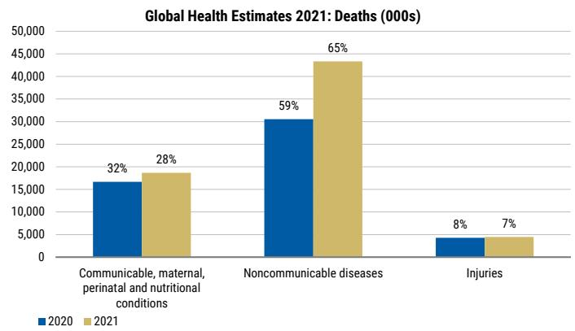

bar chart

Global Health Estimates 2021: Deaths (000s)
| Category | 2020 (in 100s) | 2021 (in 100s) | Percentage (%) |
| :--- | :--- | :--- | :--- |
| Communicable, maternal, perinatal and nutritional conditions | 17,000 | 19,000 | 32 |
| Noncommunicable diseases | 30,000 | 43,500 | 59 |
| Injuries | 4,500 | 4,500 | 8 |
The chart displays a stacked bar chart with two bars per category representing the years 2020 and 2021. The percentage of total deaths is also labeled above each bar. The data is presented in a table format as follows: 'Communicable, maternal, perinatal and nutritional conditions' and 'Noncommunicable diseases'.

Source: MS, WHO NCD Data

In contrast, AD remains the largest, single-indication driver of US mortality (Exhibit 20), with the exception of COVID-19. Cardiovascular and cancer remain the top causes of US mortality, however they each encompass several dozens of sub-indications within. Pharmaceutical and public-health progress, in other words, has converted acute lethal disease into chronic, managed, and ultimately dependency-defining disease and the data suggest the largest incremental benefit will come from tackling AD.

Exhibit 20: US major drivers of mortality  
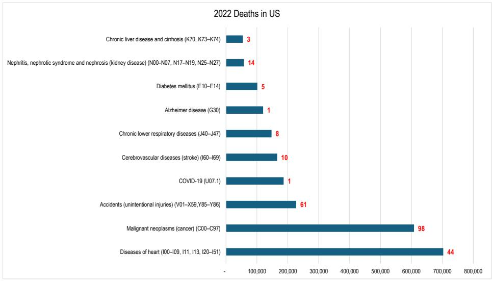

bar chart

2022 Deaths in US
| Cause of Death | Deaths |
| :--- | :--- |
| Chronic liver disease and cirrhosis (K70, K73–K74) | 3 |
| Nephritis, nephrotic syndrome and nephrosis (kidney disease) (N00–N07, N17–N19, N25–N27) | 14 |
| Diabetes mellitus (E10–E14) | 5 |
| Alzheimer disease (G30) | 1 |
| Chronic lower respiratory diseases (J40–J47) | 8 |
| Cerebrovascular diseases (stroke) (I60–I69) | 10 |
| COVID-19 (U07.1) | 1 |
| Accidents (unintentional injuries) (V01–X59,Y85–Y86) | 61 |
| Malignant neoplasms (cancer) (C00–C97) | 98 |
| Diseases of heart (I00–I09, I11, I13, I20–I51) | 44 |

Source: MS, cdc.gov

- GLP-1 receptor agonists are among the strongest recent example of longevity-relevant pharmacology: they act on obesity, diabetes, cardiovascular and renal risk, and a widening set of comorbidities. The epidemiological and preclinical hints that they might also protect the brain were strong enough to justify the largest, longest GLP-1 trials ever run in a neurodegenerative disease. That makes their AD result a uniquely clean boundary condition at the centre of the longevity question.  
- In EVOKE/EVOKE+ (n of \~3,800 adults ages 55–85 with MCI/mild dementia due to AD, PET confirmed) evaluating oral semaglutide 14mg vs placebo on top of standard of care was evaluated for primary endpoint change in CDR-SB at week

104. Semaglutide did not slow progression. The CDR-SB difference versus placebo was -0.06 in EVOKE (95% CI -0.48 to 0.36) and +0.15 in EVOKE+ (-0.24 to 0.54), neither significant; secondary cognitive and functional measures (ADCS-ADL-MCI, MCI-to-dementia progression, MMSE, ADAS-Cog, ADCOMS) were also negative. AD biomarkers improved modestly but did not translate into clinical benefit. Novo announced the top-line failure on November 24, 2025 and discontinued the one-year extensions, ending the AD program. This implies that the obesity/diabetes franchises that dominate today's longevity conversation are unlikely to relieve the AD burden we model.

## 5 The Amyloid Hypothesis and current treatment landscape for AD

1. Amyloid hypothesis. Leqembi and Kisunla are the first therapies to slow cognitive and functional decline rather than merely ease symptoms, validating that removing amyloid alters disease trajectory and, with it, the amyloid cascade hypothesis (Exhibit 21) that has guided the field for 25+ years. Behind the two approved agents sits a broad, diversifying pipeline that defines the menu of 'next levers'. Beyond next-generation amyloid antibodies, the field is pursuing tau (antibodies, aggregation inhibitors, and antisense oligonucleotides, with an NIH-led platform testing tau agents alone and in combination with an amyloid antibody). Most of these remain unproven (tau antibodies and oligodendrocyte/neuroimmune modulators have had a recent string of failures).

Exhibit 21: The AD therapeutic landscape (by mechanism)

<table><tr><td>Hypothesized Culprit</td><td>Approach</td><td>Current status</td></tr><tr><td>Amyloid</td><td>mAbs (lecanemab, donanemab, trontinemab); next-gen vaccines; γ-secretase modulators</td><td>Validated but modest the ceiling debate</td></tr><tr><td>Tau</td><td>Anti-tau antibodies; aggregation inhibitors; ASOs (e.g. MAPT-lowering)</td><td>No approvals yet; NIH tau platform; combination logic</td></tr><tr><td>Neuroinflammation</td><td>TREM2 activation (AL002); complement; cytokine blockade</td><td>AL002 Phase 2 underwhelmed</td></tr><tr><td>Cholinergic / neurotransmitter</td><td>Cholinesterase inhibitors, memantine (symptomatic); muscarinic agonism</td><td>Symptomatic only; muscarinics have potential to reduce psychosis. Mainstay therapies used to improve memory (aricept, namenda)</td></tr><tr><td>Metabolic / vascular</td><td>GLP-1s (EVOKE neg.); intranasal insulin; BP/lipid control</td><td>Treatment in established AD not supported; prevention open</td></tr><tr><td>Proteostasis / gut-brain</td><td>Lysosomal re-acidification; microbiome modulation (e.g. GV-971)</td><td>Experimental; long-dated optionality</td></tr></table>

Source: MS, Alzheimer's Association FactSheet

There appears to be a PD ceiling which is best understood as an exposure–response problem. If the marginal cognitive benefit of the last increment of plaque removed is already small, then clearing that plaque faster, deeper, or at lower systemic exposure yields a bounded effect. With current treatments approaching their practical limit for amyloid clearance, we believe value migrates to whichever non-amyloid node, or combination, moves the needle for patients (who care more about cognition than biomarkers).

\- Biogen's Leqembi (lecanemab) slowed decline by \~0.45 CDR-SB points at 18 months (\~27% relative) in Clarity AD. In TRAILBLAZER-ALZ2, Eli Lilly's Kisunla (donanemab) showed roughly one-third slowing on its primary scale. Both require biomarker confirmation, infusion, and serial MRI monitoring for amyloid-related imaging abnormalities (ARIA), and both are priced in the \~\$30k/year range. The pattern is most consistent with amyloid being necessary but not sufficient, or with intervention coming too late in the cascade.

\- Roche's trontinemab is the AD bellwether. It fuses the anti-amyloid antibody gantenerumab to a monovalent TfR1 Fab, using brain-shuttle transcytosis to reach the parenchyma at far higher exposure than a conventional mAb, clearing amyloid rapidly and deeply. \~90% of patients below the positivity threshold (24 centiloids), with mean reductions near \~100 centiloids and ARIA-E rates under 5% in early data. Directional improvements were seen across amyloid, tau, synaptic and neuroimmune biomarkers like plasma NfL and GFAP.

2. Neuroinflammation has been implicated but with no causal links fully established. That said, microglial modulation (TREM2 activation, complement and cytokine approaches), synaptic and metabolic protection, proteostasis/lysosomal repair, and the gut-brain axis are all meaningfully disrupted with AD pathology.

\- Prior programs have explored TREM2 activation (notably Alector's AL002 and Denali's DNL-919), all with limited success. That said, Sanofi acquired Vigil and VG-3927, its small molecule TREM2 program.

## 6. AD Symptom Management - current exposures

Alzheimer's Behavioral Symptom Burden: BPSD (behavioral and psychological symptoms of dementia), including agitation, psychosis, and mood disturbances, are frequent in AD and contribute significantly to increased healthcare costs, caregiver strain, and earlier nursing home placement. Non-pharmacological approaches (e.g. environmental, social, and behavioral interventions) remain first-line management per guidelines, but persistent symptoms often require pharmacotherapy using antipsychotics, antidepressants, or sedatives, despite safety concerns. New targeted therapies aim to improve symptom control without the side effects and long-term harm of off-label drugs.

## Four Key Programs:

\- Axsome's AXS-05 (Auvelity) – dextromethorphan-bupropion, a unique combination with a multi-modal MOA targeting NMDA, sigma-1, and monoamine reuptake; targets agitation in AD; has shown robust efficacy in multiple trials (3 positive Phase 3 trials out of 4) and is awaiting FDA decision for AD agitation in April 2026.

\- Acadia's ACP-204 (Remlifanserin) – a selective 5-HT2A inverse agonist, similar to pimavanserin but more potent and selective; targets AD psychosis (hallucinations/delusions) and other neuropsychiatric symptoms (potential to address psychosis and likely agitation due to mechanism); currently in Phase 2/3 trials (master adaptive protocol) starting 2023–2024.

\- MapLight's M1/M4 Agonist (ML-007C-MA) – a novel muscarinic receptor agonist/antagonist combo\* (brain-penetrant M1/M4 agonist, like xanomeline, combined with a peripheral muscarinic antagonist to mitigate side effects); targets AD psychosis and potentially cognitive symptoms (due to cholinergic agonism effects); currently in Phase 2 (VISTA trial) with Fast Track designation (as of January 2026).

\- BMS's Cobenfy (KarXT) – \*xanomeline (M1/M4 agonist) + trospium (peripheral antagonist)\*\*; pivoted from being studied initially as an AD project to success in schizophrenia, now FDA-approved for schizophrenia since 2024; target in AD is psychosis (hallucinations/delusions in dementia-related psychosis; currently in active Phase 3 (ADEPT trials) with top-line data expected 2026; also a promising cognition-improving effect observed in early trials.

## Key Differentiators vs. Standard Care:

- AXS-05 (Auvelity): Differentiated by multi-modal non-antipsychotic MOA (versus antipsychotics); avoids antipsychotic class risks (e.g., sedation, stroke risk, mortality box warning) and has robust relapse prevention evidence (effective for chronic treatment and reducing relapse, notably absent for many standard therapies).  
- ACP-204 (Remlifanserin): As a second-generation pimavanserin analog (Nuplazid follow-on), likely offers a safer profile (less QT prolongation, more selectivity) for psychotic symptoms versus standard atypical antipsychotics, which carry sedation and metabolic side effects.  
- MapLight's ML-007C-MA: A muscarinic pathway targeted therapy aiming to both improve psychosis and possibly cognitive and functional deficits, tackling cholinergic deficits underlying AD pathology. Distinct from typical neuroleptics or SSRIs, with a built-in peripheral antagonist to reduce cholinergic side effects like bradycardia or GI issues.  
- Cobenfy (KarXT): Restoring acetylcholine signaling (M1/M4 activation) which is deficient in AD, potentially improving psychosis, cognition and some behavioral disturbances. Like ML-007, it's a combination of M1/M4 agonist with a peripheral antagonist to reduce side effects. Key difference is being a pioneer clinically – KarXT was originally developed by Eli Lilly for AD, then in-licensed by Karuna (now BMS), and is proven in schizophrenia. It hence has an FDA-approved dose and safety record in psychosis (in schizophrenia).

Exhibit 22: AD - drugs for symptom management exposure

<table><tr><td>Program (Sponsor)</td><td>Mechanism of Action</td><td>Key Target Symptom(s) &amp; Indication</td><td>Development/Regulatory Status</td><td>Key Differentiators vs Standard of Care</td></tr><tr><td>AXS-05 (Auvelity) - Axsome Therapeutics</td><td>Dextromethorphan-bupropion combination; multi-modal action: NMDA receptor antagonist (dextromethorphan), sigma-1 receptor agonist, Serotonin-Norepinephrine-Dopamine reuptake inhibition (bupropion component)</td><td>Agitation in Alzheimer&#x27;s disease (off-label use of Auvelity, an approved MDD drug). Target symptoms: Agitation (disruptive behaviors - pacing, verbal/physical aggression)</td><td>Approved Aug 2022 for Major Depressive Disorder (as Auvelity). sNDA for AD agitation under FDA Priority Review (PDUFA decision expected April 30, 2026)</td><td>Non-antipsychotic (no black-box dementia mortality warning); multiple positive Phase 3 trials support efficacy; MOA addresses multiple pathways (glutamate, sigma-1, monoamines). Breakthrough Therapy Designation for AD agitation (June 2020)</td></tr><tr><td>ACP-204 (Remlifanserin) - Acadia Pharmaceuticals</td><td>Selective  $5-HT_{2A}$  receptor inverse agonist (2nd-gen pimavanserin analog). &gt;100x selectivity vs  $5-HT_{2C}$ , minimal 5- $HT_{2B}$  binding</td><td>Psychosis in AD (hallucinations, delusions); also exploring psychosis in Lewy body dementia. Target symptoms: primarily psychosis (also aimed at agitation indirectly)</td><td>In Phase 2/3 (adaptive design) for AD Psychosis (since late 2023). Derived from pimavanserin (Nuplazid) which had FDA AdCom vote against AD psychosis sNDA in 2022, leading to new safer follow-on ACP-204. Public timeline: Phase 3 start in 2023, expected endpoint ~2028</td><td>No dopamine blockade (unlike antipsychotics) - likely safer profile (no sedation, less metabolic/CV risk); improved potency vs pimavanserin (less risk of QT prolongation). Could treat psychosis and possibly agitation without antipsychotics&#x27; mortality risk.</td></tr><tr><td>ML-007C-MA (MapLight Therapeutics)</td><td>Dual M1/M4 muscarinic receptor agonist (ML-007) + peripheral muscarinic antagonist (fesoterodine) fixed-dose combination. Stimulates central cholinergic M1/M4 to improve cognition &amp; psychosis; peripheral antagonist mitigates cholinergic side effects</td><td>Alzheimer&#x27;s disease psychosis (Phase 2 in ADP); also exploring cognitive and negative symptoms due to M1 action. Target symptoms: psychosis (hallucinations/delusions), potentially cognitive deficits and negative behaviors given M1 engagement</td><td>Phase 2 (VISTA trial in AD psychosis) initiated 2025; FDA Fast Track designation (granted Jan 2026) for AD psychosis. Also separate Phase 2 (ZEPHYR) in schizophrenia to build the safety/efficacy profile. Timeline: VISTA readout expected ~2026–2027 (estimate).</td><td>Unique approach: restores missing cholinergic function in AD (cognition &amp; psychotic symptoms). Differentiated by M1/M4 dual activation in brain - distinct from antipsychotics and SSRIs (targets underlying neurochemistry). Combining with a peripheral blocker to reduce side effects (thus improving tolerability over older muscarinic agonists). Early in clinical development, but promising non-dopaminergic strategy vs antipsychotics.</td></tr><tr><td>Cobenfy (KarXT) - Bristol Myers Squibb (via Karuna)</td><td>Muscarinic receptor modulator (M1/M4 agonist xanomeline + peripheral antagonist trospium chloride). Activates M1/M4 in CNS for improved cognition &amp; psychosis symptoms; trospium counters peripheral cholinergic side effects</td><td>Indication: Developed for Schizophrenia (approved, 2024); also in Phase 3 (ADEPT trials) for psychosis in Alzheimer&#x27;s disease. Target symptoms: AD psychosis (hallucinations &amp; delusions), with potential benefits on cognition and mood via cholinergic modulation</td><td>FDA-approved (2024) for Schizophrenia; AD psychosis program (ADEPT trials) in Phase 3 (2 pivotal trials). Data delayed due to trial issues; BMS expanded recruitment into 2026. Potential NDA if positive data in H2 2026/H1 2027 (BMS not explicitly confirmed timeline). BMS acquired from Karuna 2023.</td><td>Established safety profile (schizophrenia approval offers extensive safety data). Unique mechanism in AD - boosting acetylcholine signaling vs current off-label antipsychotics/antidepressants. Potential cognitive benefit - addressing an underlying transmitter deficit in AD, not just suppressing symptoms. No dopamine blockade, which means no typical antipsychotic side effects (EPS, sedation, metabolic). If successful, could be first approved drug for AD psychosis, advancing standard of care.</td></tr></table>

Source: Company data, MS.

Current Cost of Symptom Management (Standard of Care). As of mid-2020s, the annual cost of care per AD patient was substantial. In the U.S., dementia-related healthcare costs were projected to exceed \$780 billion in 2025 (all combined direct and indirect).

- Direct symptomatic care costs. A real-world study (2024) found that agitation increases annual healthcare costs by an additional \~\$4,287 per patient (versus those without agitation, p=0.04). This reflects higher inpatient and emergency services usage due to agitation, as well as medication costs (antipsychotics, etc.). Another U.S. study found agitation doubles the direct medical + care costs (i.e., perhaps doubling the baseline \~\$50,000/year cost per AD patient to >\$100k).  
- Indirect & caregiver costs. Agitation demands more caregiver time and resources. AD patients with significant agitation are 3.7x more likely to be in long-term care than those without agitation (11.9% vs 3.2%). The average cost of a private nursing home room in the U.S. is over \$100,000 per year – meaning early placement due to agitation dramatically increases lifetime care costs. Caregiver burden leads to

indirect costs such as lost productivity and high stress, difficult to quantify but substantial.

\- Medications. Off-label atypical antipsychotics are widely used, but many are generic (like risperidone or haloperidol). These are not very expensive per se (a few hundred dollars per year for generics) but have high cost in terms of adverse events – falls, strokes, etc., leading to more hospitalizations.

\- Hospitalizations & Institutionalization. AD patients with BPSD are more frequently hospitalized. Delusions/hallucinations often cause injuries or require psych hospital stays. Delirium (often overlapping with psychosis) adds cost to hospital stays – an estimate suggests significant incremental cost (though not specifically AD, older adults with delirium had \~\$17k additional costs per hospitalization vs those without delirium). Additionally, Quality of Life and intangible costs for families and caregivers skyrocket when these symptoms present, which drive societal costs even if not directly billed.

Exhibit 23: Relevant catalysts

<table><tr><td>Timing</td><td>Catalyst</td></tr><tr><td>2026</td><td>Auvelity (AXSM) AD-agitation launch trajectory; Cobenfy/KarXT (BMY) ADP development updates; ACP-204 (ACAD) Phase 2 progress; ML-007 ZEPHYR (schizophrenia) topline ~2H26; real-world anti-amyloid uptake and CMS coverage evolution; post-EVOKE GLP-1 prevention debate.</td></tr><tr><td>2027</td><td>ML-007 VISTA (ADP) topline ~2H27; Denali (DNLI) DNL126 (Sanfilippo A) potential BLA/approval; diagnostics (plasma pTau217) adoption; Alector (ALEC) ABC clinical entries; anti-amyloid maintenance-dosing data.</td></tr><tr><td>2028</td><td>Trontinemab (Roche) TRONTIER Phase III cognition/function - results could position disease modification ahead of symptomatic control</td></tr><tr><td>2028–2029</td><td>Broader shuttle pipeline expansion beyond amyloid; oligonucleotide/tau delivery readouts (incl. Denali OTV:MAPT); payer redesign experiments for prevention.</td></tr></table>

Source: MS, Company reports

## 7. AD Brain Shuttles - the next horizon

Overcoming the Blood–Brain Barrier (BBB) in Alzheimer's Disease Therapy. The blood–brain barrier (BBB) is a highly selective lining of brain blood vessels that keeps out pathogens but also blocks over 98% of potential CNS drugs. In Alzheimer's disease (AD) and other brain disorders, this means only a minuscule fraction of large therapeutic molecules can reach their targets in the brain. For example, less than 0.1% of an intravenous dose of the newly approved anti-amyloid antibody Leqembi enters the brain, forcing very high dosing that increases risk of side effects like ARIA (amyloid-related imaging abnormalities). The inability to deliver biologics efficiently to the brain has been a major hurdle limiting the effectiveness of novel Alzheimer's treatments. Mainstay small molecule therapies like Aricept (donepezil) and Namenda (memantine) provide practical value by being small and therefore easily able to cross through BBB and target brain receptors to manage symptoms (boosting memory chemicals and protecting nerve pathways) even though they do not stop the underlying plaque development. That said, given their ability to easily access CNS, small molecules are still being developed, including those targeting BACE (β-secretase) and γ-Secretase.

Brain shuttle technologies (Exhibit 24) are emerging as game-changers for overcoming the BBB. These platforms attach a “shuttle” moiety to therapeutic cargo (antibodies, enzymes, nucleic acids, etc.), often targeting receptors on BBB endothelial cells that mediate receptor-mediated transcytosis. By co-opting natural transport pathways such as the transferrin receptor (TfR) or insulin-like growth factor 1 receptor (IGF1R), brain shuttles effectively “ferry” large drug molecules into the CNS. This approach promises far greater brain drug exposure, enabling lower doses, fewer systemic side effects, and even non-invasive administration (i.e. IV or subcutaneous injections instead of intrathecal infusions).

Exhibit 24: TfR shuttle programs currently in development across AD and rare disease

<table><tr><td>Company</td><td>Asset / platform</td><td>Target class</td><td>Specific target / epitope / cargo</td><td>Shuttle?</td><td>Delivery logic</td><td>Status / read</td></tr><tr><td colspan="7">Alzheimer&#x27;s ABETA PROGRAMS (SHUTTLE ENABLED)</td></tr><tr><td>Roche</td><td>Trontinemab</td><td>Abeta</td><td>Anti-amyloid</td><td>Yes</td><td>TfR1-Fab shuttle</td><td>Pivotal TRONTIER, 2028 readout</td></tr><tr><td>AbbVie</td><td>ALIA-1758</td><td>Abeta</td><td>Anti-pyroglutamate-Abeta</td><td>Yes</td><td>TfR + CD98hc dual receptor</td><td>Early clinic, Aliada acquisition</td></tr><tr><td>Akeso</td><td>AK152</td><td>Abeta</td><td>Soluble Abeta oligomers + BBB receptor</td><td>Yes</td><td>undisclosed BBB receptor</td><td>NMPA-cleared, receptor undisclosed</td></tr><tr><td>Denali</td><td>DNL921 (ATV:Abeta)</td><td>Abeta</td><td>aggregations of insoluble Aβ</td><td>Yes</td><td>ATV transport</td><td>IND-enabling studies</td></tr><tr><td colspan="7">Other PLATFORMS PROGRAMS (SHUTTLE ENABLED)</td></tr><tr><td>Denali</td><td>Avalayah</td><td>Other</td><td>IDS enzyme / Hunter syndrome</td><td>Yes</td><td>ETVtransport vehicle</td><td>Delivery-to-benefit link ex-AD</td></tr><tr><td>Alector</td><td>ABC platform</td><td>Other</td><td>Platform / cargo-dependent</td><td>Yes</td><td>Distinct TfR epitope</td><td>Lower retic/Fc risk, cash runway</td></tr><tr><td>JCR Pharma</td><td>Pabinafusp alfa</td><td>Other</td><td>IDS enzyme / Hunter syndrome</td><td>Yes</td><td>Anti-TfR / IDS</td><td>Japan approval</td></tr><tr><td>Novartis</td><td>SciNeuro CNS Ab</td><td>Other</td><td>CNS antibody target not disclosed</td><td>Yes</td><td>TfR-enabled antibody</td><td>Large-cap validation</td></tr><tr><td>LLY/GSK/ABL</td><td>Grabody-B</td><td>Other</td><td>Platform / cargo-dependent</td><td>Yes</td><td>IGF1R RMT receptor</td><td>Diversifies beyond TfR</td></tr><tr><td colspan="7">Alzheimer&#x27;s Tau PROGRAMS (only ARWR shuttle enabled)</td></tr><tr><td>Denali</td><td>DNL628 (OTV:MAPT)</td><td>Tau</td><td>MAPT pre-mRNA/mRNA (total-tau knockdown)</td><td>Yes</td><td>OTV transport vehicle</td><td>Phase 1b study of DNL628 initiated dosing in 1Q26</td></tr><tr><td>Arrowhead</td><td>ARO-MAPT / TRiM</td><td>Tau</td><td>MAPT mRNA (siRNA; total-tau knockdown)</td><td>Yes</td><td>BBB-penetrant TRiM (receptor undisclosed)</td><td>Phase 1/2a healthy volunteer data (3Q/4Q26), AD Phase 1/2a data in 2027</td></tr><tr><td>Pinteon Therapeutics</td><td>PNT001</td><td>Tau</td><td>Mid-domain cis pT231 tau</td><td>No</td><td>No shuttle</td><td>Phase 1, early/inactive 2023</td></tr><tr><td>Lundbeck</td><td>Lu AF87908</td><td>Tau</td><td>C-terminal tail</td><td>No</td><td>No shuttle</td><td>Phase 1, early/inactive 2023</td></tr><tr><td>Johnson &amp; Johnson</td><td>Posdinemab</td><td>Tau</td><td>Mid-domain pT217</td><td>No</td><td>No shuttle</td><td>Phase 2b AuTonomy, terminated 2025</td></tr><tr><td>AC Immune / Roche</td><td>Semorinemab</td><td>Tau</td><td>N-terminal domain</td><td>No</td><td>No shuttle</td><td>Phase 2 TAURIEL/LAURIET, terminated 2023</td></tr><tr><td>Biogen</td><td>BIIB076</td><td>Tau</td><td>Mid-domain</td><td>No</td><td>No shuttle</td><td>Phase 1, terminated 2022</td></tr><tr><td>Eli Lilly</td><td>Zagotenemab</td><td>Tau</td><td>N-terminal domain</td><td>No</td><td>No shuttle</td><td>Phase 2 PERISCOPE-ALZ, terminated 2021</td></tr><tr><td>Biogen / BMY</td><td>Gosuranemab</td><td>Tau</td><td>N-terminal domain</td><td>No</td><td>No shuttle</td><td>Phase 2 TANGO, terminated 2021</td></tr><tr><td>AbbVie / C2N</td><td>Tilavonemab</td><td>Tau</td><td>N-terminal domain</td><td>No</td><td>No shuttle</td><td>Phase 2, terminated 2021</td></tr></table>

Source: MS, Company reports

The industry has announced several meaningful investments in brain delivery technology rather than internally developing it, and the deals span more than one receptor (evidence that the acquirers are underwriting a platform approach and not a single program). While the programs are currently focused on antibodies, there is potential for delivering new cargo types to CNS like oligonucleotides which could have better tuned intracellular uptake, like for targeting intracellular enzymes (like $\beta$ -secretase and $\gamma$ -Secretase). In our view, this is where the shuttle is not an optimizer of an existing approach but the only way to deliver the needed therapeutic payload to the brain without an intrathecal catheter. For our thesis, this suggests brain shuttle rationale is strongest where its potential is least established, thereby also suggesting meaningful up/downside revisions as these program mature and reach regulatory late stage and commercialization.

Exhibit 25: Large pharmaceuticals have demonstrated interest, based on several recent deals

<table><tr><td>Acquirer</td><td>Target / asset</td><td>Receptor / modality</td><td>Disclosed value</td><td>Program highlights</td></tr><tr><td>AbbVie (ABBV)</td><td>Aliada Therapeutics (ALIA-1758)</td><td>TfR + CD98hc; anti-pyroglutamate-Aβ</td><td>~$1.4B</td><td>Dual-receptor delivery; buys an AD-amyloid shuttle outright</td></tr><tr><td>GSK</td><td>ABL Bio (Grabody-B)</td><td>IGF1R (alternative RMT receptor)</td><td>~$2.5B</td><td>Receptor diversification beyond TfR; de-risks single-receptor dependence</td></tr><tr><td>Lilly (LLY)</td><td>ABL Bio (Grabody-B)</td><td>IGF1R</td><td>Undisclosed</td><td>Second large-cap on the same non-TfR receptor</td></tr><tr><td>Novartis (NVS)</td><td>SciNeuro-derived CNS program</td><td>TfR-enabled antibody</td><td>~$1.7B</td><td>Validates large-cap appetite for the platform, not just one asset</td></tr></table>

Source: MS, Company reports

The industry's response to the ceiling is to move earlier (Exhibit 25). The prevention thesis (treating cognitively unimpaired but amyloid-positive individuals before the cascade is entrenched and symptoms manifest), is the most credible route to a larger effect, on the logic that benefit compounds the earlier intervention begins. It is also the most operationally demanding. It requires accurate diagnosis of pre-symptomatic patients prior to onset of disease manifestation, and ability to do so at population scale (plasma pTau screening), alongside inherently longer trials to detect separation and prevention vs untreated. The upside is that this is likely the only plausible path by which an anti-amyloid agent escapes the symptomatic-stage ceiling, at least in our view. Indeed, the risk is that it shifts enormous cost forward into a screened population where the amyloid hypothesis is supposed to impart cognitive change associated with AD. Across therapies and studies, this is not readily the case.

## TfR for Alzheimer's: paradigm shift, or delivery upgrade?

Brain-penetrant biologics attack the central constraint in CNS drug development: only \~0.01–0.1% of a systemically dosed antibody normally reaches brain parenchyma; most of what does is trapped at the endothelium (Exhibit 26). Transferrin-receptor (TfR) shuttles co-opt receptor-mediated transcytosis to carry large molecules across the blood-brain barrier at dose. TfR platform's strategic significance is that it migrates the risk in CNS development from 'Can the drug reach the brain?' to 'Is this a disease-modifying target?' That is potentially enabling for modalities where delivery (not target validity) is the binding constraint. However, at least in our view, it is less obviously decisive in AD, where the target (amyloid) is reachable enough already.

Exhibit 26: TfR lead to less monoclonal antibodies (yellow) in blood vessels, reducing risk of ARIA and concentrating the drug where it's needed.  
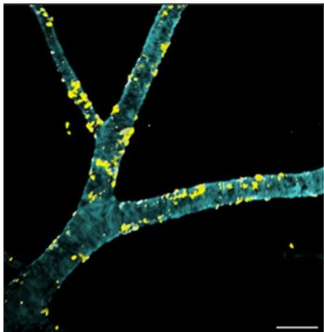

natural_image

Microscopic view of a branching biological structure with yellow fluorescent spots (no text or symbols)

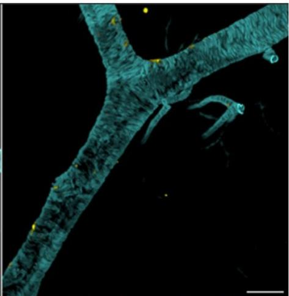

natural_image

Microscopic image of a branching biological structure with fluorescent staining (no text or symbols visible)

Fuel for ARIA? Light sheet microscopy comparison between distribution of unmodified anti-Aβ (left) and ATVcisLALA:Aβ (right) along large vessels near the brain surface. While anti-Aβ associated with vascular amyloid deposits (yellow, co-localization), ATVcisLALA:Aβ sidestepped this interaction. [Courtesy of Meredith Calvert, Denali Therapeutics.]

Source: ALZForum

TfR is a trafficking solution that solve a targeting problem. We lay out these dynamics across four dimensions.

- (1) Valency & affinity. High-avidity bivalent engagement can divert the construct to lysosomal degradation inside the endothelial cell rather than releasing it into the parenchyma; designs differ (Roche uses a monovalent Fab, while JCR optimizes high-affinity binding). Indeed, there is more than one viable solution, which has led to several brain shuttle platform architectures competing for best-in-class.  
- (2) Hematologic toxicity. TfR1 is heavily expressed on erythroid precursors and reticulocytes, and aggressive engagement historically caused anemia and reticulocyte depletion in primates. Engineering epitope, valency and affinity to decouple brain uptake from blood cell toxicity is required for competing for best-in-class (and expanding to frail populations, like elderly AD patients).  
- (3) Species translation. TfR binding is species-specific and brain uptake that looks excellent in transgenic mice can collapse in non-human primates, so preclinical fold-change claims must be read with caution. TfR is also not the only receptor for mediating brain shuttle delivery (Exhibit 27). CD98hc (AbbVie/Aliada) and IGF1R (ABL Bio's Grabody-B) are credible alternative receptors whose trafficking and safety properties could matter.  
• (4) What this means? Assuming a better delivered anti-amyloid antibody operates on the same biological node and inherits the same ceiling effect, we believe the debate moves to new cargo types and where brain shuttles deliver a paradigm shift or merely boost bioavailability at the intended target site.

Exhibit 27: TfR strategies for augmenting CNS delivery  
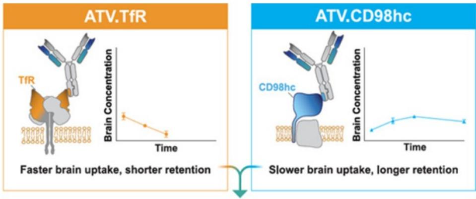

text_image

ATV.TfR
TfR
Brain Concentration
Time
Faster brain uptake, shorter retention
ATV.CD98hc
CD98hc
Brain Concentration
Time
Slower brain uptake, longer retention

Dual ATV  
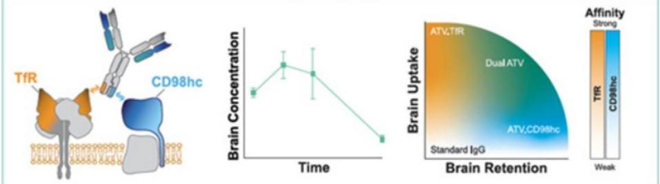

chart content

| Time | Brain Concentration | Brain Uptake |
|------|---------------------|--------------|
| 0    | ~0.5                | Low          |
| 1    | ~0.6                | Medium       |
| 2    | ~0.55               | High         |
| 3    | ~0.45               | Medium       |
| 4    | ~0.3                | Low          |
| 5    | ~0.2                | Medium       |
| 6    | ~0.1                | High         |
| 7    | ~0.05               | Medium       |
| 8    | ~0.0                | Low          |
| 9    | ~-0.05              | Medium       |
| 10   | ~-0.1               | High         |
| 11   | ~-0.15              | Medium       |
| 12   | ~-0.2               | Low          |
| 13   | ~-0.25              | Medium       |
| 14   | ~-0.3               | High         |
| 15   | ~-0.35              | Medium       |
| 16   | ~-0.4               | Low          |
| 17   | ~-0.45              | Medium       |
| 18   | ~-0.5               | High         |
| 19   | ~-0.55              | Medium       |
| 20   | ~-0.6               | Low          |
| 21   | ~-0.65              | Medium       |
| 22   | ~-0.7               | High         |
| 23   | ~-0.75              | Medium       |
| 24   | ~-0.8               | Low          |
| 25   | ~-0.85              | Medium       |
| 26   | ~-0.9               | High         |
| 27   | ~-0.95              | Medium       |
| 28   | ~-1.0               | Low          |
| 29   | ~-1.05              | Medium       |
| 30   | ~-1.1               | High         |
| 31   | ~-1.15              | Medium       |
| 32   | ~-1.2               | Low          |
| 33   | ~-1.25              | Medium       |
| 34   | ~-1.3               | High         |
| 35   | ~-1.35              | Medium       |
| 36   | ~-1.4               | Low          |
| 37   | ~-1.45              | Medium       |
| 38   | ~-1.5               | High         |
| 39   | ~-1.55              | Medium       |
| 40   | ~-1.6               | Low          |
| 41   | ~-1.65              | Medium       |
| 42   | ~-1.7               | High         |
| 43   | ~-1.75              | Medium       |
| 44   | ~-1.8               | Low          |
| 45   | ~-1.85              | Medium       |
| 46   | ~-1.9               | High         |
| 47   | ~-1.95              | Medium       |
| 48   | ~-2.0               | Low          |
| 49   | ~-2.05              | Medium       |
| 50   | ~-2.1               | High         |
| 51   | ~-2.15              | Medium       |
| 52   | ~-2.2               | Low          |
| 53   | ~-2.25              | Medium       |
| 54   | ~-2.3               | High         |
| 55   | ~-2.35              | Medium       |
| 56   | ~-2.4               | Low          |
| 57   | ~-2.45              | Medium       |
| 58   | ~-2.5               | High         |
| 59   | ~-2.55              | Medium       |
| 60   | ~-2.6               | Low          |
| 61   | ~-2.65              | Medium       |
| 62   | ~-2.7               | High         |
| 63   | ~-2.75              | Medium       |
| 64   | ~-2.8               | Low          |
| 65   | ~-2.85              | Medium       |
| 66   | ~-2.9               | High         |
| 67   | ~-2.95              | Medium       |
| 68   | ~-3.0               | Low          |
| 69   | ~-3.05              | Medium       |
| 70   | ~-3.1               | High         |
| 71   | ~-3.15              | Medium       |
| 72   | ~-3.2               | Low          |
| 73   | ~-3.25              | Medium       |
| 74   | ~-3.3               | High         |
| 75   | ~-3.35              | Medium       |
| 76   | ~-3.4               | Low          |
| 77   | ~-3.45              | Medium       |
| 78   | ~-3.5               | High         |
| 79   | ~-3.55              | Medium       |
| 80   | ~-3.6               | Low          |
| 81   | ~-3.65              | Medium       |
| 82   | ~-3.7               | High         |
| 83   | ~-3.75              | Medium       |
| 84   | ~-3.8               | Low          |
| 85   | ~-3.85              | Medium       |
| 86   | ~-3.9               | High         |
| 87   | ~-3.95              | Medium       |
| 88   | ~-4.0               | Low          |
| 89   | ~-4.05              | Medium       |
| 90   | ~-4.1               | High         |
| 91   | ~-4.15              | Medium       |
| 92   | ~-4.2               | Low          |
| 93   | ~-4.25              | Medium       |
| 94   | ~-4.3               | High         |
| 95   | ~-4.35              | Medium       |
| 96   | ~-4.4               | Low          |
| 97   | ~-4.45              | Medium       |
| 98   | ~-4.5               | High         |
| 99   | ~-4.55              | Medium       |
| 100  | ~-4.6               | Low          |

Affinity Level (TIR, CD98hc) vs Time (Time) for Brain Uptake (Brain Uptake) at different time points (Time) from baseline (Baseline) to the final time point (Baseline). The chart displays a single data series representing the change in brain activity level over time.

Green Light. TfR-based ATVs quickly cross into the brain but don't last (top left). CD98hc-based ATVs get in more slowly, but stay longer (top right). Combining both yields the highest overall exposure (bottom). [Courtesy of Wells et al., Cell Reports, 2025.]  
Source: ALZForum

Why does this matter? Before 2026 a program could fail because the molecule never reached the brain at therapeutic concentration; for biologics larger than the $\sim 0.1\%$ that passively crosses, that was frequently the case.

\- Denali. Denali is a leading pioneer in the field of next-generation biomedicines, securing the first US regulatory approval for a brain shuttle program (and with the potential compatibility across a four-cargo platform). Indeed, Denali's March-2026 approval effectively converts brain bioavailability from barrier into an engineerable obstacle to overcome. What remains is harder and arguably less forgiving in that shuttle platforms makes large biologics, enzymes and protein-replacements, and oligonucleotides deliverable, but it does not make them inherently more or less efficacious on their cognate molecular target. Indeed many targets have been undruggable, at least prior to TfRs, which can open new and innovative ways (oligos, siRNA, etc) for delivering therapeutic payloads to CNS. Denali has two shots on goal with DNL921 (ATV:Abeta) currently in IND-enabling studies, and its tau program DNL628 (OTV:MAPT), an investigational therapy for Alzheimer's disease enabled by their proprietary Oligonucleotide TransportVehicle (OTV) platform. In March 2026, the first patient was dosed in the Phase 1b clinical study for DNL628.

\- Alector. After its legacy non-shuttle programs failed (latozinemab in FTD-GRN and AL101 both disappointed) the company has effectively re-prioritized itself around its 'Alector Brain Carrier' (ABC) platform, which binds a distinct TfR side-epitope chosen to limit the reticulocyte loss and Fc-effector liabilities that complicate the monovalent approaches. Preclinically the ABC constructs have reported greater than 12× higher CSF exposure and roughly 30× higher brain-parenchymal exposure versus the unconjugated antibody, with around 70% knockdown of tau messenger RNA in non-human primates. These metrics could justify the platform's positioning as a best-in-class, assuming ability to translate these preclinical findings into a PD effect in humans and ability to meaningfully improve clinical outcome. Alector's lead assets are AL137 (anti-Aβ), AL050 (a glucocerebrosidase/GCase enzyme-delivery program) and AL064 (a tau-silencing siRNA), with first IND/FIH steps expected late-2026 into early-2027.

\- Arrowhead. Arrowhead is a leading RNAi company that has previously shown best-in-class potential targeting hepatocytes, having discovered and/or developed several approved/late-stage therapeutics including Redemplo (plozasiran; wholly owned), which has been approved for FCS and is in Ph3 studies for SHTG, and olpasiran (out-licensed to AMGN) that is in Ph3 for ASCVD associated with Lp(a). Building on the success of its hepatic targeting siRNA technology, the company has developed its TRiM CNS-SC platform, which works to bring siRNA into the CNS by crossing the blood brain barrier via a TfR1-targeting ligand linked to an siRNA. In non-human primates (NHPs), the TRiM CNS-SC platform showed favorable pharmacokinetics with robust concentration and mRNA knockdown in deep brain regions as compared to intrathecal administration. The technology being evaluated for the first time in humans in a Ph1/2a trial of ARO-MAPT (tau target) in healthy volunteers (HV) and Alzheimer's patients, with initial HV data expected in late-3Q26/early4Q26, which could provide early insights in the translatability of the technology into humans.

\- Earlier-stage Aerska (an RNAi-native startup founded in 2025 by ex-Alnylam and ex-AstraZeneca scientists), is building shuttle-delivered oligonucleotide therapeutics from inception rather than bolting delivery onto a legacy antibody franchise, a sign that the next cohort of entrants treats brain-penetrant RNA as the design center rather than an add-on.

\- Akeso. We would highlight AK152 as a key China pipeline positioned in the AD brain-shuttle debate. Based on our Akeso webcast (note), AK152 pairs an Aβ arm targeting plaques / soluble oligomers with a transferrin-receptor arm designed to enhance BBB transcytosis. With NMPA clearance to enter clinical studies, the relevant benchmark is Roche's trontinemab, alongside first-generation Aβ antibodies such as lecanemab / donanemab. On key data print we look for evidence of amyloid PET / centiloid lowering in AD patients, ARIA-E/H, hematology, ApoE4-stratified safety, and whether the TfR arm improves CNS exposure without creating peripheral TMDD or endothelial trafficking issues. Separately, we also watch for additional molecule level disclosures such as TfR epitope, affinity / valency, endothelial release, and NHP-to-human translation.

\- Keymed. We highlight Keymed as another China-listed name in the AD disease-modification debate, with disclosed positioning across Aβ species selection and BBB delivery. CM383 is a protofibril-focused Aβ antibody for early AD, closer to lecanemab biology, with selective binding to soluble Aβ protofibrils and plaque. Company materials position CM383 around Aβ clearance activity, longer half-life, lower immunogenicity, and lower cytokine-release / IRR risk; Phase Ib enrollment in MCI due to AD / mild AD is complete, and the separate IV-vs-SC healthy-volunteer study is ongoing to explore dosing convenience. CM559 is earlier and more donanemab-adjacent, targeting N3pG / pGlu3 Aβ, a plaque-enriched pyroglutamate-modified epitope. KeyCND is Keymed's disclosed BBB-penetrating antibody delivery platform for CNS delivery, including AD; that said, latest disclosures have not yet specified the shuttle receptor, construct design, or whether CM383 / CM559 incorporate the platform.

## 8. Intracellular Tau - the next target with key potential catalysts this year

## The biological rationale for targeting intracellular tau as a potential DMT for AD

Intracellular tau represents an intriguing disease-modifying target in Alzheimer's disease because tau pathology correlates more closely with neuronal dysfunction, neurodegeneration, and cognitive decline than amyloid burden alone. In healthy individuals tau is a microtubule-associated protein that stabilizes neuronal microtubules and supports axonal transport. However, in Alzheimer's disease, tau undergoes pathological post-translational modifications, including hyperphosphorylation and misfolding, leading to the formation of intracellular tau aggregates and neurofibrillary tangles that are hallmarks of disease pathology. These pathological tau species disrupt neuronal homeostasis, impair synaptic function and axonal transport, and contribute directly to neurodegeneration. More specifically, a growing body of evidence suggests that soluble intracellular tau oligomers, which arise prior to neurofibrillary tangle formation, may represent the most neurotoxic form of tau and may mediate neuronal dysfunction and cell-to-cell spread of pathology through connected neural networks. Accordingly, targeting intracellular tau has the potential to directly address a key driver of disease progression by reducing the accumulation, toxicity, and propagation of pathogenic tau species within neurons, thereby potentially preserving neuronal integrity and cognitive function while modifying the natural history of Alzheimer's disease. See our prior deep dive note HERE.

## How tau-targeting therapeutics can further address the unmet need and possibly help bend the cost curve

\- (1) Scientific rationale for more potent disease modifying effect vs. standard of care. A substantial body of genetic, biomarker, and pathological evidence supports the hypothesis that tau pathology occurs downstream of amyloid-beta accumulation in Alzheimer's disease and serves as a key mediator of neurodegeneration, as amyloid deposition can begin decades before symptom onset, though they may be related as studies have demonstrated that amyloid pathology accelerates tau misfolding, aggregation, and propagation. Accordingly, given the evidence that intracellular tau is more closely associated with neurodegeneration and cognitive decline, there is a scientific rationale to believe targeting tau drive a more robust disease modifying effect (i.e. slow/stop/reverse cognitive decline) as compared to standard of care, though we note this has yet to be demonstrated in clinical studies.

\- (2) Potentially eases the treatment burden/costs vs. standard of care. Should intracellular tau-targeting therapies demonstrate clinically meaningful efficacy they may offer meaningful advantages over currently approved anti-amyloid therapies in terms of treatment burden and monitoring requirements. Specifically, anti-amyloid mAbs require regular intravenous infusions at least for induction dosing (Leqembi: Q2W, Kisunla: Q4W; at-home SC Leqembi is available for maintenance), with infusions occurring at a healthcare provider and can take \~30 minutes. Furthermore, Leqembi and Kisunla are associated with amyloid-related imaging abnormalities (ARIA), a potentially serious adverse event that necessitates routine MRI surveillance during treatment, both of which can be a drain on resources (time/people/space) on the healthcare system. By contrast, intracellular tau targeting RNAi in clinical development have less frequent dosing (diranersen (BIIB080): Q12W or Q24W in Ph2) while the routes of administration may consume fewer resources (diranersen: IT; ARO-MAPT: SC). Moreover, as these therapies do not directly target vascular amyloid deposits, they are not expected to carry the same risk of ARIA that has emerged in the anti-amyloid mAbs, thus removing the need for frequent MRI monitoring. For example, during the recent Ph2 update of diranersen (anti-tau ASO; LINK), BIIB noted that its safety and tolerability profile was generally consistent with the Ph1b study, and based on the mechanism of action, BIIB does not expect ARIA.

## Prior attempts targeting extra-cellular tau and the current competitive pipeline

Several companies have tried unsuccessfully to develop therapies targeting extracellular tau for Alzheimer's disease (Exhibit 28). Multiple hypotheses have been advanced to explain these outcomes, with most converging on limitations related to targeting extracellular tau (vs. intracellular tau) and/or epitope selection. Many first-generation tau antibodies were designed to engage extracellular tau, which represents only a small fraction of the total tau burden in Alzheimer's disease (AD), while the majority of tau, including pathogenic species, resides intracellularly within neurons. Early antibody programs also disproportionately targeted N- and C-terminal epitopes; however, growing evidence suggests these species are present at relatively low levels in the CSF of Alzheimer's patients, raising questions around their clinical relevance. More recent efforts have shifted toward phospho-tau epitopes (e.g., JNJ's posdinemab antibody targeting p-tau217 recently failed), but this strategy introduces additional complexity, as the relative abundance of specific phospho-species appears to shift over time. Certain epitopes may be enriched in earlier stages, while others become more prominent with disease progression, complicating durable target engagement.

## In the pipeline, there are several candidates in clinical development targeting tau (Exhibit 29), though we highlight only BIIB/IONS' diranersen and ARWR's ARO-MAPT are targeting intracellular tau.

Exhibit 28: Select Prior Clinical Stage Anti-Tau Programs in Alzheimer's Disease

<table><tr><td>Company</td><td>Asset name</td><td>Modality</td><td>Target</td><td>Primary site of action</td><td>Key trials / phase</td><td>Status</td></tr><tr><td>Johnson and Johnson</td><td>Posdinemab</td><td>IgG1 mAb</td><td>Mid-Domain (pT217)</td><td>Extracellular</td><td>Ph2b AuTonomy</td><td>Terminated (2025)</td></tr><tr><td>Pinteon Therapeutics</td><td>PNT001</td><td>mAb</td><td>Mid-Domain (Cis pT231 tau)</td><td>Extracellular</td><td>Ph1</td><td>Early/Inactive (2023)</td></tr><tr><td>Lundbeck</td><td>Lu AF87908</td><td>IgG1 mAb</td><td>C-terminal Tail</td><td>Extracellular</td><td>Ph1</td><td>Early/ Inactive (2023)</td></tr><tr><td>AC Immune / Roche</td><td>Semorinemab</td><td>IgG4 mAb</td><td>N-terminal Domain</td><td>Extracellular</td><td>Ph2 TAURIEL/ LAURIET</td><td>Terminated (2023)</td></tr><tr><td>Biogen</td><td>BIIB076</td><td>mAb</td><td>Mid Domain</td><td>Extracellular</td><td>Ph1</td><td>Terminated (2022)</td></tr><tr><td>Eli Lilly</td><td>Zagotenemab</td><td>MC1 mAb</td><td>N-terminal Domain</td><td>Extracellular</td><td>Ph2 PERISCOPE-ALZ</td><td>Terminated (2021)</td></tr><tr><td>Biogen / BMY</td><td>Gosuranemab</td><td>IgG4 mAb</td><td>N-terminal Domain</td><td>Extracellular</td><td>Ph2 TANGO</td><td>Terminated (2021)</td></tr><tr><td>AbbVie / C2N</td><td>Tilavonemab</td><td>IgG4 mAb</td><td>N-terminal Domain</td><td>Extracellular</td><td>Ph2</td><td>Terminated (2021)</td></tr><tr><td>Roche</td><td>RG7345</td><td>mAb</td><td>C-terminal Epitope</td><td>Extracellular</td><td>Ph1/2</td><td>Terminated (2015)</td></tr></table>

Source: Company Data, MS

Exhibit 29: Current Clinical Stage Anti-Tau Programs in Alzheimer's Disease

<table><tr><td>Company</td><td>Asset name</td><td>Modality</td><td>Target</td><td>Primary site of action</td><td>Key trials / phase</td><td>Status</td></tr><tr><td>UCB</td><td>Bepranemab</td><td>mAb</td><td>Mid-Domain</td><td>Extracellular</td><td>TOGETHER (phase 2)</td><td>TBD</td></tr><tr><td>Biogen (lonis)</td><td>BIIB 080</td><td>ASO</td><td>MAPT mRNA (upstream tau)</td><td>Intracellular</td><td>Ph2 CELIA</td><td>Detailed Ph2 Data @ AAIC (July 12-15)</td></tr><tr><td>Voyager Therapeutics</td><td>VY752</td><td>mAb</td><td>C-terminal Domain (PHF-tau epitope)</td><td>Extracellular</td><td>Ph2 MAD Trial</td><td>Ph2 Data 2H26</td></tr><tr><td>ARWR</td><td>ARO-MAPT</td><td>siRNA</td><td>MAPT siRNA (upstream tau)</td><td>Intracellular</td><td>Ph1/2a</td><td>Ph1/2 Data HV late-3Q26/early-4Q26; AD patient data in 2027</td></tr><tr><td>BMY/PRTA</td><td>BMS 98644</td><td>mAb</td><td>MTBR</td><td>Extracellular</td><td>Ph2 (TargetTau-1)</td><td>Ph2 Data 1H27</td></tr><tr><td>Eisai</td><td>E2814</td><td>mAb</td><td>MTBR</td><td>Extracellular / perisynaptic</td><td>Phase 2/3</td><td>Ph2/3 PCD April &#x27;28</td></tr></table>

Source: Company Data, MS

\- Biogen/Ionis: Diranersen is an intrathecally administered antisense oligonucleotide (ASO; similar to Spinraza for SMA) that targets MAPT mRNA, with the aim of reducing tau production directly within the neurons in the CNS. In a Ph1b trial, diranersen demonstrated proof of mechanism with dose dependent reductions in tau, with high doses reaching reductions up to \~50%, supporting robust CNS target engagement. Biogen recently shared topline results from the Ph2 CELIA trial (note here). Specifically, CELIA did not meet its primary endpoint assessing dose response for change from baseline on the Clinical Dementia Rating–Sum of Boxes (CDR-SB) at Week 76, but pre-specified analyses of cognitive endpoints demonstrated slowing of clinical decline across all studied doses, particularly in participants receiving the lowest dose of diranersen, 60 mg administered every 24 weeks. Given the totality of the data, the companies are advancing diranersen into Ph3. That said, given the lack of dose response and the topline release was light on numbers, we have a number of questions heading into the presentation of detailed data at AAIC (July 12-15), as discussed in our note HERE and below.

\- Arrowhead: ARO-MAPT is a subcutaneously administered siRNA targeting MAPT mRNA, which, like diranersen, aims to reduce tau production within neurons, agnostic of species and without reliance on specific epitopes. Of note, ARO-MAPT utilizes Arrowhead's TRiM CNS-SC platform, which works to bring siRNA into the CNS by crossing the blood brain barrier via a TfR1-targeting ligand linked to an siRNA. In non-human primates (NHPs), the TRiM CNS-SC platform showed favorable pharmacokinetics with robust concentration and mRNA knockdown in deep brain regions as compared to intrathecal administration. In addition, we highlight that ARO-MAPT showed robust knockdown of tau (\~75% peak knockdown; note here) in NHPs as well as PK that makes ARO-MAPT potentially amenable to quarterly systemic SC dosing.

## Key upcoming catalysts ahead

Looking ahead, we identify two key upcoming catalysts for intracellular tau programs over the remainder of 2026:

## • (1) Detailed data from the Ph2 CELIA trial of diranersen @ AAIC (July 12-15):

Though Biogen's decision to move diranersen into Ph3 for Alzheimer's shows confidence, there remain several key outstanding questions to be addressed to (note here) inform investor confidence in both the diranersen development program as well as intracellular tau as a target, and we expect some of the answers could be provided at this year's AAIC conference (7/12-7/15). These include : (1) whether the cognitive benefit is consistent across secondary endpoints; (2) the strength of the relationship between tau reduction and clinical outcomes; and (3) the magnitude, onset, and durability of effect relative to approved anti-amyloid therapies such as Leqembi and Kisunla. We will also evaluate (4) whether placebo performance is consistent with historical studies and (5) whether baseline patient characteristics, including disease severity and tau burden, were balanced across treatment arms. Additional detail on safety and tolerability will be important, including (6) rates of serious adverse events, discontinuation rate, and confirmation of the expected absence of ARIA-related risk. Finally, investors will be focused on (7) how these Phase 2 results inform the Phase 3 program, including dose selection, endpoint choice, patient population, and the potential role of background anti-amyloid therapy.

\- (2) Healthy volunteer data from the Ph1/2a study of ARO-MAPT in late-3Q26/ early 4Q26: Though early, we see the healthy volunteer (HV) data from the Ph1/2a study of ARO-MAPT as an important catalyst as it provides evidence on the translatability of Arrowhead's TRiM CNS-SC platform, which showed favorable PK/PD in animals, and readthrough to the viability of a potential next-gen SC administered intracellular tau targeting RNAi. Though Arrowhead mgt. has not yet provided detail on what they plan to share with the initial disclosure, we expect the key investor focus will be on reductions in CSF tau levels, for which mgt. views a knockdown of $50 - 60\%$ as a success (see our NDR takeaways note here). We would also be interested in data showing brain distribution, which may have readthrough to potential the TRiM CNS-SC platform more broadly and the possibility of exploring additional target/indications.

## Disclosure Section

The information and opinions in MS were prepared by MS & Co. LLC, and/or MS C.T.V.M. S.A., and/or MS Mexico, Casa de Bolsa, S.A. de C.V., and/or MS Canada Limited. As used in this disclosure section, "MS" includes MS & Co. LLC, MS C.T.V.M. S.A., MS Mexico, Casa de Bolsa, S.A. de C.V., MS Canada Limited and their affiliates as necessary.

For important disclosures, stock price charts and equity rating histories regarding companies that are the subject of this report, please see the MS Disclosure Website at www.morganstanley.com/eqr/disclosures/webapp/generalresearch, or contact your investment representative or MS at 1585 Broadway, (Attention: Research Management), New York, NY, 10036 USA.

For valuation methodology and risks associated with any recommendation, rating or price target referenced in this research report, please contact the Client Support Team as follows: US/Canada +1 800 303-2495; Hong Kong +852 2848-5999; Latin America +1 718 754-5444 (U.S.); London +44 (0)20-7425-8169; Singapore +65 6834-6860; Sydney +61 (0)2-9770-1505; Tokyo +81 (0)3-6836-9000. Alternatively you may contact your investment representative or MS at 1585 Broadway, (Attention: Research Management), New York, NY 10036 USA.

## Analyst Certification

The following analysts hereby certify that their views about the companies and their securities discussed in this report are accurately expressed and that they have not received and will not receive direct or indirect compensation in exchange for expressing specific recommendations or views in this report: Terence C Flynn, Ph.D.; Sean Laaman, Ph.D.; Jack Lin; Michael E Ulz; Chris Yu, J.D., Ph.D..

## Global Research Conflict Management Policy

MS has been published in accordance with our conflict management policy, which is available at www.morganstanley.com/institutional/research/conflictpolicies. A Portuguese version of the policy can be found at www.morganstanley.com.br

## Important Regulatory Disclosures on Subject Companies

As of May 29, 2026, MS beneficially owned 1% or more of a class of common equity securities of the following companies covered in MS: 4D Molecular Therapeutics Inc, Abbvie Inc., Abivax, Acadia Pharmaceuticals Inc, Alnylam Pharmaceuticals Inc, Amgen Inc., Arcutis Biotherapeutics, Inc., argenx SE, Arvinas Inc, Ascendis Pharma A/S, Atea Pharmaceuticals Inc, Axsome Therapeutics, Belite Bio Inc, BeOne Medicines, Bicycle Therapeutics Plc, Biogen Inc, BridgeBio Pharma Inc, Bristol Myers Squibb Co, Centessa Pharmaceuticals, Inc, CG Oncology, Compass Pathways PLC, Crinetics Pharmaceuticals, CRISPR Therapeutics AG, Cytokinetics Inc, Eisai, Eli Lilly & Co., Exelixis Inc., Genmab A/S, Gilead Sciences Inc., Halozyme Therapeutics, Inc, Immunocore Holdings Ltd, Incyte Corp, Intellia Therapeutics Inc, Keymed Biosciences Inc, Kyverna Therapeutics, Lakefront Biotherapeutics, Legend Biotech Corp, Mirum Pharmaceuticals, Moderna Inc, Neurocrine Biosciences Inc, Nurix Therapeutics Inc., ProKidney Corp, PTC Therapeutics, Regeneron Pharmaceuticals Inc., Regenxbio Inc, Rhythm Pharmaceuticals Inc, Rocket Pharmaceuticals Inc, Sarepta Therapeutics Inc, Schrodinger Inc., Structure Therapeutics Inc, United Therapeutics Corp, Vertex Pharmaceuticals, Viking Therapeutics Inc, Vir Biotechnology Inc.

Within the last 12 months, MS managed or co-managed a public offering (or 144A offering) of securities of Abbvie Inc., ABSCI CORP, AgomAb Therapeutics NV, Akeso, Inc., Alnylam Pharmaceuticals Inc, Alumis Inc., Amgen Inc., Avalyn Pharma Inc, Belite Bio Inc, Bicara Therapeutics, Biomarin Pharmaceutical Inc, Bristol Myers Squibb Co, Cytokinetics Inc, Denali Therapeutics Inc, Disc Medicine Inc, Dyne Therapeutics Inc, Eikon Therapeutics Inc, Eli Lilly & Co., Erasca, Inc., Evommune Inc, Generate Biomedicines Inc, Genmab A/S, Gilead Sciences Inc., Halozyme Therapeutics, Inc, Immix Biopharma, Ionis Pharmaceuticals Inc, Kalaris Therapeutics, Keymed Biosciences Inc., Kymera Therapeutics Inc, Kyverna Therapeutics, MapLight Therapeutics, Mirum Pharmaceuticals, Monopar Therapeutics, Pharvaris N.V., Rhythm Pharmaceuticals Inc, Sana Biotechnology, Inc, Structure Therapeutics Inc, Trevi Therapeutics Inc, Vertex Pharmaceuticals.

Within the last 12 months, MS has received compensation for investment banking services from Abbvie Inc., AgomAb Therapeutics NV, Akeso, Inc., Alnylam Pharmaceuticals Inc, Alumis Inc., Amgen Inc., Avalyn Pharma Inc, Belite Bio Inc, BeOne Medicines, Bicara Therapeutics, Biomarin Pharmaceutical Inc, Bristol Myers Squibb Co, Cytokinetics Inc, Denali Therapeutics Inc, Disc Medicine Inc, Dyne Therapeutics Inc, Eikon Therapeutics Inc, Eli Lilly & Co., Erasca, Inc., Evommune Inc, Generate Biomedicines Inc, Genmab A/S, Gilead Sciences Inc., Halozyme Therapeutics, Inc, Immix Biopharma, Ionis Pharmaceuticals Inc, Kalaris Therapeutics, Keymed Biosciences Inc., Kymera Therapeutics Inc, Kyverna Therapeutics, Lakefront Biotherapeutics, Legend Biotech Corp, MapLight Therapeutics, Mirum Pharmaceuticals, Monopar Therapeutics, Pharvaris N.V., Rhythm Pharmaceuticals Inc, Sana Biotechnology, Inc, Structure Therapeutics Inc, Trevi Therapeutics Inc.

In the next 3 months, MS expects to receive or intends to seek compensation for investment banking services from 4D Molecular Therapeutics Inc, Aardvark Therapeutics Inc., Abbvie Inc., Abivax, ABSCI CORP, Acadia Pharmaceuticals Inc, Adagene Inc., AgomAb Therapeutics NV, Akeso, Inc., Alector Inc, Alnylam Pharmaceuticals Inc, Alumis Inc., Amgen Inc., Arcus Biosciences Inc., Arcutis Biotherapeutics, Inc., argenx SE, Arrowhead Pharmaceuticals Inc, Arvinas Inc, Ascendis Pharma A/S, Atea Pharmaceuticals Inc, Avalyn Pharma Inc, Axsome Therapeutics, Belite Bio Inc, BeOne Medicines, Bicara Therapeutics, BioAge Labs Inc, Biogen Inc, Biohaven Ltd, Biomarin Pharmaceutical Inc, BioNTech SE, BridgeBio Oncology Therapeutics, BridgeBio Pharma Inc, Bristol Myers Squibb Co, Cabaletta Bio Inc, Centessa Pharmaceuticals, Inc, CG Oncology, Compass Pathways PLC, Contineum Therapeutics, Crinetics Pharmaceuticals, CRISPR Therapeutics AG, Cullinan Therapeutics, Cytokinetics Inc, Denali Therapeutics Inc, Disc Medicine Inc, Dyne Therapeutics Inc, Eikon Therapeutics Inc, Eisai, Eli Lilly & Co., Erasca, Inc., Evommune Inc, Exelixis Inc., Fractyl Health Inc, Generate Biomedicines Inc, Genmab A/S, Gilead Sciences Inc., Halozyme Therapeutics, Inc, Immix Biopharma, Immunocore Holdings Ltd, Incyte Corp, Insmed Inc, Ionis Pharmaceuticals Inc, Kalaris Therapeutics, Keymed Biosciences Inc., Kymera Therapeutics Inc, Kyverna Therapeutics, Lakefront Biotherapeutics, Legend Biotech Corp, MapLight Therapeutics, Mirum Pharmaceuticals, Moderna Inc, Monopar Therapeutics, Neurocrine Biosciences Inc, Novartis AG, Nurix Therapeutics Inc., Pharvaris N.V., Prime Medicine Inc, ProKidney Corp, PTC Therapeutics, Recursion Pharmaceuticals Inc, Regeneron Pharmaceuticals Inc., Regenxbio Inc, Rhythm Pharmaceuticals Inc, Roche Holding AG, Rocket Pharmaceuticals Inc, Sana Biotechnology, Inc, Sarepta Therapeutics Inc, Schrodinger Inc., Silence Therapeutics Plc, Structure Therapeutics Inc, Tenaya Therapeutics Inc, Trevi Therapeutics Inc, Tscan Therapeutics Inc, Ultragenyx Pharmaceutical Inc, Vertex Pharmaceuticals, Viking Therapeutics Inc, Vir Biotechnology Inc, Zenas Biopharma Inc, Zentalis Pharmaceuticals Inc.

Within the last 12 months, MS has received compensation for products and services other than investment banking services from Abbvie Inc., Amgen Inc., Biogen Inc, Bristol Myers Squibb Co, Eli Lilly & Co., Genmab A/S, Gilead Sciences Inc., Halozyme Therapeutics, Inc, Moderna Inc, Novartis AG, Roche Holding AG.

Within the last 12 months, MS has provided or is providing investment banking services to, or has an investment banking client relationship with, the following company: 4D Molecular Therapeutics Inc, Aardvark Therapeutics Inc., Abbvie Inc., Abivax, ABSCI CORP, Acadia Pharmaceuticals Inc, Adagene Inc., AgomAb Therapeutics NV, Akeso, Inc., Alector Inc, Alnylam Pharmaceuticals Inc, Alumis Inc., Amgen Inc., Arcus Biosciences Inc., Arcutis Biotherapeutics, Inc., argenx SE, Arrowhead Pharmaceuticals Inc, Arvinas Inc, Ascendis Pharma A/S, Atea Pharmaceuticals Inc, Avalyn Pharma Inc, Axsome Therapeutics, Belite Bio Inc, BeOne Medicines, Bicara Therapeutics, BioAge Labs Inc, Biogen Inc, Biohaven Ltd, Biomarin Pharmaceutical Inc, BioNTech SE, BridgeBio Oncology Therapeutics, BridgeBio Pharma Inc, Bristol Myers Squibb Co, Cabaletta Bio Inc, Centessa Pharmaceuticals, Inc, CG Oncology, Compass Pathways PLC, Contineum Therapeutics, Crinetics Pharmaceuticals, CRISPR Therapeutics AG, Cullinan Therapeutics, Cytokinetics Inc, Denali Therapeutics Inc, Disc Medicine Inc, Dyne Therapeutics Inc, Eikon Therapeutics Inc, Eisai, Eli Lilly & Co., Erasca, Inc., Evommune Inc, Exelixis Inc., Fractyl Health Inc, Generate Biomedicines Inc, Genmab A/S, Gilead Sciences Inc., Halozyme Therapeutics, Inc, Immix

Biopharma, Immunocore Holdings Ltd, Incyte Corp, Insmed Inc, Ionis Pharmaceuticals Inc, Kalaris Therapeutics, Keymed Biosciences Inc., Kymera Therapeutics Inc, Kyverna Therapeutics, Lakefront Biotherapeutics, Legend Biotech Corp, MapLight Therapeutics, Mirum Pharmaceuticals, Moderna Inc, Monopar Therapeutics, Neurocrine Biosciences Inc, Novartis AG, Nurix Therapeutics Inc., Pharvaris N.V., Prime Medicine Inc, ProKidney Corp, PTC Therapeutics, Recursion Pharmaceuticals Inc, Regeneron Pharmaceuticals Inc., Regenxbio Inc, Rhythm Pharmaceuticals Inc, Roche Holding AG, Rocket Pharmaceuticals Inc, Sana Biotechnology, Inc, Sarepta Therapeutics Inc, Schrodinger Inc., Silence Therapeutics Plc, Structure Therapeutics Inc, Tenaya Therapeutics Inc, Trevi Therapeutics Inc, Tscan Therapeutics Inc, Ultragenyx Pharmaceutical Inc, Vertex Pharmaceuticals, Viking Therapeutics Inc, Vir Biotechnology Inc, Zenas Biopharma Inc, Zentalis Pharmaceuticals Inc.

Within the last 12 months, MS has either provided or is providing non-investment banking, securities-related services to and/or in the past has entered into an agreement to provide services or has a client relationship with the following company: Abbvie Inc., Akeso, Inc., Alnylam Pharmaceuticals Inc, Amgen Inc., Biogen Inc, BioNTech SE, Bristol Myers Squibb Co, Eli Lilly & Co., Genmab A/S, Gilead Sciences Inc., Halozyme Therapeutics, Inc, Keymed Biosciences Inc., Moderna Inc, Novartis AG, Roche Holding AG, Vertex Pharmaceuticals.

MS & Co. LLC makes a market in the securities of 4D Molecular Therapeutics Inc, ABSCI CORP, Acadia Pharmaceuticals Inc, Alector Inc, Arcus Biosciences Inc., Arcutis Biotherapeutics, Inc., Arrowhead Pharmaceuticals Inc, Arvinas Inc, Avalyn Pharma Inc, Axsome Therapeutics, Belite Bio Inc, Bicara Therapeutics, Bicycle Therapeutics Plc, BioAge Labs Inc, Biohaven Ltd, BridgeBio Oncology Therapeutics, Celldex Therapeutics Inc, Centessa Pharmaceuticals, Inc, CG Oncology, Compass Pathways PLC, Crinetics Pharmaceuticals, Cullinan Therapeutics, Denali Therapeutics Inc, Disc Medicine Inc, Dyne Therapeutics Inc, Generate Biomedicines Inc, Immunocore Holdings Ltd, Intellia Therapeutics Inc, Kalaris Therapeutics, Kymera Therapeutics Inc, Kyverna Therapeutics, MapLight Therapeutics, Mirum Pharmaceuticals, Nurix Therapeutics Inc, Pharvaris N.V., PTC Therapeutics, Regeneron Pharmaceuticals Inc., Regenxbio Inc, Rhythm Pharmaceuticals Inc, Rocket Pharmaceuticals Inc, Sana Biotechnology, Inc, Schrodinger Inc., Silence Therapeutics Plc, Trevi Therapeutics Inc, Ultragenyx Pharmaceutical Inc, Vir Biotechnology Inc, Zenas Biopharma Inc, Zentalis Pharmaceuticals Inc.

The equity research analysts or strategists principally responsible for the preparation of MS have received compensation based upon various factors, including quality of research, investor client feedback, stock picking, competitive factors, firm revenues and overall investment banking revenues. Equity Research analysts' or strategists' compensation is not linked to investment banking or capital markets transactions performed by MS or the profitability or revenues of particular trading desks.

MS and its affiliates do business that relates to companies/instruments covered in MS, including market making, providing liquidity, fund management, commercial banking, extension of credit, investment services and investment banking. MS sells to and buys from customers the securities/instruments of companies covered in MS on a principal basis. MS may have a position in the debt of the Company or instruments discussed in this report. MS trades or may trade as principal in the debt securities (or in related derivatives) that are the subject of the debt research report.

Certain disclosures listed above are also for compliance with applicable regulations in non-US jurisdictions.

## STOCK RATINGS

MS uses a relative rating system using terms such as Overweight, Equal-weight, Not-Rated or Underweight (see definitions below). MS does not assign ratings of Buy, Hold or Sell to the stocks we cover. Overweight, Equal-weight, Not-Rated and Underweight are not the equivalent of buy, hold and sell. Investors should carefully read the definitions of all ratings used in MS. In addition, since MS contains more complete information concerning the analyst's views, investors should carefully read MS, in its entirety, and not infer the contents from the rating alone. In any case, ratings (or research) should not be used or relied upon as investment advice. An investor's decision to buy or sell a stock should depend on individual circumstances (such as the investor's existing holdings) and other considerations.

## Global Stock Ratings Distribution

(as of May 31, 2026)

The Stock Ratings described below apply to MS's Fundamental Equity Research and do not apply to Debt Research produced by the Firm.

For disclosure purposes only (in accordance with FINRA requirements), we include the category headings of Buy, Hold, and Sell alongside our ratings of Overweight, Equal-weight, Not-Rated and Underweight. MS does not assign ratings of Buy, Hold or Sell to the stocks we cover. Overweight, Equal-weight, Not-Rated and Underweight are not the equivalent of buy, hold, and sell but represent recommended relative weightings (see definitions below). To satisfy regulatory requirements, we correspond Overweight, our most positive stock rating, with a buy recommendation; we correspond Equal-weight and Not-Rated to hold and Underweight to sell recommendations, respectively.

<table><tr><td></td><td colspan="2">Coverage Universe</td><td colspan="3">Investment Banking Clients (IBC)</td><td colspan="2">Other Material Investment ServicesClients (MISC)</td></tr><tr><td>Stock RatingCategory</td><td>Count</td><td>% of Total</td><td>Count</td><td>% of Total IBC</td><td>% of RatingCategory</td><td>Count</td><td>% of Total OtherMISC</td></tr><tr><td>Overweight/Buy</td><td>1542</td><td>42%</td><td>465</td><td>51%</td><td>30%</td><td>707</td><td>43%</td></tr><tr><td>Equal-weight/Hold</td><td>1571</td><td>43%</td><td>369</td><td>40%</td><td>23%</td><td>723</td><td>44%</td></tr><tr><td>Not-Rated/Hold</td><td>3</td><td>0%</td><td>0</td><td>0%</td><td>0%</td><td>1</td><td>0%</td></tr><tr><td>Underweight/Sell</td><td>551</td><td>15%</td><td>86</td><td>9%</td><td>16%</td><td>201</td><td>12%</td></tr><tr><td>Total</td><td>3,667</td><td></td><td>920</td><td></td><td></td><td>1632</td><td></td></tr></table>

Data include common stock and ADRs currently assigned ratings. Investment Banking Clients are companies from whom MS received investment banking compensation in the last 12 months. Due to rounding off of decimals, the percentages provided in the "% of total" column may not add up to exactly 100 percent.

## Analyst Stock Ratings

Overweight (O). The stock's total return is expected to exceed the average total return of the analyst's industry (or industry team's) coverage universe, on a risk-adjusted basis, over the next 12-18 months.

Equal-weight (E). The stock's total return is expected to be in line with the average total return of the analyst's industry (or industry team's) coverage universe, on a risk-adjusted basis, over the next 12-18 months.

Not-Rated (NR). Currently the analyst does not have adequate conviction about the stock's total return relative to the average total return of the analyst's industry (or industry team's) coverage universe, on a risk-adjusted basis, over the next 12-18 months.

Underweight (U). The stock's total return is expected to be below the average total return of the analyst's industry (or industry team's) coverage universe, on a risk-adjusted basis, over the next

12-18 months.

Unless otherwise specified, the time frame for price targets included in MS is 12 to 18 months.

## Analyst Industry Views

Attractive (A): The analyst expects the performance of his or her industry coverage universe over the next 12-18 months to be attractive vs. the relevant broad market benchmark, as indicated below.

In-Line (I): The analyst expects the performance of his or her industry coverage universe over the next 12-18 months to be in line with the relevant broad market benchmark, as indicated below. Cautious (C): The analyst views the performance of his or her industry coverage universe over the next 12-18 months with caution vs. the relevant broad market benchmark, as indicated below. Benchmarks for each region are as follows: North America - S&P 500; Latin America - relevant MSCI country index or MSCI Latin America Index; Europe - MSCI Europe; Japan - TOPIX; Asia - relevant MSCI country index or MSCI sub-regional index or MSCI AC Asia Pacific ex Japan Index.

## Important Disclosures for MS Smith Barney LLC Customers

Important disclosures regarding any material conflict of interest that can reasonably be expected to have influenced MS Smith Barney LLC's choice of a third-party research provider or the subject company of a third-party research report, are available on the MS Wealth Management disclosure website at www.morganstanley.com/online/researchdisclosures. For MS specific disclosures, you may refer to https://www.morganstanley.com/eqr/disclosures/webapp/generalresearch.

Each MS report is reviewed and approved on behalf of MS Smith Barney LLC. This review and approval is conducted by the same person who reviews the research report on behalf of MS. This could create a conflict of interest.

## Other Important Disclosures

A member of Research who had or could have had access to the research prior to completion owns securities (or related derivatives) in the Eli Lilly & Co.. This person is not a research analyst or a member of research analyst's household.

MS policy is to update research reports as and when the Research Analyst and Research Management deem appropriate, based on developments with the issuer, the sector, or the market that may have a material impact on the research views or opinions stated therein. In addition, certain Research publications are intended to be updated on a regular periodic basis (weekly/monthly/quarterly/annual) and will ordinarily be updated with that frequency, unless the Research Analyst and Research Management determine that a different publication schedule is appropriate based on current conditions.

MS is not acting as a municipal advisor and the opinions or views contained herein are not intended to be, and do not constitute, advice within the meaning of Section 975 of the Dodd-Frank Wall Street Reform and Consumer Protection Act.

MS produces an equity research product called a "Tactical Idea." Views contained in a "Tactical Idea" on a particular stock may be contrary to the recommendations or views expressed in research on the same stock. This may be the result of differing time horizons, methodologies, market events, or other factors. For all research available on a particular stock, please contact your sales representative or go to Matrix at http://www.morganstanley.com/matrix.

MS is provided to our clients through our proprietary research portal on Matrix and also distributed electronically by MS to clients. Certain, but not all, MS products are also made available to clients through third-party vendors or redistributed to clients through alternate electronic means as a convenience. For access to all available MS, please contact your sales representative or go to Matrix at http://www.morganstanley.com/matrix.

Any access and/or use of MS is subject to MS's Terms of Use (http://www.morganstanley.com/terms.html). By accessing and/or using MS, you are indicating that you have read and agree to be bound by our Terms of Use (http://www.morganstanley.com/terms.html). In addition you consent to MS processing your personal data and using cookies in accordance with our Privacy Policy and our Global Cookies Policy (http://www.morganstanley.com/privacy\_pledge.html), including for the purposes of setting your preferences and to collect readership data so that we can deliver better and more personalized service and products to you. To find out more information about how MS processes personal data, how we use cookies and how to reject cookies see our Privacy Policy and our Global Cookies Policy (http://www.morganstanley.com/privacy\_pledge.html). Please use the provided link to review the Terms and Conditions and Most Important Terms and Conditions for MS India Company Private Limited (https://www.morganstanley.com/assets/pdfs/about-us-global-offices/india/Terms\_and\_conditions.pdf) and the following link to review the audit report (https://ny.matrix.ms.com/eqr/research/webapp/researchdocs/MSICPL\_Morgan\_Stanley\_Research\_Audit\_Report.pdf).

If you do not agree to our Terms of Use and/or if you do not wish to provide your consent to MS processing your personal data or using cookies please do not access our research. MS does not provide individually tailored investment advice. MS has been prepared without regard to the circumstances and objectives of those who receive it. MS recommends that investors independently evaluate particular investments and strategies, and encourages investors to seek the advice of a financial adviser. The appropriateness of an investment or strategy will depend on an investor's circumstances and objectives. The securities, instruments, or strategies discussed in MS may not be suitable for all investors, and certain investors may not be eligible to purchase or participate in some or all of them. MS is not an offer to buy or sell or the solicitation of an offer to buy or sell any security/instrument or to participate in any particular trading strategy. The value of and income from your investments may vary because of changes in interest rates, foreign exchange rates, default rates, prepayment rates, securities/instruments prices, market indexes, operational or financial conditions of companies or other factors. There may be time limitations on the exercise of options or other rights in securities/instruments transactions. Past performance is not necessarily a guide to future performance. Estimates of future performance are based on assumptions that may not be realized. If provided, and unless otherwise stated, the closing price on the cover page is that of the primary exchange for the subject company's securities/instruments.

The fixed income research analysts, strategists or economists principally responsible for the preparation of MS have received compensation based upon various factors, including quality, accuracy and value of research, firm profitability or revenues (which include fixed income trading and capital markets profitability or revenues), client feedback and competitive factors. Fixed Income Research analysts', strategists' or economists' compensation is not linked to investment banking or capital markets transactions performed by MS or the profitability or revenues of particular trading desks.

The "Important Regulatory Disclosures on Subject Companies" section in MS lists all companies mentioned where MS owns 1% or more of a class of common equity securities of the companies. For all other companies mentioned in MS, MS may have an investment of less than 1% in securities/instruments or derivatives of securities/instruments of companies and may trade them in ways different from those discussed in MS. Employees of MS not involved in the preparation of MS may have investments in securities/instruments or derivatives of securities/instruments of companies mentioned and may trade them in ways different from those discussed in MS. Derivatives may be issued by MS or associated persons.

With the exception of information regarding MS, MS is based on public information. MS makes every effort to use reliable, comprehensive information, but we make no representation that it is accurate or complete. We have no obligation to tell you when opinions or information in MS change apart from when we intend to discontinue equity research coverage of a subject company. Facts and views presented in MS have not been reviewed by, and may not reflect information known to, professionals in other MS business areas, including investment banking personnel.

MS personnel may participate in company events such as site visits and are generally prohibited from accepting payment by the company of associated expenses unless pre-approved by authorized members of Research management.

MS may make investment decisions that are inconsistent with the recommendations or views in this report.

To our readers based in Taiwan or trading in Taiwan securities/instruments: Information on securities/instruments that trade in Taiwan is distributed by MS Taiwan Limited ("MSTL"). Such information is for your reference only. The reader should independently evaluate the investment risks and is solely responsible for their investment decisions. MS may not be distributed to the public media or quoted or used by the public media without the express written consent of MS. Any non-customer reader within the scope of Article 7-1 of the Taiwan Stock Exchange Recommendation Regulations accessing and/or receiving MS is not permitted to provide MS to any third party (including but not limited to related parties, affiliated companies and any other third parties) or engage in any activities regarding MS which may create or give the appearance of creating a conflict of interest. Information on securities/instruments that do not trade in Taiwan is for informational purposes only and is not to be construed as a recommendation or a solicitation to trade in such securities/instruments. MSTL may not execute transactions for clients in these securities/instruments.

MS is not incorporated under PRC law and the research in relation to this report is conducted outside the PRC. MS does not constitute an offer to sell or the solicitation of an offer to buy any securities in the PRC. PRC investors shall have the relevant qualifications to invest in such securities and shall be responsible for obtaining all relevant approvals, licenses, verifications and/or registrations from the relevant governmental authorities themselves. Neither this report nor any part of it is intended as, or shall constitute, provision of any consultancy or advisory service of securities investment as defined under PRC law. Such information is provided for your reference only.

MS is disseminated in Brazil by MS C.T.V.M. S.A. located at Av. Brigadeiro Faria Lima, 3600, 6th floor, São Paulo - SP, Brazil; and is regulated by the Comissão de Valores Mobiliários; in Mexico by MS México, Casa de Bolsa, S.A. de C.V which is regulated by Comision Nacional Bancaria y de Valores. Paseo de los Tamarindos 90, Torre 1, Col. Bosques de las Lomas Floor 29, 05120 Mexico City; in Japan by MS MUFG Securities Co., Ltd. and, for Commodities related research reports only, MS Capital Group Japan Co., Ltd; in Hong Kong by MS Asia Limited (which accepts responsibility for its contents) and by MS Bank Asia Limited; in Singapore by MS Asia (Singapore) Pte. (Registration number 199206298Z) and/or MS Asia (Singapore) Securities Pte Ltd (Registration number 200008434H), regulated by the Monetary Authority of Singapore (which accepts legal responsibility for its contents and should be contacted with respect to any matters arising from, or in connection with, MS) and by MS Bank Asia Limited, Singapore Branch (Registration number T14FC0118); in Australia to "wholesale clients" within the meaning of the Australian Corporations Act by MS Australia Limited A.B.N. 67 003 734 576, holder of Australian financial services license No. 233742, which accepts responsibility for its contents; in Australia to "wholesale clients" and "retail clients" within the meaning of the Australian Corporations Act by MS Wealth Management Australia Pty Ltd (A.B.N. 19 009 14-5 555, holder of Australian financial services license No. 240813, which accepts responsibility for its contents; in Korea by MS & Co International plc, Seoul Branch; in India by MS India Company Private Limited having Corporate Identification No (CIN) U22990MH1998PTC115305, regulated by the Securities and Exchange Board of India ("SEBI") and holder of licenses as a Research Analyst (SEBI Registration No. INH000001105); Stock Broker (SEBI Stock Broker Registration No. INZ000244438), Merchant Banker (SEBI Registration No. INM000011203), and depository participant with National Securities Depository Limited (SEBI Registration No. IN-DP-NSDL-567-2021) having registered office at Altimus, Level 39 & 40, Pandurang Budhkar Marg, Worli, Mumbai 400018, India; Telephone no. +91-22-61181000; Compliance Officer Details: Mr. Tejarshi Hardas, Tel. No.: +91-22-61181000 or Email: tejarshi.hardas@morganstanley.com; Grievance officer details: Mr. Tejarshi Hardas, Tel. No.: +91-22-61181000 or Email: msic-compliance@morganstanley.com. MS India Company Private Limited (MSICPL) may use AI tools in providing research services. All recommendations contained herein are made by the duly qualified research analysts; in Canada by MS Canada Limited; in Germany and the European Economic Area where required by MS Europe S.E., authorised and regulated by Bundesanstalt fuer Finanzdienstleistungsaufsicht (BaFin) under the reference number 149169; in the US by MS & Co. LLC, which accepts responsibility for its contents. MS & Co. International plc, authorized by the Prudential Regulation Authority and regulated by the Financial Conduct Authority and the Prudential Regulation Authority, disseminates in the UK research that it has prepared, and research which has been prepared by any of its affiliates, only to persons who (i) are investment professionals falling within Article 19(5) of the Financial Services and Markets Act 2000 (Financial Promotion) Order 2005 (as amended, the "Order"); (ii) are persons who are high net worth entities falling within Article 49(2)(a) to (d) of the Order; or (iii) are persons to whom an invitation or inducement to engage in investment activity (within the meaning of section 21 of the Financial Services and Markets Act 2000, as amended) may otherwise lawfully be communicated or caused to be communicated. RMB MS Proprietary Limited is a member of the JSE Limited and A2X (Pty) Ltd. RMB MS Proprietary Limited is a joint venture owned equally by MS International Holdings Inc. and RMB Investment Advisory (Proprietary) Limited, which is wholly owned by FirstRand Limited. The information in MS is being disseminated by MS Saudi Arabia, regulated by the Capital Market Authority in the Kingdom of Saudi Arabia, and is directed at Sophisticated investors only.

MS Hong Kong Securities Limited is the liquidity provider/market maker for securities of Akeso, Inc., BeOne Medicines listed on the Stock Exchange of Hong Kong Limited. An updated list can be found on HKEx website: http://www.hkex.com.hk.

The information in MS is being communicated by MS & Co. International plc (DIFC Branch), regulated by the Dubai Financial Services Authority (the DFSA) or by MS & Co. International plc (ADGM Branch), regulated by the Financial Services Regulatory Authority Abu Dhabi (the FSRA), and is directed at Professional Clients only, as defined by the DFSA or the FSRA, respectively. The financial products or financial services to which this research relates will only be made available to a customer who we are satisfied meets the regulatory criteria of a Professional Client. A distribution of the different MS Research ratings or recommendations, in percentage terms for Investments in each sector covered, is available upon request from your sales representative.

The information in MS is being communicated by MS & Co. International plc (QFC Branch), regulated by the Qatar Financial Centre Regulatory Authority (the QFCRA), and is directed at business customers and market counterparties only and is not intended for Retail Customers as defined by the QFCRA.

As required by the Capital Markets Board of Turkey, investment information, comments and recommendations stated here, are not within the scope of investment advisory activity. Investment advisory service is provided exclusively to persons based on their risk and income preferences by the authorized firms. Comments and recommendations stated here are general in nature. These opinions may not fit to your financial status, risk and return preferences. For this reason, to make an investment decision by relying solely to this information stated here may not bring about outcomes that fit your expectations.

The trademarks and service marks contained in MS are the property of their respective owners. Third-party data providers make no warranties or representations relating to the accuracy, completeness, or timeliness of the data they provide and shall not have liability for any damages relating to such data. The Global Industry Classification Standard (GICS) was developed by and is the exclusive property of MSCI and S&P.

MS, or any portion thereof may not be reprinted, sold or redistributed without the written consent of MS.

Indicators and trackers referenced in MS may not be used as, or treated as, a benchmark under Regulation EU 2016/1011, or any other similar framework.

The issuers and/or fixed income products recommended or discussed in certain fixed income research reports may not be continuously followed. Accordingly, investors should regard those fixed income research reports as providing stand-alone analysis and should not expect continuing analysis or additional reports relating to such issuers and/or individual fixed income products.

MS may hold, from time to time, material financial and commercial interests regarding the company subject to the Research report.

Registration granted by SEBI and certification from the National Institute of Securities Markets (NISM) in no way guarantee performance of the intermediary or provide any assurance of returns to investors. Investment in securities market are subject to market risks. Read all the related documents carefully before investing.

INDUSTRY COVERAGE: Biotechnology

<table><tr><td>COMPANY (TICKER)</td><td>RATING (AS OF)</td><td>PRICE* (06/09/2026)</td></tr><tr><td colspan="3">Judah C. Frommer, CFA</td></tr><tr><td>4D Molecular Therapeutics Inc (FDMT.O)</td><td>E (11/06/2025)</td><td>$9.23</td></tr><tr><td>Abivax (ABVX.O)</td><td>O (07/23/2025)</td><td>$102.72</td></tr><tr><td>AgomAb Therapeutics NV (AGMB.O)</td><td>O (03/03/2026)</td><td>$9.80</td></tr><tr><td>Arcutis Biotherapeutics, Inc. (ARQT.O)</td><td>O (07/02/2025)</td><td>$22.79</td></tr><tr><td>Avalyn Pharma Inc (AVLN.O)</td><td>O (05/25/2026)</td><td>$28.67</td></tr><tr><td>Belite Bio Inc (BLTE.O)</td><td>O (01/06/2026)</td><td>$141.42</td></tr><tr><td>Bicara Therapeutics (BCAX.O)</td><td>O (10/08/2024)</td><td>$20.56</td></tr><tr><td>Celldex Therapeutics Inc (CLDX.O)</td><td>O (03/20/2025)</td><td>$29.60</td></tr><tr><td>Compass Pathways PLC (CMPS.O)</td><td>O (08/08/2025)</td><td>$11.26</td></tr><tr><td>enGene Holdings Inc. (ENGN.O)</td><td>E (05/07/2026)</td><td>$1.67</td></tr><tr><td>Evommune Inc (EVMN.N)</td><td>O (12/01/2025)</td><td>$20.49</td></tr><tr><td>Genmab A/S (GMAB.O)</td><td>E (02/16/2026)</td><td>$25.10</td></tr><tr><td>Immix Biopharma (IMMX.O)</td><td>O (03/25/2026)</td><td>$8.01</td></tr><tr><td>Incyte Corp (INCY.O)</td><td>E (07/02/2025)</td><td>$103.23</td></tr><tr><td>Kalaris Therapeutics (KLRS.O)</td><td>O (04/16/2026)</td><td>$4.09</td></tr><tr><td>Kymera Therapeutics Inc (KYMR.O)</td><td>O (07/02/2025)</td><td>$76.91</td></tr><tr><td>Lakefront Biotherapeutics (LKFT.O)</td><td></td><td>$28.27</td></tr><tr><td>ProKidney Corp (PROK.O)</td><td>E (11/10/2022)</td><td>$1.67</td></tr><tr><td>PTC Therapeutics (PTCT.O)</td><td>O (03/06/2025)</td><td>$73.68</td></tr><tr><td>Regenxbio Inc (RGNX.O)</td><td>O (11/15/2024)</td><td>$6.34</td></tr><tr><td>Trevi Therapeutics Inc (TRVI.O)</td><td>O (08/21/2025)</td><td>$13.59</td></tr><tr><td>Zenas Biopharma Inc (ZBIO.O)</td><td>E (01/05/2026)</td><td>$18.42</td></tr><tr><td colspan="3">Maxwell Skor</td></tr><tr><td>Adagene Inc. (ADAG.O)</td><td>E (01/30/2025)</td><td>$3.40</td></tr><tr><td>Ascendis Pharma A/S (ASND.O)</td><td>O (05/05/2025)</td><td>$213.23</td></tr><tr><td>Atea Pharmaceuticals Inc (AVIR.O)</td><td>E (08/12/2024)</td><td>$4.36</td></tr><tr><td>Bicycle Therapeutics Plc (BCYC.O)</td><td>E (02/14/2022)</td><td>$4.17</td></tr><tr><td>Crinetics Pharmaceuticals (CRNX.O)</td><td>O (01/16/2024)</td><td>$34.97</td></tr><tr><td>Cytokinetics Inc (CYTK.O)</td><td>O (02/13/2025)</td><td>$68.45</td></tr><tr><td>Insmed Inc (INSM.O)</td><td>O (03/30/2026)</td><td>$99.04</td></tr><tr><td>Monopar Therapeutics (MNPR.O)</td><td>O (01/09/2026)</td><td>$60.63</td></tr><tr><td>Pharvaris N.V. (PHVS.O)</td><td>O (08/15/2023)</td><td>$31.60</td></tr><tr><td>Sana Biotechnology, Inc (SANA.O)</td><td>O (03/01/2021)</td><td>$2.82</td></tr><tr><td>Tscan Therapeutics Inc (TCRX.O)</td><td>E (11/13/2025)</td><td>$0.97</td></tr><tr><td>Ultragenyx Pharmaceutical Inc (RARE.O)</td><td>O (03/27/2019)</td><td>$22.79</td></tr><tr><td colspan="3">Michael E Ulz</td></tr><tr><td>Aardvark Therapeutics Inc. (AARD.O)</td><td>U (05/15/2026)</td><td>$3.58</td></tr><tr><td>Alnylam Pharmaceuticals Inc (ALNY.O)</td><td>E (09/09/2022)</td><td>$297.69</td></tr><tr><td>Arrowhead Pharmaceuticals Inc (ARWR.O)</td><td>O (04/21/2026)</td><td>$73.33</td></tr><tr><td>BioAge Labs Inc (BIOA.O)</td><td>E (12/05/2025)</td><td>$15.80</td></tr><tr><td>Cabaletta Bio Inc (CABA.O)</td><td>O (01/27/2023)</td><td>$3.22</td></tr><tr><td>Dyne Therapeutics Inc (DYN.O)</td><td>O (04/30/2024)</td><td>$17.92</td></tr><tr><td>Fractyl Health Inc (GUTS.O)</td><td>E (01/29/2026)</td><td>$0.66</td></tr><tr><td>Ionis Pharmaceuticals Inc (IONS.O)</td><td>O (07/30/2025)</td><td>$74.58</td></tr><tr><td>Kyverna Therapeutics (KYTX.O)</td><td>O (03/04/2024)</td><td>$7.85</td></tr><tr><td>Mirum Pharmaceuticals (MIRM.O)</td><td>O (11/13/2023)</td><td>$95.48</td></tr><tr><td>Rhythm Pharmaceuticals Inc (RYTM.O)</td><td>O (12/19/2023)</td><td>$87.86</td></tr><tr><td>Rocket Pharmaceuticals Inc (RCKT.O)</td><td>E (05/27/2025)</td><td>$2.65</td></tr><tr><td>Sarepta Therapeutics Inc (SRPT.O)</td><td>E (06/16/2025)</td><td>$15.89</td></tr><tr><td>Silence Therapeutics Plc (SLN.O)</td><td>O (05/08/2023)</td><td>$6.01</td></tr><tr><td>Tenaya Therapeutics Inc (TNYA.O)</td><td>O (08/24/2021)</td><td>$0.71</td></tr><tr><td>Viking Therapeutics Inc (VKTX.O)</td><td>O (06/27/2024)</td><td>$29.23</td></tr><tr><td>Vir Biotechnology Inc (VIR.O)</td><td>O (01/08/2025)</td><td>$8.51</td></tr><tr><td>Zentalis Pharmaceuticals Inc (ZNTL.O)</td><td>E (06/18/2024)</td><td>$3.58</td></tr><tr><td colspan="3">Sean Laaman, Ph.D.</td></tr><tr><td>ABSCI CORP (ABSI.O)</td><td>E (01/08/2026)</td><td>$6.83</td></tr><tr><td>Acadia Pharmaceuticals Inc (ACAD.O)</td><td>E (08/06/2024)</td><td>$21.84</td></tr><tr><td>Alector Inc (ALEC.O)</td><td>U (11/26/2024)</td><td>$1.63</td></tr><tr><td>argenx SE (ARGX.O)</td><td>O (07/02/2025)</td><td>$884.00</td></tr><tr><td>Axsome Therapeutics (AXSM.O)</td><td>E (01/08/2026)</td><td>$245.64</td></tr><tr><td>BeOne Medicines (ONC.O)</td><td>O (12/02/2024)</td><td>$268.17</td></tr><tr><td>Biomarin Pharmaceutical Inc (BMRN.O)</td><td>O (04/27/2026)</td><td>$57.91</td></tr><tr><td>BridgeBio Oncology Therapeutics (BBOT.O)</td><td>O (12/05/2025)</td><td>$7.26</td></tr><tr><td>BridgeBio Pharma Inc (BBIO.O)</td><td>O (01/06/2026)</td><td>$67.68</td></tr><tr><td>Centessa Pharmaceuticals, Inc (CNTA.O)</td><td>++</td><td>$39.76</td></tr><tr><td>CG Oncology (CGON.O)</td><td>O (02/19/2024)</td><td>$56.67</td></tr><tr><td>Contineum Therapeutics (CTNM.O)</td><td>E (01/08/2026)</td><td>$11.43</td></tr><tr><td>Cullinan Therapeutics (CGEM.O)</td><td>O (03/06/2025)</td><td>$13.18</td></tr><tr><td>Denali Therapeutics Inc (DNLI.O)</td><td>O (03/06/2025)</td><td>$20.79</td></tr><tr><td>Disc Medicine Inc (IRON.O)</td><td>O (11/04/2024)</td><td>$68.34</td></tr><tr><td>Eikon Therapeutics Inc (EIKN.O)</td><td>O (03/02/2026)</td><td>$8.77</td></tr><tr><td>Erasca, Inc. (ERAS.O)</td><td>E (08/17/2025)</td><td>$13.41</td></tr><tr><td>Exelixis Inc. (EXEL.O)</td><td>E (01/08/2026)</td><td>$52.99</td></tr><tr><td>Generate Biomedicines Inc (GENB.O)</td><td>O (03/24/2026)</td><td>$13.19</td></tr><tr><td>Halozyme Therapeutics, Inc (HALO.O)</td><td>O (08/05/2025)</td><td>$71.48</td></tr><tr><td>Immunocore Holdings Ltd (IMCR.O)</td><td>E (12/12/2024)</td><td>$28.52</td></tr><tr><td>MapLight Therapeutics (MPLT.O)</td><td>O (11/21/2025)</td><td>$29.27</td></tr><tr><td>Neurocrine Biosciences Inc (NBIX.O)</td><td>E (01/08/2026)</td><td>$165.24</td></tr><tr><td>Recursion Pharmaceuticals Inc (RXRX.O)</td><td>E (05/22/2023)</td><td>$3.22</td></tr><tr><td>Schrodinger Inc. (SDGR.O)</td><td>E (11/19/2021)</td><td>$14.52</td></tr><tr><td colspan="3">Terence C Flynn, Ph.D.</td></tr><tr><td>Alumis Inc. (ALMS.O)</td><td>O (05/30/2025)</td><td>$20.01</td></tr><tr><td>Amgen Inc. (AMGN.O)</td><td>E (10/16/2023)</td><td>$344.57</td></tr><tr><td>Arcus Biosciences Inc. (RCUS.N)</td><td>E (01/08/2026)</td><td>$23.64</td></tr><tr><td>Arvinas Inc (ARVN.O)</td><td>E (04/06/2022)</td><td>$7.21</td></tr><tr><td>Biogen Inc (BIIB.O)</td><td>E (10/31/2024)</td><td>$199.10</td></tr><tr><td>Biohaven Ltd (BHVN.N)</td><td>O (07/24/2024)</td><td>$11.09</td></tr><tr><td>BioNTech SE (BNTX.O)</td><td>O (09/23/2024)</td><td>$86.50</td></tr><tr><td>CRISPR Therapeutics AG (CRSP.O)</td><td>U (10/11/2022)</td><td>$51.48</td></tr><tr><td>Gilead Sciences Inc. (GILD.O)</td><td>O (01/10/2025)</td><td>$125.50</td></tr><tr><td>Intellia Therapeutics Inc (NTLA.O)</td><td>E (01/26/2025)</td><td>$12.89</td></tr><tr><td>Legend Biotech Corp (LEGN.O)</td><td>O (01/31/2022)</td><td>$33.49</td></tr><tr><td>Moderna Inc (MRNA.O)</td><td>E (12/16/2020)</td><td>$47.73</td></tr><tr><td>Nurix Therapeutics Inc. (NRIX.O)</td><td>O (01/08/2026)</td><td>$15.64</td></tr><tr><td>Prime Medicine Inc (PRME.O)</td><td>E (11/14/2022)</td><td>$2.88</td></tr><tr><td>Regeneron Pharmaceuticals Inc. (REGN.O)</td><td>E (12/03/2025)</td><td>$616.18</td></tr><tr><td>Structure Therapeutics Inc (GPCR.O)</td><td>O (09/22/2024)</td><td>$41.25</td></tr><tr><td>United Therapeutics Corp (UTHR.O)</td><td>E (07/11/2024)</td><td>$553.14</td></tr><tr><td>Vertex Pharmaceuticals (VRTX.O)</td><td>O (12/03/2025)</td><td>$445.77</td></tr></table>

Stock Ratings are subject to change. Please see latest research for each company.

\* Historical prices are not split adjusted.

© 2026 MS