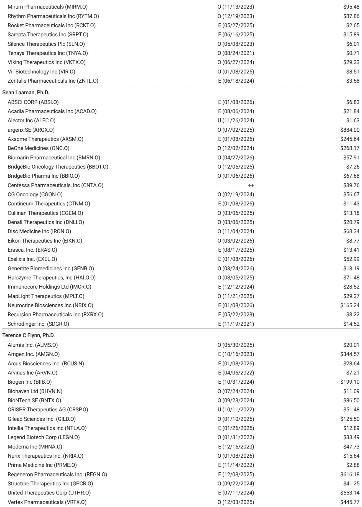
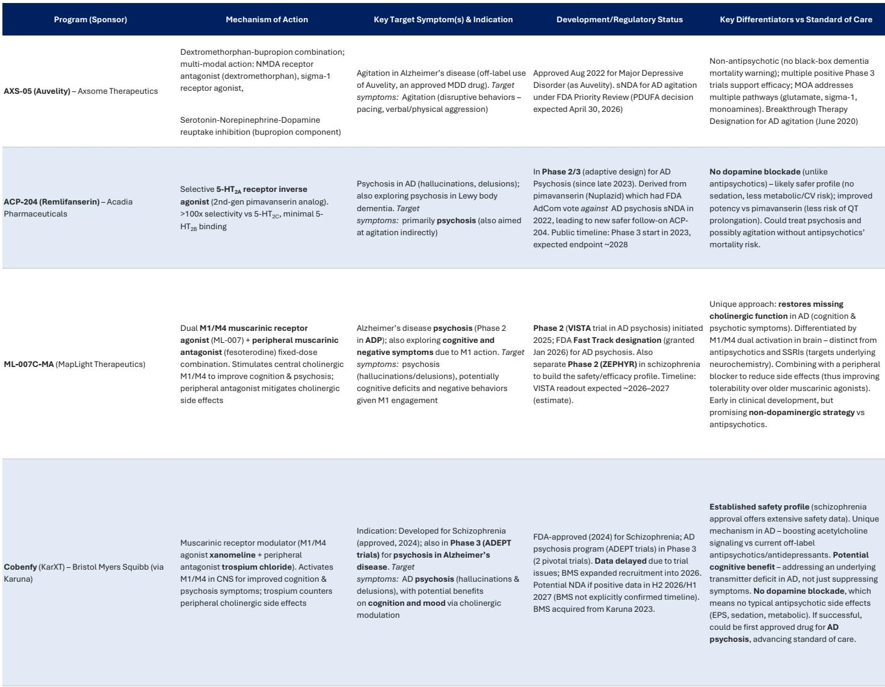
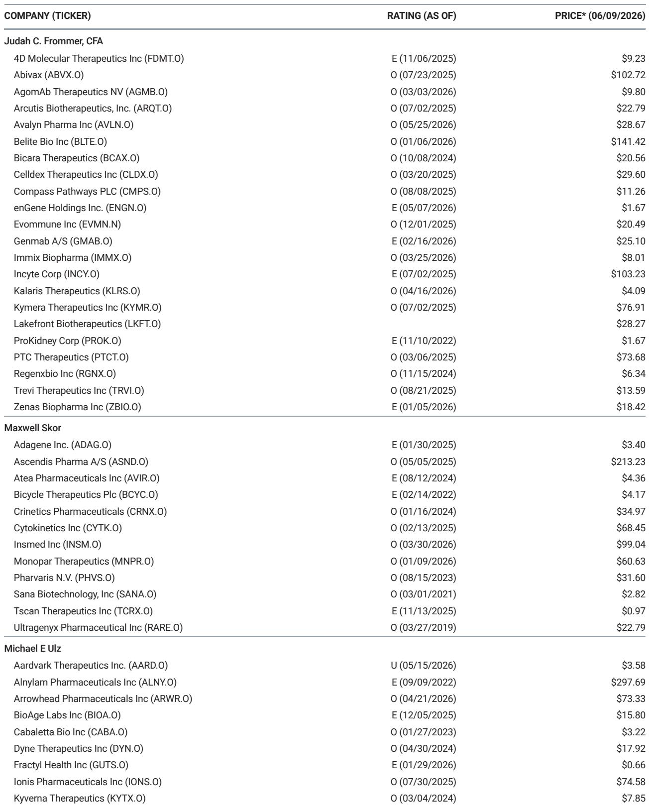

# Alzheimer's Is the Hardest Boundary of the Longevity Trade, and Brain Shuttles Are Only Half the Answer

The US population is approaching a demographic plateau, yet the healthcare cost curve is accelerating upward. This is not a contradiction. It is a structural shift driven by age mix rather than population count. The Congressional Budget Office projects the US population will peak around 2050 and then decline back toward current levels by 2099, a net increase of roughly 100,000 people over 73 years. But during that same period, the senior share of the population rises from 18.8 percent to 30.5 percent. That single compositional shift, independent of any new disease burden, pushes personal healthcare spending from 11.7 percent of GDP today to an estimated 13.1 percent by 2050. The math is mechanical: seniors consume roughly 2.4 times the per-capita healthcare spending of working-age adults.

Alzheimer's disease is where this demographic pressure concentrates most acutely. Clinical prevalence in the US is expected to rise from approximately 6.1 million patients in 2020 to roughly 12.7 million by 2050. But prevalence is only part of the story. The real economic weight comes from the fact that Alzheimer's converts added years of life into added years of dependency. Life expectancy has reached an apparent ceiling near 80 years, while healthspan—years lived without disease impairment—has plateaued at roughly 70 years. The gap between these two curves is widening, and Alzheimer's is its primary driver.

The conventional narrative around longevity investing has focused on cardiometabolic disease, driven by the remarkable success of GLP-1 receptor agonists. But recent clinical data suggest these drugs are unlikely to relieve the neurological burden at the tail end of life. The EVOKE and EVOKE+ Phase 3 trials of oral semaglutide in early symptomatic Alzheimer's were terminated in November 2025 after failing to slow progression. The implication is clear: metabolic risk reduction is indirect and insufficient for neurodegenerative disease. The obesity and diabetes franchises that dominate today's longevity conversation address a different problem set.

This leaves investors with a critical question. If the biggest driver of future healthcare cost growth is Alzheimer's, and if existing drug classes cannot address it, where does the solution come from? The answer is not a single molecule or mechanism. It is a layered strategy that distinguishes between disease modification and symptomatic control, and that recognizes the blood-brain barrier as both the central obstacle and the central opportunity.

## The Demographic Shift Is a Spend Escalator, Not a Population Problem

The most important demographic fact for healthcare investors is not that the US population is growing slowly. It is that the population is aging rapidly while remaining flat in absolute terms. The CBO's long-term projections show US population declining from 364 million in 2050 back to 349 million by 2099, essentially returning to the 2026 level after a mid-century peak. This means the healthcare system cannot rely on a growing taxpayer base to absorb rising costs. Every dollar of increased senior spending must be absorbed by a roughly constant working-age population.

The per-capita spending differential is stark. Seniors in the US incur approximately $22,400 in annual personal healthcare spending, compared with $9,200 for adults and $4,400 for children. As the senior share of the population rises from 18.8 percent to 30.5 percent, the age mix alone pushes total personal healthcare spending from roughly $3.7 trillion today to an estimated $6.3 trillion by 2050, even without any increase in disease prevalence per age cohort. This is a mechanical effect, not a speculative one.

But the real burden is worse than these aggregate numbers suggest. Alzheimer's disease disproportionately affects the oldest seniors, and it is the most expensive condition to manage. Annual healthcare costs for seniors with Alzheimer's or other dementias are approximately $28,700, compared with $8,200 for seniors without dementia. The difference is driven primarily by the cost of institutional care and the enormous unpaid caregiver burden. In 2019, the total medical treatment stack for broad dementias was roughly $53,000 per patient, of which $43,000—82 percent—was accounted for by unpaid family care. Pharmaceutical spending averaged approximately $172 per patient, or roughly 0.3 percent of the total.

This cost structure creates a powerful incentive for disease-modifying therapies. A treatment that delays the transition from independent living to nursing home care by even 12 to 18 months delivers economic value worth multiples of its list price to the healthcare system. But capturing that value requires a therapy that actually changes the trajectory of the disease, not just its symptoms.

## The Amyloid Ceiling Shows That Delivery Is Not the Same as Efficacy

The validation of the amyloid hypothesis through lecanemab and donanemab was a genuine scientific milestone. Both drugs demonstrated that removing amyloid plaques from the brain slows cognitive decline, with approximately 0.45 points on the CDR-SB scale and roughly 27 percent slowing at 18 months. But the clinical effect is modest, and the evidence increasingly suggests that amyloid clearance is approaching a ceiling.

The problem is biological, not technological. Amyloid accumulation begins decades before symptom onset, and by the time patients present with mild cognitive impairment, the pathological cascade is well advanced. Removing amyloid at this stage can slow further damage but cannot reverse the neuronal loss that has already occurred. Faster or deeper clearance may not lead to better clinical outcomes because the downstream pathology—tau tangles, neuroinflammation, synaptic dysfunction—has become self-sustaining.

This is where the brain shuttle debate becomes critical. Roche's trontinemab, which uses a transferrin receptor shuttle to increase brain penetration of an anti-amyloid antibody, has shown impressive biomarker results, with approximately 91 percent of patients falling below the amyloid positivity threshold and a low rate of ARIA-E below 5 percent. But the question is whether better delivery of the same mechanism will produce meaningfully better clinical outcomes. If the amyloid ceiling is real, then a better-delivered anti-amyloid antibody inherits the same downstream biological constraints.

The implication is that brain shuttles, while transformative for drug delivery, do not automatically transform drug efficacy. They solve the problem of brain bioavailability, which was the primary reason so many large-molecule programs failed in the past. But they do not solve the problem of target selection. A shuttle makes a biologic deliverable, but it does not make it inherently more or less efficacious on its cognate molecular target.

## The Denali Approval De-Risks Shuttles but Shifts the Debate to Tau and Beyond

Denali's March 2026 accelerated approval of Avlayah for the neurologic manifestations of Hunter syndrome is a genuine paradigm shift. It is the first US regulatory approval for a brain shuttle program, and it validates the transferrin receptor transport vehicle platform for delivering large enzymes across the blood-brain barrier. The approval effectively converts brain bioavailability from a barrier into an engineable obstacle, at least for lysosomal storage diseases where enzyme replacement is the established mechanism.

But the translation to Alzheimer's is not straightforward. In Hunter syndrome, the therapeutic logic is simple: deliver the missing enzyme to the brain, and the substrate accumulation that drives pathology will be cleared. The shuttle solves the only remaining problem, which was getting the enzyme across the blood-brain barrier at therapeutic concentrations. In Alzheimer's disease, the pathology is more complex, the target engagement is less clear, and the timing of intervention is less well understood.

The more interesting question is whether shuttles can enable effective targeting of tau pathology. Tau tangles correlate more closely with neuronal dysfunction, neurodegeneration, and cognitive decline than amyloid burden alone. But tau is an intracellular protein, and targeting it requires either clearing extracellular aggregates or knocking down tau production at the RNA level. This is where shuttles for oligonucleotides become relevant. Denali's DNL628, an antisense oligonucleotide targeting MAPT mRNA delivered via a transport vehicle, began Phase 1b dosing in the first quarter of 2026. Arrowhead's ARO-MAPT uses a different shuttle platform for siRNA-mediated tau knockdown. These programs represent a fundamentally different approach than anti-amyloid antibodies, and their data will be decisive for the field.

The unresolved question is whether tau knockdown will prove clinically meaningful. Reducing total tau production could be effective, but it could also interfere with normal tau function in neuronal stability and axonal transport. The risk-benefit calculus is different from amyloid removal, and the clinical data remain years away.

## Symptomatic Control Is the Nearer-Term Opportunity, Not a Consolation Prize

The focus on disease-modifying therapies has obscured an important reality: symptomatic control can deliver meaningful value to patients and the healthcare system, even without altering the underlying disease trajectory. Psychosis and agitation are among the most distressing symptoms of Alzheimer's disease and are primary drivers of institutionalization. A therapy that manages these symptoms effectively can delay nursing home placement, reduce caregiver burden, and improve quality of life, even if cognitive decline continues at the same rate.

The muscarinic agonist class has emerged as the most promising near-term opportunity. Bristol Myers' Cobenfy, originally developed for schizophrenia, is being evaluated in Alzheimer's psychosis. MapLight's ML-007C-MA is a M1/M4 muscarinic agonist with a peripheral antagonist to reduce side effects. Acadia's remlifanserin targets the 5-HT2A receptor for psychosis. Axsome's Auvelity, an NMDA antagonist and sigma-1 agonist, is being studied for agitation.

The market opportunity for symptomatic control is substantial. The report estimates a $20 billion US market for these therapies, compared with $50 billion for disease-modifying therapies. But the probability of success is higher, the clinical trials are shorter, and the regulatory path is more established. For investors, the risk-adjusted opportunity in symptomatic control may be more attractive than the binary outcome of disease modification, at least until the tau shuttle data mature.

The strategic question is whether symptomatic control and disease modification are complementary or competing approaches. In practice, they are likely to be used together. A patient receiving a disease-modifying therapy to slow cognitive decline may also need symptomatic treatment for psychosis or agitation. The combination could extend independent living more than either approach alone. But the commercial models are different. Disease-modifying therapies command high prices based on their potential to alter the cost curve of institutional care. Symptomatic therapies are priced more like chronic maintenance drugs. The margin structures are different, and the investor thesis should reflect that.

## What the Report Does Not Fully Answer: The Timing and Magnitude of the Shift

The report provides a compelling framework for the $70 billion US Alzheimer's therapy market and identifies the key companies and platforms. But it leaves several critical questions unresolved.

First, the timing of the brain shuttle revolution is uncertain. Denali's approval in Hunter syndrome is a proof of concept, but the Alzheimer's programs are years away from pivotal data. Roche's trontinemab has a pivotal readout in 2028. Denali's tau program is in Phase 1b. Arrowhead's tau program has Phase 1/2a data expected in 2027. The market may be pricing in a shuttle-enabled transformation that is still five to ten years away, if it happens at all.

Second, the magnitude of the shuttle advantage is unclear. Even if shuttles improve brain penetration by an order of magnitude, the clinical benefit depends on target biology. A shuttle-enabled anti-amyloid antibody may achieve faster clearance and lower dosing frequency, but if the amyloid ceiling is real, the clinical outcome may not be meaningfully different from existing therapies. The report acknowledges this tension but does not resolve it.

Third, the competitive dynamics are evolving rapidly. The report's market cap multiplier analysis shows that smaller companies like Denali and MapLight have the highest theoretical upside relative to their current market capitalization, but this assumes full market share and 100 percent probability of success. In reality, the large-cap companies like Lilly, Roche, and Bristol Myers have the resources to pivot quickly if shuttle-enabled therapies show meaningful differentiation. The small-cap advantage may be transient.

Finally, the report does not fully address the payer dynamics. A $70 billion market assumes that payers will reimburse these therapies at prices that reflect their economic value. But the US healthcare system has historically been slow to adopt high-cost therapies for chronic diseases, especially when the clinical benefit is modest and the patient population is large. The Alzheimer's therapy market could be constrained by utilization management, prior authorization requirements, and step therapy protocols that limit access to the most expensive treatments.

## A Decision Framework for Investors Evaluating the Alzheimer's Opportunity

The report's analysis supports a structured approach to evaluating Alzheimer's therapy investments. The framework has three layers.

Layer one is the demographic and cost baseline. The US population is aging, and Alzheimer's prevalence is rising. This creates a growing addressable market that is largely independent of therapeutic innovation. Any therapy that demonstrates even modest efficacy in delaying disease progression or managing symptoms will find a willing market. The question is not whether the market exists but which companies will capture it.

Layer two is the technology platform. Brain shuttles are the most important enabling technology in neurology since the development of monoclonal antibodies. Denali's approval de-risks the platform for lysosomal diseases, and the extension to Alzheimer's is the logical next step. But investors should distinguish between companies that own the platform and companies that license it. Platform owners capture value across multiple indications. Licensees capture value only in their specific program, and their economics depend on the royalty terms.

Layer three is the target biology. Amyloid has been validated but appears to have an efficacy ceiling. Tau is the next frontier, but the clinical data are immature. Symptomatic control is the most derisked approach but addresses a smaller market. The optimal portfolio includes exposure to all three layers, with the recognition that each has a different risk profile and time horizon.

The critical unknown is whether tau knockdown will prove clinically meaningful. If it does, the shuttle-enabled oligonucleotide programs could transform the Alzheimer's treatment landscape. If it does not, the field may be limited to modest disease modification with anti-amyloid antibodies and symptomatic control, which would still represent a $70 billion market but one that grows more slowly and faces more pricing pressure.

Join the community to read the full report and review the original charts.

*This article is for learning and discussion only and does not constitute investment advice.*

Personal reading notes and learning share only. Not investment advice.

