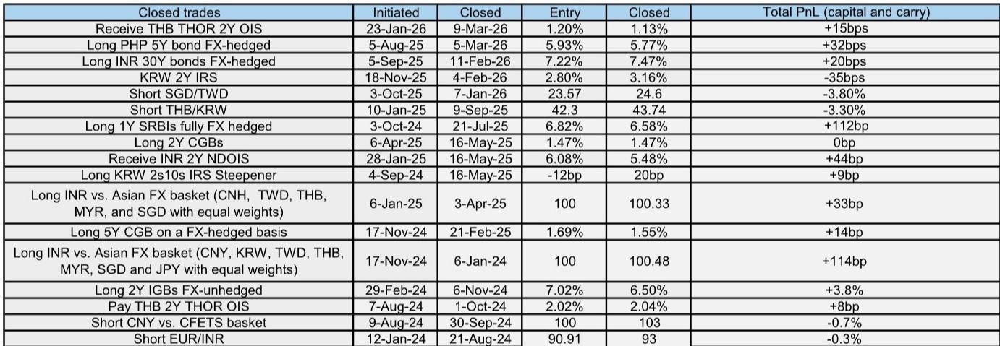
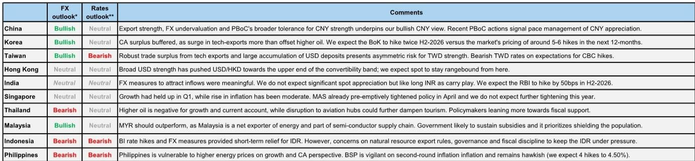
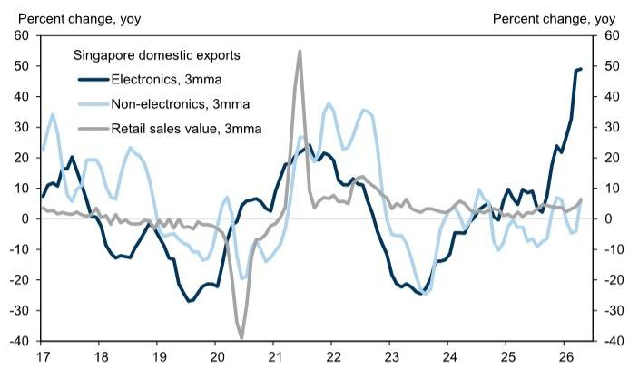

# Asian Central Banks Are Winning the Battle for Currency Stability, But the War Against the Dollar Is Far From Over

The conventional wisdom that emerging market central banks are powerless against a strengthening dollar is being rewritten across Asia. Since the onset of the Middle East conflict, every regional currency except the Chinese renminbi has depreciated against the US dollar, with several breaking through prior resistance levels. Yet what began as a reactive scramble to defend currencies through reserve depletion has evolved into a coordinated, multi-instrument policy response that is demonstrably altering the trajectory of Asian foreign exchange markets. The critical insight for investors is this: Asian central banks are no longer simply intervening; they are restructuring the incentives for capital flows, and the divergence in policy effectiveness is creating clear winners and losers among regional currencies.

The energy shock that began four months ago has proven to be a structural rather than a transitory challenge, forcing policymakers to move beyond the first-order response of FX intervention. The evidence is clear in the broad drawdown of foreign exchange reserves across most Asian economies since February. However, the second-order response has been far more sophisticated. Central banks have deployed a combination of interest rate hikes, capital flow management measures, and regulatory adjustments that collectively represent the most aggressive and coordinated policy toolkit seen in the region in over a decade. The Philippine central bank raised rates in April, Bank Indonesia executed both a regular and an off-cycle hike totaling 75 basis points, and the Reserve Bank of India introduced a suite of measures to attract foreign inflows. These actions have put a brake on the slide, but the fundamental question remains: can these policies generate sustained currency appreciation, or are they merely buying time?

The answer depends on understanding which currencies are benefiting from structural policy advantages and which are merely experiencing temporary relief. This distinction will determine relative performance for the remainder of the year.

## Policy Interventions Have Stabilized Asian Currencies, But Sustained Appreciation Requires Resolution of the Energy Shock

The effectiveness of Asian central banks' measures must be evaluated against the broader macro backdrop that continues to support the US dollar. The energy shock is structurally less adverse to the US economy compared to Europe and Asia, the AI-driven investment boom has fueled a sustained US equity market rally, and market expectations for Federal Reserve rate cuts have been pushed back significantly. A global investment bank report now projects US 10-year yields at 4.4 percent, up from 4.1 percent previously. These macro variables create a powerful headwind for any emerging market currency seeking to appreciate against the dollar.

The implication is that no amount of domestic policy tightening can fully offset the external macro environment. What central banks can do, however, is prevent disorderly depreciation and create conditions for outperformance once the external backdrop shifts. This is precisely what the data shows: the pace of depreciation has slowed across most Asian currencies, and some have stabilized entirely. The key variable that could reverse this dynamic is a resolution to the Middle East conflict that leads to a significant drop in oil prices. Such an outcome would reverse the terms-of-trade deterioration that has been the primary channel through which the conflict has impacted Asian economies.

Within this framework, the relative performance of Asian currencies will be determined by three factors: the extent of energy import dependence, the credibility of central bank policy responses, and the structural strength of export sectors. The currencies that score highest on these dimensions will be best positioned to appreciate when the macro backdrop eventually turns favorable.

## China's Renminbi Is on a Structural Appreciation Path Driven by Policy Design, Not Market Forces

The Chinese renminbi stands apart from every other Asian currency in that it has actually appreciated against the US dollar throughout the Middle East conflict. This is not an accident of market forces but a deliberate policy choice by the People's Bank of China. The PBoC appears comfortable with orderly, gradual renminbi appreciation at an annualized pace of around 4 percent, a rate that is fast enough to offset carry costs for foreign investors but slow enough to maintain export competitiveness and contain inflationary pressures.

The mechanism behind this appreciation is instructive. Despite weaker-than-expected April activity data, the threshold for broad monetary easing remains high. Growth is bifurcated, with exports still supporting headline expansion while domestic demand remains soft. The oil-led reflation actually complicates the case for monetary easing, as it would add to inflationary pressures. Instead, policy support is coming through fiscal measures and maintaining ample liquidity, not through interest rate cuts.

What is particularly striking is the behavioral response this policy has generated. Exporters' FX conversion ratios have risen significantly, with an estimated 150 billion US dollars more in FX proceeds converted than normal since last December. This compares to a peak of around 500 billion US dollars in excess corporate dollar hoarding that had built up by mid-2025. The combination of ongoing export outperformance, significant renminbi undervaluation, and the PBoC's policy preference creates a powerful self-reinforcing dynamic. Exporters, seeing the trend, are increasingly willing to convert their dollar earnings, which in turn supports the renminbi and validates the policy approach.

The implications for investors are clear. The renminbi is on a gradual appreciation path toward 6.70 in six months and 6.50 in twelve months. This creates a structural anchor for the entire Asian FX complex, as other central banks can point to China's policy as evidence that gradual appreciation is achievable even in a strong dollar environment.

## South Korea's Won Is Held Back by an Unusual Structural Problem That Only a Broader Market Rally Can Solve

The Korean won presents one of the most counterintuitive puzzles in Asian FX markets. Despite a 90 percent rally in the KOSPI year-to-date and an AI-driven export boom that has generated a massive current account surplus, the won has underperformed its regional peers. The explanation lies not in macroeconomic fundamentals but in the microstructure of equity markets.

Foreign investors have net sold 80 billion US dollars of Korean equities year-to-date, even as the market has surged. The reason is that the rally has been overwhelmingly concentrated in two large semiconductor companies, Samsung and SK Hynix. Their combined weight in the KOSPI has pushed above diversification thresholds under the Investment Company Act of 1940, triggering forced selling by foreign institutional investors who must maintain portfolio diversification limits. This is a mechanical, not a fundamental, driver of outflows, but it has been powerful enough to offset the strong current account surplus.

The Bank of Korea has responded by turning more hawkish, with the median dot plot now projecting two 25 basis point hikes over the next six months. But the central bank's own economists expect only two hikes, compared to market pricing of six hikes over the next twelve months. This divergence reflects the view that the growth driver is concentrated in semiconductors and not broad-based, which matters for the magnitude of tightening required.

The critical question for the won is whether the KOSPI rally can broaden out beyond the two semiconductor giants. If it does, the selling related to concentration risk would ease, and foreign inflows could actually turn positive. This would unlock the fundamental support from the current account surplus and allow the won to outperform. Until then, the won remains a story of structural strength masked by a temporary technical constraint.

## India's Rupee Offers the Best Risk-Reward Among High-Yield Asian Currencies

Among the high-yield Asian currencies, the Indian rupee stands out for the credibility and comprehensiveness of the policy response. The Reserve Bank of India has kept policy rates unchanged while announcing a suite of FX measures designed to encourage capital inflows. These include exemption of tax on capital gains for foreign investments in government securities, extending foreign investor access to ultra-long-end maturities, and exemptions for banks raising foreign currency bonds and deposits.

The effectiveness of these measures is evident in the data. Carry levels in the rupee have increased since the beginning of the conflict and are now higher than other Asian high-yielders like the Indonesian rupiah and Philippine peso. On a trade-weighted basis, the rupee is at fair levels, but it screens as among the more undervalued emerging market currencies versus the dollar on the global investment bank's GSDEER and GSFEER metrics. This combination of high carry and undervaluation creates an attractive risk-reward profile.

The recommended trade of going short Thai baht versus Indian rupee captures this dynamic. The annualized carry on this pair is approximately 4.7 percent, and the structural advantages of the Indian economy, including strong growth surprising to the upside at 7.8 percent year-on-year in Q1, provide fundamental support. The RBI's war chest of reserves provides additional comfort that the central bank can defend its currency if needed.

## What the Report Does Not Fully Answer: The Sustainability of Indonesia's Policy Response

The most significant analytical gap in the current framework concerns Indonesia. Bank Indonesia has been the most aggressive among regional central banks, hiking by 50 basis points in May and an additional 25 basis points in an off-cycle meeting in June, while also raising yields on SRBIs and reducing the hedging swap rate for foreign investors. These measures have provided some relief for the rupiah, but they have not addressed the deeper domestic concerns that are weighing on the currency.

Three specific issues remain unresolved. First, the government's plan to centralize natural resource exports and retain export proceeds in state banks has created uncertainty among business groups. While aimed at improving tax revenue and preventing under-invoicing, investors worry that added bureaucracy could delay exports. Second, parliament has passed a law expanding Bank Indonesia's mandate to include a more explicit pro-growth objective, raising concerns about the inflation targeting framework. Third, there is uncertainty about MSCI's treatment of Indonesian equities, including its emerging market status.

These domestic concerns add to an already challenging set of macro objectives. The president's pro-growth preference, maintaining fuel subsidies, funding a free meal program equivalent to 1.1 percent of GDP, and keeping within the 3 percent fiscal deficit cap create conflicting priorities. Until these domestic issues are resolved, the rupiah is likely to continue underperforming its regional peers, regardless of how aggressively Bank Indonesia hikes rates.

## A Decision Framework for Asian FX Positioning

For investors seeking to navigate the Asian FX landscape, a three-dimensional framework is essential. The first dimension is energy exposure. Economies with higher dependence on energy imports, such as the Philippines and India, are more vulnerable to sustained oil price elevation. The Philippines, where fuel prices are largely market determined, has seen rapid inflation pass-through with April and May CPI printing at 7.2 percent and 6.8 percent respectively. If oil prices remain elevated, these currencies will stay under pressure.

The second dimension is central bank credibility. The Reserve Bank of India and the People's Bank of China have demonstrated the most credible and comprehensive policy responses. Bank Indonesia has been aggressive but faces domestic headwinds that undermine the effectiveness of its measures. The Bank of Korea is constrained by the structural equity market issue that no amount of rate hiking can solve directly.

The third dimension is export structure. Taiwan's semiconductor exports have helped offset the impact of higher oil prices on terms of trade, supporting the Taiwanese dollar's relative outperformance. South Korea's AI-driven export boom is equally impressive but has been offset by equity outflows. The Philippines, with a less diversified export base, has fewer buffers against the energy shock.

The key insight from this framework is that the most attractive positions are those where structural advantages align with credible policy responses. The Indian rupee offers the best combination of high carry, undervaluation, and policy credibility. The Chinese renminbi offers a structural appreciation path that is policy-supported. The Taiwanese dollar benefits from an export boom that directly offsets the energy shock. By contrast, the Indonesian rupiah and Philippine peso are likely to remain underperformers until their domestic and external headwinds are resolved.

---

Join the community to read the full report and review the original charts.

*This article is for learning and discussion only and does not constitute investment advice.*

Personal reading notes and learning share only. Not investment advice.

