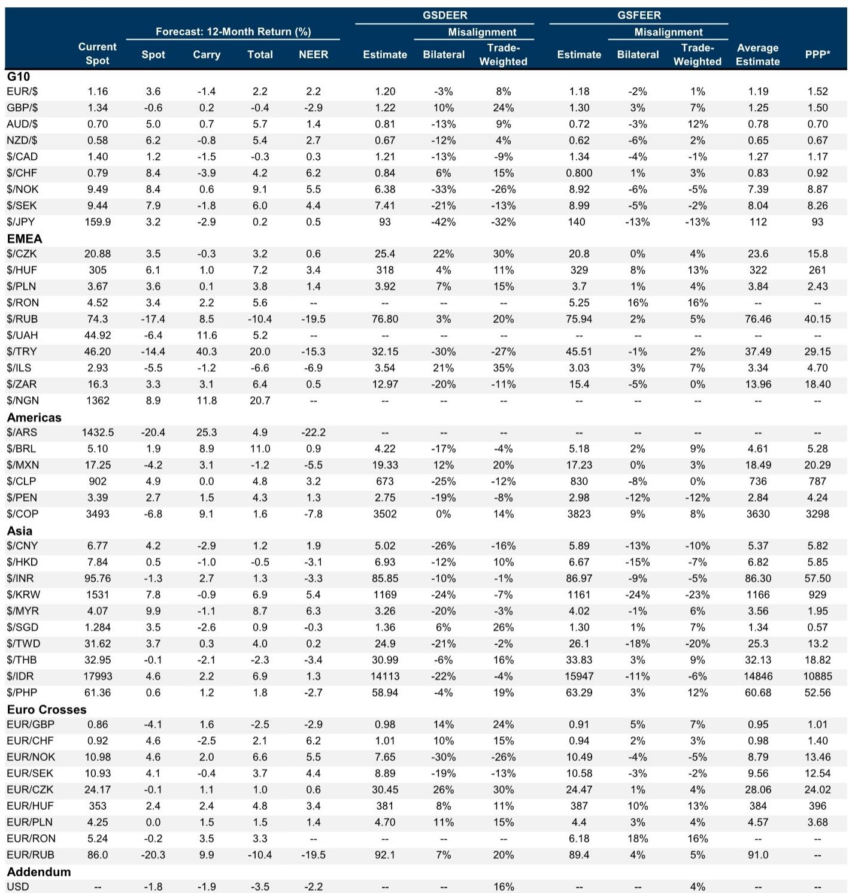
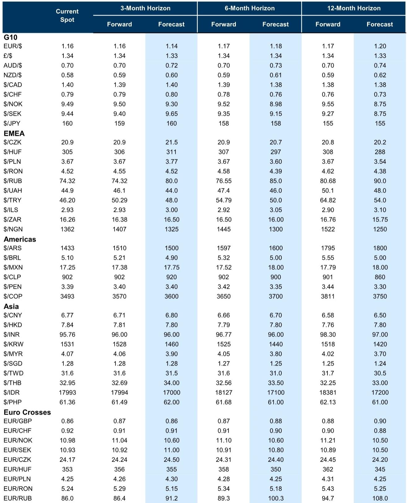
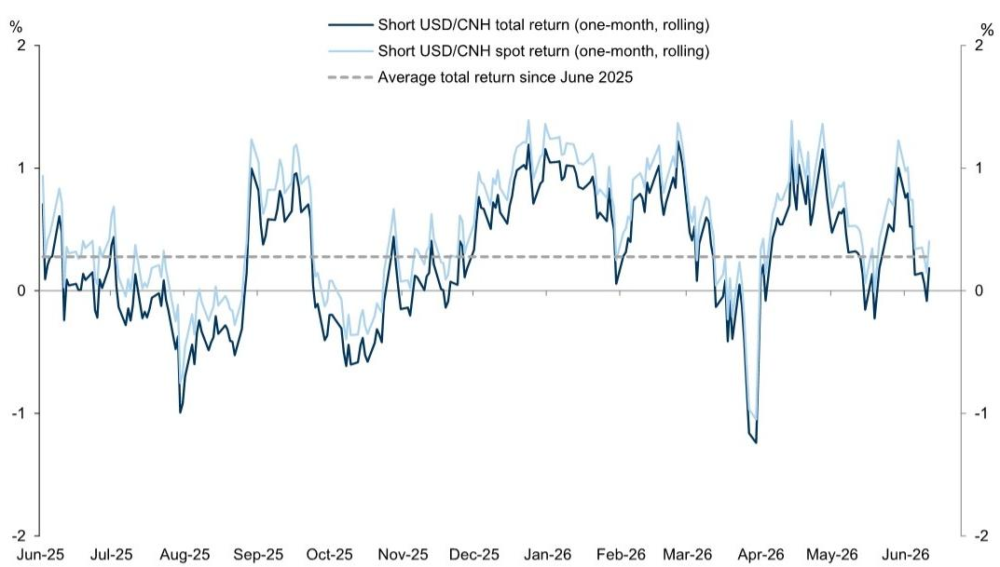

# GS：美元并非被高估，而是被错误定价——能源冲击的“项圈效应”才是核心

这份最新发布的GS外汇策略报告，标题看似平淡——“项圈中的美元”——但如果你只看到它对美元短期走势的判断，就错过了真正的信号。报告的核心主张不在于预测美元涨跌，而在于揭示一个正在发生的、市场尚未充分定价的机制切换：全球外汇市场的定价权，正在从宏观风险偏好（AI叙事、商品价格）向国内利率差异（货币政策分化、实际利差）转移。这个转移，将重新定义未来6-12个月所有主要货币对的交易逻辑。

报告发布于一个微妙的时点。市场仍在消化中东冲突对能源供应的冲击，AI驱动的资本开支周期正经历第一轮预期修正，而美联储即将召开会议。在这样的背景下，GS团队没有给出简单的“买美元”或“卖美元”建议，而是提供了一个分析框架：理解当前外汇市场，需要同时把握两个维度——能源冲击的持续时间和国内政策的分化程度。前者决定美元的底部，后者决定货币对的相对强弱。

这份报告最有价值的判断是：市场真正低估的不是美元的方向，而是能源冲击正在从“脉冲式扰动”演变为“结构性约束”。这意味着，传统上依赖风险偏好和增长差异的外汇交易模型，可能需要重新校准。GS用两个图表清晰地展示了这种切换——从3-4月全球因素（股票、商品）主导汇率波动，到5月后利率差异重新成为关键驱动。这个信号，对于任何持有跨境资产或关注汇率风险敞口的决策者，都值得认真对待。

## 1. 能源冲击的“项圈效应”：收窄美元波动区间，而非决定方向

理解这份报告的关键，在于区分“能源冲击的规模”和“能源冲击的持续性”。GS的观点是，市场可能过于关注前者——即油价具体涨多少——而低估了后者带来的结构性影响。报告原文指出：“过热的油价正在降温，这让美元被困在项圈中。”这个判断的底层逻辑是：如果能源短缺是短暂且可控的，那么美元会因美国相对能源独立而获得避险溢价；但如果短缺变成持久战，反而会通过侵蚀全球增长预期，反过来压制美元。

这正是报告所说的“项圈效应”——能源冲击同时设定了美元的上限和下限。上限来自：持续的能源短缺拖累全球增长，最终反噬美国经济前景，限制美元进一步走强。下限来自：只要中东局势未彻底解决，能源供应的不确定性就为美元提供支撑。GS认为，当前市场对“能源缺口小于预期”的认知正在帮助稳定增长预期，这意味着美元短期不会大幅贬值，但也缺乏向上突破的催化剂。

这个框架对投资者的含义是：短期美元交易应关注波动率而非方向。报告特别指出，尽管宏观不确定性高企，但美元波动率（vol）并未同步上升——这本身就是一个信号，表明市场在等待新的催化剂，无论是美联储政策路径的重新定价，还是能源局势的实质性变化。对于套利交易者而言，当前环境更适合卖出波动率；对于对冲需求者而言，则需要警惕“项圈突然收紧”的风险。

## 2. 人民币的“结构性强弱”：贸易顺差与汇率低估的双重支撑，但动能正在切换

这份报告对人民币的判断，可能是对亚洲投资者最有价值的部分。GS明确看多人民币，目标价6.50（12个月），但更值得关注的是其论证逻辑——它没有依赖传统的利差或资本流动分析，而是从中国贸易竞争力的结构性优势出发。

核心论据有三层。第一层是贸易顺差的韧性。5月中国贸易顺差重回1000亿美元以上，这在全球能源冲击背景下显得尤为突出。GS特别指出，尽管对欧洲和拉美的出口有所下降，但对其他地区的名义出口仍在增长，且主要受科技产品价格上涨推动。这暗示中国出口结构正在向高附加值领域迁移，而非简单的数量扩张。第二层是汇率的深度低估。GS估算人民币低估超过20%（基于GSDEER和GSFEER模型），这意味着即使出现一定程度的实际升值，也不会损害竞争力。第三层是政策容忍度。报告认为，中国决策层对“渐进式升值”的容忍度正在提高，这从近期中间价和市场汇率的同步走低可以看出。

但报告也提示了短期风险：贸易顺差可能面临来自黄金多元化、能源和半导体进口成本上升以及PPI通胀的短期逆风。这意味着，人民币的升值路径不会是线性的。GS承认过去一个月人民币总回报已经趋于平坦，但强调“过去一周在岸和离岸汇率同时创下年内新低”——这暗示动能可能正在重新积聚。

对于持有人民币资产或关注中国敞口的投资者，这个判断意味着：人民币的升值故事已经从“预期驱动”切换到“基本面驱动”。贸易顺差和汇率低估提供了硬支撑，但短期节奏取决于能源价格和全球需求的变化。这是一个适合逐步建立多头头寸而非追逐突破的窗口。

## 3. 英镑的“政治溢价陷阱”：选举事件的风险被高估，能源冲击才是真正变量

GS对英镑的分析提供了一个很好的案例，展示如何看待政治风险事件对汇率的影响。下周的Makefield补选被视为工党领袖Andy Burnham潜在领导力挑战的关键节点，但报告认为，这对英镑的冲击将是“相当狭窄的”。

为什么？因为政治溢价已经在市场中有所定价，但程度有限。GS构建的英镑政治风险溢价指标显示，尽管Burnham领导的政府概率在预测市场中已升至70%以上，但英镑的反应一直相当温和。报告认为，要让政治溢价显著扩大并实质打压英镑，需要满足两个条件之一：要么Burnham公布具体的政策计划，让市场担忧英国财政轨迹；要么政治不确定性持续更长时间。但即使在这种情况下，GS认为其他更基本的因素——尤其是能源冲击的演变——将继续主导英镑走势。

这个判断的战略含义是：不要把英镑交易简化为“选举结果押注”。真正的交易机会在于理解英镑作为“顺周期能源进口国”的属性。如果中东局势出现实质性缓和，能源价格回落，英镑将是主要受益者之一——因为其贸易条件的改善将轻易抵消任何额外的政治溢价。反之，如果能源紧张持续，英镑面临的下行压力将远大于政治因素本身。

GS建议，看空英镑兑美元或澳元（能源出口国）的交易更适合战术性对冲，而非战略性配置。对于长期持有者而言，当前窗口是一个值得关注的布局时机——特别是在市场对政治风险反应过度的情况下。

## 4. 日元的“政策困境”：加息预期已被消化，真正的压制来自美国利率和财政风险

日本央行的政策路径是今年外汇市场最受关注的话题之一。GS的报告提供了一个清醒的评估：即使日本央行在6月会议加息25个基点，对日元的提振可能也有限。原因在于，市场已经充分定价了这次加息，而真正压制日元的因素——更高的美国利率、美国增长优势以及日本国内的财政风险——尚未改变。

报告特别指出了日本央行面临的“政策两难”：一方面需要收紧货币政策以应对通胀，另一方面又担心过快收紧会压制经济增长和财政可持续性。GS经济学家预计，日本央行将继续以非常渐进的节奏加息，这意味着货币政策对日元的影响将远远小于更广泛的宏观背景和美国前景。

更值得关注的是，GS对日本央行资产负债表政策的判断。市场有猜测认为日本央行可能增加日本国债购买以控制长端收益率，但报告认为这反而会加大日元贬值压力——因为日本财政风险溢价推高了收益率，而非供给因素。换句话说，试图通过购买债券来压低收益率，只会让市场更加怀疑日本财政的可持续性，从而进一步削弱日元。

对于日元投资者，这个分析的含义是：不要押注日本央行加息会带来日元趋势性走强。日元当前的主要叙事仍然是“融资货币”——即被用于套利交易的低息货币。只要美国利率维持高位、全球风险偏好没有系统性恶化，日元就难以摆脱弱势。真正的转折点可能来自美国经济放缓或日本通胀失控，而不是日本央行的渐进式加息。

## 5. 一个尚未完全回答的关键问题：当“能源冲击”与“AI叙事”同时退潮，美元会如何定价？

这份报告最有深度的部分，在于它触及了一个尚未被充分探讨的问题：当前全球外汇市场同时受到两个宏观主题的驱动——AI繁荣和能源供应紧张。这两个主题对美元都是净利好，但它们正在以不同的速度和不同的方式衰减。报告提到“AI繁荣”和“能源供应紧张”的组合对美元是净利好，但对其衰减路径的分析相对有限。

这里有一个值得深入思考的伏笔：如果AI叙事的预期修正（比如资本开支回报低于预期）与能源冲击的缓解同时发生，美元的定价逻辑将面临双重挑战。一方面，AI相关资本流入减少会削弱美元需求；另一方面，能源冲击缓解会降低美元的避险溢价。这种情况下，美元可能面临的是“双杀”而非“项圈”。

但报告没有完全展开这个情景的分析。它更侧重于当前市场环境下的战术交易，而非对极端情景的推演。这恰恰是读者需要自行判断的部分——也是完整报告可能提供更多细节的地方。对于有经验的投资者而言，构建一个完整的概率分布，而非仅仅关注基准情景，才是应对当前不确定性的关键。

## 6. 投资者的观察框架：从“宏观因子”转向“国内利率差异”，并关注三个具体信号

基于GS的分析，我们可以构建一个更清晰的观察框架。核心是：放弃用单一叙事（比如“美元走强”或“新兴市场货币反弹”）来指导交易，转而关注三个具体信号的变化。

第一个信号：美国与其他主要经济体的实际利差走势。报告明确指出，利率差异正在重新成为驱动汇率的关键因素。这意味着，投资者需要更关注各国央行的政策路径差异，而非仅仅关注全球风险情绪。当前，市场对美联储降息的定价可能过于激进——如果经济数据保持韧性，美元将获得额外支撑。

第二个信号：能源价格与汇率波动的相关性。报告显示，3-4月商品价格可以解释大部分汇率波动，但这个相关性正在减弱。如果能源价格从驱动因素变为背景因素，那么传统上依赖能源交易的国家（如挪威、加拿大、澳大利亚）的货币可能会回归国内基本面驱动。

第三个信号：新兴市场货币的“套利可交易性”。GS特别推荐了做空泰铢/做多印度卢比的交易，其逻辑在于两国货币政策路径的分化——印度可能继续加息，而泰国不会。这代表了一种新的交易模式：不再单纯追求高收益，而是寻找“货币政策分化”与“估值差异”的交集。印度卢比现在不仅提供更高的套利收益，而且估值相对便宜（相对于美元），这使其成为新兴市场货币中一个值得关注的配置选项。

对于读者而言，关键不是记住GS的具体交易建议，而是理解其背后的分析框架：在宏观不确定性高企的背景下，寻找“政策路径分化”带来的确定性机会，而非押注单一方向的趋势行情。

---

这份报告的价值不在于给出明确的多空结论，而在于提供了一个分析框架——让我们理解当前外汇市场的定价机制正在发生什么样的切换。能源冲击的持续性、国内利率差异的重新凸显、以及政治风险溢价的有限性，这三个维度共同构成了未来几个月的交易背景。

但报告也留下了一些未解的问题：如果AI叙事进一步退潮，美元会面临什么样的重新定价？如果中东局势出现意外缓和，英镑的反弹幅度是否会被低估？日本财政风险溢价究竟会在什么水平触发市场对日元信心的质变？这些问题的答案，可能需要更深入的模型推演和情景分析。

欢迎来星球微信群里继续讨论。我们会在群内分享完整的GS报告原文、关键图表的高清版本，以及团队对这些未解问题的进一步推演。如果你希望更系统地理解全球外汇市场的结构性变化，这些讨论会比任何单一报告都更具价值。

Personal reading notes and learning share only. Not investment advice.

