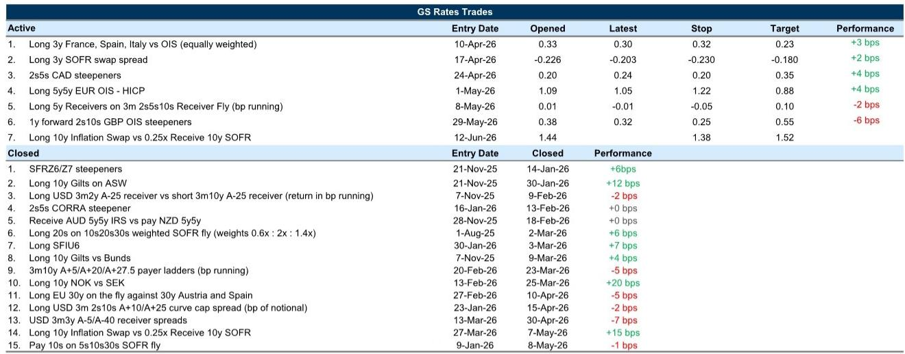
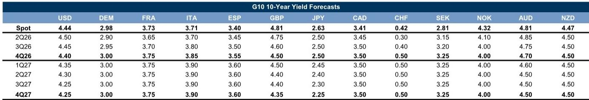

# GS：市场真正低估的不是通胀本身，而是利率曲线重新定价的路径

当全球投资者还在为地缘政治冲击下的油价波动焦虑时，一份来自GS全球利率交易团队的研报提出了一个更值得深思的框架：市场对短期通胀的定价已经相当充分，但真正未被消化的是利率曲线在多重路径下的重新定价。这份报告的核心判断是——美国利率曲线陡化的概率被系统性低估，而欧洲和英国的前端利率则存在被过度定价的加息风险。

这份报告发布于美联储新主席Warsh首次议息会议前夕，时间点本身就具有信号意义。全球利率市场正在经历一个罕见的“多路径均衡”阶段：油价在供给端冲击与需求端疲软之间拉扯，各国央行在“抗通胀的尾声”与“经济增长的脆弱”之间摇摆，而新一任美联储主席的沟通风格本身就是一个不确定变量。

GS分析师在报告中明确指出，市场定价隐含的加息概率已经包含了过多的鹰派预期。对于美国，30-35个基点的加息风险定价意味着市场已经计入了多次加息的可能性，而GS认为更可能的情景是“长期按兵不动”。对于欧元区和英国，情况则更加复杂——通胀的持续性而非短期油价飙升，才是决定央行政策路径的真正变量。

这篇文章将沿着GS的分析框架，拆解三个核心问题：为什么美国利率曲线陡化被低估、欧洲和英国的利率定价存在什么结构性偏差、以及新一任美联储主席的沟通方式可能如何改变市场游戏规则。最后，我们将指出报告尚未完全回答的几个关键问题，这些将决定投资者能否真正利用这份研报的洞见。

## 1. 美国利率市场最大的误判，是以为“加息风险”就是全部风险

GS研报的第一个核心洞察，直指美国利率市场当前定价的结构性偏差。报告指出，美国前端利率的加息定价已经从高点回落，曲线也从近期低点有所陡化，但市场仍然在接下来一年内定价了30-35个基点的加息风险。这个数字意味着市场已经隐含了多次加息的概率。

但GS的判断恰恰相反：长期按兵不动的可能性远高于加息，而中期降息的可能性也不应被完全排除。这个判断基于两个逻辑。第一，核心通胀的构成数据虽然比预期略强，但GS经济学家对中期核心通胀的前景仍然保持温和判断。第二，油价的下行风险——尤其是美伊协议的可能性——如果兑现，将显著改变通胀预期。

这意味着什么？如果GS的判断正确，当前市场定价中的加息溢价将在未来逐步消退，1y1y利率的下行风险显著大于上行风险。而最受益于这种情景的，是利率曲线的“红绿部分”——即中期和长期债券。GS建议，对鹰派风险和油价上行风险的最佳战术对冲，是建立那些能够从“加息风险提前兑现”中受益的头寸，而非简单做空利率。

这个判断的关键假设在于：美联储是否会真正转向“平衡”的沟通指引。报告提到，4月会议已经出现了转向平衡指引的支持声音，而新主席Warsh的首次会议将决定市场如何解读这个信号。如果新主席强调劳动力市场缺乏通胀压力，或者强调剔除波动后的通胀指标，市场将解读为鸽派信号，支持曲线陡化。反之，如果强调通胀风险的警惕信号，则会被视为鹰派。

## 2. 真实利率的“beta”被低估了，这是当前最值得关注的相对价值交易

GS的第二个核心洞察，聚焦于一个被多数投资者忽视的维度：真实利率与名义利率之间的beta关系。报告指出，美国利率的宽松定价主要来自通胀预期的下降，而长期真实收益率仅略低于2月高点。这意味着，如果通胀预期进一步下降，真实收益率的下行空间将非常可观。

GS在这里提出了一个具体的交易框架：做多10年期通胀互换，同时以0.25倍的名义权重做空10年期SOFR。这个交易的逻辑在于，真实利率的波动性远高于名义利率，而当前市场定价中，大部分风险溢价都集中在真实曲线中。如果通胀预期继续下行，真实利率的下降幅度将超过名义利率；如果通胀预期回升，名义利率的上行也会被真实利率的上升部分对冲。

这个交易的核心假设是：美联储的反应函数不会发生根本性变化。如果美联储变得更加鹰派，导致市场重新定价政策反应函数，那么真实利率将相对于名义利率上升，这个交易就会亏损。但GS认为，这种风险目前已经被前端定价中的鹰派风险部分吸收，因此这个交易的盈亏比仍然有利。

对于长期投资者而言，这个框架的启示在于：不要简单地将利率交易等同于通胀交易。真实利率的定价包含了增长预期、风险溢价和政策不确定性，而这些维度的定价偏差可能比通胀本身更大。

## 3. 欧洲利率市场的真正风险，不是短期油价，而是通胀的“持续性”

GS的欧洲利率分析，揭示了一个容易被市场忽略的结构性问题。报告指出，欧洲央行成为第一个在伊朗冲突后加息的全球主要央行，但这背后的驱动力不是短期油价飙升，而是通胀的持续性。欧洲央行的最新预测显示，通胀的“持续性”正在成为更棘手的问题。

这里有一个关键的市场信号：尽管前端利率曾因油价上涨而大幅重新定价，但最近油价下跌后，利率几乎没有回落。GS分析师发现，更好的参考指标是远期的z6油价——这个指标最近一直持平，反映的是更持久的通胀风险。这意味着，即使短期油价回落，欧洲利率的下行空间也可能有限。

但报告同时指出，欧洲央行的“主动收紧”策略与其他G4央行形成对比，这意味着欧元利率曲线（尤其是1年以上部分）在抛售中可能表现更好。GS维持做多5y5y真实OIS的头寸，预期名义利率下行和通胀曲线陡化将同时发生。

对于欧元区投资者，这个判断的含义是：不要因为短期油价下跌就盲目做多欧洲前端利率。通胀的持续性意味着欧洲央行可能比市场预期的更鹰派，而前端利率的下行空间可能被高估。

## 4. 英国利率是“通胀缓解交易”的最佳标的，但财政约束是隐忧

GS的英国利率分析，提供了一个相对清晰的交易机会。报告指出，英国前端利率对油价的敏感性在所有主要市场中最高（图表3显示，英国2y1y利率对油价的t-stat值高达8.5，远超其他市场）。这意味着，如果油价继续下行或美伊协议取得进展，英国前端利率的下行空间最大。

GS认为，英国央行下周会议不太可能调整利率，市场焦点将是行长的沟通。行长Bailey已经强调，从降息转向按兵不动本身就是一种紧缩，这在一定程度上中和了其他MPC成员的鹰派信号。在当前加息溢价仍然较高的情况下，做多英国前端利率的风险回报比是合理的。

但报告也提出了一个隐忧：英国政府的财政空间有限。围绕国防支出的持续争论，提醒市场英国政府缺乏财政空间，而这种困境不太可能在通胀和利率没有缓解的情况下解决。这意味着，英国国债的风险溢价将持续存在，而收益率的下降将主要来自通胀缓解，而非财政改善。

GS建议，继续持有英镑2s10s陡化头寸。这个交易的核心逻辑是：如果通胀缓解，前端利率下降将快于后端；如果通胀持续，后端利率上升将快于前端。两种情景下，曲线都有陡化倾向。

## 5. 新主席的沟通风格，可能是市场尚未定价的最大变量

GS研报中最具前瞻性的分析之一，是关于美联储新主席Warsh沟通风格的讨论。报告指出，Warsh过去曾反对美联储提供过多指引，认为提供预测可能导致官员“成为自己话语的囚徒”。这个观点与鲍威尔时代形成了鲜明对比。

GS的研究发现，21世纪初美联储从“刻意模糊”转向“更高透明度”的早期变化，对降低利率波动性的效果最为显著。而后来引入的点阵图和会后新闻发布会，其效果则更加模糊。这意味着，如果Warsh改变鲍威尔的沟通方式，市场波动性可能重新上升。

对于投资者而言，这个变量意味着什么？在Warsh的首次会议上，市场不仅要解读利率决策本身，还要解读沟通方式的变化。如果Warsh的新闻发布会变得更加简洁或更少提供前瞻指引，市场将不得不更多地依赖数据来定价政策路径，这可能导致利率波动性上升。

GS认为，在美联储建立新的沟通标准期间，FOMC会议前后的利率波动性可能面临上行风险。这意味着，投资者需要重新评估围绕美联储会议的持仓风险，尤其是那些依赖稳定沟通环境的策略。

## 6. 报告尚未完全回答的几个关键问题

尽管GS的这份研报提供了丰富的分析框架，但有几个关键问题仍然悬而未决。

第一个问题是美伊协议的时间表和可信度。报告多次提到美伊协议作为油价下行的关键催化剂，但协议能否达成、何时达成、以及达成后的执行效果，都存在显著不确定性。如果协议迟迟无法达成，或者达成后执行不力，油价可能维持在当前水平甚至上行，这将改变整个利率定价的基准。

第二个问题是美联储新主席Warsh的实际沟通风格。报告基于其过去的言论进行分析，但作为美联储主席的实际表现可能与过去作为学者的观点有所不同。市场将如何解读Warsh的首次新闻发布会，仍然是一个未知数。

第三个问题是英国财政空间的真实约束。报告提到英国政府财政空间有限，但没有深入分析这种约束的具体程度。如果英国政府被迫增加财政支出，即使通胀缓解，英国国债的风险溢价也可能维持在高位。

第四个问题是日本央行的政策路径。报告提到日本央行可能加息，但市场对日本央行控制通胀能力的信心不足。如果日本央行无法建立市场信心，日本国债的期限溢价可能继续上升，这将对全球利率市场产生溢出效应。

这些未解问题，正是投资者需要持续跟踪和讨论的核心议题。GS的这份报告提供了一个分析框架，但真正的投资决策需要结合这些不确定性的演变。

---

欢迎来星球微信群里继续讨论。我们将在社群中持续跟踪美伊协议进展、美联储沟通风格变化、以及欧洲通胀持续性的最新数据，帮助成员在GS这份框架的基础上，形成自己的判断和交易策略。

Personal reading notes and learning share only. Not investment advice.

