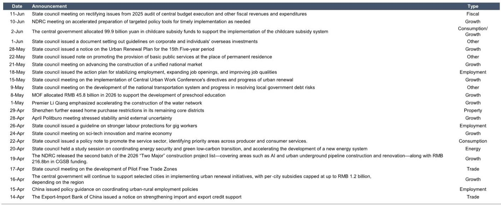
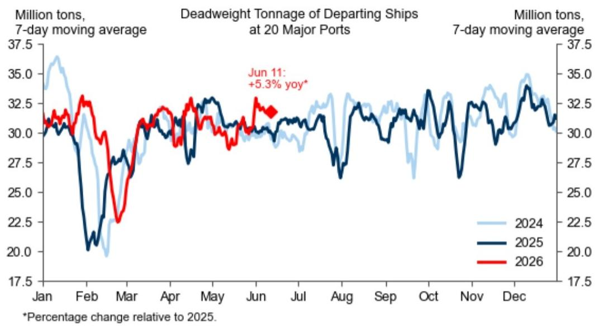
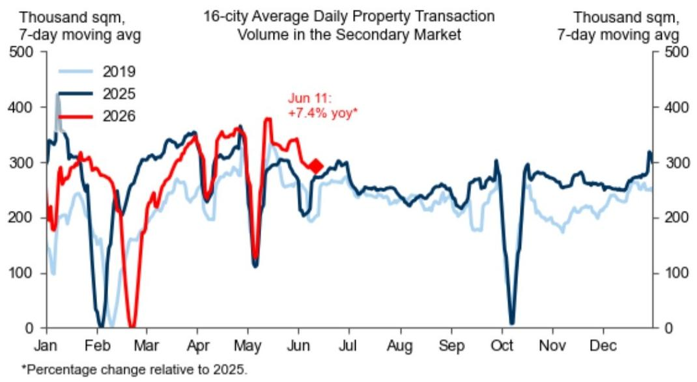

# The Chinese Economy Is Sending Contradictory Signals—And That Is the Real Story

The latest high-frequency data on China's economic activity reveals a paradox that demands careful interpretation, not a simple bullish or bearish verdict. Consumption indicators show pockets of genuine strength—consumer confidence has risen to multi-year highs, and new energy vehicle sales, while below year-ago levels, remain structurally elevated. Yet property transaction volumes in the primary market have fallen below last year's levels, and total auto sales are also trailing. The economy is not collapsing, but it is not rebounding uniformly either.

This is precisely the kind of environment where aggregate narratives mislead. The real analytical challenge is not to determine whether China is "recovering" or "slowing," but to understand which sectors are decoupling from the broader cycle and why. The data now available through weekly tracking provides a granular lens that monthly or quarterly reports cannot match—and the patterns emerging from this high-frequency view are more nuanced than any single headline suggests.

What makes this moment particularly significant is the energy price supply shock that has reshaped input costs across the industrial chain. Import prices for crude oil, refined petroleum products, and integrated circuits have all surged dramatically since early 2026. This is not a transient blip; it is a structural shift in the cost base of Chinese manufacturing and logistics. The implications ripple through everything from steel demand to consumer mobility, and they demand a strategic reassessment of which parts of the economy can absorb these costs and which cannot.

The following analysis unpacks the key signals from the latest weekly tracker, identifies the unresolved questions that the data raises, and offers a decision framework for readers navigating this complex landscape.

## Consumer Confidence Is Rising, But Behavior Is Not Following—And That Gap Is the Real Risk

The Morning Consult consumer confidence index has climbed to a multi-year high, a data point that would normally signal robust consumption ahead. Yet the behavior of Chinese consumers tells a more cautious story. Domestic passenger flights remain below year-ago levels, and flight cancellation rates, while declining recently, are still elevated. Traffic congestion is roughly flat. People are not traveling or spending as though they feel confident.

This divergence between sentiment and action is a classic signal that consumers are either constrained by income expectations or waiting for a clearer catalyst. The property market provides a partial explanation. Primary market transaction volumes in 30 cities have fallen below last year's levels, and while secondary market volumes remain above year-ago levels, the trend is declining. Housing is both a consumption good and an investment vehicle in China, and its weakness suppresses the wealth effect that normally amplifies consumer spending.

The so-what here is straightforward: rising confidence without rising consumption is a fragile equilibrium. If the property market does not stabilize, or if energy costs continue to squeeze household budgets, the confidence indicator could reverse just as quickly as it rose. Investors should watch for a convergence between sentiment and spending before treating the confidence data as a leading indicator of recovery.

## Energy Price Shocks Are Reshaping Industrial Margins Faster Than Demand Is Adjusting

The import price data in the latest tracker is striking. Since early 2026, import prices for crude oil have surged from an index level of around 95 to 155. Refined petroleum products have gone from 95 to 170. Integrated circuits have jumped from 125 to 165. These are not marginal increases; they represent a doubling or near-doubling of input costs for critical industrial inputs.

Meanwhile, export prices for the same categories have also risen, but not uniformly. Refined petroleum product export prices have climbed from around 100 to 165, roughly matching the import price increase. But integrated circuit export prices have surged from 140 to 210, suggesting that Chinese semiconductor producers have significant pricing power in global markets. This asymmetry is the key strategic insight: China's downstream manufacturers are being squeezed on input costs, but its upstream producers in certain high-demand categories are passing through cost increases and then some.

The implication for production and investment is already visible. Steel demand has edged down over the past week, and steel production is flat. Daily coal consumption in coastal provinces has fallen from recent highs. These are textbook responses to margin compression: when input costs rise faster than output prices, industrial activity contracts. The question is whether this is a temporary adjustment or the beginning of a more sustained industrial slowdown.

## The Property Market Is Splitting into Two Distinct Regimes—Primary and Secondary Are No Longer Moving Together

One of the most revealing patterns in the data is the divergence between primary and secondary property markets. Primary market transaction volumes in 30 cities have fallen below year-ago levels, while secondary market volumes, though declining, remain above year-ago levels. This is not a minor detail; it reflects a structural shift in how Chinese households are approaching housing.

The primary market represents new home sales, which are heavily influenced by developer confidence, government policy, and credit availability. The secondary market reflects existing home transactions, which are driven more by household liquidity and relocation decisions. The fact that secondary volumes are holding up better suggests that households are still willing to transact, but they are avoiding new developments. This could be because of lingering concerns about developer solvency, or because prices in the secondary market are more attractive.

The so-what for investors is that any recovery in the property sector will likely be led by secondary markets first, with primary markets lagging. Policy measures aimed at stimulating new home sales may be less effective than measures that improve secondary market liquidity. The data also raises an open question: if secondary market volumes continue to decline toward primary market levels, that would signal a broader housing downturn, not just a developer-specific problem.

## The Data Does Not Yet Answer Whether the Energy Price Shock Will Accelerate or Delay China's Energy Transition

The tracker provides extensive data on energy prices, import costs, and industrial activity, but it does not directly address the strategic question that matters most for long-term investors: will the current energy price shock accelerate China's shift toward renewable energy and electric vehicles, or will it delay that transition by making all forms of energy more expensive?

On one hand, higher fossil fuel prices improve the relative economics of renewables and EVs. New energy vehicle sales, while below year-ago levels, are still running at roughly 31,000 units per day in May 2026, compared to 34,000 in May 2025. That is a modest decline, not a collapse, and it may reflect supply constraints or model changeovers rather than a loss of consumer interest. On the other hand, higher input costs for batteries, semiconductors, and industrial materials could raise the production costs of EVs and renewable energy equipment, potentially slowing adoption.

The tracker gives us the raw material to monitor this tension, but it does not resolve it. Readers should watch for changes in NEV sales relative to total auto sales, and for any divergence in import prices between energy products and technology components. If NEV market share continues to rise despite higher costs, that would be a powerful signal that the energy transition is resilient. If NEV sales decline disproportionately, that would suggest the price shock is delaying the transition.

## A Decision Framework for Interpreting Weekly China Data Without Falling for Noise

The greatest risk in following high-frequency data is mistaking noise for signal. The weekly tracker provides a wealth of information, but not all of it is equally important. The following framework can help readers separate meaningful shifts from temporary fluctuations.

First, focus on divergences rather than levels. The most informative data points are those that break from recent trends or that contradict other indicators. The gap between rising consumer confidence and flat mobility is a divergence worth analyzing. The split between primary and secondary property markets is another. When multiple indicators move in the same direction, they confirm a trend. When they diverge, they reveal structural tensions.

Second, prioritize price data over volume data when assessing corporate margins. Volume data tells you how much activity is happening. Price data tells you whether that activity is profitable. The import and export price data in this tracker is arguably more important than the production and consumption data, because it reveals the cost pressures that will ultimately determine corporate earnings and investment decisions.

Third, always ask whether a change is cyclical or structural. A decline in steel demand over one week could be seasonal or weather-related. A sustained decline over several weeks, combined with rising input costs, suggests a structural margin squeeze. The tracker provides enough history to make this distinction, but only if readers are disciplined about comparing current data to the same period in prior years, not just to the previous week.

## The Full Report Contains the Charts That Make These Patterns Visible

The analysis above is based on the narrative interpretation of the data, but the full report includes the original charts that show the actual trajectories of these indicators over time. Seeing the curves, not just the numbers, is essential for understanding the velocity and magnitude of the changes. A 10-point increase in an index matters more if it happened over two months than over six months. The charts make those temporal patterns immediately visible.

The report also includes data on chemical prices, export trends, and policy indicators that this article has only touched on. For readers who want to test the hypotheses laid out here against the full empirical record, the original report is the necessary next step.

Join the community to read the full report and review the original charts.

*This article is for learning and discussion only and does not constitute investment advice.*

Personal reading notes and learning share only. Not investment advice.

