## KOREA WEEKLY KICKSTART

# KOSPI ended the week down moderately amid continued volatility and the US core CPI below consensus

KOSPI ended the week down moderately amid continued volatility and the US core CPI below consensus. The Construction, Leisure and Machinery sectors outperformed this week, while Software, Auto and Securities sectors underperformed the most (Exhibit 7).  
■ Foreign investors continued to sell the KOSPI market, driven by outflows for KOSPI Tech and Shipbuilding (Exhibit 34).  
KOSPI 12m-forward EPS was revised up by +1.2%. The Chemicals sector saw the strongest upward earnings revisions, while the Leisure sector was revised down the most this week (Exhibit 21).  
The KRW strengthened 2.8% vs. USD this week. It also strengthened by 2.6% vs. JPY and 2.3% vs. EUR.  
The latest Korea Equity Risk Barometer (GSSRKERB Index) is at -2.1, falling further into a risk-adverse territory.

Charts of the Week: KOSDAQ Tactical Opportunity Amid Diverging Flows, Earnings, and Valuations

■ KOSDAQ Tactical Opportunity Amid Diverging Flows, Earnings, and Valuations : Although KOSDAQ has recently outperformed KOSPI amid heightened market volatility, it has significantly underperformed since August 2023. We believe this has been driven primarily by divergences in earnings revisions and valuations. KOSPI earnings upgrades have been materially stronger than KOSDAQ earnings revisions. Despite KOSDAQ's significant underperformance, its valuations remain more elevated than KOSPI's 12-month forward P/E, even as its earnings revisions have been considerably weaker. Against this backdrop, KOSDAQ has attracted stronger foreign inflows year to date, while KOSPI has seen significant foreign outflows. In KOSPI, we believe these outflows have been largely driven by portfolio rebalancing related to diversification requirements, with the two largest semiconductor stocks accounting for much of the selling. Meanwhile, foreign inflows into KOSDAQ have been concentrated in the information technology and health care sectors. While KOSPI has outperformed KOSDAQ by a wide margin since 2023, tactical rotation into KOSDAQ—particularly in semiconductor components and equipment—may offer investors alpha opportunities that are thematically aligned with the broader market narrative.

Timothy Moe, CFA

+65-6889-1199 | timothy.moe@gs.com

GS (Singapore) Pte

John Kwon

+65-6654-6337

jongmin.kwon@gs.com

GS (Singapore) Pte

## Table of Contents

Charts of the week: KOSDAQ Tactical Opportunity Amid Diverging Flows, Earnings, and Valuations 3  
Summary 5  
Investment flows 6  
Macro Indicators 7  
Performance 8  
Valuations 10  
Valuation discount relative to Global and Asia regional peers 12  
Flows 13  
Currency, rates and commodities 15  
Korea ERB, Credit and Market Technicals 16  
Disclosure Appendix 17

## Charts of the week: KOSDAQ Tactical Opportunity Amid Diverging Flows, Earnings, and Valuations

Exhibit 1: KOSDAQ has significantly underperformed since August 2023  
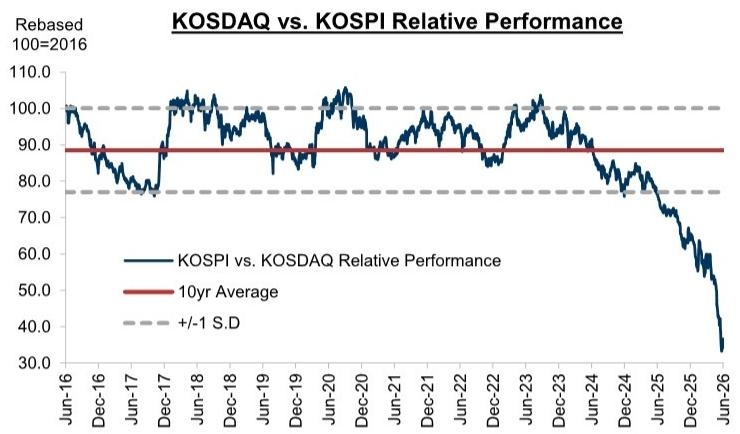

line chart

| Date    | KOSPI vs. KOSDAQ Relative Performance |
|---------|--------------------------------------|
| Jun-16  | 100.0                                |
| Dec-16  | 85.0                                 |
| Jun-17  | 75.0                                 |
| Dec-17  | 100.0                                |
| Jun-18  | 105.0                                |
| Dec-18  | 95.0                                 |
| Jun-19  | 85.0                                 |
| Dec-19  | 90.0                                 |
| Jun-20  | 105.0                                |
| Dec-20  | 95.0                                 |
| Jun-21  | 85.0                                 |
| Dec-21  | 95.0                                 |
| Jun-22  | 85.0                                 |
| Dec-22  | 95.0                                 |
| Jun-23  | 100.0                                |
| Dec-23  | 95.0                                 |
| Jun-24  | 85.0                                 |
| Dec-24  | 75.0                                 |
| Jun-25  | 65.0                                 |
| Dec-25  | 55.0                                 |
| Jun-26  | 35.0                                 |

Source: FactSet, GS Global Investment Research

Exhibit 2: KOSPI earnings upgrades have been materially stronger than KOSDAQ earnings revisions  
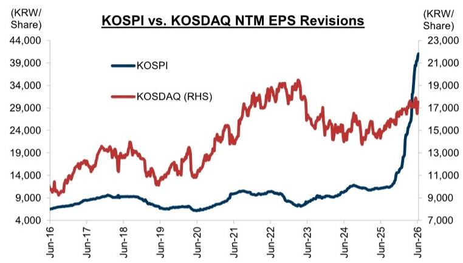

line chart

| Date   | KOSPI (KRW/Share) | KOSDAQ (KRW/Share) |
|--------|-------------------|--------------------|
| Jun-16 | ~8,000            | ~9,500             |
| Jun-17 | ~8,500            | ~10,500            |
| Jun-18 | ~8,500            | ~11,500            |
| Jun-19 | ~8,000            | ~11,000            |
| Jun-20 | ~8,500            | ~13,000            |
| Jun-21 | ~9,000            | ~15,000            |
| Jun-22 | ~9,500            | ~17,000            |
| Jun-23 | ~9,500            | ~16,500            |
| Jun-24 | ~10,000           | ~17,500            |
| Jun-25 | ~11,000           | ~18,500            |
| Jun-26 | ~23,000           | ~21,500            |

Source: Quantiwise, GS Global Investment Research

Exhibit 3: KOSDAQ valuations remain more elevated than KOSPI's 12-month forward P/E  
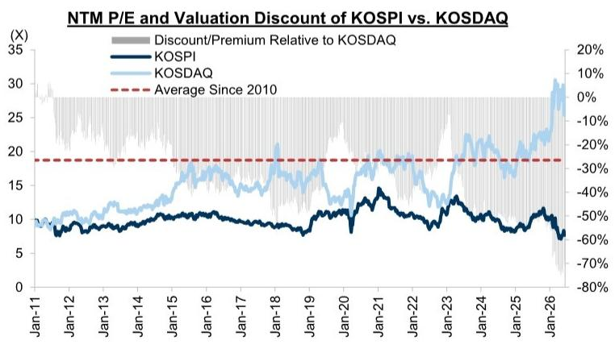

line chart

| Date   | KOSPI | KOSDAQ | Average Since 2010 |
|--------|-------|--------|---------------------|
| Jan-11 | ~9    | ~10    | -30%                |
| Jan-12 | ~8    | ~10    | -30%                |
| Jan-13 | ~9    | ~11    | -30%                |
| Jan-14 | ~10   | ~12    | -30%                |
| Jan-15 | ~10   | ~13    | -30%                |
| Jan-16 | ~10   | ~15    | -30%                |
| Jan-17 | ~10   | ~16    | -30%                |
| Jan-18 | ~10   | ~17    | -30%                |
| Jan-19 | ~10   | ~18    | -30%                |
| Jan-20 | ~10   | ~19    | -30%                |
| Jan-21 | ~10   | ~20    | -30%                |
| Jan-22 | ~10   | ~21    | -30%                |
| Jan-23 | ~10   | ~22    | -30%                |
| Jan-24 | ~10   | ~23    | -30%                |
| Jan-25 | ~10   | ~24    | -30%                |
| Jan-26 | ~8    | ~30    | -30%                |

Source: Quantiwise, GS Global Investment Research

Exhibit 4: However, KOSDAQ has seen stronger foreign inflows year-to-date, while KOSPI has experienced significant foreign outflows  
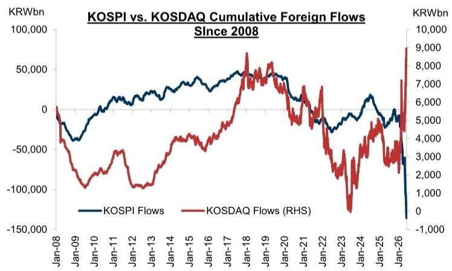

line chart

| Date   | KOSPI Flows (KRWbn) | KOSDAQ Flows (KRWbn) |
|--------|----------------------|-----------------------|
| Jan-08 | ~0                   | ~0                    |
| Jan-09 | ~-50,000             | ~-100,000             |
| Jan-10 | ~-100,000            | ~-150,000             |
| Jan-11 | ~-50,000             | ~-100,000             |
| Jan-12 | ~0                   | ~-50,000              |
| Jan-13 | ~5,000               | ~-10,000              |
| Jan-14 | ~10,000              | ~-5,000               |
| Jan-15 | ~15,000              | ~-10,000              |
| Jan-16 | ~20,000              | ~-5,000               |
| Jan-17 | ~25,000              | ~-10,000              |
| Jan-18 | ~30,000              | ~-5,000               |
| Jan-19 | ~35,000              | ~5,000                |
| Jan-20 | ~40,000              | ~10,000               |
| Jan-21 | ~35,000              | ~5,000                |
| Jan-22 | ~30,000              | ~-1,000               |
| Jan-23 | ~25,000              | ~-5,000               |
| Jan-24 | ~20,000              | ~-1,5,000             |
| Jan-25 | ~15,000              | ~-5,000               |
| Jan-26 | ~10,000              | ~9,5,566              |

Source: Quantiwise, GS Global Investment Research

Exhibit 5: Foreign outflows from KOSPI have been largely driven by the two largest semiconductor stocks  
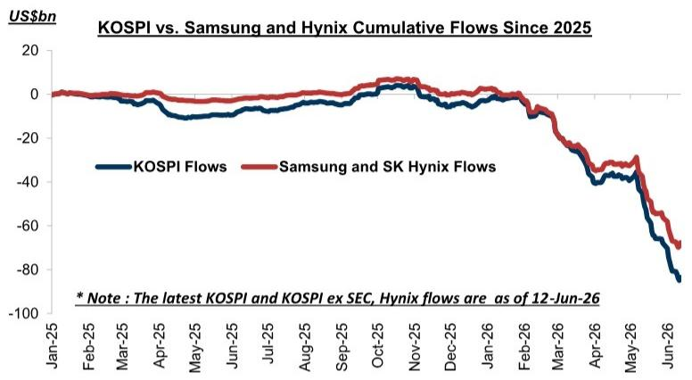

line chart

| Date   | KOSPI Flows | Samsung and SK Hynix Flows |
|--------|-------------|-----------------------------|
| Jan-25 | 0           | 0                           |
| Feb-25 | -5          | -3                          |
| Mar-25 | -10         | -8                          |
| Apr-25 | -15         | -12                         |
| May-25 | -20         | -18                         |
| Jun-25 | -25         | -22                         |
| Jul-25 | -30         | -28                         |
| Aug-25 | -35         | -32                         |
| Sep-25 | -40         | -38                         |
| Oct-25 | -45         | -42                         |
| Nov-25 | -50         | -48                         |
| Dec-25 | -55         | -52                         |
| Jan-26 | -60         | -58                         |
| Feb-26 | -70         | -68                         |
| Mar-26 | -80         | -78                         |
| Apr-26 | -90         | -88                         |
| May-26 | -100        | -98                         |
| Jun-26 | -110        | -108                        |

Source: Quantiwise, GS Global Investment Research

Exhibit 6: Foreign inflows into KOSDAQ have been concentrated in the information technology and health care sectors  
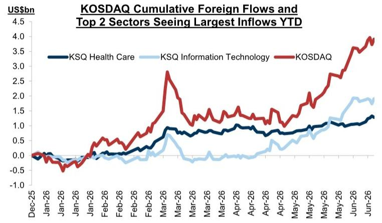

line chart

| Date   | KSQ Health Care | KSQ Information Technology | KOSDAQ |
|--------|-----------------|----------------------------|--------|
| Jun-26 | 1.3             | 1.9                        | 4.0    |

Source: Quantiwise, GS Global Investment Research

## Summary

Exhibit 7: Summary of the past week's performance

<table><tr><td colspan="5">Equity Market Performance</td></tr><tr><td></td><td>P/E 2026E</td><td></td><td></td><td>1-wk chg</td></tr><tr><td>KOSPI</td><td>7.1</td><td>8,123.62</td><td>↓</td><td>(0.5)</td></tr><tr><td>KOSDAQ</td><td>28.8</td><td>1,029.05</td><td>↑</td><td>2.7</td></tr><tr><td>MSCI Korea</td><td>6.1</td><td>3,017.40</td><td>↓</td><td>(0.5)</td></tr><tr><td colspan="5">KOSPI Performance by sector</td></tr><tr><td>Top 3</td><td>wk chg (%)</td><td>Bottom 3</td><td></td><td>1wk chg (%)</td></tr><tr><td>Construction</td><td>10.8</td><td>Software</td><td></td><td>(9.3)</td></tr><tr><td>Leisure</td><td>4.4</td><td>Auto</td><td></td><td>(5.3)</td></tr><tr><td>Machinery</td><td>2.8</td><td>Securities</td><td></td><td>(3.9)</td></tr><tr><td colspan="5">Market Flows</td></tr><tr><td colspan="2">Equities (KRW bn)</td><td>1-wk flow</td><td></td><td>in std dev*</td></tr><tr><td colspan="2">KOSPI Flows: Foreigners</td><td>(4,400)</td><td>↓</td><td>-0.8</td></tr><tr><td></td><td>Institutions</td><td>83</td><td>↑</td><td>0.0</td></tr><tr><td></td><td>Individuals</td><td>3,803</td><td>↑</td><td>0.7</td></tr><tr><td></td><td>Pensions</td><td>(677)</td><td>↓</td><td>-2.5</td></tr><tr><td colspan="2">KOSDAQ Flows: Foreigners</td><td>67</td><td>↑</td><td>0.1</td></tr><tr><td></td><td>Institutions</td><td>1,222</td><td>↑</td><td>0.8</td></tr><tr><td></td><td>Individuals</td><td>(1,154)</td><td>↓</td><td>-0.7</td></tr><tr><td></td><td>Pensions</td><td>103</td><td>↑</td><td>1.0</td></tr><tr><td colspan="5">FX/Interest Rate</td></tr><tr><td></td><td></td><td>Current</td><td></td><td>1-wk chg</td></tr><tr><td colspan="2">USDKRW</td><td>1,515</td><td>↓</td><td>(2.8)</td></tr><tr><td colspan="2">JPYKRW</td><td>9.47</td><td>↓</td><td>(2.6)</td></tr><tr><td colspan="2">USDKRW 1M Risk Reversal/ATM vc</td><td>0.08</td><td>↓</td><td>-7bp</td></tr><tr><td colspan="2">USDKRW 1yr swap basis</td><td>(85)</td><td>↑</td><td>4bp</td></tr><tr><td colspan="2">3-year KTB</td><td>3.81</td><td>↓</td><td>-7bp</td></tr><tr><td colspan="2">10-year KTB</td><td>4.20</td><td>↓</td><td>-6bp</td></tr></table>

Up (↑) = Up wow vs. the previous week  
Asterisk (\*) = Expressed in standard deviation of 1-wk change in 1-year

Source: Bloomberg

## Exhibit 8: Summary of year-to-date flows

Year-to-date Foreign Inflows to Korea  
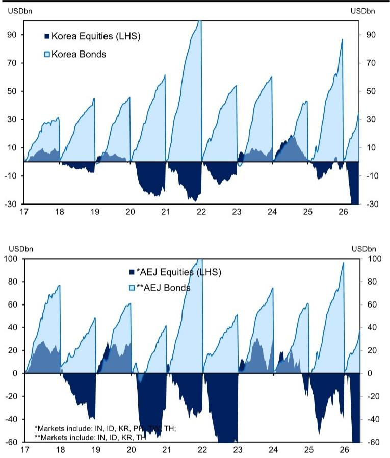

area chart

| Year | Korea Equities (LHS) (USDbn) | Korea Bonds (USDbn) | AEJ Equities (LHS) (USDbn) | AEJ Bonds (USDbn) |
|------|----------------------------------|----------------------|------------------------------|--------------------|
| 17   | ~5                               | ~5                   | ~0                           | ~0                 |
| 18   | ~10                              | ~30                  | ~20                          | ~70                |
| 19   | ~-5                              | ~45                  | ~-40                         | ~50                |
| 20   | ~-10                             | ~45                  | ~-20                         | ~60                |
| 21   | ~-20                             | ~60                  | ~-60                         | ~40                |
| 22   | ~-30                             | ~90                  | ~-60                         | ~100               |
| 23   | ~-10                             | ~50                  | ~-60                         | ~50                |
| 24   | ~10                              | ~60                  | ~-40                         | ~70                |
| 25   | ~-10                             | ~45                  | ~-60                         | ~60                |
| 26   | ~-30                             | ~90                  | ~-60                         | ~100               |

Source: Bloomberg

## Investment flows

Exhibit 9: Equity inflows to 5 AEJ markets  
4-week rolling sum  
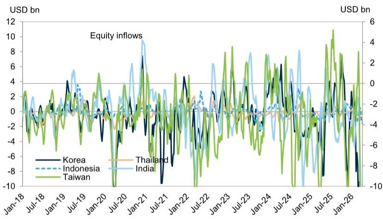

line chart

| Date   | Korea | Indonesia | Taiwan | Thailand | India |
|--------|-------|-----------|--------|----------|-------|
| Jan-18 | -1.5  | -0.5      | 2.0    | -1.0     | 0.5   |
| Jul-18 | -1.0  | -0.5      | 1.5    | -0.5     | 0.0   |
| Jan-19 | -0.5  | 0.0       | 3.0    | 0.0      | 1.0   |
| Jul-19 | 0.0   | 1.0       | 4.0    | 0.5      | 2.0   |
| Jan-20 | -1.0  | -0.5      | 2.5    | -0.5     | 1.5   |
| Jul-20 | -2.0  | -1.0      | 1.0    | -1.5     | 0.5   |
| Jan-21 | -3.0  | -2.0      | 9.0    | -2.5     | 4.0   |
| Jul-21 | -4.0  | -3.0      | 6.0    | -3.5     | 2.5   |
| Jan-22 | -5.0  | -4.0      | 7.0    | -4.5     | 3.5   |
| Jul-22 | -6.0  | -5.0      | 8.0    | -5.5     | 4.5   |
| Jan-23 | -7.0  | -6.0      | 9.0    | -6.5     | 5.5   |
| Jul-23 | -8.0  | -7.0      | 10.0   | -7.5     | 6.5   |
| Jan-24 | -9.0  | -8.0      | 11.0   | -8.5     | 7.5   |
| Jul-24 | -10.0 | -9.0      | 12.0   | -9.5     | 8.5   |
| Jan-25 | -11.0 | -10.0     | 13.0   | -10.5    | 9.5   |
| Jul-25 | -12.0 | -11.0     | 14.0   | -11.5    | 10.5  |
| Jan-26 | -13.0 | -12.0     | 15.0   | -12.5    | 11.5  |

Source: Bloomberg, GS Global Investment Research

Exhibit 10: Equity inflows to 5 AEJ markets  
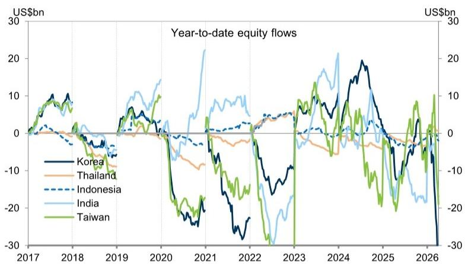

line chart

| Year | Korea | Thailand | Indonesia | India | Taiwan |
|------|-------|----------|------------|-------|--------|
| 2017 | 0     | 0        | 0          | 0     | 0      |
| 2018 | 10    | 5        | -5         | 5     | 5      |
| 2019 | 5     | 0        | -10        | 10    | 10     |
| 2020 | 0     | -5       | -15        | 15    | 15     |
| 2021 | -20   | -10      | -20        | 20    | -20    |
| 2022 | -25   | -15      | -25        | -25   | -25    |
| 2023 | -10   | -5       | -10        | -10   | -10    |
| 2024 | 15    | 0        | 5          | 15    | 15     |
| 2025 | 5     | -5       | -5         | 5     | -5     |
| 2026 | -30   | -10      | -15        | -30   | -30    |

Source: Bloomberg

Exhibit 11: Bond inflows to 4 AEJ markets  
4-week rolling sum  
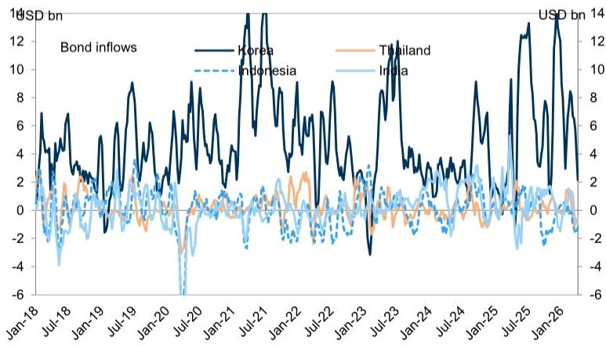

line chart

| Date    | Korea (USD bn) | Thailand (USD bn) | Indonesia (USD bn) | India (USD bn) |
|---------|----------------|-------------------|--------------------|----------------|
| Jan-18  | ~7             | ~2                | ~0                 | ~0             |
| Jul-18  | ~6             | ~2                | ~0                 | ~0             |
| Jan-19  | ~5             | ~2                | ~0                 | ~0             |
| Jul-19  | ~9             | ~2                | ~0                 | ~0             |
| Jan-20  | ~7             | ~2                | ~0                 | ~0             |
| Jul-20  | ~9             | ~2                | ~0                 | ~0             |
| Jan-21  | ~10            | ~2                | ~0                 | ~0             |
| Jul-21  | ~12            | ~2                | ~0                 | ~0             |
| Jan-22  | ~10            | ~3                | ~0                 | ~0             |
| Jul-22  | ~9             | ~3                | ~0                 | ~0             |
| Jan-23  | ~3             | ~2                | ~0                 | ~0             |
| Jul-23  | ~12            | ~2                | ~0                 | ~0             |
| Jan-24  | ~3             | ~2                | ~0                 | ~0             |
| Jul-24  | ~9             | ~2                | ~0                 | ~0             |
| Jan-25  | ~10            | ~2                | ~0                 | ~0             |
| Jul-25  | ~13            | ~2                | ~0                 | ~0             |
| Jan-26  | ~14            | ~2                | ~0                 | ~0             |

Source: Bloomberg, Haver Analytics, GS Global Investment Research

Exhibit 12: Bond inflows to 4 AEJ markets  
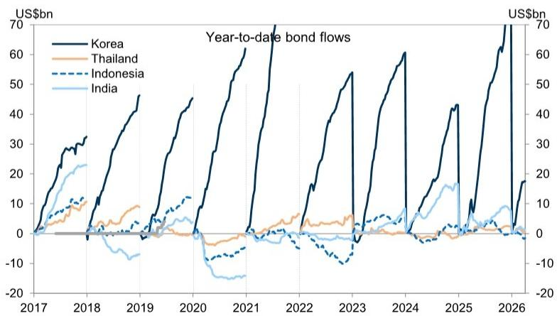

line chart

| Year | Korea | Thailand | Indonesia | India |
|------|-------|----------|------------|-------|
| 2017 | 0     | 0        | 0          | 0     |
| 2018 | 30    | 5        | 10         | 20    |
| 2019 | 45    | 5        | 5          | 5     |
| 2020 | 45    | 5        | 10         | 5     |
| 2021 | 60    | 5        | -5         | -10   |
| 2022 | 55    | 5        | -5         | -5    |
| 2023 | 60    | 5        | -5         | 5     |
| 2024 | 60    | 5        | 5          | 15    |
| 2025 | 45    | 5        | 5          | 15    |
| 2026 | 70    | 5        | 5          | 10    |

Source: Bloomberg, Haver Analytics, GS Global Investment Research

## Macro Indicators

Exhibit 13: Housing prices and rental prices  
National, monthly and weekly price changes  
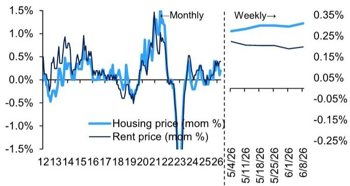

line chart

| Date   | Housing price (mom %) | Rent price (mom %) |
|--------|------------------------|---------------------|
| 5/4/26 | ~0.35%                 | ~0.25%              |
| 5/11/26| ~0.35%                 | ~0.20%              |
| 5/18/26| ~0.35%                 | ~0.15%              |
| 5/25/26| ~0.35%                 | ~0.15%              |
| 6/1/26 | ~0.35%                 | ~0.15%              |
| 6/8/26 | ~0.35%                 | ~0.15%              |

Source: KAB

Exhibit 14: Living expense price changes  
Monthly and weekly changes vs. CPI  
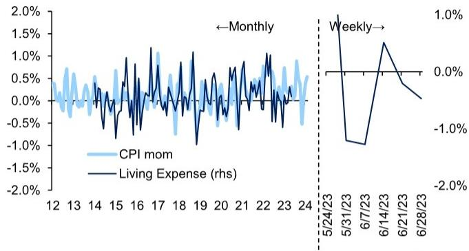

line chart

| Date       | CPI mom | Living Expense (rhs) |
| ---------- | ------- | --------------------- |
| 5/24/23    |         | 1.0%                  |
| 5/31/23    |         | -1.0%                 |
| 6/7/23     |         | -1.0%                 |
| 6/14/23    |         | 0.5%                  |
| 6/21/23    |         | 0.0%                  |
| 6/28/23    |         | -0.5%                 |

Source: Bloomberg, Korea Price Research Center, GS Global Investment Research

Exhibit 15: Daily Financial Condition Index  
Jan 1, 2013=100  
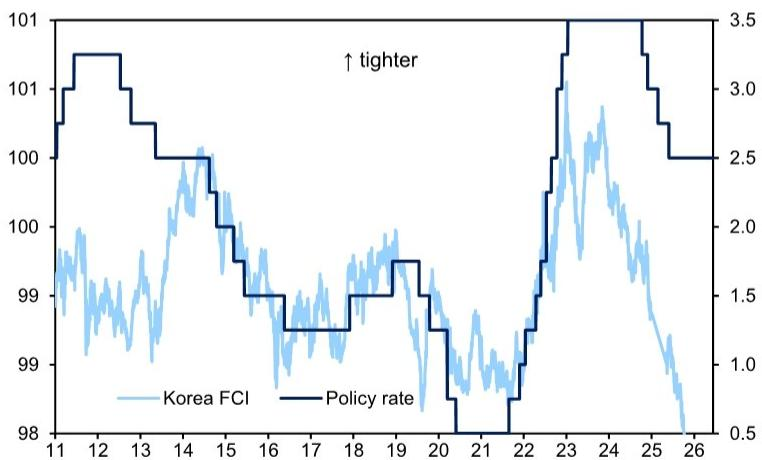

line chart

| Year | Korea FCI | Policy rate |
|------|-----------|-------------|
| 11   | ~99.5     | ~3.0        |
| 12   | ~100      | ~3.0        |
| 13   | ~99.5     | ~2.5        |
| 14   | ~100      | ~2.0        |
| 15   | ~99.5     | ~1.5        |
| 16   | ~99       | ~1.0        |
| 17   | ~99.5     | ~1.5        |
| 18   | ~100      | ~2.0        |
| 19   | ~99.5     | ~2.5        |
| 20   | ~99       | ~0.5        |
| 21   | ~98.5     | ~0.5        |
| 22   | ~99       | ~1.0        |
| 23   | ~100      | ~3.5        |
| 24   | ~99.5     | ~3.5        |
| 25   | ~98.5     | ~2.5        |
| 26   | ~98       | ~2.5        |

Source: Bloomberg, CEIC, GS Global Investment Research

## Exhibit 16: Korea Economic Forecasts

Monthly indicators

<table><tr><td>Monthly (% yoy)</td><td>Oct</td><td>Nov</td><td>Dec</td><td>Jan</td><td>Feb</td><td>Mar</td><td>Apr</td><td>May</td></tr><tr><td>Exports ex ships</td><td>-1.2</td><td>9.5</td><td>14.1</td><td>35.7</td><td>29.0</td><td>52.7</td><td>48.0</td><td>54.9</td></tr><tr><td>Industrial production</td><td>-7.6</td><td>0.0</td><td>1.6</td><td>6.8</td><td>-2.3</td><td>3.9</td><td>1.5</td><td></td></tr><tr><td>Employment</td><td>0.7</td><td>0.8</td><td>0.6</td><td>0.4</td><td>0.8</td><td>0.7</td><td>0.3</td><td>-0.1</td></tr><tr><td>CPI</td><td>2.4</td><td>2.4</td><td>2.3</td><td>2.0</td><td>2.0</td><td>2.2</td><td>2.6</td><td>3.1</td></tr><tr><td>BOK Policy Rate</td><td>2.50</td><td>2.50</td><td>2.50</td><td>2.50</td><td>2.50</td><td>2.50</td><td>2.50</td><td>2.50</td></tr><tr><td colspan="9">Note: Blue-shaded cells denote positive weekly changes and acceleration in monthly changes</td></tr></table>

Macro and market outlook

<table><tr><td>Forecasts</td><td>2025</td><td>2026</td><td>2027</td><td>1Q26</td><td>2Q26</td><td>3Q26</td><td>4Q26</td><td>1Q27</td></tr><tr><td>Real GDP</td><td>1.1</td><td>2.6</td><td>1.9</td><td>3.8</td><td>3.0</td><td>1.8</td><td>2.1</td><td>0.9</td></tr><tr><td>Domestic Demand</td><td>0.6</td><td>2.8</td><td>3.0</td><td>2.2</td><td>2.8</td><td>2.9</td><td>3.1</td><td>2.3</td></tr><tr><td>Exports</td><td>4.3</td><td>7.2</td><td>1.7</td><td>11.8</td><td>6.9</td><td>4.7</td><td>5.9</td><td>0.7</td></tr><tr><td>Imports</td><td>3.3</td><td>8.0</td><td>4.9</td><td>8.5</td><td>7.5</td><td>7.2</td><td>8.8</td><td>6.3</td></tr><tr><td>Consumer Prices</td><td>2.1</td><td>2.6</td><td>2.2</td><td>2.1</td><td>2.9</td><td>3.0</td><td>2.6</td><td>2.5</td></tr><tr><td>Current Account - % GDP</td><td>6.6</td><td>15.1</td><td>17.9</td><td>16.3</td><td>15.3</td><td>15.6</td><td>13.1</td><td>11.1</td></tr><tr><td>KOSPI (end / 12mf)</td><td>4214</td><td>12000*</td><td></td><td></td><td></td><td></td><td></td><td></td></tr><tr><td>Policy rate (end)</td><td>2.50</td><td>3.00</td><td>3.00</td><td>2.50</td><td>2.50</td><td>2.75</td><td>3.00</td><td>3.00</td></tr><tr><td>USDKRW (end)</td><td>1,444</td><td>1,472</td><td>1,409</td><td>1,346</td><td>1,500</td><td>1,478</td><td>1,445</td><td>1,432</td></tr></table>

\* KOSPI for 2025 is the year-end level and KOSPI for 2026 is 12-month target  
Source: Bloomberg, GS Global Investment Research

## Performance

Exhibit 17: Performance of Korean and regional equity markets

<table><tr><td rowspan="2"></td><td rowspan="2" colspan="2">Index</td><td colspan="4">Price return (%)</td><td rowspan="2" colspan="3">% vs average</td></tr><tr><td colspan="2">Local Crncy</td><td colspan="2">USD</td></tr><tr><td>Korea</td><td>Crn</td><td>12-Jun</td><td>1-wk</td><td>YTD</td><td>1-wk</td><td>YTD</td><td>RSI</td><td>30D</td><td>60D</td></tr><tr><td>Kospi</td><td>KRW</td><td>8,124</td><td>(0.5)</td><td>92.8</td><td>2.4</td><td>83.0</td><td>51</td><td>5</td><td>20</td></tr><tr><td>Kospi 200</td><td>KRW</td><td>1,291</td><td>(0.4)</td><td>113.1</td><td>2.4</td><td>102.3</td><td>52</td><td>7</td><td>25</td></tr><tr><td>Kosdaq</td><td>KRW</td><td>1,029</td><td>2.7</td><td>11.2</td><td>5.6</td><td>5.6</td><td>41</td><td>(7)</td><td>(8)</td></tr><tr><td>MSCI Korea</td><td>KRW</td><td>3,017</td><td>(0.5)</td><td>118.7</td><td>(3.6)</td><td>95.6</td><td>51</td><td>54</td><td>57</td></tr><tr><td colspan="10">Selected sector indexes</td></tr><tr><td>Auto</td><td>KRW</td><td>3,731</td><td>(5.3)</td><td>47.5</td><td>(2.7)</td><td>40.1</td><td>44</td><td>(0)</td><td>8</td></tr><tr><td>Tech</td><td>KRW</td><td>135,559</td><td>0.0</td><td>172.3</td><td>2.9</td><td>158.5</td><td>59</td><td>76</td><td>73</td></tr><tr><td>Retail</td><td>KRW</td><td>739</td><td>(1.1)</td><td>54.3</td><td>1.7</td><td>46.4</td><td>52</td><td>4</td><td>15</td></tr><tr><td>Pharmaceutical</td><td>KRW</td><td>14,487</td><td>(2.4)</td><td>(16.2)</td><td>0.3</td><td>(20.4)</td><td>35</td><td>(6)</td><td>(11)</td></tr><tr><td>Steel</td><td>KRW</td><td>7,379</td><td>(1.8)</td><td>12.9</td><td>1.0</td><td>7.1</td><td>30</td><td>(14)</td><td>(13)</td></tr><tr><td>Chemicals</td><td>KRW</td><td>4,778</td><td>(0.2)</td><td>16.9</td><td>2.7</td><td>11.0</td><td>41</td><td>(7)</td><td>(5)</td></tr><tr><td>F&amp;B</td><td>KRW</td><td>4,859</td><td>2.6</td><td>7.5</td><td>5.5</td><td>2.0</td><td>47</td><td>(2)</td><td>(1)</td></tr><tr><td>Machinery</td><td>KRW</td><td>3,850</td><td>2.8</td><td>41.5</td><td>5.7</td><td>34.4</td><td>36</td><td>(9)</td><td>(5)</td></tr><tr><td>Construction</td><td>KRW</td><td>190</td><td>10.8</td><td>93.3</td><td>14.0</td><td>83.5</td><td>35</td><td>(5)</td><td>(6)</td></tr><tr><td>Shipbuilding</td><td>KRW</td><td>1,823</td><td>(0.6)</td><td>25.8</td><td>2.2</td><td>19.4</td><td>36</td><td>(11)</td><td>(6)</td></tr><tr><td>Utilities</td><td>KRW</td><td>1,158</td><td>0.3</td><td>(17.0)</td><td>3.1</td><td>(21.2)</td><td>34</td><td>(5)</td><td>(10)</td></tr><tr><td>Banking</td><td>KRW</td><td>1,584</td><td>(2.9)</td><td>21.5</td><td>(0.2)</td><td>15.3</td><td>47</td><td>2</td><td>1</td></tr><tr><td>Securities</td><td>KRW</td><td>6,906</td><td>(3.9)</td><td>64.8</td><td>(1.2)</td><td>56.4</td><td>36</td><td>(12)</td><td>(13)</td></tr><tr><td>Insurance</td><td>KRW</td><td>53,785</td><td>(3.3)</td><td>76.4</td><td>(0.6)</td><td>67.4</td><td>56</td><td>12</td><td>25</td></tr><tr><td>Telecom</td><td>KRW</td><td>670</td><td>(0.5)</td><td>37.1</td><td>2.3</td><td>30.1</td><td>51</td><td>(0)</td><td>2</td></tr><tr><td>Software</td><td>KRW</td><td>240</td><td>(9.3)</td><td>14.3</td><td>(6.8)</td><td>8.5</td><td>46</td><td>(25)</td><td>(26)</td></tr><tr><td>Leisure</td><td>KRW</td><td>332</td><td>4.4</td><td>(34.0)</td><td>7.4</td><td>(37.3)</td><td>41</td><td>(54)</td><td>(56)</td></tr><tr><td colspan="10">MSCI standard market and regional indexes</td></tr><tr><td>AC Asia Pacific ex Japan</td><td>USD</td><td>856</td><td>(3.3)</td><td>18.5</td><td>(3.3)</td><td>18.5</td><td>46</td><td>(2)</td><td>3</td></tr><tr><td>USA</td><td>USD</td><td>7,046</td><td>0.1</td><td>7.9</td><td>0.1</td><td>7.9</td><td>50</td><td>(0)</td><td>4</td></tr><tr><td>EU</td><td>EUR</td><td>208</td><td>(0.1)</td><td>5.1</td><td>0.4</td><td>3.6</td><td>53</td><td>1</td><td>2</td></tr><tr><td>China</td><td>HKD</td><td>74</td><td>(2.8)</td><td>(10.8)</td><td>(3)</td><td>(11.4)</td><td>35</td><td>(5)</td><td>(6)</td></tr><tr><td>Japan</td><td>JPY</td><td>2,371</td><td>(3.2)</td><td>13.4</td><td>(3.0)</td><td>11.1</td><td>47</td><td>(1)</td><td>2</td></tr><tr><td colspan="10">Regional indexes</td></tr><tr><td colspan="10">America</td></tr><tr><td>S&amp;P 500 (US)</td><td>USD</td><td>7,394</td><td>0.1</td><td>8.0</td><td>0.1</td><td>8.0</td><td>50</td><td>(0)</td><td>4</td></tr><tr><td>NASDAQ (US)</td><td>USD</td><td>25,810</td><td>0.4</td><td>11.0</td><td>0.4</td><td>11.0</td><td>48</td><td>(1)</td><td>5</td></tr><tr><td>BOVESPA (Brazil)</td><td>BRL</td><td>171,497</td><td>1.5</td><td>6.4</td><td>2.9</td><td>14.4</td><td>40</td><td>(3)</td><td>(6)</td></tr><tr><td colspan="10">Asia</td></tr><tr><td>Hang Seng (Hong Kong)</td><td>HKD</td><td>24,718</td><td>(1.0)</td><td>(3.6)</td><td>(1.0)</td><td>(4.2)</td><td>33</td><td>(3)</td><td>(3)</td></tr><tr><td>Hang Seng Ent. (China)</td><td>HKD</td><td>8,374</td><td>(0.7)</td><td>(6.0)</td><td>(0.8)</td><td>(6.7)</td><td>35</td><td>(3)</td><td>(3)</td></tr><tr><td>Topix (Japan)</td><td>JPY</td><td>3,882</td><td>(1.7)</td><td>13.9</td><td>(1.6)</td><td>11.5</td><td>54</td><td>0</td><td>3</td></tr><tr><td>TW Weighted (Taiwan)</td><td>TWD</td><td>44,169</td><td>(2.0)</td><td>52.5</td><td>(2.4)</td><td>51.5</td><td>52</td><td>3</td><td>13</td></tr><tr><td>Straits Times(Singapore)</td><td>SGD</td><td>5,019</td><td>(0.6)</td><td>8.0</td><td>(0.0)</td><td>8.2</td><td>48</td><td>0</td><td>1</td></tr><tr><td>S&amp;P CNX Nifty (India)</td><td>INR</td><td>23,544</td><td>0.8</td><td>(9.9)</td><td>0.7</td><td>(14.7)</td><td>38</td><td>(1)</td><td>(0)</td></tr><tr><td colspan="10">Europe</td></tr><tr><td>DJ EURO STOXX 50 (EU)</td><td>EUR</td><td>6,179</td><td>1.9</td><td>6.7</td><td>2.5</td><td>5.2</td><td>55</td><td>3</td><td>5</td></tr><tr><td>FTSE 100 (UK)</td><td>GBP</td><td>10,438</td><td>0.7</td><td>5.1</td><td>1.3</td><td>4.7</td><td>46</td><td>1</td><td>1</td></tr></table>

Source: Bloomberg, MSCI

Exhibit 18: KOSPI and MSCI regional index  
KOSPI Index price performance (KRW)  
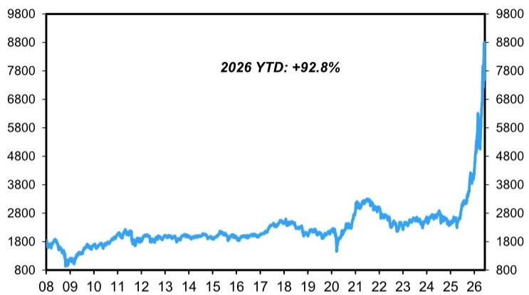

line chart

| Year | Value |
| ---- | ----- |
| 2026 | 92.8% |

Regional MSCI Index performance  
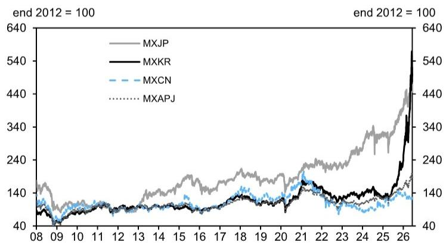

line chart

| Year | MXJP | MXKR | MXCN | MXAPJ |
|------|------|------|------|-------|
| 08   | 140  | 100  | 100  | 100   |
| 09   | 100  | 80   | 80   | 80    |
| 10   | 100  | 80   | 80   | 80    |
| 11   | 100  | 80   | 80   | 80    |
| 12   | 100  | 80   | 80   | 80    |
| 13   | 100  | 80   | 80   | 80    |
| 14   | 100  | 80   | 80   | 80    |
| 15   | 100  | 80   | 80   | 80    |
| 16   | 100  | 80   | 80   | 80    |
| 17   | 100  | 80   | 80   | 80    |
| 18   | 100  | 80   | 80   | 80    |
| 19   | 100  | 80   | 80   | 80    |
| 20   | 100  | 80   | 80   | 80    |
| 21   | 140  | 120  | 120  | 120   |
| 22   | 140  | 120  | 120  | 120   |
| 23   | 140  | 120  | 120  | 120   |
| 24   | 140  | 120  | 120  | 120   |
| 25   | 140  | 120  | 120  | 120   |
| 26   | 640  | 640  | 640  | 640   |

Source: Bloomberg, MSCI

Exhibit 19: Weekly sector performance relative to KOSPI  
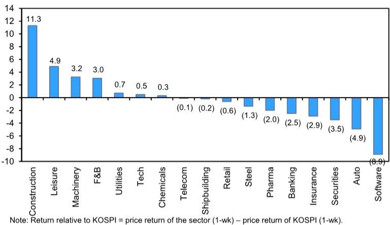

bar chart

| Sector | Value |
|---|---|
| Construction | 11.3 |
| Leisure | 4.9 |
| Machinery | 3.2 |
| F&B | 3.0 |
| Utilities | 0.7 |
| Tech | 0.5 |
| Chemicals | 0.3 |
| Telecom | (0.1) |
| Shipbuilding | (0.2) |
| Retail | (0.6) |
| Steel | (1.3) |
| Pharma | (2.0) |
| Banking | (2.5) |
| Insurance | (2.9) |
| Securities | (3.5) |
| Auto | (4.9) |
| Software | (8.9) |
Note: Return relative to KOSPI = price return of the sector (1-wk) – price return of KOSPI (1-wk).

Source: Bloomberg, Quantiwise

Exhibit 20: Historical trend of monthly KOSPI earnings momentum  
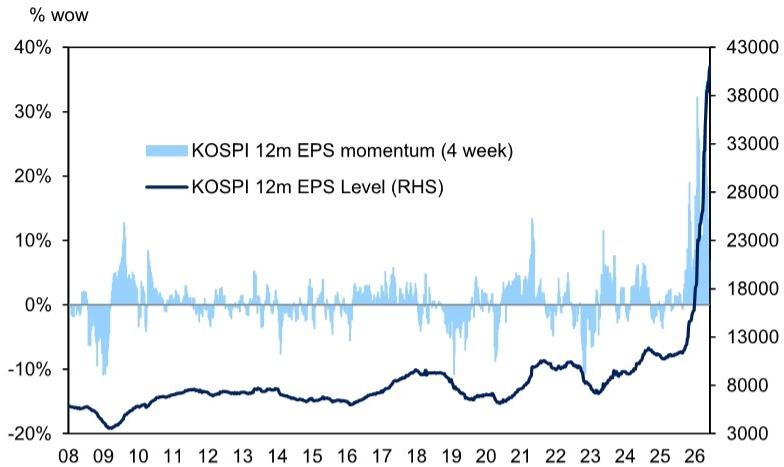

line chart

| Year | KOSPI 12m EPS momentum (4 week) | KOSPI 12m EPS Level (RHS) |
|------|----------------------------------|----------------------------|
| 08   | ~0%                              | ~3000                      |
| 09   | ~-10%                            | ~3000                      |
| 10   | ~10%                             | ~3000                      |
| 11   | ~0%                              | ~3000                      |
| 12   | ~0%                              | ~3000                      |
| 13   | ~0%                              | ~3000                      |
| 14   | ~0%                              | ~3000                      |
| 15   | ~0%                              | ~3000                      |
| 16   | ~0%                              | ~3000                      |
| 17   | ~0%                              | ~3000                      |
| 18   | ~0%                              | ~3000                      |
| 19   | ~0%                              | ~3000                      |
| 20   | ~0%                              | ~3000                      |
| 21   | ~15%                             | ~3000                      |
| 22   | ~15%                             | ~3000                      |
| 23   | ~15%                             | ~3000                      |
| 24   | ~15%                             | ~3000                      |
| 25   | ~15%                             | ~3000                      |
| 26   | ~35%                             | ~43,000                    |

Source: Quantiwise

Exhibit 21: Weekly earnings momentum for KOSPI and selected sectors  
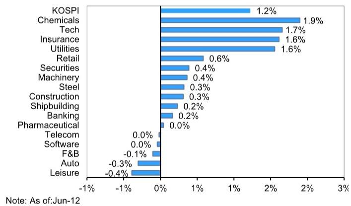

bar chart

| Sector | Value (%) |
| :--- | :--- |
| KOSPI | 1.2 |
| Chemicals | 1.9 |
| Tech | 1.7 |
| Insurance | 1.6 |
| Utilities | 1.6 |
| Retail | 0.6 |
| Securities | 0.4 |
| Machinery | 0.4 |
| Steel | 0.3 |
| Construction | 0.3 |
| Shipbuilding | 0.2 |
| Banking | 0.2 |
| Pharmaceutical | 0.0 |
| Telecom | 0.0 |
| Software | 0.0 |
| F&B | -0.1 |
| Auto | -0.3 |
| Leisure | -0.4 |
Note: As of: Jun-12

Source: Quantiwise

Exhibit 22: KOSPI earnings revisions by sector

<table><tr><td colspan="2">As of: Jun-12</td><td colspan="2">2026E EPS Revision</td><td colspan="2">2027E EPS Revision</td></tr><tr><td>Sector</td><td>Index wgt</td><td>6M</td><td>3M</td><td>6M</td><td>3M</td></tr><tr><td>Tech</td><td>21%</td><td>269%</td><td>71%</td><td>348%</td><td>97%</td></tr><tr><td>Software</td><td>6%</td><td>-1%</td><td>-11%</td><td>-1%</td><td>-6%</td></tr><tr><td>Chemicals</td><td>12%</td><td>57%</td><td>87%</td><td>16%</td><td>16%</td></tr><tr><td>Auto</td><td>8%</td><td>-6%</td><td>-1%</td><td>-4%</td><td>-3%</td></tr><tr><td>Steel</td><td>4%</td><td>3%</td><td>4%</td><td>2%</td><td>5%</td></tr><tr><td>Machinery</td><td>2%</td><td>7%</td><td>8%</td><td>14%</td><td>11%</td></tr><tr><td>Shipbuilding</td><td>1%</td><td>-1%</td><td>-1%</td><td>1%</td><td>-2%</td></tr><tr><td>Retail</td><td>7%</td><td>8%</td><td>5%</td><td>5%</td><td>0%</td></tr><tr><td>F&amp;B</td><td>3%</td><td>0%</td><td>5%</td><td>0%</td><td>3%</td></tr><tr><td>Pharmaceutical</td><td>2%</td><td>8%</td><td>-13%</td><td>6%</td><td>-16%</td></tr><tr><td>Leisure</td><td>1%</td><td>-16%</td><td>-28%</td><td>-6%</td><td>-23%</td></tr><tr><td>Utilities</td><td>4%</td><td>-42%</td><td>-42%</td><td>-32%</td><td>-29%</td></tr><tr><td>Telecom</td><td>2%</td><td>0%</td><td>-2%</td><td>1%</td><td>0%</td></tr><tr><td>Construction</td><td>2%</td><td>6%</td><td>19%</td><td>8%</td><td>14%</td></tr><tr><td>Insurance</td><td>5%</td><td>20%</td><td>7%</td><td>18%</td><td>6%</td></tr><tr><td>Banking</td><td>5%</td><td>4%</td><td>2%</td><td>5%</td><td>2%</td></tr><tr><td>Securities</td><td>2%</td><td>75%</td><td>28%</td><td>42%</td><td>18%</td></tr><tr><td>KOSPI</td><td></td><td>135%</td><td>49%</td><td>166%</td><td>64%</td></tr></table>

Source: Quantiwise

## Valuations

Exhibit 23: Valuation summary for regional equity markets

<table><tr><td rowspan="3"></td><td colspan="15">Consensus estimates</td><td></td></tr><tr><td rowspan="2">Local Currency</td><td rowspan="2">Bloomberg Ticker</td><td colspan="2">P/E (X)</td><td colspan="2">EPS Growth (%)</td><td colspan="2">P/B (X)</td><td colspan="2">D/Y (%)</td><td colspan="2">ROE (%)</td><td colspan="2">EBIT Margin (%)</td><td>P/CF (%)</td><td></td></tr><tr><td>2026E</td><td>2027E</td><td>2026E</td><td>2027E</td><td>2026E</td><td>2027E</td><td>2026E</td><td>2027E</td><td>2026E</td><td>2027E</td><td>2026E</td><td>2027E</td><td>2026E</td><td></td></tr><tr><td colspan="16">MSCI markets</td><td></td></tr><tr><td>Australia</td><td>AUD</td><td>MXAU</td><td>17.8</td><td>16.8</td><td>8.5</td><td>6.0</td><td>2.5</td><td>2.4</td><td>3.7</td><td>3.8</td><td>13.4</td><td>14.2</td><td>14.5</td><td>27.6</td><td>27.7</td><td>10.7</td></tr><tr><td>Singapore Free</td><td>SGD</td><td>SIMSCI</td><td>16.5</td><td>15.0</td><td>6.9</td><td>9.9</td><td>1.9</td><td>1.9</td><td>4.0</td><td>4.2</td><td>11.8</td><td>12.1</td><td>12.7</td><td>23.0</td><td>23.1</td><td>8.7</td></tr><tr><td>Hong Kong</td><td>HKD</td><td>MXHK</td><td>14.2</td><td>13.4</td><td>16.0</td><td>5.4</td><td>1.1</td><td>1.1</td><td>4.0</td><td>4.2</td><td>7.4</td><td>8.3</td><td>8.4</td><td>14.6</td><td>14.6</td><td>10.3</td></tr><tr><td>India</td><td>INR</td><td>MXIN</td><td>21.0</td><td>18.1</td><td>12.9</td><td>16.3</td><td>3.0</td><td>2.7</td><td>1.4</td><td>1.6</td><td>15.4</td><td>15.2</td><td>15.7</td><td>17.2</td><td>18.2</td><td>15.4</td></tr><tr><td>Indonesia</td><td>IDR</td><td>MXID</td><td>8.8</td><td>8.0</td><td>3.4</td><td>9.4</td><td>1.4</td><td>1.4</td><td>8.1</td><td>8.4</td><td>16.9</td><td>16.7</td><td>17.4</td><td>32.1</td><td>32.0</td><td>4.8</td></tr><tr><td>Japan</td><td>JPY</td><td>MXJP</td><td>17.2</td><td>15.3</td><td>13.8</td><td>12.6</td><td>1.9</td><td>1.7</td><td>2.0</td><td>2.2</td><td>10.5</td><td>11.1</td><td>11.7</td><td>19.9</td><td>34.6</td><td>11.7</td></tr><tr><td>Korea</td><td>KRW</td><td>MXKR</td><td>8.1</td><td>6.1</td><td>264.3</td><td>32.0</td><td>2.4</td><td>1.8</td><td>0.7</td><td>0.8</td><td>11.1</td><td>34.4</td><td>33.5</td><td>35.3</td><td>40.0</td><td>6.6</td></tr><tr><td>Malaysia</td><td>MYR</td><td>MXMY</td><td>14.2</td><td>13.4</td><td>9.6</td><td>5.8</td><td>1.5</td><td>1.4</td><td>4.4</td><td>4.6</td><td>10.1</td><td>10.8</td><td>10.9</td><td>26.5</td><td>26.5</td><td>9.1</td></tr><tr><td>Pakistan</td><td>PKR</td><td>MXPK</td><td>6.9</td><td>6.2</td><td>7.1</td><td>11.1</td><td>1.4</td><td>1.2</td><td>6.7</td><td>7.6</td><td>20.1</td><td>20.2</td><td>20.3</td><td>13.7</td><td>23.5</td><td>23.3</td></tr><tr><td>Philippines</td><td>PHP</td><td>MXPH</td><td>10.3</td><td>9.4</td><td>1.2</td><td>9.9</td><td>1.4</td><td>1.3</td><td>3.5</td><td>3.5</td><td>15.7</td><td>14.3</td><td>14.3</td><td>31.4</td><td>31.6</td><td></td></tr><tr><td>Taiwan</td><td>TWD</td><td>MXTW</td><td>23.6</td><td>18.8</td><td>42.2</td><td>25.8</td><td>5.2</td><td>4.4</td><td>1.7</td><td>2.0</td><td>18.9</td><td>23.8</td><td>25.3</td><td>15.6</td><td>16.3</td><td>8.6</td></tr><tr><td>Thailand</td><td>THB</td><td>MXTH</td><td>18.8</td><td>17.9</td><td>10.1</td><td>5.1</td><td>2.2</td><td>2.1</td><td>3.3</td><td>3.5</td><td>11.0</td><td>11.7</td><td>11.8</td><td>12.1</td><td>12.3</td><td>12.7</td></tr><tr><td>AC Asia Pacific</td><td>USD</td><td>MXAP</td><td>14.4</td><td>12.0</td><td>42.4</td><td>20.0</td><td>2.1</td><td>1.9</td><td>2.1</td><td>2.3</td><td>11.8</td><td>15.6</td><td>16.5</td><td>21.8</td><td>27.8</td><td></td></tr><tr><td>AC Asia Pacific ex Japan</td><td>USD</td><td>MXAPJ</td><td>13.5</td><td>11.1</td><td>58.9</td><td>21.9</td><td>2.3</td><td>2.0</td><td>2.1</td><td>2.3</td><td>12.5</td><td>17.9</td><td>18.9</td><td>22.8</td><td>24.8</td><td>19.3</td></tr><tr><td>AC Asia ex Japan</td><td>USD</td><td>MXASJ</td><td>13.1</td><td>10.6</td><td>64.5</td><td>23.6</td><td>2.2</td><td>1.9</td><td>1.9</td><td>2.1</td><td>12.5</td><td>18.4</td><td>19.4</td><td>22.4</td><td>24.6</td><td>9.5</td></tr><tr><td>AC Far East ex Japan</td><td>USD</td><td>MXFEJ</td><td>12.4</td><td>10.0</td><td>73.0</td><td>24.5</td><td>2.2</td><td>1.8</td><td>1.9</td><td>2.2</td><td>12.1</td><td>18.8</td><td>19.8</td><td>22.9</td><td>25.2</td><td>0.0</td></tr><tr><td colspan="16">Note: As of Jun-11-2026</td><td></td></tr></table>

Source: Bloomberg, I/B/E/S, FactSet, GS Global Investment Research

Exhibit 24: 12-month forward P/E and P/B for KOSPI, since Jan 2008  
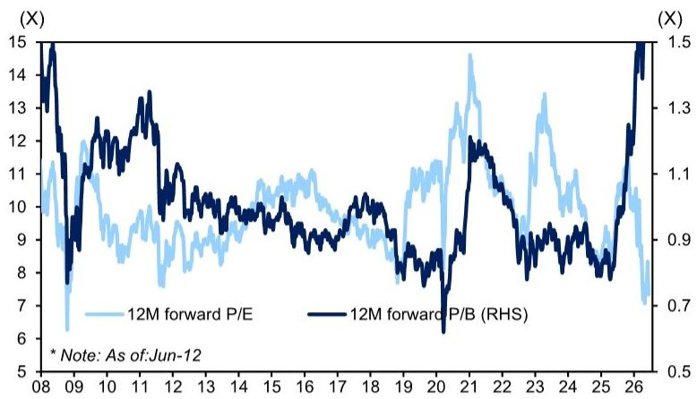

line chart

| Date | 12M forward P/E | 12M forward P/B (RHS) |
|------|-----------------|------------------------|
| 08   | ~10.5           | ~1.5                   |
| 09   | ~9.0            | ~1.3                   |
| 10   | ~10.0           | ~1.2                   |
| 11   | ~9.5            | ~1.1                   |
| 12   | ~9.0            | ~1.0                   |
| 13   | ~9.5            | ~0.9                   |
| 14   | ~10.0           | ~0.9                   |
| 15   | ~10.5           | ~0.9                   |
| 16   | ~10.0           | ~0.9                   |
| 17   | ~9.5            | ~0.9                   |
| 18   | ~9.0            | ~0.9                   |
| 19   | ~8.5            | ~0.8                   |
| 20   | ~8.0            | ~0.7                   |
| 21   | ~14.5           | ~1.2                   |
| 22   | ~13.0           | ~1.0                   |
| 23   | ~12.0           | ~0.9                   |
| 24   | ~11.0           | ~0.8                   |
| 25   | ~10.0           | ~0.7                   |
| 26   | ~7.0            | ~1.5                   |

Source: Quantiwise

Exhibit 25: 12-month forward P/E for MSCI Korea, since Jan 2008  
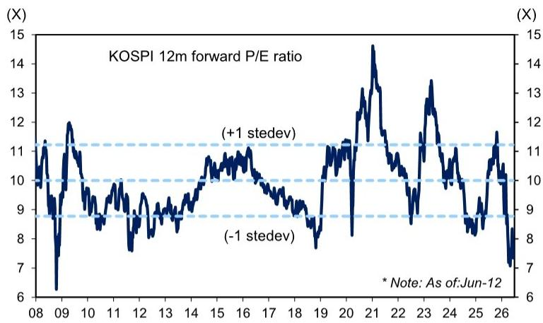

line chart

| Year | KOSPI 12m forward P/E ratio |
|------|-----------------------------|
| 08   | 11                          |
| 09   | 12                          |
| 10   | 10                          |
| 11   | 9                           |
| 12   | 8                           |
| 13   | 9                           |
| 14   | 10                          |
| 15   | 11                          |
| 16   | 10                          |
| 17   | 9                           |
| 18   | 8                           |
| 19   | 9                           |
| 20   | 11                          |
| 21   | 14                          |
| 22   | 10                          |
| 23   | 13                          |
| 24   | 11                          |
| 25   | 9                           |
| 26   | 7                           |

Source: Quantiwise

Exhibit 26: Current 12m forward P/E of KOSPI and selected sectors since Jan 2006  
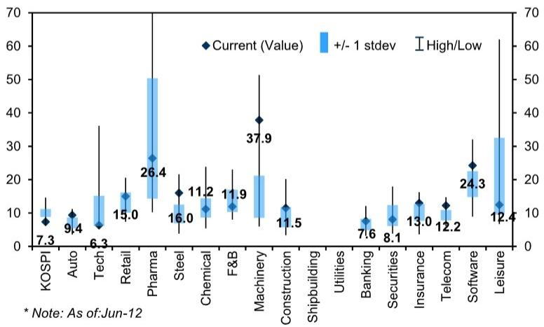

bar-line hybrid

| Sector | Current (Value) | +/- 1 stdev | I High/Low |
| :--- | :--- | :--- | :--- |
| KOSPI | 7.3 | 10.5 | 12.0 |
| Auto | 9.4 | 8.0 | 10.0 |
| Tech | 6.3 | 15.0 | 35.0 |
| Retail | 15.0 | 16.0 | 16.0 |
| Pharma | 26.4 | 50.0 | 50.0 |
| Steel | 16.0 | 12.0 | 16.0 |
| Chemical | 11.2 | 10.0 | 22.0 |
| F&B | 11.9 | 10.0 | 22.0 |
| Machinery | 37.9 | 21.0 | 48.0 |
| Construction | 11.5 | 6.0 | 16.0 |
| Shipbuilding | - | - | - |
| Utilities | - | - | - |
| Banking | 7.6 | 8.0 | 8.0 |
| Securities | 8.1 | 12.0 | 16.0 |
| Insurance | 13.0 | 14.0 | 16.0 |
| Telecom | 12.2 | 12.0 | 16.0 |
| Software | 24.3 | 17.0 | 28.0 |
| Leisure | 12.4 | 32.0 | 62.0 |
* Note: As of: Jun-12

Source: Quantiwise, GS Global Investment Research

Exhibit 27: 12-m forward P/E for KOSPI and selected sectors since Jan 2006

<table><tr><td>KOSPI sector</td><td>Current</td><td>Low</td><td>-1std.dev</td><td>Mean</td><td>+1std.dev</td><td>High</td></tr><tr><td>KOSPI Index</td><td>7.3</td><td>6.3</td><td>8.8</td><td>10.0</td><td>11.2</td><td>14.6</td></tr><tr><td>Auto</td><td>9.4</td><td>3.5</td><td>5.4</td><td>7.0</td><td>8.6</td><td>11.2</td></tr><tr><td>Tech</td><td>6.3</td><td>5.3</td><td>6.1</td><td>10.6</td><td>15.2</td><td>36.2</td></tr><tr><td>Retail</td><td>15.0</td><td>7.4</td><td>10.1</td><td>13.1</td><td>16.2</td><td>20.6</td></tr><tr><td>Pharmaceuticals</td><td>26.4</td><td>10.2</td><td>14.3</td><td>32.3</td><td>50.4</td><td>72.8</td></tr><tr><td>Steel</td><td>16.0</td><td>3.8</td><td>6.9</td><td>9.7</td><td>12.5</td><td>21.6</td></tr><tr><td>Chemical</td><td>11.2</td><td>5.4</td><td>8.6</td><td>11.5</td><td>14.4</td><td>23.9</td></tr><tr><td>F&amp;B</td><td>11.9</td><td>8.0</td><td>10.3</td><td>13.6</td><td>17.0</td><td>23.0</td></tr><tr><td>Machinery</td><td>37.9</td><td>6.0</td><td>8.5</td><td>14.9</td><td>21.2</td><td>51.3</td></tr><tr><td>Construction</td><td>11.5</td><td>3.3</td><td>5.8</td><td>8.8</td><td>11.8</td><td>20.2</td></tr><tr><td>Shipbuilding</td><td>29.5</td><td></td><td></td><td>21.4</td><td></td><td></td></tr><tr><td>Banking</td><td>7.6</td><td>3.2</td><td>4.9</td><td>6.6</td><td>8.3</td><td>12.1</td></tr><tr><td>Securities</td><td>8.1</td><td>3.8</td><td>6.1</td><td>9.2</td><td>12.4</td><td>17.9</td></tr><tr><td>Insurance</td><td>13.0</td><td>3.6</td><td>7.6</td><td>10.2</td><td>12.7</td><td>16.3</td></tr><tr><td>Telecom</td><td>12.2</td><td>6.1</td><td>7.8</td><td>9.3</td><td>10.9</td><td>14.7</td></tr><tr><td>Software</td><td>24.3</td><td>8.9</td><td>14.8</td><td>18.7</td><td>22.6</td><td>32.0</td></tr><tr><td>Leisure</td><td>12.4</td><td>6.7</td><td>9.6</td><td>21.1</td><td>32.6</td><td>62.0</td></tr></table>

Note: As of:Jun-12  
Source: Quantiwise

## Valuation discount relative to Global and Asia regional peers

Exhibit 28: MXKR valuation discount relative to MSCI AC World NTM P/E  
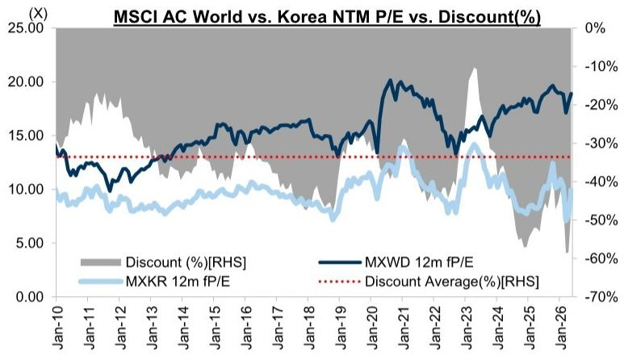

line chart

| Date   | MXWD 12m fP/E | MXKR 12m fP/E | Discount (%) [RHS] | Discount Average (%) [RHS] |
|--------|---------------|---------------|--------------------|----------------------------|
| Jan-10 | ~13.5         | ~9.5          | ~13%               | -30%                       |
| Jan-11 | ~12.5         | ~8.5          | ~13%               | -30%                       |
| Jan-12 | ~11.5         | ~8.0          | ~13%               | -30%                       |
| Jan-13 | ~12.0         | ~7.5          | ~13%               | -30%                       |
| Jan-14 | ~13.0         | ~7.0          | ~13%               | -30%                       |
| Jan-15 | ~14.0         | ~6.5          | ~13%               | -30%                       |
| Jan-16 | ~15.0         | ~6.0          | ~13%               | -30%                       |
| Jan-17 | ~15.5         | ~5.5          | ~13%               | -30%                       |
| Jan-18 | ~16.0         | ~5.0          | ~13%               | -30%                       |
| Jan-19 | ~15.5         | ~4.5          | ~13%               | -30%                       |
| Jan-20 | ~17.0         | ~4.0          | ~13%               | -30%                       |
| Jan-21 | ~20.0         | ~3.5          | ~13%               | -30%                       |
| Jan-22 | ~18.0         | ~3.0          | ~13%               | -30%                       |
| Jan-23 | ~16.0         | ~2.5          | ~13%               | -30%                       |
| Jan-24 | ~17.0         | ~2.0          | ~13%               | -30%                       |
| Jan-25 | ~18.0         | ~1.5          | ~13%               | -30%                       |
| Jan-26 | ~19.0         | ~1.0          | ~13%               | -30%                       |

Source: FactSet, MSCI, GS Global Investment Research

Exhibit 29: MXKR valuation discount relative to MXAPJ NTM P/E  
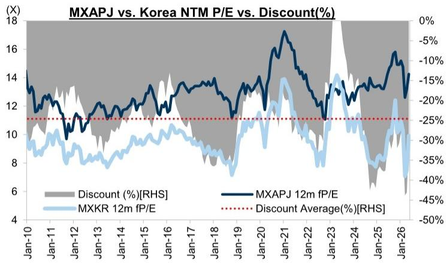

line chart

| Date   | MXAPJ 12m fP/E | MXKR 12m fP/E | Discount (%) |
|--------|----------------|---------------|--------------|
| Jan-10 | ~14            | ~9            | ~-25%        |
| Jan-11 | ~13            | ~8            | ~-25%        |
| Jan-12 | ~12            | ~7            | ~-25%        |
| Jan-13 | ~13            | ~8            | ~-25%        |
| Jan-14 | ~13            | ~9            | ~-25%        |
| Jan-15 | ~13            | ~10           | ~-25%        |
| Jan-16 | ~13            | ~9            | ~-25%        |
| Jan-17 | ~13            | ~8            | ~-25%        |
| Jan-18 | ~13            | ~7            | ~-25%        |
| Jan-19 | ~13            | ~6            | ~-25%        |
| Jan-20 | ~14            | ~7            | ~-25%        |
| Jan-21 | ~17            | ~10           | ~-25%        |
| Jan-22 | ~13            | ~8            | ~-25%        |
| Jan-23 | ~13            | ~7            | ~-25%        |
| Jan-24 | ~13            | ~6            | ~-25%        |
| Jan-25 | ~14            | ~7            | ~-25%        |
| Jan-26 | ~14            | ~6            | ~-25%        |

Source: FactSet, MSCI, GS Global Investment Research

Exhibit 30: NTM P/E Valuation Discount vs. 10-year History by Sector

<table><tr><td colspan="5">NTM P/E Valuation Discount vs. 10-Year History</td></tr><tr><td rowspan="2"></td><td colspan="2">Current</td><td colspan="2">Z-Score</td></tr><tr><td>vs. MXWD</td><td>vs. MXAPJ</td><td>vs. MXWD</td><td>vs. MXAPJ</td></tr><tr><td>Energy</td><td>-18%</td><td>-8%</td><td>-0.10</td><td>-0.08</td></tr><tr><td>Materials</td><td>16%</td><td>14%</td><td>2.31</td><td>1.55</td></tr><tr><td>Industrials</td><td>-38%</td><td>-18%</td><td>-0.49</td><td>-0.79</td></tr><tr><td>Consumer Discretionary</td><td>-49%</td><td>-25%</td><td>1.08</td><td>3.10</td></tr><tr><td>Consumer Staples</td><td>-9%</td><td>-7%</td><td>0.88</td><td>1.70</td></tr><tr><td>Health Care</td><td>88%</td><td>42%</td><td>-1.20</td><td>-0.58</td></tr><tr><td>Financials</td><td>-34%</td><td>-25%</td><td>1.11</td><td>1.29</td></tr><tr><td>Information Technology</td><td>-72%</td><td>-56%</td><td>-1.14</td><td>-1.12</td></tr><tr><td>Communication Services</td><td>-26%</td><td>14%</td><td>-0.99</td><td>0.93</td></tr><tr><td>Utilities</td><td>-</td><td>-</td><td>-</td><td>-</td></tr><tr><td>MXKR</td><td>-59%</td><td>-46%</td><td>-2.11</td><td>-1.98</td></tr></table>

Source: FactSet, MSCI, GS Global Investment Research

Exhibit 31: P/B Valuation Discount vs. 10-year History by Sector

<table><tr><td colspan="5">P/B Valuation Discount vs. 10-Year History</td></tr><tr><td rowspan="2"></td><td colspan="2">Current</td><td colspan="2">Z-Score</td></tr><tr><td>vs. MXWD</td><td>vs. MXAPJ</td><td>vs. MXWD</td><td>vs. MXAPJ</td></tr><tr><td>Energy</td><td>-35%</td><td>4%</td><td>0.31</td><td>1.85</td></tr><tr><td>Materials</td><td>-74%</td><td>-71%</td><td>-1.71</td><td>-1.82</td></tr><tr><td>Industrials</td><td>-19%</td><td>52%</td><td>4.70</td><td>4.08</td></tr><tr><td>Consumer Discretionary</td><td>-70%</td><td>-45%</td><td>2.08</td><td>3.11</td></tr><tr><td>Consumer Staples</td><td>-36%</td><td>-16%</td><td>1.52</td><td>1.70</td></tr><tr><td>Health Care</td><td>-6%</td><td>22%</td><td>-1.07</td><td>-0.09</td></tr><tr><td>Financials</td><td>-45%</td><td>-26%</td><td>1.40</td><td>4.13</td></tr><tr><td>Information Technology</td><td>-46%</td><td>-12%</td><td>3.35</td><td>3.73</td></tr><tr><td>Communication Services</td><td>-71%</td><td>-48%</td><td>-1.43</td><td>-0.58</td></tr><tr><td>Utilities</td><td>-76%</td><td>-68%</td><td>0.70</td><td>1.09</td></tr><tr><td>MXKR</td><td>-11%</td><td>32%</td><td>6.25</td><td>8.35</td></tr></table>

Source: FactSet, MSCI, GS Global Investment Research

## Flows

Exhibit 32: 2025 & 2026 year-to-date KOSPI purchase by investor type  
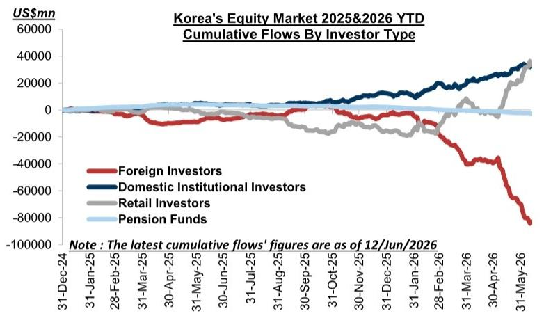

line chart

| Date       | Foreign Investors | Domestic Institutional Investors | Retail Investors | Pension Funds |
|------------|-------------------|----------------------------------|------------------|---------------|
| 31-Dec-24  | ~0                | ~0                               | ~0               | ~0            |
| 31-Jan-25  | ~0                | ~0                               | ~0               | ~0            |
| 28-Feb-25  | ~0                | ~0                               | ~0               | ~0            |
| 31-Mar-25  | ~-10000           | ~0                               | ~0               | ~0            |
| 30-Apr-25  | ~-15000           | ~0                               | ~0               | ~0            |
| 31-May-25  | ~-20000           | ~0                               | ~0               | ~0            |
| 30-Jun-25  | ~-25000           | ~0                               | ~0               | ~0            |
| 31-Jul-25  | ~-30000           | ~0                               | ~0               | ~0            |
| 31-Aug-25  | ~-35000           | ~0                               | ~0               | ~0            |
| 30-Sep-25  | ~-40000           | ~0                               | ~0               | ~0            |
| 31-Oct-25  | ~-45000           | ~0                               | ~0               | ~0            |
| 30-Nov-25  | ~-50000           | ~0                               | ~0               | ~0            |
| 31-Dec-25  | ~-55000           | ~0                               | ~0               | ~0            |
| 31-Jan-26  | ~-60000           | ~0                               | ~0               | ~0            |
| 28-Feb-26  | ~-70000           | ~10,000                          | ~5,000           | ~0            |
| 31-Mar-26  | ~-80,000          | ~20,000                          | ~15,000          | ~0            |
| 30-Apr-26  | ~-90,000          | ~30,000                          | ~25,000          | ~0            |
| 31-May-26  | ~-1,0,0           | ~45,000                          | ~45,000          | ~-5,0         |

Source: Quantiwise, GS Global Investment Research

Exhibit 33: KOSPI net equity transactions by investor type (KRW bn)

<table><tr><td rowspan="2"></td><td colspan="4">Weekly</td></tr><tr><td>May 15 - May 22</td><td>May 22 - May 29</td><td>May 29 - Jun 05</td><td>Jun 05 - Jun 12</td></tr><tr><td>Financial Institutions</td><td>6,314</td><td>2,131</td><td>2,533</td><td>83</td></tr><tr><td>- Banks</td><td>(20)</td><td>(60)</td><td>(28)</td><td>11</td></tr><tr><td>- Securities</td><td>6,104</td><td>2,851</td><td>3,533</td><td>(733)</td></tr><tr><td>- Insurance</td><td>(129)</td><td>(563)</td><td>(381)</td><td>22</td></tr><tr><td>- Investment trusts</td><td>322</td><td>368</td><td>47</td><td>1,368</td></tr><tr><td>- Pension funds</td><td>(500)</td><td>(446)</td><td>(70)</td><td>(677)</td></tr><tr><td>- Other financial institutions</td><td>38</td><td>(27)</td><td>20</td><td>6</td></tr><tr><td>- PEF</td><td>500</td><td>8</td><td>(588)</td><td>87</td></tr><tr><td>Foreigners</td><td>(14,495)</td><td>(4,196)</td><td>(18,630)</td><td>(4,400)</td></tr><tr><td>Individuals</td><td>7,939</td><td>2,041</td><td>15,977</td><td>3,803</td></tr><tr><td>Others</td><td>195</td><td>(7)</td><td>45</td><td>480</td></tr><tr><td>(YTD)</td><td></td><td></td><td></td><td></td></tr><tr><td>Financial Institutions</td><td>27,078</td><td>29,209</td><td>31,741</td><td>31,824</td></tr><tr><td>- Investment trusts</td><td>(3,942)</td><td>(3,574)</td><td>(3,527)</td><td>(2,159)</td></tr><tr><td>- Pension funds</td><td>(6,020)</td><td>(6,466)</td><td>(6,536)</td><td>(7,213)</td></tr><tr><td>Foreigners</td><td>(96,378)</td><td>(100,575)</td><td>(119,205)</td><td>(123,604)</td></tr><tr><td>Individuals</td><td>55,643</td><td>57,684</td><td>73,662</td><td>77,464</td></tr></table>

Source: Quantiwise, GS Global Investment Research

Exhibit 34: Weekly fund flows on sectors by investor type, with relative returns to KOSPI  
KOSPI and sector's relative returns and flow data

<table><tr><td>Sectoral flows by investor type</td><td>Cons</td><td>Leis</td><td>Mach</td><td>F&amp;B</td><td>Util</td><td>Tech</td><td>Ship</td><td>Chem</td><td>Telco</td><td>Retail</td><td>Steel</td><td>Bank</td><td>Ins</td><td>Sec</td><td>Auto</td><td>Soft</td><td>KOSPI</td></tr><tr><td>Rel return to KOSPI (%)</td><td>11.3%</td><td>4.9%</td><td>3.2%</td><td>3.0%</td><td>0.7%</td><td>0.5%</td><td>0.5%</td><td>0.3%</td><td>-0.1%</td><td>-0.6%</td><td>-1.3%</td><td>-2.5%</td><td>-2.9%</td><td>-3.5%</td><td>-4.9%</td><td>-8.0%</td><td>-0.5%</td></tr><tr><td>Foreign Flows / Mkt Cap (bp)</td><td>-5</td><td>34</td><td>-32</td><td>-5</td><td>15</td><td>-4</td><td>-20</td><td>1</td><td>-31</td><td>-6</td><td>19</td><td>-5</td><td>1</td><td>7</td><td>-21</td><td>2</td><td>-7</td></tr><tr><td>Retail Flows / Mkt Cap (bp)</td><td>1</td><td>-23</td><td>-18</td><td>-5</td><td>-21</td><td>13</td><td>12</td><td>-12</td><td>16</td><td>-5</td><td>-11</td><td>-6</td><td>-10</td><td>6</td><td>22</td><td>-7</td><td>6</td></tr><tr><td>Pension Flows / Mkt Cap (bp)</td><td>10</td><td>2</td><td>-2</td><td>1</td><td>1</td><td>-1</td><td>0</td><td>-1</td><td>2</td><td>-1</td><td>-3</td><td>-2</td><td>4</td><td>-12</td><td>-4</td><td>-3</td><td>-1</td></tr><tr><td>Inv Trust Flows / Mkt Cap (bp)</td><td>5</td><td>-22</td><td>62</td><td>9</td><td>-8</td><td>-6</td><td>3</td><td>5</td><td>3</td><td>8</td><td>-3</td><td>8</td><td>-1</td><td>-2</td><td>9</td><td>-1</td><td>2</td></tr><tr><td>Foreign Flows (KRW bn)</td><td>-22</td><td>33</td><td>-433</td><td>-25</td><td>44</td><td>-1687</td><td>-1199</td><td>16</td><td>-132</td><td>-74</td><td>184</td><td>-104</td><td>19</td><td>56</td><td>-623</td><td>19</td><td>-4400</td></tr><tr><td>Retail Flows (KRW bn)</td><td>5</td><td>-22</td><td>-243</td><td>-26</td><td>-64</td><td>5333</td><td>729</td><td>-197</td><td>67</td><td>-67</td><td>-103</td><td>-130</td><td>-133</td><td>48</td><td>657</td><td>-55</td><td>3803</td></tr><tr><td>Pension Flows (KRW bn)</td><td>43</td><td>2</td><td>-24</td><td>3</td><td>4</td><td>-346</td><td>-27</td><td>-17</td><td>9</td><td>-8</td><td>-30</td><td>-33</td><td>58</td><td>-92</td><td>-111</td><td>-28</td><td>-677</td></tr><tr><td>Inv Trust Flows (KRW bn)</td><td>23</td><td>-21</td><td>828</td><td>43</td><td>-24</td><td>-2350</td><td>187</td><td>90</td><td>11</td><td>100</td><td>-28</td><td>155</td><td>-19</td><td>-17</td><td>276</td><td>-12</td><td>1368</td></tr></table>

Source: Quantiwise, Korea Exchange, GS Global Investment Research

Exhibit 35: KOSPI sectors, ranked by foreign ownership as a % of total market value  
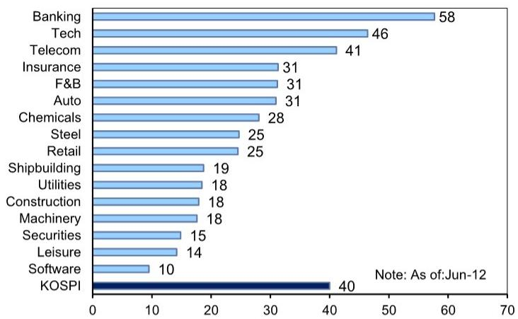

bar chart

| Sector | Value |
| :--- | :--- |
| Banking | 58 |
| Tech | 46 |
| Telecom | 41 |
| Insurance | 31 |
| F&B | 31 |
| Auto | 31 |
| Chemicals | 28 |
| Steel | 25 |
| Retail | 25 |
| Shipbuilding | 19 |
| Utilities | 18 |
| Construction | 18 |
| Machinery | 18 |
| Securities | 15 |
| Leisure | 14 |
| Software | 10 |
| KOSPI | 40 |
Note: As of: Jun-12

Source: Korea Exchange, Quantiwise

Exhibit 36: KOSPI sectors ranked by foreign ownership % change  
Absolute ownership % (market value) changes  
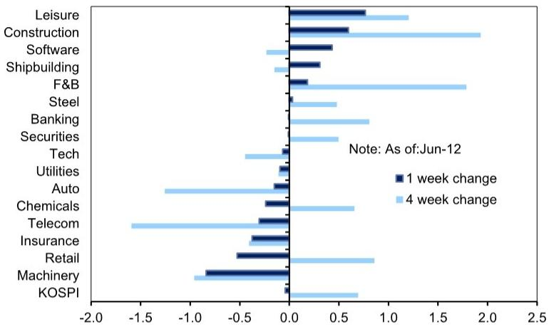

bar chart

| Sector | 1 week change (%) | 4 week change (%) |
| :--- | :--- | :--- |
| Leisure | 0.75 | 1.2 |
| Construction | 0.65 | 1.9 |
| Software | 0.4 | -0.3 |
| Shipbuilding | 0.3 | -0.2 |
| F&B | 0.2 | 1.8 |
| Steel | -0.05 | 0.5 |
| Banking | -0.02 | 0.8 |
| Securities | -0.01 | 0.4 |
| Tech | -0.1 | -0.4 |
| Utilities | -0.15 | -0.1 |
| Auto | -0.2 | -1.2 |
| Chemicals | -0.3 | 0.7 |
| Telecom | -0.35 | -1.6 |
| Insurance | -0.4 | -0.3 |
| Retail | -0.55 | 0.9 |
| Machinery | -0.75 | -0.9 |
| KOSPI | -0.05 | 0.7 |

Source: Korea Exchange, Quantiwise

Exhibit 37: Equity net weekly flows  
(Week ending on Thursday due to data availability)  
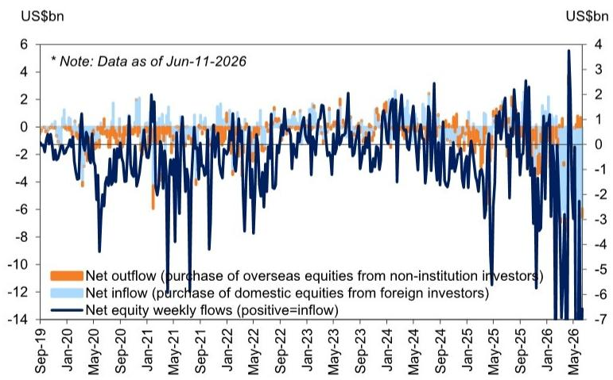

line chart

| Date    | Net outflow (purchase of overseas equities from non-institution investors) | Net inflow (purchase of domestic equities from foreign investors) | Net equity weekly flows (positive=inflow) |
|---------|------------------------------------------------------------------------|---------------------------------------------------------------|------------------------------------------|
| Sep-19  | 0                                                                      | 0                                                             | 0                                        |
| Jan-20  | 0                                                                      | 0                                                             | 0                                        |
| May-20  | 0                                                                      | 0                                                             | 0                                        |
| Sep-20  | 0                                                                      | 0                                                             | 0                                        |
| Jan-21  | 0                                                                      | 0                                                             | 0                                        |
| May-21  | 0                                                                      | 0                                                             | 0                                        |
| Sep-21  | 0                                                                      | 0                                                             | 0                                        |
| Jan-22  | 0                                                                      | 0                                                             | 0                                        |
| May-22  | 0                                                                      | 0                                                             | 0                                        |
| Sep-22  | 0                                                                      | 0                                                             | 0                                        |
| Jan-23  | 0                                                                      | 0                                                             | 0                                        |
| May-23  | 0                                                                      | 0                                                             | 0                                        |
| Sep-23  | 0                                                                      | 0                                                             | 0                                        |
| Jan-24  | 0                                                                      | 0                                                             | 0                                        |
| May-24  | 0                                                                      | 0                                                             | 0                                        |
| Sep-24  | 0                                                                      | 0                                                             | 0                                        |
| Jan-25  | 0                                                                      | 0                                                             | 0                                        |
| May-25  | 0                                                                      | 0                                                             | 0                                        |
| Sep-25  | 0                                                                      | 0                                                             | 0                                        |
| Jan-26  | 0                                                                      | 0                                                             | 0                                        |
| May-26  | 0                                                                      | 0                                                             | 0                                        |

Source: KSD, Quantiwise, Haver, GS Global Investment Research

Exhibit 38: 12-month forward D/Y for KOSPI and Korea Treasury bond yield  
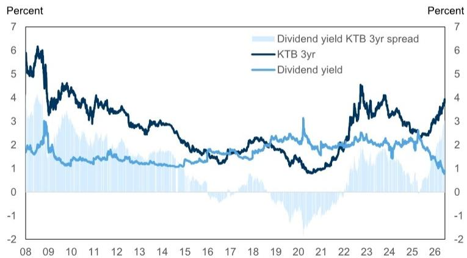

line chart

| Year | Dividend yield KTB 3yr spread | KTB 3yr | Dividend yield |
|------|-------------------------------|---------|----------------|
| 08   | ~5.5%                         | ~6.0%   | ~1.8%          |
| 09   | ~4.5%                         | ~5.5%   | ~1.5%          |
| 10   | ~4.0%                         | ~5.0%   | ~1.3%          |
| 11   | ~3.5%                         | ~4.5%   | ~1.2%          |
| 12   | ~3.0%                         | ~4.0%   | ~1.1%          |
| 13   | ~2.5%                         | ~3.5%   | ~1.0%          |
| 14   | ~2.0%                         | ~3.0%   | ~0.9%          |
| 15   | ~1.5%                         | ~2.5%   | ~0.8%          |
| 16   | ~1.0%                         | ~2.0%   | ~0.7%          |
| 17   | ~0.5%                         | ~1.5%   | ~0.6%          |
| 18   | ~0.0%                         | ~1.0%   | ~0.5%          |
| 19   | ~-0.5%                        | ~0.5%   | ~0.4%          |
| 20   | ~-1.0%                        | ~0.0%   | ~0.3%          |
| 21   | ~-0.5%                        | ~0.5%   | ~0.4%          |
| 22   | ~1.0%                         | ~1.0%   | ~0.5%          |
| 23   | ~1.5%                         | ~1.5%   | ~0.6%          |
| 24   | ~2.0%                         | ~2.0%   | ~0.7%          |
| 25   | ~2.5%                         | ~2.5%   | ~0.8%          |
| 26   | ~3.0%                         | ~3.0%   | ~0.9%          |

Source: Bloomberg, GS Global Investment Research

## Currency, rates and commodities

Exhibit 39: Currency, rates and commodities  
Sectoral flows by investor type

<table><tr><td rowspan="2">Currency</td><td rowspan="2">Bloomberg Ticker</td><td rowspan="2">Current</td><td colspan="4">Price Change (%)</td></tr><tr><td>1-wk</td><td>1-mo</td><td>3-mo</td><td>YTD</td></tr><tr><td>US Dollar/ Korean Won</td><td>USDKRW</td><td>1,515</td><td>(2.8)</td><td>1.8</td><td>1.8</td><td>5.2</td></tr><tr><td>US Dollar/ Korean Won - 3M NDF</td><td>KWN+3M</td><td>1,512</td><td>(2.9)</td><td>1.7</td><td>1.5</td><td>5.3</td></tr><tr><td>US Dollar/ Korean Won - 6M NDF</td><td>KWN+6M</td><td>1,509</td><td>(2.9)</td><td>1.7</td><td>1.6</td><td>5.4</td></tr><tr><td>US Dollar/ Korean Won - 12M NDF</td><td>KWN+12M</td><td>1,504</td><td>(3.0)</td><td>1.8</td><td>1.8</td><td>5.6</td></tr><tr><td>Japanese Yen / Korean Won</td><td>JPYKRW</td><td>9.47</td><td>(2.6)</td><td>0.4</td><td>1.4</td><td>2.7</td></tr><tr><td>Euro/ Korean Won</td><td>EURKRW</td><td>1,756</td><td>(2.3)</td><td>0.7</td><td>2.4</td><td>3.6</td></tr><tr><td>Chinese Yuan/ Korean Won</td><td>CNYKRW</td><td>224.1</td><td>(2.4)</td><td>2.2</td><td>3.6</td><td>8.4</td></tr><tr><td>Euro/ US Dollar</td><td>EURUSD</td><td>1.159</td><td>0.6</td><td>(1.1)</td><td>0.7</td><td>(1.3)</td></tr><tr><td>US Dollar/ Chinese Yuan</td><td>USDCNY</td><td>6.761</td><td>(0.4)</td><td>(0.4)</td><td>(1.7)</td><td>(3.3)</td></tr><tr><td>US Dollar/ Japanese Yen</td><td>USDJPY</td><td>160.02</td><td>(0.2)</td><td>1.4</td><td>0.4</td><td>2.1</td></tr></table>

<table><tr><td rowspan="2">Fixed Income</td><td rowspan="2">Bloomberg Ticker</td><td colspan="4">Yield (%)</td></tr><tr><td>Last Close</td><td>-1 wk</td><td>-1 mo</td><td>-3 mo</td></tr><tr><td>Korea 3M CD</td><td>KSDACD3M</td><td>2.92</td><td>2.88</td><td>2.81</td><td>2.83</td></tr><tr><td>Korea Treasury Bond 3yr</td><td>KOTB3YR</td><td>3.81</td><td>3.88</td><td>3.64</td><td>3.27</td></tr><tr><td>Korea Treasury Bond 10yr</td><td>KOTB10YR</td><td>4.20</td><td>4.25</td><td>4.04</td><td>3.65</td></tr></table>

Major Commodity prices

<table><tr><td rowspan="2">Commodity</td><td rowspan="2">Bloomberg Ticker</td><td rowspan="2">Unit</td><td rowspan="2">Crncy</td><td rowspan="2">Last Close</td><td colspan="4">Price Change (%)</td></tr><tr><td>1-wk</td><td>1-mo</td><td>3-mo</td><td>YTD</td></tr><tr><td>Baltic Dry</td><td>BDIY</td><td>N/A</td><td>USD</td><td>2,729</td><td>(10.1)</td><td>(10.9)</td><td>41.7</td><td>45.4</td></tr><tr><td>WTI</td><td>CL1</td><td>per barrel</td><td>USD</td><td>84</td><td>(7.5)</td><td>(17.1)</td><td>(12.6)</td><td>45.8</td></tr><tr><td>Coal</td><td>XAA</td><td>per ton</td><td>USD</td><td>118</td><td>(8.3)</td><td>2.9</td><td>(7.6)</td><td>24.6</td></tr><tr><td>Gold</td><td>GOLDS</td><td>per oz.</td><td>USD</td><td>4,220</td><td>(2.5)</td><td>(10.0)</td><td>(16.9)</td><td>(2.3)</td></tr><tr><td>Aluminum</td><td>LA1</td><td>per ton</td><td>USD</td><td>3,508</td><td>(5.5)</td><td>(3.4)</td><td>0.7</td><td>17.8</td></tr><tr><td>Copper</td><td>LP1</td><td>per ton</td><td>USD</td><td>13,452</td><td>(3.5)</td><td>(3.7)</td><td>3.9</td><td>7.9</td></tr><tr><td>Steel</td><td>STEEL</td><td>per ton</td><td>USD</td><td>3,422</td><td>(0.4)</td><td>6.2</td><td>22.0</td><td>34.5</td></tr><tr><td>Zinc</td><td>LMZSDY</td><td>per ton</td><td>USD</td><td>3,495</td><td>(2.0)</td><td>(0.8)</td><td>6.9</td><td>13.4</td></tr><tr><td>Corn</td><td>C1</td><td>per bushel</td><td>USD</td><td>410</td><td>(1.7)</td><td>(12.1)</td><td>(8.5)</td><td>(6.8)</td></tr><tr><td>Wheat</td><td>W1</td><td>per bushel</td><td>USD</td><td>582</td><td>0.3</td><td>(12.5)</td><td>(1.8)</td><td>14.7</td></tr><tr><td>Soybean</td><td>S1</td><td>cent per bushel</td><td>USD</td><td>1,112</td><td>(0.9)</td><td>(8.5)</td><td>(8.4)</td><td>7.9</td></tr><tr><td>DRAM*</td><td>ISPPDR29</td><td>per chip</td><td>USD</td><td>9.2</td><td>7.8</td><td>22.7</td><td>52.8</td><td>145.3</td></tr><tr><td>DRAM**</td><td>ISPPDR35</td><td>per chip</td><td>USD</td><td>10.0</td><td>6.3</td><td>32.2</td><td>53.8</td><td>117.4</td></tr></table>

Note: We show spot prices for \* DDR3 4Gb 512Mx8 1333/1600MHz and \*\* DDR4 4Gb 542Mx8 2133/2400 MHz  
Source: Bloomberg

Exhibit 40: USDKRW and USDCNY rates  
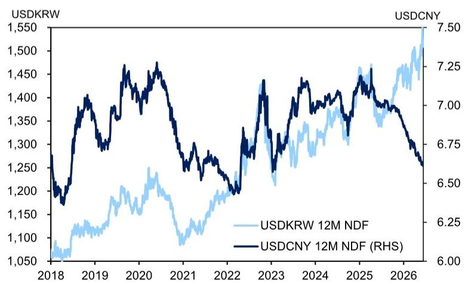

line chart

| Year | USDKRW 12M NDF | USDCNY 12M NDF (RHS) |
|------|-----------------|------------------------|
| 2018 | ~1,050          | ~6.50                  |
| 2019 | ~1,150          | ~7.00                  |
| 2020 | ~1,250          | ~7.25                  |
| 2021 | ~1,100          | ~6.75                  |
| 2022 | ~1,200          | ~6.50                  |
| 2023 | ~1,350          | ~7.00                  |
| 2024 | ~1,400          | ~7.25                  |
| 2025 | ~1,450          | ~7.00                  |
| 2026 | ~1,550          | ~6.75                  |

Source: Bloomberg

Exhibit 41: USDKRW vs. 10 year bond yields differentials between the US and Korea  
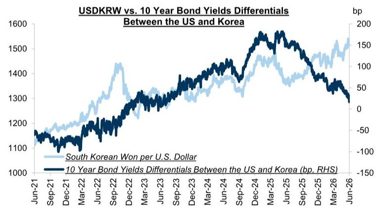

line chart

| Date   | 10 Year Bond Yields Differentials Between the US and Korea (bp) |
|--------|---------------------------------------------------------------|
| Jun-21 | 1150                                                          |
| Sep-21 | 1180                                                          |
| Dec-21 | 1200                                                          |
| Mar-22 | 1250                                                          |
| Jun-22 | 1300                                                          |
| Sep-22 | 1450                                                          |
| Dec-22 | 1350                                                          |
| Mar-23 | 1300                                                          |
| Jun-23 | 1350                                                          |
| Sep-23 | 1400                                                          |
| Dec-23 | 1450                                                          |
| Mar-24 | 1500                                                          |
| Jun-24 | 1550                                                          |
| Sep-24 | 1600                                                          |
| Dec-24 | 1650                                                          |
| Mar-25 | 1700                                                          |
| Jun-25 | 1650                                                          |
| Sep-25 | 1550                                                          |
| Dec-25 | 1450                                                          |
| Mar-26 | 1350                                                          |
| Jun-26 | 1250                                                          |

Source: FactSet, GS Global Investment Research

## Korea ERB, Credit and Market Technicals

Exhibit 42: Korea Equity Risk Barometer  
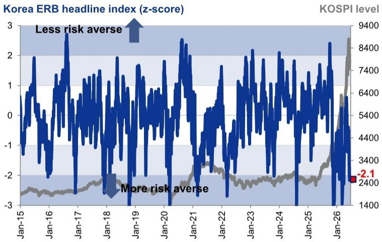

line chart

| Date   | Korea ERB headline index (z-score) | KOSPI level |
|--------|------------------------------------|-------------|
| Jan-26 | -2.1                               | 9400        |

Source: GS Global Investment Research

Exhibit 43: Loans on Margin account balance  
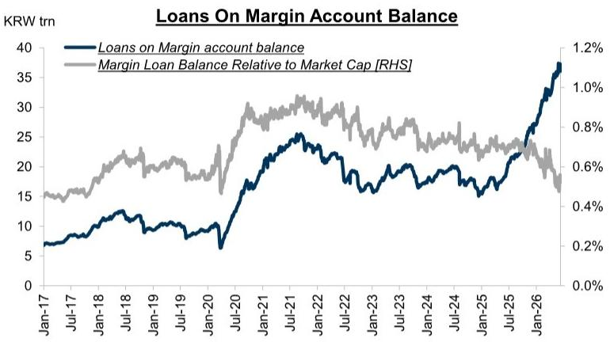

line chart

| Date   | Loans on Margin account balance | Margin Loan Balance Relative to Market Cap [RHS] |
|--------|----------------------------------|--------------------------------------------------|
| Jan-17 | 7                                | 0.4%                                             |
| Jul-17 | 9                                | 0.5%                                             |
| Jan-18 | 11                               | 0.6%                                             |
| Jul-18 | 13                               | 0.7%                                             |
| Jan-19 | 10                               | 0.6%                                             |
| Jul-19 | 9                                | 0.5%                                             |
| Jan-20 | 7                                | 0.4%                                             |
| Jul-20 | 15                               | 0.8%                                             |
| Jan-21 | 25                               | 0.9%                                             |
| Jul-21 | 27                               | 0.8%                                             |
| Jan-22 | 24                               | 0.7%                                             |
| Jul-22 | 20                               | 0.6%                                             |
| Jan-23 | 18                               | 0.5%                                             |
| Jul-23 | 20                               | 0.6%                                             |
| Jan-24 | 19                               | 0.7%                                             |
| Jul-24 | 20                               | 0.8%                                             |
| Jan-25 | 17                               | 0.6%                                             |
| Jul-25 | 22                               | 0.7%                                             |
| Jan-26 | 37                               | 0.9%                                             |

Source: Bloomberg, Korea Financial Investment Association, GS Global Investment Research

Exhibit 44: Korea Volatility Index (VKOSPI)  
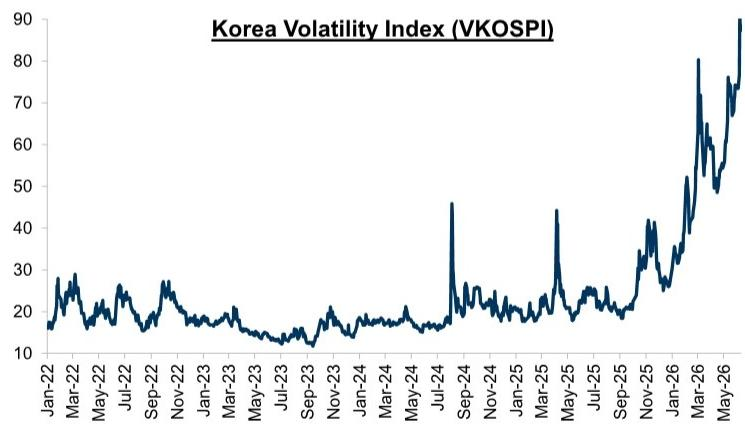

line chart

| Date    | Korea Volatility Index (VKOSPI) |
|---------|----------------------------------|
| Jan-22  | ~15                              |
| Mar-22  | ~28                              |
| May-22  | ~20                              |
| Jul-22  | ~25                              |
| Sep-22  | ~27                              |
| Nov-22  | ~20                              |
| Jan-23  | ~18                              |
| Mar-23  | ~15                              |
| May-23  | ~14                              |
| Jul-23  | ~13                              |
| Sep-23  | ~15                              |
| Nov-23  | ~18                              |
| Jan-24  | ~17                              |
| Mar-24  | ~18                              |
| May-24  | ~17                              |
| Jul-24  | ~45                              |
| Sep-24  | ~25                              |
| Nov-24  | ~20                              |
| Jan-25  | ~20                              |
| Mar-25  | ~45                              |
| May-25  | ~20                              |
| Jul-25  | ~25                              |
| Sep-25  | ~30                              |
| Nov-25  | ~40                              |
| Jan-26  | ~50                              |
| Mar-26  | ~80                              |
| May-26  | ~90                              |

Source: Bloomberg, GS Global Investment Research

Exhibit 45: KOSPI Percent of Members above 200 day moving average  
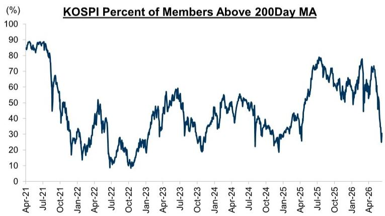

line chart

| Date    | KOSPI Percent of Members Above 200Day MA |
|---------|------------------------------------------|
| Apr-21  | 90                                       |
| Jul-21  | 85                                       |
| Oct-21  | 40                                       |
| Jan-22  | 30                                       |
| Apr-22  | 50                                       |
| Jul-22  | 15                                       |
| Oct-22  | 25                                       |
| Jan-23  | 35                                       |
| Apr-23  | 55                                       |
| Jul-23  | 60                                       |
| Oct-23  | 30                                       |
| Jan-24  | 45                                       |
| Apr-24  | 55                                       |
| Jul-24  | 40                                       |
| Oct-24  | 30                                       |
| Jan-25  | 40                                       |
| Apr-25  | 70                                       |
| Jul-25  | 80                                       |
| Oct-25  | 65                                       |
| Jan-26  | 75                                       |
| Apr-26  | 30                                       |

Source: Bloomberg, GS Global Investment Research

## Disclosure Appendix

## Reg AC

We, Timothy Moe, CFA and John Kwon, hereby certify that all of the views expressed in this report accurately reflect our personal views, which have not been influenced by considerations of the firm's business or client relationships.

Unless otherwise stated, the individuals listed on the cover page of this report are analysts in GS' Global Investment Research division.

Contributing Authors: Timothy Moe, CFA GS (Singapore) Pte, John Kwon GS (Singapore) Pte.

Unless otherwise stated, the individuals listed in the Contributing Authors disclosure of this report are analysts in GS' Global Investment Research division.

## Disclosures

## MSCI disclosure

All MSCI data used in this report is the exclusive property of MSCI, Inc. (MSCI). Without prior written permission of MSCI, this information and any other MSCI intellectual property may not be reproduced or redisseminated in any form and may not be used to create any financial instruments or products or any indices. This information is provided on an “as is” basis, and the user of this information assumes the entire risk of any use made of this information. Neither MSCI, any of its affiliates nor any third party involved in, or related to, computing or compiling the data makes any express or implied warranties or representations with respect to this information (or the results to be obtained by the use thereof), and MSCI, its affiliates and any such third party hereby expressly disclaim all warranties of originality, accuracy, completeness, merchantability or fitness for a particular purpose with respect to any of this information. Without limiting any of the foregoing, in no event shall MSCI, any of its affiliates or any third party involved in, or related to, computing or compiling the data have any liability for any direct, indirect, special, punitive, consequential or any other damages (including lost profits) even if notified of the possibility of such damages. MSCI and the MSCI indexes are service marks of MSCI and its affiliates. The Global Industry Classification Standard (GICS) were developed by and is the exclusive property of MSCI and Standard & Poor’s. GICS is a service mark of MSCI and S&P and has been licensed for use by The GS Group, Inc.

## Basket disclosure

The ability to trade the basket(s) in this report will depend upon market conditions, including liquidity and borrow constraints at the time of trade.

## Regulatory disclosures

## Disclosures required by United States laws and regulations

See company-specific regulatory disclosures above for any of the following disclosures required as to companies referred to in this report: manager or co-manager in a pending transaction; 1% or other ownership; compensation for certain services; types of client relationships; managed/co-managed public offerings in prior periods; directorships; for equity securities, market making and/or specialist role. GS trades or may trade as a principal in debt securities (or in related derivatives) of issuers discussed in this report.

The following are additional required disclosures: Ownership and material conflicts of interest: GS policy prohibits its analysts, professionals reporting to analysts and members of their households from owning securities of any company in the analyst's area of coverage. Analyst compensation: Analysts are paid in part based on the profitability of GS, which includes investment banking revenues. Analyst as officer or director: GS policy generally prohibits its analysts, persons reporting to analysts or members of their households from serving as an officer, director or advisor of any company in the analyst's area of coverage. Non-U.S. Analysts: Non-U.S. analysts may not be associated persons of GS & Co. LLC and therefore may not be subject to FINRA Rule 2241 or FINRA Rule 2242 restrictions on communications with a subject company, public appearances and trading in securities covered by the analysts.

## Additional disclosures required under the laws and regulations of jurisdictions other than the United States

The following disclosures are those required by the jurisdiction indicated, except to the extent already made above pursuant to United States laws and regulations. Australia: GS Australia Pty Ltd and its affiliates are not authorised deposit-taking institutions (as that term is defined in the Banking Act 1959 (Cth)) in Australia and do not provide banking services, nor carry on a banking business, in Australia. This research, and any access to it, is intended only for “wholesale clients” within the meaning of the Australian Corporations Act, unless otherwise agreed by GS. In producing research reports, members of Global Investment Research of GS Australia may attend site visits and other meetings hosted by the companies and other entities which are the subject of its research reports. In some instances the costs of such site visits or meetings may be met in part or in whole by the issuers concerned if GS Australia considers it is appropriate and reasonable in the specific circumstances relating to the site visit or meeting. To the extent that the contents of this document contains any financial product advice, it is general advice only and has been prepared by GS without taking into account a client’s objectives, financial situation or needs. A client should, before acting on any such advice, consider the appropriateness of the advice having regard to the client’s own objectives, financial situation and needs. A copy of certain GS Australia and New Zealand disclosure of interests and a copy of GS’ Australian Sell-Side Research Independence Policy Statement are available at: https://www.goldmansachs.com/disclosures/australia-new-zealand/index.html. Brazil: Disclosure information in relation to CVM Resolution n. 20 is available at https://www.gs.com/worldwide/brazil/area/gir/index.html. Where applicable, the Brazil-registered analyst primarily responsible for the content of this research report, as defined in Article 20 of CVM Resolution n. 20, is the first author named at the beginning of this report, unless indicated otherwise at the end of the text. Canada: This information is being provided to you for information purposes only and is not, and under no circumstances should be construed as, an advertisement, offering or solicitation by GS & Co. LLC for purchasers of securities in Canada to trade in any Canadian security. GS & Co. LLC is not registered as a dealer in any jurisdiction in Canada under applicable Canadian securities laws and generally is not permitted to trade in Canadian securities and may be prohibited from selling certain securities and products in certain jurisdictions in Canada. If you wish to trade in any Canadian securities or other products in Canada please contact GS Canada Inc., an affiliate of The GS Group Inc., or another registered Canadian dealer. Hong Kong: Further information on the securities of covered companies referred to in this research may be obtained on request from GS (Asia) L.L.C. India: Further information on the subject company or companies referred to in this research may be obtained from GS (India) Securities Private Limited, Research Analyst - SEBI Registration Number INH000001493, 10th Floor, Ascent-Worli, Sudam Kalu Ahire Marg, Worli, Mumbai-400 025, India, Corporate Identity Number U74140MH2006FTC160634, Phone +91 22 6616 9000, Fax +91 22 6616 9001. GS may beneficially own $1\%$ or more of the securities (as such term is defined in clause 2 (h) the Indian Securities Contracts (Regulation) Act, 1956) of the subject company or companies referred to in this research report. Investment in securities market are subject to market risks. Read all the related documents carefully before investing. Registration granted by SEBI and certification from NISM in no way guarantee performance of the intermediary or provide any assurance of returns to investors. GS (India) Securities Private Limited compliance officer and investor grievance contact details can be found at:

https://www.goldmansachs.com/worldwide/india/documents/Grievance-Redressal-and-Escalation-Matrix.pdf, and a copy of the annual audit compliance report can be found at this link: https://publishing.gs.com/content/site/india-annual-compliance-report.html. Japan: See below. Korea: This research, and any access to it, is intended only for “professional investors” within the meaning of the Financial Services and Capital Markets Act, unless otherwise agreed by GS. Further information on the subject company or companies referred to in this research may be obtained from GS (Asia) L.L.C., Seoul Branch. New Zealand: GS New Zealand Limited and its affiliates are neither “registered banks” nor “deposit takers” (as defined in the Reserve Bank of New Zealand Act 1989) in New Zealand. This research, and any access to it, is intended for “wholesale clients” (as defined in the Financial Advisers Act 2008) unless otherwise agreed by GS. A copy of certain GS Australia and New Zealand disclosure of interests is available at: https://www.goldmansachs.com/disclosures/australia-new-zealand/index.html. Russia: Research reports distributed in the Russian Federation are not advertising as defined in the Russian legislation, but are information and analysis not having product promotion as their main purpose and do not provide appraisal within the meaning of the Russian legislation on appraisal activity. Research reports do not constitute a personalized investment recommendation as defined in Russian laws and regulations, are not addressed to a specific client, and are prepared without analyzing the financial circumstances, investment profiles or risk profiles of clients. GS assumes no responsibility for any investment decisions that may be taken by a client or any other person based on this research report. Singapore: GS (Singapore) Pte. (Company Number: 198602165W), which is regulated by the Monetary Authority of Singapore, accepts legal responsibility for this research, and should be contacted with respect to any matters arising from, or in connection with, this research. Taiwan: This material is for reference only and must not be reprinted without permission. Investors should carefully consider their own investment risk. Investment results are the responsibility of the individual investor. United Kingdom: Persons who would be categorized as retail clients in the United Kingdom, as such term is defined in the rules of the Financial Conduct Authority, should read this research in conjunction with prior GS on the covered companies referred to herein and should refer to the risk warnings that have been sent to them by GS International. A copy of these risks warnings, and a glossary of certain financial terms used in this report, are available from GS International on request.

European Union and United Kingdom: Disclosure information in relation to Article 6 (2) of the European Commission Delegated Regulation (EU) (2016/958) supplementing Regulation (EU) No 596/2014 of the European Parliament and of the Council (including as that Delegated Regulation is implemented into United Kingdom domestic law and regulation following the United Kingdom's departure from the European Union and the European Economic Area) with regard to regulatory technical standards for the technical arrangements for objective presentation of investment recommendations or other information recommending or suggesting an investment strategy and for disclosure of particular interests or indications of conflicts of interest is available at https://www.gs.com/disclosures/europeanpolicy.html which states the European Policy for Managing Conflicts of Interest in Connection with Investment Research.

Japan: GS Japan Co., Ltd. is a Financial Instrument Dealer registered with the Kanto Financial Bureau under registration number Kinsho 69, and a member of Japan Securities Dealers Association, Financial Futures Association of Japan Type II Financial Instruments Firms Association, and Investment Management Association of Japan. Sales and purchase of equities are subject to commission pre-determined with clients plus consumption tax. See company-specific disclosures as to any applicable disclosures required by Japanese stock exchanges, the Japanese Securities Dealers Association or the Japanese Securities Finance Company.

## Global product; distributing entities

GS Global Investment Research produces and distributes research products for clients of GS on a global basis. Analysts based in GS offices around the world produce research on industries and companies, and research on macroeconomics, currencies, commodities and portfolio strategy. This research is disseminated in Australia by GS Australia Pty Ltd (ABN 21 006 797 897); in Brazil by GS do Brasil Corretora de Títulos e Valores Mobiliários S.A.; Public Communication Channel GS Brazil: 0800 727 5764 and / or contatogoldmanbrasil@gs.com. Available Weekdays (except holidays), from 9am to 6pm. Canal de Comunicação com o Público GS Brasil: 0800 727 5764 e/ou contatogoldmanbrasil@gs.com. Horário de funcionamento: segunda-feira à sexta-feira (exceto feriados), das 9h às 18h; in Canada by GS & Co. LLC; in Hong Kong by GS (Asia) L.L.C.; in India by GS (India) Securities Private Ltd.; in Japan by GS Japan Co., Ltd.; in the Republic of Korea by GS (Asia) L.L.C., Seoul Branch; in New Zealand by GS New Zealand Limited; in Russia by OOO GS; in Singapore by GS (Singapore) Pte. (Company Number: 198602165W); and in the United States of America by GS & Co. LLC. GS International has approved this research in connection with its distribution in the United Kingdom.

GS International (“GSI”), authorised by the Prudential Regulation Authority (“PRA”) and regulated by the Financial Conduct Authority (“FCA”) and the PRA, has approved this research in connection with its distribution in the United Kingdom.

European Economic Area: GS Bank Europe SE (“GSBE”) is a credit institution incorporated in Germany and, within the Single Supervisory Mechanism, subject to direct prudential supervision by the European Central Bank and in other respects supervised by German Federal Financial Supervisory Authority (Bundesanstalt für Finanzdienstleistungsaufsicht, BaFin) and Deutsche Bundesbank and disseminates research within the European Economic Area.

## General disclosures

This research is for our clients only. Other than disclosures relating to GS, this research is based on current public information that we consider reliable, but we do not represent it is accurate or complete, and it should not be relied on as such. The information, opinions, estimates and forecasts contained herein are as of the date hereof and are subject to change without prior notification. We seek to update our research as appropriate, but various regulations may prevent us from doing so. Other than certain industry reports published on a periodic basis, the large majority of reports are published at irregular intervals as appropriate in the analyst's judgment.

GS conducts a global full-service, integrated investment banking, investment management, and brokerage business. We have investment banking and other business relationships with a substantial percentage of the companies covered by Global Investment Research. GS & Co. LLC, the United States broker dealer, is a member of SIPC (https://www.sipc.org).

Our salespeople, traders, and other professionals may provide oral or written market commentary or trading strategies to our clients and principal trading desks that reflect opinions that are contrary to the opinions expressed in this research. Our asset management area, principal trading desks and investing businesses may make investment decisions that are inconsistent with the recommendations or views expressed in this research.

We and our affiliates, officers, directors, and employees will from time to time have long or short positions in, act as principal in, and buy or sell, the securities or derivatives, if any, referred to in this research, unless otherwise prohibited by regulation or GS policy.

The views attributed to third party presenters at GS arranged conferences, including individuals from other parts of GS, do not necessarily reflect those of Global Investment Research and are not an official view of GS.

Any third party referenced herein, including any salespeople, traders and other professionals or members of their household, may have positions in the products mentioned that are inconsistent with the views expressed by analysts named in this report.

This research is focused on investment themes across markets, industries and sectors. It does not attempt to distinguish between the prospects or performance of, or provide analysis of, individual companies within any industry or sector we describe.

Any trading recommendation in this research relating to an equity or credit security or securities within an industry or sector is reflective of the investment theme being discussed and is not a recommendation of any such security in isolation.

This research is not an offer to sell or the solicitation of an offer to buy any security in any jurisdiction where such an offer or solicitation would be illegal. It does not constitute a personal recommendation or take into account the particular investment objectives, financial situations, or needs of individual clients. Clients should consider whether any advice or recommendation in this research is suitable for their particular circumstances and, if appropriate, seek professional advice, including tax advice. The price and value of investments referred to in this research and the income from them may fluctuate. Past performance is not a guide to future performance, future returns are not guaranteed, and a loss of original capital may occur. Fluctuations in exchange rates could have adverse effects on the value or price of, or income derived from, certain investments.

Certain transactions, including those involving futures, options, and other derivatives, give rise to substantial risk and are not suitable for all investors. Investors should review current options and futures disclosure documents which are available from GS sales representatives or at https://www.theocc.com/about/publications/character-risks.jsp and https://www.goldmansachs.com/disclosures/cftc\_fcm\_disclosures. Transaction costs may be significant in option strategies calling for multiple purchase and sales of options such as spreads. Supporting documentation will be supplied upon request.

Differing Levels of Service provided by Global Investment Research: The level and types of services provided to you by GS Global Investment Research may vary as compared to that provided to internal and other external clients of GS, depending on various factors including your individual preferences as to the frequency and manner of receiving communication, your risk profile and investment focus and perspective (e.g., marketwide, sector specific, long term, short term), the size and scope of your overall client relationship with GS, and legal and regulatory constraints. As an example, certain clients may request to receive notifications when research on specific securities is published, and certain clients may request that specific data underlying analysts' fundamental analysis available on our internal client websites be delivered to them electronically through data feeds or otherwise. No change to an analyst's fundamental research views (e.g., ratings, price targets, or material changes to earnings estimates for equity securities), will be communicated to any client prior to inclusion of such information in a research report broadly disseminated through electronic publication to our internal client websites or through other means, as necessary, to all clients who are entitled to receive such reports.

All research reports are disseminated and available to all clients simultaneously through electronic publication to our internal client websites. Not all research content is redistributed to our clients or available to third-party aggregators, nor is GS responsible for the redistribution of our research by third party aggregators. For research, models or other data related to one or more securities, markets or asset classes (including related services) that may be available to you, please contact your GS representative or go to https://research.gs.com.

Disclosure information is also available at https://www.gs.com/research/hedge.html or from Research Compliance, 200 West Street, New York, NY 10282.

## © 2026 GS.

You are permitted to store, display, analyze, modify, reformat, and print the information made available to you via this service only for your own use. You may not resell or reverse engineer this information to calculate or develop any index for disclosure and/or marketing or create any other derivative works or commercial product(s), data or offering(s) without the express written consent of GS. You are not permitted to publish, transmit, or otherwise reproduce this information, in whole or in part, in any format to any third party without the express written consent of GS. This foregoing restriction includes, without limitation, using, extracting, downloading or retrieving this information, in whole or in part, to train or finetune a machine learning or artificial intelligence system, or to provide or reproduce this information, in whole or in part, as a prompt or input to any such system.