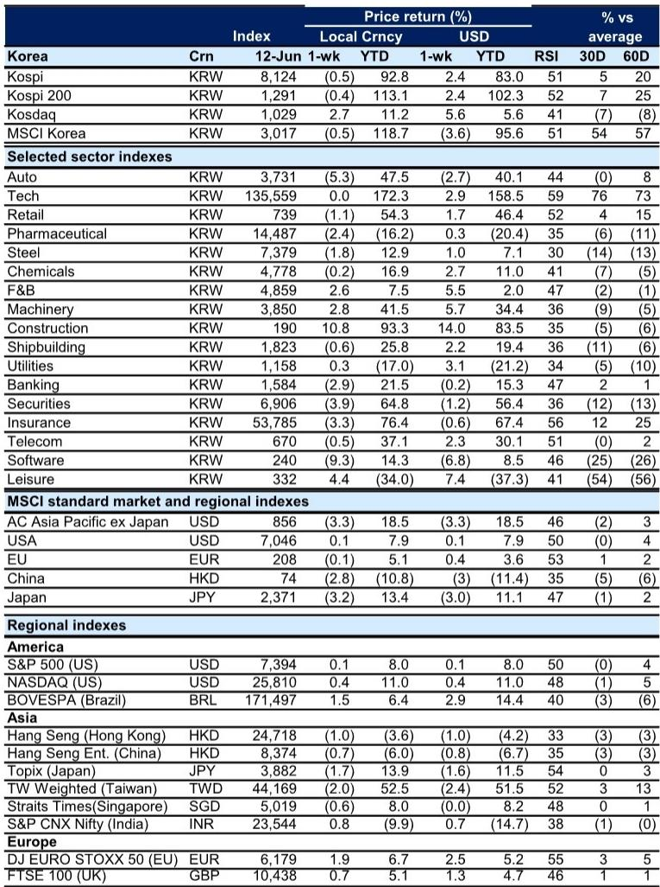
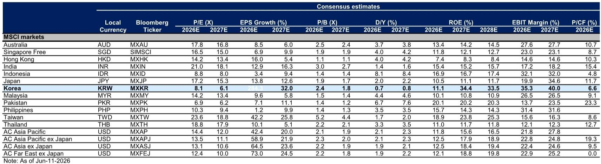
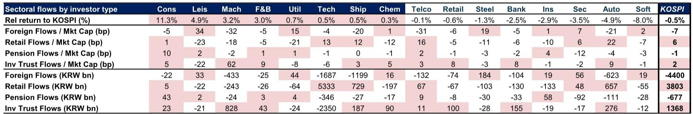

# The KOSDAQ Opportunity Is Not a Valuation Play—It Is a Structural Rotation Signal

The South Korean equity market is sending a rare tactical signal, but it is not the one most investors are watching. While the KOSPI ended the latest week down modestly, dragged by persistent foreign outflows concentrated in the two largest semiconductor stocks, the KOSDAQ index rose 2.7 percent. This divergence matters far beyond a single week's performance. It reveals a deeper structural tension between earnings trajectories, valuation regimes, and capital flows that has been building since August 2023. The controlling insight is this: the tactical opportunity in KOSDAQ is real, but it is not a simple value trade. It is a signal that the market's traditional hierarchy of quality and liquidity is being tested by portfolio rebalancing, sector-specific earnings revisions, and a risk barometer that has slipped further into risk-averse territory.

The Korea Equity Risk Barometer now sits at -2.1, a level that historically has preceded either a sharp defensive rotation or a contrarian recovery opportunity. The KRW strengthened 2.8 percent against the USD this week, adding another layer of complexity for foreign investors who must now weigh currency tailwinds against equity headwinds. The market is not in crisis, but it is in a state of strategic tension. The KOSPI's 12-month forward earnings per share was revised up 1.2 percent, yet the index fell. Foreign investors sold KOSPI equities, driven by outflows from technology and shipbuilding, while simultaneously buying KOSDAQ stocks concentrated in information technology and health care. This is not random noise. It is a deliberate repositioning that deserves careful interpretation.

The report from a global investment bank frames this as a tactical opportunity, but the underlying logic is more profound. The KOSDAQ has significantly underperformed the KOSPI since August 2023, even as its valuations remain more elevated on a 12-month forward price-to-earnings basis. Its earnings revisions have been materially weaker. Yet foreign inflows into KOSDAQ have been stronger year-to-date, while KOSPI has experienced significant outflows driven by portfolio rebalancing related to diversification requirements. This inversion of the traditional relationship between earnings quality and capital flows is the analytical puzzle that demands resolution. The answer, as this article will argue, lies not in valuation mean-reversion but in a structural shift in how foreign capital is being allocated across Korean equity segments.

## The KOSPI Outflow Story Is Not a Korea Story—It Is a Semiconductor Concentration Story

The most important fact about the KOSPI's recent weakness is that it is overwhelmingly a story about two stocks. The report explicitly identifies that the two largest semiconductor stocks account for much of the foreign selling in KOSPI. This is not a broad-based rejection of Korean equities. It is a specific, concentrated rebalancing away from the largest liquid names in the index, driven by portfolio diversification requirements that are likely external to Korea's fundamental outlook.

This distinction is critical for any strategic investor. If the outflow were driven by deteriorating macro fundamentals in Korea, the appropriate response would be to reduce overall exposure. But if the outflow is driven by mechanical portfolio rebalancing—such as index weight adjustments, risk management limits, or sector concentration constraints in global portfolios—then the signal is different. It suggests that the KOSPI's largest names have become victims of their own success, attracting so much foreign capital that they now trigger diversification sell orders when volatility rises.

The implication is that the KOSPI's weakness may be self-limiting. Once the rebalancing pressure on the two semiconductor giants subsides, the rest of the index may stabilize. But the more strategic opportunity lies in the fact that the selling pressure on KOSPI has created a valuation divergence that is not justified by the relative earnings trajectory. KOSPI earnings upgrades have been materially stronger than KOSDAQ's, yet KOSPI's forward P/E is lower. This is not a market that is pricing in a growth premium for KOSPI. It is a market that is pricing in a liquidity premium for KOSDAQ, which is the opposite of what traditional equity analysis would suggest.

## The KOSDAQ Valuation Paradox Is a Signal of Thematic Demand, Not Earnings Confidence

At first glance, the KOSDAQ's valuation profile appears irrational. It has underperformed the KOSPI by a wide margin since August 2023. Its earnings revisions have been considerably weaker. Yet its 12-month forward P/E remains more elevated than the KOSPI's. A naive interpretation would be that KOSDAQ is overvalued and should be sold. But the report's data suggests a more nuanced explanation: foreign inflows into KOSDAQ have been concentrated in information technology and health care, sectors that are thematically aligned with global narratives around artificial intelligence, semiconductor components and equipment, and biotech innovation.

This is not a valuation play. It is a thematic rotation. Foreign investors are not buying KOSDAQ because it is cheap relative to KOSPI. They are buying KOSDAQ because it offers exposure to specific sub-sectors that are not as heavily represented in the KOSPI, or that are more directly tied to global growth narratives. The fact that KOSDAQ's overall earnings revisions are weak masks the reality that certain pockets—particularly semiconductor components and equipment—are attracting capital precisely because they offer thematic alignment with the broader market narrative around AI and advanced manufacturing.

For strategic investors, this means that a simple long-short trade between KOSPI and KOSDAQ based on valuation alone is likely to underperform. The opportunity is more granular. Tactical rotation into KOSDAQ should focus on the sub-sectors where foreign inflows are concentrated and where the thematic narrative is strongest. The report explicitly identifies semiconductor components and equipment as offering alpha opportunities. This is not a blanket endorsement of the entire KOSDAQ index. It is a call for selective, theme-driven allocation within the small-cap and mid-cap segments of the Korean market.

## The Currency Tailwind Complicates the Foreign Investor Calculus

The KRW strengthened 2.8 percent against the USD this week, and also strengthened against the JPY and EUR. For foreign investors, this creates a dual dynamic. On one hand, a stronger won reduces the local-currency return for USD-based investors when they repatriate gains. On the other hand, a strengthening won is often associated with improving investor sentiment toward Korea and can signal reduced geopolitical risk or improving current account dynamics.

The report does not explicitly resolve this tension, but the data provides a framework. The KRW strength coincided with continued foreign outflows from KOSPI and inflows into KOSDAQ. This suggests that the currency move is not driving the equity flows in a uniform direction. Instead, it is likely that the currency is responding to the same underlying factors that are driving the equity rotation: a shift in global portfolio allocations away from the largest, most liquid Korean names and toward more thematic, less concentrated exposures.

For investors considering tactical entry into KOSDAQ, the currency tailwind is a double-edged sword. A stronger won reduces the cost of entry for foreign investors, but it also reduces the potential FX gain if the trend continues. The more important consideration is whether the currency strength is sustainable. If it is driven by improving fundamentals, then it supports the case for a broader recovery in Korean equities. If it is driven by temporary flows or technical factors, then the equity opportunity may be more short-lived. This is one of the open questions that the report does not fully answer, and it is a critical variable for any investor building a position.

## What the Report Does Not Fully Answer: The Sustainability of KOSDAQ Inflows

The report provides compelling evidence of a tactical opportunity in KOSDAQ, but it leaves several meaningful questions unanswered. The most important is whether the foreign inflows into KOSDAQ are sustainable or whether they represent a short-term rotation that will reverse once the rebalancing pressure on KOSPI subsides. The report notes that KOSDAQ's valuations remain elevated relative to KOSPI, even after significant underperformance. If foreign inflows are driven by thematic demand rather than valuation discipline, then they could persist as long as the global narrative around AI, semiconductors, and health care remains intact. But if they are driven by a temporary search for yield or diversification, they could reverse quickly.

A second unresolved question is the role of domestic investors. The report shows that individuals were net buyers of KOSPI and net sellers of KOSDAQ during the week, while institutions showed the opposite pattern. This divergence between domestic and foreign behavior in KOSDAQ is noteworthy. If domestic investors are selling into foreign buying, it could indicate that local participants view KOSDAQ as overvalued and are taking profits. This would be a contrarian signal for foreign investors who are buying. The report does not offer a definitive interpretation of this divergence, but it is a critical input for any decision framework.

A third open question is the trajectory of earnings revisions. KOSPI earnings have been revised up more strongly than KOSDAQ's, but the report also notes that the Chemicals sector saw the strongest upward revisions while Leisure was revised down the most. This suggests that the earnings story is highly sector-specific within both indices. A tactical rotation into KOSDAQ that is based on the overall index could be undermined if the sectors attracting foreign inflows do not deliver the expected earnings growth. The report identifies semiconductor components and equipment as a promising area, but it does not provide detailed earnings forecasts for those sub-sectors. Investors will need to conduct their own bottom-up analysis to confirm the thesis.

## A Decision Framework for Navigating the KOSPI-KOSDAQ Divergence

For investors who are considering acting on this tactical opportunity, a structured decision framework is essential. The first step is to distinguish between the two sources of foreign selling in KOSPI. If the selling is driven by mechanical rebalancing related to diversification requirements, as the report suggests, then it is likely to be time-limited and should not be interpreted as a negative signal for Korean equities broadly. If the selling is driven by fundamental concerns about the semiconductor cycle or Korean macro, then the risk is more systemic.

The second step is to assess the thematic alignment of KOSDAQ sub-sectors with global growth narratives. The report identifies information technology and health care as the primary recipients of foreign inflows. Within technology, semiconductor components and equipment are singled out as offering alpha opportunities. Investors should evaluate whether these sub-sectors have credible earnings catalysts that are independent of the broader KOSDAQ index. If the thematic demand is strong and the earnings trajectory is improving, then the valuation premium may be justified.

The third step is to monitor the Korea Equity Risk Barometer. At -2.1, it is in risk-averse territory. Historically, such levels have been associated with either further downside or a contrarian recovery. The direction of the barometer in the coming weeks will be a key signal. If it continues to fall, it may indicate that the risk-off sentiment is broadening beyond the semiconductor rebalancing. If it stabilizes or rises, it would support the case for tactical entry.

The fourth step is to consider the currency dimension. A strengthening won is generally positive for Korean equities, but it also reduces the FX tailwind for foreign investors. The decision to enter should factor in not just the equity valuation but also the expected path of the KRW. If the won continues to strengthen, the total return for foreign investors could be enhanced. If it reverses, the equity gains could be offset.

The fifth and final step is to decide on the time horizon. The report frames this as a tactical opportunity, which implies a shorter-term horizon of weeks to months. A tactical rotation into KOSDAQ should have a clear exit strategy based on either a target return, a change in the risk barometer, or a reversal of the flow pattern. This is not a buy-and-hold thesis. It is a dynamic allocation that requires active monitoring.

## Join the Community to Read the Full Report and Review the Original Charts

The analysis in this article is based on a detailed weekly report that includes 34 exhibits covering performance, flows, valuations, currency, rates, and the Korea Equity Risk Barometer. The original charts provide critical context that cannot be fully captured in text, including the precise trajectory of KOSPI versus KOSDAQ relative performance since 2016, the divergence in earnings revisions, and the sector-level breakdown of foreign inflows. For investors who want to build their own decision framework, the full report is an essential resource.

The questions that remain unresolved—the sustainability of KOSDAQ inflows, the role of domestic investors, the trajectory of sector-level earnings, and the path of the KRW—are precisely the kinds of analytical challenges that benefit from community discussion and ongoing research. The report is updated weekly, providing a continuous stream of data and analysis that can inform tactical decisions in real time.

*This article is for learning and discussion only and does not constitute investment advice.*

Personal reading notes and learning share only. Not investment advice.

